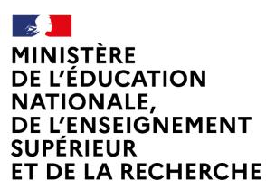

## **Concours externe BAC +3 du CAPET**

### **CAPET-CAFEP**

**Section sciences industrielles de l'ingénieur Option ingénierie électrique**

**Programme de la session 2026**

### **Programme des épreuves d'admissibilité**

Les deux épreuves écrites d'admissibilité porteront en ingénierie électrique sur les thématiques suivantes :

#### **Énergie (électronique de puissance et électrotechnique)**

- Grandeurs électriques, électrocinétique
- Mesurage
- Schématisation électrique
- Régime sinusoïdal (monophasé et triphasé équilibré) : puissance active, réactive.
- Représentation en complexe des grandeurs électrique et des impédances
- Harmoniques réseau, puissance déformante
- Notions de base en électromagnétisme
- Phénomènes thermiques : conduction, convection, rayonnement (analogies thermique/électrique)
- Conversion statique de l'énergie électrique
  - Transformateurs monophasé et triphasé
  - Hacheurs 1, 2 et 4 quadrants
  - Redresseurs monophasé et triphasé, filtrage de puissance
  - Onduleurs monophasé et triphasé
- Mécanique : cinématique (mouvements de translation et rotation), forces, moments, conditions d'équilibre
- Conversion électromécanique
  - Machine à courant continu,
  - Machine synchrone, brushless
  - Machine asynchrone
  - Moteur pas à pas, servomoteurs
- Variation de vitesse et de couple des machines électriques
- Stockage d'énergie électrique
- Systèmes d'énergies renouvelables (éolien, hydraulique, photovoltaïque)
- Production et transport de l'énergie électrique
- Distribution et sécurité électrique, régimes de terre

#### **Électronique (analogique et numérique)**

- Base de l'électricité, électrocinétique
- Méthodologie d'étude des circuits électroniques
- Signaux analogiques
- Composants électroniques (dipôle, diode, transistor, AOP)
- Analyse de circuits en régimes linéaire, en commutation, régimes transitoires
- Régime sinusoïdal, impédances complexes (R, L et C)
- Analyse spectrale de signaux périodiques,
- Fonction de transfert, diagramme de Bode

## **Concours externe BAC +3 du CAPET**

### **CAPET-CAFEP**

**Section sciences industrielles de l'ingénieur Option ingénierie électrique**

#### **Programme de la session 2026**

- Filtres du premier et du second ordres
- Amplification d'un signal
- Génération de signaux
- Numérisation d'un signal analogique et restitution
- Architecture d'une chaine de traitement numérique
- Échantillonnage, Shannon
- CNA et CAN, performances et structures
- Conditionnement des signaux analogiques : amplificateur d''instrumentation, isolation galvanique, adaptation de niveau
- Convertisseurs spécifiques de signaux
- Capteurs
- Systèmes embarqués : architectures et composants numériques de traitement
- Composants programmables FPGA
- Langages de programmation et de description des composants programmables et reconfigurables : VHDL
- Horloges et composants spécialisés pour la synthèse de fréquence
- Modulations numériques
- Transmission en bande de base
- Chaine de transmission et réception numérique sans fil
- Multiplexage fréquentiel
- Propagation guidée (lignes de transmission et fibres optiques)
- Antennes, caractérisation, critères de choix, adaptation d'impédance,
- Filtrage numérique, synthèse
- Instrumentation RF : analyseur de réseau, de spectre, d'impédance pour la caractérisation des éléments d'une chaine RF
- Exposition aux champs électromagnétiques BF et RF

#### **Automatique**

- Analyse des systèmes linéaires
- Modélisation des systèmes linéaire (fonction de transfert)
- Analyses temporelle et/ou fréquentielle des systèmes élémentaires
- Performances des systèmes bouclés (stabilité, précision, rapidité).
- Réglages des correcteurs
- Robustesse
- Correction numérique

#### **Automatisme**

- Numération
- Logique combinatoire
- Logique séquentielle
- Architecture d'un système automatisé
- Automate programmable industriel (constitution, langages de programmation)
- Machine à états
- Interface homme machine (IHM)
- Réseaux numériques locaux industriels

## **Concours externe BAC +3 du CAPET**

### **CAPET-CAFEP**

**Section sciences industrielles de l'ingénieur Option ingénierie électrique**

**Programme de la session 2026**

#### **Informatique**

- Algorithmique
- Base de programmation dans un langage évolué
- Architecture d'une cible (CPU, microcontrôleur, mémoire, bus, périphériques)
- Liaisons séries, I2C, SPI…

# **Programme de l'épreuve d'admission**

L'étude expérimentale portera sur le programme des épreuves écrites d'admissibilité. Le candidat utilisera ses connaissances acquises en licence pour développer et illustrer son exposé.