#### **SESSION 2015**

## **CAPET CONCOURS EXTERNE ET CAFEP**

**Section : SCIENCES INDUSTRIELLES DE L'INGÉNIEUR Option : ARCHITECTURE ET CONSTRUCTION**

**Option : ÉNERGIE**

**Option : INFORMATION ET NUMÉRIQUE Option : INGÉNIERIE MÉCANIQUE**

## **ANALYSE D'UN SYSTÈME PLURITECHNIQUE**

Durée : 4 heures

*Calculatrice électronique de poche – y compris calculatrice programmable, alphanumérique ou à écran graphique – à fonctionnement autonome, non imprimante, autorisée conformément à la circulaire n° 99-186 du 16 novembre 1999.*

*L'usage de tout ouvrage de référence, de tout dictionnaire et de tout autre matériel électronique est rigoureusement interdit.*

*Dans le cas où un(e) candidat(e) repère ce qui lui semble être une erreur d'énoncé, il (elle) le signale très lisiblement sur sa copie, propose la correction et poursuit l'épreuve en conséquence.*

*De même, si cela vous conduit à formuler une ou plusieurs hypothèses, il vous est demandé de la (ou les) mentionner explicitement.*

*NB : La copie que vous rendrez ne devra, conformément au principe d'anonymat, comporter aucun signe distinctif, tel que nom, signature, origine, etc. Si le travail qui vous est demandé comporte notamment la - -

-- - -
-*

### Ce sujet comporte 3 parties :

- dossier de présentation et travail demandé pages 2 à 21;
- documents annexes pages 23 à 30 ;
- document réponse page 32.

## Une lecture préalable et complète du sujet est indispensable.

Le candidat doit répondre aux différentes questions du sujet sur les documents réponses quand cela est demandé, et sur feuilles de copie quand cela n'est pas précisé.

Il lui est rappelé qu'il doit utiliser les notations propres au sujet, présenter clairement les calculs et dégager ou encadrer tous les résultats.

Il sera tenu compte de la présentation de la copie, de la qualité de la rédaction (orthographe et syntaxe), en particulier pour les réponses aux questions ne nécessitant pas de calcul.

Si le sujet (les questions ou les annexes) conduit à formuler une ou plusieurs hypothèses, il est demandé au candidat de la (ou les) mentionner explicitement sur la copie.

## Shelter déployable compatible du transport maritime

#### 1 Mise en situation

Filiale du groupe NEXTER, EURO-SHELTER concrétise 40 ans d'expérience dans la conception et la fabrication de shelters techniques pour une large gamme d'applications civiles et militaires.

Le shelter, mot qui vient de l'anglais et qui désigne un conteneur technique, répond à une des principales exigences opérationnelles des militaires qui est la mobilité. Pour répondre à cette exigence, le shelter peut être amené à être transporté de différentes manières :

- transport routier, y compris sur terrain accidenté;
- transport ferroviaire;
- transport aérien ;
- transport maritime sur porte-conteneurs.

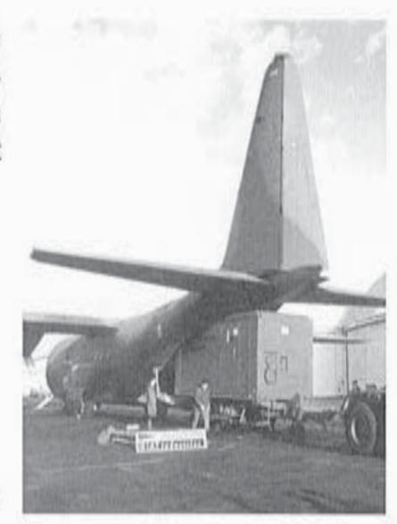

Figure 1 : transport aérien

Sa vocation d'abri conduit à différents types d'emploi au sein des forces armées :

- shelters tactiques (shelter de communication, poste de commandement...);
- shelters de logistique mobile (cuisines, buanderie, atelier de maintenance, stockage de parachutes, shelter déployable);
- shelters de santé mobile (hôpital mobile, clinique).

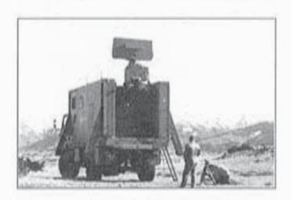

Figure 2 : shelter tactique

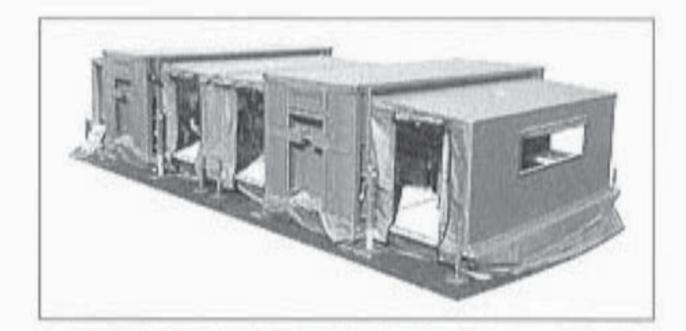

Figure 3 : shelters de logistique mobile

Le shelter assure, dans le même temps, une complète protection du personnel et du matériel embarqué, face aux agressions de l'environnement et du champ de bataille :

- protection climatique (environnements extrêmes);
- protection mécanique (transports tous chemins, aérotransport en particulier);
- protection contre les environnements purement militaires (impulsions électromagnétiques, souffle, flash thermique d'origine nucléaire...).

## Shelter double déployable 20 pieds

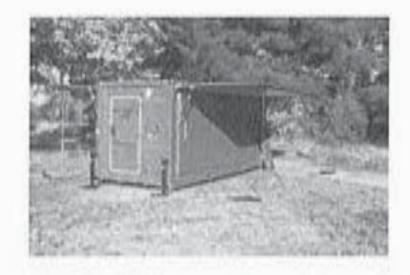

Le shelter double déployable 20 pieds est un shelter modulable qui peut se déployer pour offrir une surface opérationnelle beaucoup plus grande, jusqu'à 31,4 m² au lieu de 12 m², tout en gardant une configuration de stockage ou de transport compacte, conforme au gabarit ISO 20 pieds.

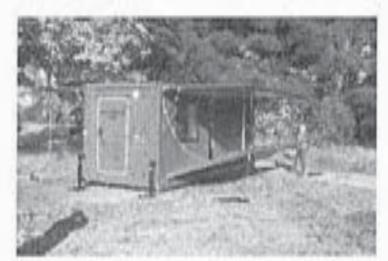

La structure du module fixe est constituée de profilés en aluminium.

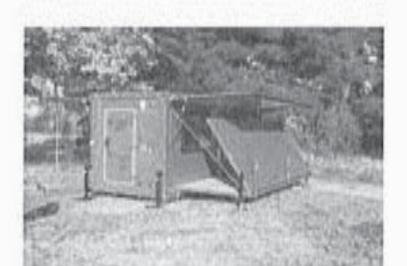

Les parois fixes, à savoir le plancher, deux pignons et le pavillon (termes définis par analogie avec le plancher, les pignons et le toit d'une maison) sont en panneaux sandwich.

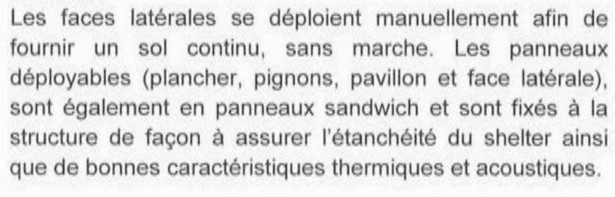

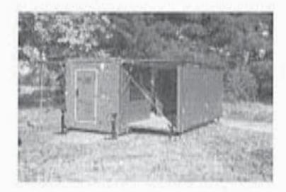

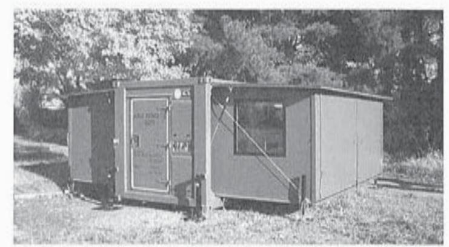

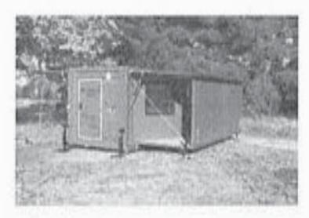

Figure 4 : shelter double déployable 20 pieds Vue extérieure

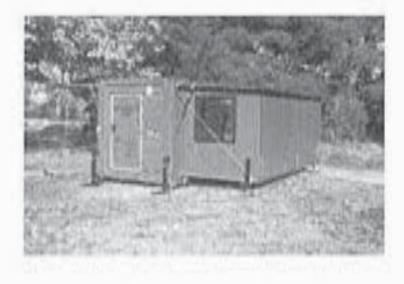

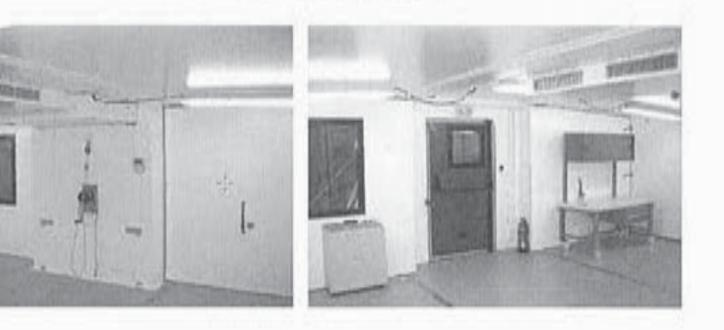

Figure 6 : déploiement d'une face latérale

Figure 5 : shelter double déployable 20 pieds Vues intérieures

#### Panneau sandwich

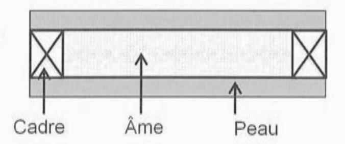

Figure 7 : constitution d'un panneau sandwich

On appelle panneau sandwich, un panneau constitué des parties suivantes :

- une âme ;
- deux peaux ;
- un cadre ou profilé sur le pourtour pour renforcer l'ensemble.

Ces différentes pièces sont assemblées par collage sous une presse. Une telle association fournit un panneau très rigide alors que les composants pris séparément sont flexibles. De plus, les panneaux sont beaucoup plus légers qu'un panneau massif qui aurait la même rigidité.

Les parois du shelter, en panneaux sandwich, sont constituées, au minimum, de deux peaux en aluminium et d'une âme en polystyrène extrudé. Dans certains panneaux, une couche de contreplaqué est ajoutée pour protéger le polystyrène lors des opérations de soudage des panneaux à la structure.

#### La norme 1496-1

Pour répondre aux exigences du transport maritime, le shelter doit être conforme à la norme ISO 1496-1. Cette norme prescrit les spécifications de base et les exigences d'essai à appliquer aux conteneurs ISO (conteneurs d'une largeur de 8 pieds et d'une longueur de 20 pieds, 30 pieds et 40 pieds) convenant aux échanges internationaux et au transport par route, par rail et par mer, et permettant les transbordements entre ces différents modes de transport.

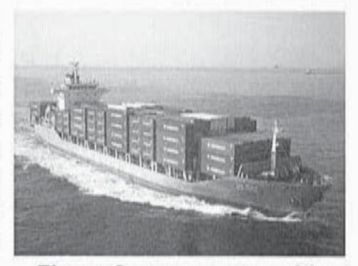

Figure 8: transport maritime

#### Problématique générale du sujet

Cette étude porte sur la reconception d'une structure de shelter logistique double déployable. Initialement en aluminium, cette structure permet de répondre aux exigences de légèreté requises par le transport aérien.

Afin d'élargir son offre commerciale, la société Euro-Shelter décide de conserver le même concept de shelter déployable et de l'adapter pour répondre aux contraintes de transport maritime, plus contraignantes (norme ISO 1496-1).

Profitant de cette phase de reconception, la société Euro-Shelter souhaite également proposer des options complémentaires à ce produit, à savoir la motorisation du système de fermeture des faces latérales, la climatisation de l'espace de travail, une autonomie énergétique et, pour finir, un système de communication entre shelters.

## Aussi, les 5 parties de ce sujet couvriront :

- le dimensionnement de la structure et des panneaux ;
- le dimensionnement de la climatisation ;
- le dimensionnement de la motorisation du système de fermeture des faces latérales;
- la validation du système de communication ;
- le dimensionnement du groupe électrogène.

## Extrait du cahier des charges de reconception

| Exigence | Libellé de l'exigence                                                                                                                                                                                                                                                                                                                                                                              |
|----------|----------------------------------------------------------------------------------------------------------------------------------------------------------------------------------------------------------------------------------------------------------------------------------------------------------------------------------------------------------------------------------------------------|
| 1        | Exigences relatives à la structure                                                                                                                                                                                                                                                                                                                                                                 |
| 1.1      | Le shelter sera conforme à la norme ISO 1496-1 relative au transport maritime :  - la structure du shelter doit pouvoir supporter un empilement de huit autres shelters, de masse unitaire 24 tonnes, avec une accélération de 1,8 g, étant lui-même chargé ;  - le pignon fixe doit supporter une masse uniformément répartie sur l'ensemble de la surface du panneau M = 0,4P, avec P = 7500 kg. |
| 1.2      | Le coefficient de transfert thermique sera tel que : $K_c < 2.1 \mathrm{W \cdot K^{-1} \cdot m^{-2}}$                                                                                                                                                                                                                                                                                              |
| 1.3      | La fermeture de l'ensemble déployable (face latérale et plancher) sera motorisée.                                                                                                                                                                                                                                                                                                                  |

| 2     | Exigences relatives aux équipements                                                                                                                                                                                                                                                                  |
|-------|------------------------------------------------------------------------------------------------------------------------------------------------------------------------------------------------------------------------------------------------------------------------------------------------------|
| 2.1   | Climatisation                                                                                                                                                                                                                                                                                        |
| 2.1.1 | Il sera prévu une climatisation monophasée.                                                                                                                                                                                                                                                          |
| 2.1.2 | La climatisation sera réglable à l'aide d'un thermostat avec réglage manuel.                                                                                                                                                                                                                         |
| 2.1.3 | La climatisation doit pouvoir réaliser une température intérieure de 23 °C et un taux d'humidité relative de 70 % avec une température extérieure de 39 °C et un taux extérieur d'humidité relative de 43 %.                                                                                         |
| 2.1.4 | Le délai nécessaire pour ramener la température de 39 °C, taux extérieur d'humidité relative de 43 %, à 23 °C, taux d'humidité relative de 70 %, doit être inférieur à 15 min, avec une précision de ± 1 °C dans les conditions suivantes :  — renouvellement d'air nul ;  — pas d'apports gratuits. |
| 2.2   | Groupe électrogène                                                                                                                                                                                                                                                                                   |
| 2.2.1 | Le niveau sonore du groupe électrogène ne doit pas excéder 70 dB(A) à 7 m.                                                                                                                                                                                                                           |
| 2.2.2 | Le groupe électrogène sera choisi en prenant en compte les rejets de CO 2 dans l'atmosphère. La quantité journalière de CO 2 rejeté dans l'atmosphère du groupe électrogène doit être inférieure à 42 kg eq CO 2 .                                                  |
| 2.3   | Système de communication                                                                                                                                                                                                                                                                             |
| 2.3.1 | La puissance d'émission doit être supérieure à 5 mW pour une fréquence de 433 MHz.                                                                                                                                                                                                                   |
| 2.3.2 | L'excursion en fréquence sera réglée à 300 kHz.                                                                                                                                                                                                                                                      |

## 2 Dimensionnement de la structure et des panneaux

Objectif: vérifier que la nouvelle structure en acier et les panneaux déployables sont conformes à la norme 1496-1, relative au transport maritime.

### 2.1 Exigences de la norme 1496-1 sur la structure

L'une des exigences les plus dimensionnantes en transport maritime est l'exigence de gerbage : le shelter doit pouvoir supporter un empilement de huit autres shelters, de masse unitaire 24 tonnes, avec une accélération verticale de 1,8 g, étant lui-même chargé.

Les profilés des poteaux sont en acier S355 et ont une section rectangulaire  $300 \times 150 \times 8 \, \text{mm}$ . Le comportement de la structure est modélisé sous RDM6 et les résultats sont consignés en annexe A1.

Données complémentaires pour la question suivante :

| Accélération de la pesanteur     | $g = 10 \text{ m} \cdot \text{s}^{-2}$ |
|----------------------------------|----------------------------------------|
| Limite élastique de l'acier S355 | $R_{\theta} = 355  \text{MPa}$         |

#### Question 1

Justifier la valeur de la force nodale « 864 kN (x 4) » qui apparaît sur la modélisation puis vérifier que l'exigence de gerbage est satisfaite.

### 2.2 Exigences de la norme 1496-1 sur les panneaux

La norme 1496-1 impose aussi des exigences quant à la tenue des panneaux seuls. Ainsi, le pignon fixe doit supporter une masse uniformément répartie sur l'ensemble de la surface du panneau M=0,4P, avec  $P=7500\,\mathrm{kg}$ .

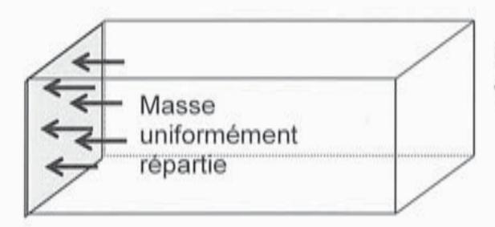

On donne les dimensions du panneau du pignon fixe (voir annexe A2) :

- 
$$L_{pignon} = 1,85 \text{ m}$$
;  
-  $I_{pignon} = 2,2 \text{ m}$ .

Figure 9 : exigence de chargement du pignon fixe

#### Question 2

Calculer la charge répartie (densité surfacique) q (MPa) correspondant à cette exigence.

Des essais au sein de l'entreprise ont permis de valider le modèle suivant : on modélise un morceau de panneau, d'une largeur b = 1 mm, par une poutre simple sur deux appuis,

avec une portée  $I_{appui} = 2 200 \, \text{mm}$  entre appuis correspondant à la plus grande dimension du panneau. Cette poutre est soumise à la charge répartie q.

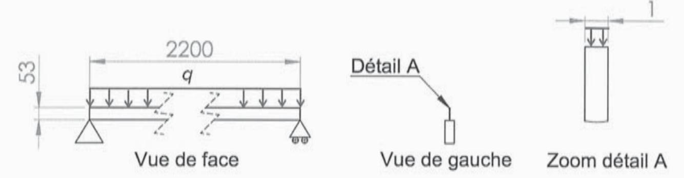

Figure 10 : modélisation de la poutre sandwich

Sous certaines hypothèses, les valeurs maximales des contraintes normales et de cisaillement peuvent être approximées. Considérons une poutre sandwich, de longueur / et de largeur b et constituée de :

- deux peaux, d'épaisseur ep et de module de Young Ep;
- d'une âme d'épaisseur ea et de module de Young Ea.

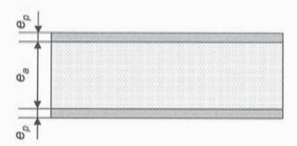

Figure 11: constitution d'une poutre sandwich

Si le panneau est symétrique, si  $e_p << e_a$  et  $E_a << E_p$  , on peut alors approximer :

- la contrainte normale maximale dans les peaux par :  $\sigma_{\max} \approx \frac{M_{fmax}}{be_p e_a}$ ;
- la contrainte de cisaillement maximale dans l'âme par :  $\tau_{\text{max}} \approx \frac{T_{\text{max}}}{be_a}$ .

Le moment fléchissant maximal est noté  $M_{fmax}$  et l'effort tranchant maximal  $T_{max}$ . Données complémentaires pour les questions suivantes :

| Module de Young des peaux (alliage d'aluminium)                                  | $E_p = 70000\text{MPa}$       |
|----------------------------------------------------------------------------------|-------------------------------|
| Module de Young de l'âme (polystyrène extrudé)                                   | $E_a = 200  \text{kPa}$       |
| Contrainte normale maximale admissible par les peaux en alliage d'aluminium      | $\sigma_{max}$ = 150 MPa      |
| Contrainte tangentielle maximale admissible par la mousse de polystyrène extrudé | $\tau_{max}=0,25\mathrm{MPa}$ |

La constitution du panneau du pignon fixe est donnée en annexe A2.

Donner une valeur approchée de la contrainte normale maximale dans les peaux puis de la contrainte tangentielle maximale dans l'âme.

#### Question 4

Conclure quant au respect des deux exigences de la norme 1496-1 étudiées dans cette partie et rappelées ci-dessous, et calculer les coefficients de sécurité :

- exigence de gerbage ;
- exigence de chargement du pignon fixe.

### Dimensionnement de la climatisation

Objectif: choisir un climatiseur répondant aux exigences du cahier des charges et vérifier le respect des exigences de rapidité et de précision de la régulation en température.

#### 3.1 Dimensionnement et choix du climatiseur

| Coefficient de transfert                                                                                  | Avec:                                                                                                                                                                                                                   |
|-----------------------------------------------------------------------------------------------------------|-------------------------------------------------------------------------------------------------------------------------------------------------------------------------------------------------------------------------|
| thermique du shelter : $K_c = \frac{\sum (K_i A_i) + \sum (k_i L_i)}{\sum A_i}$                           | <ul> <li>- Ki, coefficient de transmission surfacique (W⋅K-1⋅m-2);</li> <li>- Ai, surface intérieure de chaque élément (m2);</li> </ul>                          |
|                                                                                                           | <ul> <li>- ki , coefficient de transmission linéique des liaisons d'éléments de la paroi (W·K-1·m-1);</li> <li>- Li , longueur intérieure de chaque élément (m).</li> </ul> |
| Coefficient de transmission surfacique : $\frac{1}{K_i} = \sum \frac{e_i}{\lambda_i} + (R_{si} + R_{se})$ | Avec : $ -e_i \text{ , épaisseur de chaque matériau (m);}                                    $                                                                                                                          |

Les résistances thermiques superficielles intérieures et extérieures sont données pour les conditions limites d'utilisation du shelter :

|                                                                                                                                      | Résistances superfi                | [MRT 17] 전경 한 및 17 (MRT) [2] (MRT 17 (MRT)       |
|--------------------------------------------------------------------------------------------------------------------------------------|---------------------------------------|--------------------------------------------------|
|                                                                                                                                      | intérieure                            | extérieure                                       |
| Conditions limites d'utilisation :  - température extérieure = 39 °C ;  - température intérieure = 23 °C ;  - vitesse de vent nulle. | $R_{si}$ $(m^2 \cdot K \cdot W^{-1})$ | $R_{se}$ $\left(m^2 \cdot K \cdot W^{-1}\right)$ |
| Paroi verticale avec flux de chaleur horizontal                                                                                      | 0,113                                 |                                                  |
| Paroi horizontale avec flux de chaleur ascendant                                                                                     | 0,141                                 | 0,109                                            |
| Paroi horizontale avec flux de chaleur descendant                                                                                    | 0,088                                 |                                                  |

La constitution de chaque panneau ainsi que la conductivité thermique des matériaux utilisés sont donnés en annexe A2.

À titre d'exemple, la figure 12 illustre le flux de chaleur vers l'extérieur à travers une paroi d'un local chauffé.

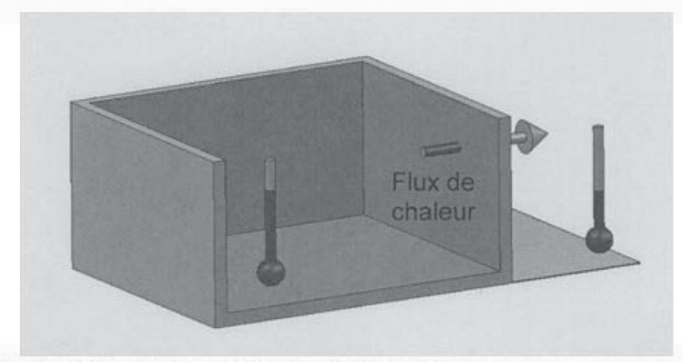

Figure 12 : flux de chaleur vers l'extérieur à travers une paroi d'un local chauffé

#### Question 5

Pour le contexte donné (température extérieure de 39°C et température intérieure de 23°C), **préciser** pour chaque paroi si le flux de chaleur est horizontal, ascendant ou descendant. **Calculer**, en détaillant, les coefficients de transmission surfacique du plancher fixe  $K_{plancher\;fixe}$ , d'une face longitudinale déployable  $K_{face\;long\;deploy}$  et d'un pavillon déployable  $K_{pav\;deploy}$ .

#### Question 6

**Compléter** le document réponse DR1, répertoriant les apports thermiques  $(K_i \cdot A_i \text{ ou } k_i \cdot L_i)$  pour tous les éléments constitutifs d'un shelter. **Commenter** la répartition des apports. En **déduire** la valeur du coefficient thermique global du shelter  $K_c$  et **statuer** sur le respect du cahier des charges.

Un essai est réalisé sur le shelter pour valider cette valeur. Deux chauffages d'une puissance totale  $P_{chauffage} = 3\,600\,\mathrm{W}$  sont installés dans le shelter déployé. Un ventilateur permet de brasser l'air afin d'avoir une température plus homogène. Cinq sondes, placées à différents endroits du shelter, enregistrent l'augmentation de température en continu, jusqu'à la stabilisation de la température.

#### Question 7

En analysant les courbes réponses figurant en annexe A3, **déterminer** le coefficient thermique mesuré  $K_{cm}$ . Comparer et justifier un écart éventuel avec la valeur calculée  $K_c$ .

Pour la suite du sujet, on prendra  $K_c = 1,6 \text{ W} \cdot \text{K}^{-1} \cdot \text{m}^{-2}$ .

En régime stationnaire, le besoin de climatisation doit couvrir différents apports : les apports aérauliques liés au renouvellement de l'air, les apports conductifs liés au shelter et les apports gratuits (apport solaire et apports internes).

|               | Apports            | Renouvellement de l'air : Q = 120 m 3 · h -1     |
|---------------|--------------------|------------------------------------------------------------------------|
|               | aérauliques        | Infiltrations d'air : négligé                                          |
| Besoin en     | Apports conductifs | Shelter: $K_c = 1.6 \text{ W} \cdot \text{K}^{-1} \cdot \text{m}^{-2}$ |
| climatisation |                    | Apport solaire sur les pavillons : 33,6 W·m -2              |
|               | Apports gratuits   | Apport par les occupants, au nombre de 3 : 150 W/occupant              |
|               |                    | Dissipations internes (matériel informatique) : 200 W                  |

#### Question 8

En utilisant le diagramme de l'air humide de l'annexe A4, **déterminer** la différence d'enthalpie pour passer d'une température de l'air de 39 °C et un taux d'humidité relative de 43 % à une température de l'air de 23 °C et un taux d'humidité relative de 70 %.

En déduire les apports dus au renouvellement de l'air, notés Pair neuf.

Pour la suite du sujet, on prendra  $P_{air\ neuf} = 1200\ W$ .

#### Question 9

Déterminer la puissance frigorifique nécessaire et choisir un climatiseur parmi ceux proposés en annexe A5.

## 3.2 Régulation de température

Objectif: vérifier les critères de rapidité et de précision du cahier des charges.

Le climatiseur étant choisi, il convient maintenant de vérifier qu'il satisfait l'exigence de rapidité et de précision du cahier des charges (exigence 2.1.4).

Dans cette exigence, le renouvellement d'air et les apports gratuits sont considérés nuls. Dans ce cas, la puissance de refroidissement  $P_f$  permet de :

 refroidir la masse d'air à l'intérieur du shelter. La puissance Pr nécessaire au refroidissement, qui tient compte à la fois des chaleurs latentes et sensibles, peut être approchée, sur la plage de fonctionnement considérée, par

$$P_r(t) = \lambda \frac{d\theta_i(t)}{dt}$$

avec λ coefficient de transfert énergétique en J⋅°C-1;

 $\theta_i$  , température de l'air dans le shelter en °C ;

 compenser les apports par les parois. La puissance nécessaire à compenser les apports conductifs Pac s'exprime par la relation suivante

$$P_{ac}(t) = K_c \cdot A_c \cdot (\theta_i(t) - \theta_{\Theta}(t))$$

avec  $A_c$ , surface totale du shelter en m2;

 $K_c$ , coefficient thermique du shelter en  $W \cdot {}^{\circ}C^{-1} \cdot m^{-2}$ ;

 $\theta_e$ , température extérieure en °C .

La puissance de refroidissement  $P_{\!f}\,$  s'exprime alors par la relation suivante :

$$P_f(t) = P_r(t) + P_{ac}(t)$$

La régulation de température du shelter peut être modélisée par le schéma bloc cidessous :

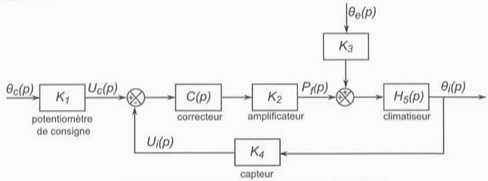

Figure 13 : régulation de température du shelter

Le correcteur de cette boucle de régulation est un correcteur à action proportionnelle défini tel que  $C(p) = K_p$ .

Notations des transformées de Laplace :

| $\theta_c(p)$        | Température de consigne                                                |
|----------------------|------------------------------------------------------------------------|
| $\theta_{\theta}(p)$ | Température extérieure                                                 |
| $\theta_i(p)$        | Température intérieure                                                 |
| $U_c(p)$             | Tension image de la consigne de température                            |
| $U_i(p)$             | Tension image de la température intérieure                             |
| $P_f(p)$             | Puissance de refroidissement                                           |
| K 1       | Gain du potentiomètre de consigne                                      |
| K 2       | Gain de l'amplificateur K₂ = 100 W · V -1                   |
| K 4       | Gain du capteur de température K 4 = 2 V ⋅ °C -1 |
| C(p)                 | Fonction de transfert du correcteur                                    |
| $H_5(p)$             | Fonction de transfert du climatiseur                                   |

#### Question 10

**Exprimer** les fonctions de transfert littérales de  $K_3$  et  $H_5(p)$  en considérant des conditions initiales nulles, et justifier que  $K_1 = K_4$ .

#### Question 11

**Montrer** que le schéma bloc de la figure 13 peut être mis sous la forme du système à retour unitaire décrit à la figure 14. **Exprimer** la fonction de transfert F(p) en fonction de  $K_1$ ,  $K_2$  et  $K_p$ .

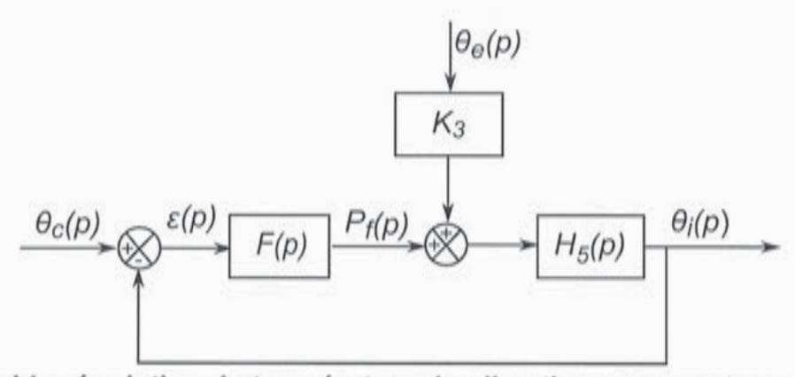

Figure 14 : régulation de température du climatiseur avec retour unitaire

#### Question 12

**Montrer** que  $\theta_i(p)$  peut s'écrire sous la forme :  $\theta_i(p) = \frac{K_{c1}}{1 + \tau_c \cdot p} \cdot \theta_c(p) + \frac{K_{\theta}}{1 + \tau_{\theta} \cdot p} \cdot \theta_{\theta}(p)$ .

En considérant dans un premier temps une absence de correcteur, la fonction de transfert du correcteur est définie telle que  $C(p) = K_p = 1$ . Le système de régulation de la température est soumis à un échelon de température correspondant à la différence entre la température finale de 23 °C et la température initiale de 39 °C.

Données complémentaires pour les questions suivantes :

| Coefficient de transfert énergétique | $\lambda = 142 \text{ kJ} \cdot ^{\circ}\text{C}^{-1}$        |
|--------------------------------------|---------------------------------------------------------------|
| Surface totale du shelter            | $A_c = 110,74 \text{ m}^2$                                    |
| Coefficient thermique du shelter     | $K_c = 1.6 \text{ W} \cdot \text{K}^{-1} \cdot \text{m}^{-2}$ |

#### Question 13

L'erreur est définie par :  $\varepsilon_s = \lim_{t \to \infty} (\theta_c(t) - \theta_i(t))$ .

**Évaluer** le temps de réponse à 5 % du système régulé ainsi que l'erreur  $\varepsilon_s$  en régime permanent, sans tenir compte de la perturbation  $\theta_e$ , qui a un impact négligeable sur le respect des exigences du cahier des charges. **Conclure** sur le respect des exigences de rapidité et de précision, exprimées dans le cahier des charges.

Afin de respecter le cahier des charges, un correcteur à action proportionnelle est défini tel que  $C(p) = K_p$ .

#### Question 14

**Déterminer** la valeur du gain  $K_p$  permettant de vérifier le critère de précision. En **déduire** le temps de réponse à 5 % du système corrigé. **Conclure** sur la conformité du cahier des charges.

#### 3.3 Synthèse sur le dimensionnement de la climatisation

Le climatiseur retenu est le ASI24B, ses données techniques sont en annexe A5.

Un modèle mutiphysique de la régulation en température du climatiseur a été réalisé afin de vérifier les performances du climatiseur ASI24B et le respect des exigences du cahier des charges. Ce modèle est donné en annexe A7. Le correcteur à action proportionnelle est réglé avec la valeur du gain  $K_p$  trouvée précédemment.

Le système de régulation de la température est soumis à un échelon de température correspondant à la différence entre la température finale de 23 °C et la température initiale de 39 °C. L'évolution des températures  $\theta_c$  et  $\theta_i$  ainsi que celle de la puissance de refroidissement  $P_t$  sont visibles en annexe A7.

Vérifier que la puissance frigorifique du climatiseur choisi est compatible avec celle du modèle, puis vérifier que les exigences de précision et de rapidité du cahier des charges (exigence 2.1.4) sont respectées. Expliquer pourquoi le temps de réponse à 5 % est plus long que celui calculé à la question 14.

## 4 Motorisation du système de fermeture des faces latérales

Objectif: choisir le type de motorisation du système de fermeture des faces latérales.

Pour mettre le shelter en configuration transport, c'est-à-dire le fermer, il faut, dans l'ordre :

- faire tourner les pignons déployables avant et arrière autour d'une charnière verticale solidaire du shelter;
- rabattre la face longitudinale sur le plancher déployable, ensemble qu'on nommera ensuite (P) et qu'on pourra assimiler à un panneau équivalent;
- faire tourner cet ensemble (P) autour d'une charnière horizontale, solidaire du shelter (voir figure 16);
- 4. abaisser le pavillon déployable.

La société souhaite motoriser l'étape 3 et envisage deux solutions :

- soit placer un moteur triphasé sur l'axe de rotation (O, x̄) (voir figure 16);
- soit utiliser un treuil électrique, fixé à l'intérieur du shelter.

La masse totale de l'ensemble (P), notée  $m_p$ , est de  $m_p$  = 360 kg .

#### 4.1 Gabarit de vitesse

Le gabarit de vitesse, de type trapézoïdal, de l'ensemble (P) pour la phase de fermeture est donné ci-dessous :

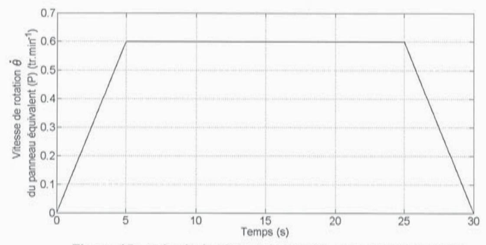

Figure 15 : gabarit de vitesse lors de la phase de fermeture

**Tracer** l'allure temporelle de la courbe représentative de  $\theta(t)$  sachant que  $\theta(0) = 0^{\circ}$ . **Vérifier** que le gabarit de vitesse proposé permet d'obtenir la rotation de 90°.

#### 4.2 Motorisation de l'axe de rotation

Un moteur triphasé associé à deux réducteurs est placé directement sur l'axe de rotation  $(O, \vec{x})$ .

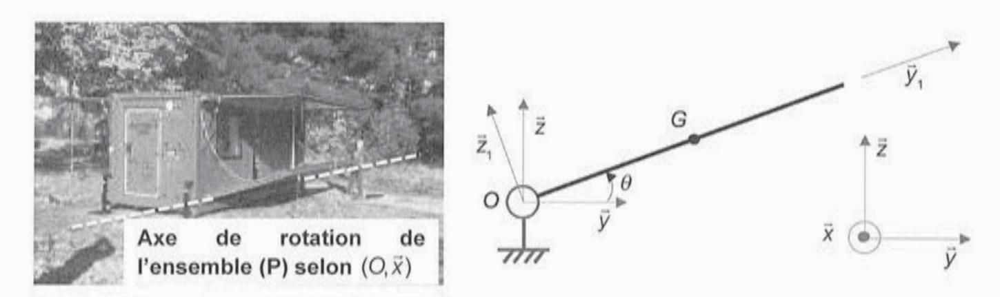

Figure 16 : position de l'axe de rotation du panneau équivalent et modèle cinématique associé

## Hypothèses de calcul:

- le repère (O, x̄, ȳ, z̄) est supposé galiléen ;
- l'accélération de la pesanteur s'écrit  $\vec{g} = -g \cdot \vec{z}$  avec  $g = 10 \text{ m} \cdot \text{s}^{-2}$ ;
- la liaison pivot est supposée parfaite ;
- les forces dues à la résistance de l'air et à l'action du vent sur le panneau équivalent sont négligées;
- les moments d'inertie des réducteurs sont négligés.

## Données complémentaires pour les questions suivantes :

| Longueur du panneau équivalent                                                                                | $L_{p} = 5 \text{ m}$                           |
|---------------------------------------------------------------------------------------------------------------|-------------------------------------------------|
| Largeur du panneau équivalent                                                                                 | $I_p = 2,23 \mathrm{m}$                         |
| Épaisseur du panneau équivalent                                                                               | $e_p = 0.106 \mathrm{m}$                        |
| Rapport de réduction du premier réducteur                                                                     | $R_1 = \frac{1}{60}$                            |
| Rapport de réduction du second réducteur                                                                   | $R_2 = \frac{1}{25}$                            |
| Rendement total de la chaîne de transmission d'énergie du système de motorisation du panneau équivalent | $\eta_r = 0.85$                                 |
| Position du centre d'inertie G de (P)                                                                         | $\overline{OG} = \frac{I_p}{2} \cdot \vec{y}_1$ |

Matrice d'inertie du panneau équivalent (P) en G

$$I_{G}(P) = \frac{m_{p}}{12} \begin{pmatrix} I_{p}^{2} + e_{p}^{2} & 0 & 0\\ 0 & L_{p}^{2} + e_{p}^{2} & 0\\ 0 & 0 & I_{p}^{2} + L_{p}^{2} \end{pmatrix}_{(\vec{X}, \vec{Y}_{1}, \vec{Z}_{1})}$$

Les caractéristiques du moteur triphasé utilisé pour la motorisation du panneau équivalent sont les suivantes :

- puissance nominale  $P_N = 0.37 \text{ kW}$ ;
- vitesse nominale NN = 950 tr · min-1;
- couple nominal CN = 3,7 N⋅m;
- rapport couple maximal sur couple nominal  $\frac{C_{max}}{C_N} = 2,2$ ;
- moment d'inertie  $J_m = 3,2 \cdot 10^{-3} \text{ kg} \cdot \text{m}^2$ .

#### Question 17

Calculer le moment d'inertie équivalent  $J_t$  sur l'arbre du moteur en tenant compte des moments d'inertie du panneau équivalent et du moteur.

Pour la suite du sujet, on prendra  $J_t = 3.5 \cdot 10^{-3} \text{ kg} \cdot \text{m}^2$ .

#### Question 18

En appliquant le théorème de l'énergie cinétique à l'ensemble mobile, **déterminer** l'expression du couple moteur  $C_m(t)$ . **Analyser** chacun des termes intervenant dans cette expression et en déduire la valeur du couple moteur maximal pour entraı̂ner en rotation le panneau équivalent.

#### Question 19

Vérifier que les caractéristiques du moteur choisi répondent au besoin en termes de vitesse de rotation et de couple maximal.

#### 4.3 Treuil électrique

Cette solution revient à remplacer le treuil mécanique manuel actuel par un treuil électrique. Actuellement, une drisse (câble) est fixée à la sangle de manœuvre, solidaire du plancher déployable, à l'aide d'un maillon rapide. Le treuil mécanique, associé au système de poulies de renvoi, permet ensuite d'enrouler cette drisse.

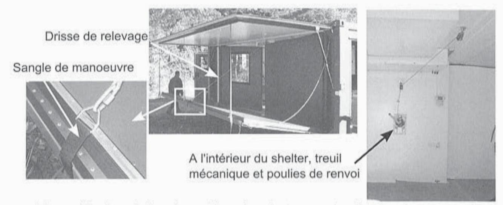

Figure 17 : description du système de relevage par treuil mécanique manuel

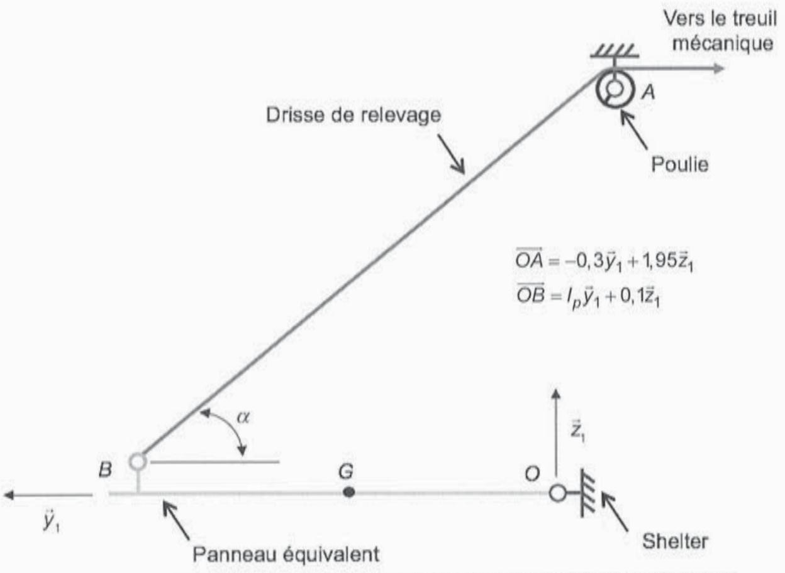

Figure 18 : implantation du système de relevage par treuil mécanique manuel

En négligeant les effets de l'accélération, **déterminer** la valeur maximale de l'effort *F* que doit fournir le treuil. **Choisir** un treuil parmi ceux proposés en annexe A6.

On rappelle que la drisse est enroulée pendant la phase de fermeture du panneau équivalent (P) dont le gabarit de vitesse trapézoïdal est décrit à la figure 15.

Calculer la longueur L de la drisse enroulée et vérifier que la plage de vitesse du treuil choisi à la question précédente est compatible avec l'application.

#### 4.4 Choix d'une solution

#### Question 22

Conclure en choisissant une des deux solutions, qui limite les impacts sur la conception et la fabrication.

## 5 Validation du système de communication

Objectif: valider le choix de l'émetteur pour la communication entre shelters.

Dans certaines applications, les shelters sont regroupés en petit nombre en un lieu donné. Ils peuvent être amenés à communiquer entre eux ou avec un poste de contrôle, centralisant des informations, à une distance maximale de 500 m.

Les shelters sont équipés de système de communication fonctionnant en modulation de fréquence. Il s'agit du module d'émission TXL2-433-9, d'une puissance d'émission de 10 dBm. Cet émetteur utilise le principe de modulation FSK (Frequency Shift Keying).

#### Question 23

Le cahier des charges impose une puissance d'émission supérieure à 5 mW pour une fréquence de 433 MHz. Vérifier que la puissance d'émission de l'émetteur utilisée est suffisante.

## 5.1 Étude théorique de la modulation de fréquence

Lors d'une transmission d'information avec modulation, deux signaux sont définis :

- le signal porteur  $v_p(t) = V_p \cos(2\pi f_p t)$ ;
- l'information à transmettre ou le modulant  $v_i(t) = V_i \cos(2\pi f_i t)$ .

En modulation de fréquence, l'information à transmettre agit directement sur la fréquence de la porteuse. La fréquence du signal modulé s'exprime alors par :  $f_m(t) = f_p + kv_j(t)$ .

Le signal modulé s'écrit :  $v_m(t) = V_p \cos \theta_m(t)$  où  $\theta_m(t)$  est la phase instantanée du signal. On supposera que  $\theta_m(0) = 0$ .

Exprimer  $\theta_m(t)$  en fonction  $f_p$ , k,  $V_i$  et  $f_i$  et mettre sous la forme :  $\theta_m(t) = 2\pi f_p t + m \sin(2\pi f_i t)$ . Donner l'expression de m, l'indice de modulation.

Pour une modulation FSK, le modulant ne prend que deux valeurs :  $v_i(t) = -1$  (correspondant au 0 binaire) ou  $v_i(t) = 1$  (correspondant au 1 binaire).

La fréquence du signal modulé vaut alors :

- $f_m = f_{m0}$  lorsque  $v_i(t) = -1$ ;
- $f_m = f_{m1}$  lorsque  $v_i(t) = 1$ .

L'excursion en fréquence, notée  $\Delta f$ , est définie telle que  $\Delta f = \frac{f_{m1} - f_{m0}}{2}$ .

#### Question 25

**Donner** l'expression du signal  $v_m(t)$  modulé en fréquence en faisant apparaître l'excursion en fréquence  $\Delta f$ .

### 5.2 Programmation du modulateur de fréquence

Le rôle du modulateur est de générer les deux fréquences du signal modulé à l'aide de diviseurs logiques insérés dans une boucle à verrouillage de phase. Il s'agit d'une synthèse de fréquence. Un synoptique du modulateur est donné en annexe A8.

La donnée à transmettre, par l'intermédiaire du CPU agit sur les diviseurs logiques R et N. En modifiant leurs valeurs, la fréquence d'émission  $f_m$  en sortie du VCO (Voltage Controlled Oscillator) varie.

Données complémentaires pour les questions suivantes :

| Fréquence de la porteuse | $f_p = 433 \mathrm{MHz}$     |
|--------------------------|------------------------------|
| Excursion en fréquence   | $\Delta f = 300  \text{kHz}$ |
| Diviseur logique         | R = 1024                     |

#### Question 26

**Donner** la relation entre les diviseurs logiques, notés N et R, lorsque la boucle à verrouillage de phase est verrouillée. La fréquence de l'oscillateur à quartz est notée  $f_{ref}$  et celle en sortie du VCO  $f_m$ .

#### Question 27

**Déterminer** les valeurs numériques du diviseur logique *N* à programmer dans le module d'émission TXL2-433-9 afin de respecter l'excursion en fréquence exigée par le cahier des charges.

## 6 Dimensionnement du groupe électrogène

Objectif: dimensionner et choisir un groupe électrogène.

Dans le cas où le shelter ne peut être connecté à un réseau électrique, un groupe électrogène doit pouvoir l'alimenter.

Le bilan de puissance d'un shelter fonctionnant en mode climatisation est donné par le tableau ci-dessous. Ce tableau renseigne également sur le temps d'utilisation, exprimé en pourcentage sur une journée de 24 h, de chaque équipement du shelter.

| Équipement                                 | Consommation | Pourcentage d'utilisation par jour |
|--------------------------------------------|--------------|------------------------------------|
| Poste de travail (2 ordinateurs)        | 800 W        | 70 %                               |
| 4 prises de courant à usage général        | 500 W        | 30 %                               |
| Climatisation                              | 2000 W       | 60 %                               |
| Éclairage d'ambiance (éclairage hublot) | 75 W         | 50 %                               |

Certains appareils requièrent au démarrage une puissance plus forte que leur puissance réelle de fonctionnement. Un coefficient multiplicateur doit alors être appliqué afin de prendre en compte ces phases de démarrage. C'est le cas de la climatisation dont le coefficient multiplicateur est estimé à  $k_m = 1,5$ .

#### Question 28

D'après le document en annexe A9, **lister** les groupes électrogènes capables de fournir la puissance nécessaire et qui respectent l'exigence 2.2.1 du cahier des charges.

Parmi les polluants associés à la production d'électricité, les gaz à effet de serre, et notamment le dioxyde de carbone, sont aujourd'hui, dans le contexte du réchauffement climatique global, l'objet d'une attention majeure.

Le tableau ci-dessous répertorie, selon le combustible utilisé pour le fonctionnement d'un groupe électrogène, l'émission de  $CO_2$  en grammes équivalent  $CO_2$  (g eq  $CO_2$ ) pour un kWh de combustible consommé.

| Coefficient d'émission de | CO 2 pour différents combustibles |
|---------------------------|----------------------------------------------|
| Essence                   | 264 g eq CO 2 par kWh             |
| Gazole                    | 271g eq CO 2 par kWh              |
| GPL                       | 231g eq CO 2 par kWh              |

Quel que soit le combustible consommé par le groupe électrogène, le rendement global du groupe électrogène est estimé à 27 %.

Le temps de démarrage du climatiseur est négligeable sur une journée. Ainsi, le coefficient multiplicateur  $k_m$  n'est pas pris en compte dans la suite du sujet.

#### Question 29

**Évaluer** pour les trois combustibles disponibles (essence, gazole et GPL) la quantité de CO2 rejeté dans l'atmosphère (en g eq CO2) pour un fonctionnement du groupe électrogène sur une journée de 24 h. D'après le document en annexe A9, **retenir** le groupe électrogène satisfaisant les besoins et les exigences (2.2.1 et 2.2.2) du cahier des charges.

#### Question 30

Calculer le courant débité par le groupe électrogène choisi précédemment pour un fonctionnement à la puissance nominale du groupe électrogène et vérifier qu'une de ses prises est correctement dimensionnée.

## 7 Synthèse

#### Question 31

Pour réduire le coût de réalisation de ce shelter, la société envisage, entre autres, de réduire l'épaisseur de la mousse en polystyrène extrudé contenue dans chaque panneau. **Lister** les exigences du cahier des charges impactées par cette réduction et qu'il conviendra de vérifier de nouveau.

# **DOCUMENTS ANNEXES**

# Document annexe A1 Simulation du comportement de la structure au gerbage de huit shelters

Cas de charge : structure soumise à son poids propre, plancher chargé, avec gerbage de huit shelters (192 000 kg)

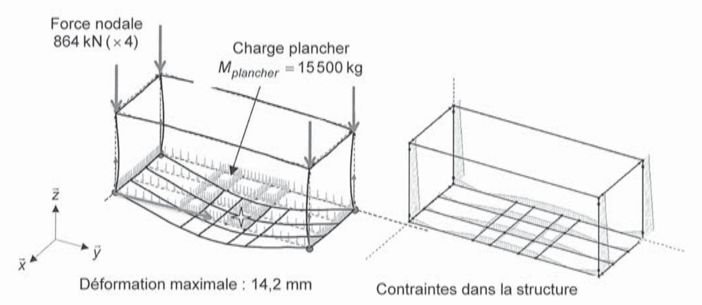

Valeur de la contrainte maximale : 230,7 MPa

Document annexe A2 Composition et dimension des panneaux sandwich

| Panneaux                            | couche 1 (intérieure) aluminium       | 1 E) | couche 2 mousse XPS (polystyrène extrudé) | os Je  | couche 3 contre plaqué                   | s ué | couche 4 (extérieure) acier ou aluminium | 4 ire) ninium | longueur | largeur | quantité |
|-------------------------------------|---------------------------------------------|---------|----------------------------------------------------|-----------|---------------------------------------------|---------|------------------------------------------------|---------------------|----------|---------|----------|
|                                     | λ1 (W·K -1 ·m -1 ) | e (m)   | λ3 (W·K -1 ·m -1 )        | e3 (m) | λ4 (W⋅K -1 ⋅m -1 ) | 4 E     | $\lambda 5$ $(W \cdot K^{-1} \cdot m^{-1})$    | e5 (m)           | E,       | E)      |          |
| Pavillon (toit) fixe             | 230                                         | 0,0015  | 0,027                                              | 0,1       | 0,13                                        | 0,004   | 52                                             | 0,0008              | 5,05     | 1,85    | -        |
| Pavillon déployable              | 230                                         | 0,0015  | 0,027                                              | 0,04      | 0,13                                        | 0,004   | 230                                            | 0,0015              | 5,00     | 2,23    | 2        |
| Face latérale fixe               | 230                                         | 0,0015  | 0,027                                              | 0,04      |                                             |         | 230                                            | 0,0015              | 0,05     | 2,2     | 2        |
| Pignon avant fixe                   | 230                                         | 0,0015  | 0,027                                              | 0,05      |                                             | - 1     | 230                                            | 0,0015              | 1,85     | 2,2     | -        |
| Pignon arrière fixe              | 230                                         | 0,0015  | 0,027                                              | 0,05      | ı                                           | 1       | 230                                            | 0,0015              | 1,85     | 2,2     | -        |
| Face longitudinale déployable | 230                                         | 0,0015  | 0,027                                              | 0,04      | ·                                           | T       | 230                                            | 0,0015              | 2,00     | 2,025   | 2        |
| Pignon avant déployable          | 230                                         | 0,0015  | 0,027                                              | 0,04      | t                                           | 1       | 230                                            | 0,0015              | 2,1125   | 2,23    | 2        |
| Pignon arrière déployable        | 230                                         | 0,0015  | 0,027                                              | 0,04      | 1                                           | 97      | 230                                            | 0,0015              | 2,1125   | 2,23    | 2        |
| Plancher fixe                       | 230                                         | 0,0015  | 0,027                                              | 0,05      | 0,13                                        | 0,004   | 230                                            | 0,0015              | 5,05     | 1,85    | -        |
| Plancher déployable              | 230                                         | 0,0015  | 0,027                                              | 0,05      |                                             | ï       | 230                                            | 0,0015              | 2,00     | 2,23    | 2        |

|                        | 110,                        |
|------------------------|-----------------------------|
| Surface totale shelter | déployé A c (m²) |

# Document annexe A3 Mesure du coefficient $K_c$ du shelter déployé

Conditions d'essai : positions des chauffages et des sondes de température

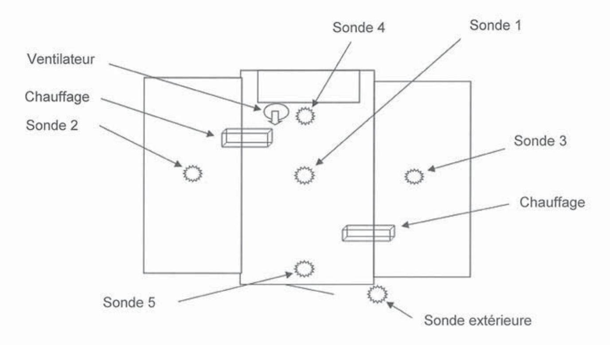

#### Mesures

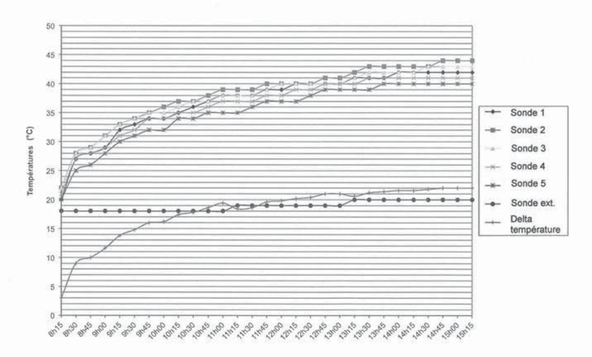

« Delta température » : différence entre la moyenne des températures intérieures et la température extérieure.

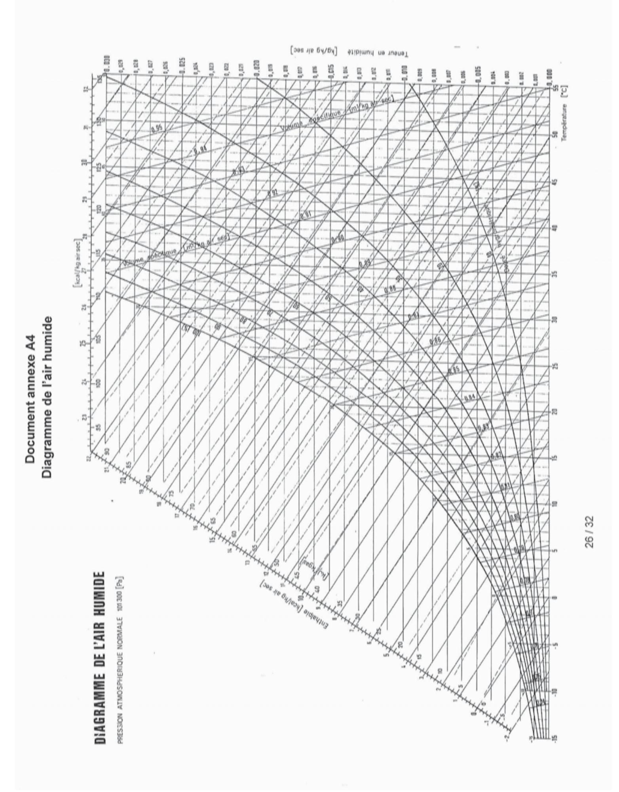

**Tournez la page S.V.P.**

## Document annexe A5 Choix du climatiseur

# ALLÈGE/PLAFONNIER INVERTER DC Symphonia Climatiseur réversible

| Données tech                                    | nniques              | ASI18B monophasé | ASI24B monophase | ASI36B1 monophase | ASI36B2 triphasé | ASI48A1 monophasé | ASI48A2 triplusé | ASI60A triphasé |
|-------------------------------------------------|----------------------|---------------------|---------------------|----------------------|---------------------|----------------------|---------------------|--------------------|
| CODES ARTICLES                                  |                      |                     |                     |                      |                     |                      |                     |                    |
| Unité intérieure                                |                      | IASI18B             | IASI24B             | IASI368              | LASI36B             | IASI48A              | IASI48A             | IASI60A            |
| Unité extérieure                                |                      | XUSI18C             | XUSI24C             | XUSI36B1             | XUSI36B2            | XUSI48A1             | XUS14882            | XUSI60A2           |
| PUISSANCES(1)                                   |                      |                     |                     |                      |                     |                      |                     |                    |
| Frigorifique                                    | w                    | 5270 (1630-5650)    | 7030 (1630-7900)    | 10560 (3000-13210)   | 10500 (3000-13200)  | 14070 (3600-15600)   | 14000 (3600-16000)  | 16000 (4250-1680   |
| Frigorifique                                    | Btu/h                | 18000 (5560-19280)  | 24000 (5560-26960)  | 36000 (10240-45040)  | 35800 (10900-45050) | 48000 (12300-53200)  | 47800 (12300-53200) | 54610 (15000-5730  |
| Calorifique                                     | W                    | 5865 (1450-6150)    | 7625 (1750-8600)    | 11440 (3550-14010)   | 11030 (3800-14000)  | 15240 (4200-16500)   | 15470 (4200-16500)  | 17600 (4800-1800   |
| Calorifique à -7°C extérieur                    | w                    | 4100                | 5260                | 8000                 | 7720                | 10670                | 10830               | 12320              |
| PECIFICATIONS ELECTR                            | RIQUES               |                     |                     |                      |                     |                      |                     |                    |
| Tension d'alimentation                          | V/Ph/Hz              | 220-240/1N/50       | 220-240/1N/50       | 220-240/1N/50        | 380-415/3N/50       | 220-240/1N/50        | 380-415/3N/50       | 380-415/3N/5       |
| Intensité nominale en froid                     | A                    | 7,4                 | 9,9                 | 15,0                 | 4,6                 | 19,0                 | 6,3                 | 7,2                |
| Intensité nominale en chaud                     | A                    | 7,3                 | 9,5                 | 14,5                 | 4,4                 | 18,0                 | 6,1                 | 7,0                |
| Consommation en froid                           | W                    | 1620                | 2165                | 3287                 | 3260                | 4320                 | 4320                | 4970               |
| Consommation en chaud                           | w                    | 1580                | 2070                | 3165                 | 3010                | 4130                 | 4200                | 4810               |
| Protection électrique (courbe D ou              | aM)(2) A             | 10 / 25             | 10 / 25             | 10 / 25              | 10 / 16             | 10 / 35              | 10 / 16             | 10 / 20            |
| Alimentation principale                         |                      |                     |                     | int                  | érieure + extérie   | ure                  |                     |                    |
| Section alimentation électrique                 | Nb x mm 2 | 3×2,5+3×4,0         | 3×2,5+3×4,0         | 3×2,5+3×4,0          | 3×2,5+5×2,5         | 3×2,5+3×6,0          | 3×2,5+5×2,5         | 3×2,5+5×2,5        |
| Section connexion unité int/ext. (3) | Nb x mm 2 | 3×0,5               | 3×0,5               | 3×0,5                | 3×0,5               | 3×0,5                | 3×0,5               | 3×0,5              |

## Document annexe A6 Choix du treuil de levage

#### Treuil de levage et de halage à vitesse variable - Force 250 à 960 kg

- Treuils fixes multi-usages, puissants et compacts

   Permet des démarrages et arrêts en douceur.

   Possibilité de programmer la plage d'accélération et de

- Possibilité de programmer la plage d'acceleration et de décélération.
   Réglage de la vitesse par potentiomètre sur la boîte à boutons.
   Possibilité de programmer plusieurs vitesses.
   A Les treuils sont livrés sans jeu de câbles. Ce dernier doit être commandé séparément.

Tension: 230 V - Alimentation: Monophasé - Type: Vitesse variable -

| Motuse En                                                                                                                                                                                                                                                                                                                                                                                                                                                                                                                                                                                                                                                                                                                                                                                                                                                                                                                                                                                                                                                                                                                                                                                                                                                                                                                                                                                                                                                                                                                                                                                                                                                                                                                                                                                                                                                                                                                                                                                                                                                                                                                      | 1 : CH 14437 | 1.1     |                          |              |              |
|--------------------------------------------------------------------------------------------------------------------------------------------------------------------------------------------------------------------------------------------------------------------------------------------------------------------------------------------------------------------------------------------------------------------------------------------------------------------------------------------------------------------------------------------------------------------------------------------------------------------------------------------------------------------------------------------------------------------------------------------------------------------------------------------------------------------------------------------------------------------------------------------------------------------------------------------------------------------------------------------------------------------------------------------------------------------------------------------------------------------------------------------------------------------------------------------------------------------------------------------------------------------------------------------------------------------------------------------------------------------------------------------------------------------------------------------------------------------------------------------------------------------------------------------------------------------------------------------------------------------------------------------------------------------------------------------------------------------------------------------------------------------------------------------------------------------------------------------------------------------------------------------------------------------------------------------------------------------------------------------------------------------------------------------------------------------------------------------------------------------------------|--------------|---------|--------------------------|--------------|--------------|
| Force                                                                                                                                                                                                                                                                                                                                                                                                                                                                                                                                                                                                                                                                                                                                                                                                                                                                                                                                                                                                                                                                                                                                                                                                                                                                                                                                                                                                                                                                                                                                                                                                                                                                                                                                                                                                                                                                                                                                                                                                                                                                                                                          | Poids        | Câble Ø | Tambour capacité maxi    | Vitesse mini | Vitesse maxi |
| 250 kg                                                                                                                                                                                                                                                                                                                                                                                                                                                                                                                                                                                                                                                                                                                                                                                                                                                                                                                                                                                                                                                                                                                                                                                                                                                                                                                                                                                                                                                                                                                                                                                                                                                                                                                                                                                                                                                                                                                                                                                                                                                                                                                         | 35 kg        | 5 mm    | 55 m                     | 2,5 m/min    | 25 m/min     |
| 300 kg                                                                                                                                                                                                                                                                                                                                                                                                                                                                                                                                                                                                                                                                                                                                                                                                                                                                                                                                                                                                                                                                                                                                                                                                                                                                                                                                                                                                                                                                                                                                                                                                                                                                                                                                                                                                                                                                                                                                                                                                                                                                                                                         | 35 kg        | 5 mm    | 55 m                     | 2 m/min      | 20 m/min     |
| 500 kg                                                                                                                                                                                                                                                                                                                                                                                                                                                                                                                                                                                                                                                                                                                                                                                                                                                                                                                                                                                                                                                                                                                                                                                                                                                                                                                                                                                                                                                                                                                                                                                                                                                                                                                                                                                                                                                                                                                                                                                                                                                                                                                         | 85 kg        | 6,8 mm  | 85 m                     | 1 m/min      | 10 m/mln     |
| Marie Contract Contract Contract Contract Contract Contract Contract Contract Contract Contract Contract Contract Contract Contract Contract Contract Contract Contract Contract Contract Contract Contract Contract Contract Contract Contract Contract Contract Contract Contract Contract Contract Contract Contract Contract Contract Contract Contract Contract Contract Contract Contract Contract Contract Contract Contract Contract Contract Contract Contract Contract Contract Contract Contract Contract Contract Contract Contract Contract Contract Contract Contract Contract Contract Contract Contract Contract Contract Contract Contract Contract Contract Contract Contract Contract Contract Contract Contract Contract Contract Contract Contract Contract Contract Contract Contract Contract Contract Contract Contract Contract Contract Contract Contract Contract Contract Contract Contract Contract Contract Contract Contract Contract Contract Contract Contract Contract Contract Contract Contract Contract Contract Contract Contract Contract Contract Contract Contract Contract Contract Contract Contract Contract Contract Contract Contract Contract Contract Contract Contract Contract Contract Contract Contract Contract Contract Contract Contract Contract Contract Contract Contract Contract Contract Contract Contract Contract Contract Contract Contract Contract Contract Contract Contract Contract Contract Contract Contract Contract Contract Contract Contract Contract Contract Contract Contract Contract Contract Contract Contract Contract Contract Contract Contract Contract Contract Contract Contract Contract Contract Contract Contract Contract Contract Contract Contract Contract Contract Contract Contract Contract Contract Contract Contract Contract Contract Contract Contract Contract Contract Contract Contract Contract Contract Contract Contract Contract Contract Contract Contract Contract Contract Contract Contract Contract Contract Contract Contract Contract Contract Contract Contract Contract Contract Contract Contract Contra |              |         | man any arts of the same |              |              |

m/min 900 kg 85 kg 960 kg 90 kg 13 m/min 8 mm 60 m 1,3 m/min 17 m 1 m/min 10 m/min Nous consulter

ACCESSOIRE

150 kg

Jeu de câbles en acier avec crochet pour treuils de levage et halage - Force 150 kg

▲ Compatibles avec les treuils modèle BT et CD uniquement.

Câble Ø: 4 mm - Longueur: 22 m 1690M20 € 81,00

Livraison sous 5 jours

192M268

192M269

192M270

192M271

C 3 602,00

C 3 602,00

C 5 242,00

C 5 154,00

C 5 154,00

Dont DEEE

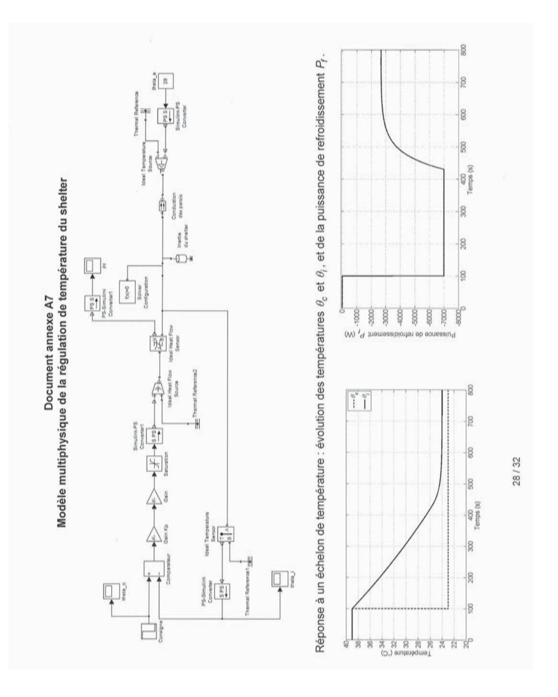

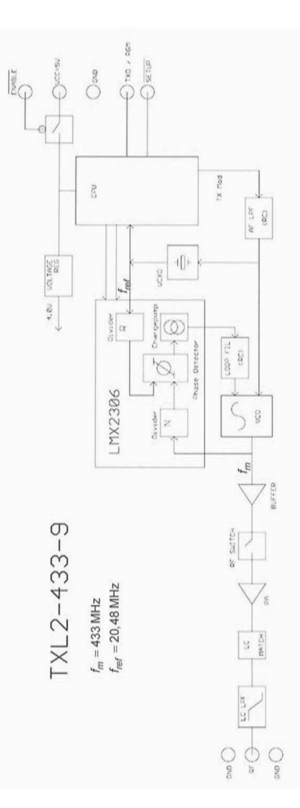

## Document annexe A9 Choix du groupe électrogène

#### Modèles PERFORM et PERFORM GAZ

Les modèles PERFORM fonctionnent à l'essence.

Les modèles PERFORM GAZ fonctionnent par bicarburation essence/GPL.

#### GROUPES ÉLECTROGÈNES MONOPHASÉS

| Type        |                                               | PERFORM 3000 | PERFORM 4500 | PERFORM 6500 | PERFORM 3000 GAZ | PERFORM 4500 GAZ    | PERFORM 6500 GAZ |
|-------------|-----------------------------------------------|--------------|--------------|--------------|------------------|---------------------|------------------|
| Puissance   | kW ISO 8528                                   | 3,00         | 4,20         | 6,50         | 2,4              | 3,9                 | 5,80             |
| maxi. 230 V | kVA m                              | 3,75         | 5,25         | 8,15         | 3,0              | 4,9                 | 7,25             |
|             | Marque                                        | Kohler*      | Kohler*      | Kohler®      | Kohler®          | Kohler a | Kohler®          |
|             | Туре                                          | CH 270       | CH 395       | CH 440       | CH 270           | CH 395              | CH 440           |
|             | Sécurité d'huile                              |              |              |              |                  |                     |                  |
| Moteur      | Démarrage électrique                       | X            | X            | Х            | χ                | X                   | X                |
|             | HP à 3600 tr/min.                             | 6,0          | 8,5          | 11,9         | 6                | 8,5                 | 11,9             |
|             | Autonomie en h                                | 3,2          | 3,5          | 2,8          | X                | X                   | - X              |
|             | Réservoir en L                                | 4,1          | 7,3          | 7,3          | X                | 1                   | X                |
|             | Puissance acoustique garantie Lwa en dB(A) | 96           | 97           | 97           | 96               | 97                  | 97               |
|             | Noveau sonore dBIAL® 7 m                      | 68           | 68           | 69           | 68               | 68                  | 69               |
|             | Poids en kg                                   | 43           | 66,5         | 96,5         | 44               | 67,5                | 97,5             |
| Code Prises |                                               | P1L          | P1L          | P1H          | P1L              | P1L                 | P1H              |

Non disponible. • En série. (1) Valeur théorique calculée pour comparaison. (2) Reportez-vous au descriptif des prises page 43. Pour les modèles PERFORM GAZ: les puissances (kW et kVA) sont indiquées en alimentation GAZ. En fonctionnement ESSENCE, reportez-vous aux puissances des modèles PERFORM indiquées dans le tableau ci-dessus.

#### Modèles DIESEL

Les modèles DIESEL fonctionnent au diesel.

#### GROUPES ÉLECTROGÈNES MONOPHASÉS

| Type        |                                               | DIESEL 4000 C  | DIESEL 4000 E XL C | DIESEL 6000 E XL C | DIESEL 6000 E SILENCE      | DIESEL 10000 E XL C |
|-------------|-----------------------------------------------|----------------|--------------------|--------------------|----------------------------|---------------------|
| Puissance   | kW 150 8528                                   | 3,40           | 3,40               | 5,2                | 5,2                        | 9,00                |
| maxi. 230 V | kVA III                            | 4,25           | 4,25               | 6,5                | 6,5                        | 11,25               |
|             | Marque                                        | Kohler® Diesel | Kohler® Diesel     | Kohler® Diesel     | Kohler ® Diesel | Kohler® Diesel      |
|             | Type                                          | KD 350         | KD 350             | KD 440             | KD 440                     | KD 425-2            |
|             | Sécurité d'huile                              | ×              |                    |                    |                            |                     |
| Moteur      | Démarrage électrique                       | X              |                    |                    |                            |                     |
|             | HP à 3600 tr/min.                             | 7              | 7                  | 9,8                | 9,8                        | 19                  |
|             | Autonomie en h                                | 4,8            | 17,8               | 13,3               | 18,3                       | 16,7                |
|             | Réservoir en L                                | 4,3            | 16                 | 16                 | 22                         | 35                  |
|             | Puissance acoustique garantie Lwa en dB(A) | 108            | 108                | 108                | 88                         | 109                 |
|             | Niveau soncre dB(A) @ 7 m                     | 78             | 78                 | 79                 | 59                         | 80                  |
|             | Poids en kg                                   | 70             | 84                 | 103                | 198                        | 162                 |
| Code Prises | 0                                             | P1L            | P1L                | P1H                | P1ZD                       | P1ZD                |

#### Code Prises

| P1H  | 1 prise 230V 10/16A - Disjoncteur + 1 prise 230V 32A - Disjoncteur.                                                                                          |
|------|--------------------------------------------------------------------------------------------------------------------------------------------------------------|
| P1I  | 1 prise 230V 10/16A - Disjoncteur + 1 prise 400V 16A - Disjoncteur + compteur horaire.                                                                       |
| PIZD | 1 prise 230V 10/16A - Disjoncteur + 1 prise 230V 16A - Disjoncteur + 1 prise 230V 32A - Disjoncteur + compteur horaire + voyant + MICS MODYS 51 . |

| Modèle ENSD ©NEOPTEC                             |         | _       | =          | _         | _         | _       | =       | =        | =         |         |        |      |      |     |   | _ |  |      | =   | = | = |  |
|--------------------------------------------------|---------|---------|------------|-----------|-----------|---------|---------|----------|-----------|---------|--------|------|------|-----|---|---|--|------|-----|---|---|--|
| Nom : (Suivi, s'il y a lieu, du nom d'épouse) |         |         |            |           |           |         | L       |          |           |         |        |      |      |     |   |   |  |      | L   |   |   |  |
| Prénom :                                         |         |         |            |           |           |         |         |          |           |         |        |      |      |     |   |   |  |      |     |   |   |  |
| N° d'inscription :                               |         |         |            |           |           |         |         |          |           |         | N      | é(e) | le : |     | / |   |  |      |     |   |   |  |
|                                                  | (Le nui | méro es | st celui d | qui figui | re sur la | a convo | ocation | ou la fe | euille d' | 'émarge | ement) |      |      |     |   |   |  |      |     |   |   |  |
|                                                  | Con     | cour    | S          |           |           | Sect    | ion/    | Optio    | on        |         |        |      | Epre | uve |   |   |  | Mati | ère |   |   |  |
| •                                                |         |         |            |           |           |         |         |          |           |         |        |      |      |     |   |   |  |      |     |   |   |  |

EDE STI 1

## DOCUMENT RÉPONSE DR1

## Document réponse DR1 (réponse question 6)

| С            | $K_i \cdot A_i \text{ ou } k_i \cdot L_i$ $\left( W \cdot K^{-1} \right)$ |       |
|--------------|------------------------------------------------------------------------------|-------|
|              | 1 pavillon fixe                                                              | 2,38  |
|              | 2 pavillons déployables                                                      |       |
|              | 2 faces latérales fixes                                                      | 0,06  |
|              | 1 pignon avant fixe                                                          | 1,96  |
| Danneauv     | 1 pignon arrière fixe                                                        | 1,96  |
| Panneaux     | 2 faces longitudinales déployables                                           | - All |
|              | 2 pignons avant déployables                                                  | 5,54  |
|              | 2 pignons arrière déployables                                                | 5,54  |
|              | 1 plancher fixe                                                              |       |
|              | 2 planchers déployables                                                      | 10,60 |
| Ponts thermi | ques profilés de la structure                                                | 14,0  |
| Ponts thermi | ques cadres panneaux sandwich                                                | 80,9  |
| Porte        |                                                                              | 6,2   |
| Baie vitrée  | 9,1                                                                          |       |
| Ponts thermi | 9,4                                                                          |       |
|              | Total                                                                        |       |

| Commentaire sur la répartition des apports : |  |
|----------------------------------------------|--|
|                                              |  |
|                                              |  |
|                                              |  |
|                                              |  |

Valeur du coefficient thermique global  $K_c$ :

| Conclusion: |  |  |
|-------------|--|--|
|             |  |  |
|             |  |  |
|             |  |  |