# **SESSION 2015**

# CAPET CONCOURS EXTERNE ET CAFEP

**Section : SCIENCES INDUSTRIELLES DE L'INGÉNIEUR**

**Option : ÉNERGIE**

# **EXPLOITATION PÉDAGOGIQUE D'UN DOSSIER TECHNIQUE**

Durée : 4 heures

*Calculatrice électronique de poche – y compris calculatrice programmable, alphanumérique ou à écran graphique – à fonctionnement autonome, non imprimante, autorisée conformément à la circulaire n° 99-186 du 16 novembre 1999.*

*L'usage de tout ouvrage de référence, de tout dictionnaire et de tout autre matériel électronique est rigoureusement interdit.*

*Dans le cas où un(e) candidat(e) repère ce qui lui semble être une erreur d'énoncé, il (elle) le signale très lisiblement sur sa copie, propose la correction et poursuit l'épreuve en conséquence.*

*De même, si cela vous conduit à formuler une ou plusieurs hypothèses, il vous est demandé de la (ou les) mentionner explicitement.*

*NB : La copie que vous rendrez ne devra, conformément au principe d'anonymat, comporter aucun signe distinctif, tel que nom, signature, origine, etc. Si le travail qui vous est demandé comporte notamment la rédaction d'un projet ou d'une note, vous devrez impérativement vous abstenir de signer ou de l'identifier.*

# Épreuve d'exploitation d'un dossier technique Option E

Session 2015

# Durée 4 heures

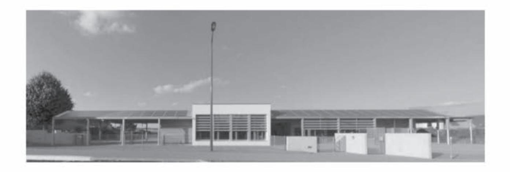

Dossier sujet : pages 2 à 5

Dossier pédagogique : pages 6 à 18

Dossier technique : pages 19 à 27

Les réflexions pédagogiques qui sont proposées dans ce sujet doivent amener à construire une séquence de formation relative **aux enseignements spécifiques de spécialité du baccalauréat STI2D.** Les programmes des enseignements spécifiques de spécialités résultent d'un prolongement de l'enseignement technologique transversal dans des champs techniques particuliers. Il est donc indispensable de lier les contenus de ces deux programmes. La réflexion devra porter sur cette particularité.

Les professeurs doivent proposer des activités concrètes afin que les élèves apprennent, mais ils sont également confrontés à une exigence de planification, de définition et de hiérarchisation de séquences d'enseignement cohérentes garantissant d'aborder tous les points du programme assignés. En plus de garantir la cohérence de l'enseignement, ce séquencement est aussi le point de départ de véritables mutualisations pédagogiques. Même si chaque enseignant reste libre de définir ses séquences et leurs contenus, la mutualisation des activités n'a de sens que si la relation programme/séquence/activités, qui peut être proposée, est correctement décrite. C'est à partir de cette identification que d'autres professeurs pourront adapter, modifier, améliorer une proposition donnée à un nouveau contexte.

### **Le concept de séquence**

Une séquence est une suite logique et articulée, de séances de formation, qui amène obligatoirement à une synthèse et à une structuration des connaissances découvertes et/ou approfondies et qui donne lieu à une évaluation des connaissances et/ou des compétences visées.

Dans la description du séquencement des enseignements transversaux proposée **(voir documents pédagogiques DP2)**, le choix a été fait de définir des séquences de durées variables de quelques semaines (ni trop peu pour garantir la possibilité d'agir et d'apprendre, ni trop longue pour ne pas générer de lassitude), s'intégrant entre chaque période de vacances.

Dans cette organisation, le concept de séquence respecte les données suivantes :

- − chaque séquence vise l'acquisition (découverte ou approfondissement) de compétences et connaissances précises du référentiel, identifiées dans le programme ;
- − chaque séquence permet d'aborder de 1 à 2 centres d'intérêt, voire 3 au maximum, de manière à faciliter les synthèses et limiter le nombre de supports ;
- − chaque séquence correspond à un thème unique de travail, porteur de sens pour les élèves et intégrant les centres d'intérêts utilisés ;
- − chaque séquence est constituée de 2 à 4 semaines consécutives au maximum ;
- − la durée de l'année scolaire est considérée égale à 30 semaines, de façon à laisser une marge de manœuvre pédagogique, laissant 6 semaines par année scolaire, à répartir entre les séquences, pour intégrer des remédiations, des évaluations, des sorties et visites, etc. ;
- − chaque séquence donne lieu à une séance de présentation à tous les élèves, explicitant les objectifs, l'organisation des apprentissages et les supports didactiques utilisés ;
- − chaque séquence donne lieu à une évaluation sommative, soit intégrée dans son déroulement, soit prévue dans le cours d'une séquence suivante.

Le séquencement des enseignements spécifiques de spécialité suit exactement les mêmes règles. Pour faciliter la flexibilité des organisations, des séquences de durée identique sont imposées en vis-à-vis des séquences de l'enseignement technologique transversal.

# **Les données d'entrée**

**La première donnée** est le programme STI2D, celui des enseignements technologiques transversaux est résumé dans la matrice du **DP2,** celui des enseignements spécifiques de spécialité est donné **DP1**.

**La deuxième entrée** dans le séquencement est le choix des centres d'intérêt, ils sont fournis dans le **DP1.**

**La troisième entrée** incontournable correspond à l'utilisation locale qui est faite de la dotation horaire globale pour l'enseignement technologique transversal (voir **DP3)** et pour la spécialité le détail est fourni dans le texte relatif au travail demandé.

**La quatrième entrée** concerne le système technique support de tout ou partie des activités de formation, il concerne la construction d'un ensemble scolaire à KOLBSHEIM (Bas-Rhin) qui est succinctement décrit ci-après et de manière complémentaire dans les dossiers techniques **DT1 à DT8**.

Une liste, non exhaustive, des documents et supports qui sont à la disposition du professeur pour construire ses séquences est donnée suite au questionnaire du sujet.

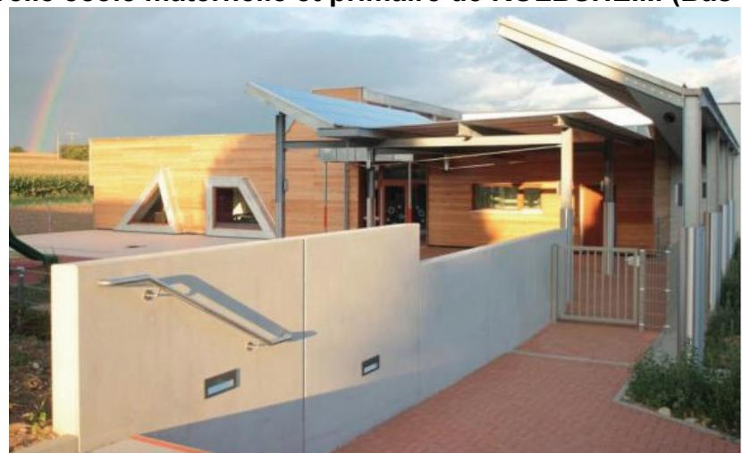

**Nouvelle école maternelle et primaire de KOLBSHEIM (Bas-Rhin)** 

### **Description sommaire de l'opération**

L'extension de la commune de Kolbsheim (67) s'accompagne de la création d'une nouvelle école maternelle et primaire. Cet établissement de plain-pied est à énergie positive.

Deux thèmes majeurs ont été pris en compte dans la conception et la réalisation de ce projet :

- − produire autant d'énergie que le bâtiment n'en consomme ;
- − optimiser la qualité de l'air intérieur.

Cette école possède une enveloppe thermique permettant de limiter les besoins en énergie et des équipements techniques performants. Une optimisation des apports solaires assure un confort supplémentaire.

La structure porteuse du bâtiment est de type poteaux-poutres en bois massif ; les préaux quant à eux sont constitués de portiques métalliques et d'une couverture en bac acier supportant les panneaux photovoltaïques. La couverture du reste du bâtiment est assurée par des bacs acier autoportants reposant sur des pannes en bois.

Le chauffage est assuré par des pompes à chaleur à sondes géothermiques et le renouvellement de l'air par une ventilation à double-flux à haut rendement.

L'intégration de panneaux photovoltaïque permet de produire au moins l'équivalent de la quantité d'énergie consommée, le bilan énergétique est donc positif.

Le contrôle de la consommation et de la production d'énergie s'effectue sur un panneau didactique.

La qualité de l'air a été particulièrement soignée : tous les matériaux ont été sélectionnés pour leur très faible teneur en COV (composés organiques volatiles) et formaldéhydes.

### **Travail demandé**

- **1. Commenter et analyser** l'organisation globale de l'enseignement technologique transversal et les choix pédagogiques réalisés pour la **séquence 4** décrite (voir **DP3**).
- **2. Décrire** de la même manière, l'organisation et les contenus de formation de la séquence d'enseignement spécifique de la spécialité **énergie et environnement de terminale STI2D**, correspondant à la séquence 4 ci-dessus de l'enseignement technologique transversal.

### Il est demandé de :

- − choisir les centres d'intérêt parmi ceux proposés ;
- − donner les items du programme abordés en cours et le nombre d'heures qui y seront consacrés ;
- − déterminer la nature (étude de dossier, activité pratique, projet) et le nombre d'activités en groupes allégés qui seront proposées aux élèves ainsi que la rotation prévue ;
- − définir l'objectif de formation de chacune des activités ;
- − préciser sur quels supports les activités sont réalisées sachant qu'une, au moins, est relative à l'ensemble scolaire de Kolbsheim.

Les choix d'utilisation de la dotation horaire globale par l'établissement conduisent à 3h de cours classe entière et 6h en groupes allégés, en enseignement spécifique de spécialité énergie et environnement.

La formalisation de la présentation est laissée à l'initiative du candidat. Elle peut s'appuyer ou reprendre celle des séquences de l'enseignement technologique transversal.

Une argumentation annexe sera développée afin de justifier les choix faits, et de mettre en évidence la liaison entre l'enseignement technologique transversal et celui spécifique de la spécialité énergie et environnement.

- **3. Décrire** le scénario d'une activité en groupes allégés (îlot de 4 à 5 élèves) dont une des activités s'appuiera sur le support proposé (école de Kolbsheim). Les éléments suivants doivent être impérativement développés :
  - − un rappel de l'objectif de formation, de la durée et de la nature de l'activité ;
  - − la liste et description détaillée des documents techniques nécessaires ;
  - − les éléments de didactisation du système ;
  - − la démarche pédagogique utilisée et la forme du travail (groupe, binôme, individuel, etc…) ;
  - − la description du travail demandé à l'élève et la relation avec les documents techniques remis.

- **4.** Le dernier point à développer concerne la rédaction d'une **fiche de synthèse des connaissances abordées lors de la séquence de formation**. Doivent être précisés :
  - la forme et la structure de la fiche de synthèse ;
  - les points clés retenus ;
  - leurs développements synthétiques.

# **Liste des documents et supports à disposition du professeur pour la construction de la séquence**

- 1. Maquette numérique du bâtiment réalisée sur modeleur 3D
- 2. Dossiers constructeurs :
  - − extraits du dossier de consultation des entreprises, y compris
    - o extraits du cahier des clauses techniques particulières tous corps d'état ;
    - o plans d'architecte du bâtiment ;
    - o plans des installations techniques ;
  - − étude acoustique complète du bâtiment ;
  - − note de calcul des déperditions thermiques.
- 3. Dossier comprenant des données mesurées à l'école de Kolbsheim (températures intérieures des salles, production photovoltaïque, bilan énergétique du système de chauffage).

# DOSSIER PÉDAGOGIQUE

# Spécialité énergie environnement

## **A- Objectifs et compétences de la spécialité énergie environnement du baccalauréat STI2D**

| Objectifs de formation            | Compétences attendues                                                                                                                                                                                                   |
|-----------------------------------|-------------------------------------------------------------------------------------------------------------------------------------------------------------------------------------------------------------------------|
|                                   | CO7.ee1. Participer à une démarche de conception dans le but de proposer plusieurs solutions possibles à un problème technique identifié en lien avec un enjeu énergétique.                                       |
| O7 - Imaginer une                 | CO7.ee2. Justifier une solution retenue en intégrant les conséquences des choix sur le triptyque Matériau - Ėnergie – Information.                                                                                   |
| solution, répondre à un besoin | CO7.ee3. Définir la structure, la constitution d'un système en fonction des caractéristiques technico-économiques et environnementales attendues.                                                        |
|                                   | CO7.ee4. Définir les modifications de la structure, les choix de constituants et du type de système de gestion d'une chaîne d'énergie afin de répondre à une évolution d'un cahier des charges.                   |
|                                   | CO8.ee1. Renseigner un logiciel de simulation du comportement énergétique avec les caractéristiques du système et les paramètres externes                                                                            |
| O8 – Valider des solutions     | pour un point de fonctionnement donné. CO8.ee2. Interpréter les résultats d'une simulation afin de valider une solution ou l'optimiser.                                                                           |
| techniques                        | CO8.ee3. Comparer et interpréter le résultat d'une simulation d'un comportement d'un système avec un comportement réel.                                                                         |
|                                   | CO8.ee4. Mettre en œuvre un protocole d'essais et de mesures sur le prototype d'une chaîne d'énergie, interpréter les résultats.                                                                                     |
|                                   | CO9.ee1. Expérimenter des procédés de stockage, de production, de transport, de transformation, d'énergie pour aider à la conception                                                                                 |
| O9 – Gérer la vie du produit   | d'une chaîne d'énergie. CO9.ee2. Réaliser et valider un prototype obtenu en réponse à tout ou partie du cahier des charges initial. CO9.ee3. Intégrer un prototype dans un système à modifier pour valider son |
|                                   | comportement et ses performances.                                                                                                                                                                                       |

### **B- Programme de la spécialité EE du baccalauréat STI2D.**

### **1. Projet technologique**

*Objectif général de formation : vivre les principales étapes d'un projet technologique justifié par la modification d'un système existant, imaginer et représenter un principe de solution technique à partir d'une démarche de créativité.*

| 1.1 La démarche de projet                                                                                                                                                                                                                                   | ETC | P/T | Tax | Commentaires                                                                                                                                                          |
|-------------------------------------------------------------------------------------------------------------------------------------------------------------------------------------------------------------------------------------------------------------|-----|-----|-----|-----------------------------------------------------------------------------------------------------------------------------------------------------------------------|
| Les projets industriels.                                                                                                                                                                                                                                    |     |     |     |                                                                                                                                                                       |
| Typologie des entreprises industrielles et des projets techniques associés (projets locaux, transversaux, « joint venture »).                                                                                                                         |     | P   | 1   | Présentation à partir de cas industriels représentatifs de la gestion d'énergie d'objets manufacturés en grande série                                           |
| Phases d'un projet industriel (marketing, pré conception, pré industrialisation et conception détaillée, industrialisation, maintenance et fin de vie).                                                                                            |     | P   | 2   | et petites séries. Les études de dossiers technologiques proposées doivent permettre l'identification d'innovations technologiques et amener à des études |
| Principes d'organisation et planification d'un projet (développement séquentiel, chemin critique, découpage du projet en fonctions élémentaires ou en phases) Gestion, suivi et finalisation d'un projet (coût, budget, bilan d'expérience). |     | P   | 2   | comparatives de coûts.                                                                                                                                                |

| Les projets pédagogiques et technologique                                                                                                                                                                                                                                                            | es  |     |     |                                                                                                                                                                                                                                                                                                                                                                                                                |
|------------------------------------------------------------------------------------------------------------------------------------------------------------------------------------------------------------------------------------------------------------------------------------------------------|-----|-----|-----|----------------------------------------------------------------------------------------------------------------------------------------------------------------------------------------------------------------------------------------------------------------------------------------------------------------------------------------------------------------------------------------------------------------|
| Ètapes et planification d'un projet technologique (revues de projets, travail collaboratif en équipe projet : ENT, base de données, formats d'échange, carte mentale, flux opérationnels).                                                                                                           |     | P/T | 3   | Il s'agit d'expliquer et d'illustrer les grandes étapes d'un projet technologique et pédagogique pour les faire vivre aux élèves au cours du cycle terminal STI2D à travers des microprojets et un projet technologique                                                                                                                                                                         |
| Animation d'une revue de projet ou management d'une équipe projet.                                                                                                                                                                                                                                   |     | P/T | 3   | en terminale.                                                                                                                                                                                                                                                                                                                                                                                                  |
| Évaluation de la prise de risque dans un projet par le choix des solutions technologiques (innovations technologiques, notion de coût global, veille technologique).                                                                                                                                 |     | P/T | 2   |                                                                                                                                                                                                                                                                                                                                                                                                                |
| 1.2 Paramètres de la compétitivité                                                                                                                                                                                                                                                                   | ETC | P/T | Tax | Commentaires                                                                                                                                                                                                                                                                                                                                                                                                   |
| Conformité à une norme. L'ergonomie : sécurité dans les relations homme - système, maintenabilité, fiabilité. Innovation technologique : intégration des fonctions et optimisation du fonctionnement, solutions intégrant des énergies renouvelables. Influence de la durée de vie des constituants. | *   | P/T | 2   | Les études de dossiers technologiques proposées doivent permettre l'identification d'innovations ou de solutions technologiques conduisant à diminuer l'impact environnemental en réponse à un besoin énergétique. Ces études amènent : - à des études comparatives de performances et de coûts ; - à comprendre en quoi la conformité à une norme ou l'amélioration de l'ergonomie peut valoriser un système. |
| 1.3 Vérification des performances                                                                                                                                                                                                                                                                    | ETC | P/T | Tax | Commentaires                                                                                                                                                                                                                                                                                                                                                                                                   |
| Contraintes du cahier des charges : performances, qualité, sécurité, temps caractéristiques.                                                                                                                                                                                                         | *   | P/T | 3   | La vérification permet de s'assurer que les performances restent dans des limites acceptables (du point de vue du cahier des charges).                                                                                                                                                                                                                                                                         |
| Recette du prototype au regard des besoins formalisés dans le cahier des charges.                                                                                                                                                                                                                    |     | T   | 3   | La recette se limite aux aspects fonctionnels et comportementaux.                                                                                                                                                                                                                                                                                                                                              |
| 1.4 Communication technique                                                                                                                                                                                                                                                                          | ETC | P/T | Tax | Commentaires                                                                                                                                                                                                                                                                                                                                                                                                   |
| Compte rendu d'une activité de projet Présentation d'une intention de conception ou d'une solution. Animation d'une revue de projet.                                                                                                                                                                 | *   | P/T | 3   | Au sein d'un groupe de projet, chaque élève peut, à tour de rôle, assurer le rôle d'animateur ou de participant.                                                                                                                                                                                                                                                                                         |

# 2. Conception d'un système

Objectif général de formation : définir tout ou partie des fonctions assurées par une chaîne d'énergie et le système de gestion associé, anticiper ou vérifier leurs comportements par simulation.

| 2.1 Approche fonctionnelle d'une chaîne d'énergie                                                                                                                                                                 | ETC | P/T | Tax | Commentaires                                                                                                                                                                                                                                                                                                                                                    |
|-------------------------------------------------------------------------------------------------------------------------------------------------------------------------------------------------------------------|-----|-----|-----|-----------------------------------------------------------------------------------------------------------------------------------------------------------------------------------------------------------------------------------------------------------------------------------------------------------------------------------------------------------------|
| Structure fonctionnelle d'une chaîne d'énergie, graphe de structure d'une chaîne d'énergie.                                                                                                                       | *   | P/T | 3   | Il s'agit, dans la spécialité, de construire un graphe définissant la structure fonctionnelle de la chaîne d'énergie. Il s'agit également de caractériser les grandeurs influentes et les grandeurs influencées en entrées/sorties de chaque processus élémentaire de stockage, transfert et de transformation d'énergie mis en œuvre dans la chaîne d'énergie. |
| Schéma de transfert d'énergie.                                                                                                                                                                                    | *   | P/T | 3   | L'importance du schéma de transfert d'énergie est mise en évidence dans le cadre de l'optimisation énergétique.                                                                                                                                                                                                                                           |
| Structures d'alimentation en énergie multi- transformateur.                                                                                                                                                    | *   | P/T | 3   | Il s'agit de pouvoir choisir ou adapter une structure d'alimentation pour répondre à un profil de besoin de consommation énergétique.                                                                                                                                                                                                                  |
| 2.2 Approche fonctionnelle du système de gestion de la chaîne d'énergie                                                                                                                                           | ETC | P/T | Тах | Commentaires                                                                                                                                                                                                                                                                                                                                                    |
| Gestion de l'information dédiée aux applications énergétiques, caractéristiques des fonctions des systèmes.                                                                                                       | *   | P   | 3   | Il s'agit de transposer les savoirs et savoir-faire relatifs aux systèmes de gestion de l'information abordés dans les enseignements technologiques transversaux au contexte de gestion de l'énergie.                                                                                                                                            |
| Fonctions de communication homme - système : types et caractéristiques.                                                                                                                                           | *   | P/T | 2   | L'étude des fonctionnalités assurées par une interface homme-système permet de mettre en évidence la réponse aux besoins de gestion de l'énergie et aux besoins d'interactivité entre l'utilisateur et le système.                                                                                                                                              |
| Autour d'un point de fonctionnement donné, systèmes asservis ou régulés : - représentation fonctionnelle (schémas blocs, chaîne d'action et de retour, correcteur ; - grandeur réglée, réglante et perturbatrice. |     | P/T | 2   | Dans le cas d'études d'un système asservi ou régulé, il s'agit d'identifier les grandeurs caractéristiques et les fonctions, de décoder ou de modifier un schéma-bloc.                                                                                                                                                                              |
| 2.3 Paramètre influent la conception                                                                                                                                                                              | ETC | P/T | Tax | Commentaires                                                                                                                                                                                                                                                                                                                                                    |
| Efficacité énergétique passive et active d'un système.                                                                                                                                                            | *   | P/T | 3   | Ce concept a été abordé dans les enseignements technologiques transversaux. Dans l'enseignement spécifique de la spécialité, il s'agit de proposer et de transposer des solutions permettant d'améliorer l'efficacité énergétique d'un système.                                                                                                                 |

| 2.4 Approche comportementale                                                                                                                                                                                                                                              | ETC     | P/T   | Тах | Commentaires                                                                                                                                                                                                                                                                                                                  |
|---------------------------------------------------------------------------------------------------------------------------------------------------------------------------------------------------------------------------------------------------------------------------|---------|-------|-----|-------------------------------------------------------------------------------------------------------------------------------------------------------------------------------------------------------------------------------------------------------------------------------------------------------------------------------|
| 2.4.1 Comportement énergétique des sys                                                                                                                                                                                                                                    | stèmes  |       |     |                                                                                                                                                                                                                                                                                                                               |
| Comportement dynamique d'un mécanisme. Théorème de l'énergie cinétique. Inertie ramenée sur l'arbre primaire. Exploitation d'une maquette numérique et d'un résultat de simulation.                                                                                       |         | Т     | 3   | Les solides étudiés sont des constituants ou des composants d'une chaîne d'énergie. Il s'agit de mettre en évidence l'influence d'une inertie sur une chaîne d'énergie.                                                                                                                                           |
| Comportement temporel des constituants d'une chaîne d'énergie, représentation. Caractéristiques et comportements thermique et acoustique des matériaux et parois d'un bâtiment.                                                                                           | *       | P/T   | 3   | Dans le cas d'un bâtiment, le comportement thermique ou acoustique est étudié sur une paroi composite ou une partie vitrée.                                                                                                                                                                                                   |
| Charge d'une chaîne d'énergie : définition, types de charges, caractérisation.                                                                                                                                                                                            | *       | P/T   | 3   | La caractérisation de la charge se fait par mesure ou par simulation.  Dans le cas d'un bâtiment, l'étude se limite à l'identification des paramètres influents de la structure sur le comportement de la charge.                                                                                                             |
| Optimisation des échanges d'énergie entre source et charge, amélioration de l'efficacité énergétique : disponibilité, puissance, reconfiguration, qualité, adaptabilité au profil de charge, inertie, régularité, modes de fonctionnement (marche, arrêt, intermittence). | *       | Т     | 3   | Ce concept abordé dans les enseignements technologiques communs, est approfondi dans la spécialité en vue de proposer et de transposer des solutions permettant d'optimiser les échanges d'énergie entre source et charge.                                                                                                    |
| 2.4.2 Gestion de l'énergie en temps réel                                                                                                                                                                                                                                  |         |       |     |                                                                                                                                                                                                                                                                                                                               |
| Contrôle instantané du fonctionnement du système en vue d'un maintien au plus près d'un point de fonctionnement.                                                                                                                                                          |         | Т     | 3   | Identification du principe utilisé (régulation, asservissement) et caractérisation des paramètres influant sur le contrôle instantané du fonctionnement du système en vue d'un maintien au plus près d'un point de fonctionnement.                                                                                            |
| Diagramme états - transitions pour un système évènementiel.                                                                                                                                                                                                               | *       | P/T   | 3   | L'activité de limite à l'analyse d'un diagramme états-transitions simple.                                                                                                                                                                                                                                                     |
| 2.4.3 Validation comportementale par sir                                                                                                                                                                                                                                  | nulatio | n     |     |                                                                                                                                                                                                                                                                                                                               |
| Loi de commande, paramètres du modèle de comportement, paramètres de l'environnement.  Validation du comportement énergétique d'une structure par simulation.  Validation du comportement du système de gestion d'une chaîne d'énergie par simulation.                    | *       | P/T   | 3   | Les outils de simulation, complémentaires aux expérimentations, sont mis en œuvre régulièrement pour comprendre, analyser ou prédire un comportement ou un résultat, pour aider au paramétrage et au dimensionnement de constituants. La mise en œuvre des outils de\nsimulation s'appuie sur l'utilisation de bibliothèques. |
| 2.5 Critères de choix de solutions                                                                                                                                                                                                                                        | ETC     | 1re/T | Tax | Commentaires                                                                                                                                                                                                                                                                                                                  |
| Constituants matériels et logiciels associés aux fonctions techniques assurées par la chaîne d'énergie et répondant aux performances attendues.  Type de système de gestion de l'énergie.                                                                                 | *       | P/T   | 3   | Les principales caractéristiques des constituants sont étudiées en vue de les choisir ou de valider des choix. Le choix de capteur s'inscrit dans une recherche d'optimisation de la                                                                                                                              |

| Interfaces entre le système de gestion de l'énergie et la chaîne d'énergie. Capteurs. Protections contre les surintensités et contre les surcharges. Conducteurs. |   |   | consommation énergétique ou dans le cadre du projet pour prélever des grandeurs caractéristiques destinées au système de télégestion et de télésurveillance.                                                                                                                                                        |
|-------------------------------------------------------------------------------------------------------------------------------------------------------------------|---|---|---------------------------------------------------------------------------------------------------------------------------------------------------------------------------------------------------------------------------------------------------------------------------------------------------------------------------------|
| Coût global d'un système : investissement initial, maintenance, entretien, adaptation à l'usage, consommation énergétique.                                        | Т | 3 | La recherche de l'optimisation du coût global d'un système ou d'un constituant se fait en envisageant différents systèmes de gestion de l'énergie et (ou) différents scénarios de cycle de vie. Cette recherche permet d'identifier les parties du système les plus pénalisantes d'un point de vue de l'impact environnemental. |

### 3. Transports et distribution d'énergie, études de dossiers technologiques Objectif général de formation : développer une culture des solutions technologiques de transport et de distribution d'énergie.

| 3.1 Production et transport d'énergie                                                                                                                      | ETC | P/T | Tax | Commentaires                                                                                                                                                                                                                                                                                                                                                                                                                                                                 |
|------------------------------------------------------------------------------------------------------------------------------------------------------------|-----|-----|-----|------------------------------------------------------------------------------------------------------------------------------------------------------------------------------------------------------------------------------------------------------------------------------------------------------------------------------------------------------------------------------------------------------------------------------------------------------------------------------|
| Types et caractéristiques des centrales électriques, hydrauliques, thermiques Types de solutions de production d'énergies renouvelables, caractéristiques. |     | Р   | 2   | Études pouvant se faire dans le cadre de préparations d'exposés, de comptes rendus suite à des visites de sites industriels, de conférences.                                                                                                                                                                                                                                                                                                                                 |
| Structure d'un réseau de transport et de distribution d'énergie électrique, caractéristiques et pertes.                                                    |     | Т   | 2   | Il s'agit d'aborder l'intérêt d'utiliser le courant alternatif, des niveaux élevés de tensions, un réseau triphasé plutôt que monophasé. L'utilisation du courant continu peut être abordée dans le cadre d'études de cas particulières telles que les interconnexions sous-marines. Les études de dossiers technologiques permettent de montrer les spécificités et modes d'exploitation différents selon la structure de réseau utilisée (maillée, radiale, arborescente). |
| Distribution de l'énergie électrique.                                                                                                                      |     | Т   | 2   | La distribution électrique est identifiée au sein d'un schéma général de production, transport et distribution, et placée dans le contexte d'utilisation de l'énergie (quartiers, usines, transports ferroviaires). Les études se limitent aux caractéristiques de tensions.                                                                                                                                                                                                 |
| Structure d'un réseau de production, de transport et de distribution de fluides.                                                                           |     | Р   | 2   | Les études de dossiers technologiques abordent les composants principaux des réseaux de transport par canalisation et les contraintes de sécurité.                                                                                                                                                                                                                                                                                                                  |
| Gestion du réseau de transport. Comptage et facturation de l'énergie. Impact environnemental.                                                              |     | Т   | 2   | Les nouvelles stratégies de gestion des réseaux d'énergie sont abordées au travers de cas d'étude (réseaux « intelligents »). L'impact environnemental est abordé au travers d'une analyse fine de l'usage et d'une meilleure relation avec l'action des usagers.                                                                                                                                                                                                            |

### **4. Réalisation et qualification d'un prototype**

*Objectif général de formation : réaliser un prototype répondant à un cahier des charges et vérifier sa conformité, effectuer des essais et des réglages en vue d'une optimisation.*

| 4.1 Réalisation d'un prototype                                                                                                                                                                                                                                                                                                                                                    | ETC | P/T | Tax | Commentaires                                                                                                                                                                                                            |
|-----------------------------------------------------------------------------------------------------------------------------------------------------------------------------------------------------------------------------------------------------------------------------------------------------------------------------------------------------------------------------------|-----|-----|-----|-------------------------------------------------------------------------------------------------------------------------------------------------------------------------------------------------------------------------|
| Décodage de notices techniques et des procédures d'installation.                                                                                                                                                                                                                                                                                                               |     | P/T | 3   | L'activité de décodage est nécessaire pour intégrer et mettre en œuvre un constituant, pour identifier une amélioration souhaitable dans un système.                                                        |
| Agencement, paramétrage et interconnexion de constituants de la chaîne d'énergie.                                                                                                                                                                                                                                                                                           |     | P/T | 3   | Un compte-rendu est rédigé pour formaliser les procédures, les paramétrages et les choix retenus.                                                                                                                 |
| Mise en œuvre d'un système local de gestion de l'énergie.                                                                                                                                                                                                                                                                                                                      |     | P/T | 3   | La mise en œuvre se limite à la réalisation des interconnexions avec la chaîne d'énergie et au paramétrage du système local de gestion                                                                         |
| Mise en œuvre d'un système de télégestion et de télésurveillance.                                                                                                                                                                                                                                                                                                              |     | T   | 3   | La mise en œuvre du système de télégestion et de télésurveillance se fait dans le cadre des projets pour assurer le suivi des performances énergétiques et le pilotage éventuel du prototype à distance. |
| 4.2 Sécurité                                                                                                                                                                                                                                                                                                                                                                      | ETC | P/T | Tax | Commentaires                                                                                                                                                                                                            |
| Techniques liées à la sécurité : notion de redondance, auto-surveillance. Prévention des risques : prévention intrinsèque, protection, information.                                                                                                                                                                                                                      |     | T   | 2   | Les principes généraux sont abordés au travers d'études de cas et appliqués au cours des activités de projet.                                                                                                     |
| 4.3 Essais et réglages en vue d'assurer le fonctionnement et d'améliorer les performances                                                                                                                                                                                                                                                                                   | ETC | P/T | Tax | Commentaires                                                                                                                                                                                                            |
| Protocole d'essais, essais et caractérisation des écarts par rapport au comportement attendu. Essais hors énergie, essais statiques en énergie, essais dynamiques. Démarche raisonnée d'identification des causes des écarts et de résolution des problèmes. Paramètres à ajuster pour un fonctionnement spécifié d'un système ou d'un constituant. |     | P/T | 3   | Il s'agit de mener une démarche raisonnée et progressive alternant essai, analyse des observations et comparaison du comportement attendu puis ajustements sur le système.                                  |

# **Extrait du document ressource : proposition de centres d'intérêt en EE**

|      | Centres d'intérêt                                                                      | Outils et activités mis en œuvre                                                                                                                                                                                                                                                                                                                                                                                                                                | Connaissances abordées                                                                                                                                                                                                                                                                                                                                                                 | Réf de                           |
|------|----------------------------------------------------------------------------------------|-----------------------------------------------------------------------------------------------------------------------------------------------------------------------------------------------------------------------------------------------------------------------------------------------------------------------------------------------------------------------------------------------------------------------------------------------------------------|----------------------------------------------------------------------------------------------------------------------------------------------------------------------------------------------------------------------------------------------------------------------------------------------------------------------------------------------------------------------------------------|----------------------------------|
|      | proposés                                                                               |                                                                                                                                                                                                                                                                                                                                                                                                                                                                 |                                                                                                                                                                                                                                                                                                                                                                                        | compétences visées            |
| CI 1 | Typologie des systèmes énergétiques                                              | Mise en œuvre d'un équipement didactique. Modélisation des chaînes d'énergie. Systèmes techniques intégrant une gestion d'énergie, de charge, d'énergies renouvelables. Systèmes mono source ou multi sources Équipements didactiques du laboratoire EE.                                                                                                                                                                                | Approche fonctionnelle d'une chaîne d'énergie. Approche fonctionnelle du système de gestion de la chaîne d'énergie. Décodage des procédures d'installation. Mise en œuvre d'un système local de gestion de l'énergie.                                                                                                                                          | CO7.EE3 CO8.EE4               |
| CI 2 | Production d'énergie                                                                | Caractérisation d'un système de production d'énergie. Systèmes de production d'électricité, de chaleur et de froid. Dispositif d'acquisition de données multi physiques. Études réalisées sur des dossiers réels avec possibilité de faire des visites sur site ou conférence.                                                                                                                                                          | Types et caractéristiques des centrales électriques, hydrauliques, thermiques. Types de solutions de production d'énergies renouvelables, caractéristiques. Sûreté de fonctionnement et prévention des risques.                                                                                                                                                | CO7.EE3 CO8 CO9.EE1        |
| CI 3 | Transport, stockage et distribution de l'énergie et réseaux spécifiques | Caractérisation de la structure d'un réseau de transport et de distribution d'énergie et simulations associées. Le stockage d'énergie et solutions associées. Études réalisées sur des dossiers réels avec possibilité de faire une visite sur site ou conférence.                                                                                                                                                                         | Comportement énergétique des systèmes et validation comportementale par simulation. Structure d'un réseau de transport et de distribution d'électricité. Structure d'un réseau de transport et de distribution de fluides. Comptage et facturation de l'énergie. Impact environnemental. Sûreté de fonctionnement et prévention des risques. | CO7.EE3 CO8 CO9.EE1        |
| CI 4 | Efficacité énergétique passive                                                   | Efficacité et rendement d'une chaîne d'énergie. Comportement des constituants (modulateurs, convertisseurs, transmetteurs). Solutions passives d'amélioration de l'efficacité énergétique. Équipements didactiques pour comparaisons, modifications. Logiciels de simulation (dans le cadre de l'habitat par exemple).                                                                                                            | Projet technologique. Approche fonctionnelle d'une chaîne d'énergie. Sûreté de fonctionnement et prévention des risques. Essais et réglages en vue d'assurer le fonctionnement et d'améliorer les performances.                                                                                                                                                | CO7 CO8 CO9.EE2 CO9.EE3 |
| CI 5 | Efficacité énergétique active                                                    | Caractérisation du mode de gestion de l'énergie d'un système. Paramétrage de l'unité de gestion. Évaluation d'une solution active d'amélioration de l'efficacité énergétique. Équipements didactiques intégrant une solution de gestion par l'apport d'une interface de la chaîne d'information paramétrable ou programmable et intégrée à la chaîne d'énergie (automate, régulation, télégestion, télésurveillance, etc.). | Projet technologique. Approche fonctionnelle du système de gestion de la chaîne d'énergie. Sûreté de fonctionnement et prévention des risques. Essais et réglages en vue d'assurer le fonctionnement et d'améliorer les performances.                                                                                                                       | CO7 CO8 CO9.EE2 CO9.EE3 |

# **Centres d'intérêt retenus pour l'enseignement technologique transversal**

| CI 1  | Développement durable et compétitivité des produits                 |
|-------|---------------------------------------------------------------------|
| CI 2  | Design, architecture et innovations technologiques                  |
| CI 3  | Caractérisation des matériaux et structures                         |
| CI 4  | Dimensionnement et choix des matériaux et structures                |
| CI 5  | Efficacité énergétique dans l'habitat et les transports             |
| CI 6  | Efficacité énergétique liée au comportement des matériaux           |
| CI 7  | Formes et caractéristiques de l'énergie                             |
| CI 8  | Caractérisation des chaînes d'énergie                               |
| CI 9  | Amélioration de l'efficacité énergétique dans les chaînes d'énergie |
| CI 10 | Efficacité énergétique liée à la gestion de l'information           |
| CI 11 | Commande temporelle des systèmes                                    |
| CI 12 | Formes et caractéristiques de l'info                                |
| CI 13 | Caractérisation des chaines d'info.                                 |
| CI 14 | Traitement de l'information                                         |
| CI 15 | Optimisation des paramètres par simulation globale                  |

# **Compétences du programme de l'enseignement technologique transversal**

|                         | Objectifs de formation                                                                                                            | Compétences attendues                                                                                                                                                                                                                                                                                                                                                                                                                                                                                                  |
|-------------------------|-----------------------------------------------------------------------------------------------------------------------------------|------------------------------------------------------------------------------------------------------------------------------------------------------------------------------------------------------------------------------------------------------------------------------------------------------------------------------------------------------------------------------------------------------------------------------------------------------------------------------------------------------------------------|
| ment durable            | O1 - Caractériser des systèmes privilégiant un usage raisonné du point de vue développement durable                      | CO1.1. Justifier les choix des matériaux, des structures d'un système et les énergies mises en œuvre dans une approche de développement durable. CO1.2. Justifier le choix d'une solution selon des contraintes d'ergonomie et d'effets sur la santé de l'homme et du vivant.                                                                                                                                                                                                                              |
| Société et développe | O2 - Identifier les éléments permettant la limitation de l'Impact environnemental d'un système et de ses constituants | CO2.1. Identifier les flux et la forme de l'énergie, caractériser ses transformations et/ou modulations et estimer l'efficacité énergétique globale d'un système. CO2.2. Justifier les solutions constructives d'un système au regard des impacts environnementaux et économiques engendrés tout au long de son cycle de vie.                                                                                                                                                                           |
|                         | O3 - Identifier les éléments influents du développement d'un système                                                        | CO3.1. Décoder le cahier des charges fonctionnel d'un système. CO3.2. Évaluer la compétitivité d'un système d'un point de vue technique et économique.                                                                                                                                                                                                                                                                                                                                                           |
| Technologie             | O4 - Décoder l'organisation fonctionnelle, structurelle et logicielle d'un système                                          | CO4.1. Identifier et caractériser les fonctions et les constituants d'un système ainsi que ses entrées/sorties. CO4.2. Identifier et caractériser l'agencement matériel et/ou logiciel d'un système. CO4.3. Identifier et caractériser le fonctionnement temporel d'un système. CO4.4. Identifier et caractériser des solutions techniques relatives aux matériaux, à la structure, à l'énergie et aux informations (acquisition, traitement, transmission) d'un système. |
|                         | O5 - Utiliser un modèle de comportement pour prédire un fonctionnement ou valider une performance                        | CO5.1. Expliquer des éléments d'une modélisation proposée relative au comportement de tout ou partie d'un système. CO5.2. Identifier des variables internes et externes utiles à une modélisation, simuler et valider le comportement du modèle. CO5.3. Évaluer un écart entre le comportement du réel et le comportement du modèle en fonction des paramètres proposés.                                                                                                        |
| munica. m Co      | O6 - Communiquer une idée, un principe ou une solution technique, un projet, y compris en langue étrangère            | CO6.1. Décrire une idée, un principe, une solution, un projet en utilisant des outils de représentation adaptés. CO6.2. Décrire le fonctionnement et/ou l'exploitation d'un système en utilisant l'outil de description le plus pertinent. CO6.3. Présenter et argumenter des démarches, des résultats, y compris dans une langue étrangère.                                                                                                                                                            |

| ment technologique transversal |
|--------------------------------|
|                                |
|                                |
|                                |
|                                |
|                                |
|                                |
|                                |
|                                |
|                                |
|                                |
|                                |
|                                |
|                                |
| Matrice de l'enseigne          |
|                                |
|                                |
|                                |
|                                |
|                                |
|                                |
|                                |
|                                |
|                                |
|                                |
|                                |
|                                |
|                                |
|                                |
|                                |
|                                |
| Dossier Pédagogique DP2 -      |
|                                |
|                                |
|                                |
|                                |
|                                |
|                                |

|                                               | 15              |                                |                           |               |                       |                                   |                                      |                                                       |                                                          |                        | 1                           |                         | 1                          | 6                                         |                        |                                            | 4                                      |                               | 12                          |
|-----------------------------------------------|-----------------|--------------------------------|---------------------------|---------------|-----------------------|-----------------------------------|--------------------------------------|-------------------------------------------------------|----------------------------------------------------------|------------------------|-----------------------------|-------------------------|----------------------------|-------------------------------------------|------------------------|--------------------------------------------|----------------------------------------|-------------------------------|-----------------------------|
|                                               | 14              |                                |                           |               |                       |                                   |                                      |                                                       | 12                                                       |                        | 1                           |                         |                            |                                           |                        |                                            | 25                                     | 22                            | 60                          |
|                                               | 13              |                                |                           |               |                       |                                   |                                      |                                                       | 8                                                        |                        | 4                           |                         |                            |                                           |                        |                                            |                                        |                               | 12                          |
| Centres d'intérêts et répartitions des heures | 12              |                                |                           | 2             |                       |                                   |                                      |                                                       | 4                                                        |                        |                             |                         |                            |                                           |                        |                                            |                                        |                               | 6                           |
|                                               | 11              |                                |                           |               |                       |                                   |                                      |                                                       | 12                                                       |                        |                             |                         |                            |                                           |                        | 20                                         | 15                                     |                               | 47                          |
|                                               | 10              |                                |                           |               |                       |                                   |                                      | 7                                                     | 3                                                        |                        | 1                           |                         |                            |                                           |                        | 6                                          | 6                                      |                               | 23                          |
|                                               | 9               |                                |                           |               |                       |                                   |                                      | 20                                                    |                                                          |                        | 1                           |                         |                            |                                           |                        | 20                                         |                                        |                               | 41                          |
|                                               | 8               |                                |                           |               |                       |                                   | 4                                    |                                                       |                                                          |                        | 4                           |                         |                            |                                           |                        | 10                                         |                                        |                               | 18                          |
|                                               | 7               |                                |                           | 2             |                       |                                   |                                      | 4                                                     |                                                          |                        |                             |                         |                            |                                           |                        |                                            |                                        |                               | 6                           |
|                                               | 6               |                                |                           |               |                       |                                   |                                      |                                                       |                                                          | 2                      | 2                           |                         | 4                          | 2                                         | 6                      | 20                                         |                                        |                               | 36                          |
|                                               | 5               |                                |                           |               |                       |                                   | 4                                    | 10                                                    |                                                          | 2                      | 1                           |                         |                            |                                           |                        |                                            |                                        |                               | 17                          |
|                                               | 4               |                                |                           |               |                       |                                   |                                      |                                                       |                                                          | 2                      | 1                           |                         | 8                          | 20                                        | 16                     | 8                                          |                                        |                               | 55                          |
|                                               | 3               |                                |                           |               |                       |                                   | 4                                    |                                                       |                                                          | 2                      | 4                           |                         | 4                          | 12                                        |                        |                                            |                                        |                               | 26                          |
|                                               | 2               | 6                              | 3                         | 2             | 4                     |                                   |                                      |                                                       |                                                          | 10                     |                             |                         |                            |                                           |                        |                                            |                                        |                               | 25                          |
|                                               | 1               |                                | 3                         |               | 4                     | 20                                | 4                                    |                                                       |                                                          | 2                      |                             |                         | 2                          |                                           |                        |                                            |                                        |                               | 35                          |
|                                               | H               |                                |                           |               |                       |                                   |                                      | 16                                                    | 22                                                       |                        |                             |                         | 12                         |                                           | 16                     | 52                                         | 20                                     | 22                            | 420                         |
|                                               | Chapitre 3      |                                |                           |               |                       |                                   |                                      | Typologie des solutions constructives de l'énergie | Traitement de l'information                              |                        |                             |                         | Choix des matériaux        | Typologie des solutions constructives des | liaisons entre solides | Transfor., modulation, sStockage d'énergie | Acquisition et codage de l'information | Transmission de l'information | TOTAL                       |
|                                               | H               | 6                              | 6                         | 4             | 8                     | 20                                | 16                                   | 25                                                    | 15                                                       | 20                     | 20                          | 4                       | 8                          | 30                                        | 16                     | 32                                         | 30                                     |                               | 260                         |
|                                               | Chapitre 1 et 2 | Paramètres de la compétitivité | Cycle de vie d'un produit | Compromis CEC | Étapes de la démarche | Mise à disposition des ressources | Utilisation raisonnée des ressources | Organisation fonctionnelle d'une chaîne d'énergie  | Organisation fonctionnelle d'une chaîne d'information | Représentation du réel | Représentations symboliques | Modèles de comportement | Comportement des matériaux | Comportement mécanique des S.             | Structures porteuses   | Comportement énergétique des systèmes      | Comportement informationnel des        | Systèmes                      | sous total chapitres 1 et 2 |
|                                               |                 | Compétitivité et               | créativité                |               | Eco conception        |                                   |                                      | fonctionnelle des Approche                         | systèmes                                                 | Outils de              | représentation              | Approche                | comportementale            |                                           |                        |                                            |                                        |                               |                             |

|                       | 6 6                           |                                        |                                             | 10 6                          | 12 4                                  | 14 12                                | 8 18                                             |                                                         | 10 6                                    | 12 4                                         | 4 12 4                  |
|-----------------------|----------------------------------|----------------------------------------|---------------------------------------------|----------------------------------|------------------------------------------|-----------------------------------------|-----------------------------------------------------|---------------------------------------------------------|--------------------------------------------|-------------------------------------------------|-------------------------------|
|                       |                                  |                                        | 6                                           |                                  |                                          |                                         |                                                     | 4                                                       |                                            |                                                 | 12                            |
|                       |                                  |                                        | 10                                          |                                  |                                          |                                         |                                                     | 12                                                      |                                            |                                                 |                               |
|                       |                                  | 24                                     |                                             |                                  |                                          |                                         |                                                     |                                                         |                                            |                                                 |                               |
|                       | 12                               |                                        |                                             |                                  |                                          | 6                                       | 6                                                   |                                                         |                                            |                                                 |                               |
|                       | 24                               | 24                                     | 16                                          | 16                               | 16                                       | 32                                      | 32                                                  | 16                                                      | 16                                         | 16                                              | 32                            |
| Compétences           | CO1.1 / CO2.1 / CO6.1 /          | CO1.2 / CO2.2 / CO6.1 /                | C04.1 / CO4.4 / CO6.2 /                     | CO6.2 C04.1 / C04.2 / CO4.4 / | CO6.2 C04.1 / C04.2 / CO4.3 / CO4.4 / | C01.1 / CO2.1 / C02.2 / CO5.1 / CO6.2 / | C01.1 / CO2.1 / C02.2 / CO5.1 / CO6.2 /             | CO2.2 / C05.1 / CO5.2 / CO6.2 /                         | CO2.2 / C05.1 / CO5.2 / CO6.2 /            | CO2.2 / C05.1 / CO5.2 / CO6.2 /                 | CO3.1 / CO3.2 / CO5.3         |
| Séquences de première | 1- Éco construction des produits | 2- Design et architecture des produits | 3- Structure et matériaux dans les ouvrages | 4- Énergie dans les ouvrages     | 5 - Information dans les ouvrages        | 6- Efficacité énergétique et matériaux  | 7- Efficacité énergétique et systèmes d'information | Structure et matériaux des systèmes mécatroniques 8- | 9- Énergie dans les systèmes mécatroniques | 10- Information dans les systèmes mécatroniques | 11- Comportement des systèmes |

# **Dossier Pédagogique DP2 - Matrice de l'enseignement technologique transversal**

| 15                                                  |                                                    |                                         |               |                                         |                                   |                                      |                                                                                       |                                                                       |                                     | 1                                             |                                     | 1                                             | 6                                         |                        |                                          | 4                                      |                               | 12                          | 0               | 12               |                         |                                |                                   |                                                               |                                                         |                                           |                                                            |                                                          |                                                                                           |                                                                                           |                                                   | 12                                            |
|-----------------------------------------------------|----------------------------------------------------|-----------------------------------------|---------------|-----------------------------------------|-----------------------------------|--------------------------------------|---------------------------------------------------------------------------------------|-----------------------------------------------------------------------|-------------------------------------|-----------------------------------------------|-------------------------------------|-----------------------------------------------|-------------------------------------------|------------------------|------------------------------------------|----------------------------------------|-------------------------------|-----------------------------|-----------------|------------------|-------------------------|--------------------------------|-----------------------------------|---------------------------------------------------------------|---------------------------------------------------------|-------------------------------------------|------------------------------------------------------------|----------------------------------------------------------|-------------------------------------------------------------------------------------------|-------------------------------------------------------------------------------------------|---------------------------------------------------|-----------------------------------------------|
| 14                                                  |                                                    |                                         |               |                                         |                                   |                                      |                                                                                       | 12                                                                    |                                     | 1                                             |                                     |                                               |                                           |                        |                                          | 25                                     | 22                            | 60                          | 28              | 32               |                         | 18                             |                                   |                                                               |                                                         | 2                                         |                                                            | 12                                                       |                                                                                           |                                                                                           |                                                   |                                               |
| 13                                                  |                                                    |                                         |               |                                         |                                   |                                      |                                                                                       | 8                                                                     |                                     | 4                                             |                                     |                                               |                                           |                        |                                          |                                        |                               | 12                          | 8               | 4                |                         |                                |                                   |                                                               |                                                         | 2                                         |                                                            |                                                          |                                                                                           |                                                                                           | 2                                                 |                                               |
| 12                                                  |                                                    |                                         | 2             |                                         |                                   |                                      |                                                                                       | 4                                                                     |                                     |                                               |                                     |                                               |                                           |                        |                                          |                                        |                               | 6                           | 6               | 0                |                         |                                |                                   |                                                               |                                                         |                                           |                                                            |                                                          |                                                                                           |                                                                                           |                                                   |                                               |
| Centres d'intérêts et répartitions des heures 11 |                                                    |                                         |               |                                         |                                   |                                      |                                                                                       | 12                                                                    |                                     |                                               |                                     |                                               |                                           |                        | 20                                       | 15                                     |                               | 47                          | 20              | 27               |                         |                                |                                   |                                                               |                                                         | 3                                         |                                                            |                                                          |                                                                                           |                                                                                           | 10                                                | 14                                            |
| 10                                                  |                                                    |                                         |               |                                         |                                   |                                      | 7                                                                                     | 3                                                                     |                                     | 1                                             |                                     |                                               |                                           |                        | 6                                        | 6                                      |                               | 23                          | 18              | 5                |                         |                                |                                   |                                                               |                                                         | 5                                         |                                                            |                                                          |                                                                                           |                                                                                           |                                                   |                                               |
| 9                                                   |                                                    |                                         |               |                                         |                                   |                                      | 20                                                                                    |                                                                       |                                     | 1                                             |                                     |                                               |                                           |                        | 20                                       |                                        |                               | 41                          | 20              | 21               |                         |                                |                                   |                                                               | 8                                                       |                                           | 2                                                          |                                                          |                                                                                           | 12                                                                                        |                                                   |                                               |
| 8                                                   |                                                    |                                         |               |                                         |                                   | 4                                    |                                                                                       |                                                                       |                                     | 4                                             |                                     |                                               |                                           |                        | 10                                       |                                        |                               | 18                          | 12              | 6                |                         |                                |                                   |                                                               |                                                         |                                           |                                                            | 6                                                        |                                                                                           |                                                                                           |                                                   |                                               |
| 7                                                   |                                                    |                                         | 2             |                                         |                                   |                                      | 4                                                                                     |                                                                       |                                     |                                               |                                     |                                               |                                           |                        |                                          |                                        |                               | 6                           | 6               | 0                |                         |                                |                                   |                                                               |                                                         |                                           |                                                            |                                                          |                                                                                           |                                                                                           |                                                   |                                               |
| 6                                                   |                                                    |                                         |               |                                         |                                   |                                      |                                                                                       |                                                                       | 2                                   | 2                                             |                                     | 4                                             | 2                                         | 6                      | 20                                       |                                        |                               | 36                          | 18              | 18               |                         |                                |                                   |                                                               | 4                                                       |                                           | 4                                                          |                                                          |                                                                                           |                                                                                           |                                                   | 10                                            |
| 5                                                   |                                                    |                                         |               |                                         |                                   | 4                                    | 10                                                                                    |                                                                       | 2                                   | 1                                             |                                     |                                               |                                           |                        |                                          |                                        |                               | 17                          | 12              | 5                |                         |                                |                                   |                                                               |                                                         |                                           |                                                            | 6                                                        |                                                                                           |                                                                                           |                                                   |                                               |
| 4                                                   |                                                    |                                         |               |                                         |                                   |                                      |                                                                                       |                                                                       | 2                                   | 1                                             |                                     | 8                                             | 20                                        | 16                     | 8                                        |                                        |                               | 55                          | 22              | 33               |                         |                                | 12                                | 10                                                            |                                                         |                                           |                                                            |                                                          | 10                                                                                        |                                                                                           |                                                   |                                               |
| 3                                                   |                                                    |                                         |               |                                         |                                   | 4                                    |                                                                                       |                                                                       | 2                                   | 4                                             |                                     | 4                                             | 12                                        |                        |                                          |                                        |                               | 26                          | 22              | 4                |                         |                                |                                   | 2                                                             |                                                         |                                           |                                                            |                                                          | 2                                                                                         |                                                                                           |                                                   |                                               |
| 2                                                   | 6                                                  | 3                                       | 2             | 4                                       |                                   |                                      |                                                                                       |                                                                       | 10                                  |                                               |                                     |                                               |                                           |                        |                                          |                                        |                               | 25                          | 24              | 1                |                         |                                |                                   |                                                               |                                                         |                                           |                                                            |                                                          |                                                                                           |                                                                                           |                                                   |                                               |
| 1                                                   |                                                    | 3                                       |               | 4                                       | 20                                | 4                                    |                                                                                       |                                                                       | 2                                   |                                               |                                     | 2                                             |                                           |                        |                                          |                                        |                               | 35                          | 24              | 11               |                         |                                |                                   |                                                               |                                                         |                                           | 12                                                         |                                                          |                                                                                           |                                                                                           |                                                   |                                               |
| H                                                   |                                                    |                                         |               |                                         |                                   |                                      | 16                                                                                    | 22                                                                    |                                     |                                               |                                     | 12                                            | 16                                        |                        | 52                                       | 20                                     | 22                            | 420                         | 240             | 180              |                         | 18                             | 12                                | 12                                                            | 12                                                      | 12                                        | 18                                                         | 24                                                       | 12                                                                                        | 12                                                                                        | 12                                                | 36                                            |
|                                                     |                                                    |                                         |               |                                         |                                   |                                      |                                                                                       |                                                                       |                                     |                                               |                                     |                                               |                                           |                        |                                          |                                        |                               | TOTAL                       |                 |                  |                         |                                |                                   |                                                               |                                                         |                                           |                                                            |                                                          |                                                                                           |                                                                                           |                                                   |                                               |
| Chapitre 3                                          |                                                    |                                         |               |                                         |                                   |                                      | Typologie des solutions constructives de l'énergie                                 | Traitement de l'information                                           |                                     |                                               |                                     | Choix des matériaux                           | Typologie des solutions constructives des | liaisons entre solides | Transfo., modulation, stockage d'énergie | Acquisition et codage de l'information | Transmission de l'information |                             | Heures première | Heures terminale | mpétences Co         |                                |                                   |                                                               | CO2.1/CO2.2/CO4.4/CO5.2                                 |                                           |                                                            |                                                          |                                                                                           |                                                                                           |                                                   |                                               |
| H                                                   | 6                                                  | 6                                       | 4             | 8                                       | 20                                | 16                                   | 25                                                                                    | 15                                                                    | 20                                  | 20                                            | 4                                   | 8                                             | 30                                        | 16                     | 32                                       |                                        | 30                            | 260                         |                 |                  |                         |                                |                                   |                                                               |                                                         |                                           |                                                            |                                                          |                                                                                           |                                                                                           |                                                   |                                               |
| Chapitre 1 et 2                                     | Paramètres de la compétitivité Compétitivité et | Cycle de vie d'un produit créativité | Compromis CEC | Étapes de la démarche Eco conception | Mise à disposition des ressources | Utilisation raisonnée des ressources | Organisation fonctionnelle d'une chaîne d'énergie fonctionnelle des Approche | Organisation fonctionnelle. d'une chaîne d'information systèmes | Représentation du réel Outils de | Représentations symboliques représentation | Modèles de comportement Approche | Comportement des matériaux comportementale | Comportement mécanique des systèmes.      | Structures porteuses   | Comportement énergétique                 | Comportement informationnel des        | Systèmes                      | sous total chapitres 1 et 2 |                 |                  | Séquences de terminales | 1- Traitement de l'information | 2- Dimensionnement des structures | Solutions et comportement des structures dans l'habitat 3- | 4-Solutions et comportement de l'énergie dans l'habitat | 5-Gestion de l'information dans l'habitat | 6- Eco conception, éco construction et choix des matériaux | Performances et pilotage des systèmes multisources 7- | Solutions constructives et comportement des structures dans les systèmes mécatroniques | 9-Solutions constructives et comportement de l'énergie dans les Systèmes mécatroniques | 10-Commande temporelle des systèmes mécatroniques | 11- Modélisation et comportement des systèmes |

| Dossier Pédagogique DP 3 - Fiche séquence |
|-------------------------------------------|

|           |           | SÉQUENCE 4                              | mporte Solutions et co                                           |    |                   | ment de l'énergie dans l'habitat      |                                                                                                                                                                                |                          |                         |
|-----------|-----------|-----------------------------------------|---------------------------------------------------------------------|----|-------------------|---------------------------------------|--------------------------------------------------------------------------------------------------------------------------------------------------------------------------------|--------------------------|-------------------------|
|           |           |                                         | TERMINALE STI2D EE                                                  |    |                   |                                       | Classe de 32 élèves EE : No                                                                                                                                                    | mbre d'élèves par groupe | 16                      |
|           |           | CI 6 1                               | Efficacité énergétique liée au comportement des matériaux           |    |                   |                                       |                                                                                                                                                                                |                          | 4h                      |
|           |           | CI 9 2                               | Amélioration de l'efficacité énergétique dans les chaînes d'énergie |    |                   |                                       |                                                                                                                                                                                |                          | 8h                      |
|           |           | 3                                       |                                                                     |    |                   |                                       |                                                                                                                                                                                |                          |                         |
|           |           |                                         |                                                                     |    |                   | Choix de l'utilisation de la DGH dans |                                                                                                                                                                                | 2                        | heures CE               |
|           |           | Nb de semaines                          | 3                                                                   |    |                   | l'établissement                       |                                                                                                                                                                                | 3                        | h (hors 1 h STI en LV1) |
|           |           | Total horaire élève Horaire élève CE | 12h 6h                                                           |    |                   |                                       | Activités en groupes allégés                                                                                                                                                   |                          |                         |
|           |           | Horaire élève groupe                    | 6h                                                                  |    |                   | Activité pratique 1                   | Activité pratique 2                                                                                                                                                            | Activité pratique 3      | Activité pratique 4     |
|           |           |                                         | Cours                                                               |    | CI                |                                       | CI6 CI9                                                                                                                                                                     |                          |                         |
|           | m 1 Se |                                         | Comportement énergétique                                            |    | Durée activité |                                       | 3h                                                                                                                                                                             |                          |                         |
|           |           |                                         | Comportement des matériaux                                          | 2h | Objectifs         |                                       | L'objectif général de la séquence est d'une part d'étudier l'influence du comportement énergétique des matériaux dans l'habitat, d'autre part de découvrir une typologie de |                          |                         |
|           |           |                                         |                                                                     |    |                   |                                       | solutions permettant d'améliorer le bilan énergétique dans un bâtiment.                                                                                                        |                          |                         |
|           | m 2 Se |                                         | Comportement des matériaux                                          |    | Nb d'îlots        | 1                                     | 1                                                                                                                                                                              | 1                        | 1                       |
|           |           |                                         | Transformation modulation et stockage de l'énergie               | 2h |                   | THERMIQUE ÉTUDE                    | MESURES                                                                                                                                                                        | POMPE À                  | PANNEAUX                |
|           |           |                                         | Typologie des solutions constructives de l'énergie               |    | Supports          | PAR SIMULATION                        | ACOUSTIQUES                                                                                                                                                                    | CHALEUR                  | PHOTOVOLTAIQUES         |
|           |           | Se                                      | m 3                                                                 | 2h |                   |                                       | Restitution et synthèse                                                                                                                                                        |                          |                         |
|           |           |                                         | Répartition des élèves                                              |    | Semaines          |                                       | Rotation des activités en groupes allégés                                                                                                                                      |                          |                         |
| Rotations |           |                                         | Classe de 32 élèves divisée en 2 groupes allégés de 16              |    | S1                | G1                                    | G2                                                                                                                                                                             | G3                       | G4                      |
|           |           |                                         | élèves, rotation gérée sur 4 groupes de 4 élèves.                   |    | S2                | G4                                    | G3                                                                                                                                                                             | G2                       | G1                      |
|           |           |                                         |                                                                     |    |                   |                                       |                                                                                                                                                                                |                          |                         |

**NOTA : les activités pratiques 3 et 4 sont obligatoirement développées dans le contexte de la construction de l'ensemble scolaire de KOLBSHEIM.** 

17

# **Dossier Pédagogique DP4 - Description des activités en îlots de la séquence 4**

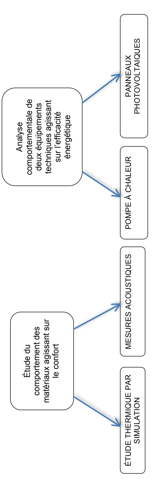

| maine 1 Se | PE 1 OU R G | PE 2 OU R G | PE 3 OU R G              | PE 4 OU R G |
|---------------|----------------------|----------------------|-----------------------------------|----------------------|
| maine 2 Se | PE 4 OU R G | PE 3 OU R G | PE 2 OU R G              | PE 1 OU R G |
| maine 3 Se |                      | ON DU T RESTITUTI | PES OU R G RAVAIL DES |                      |

Structuration des connaissances

# **DOSSIER TECHNIQUE**

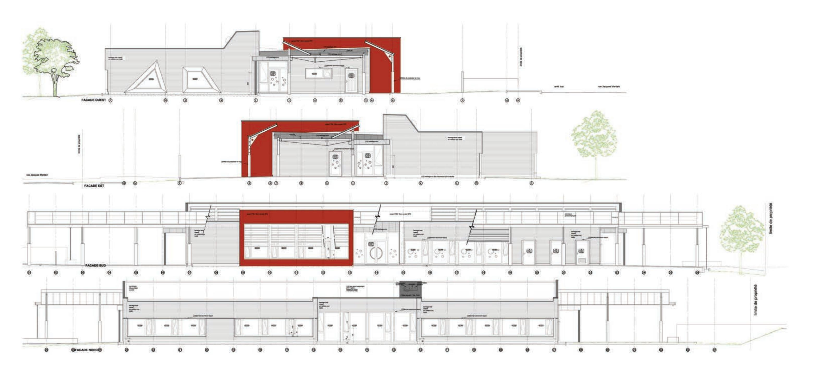

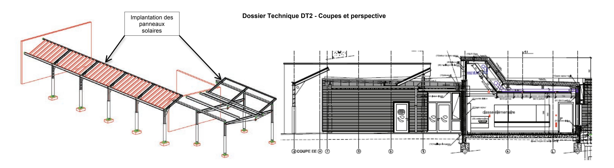

PERSPECTIVE DE L'AUVENT ET DU PRÉAU COUPE TRANSVERSALE PARTIELLE

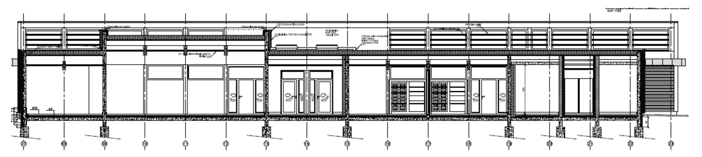

COUPE LONGITUDINALE DU BÂTIMENT

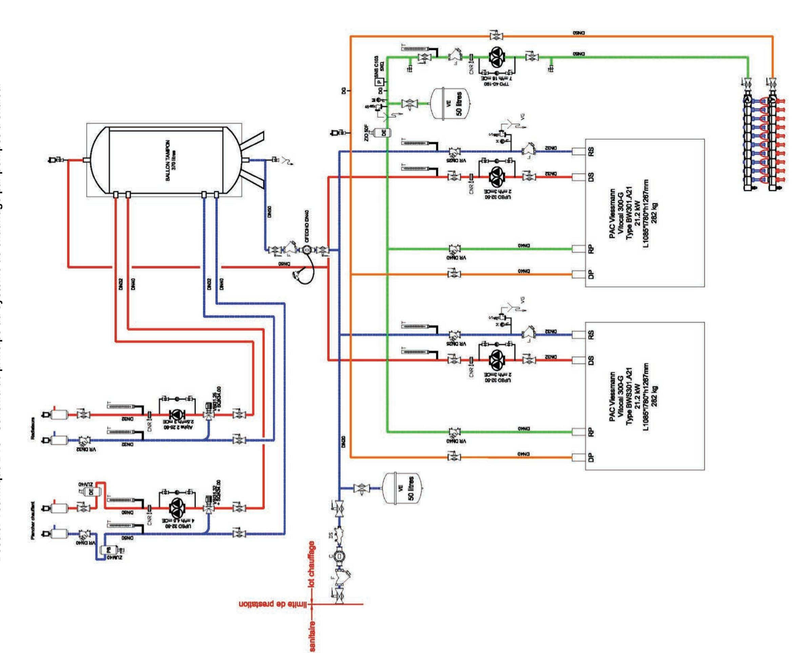

### **Dossier Technique DT4 - Système didactique panneau photovoltaïque**

Système proposé dans la fiche pédagogique DP3

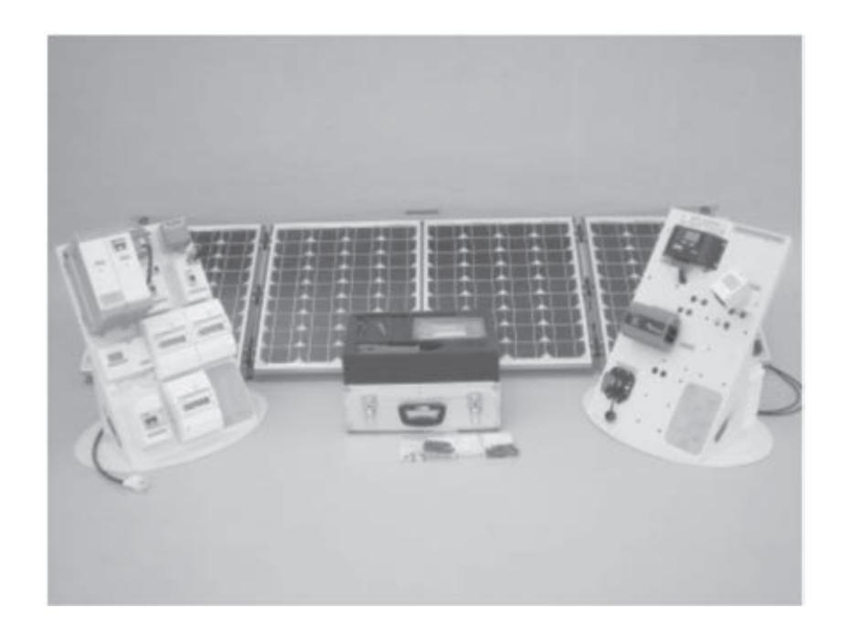

Le système photovoltaïque réseau est issu d'une véritable installation photovoltaïque d'un pavillon résidentiel connecté au réseau EDF pour une vente partielle ou totale de l'énergie selon le câblage choisi.

### Le système est composé :

- − d'une partie opérative avec
  - o quatre panneaux photovoltaïques couplés en série d'une puissance de 168 W crête ;
  - o un châssis facilement manipulable et accueillant les panneaux photovoltaïques avec une inclinaison à 30°, 45° ou 60° ;
- − d'une partie commande avec
  - o un onduleur industriel normalisé pour la connexion au réseau d'une puissance nominale de 300 W avec une unité de surveillance ;
  - o une unité de surveillance à distance (liaison sans fil) ;
  - o deux compteurs d'énergie permettant de mesurer l'énergie produite sur le réseau et l'énergie absorbée par le système ;
  - o d'un ensemble de protection électrique normalisé.

La partie opérative et la partie commande sont reliées à l'aide d'un connecteur industriel et d'un câble solaire de 20 mètres.

# **Dossier Technique DT5 - Système didactique pompe à chaleur**

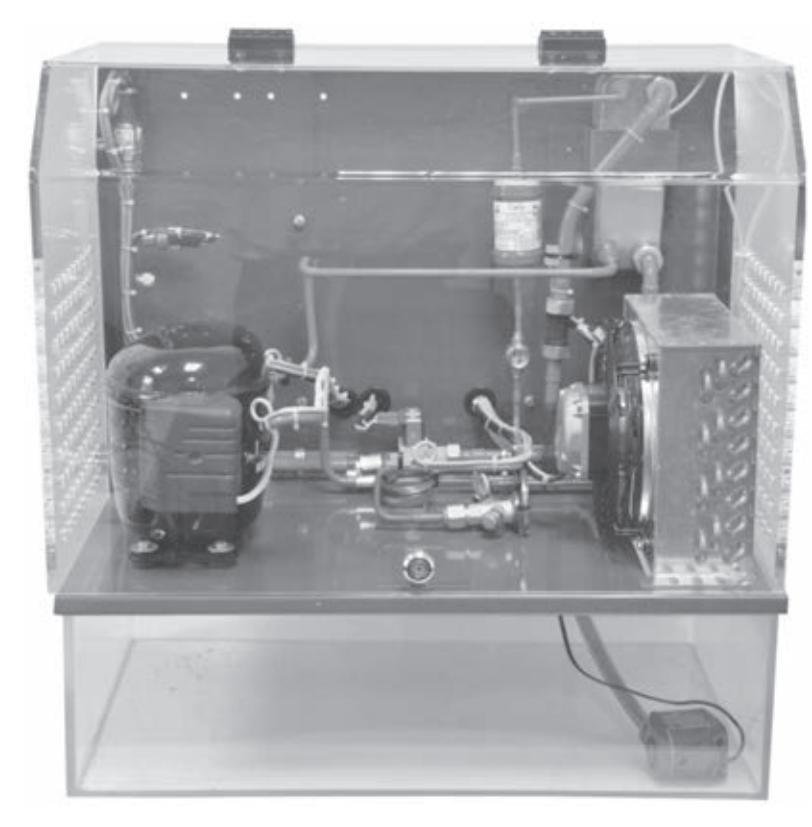

### **Pompe à chaleur (PAC)**

### **Descriptif technique**

Banc homothétique d'applications de chauffage d'origine ENR (aérothermique) avec fonctions ECS et chauffage (réversibilité en option).

### **Partie opérative**

- 1 évaporateur
- 1 compresseur
- 1 détendeur
- 1 échangeur à plaque
- 1 pompe pour la circulation de l'eau
- 1 ensemble de capteur (8 sondes de température, 2 manocontacts de sécurité)
- 2 pressostats analogiques pour la lecture de la pression BP et HP
- 1 débitmètre qui donne en temps réel le

débit de l'eau qui circule dans le bac ou dans le consommateur externe

- 1 compteur d'énergie électrique à impulsions avec affichage de la consommation instantanée
- 1 bac à eau d'environ 20 litres monté sous le système
- 1 sortie sur le côté de la PAC + pour le raccordement d'un consommateur externe (par exemple un aérotherme)

La PAC + permet une montée en température de l'eau de son bac de 20°C à 45°C en moins de 45 minutes et un temps de refroidissement du même ordre.

### **Partie commande**

Un automate S7-1200 avec port Ethernet et Serveur WEB intégré (logiciel de programmation compris) équipé des sondes de température et des entrées et sorties nécessaires au pilotage de la PAC

En option : un terminal opérateur type Siemens TP700 7'' couleur, graphique et tactile avec fonction WEB Serveur (logiciel de programmation compris) + un Switch 4 ports pour la connexion avec l'automate et avec votre PC de programmation.

La partie commande permet la mise en marche et l'arrêt de la PAC +, le choix des fonctions ECS ou Chauffage (par action sur 2 vannes), le choix du mode chauffage ou refroidissement (par action sur la vanne de réversibilité), la visualisation et l'enregistrement des températures, des pressions du fluide, du débit d'eau et de la consommation électrique.

La fonction enregistrement se lance à la mise en route pour une durée de 2 heures.

Toutes les données horodatées de la PAC + sont ensuite disponibles dans un fichier de type csv à télécharger dans l'automate.

### Dossier Technique DT6 - Maquette acoustique

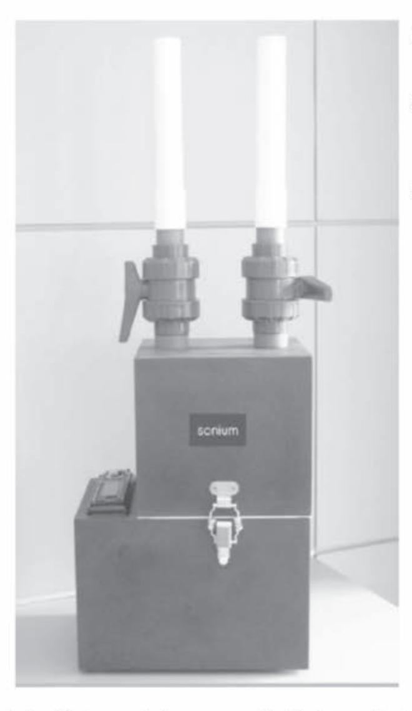

La solution comprend:

- une maquette avec source sonore;
- un microphone omnidirectionnel avec interface analogique/numérique
  - un calibreur;
  - un logiciel de mesure du temps de réverbération ;
- une sonothèque (avec notamment bruits rose, blanc et routier).

Le logiciel permet de mesurer très facilement le temps de réverbération par octave. À partir d'un bruit impulsif ou d'un bruit interrompu, l'acquisition se déclenche automatiquement. Les courbes de décroissance sont représentées et une indication sur la fiabilité de la mesure est donnée par octave. Le logiciel fonctionne sous Windows, en mode acquisition ou en lecture de fichiers « wav ».

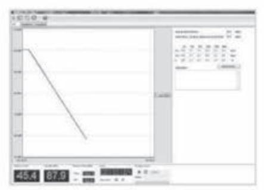

Décroissance sonore

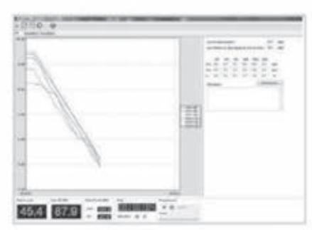

Décroissance par octave

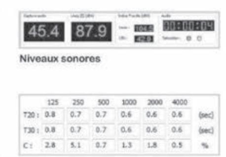

Temps de réverbération

# **Documentation des panneaux solaires PVL136**

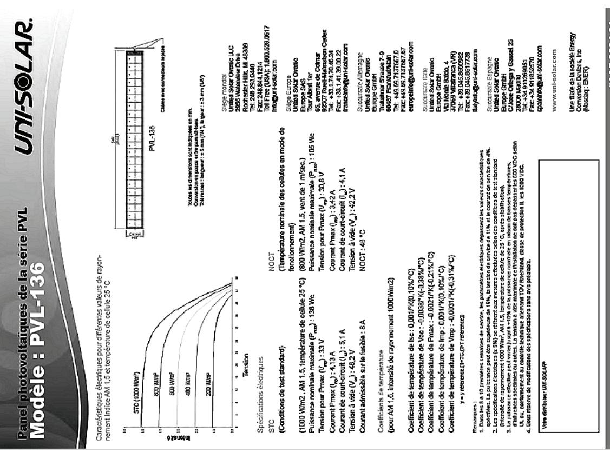

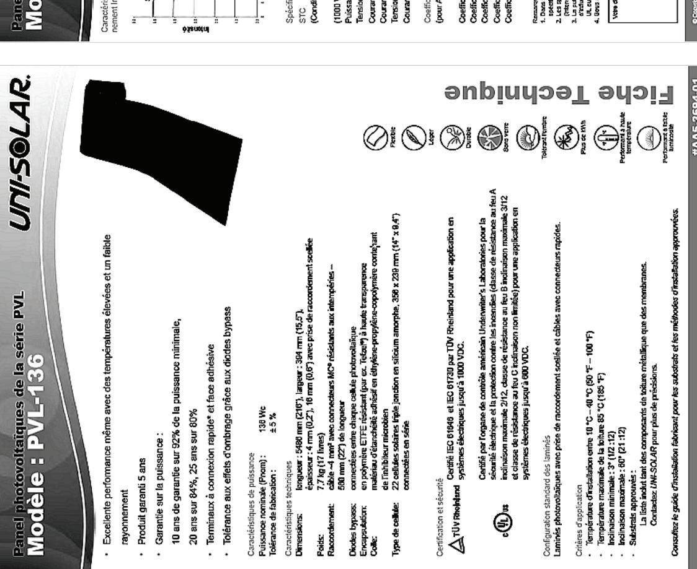

### Dossier Technique DT8 - Extraits de l'étude acoustique

### 4.1. Acoustique interne

Les matériaux ou complexes utilisés pour réaliser cette correction acoustique auront de préférence fait l'objet de mesures acoustiques en laboratoire, permettant de parfaitement maîtriser leur mise en œuvre et leur influence sur l'acoustique interne des espaces traités.

### 4.1.1. Les salles « à propagation » : les salles de classe primaire

Contraintes d'acoustique interne sans sonorisation

| SALLES                                                   | EDT Temps de réverbération TR | AIRES Absorption Sabine Nominale |
|----------------------------------------------------------|----------------------------------|-------------------------------------|
| Salles de classe Surface sol : 64 m² Volume 205 m³ | EDT : 0,65 Tr : 0,85          | 39 m²                               |

### Traitement acoustique nécessaire

|                  | Déficit d'aires d               | 'absorption (m²)                     |                                     |  |  |
|------------------|---------------------------------|--------------------------------------|-------------------------------------|--|--|
| Salles           | Basses fréquences f < 250 Hz | Moyennes fréquences 315 - 1000 Hz | Hautes fréquences 1250 - 5000 Hz |  |  |
| Salles de classe | 24                              | 22                                   | 12                                  |  |  |
| Туре             | Résonateur à membrane           | Résonateur à trous                   | Matériaux fibreux                   |  |  |

### 4.1.2. Les salles « à diffusion » : la salle de motricité, la salle de classe maternelle, la BCD

Contraintes d'acoustique interne sans sonorisation

|                                                                      | inco a accacique interne cano cono | 1000011                             |  |  |  |  |
|----------------------------------------------------------------------|------------------------------------|-------------------------------------|--|--|--|--|
| SALLES                                                               | EDT Temps de réverbération TR   | Aires Absorption Sabine Nominale |  |  |  |  |
| Salle de motricité Surface sol : 90 m² Volume : 342 m³         | EDT : 0,90 Tr : 0,90            | 62 m²                               |  |  |  |  |
| Salle de classe maternelle Surface sol : 90 m² Volume : 272 m³ | EDT : 0,88 Tr : 0,88            | 61 m²                               |  |  |  |  |
| BCD Surface sol : 61 m² Volume : 188 m³                        | EDT : 0,88 Tr : 0,88            | 51 m²                               |  |  |  |  |

### Traitement acoustique nécessaire

| Transmitt accusted incoccount |                                   |                                      |                                     |  |  |  |  |  |  |  |
|-------------------------------|-----------------------------------|--------------------------------------|-------------------------------------|--|--|--|--|--|--|--|
|                               | Déficit d'aires d'absorption (m²) |                                      |                                     |  |  |  |  |  |  |  |
| Salles                        | Basses fréquences f < 250 Hz   | Moyennes fréquences 315 - 1000 Hz | Hautes fréquences 1250 - 5000 Hz |  |  |  |  |  |  |  |
| Salles de motricité           | 42                                | 43                                   | 31                                  |  |  |  |  |  |  |  |
| Salle de classe maternelle | 32                                | 32                                   | 20                                  |  |  |  |  |  |  |  |
| BCD                           | 32                                | 32                                   | 20                                  |  |  |  |  |  |  |  |
| Туре                          | Résonateur à membrane             | Résonateur à trous                   | Matériaux fibreux                   |  |  |  |  |  |  |  |