**EDE STI 1**

### **SESSION 2016**

### CAPET CONCOURS EXTERNE ET CAFEP

**Section : SCIENCES INDUSTRIELLES DE L'INGÉNIEUR Option : ARCHITECTURE ET CONSTRUCTION**

**Option : ÉNERGIE**

**Option : INFORMATION ET NUMÉRIQUE Option : INGÉNIERIE MÉCANIQUE**

### **ANALYSE D'UN SYSTÈME PLURITECHNIQUE**

Durée : 4 heures

*Calculatrice électronique de poche – y compris calculatrice programmable, alphanumérique ou à écran graphique – à fonctionnement autonome, non imprimante, autorisée conformément à la circulaire n° 99-186 du 16 novembre 1999.*

*L'usage de tout ouvrage de référence, de tout dictionnaire et de tout autre matériel électronique est rigoureusement interdit.*

*Dans le cas où un(e) candidat(e) repère ce qui lui semble être une erreur d'énoncé, il (elle) le signale très lisiblement sur sa copie, propose la correction et poursuit l'épreuve en conséquence.*

*De même, si cela vous conduit à formuler une ou plusieurs hypothèses, il vous est demandé de la (ou les) mentionner explicitement.*

*NB : La copie que vous rendrez ne devra, conformément au principe d'anonymat, comporter aucun signe distinctif, tel que nom, signature, origine, etc. Si le travail qui vous est demandé comporte notamment la rédaction d'un projet ou d'une note, vous devrez impérativement vous abstenir de signer ou de l'identifier.*

### **Ce sujet comporte 3 parties :**

- − présentation et travail demandé pages 2 à 20 ;
- − documents annexes pages 21 à 25 ;
- − documents réponses pages 26 à 29.

### **Une lecture préalable et complète du sujet est indispensable.**

Le candidat doit répondre aux différentes questions du sujet sur les documents réponses quand cela est demandé, et sur feuilles de copie quand cela n'est pas précisé.

Il lui est rappelé qu'il doit utiliser les notations propres au sujet, présenter clairement les calculs et dégager ou encadrer tous les résultats.

Il sera tenu compte de la présentation de la copie, de la qualité de la rédaction (orthographe et syntaxe), en particulier pour les réponses aux questions ne nécessitant pas de calcul.

Si le sujet (les questions ou les annexes) conduit à formuler une ou plusieurs hypothèses, il est demandé au candidat de la (ou les) mentionner explicitement sur la copie.

### **« L'OBSERVATOIRE » : LA MAISON ACTIVE NATURELLEMENT**

### **I. MISE EN SITUATION**

### **1. Contexte général**

Depuis le protocole de Kyoto en 1997, la France, avec d'autres pays, s'est engagée à diviser par quatre les émissions de gaz à effet de serre dans le secteur du bâtiment à l'horizon 2050. Le secteur du bâtiment résidentiel et tertiaire est le premier consommateur d'énergie en France, avec environ 46 % de la consommation énergétique annuelle (70,4 millions de tonnes équivalent pétrole), loin devant les transports et l'industrie. Ce secteur contribue pour près du quart des rejets de CO2 dans l'hexagone. Dans ce cadre, en 2010, la région Alsace a lancé un projet de construction de bâtiments performants en énergie. « L'Observatoire » est une maison prototype, actuellement ouverte au public, servant de démonstrateur.

### **2. L'Observatoire**

Le chantier d'un bâtiment conçu comme une maison individuelle a démarré en 2010 à Oberschaeffolsheim (commune proche de Strasbourg à 160 m d'altitude). Cette maison appelée l'Observatoire a été inaugurée en juin 2012 (voir le document annexe A0). D'une superficie de 223 m2 ce bâtiment a été réalisé en respectant des critères de construction de Haute Qualité Environnementale (HQE).

L'objectif principal de la construction a été de créer un bâtiment à énergie positive en utilisant divers matériaux et modes de construction de manière à constituer une vitrine en matière d'efficience énergétique destinée aux particuliers et aux professionnels. Les intervenants sur le chantier ont été prioritairement des entreprises locales.

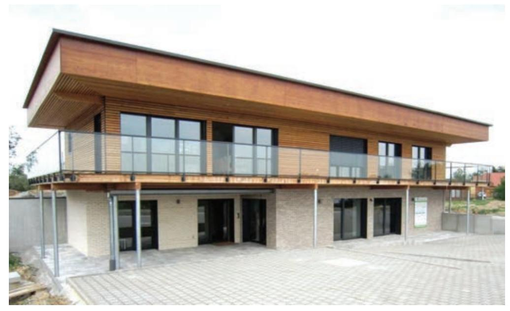

**Figure 1 : l'Observatoire**

### **3. Principes de construction**

Les caractéristiques principales de la construction de l'Observatoire sont les suivantes :

- − présence d'équipements de production d'énergie afin de passer en « énergie positive » ;
- − aménagement intérieur de la maison conçu pour une famille de 4 personnes et respectueux de l'environnement et du bien-être ;
- − diversité des solutions techniques choisies au niveau de la structure, de l'isolation et de l'étanchéité en vue d'atteindre un haut niveau de performance énergétique ;
- − maison entièrement domotisée et instrumentée.

### **4. Description des solutions techniques**

### **Structure et matériaux :**

- − intervention d'industriels locaux ;
- − mixité des matériaux utilisés (bois, béton, brique, terre) ;
- − au rez-de-chaussée, maçonnerie en briques en terre cuite bénéficiant de Fiches de Déclaration Environnementales et Sanitaires et d'une durée de vie de 100 ans ;
- − à l'étage, ossature bois de provenance locale ;
- − présence d'un mur en terre (provenant du jardin) dans la pièce principale à l'étage.

### **Isolation :**

- − différents types d'isolation rapportée et répartie utilisant des matériaux respectueux de l'environnement (ouate de cellulose sans sel de Bore, polystyrène, laine minérale) ;
- − triple vitrage en bois ;
- − utilisation de matériaux isolants ayant de bonnes capacités de déphasage thermique.

### **Équipements énergétiques :**

- − pompe à chaleur géothermique pour assurer le chauffage de la maison et la production d'eau chaude sanitaire ponctuellement ;
- − planchers chauffants, convecteurs ;
- − ventilation mécanique contrôlée en flux et en qualité de l'air ;
- − luminaires LED et basse consommation ;
- − 2 panneaux solaires thermiques pour les besoins en eau chaude sanitaire ;
- − 56 panneaux photovoltaïques pour assurer la production d'énergie électrique permettant de produire 41 kWh.m-2.an-1 (kilo watt heure par mètre carré par an).

### **Étanchéité :**

- − toiture équipée d'un système d'étanchéité intégrant des panneaux photovoltaïques sur plots ;
- − façade végétalisée ;
- − bardage en bois.

### **Équipements intérieurs :**

- − tableaux de bord énergétiques pour visualiser les différentes consommations d'énergie ;
- − systèmes de gestion automatique de l'éclairage et du chauffage.

### **Décoration :**

− boiseries extérieures, revêtements extérieurs et intérieurs peints uniquement avec des produits en phase aqueuse à faible teneur en COV (Composés Organiques Volatiles).

### **5. Problématique générale du sujet**

Dans un premier temps, le sujet vise à mettre en évidence la relation entre le respect de l'environnement et la construction d'une habitation, puis à étudier différentes solutions techniques choisies lors de la construction de l'Observatoire comme par exemple l'isolation, la pompe à chaleur géothermique, le système de production d'énergie électrique et la poutre utilisée pour la ventilation à l'étage. L'objectif est à chaque fois de justifier la pertinence environnementale et technique de ces choix.

### **II. CONTRAINTES ENVIRONNEMENTALES ET HABITAT**

*Objectif : mettre en évidence le lien entre la construction d'une maison individuelle et les exigences règlementaires en matière de respect de l'environnement.* 

### **1. Enjeux globaux**

### **Question 1**

Expliquer pourquoi il est nécessaire de réduire les émissions de gaz à effet de serre de manière générale. Préciser le lien entre l'habitat individuel et cette problématique. Au sein d'une habitation, préciser les différents gestes qui peuvent permettre à chacun de contribuer à un meilleur respect de l'environnement. On limitera la réponse à une dizaine de lignes maximum.

### **2. Cas particulier de l'Observatoire**

### **Question 2**

À partir des solutions techniques choisies pour l'Observatoire, expliquer en quoi ce projet s'inscrit dans une démarche de conception faisant appel à des critères de Haute Qualité Environnementale (HQE).

Parmi les solutions techniques utilisées, préciser celles qui ont contribué à la réduction du coût carbone lors de la construction du bâtiment.

Le document réponse DR1 indique les exigences énergétiques de la réglementation thermique RT 2012 et de divers labels environnementaux (BBC-Effinergie, Minergie et Passivhaus). Les données relatives aux consommations de l'Observatoire se trouvent également sur ce document.

Le BEPAS (Bilan Énergétique Passif) indique les différents postes de consommation de l'Observatoire sans tenir compte de la production d'énergie des panneaux photovoltaïques. Le BEPOS (Bilan Énergétique Positif) indique les différents postes de consommation de l'Observatoire en tenant compte de la production d'énergie des panneaux photovoltaïques.

### **Question 3**

En se plaçant dans le cadre du BEPAS de l'Observatoire, conclure sur le respect de la réglementation thermique RT 2012 et des différents labels environnementaux.

### **Question 4**

En se plaçant dans le cadre du BEPOS de l'Observatoire, indiquer sur le document réponse DR1, la production électrique en kWh.m-2.an-1. Expliquer pourquoi la maison possède un bilan d'énergie primaire positif sachant que la consommation en énergie primaire ne compte pas l'électroménager. Donner la valeur de l'excédent énergétique en kWh.m-2.an-1. Donner la consommation globale (électroménager inclus) de l'Observatoire en kWh.m-2.an-1. Écrire le résultat dans la dernière colonne du document réponse DR1.

### **III. ÉTUDE DE L'ISOLATION DE L'OBSERVATOIRE**

*Objectif : étudier les performances thermiques et hygrothermiques des parois à ossature bois et le risque de condensation.* 

L'isolation des murs et toitures de l'Observatoire a été réalisée en utilisant différentes combinaisons de matériaux. La diffusion de vapeur d'eau dans les parois peut entraîner un phénomène de condensation. À la surface des parois, la condensation peut entraîner une détérioration des revêtements (cloquage des peintures...). À l'intérieur des parois, elle peut engendrer une dégradation des matériaux.

Pour examiner les risques de condensation, une étude thermique et hygrothermique va être menée sur une des parois de l'Observatoire.

À l'étage, les murs ont été réalisés avec une ossature bois. La figure 2 décrit la composition de la paroi ainsi que les caractéristiques des matériaux utilisés pour assurer l'isolation.

| Composants                                        | Épaisseur (m) | Résistance thermique Rth (m2.°C.W-1) | Résistance au passage de la vapeur d'eau Rvap (m2.s.Pa.µg-1) |
|---------------------------------------------------|------------------|--------------------------------------------|--------------------------------------------------------------------------|
| Ambiance interne                                  |                  | 0,13                                       |                                                                          |
| Plaque de plâtre BA13                             | 0,013            | 0,04                                       | 0,48                                                                     |
| Lame d'air > 1,3 cm                               | 0,015            | 0,17                                       | 0,08                                                                     |
| Panneau de bois OSB (Oriented Strand Board) | 0,012            | 0,09                                       | 13,71                                                                    |
| Ouate de cellulose                                | 0,14             | 3,5                                        | 0,74                                                                     |
| Panneau de bois OSB (Oriented Strand Board) | 0,01             | 0,08                                       | 6,21                                                                     |
| Polystyrène                                       | 0,16             | 4,32                                       | 5,05                                                                     |
| Enduit extérieur                                  | 0,015            | 0,01                                       | 0,55                                                                     |
| Ambiance externe                                  |                  | 0,13                                       |                                                                          |

**Figure 2 : composition de la paroi**

On se place dans les conditions décrites sur la figure 3.

| Température (°C) | Taux d'humidité relative HR |
|------------------|-----------------------------|
| Intérieure 19°C  | Intérieure 60 %             |
| Extérieure -5°C  | Extérieure 90 %             |

**Figure 3 : caractéristiques des deux côtés de la paroi**

Le taux d'humidité relative HR représente la quantité de vapeur d'eau contenue dans l'air.

### **1. Étude thermique**

La différence de température entre l'intérieur et l'extérieur est à l'origine d'une diffusion de chaleur couplée à une diffusion de vapeur.

La loi de Fourier décrit la proportionnalité entre le flux d'énergie thermique échangé noté φ*t* et la variation de température Δ*T* à travers une paroi. En régime stationnaire cette relation fait intervenir la résistance thermique *Rth* de la paroi telle que :

$$\phi_t = -\frac{\Delta T}{R_{th}}$$

avec  $\phi_t$  en W·m-2,  $\Delta T$  en °C et  $R_{th}$  en m2·°C·W-1.

Dans cette relation  $\Delta T$  est positif. Le signe «-» indique l'abaissement de la température à travers la paroi.

### **Question 5**

La figure 2 indique la résistance thermique de chaque matériau composant la paroi. Calculer le flux d'énergie thermique échangé à travers toute la paroi.

### **Question 6**

En déduire les valeurs des températures aux différentes interfaces. Écrire les résultats dans la colonne «Température interface» sur le document réponse DR2.

### 2. Étude hygrothermique

La pression de vapeur saturante correspond à la pression de l'air quand le taux d'humidité relative HR est de 100 %. Sa valeur dépend de la température selon la relation suivante :  $P_S = exp\left(25,5058 - \frac{5204,9}{T+273}\right)$ . Lorsque HR < 100%, on parle de pression partielle  $P_V$ . Sa valeur est liée à celle de la pression de vapeur saturante selon la relation suivante :  $P_V = HR \times P_S$ .

### Question 7

Calculer les valeurs des pressions de vapeur saturante à chaque interface. Écrire les résultats dans la colonne «Pression de vapeur saturante» sur le document réponse DR2.

### **Question 8**

Calculer la valeur de la pression partielle à l'intérieur  $P_{vint}$  et à l'extérieur  $P_{vext}$ . Écrire les résultats dans la dernière colonne «Pression partielle» sur le document réponse DR2.

La loi de Fick décrit la proportionnalité entre la quantité d'eau g traversant une paroi et la variation de pression partielle  $\Delta P$ . En régime stationnaire cette relation fait intervenir la résistance au passage de la vapeur  $R_{\text{vap}}$  de la paroi telle que :

$$g = -\frac{\Delta P}{R_{van}}$$

avec g en  $\mu g \cdot m^{-2} \cdot s^{-1}$ ,  $\Delta P$  en Pa et  $R_{vap}$  en  $m^2 \cdot s \cdot Pa \cdot \mu g^{-1}$ .

Dans cette relation  $\Delta P$  est positif. Le signe «-» indiquant l'abaissement de la pression à travers la paroi.

### Question 9

La figure 2 indique la résistance au passage de la vapeur d'eau de chaque matériau composant la paroi. Calculer la quantité de vapeur d'eau notée g diffusée à travers toute la paroi.

### Question 10

Calculer les pressions partielles aux interfaces et écrire les résultats dans la colonne «Pression partielle» sur le document réponse DR2.

Le risque de condensation existe si la pression partielle dépasse la pression de vapeur saturante.

### **Question 11**

Conclure sur le risque de condensation dans la paroi.

### IV. ÉTUDE DE L'INSTALLATION DE GÉOTHERMIE

**Objectif**: valider la pertinence écologique du choix de la solution de chauffage.

### 1. Description de l'installation

Les besoins en chauffage de l'Observatoire sont assurés par une installation géothermique. Ponctuellement, la pompe à chaleur sert à l'alimentation en eau chaude sanitaire en complément de deux panneaux solaires thermiques situés sur la toiture

Les besoins énergétiques de l'Observatoire sont les suivants :

- puissance moyenne de 2,2 kW sur un an pour le chauffage ;
- puissance moyenne de 0,35 kW sur un an pour l'eau chaude sanitaire.

La pompe à chaleur (PAC) est installée dans un local technique situé au rez-dejardin.

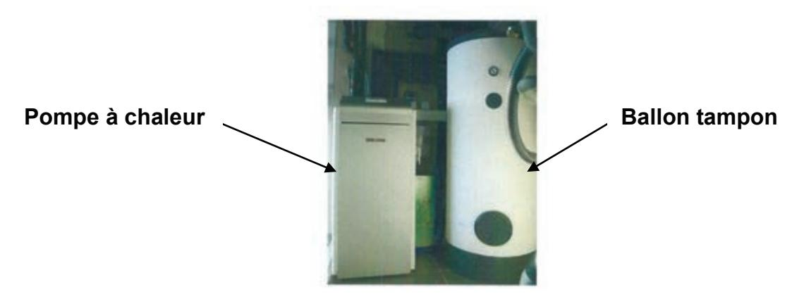

Figure 4 : local technique de l'Observatoire

Le système géothermique représenté sur les figures 4, 5 et 6 est composé des éléments cités ci-dessous :

- sondes verticales enterrées à 30 m de profondeur (sondes hélicoïdales);
- pompe à chaleur faible chaleur (eau glycolée/eau) ;
- ballon tampon ;
- réseau de chauffage basse température (ventilo-convecteurs et planchers chauffants);
- armoire de régulation.

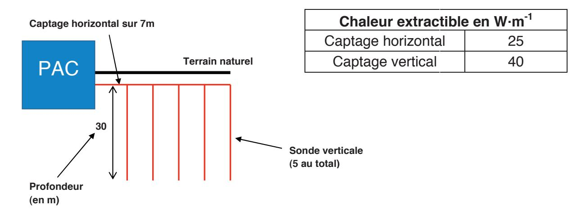

Figure 5 : installation des sondes verticales dans le sous-sol de l'Observatoire

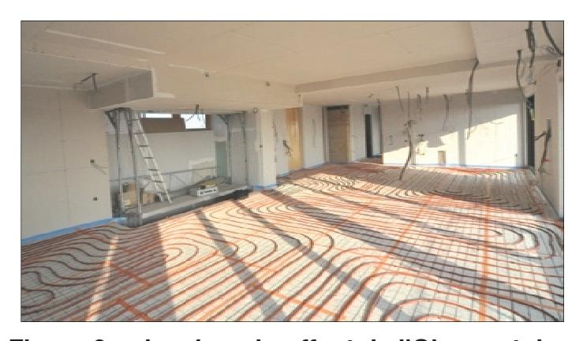

Figure 6 : plancher chauffant de l'Observatoire

Les caractéristiques de la pompe à chaleur fournies par le constructeur sont données sur la figure 7.

| Fournisseur                      | Stiebel Eltron |
|----------------------------------|----------------|
| Type                             | WPF 7 cool     |
| Puissance thermique maximale     | 7,7 kW         |
| Puissance frigorifique maximale  | 6,02 kW        |
| Coefficient de performance (COP) | 4,38           |
| Prix de la PAC                   | 8000 €         |
| Fluide frigorigène               | R-410a         |

**Figure 7 : caractéristiques de la pompe à chaleur**

### **2. Prélèvement de la chaleur dans le sous-sol**

### **Question 12**

Calculer la quantité de chaleur *Qextraite* extraite du sous-sol de l'Observatoire par les sondes. Conclure sur la pertinence de l'installation par rapport à la puissance thermique de la pompe à chaleur.

### **3. Étude des performances de la pompe à chaleur**

Une pompe à chaleur permet de transférer de la chaleur d'une source à basse température (source froide) vers une source à température plus élevée (source chaude). Un schéma de principe est donné sur la figure 8.

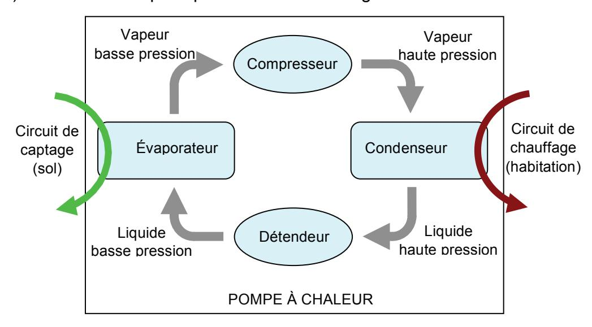

**Figure 8 : schéma de principe de la pompe à chaleur**

La pompe à chaleur utilise un fluide frigorigène qui change de phase à des basses températures. Ce fluide, au départ à basse pression, récupère les calories de la source froide en s'évaporant, puis est compressé. Une fois à haute pression, il transfère de la chaleur à la source chaude (l'eau circulant dans les planchers chauffants). Le fluide frigorigène est ensuite détendu afin de revenir à son état initial.

La figure 9 illustre le transfert de chaleur de la source froide vers la source chaude sur un cycle. On note  $T_f$  la température de la source froide et  $T_c$  la température de la source chaude. Sur un cycle, le fluide frigorigène reçoit le travail W du compresseur et échange les chaleurs  $Q_1$  et  $Q_2$  respectivement avec les sources chaude et froides. Par convention, ces grandeurs sont comptées positivement si elles sont reçues par le fluide.

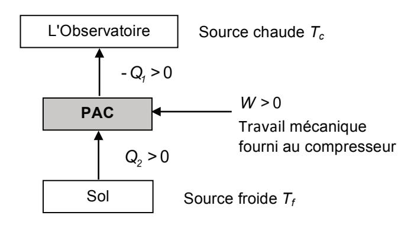

Figure 9 : transfert de chaleur sur un cycle

### **Question 13**

Écrire la relation entre W,  $Q_1$  et  $Q_2$  traduisant la conservation de l'énergie sur un cycle.

Le bilan entropique sur un cycle parcouru de manière réversible permet d'obtenir l'équation suivante :  $\frac{Q_1}{T_c} + \frac{Q_2}{T_f} = 0$ .

La performance d'une pompe à chaleur se mesure par le coefficient de performance (COP):  $COP = \frac{\text{énergie utile}}{\text{énergie consommée (facturée)}}$ .

### **Question 14**

Donner l'expression du coefficient de performance théorique maximal de la pompe à chaleur en fonction des températures  $T_f$  et  $T_c$ .

### Question 15

Justifier le choix d'installer dans l'Observatoire un chauffage dit « basse température » (l'eau circulant dans le circuit de chauffage ne dépassant pas 35°C).

### **Question 16**

Afin de fournir à l'habitation le flux d'énergie thermique  $\phi$  nécessaire au chauffage, n cycles par seconde sont effectués. Donner l'expression de  $\phi$  en fonction de n et de  $Q_1$  puis en déduire son expression en fonction de n, W et COP.

Le compresseur fournissant le travail W au fluide a un rendement global noté  $r_g$  égal à 0,9.

### **Question 17**

Donner l'expression de la puissance électrique notée  $P_e$  à fournir au moteur entraînant le compresseur en fonction de n, W et  $r_g$ . En déduire son expression en fonction de  $\phi$ , COP et  $r_g$ .

### Question 18

En utilisant la valeur du coefficient de performance réel fournie par le constructeur, calculer la puissance  $P_{\rm e}$  nécessaire pour assurer les besoins en chauffage. Comparer avec une solution utilisant uniquement des radiateurs électriques dont le rendement avoisine les 100 %.

### 4. Aspects économiques et environnementaux

La figure 10 présente des éléments de comparaison entre les coûts moyens d'exploitation des différentes sources d'énergie.

|               | Coût d'exploitation par |
|---------------|-------------------------|
|               | an en euros             |
| Électrique    | 2 000                   |
| Granulés bois | 1 200                   |
| Gaz naturel   | 1 250                   |
| Fioul         | 2 200                   |

Figure 10 : coût de différentes sources d'énergie

### **Question 19**

En utilisant le résultat trouvé à la question 18 calculer une estimation du coût d'utilisation sur un an de l'installation. Le prix d'un kWh est de 0,13 €. Conclure sur l'intérêt économique d'une installation de géothermie par rapport aux autres sources d'énergie possibles.

La figure 11 présente les taux d'émissions de CO2 de différentes sources d'énergie. La figure 12 indique les caractéristiques de différents fluides frigorigènes.

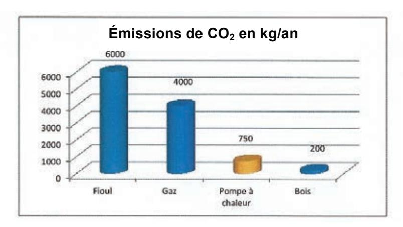

**Figure 11 : taux d'émission de CO2 de différentes sources d'énergie**

| Nature du fluide frigorigène | Pouvoir de réchauffement global (kg CO 2 ) | nent Particularités        |         |  |  |
|---------------------------------|-------------------------------------------------------|----------------------------|---------|--|--|
| Fort impact sur l'é             | effet de serre :                                      |                            |         |  |  |
| R-22 (HCFC)                     | 1700                                                  | Destructeur couche d'ozone | interdi |  |  |
| R-134a (HFC)                    | 1300                                                  | Jusqu'à 65°C               |         |  |  |
| R-407c (HFC)                    | 1600                                                  | Jusqu'à 55°C               |         |  |  |
| R-404a (HFC)                    | 3800                                                  |                            |         |  |  |
| R-410a (HFC)                    | 1900                                                  | Jusqu'à 45°C               | 1       |  |  |
| Faible impact sur               | l'effet de serre :                                    |                            | 1       |  |  |
| R-290 (propane)                 | 3                                                     | Inflammabilité             |         |  |  |
| CO 2                 | 1                                                     | En expérimentation         |         |  |  |
| NH₃                             | 0,1                                                   | Emanations toxiques        |         |  |  |

**Figure 12 : caractéristiques de fluides frigorigènes**

### **Question 20**

Dans le cadre du respect de l'environnement, conclure sur les avantages et inconvénients d'une installation de géothermie.

### **V. ÉTUDE DU SYSTÈME DE PRODUCTION ÉLECTRIQUE**

*Objectif : valider les performances de la solution photovoltaïque.* 

La toiture de l'Observatoire est équipée de 56 panneaux photovoltaïques. Les figures 13 et 14 et le document annexe A1 donnent les caractéristiques du dispositif.

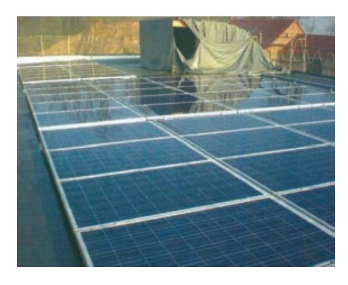

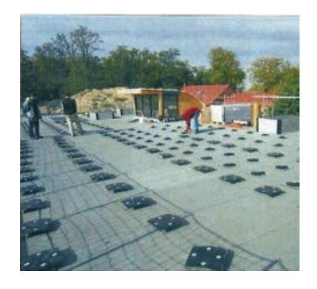

**Figure 13 : panneaux photovoltaïques Figure 14 : plots de fixation** 

### **Question 21**

Calculer la production annuelle d'énergie électrique en kWh produite par l'installation complète.

### **Question 22**

Sachant que la superficie de l'Observatoire est de 223 m2 relier la valeur calculée à la question précédente à celle annoncée dans les performances globales en début de sujet.

### **Question 23**

L'inclinaison des panneaux est très faible. Ce choix a été fait pour des raisons esthétiques. Expliquer la conséquence sur la production d'énergie électrique.

L'installation est constituée de 56 modules Premium L Poly 245 Wc dont les caractéristiques sont données sur le document annexe A2.

### **Question 24**

Donner la signification des grandeurs caractéristiques notées *UMPP*, *UOC*, *IMPP* et *ISC* indiquées sur le document annexe A2.

### **Question 25**

La caractéristique du courant débité *i* en fonction de la tension *v* aux bornes d'un panneau, est fournie sur le document réponse DR3. Compléter cette caractéristique en y plaçant les grandeurs citées à la question précédente.

### **Question 26**

Sur le document réponse DR3, tracer l'allure de la caractéristique de puissance *p* délivrée par un panneau en fonction de la tension à ses bornes *v*. Compléter cette caractéristique en y plaçant les valeurs numériques de *UMPP* et *PMAX*.

### **Question 27**

Sur le document réponse DR3, représenter l'allure de la caractéristique *i(v)* si les conditions d'éclairement sont réduites de moitié sous 25°C et avec un indice de masse d'air AM = 1,5 (voir le document annexe A2).

### **Question 28**

Sur le document réponse DR3, représenter l'allure de la caractéristique *p(v)* si les conditions d'éclairement sont réduites de moitié, sous 25°C et avec un indice de masse d'air AM = 1,5.

Comme dans toute installation photovoltaïque en site isolé, le circuit de production d'énergie électrique de l'Observatoire nécessite des onduleurs, des batteries et un régulateur en plus des panneaux photovoltaïques.

La documentation technique des onduleurs préconisés est présentée sur le document annexe A3. Leur référence est Sunny Boy 3800.

### **Question 29**

Déterminer le nombre d'onduleurs nécessaires au bon fonctionnement de l'installation électrique photovoltaïque.

### **Question 30**

Proposer un synoptique montrant les connexions entre les panneaux, les onduleurs, les récepteurs passifs, les régulateurs et les batteries. Préciser également le sens des transferts d'énergie possible entre ces éléments.

### **VI. DIMENSIONNEMENT DE LA POUTRE UTILISÉE POUR LA VENTILATION ET LE CONTRÔLE DE LA QUALITÉ DE L'AIR**

*Objectif : valider le dimensionnement d'une poutre de grande portée utilisée pour la ventilation et le contrôle de la qualité de l'air* 

La pièce de vie située à l'étage est un espace ouvert car le nombre de cloisons est volontairement limité. Une poutre de grande portée (de la longueur de la pièce) a été installée pour permettre le passage d'une gaine utilisée pour la ventilation intérieure et de câbles. Cette poutre est donc creuse et prend appui en ses deux extrémités sur les murs porteurs et sur un poteau de soutien visible sur la figure 15.

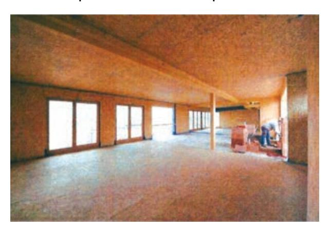

**Figure 15 : poutre dans la pièce de vie**

### 1. Première modélisation

L'objectif de cette partie est de justifier l'emploi du poteau de soutien par un critère de résistance puis de valider le dimensionnement de la poutre en contraintes et en déformations.

Compte tenu de l'implantation de la poutre et du chargement qui lui est appliqué, un premier modèle de sollicitation en flexion simple, ne tenant pas compte du poteau de soutien, est retenu (voir figure 16).

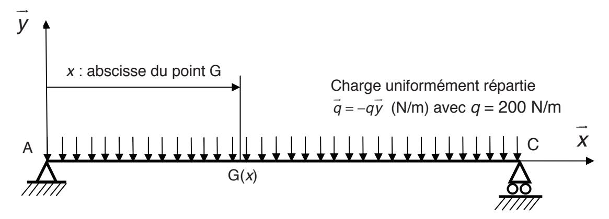

Figure 16 : premier modèle de la poutre de longueur L

### On notera :

- -AC = L (en m) avec L = 12 m;
- G le point courant de la ligne moyenne d'abscisse x ( $\overrightarrow{AG} = x\overrightarrow{x}$ ).
- les réactions aux appuis sur la poutre (AC) en A et C,  $\overline{R_A} = X_A \vec{x} + Y_A \vec{y}$  et  $\overline{R_C} = Y_C \vec{y}$ .

### **Question 31**

Donner l'expression des réactions aux appuis en A et C notées  $Y_A$  et  $Y_C$  en fonction de q et L. Faire l'application numérique.

### Question 32

Donner l'expression du moment fléchissant  $M_{fz}(x)$  et tracer l'allure de son diagramme le long de la poutre (AC). Préciser la section la plus sollicitée et le moment fléchissant maximal correspondant  $M_{fzmaxi}$  en fonction de q et L.

Le profil de la section droite est défini sur la figure 17.

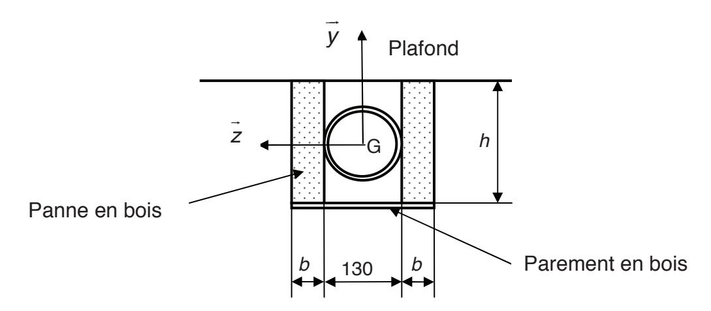

Figure 17 : section droite de la poutre

La poutre est en fait constituée de deux pannes en bois lamellé-collé, identiques de section  $b \cdot h$ , montées en parallèle. La distance entre les deux pannes ne peut être inférieure à 130 mm car la gaine de ventilation et les câbles sont installés entre ces deux éléments. Un parement en bois est plaqué sur la partie inférieure des deux pannes afin d'obturer le passage de la gaine.

Pour les calculs de dimensionnement, le modèle de structure associé à la poutre négligera l'influence du parement inférieur en bois et sera limité aux deux pannes.

### Question 33

Donner l'expression de la contrainte normale maximale en traction  $\sigma_{max}$  en fonction de q, L, b et h. Représenter à l'aide d'un schéma simple et précis la répartition des contraintes normales dans la section droite. On donne le moment quadratique de la section droite de la poutre :  $I_{Gz} = \frac{2bh^3}{12}$ .

Pour une raison esthétique, l'architecte souhaite limiter les dimensions de la section de la poutre à une hauteur h = 150 mm maxi et à une épaisseur b = 30 mm.

La contrainte élastique limite admissible en traction pour le bois lamellé-collé utilisé pour les pannes est  $\sigma_{ne} = 10 \,\text{MPa}$ .

### **Question 34**

Les dimensions retenues pour les deux pannes permettent-elles de satisfaire la condition de résistance mécanique (justifier numériquement la réponse) ?

La solution retenue par l'architecte consiste à placer un poteau de soutien de la poutre au milieu de celle-ci.

La poutre est alors constituée de deux poutres (AB) et (BC) mesurant chacune 6 m de longueur.

Chaque poutre de 6 m prend appui à une extrémité sur le mur et à l'autre extrémité sur le poteau.

### Question 35

Cette solution permet-elle de satisfaire à la condition de résistance mécanique ?

Une poutre en bois se calcule en contraintes mais également en déformations.

Le module d'élasticité longitudinal du bois lamellé-collé est E = 12 GPa.

La modélisation de flexion simple proposée précédemment reste valable pour l'étude en déformation de chacune des deux poutres utilisées dans la solution alternative et est définie sur la figure 18 :

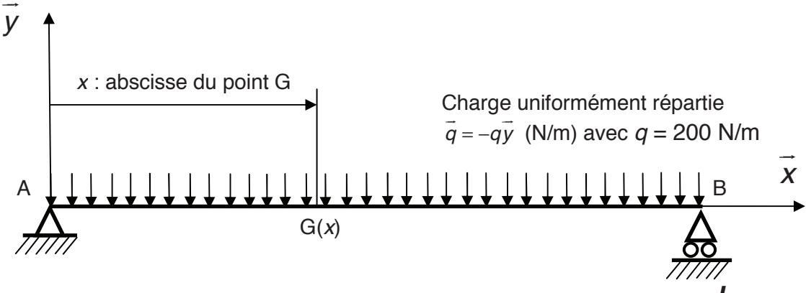

Figure 18 : modèle de la poutre de longueur  $\frac{L}{2}$ 

On notera :  $AB = \frac{L}{2}$  (en m) avec L = 12 m.

### **Question 36**

À partir du moment fléchissant  $M_{fz}(x)$ , en déduire la valeur de la flèche maximale notée  $y_{maxi}$  en fonction de q, L, E et du moment quadratique  $I_{Gz}$ .

### **Question 37**

Faire l'application numérique et conclure sur la pertinence de la solution alternative introduisant un poteau de soutien.

### 2. Deuxième modélisation

Dans cette deuxième étude, le chargement de la poutre est similaire mais on considère la poutre sur trois appuis comme indiqué sur la figure 19 :

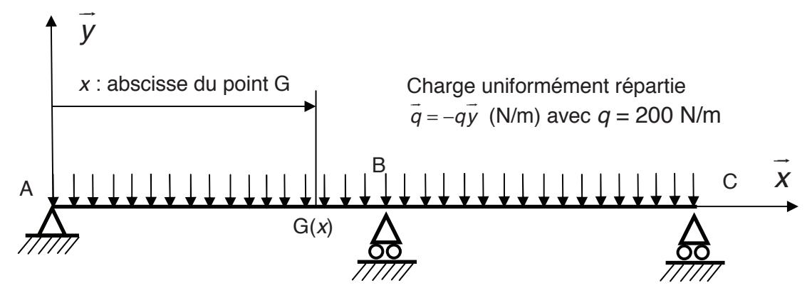

Figure 19 : deuxième modèle de la poutre

On notera:

- 
$$AC = L$$
 (en m),  $AB = \frac{L}{2}$  (en m);

- G le point courant de la ligne moyenne d'abscisse  $x (\overrightarrow{AG} = x\overline{x})$ ;
- $-\overrightarrow{R_A} = X_A \overrightarrow{x} + Y_A \overrightarrow{y}$ ,  $\overrightarrow{R_B} = Y_B \overrightarrow{y}$  et  $\overrightarrow{R_C} = Y_C \overrightarrow{y}$  les réactions aux appuis sur la poutre (AC) en A, B et C

La section de la poutre ainsi que les propriétés du matériau sont similaires à celles du premier modèle.

### **Question 38**

Ecrire les deux équations reliant  $Y_A$ ,  $Y_B$ ,  $Y_C$ , q et L.

### **Question 39**

Pour  $x \in \left[0, \frac{L}{2}\right]$  donner l'expression de la flèche notée  $y_1(x)$  en fonction de  $Y_A$ , q, E, du moment quadratique  $I_{GZ}$  et des constantes d'intégration notées  $C_1$  et  $C_2$ .

### **Question 40**

Justifier la condition limite  $y_1'\left(\frac{L}{2}\right) = 0$ .

En utilisant cette condition limite, et celles en A et B caractérisant la flèche de la poutre, déterminer l'expression de  $Y_A$ ,  $Y_B$  et  $Y_C$  en fonction de q et L. Calculer les valeurs de  $Y_A$ ,  $Y_B$  et  $Y_C$ . Comparer avec les valeurs trouvées à la question 31.

L'architecte a fait le choix de mettre un poteau au milieu de la poutre. Mais pour éviter d'avoir un poteau qui repose au sol, une autre solution aurait pu être envisagée. Par exemple, des câbles en acier auraient pu être mis en place pour soutenir un poteau en bois situé au milieu de la poutre comme décrit sur la figure 20.

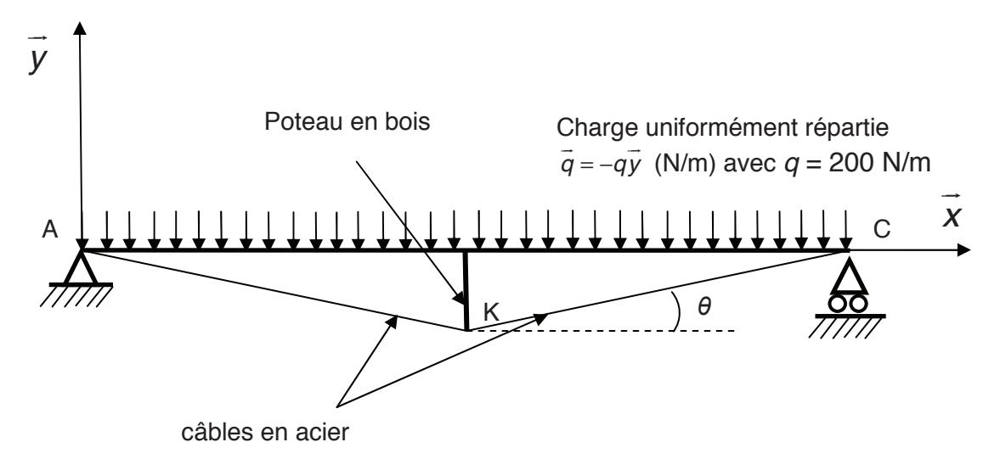

Figure 20 : solution avec des câbles en acier

On suppose, par symétrie, que les efforts exercés au nœud K dans les câbles en acier sont égaux. On les notera F.

### Question 41

En utilisant les résultats de la question 40 écrire l'équilibre du nœud K. En déduire une relation entre F et  $\theta$ .

Pour des raisons esthétiques, la hauteur du poteau en bois doit être minimisée.

### **Question 42**

À partir du résultat de la question 41 conclure sur la faisabilité de cette solution.

### VII. SYNTHÈSE

### Question 43

L'Observatoire a été qualifié de « maison active naturellement », justifier cette appellation. Proposer d'autres solutions techniques qui auraient pu être utilisées dans le cadre d'une construction de Haute Qualité Environnementale.

### **DOSSIER TECHNIQUE**

**Document annexe A0 Plans de l'Observatoire à l'échelle 1/100e**

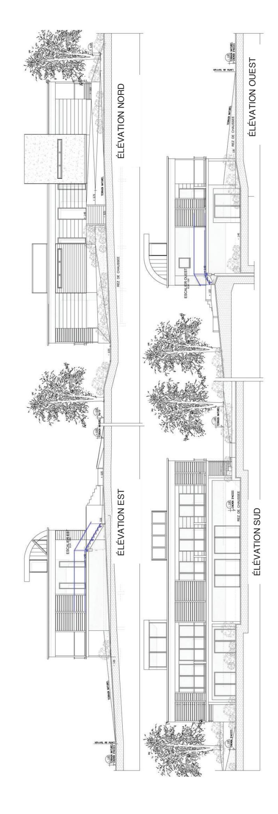

**Document annexe A1** 

**Disposition des panneaux photovoltaïques sur le toit de l'Observatoire**

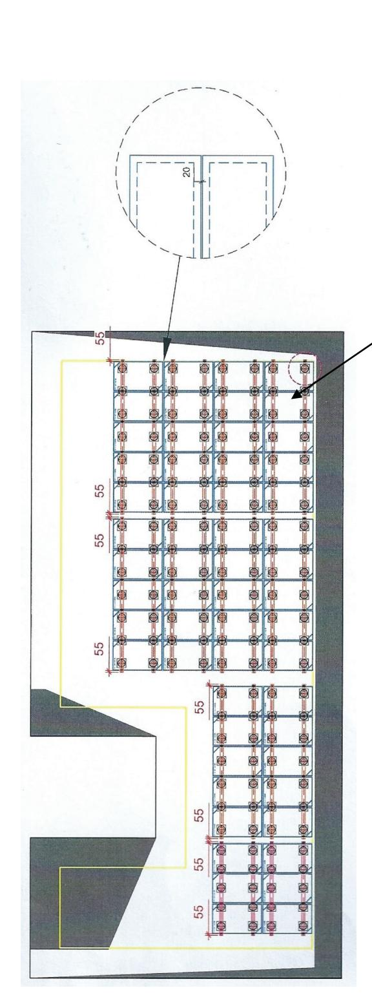

Panneau photovoltaïque - Solar fabrik – en silicium amorphe de puissance maximale 245 Wc (Watt crête)

Dimensions d'un panneau : en mm

Pente du rampant : 3 %

Référence de production annuelle à Oberschaeffolsheim :

733 kWh/kWc (kilo Watt crête)

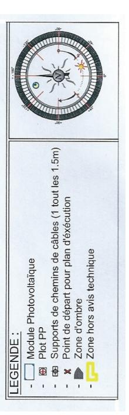

### **Document annexe A2**

# **Extrait de la documentation technique des panneaux photovoltaïques**

| e nominale de tri puissance                    | THE RESERVE AND ADDRESS OF THE PERSON NAMED IN COLUMN TWO IS NOT THE PERSON NAMED IN COLUMN TWO IS NOT THE PERSON NAMED IN COLUMN TWO IS NOT THE PERSON NAMED IN COLUMN TWO IS NOT THE PERSON NAMED IN COLUMN TWO IS NOT THE PERSON NAMED IN COLUMN TWO IS NOT THE PERSON NAMED IN COLUMN TWO IS NOT THE PERSON NAMED IN COLUMN TWO IS NOT THE PERSON NAMED IN COLUMN TWO IS NOT THE PERSON NAMED IN COLUMN TWO IS NOT THE PERSON NAMED IN COLUMN TWO IS NOT THE PERSON NAMED IN COLUMN TWO IS NOT THE PERSON NAMED IN COLUMN TWO IS NOT THE PERSON NAMED IN COLUMN TWO IS NOT THE PERSON NAMED IN COLUMN TWO IS NOT THE PERSON NAMED IN COLUMN TWO IS NOT THE PERSON NAMED IN COLUMN TWO IS NOT THE PERSON NAMED IN COLUMN TWO IS NOT THE PERSON NAMED IN COLUMN TWO IS NOT THE PERSON NAMED IN COLUMN TWO IS NOT THE PERSON NAMED IN COLUMN TWO IS NOT THE PERSON NAMED IN COLUMN TWO IS NOT THE PERSON NAMED IN COLUMN TWO IS NOT THE PERSON NAMED IN COLUMN TWO IS NOT THE PERSON NAMED IN COLUMN TWO IS NOT THE PERSON NAMED IN COLUMN TWO IS NOT THE PERSON NAMED IN COLUMN TWO IS NOT THE PERSON NAMED IN COLUMN TWO IS NOT THE PERSON NAMED IN COLUMN TWO IS NOT THE PERSON NAMED IN COLUMN TWO IS NOT THE PERSON NAMED IN COLUMN TWO IS NOT THE PERSON NAMED IN COLUMN TWO IS NOT THE PERSON NAMED IN COLUMN TWO IS NOT THE PERSON NAMED IN COLUMN TWO IS NOT THE PERSON NAMED IN COLUMN TWO IS NOT THE PERSON NAMED IN COLUMN TWO IS NOT THE PERSON NAMED IN COLUMN TWO IS NOT THE PERSON NAMED IN COLUMN TWO IS NOT THE PERSON NAMED IN COLUMN TWO IS NOT THE PERSON NAMED IN COLUMN TWO IS NOT THE PERSON NAMED IN COLUMN TWO IS NOT THE PERSON NAMED IN COLUMN TWO IS NOT THE PERSON NAMED IN COLUMN TWO IS NOT THE PERSON NAMED IN COLUMN TWO IS NOT THE PERSON NAMED IN COLUMN TWO IS NOT THE PERSON NAMED IN COLUMN TWO IS NOT THE PERSON NAMED IN COLUMN TWO IS NAMED IN COLUMN TWO IS NAMED IN COLUMN TWO IS NAMED IN COLUMN TWO IS NAMED IN COLUMN TWO IS NAMED IN COLUMN TWO IS NAMED IN COLUMN TWO IS NAMED IN COLUMN TWO IS NAMED IN COLUMN TWO IS NAMED IN COLUMN TWO IS NAMED IN COLUMN TWO IS NAMED I |         |        |         |                                         |                         |
|---------------------------------------------------|--------------------------------------------------------------------------------------------------------------------------------------------------------------------------------------------------------------------------------------------------------------------------------------------------------------------------------------------------------------------------------------------------------------------------------------------------------------------------------------------------------------------------------------------------------------------------------------------------------------------------------------------------------------------------------------------------------------------------------------------------------------------------------------------------------------------------------------------------------------------------------------------------------------------------------------------------------------------------------------------------------------------------------------------------------------------------------------------------------------------------------------------------------------------------------------------------------------------------------------------------------------------------------------------------------------------------------------------------------------------------------------------------------------------------------------------------------------------------------------------------------------------------------------------------------------------------------------------------------------------------------------------------------------------------------------------------------------------------------------------------------------------------------------------------------------------------------------------------------------------------------------------------------------------------------------------------------------------------------------------------------------------------------------------------------------------------------------------------------------------------------|---------|--------|---------|-----------------------------------------|-------------------------|
| Limites de tri puissance                          | 245 W                                                                                                                                                                                                                                                                                                                                                                                                                                                                                                                                                                                                                                                                                                                                                                                                                                                                                                                                                                                                                                                                                                                                                                                                                                                                                                                                                                                                                                                                                                                                                                                                                                                                                                                                                                                                                                                                                                                                                                                                                                                                                                                          | 250 W   | 255 W  | 260 W   | 265 W                                   | EN CEI 61215 (2° éd.)¹  |
|                                                   | 0/+5 W                                                                                                                                                                                                                                                                                                                                                                                                                                                                                                                                                                                                                                                                                                                                                                                                                                                                                                                                                                                                                                                                                                                                                                                                                                                                                                                                                                                                                                                                                                                                                                                                                                                                                                                                                                                                                                                                                                                                                                                                                                                                                                                         | 0/+5 W  | 0/+5 W | W 5+/0  | 0/+5 W                                  | EN CEI 61730-1, -21     |
| Tension                                           | 29,90 V                                                                                                                                                                                                                                                                                                                                                                                                                                                                                                                                                                                                                                                                                                                                                                                                                                                                                                                                                                                                                                                                                                                                                                                                                                                                                                                                                                                                                                                                                                                                                                                                                                                                                                                                                                                                                                                                                                                                                                                                                                                                                                                        | V 76,62 |        | 30,18 V | 30,29 V                                 | EN 13501-1, classe E    |
| Tension circuit ouvert                            | 37,28 V                                                                                                                                                                                                                                                                                                                                                                                                                                                                                                                                                                                                                                                                                                                                                                                                                                                                                                                                                                                                                                                                                                                                                                                                                                                                                                                                                                                                                                                                                                                                                                                                                                                                                                                                                                                                                                                                                                                                                                                                                                                                                                                        | 37,49 V |        | 37,90 V | 38,10 V                                 | Classe de protection II |
| Courant                                           | 8,21 A                                                                                                                                                                                                                                                                                                                                                                                                                                                                                                                                                                                                                                                                                                                                                                                                                                                                                                                                                                                                                                                                                                                                                                                                                                                                                                                                                                                                                                                                                                                                                                                                                                                                                                                                                                                                                                                                                                                                                                                                                                                                                                                         | 8,35 A  |        | 8,62 A  | 8,75 A                                  | Directive 2006/95/EG (  |
| Courant de court-circuit                          | 8,78 A                                                                                                                                                                                                                                                                                                                                                                                                                                                                                                                                                                                                                                                                                                                                                                                                                                                                                                                                                                                                                                                                                                                                                                                                                                                                                                                                                                                                                                                                                                                                                                                                                                                                                                                                                                                                                                                                                                                                                                                                                                                                                                                         | 8,86 A  |        | 9,02 A  | 9,10 A                                  | CSTB avis technique 2   |
| Rendement Premium L poly Premium incell L poly | 14,7 %                                                                                                                                                                                                                                                                                                                                                                                                                                                                                                                                                                                                                                                                                                                                                                                                                                                                                                                                                                                                                                                                                                                                                                                                                                                                                                                                                                                                                                                                                                                                                                                                                                                                                                                                                                                                                                                                                                                                                                                                                                                                                                                         | 15,0 %  | 15,3 % | 15,6 %  | 15,9 %                                  | MCS                     |
|                                                   |                                                                                                                                                                                                                                                                                                                                                                                                                                                                                                                                                                                                                                                                                                                                                                                                                                                                                                                                                                                                                                                                                                                                                                                                                                                                                                                                                                                                                                                                                                                                                                                                                                                                                                                                                                                                                                                                                                                                                                                                                                                                                                                                |         |        |         | SEC. SEC. SEC. SEC. SEC. SEC. SEC. SEC. | I UV dott UM (cadre so  |

| sion                  |                                         | U MPP                                                     | 79,90 V          | V 76,62          | 29,97 V 30,08 V  | 30,18 V          | 30,29 V          |
|-----------------------|-----------------------------------------|----------------------------------------------------------------------|------------------|------------------|------------------|------------------|------------------|
| sion circuit ouvert   | vert                                    | Uoc                                                                  | 37,28 V          | 37,49 V          | 37,69 V          | 37,90 V          | 38,10 V          |
| ırant                 |                                         | I MPP                                                     | 8,21 A           | 8,35 A           | 8,48 A           | 8,62 A           | 8,75 A           |
| rant de court-circuit | circuit                                 | l sc                                                      | 8,78 A           | 8,86 A           | 8,94 A           | 9,02 A           | 9,10 A           |
| dement                | Premium L poly Premium incell L poly | poly cell L poly                                                  | 14,7 % 14,6 % | 15,0 % 14,9 % | 15,3 % 15,2 % | 15,6 % 15,5 % | 15,9 % 15,8 % |
| ractéristi            | ques élect                              | ractéristiques électriques sous 800 W/m², NOCT (45°C +/- 2K), AM 1,5 | W/m², NOCT (45   | °C +/- 2K),      | AM 1,5           |                  |                  |
| sance en MPP          | Nagro.                                  | P                                                                    | 185 W            | 185 W 189 W      | 193 W            | W 161            | 200 W            |
| sion                  |                                         | U MPP                                                     | 27,98 V          | 28,02 V          | 28,05 V          | 28,09 V          | 28,12 V          |
| sion circuit ouvert   | vert                                    | Uoc                                                                  | 34,54 V          | 34,59 V          | 34,63 V          | 34,68 V          | 34,73 V          |
| Irant                 |                                         | МРР                                                                  | 6,62 A           | 6,74 A           | 6,86 A           | 6,98 A           | 7,12 A           |
| rant de court-circuit | -circuit                                | _%                                                                   | 7,02 A           | 7,10 A           | 7,18 A           | 7,26 A           | 7,34 A           |

| sa inne ladi la                                                         |                                                                                                          |
|-------------------------------------------------------------------------|----------------------------------------------------------------------------------------------------------|
| Coefficient de température puissance T x (P MPP ) | -0,43 %/K                                                                                                |
| Coefficient de température tension T K (U oc )    | -0,32 %/K                                                                                                |
| Coefficient de température courant $T_{\kappa}(I_{sc})$                 | 0,04 %/K                                                                                                 |
| Autres caractéristiques                                                 |                                                                                                          |
| Nombre de cellules                                                      | 09                                                                                                       |
| Tension max. système                                                    | 1000 V                                                                                                   |
| Capacité maximale de retour de courant                                  | 17.A                                                                                                     |
| Protection frontale                                                     | Verre trempé spécial pauvre en fer avec revêtement anti-reflet, effet d'éblouissement réduit au minimum  |
| Raccordement du module                                                  | Boîte de jonction avec 3 diodes de derivation IP67 sans potting, câble solaire de 2 x env. 1 m, Ø 4 mm², |

## **Document annexe A3**

# **Extrait de la documentation des onduleurs**

| Caractéristiques techniques                                   | Sunny Boy 3300              | Sunny Boy 3800              | Sunny Boy 3800/V            |
|---------------------------------------------------------------|--------------------------------|--------------------------------|--------------------------------|
| Entrée (DC)                                                   |                                |                                |                                |
| Puissance DC max. (quand cos φ=1)                             | 3820 W                         | 4040 W                         | 3900 W                         |
| Tension DC max.                                               | 500 V                          | 500 V                          | 200 V                          |
| Plage de tension photovoltaïque, MPPT                         | 200 V - 400 V                  | 200 V - 400 V                  | 200 V - 400 V                  |
| Tension nominale DC                                           | 200 V                          | 200 V                          | 200 V                          |
| Tension DC min. / tension de démarrage                        | 200 V / 250 V                  | 200 V / 250 V                  | 200 V / 250 V                  |
| Courant max, par MPPT / par entrée                            | 20 A / 16 A                    | 20 A / 16 A                    | 20 A / 16 A                    |
| Nombre de MPP trackers / Nombre max. d'entrées (en parallèle) | 1/3                            | 1/3                            | 1/3                            |
| Sortie (AC)                                                   |                                |                                |                                |
| Puissance nominale AC (pour 230 V, 50 Hz)                     | 3300 W                         | 3800 W                         | 3680 W                         |
| Puissance apparente AC max.                                   | 3600 VA                        | 3800 VA                        | 3680 VA                        |
| Tension nominale AC; plage                                    | 220, 230, 240 V; 180 V - 265 V | 220, 230, 240 V; 180 V - 265 V | 220, 230, 240 V; 180 V - 265 V |
| Fréquence du réseau AC (autoréglable) ; plage                 | 50, 60 Hz; ± 4,5 Hz            | 50, 60 Hz; ± 4,5 Hz            | 50, 60 Hz; ± 4,5 Hz            |
| Courant de sortie max.                                        | 18A                            | 18 A                           | 16A                            |
| Facteur de puissance (cos φ)                                  |                                | -                              | _                              |
| Phases d'injection / Phases de raccordement                   | 1/1                            | 1/1                            | 1/1                            |

| Modèle ENSD ©NEOPTEC                             |         |       |   |          |      | _     |       |    |        |       |      | _    |     |   |  |   |      |     |  |  |
|--------------------------------------------------|---------|-------|---|----------|------|-------|-------|----|--------|-------|------|------|-----|---|--|---|------|-----|--|--|
| Nom : (Suivi, s'il y a lieu, du nom d'épouse) |         |       |   |          |      |       |       |    |        |       |      |      |     |   |  |   |      |     |  |  |
| Prénom :                                         |         |       |   |          |      |       |       |    |        |       |      |      |     |   |  |   |      |     |  |  |
| N° d'inscription :                               |         |       |   |          |      |       |       |    |        |       | é(e) | le : |     | / |  | / |      |     |  |  |
|                                                  | (Le num |       |   | qui figu |      |       |       |    | émarge | ment) |      |      |     |   |  |   |      |     |  |  |
|                                                  | Conc    | cours | S |          | Sect | ion/( | Optio | on |        |       |      | Epre | uve |   |  | I | Mati | ère |  |  |
| •                                                |         |       |   |          |      |       |       |    |        |       |      |      |     |   |  |   |      |     |  |  |

EDE STI 1

### DOCUMENTS RÉPONSES

# **DOCUMENT RÉPONSE DR1**

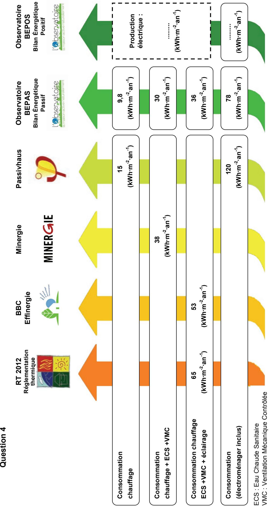

### **DOCUMENT RÉPONSE DR2**

### **Questions 6, 7, 8 et 10**

|                                       | Température interface (°C) | Pression de vapeur saturante (Pa) | Pression partielle (Pa) |
|---------------------------------------|----------------------------------|-----------------------------------------|-------------------------------|
| Intérieur                             | 19                               | 2166                                    | Pvint =                    |
| Interface intérieur / BA13         |                                  |                                         | Pvint =                       |
| Interface BA13 / lame d'air        |                                  |                                         |                               |
| Interface lame d'air / OSB         |                                  |                                         |                               |
| Interface OSB / ouate de cellulose |                                  |                                         |                               |
| Interface ouate de cellulose / OSB |                                  |                                         |                               |
| Interface OSB / polystyrène        |                                  |                                         |                               |
| Interface polystyrène / enduit     |                                  |                                         |                               |
| Interface enduit / extérieur       |                                  |                                         | Pvext =                    |
| Extérieur                             | - 5                              | 439                                     | = Pvext                    |

### **Hypothèses**

*Pvint* à l'intérieur et à l'interface intérieur / BA13 sont égales.

*Pext* à l'extérieur et à l'interface enduit / extérieur sont égales.

### **DOCUMENT RÉPONSE DR3**

### Questions 25 et 27

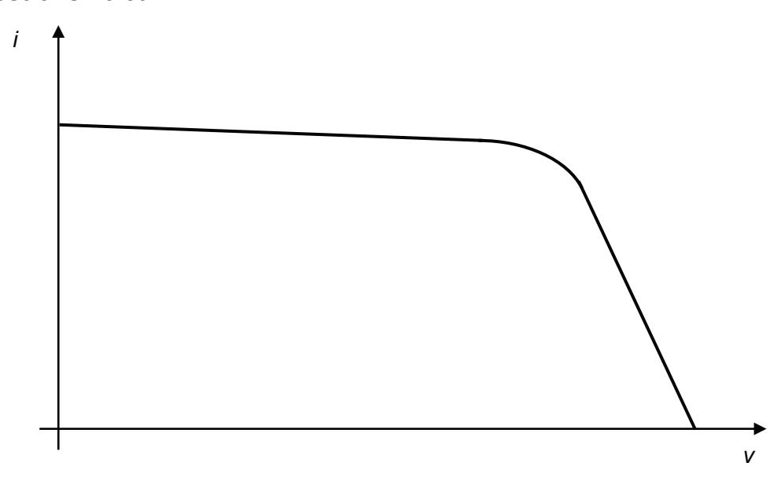

### Questions 26 et 28

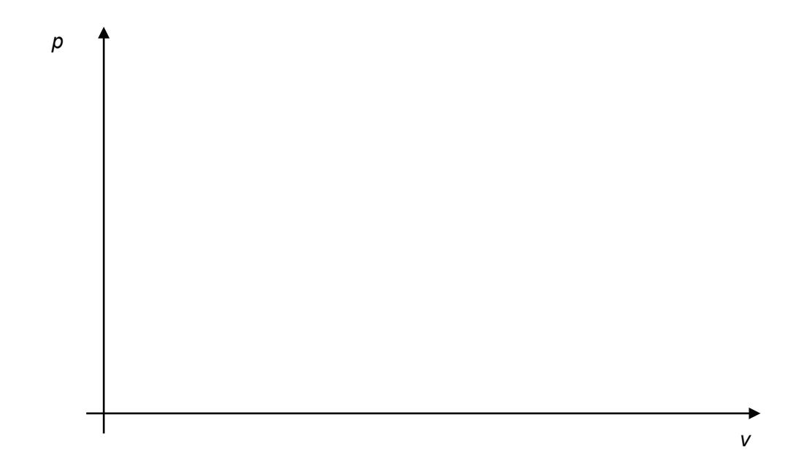