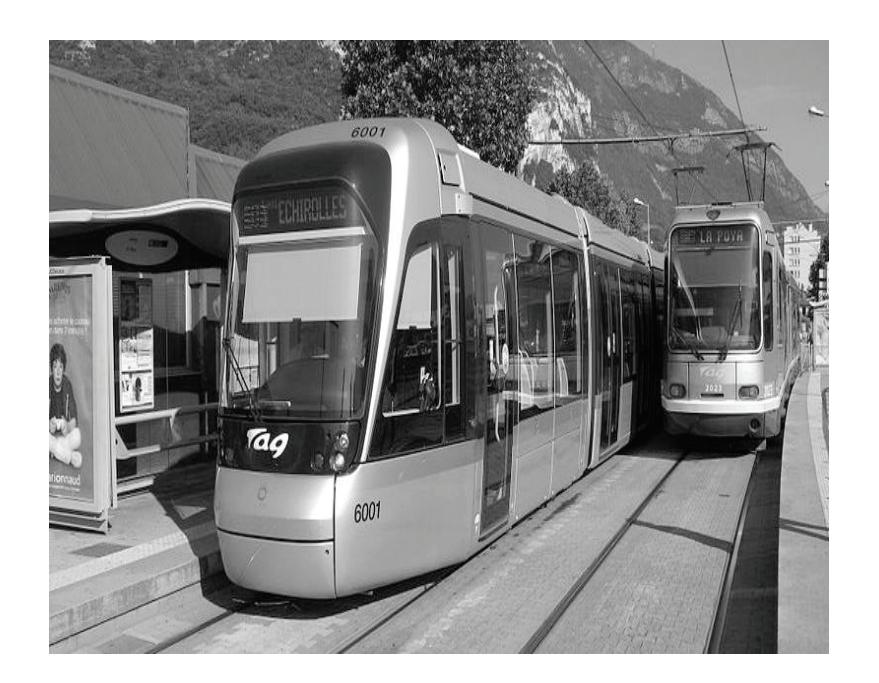
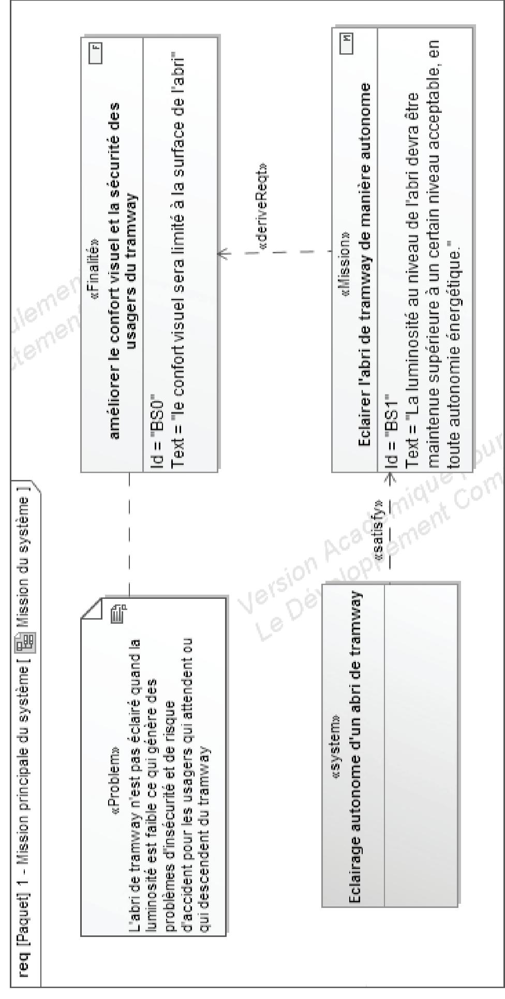
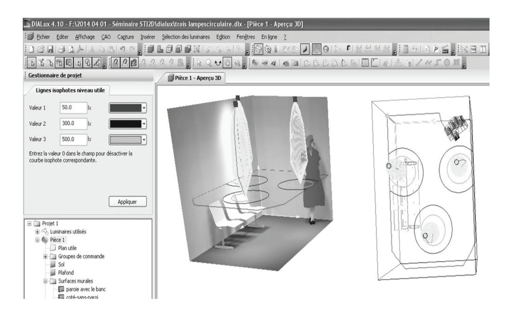
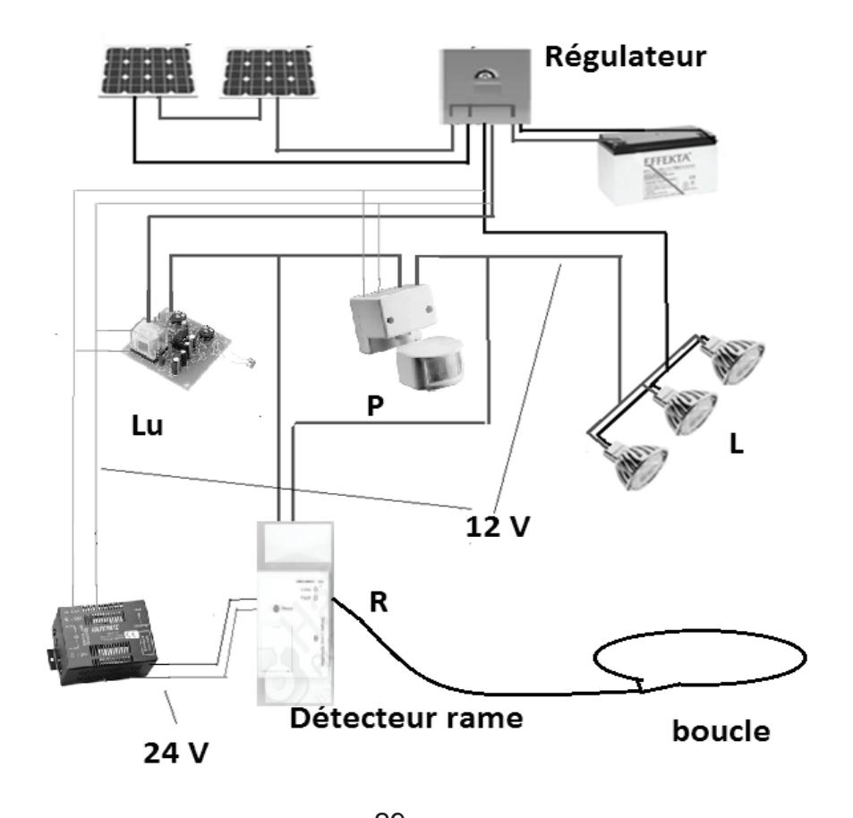
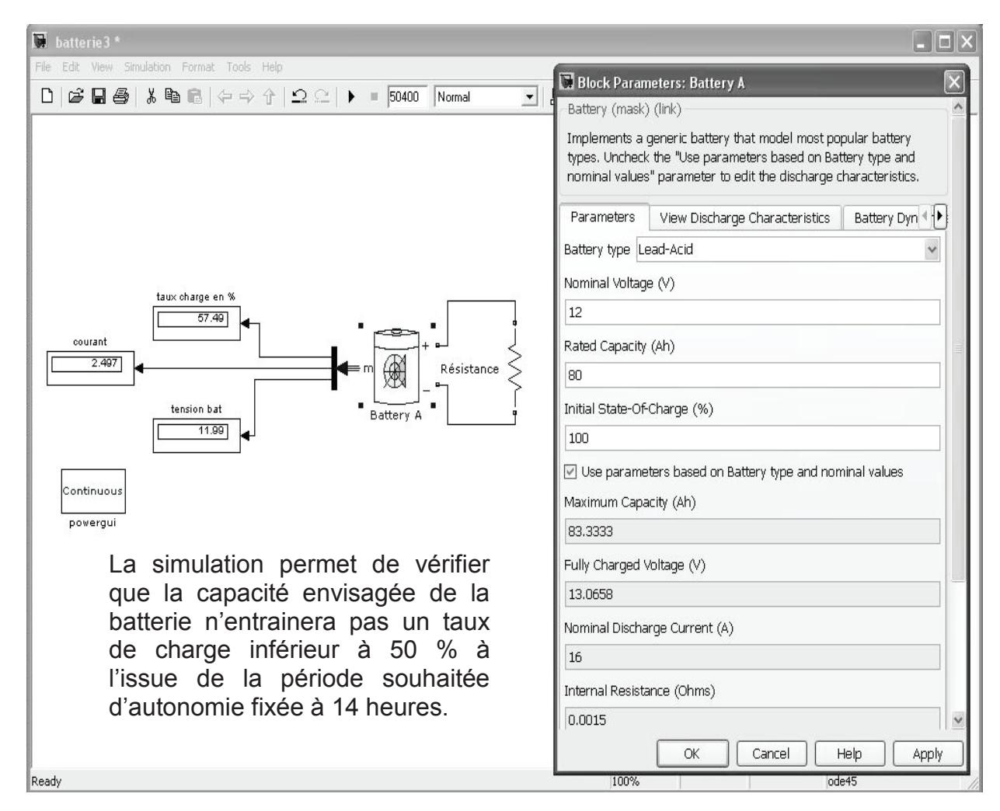
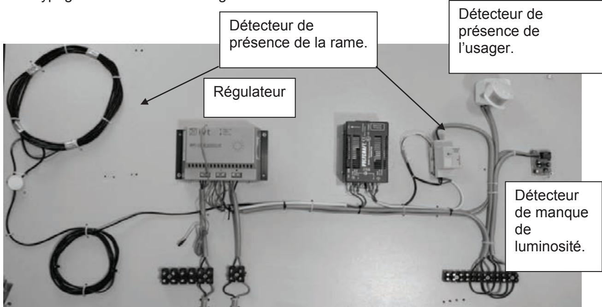
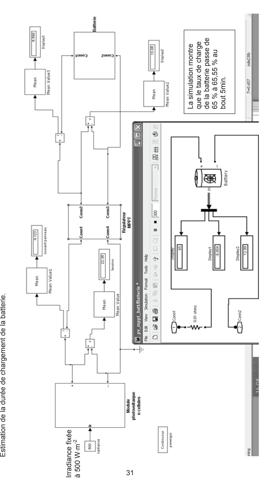

#### **SESSION 2016**

# CAPET CONCOURS EXTERNE TROISIÈME CONCOURS ET CAFEP CORRESPONDANTS

**Section : SCIENCES INDUSTRIELLES DE L'INGÉNIEUR**

**Option : ÉNERGIE**

## **EXPLOITATION PÉDAGOGIQUE D'UN DOSSIER TECHNIQUE**

Durée : 4 heures

*Calculatrice électronique de poche – y compris calculatrice programmable, alphanumérique ou à écran graphique – à fonctionnement autonome, non imprimante, autorisée conformément à la circulaire n° 99-186 du 16 novembre 1999.*

*L'usage de tout ouvrage de référence, de tout dictionnaire et de tout autre matériel électronique est rigoureusement interdit.*

*Dans le cas où un(e) candidat(e) repère ce qui lui semble être une erreur d'énoncé, il (elle) le signale très lisiblement sur sa copie, propose la correction et poursuit l'épreuve en conséquence.*

*De même, si cela vous conduit à formuler une ou plusieurs hypothèses, il vous est demandé de la (ou les) mentionner explicitement.*

*NB : La copie que vous rendrez ne devra, conformément au principe d'anonymat, comporter aucun signe distinctif, tel que nom, signature, origine, etc. Si le travail qui vous est demandé comporte notamment la rédaction d'un projet ou d'une note, vous devrez impérativement vous abstenir de signer ou de l'identifier.*

# **Option énergie**

#### Aucun document autorisé

#### **Ce sujet comporte 3 parties :**

- présentation et travail demandé pages 1 à 5 ;
- dossier pédagogique pages 6 à 23 ;
- dossier technique pages 24 à 31.

Les réflexions pédagogiques qui sont proposées dans ce sujet doivent amener à construire une séquence de formation relative **aux enseignements spécifiques de spécialité du baccalauréat STI2D.** Les programmes des enseignements spécifiques de spécialités résultent d'un prolongement de l'enseignement technologique transversal dans des champs techniques particuliers. Il est donc indispensable de lier les contenus de ces deux programmes. Une partie de la réflexion devra porter sur cette particularité.

Les professeurs doivent proposer des activités concrètes pour que les élèves apprennent, mais ils sont également confrontés à une exigence de planification, de définition et de hiérarchisation de séquences d'enseignement cohérentes garantissant d'aborder tous les points du programme assignés. En plus de garantir la cohérence de l'enseignement, ce séquencement est aussi le point de départ de véritables mutualisations pédagogiques. Si chaque enseignant reste libre de définir ses séquences et leurs contenus, la mutualisation des activités n'a de sens que si la relation programme/séquence/activités, qui peut être proposée, est correctement décrite. C'est à partir de cette identification que d'autres professeurs pourront adapter, modifier, améliorer une proposition donnée à un nouveau contexte.

### **Le concept de séquence**

Une séquence est une suite logique et articulée de séances de formation qui amène obligatoirement à une synthèse et à une structuration des connaissances découvertes ou approfondies et qui donne lieu à une évaluation des connaissances ou des compétences visées.

Dans la description proposée du séquencement de l'enseignement technologique transversal **– documents pédagogiques DP2**, le choix a été fait de définir des séquences de durées variables de quelques semaines, de durée, ni trop courte pour s'assurer de la possibilité d'agir et d'apprendre, ni trop longue pour ne générer aucune lassitude, et compatible avec le calendrier des périodes de vacances scolaires.

Dans cette organisation, le concept de séquence respecte les données suivantes :

- − chaque séquence vise l'acquisition, en découverte ou approfondissement, de compétences et connaissances précises, identifiées dans le programme ;
- − chaque séquence permet d'aborder de 1 à 2 centres d'intérêt, voire 3 au maximum, de manière à faciliter les synthèses et limiter le nombre de supports ;
- − chaque séquence correspond à un thème unique de travail, porteur de sens pour les élèves et intégrant les centres d'intérêts utilisés ;
- − chaque séquence est constituée de 2 à 4 semaines consécutives au maximum ;
- − la durée de l'année scolaire est de 30 semaines, de façon à laisser une marge de manœuvre pédagogique, laissant ainsi 6 semaines par année scolaire, à répartir entre les séquences, pour intégrer des remédiations, des évaluations, des sorties et visites… ;
- − chaque séquence donne lieu à une séance de présentation à tous les élèves, explicitant les objectifs, l'organisation des apprentissages et les supports didactiques utilisés ;
- − chaque séquence donne lieu à une évaluation sommative, soit intégrée dans son déroulement, soit prévue dans le cours d'une séquence suivante.

Le séquencement des enseignements spécifiques de spécialité suit exactement les mêmes règles mais intègre également des phases de projet ou mini projet. L'ensemble des séquences pédagogiques proposées en enseignement technologique transversal et relatives à l'enseignement spécifique de spécialité conduit à faire du projet d'évaluation mené en classe terminale une véritable synthèse des enseignements technologiques suivis par l'élève.

## **Les données d'entrée**

**La première entrée** est le programme STI2D, celui de l'enseignement technologique transversal est résumé dans la matrice du **DP 2,** celui de l'enseignement spécifique de spécialité est donné en **DP 1**.

**La deuxième entrée** dans le séquencement est le choix des centres d'intérêt, ils sont fournis dans le **DP 1 et le DP2.**

**La troisième entrée** incontournable correspond à l'utilisation locale qui est faite de la dotation horaire globale pour l'enseignement technologique transversal (voir **DP 3**) et pour l'enseignement spécifique de spécialité (le détail est fourni dans le texte relatif au travail demandé).

**La quatrième entrée** concerne le système technique support de tout ou partie des activités de formation. Celui qui est proposé dans ce sujet est succinctement décrit ci-après et de manière complémentaire dans le dossier technique. Une liste, non exhaustive, des documents et supports disponibles est donnée dans le sujet.

# **PRÉSENTATION DU SUPPORT**

Une agglomération s'est engagée en faveur des modes de déplacements non polluants. Cette agglomération a développé un réseau de bus motorisés au gaz naturel mais ce réseau rapidement saturé a commencé à montrer ses limites en matière de ponctualité, de rapidité, de capacité et de confort en heure de pointe. L'agglomération a donc franchi un nouveau pas dans sa politique de déplacements urbains en investissant dans une ligne de tramway.

Ce projet a permis de renforcer l'usage des transports collectifs en diminuant la durée des déplacements au bénéfice des usagers et en assurant l'accessibilité des transports collectifs aux personnes à mobilité réduite. En améliorant ainsi l'intermodalité de ses transports, l'agglomération a amélioré sa maîtrise du trafic automobile. L'agglomération souhaite aujourd'hui améliorer le confort et la sécurité des usagers. Sur la ligne de tramway, les abris situés aux points d'arrêt ne sont actuellement pas éclairés. Cette situation présente les inconvénients suivants : lorsque la luminosité naturelle est trop faible, les usagers ne se sentent pas en sécurité et le risque d'accident est accru du fait de manque de visibilité. Cette situation est vraie aussi bien pour les usagers qui attendent le tramway que pour ceux qui en descendent. Pour porter remède à cette situation, il est envisagé de mettre en place un éclairage à l'intérieur des abris. Au regard de la situation des abris, des coûts liés aux différentes solutions et de la volonté de la commune de mettre en œuvre une politique de développement durable, il a été décidé de retenir une solution permettant de rendre les abris autonomes d'un point de vue énergétique.

Les éléments du cahier des charges du projet et décrivant les missions principales du système à réaliser, les besoins des parties prenantes, les cas d'utilisation et les éléments de contexte sont donnés dans les documents techniques DT 1. Ces éléments sont la base de la préparation du dossier de validation du projet en vue de la commission académique.

### **Travail demandé**

1 – À partir des éléments de cahier des charges du système à concevoir, et des documents ressources du DP 4, définir les éléments constitutifs du dossier de validation du projet.

Il est demandé de préciser :

- l'intitulé du projet ;
- l'enjeu du projet ;
- la problématique retenue ;
- les livrables attendus ;
- le nombre d'élèves mobilisés sur le projet ;
- les tâches collectives ou individuelles confiées aux élèves au cours du projet associées aux indicateurs de performance évalués en projet ;
- les éléments du cahier des charges du projet confiés aux élèves. Les éléments du cahier des charges retirés avant de les confier aux groupes d'élèves mobilisés sur le projet seront identifiés.

Chacune des propositions sera étayée par une argumentation expliquant les choix réalisés.

2 - Le bulletin officiel n°12 du 22 mars 2012 définit les modalités de la première épreuve relative au projet en enseignement spécifique à la spécialité.

« Les revues de projet sont les situations d'évaluation organisées en cours d'année en vue d'évaluer la conduite du projet. Cette partie de l'épreuve permet d'évaluer le travail individuel de chaque candidat pendant le déroulement du projet technologique. Elle est conduite par le ou les enseignants de technologie responsables du suivi du projet, qui évaluent le travail individuel du candidat au sein du groupe de projet.

L'évaluation se déroule au cours de la formation et s'appuie sur les revues de projet ponctuant le déroulement du projet, en prenant en compte les travaux individuels menés par chaque élève.[…]

L'évaluation porte sur le programme de l'enseignement spécifique à la spécialité.

Au cours de l'une des revues de projet, la première partie de l'épreuve d'enseignement de technologie en langue vivante 1 et la première partie de l'épreuve de projet en enseignement spécifique à la spécialité sont successivement évaluées. »

**Décrire** les conditions et modalités de l'évaluation du projet pendant son déroulement.

Il est demandé :

- d'identifier les étapes de la démarche de projet ;
- de proposer une planification du projet ;
- de positionner les revues de projet prévues par rapport aux étapes du projet ;
- de décrire le scénario d'une revue de projet et ce qui est attendu d'un élève en revue de projet ;
- de préciser les conditions matérielles dans lesquelles se déroule cette revue de projet ;
- de décrire l'attitude et les activités du professeur en revue de projet.
- 3 **Décrire** le scénario d'une démarche de créativité menée par un groupe d'élèves pendant la phase de conception préliminaire de ce projet.

#### Il est demandé :

- − de définir les actions à mener par l'enseignant pour préparer la séance de créativité. À cet effet une fiche récapitulative de la séance de créativité, rédigée sur le modèle disponible en DP5 sera établie ;
- − d'identifier l'animateur de la séance, les participants, la durée consacrée à la séance de créativité et l'environnement matériel mobilisé ;
- − de décrire la trame de la séance de créativité en précisant notamment les modalités d'organisation des étapes de divergence et de convergence.

Les apports selon les points de vue technologique et pédagogique d'une séance de créativité menée pendant le projet seront précisés.

4 - Le dernier point à développer concerne **l'élaboration d'une séquence liée à l'enseignement spécifique à la spécialité** permettant de nourrir l'activité de projet proposée aux élèves.

#### Il est demandé de :

- − choisir les centres d'intérêt parmi ceux proposés ;
- − donner les items du programme abordés en cours et le nombre d'heures qui y seront consacrés ;
- − déterminer la nature (étude de dossier, activité pratique, projet) et le nombre d'activités en groupes allégés qui seront proposées aux élèves ;
- − définir l'objectif de formation de chacune des activités ;
- − préciser sur quel(s) support(s) les activités sont réalisées.

Les choix d'utilisation de la dotation horaire globale par l'établissement conduisent à 3h de cours classe entière et 6h en groupes allégés.

La formalisation de la présentation est laissée à l'initiative du candidat. Un exemple de fiche de séquence est disponible en DP3.

Une argumentation annexe sera développée afin de justifier les choix faits, et de mettre en évidence la liaison entre l'enseignement technologique transversal et celui spécifique de la spécialité énergie environnement afin que le projet soit une véritable synthèse des enseignements technologiques suivis par l'élève.

#### **Liste des systèmes et logiciels disponibles**

Logiciel de planification d'éclairage permettant d'élaborer des scénarios d'éclairage en couleur par luminaires à LED ou autres luminaires à couleurs variables.

Logiciel de simulation multiphysique.

Moyens de prototypage d'une solution énergétiquement autonome composée de panneaux photovoltaïque.

Outils de simulation numérique de comportement sous charge.

Base de données de matériaux permettant une mise en œuvre de méthodes de choix multicritères.

Logiciel de planification de projet associé à une application de création de cartes heuristiques.

Systèmes usuels présents dans les laboratoires d'enseignement technologique transversal et spécifique de spécialité (robot aspirateur, AR drone, voiture télécommandée hybride, VMC double flux, pompe à chaleur, airblade, borne rétractable autonome, robot humanoïde, hémomixer, système de mesure de hauteur de neige…).

# **DOSSIER PÉDAGOGIQUE**

# Document Pédagogique **DP 1** : compétences – programme EE – centres d'intérêt Spécialité Énergie Environnement

#### **A- Objectifs et compétences de la spécialité énergie environnement du baccalauréat STI2D**

| Objectifs de formation                                 | Compétences attendues                                                                                                                                                                                                                                                                                                                                                                                                                                                                       |
|--------------------------------------------------------|---------------------------------------------------------------------------------------------------------------------------------------------------------------------------------------------------------------------------------------------------------------------------------------------------------------------------------------------------------------------------------------------------------------------------------------------------------------------------------------------|
| O7 - Imaginer une solution, répondre à un besoin | CO7.ee1. Participer à une démarche de conception dans le but de proposer plusieurs solutions possibles à un problème technique identifié en lien avec un enjeu énergétique CO7.ee2. Justifier une solution retenue en intégrant les conséquences des choix sur le triptyque matériau – énergie - information CO7.ee3. Définir la structure, la constitution d'un système en fonction des caractéristiques technico-économiques et environnementales attendues |
|                                                        | CO7.ee4. Définir les modifications de la structure, les choix de constituants et du type de système de gestion d'une chaîne d'énergie afin de répondre à une évolution d'un cahier des charges                                                                                                                                                                                                                                                                                        |
|                                                        | CO8.ee1. Renseigner un logiciel de simulation du comportement énergétique avec les caractéristiques du système et les paramètres externes pour un point de fonctionnement donné                                                                                                                                                                                                                                                                                                       |
| O8 – Valider des solutions                          | CO8.ee2. Interpréter les résultats d'une simulation afin de valider une solution ou l'optimiser                                                                                                                                                                                                                                                                                                                                                                                          |
| techniques                                             | CO8.ee3. Comparer et interpréter le résultat d'une simulation d'un comportement d'un système avec un comportement réel                                                                                                                                                                                                                                                                                                                                              |
|                                                        | CO8.ee4. Mettre en œuvre un protocole d'essais et de mesures sur le prototype d'une chaîne d'énergie, interpréter les résultats                                                                                                                                                                                                                                                                                                                                                          |
| O9 – Gérer la vie du produit                        | CO9.ee1. Expérimenter des procédés de stockage, de production, de transport, de transformation, d'énergie pour aider à la conception d'une chaîne d'énergie CO9.ee2. Réaliser et valider un prototype obtenu en réponse à tout ou partie                                                                                                                                                                                                                                           |
|                                                        | du cahier des charges initial CO9.ee3. Intégrer un prototype dans un système à modifier pour valider son comportement et ses performances                                                                                                                                                                                                                                                                                                                                             |

#### **B- Programme de l'enseignement spécifique de spécialité EE du baccalauréat STI2D**

#### **1. Projet technologique**

*Objectif général de formation : vivre les principales étapes d'un projet technologique justifié par la modification d'un système existant, imaginer et représenter un principe de solution technique à partir d'une démarche de créativité.* 

| 1.1 La démarche de projet                                                                                                                                                                                                                                  | ETC | P/T | Tax | Commentaires                                                                                                                                                          |
|------------------------------------------------------------------------------------------------------------------------------------------------------------------------------------------------------------------------------------------------------------|-----|-----|-----|-----------------------------------------------------------------------------------------------------------------------------------------------------------------------|
| Les projets industriels                                                                                                                                                                                                                                    |     |     |     |                                                                                                                                                                       |
| Typologie des entreprises industrielles et des projets techniques associés (projets locaux, transversaux, « joint venture »)                                                                                                                         |     | P   | 1   | Présentation à partir de cas industriels représentatifs de la gestion d'énergie d'objets manufacturés en grande série                                           |
| Phases d'un projet industriel (marketing, pré conception, pré industrialisation et conception détaillée, industrialisation, maintenance et fin de vie)                                                                                            |     | P   | 2   | et petites séries. Les études de dossiers technologiques proposées doivent permettre l'identification d'innovations technologiques et amener à des études |
| Principes d'organisation et planification d'un projet (développement séquentiel, chemin critique, découpage du projet en fonctions élémentaires ou en phases) Gestion, suivi et finalisation d'un projet (coût, budget, bilan d'expérience) |     | P   | 2   | comparatives de coûts.                                                                                                                                                |

# Document Pédagogique **DP 1** : compétences – programme EE – centres d'intérêt

| Les projets pédagogiques et technologique                                                                                                                                                                                                                                                        | es  |     | 1   |                                                                                                                                                                                                                                                                                                                                                                                                                |
|--------------------------------------------------------------------------------------------------------------------------------------------------------------------------------------------------------------------------------------------------------------------------------------------------|-----|-----|-----|----------------------------------------------------------------------------------------------------------------------------------------------------------------------------------------------------------------------------------------------------------------------------------------------------------------------------------------------------------------------------------------------------------------|
| Ètapes et planification d'un projet technologique (revues de projets, travail collaboratif en équipe projet : ENT, base de données, formats d'échange, carte mentale, flux opérationnels)                                                                                            |     | P/T | 3   | Il s'agit d'expliquer et d'illustrer les grandes étapes d'un projet technologique et pédagogique pour les faire vivre aux élèves au cours du cycle terminal STI2D à travers des microprojets et un projet technologique                                                                                                                                                                         |
| Animation d'une revue de projet ou management d'une équipe projet                                                                                                                                                                                                                                |     | P/T | 3   | en terminale.                                                                                                                                                                                                                                                                                                                                                                                                  |
| Évaluation de la prise de risque dans un projet par le choix des solutions technologiques (innovations technologiques, notion de coût global, veille technologique)                                                                                                                              |     | P/T | 2   |                                                                                                                                                                                                                                                                                                                                                                                                                |
| 1.2 Paramètres de la compétitivité                                                                                                                                                                                                                                                               | ETC | P/T | Tax | Commentaires                                                                                                                                                                                                                                                                                                                                                                                                   |
| Conformité à une norme L'ergonomie : sécurité dans les relations homme - système, maintenabilité, fiabilité Innovation technologique : intégration des fonctions et optimisation du fonctionnement, solutions intégrant des énergies renouvelables Influence de la durée de vie des constituants | *   | P/T | 2   | Les études de dossiers technologiques proposées doivent permettre l'identification d'innovations ou de solutions technologiques conduisant à diminuer l'impact environnemental en réponse à un besoin énergétique. Ces études amènent : - à des études comparatives de performances et de coûts ; - à comprendre en quoi la conformité à une norme ou l'amélioration de l'ergonomie peut valoriser un système. |
| 1.3 Vérification des performances                                                                                                                                                                                                                                                                | ETC | P/T | Tax | Commentaires                                                                                                                                                                                                                                                                                                                                                                                                   |
| Contraintes du cahier des charges : performances, qualité, sécurité, temps caractéristiques                                                                                                                                                                                                      | *   | P/T | 3   | La vérification permet de s'assurer que les performances restent dans des limites acceptables (du point de vue du cahier des charges).                                                                                                                                                                                                                                                                         |
| Recette du prototype au regard des besoins formalisés dans le cahier des charges                                                                                                                                                                                                           |     | Т   | 3   | La recette se limite aux aspects fonctionnels et comportementaux.                                                                                                                                                                                                                                                                                                                                              |
| 1.4 Communication technique                                                                                                                                                                                                                                                                      | ETC | P/T | Tax | Commentaires                                                                                                                                                                                                                                                                                                                                                                                                   |
| Compte-rendu d'une activité de projet Présentation d'une intention de conception ou d'une solution Animation d'une revue de projet                                                                                                                                                               | *   | P/T | 3   | Au sein d'un groupe de projet, chaque élève peut, à tour de rôle, assurer le rôle d'animateur ou de participant.                                                                                                                                                                                                                                                                                               |

#### **2. Conception d'un système**

*Objectif général de formation : définir tout ou partie des fonctions assurées par une chaîne d'énergie et le système de gestion associé, anticiper ou vérifier leurs comportements par simulation.*

| 2.1 Approche fonctionnelle d'une chaîne d'énergie                                                                                                                                                                                | ETC | P/T | Tax | Commentaires                                                                                                                                                                                                                                                                                                                                                                               |
|-------------------------------------------------------------------------------------------------------------------------------------------------------------------------------------------------------------------------------------|-----|-----|-----|--------------------------------------------------------------------------------------------------------------------------------------------------------------------------------------------------------------------------------------------------------------------------------------------------------------------------------------------------------------------------------------------|
| Structure fonctionnelle d'une chaîne d'énergie, graphe de structure d'une chaîne d'énergie                                                                                                                                    | *   | P/T | 3   | Il s'agit, dans la spécialité, de construire un graphe définissant la structure fonctionnelle de la chaîne d'énergie. Il s'agit également de caractériser les grandeurs influentes et les grandeurs influencées en entrées/sorties de chaque processus élémentaire de stockage, transfert et de transformation d'énergie mis en œuvre dans la chaîne d'énergie. |
| Schéma de transfert d'énergie                                                                                                                                                                                                       | *   | P/T | 3   | L'importance du schéma de transfert d'énergie est mise en évidence dans le cadre de l'optimisation énergétique.                                                                                                                                                                                                                                                                      |
| Structures d'alimentation en énergie multi transformateur                                                                                                                                                                        | *   | P/T | 3   | Il s'agit de pouvoir choisir ou adapter une structure d'alimentation pour répondre à un profil de besoin de consommation énergétique.                                                                                                                                                                                                                                             |
| 2.2 Approche fonctionnelle du système de gestion de la chaîne d'énergie                                                                                                                                                          | ETC | P/T | Tax | Commentaires                                                                                                                                                                                                                                                                                                                                                                               |
| Gestion de l'information dédiée aux applications énergétiques, caractéristiques des fonctions des systèmes                                                                                                                 | *   | P   | 3   | Il s'agit de transposer les savoirs et savoir-faire relatifs aux systèmes de gestion de l'information abordés dans les enseignements technologiques transversaux au contexte de gestion de l'énergie.                                                                                                                                                                       |
| Fonctions de communication homme - système : types et caractéristiques                                                                                                                                                           | *   | P/T | 2   | L'étude des fonctionnalités assurées par une interface homme-système permet de mettre en évidence la réponse aux besoins de gestion de l'énergie et aux besoins d'interactivité entre l'utilisateur et le système.                                                                                                                                                          |
| Autour d'un point de fonctionnement donné, systèmes asservis ou régulés : - représentation fonctionnelle (schémas blocs, chaîne d'action et de retour, correcteur ; - grandeur réglée, réglante et perturbatrice. |     | P/T | 2   | Dans le cas d'études d'un système asservi ou régulé, il s'agit d'identifier les grandeurs caractéristiques et les fonctions, de décoder ou de modifier un schéma-bloc.                                                                                                                                                                                                         |
| 2.3 Paramètre influent la conception                                                                                                                                                                                                | ETC | P/T | Tax | Commentaires                                                                                                                                                                                                                                                                                                                                                                               |
| Efficacité énergétique passive et active d'un système                                                                                                                                                                            | *   | P/T | 3   | Ce concept a été abordé dans l'enseignement technologique transversal. Dans l'enseignement spécifique de la spécialité, il s'agit de proposer et de transposer des solutions permettant d'améliorer l'efficacité énergétique d'un système.                                                                                                                               |

| 2.4 Approche comportementale                                                                                                                                                                                                                                                               | ETC | P/T   | Tax | Commentaires                                                                                                                                                                                                                                                                                                                                            |
|--------------------------------------------------------------------------------------------------------------------------------------------------------------------------------------------------------------------------------------------------------------------------------------------|-----|-------|-----|---------------------------------------------------------------------------------------------------------------------------------------------------------------------------------------------------------------------------------------------------------------------------------------------------------------------------------------------------------|
| 2.4.1 Comportement énergétique des systèmes                                                                                                                                                                                                                                                |     |       |     |                                                                                                                                                                                                                                                                                                                                                         |
| Comportement dynamique d'un mécanisme Théorème de l'énergie cinétique Inertie ramenée sur l'arbre primaire Exploitation d'une maquette numérique et d'un résultat de simulation                                                                                             |     | T     | 3   | Les solides étudiés sont des constituants ou des composants d'une chaîne d'énergie. Il s'agit de mettre en évidence l'influence d'une inertie sur une chaîne d'énergie.                                                                                                                                                                     |
| Comportement temporel des constituants d'une chaîne d'énergie, représentation Caractéristiques et comportements thermique et acoustique des matériaux et parois d'un bâtiment                                                                                                  | *   | P/T   | 3   | Dans le cas d'un bâtiment, le comportement thermique ou acoustique est étudié sur une paroi composite ou une partie vitrée.                                                                                                                                                                                                                    |
| Charge d'une chaîne d'énergie : définition, types de charges, caractérisation                                                                                                                                                                                                           | *   | P/T   | 3   | La caractérisation de la charge se fait par mesure ou par simulation. Dans le cas d'un bâtiment, l'étude se limite à l''identification des paramètres influents de la structure sur le comportement de la charge.                                                                                                                        |
| Optimisation des échanges d'énergie entre source et charge, amélioration de l'efficacité énergétique : disponibilité, puissance, reconfiguration, qualité, adaptabilité au profil de charge, inertie, régularité, modes de fonctionnement (marche, arrêt, intermittence) | *   | T     | 3   | Ce concept abordé dans l'enseignement technologique transversal, est approfondi dans la spécialité en vue de proposer et de transposer des solutions permettant d'optimiser les échanges d'énergie entre source et charge.                                                                                                               |
| 2.4.2 Gestion de l'énergie en temps réel                                                                                                                                                                                                                                                   |     |       |     |                                                                                                                                                                                                                                                                                                                                                         |
| Contrôle instantané du fonctionnement du système en vue d'un maintien au plus près d'un point de fonctionnement                                                                                                                                                                      |     | T     | 3   | Identification du principe utilisé (régulation, asservissement) et caractérisation des paramètres influant sur le contrôle instantané du fonctionnement du système en vue d'un maintien au plus près d'un point de fonctionnement.                                                                                                    |
| Diagramme états - transitions pour un système évènementiel                                                                                                                                                                                                                              | *   | P/T   | 3   | L'activité de limite à l'analyse d'un diagramme états-transitions simple.                                                                                                                                                                                                                                                                            |
| 2.4.3 Validation comportementale par simulation                                                                                                                                                                                                                                            |     |       |     |                                                                                                                                                                                                                                                                                                                                                         |
| Loi de commande, paramètres du modèle de comportement, paramètres de l'environnement Validation du comportement énergétique d'une structure par simulation Validation du comportement du système de gestion d'une chaîne d'énergie par simulation                     | *   | P/T   | 3   | Les outils de simulation, complémentaires aux expérimentations, sont mis en œuvre régulièrement pour comprendre, analyser ou prédire un comportement ou un résultat, pour aider au paramétrage et au dimensionnement de constituants. La mise en œuvre des outils de simulation s'appuie sur l'utilisation de bibliothèques. |
| 2.5 Critères de choix de solutions                                                                                                                                                                                                                                                         | ETC | 1re/T | Tax | Commentaires                                                                                                                                                                                                                                                                                                                                            |
| Constituants matériels et logiciels associés aux fonctions techniques assurées par la chaîne d'énergie et répondant aux performances attendues                                                                                                                                    | *   | P/T   | 3   | Les principales caractéristiques des constituants sont étudiées en vue de les choisir ou de valider des choix. Le choix de capteur s'inscrit dans une                                                                                                                                                                                          |

#### Document Pédagogique **DP 1** : compétences – programme EE – centres d'intérêt

| Type de système de gestion de l'énergie Interfaces entre le système de gestion de l'énergie et la chaîne d'énergie Capteurs Protections contre les surintensités et contre les surcharges Conducteurs |   |   | recherche d'optimisation de la consommation énergétique ou dans le cadre du projet pour prélever des grandeurs caractéristiques destinées au système de télégestion et de télésurveillance                                                                                                                                               |
|-------------------------------------------------------------------------------------------------------------------------------------------------------------------------------------------------------------------------|---|---|---------------------------------------------------------------------------------------------------------------------------------------------------------------------------------------------------------------------------------------------------------------------------------------------------------------------------------------------------------|
| Coût global d'un système : investissement initial, maintenance, entretien, adaptation à l'usage, consommation énergétique                                                                                         | T | 3 | La recherche de l'optimisation du coût global d'un système ou d'un constituant se fait en envisageant différents systèmes de gestion de l'énergie et (ou) différents scénarios de cycle de vie. Cette recherche permet d'identifier les parties du système les plus pénalisantes d'un point de vue de l'impact environnemental. |

#### **3. Transports et distribution d'énergie, études de dossiers technologiques** *Objectif général de formation : développer une culture des solutions technologiques de transport et de distribution d'énergie.*

| 3.1 Production et transport d'énergie                                                                                                                              | ETC | P/T | Tax | Commentaires                                                                                                                                                                                                                                                                                                                                                                                                                                                                                                     |
|--------------------------------------------------------------------------------------------------------------------------------------------------------------------|-----|-----|-----|------------------------------------------------------------------------------------------------------------------------------------------------------------------------------------------------------------------------------------------------------------------------------------------------------------------------------------------------------------------------------------------------------------------------------------------------------------------------------------------------------------------|
| Types et caractéristiques des centrales électriques, hydrauliques, thermiques Types de solutions de production d'énergies renouvelables, caractéristiques |     | P   | 2   | Études pouvant se faire dans le cadre de préparations d'exposés, de comptes rendus suite à des visites de sites industriels, de conférences.                                                                                                                                                                                                                                                                                                                                                            |
| Structure d'un réseau de transport et de distribution d'énergie électrique, caractéristiques et pertes                                                       |     | T   | 2   | Il s'agit d'aborder l'intérêt d'utiliser le courant alternatif, des niveaux élevés de tensions, un réseau triphasé plutôt que monophasé. L'utilisation du courant continu peut être abordée dans le cadre d'études de cas particulières telles que les interconnexions sous-marines. Les études de dossiers technologiques permettent de montrer les spécificités et modes d'exploitation différents selon la structure de réseau utilisée (maillée, radiale, arborescente). |
| Distribution de l'énergie électrique                                                                                                                               |     | T   | 2   | La distribution électrique est identifiée au sein d'un schéma général de production, transport et distribution, et placée dans le contexte d'utilisation de l'énergie (quartiers, usines, transports ferroviaires). Les études se limitent aux caractéristiques de tensions.                                                                                                                                                                                                                   |
| Structure d'un réseau de production, de transport et de distribution de fluides                                                                                 |     | P   | 2   | Les études de dossiers technologiques abordent les composants principaux des réseaux de transport par canalisation et les contraintes de sécurité.                                                                                                                                                                                                                                                                                                                                                      |
| Gestion du réseau de transport Comptage et facturation de l'énergie Impact environnemental                                                                   |     | T   | 2   | Les nouvelles stratégies de gestion des réseaux d'énergie sont abordées au travers de cas d'étude (réseaux « intelligents »). L'impact environnemental est abordé au travers d'une analyse fine de l'usage et d'une meilleure relation avec l'action des usagers.                                                                                                                                                                                                                           |

#### **4. Réalisation et qualification d'un prototype**

*Objectif général de formation : réaliser un prototype répondant à un cahier des charges et vérifier sa conformité, effectuer des essais et des réglages en vue d'une optimisation.* 

| 4.1 Réalisation d'un prototype                                                                                                                                                                                                                                                                                                                                                | ETC | P/T | Tax | Commentaires                                                                                                                                                                                                            |
|-------------------------------------------------------------------------------------------------------------------------------------------------------------------------------------------------------------------------------------------------------------------------------------------------------------------------------------------------------------------------------|-----|-----|-----|-------------------------------------------------------------------------------------------------------------------------------------------------------------------------------------------------------------------------|
| Décodage de notices techniques et des procédures d'installation                                                                                                                                                                                                                                                                                                            |     | P/T | 3   | L'activité de décodage est nécessaire pour intégrer et mettre en œuvre un constituant, pour identifier une amélioration souhaitable dans un système.                                                        |
| Agencement, paramétrage et interconnexion de constituants de la chaîne d'énergie                                                                                                                                                                                                                                                                                        |     | P/T | 3   | Un compte-rendu est rédigé pour formaliser les procédures, les paramétrages et les choix retenus.                                                                                                                 |
| Mise en œuvre d'un système local de gestion de l'énergie                                                                                                                                                                                                                                                                                                                   |     | P/T | 3   | La mise en œuvre se limite à la réalisation des interconnexions avec la chaîne d'énergie et au paramétrage du système local de gestion                                                                         |
| Mise en œuvre d'un système de télégestion et de télésurveillance                                                                                                                                                                                                                                                                                                           |     | T   | 3   | La mise en œuvre du système de télégestion et de télésurveillance se fait dans le cadre des projets pour assurer le suivi des performances énergétiques et le pilotage éventuel du prototype à distance. |
| 4.2 Sécurité                                                                                                                                                                                                                                                                                                                                                                  | ETC | P/T | Tax | Commentaires                                                                                                                                                                                                            |
| Techniques liées à la sécurité : notion de redondance, auto-surveillance Prévention des risques : prévention intrinsèque, protection, information                                                                                                                                                                                                                    |     | T   | 2   | Les principes généraux sont abordés au travers d'études de cas et appliqués au cours des activités de projet.                                                                                                     |
| 4.3 Essais et réglages en vue d'assurer le fonctionnement et d'améliorer les performances                                                                                                                                                                                                                                                                               | ETC | P/T | Tax | Commentaires                                                                                                                                                                                                            |
| Protocole d'essais, essais et caractérisation des écarts par rapport au comportement attendu Essais hors énergie, essais statiques en énergie, essais dynamiques Démarche raisonnée d'identification des causes des écarts et de résolution des problèmes Paramètres à ajuster pour un fonctionnement spécifié d'un système ou d'un constituant |     | P/T | 3   | Il s'agit de mener une démarche raisonnée et progressive alternant essai, analyse des observations et comparaison du comportement attendu puis ajustements sur le système.                                  |

**P** : classe de première.

**T** : classe de terminale.

#### Document Pédagogique **DP 1** : compétences – programme EE – centres d'intérêt

### **Extrait du document d'accompagnement : proposition de centres d'intérêt**

|      | Centres d'intérêt                                                                      | Outils et activités mis en œuvre                                                                                                                                                                                                                                                                                                                                                                                                                             | Connaissances abordées                                                                                                                                                                                                                                                                                                                                                            | Réf de                           |
|------|----------------------------------------------------------------------------------------|--------------------------------------------------------------------------------------------------------------------------------------------------------------------------------------------------------------------------------------------------------------------------------------------------------------------------------------------------------------------------------------------------------------------------------------------------------------|-----------------------------------------------------------------------------------------------------------------------------------------------------------------------------------------------------------------------------------------------------------------------------------------------------------------------------------------------------------------------------------|----------------------------------|
|      | proposés                                                                               |                                                                                                                                                                                                                                                                                                                                                                                                                                                              |                                                                                                                                                                                                                                                                                                                                                                                   | compétences visées            |
| CI 1 | Typologie des systèmes énergétiques                                              | Mise en œuvre un équipement didactique Modélisation des chaînes d'énergie Systèmes techniques intégrant une gestion d'énergie, de charge, d'énergies renouvelables. Systèmes mono source ou multi sources Équipements didactiques du laboratoire EE                                                                                                                                                                                  | Approche fonctionnelle d'une chaîne d'énergie Approche fonctionnelle du système de gestion de la chaîne d'énergie Décodage des procédures d'installation Mise en œuvre d'un système local de gestion de l'énergie                                                                                                                                         | CO7.EE3 CO8.EE4               |
| CI 2 | Production d'énergie                                                                | Caractérisation d'un système de production d'énergie Systèmes de production d'électricité, de chaleur et de froid Dispositif d'acquisition de données multi physiques. Études réalisées sur des dossiers réels avec possibilité de faire des visites sur site ou conférence                                                                                                                                                          | Types et caractéristiques des centrales électriques, hydrauliques, thermiques Types de solutions de production d'énergies renouvelables, caractéristiques Sûreté de fonctionnement et prévention des risques                                                                                                                                              | CO7.EE3 CO8 CO9.EE1        |
| CI 3 | Transport, stockage et distribution de l'énergie et réseaux spécifiques | Caractérisation de la structure d'un réseau de transport et de distribution d'énergie et simulations associées. Le stockage d'énergie et solutions associées Études réalisées sur des dossiers réels avec possibilité de faire une visite sur site ou conférence                                                                                                                                                                        | Comportement énergétique des systèmes et validation comportementale par simulation Structure d'un réseau de transport et de distribution d'électricité Structure d'un réseau de transport et de distribution de fluides Comptage et facturation de l'énergie. Impact environnemental Sûreté de fonctionnement et prévention des risques | CO7.EE3 CO8 CO9.EE1        |
| CI 4 | Efficacité énergétique passive                                                   | Efficacité et rendement d'une chaîne d'énergie Comportement des constituants (modulateurs, convertisseurs, transmetteurs) Solutions passives d'amélioration de l'efficacité énergétique Équipements didactiques pour comparaisons, modifications. Logiciels de simulation (dans le cadre de l'habitat par exemple)                                                                                                             | Projet technologique Approche fonctionnelle d'une chaîne d'énergie Sûreté de fonctionnement et prévention des risques Essais et réglages en vue d'assurer le fonctionnement et d'améliorer les performances                                                                                                                                               | CO7 CO8 CO9.EE2 CO9.EE3 |
| CI 5 | Efficacité énergétique active                                                    | Caractérisation du mode de gestion de l'énergie d'un système Paramétrage de l'unité de gestion Évaluation d'une solution active d'amélioration de l'efficacité énergétique. Équipements didactiques intégrant une solution de gestion par l'apport d'une interface de la chaîne d'information paramétrable ou programmable et intégrée à la chaîne d'énergie (automate, régulation, télégestion, télésurveillance, etc.) | Projet technologique Approche fonctionnelle du système de gestion de la chaîne d'énergie Sûreté de fonctionnement et prévention des risques Essais et réglages en vue d'assurer le fonctionnement et d'améliorer les performances                                                                                                                      | CO7 CO8 CO9.EE2 CO9.EE3 |

### **Centres d'intérêt retenus pour l'enseignement technologique transversal**

| CI 1  | Développement durable et compétitivité des produits                 |
|-------|---------------------------------------------------------------------|
| CI 2  | Design, architecture et innovations technologiques                  |
| CI 3  | Caractérisation des matériaux et structures                         |
| CI 4  | Dimensionnement et choix des matériaux et structures                |
| CI 5  | Efficacité énergétique dans l'habitat et les transports             |
| CI 6  | Efficacité énergétique liée au comportement des matériaux           |
| CI 7  | Formes et caractéristiques de l'énergie                             |
| CI 8  | Caractérisation des chaînes d'énergie                               |
| CI 9  | Amélioration de l'efficacité énergétique dans les chaînes d'énergie |
| CI 10 | Efficacité énergétique liée à la gestion de l'information           |
| CI 11 | Commande temporelle des systèmes                                    |
| CI 12 | Formes et caractéristiques de l'info                                |
| CI 13 | Caractérisation des chaines d'info.                                 |
| CI 14 | Traitement de l'information                                         |
| CI 15 | Optimisation des paramètres par simulation globale                  |

## **Compétences du programme de l'enseignement technologique transversal**

|                         | Objectifs de formation                                                                                                            | Compétences attendues                                                                                                                                                                                                                                                                                                                                                                                                                                                                                              |
|-------------------------|-----------------------------------------------------------------------------------------------------------------------------------|--------------------------------------------------------------------------------------------------------------------------------------------------------------------------------------------------------------------------------------------------------------------------------------------------------------------------------------------------------------------------------------------------------------------------------------------------------------------------------------------------------------------|
| ment durable            | O1 - Caractériser des systèmes privilégiant un usage raisonné du point de vue développement durable                      | CO1.1. Justifier les choix des matériaux, des structures d'un système et les énergies mises en œuvre dans une approche de développement durable CO1.2. Justifier le choix d'une solution selon des contraintes d'ergonomie et d'effets sur la santé de l'homme et du vivant                                                                                                                                                                                                                            |
| Société et développe | O2 - Identifier les éléments permettant la limitation de l'impact environnemental d'un système et de ses constituants | CO2.1. Identifier les flux et la forme de l'énergie, caractériser ses transformations et/ou modulations et estimer l'efficacité énergétique globale d'un système CO2.2. Justifier les solutions constructives d'un système au regard des impacts environnementaux et économiques engendrés tout au long de son cycle de vie                                                                                                                                                                         |
|                         | O3 - Identifier les éléments influents du développement d'un système                                                        | CO3.1. Décoder le cahier des charges fonctionnel d'un système CO3.2. Évaluer la compétitivité d'un système d'un point de vue technique et économique                                                                                                                                                                                                                                                                                                                                                         |
| Technologie             | O4 - Décoder l'organisation fonctionnelle, structurelle et logicielle d'un système                                          | CO4.1. Identifier et caractériser les fonctions et les constituants d'un système ainsi que ses entrées/sorties CO4.2. Identifier et caractériser l'agencement matériel et/ou logiciel d'un système CO4.3. Identifier et caractériser le fonctionnement temporel d'un système CO4.4. Identifier et caractériser des solutions techniques relatives aux matériaux, à la structure, à l'énergie et aux informations (acquisition, traitement, transmission) d'un système |
|                         | O5 - Utiliser un modèle de comportement pour prédire un fonctionnement ou valider une performance                        | CO5.1. Expliquer des éléments d'une modélisation proposée relative au comportement de tout ou partie d'un système CO5.2. Identifier des variables internes et externes utiles à une modélisation, simuler et valider le comportement du modèle CO5.3. Évaluer un écart entre le comportement du réel et le comportement du modèle en fonction des paramètres proposés                                                                                                       |
| munica. m Co      | O6 - Communiquer une idée, un principe ou une solution technique, un projet, y compris en langue étrangère            | CO6.1. Décrire une idée, un principe, une solution, un projet en utilisant des outils de représentation adaptés CO6.2. Décrire le fonctionnement et/ou l'exploitation d'un système en utilisant l'outil de description le plus pertinent CO6.3. Présenter et argumenter des démarches, des résultats, y compris dans une langue étrangère                                                                                                                                                           |

Document Pédagogique **DP 2 :** matrice de l'enseignement technologique transversal

|                               | H Chapitre 1 et 2                                           | Chapitre 3                                            | H   | 1  | 2  | 3  | 4  | 5  | 6  | 7 | 8  | 9  | 10 | 12 11 | 13      | 14 | 15 |  |
|-------------------------------|----------------------------------------------------------------|-------------------------------------------------------|-----|----|----|----|----|----|----|---|----|----|----|----------|---------|----|----|--|
| Compétitivité et              | 6 Paramètres de la compétitivité                            |                                                       |     |    | 6  |    |    |    |    |   |    |    |    |          |         |    |    |  |
| créativité                    | 6 Cycle de vie d'un produit                                 |                                                       |     | 3  | 3  |    |    |    |    |   |    |    |    |          |         |    |    |  |
|                               | 6 Compromis CEC                                             |                                                       |     |    | 2  |    |    |    |    | 2 |    |    |    |          | 2       |    |    |  |
| Eco conception                | 8 Étapes de la démarche                                     |                                                       |     | 4  | 4  |    |    |    |    |   |    |    |    |          |         |    |    |  |
|                               | 20 Mise à disposition des ressources                        |                                                       |     | 20 |    |    |    |    |    |   |    |    |    |          |         |    |    |  |
|                               | 16 Utilisation raisonnée des ressources                     |                                                       |     | 4  |    | 4  |    | 4  |    |   | 4  |    |    |          |         |    |    |  |
| fonctionnelle des Approche | 25 Organisation fonctionnelle d'une chaîne d'énergie     | Typologie des solutions constructives de l'énergie | 16  |    |    |    |    | 10 |    | 4 |    | 20 | 7  |          |         |    |    |  |
| systèmes                      | 17 Organisation fonctionnelle d'une chaîne d'information | Traitement de l'information                           | 22  |    |    |    |    |    |    |   |    |    | 3  | 12       | 8 4  | 12 |    |  |
| Outils de                     | 20 Représentation du réel                                   |                                                       |     | 2  | 10 | 2  | 2  | 2  | 2  |   |    |    |    |          |         |    |    |  |
| représentation                | 20 Représentations symboliques                              |                                                       |     |    |    | 4  | 1  | 1  | 2  |   | 4  | 1  | 1  |          | 4       | 1  | 1  |  |
| Approche                      | 4 Modèles de comportement                                   |                                                       |     |    |    |    |    |    |    |   |    |    |    |          |         |    | 4  |  |
| comportementale               | 8 Comportement des matériaux                                | Choix des matériaux                                   | 12  | 2  |    | 4  | 8  |    | 4  |   |    |    |    |          |         |    | 2  |  |
|                               | 30 Comportement mécanique des systèmes.                  | Typologie des solutions constructives des             | 16  |    |    | 12 | 20 |    | 2  |   |    |    |    |          |         |    | 6  |  |
|                               | 16 Structures porteuses                                     | liaisons entre solides                                |     |    |    |    | 16 |    | 6  |   |    |    |    |          |         |    |    |  |
|                               | 32 Comportement énergétique                                 | Transformateur, modulateur, stockage d'énergie.    | 52  |    |    |    | 8  |    | 20 |   | 10 | 20 | 6  | 20       |         |    |    |  |
|                               | Comportement informationnel des                                | Acquisition et codage de l'information                | 20  |    |    |    |    |    |    |   |    |    | 6  | 15       |         | 25 | 4  |  |
|                               | 30 Systèmes                                                 | Transmission de l'information                         | 22  |    |    |    |    |    |    |   |    |    |    |          |         | 22 |    |  |
|                               | 264 sous total chapitres 1 et 2                             | TOTAL                                                 | 424 | 35 | 25 | 26 | 55 | 17 | 36 | 6 | 18 | 41 | 23 | 47       | 12 6 | 60 | 17 |  |
|                               |                                                                | Heures première                                       | 241 | 24 | 25 | 22 | 22 | 12 | 18 | 6 | 12 | 20 | 18 | 20       | 8 6  | 28 | 0  |  |
|                               |                                                                | Heures terminale                                      | 183 | 11 | 0  | 4  | 33 | 5  | 18 | 0 | 6  | 21 | 5  | 27       | 4 0  | 32 | 17 |  |
|                               | Séquences de première                                          | Compétences                                           |     |    |    |    |    |    |    |   |    |    |    |          |         |    |    |  |
|                               | 1 - Éco construction des produits                              | CO1.1 / CO2.1 / CO6.1 /                               | 24  | 12 |    |    |    |    |    | 6 |    |    |    |          | 6       |    |    |  |
|                               | 2 - Design et architecture des produits                        | CO1.2 / CO2.2 / CO6.1 /                               | 25  |    | 25 |    |    |    |    |   |    |    |    |          |         |    |    |  |
|                               | 3 - Structure et matériaux dans les ouvrages                   | C04.1 / CO4.4 / CO6.2 /                               | 16  |    |    | 10 | 6  |    |    |   |    |    |    |          |         |    |    |  |
|                               | 4 - Énergie dans les ouvrages                                  | C04.1 / C04.2 / CO4.4 / CO6.2                         | 16  |    |    |    |    |    |    |   | 6  | 10 |    |          |         |    |    |  |
|                               | 5 - Information dans les ouvrages                              | C04.1 / C04.2 / CO4.3 / CO4.4 / CO6.2                 | 16  |    |    |    |    |    |    |   |    |    |    |          | 4       | 12 |    |  |
|                               | 6 - Efficacité énergétique et matériaux                        | C01.1 / CO2.1 / C02.2 / / CO5.1 / CO6.2 /             | 32  | 6  |    |    |    | 12 | 14 |   |    |    |    |          |         |    |    |  |
|                               | 7 - Efficacité énergétique et SI                               | C01.1 / CO2.1 / C02.2 / / CO5.1 / CO6.2 /             | 32  | 6  |    |    |    |    |    |   |    |    | 18 | 8        |         |    |    |  |
|                               | 8 - Structure et matériaux des systèmes mécatroniques          | CO2.2 / C05.1 / CO5.2 / CO6.2 /                       | 16  |    |    | 12 | 4  |    |    |   |    |    |    |          |         |    |    |  |
|                               | 9 - Énergie dans les systèmes mécatroniques                    | CO2.2 / C05.1 / CO5.2 / CO6.2 /                       | 16  |    |    |    |    |    |    |   | 6  | 10 |    |          |         |    |    |  |
|                               | 10 - Information dans les systèmes mécatroniques               | CO2.2 / C05.1 / CO5.2 / CO6.2 /                       | 16  |    |    |    |    |    |    |   |    |    |    |          | 4       | 12 |    |  |
|                               | 11 - Comportement des systèmes                                 | CO3.1 / CO3.2 / CO5.3                                 | 32  |    |    |    | 12 |    | 4  |   |    |    |    | 12       |         | 4  |    |  |

Document Pédagogique **DP 2 :** matrice de l'enseignement technologique transversal

| Typologie des solutions constructives de l'énergie |
|-------------------------------------------------------|
| Traitement de l'information                           |
|                                                       |
|                                                       |
|                                                       |
| Choix des matériaux                                   |
| Typologie des solutions constructives                 |
| des liaisons entre solides                            |
| Transformateur, modulateur, stockage d'énergie.    |
| Acquisition et codage de l'information                |
| Transmission de l'information                         |
|                                                       |
|                                                       |
|                                                       |
| Compétences                                           |
| CO4.2/CO4.3/CO4.4/CO5.1/CO5.2                         |
| CO1.1/CO2.2/CO4.4/CO5.1CO5.2                          |
| CO2.2/CO4.4/CO5.1/CO5.2/CO5.3                         |
| CO2.1/CO5.1/CO5.2/CO5.3                               |
| CO4.1/CO4.2/CO4.3/CO4.4                               |
| CO1.1/CO1.2/CO2.2                                     |
| CO2.1/CO3.2/CO4.1/CO6.2/CO6.3                         |
| CO1.1/CO5.1/CO5.2/CO5.3/CO4.4                         |
| CO2.1/CO4.4/CO5.1/CO5.2/CO5.3                         |
| CO4.1/CO4.2/CO4.3/CO4.4                               |
| CO5.1/CO5.2/CO5.3                                     |

Document pédagogique **DP 3** : exemple de synoptique d'une séquence Exemple d'une fiche de séquence permettant la formalisation de la stratégie pédagogique déployée

|           |       | SÉQUENCE 4                              |                                                                     |    |                   |                                       |                                                                                                                                                                    |                     |                         |
|-----------|-------|-----------------------------------------|---------------------------------------------------------------------|----|-------------------|---------------------------------------|--------------------------------------------------------------------------------------------------------------------------------------------------------------------|---------------------|-------------------------|
|           |       |                                         | Solutions et comportement de l'énergie dans l'habitat               |    |                   |                                       |                                                                                                                                                                    |                     |                         |
|           |       |                                         | TERMINALE STI2D EE                                                  |    |                   |                                       | Classe de 32 élèves EE : Nombre d'élèves par groupe                                                                                                                |                     | 16                      |
|           |       | CI 6 1                               | Efficacité énergétique liée au comportement des matériaux           |    |                   |                                       |                                                                                                                                                                    |                     | 4h                      |
|           |       | CI 9 2                               | Amélioration de l'efficacité énergétique dans les chaînes d'énergie |    |                   |                                       |                                                                                                                                                                    |                     | 8h                      |
|           |       | 3                                       |                                                                     |    |                   |                                       |                                                                                                                                                                    |                     |                         |
|           |       |                                         |                                                                     |    |                   | Choix de l'utilisation de la DGH dans |                                                                                                                                                                    | 2                   | heures CE               |
|           |       | Nb de semaines                          | 3                                                                   |    |                   | l'établissement                       |                                                                                                                                                                    | 3                   | h (hors 1 h STI en LV1) |
|           |       | Total horaire élève Horaire élève CE | 12h 6h                                                           |    |                   |                                       | Activités en groupes allégés                                                                                                                                       |                     |                         |
|           |       | Horaire élève groupe                    | 6h                                                                  |    |                   | Activité pratique 1                   | Activité pratique 2                                                                                                                                                | Activité pratique 3 | Activité pratique 4     |
|           |       |                                         | Cours                                                               |    | CI                |                                       | CI6 CI9                                                                                                                                                            |                     |                         |
|           | Sem 1 |                                         | Comportement énergétique                                            |    | activité Durée |                                       | 3h                                                                                                                                                                 |                     |                         |
|           |       |                                         | Comportement des matériaux                                          | 2h |                   |                                       | L'objectif général de la séquence est d'une part d'étudier l'influence du comportement                                                                             |                     |                         |
|           |       |                                         |                                                                     |    | Objectifs         |                                       | énergétique des matériaux dans l'habitat, et d'autre part de découvrir une typologie de solutions permettant d'améliorer le bilan énergétique dans un bâtiment. |                     |                         |
|           |       |                                         |                                                                     |    |                   |                                       |                                                                                                                                                                    |                     |                         |
|           | Sem 2 |                                         | Comportement des matériaux                                          |    | Nb d'îlots        | 1                                     | 1                                                                                                                                                                  | 1                   | 1                       |
|           |       |                                         | Transformation modulation et stockage de l'énergie               | 2h |                   | Étude thermique par                   |                                                                                                                                                                    |                     | Panneaux                |
|           |       |                                         | Typologie des solutions constructives de l'énergie               |    | Supports          | simulation                            | Mesures acoustiques                                                                                                                                                | Pompe à chaleur     | photovoltaïques         |
|           |       | Sem 3                                   |                                                                     | 2h |                   |                                       | Restitution et synthèse                                                                                                                                            |                     |                         |
|           |       |                                         | Répartition des élèves                                              |    | Semaines          |                                       | Rotation des activités en groupes allégés                                                                                                                          |                     |                         |
| Rotations |       |                                         | Classe de 32 élèves divisée en 2 groupes allégés de 16              |    | S1                | G1                                    | G2                                                                                                                                                                 | G3                  | G4                      |
|           |       |                                         | élèves, rotation gérée sur 4 groupes de 4 élèves.                   |    | S2                | G4                                    | G3                                                                                                                                                                 | G2                  | G1                      |

Document pédagogique **DP4 :** éléments du dossier de validation du projet

**Annexe 8 à la note de service n° 2012-037 du 5 mars 2012 - série STI2D - Épreuve de projet en enseignement spécifique à la spécialité** 

**Fiche de validation du projet** 

**Établissement : année scolaire :** 

**Spécialité :** 

**Nombre d'élèves concernés : Nombre de groupes d'élèves :** 

**Noms et prénoms des enseignants responsables :** 

La présente fiche est établie en vue de la validation des projets au niveau académique, en début d'année de classe terminale. Elle est complétée par un document précisant la répartition prévisionnelle des tâches collectives, individuelles et sous-traitées, par groupe d'élèves. Les groupes sont désignés par des lettres (A, B, C, etc.) et leur effectif est indiqué.

Le projet présenté est celui sur lequel est évalué le candidat dans le cadre de l'épreuve de projet en enseignement spécifique à la spécialité. Il est prévu pour être conduit en 70 heures environ.

Document pédagogique DP4 : éléments du dossier de validation du projet

| à effectu Liste des                                                                                                      | SOUTENAN | FINALE |
|----------------------------------------------------------------------------------------------------------------------------------------------------------------------------------------------------|----------|--------|
| O1 - Caractériser des systèmes privilégiant un usage raisonné du point de vue développement durable                                                                                                |          |        |
| CO1.1. Justifier les choix des matériaux, des structures d'un système et les énergies mises en oeuvre dans une approche de développement durable                                                |          |        |
| CO1.2. Justifier le choix d'une solution selon des contraintes d'ergonomie et d'effets sur la santé de l'homme et du vivant                                                                        |          |        |
| O2 - Identifier les éléments permettant la limitation de l'Impact environnemental d'un système et de ses constituants                                                                              |          |        |
| CO2.1. Identifier les flux et la forme de l'énergie, caractériser ses transformations et/ou modulations et estimer l'efficacité énergétique globale d'un système                                |          |        |
| CO2.2. Justifier les solutions constructives d'un système au regard des impacts environnementaux et économiques engendrés tout au long de son cycle de vie.                                     |          |        |
| O6 - Communiquer une idée, un principe ou une solution technique, un projet, y compris en langue étrangère                                                                                         |          |        |
| CO6.1. Décrire une idée, un principe, une solution, un projet en utilisant des outils de représentation adaptés.                                                                                   |          |        |
| CO6.2. Décrire le fonctionnement et/ou l'exploitation d'un système en utilisant l'outil de description le plus pertinent.                                                                          |          |        |
| CO6.3. Présenter et argumenter des démarches, des résultats, y compris dans une langue étrangère.                                                                                                  |          |        |
| O7 - Imaginer une solution, répondre à un besoin                                                                                                                                                   |          |        |
| CO7.ee1. Participer à une démarche de conception dans le but de proposer plusieurs solutions possibles à un problème technique identifié en lien avec un enjeu énergétique.                     |          |        |
| CO7.ee2. Justifier une solution retenue en intégrant les conséquences des choix sur le triptyque matériau-énergie-information.                                                                     |          |        |
| CO7.ee3. Définir la structure, la constitution d'un système en fonction des caractéristiques technico-économiques et environnementales attendues.                                               |          |        |
| CO7.ee4. Définir les modifications de la structure, les choix de constituants et du type de système de gestion d'une chaîne d'énergie afin de répondre à une évolution d'un cahier des charges. |          |        |
| O8 -Valider des solutions techniques                                                                                                                                                               |          |        |
| CO8.ee1. Renseigner un logiciel de simulation du comportement énergétique avec les caractéristiques du système et les paramètres externes pour un point de fonctionnement donné.                |          |        |
| CO8.ee2. Interpréter les résultats d'une simulation afin de valider une solution ou l'optimiser.                                                                                                   |          |        |
| CO8.ee3. Comparer et interpréter le résultat d'une simulation d'un comportement d'un système avec un comportement réel.                                                                            |          |        |
| CO8.ee4. Mettre en œuvre un protocole d'essais et de mesures sur le prototype d'une chaîne d'énergie, interpréter les résultats.                                                                   |          |        |
| CO8.es Justifier des éléments d'une simulation relative au comportement de tout ou partie d'un système et les écarts par rapport au réel.                                                       |          |        |
| O9 – Gérer la vie du produit                                                                                                                                                                       |          |        |
| CO9.ee1. Expérimenter des procédés de stockage, de production, de transport, de transformation, d'énergie pour aider à la conception d'une chaîne d'énergie.                                    |          |        |
| CO9.ee2. Réaliser et valider un prototype obtenu en réponse à tout ou partie du cahier des charges initial.                                                                                        |          |        |
| CO9.ee3. Intégrer un prototype dans un système à modifier pour valider son comportement et ses performances.                                                                                       |          |        |

Document pédagogique DP4 : éléments du dossier de validation du projet

|       | Baccalauréat technologique « Sciences et Technologie Industrielles du Développement Durable »                              |                                                                                                                                                                                     |                   |   | Soutenance Projet         |
|-------|----------------------------------------------------------------------------------------------------------------------------|-------------------------------------------------------------------------------------------------------------------------------------------------------------------------------------|-------------------|---|---------------------------|
|       |                                                                                                                            | Grille d'évaluation pour l'épreuve de présentation du projet                                                                                                                        | Toutes options |   | compétence Poids de la |
|       | Compétences évaluées                                                                                                       | évaluation Indicateurs de performance                                                                                                                                            | 2 3 0 1        |   | Poids du critère       |
| O1 -  |                                                                                                                            | Caractériser des systèmes privilégiant un usage raisonné du point de vue développement durable                                                                                      |                   |   | 20%                       |
| CO1.1 | structures du système et les énergies mises Justifier les choix des matériaux, des                                      | Le choix des matériaux et/ou des matériels est justifié, des critères d'éco conception sont pris en compte                                                                       |                   | ◄ | 1                         |
|       | en œuvre dans une approche de développement durable                                                                     | La structure matérielle et/ou informationnelle est correctement justifiée                                                                                                           |                   | ◄ | 1                         |
| CO1.2 | Justifier le choix d'une solution selon des contraintes d'ergonomie et d'effets sur la santé de l'homme et du vivant | La justification des paramètres de confort et/ou la réponse apportée par le système aux contraintes de préservation de la santé et du respect de la sécurité sont explicitées |                   | ◄ | 1                         |
|       |                                                                                                                            | O2 - Identifier les éléments permettant la limitation de l'Impact environnemental d'un système et de ses constituants                                                               |                   |   | 15%                       |
|       |                                                                                                                            | Les flux et la forme de l'énergie et/ou de l'information sont décrits de façon qualitative                                                                                       |                   | ◄ | 1                         |
| CO2.1 | Identifier les flux et la forme de l'énergie, caractériser ses transformations et/ou                                    | Les caractéristiques d'entrées sorties des transformations ou modulations sont correctement précisées                                                                            |                   | ◄ | 1                         |
|       | modulations                                                                                                                | L'analyse globale d'une chaîne (énergie, action, information) est correctement réalisée                                                                                          |                   | ◄ | 1                         |
| C02.2 | Justifier les solutions constructives d'un système au regard des impacts                                                | La relation entre une fonction, des solutions et leur impact environnemental ou sociétal est précisée                                                                            |                   | ◄ | 1                         |
|       | environnementaux et économiques engendrés tout au long de son cycle de vie                                              | Le compromis technico économique et/ou la prise en compte des normes et réglementations est expliqué                                                                             |                   | ◄ | 1                         |
|       | O6 - Communiquer une idée, un principe ou une solution technique, un projet                                                |                                                                                                                                                                                     |                   |   | 45%                       |
| CO6.1 | Décrire une idée, un principe, une solution, un projet en utilisant des outils de représentation adaptés             | La description du principe ou de la solution est synthétique et correcte                                                                                                            |                   | ◄ | 1                         |
| CO6.2 | d'un système en utilisant l'outil de description Décrire le fonctionnement et/ou l'exploitation le plus pertinent    | La description du fonctionnement ou de l'exploitation du système est synthétique et correcte                                                                                     |                   | ◄ | 1                         |
| C06.3 | Présenter et argumenter des démarches et                                                                                   | Le choix de la démarche retenue est argumentée                                                                                                                                      |                   | ◄ | 1                         |
|       | des résultats                                                                                                              | Les résultats sont présentés et commentés de manière claire et concise                                                                                                              |                   | ◄ | 1                         |
|       | O8 -Valider des solutions techniques                                                                                       |                                                                                                                                                                                     |                   |   | 20%                       |
| CO8.0 | Justifier des éléments d'une solution technique et analyser les écarts par rapport au cahier                            | Les solutions techniques envisagées sont correctement analysées au regard des résultats d'expérimentations et/ou de tests et/ou de simulations                                   |                   | ◄ | 2                         |
|       | des charges                                                                                                                | L'origine des écarts entre les résultats obtenus et les exigences du cahier des charges est correctement identifiée                                                              |                   | ◄ | 1                         |
|       |                                                                                                                            |                                                                                                                                                                                     |                   |   |                           |

Document pédagogique DP4 : éléments du dossier de validation du projet

|       | Compétences évaluées projet                                                                                                          | Indicateurs d'évaluation                                                                                                    | 1/3 0 non | 3/3 2/3 | Poids |
|-------|-----------------------------------------------------------------------------------------------------------------------------------------|-----------------------------------------------------------------------------------------------------------------------------|-----------------|------------|-------|
|       | O7 - Imaginer une solution, répondre à un besoin                                                                                        |                                                                                                                             |                 |            | 40%   |
|       |                                                                                                                                         | Le besoin relatif au projet et les fonctions sont identifiés et justifiés                                                   |                 |            | 1     |
| CO7.1 | Participer à une démarche de conception dans le but de proposer plusieurs solutions                                                  | Les critères du cahier des charges sont décodés et les principaux points de vigilance relatifs au projet sont identifiés |                 |            | 1     |
|       | possibles à un problème technique identifié en                                                                                          | Les contraintes de normes, propriété industrielle, brevets sont identifiées                                                 |                 |            | 1     |
|       | lien avec un enjeu énergétique                                                                                                          | La démarche d'analyse du problème est pertinente                                                                            |                 |            | 1     |
|       | Justifier une solution retenue en intégrant les                                                                                         | Les caractéristiques comportementales de la solution retenue répondent au cahier des charges                             |                 |            | 1     |
| CO7.2 | conséquences des choix sur le triptyque Matériau - Énergie - Information                                                             | Les choix sont explicités et la solution justifiée en intégrant les conséquences sur le triptyque MEI                    |                 |            | 1     |
|       | Définir la structure, la constitution d'un                                                                                              | Les croquis et schémas à main levée sont utilisés à bon escient                                                             |                 |            | 1     |
|       | système en fonction des caractéristiques                                                                                                | Les moyens numériques de description sont correctement utilisés                                                             |                 |            | 1     |
| CO7.3 | technico-économiques et environnementales attendues. Définir les modifications de la                                                 | La solution choisie pour la gestion de l'énergie est pertinente et adaptée aux exigences                                    |                 |            | 1     |
| CO7.4 | structure, les choix de constituants et du type                                                                                         | Les grandes étapes d'une démarche de créativité sont franchies de manière cohérente                                         |                 |            | 1     |
|       | de système de gestion d'une chaîne d'énergie afin de répondre à une évolution d'un cahier des charges                             | La structure proposée et le choix des composants respectent les exigences                                                   |                 |            | 1     |
|       | O8 – Valider des solutions techniques                                                                                                   |                                                                                                                             |                 |            | 40%   |
|       | Renseigner un logiciel de simulation du                                                                                                 | Les variables et les paramètres du modèle sont identifiés                                                                   |                 |            | 1     |
| C08.1 | caractéristiques du système et les paramètres externes pour un point de fonctionnement comportement énergétique avec les donné | Leurs influences respectives sont identifiées                                                                               |                 |            | 1     |
|       |                                                                                                                                         | Les scénarios de simulation sont identifiés                                                                                 |                 |            | 1     |
| CO8.2 | Interpréter les résultats d'une simulation afin                                                                                         | Les paramètres influents sont identifiés                                                                                    |                 |            | 1     |
|       | de valider une solution ou l'optimiser                                                                                                  | L'interprétation des résultats de la simulation est pertinente                                                              |                 |            | 1     |
|       |                                                                                                                                         | Les modifications proposées sont cohérentes                                                                                 |                 |            | 1     |
|       | Comparer et interpréter le résultat d'une                                                                                               | Les résultats de la simulation et les mesures sont corrélés                                                                 |                 |            | 1     |
| C08.3 | simulation d'un comportement d'un système                                                                                               | L'analyse des écarts est méthodique                                                                                         |                 |            | 1     |
|       | avec un comportement réel                                                                                                               | L'interprétation des résultats est cohérente et pertinente                                                                  |                 |            | 1     |
|       |                                                                                                                                         | Le protocole d'essai est justifié et adapté à l'objectif                                                                    |                 |            | 1     |
| CO8.4 | Mettre en œuvre un protocole d'essais et de mesures sur le prototype d'une chaîne d'énergie, interpréter les résultats            | Les observations et mesures sont méthodiquement menés et les incertitudes de mesures estimées                            |                 |            | 1     |
|       |                                                                                                                                         | L'interprétation des résultats est cohérente et pertinente                                                                  |                 |            | 1     |

Document pédagogique DP4 : éléments du dossier de validation du projet

|       | O9 – Gérer la vie du produit                                   |                                                                                        |
|-------|----------------------------------------------------------------|----------------------------------------------------------------------------------------|
|       | Expérimenter des procédés de stockage, de                      | Les paramètres significatifs à observer sont identifiés                                |
| CO9.1 | production, de transport, de transformation,                   | Le protocole d'expérimentation est adapté à l'objectif                                 |
|       | d'énergie pour aider à la conception d'une chaîne d'énergie | Les caractéristiques principales et leurs conséquences constructives sont identifiées  |
|       | Réaliser et valider un prototype obtenu en                     | Le prototype choisi et sa réalisation, respecte le diagramme des exigences             |
| CO9.2 | réponse à tout ou partie du cahier des charges initial      | Les caractéristiques à valider sont identifiées et permettent de valider les exigences |
|       |                                                                | Le prototype s'insère dans le système                                                  |
| CO9.3 | Intégrer un prototype dans un système à modifier               | Un protocole d'essai pertinent est défini                                              |
|       | pour valider son comportement et ses performances           | L'essai respecte le protocole et le comportement du système est relevé                 |
|       |                                                                | Les mesures et leurs interprétations montrent des résultats cohérents                  |

La note finale est déduite des points attribués aux indicateurs évalués dans le respect des pondérations fixées. Le poids de chacun des objectifs évalués est indiqué, ce qui signifie par exemple que l'O7 vaut 8 points (soit 40 % de 20). Sur le même principe, chaque indicateur a un poids mentionné dans la colonne de droite.

**Pour chaque objectif, au moins 50 % en poids des indicateurs doivent être évalués.** 

### Nom de la séance de créativité

Le nom de la séance de créativité doit être volontairement évasif pour susciter la créativité. Il s'agit d'alimenter l'imagination des participants avant de commencer la séance.

Par exemple : développer une nouvelle manière de rouler à vélo ou trouver de nouveaux

|                     | usages à la supraconductivité.                                                                                                                                                                                             |                                                                                                                                                                                                                                                                                                                                                                                                                                                                                                                              |                                                                                                                                             |                                                                                                                                                                          |                                                                                                                                                                                                                                                                                   |                                                                                                                                                                                          |  |
|---------------------|----------------------------------------------------------------------------------------------------------------------------------------------------------------------------------------------------------------------------|------------------------------------------------------------------------------------------------------------------------------------------------------------------------------------------------------------------------------------------------------------------------------------------------------------------------------------------------------------------------------------------------------------------------------------------------------------------------------------------------------------------------------|---------------------------------------------------------------------------------------------------------------------------------------------|--------------------------------------------------------------------------------------------------------------------------------------------------------------------------|-----------------------------------------------------------------------------------------------------------------------------------------------------------------------------------------------------------------------------------------------------------------------------------|------------------------------------------------------------------------------------------------------------------------------------------------------------------------------------------|--|
| RE CAD           | Caractéristiques                                                                                                                                                                                                           | Acteurs                                                                                                                                                                                                                                                                                                                                                                                                                                                                                                                      |                                                                                                                                             | Domaine                                                                                                                                                                  | Rôle                                                                                                                                                                                                                                                                              | Endroit                                                                                                                                                                                  |  |
|                     | Il s'agit ici de définir ce qui caractérise le sujet de la séance. Dans cette partie il est nécessaire de s'attacher à la fonction et de répondre à la question « à quoi cela sert ? » | Il s'agit de définir les acteurs concernés par le sujet : les clients, les utilisateurs, les clients intermédiaires … L'item acteurs doit répondre à la question « à qui s'adresse le produit ? »                                                                                                                                                                                                                                                                                  | Il s'agit de définir le entoure le sujet. pour une le domaine peut décoration intérieure, l'accès à domaine ? | domaine qui Par exemple, télévision pour les particuliers comprendre la l'internet, le téléphone… Le demandeur autorise t'il un changement de | Pour cet item il s'agit de répondre à la question « dans quel but le produit sera utilisé ? »                                                                                                                                                                   | Pour cet item, il s'agit de définir le lieu où sera utilisé le produit. où sera t'il vendu ? Quels lieux d'utilisation sont autorisés pour celui-ci ? … |  |
| RÉSULTATS           | - - - développées.                                                                                                                                                                                                | Décrire les types de résultats attendus : concrets, solutions à un problème technique par exemple description de solutions pour améliorer les échanges thermiques dans une pompe à chaleur ; nouveaux, description de nouveaux produits en rupture avec l'existant ; conceptuels, produits qui concernent un futur plus lointain qui prennent en compte l'évolution de la société mais dont les technologies ne sont pas encore Format des résultats souhaités : fiche idée, maquette, dessin, prototype,… |                                                                                                                                             |                                                                                                                                                                          |                                                                                                                                                                                                                                                                                   |                                                                                                                                                                                          |  |
| NTES ONTRAI C | limites du sujet liées aux design vintage.                                                                                                                                                                              | Il s'agit dans cette partie de définir les caractéristiques du sujet, aux acteurs, au domaine, au rôle et à l'endroit. Par exemple, pour un téléphone on peut imposer pour le rôle la contrainte de fonctionner sous l'eau ou pour le domaine la contrainte d'adopter un                                                                                                                                                                                                                                   |                                                                                                                                             |                                                                                                                                                                          | Viseur Il s'agit d'écrire ici tous les mots clés relatifs au sujet et permettant d'alimenter les méthodes de créativité (mind mapping, brainstorming, inverse, analogie…). Par exemple, pour un téléphone : courir, design, plaisir, intelligent, encombrement… |                                                                                                                                                                                          |  |

# **DOSSIER TECHNIQUE**

Document technique DT1 : éléments du cahier des charges du projet.

Document technique DT1 : éléments du cahier des charges du projet.

Document technique DT1 : éléments du cahier des charges du projet.

Document technique DT2 : exemples d'études possibles menées au cours du projet .

Exemple de visualisation des lignes d'isophotes pour différentes implantations de luminaires

Description de la solution envisagée.

Document technique DT2 : exemples d'études possibles menées au cours du projet .

#### Vérification de l'autonomie de la batterie

Connexion vers les panneaux photovoltaïques. Connexion vers la batterie

Document technique DT2 : exemples d'études possibles menées au cours du projet .

