**EDE STI 1** 


### **SESSION 2017**

### CAPET CONCOURS EXTERNE ET CAFEP

Section : SCIENCES INDUSTRIELLES DE L'INGÉNIEUR Option : INGÉNIERIE DES CONSTRUCTIONS

> Option: INGÉNIERIE ÉLECTRIQUE Option: INGÉNIERIE INFORMATIQUE Option: INGÉNIERIE MÉCANIQUE

### ANALYSE ET EXPLOITATION PÉDAGOGIQUE D'UN SYSTEME PLURITECHNIQUE

Durée: 5 heures

Calculatrice électronique de poche - y compris calculatrice programmable, alphanumérique ou à écran graphique — à fonctionnement autonome, non imprimante, autorisée conformément à la circulaire n° 99-186 du 16 novembre 1999.

L'usage de tout ouvrage de référence, de tout dictionnaire et de tout autre matériel électronique est rigoureusement interdit.

Dans le cas où un(e) candidat(e) repère ce qui lui semble être une erreur d'énoncé, il (elle) le signale très lisiblement sur sa copie, propose la correction et poursuit l'épreuve en conséquence.

De même, si cela vous conduit à formuler une ou plusieurs hypothèses, il vous est demandé de la (ou les) mentionner explicitement.

NB: La copie que vous rendrez ne devra, conformément au principe d'anonymat, comporter aucun signe distinctif, tel que nom, signature, origine, etc. Si le travail qui vous est demandé comporte notamment la rédaction d'un projet ou d'une note, vous devrez impérativement vous abstenir de signer ou de l'identifier.

### Ce sujet comporte 3 parties :

- − présentation et travail demandé pages **2** à **27** ;
- − documents annexes techniques et pédagogiques pages **28** à **38** ;
- − documents réponses pages **39** à **47**.

**Une lecture préalable et complète du sujet est indispensable.** 

### **INFORMATION AUX CANDIDATS**

Vous trouverez ci-après les codes nécessaires vous permettant de compléter les rubriques figurant en en-tête de votre copie

Ces codes doivent être reportés sur chacune des copies que vous remettrez.

### Concours externe du CAPET de l'enseignement public :

· option : Ingénierie des constructions

Concours Section/option Epreuve Matière

A D D D D D D D D D D D D D D D D D D

Concours Section/option Epreuve Matière

EDE 1419E 101 1098

· option : Ingénierie informatique

Concours Section/option Epreuve Matière

EDE 1413E 101 1098

· option : Ingénierie mécanique

Concours Section/option Epreuve Matière

EDE 1414E 101 1098

- Concours externe du CAFEP/CAPET de l'enseignement privé :
  - · option : Ingénierie des constructions

Concours Section/option Epreuve Matière

[EDF] 1411E 101 1098

· option : Ingénierie électrique

Concours Section/option Epreuve Matière

EDF 1419E 101 1098

option : Ingénierie informatique

Concours Section/option Epreuve Matière

EDF 1413E 101 1098

· option : Ingénierie mécanique

Concours Section/option Epreuve Matière

A

### **I. MISE EN SITUATION**

### **1. Contexte général**

La RATP (Régie Autonome des Transports Parisiens) assure l'exploitation des transports en commun de la ville de Paris et de sa banlieue.

Dans le cadre de cette exploitation, la politique de renouvellement du matériel roulant ferroviaire de la RATP conduit au remplacement des matériels lorsqu'ils atteignent une durée de vie fixée à trente-

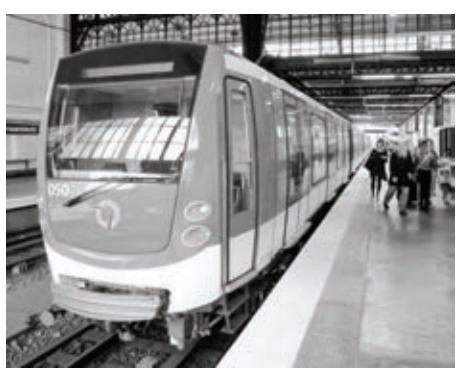

**Figure 2 : rame MF 2000** 

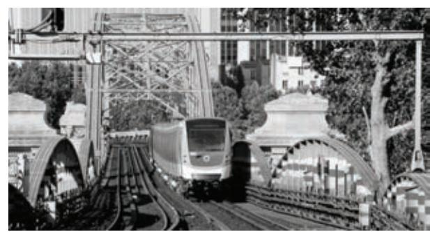

cinq ans d'utilisation. **Figure 1 : rame MF 2000 sur le pont d'Austerlitz**

En 1998, la majorité des lignes de métro à Paris étaient équipées par les rames MF 67, construites entre 1967 et 1976. En prévision de leur remplacement, la RATP a alors lancé un appel à candidature pour la réalisation du MF 2000 auprès de tous les constructeurs ferroviaires européens.

Depuis 2008, le **MF 01** (**M**etro **F**er Commande 20**01**, dénomination technique) ou **MF 2000** (**M**etro **F**er appel d'offre **2000**, dénomination commerciale) équipe progressivement les lignes 2, 5 et 9 du métro parisien.

### **2. Un métro plus écologique**

Le MF 2000 consomme 30 % d'énergie en moins que la génération de métro précédente. Cette économie a été réalisée grâce à l'amélioration du rendement de la chaîne de traction et à un freinage électrique à récupération d'énergie. La limitation de la vitesse maximale du train à 70 km·h-1 a permis d'optimiser le dimensionnement des moteurs et de la chaîne de traction, permettant des gains significatifs de consommation d'énergie aux vitesses plus basses, les plus couramment utilisées en exploitation.

De plus, les MF 2000 sont équipées de la ventilation réfrigérée, permettant de réaliser d'importantes économies d'énergie par rapport à une climatisation classique.

### **3. Un métro plus sécurisé**

Le MF 2000 embarque plusieurs ordinateurs dédiés à la gestion des équipements de sécurité. L'ouverture des portes est automatique et contrôlée par un équipement fixe installé sur la voie et un système de détection monté sur le train. L'ajout de cette fonctionnalité permet de garantir une meilleure sécurité des usagers et de limiter les risques d'incidents dans les rames et sur les quais.

Un autre aspect essentiel dans le transport de passager est celui de la gestion des accélérations et des décélérations subies par les passagers dans les différentes phases du trajet.

### **4. Un métro plus confortable pour les usagers**

Les principales améliorations apportées au confort des voyageurs lors de la conception du métro MF 2000 sont :

- la possibilité de circuler entre les voitures ;
- l'abaissement du plancher par rapport au quai (meilleure accessibilité) ;
- l'information des voyageurs par des annonces sonores à chaque station et des plans de ligne lumineux au-dessus des portes indiquant les stations restant à desservir ;
- la réduction du nombre de places assises et la mise en place de sièges plus larges ;
- les sièges « sans pied », pour un meilleur stockage des bagages ;
- les barres de maintien triples ;
- les larges ouvertures des portes, réduisant les temps d'attente en station.

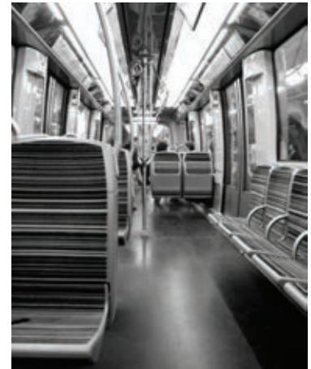

**Figure 3 : intérieur de la rame de pré-série**

### **5. Problématique générale du sujet**

L'étude porte sur la vérification du respect des exigences liées aux trois contraintes de conception énoncées ci-dessus : un métro plus écologique, plus sûr et plus confortable.

À ces trois exigences, s'ajoute le fait que la mise en place de ces nouvelles rames ne doit pas conduire à la dégradation des conditions de circulation des trains sur le réseau parisien. Les exigences liées à la fluidité du trafic devront donc elles aussi être validées.

Les différentes parties de ce sujet s'organisent de la façon suivante :

- une première partie concerne l'étude du respect des exigences liées à la circulation des trains et conduit à la validation du dimensionnement de la chaîne de traction du train ;
- une seconde partie concerne le respect des exigences liées à la sécurité et permet la validation des performances des blocs de freinage mécaniques lors d'un freinage d'urgence ;
- une troisième partie concerne le respect des exigences liées au confort des passagers. Cette partie contient plusieurs sous-parties, liées à la validation des performances du système de ventilation des voitures, au dimensionnement d'une forme de siège innovante et à l'analyse du système d'affichage du plan de ligne ;
- une dernière partie, complètement indépendante des précédentes, concerne la mise en place d'une séquence pédagogique.

### **6. Extrait du cahier des charges de la conception du train MF 2000**

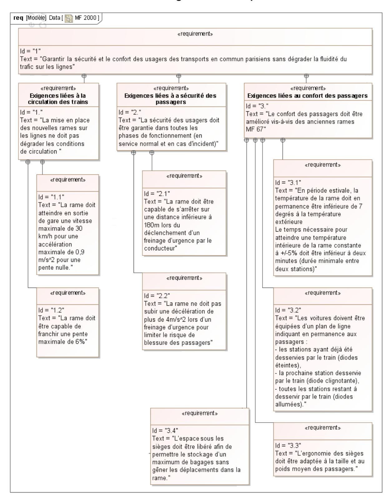

**Figure 4 : diagramme des exigences partiel de du train MF 2000**

### II. RESPECT DES EXIGENCES LIÉES À LA CIRCULATION DES TRAINS ET À LA CONSOMMATION EN ÉNERGIE

**Objectif:** vérifier le dimensionnement du couple maximal du moteur et valider le franchissement des portions en pente maximale.

Les exigences associées à la bonne circulation des trains sont rappelées ci-dessous.

| 1. Exigences liées à la circulation des trains et à la consommation en énergie |                                                                                                                                                                             |  |  |  |
|--------------------------------------------------------------------------------|-----------------------------------------------------------------------------------------------------------------------------------------------------------------------------|--|--|--|
| 1.1.                                                                           | Le train doit atteindre, en sortie de gare et pour une pente nulle, une vitesse maximale de 30 km·h <sup>-1</sup> pour une accélération maximale de 0,9 m·s <sup>-2</sup> . |  |  |  |
| 1.2                                                                            | Le train doit être capable de franchir une pente maximale de 6 % sans contrainte de vitesse.                                                                                |  |  |  |

Un train **MF 2000** est composé de 5 voitures (figure **5**). Les deux remorques extrêmes avec cabine (notées S1 et S2 sur la figure **5**) ne sont pas motorisées. Elles sont équipées chacune de 2 bogies porteurs à deux essieux. Les deux motrices intermédiaires (notées N1 et N2 sur la figure **5**) et la motrice centrale (notée NAC sur la figure **5**) sont équipées chacune de 2 bogies moteurs à deux essieux.

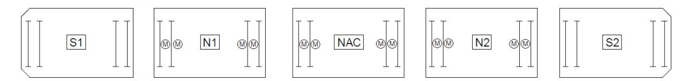

Figure 5 : répartition des moteurs sur les essieux d'un train MF 2000

Chaque moteur entraîne un essieu au travers d'un réducteur ayant un rapport de réduction  $\frac{\omega_r}{\omega_m} = \frac{1}{N}$  avec

N = 7,28 (réducteur à engrenage à simple rapport 131/18).

Les pertes dans le réducteur sont supposées nulles dans cette partie et son inertie est considérée comme négligeable devant les autres inerties mises en jeu.

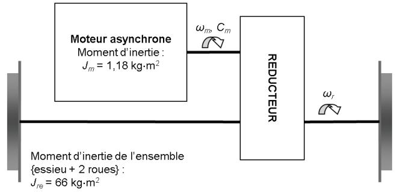

Rayon de la roue à mi-usure : R = 400 mm

Figure 6 : chaîne cinématique de la motorisation d'un essieu

| Type de voiture                               | S    | N    | NAC  | Total train                 |
|-----------------------------------------------|------|------|------|-----------------------------|
| Masse statique 6 voyageurs par m <sup>2</sup> | 35,1 | 36,8 | 37,1 | M <sub>6</sub> ≈ 181 tonnes |

Tableau 1 : masses statiques du train

L'étude menée dans cette partie porte sur le système *train* :

train = {passagers + voitures + moteurs + réducteurs + essieux + roues}.

### Notations:

- l'accélération du train est considérée comme constante et notée  $\vec{\Gamma}_{train/sol} = \Gamma_t \cdot \vec{x}$ , avec  $\Gamma_t > 0$  en phase d'accélération ;
- la vitesse du train est variable et notée  $\vec{V}_{train/sol} = V_t(t) \cdot \vec{x}$  avec  $V_t(t) > 0$  dans cette partie.

Pour dimensionner les moteurs, les ingénieurs utilisent la masse statique du train  $M_6$  mais aussi ce qu'ils appellent la masse dynamique du train. Cette masse  $M_d$  est une masse équivalente correspondant à la prise en compte des inerties des éléments en rotation (roues + essieux et rotor des moteurs) ramenées au centre de gravité du train.

### **Question 1**

En supposant le roulement sans glissement des roues sur le rail, donner l'expression de la vitesse du train  $V_t$  en fonction de  $\omega_r$  et R, puis en fonction de  $\omega_m$ , R et N.

L'expression littérale de l'énergie cinétique galiléenne  $E_c$  de l'ensemble *train* est donnée ci-dessous (sachant qu'il y a 20 essieux et 12 moteurs sur un train) :

$$E_c(train / R_g) = \frac{1}{2} \cdot M_6 \cdot V_t(t)^2 + \frac{20}{2} \cdot J_{re} \cdot \omega_r(t)^2 + \frac{12}{2} \cdot J_m \cdot \omega_m(t)^2 = \frac{1}{2} \cdot (M_6 + M_d) \cdot V_t(t)^2$$

### Question 2

En déduire l'expression et la valeur numérique de la masse équivalente  $M_d$  correspondant aux inerties des éléments en rotation en fonction de  $J_{re}$ ,  $J_m$ , N et R.

Dans la suite de cette partie la valeur de  $M_d$  utilisée sera de 13 tonnes.

### **Question 3**

Montrer que l'expression de la puissance  $P_g$ , due à l'action de la pesanteur sur le train en montée lorsque la pente forme un angle  $\alpha$  avec l'horizontale est :

$$P_g = P (pesanteur \rightarrow train / R_g) = -M_6.g.V_t \sin \alpha$$

Lorsque le train se déplace sur un tronçon de ligne horizontal en tunnel, il existe une force de résistance à l'avancement, tenant compte à la fois des frottements internes au système *train* et des frottements externes s'appliquant sur ce système. La norme de cet effort tangent à la roue est modélisée par la relation  $R_{av} = A + B \cdot V_t(t) + C \cdot V_t(t)^2$ , avec :

| Charge du train                           | Α       | В                      | С                                      |
|-------------------------------------------|---------|------------------------|----------------------------------------|
| Train avec 6 voyageurs par m <sup>2</sup> | 3 750 N | 90 N⋅s⋅m <sup>-1</sup> | 11,7 N·s <sup>2</sup> ·m <sup>-2</sup> |

Tableau 2: coefficients A, B et C

### Question 4

Montrer que l'expression de la puissance  $P_{av}$ , due à l'effort de résistance à l'avancement est :

$$P_{av} = P(frottements \rightarrow train/R_g) = -(A \cdot V_t(t) + B \cdot V_t(t)^2 + C \cdot V_t(t)^3)$$

L'expression de la puissance  $P_{mtot}$  de l'ensemble des moteurs équipant les bogies du train MF 2000 est obtenue en appliquant le théorème de l'énergie cinétique à l'ensemble du train :

$$\frac{dE_c(train/R_g)}{dt} = P_{int}(train) + P(ext \rightarrow train/R_g)$$

### **Question 5**

En déduire l'expression littérale de la puissance  $P_m$  d'un moteur sachant qu'il y a 12 moteurs dans un train.

L'exigence 1.1 impose de pouvoir atteindre une vitesse maximale de 30 km·h<sup>-1</sup> pour une accélération maximale de 0,9 m·s<sup>-2</sup> en sortie de gare pour une pente nulle. En phase d'exploitation, c'est au moment où la vitesse maximale est atteinte qu'un moteur développe son couple maximal.

Les moteurs utilisés sur le train MF 2000 sont des moteurs asynchrones autoventilés :

- puissance nominale utile à l'arbre :  $P_{nom}$  = 105 kW ;
- couple maximal en traction : C<sub>max</sub> = 885 N⋅m ;
- vitesse nominale : N<sub>nom</sub> = 1800 tr⋅mn<sup>-1</sup>.

### **Question 6**

Déterminer l'expression du couple moteur en fonction de  $P_m$  et  $V_t$ . En déduire la valeur du couple maximal développé par le moteur lors de cette phase d'accélération.

La courbe caractéristique puissance-vitesse maximale, en régime permanent, imposée par la commande de l'onduleur est donnée sur le document réponse DR1.

La pente maximale est de 6 %. Lorsque le train parcourt cette pente dans le sens de la montée, la puissance développée par les moteurs en régime permanent sert principalement à vaincre l'action de la pesanteur et l'expression de la puissance d'un moteur peut alors se réduire à l'expression  $P_m = \beta \cdot M_6 \cdot V_t$ . Pour une pente à 6 %,  $\beta = 1,36 \cdot 10^{-2} \, \text{W} \cdot \text{h} \cdot \text{km}^{-1} \cdot \text{kg}^{-1}$ .

### Question 7

En déduire à l'aide d'un tracé sur le document réponse DR1, la vitesse maximale du train en régime permanent sur une pente à 6 %.

### **Question 8**

Vérifier le dimensionnement du couple maximal du moteur choisi ainsi que le respect des deux exigences liées à la circulation des trains.

### III. RESPECT DES EXIGENCES LIÉES À LA SECURITE DES USAGERS

**Objectifs**: choisir un matériau pour les semelles des blocs de freinage, déterminer la décélération subie par les passagers lors d'un freinage d'urgence et valider la distance de freinage du train.

Les exigences associées à la sécurité des passagers en phase de freinage d'urgence sont rappelées ci-dessous.

| 2. Exigences liées à la sécurité |                                                                                                                                                           |  |  |  |
|----------------------------------|-----------------------------------------------------------------------------------------------------------------------------------------------------------|--|--|--|
| 2.1                              | Le train doit être capable de s'arrêter sur une distance inférieure ou égale à 180 m lors du déclenchement d'un freinage d'urgence par le conducteur.     |  |  |  |
| 2.2                              | Le train ne doit pas subir une décélération de plus de 2 m·s <sup>-2</sup> lors d'un freinage d'urgence pour limiter le risque de blessure des passagers. |  |  |  |

Le critère associé à l'exigence 2.2 est issu d'études empiriques qui ont montré que les passagers risquent de chuter à partir d'une décélération de l'ordre de 2 m.s<sup>-2</sup>. Lorsque la décélération reste inférieure à 2 m.s<sup>-2</sup>, tous les passagers debout évitent la chute en effectuant un pas de rattrapage.

### 1. Description du système de freinage du train

Lors d'un freinage de service (entrée du train en gare), la commande de freinage est assurée par deux systèmes de freinage, l'un électrique et l'autre mécanique.

Lors d'un freinage d'urgence, seul le freinage mécanique est sollicité. Il doit être dimensionné de manière à valider les exigences de performances et de sécurité.

La figure **7** présente la répartition des systèmes de freinage sur les voitures composant le train MF 2000.

- les motrices N1, N2 et NAC sont chacune équipées de 8 blocs de freins à semelle (un par roue)
- les remorques S1 et S2 sont chacune équipées de 6 blocs de freins à semelle (les essieux extrêmes ne sont pas freinés).

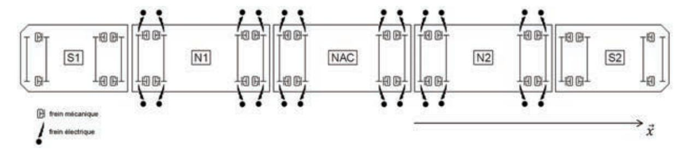

Figure 7 : répartition des systèmes de freinage sur un train MF 2000

Les freins utilisés sur les voitures des trains MF 2000 sont des blocs de freinage compacts (noté BFC) à commande pneumatique (cf. figure 8).

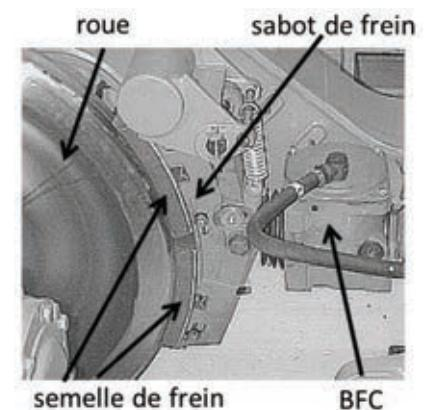

Figure 8 : bloc de freinage positionné sur le train

Ils sont équipés d'un boîtier compact comprenant un cylindre de frein pneumatique, un mécanisme d'amplification de la force (par cames) et un régleur de timonerie.

Les différents éléments composant le système sont présentés sur la figure **9**.

Les cames sont situées de part et d'autre de la tige de régleur de timonerie, donc une seule est visible sur la figure **9**.

Lorsque l'air comprimé est admis dans le cylindre de frein, le piston (1) pousse les cames vers le bas, entre les roulements. Ce mouvement fait avancer les roulements avant, qui sont mobiles. Ces derniers déplacent la tige du régleur de timonerie (2), qui transmet au sabot de frein l'effort presseur nécessaire au freinage.

En utilisant des cames d'angles différents, il est possible de choisir le facteur d'amplification de la force.

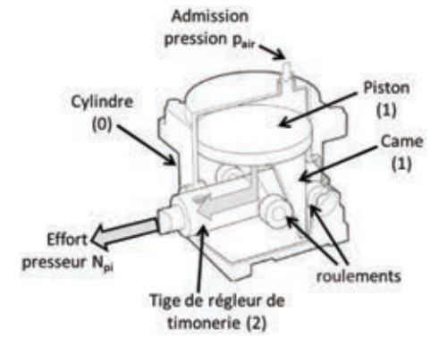

Figure 9 : schéma de principe du BFC

Le modèle retenu pour l'étude du bloc de freinage est défini sur la figure 10.

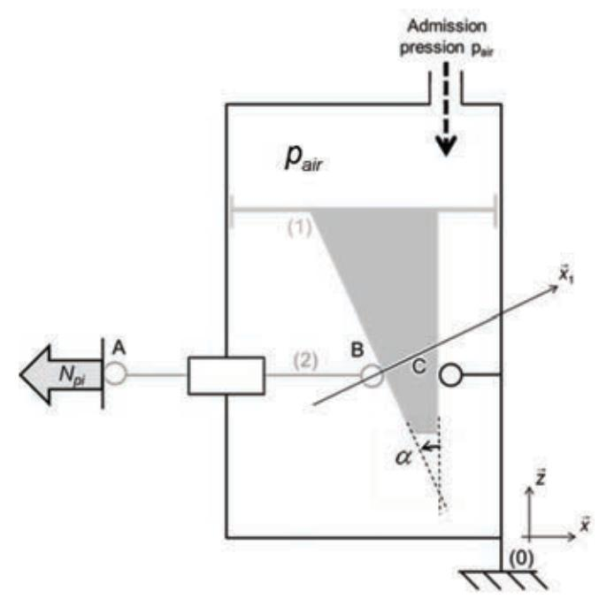

### Remarques:

- le corps du cylindre est encastré sur le train, cet ensemble train + corps est noté (0);
- la came et le piston du cylindre sont encastrés et considérés comme un seul solide, noté (1);
- la tige de régleur de timonerie est notée (2);
- la semelle de frein n'est pas représentée.

Figure 10 : schéma cinématique et paramétrage d'un BFC du train MF 2000 (le schéma n'est pas à l'échelle et la semelle n'est pas représentée)

### Données :

| Diamètre du cylindre de frein pneumatique | $d_{cylindre} = 178 \mathrm{mm}$ |
|-------------------------------------------|----------------------------------|
| Course du cylindre de frein pneumatique   | c = 72 mm                        |
| Angle de came                             | <i>α</i> = 13,7 °                |

Hypothèses (modèle défini figure 10) :

- le système admet une symétrie par rapport au plan  $(O, \vec{x}, \vec{z})$ , le modèle retenu sera donc un modèle plan avec une seule came ;
- les solides sont indéformables, leurs masses et inerties seront négligées ;
- les liaisons entre les solides sont parfaites, sauf la liaison roues/rail;
- le contact entre le piston (1) et la chemise du cylindre (0) se fait avec un coefficient de frottement négligeable grâce à un revêtement plastique adapté;
- les roulements avant sont modélisés par un contact ponctuel **sans frottement** entre la tige de régleur de timonerie (2) et la came (1) de normale  $(B, \vec{x}_1)$ ;
- les roulements arrière sont modélisés par un contact ponctuel sans frottement entre le bâti (0) et la came (1) de normale  $(C, \bar{x})$ ;
- la tige de régleur de timonerie (2) exerce sur la semelle un effort presseur de freinage  $N_{ni} = \vec{F}(2 \rightarrow semelle) \cdot \vec{x} = \vec{F}(semelle \rightarrow roue) \cdot \vec{x}$ ;
- l'étude est effectuée lorsque la semelle de frein entre en contact avec la roue.

Dans les questions suivantes, la notation  $\vec{F}(i \to j)$  devra être utilisée pour définir l'effort exercé par le solide i sur le solide j.

L'effort exercé par l'air sous pression dans le cylindre de frein sur le piston (1) est noté  $\vec{F}(air \to 1)$ , avec  $\|\vec{F}(air \to 1)\| = N_{air}$ .

L'action du rail sur la roue i est notée  $\vec{F}(rail \rightarrow roue_i) = \vec{T}_i + \vec{N}_i$ . En phase de freinage, la composante tangentielle  $T_i = \vec{F}(rail \rightarrow roue_i) \cdot \vec{x}$  s'oppose au mouvement du train (figure **11**).

La somme des efforts tangentiels exercés sur chacune des roues est notée  $T_r$ . Dans le domaine ferroviaire, cette grandeur est appelée « effort retardateur du train ».

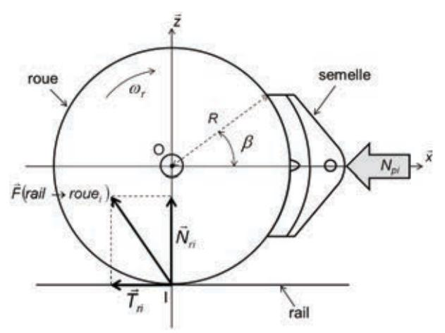

Figure 11 : action mécanique exercée par le rail sur la roue

### Données:

| Géométrie de la semelle                           | $\beta$ = 0,37 rad |
|---------------------------------------------------|--------------------|
| Largeur du contact semelle/roue suivant $\vec{y}$ | e = 30 mm          |
| Rayon du contact semelle/roue                     | R = 400 mm         |

### 2. Choix d'un matériau pour les semelles de frein et calcul de l'effort de freinage exercé sur le train

La pression  $p_{air}$  imposée dans les cylindres des différents blocs de freinage lors de l'enclenchement d'une phase de freinage est adaptée en fonction de la charge du train (nombre de voyageurs par m²) et du type de freinage. Ces valeurs de pression sont définies dans le tableau **3** (FS = freinage de service / FU = freinage d'urgence).

|           | Charge du train                 | p <sub>air</sub> (FS)  | p <sub>air</sub> (FU)   |
|-----------|---------------------------------|------------------------|-------------------------|
| Remorques | 6 voyageurs par m <sup>-2</sup> | 1,8.10⁵ Pa             | 3,1.10 <sup>5</sup> Pa  |
| Motrices  | 6 voyageurs par m <sup>-2</sup> | 2,2.10 <sup>5</sup> Pa | 3,75.10 <sup>5</sup> Pa |

Tableau 3 : pression de l'air dans les cylindres de freinage en fonction de la phase de freinage

Un premier isolement permet, par application de l'un des théorèmes de la mécanique, d'écrire l'équation scalaire suivante :  $\|\vec{F}(2 \to 1)\| = -\frac{N_{air}}{\sin \alpha}$  (avec  $\alpha < 0$ ).

### **Question 9**

Définir la frontière de l'isolement réalisé et préciser le théorème utilisé pour obtenir cette relation. Les hypothèses à mettre en place et le choix de l'axe de projection sont à justifier. À partir de cette relation, expliciter  $\|\vec{F}(2 \to 1)\|$  en fonction de la pression de l'air dans les cylindres de freinage  $p_{air}$ , du diamètre des cylindres  $d_{cylindre}$  et de l'angle  $\alpha$ .

La conception du bloc de freinage et du guidage de la semelle de frein permet de garantir la relation suivante :  $N_{ni} = \vec{F}(2 \rightarrow semelle) \cdot \vec{x} = \vec{F}(semelle \rightarrow roue) \cdot \vec{x}$ .

### Question 10

Isoler le solide (2), réaliser le bilan des actions mécaniques extérieures appliquées à ce système et écrire le théorème de la résultante statique en projection sur l'axe  $\vec{x}$ . En déduire une relation donnant l'effort presseur de freinage  $N_{pi}$  en fonction de la pression de l'air dans les cylindres de freinage  $p_{air}$ , du diamètre des cylindres  $d_{cylindre}$  et de l'angle  $\alpha$ .

Le coefficient de frottement entre la roue et la semelle est noté  $\mu$ . Il est considéré comme constant.

L'étude du contact entre la roue et la semelle permet d'aboutir à une relation simplifiée entre l'effort de freinage  $T_n$  et l'effort presseur exercé par la semelle sur la roue  $N_{pi}$ :  $T_n \approx -\mu \cdot \frac{\beta}{\sin(\beta)} \cdot N_{pi}$ , avec  $\beta$  exprimé en radians.

Lors de la conception du système de freinage, 3 types de semelles de freinage sont proposées au constructeur : les semelles en fonte, celles en matériau composite et celles en matériau fritté. Les caractéristiques et performances de ces trois types de semelles sont regroupées dans le tableau 4.

|                                          | Fonte                                                                         | Matériau composite                               | Matériau fritté                                   |
|------------------------------------------|-------------------------------------------------------------------------------|--------------------------------------------------|---------------------------------------------------|
| Coefficient de frottement sur l'acier    | <i>μ</i> =0,1                                                                 | μ=0,25                                           | μ=0,3                                             |
| Sensibilité du coefficient de frottement | Insensible à<br>l'humidité<br>Sensible à la vitesse<br>et à l'effort appliqué | Forte sensibilité à<br>l'humidité                | Insensible à<br>l'humidité et à la<br>température |
| Coût                                     | Très faible                                                                   | Moyen                                            | Élevé                                             |
| Durée de vie<br>des semelles             | ≈ 40 000 km                                                                   | ≈ 60 000 km                                      | ≈ 200 000 km                                      |
| Autres remarques                         | Peu agressives pour<br>les roues<br>Bruyantes                                 | Très agressives pour les roues Plus silencieuses | Très agressives pour<br>les roues<br>Bruyantes    |

Tableau 4 : caractéristiques et performances de trois types de semelles de freins disponibles

### Question 11

En étudiant le tableau **4**, choisir un matériau pour les semelles des blocs de freinage. Ce choix devra être justifié en quelques mots. Les critères liés à la sécurité sont prédominants par rapport aux critères liés au confort.

Quel que soit le matériau choisi, le coefficient de frottement roue/semelle  $\mu$  sera considéré, pour la suite de l'étude, comme étant égal à 0,3.

### Question 12

Pour cette valeur de coefficient de frottement, calculer numériquement l'effort de freinage  $T_n$  appliqué sur chacune des roues du train et en déduire l'effort retardateur  $T_n$  total appliqué au train lors du déclenchement d'une phase de freinage d'urgence.

### 3. Vérification de la décélération imposée aux voyageurs et de la distance de freinage

Quelle que soit la valeur de l'effort retardateur  $T_r$  déterminée dans la partie précédente, la suite de l'étude sera menée avec un effort retardateur tel que  $T_r = -386 \, \text{kN}$ .

### Hypothèses:

- le train se déplace en ligne droite, sur un tronçon de voie de pente nulle ;
- les frottements aérodynamiques et la résistance au roulement du train sont négligés dans cette partie de l'étude;

- de même, les actions mécaniques exercées par les moteurs sur le train lors de la phase de freinage sont négligées;
- la totalité de l'effort retardateur est appliquée instantanément sur le train lorsque le conducteur déclenche le freinage d'urgence à un instant  $t_0$ , pris tel que  $t_0 = 0$  s ;
- cet effort est constant pendant toute la durée du freinage ;
- la décélération du train est constante, elle est notée  $\vec{\Gamma}_{train/sol} = \Gamma_t \cdot \vec{x}$ ;
- la vitesse du train est variable, elle est notée  $\vec{V}_{train/sol} = V_t(t) \cdot \vec{x}$ .

Le tableau 5 donne la masse équivalente de chacune des voitures constituant le train. Cette masse équivalente tient compte à la fois de la masse propre de la voiture et de l'inertie des éléments en rotation (moteur, réducteur, essieu).

|                                    | Remorque | Motrice |
|------------------------------------|----------|---------|
| Masse équivalente par voiture (kg) | 36 600   | 40 200  |

Tableau 5 : masse équivalente des différentes voitures constituant un train

### **Question 13**

Déterminer la décélération  $\Gamma_t$  du train en fonction de l'effort retardateur total  $T_r$ . Faire l'application numérique.

Dans le cas le plus critique, le train roule à sa vitesse maximale au moment du déclenchement du freinage d'urgence, soit  $V_t(t_0) = 70 \,\mathrm{km} \cdot \mathrm{h}^{-1}$ .

### Question 14

Déterminer la distance parcourue par le train entre le déclenchement du freinage d'urgence par le conducteur et l'arrêt total du train. Effectuer l'application numérique.

Dans l'étude qui vient d'être menée, le temps de réponse du système de freinage a été négligé. En pratique, le freinage n'est effectif qu'une seconde après l'envoi de la consigne par le conducteur.

### Question 15

En déduire la nouvelle valeur de la distance parcourue par le train entre le déclenchement du freinage d'urgence par le conducteur et l'arrêt total du train.

### **Question 16**

Évaluer et commenter les écarts entre les performances attendues et les performances calculées du système de freinage d'urgence du train MF 2000.

### IV. RESPECT DES EXIGENCES LIÉES AU CONFORT DU PASSAGER

### 1. Étude de la ventilation d'une voiture

Objectif: valider le dimensionnement du groupe de ventilation réalisé par le constructeur en termes de puissance frigorifique et de température de soufflage.

Les exigences associées au confort thermique des passagers sont rappelées cidessous.

| 3. Exigences liées au confort des passagers à l'intérieur de chaque voiture |                                                                                                                                                                                                                                                                                        |  |  |  |
|-----------------------------------------------------------------------------|----------------------------------------------------------------------------------------------------------------------------------------------------------------------------------------------------------------------------------------------------------------------------------------|--|--|--|
| 3.1                                                                         | En période estivale, la température à l'intérieur des voitures de la rame doit en permanence être inférieure de 7 °C à la température extérieure. Le temps de réponse à $\pm 5$ % du système de climatisation doit être inférieur à deux minutes (durée minimale entre deux stations). |  |  |  |

Le domaine d'étude se limitera à une voiture de métro en circulation entre deux stations sur les voies extérieures du réseau parisien (configuration fréquente sur la ligne 2) durant la période estivale.

La température extérieure avoisine les trente-cinq degrés Celsius.

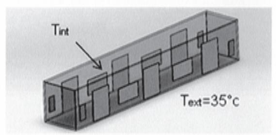

Figure 12 : illustration des surfaces d'échange de chaleur entre l'intérieur des voitures et l'extérieur d'une voiture

En l'absence de ventilation réfrigérée, la température à l'intérieur de la voiture peut atteindre les quarante-cinq degrés Celsius.

Afin de respecter le maintien de la température à l'intérieur de la voiture autour de 28 °C, le constructeur implante une ventilation réfrigérée qui souffle de l'air froid.

### a. Détermination de la puissance frigorifique minimale nécessaire pour respecter l'exigence 3.1

### Données:

| Caractéristiques dimensionnelles des pa           | rois par voiture    |
|---------------------------------------------------|---------------------|
| Surface totale parois latérales opaques, $S_{pv}$ | 29 m²               |
| Surface totale plafond, $S_{ph}$                  | 37,5 m <sup>2</sup> |
| Surface totale plancher, $S_{pb}$                 | 37,5 m <sup>2</sup> |
| Surface totale vitre, $S_v$                       | 13 m²               |
| Coefficient de transmission surfacique (          |                     |
| Parois latérales, K <sub>pv</sub>                 | à déterminer        |
| Plafond, $K_{ph}$                                 | 0,68                |
| Plancher, Kpb                                     | 0,65                |
| Vitre, K <sub>v</sub>                             | 2,5                 |

Les parois opaques verticales sont composées essentiellement d'un matériau multicouche. La présence de renforts métalliques est négligée dans les échanges thermiques avec l'extérieur.

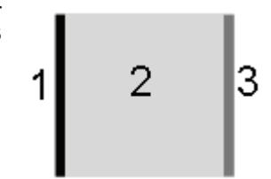

- matériau 1 : acier d'épaisseur 2 mm ; matériau 2 : isolant d'épaisseur 6 cm ;
- matériau 3 : plaque en fibre de verre d'épaisseur 2 mm.

| Caractéristiques matériaux des parois                                   |                                           |  |
|-------------------------------------------------------------------------|-------------------------------------------|--|
| Conductivité thermique de l'acier, $\lambda_{acier}$                    | 230 W⋅m <sup>-1</sup> ⋅°C <sup>-1</sup>   |  |
| Conductivité thermique de l'isolant, $\lambda_{isolant}$                | 0,05 W·m <sup>-1</sup> ·°C <sup>-1</sup>  |  |
| Conductivité thermique de la fibre de verre, $\lambda_{\textit{fibre}}$ | 0,044 W·m <sup>-1</sup> ·°C <sup>-1</sup> |  |
| Conductivité thermique du vitrage, $\lambda_{vitrage}$                  | 6 W⋅m <sup>-1</sup> ⋅°C <sup>-1</sup>     |  |

| Résistances thermiques superficielles             | R <sub>s_ext</sub>             | R <sub>s_int</sub> |
|---------------------------------------------------|--------------------------------|--------------------|
| (en m²⋅°C⋅W⁻¹)                                    | (vitesse relative              | (vitesse du        |
| , , ,                                             | du vent 1 km·h <sup>-1</sup> ) | vent nulle)        |
| Paroi verticale avec flux de chaleur horizontal   |                                | 0,113              |
| Paroi horizontale avec flux de chaleur ascendant  | 0,04                           | 0,141              |
| Paroi horizontale avec flux de chaleur descendant |                                | 0,088              |

| Caractéristiques d'échange thermique liées à la présence de passagers                                                                                                                   |                                                           |  |
|-----------------------------------------------------------------------------------------------------------------------------------------------------------------------------------------|-----------------------------------------------------------|--|
| Nombre de passagers par voiture, N                                                                                                                                                      | 80                                                        |  |
| Débit volumique d'air hygiénique par passager, Q <sub>air</sub>                                                                                                                         | 0,004 m <sup>3</sup> ·s <sup>-1</sup> ·pers <sup>-1</sup> |  |
| Air humide à 70%, <i>Uair</i>                                                                                                                                                           | 1220 W·s·m <sup>-3</sup> ·K <sup>-1</sup>                 |  |
| $(U_{air} = C_{p \ air} * \rho_{air} \text{ avec } C_{p \ air} = 1000 \text{ J} \cdot \text{Kg}^{-1} \cdot \text{K}^{-1} \text{ et } \rho_{air} = 1.22 \text{ Kg} \cdot \text{m}^{-3})$ | 1220 00.8.111 3.1                                         |  |
| Puissance thermique équivalente d'une personne de corpulence                                                                                                                            | 90 W                                                      |  |
| moyenne, $P_{pass}$                                                                                                                                                                     | 90 VV                                                     |  |

La voiture reçoit deux sources de chaleur constantes, l'une résultant de la présence de passagers, l'autre issue du rayonnement du soleil sur la voiture.

L'apport de chaleur due à l'ensoleillement est considéré constant, la valeur du flux associé est  $\varphi_{solaire}$  = 800 W·m<sup>-2</sup>. La surface de rayonnement est estimée égale à dix pourcents de la surface vitrée.

### **Question 17**

Exprimer le flux de puissance thermique résultant des sources de chaleurs constantes  $\Phi_{\textit{solaire\_passager}}$  , avec  $\Phi_{\textit{solaire\_passager}} = \Phi_{\textit{solaire}} + \Phi_{\textit{pass}}$  .

Le coefficient thermique du matériau multicouche est déterminé à partir de la relation suivante:

$$\frac{1}{K_{\text{nv}}} = \sum_{i} \frac{\mathbf{e}_{i}}{\lambda_{i}} + \left(R_{\text{s\_int}} + R_{\text{s\_ext}}\right)$$

- e<sub>i</sub>, épaisseur de la couche i ;
- $\frac{1}{K_{pv}} = \sum_{i} \frac{e_{i}}{\lambda_{i}} + \left(R_{s\_int} + R_{s\_ext}\right) \frac{\lambda_{i}}{couche} \text{ i ; } \\ R_{s\_int} \text{ et } R_{s\_ext}, \text{ résistances thermiques}$ 
  - superficielles intérieure et extérieure.

### **Question 18**

À partir des données, exprimer le coefficient de transmission thermique du matériau qui compose les parois verticales noté  $K_{DV}$ . Faire l'application numérique.

### Question 19

Exprimer le flux thermique  $\Phi_{\textit{paroi}\_\textit{opaque}\_\textit{verticale}}$  qui traverse les parois opaques verticales. Donner ensuite l'expression de  $\Phi_{\textit{paroi}\_\textit{opaque}}$ , flux de chaleur traversant l'ensemble des parois non vitrées de la voiture. Faire l'application numérique.

Parmi les différents flux de chaleur mis en jeu pour la voiture, il est possible de distinguer les flux ayant tendance à apporter de la chaleur (flux entrants) des flux ayant tendance à refroidir la voiture (flux sortants). Le bilan des échanges thermiques s'écrit alors sous la forme suivante :

$$\Sigma$$
 flux thermiques entrants =  $\Sigma$  flux thermiques sortants

En régime établi et dans l'hypothèse où la température intérieure est inférieure à la température extérieure (véhicule réfrigéré) ce bilan s'écrit alors (chaque terme ayant une valeur algébrique positive) :

$$\Phi_{\text{solaire passager}} + \Phi_{\text{paroi opaque}} + \Phi_{\text{vitre}} + \Phi_{\text{air dégagé}} = P_{\text{clim}}$$

- $-\Phi_{air\_dégagé} = U_{air} \cdot Q_{air} \cdot N \cdot \Delta T$ , flux de chaleur dégagé par l'ensemble des passagers, avec une température de l'air expulsé égale à 37 °C;
- $-\Phi_{\it paroi\_opaque}$ , flux de chaleur traversant l'ensemble des parois non vitrées de la voiture ;
- $-\Phi_{vitre}$ , flux de chaleur traversant les vitres de la voiture.

### Question 20

Déterminer la valeur de  $P_{clim}$  permettant de garantir le respect de l'exigence 3.1 pour la température intérieure de la voiture. Faire l'application numérique.

### b. Validation du groupe de ventilation choisi par le constructeur

Le constructeur a installé une ventilation réfrigérée dont les caractéristiques sont données en annexe **A1**. Pour maintenir une température voisine de 28 °C, il est nécessaire de souffler de l'air froid, on note  $T_c$ , la température de soufflage.

Sachant que la puissance frigorifique se définit à partir de la relation suivante :

$$P_{clim} = U_{air} \cdot D\acute{e}bit_{clim} \cdot (28 - T_c)$$

Dans la suite du questionnement, Pclim prend la valeur de 12 kW.

### **Question 21**

Déterminer la valeur de température de soufflage  $T_c$ . Conclure sur la possibilité de refroidir la voiture avec la ventilation choisie.

Afin de visualiser l'évolution temporelle des échanges thermiques entre la voiture ventilée et l'extérieur, un modèle multi-physique est élaboré à l'aide d'un logiciel adapté. Le modèle, illustré sur le DR**3**, tient compte des caractéristiques des matériaux de la voiture, de la présence de passagers, des conditions de température extérieures et des données techniques de la ventilation implantée dans la voiture.

### **Question 22**

Entourer sur le DR**3** la partie du modèle dans laquelle les caractéristiques thermiques des matériaux doivent être renseignées. Préciser la fonction du bloc « Convective Heat Transfer ».

### **Question 23**

À partir de la courbe tracée sur le DR**2**, représentant l'évolution de la température intérieure de la voiture lors de la mise en route de la climatisation, déterminer graphiquement le temps de réponse à 5% du modèle. Effectuer sur la copie les éventuels calculs nécessaires.

### **Question 24**

À partir de la courbe tracée sur le DR**4**, représentant la puissance frigorifique instantanée, déterminer graphiquement la puissance moyenne en régime établi délivrée par la climatisation. Comparer ce résultat aux caractéristiques de la climatisation choisie et conclure.

### **Question 25**

À partir des résultats obtenus dans cette partie, conclure sur le respect de l'exigence 3.1 par la ventilation choisie par le constructeur.

### **2. Étude de l'ergonomie des sièges**

*Objectif : valider une nouvelle architecture de maintien des sièges permettant aux passagers de stocker plus facilement leurs valises sous la banquette et choisir un matériau adapté en termes de déformation et de résistance.* 

Les exigences associées au confort des passagers et portant sur l'ergonomie des sièges sont rappelées ci-dessous.

|     | 3. Exigences liées au confort des passagers                                                                                                     |
|-----|-------------------------------------------------------------------------------------------------------------------------------------------------|
| 3.3 | Le support des sièges doit résister<br>au poids moyen de<br>quatre<br>passagers<br>sans se rompre et sa flèche ne doit pas dépasser 10<br>mm.   |
| 3.4 | L'espace sous les sièges doit être libéré afin de permettre le stockage<br>d'un maximum de bagages sans gêner les déplacements dans la voiture. |

De plus en plus de voyageurs utilisent le métro pour se rendre dans les gares de TGV parisiennes. Une conséquence est l'encombrement des couloirs, pouvant incommoder les personnes à mobilité réduite.

Lors de la conception des nouvelles voitures, une nouvelle ergonomie de la poutre de maintien des banquettes a été proposée, afin de permettre le stockage des bagages en dessous de celles-ci. Les couloirs sont alors libérés (cf. figures **13** et **14**).

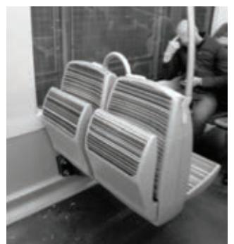

Figure 13 : banquettes du train

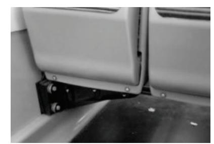

Figure 14 : détail de la fixation des banquettes sur la paroi du train

Les sièges en plastiques moulés sont soutenus par une poutre fixée sur la paroi de la voiture.

La modélisation retenue pour le dimensionnement de cette poutre de maintien est présentée sur la figure **15**.

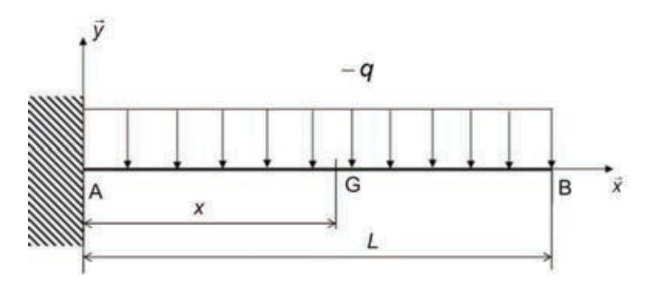

Figure 15 : modélisation de la poutre soutenant la banquette

Le modèle poutre du bras qui soutient la banquette est caractérisé par :

| Longueur du bras                                | L = 1 m                                   |
|-------------------------------------------------|-------------------------------------------|
| Section carrée du bras                          | S = 120*120 mm <sup>2</sup>               |
| Moment quadratique suivant l'axe $(G, \bar{z})$ | $I_{Gz} = 350~000~\text{mm}^4$            |
| Module de Young du matériau type acier          | <i>E</i> = 200 GPa                        |
| Limite élastique du matériau type acier         | R <sub>e</sub> = 235 MPa                  |
| Chargement linéique                             | $q = 2 000 \text{ N} \cdot \text{m}^{-1}$ |

Le modèle de chargement représenté ci-dessus est une charge répartie prenant en compte le poids de quatre passagers ainsi que la masse des sièges.

### Question 26

Démontrer la relation permettant d'exprimer le moment fléchissant suivant l'axe  $\vec{z}$  en tout point de la poutre en fonction de q, L, x. Calculer la valeur maximale atteinte par le moment fléchissant suivant l'axe  $\vec{z}$ . Vérifier si le matériau choisi pour la réalisation de la poutre est adapté.

### **Question 27**

En déduire la flèche maximale de la poutre. Conclure vis-à-vis du critère de flèche maximale admissible annoncé ci-dessus.

Par souci d'économie, le concepteur souhaite utiliser un matériau composite.

Un modèle numérique, plus proche de la géométrie réelle du support de siège, est construit grâce à un logiciel de simulation. Les résultats graphiques de la simulation en termes de flèche sont présentés sur la figure **16**.

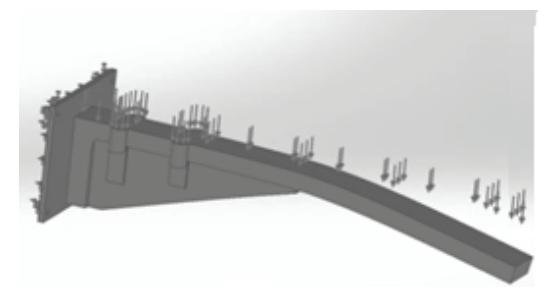

Figure 16 : modèle numérique de la poutre soutenant la banquette

Pour optimiser la solution technologique, l'industriel a effectué une série de modélisations avec différents matériaux.

| Matériaux                                       | Module de<br>Young en<br>GPa | Masse<br>volumique<br>en kg·m <sup>-3</sup> | Limite<br>élastique<br>en MPa | Flèche<br>maximale<br>en mm | Contrainte<br>maximale<br>en MPa |
|-------------------------------------------------|------------------------------|---------------------------------------------|-------------------------------|-----------------------------|----------------------------------|
| ABS-PC                                          | 2,41                         | 1 070                                       | 40                            | 17                          |                                  |
| ABS renforcé fibres de verre                    | 150                          | 1 370                                       | 250                           | 0,75                        |                                  |
| Polypropylène copolymère                        | 0,9                          | 890                                         | 27,6                          | 45                          | 19                               |
| Polypropylène<br>renforcé de<br>fibres de verre | 90                           | 1 220                                       | 22                            | 0,95                        |                                  |
| PVC rigide                                      | 2,4                          | 1 300                                       | 41                            | 16                          |                                  |

Tableau 6 : caractéristique des différents matériaux envisagés pour la réalisation du support de siège et résultats des simulations numériques

### **Question 28**

À partir des résultats regroupés dans le tableau **6**, choisir un matériau adapté à l'exigence 3.3.

### 3. Étude de l'affichage du plan de ligne

Objectif: valider l'algorithme de gestion de l'affichage du plan de ligne

Les exigences associées au confort des passagers sont rappelées ci-dessous en ce qui concerne le suivi en temps réel de l'avancement de leur voyage.

| 3. Exigence | es liées au confort des passagers                                                |
|-------------|----------------------------------------------------------------------------------|
| 3.2         | Les voitures doivent être équipées d'un plan de ligne indiquant en               |
|             | permanence aux passagers :                                                       |
|             | <ul> <li>les stations ayant déjà été desservies par le train (diodes</li> </ul>  |
|             | électroluminescentes éteintes) ;                                                 |
|             | <ul> <li>la prochaine station desservie par le train (diode</li> </ul>           |
|             | électroluminescente clignotante) ;                                               |
|             | <ul> <li>toutes les stations restant à desservir par le train (diodes</li> </ul> |
|             | électroluminescentes allumées).                                                  |

Les plans de lignes dynamiques (PLD) permettent, à l'intérieur des voitures, l'affichage d'informations à l'intention des passagers. Ces informations consistent en l'affichage en temps réel de la position du train sur la ligne signalée par un point lumineux. Les plans de ligne sont intégrés au-dessus des portes. Chaque voiture contient six plans de ligne, soit trente par train.

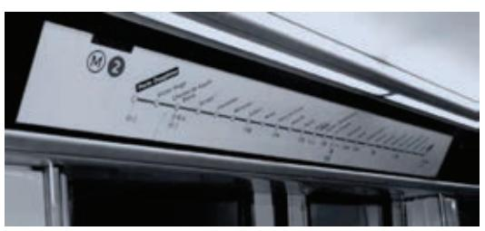

Figure 17 : plan de ligne dynamique (PLD)

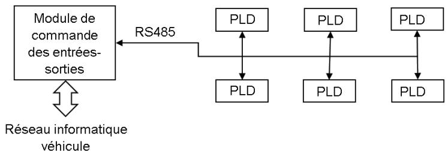

Figure 18 : connexion entre les PLD et le module de commande

Les PLD sont commandés par une unité de contrôle externe appelée module de commande des entréessorties.

Chaque PLD est géré indépendamment des autres au travers d'une liaison série RS485 permettant de faire transiter les commandes d'affichage et de test du plan de ligne.

### a. Analyse de la communication entre le module de commande et le plan de ligne

L'interface physique entre le plan de ligne et le module de commande est une liaison série RS485 multipoints. Cette liaison comporte, en sus du module de commande, six plans de ligne.

La liaison RS485 utilise des signaux différentiels, qui sont la tension de signal et son opposé. Le récepteur détecte la différence des deux tensions. Le câble est constitué de deux fils (une paire torsadée avec un blindage relié à la masse).

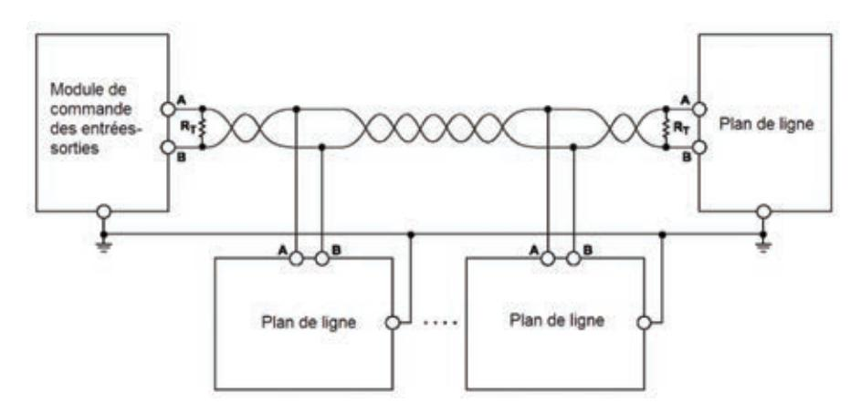

Figure 19: liaison RS485

« A » désigne la ligne non inversée et "B" la ligne inversée. Un récepteur RS485 détecte une différence de potentiels de 200mV entre A et B. Si le potentiel de A est 200mV plus haut que celui de B, c'est un niveau logique haut (« 1 ») qui est

transmis. Si B est 200mV plus haut que A c'est un niveau logique bas (« 0 ») qui est transmis. Si la tension entre A et B est inférieure à +/-200mV, le niveau est indéfini.

Les paramètres du protocole sont définis comme suit :

- transmission de type half duplex asynchrone ;
- vitesse de 9600 bauds ;
- un caractère est constitué d'un bit de start, de huit bits de donnée, d'un bit de parité paire et d'un bit d'arrêt (cf. figure **20**) ;
- le bit de poids faible est transmis en premier.

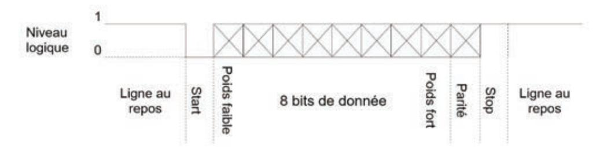

**Figure 20 : détail de la transmission d'un octet de donnée**

Le relevé de la figure **21** correspond à un PLD comptant 25 stations. Un zoom a été effectué sur le troisième octet de la trame, correspondant à l'octet de donnée D1.

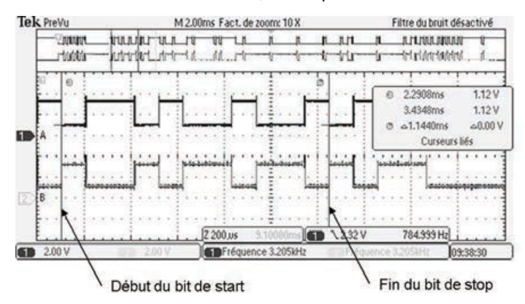

**Figure 21 : détails de l'octet D1**

Cet octet D1 permet de fixer l'adresse de l'équipement avec lequel le module de commande est en communication. Les huit bits le composant sont décrits dans le tableau **7**.

| B7 | B6         | B5 | B4 | B3                                                                                                                                                                           | B2 | B1 | B0      |
|----|------------|----|----|------------------------------------------------------------------------------------------------------------------------------------------------------------------------------|----|----|---------|
| 0  | au PLD 6). |    |    | Adresse de l'équipement pour les 6 PLD sur le réseau<br>RS485 : cette adresse est comprise entre 100001 (adresse<br>correspondant au PLD 1) et 100110 (adresse correspondant |    |    | Origine |

**Tableau 7 : contenu de l'octet D1**

La signification du bit « Origine » est la suivante :

- 1 correspond à une demande du module de commande à destination de l'équipement ;
- 0 correspond à une réponse de l'équipement à destination du module de commande.

### **Question 29**

Calculer la durée d'un bit. À partir de la figure **21** et du tableau **7**, déterminer la valeur de l'octet D1 (en exploitant la voie A), en déduire l'adresse du PLD concerné par cette trame.

### **b. Etude de la machine d'états-transitions implantée dans l'unité de contrôle**

Une version simplifiée de la machine d'états-transitions implantée dans le module de commande est donnée figure **22** Cette machine utilise deux évènements correspondant à l'utilisation des portes de la rame en station (ouverture des portes ou fermeture des portes) et deux évènements indiquant l'entrée et la sortie de station. Ces évènements sont générés par l'informatique de sécurité du train et communiqués au module de commande par le réseau du système informatique embarqué.

On considère qu'il y a N stations sur chaque ligne : X(1), X(2), X(3), … X(N-1), X(N). Sur le PLD, X(1) correspond à la diode électroluminescente la plus à droite et X(N) à la diode électroluminescente la plus à gauche. Les fonctions Faire\_clignoter\_voyant(Nstation) et Eteindre\_voyant(Nstation) permettent via la liaison RS485 de passer le voyant de la station X(Nstation) en mode clignotant ou éteint. La fonction Allumer\_tous\_les\_voyants() permet comme son nom l'indique d'allumer fixement tous les voyants du plan de ligne.

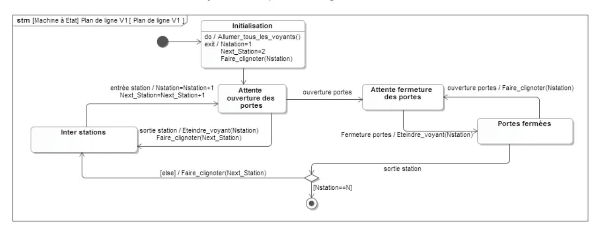

**Figure 22 : machine d'états-transitions simplifiée**

### Règles d'écriture du pseudo code :

| Affectation                                                 | Appel de procédure                                        |
|-------------------------------------------------------------|-----------------------------------------------------------|
| Ident_var (1) ← <valeur></valeur>                           | Ident_procédure(2)(param1,param2(3),…)                    |
| Ident_var ← <expression></expression>                       |                                                           |
| Alternative : SI - ALORS - SINON                            | Répétition : TANT QUE                                     |
| SI <expression booléenne=""> ALORS</expression>             | TANT_QUE <expression booléenne=""></expression>           |
| <instruction></instruction>                                 | <instruction></instruction>                               |
|                                                             |                                                           |
| SINON(4)                                                    | FIN_TANT_QUE                                              |
| <instruction></instruction>                                 |                                                           |
|                                                             |                                                           |
| FIN_SI                                                      |                                                           |
| Choix multiples : SELON                                     | Remarque :                                                |
|                                                             | : Ident_var est un identifiant de variable<br>(1)         |
| SELON <ident_var></ident_var>                               | : Ident_procédure est un identifiant de<br>(2)            |
| <liste_valeur> : <instruction></instruction></liste_valeur> | procédure                                                 |
| <br>:                                                       | : param1, param2,… sont les arguments<br>(3)              |
| { AUTREMENT : <instruction> }</instruction>                 | de la procédure                                           |
| FIN_SELON                                                   | : la partie SINON <instruction> est<br/>(4)</instruction> |
|                                                             | facultative.                                              |

Un pseudocode traduisant le diagramme simplifié d'états-transitions de la figure **22** est donné ci-après :

```
VARIABLES GLOBALES
Booléen : Evt_Ouv_Portes
Booléen : Evt_Ferm_Portes
Booléen : Evt_Sortie_Station
Booléen : Evt_Entrée_Station
VARIABLES LOCALES : 
Entier : Etat
Entier : Nstation 
Entier : Next_Station 
Etat←1
Allumer_Tous_Les_Voyants() 
Nstation←1
Next_Station←2
Faire_clignoter(Nstation) 
TANT_QUE Etat < 5 
  SELON Etat 
 1 : SI Evt_Ouv_Portes==Vrai 
 ALORS
 Evt_Ouv_Portes←Faux
 Etat←2
 FIN_SI 
 SI Evt_Sortie_Station==Vrai 
 ALORS
 Evt_Sortie_Station←Faux
 Eteindre_voyant(Nstation) 
 Etat←4
 Faire_clignoter(Next_Station) 
 FIN_SI 
                                      2 : SI ___________________ 
                                      ALORS
                                      _____________________ 
                                      _____________________ 
                                      _____________________ 
                                      FIN_SI 
                                      3 : SI Evt_Ouv_Portes==Vrai 
                                      ALORS
                                      Evt_Ouv_Portes←Faux
                                      Faire_clignoter(Nstation) 
                                      Etat←2
                                      FIN_SI 
                                        SI Evt_Sortie_Station==Vrai 
                                      ALORS
                                      Evt_Sortie_Station←Faux
                                      SI Nstation==N
                                      ALORS 
                                      Etat←5
                                      SINON 
                                      Etat←4
                                      Faire_clignoter(Next_Station) 
                                      FIN_SI 
                                      FIN_SI 
                                      4 : SI Evt_Entrée_Station==Vrai 
                                      ALORS
                                      Evt_Entrée_Station←Faux
                                      Nstation=Nstation+1 
                                      Next_Station=Next_Station+1 
                                      Etat←1
                                      FIN_SI 
                                      FIN_SELON 
                                     FIN_TANT_QUE
```

Les variables booléennes Evt\_Entrée\_Station, Evt\_Sortie\_Station, Evt\_Ouv\_portes et Evt\_Ferm\_Portes sont mises à la valeur Vrai par le procédé qui gère les communications sur le réseau du système informatique embarqué du train.

### **Question 30**

À partir de la figure **22** donner le nom des états du diagramme d'états-transitions correspondants aux cinq valeurs que peut prendre la variable *Etat* et compléter le pseudo code sur le document réponse DR**5**.

Le diagramme simplifié d'états-transitions précédent ne prend pas en compte les deux sens de circulation du train. Une variable nommée *Sens* permet de connaître le sens de circulation. Quand le train va dans le sens X(1) vers X(N), *Sens* prend la valeur 0 et quand le train va dans le sens X(N) vers X(1) , *Sens* prend la valeur 1.

Remarque : *Sens*=0 correspond au diagramme simplifié de la figure **22.**

### **Question 31**

Compléter le diagramme d'états – transitions du document réponse DR**6** en remplissant les cadres afin de tenir compte des deux sens de circulation.

Un chronogramme, tracé sur le document réponse DR**7** traduit l'évolution temporelle du système dans le cas particulier où *Sens* = 0 et *N* > 8. Le chronogramme débute dans l'état courant « portes fermées », avec le voyant 5 allumé fixement.

### **Question 32**

Á partir de la figure **22** ou du pseudocode, compléter le chronogramme du document réponse DR**7** et vérifier si le comportement des PLD est conforme au cahier des charges.

### **V. SYNTHÈSE**

Les rames MF 2000 ont été développées au début des années 2000 dans l'idée d'équiper plusieurs lignes du métro parisien avec des trains plus écologiques, plus sûrs et plus confortables pour les usagers.

En 2017, les exigences liées au développement durable deviennent un critère primordial dans la conception des systèmes industriels. Du fait de leur faible consommation énergétique par passager (de l'ordre de 30 Whpassager-1km-1 contre environ 500 Whpassager-1km-1 pour une voiture individuelle), les transports en commun ferroviaires font déjà partie des moyens de déplacement les plus écologiques.

Cependant, une vingtaine d'années s'étant écoulée depuis la commande de la conception des rames MF 2000, la RATP pourrait prochainement lancer un appel d'offre pour une nouvelle génération de rames pour lesquelles l'impact écologique des véhicules serait encore plus faible.

### **Question 33**

Dans ce contexte, proposer quelques axes de recherche qui permettraient d'aboutir au développement du métro MF 2018, « le métro vert ». La réflexion pourra par exemple être orientée vers les problématiques de motorisation, de choix de matériaux ou d'architecture des rames. Préciser quels pourraient être les impacts de ces modifications sur les performances des rames en termes de sécurité et de confort des passagers.

### **VI. PARTIE PÉDAGOGIQUE**

Les descriptions pédagogiques proposées sont pour majeure partie extraites du document « ressources pour le cycle terminal – série S : enseignement spécifique de sciences de l'ingénieur ». Elles doivent conduire le candidat à formaliser l'organisation d'une séquence pédagogique relative à **l'enseignement spécifique de sciences de l'ingénieur de l'année de terminale du baccalauréat scientifique**. Des extraits du programme des sciences de l'ingénieur du BAC S – Cycle terminal de la série scientifique issus du Bulletin Officiel de l'éducation nationale n°9 du 30 septembre 2010 sont donnés dans les documents annexes **A2** et **A3**.

### **1. Le concept de séquence**

Dans la description du séquencement de l'enseignement spécifique des sciences de l'ingénieur (voir documents pédagogiques en annexe **A4**), le choix a été fait de définir des séquences de durées variables de quelques semaines (ni trop peu pour garantir la possibilité d'agir et d'apprendre, ni trop longue pour ne pas générer de lassitude), pouvant s'intégrer entre chaque période de vacances.

Le concept de séquence doit respecter les données suivantes :

- chaque séquence vise l'acquisition (découverte ou approfondissement) de compétences et connaissances associées du référentiel, identifiées dans le programme ;
- chaque séquence permet d'aborder de 1 à 2 centres d'intérêt de manière à faciliter les synthèses et limiter le nombre de supports ;
- chaque séquence correspond à un thème unique de travail, porteur de sens pour les élèves et intégrant les centres d'intérêts utilisés ;
- chaque séquence est constituée de 2 à 4 semaines consécutives au maximum ;
- la durée de l'année scolaire est considérée égale à 30 semaines, de façon à laisser une marge de manœuvre pédagogique, laissant 6 semaines par année scolaire, à répartir entre les séquences, pour intégrer des remédiations, des évaluations, des sorties et visites, etc. ;
- chaque séquence donne lieu à une séance de présentation à tous les élèves, explicitant les objectifs, l'organisation des apprentissages et les éventuels supports didactiques utilisés ;
- chaque séquence donne lieu à une évaluation sommative, soit intégrée dans son déroulement, soit prévue dans le cours d'une séquence suivante.

Une fiche de préparation de séquence, complétée, est donnée en annexe **A5**. Elle permet d'avoir une vue détaillée des éléments devant permettre la préparation des séances ainsi que leur déroulement. Elle renseigne de manière explicite sur le dispositif mis en place, la mise en œuvre imaginée par l'enseignant pour atteindre les objectifs visés. Cette fiche complète la progression annuelle, elle aussi donnée en annexe (annexe **A4**). Elle est complétée par le document donné en annexe **A6** décrivant complètement l'organisation de la séance.

### **2. Exemple d'organisation d'une séquence**

La séquence n°5, détaillée en annexes **A5** et **A6**, est basée sur le thème sociétal « mobilité ». La problématique est « Comment améliorer le confort lors d'un déplacement ? ».

Cette séquence se situe durant la première année du cycle terminal de la série S – enseignement spécifique de sciences de l'ingénieur.

La durée indicative de la séquence est de trois semaines. Elle a pour objectif la vérification expérimentale des performances annoncées par le constructeur. Elle permet de mettre en œuvre un système dans ses conditions réelles d'exploitation et impose de définir un protocole d'essais reproductible.

Le problème technique est : «montrer et quantifier l'influence du transfert de charge lors d'une phase d'accélération et de freinage ».

Les centres d'intérêt choisis sont :

- CI2 « Expérimenter et mesurer sur un système réel pour évaluer ses performances » ;
- CI5 « Concevoir et utiliser un modèle relatif à un système en vue d'évaluer les performances de la chaîne d'énergie ».

La méthodologie pédagogique est définie comme étant l'ensemble des méthodes, des techniques, de procédés (démarches) qui permettent d'atteindre les objectifs de l'enseignement.

### **Question 34**

La séquence N°5, décrite en annexes **A5** et **A6**, est basée sur une méthode pédagogique déductive. Indiquer l'autre démarche pédagogique pouvant être mise en œuvre. Expliciter l'organisation de chacune des deux démarches et préciser leurs avantages et leurs inconvénients.

### **Question 35**

Préciser quelle est la séance de travaux pratiques associée à de l'expérimentation et celle liée à de l'investigation. Expliciter les activités élèves pouvant être associées à la séance d'expérimentation.

### **3. Étude de cas : conception d'une séquence**

La séquence n°18 est basée sur le thème sociétal « confort ». La problématique est « Comment réguler une température ? ».

Cette séquence se situe durant la seconde année du cycle terminal de la série S – enseignement spécifique de sciences de l'ingénieur.

La durée imposée de la séquence est de trois semaines.

Cette séquence est partiellement décrite par les documents réponse DR**8** et DR**9**. La suite du questionnement vise à compléter ces deux documents.

### **Question 36**

Formuler les prérequis nécessaire pour débuter la séquence 18.

### **Question 37**

À partir de la liste donnée en annexe **A4**, compléter sur le DR**8** les centres d'intérêts autour desquels s'articule la séquence n°18. Justifier ce choix.

### **Question 38**

À partir de l'extrait du bulletin officiel de l'Éducation nationale, donné dans l'annexe **A3**, déterminer les connaissances associées à chaque sous-compétence abordée dans la séquence 18 et compléter le document réponse DR**8**.

Une organisation de la séquence n°5 est proposée en annexe **A6**. Elle détaille l'enchaînement des séances, les compétences visées et l'objectif de formation pour chaque activité.

Une ébauche du même document appliquée à la séquence n°18 est proposée sur le document réponse DR**9**.

### **Question 39**

À partir de l'exemple de la séance n°5 (annexe **A6**), compléter l'organisation de la séquence n°18 proposée sur le document réponse DR**9**. Il est attendu de :

- caractériser la compétence abordée lors de chacune des séances ;
- définir l'objectif de formation associé à chaque activité ;
- préciser l'organisation classe (classe entière, groupes,…) ;
- décrire les évaluations mises en place.

### DOSSIER TECHNIQUE ET PÉDAGOGIQUE

Document annexe A1

Extrait de la documentation technique de la ventilation réfrigérée

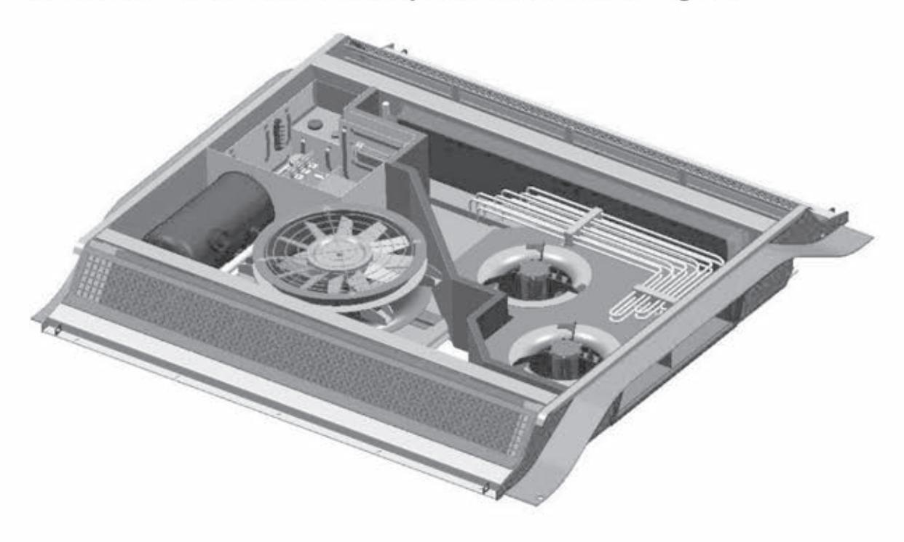

| Débit d'air                     | 2900 m <sup>3</sup> · h <sup>-1</sup> ±10%                                                                                                                                          |
|---------------------------------|-------------------------------------------------------------------------------------------------------------------------------------------------------------------------------------|
| Masse                           | 377 kg                                                                                                                                                                              |
| Puissance frigorifique maximale | 12 kW                                                                                                                                                                               |
| Température mini d'air soufflé  | 16 °C                                                                                                                                                                               |
| Compresseur frigorifique        | type scroll horizontal                                                                                                                                                              |
| Ventilateur condenseur          | type axial                                                                                                                                                                          |
| Alimentation électrique         | 72V CC pour la commande et l'alimentation des 2 moto-ventilateurs traitement d'air 400V triphasé 50Hz pour la puissance du réchauffeur, du compresseur et du ventilateur condenseur |

### **Document annexe A2**

### **Programme des sciences de l'ingénieur du BAC S – Cycle terminal de la série scientifique**

### **Extrait du Bulletin Officiel de l'Éducation nationale n°9 du 30 septembre 2010 – Sciences de l'Ingénieur**

### **I - Objectifs généraux**

Notre société devra relever de nombreux défis dans les prochaines décennies. Les démographes annoncent une forte croissance de la population mondiale, répartie inégalement sur les territoires. Il faudra donc proposer des réponses aux besoins fondamentaux des hommes, tels que l'accès à l'eau, à l'énergie, à l'alimentation, à l'habitat, au transport, à la santé, à l'éducation et à l'information. Pour satisfaire ces besoins, la recherche de solutions devra se faire dans un contexte environnemental contraint, au sein d'une concurrence économique internationale et avec la nécessité d'assurer un développement durable pour tous. La réponse à ces défis passe inévitablement par la formation d'ingénieurs et de chercheurs aux compétences scientifiques et technologiques pluridisciplinaires de haut niveau, capables d'innover, de prévoir et maîtriser les performances des systèmes complexes, en intégrant les grandes questions sociétales et environnementales.

L'enseignement des sciences de l'ingénieur, dans le cycle terminal du lycée, a pour objectif d'aborder la démarche de l'ingénieur qui permet, en particulier :

- de vérifier les performances attendues d'un système, par l'évaluation de l'écart entre un cahier des charges et les réponses expérimentales (figure1, écart 1) ;
- de proposer et de valider des modèles d'un système à partir d'essais, par l'évaluation de l'écart entre les performances mesurées et les performances simulées (figure 1, écart 2) ;
- de prévoir les performances d'un système à partir de modélisations, par l'évaluation de l'écart entre les performances simulées et les performances attendues au cahier des charges (figure 1, écart 3) ;
- de proposer des architectures de solutions, sous forme de schémas ou d'algorigrammes.

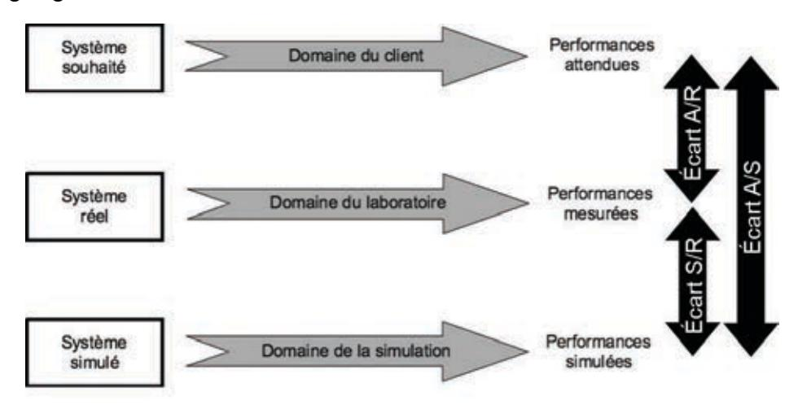

*Figure 1 : représentation des différents écarts*

L'identification et l'analyse de ces écarts peuvent mobiliser des compétences pluridisciplinaires, en particulier celles développées en mathématiques et en sciences physiques chimiques fondamentales et appliquées. Les sciences de l'ingénieur renforcent les liens entre les disciplines et participent à la poursuite d'études dans l'enseignement supérieur. Les sciences de l'ingénieur développent des démarches pour analyser des systèmes complexes pluri technologiques. Les compétences acquises sont ainsi transposables à l'ensemble des domaines scientifiques et technologiques, et permettent d'appréhender des situations inédites.

### **Compétences terminales visées**

L'enseignement des sciences de l'ingénieur a pour objectif de développer les compétences présentées ci-dessous :

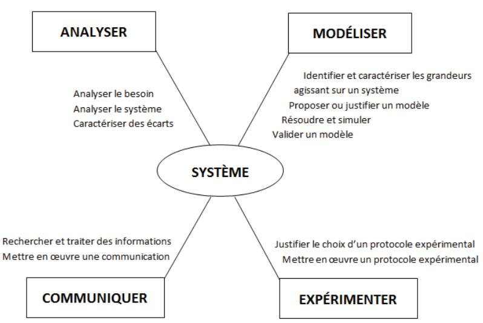

### **II – Programme**

### **A – Analyser**

- A1 Analyser le besoin
- A2 Analyser le système
- A3 Caractériser des écarts

### **B – Modéliser**

- B1 Identifier et caractériser les grandeurs agissant sur un système
- B2 Proposer ou justifier un modèle
- B3 Résoudre et simuler
- B4 Valider un modèle

### **C – Expérimenter**

- C1 Justifier le choix d'un protocole expérimental
- C2 Mettre en œuvre un protocole expérimental

### **D – Communiquer**

- D1 Rechercher et traiter des informations
- D2 Mettre en œuvre une communication

La représentation des systèmes, si elle s'avère nécessaire, se fera avec des outils numériques. L'utilisation des logiciels retenus n'implique pas la maîtrise de leurs fonctionnalités.

Chaque compétence est présentée avec les connaissances et les capacités associées :

- un premier tableau définit les compétences terminales attendues, spécifiant le contrat d'évaluation ;
- un second tableau présente les connaissances et les capacités associées ainsi que le niveau de maîtrise des capacités.

Les capacités associées aux connaissances seront dispensées à partir de tout ou partie d'un système, disponible sous forme matérielle ou virtuelle, instrumenté si nécessaire, défini par un dossier technique.

La maîtrise des capacités est définie selon les trois niveaux suivants.

**Niveau A-** Les concepts sont abordés dans un contexte d'application adapté. Les élèves découvrent la définition et les caractéristiques de chaque concept.

**Niveau B -** Les activités proposées sont simples et variées. Elles mobilisent des outils et des méthodes dans un contexte connu. La démarche est donnée, la résolution est guidée et le choix de la méthode est toujours précisé.

**Niveau C -** Les situations proposées exigent la mise en œuvre de démarches mobilisant des outils et des méthodes dans un contexte nouveau. Les élèves doivent pouvoir justifier ces démarches et interpréter tout ou partie des résultats obtenus par rapport au problème posé.

Lorsque le niveau est précisé en classe de première, cela signifie qu'il est atteint en fin de classe de première et qu'il peut être utilisé en classe de terminale. Lorsque le niveau n'est précisé qu'en classe de terminale, cela signifie qu'il est atteint en fin de classe de terminale mais qu'il peut être introduit en classe de première.

### **Document annexe A3**

### **Programme des sciences de l'ingénieur du BAC S – Cycle terminal de la série scientifique**

### **Extrait du Bulletin Officiel n°9 du 30 septembre 2010 – Sciences de l'Ingénieur**

### **A2 - Analyser le système**

| Compétences attendues                                                                                                                                   |                                                                         |     |   |  |  |  |  |
|---------------------------------------------------------------------------------------------------------------------------------------------------------|-------------------------------------------------------------------------|-----|---|--|--|--|--|
| - identifier les éléments transformés et les flux ;                                                                                                     |                                                                         |     |   |  |  |  |  |
| Connaissances                                                                                                                                           | Capacités                                                               | 1re | T |  |  |  |  |
| Chaîne d'énergie                                                                                                                                        | Réaliser le bilan énergétique du système                                |     | C |  |  |  |  |
| Systèmes logiques<br>évènementiels<br>Langage de description :<br>graphe d'états, logigramme,<br>GRAFCET, algorigramme                                  | Décrire et analyser le comportement d'un<br>système                     | C   |   |  |  |  |  |
| Composants réalisant les<br>fonctions de la chaîne<br>d'énergie                                                                                         | Justifier la solution choisie                                           |     | B |  |  |  |  |
| Modèle OSI                                                                                                                                              | Décrire l'organisation des principaux<br>protocoles                     |     | A |  |  |  |  |
| Système asservi                                                                                                                                         | Différencier un système asservi d'un système<br>non asservi             |     | B |  |  |  |  |
| Architecture d'un réseau<br>(topologie, mode de<br>communication, type de<br>transmission, méthode<br>d'accès au support,<br>techniques de commutation) | Identifier les architectures fonctionnelle et<br>matérielle d'un réseau |     | B |  |  |  |  |

### **A3 - Caractériser les écarts**

### **Compétences attendues**

- comparer les résultats expérimentaux avec les résultats simulés et interpréter les écarts ;
- comparer les résultats simulés avec les critères du cahier des charges et interpréter les écarts.

| Connaissances       | Capacités                                                  | 1re | T |
|---------------------|------------------------------------------------------------|-----|---|
| Analyser les écarts | Rechercher et proposer des causes aux<br>écarts constatés. |     | C |

### **B1 – Identifier et caractériser les grandeurs agissant sur un système**

| Compétences attendues                                                                                                     |                                                                                                                                                                                                                                     |     |   |  |  |  |
|---------------------------------------------------------------------------------------------------------------------------|-------------------------------------------------------------------------------------------------------------------------------------------------------------------------------------------------------------------------------------|-----|---|--|--|--|
|                                                                                                                           | - choisir les grandeurs et les paramètres influents en vue de les modéliser.                                                                                                                                                        |     |   |  |  |  |
| Connaissances                                                                                                             | Capacités                                                                                                                                                                                                                           | 1re | T |  |  |  |
| Caractéristiques des<br>grandeurs physiques<br>(mécaniques, électriques,<br>thermiques, acoustiques,<br>lumineuses, etc.) | Qualifier les grandeurs d'entrée et de sortie<br>d'un système isolé<br>Identifier la nature (grandeur effort, grandeur<br>flux)<br>Décrire les lois d'évolution des grandeurs<br>Utiliser les lois et relations entre les grandeurs |     | C |  |  |  |
| Matériaux                                                                                                                 | Identifier les propriétés des matériaux des<br>composants qui influent sur le système                                                                                                                                               |     | C |  |  |  |
| Flux d'information                                                                                                        | Identifier la nature de l'information et la nature<br>du signal                                                                                                                                                                     |     | C |  |  |  |
| Flux de matière                                                                                                           | Qualifier la nature des matières, quantifier les<br>volumes et les masses                                                                                                                                                           | C   |   |  |  |  |

### **B2 – Proposer ou justifier un modèle**

| Compétences attendues                                                                                                          |                                                                                                                                                                       |     |   |  |  |  |  |
|--------------------------------------------------------------------------------------------------------------------------------|-----------------------------------------------------------------------------------------------------------------------------------------------------------------------|-----|---|--|--|--|--|
|                                                                                                                                | - préciser ou justifier les limites de validité du modèle envisagé.                                                                                                   |     |   |  |  |  |  |
| Connaissances                                                                                                                  | Capacités                                                                                                                                                             | 1re | T |  |  |  |  |
| Chaîne d'énergie                                                                                                               | Associer un modèle aux composants d'une<br>chaîne d'énergie<br>Déterminer les points de fonctionnement du<br>régime permanent d'un actionneur au sein<br>d'un procédé |     | C |  |  |  |  |
| Chaîne d'information                                                                                                           | Associer un modèle aux composants d'une<br>chaîne d'information                                                                                                       |     | C |  |  |  |  |
| Ordre d'un système                                                                                                             | Identifier les paramètres à partir d'une<br>réponse indicielle<br>Associer un modèle de comportement (1er et<br>2nd ordre) à une réponse indicielle                   |     | B |  |  |  |  |
| Systèmes logiques à<br>évènements discrets<br>Langage de description :<br>graphe d'états, logigramme,<br>GRAFCET, algorigramme | Traduire le comportement d'un système                                                                                                                                 |     | C |  |  |  |  |
| Modèle du solide                                                                                                               | Choisir le modèle de solide, déformable ou<br>indéformable selon le point de vue                                                                                      |     | C |  |  |  |  |

### **B3 – Résoudre et simuler**

### **Compétences attendues**

- simuler le fonctionnement de tout ou partie d'un système à l'aide d'un modèle fourni.

| Connaissances                                 | Capacités                                                                                                                                                                                                     | 1re | T |
|-----------------------------------------------|---------------------------------------------------------------------------------------------------------------------------------------------------------------------------------------------------------------|-----|---|
| Principe fondamental de la<br>dynamique (PFD) | Établir de façon analytique les expressions<br>d'efforts (force, couple, pression, etc.) et de<br>flux (vitesse, fréquence de rotation, etc.)<br>Traduire de façon analytique le comportement<br>d'un système |     | C |
| Paramètres d'une simulation                   | Adapter les paramètres de simulation, durée,<br>incrément temporel, choix des grandeurs<br>affichées, échelles, à l'amplitude et la<br>dynamique de grandeurs simulées                                        |     | C |
| Ordre d'un système                            | Interpréter les résultats d'une simulation<br>fréquentielle des systèmes du 1er et du 2nd<br>ordre                                                                                                            |     | B |
| Comportement du solide<br>déformable          | Déterminer les parties les plus sollicitées<br>dans un composant<br>Déterminer les valeurs extrêmes des<br>déformations<br>Déterminer des concentrations de<br>contraintes dans un composant                  |     | C |

### **C2 - Mettre en œuvre un protocole expérimental**

| Compétences attendues                                                    |                                                                                                                              |  |   |  |  |  |
|--------------------------------------------------------------------------|------------------------------------------------------------------------------------------------------------------------------|--|---|--|--|--|
|                                                                          | - traiter les données mesurées en vue d'analyser les écarts.                                                                 |  |   |  |  |  |
| 1re<br>Connaissances<br>Capacités<br>T                                   |                                                                                                                              |  |   |  |  |  |
| Appareils de mesures,<br>règles d'utilisation                            | Mettre en oeuvre un appareil de mesure<br>Paramétrer une chaîne d'acquisition                                                |  | C |  |  |  |
| Paramètres de configuration<br>d'un réseau                               | Paramétrer un protocole de communication                                                                                     |  | C |  |  |  |
| Routines, procédures, etc.<br>Systèmes logiques à<br>évènements discrets | Générer un programme et l'implanter dans le<br>système cible                                                                 |  | C |  |  |  |
| Modèles de comportement                                                  | Analyser les résultats expérimentaux<br>Traiter les résultats expérimentaux, et<br>extraire la ou les grandeurs désirées (s) |  | C |  |  |  |

### Document annexe A4

### Organisation des séquences

| ¥<br>By                                                                                              |                                      |           |     |     |     |     |     |     |     |     |
|------------------------------------------------------------------------------------------------------|--------------------------------------|-----------|-----|-----|-----|-----|-----|-----|-----|-----|
| Fitre de la séquence                                                                                 | 1 <sup>ère</sup> ou T <sup>ale</sup> | Durée (h) | CI1 | CI2 | CI3 | CI4 | CIS | A/R | R/S | A/S |
| Prendre en compte la contrainte environnementale dans l'analyse du besoin d'un système               | _                                    | 12        | ×   |     |     |     |     | ×   |     |     |
| Identifier et caractériser les énergies mise en jeu<br>au niveau des différents systèmes             | ~                                    | 12        | ×   | ×   |     |     |     | ×   |     |     |
| Informer des conditions climatiques                                                                  | _                                    | 18        |     |     | ×   |     | ×   |     |     | ×   |
| Optimiser les efforts pour améliorer les performances énergétiques d'un système                      | _                                    | 15        | ×   |     | ×   |     |     | ×   |     |     |
| Comment améliorer le confort lors d'un déplacement                                                   | _                                    | 13        |     | ×   |     |     | ×   | ×   | ×   |     |
| Assister à la manutention, vérifier des conformités                                                  | _                                    | 14        |     |     | ×   |     | ×   |     | ×   |     |
| Recycler des matériaux pour la conception d'isolants                                                 | _                                    | 18        |     | ×   |     |     | ×   |     | ×   |     |
| Estimer les performances de déformation d'une<br>structure utilisée dans le transport                | ~                                    | 18        | ×   |     |     | ×   |     |     |     | ×   |
| Partager des données sur un réseau. Système<br>communiquant.                                         | _                                    | 12        |     | ×   |     |     | ×   |     | ×   |     |
| Identifier les composants réalisant une transmission<br>de puissance                                 | _                                    | 18        |     | X   |     |     | ×   |     | X   |     |
| Rendre une structure plus économe en énergie                                                         | _                                    | 18        |     |     | ×   | ×   |     | ×   | ×   |     |
| Récupérer et traiter l'eau en milieu urbain                                                          | _                                    | 12        | ×   |     | ×   |     |     | ×   |     | ×   |
| Optimiser les efforts pour améliorer les performances énergétiques d'un système                      | _                                    | 18        |     | ×   |     |     | ×   |     | ×   |     |
| Instrumenter un équipement sportif pour recueillir des informations de performances de l'utilisateur | _                                    | 18        | ×   |     | ×   |     |     | ×   |     |     |
| Analyser et redimensionner une chaîne de<br>transmission de puissance                                | _                                    | 18        |     | ×   |     |     | ×   |     | ×   | ×   |
| Utiliser un système de surveillance automatisé pour détecter des dysfonctionnements                  | _                                    | 18        | ×   |     | ×   |     |     | ×   |     |     |
| Diminuer la quantité de matériaux nécessaires pour<br>réaliser une passerelle                        | _                                    | 18        |     | ×   |     |     | ×   |     | ×   |     |
| Contrôler la température et l'humidité d'une structure                                               | <b>—</b>                             | 24        |     |     |     |     |     |     | ×   | ×   |
| Analyser et redimensionner une chaîne de transmission d<br>e puissance                               | <b>—</b>                             | 18        |     | ×   |     |     | ×   | ×   | ×   |     |
| Piloter un équipement pour personne à mobilité réduite                                               | <b>—</b>                             | 18        | ×   |     | ×   |     |     | ×   | ×   |     |
| Estimer les performances de déformation d'un ouvrage                                                 | <b>—</b>                             | 18        |     | ×   |     |     | ×   |     | ×   | ×   |
| Équiper une personne d'un système permettant de diminuer son handicap                                | <b>—</b>                             | 18        | ×   |     | ×   |     |     | ×   |     | ×   |

Extrait du document «Ressources pour le cycle terminal» :

Analyse des écarts

Centres d'intérêt

- CI1 analyser un système fonctionnellement et structurellement;
- CI2 expérimenter et mesurer sur un système réel pour évaluer ses performances;
- CI3 analyser des constituants d'un système réel d'un point de vue structurel et comportemental;
- CI4 concevoir et utiliser un modèle relatif à un système en vue d'évaluer les performances de la chaine d'information; CI5 - concevoir et utiliser un modèle relatif à un système en vue d'évaluer les performances de la chaine d'énergie. I

**~** Réel

### **Document annexe A5 Fiche de séquence – exemple de la séquence n**°**5**

| SÉQU                                                                | ENCE N°5                         | Automne      | Noël           |                                            | Hiver              | · Pı       |          |         |  |  |  |  |  |  |
|---------------------------------------------------------------------|----------------------------------|--------------|----------------|--------------------------------------------|--------------------|------------|----------|---------|--|--|--|--|--|--|
| S SI I                                                              | Première                         |              |                |                                            |                    |            |          |         |  |  |  |  |  |  |
|                                                                     | Problématique                    |              | Commenta       | néliorer le confort lors d'un déplacement? |                    |            |          |         |  |  |  |  |  |  |
|                                                                     | Thème(s) sociétal(au             | x)           |                | Mobilité                                   |                    |            |          |         |  |  |  |  |  |  |
|                                                                     | Centres d'intérêt                |              | CI2 et CI5     |                                            |                    |            |          |         |  |  |  |  |  |  |
|                                                                     | Répartition Heures Grpe*         | 2 fc         | ois 2 heures   |                                            | Ma                 | Ma         |          | \\Va    |  |  |  |  |  |  |
|                                                                     | Répartition Heures CE*           | 3 (2         | 2+1) heures    | Lu                                         | Ма                 | Me         | Je       | Ve      |  |  |  |  |  |  |
|                                                                     | TPE démarrés                     |              | oui**          |                                            | 2h 0F              |            | 2H       |         |  |  |  |  |  |  |
|                                                                     | Nb de semaines                   | 2,5          | semaines       |                                            | 3h CE              |            | Grpe     |         |  |  |  |  |  |  |
| <u> </u>                                                            | Total horaire élève              | 1            | 3 heures       |                                            |                    |            |          |         |  |  |  |  |  |  |
| le ue                                                               | Horaire élève CE*                |              | 9 h            |                                            |                    |            |          | 2h CE** |  |  |  |  |  |  |
| giq                                                                 | Horaire élève Grpe*              |              | 4 h            |                                            |                    |            |          | (TPE)   |  |  |  |  |  |  |
| g <u>:</u>                                                          |                                  | ompétenc     | ns la séquence |                                            |                    |            |          |         |  |  |  |  |  |  |
| de J                                                                | A2 Analyser le système           |              |                | B3 Résoudre et Simuler                     |                    |            |          |         |  |  |  |  |  |  |
| Fiche de séquence pédagogique<br>emière S – Sciences de l'ingénieur | A3 Caractériser les écarts       |              |                | B4 Valider un modèle                       |                    |            |          |         |  |  |  |  |  |  |
| en                                                                  | B1 Identifier et caractériser le | s grandeur   | s agissant sur | C2 Mettre en œuvre un protocole            |                    |            |          |         |  |  |  |  |  |  |
| séqu<br>- Sc                                                        | un système                       |              |                | expérimental                               |                    |            |          |         |  |  |  |  |  |  |
| <u>8</u> 0                                                          | B2 Proposer ou justifier un m    | odèle        |                |                                            |                    |            |          |         |  |  |  |  |  |  |
| le c<br>ère                                                         | С                                | onnaissand   | ces abordées d | ans la sé                                  | ans la séquence    |            |          |         |  |  |  |  |  |  |
| Fiche de s<br>Première S                                            | Chaîne d'énergie                 |              |                | Modèle                                     | s de con           | nporteme   | nt       |         |  |  |  |  |  |  |
| n 9                                                                 | Composants réalisant les for     | ctions de la | a chaîne       | Analyse                                    | Analyse des écarts |            |          |         |  |  |  |  |  |  |
|                                                                     | d'énergie                        |              |                | Paramè                                     | etres d'un         | ie simula  | tion     |         |  |  |  |  |  |  |
|                                                                     | Caractéristiques des grandeu     | ırs physiqu  | es             |                                            | : <b></b>          |            | 131      |         |  |  |  |  |  |  |
|                                                                     | (mécaniques, électriques, the    | ermiques, a  | coustiques,    | Grande                                     | urs influe         | entes d'ui | n modele | •       |  |  |  |  |  |  |
|                                                                     | lumineuses, etc.)                |              | Modèle         | de conn                                    | aissance           |            |          |         |  |  |  |  |  |  |
|                                                                     | Énergie et puissances            |              |                |                                            |                    |            |          |         |  |  |  |  |  |  |
|                                                                     | Principe fondamental de la d     | ynamique (   |                |                                            |                    |            |          |         |  |  |  |  |  |  |
|                                                                     | Principes fondamentaux d'ét      |              |                |                                            |                    |            |          |         |  |  |  |  |  |  |
|                                                                     | Écarts :                         | Att          | endu / Mesuré  | et                                         | Simul              | é / Mesu   | ré       |         |  |  |  |  |  |  |

### Notes :

- \* : CE = Classe Entière / Grpe = Groupe
- \*\* : durant cette séquence, pour des modalités d'organisation pédagogique dans le cadre d'une globalisation, les deux heures du vendredi sont consacrées aux TPE.

### **Document annexe A6**

# **Description des séances de la séquence – exemple de la séquence n**°**5**

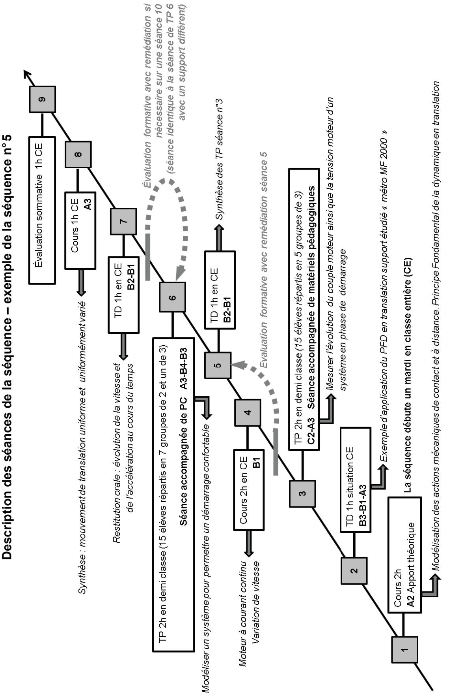

| Modèle CMEN-D                  | OOC v2 ©NEOPTEC                                         |                                                                                                                                                                                                                                                                                                                                                                                      |
|--------------------------------|---------------------------------------------------------|--------------------------------------------------------------------------------------------------------------------------------------------------------------------------------------------------------------------------------------------------------------------------------------------------------------------------------------------------------------------------------------|
| Non                            | n de famille :                                          |                                                                                                                                                                                                                                                                                                                                                                                      |
|                                | a lieu, du nom d'usage)                                 |                                                                                                                                                                                                                                                                                                                                                                                      |
| ( /- /-                        | ,                                                       |                                                                                                                                                                                                                                                                                                                                                                                      |
|                                | Prénom(s) :                                             |                                                                                                                                                                                                                                                                                                                                                                                      |
| 17:9 <b>4</b>                  | Mumára                                                  |                                                                                                                                                                                                                                                                                                                                                                                      |
|                                | Numéro                                                  | $  \   \   \   \   \   \   \   \   \   \$                                                                                                                                                                                                                                                                                                                                            |
| LE1244 1.                      | Inscription:                                            |                                                                                                                                                                                                                                                                                                                                                                                      |
|                                | (Le                                                     | e numéro est celui qui figure sur la convocation ou la feuille d'émargement)                                                                                                                                                                                                                                                                                                         |
| (Remplir cette partie Concours |                                                         | Section/Spécialité/Série :                                                                                                                                                                                                                                                                                                                                                           |
|                                | Epreuve:                                                | Session :                                                                                                                                                                                                                                                                                                                                                                            |
| CONSIGNES                      | <ul><li>Ne pas signer i</li><li>Numéroter cha</li></ul> | eusement, sur CHAQUE feuille officielle, la zone d'identification en MAJUSCULES.<br>· la composition et ne pas y apporter de signe distinctif pouvant indiquer sa provenance.<br>aque PAGE (cadre en bas à droite de la page) et placer les feuilles dans le bon sens et dans l'ordre.<br>un stylo à encre foncée (bleue ou noire) et ne pas utiliser de stylo plume à encre claire. |

EDE STI 1

### DR 1 à DR 5

### NE RIEN ECRIRE DANS CE CADRE

### DOCUMENT RÉPONSE DR1

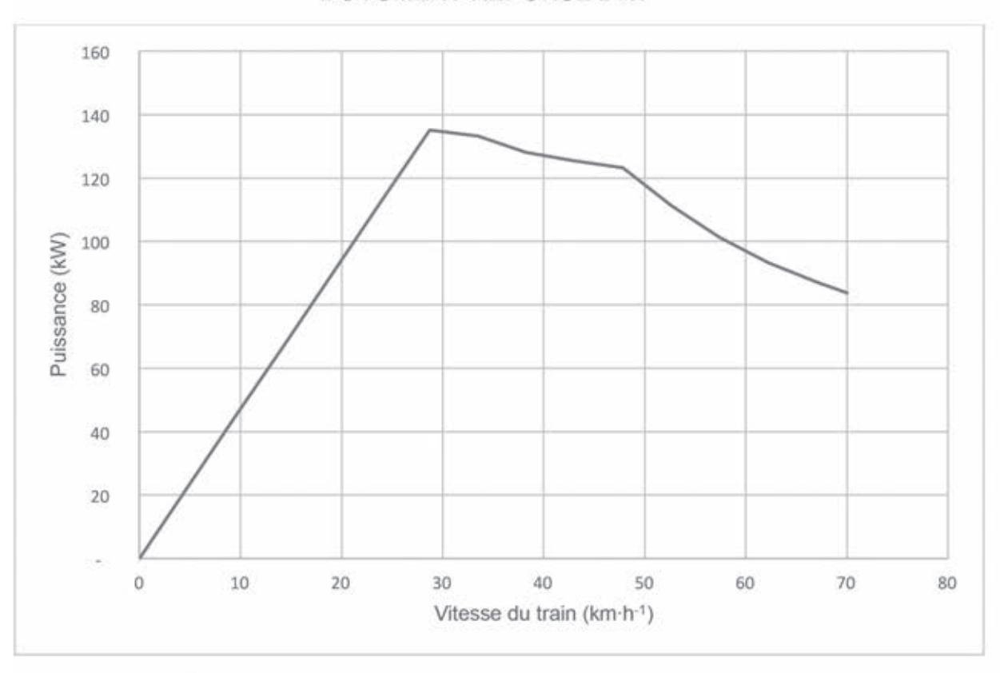

Caractéristique de traction d'un moteur 4.LX A.1640

### **DOCUMENT RÉPONSE DR2**

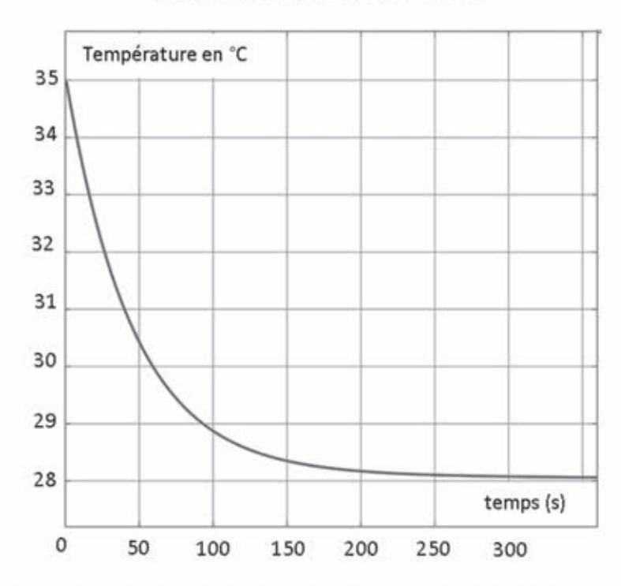

Température intérieure de la voiture en fonction du temps

### **DOCUMENT RÉPONSE DR3**

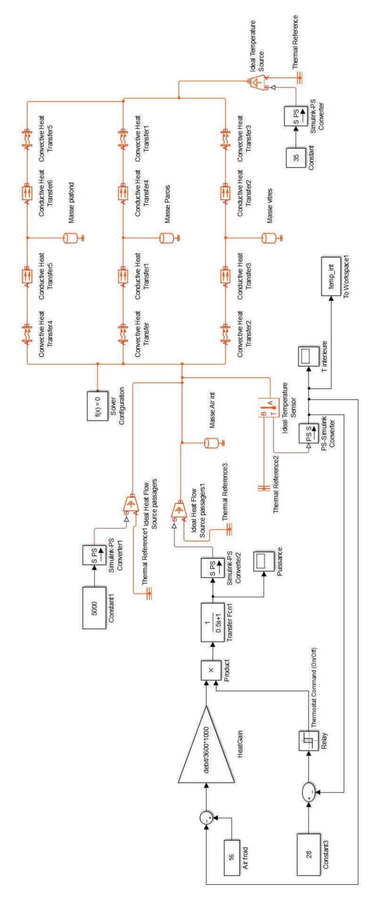

**Schéma du modèle multi-physique des échanges thermiques entre l'intérieur et l'extérieur d'une voiture en période estivale** 

### **DOCUMENT RÉPONSE DR4**

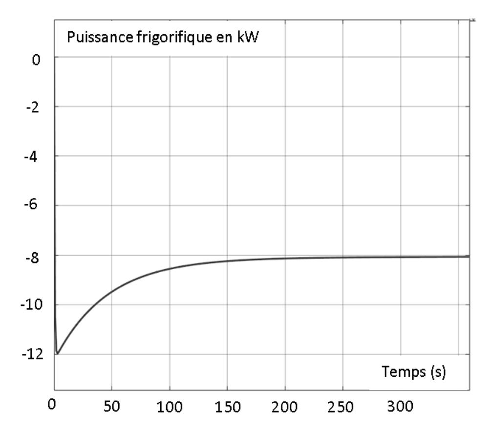

**Puissance frigorifique rejetée par la ventilation en fonction du temps** 

### **DOCUMENT RÉPONSE DR5**

**Extrait à compléter du pseudo-code traduisant le diagramme d'états-transitions (page 23)**

| 2 :<br>SI<br>ALORS |  |
|--------------------|--|
|                    |  |
|                    |  |
| FIN_SI             |  |

| Modèle CMEN- | DOC v2 ©NEOPTEC                                                                                                                   | $\overline{}$                          |                                     |                               |                                 |                                      |                               |                               |                            | $\overline{}$                       | _                       | _                       |                            | _             | _        |     | $\overline{}$ | $\overline{}$ | $\overline{}$ | $\overline{}$ | $\overline{}$ | $\overline{}$ |
|--------------|-----------------------------------------------------------------------------------------------------------------------------------|----------------------------------------|-------------------------------------|-------------------------------|---------------------------------|--------------------------------------|-------------------------------|-------------------------------|----------------------------|-------------------------------------|-------------------------|-------------------------|----------------------------|---------------|----------|-----|---------------|---------------|---------------|---------------|---------------|---------------|
|              | m de famille :<br>a lieu, du nom d'usage)                                                                                         | Ш                                      |                                     |                               |                                 |                                      |                               |                               |                            | $\perp$                             |                         |                         |                            |               |          |     |               |               |               |               | $\Box$        |               |
|              | Prénom(s) :                                                                                                                       |                                        |                                     |                               |                                 |                                      |                               |                               |                            |                                     |                         |                         |                            |               |          |     |               |               |               |               |               |               |
|              | Numéro<br>Inscription :                                                                                                           |                                        |                                     |                               |                                 |                                      |                               |                               |                            | Né                                  | (e) I                   | e :                     |                            |               | /        |     |               | /             |               |               |               |               |
|              | (Le                                                                                                                               | e numéro es                            | t celui qui                         | figure s                      | ur la conv                      | ocation o                            | ı la feuil                    | le d'ém                       | argeme                     | nt)                                 |                         |                         |                            |               |          |     |               |               |               |               |               |               |
|              | e à l'aide de la notice)<br>s / Examen :                                                                                          |                                        |                                     |                               |                                 | . 8                                  | Sectio                        | n/Sp                          | écia                       | lité/Se                             | érie                    | :                       |                            |               |          |     |               |               |               |               |               |               |
|              | Epreuve:                                                                                                                          |                                        |                                     |                               |                                 |                                      | Matiè                         | re:                           |                            |                                     |                         |                         |                            | Se            | ssior    | ı : |               |               |               |               |               |               |
| CONSIGNES    | <ul> <li>Remplir soigne</li> <li>Ne pas signer</li> <li>Numéroter cha</li> <li>Rédiger avec u</li> <li>N'effectuer auc</li> </ul> | la compos<br>aque PAGE<br>un stylo à e | ition et r<br>∃ (cadre<br>encre foi | ne pas j<br>en bas<br>ncée (b | y apport<br>à droite<br>leue ou | er de sig<br>e de la pa<br>noire) et | ne disti<br>age) et<br>ne pas | inctif p<br>placer<br>utilise | ouvan<br>les fe<br>er de s | t indique<br>uilles da<br>tylo plui | er sa<br>ans le<br>me à | prove<br>bon s<br>encre | enance<br>sens e<br>claire | et dans<br>e. | s l'ordr | e.  |               |               |               |               |               |               |

EDE STI 1

### DR 6 et DR 7

### NE RIEN ECRIRE DANS CE CADRE

### ouverture portes / Faire\_clignoter(Nstation) Portes fermées Sens = 0Sens = Fermeture portes / Eteindre\_voyant(Nstation) sortie station Z Z fermeture des portes Attente **DOCUMENT RÉPONSE DR6** ouverture portes [Sens==1] / Nstation=N Nex\_Station=N-1 Faire\_clignoter(Nstation) do / Allumer\_tous\_les\_voyants() Initialisation ouverture des sortie station / Eteindre\_voyant(Nstation) Faire\_clignoter(Next\_Station) [else] / Faire\_clignoter(Next\_Station) portes Attente [Sens==0] / Nstation=1 Nex\_Station=2 Faire\_clignoter(Nstation) Inter stations entrée station'

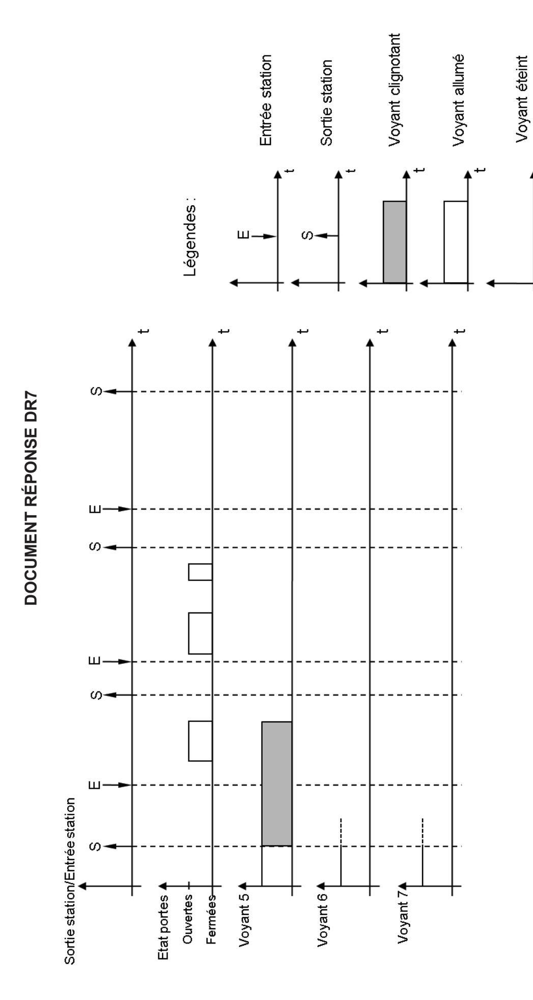

| Modèle CMEN-I | OOC v2 ©NEOPTEC                                                                                                                   |                                        |                                           | _                               | _                              | _                          |                              |                              |                            |                                           |                             |                          |               |           | _  |      |      | _ | _ |
|---------------|-----------------------------------------------------------------------------------------------------------------------------------|----------------------------------------|-------------------------------------------|---------------------------------|--------------------------------|----------------------------|------------------------------|------------------------------|----------------------------|-------------------------------------------|-----------------------------|--------------------------|---------------|-----------|----|------|------|---|---|
|               | n de famille :<br>a lieu, du nom d'usage)                                                                                         |                                        |                                           |                                 |                                |                            |                              |                              |                            |                                           |                             |                          |               |           |    |      |      |   |   |
| <b>■</b> %■   | Prénom(s) :                                                                                                                       |                                        |                                           |                                 |                                |                            |                              |                              |                            |                                           |                             |                          |               |           |    |      |      |   |   |
|               | Numéro<br>Inscription :                                                                                                           |                                        |                                           |                                 |                                |                            |                              |                              |                            | Né(e                                      | ) le :                      |                          |               | /[        |    |      |      |   |   |
|               | (Le                                                                                                                               | e numéro est                           | t celui qui fig                           | ure sur la                      | convoca                        | tion ou                    | la feuil                     | le d'ém                      | argeme                     | ent)                                      |                             |                          |               |           |    |      |      |   |   |
|               | à l'aide de la notice)  / Examen :                                                                                                |                                        |                                           |                                 |                                | s                          | ectio                        | n/Sp                         | oécia                      | lité/Séri                                 | e:                          |                          |               |           |    | <br> | <br> |   |   |
|               | Epreuve:                                                                                                                          |                                        |                                           |                                 |                                | N                          | /latiè                       | re:                          |                            |                                           |                             |                          | Se            | ssion     | :  | <br> | <br> |   |   |
| CONSIGNES     | <ul> <li>Remplir soigne</li> <li>Ne pas signer</li> <li>Numéroter cha</li> <li>Rédiger avec u</li> <li>N'effectuer auc</li> </ul> | la compos<br>aque PAGE<br>un stylo à e | ition et ne<br>E (cadre en<br>encre fonce | pas y ap<br>bas à d<br>e (bleue | porter d<br>roite de<br>ou noi | de sigr<br>la pa<br>re) et | ne disti<br>ge) et<br>ne pas | inctif p<br>placei<br>utilis | ouvar<br>les fe<br>er de s | t indiquer s<br>uilles dans<br>tylo plume | sa prov<br>le bon<br>à encr | enanc<br>sens<br>e clair | et dans<br>e. | s l'ordre | 9. |      | ·    |   | · |

EDE STI 1

### DR 8 et DR 9

### **NE RIEN ECRIRE DANS CE CADRE**

### **DOCUMENT RÉPONSE DR8**

**Fiche séquence de la séquence 18 (document sur 2 pages)** 

| sdı       |               |                                 |                                                                        |                  | \<br>\                   |                        |                |                |                     | 2h CE              |                        |                                       | r les limites de<br>tout ou partie d'un<br>les données                                                                                                                                                                                                                                                                                                |
|-----------|---------------|---------------------------------|------------------------------------------------------------------------|------------------|--------------------------|------------------------|----------------|----------------|---------------------|--------------------|------------------------|---------------------------------------|-------------------------------------------------------------------------------------------------------------------------------------------------------------------------------------------------------------------------------------------------------------------------------------------------------------------------------------------------------|
| Printemps |               |                                 |                                                                        |                  | 9                        |                        | 4h Grad        | <u> </u>       |                     |                    |                        |                                       | iser ou justifie<br>onnement de<br>nental : traite                                                                                                                                                                                                                                                                                                    |
| Hiver     |               | Comment réguler une température | Confort                                                                |                  | Μe                       |                        |                |                |                     |                    |                        | 90                                    | un modèle : préc<br>sagé<br>: simuler le foncti<br>odèle fourni<br>protocole expérir<br>iter les écarts                                                                                                                                                                                                                                               |
|           |               | Commentrégule                   | COL                                                                    |                  | e N                      |                        |                |                |                     |                    |                        | Compétences abordées dans la séquence | B2 proposer ou justifier un modèle : préciser ou justifier les limites de validité du modèle envisagé B3 résoudre et simuler : simuler le fonctionnement de tout ou partie d'un système à l'aide d'un modèle fourni C2 mettre en œuvre un protocole expérimental : traiter les données mesurées en vue de traiter les écarts                          |
| Noël      |               |                                 |                                                                        |                  | 3                        |                        |                |                |                     |                    | 2h CE                  | nces abord                            | δ.                                                                                                                                                                                                                                                                                                                                                    |
| Automne   |               |                                 |                                                                        |                  | 4 heures                 | (2+2) heures           | non            | 3 semaines     | 24 heures           | 12 h               | 12 h                   | Compéter                              | éléments transformés et les les résultats simulés avec cérimentaux avec ceux urs : choisir les grandeurs les modéliser                                                                                                                                                                                                                                |
| Auf       |               |                                 | IX)                                                                    |                  | 4                        | 4 (2                   |                | 3 6            | 2                   |                    |                        |                                       | ntifier les élé<br>omparer les<br>ultats expéri<br>s grandeurs                                                                                                                                                                                                                                                                                        |
| SÉQUENCE  | SSI Terminale | Problématique                   | Thème(s) sociétal(aux)                                                 | Centre d'intérêt | Répartition Heures Grpe⁴ | Répartition Heures CE* | Projet démarré | Nb de semaines | Total horaire élève | Horaire élève CE * | Horaire élève groupe * |                                       | A2 analyser le système : identifier les éléments transformés et le flux<br>A3 caractériser les écarts : comparer les résultats simulés avec<br>les critères du cdcf et les résultats expérimentaux avec ceux<br>simulés<br>B1 identifier et caractériser les grandeurs : choisir les grandeurs<br>et les paramètres influents en vue de les modéliser |
| SÉC       | SSIT          |                                 | Fiche de séquence pédagogique<br>Terminale S – Sciences de l'ingénieur |                  |                          |                        |                |                |                     |                    |                        |                                       |                                                                                                                                                                                                                                                                                                                                                       |

\* : CE = Classe Entière / Grpe = Groupe

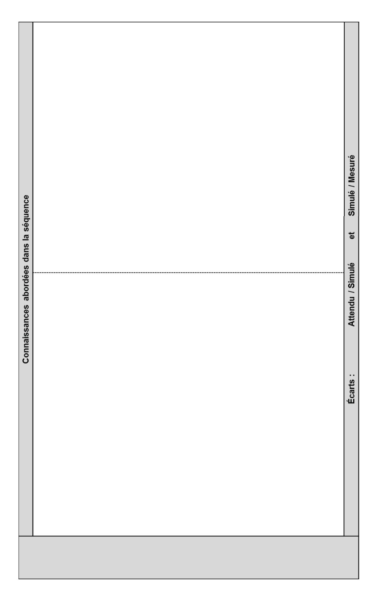

### **DOCUMENT RÉPONSE DR9**

## Description des séances de la séquence - séquence 18

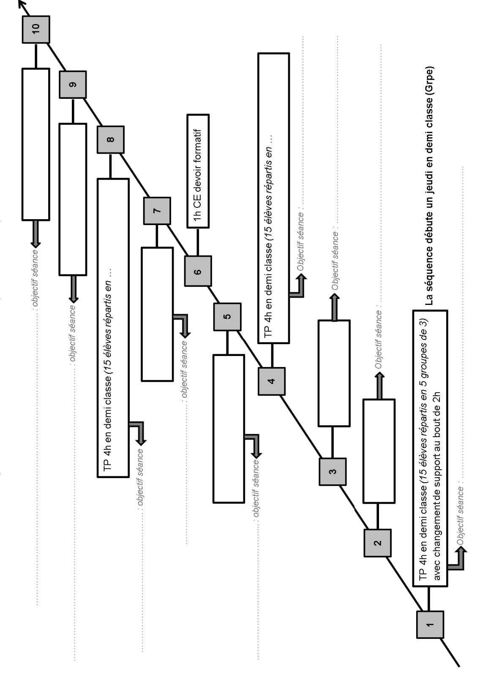