**EDE ENE 2** 

#### **SESSION 2017**

# CAPET CONCOURS EXTERNE TROISIÈME CONCOURS ET CAFEP CORRESPONDANTS

Section: SCIENCES INDUSTRIELLES DE L'INGÉNIEUR

**Option: INGÉNIERIE ÉLECTRIQUE** 

# ETUDE D'UN SYSTÈME, D'UN PROCÉDÉ OU D'UNE ORGANISATION

Durée: 4 heures

Calculatrice électronique de poche - y compris calculatrice programmable, alphanumérique ou à écran graphique — à fonctionnement autonome, non imprimante, autorisée conformément à la circulaire n° 99-186 du 16 novembre 1999.

L'usage de tout ouvrage de référence, de tout dictionnaire et de tout autre matériel électronique est rigoureusement interdit.

Dans le cas où un(e) candidat(e) repère ce qui lui semble être une erreur d'énoncé, il (elle) le signale très lisiblement sur sa copie, propose la correction et poursuit l'épreuve en conséquence.

De même, si cela vous conduit à formuler une ou plusieurs hypothèses, il vous est demandé de la (ou les) mentionner explicitement.

NB: La copie que vous rendrez ne devra, conformément au principe d'anonymat, comporter aucun signe distinctif, tel que nom, signature, origine, etc. Si le travail qui vous est demandé comporte notamment la rédaction d'un projet ou d'une note, vous devrez impérativement vous abstenir de signer ou de l'identifier.

#### **INFORMATION AUX CANDIDATS**

Vous trouverez ci-après les codes nécessaires vous permettant de compléter les rubriques figurant en en-tête de votre copie

Ces codes doivent être reportés sur chacune des copies que vous remettrez.

► Concours externe du CAPET de l'enseignement public :

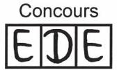

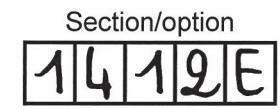

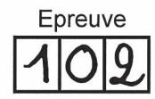

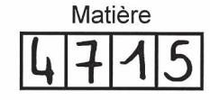

► Concours externe du CAFEP/CAPET de l'enseignement privé :

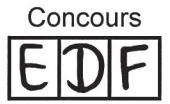

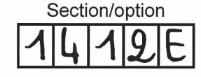

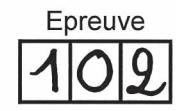

► Troisième concours du CAPET de l'enseignement public :

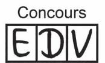

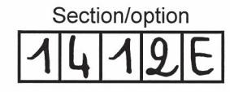

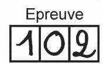

# **Option énergie**

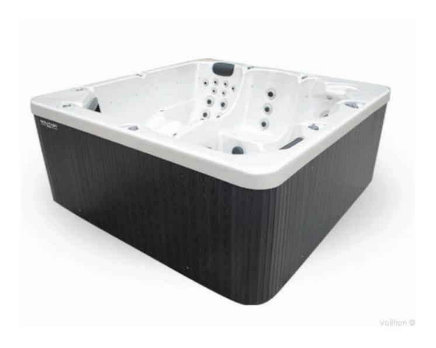

Aucun document autorisé

## **Ce dossier comporte 3 parties :**

- présentation et travail demandé pages 1 à 16 ;
- documents techniques pages à 17 à 26 ;
- documents réponses pages 28 à 30.

#### **Une lecture préalable et complète du sujet est indispensable.**

Le candidat doit répondre aux différentes questions du sujet sur les documents réponses quand cela est demandé, et sur feuilles de copie quand cela n'est pas précisé.

Il lui est rappelé qu'il doit utiliser les notations propres au sujet, présenter clairement les calculs et dégager ou encadrer tous les résultats.

Il sera tenu compte de la présentation de la copie, de la qualité de la rédaction (orthographe et syntaxe), en particulier pour les réponses aux questions ne nécessitant pas de calcul.

Si le sujet (les questions ou les annexes) conduit à formuler une ou plusieurs hypothèses, il est demandé au candidat de la (ou les) mentionner explicitement sur la copie.

#### **Ce sujet comporte 4 parties :**

PARTIE A - étude et réalisation de l'algorithme du programmateur du spa ;

PARTIE B - installation électrique du spa ; bilan de puissance et abonnement ;

PARTIE C - réalisation d'un modèle ; détermination de l'énergie consommée annuellement ;

PARTIE D - choix d'un dispositif plus économique ; temps de retour sur investissement.

#### 1. Présentation générale

### 1.1.Utilité du spa

La pratique du spa (bain à remous) est reconnue pour apporter de nombreux bienfaits.

L'action des multiples buses de massage d'eau chaude décontracte chacun des muscles, favorise la circulation du sang et l'élimination des toxines de l'organisme.

Les effets conjugués de la chaleur, de l'apesanteur et du massage sont les trois ingrédients apportant une sensation de détente et de bien-être.

L'eau chaude fait monter la température du corps et dilate les vaisseaux, améliorant ainsi la circulation sanguine.

La pression exercée sur les muscles et sur les articulations se relâche.

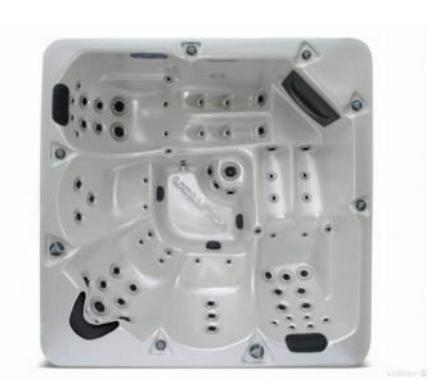

L'hydro massage des articulations et des muscles procuré par les jets accélère la récupération après l'effort.

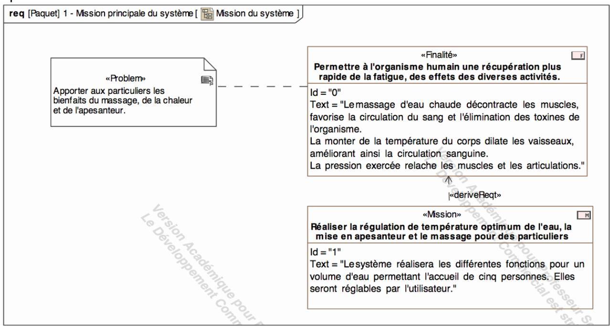

L'étude porte sur le spa « Sydney prémium » de la marque VOLITION SPAS®. Les caractéristiques techniques de tous les modèles de la marque sont fournies sur le document technique DT1.

#### 1.2.Fonctionnement du spa « Sydney Prémium »

À la mise sous tension, l'horloge du spa est initialisée à 00 h 00. Un premier cycle de 12 h commence donc.

#### Le spa possède :

- R 2 pompes d'hydro massage qui peuvent être activées indépendamment l'une de l'autre et permettent d'envoyer l'eau chaude dans les différents jets ;
- R 1 pompe de circulation qui fait circuler l'eau dans un filtre afin de la nettoyer. L'utilisateur a la possibilité de régler la période de filtration du spa (2 h toutes les 12 h, 4 h toutes les 12 h, 6 h toutes les 12 h, 8 h toutes les 12 h ou filtration continue) ;
- R 1 réchauffeur qui permet de chauffer l'eau.

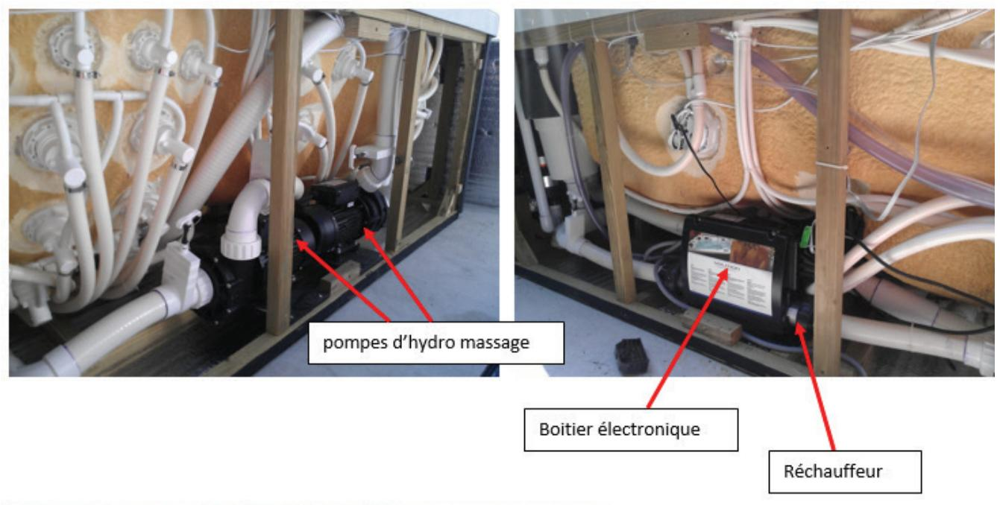

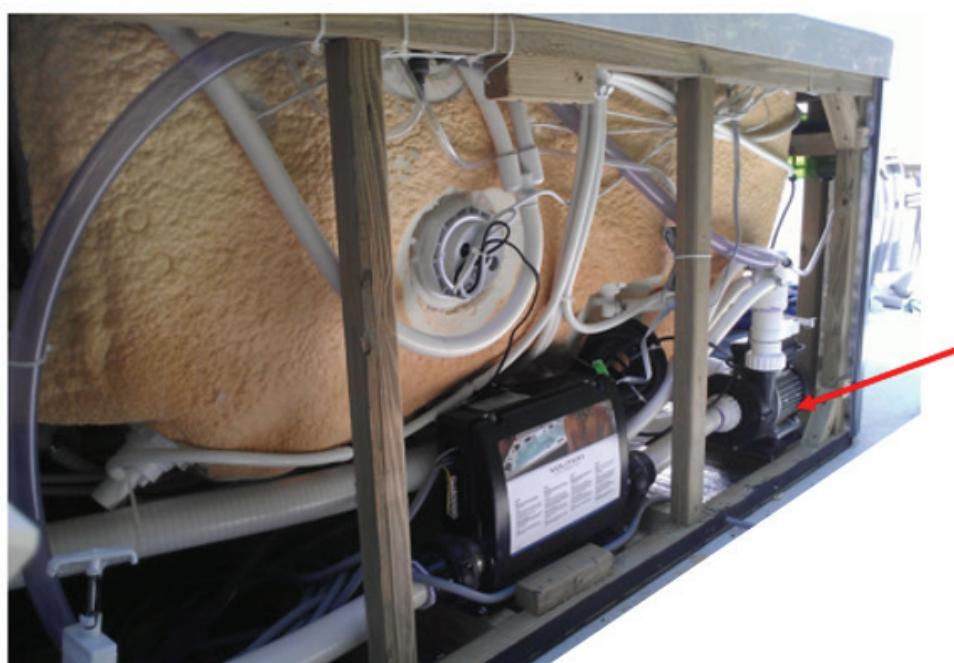

### L'utilisateur a la possibilité de régler :

- R la température de consigne de l'eau du spa. La température maximum réglable est 36°C ;
- R la période de filtration décrite ci-dessus ;
- R l'activation et la désactivation des 2 pompes d'hydro massage ;
- R le mode de fonctionnement du spa décrit ci-dessous.

#### Le spa peut fonctionner suivant 3 modes :

R mode « hors gel » ;

dans ce mode de fonctionnement, la température de l'eau du spa est maintenue audessus de 10 °C de manière à éviter le gel de l'eau durant la période hivernale lorsque le spa n'est pas utilisé ;

#### R mode « standard » ;

ce mode de fonctionnement permet de maintenir en permanence la température de consigne désirée. Si la température de l'eau du spa est inférieure à la consigne de plus de 0,5 °C, l'eau est chauffée ;

### R mode « économique » ;

ce mode de fonctionnement, plus économique que le mode standard, permet de chauffer l'eau du spa uniquement pendant les périodes de filtration. Si la température de l'eau du spa est inférieure à la consigne de plus de 0,5 °C et que la filtration est activée, l'eau est chauffée.

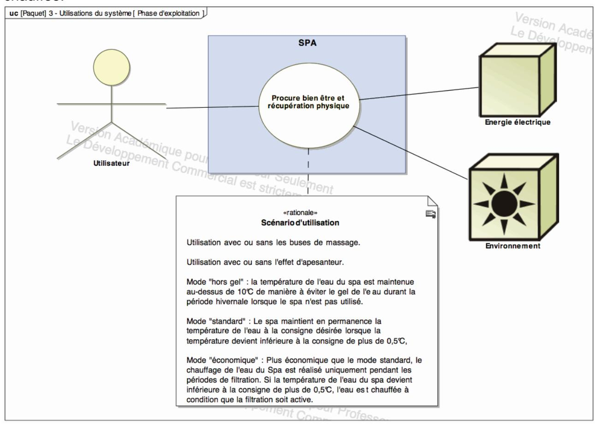

#### 2. Problématique

Comment réduire l'énergie électrique consommée par un spa ? La solution retenue est-elle économiquement viable ?

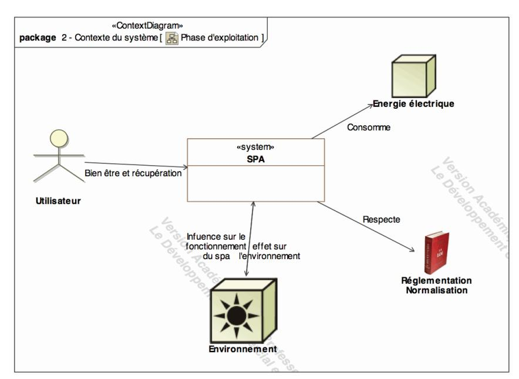

# **PARTIE A : Étude et réalisation de l'algorithme du programmateur du spa**

Objectifs : rédiger l'algorithme de gestion du spa en mode « éco ».

Cette partie est consacrée à l'étude de l'algorithme du programmateur du spa pour la gestion de la température lorsqu'il fonctionnement en « mode éco ». L'algorithme attendu inclura la boucle permettant de rester en « mode éco ». Les diagrammes SysML, document technique DT2, apporteront une approche complémentaire.

**Question A1** : indiquer le paramètre utilisé dans la gestion de la température en « mode éco » ;

**Question A2** : définir une variable pour sélectionner le mode de fonctionnement en indiquant les valeurs qu'elle peut prendre. Puis nommer les variables nécessaires pour gérer la température en « mode éco » en précisant la grandeur physique à laquelle elle correspond ;

**Question A3** : décrire le fonctionnement du système de gestion du mode de chauffage pour le « mode éco » ;

**Question A4** : écrire l'algorithme avec un vocabulaire en français pour uniquement la gestion de la température dans le « mode éco » ;

**Question A5** : en utilisant une structure de boucle pour gérer la sélection du « mode éco », compléter l'algorithme avec un vocabulaire en français pour la gestion de la température.

# **PARTIE B : installation électrique et bilan de puissance**

Objectifs : choisir le matériel de commande et réaliser le schéma électrique de puissance du spa.

Définir les besoins en abonnement pour l'installation électrique du spa.

**Partie B1** : choisir le matériel de commande et réaliser le schéma électrique de puissance du spa.

Les pompes d'hydro massage monophasées 1 et 2 sont alimentées respectivement par les phases 2 et 3, leur facteur de puissance est de 0,86. Elles fonctionnent le plus souvent simultanément.

Le réchauffeur monophasé est alimenté par la phase 1.

La pompe de circulation monophasée est utilisée pour la filtration et le réchauffeur. Son facteur de puissance est de 0,8. Elle est alimentée par la phase 1.

**Question B1.1 :** retrouver dans la documentation du spa, à l'aide du document DT1, les puissances du réchauffeur, des pompes d'hydro massage et de la pompe de circulation.

**Question B1.2** : déterminer le courant consommé par chaque récepteur. Compléter le document réponse DR2.

L'installation sera alimentée par un câble venant du tableau de distribution. Il est protégé dans celui-ci. La protection des personnes est assurée dans l'armoire du spa par un interrupteur différentiel. Le matériel de commande et de protection sera choisi dans la gamme TESYS U. La commande sera en 24 V alternatif. Le symbole d'un système de commande intégral est le suivant :

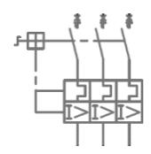

**Question B1.3** : choisir et justifier, à l'aide du document DT3, l'appareil de commande et de protection intégral :

- du réchauffeur ;
- des pompes d'hydro massage ;
- de la pompe de circulation.

Préciser et justifier la référence de chaque module de contrôle.

**Question B1.4** : compléter le schéma du document réponse DR1.

**Partie B2 :** définir les besoins en abonnement pour l'installation électrique du spa.

Le propriétaire du spa a un abonnement de 18 kVA en triphasé avec heures creuses. Ces dernières factures font apparaître des consommations régulières de 16 kW au maximum sans déséquilibre notable.

- **Question B2.1** : lors de l'utilisation des pompes d'hydro massage et quel que soit la température de l'eau, le réchauffeur est arrêté. Déterminer les différents cas de fonctionnement :
  - en mode « standard » ;
  - en mode « éco ».
- **Question B2.2** : faire un bilan de puissance des différents cas en complétant le document réponse DR2. Déterminer la consommation dans chaque cas. En déduire dans quel cas de fonctionnement le spa absorbe le plus de courant et consomme le plus de puissance.
- **Question B2.3** : en tenant compte du déséquilibre lors du fonctionnement du réchauffeur, déterminer, à l'aide du document DT4, le nouvel abonnement nécessaire à l'installation du spa. Justifier et détailler votre réponse. Donner les caractéristiques financières du nouvel abonnement.

# **PARTIE C : détermination de l'énergie consommée annuellement ; réalisation d'un modèle.**

Objectifs : réaliser un modèle multi physique acausale du spa ;

déterminer l'énergie consommée annuellement et le coût correspondant.

## **Conditions d'utilisations du spa pour la simulation**

Le spa est situé à l'extérieur de l'habitation, sur une dalle en béton d'une épaisseur moyenne de 15 cm et d'une surface proche des 50 m².

Le mode de fonctionnement du spa est le mode « standard ».

Le spa est utilisé environ 30 minutes par jour. Durant l'utilisation, toutes les pompes de massage sont activées.

Durant la période hivernale (8 mois de l'année), la consigne de température est de 35 °C, la période de filtration est de 4 h toutes les 12 h conformément au document technique DT5.

Durant la période estivale (4 mois de l'année), la consigne de température est de 30°C, la filtration est continue conformément au document technique DT5.

La période de simulation est de 1 jour.

### **PARTIE C1 :** réalisation du modèle électrique du réchauffeur

L'apport calorifique de l'eau contenue dans le spa provient de la dissipation thermique du réchauffeur. Le réchauffeur sera modélisé par une résistance de dissipation dans le modèle.

La source de tension disponible pour alimenter le réchauffeur est la tension simple du réseau électrique d'EDF.

Voici ci-dessous un extrait du modèle proposé du spa qui modélise la partie électrique du réchauffeur :

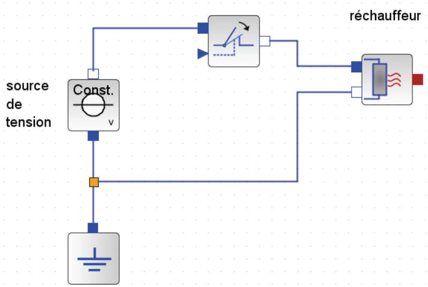

*Figure C-1 : modèle électrique*

**Question C1.1 :** dans le modèle ci-dessus, la source est un générateur de tension continue de valeur 230 V. Expliquer pourquoi ce choix est possible. Justifier la nécessité de ce choix au regard de la période de simulation.

**Question C1.2 :** déterminer la valeur ohmique de la résistance de dissipation notée *R* en ohm à insérer dans le modèle en tenant compte de la puissance du réchauffeur.

## **PARTIE C2 :** réalisation du modèle thermique du spa.

Pour tenir compte des déperditions de chaleur, il est nécessaire de simuler les différents échanges thermiques du spa. Le modèle proposé ci-dessous modélise une partie seulement de ces échanges et notamment celui qui existe entre l'eau du spa et l'air extérieur à travers la couverture isolante en polystyrène expansé de 11 cm d'épaisseur (la résistivité du volume d'air entre l'eau du spa et la couverture étant négligeable).

#### Données :

- capacité thermique massique de l'eau : = 4 185 . -. ;
- conductivité thermique du polystyrène expansé : = 0,4 . . pour une surface d'échange de 1 m² et une épaisseur de 1 m.

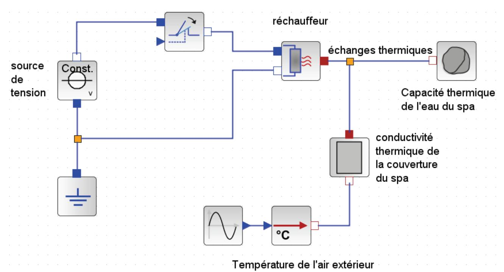

*Figure C-2 : modèle électrique + thermique*

- **Question C2.1 :** à partir de la documentation technique DT1 et des données ci-dessus, déterminer la valeur de la capacité thermique de l'eau du spa noté : en ∙ .
- **Question C2.2 :** déterminer, à partir de la documentation technique DT1 et des données cidessus, la valeur de la surface d'échange notée Sen m² entre l'eau du spa et l'air extérieur à travers la couverture isolante.
- **Question C2.3 :** déterminer la valeur de la conductivité thermique notée en ∙ à insérer dans le modèle.

#### **PARTIE C3 :** exploitation du modèle

Les résultats de la simulation apparaissent sur les figures des deux pages suivantes. L'axe des abscisses sur ces figures est gradué en secondes.

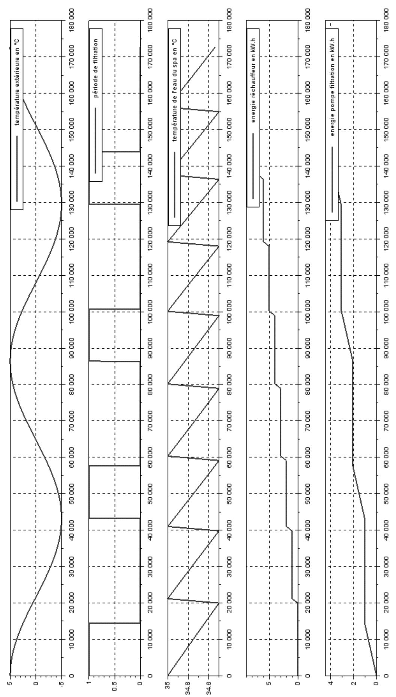

*Figure C-3 : résultats de simulation de la période hivernale*

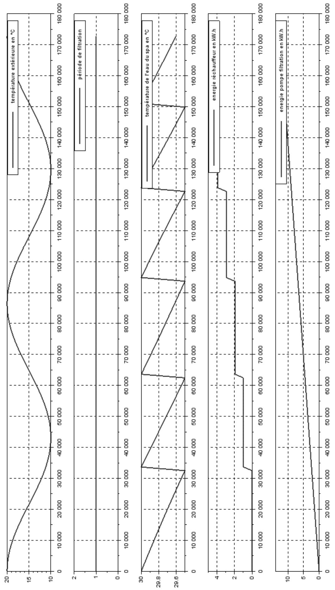

*Figure C-4 : résultats de simulation de la période estivale*

**Question C3.1 :** déterminer, à l'aide de la documentation technique DT5 et de la figure C-5

- l'énergie consommée par la pompe de filtration sur une période de 24 h en hiver durant les heures pleines qui sera notée et qui sera exprimée en -. ℎ ;
- l'énergie consommée par la pompe de filtration sur une période de 24 h en hiver durant les heures creuses qui sera notée et qui sera exprimée en -. ℎ ;

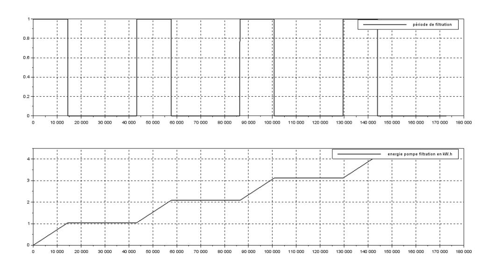

*Figure C-5 : énergie consommée par la pompe de filtration en hiver*

**Question C3.2 :** à l'aide de la documentation technique DT4, calculer le coût en € de l'énergie consommée par la pompe de filtration sur une période de 24 h en hiver avec l'option heures creuses du tarif bleu.

**Question C3.3 :** déterminer, à l'aide de la documentation technique DT5 et de la figure C-6

- l'énergie consommée par la pompe de filtration sur une période de 24 h en été durant les heures pleines qui sera notée et qui sera exprimée en -. ℎ ;
- l'énergie consommée par la pompe de filtration sur une période de 24 h en été durant les heures creuses qui sera notée et qui sera exprimée en -. ℎ ;

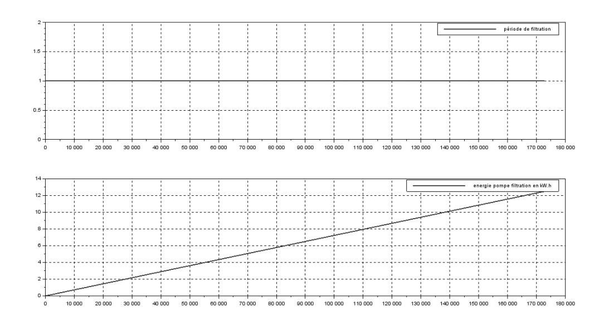

*Figure C-6 : énergie consommée par la pompe de filtration en été*

- **Question C3.4 :** à l'aide de la documentation technique DT4, calculer le coût en € de l'énergie consommée par la pompe de filtration sur une période de 24 h en été avec l'option heures creuses du tarif bleu.
- **Question C3.5 :** déterminer à l'aide de la documentation technique DT5 et de la figure C-7 (Il sera considéré que la simulation commence à 14 h 00, ce qui correspond au moment le plus chaud de la journée)
  - l'énergie consommée par le réchauffeur sur une période de 24 h en hiver durant les heures pleines qui sera notée et qui sera exprimée en -∙ ℎ ;
  - l'énergie consommée par le réchauffeur sur une période de 24 h en hiver durant les heures creuses qui sera notée et qui sera exprimée en -∙ ℎ ;

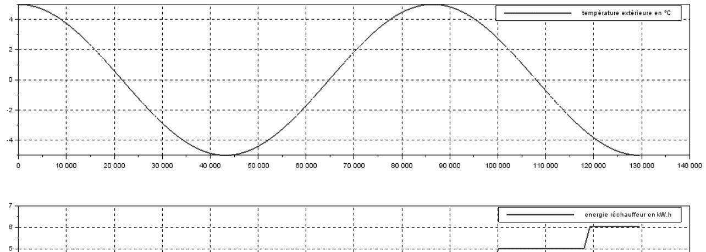

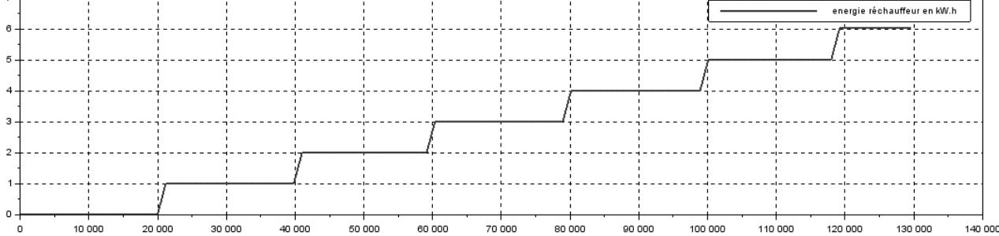

*Figure C-7 : énergie consommée par le réchauffeur en hiver*

- **Question C3.6 :** à l'aide de la documentation technique DT4, calculer le coût en € de l'énergie consommée par le réchauffeur sur une période de 24 h en hiver avec l'option heures creuses du tarif bleu.
- **Question C3.7 :** déterminer, à l'aide de la documentation technique DT5 et de la figure C-8 (Il sera considéré que la simulation commence à 14 h 00, ce qui correspond au moment le plus chaud de la journée)
  - l'énergie consommée par le réchauffeur sur une période de 24 h en été durant les heures pleines qui sera notée et qui sera exprimée en -∙ ℎ ;
  - l'énergie consommée par le réchauffeur sur une période de 24 h en été durant les heures creuses qui sera notée et qui sera exprimée en -∙ ℎ .

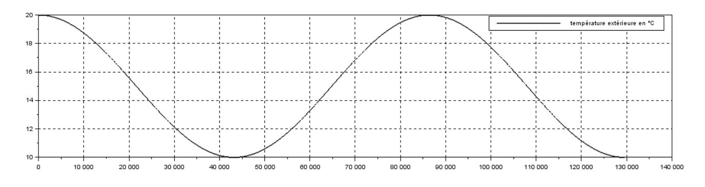

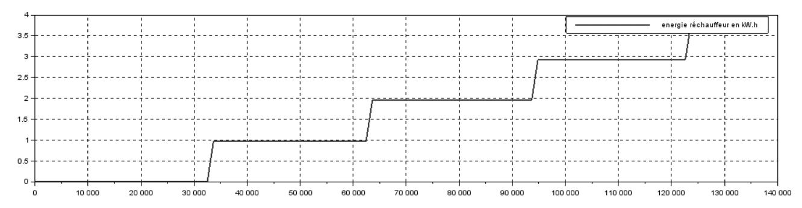

Figure C-8 : énergie consommée par le réchauffeur en été

**Question C3.8**: à l'aide de la documentation technique DT4, calculer le cout  $C_{re}$  en  $\in$  de l'énergie consommée par le réchauffeur sur une période de 24 h en été avec l'option heures creuses du tarif bleu.

**Question C3.9**: à partir des documentations techniques DT1 et DT5, déterminer l'énergie consommée par les pompes de massage notée  $E_m$  en  $kW \cdot h$  sur une période de 24 h. En déduire le coût  $C_m$  en  $\in$  de l'énergie consommée par les pompes de massage sur une période de 24 h avec l'option heures creuses du tarif bleu.

**Question C3.10**: calculer le coût total  $C_{Th}$  en  $\in$  de l'énergie consommée par le spa pour une journée d'utilisation en hiver.

Calculer le coût total  $C_{Te}$  en  $\in$  de l'énergie consommée par le spa pour une journée d'utilisation en été.

En déduire le coût total  $C_{TA}$  en  $\in$  de l'énergie consommée par le spa pour une année d'utilisation.

# **PARTIE D : choix d'un dispositif plus économique ; temps de retour sur investissement.**

Objectifs : vérifier le choix de l'abonnement et de l'option tarifaire à partir de la consommation électrique annuelle du spa et de l'abonnement EDF.

> Trouver une solution pour faire des économies d'énergie et déterminer le temps de retour sur investissement.

**Partie D1 :** vérifier le choix de l'abonnement et de l'option tarifaire à partir des consommations.

Le fonctionnement du spa est identique tous les jours selon deux périodes de l'année : été

(mois de juin, juillet, août et septembre) soit 122 jours et hiver (mois d'octobre, novembre, décembre, janvier, février, mars, avril et mai) soit 243 jours.

- Les pompes d'hydro massage fonctionnent simultanément à raison d'une demi-heure par jour en moyenne de 17 h à 17 h 30.
- Le réchauffeur fonctionne 20 minutes toutes les 6 h l'hiver et 20 minutes toutes les 12 h l'été.
- La pompe de circulation est utilisée pour la filtration et le réchauffeur 4 h sur 12 h l'hiver et en continu l'été.

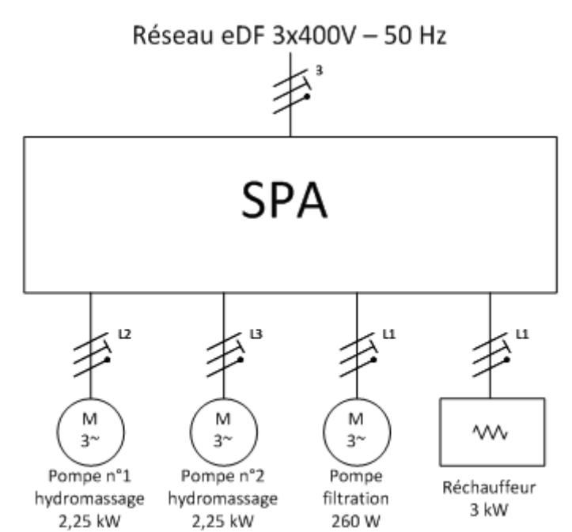

| énergie annuelle | nb jours | nb heures  | total/saison       |  |  |
|---------------------|----------|------------|--------------------|--|--|
| été                 | 122 j    | 2 928 h | 1 279,78 kWh    |  |  |
| hiver               | 243 j    | 5 832 h | 2 024,19 kWh    |  |  |
| année               | 365 j    | 8 760 h | 3 303,97 kWh |  |  |

Après installation, le propriétaire du spa a un abonnement de 30 kVA en triphasé avec l'option heures creuses et heures pleines. Les grilles tarifaires de l'offre de fourniture d'électricité sont fournies en annexe sur le document technique DT4.

| énergie             |          |           | total consommation |             |             |
|---------------------|----------|-----------|--------------------|-------------|-------------|
| annuelle en kW.h | nb jours | nb heures | HC                 | HP          | bilan       |
| été                 | 122      | 2 928  | 502,64             | 777,14      | 1 279,78 |
| hiver               | 243      | 5 832  | 738,72             | 1 285,47 | 2 024,19 |
| année               | 365      | 8 760  | 1 241,36        | 2 062,61 | 3 303,97 |

**Question D1.1 :** calculer le coût de la consommation annuelle d'énergie avec l'option HC/HP et l'option de base. Montrer, en tenant compte de l'abonnement, que ce choix de l'option HC/HP n'est pas pertinent. Compléter le tableau du document réponse DR3.

**Question D1.2 :** proposer une solution au propriétaire pour que le choix soit plus judicieux.

**Partie D2** : trouver une solution d'économie d'énergie.

**Question D2.1** : présenter les différentes solutions qui s'offrent à l'utilisateur pour faire des économies sur la consommation et sur l'abonnement au fournisseur d'énergie.

Le propriétaire du spa décide de remplacer les résistances de chauffage par une pompe à chaleur (PAC), son coût est de 1 800 € TTC. Habituellement celles pour piscine ne chauffent pas l'eau à plus de 32°. Ce modèle ci chauffe ou refroidie l'eau de 10 °C à 40 °C et fonctionne pour des températures extérieures variant de -10 °C à 45 °C. Les performances annoncées de la PAC sont :

- − 1 500 W consommés pour 5 500 W en mode chauffage ;
- − 1 200 W consommés pour 3 300 W en refroidissement.

Soit moitié moins de consommation par rapport à un réchauffeur de 3 kW, pour quasiment 2 fois moins de temps de fonctionnement.

Le temps de chauffe avec le réchauffeur à résistance est de 20 minutes pour remonter la température de 0,5 °C.

L'utilisation d'une PAC permet aussi de réduire la puissance souscrite et donc de diminuer l'abonnement de 30 kVA à 24 kVA.

- **Question D2.2** : déterminer le nouveau temps de chauffe avec utilisation de la PAC et en déduire la nouvelle consommation pour le chauffage de l'eau.
- **Question D2.3** : déterminer les nouvelles valeurs de consommation journalière et annuelle en heures creuses et en heures pleines. Compléter les tableaux du document réponses DR3.
- **Question D2.4** : calculer le coût de la consommation d'énergie et vérifier la pertinence de la solution en déterminant le temps de retour sur investissement. Compléter le tableau du document réponses DR3.

# **DOSSIER TECHNIQUE**

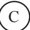

# **Document technique DT1**

Caractéristiques des spas de la marque VOLITION

# **Document technique DT1 (suite)**

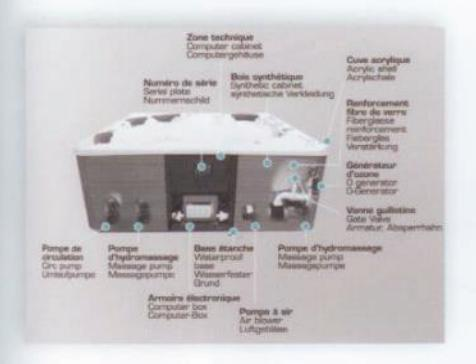

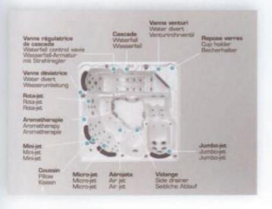

|                                                                                 | NEWCASTI   | GOSFORD    | GOSFORD        | BRISBANE       | GOLD CO        | SYDNEY Pr  | HOBART B        | HOBART          | HOBART B                | DOHA Pro        |
|---------------------------------------------------------------------------------|------------|------------|----------------|----------------|----------------|------------|-----------------|-----------------|-------------------------|-----------------|
| Dimensions Dimensions Abmessungen (cm)                                          | 212×212×90 | 214×155×78 | 195 x 140 x 68 | 205 x 205 x 78 | 218 x 218 x 90 | 218×218×90 | 570 x 225 x 150 | 428 x 225 x 128 | 572 x 225 x 128         | 250 × 250 × 100 |
| Places Seats Plătze                                                       | 40         | 60         | 2              | 9              | 9              | 10         | 64              | m               | 10                      | 1               |
| Hydrojets Hydrojets Luftdüsen                                             | 4          | 44         | 8              | 127            | 62             | 9          | 15              | 35              | 22                      | 26              |
| Aérojets Air jets Wasserstrahler                                          | 1          | 80         | 1              | 01             | 00             | 10         | 1               | 1               | 1                       | 12              |
| Pompe d'hydromassage Hydromassage pump Hydromassagepumpe (Watts)       | 1 x 2 250  | 2 x 1 500  | 1 × 1 500      | 2 x 1875       | 2×2250         | 2×2250     | 9 750           | 4 x 2 250       | 4 x 2 250 +2 x 1 500 | 1 × 1500        |
| Pompe de circulation Circulation pump Umwälzpumpe (Watts)              | 1          | 1          | 1              | 1              | 260            | 260        | 260             | 280             | 2 x 260                 | 1 × 1000        |
| Pompe à air (blower) Air pump (blower) Luftpumpe (blower)                       | 1          | •          | 1              | •              | •              | •          | 1               | 1               | 1                       | •               |
| Réchauffeur 3kW Heater 3kW Vorwärmer 3kW                                  | •          | •          |                | •              | •              | •          | •               | •               | •                       | WX99            |
| Filtration Filtration Filterung                                           | Skimmer    | Skimmer    | Skimmer        | Skimmer        | Skimmer        | Skimmer    | Skirrmer        | Skimmer         | Skimmer                 | Goulotte        |
| Vanne venturi Venturi Valve Venturirohrventil                             | CA         | 01         | 2              | 4              | 0              | 4          | N)              | l/3             | 0-                      | 1               |
| Vanne déviatrice Diverter valve Umlenkventil                              | -          | +          | -              | 04             | 5              | 2          | 1               | -               | m                       | 1               |
| Ozonator Ozonator                                                            | •          | •          | •              | •              | •              | •          | •               | •               | •                       | •               |
| 16 Mini Led's 16 Mini Led's 16 Mini Led's                                 |            | •          | •              | •              | •              | •          | •               | •               | •                       | •               |
| Spot subaquatique Led LED underwater spotlight Unterwasserspot Led        | •          | •          | •              | •              | •              | •          | •               | •               | •                       | •               |
| Cascade retroéclairée Backlit waterfall Rückwärtig beleuchtete Kaskade | 1          | •          | I              | •              | •              | •          | •               | •               | •                       | 1               |
| Aromathéraple Aromatherapy Aromatheraple                                  | 1          | •          | 1              | •              | •              | •          | 1               | 1               | 1                       | 1               |
| Surface au sol (m²) Ground area (m²) Bodenaufstandsfläche (m²)            | 4.49       | 3,31       | 2.73           | 4,20           | 4.75           | 4,75       | 12,82           | 69'63           | 12.87                   | 6,25            |
| Couverfure Cover Decke                                                    | •          | •          | •              | •              | •              | •          | •               | •               | •                       |                 |
| Escallers Steps Treppe                                                    | •          | •          | 1              | •              | •              | •          | •               | •               | •                       | 1               |

# **Document technique DT2**

# Diagramme SYSML

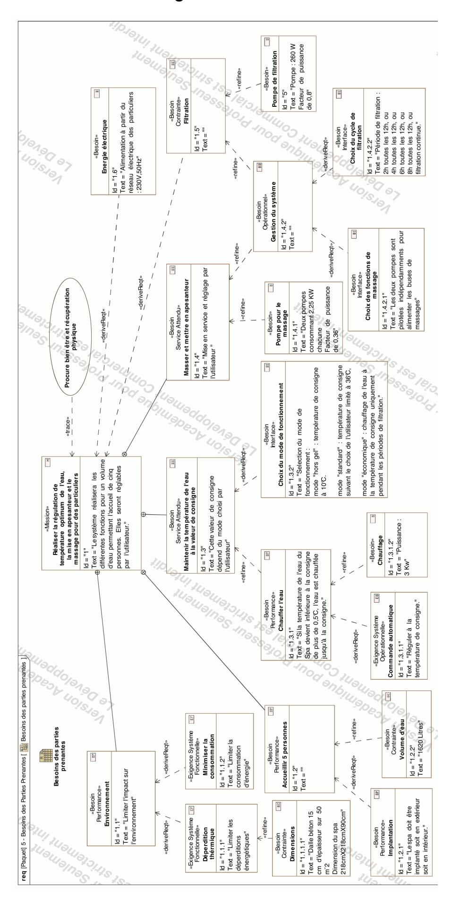

# **Document technique DT2**

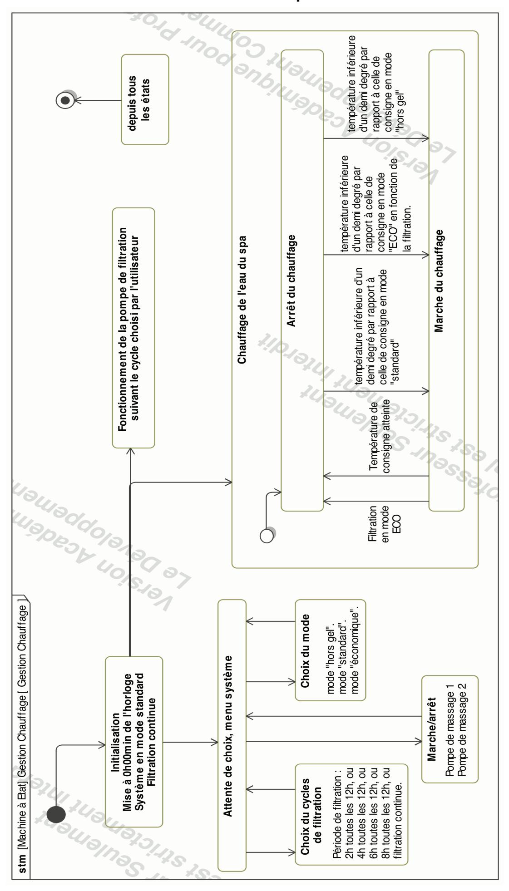

Page **21** sur **30**

# **DOCUMENT TECHNIQUE DT3**

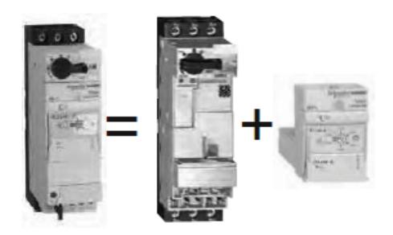

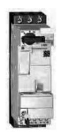

| Base puissance | Base puissance |       |           |           |       |      |                 |                                                  |               |  |
|----------------|----------------|-------|-----------|-----------|-------|------|-----------------|--------------------------------------------------|---------------|--|
| Monophasé      |                |       |           | Triphasé  |       |      |                 | Départ-moteur Type E combiné auto-protégé (1) |               |  |
|                | 120 V          | 240 V | 200/208 V | 230/240 V | 480 V | 600V | Courant nominal | 1 sens de marche                                 | Inverseur (2) |  |
| Puissance (HP) | 1/2            | 2     | 3         | 3         | 7,5   | 10   | 12A             | LUB12                                            | LU2B12**      |  |
| CSA/UL         | 2              | 5     | 10        | 10        | 20    | 25   | 32A             | LUB32                                            | LU2B32**      |  |

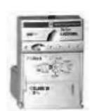

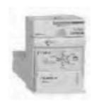

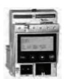

| Unités de commande      |           |                       |                       |                        |                       |                            |  |  |  |  |
|-------------------------|-----------|-----------------------|-----------------------|------------------------|-----------------------|----------------------------|--|--|--|--|
|                         |           | Standard (3)          |                       | Multifonction          |                       |                            |  |  |  |  |
| Plage de réglage (A) | Monte sur | Classe 10 triphasé | Classe 10 triphasé | Classe 10 monophasé | Classe 20 triphasé | Classes 5 à 35 triphasé |  |  |  |  |
| 0,15 – 0,6              | 12 et 32  | LUCA6X**              | LUCB6X**              | LUCC6X**               | LUCD6X**              | LUCM6XBL                   |  |  |  |  |
| 0,35 – 1,4              | 12 et 32  | LUCA1X**              | LUCB1X**              | LUCC1X**               | LUCD1X**              | LUCM1XBL                   |  |  |  |  |
| 1.25 – 5                | 12 et 32  | LUCA05**              | LUCB05**              | LUCC05**               | LUCD05**              | LUCM05BL                   |  |  |  |  |
| 3 – 12                  | 12 et 32  | LUCA12**              | LUCB12**              | LUCC12**               | LUCD12**              | LUCM12BL                   |  |  |  |  |
| 4,5 – 18                | 32        | LUCA18**              | LUCB18**              | LUCC18**               | LUCD18**              | LUCM18BL                   |  |  |  |  |
| 8-32                    | 32        | LUCA32**              | LUCB32**              | LUCC32**               | LUCD32**              | LUCM32BL                   |  |  |  |  |

| Caractéristiques fonctionnelles                                                                                                                                      |                                                                                                                                                                      |                                                                                                                                                                                                                                                               |
|----------------------------------------------------------------------------------------------------------------------------------------------------------------------|----------------------------------------------------------------------------------------------------------------------------------------------------------------------|---------------------------------------------------------------------------------------------------------------------------------------------------------------------------------------------------------------------------------------------------------------|
| Standard = LUB + LUCA                                                                                                                                                | Évolutif = LUB + LUCB/C/D                                                                                                                                            | Multifonction = LUB + LUCM                                                                                                                                                                                                                                    |
| Protection surcharge thermique, contre : • les courts-circuits, les surintensités, • l'absence ou les déséquilibres de phases, • les défauts d'isolement (matériel). | Protection surcharge thermique, contre : • les courts-circuits, les surintensités, • l'absence ou les déséquilibres de phases, • les défauts d'isolement (matériel). | Protection surcharge thermique, contre : • les courts-circuits, les surintensités, • l'absence ou les déséquilibres de phases, • les défauts d'isolement (matériel).                                                                                          |
| Réarmement Manuel sur défaut thermique.                                                                                                                              | Réarmement Manuel sur défaut thermique. Fonction test surcharge thermique.                                                                                        | Réarmement Manuel sur défaut thermique.  • Fonction test surcharge thermique.  • Surcouple et marche à vide, alarme,  • Historique du fonctionnement moteur,  • Visualisation des paramètres moteur sur LUCM, sur PC ou HMI,  • Communication Modbus intégrée |

| (3) Compléter les références des unités de commande selon les tableaux suivants. | Exemple: LUCA/B/D/M6X | ** |
|----------------------------------------------------------------------------------|-----------------------|----|
|                                                                                  |                       |    |
| Tension circuit du circuit de commande existant                                  |                       |    |
| 24 V CC                                                                          |                       | BL |
| 24 V CA                                                                          |                       | В  |
| 48 V CA / 4872 V CC                                                              |                       | ES |
| 110240 V CA / 110220 V CC                                                        |                       | FU |

# **DOCUMENT TECHNIQUE DT3**

|                                                                                   | ques des unités de contrôle sta                                                                                                                                                                              | inuai      |                                                                                         |                                                                                |                                                                                  |  |  |  |  |  |
|-----------------------------------------------------------------------------------|--------------------------------------------------------------------------------------------------------------------------------------------------------------------------------------------------------------|------------|-----------------------------------------------------------------------------------------|--------------------------------------------------------------------------------|----------------------------------------------------------------------------------|--|--|--|--|--|
| Protection                                                                        | Type de moteur                                                                                                                                                                                               |            | Triphasé                                                                                |                                                                                |                                                                                  |  |  |  |  |  |
|                                                                                   | Selon norme                                                                                                                                                                                                  |            | IEC/EN 60947-6-2, UL 508, (                                                             | CSA C22-2 n°14                                                                 |                                                                                  |  |  |  |  |  |
| Protection contre les surcharges                                               | Classe de déclenchement selon UL 508, IEC/EN 60947-6-2                                                                                                                                                    |            | 10                                                                                      | 10                                                                             |                                                                                  |  |  |  |  |  |
|                                                                                   | Limites de fréquence du courant d'emploi                                                                                                                                                                     | Hz         | 4060                                                                                    |                                                                                |                                                                                  |  |  |  |  |  |
|                                                                                   | Compensation en température                                                                                                                                                                                  | °C         | - 25+ 70                                                                                |                                                                                |                                                                                  |  |  |  |  |  |
|                                                                                   | Protection contre le déséquilibre des phases                                                                                                                                                                 |            | Avec                                                                                    |                                                                                |                                                                                  |  |  |  |  |  |
|                                                                                   | Seuil de déclenchement                                                                                                                                                                                       |            | 14,2 x lr (courant de réglage                                                           | maxi)                                                                          |                                                                                  |  |  |  |  |  |
| les courts-circuits Tolérance de déclenchement ± 20 %                             |                                                                                                                                                                                                              |            |                                                                                         |                                                                                |                                                                                  |  |  |  |  |  |
|                                                                                   |                                                                                                                                                                                                              |            |                                                                                         |                                                                                |                                                                                  |  |  |  |  |  |
| Caractéristi                                                                      | ques des unités de contrôle éve                                                                                                                                                                              | olutif     | LUCB, LUCC et LU                                                                        | CD                                                                             |                                                                                  |  |  |  |  |  |
| Caractéristi Type d'unité de c                                                 |                                                                                                                                                                                                              | olutif     | LUCB, LUCC et LUC                                                                       | CD  LUCC                                                                    | LUCD                                                                             |  |  |  |  |  |
|                                                                                   |                                                                                                                                                                                                              | olutif  | ,                                                                                       |                                                                                | LUCD Triphasé                                                                 |  |  |  |  |  |
| Type d'unité de c                                                                 | ontrôle                                                                                                                                                                                                      | olutif     | LUCB                                                                                    | LUCC                                                                           | Triphasé                                                                         |  |  |  |  |  |
| Type d'unité de c Protection Protection contre                              | ontrôle Type de moteur                                                                                                                                                                                    | olutif     | LUCB Triphasé IEC/EN 60947-6-2, UL 508,                                           | LUCC Monophasé IEC/EN 60947-6-2, UL 508,                                 | Triphasé IEC/EN 60947-6-2, UL 508,                                            |  |  |  |  |  |
| Type d'unité de c Protection Protection contre                              | Type de moteur Selon norme Classe de déclenchement selon                                                                                                                                                     | Olutif     | LUCB Triphasé IEC/EN 60947-6-2, UL 508, CSA C22-2 n*14                         | LUCC Monophasé IEC/EN 60947-6-2, UL 508, CSA C22-2 n°14               | Triphasé IEC/EN 60947-6-2, UL 508, CSA C22-2 n°14                          |  |  |  |  |  |
| Type d'unité de c Protection Protection contre                              | Type de moteur Selon norme  Classe de déclenchement selon UL 508, IEC/EN 60947-6-2                                                                                                                           |            | LUCB Triphasé IEC/EN 60947-6-2, UL 508, CSA C22-2 n*14                         | LUCC Monophasé IEC/EN 60947-6-2, UL 508, CSA C22-2 n*14               | Triphasé IEC/EN 60947-6-2, UL 508, CSA C22-2 n°14 20                    |  |  |  |  |  |
| Type d'unité de c Protection Protection contre                              | ontrôle Type de moteur Selon norme  Classe de déclenchement selon UL 508, IEC/EN 60947-6-2 Limites de fréquence du courant d'emploi                                                                          | Hz         | LUCB Triphasé IEC/EN 60947-6-2, UL 508, CSA C22-2 n*14 10                   | LUCC Monophasé IEC/EN 60947-6-2, UL 508, CSA C22-2 n°14 10 4060 | Triphasé IEC/EN 60947-6-2, UL 508, CSA C22-2 n°14 20 4060            |  |  |  |  |  |
| Type d'unité de c Protection  Protection contre les surcharges  Protection contre | ontrôle Type de moteur Selon norme  Classe de déclenchement selon UL 508, IEC/EN 60947-6-2 Limites de fréquence du courant d'emploi Compensation en température Protection contre le déséquilibre des phases | Hz         | LUCB Triphasé IEC/EN 60947-6-2, UL 508, CSA C22-2 n°14 10 4060 -25+70 | LUCC Monophasé IEC/EN 60947-6-2, UL 508, CSA C22-2 n°14 10 4060 | Triphasé IEC/EN 60947-6-2, UL 508, CSA C22-2 n°14 20 4060 - 25+70 |  |  |  |  |  |

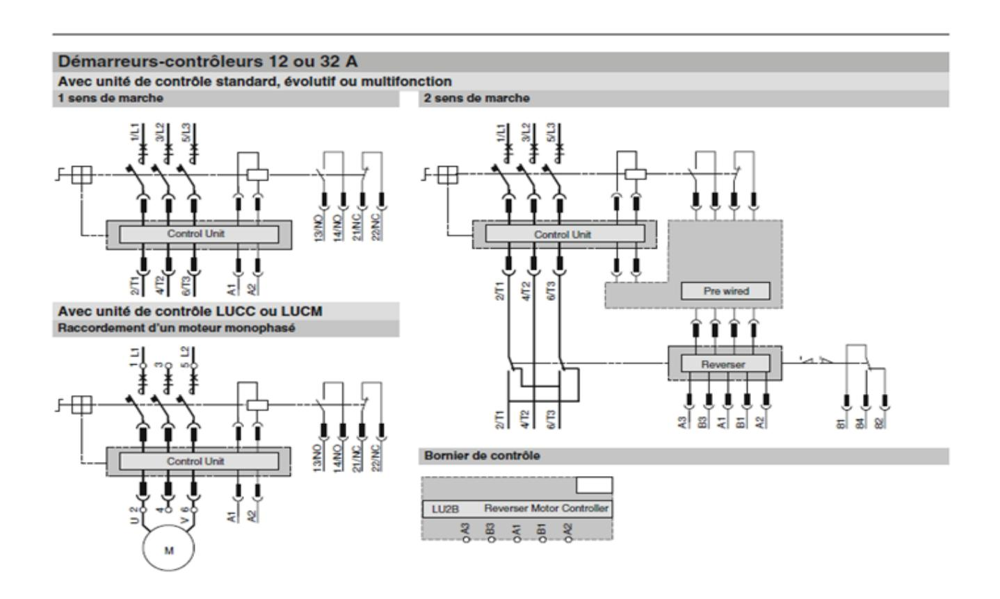

# **DOCUMENT TECHNIQUE DT4**

# Comparaison fonctionnement et tarification mono et triphasé

## **1 Différence entre monophasé et triphasé**

On distingue deux types d'installation électrique :

- le triphasé comprend 3 phases, plus un neutre, plus une terre,
- le monophasé comprend 1 phase, plus un neutre, plus une terre.

La phase est le conducteur acheminant le courant alternatif issu du réseau de distribution d'électricité.

La grande majorité des installations domestiques sont en monophasé. Néanmoins, à une époque, les installations EDF triphasées étaient relativement courantes, en particulier dans le monde rural lorsqu'une puissance importante était nécessaire. La question du passage de triphasé à monophasé pour ces installations anciennes se pose donc régulièrement.

## 2 **Avantages pour l'abonnement en courant triphasé**

Le courant triphasé permet le fonctionnement de certains moteurs, en particulier sur des machines anciennes, vendues sur le marché de l'occasion, ou pour des fours, chauffe-eaux électriques, ou pompes à chaleur. A moins d'opérer des modifications techniques sur les machines en question pour les rendre compatibles en monophasé, il faut alors que le courant soit en triphasé, avec des prises spécifiques triphasées. Le triphasé peut aussi être choisi lorsqu'il y a une très longue distance entre le point de consommation et le point de livraison, ou lorsque la puissance nécessaire dépasse 18 kVA. Aujourd'hui, la pertinence de l'abonnement en triphasé concerne bien davantage les clients professionnels.

# **3 Inconvénients pour l'abonnement en courant triphasé**

# **3.1- Le risque de déséquilibrage**

En triphasé, la puissance souscrite du compteur est répartie entre les trois phases, d'où un problème de déséquilibrage des phases. Par exemple, si un compteur de puissance 9 kVA en triphasé alimente les 3 niveaux d'une maison avec une phase de 3 kVA pour chaque étage, le disjoncteur se déclenchera si un seul des niveaux dépasse la puissance de 3 kVA, quel que soit le niveau de puissance utilisée aux autres étages. En monophasé en revanche, c'est l'ensemble de l'installation qui ne doit pas dépasser la puissance souscrite du compteur.

# **3.2 Un prix d'abonnement EDF plus élevé**

La grille tarifaire des fournisseurs d'électricité est identique pour les installations monophasées et pour les installations triphasées. L'abonnement varie selon la puissance du compteur. Si le prix de l'abonnement est plus élevé en triphasé qu'en monophasé, c'est parce que le risque de déséquilibrage des phases fait qu'il est souvent nécessaire de souscrire une puissance plus élevée en triphasé qu'en monophasé pour une même installation électrique. En passant de monophasé en triphasé, il est ainsi souvent possible de réduire le montant de son abonnement (la partie fixe de la facture), qui dépend de la puissance souscrite.

# **DOCUMENT TECHNIQUE DT4 (suite)**

# Grilles tarifaires Tarif Bleu Applicables au 1er janvier 2016

L'offre « Tarif Bleu » porte sur la fourniture d'électricité et sur l'accès et l'utilisation du réseau public de distribution, à destination des clients résidentiels qui bénéficient des tarifs réglementés, fixés par les pouvoirs publics.

#### Les grilles tarifaires de l'offre Tarif Bleu

|                                 | Option Base (TTC)                  |                                |  |  |  |
|---------------------------------|------------------------------------|--------------------------------|--|--|--|
| Puissance Souscrite (kVA) | Abonnement annuel (€ TTC/an) | Prix du kWh (cts € TTC/kWh) |  |  |  |
| 3                               | 54.45                              | 15.03                          |  |  |  |
| 6                               | 88.42                              | 15.03                          |  |  |  |
| 9                               | 117.20                             | 15.03                          |  |  |  |
| 12                              | 180.11                             | 15.03                          |  |  |  |
| 15                              | 206.57                             | 15.03                          |  |  |  |
| 18                              | 237.59                             | 15.03                          |  |  |  |
| 24                              | 505.49                             | 15.03                          |  |  |  |
| 30                              | 624.69 15.03                    |                                |  |  |  |
| 36                              | 723.39                             | 15.03                          |  |  |  |

|                        | Option Heures creuses (TTC)                            |                   |                   |  |  |  |  |  |  |
|------------------------|--------------------------------------------------------|-------------------|-------------------|--|--|--|--|--|--|
| Puissance Souscrite | Abonnement Prix du kWh annuel (cts € TTC/kWh) |                   |                   |  |  |  |  |  |  |
| (kVA)                  | (€ TTC/an)                                             | Heures pleines | Heures creuses |  |  |  |  |  |  |
| 6                      | 94.46                                                  | 16.36             | 11.50             |  |  |  |  |  |  |
| 9                      | 126.525                                                | 16.36             | 11.50             |  |  |  |  |  |  |
| 12                     | 204.77                                                 | 16.36             | 11.50             |  |  |  |  |  |  |
| 15                     | 237.26                                                 | 16.36             | 11.50             |  |  |  |  |  |  |
| 18                     | 266.84                                                 | 16.36             | 11.50             |  |  |  |  |  |  |
| 24                     | 560.18                                                 | 16.36             | 11.50             |  |  |  |  |  |  |
| 30                     | 661.91                                                 | 16.36             | 11.50             |  |  |  |  |  |  |
| 36                     | 761.47                                                 | 16.36             | 11.50             |  |  |  |  |  |  |

Suite à une décision des pouvoirs publics (Arrêté du 12 août 2010 relatif aux tarifs réglementés de vente de l'électricité), les puissances de 18 à 36 kVA inclus de l'option Base du Tarif Bleu pour les clients résidentiels ont été mises en extinction et ne sont plus disponibles à la souscription.

|                        | Option Tempo (TTC)   |                               |         |       |       |                                     |       |  |  |  |  |
|------------------------|----------------------|-------------------------------|---------|-------|-------|-------------------------------------|-------|--|--|--|--|
| Puissance Souscrite | Abonnement annuel | Prix du kWh (cts €TTC/kWh) |         |       |       |                                     |       |  |  |  |  |
| (kVA)                  | (€ TTC/an)           | Bleu HC                       | Bleu HP |       |       | Blanc HC Blanc HP Rouge HC Rouge HP |       |  |  |  |  |
| 9                      | 131.33               | 9,67                          | 11.47   | 13.36 | 15.85 | 24.02                               | 62.07 |  |  |  |  |
| 12                     | 210.34               | 9,67                          | 11.47   | 13.36 | 15.85 | 24.02                               | 62.07 |  |  |  |  |
| 15                     | 243.46               | 9,67                          | 11.47   | 13.36 | 15.85 | 24.02                               | 62.07 |  |  |  |  |
| 18                     | 267.10               | 9,67                          | 11.47   | 13.36 | 15.85 | 24.02                               | 62.07 |  |  |  |  |
| 30                     | 667.74               | 9,67                          | 11.47   | 13.36 | 15.85 | 22,70                               | 62.07 |  |  |  |  |
| 36                     | 819.60               | 9,67                          | 11.47   | 13.36 | 15.85 | 24.02                               | 62.07 |  |  |  |  |

#### 3. La composition du prix de l'offre

*(Articles 4 et 8.7 des Conditions Générales de Vente)*

Les prix toutes taxes comprises (TTC), tels qu'indiqués sur la grille tarifaire ci-jointe correspondent à :

- l'abonnement annuel, dont le montant est fonction de la puissance mise à disposition,
- le prix du kWh qui correspond au prix unitaire de chaque kWh consommé par le client.

Chacune de ces deux parties du prix intègre le prix de l'acheminement de l'électricité sur les réseaux, auquel s'ajoutent :

- les Taxes sur la Consommation Finale d'électricité (TCFE) d'un montant maximum de 0,957 cts €/kWh HTVA,
- la Contribution aux charges de Service Public de l'Électricité (CSPE), d'un montant de 1,95 cts €/kWh HTVA,
- la Contribution tarifaire d'acheminement(CTA),
- la TVA, au taux de 5,5% pour l'abonnement et la CTA et au taux de 20% pour les consommations, les autres taxes et contributions (CSPE et TCFE).

Le montant des taxes applicables est disponible sur taxes.edf.com

#### Note commune à tous les fournisseurs :

Les clients démunis, sous condition de ressources, sont en droit d'obtenir un tarif spécial « produit de première nécessité » auprès de leur fournisseur d'électricité. Dans chaque département, le Fonds Solidarité Logement peut accorder une aide en fonction de ses critères d'attribution pour couvrir tout ou partie des dépenses de fourniture d'électricité.

# **Document technique DT5**

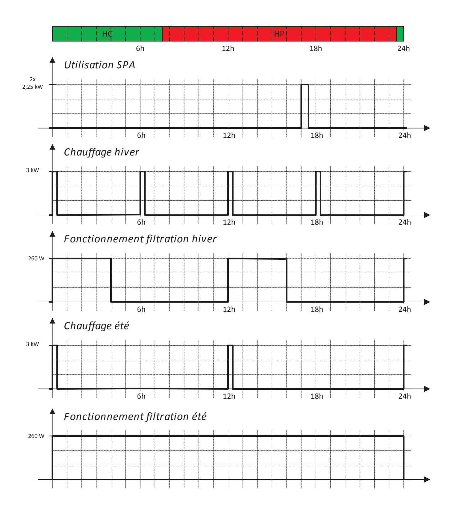

| Modèle CMEN-D                  | OC v2 ©NEOPTEC                                                                                            |                                           |                                             |                                            |                                        |                                                             |                               |                                                |                                          |                    |        |      | _ | $\neg$ |
|--------------------------------|-----------------------------------------------------------------------------------------------------------|-------------------------------------------|---------------------------------------------|--------------------------------------------|----------------------------------------|-------------------------------------------------------------|-------------------------------|------------------------------------------------|------------------------------------------|--------------------|--------|------|---|--------|
|                                | n de famille : lieu, du nom d'usage)                                                                   |                                           |                                             |                                            |                                        |                                                             |                               |                                                |                                          |                    |        |      |   |        |
|                                | Prénom(s) :                                                                                               |                                           |                                             |                                            |                                        |                                                             |                               |                                                |                                          |                    |        |      |   |        |
|                                | Numéro Inscription :                                                                                   | e numéro est                              | celui qui figur                             | a sur la conv                              | ocation ou                             | la feuille d'én                                             | narraeme                      | Né(e)                                          | le :                                     |                    |        | ′    |   |        |
| (Remplir cette partie Concours | •                                                                                                         |                                           | , ,                                         |                                            |                                        | ection/S                                                    |                               | ,                                              | ):                                       |                    |        |   |   |     |
|                                | Epreuve:                                                                                                  |                                           |                                             |                                            | N                                      | /latière :                                                  |                               |                                                |                                          | . Sess             | ion :  |   |   |     |
| CONSIGNES                      | <ul> <li>Remplir soigne</li> <li>Ne pas signer</li> <li>Numéroter che</li> <li>Rédiger avec le</li> </ul> | · la composi aque PAGE un stylo à e | tion et ne pa (cadre en b ncre foncée | as y apporte as à droite (bleue ou l | er de sigr de la paç noire) et i | ne distinctif l ge) et place ne pas utilis | oouvan r les fe er de s | t indiquer sa uilles dans l tylo plume a | a provenan le bon sens à encre cla | et dans l'i re. | ordre. |      |   |        |

EDE ENE 2

**DR1 - DR2** 

# **Document réponse DR1**

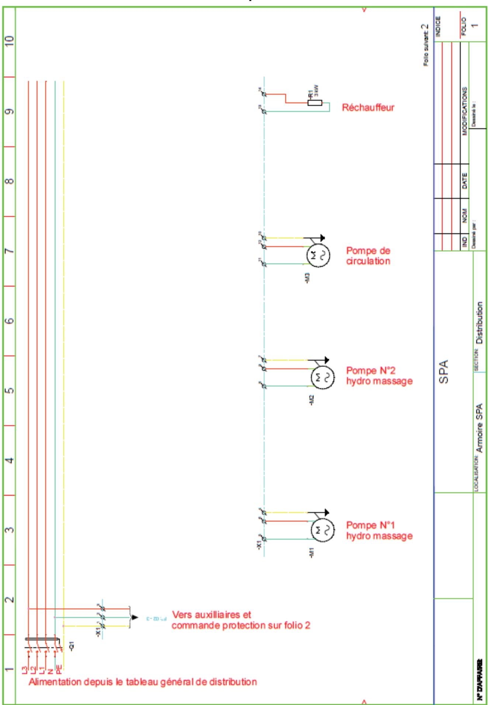

# Document réponse DR2

**Question B1.2** : courant consommé par chaque récepteur

| Récepteurs           | Réchauffeur | Pompes d'Hydro massage | Pompe de circulation |
|----------------------|-------------|---------------------------|----------------------|
| P (W)                |             |                           |                      |
| Facteur de puissance |             | 0.86                      | 0.8                  |
| S (VA)               |             |                           |                      |
| I (A)                |             |                           |                      |

**Question B2.2** : Courants consommés dans les différents cas de fonctionnement Remarque : Le nombre de colonnes ne présage pas du nombre de cas.

| Cas    |  |  |
|--------|--|--|
| P (W)  |  |  |
| S (VA) |  |  |
| I (A)  |  |  |

| Modèle CMEN-D                                                                                                                                                                                                                                                                                                                                                                                                                                                                                                                                                                              | OC v2 ©NEOPTEC          |             |                 |             |         |            |                |         |       |      | _  |         | _ |     |             |  |
|--------------------------------------------------------------------------------------------------------------------------------------------------------------------------------------------------------------------------------------------------------------------------------------------------------------------------------------------------------------------------------------------------------------------------------------------------------------------------------------------------------------------------------------------------------------------------------------------|-------------------------|-------------|-----------------|-------------|---------|------------|----------------|---------|-------|------|----|---------|---|-----|----------------|--|
| Nom de famille : (Suivi, s'il y a lieu, du nom d'usage)                                                                                                                                                                                                                                                                                                                                                                                                                                                                                                                                 |                         |             |                 |             |         |            |                |         |       |      |    |         |   |     | $\perp$        |  |
| <b>■</b> %■                                                                                                                                                                                                                                                                                                                                                                                                                                                                                                                                                                                | Prénom(s) :             |             |                 |             |         |            |                |         |       |      |    |         |   |     | $\boxed{\Box}$ |  |
|                                                                                                                                                                                                                                                                                                                                                                                                                                                                                                                                                                                            | Numéro Inscription : | e numéro es | t celui qui fic | aure sur la | convoca | tion ou la | r feuille d'éi | nargeme | Né(e) | le : |    | /[      |   | ]/[ |                |  |
| (Le numéro est celui qui figure sur la convocation ou la feuille d'émargement)  (Remplir cette partie à l'aide de la notice)  Concours / Examen : Section/Spécialité/Série :                                                                                                                                                                                                                                                                                                                                                                                                               |                         |             |                 |             |         |            |                |         |       |      |    |         |   |     |                |  |
|                                                                                                                                                                                                                                                                                                                                                                                                                                                                                                                                                                                            | Epreuve:                |             |                 |             |         | M          | atière :       |         |       |      | Se | ssion : |   |     |             |  |
| <ul> <li>Remplir soigneusement, sur CHAQUE feuille officielle, la zone d'identification en MAJUSCULES.</li> <li>Ne pas signer la composition et ne pas y apporter de signe distinctif pouvant indiquer sa provenance.</li> <li>Numéroter chaque PAGE (cadre en bas à droite de la page) et placer les feuilles dans le bon sens et dans l'ordre.</li> <li>Rédiger avec un stylo à encre foncée (bleue ou noire) et ne pas utiliser de stylo plume à encre claire.</li> <li>N'affectus que pellege que découper de quiets en de facille efficielle. No icitetre quant bravilles.</li> </ul> |                         |             |                 |             |         |            |                |         |       |      |    |         |   |     |                |  |

EDE ENE 2

DR3

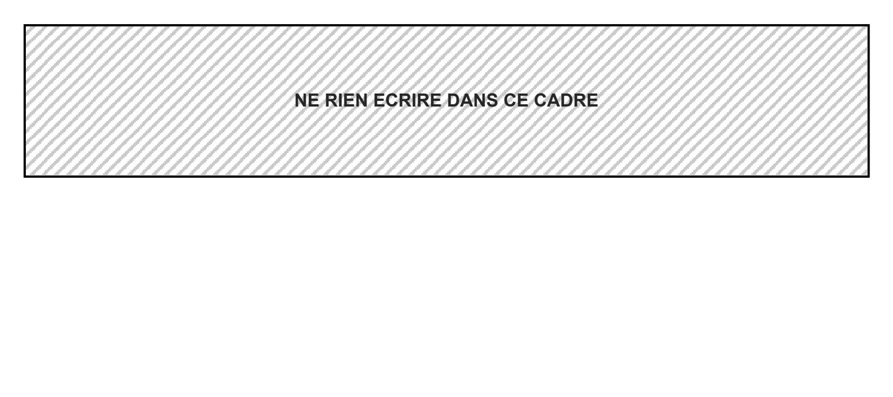

# **Document réponse DR3**

**Question D1.1** : coût de la consommation d'énergie (comparaison option base et option HP/HC) en kWh

|              | HC | HP | Base |
|--------------|----|----|------|
| PU TTC c/kWh |    |    |      |
| été          |    |    |      |
| hiver        |    |    |      |
| total        |    |    |      |
| bilan        |    |    |      |
| abonnement   |    |    |      |
| coût annuel  |    |    |      |

# **Question D2.3** : énergie consommée par jour en HP/HC en kWh

|       | filtration |    | pompage |      |    | chauffage | total/jour |    |       |
|-------|------------|----|---------|------|----|-----------|------------|----|-------|
|       | HC         | HP | HC      | HP   | HC | HP        | HC         | HP | total |
| été   | 3          | 3  | 0       | 2,25 |    |           |            |    |       |
| hiver | 1          | 1  | 0       | 2,25 |    |           |            |    |       |

## **Question D2.3** : énergie consommée par an en HP/HC en kWh

|       |          |            | Total consommation |    |  |  |
|-------|----------|------------|--------------------|----|--|--|
|       | nb jours | nb heures  | HC                 | HP |  |  |
| été   |          |            |                    |    |  |  |
| hiver |          |            |                    |    |  |  |
| année | 365 j    | 8 760 h |                    |    |  |  |

# **Question D2.4** - Coût de la consommation d'énergie en kWh

|              | HC | HP |
|--------------|----|----|
| PU TTC c/kWh |    |    |
| été          |    |    |
| hiver        |    |    |
| total        |    |    |
| bilan        |    |    |