MINISTÈRE DE L'ÉDUCATION NATIONALE

**EDE STI 1** 

### **SESSION 2018**

### CAPET CONCOURS EXTERNE TROISIEME CONCOURS ET CAFEP CORRESPONDANT

Section : SCIENCES INDUSTRIELLES DE L'INGÉNIEUR Option : INGÉNIERIE DES CONSTRUCTIONS

Option: INGÉNIERIE ÉLECTRIQUE Option: INGÉNIERIE INFORMATIQUE Option: INGÉNIERIE MÉCANIQUE

### ANALYSE ET EXPLOITATION PÉDAGOGIQUE D'UN SYSTEME PLURITECHNIQUE

Durée: 5 heures

Calculatrice électronique de poche - y compris calculatrice programmable, alphanumérique ou à écran graphique — à fonctionnement autonome, non imprimante, autorisée conformément à la circulaire n° 99-186 du 16 novembre 1999.

L'usage de tout ouvrage de référence, de tout dictionnaire et de tout autre matériel électronique est rigoureusement interdit.

Dans le cas où un(e) candidat(e) repère ce qui lui semble être une erreur d'énoncé, il (elle) le signale très lisiblement sur sa copie, propose la correction et poursuit l'épreuve en conséquence.

De même, si cela vous conduit à formuler une ou plusieurs hypothèses, il vous est demandé de la (ou les) mentionner explicitement.

NB: La copie que vous rendrez ne devra, conformément au principe d'anonymat, comporter aucun signe distinctif, tel que nom, signature, origine, etc. Si le travail qui vous est demandé comporte notamment la rédaction d'un projet ou d'une note, vous devrez impérativement vous abstenir de signer ou de l'identifier.

### **Constitution du dossier :**

- texte et questionnement, pages 2 à 17;
- documents annexes, pages 18 à 29 ;
- documents réponses, pages 30 à 34.

### **INFORMATION AUX CANDIDATS**

Vous trouverez ci-après les codes nécessaires vous permettant de compléter les rubriques figurant en en-tête de votre copie. Ces codes doivent être reportés sur chacune des copies que vous remettrez.

### Concours externe du CAPET de l'enseignement public :

| • option               | : Ingénierie des co                                            | onstructions                                  |                     |                 |
|------------------------|----------------------------------------------------------------|-----------------------------------------------|---------------------|-----------------|
| • option               | Concours EDE : Ingénierie électri                              | Section/option 1411E                          | Epreuve 101         | Matière<br>7809 |
| • option               | Concours EDE                                                   | Section/option 1419E natique                  | Epreuve 101         | Matière<br>7809 |
| • option               | Concours EDE : Ingénierie mécai                                | Section/option 1413E                          | Epreuve 101         | Matière<br>7809 |
| ► Concours ex          | Concours EDE terne du CAFEP/CA                                 | Section/option 1414E  PET de l'enseignement p | Epreuve 101 orivé : | Matière<br>7809 |
|                        | : Ingénierie des co<br>Concours<br>EDF<br>: Ingénierie électri | Section/option                                | Epreuve             | Matière         |
|                        | Concours EDF  : Ingénierie info                                | Section/option                                | Epreuve 101         | Matière<br>7809 |
| • optior               | Concours<br>EDF<br>n : Ingénierie méd                          | Section/option 14435                          | Epreuve 101         | Matière<br>7809 |
| ► <u>Troisième cor</u> | Concours EDF acours externe du C                               | Section/option 1414E  APET de l'enseignement  | Epreuve 101 public: | Matière<br>7809 |
| • option               | : Ingénierie des co                                            | onstructions                                  |                     |                 |
| • option               | Concours    E D   V     Ingénierie électri                     | Section/option 1411E                          | Epreuve<br>101      | Matière<br>7809 |
| • option               | Concours EDV : Ingénierie inform                               | Section/option 14495                          | Epreuve             | Matière<br>7809 |
| • option               | Concours  EDV  : Ingénierie mécar                              | Section/option 1443E                          | Epreuve 101         | Matière<br>7809 |
| ,                      | Concours<br>EDV                                                | Section/option                                | Epreuve<br>101      | Matière 7809    |

### **« LE SUNSEARIDER » UN CATAMARAN SOLAIRE AUTONOME**

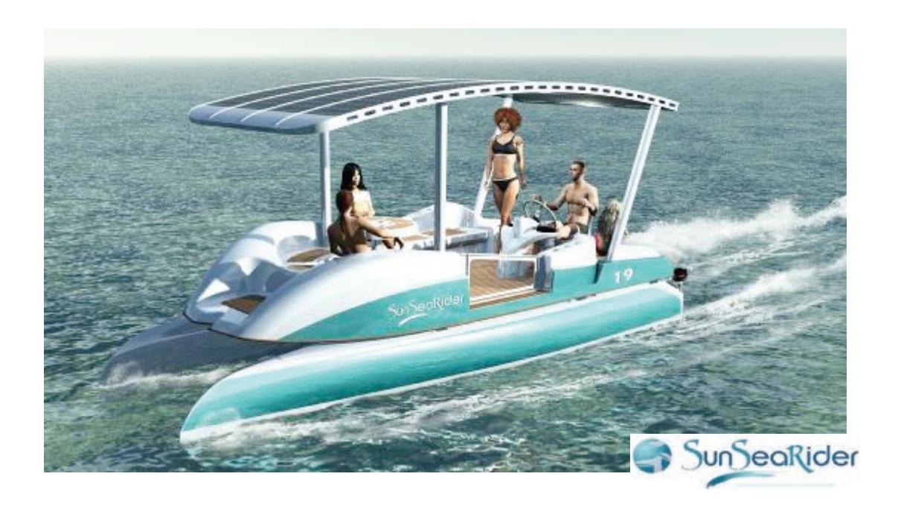

### **1. MISE EN SITUATION**

### **1.1. Le contexte général**

Un des enjeux majeurs de la COP21, qui s'est tenue en 2015 à Paris, est de limiter le dérèglement climatique, en agissant notamment sur la consommation d'énergie, la réduction des gaz à effet de serre…

Le secteur des transports représente plus de 27 % des émissions françaises de gaz à effet de serre. L'utilisation des énergies dites « propres » constitue donc un réel enjeu en termes de développement durable.

### **1.2. Le SunSeaRider**

La société Polycreatis conçoit et produit des catamarans solaires et autonomes, appelés SunSeaRider, destinés aux collectivités locales, aux services portuaires ou à la location de plaisance.

Cette invention a d'ailleurs reçu la médaille d'or du concours Lépine européen en 2013, ainsi que le prix des écotrophées félicitant l'entreprise pour sa démarche écoresponsable en 2015.

*Figure 1 : logo des écotrophées* 

Ces catamarans permettent de se déplacer sur des lacs ou rivières, lorsque les conditions météorologiques sont clémentes.

Polycreatis propose une gamme de trois tailles de catamarans permettant d'accueillir jusqu'à 8 passagers. Le plus grand modèle permet également un accès pour les personnes à mobilité réduite (PMR).

### **1.3. Description du catamaran SunSeaRider**

Le catamaran possède un toit, soutenu par quatre épontilles, couvert de panneaux solaires reliés à des batteries placées dans la coque centrale du catamaran (figures 2, 3 et 4). Ces dernières peuvent être chargées directement par les panneaux solaires, ou, si l'ensoleillement est insuffisant, par une prise électrique à quai. La propulsion est réalisée par deux moteurs et deux hélices.

L'armature du catamaran est une structure mécanosoudée en alliage d'aluminium et ses deux flotteurs sont réalisés en matériaux composites (voir annexe A1).

### **Toit partiellement couvert de panneaux solaires**

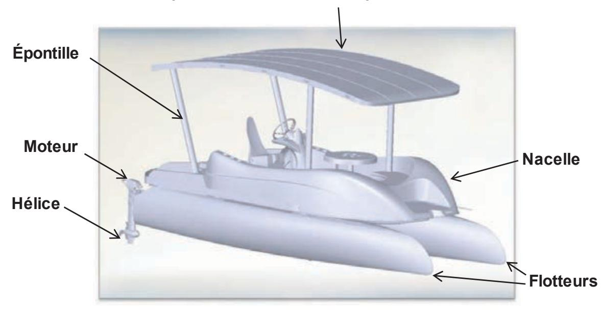

*Figure 2 : description du catamaran SunSeaRider*

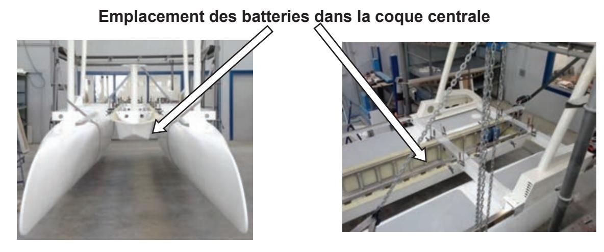

*Figure 3 : vue de face de la coque centrale Figure 4 : vue de dessus - catamaran* 

*sans la nacelle*

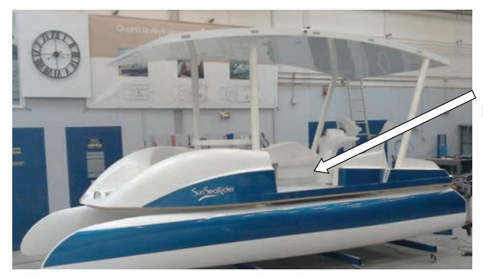

accès passagers et personne à mobilité réduite – PMR – (porte manquante)

*Figure 5 : accès au catamaran* 

### **1.4. Problématiques du sujet**

Les panneaux solaires, permettant la charge des batteries, sont posés sur le toit du catamaran. Étant donnée la grande surface de prise au vent, afin de garantir la navigabilité du catamaran, il est important de vérifier le non-chavirement par grand vent mais aussi la tenue des épontilles (barres de maintien du toit).

L'utilisation des panneaux solaires seuls (sans les batteries) permet le déplacement du catamaran à une vitesse minimale. C'est pourquoi, une étude portera sur la vitesse de croisière minimale imposée par le cahier des charges.

De plus, le constructeur souhaite responsabiliser le skippeur afin qu'il adopte une conduite écoresponsable qui optimise sa consommation énergétique : l'information provenant d'un GPS lui permettra de déterminer sa réserve énergétique et des affichages lumineux l'informeront de sa consommation instantanée.

Le sujet sera composé des parties suivantes permettant de vérifier :

- l'accessibilité des personnes à mobilité réduite au catamaran ;
- la stabilité du catamaran ;
- la tenue mécanique des épontilles ;
- l'autonomie énergétique du catamaran ;
- l'intégration d'un système de localisation en vue d'inciter à une navigation « écoresponsable ».

La dernière partie, **indépendante** des précédentes, concerne la mise en place d'une séquence pédagogique. **Il est conseillé de consacrer 1,5 h à cette partie**.

**Question 1**. Polycreatis a reçu le prix « le coup de cœur du jury » des écotrophées 2015 qui récompense les entreprises ayant une démarche écoresponsable dans la conception et la réalisation de leurs produits.

**Préciser,** en quatre lignes maximum, les principales raisons pouvant justifier l'obtention de ce prix.

### 2. ACCESSIBILITÉ AUX PERSONNES À MOBILITÉ RÉDUITE AU CATAMARAN

Objectif : vérifier la pente de la rampe d'accès au catamaran.

L'entreprise Polycreatis souhaite respecter la réglementation d'accessibilité pour les personnes à mobilité réduite, décrite dans l'annexe A2 (exigence Id 2.2). Pour cela, une porte de largeur suffisante (figure 5) et une rampe amovible placée entre le catamaran et le quai permettent l'embarquement d'un fauteuil roulant (figure 6).

La pente de la rampe d'accès au catamaran dépend de l'enfoncement H dans l'eau de celui-ci, de la hauteur du quai  $H_{\text{quai}}$  par rapport à la surface de l'eau et de la longueur de la rampe  $L_{\text{rampe}}$ .

Pour calculer la valeur de pente maximale, on supposera que la personne à mobilité réduite embarque en dernier, le catamaran étant déjà chargé de sept passagers.

### Données et hypothèses :

- problème supposé plan dans le plan  $(O, \vec{y}_O, \vec{z}_O)$ ;
- le repère R<sub>O</sub> (O,  $\vec{y}_O$ ,  $\vec{z}_O$ ) est supposé galiléen ;
- masse du catamaran seul M = 1 030 kg;
- masse d'un passager m = 90 kg ;
- poids total du catamaran et des passagers réparti uniformément, sa résultante est appliquée au centre de gravité G du catamaran ;
- accélération de la pesanteur g = 9,81 m·s<sup>-2</sup> et  $\vec{g}$  = -g $\vec{z}_0$
- masse volumique de l'eau de mer ρ<sub>eau</sub> = 1 000 kg⋅m<sup>-3</sup>;
- longueur du flotteur L<sub>flotteur</sub> = 6 m ;
- largeur moyenne du flotteur a<sub>flotteur</sub> = 0,5 m;
- hauteur du flotteur H<sub>flotteur</sub> = 0,75 m;
- hauteur du plancher du catamaran H<sub>plancher</sub> = 0,05 m;
- hauteur d'immersion du flotteur H (à déterminer);
- hauteur du quai H<sub>quai</sub> = 0,6 m;
- longueur de la rampe L<sub>rampe</sub> = 1,5 m.

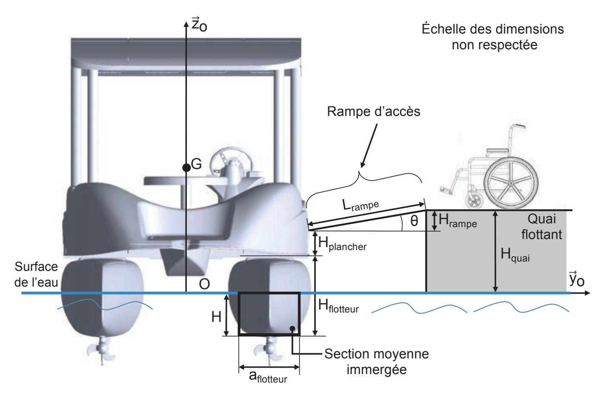

Figure 6 : paramétrage pour le calcul de la pente de la rampe d'accès

Notations : le torseur de l'action mécanique de i sur j au point A dans le repère R sera noté

$$\left\{T_{i\rightarrow j}\right\} = \left\{\overrightarrow{R}_{i\rightarrow j}\right\}_{A} = \left\{\begin{matrix}X_{ij} & L_{ij}\\Y_{ij} & M_{ij}\\Z_{ij} & N_{ij}\end{matrix}\right\}_{A \ R}$$

**Question 2. Exprimer** le torseur de l'action mécanique du poids, noté  $\{T_{poids \rightarrow catamaran}\}$ , exprimé au centre de gravité G du catamaran lorsque celui-ci est chargé avec sept passagers.

**Question 3.** En étudiant l'équilibre du catamaran avec sept passagers, **déterminer** la poussée d'Archimède sur chaque flotteur R<sub>archimède</sub>.

Sachant que la poussée d'Archimède est égale au poids du volume V<sub>eau</sub> d'eau déplacé, **en déduire** la valeur du volume d'eau déplacé V<sub>eau</sub> par un flotteur du catamaran.

**Question 4.** La section immergée d'un flotteur étant variable, on la supposera rectangulaire et identique sur toute la longueur du flotteur conformément à la représentation de la figure 6.

**Déterminer** la hauteur d'immersion H.

**Question 5. En déduire**, dans la configuration de la figure 6, l'angle  $\theta$  en degré entre la rampe d'accès et l'horizontale.

**Conclure** quant au respect de l'exigence Id 2.2 (La pente maximale de la rampe d'accès au catamaran doit être inférieure à 10 %).

### 3. STABILITÉ DU CATAMARAN

### Objectif : vérifier la stabilité du catamaran SunSeaRider par grand vent.

Le catamaran appartient à la catégorie D de conception des bateaux :

« Catégorie attribuée au navire de plaisance pour la navigation en eaux protégées, conçus pour des voyages dans des eaux côtières protégées, des baies de petites dimensions, des petits lacs, rivières et canaux, au cours desquels le vent peut atteindre la force 4 et les vagues une hauteur significative jusqu'à 0,3 mètre, avec des vagues occasionnelles, causées par exemple par des bateaux de passage, d'une hauteur de 0,5 mètre. »

Source : article 240-2.02 de l'arrêté du 4 décembre 2009.

On souhaite vérifier la stabilité du catamaran dans les conditions les plus défavorables de navigation et lorsqu'il n'y a qu'un seul passager à bord. Ce cas de figure est représenté sur la figure 7. Une houle incline le catamaran et le vent peut le faire basculer.

### Données et hypothèses :

- le problème est supposé plan dans le plan  $(O, \vec{y}_O, \vec{z}_O)$ ;
- on fera une étude à la limite du basculement en négligeant les effets dynamiques du vent et de la houle sur le catamaran;
- le vent latéral de force 4 (23 nœuds) provogue sur le catamaran
  - une action mécanique aérodynamique modélisée par un glisseur au point C et dont la résultante notée F

    aéro est telle que F

    aéro = F

    aéro Z

    c;
     une action mécanique latérale sur le flanc du flotteur modélisée par
  - une action mécanique latérale sur le flanc du flotteur modélisée par une pression linéique uniforme telle que  $\vec{q}_{latéral} = -q_{latéral}\vec{y}_C$  avec  $q_{latéral} = 860 \text{ N} \cdot \text{m}^{-1}$  répartie sur une hauteur  $H_{latéral} = 1000 \text{ mm}$ ;
- le poids de l'ensemble (catamaran + passager) sera modélisé par un glisseur en G tel que  $\vec{P}$  = -P  $\vec{z}_O$  avec P = 11 000 N ;
- seul le flotteur B reste immergé. L'action mécanique de l'eau, modélisée par un glisseur en B, n'est pas représentée sur la figure 7;
- l'inclinaison maximale du catamaran due à une vague est  $\alpha = 10^{\circ}$ ;
- le repère fixe est noté  $R_0$  (0,  $\vec{x}_0$ ,  $\vec{y}_0$ ,  $\vec{z}_0$ );
- le repère lié au catamaran est noté  $R_C(G, \vec{x}_C, \vec{y}_C, \vec{z}_C)$  et  $(\vec{y}_O, \vec{y}_C)$ =  $(\vec{z}_O, \vec{z}_C) = \alpha$ ;
- l'équivalence des vitesses est 1 nœud = 1,8 km·h<sup>-1</sup>;
- la surface projetée du toit, notée  $S_{toit}$ , sur le plan  $(C, \vec{x}_C, \vec{y}_C)$  vaut  $S_{toit} = 11 \text{ m}^2$ ;
- les positions des points et les dimensions (en mm) sont
  - $\overrightarrow{BA} = a \overrightarrow{y}_C + b \overrightarrow{z}_C$ ;
  - $\overrightarrow{BG} = \overrightarrow{c} \overrightarrow{y}_C + \overrightarrow{d} \overrightarrow{z}_C$ ;
  - $\overrightarrow{BC} = e \overrightarrow{y}_C + f \overrightarrow{z}_C$ ;

a = 1 950, b = 600, c = 800, d = 1 460, e = 1 550, f = 2 574.

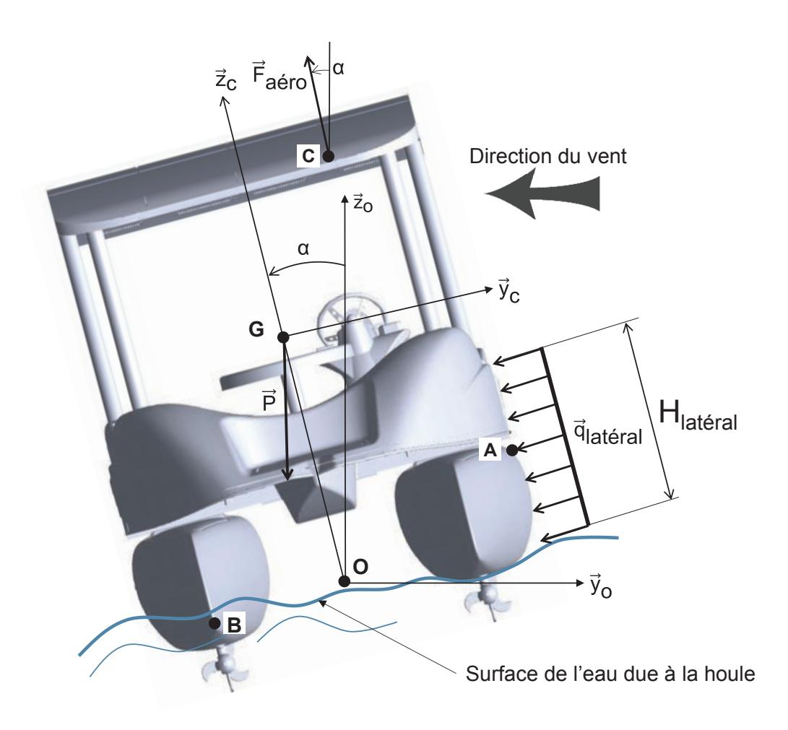

*Figure 7 : paramétrage pour l'étude de la stabilité du catamaran*

L'effort aérodynamique sur le toit provient de la pression du vent, appelée « pression dynamique de pointe ».

Cette pression peut, en première approximation, être déterminée à partir de l'Eurocode 1 utilisé dans les calculs des structures au vent. L'Eurocode 1 donne l'expression de cette pression dynamique de pointe qp(z) à une hauteur z induite par la vitesse moyenne d'un vent :

$$q_p(z) = c_p \cdot c_e(z) \cdot q_b$$

### avec :

- cp coefficient prenant en compte l'inclinaison du catamaran par rapport à l'horizontal cp = 1,5 ;
- ce(z) coefficient d'exposition en mer. À 2 m d'altitude, ce(2) = 2 ;
- qb pression dynamique de référence du vent en N·m-2 telle que qb = 0,5·ρair·vb2 avec
  - ρair masse volumique de l'air ρair = 1,3 kg·m-3 ;
  - vb vitesse de vent en m·s-1.

**Question 6. Calculer** la pression dynamique de pointe qp(z = 2) en N·m-2 générée par un vent sur le toit du catamaran (à z = 2 m) lorsqu'il souffle à 23 nœuds.

**Question 7.** En supposant que la pression dynamique de pointe s'exerce sur la surface projetée du toit, **déterminer** l'effort aérodynamique F<sub>aéro</sub>. **Faire** l'application numérique.

**Question 8. Déterminer** l'effort latéral sur le catamaran F<sub>latéral</sub> appliqué au point A, milieu du flanc latéral. **Faire** l'application numérique.

**Question 9. Effectuer** le bilan des actions mécaniques agissant sur le catamaran de façon littérale. Pour les actions en A, G et C **préciser** les valeurs numériques.

**Question 10. Calculer** la somme des moments des actions mécaniques au point B, **vérifier** l'exigence ld 3.1 de non basculement (Le catamaran ne doit pas basculer lorsqu'il y a des vagues de 0,5 m et un vent de 23 nœuds).

Remarque : une étude complémentaire réalisée à l'aide d'un logiciel de mécanique des fluides permettra de valider le non-basculement du catamaran en tenant compte des effets dynamiques du vent et de la houle sur le catamaran.

### 4. TENUE MÉCANIQUE DE LA STRUCTURE PORTEUSE DU TOIT

**Objectif** : vérifier la résistance de la structure porteuse du toit du catamaran.

Contrairement à l'étude précédente, le catamaran est ici soumis à des rafales de vent qui provoquent un effort sur le toit tendant à le plaquer sur la mer. Cet effort est repris par la structure du catamaran via les quatre épontilles (voir figure 8). L'étude consistera à vérifier la tenue de l'ancrage sur la nacelle d'une épontille inclinée.

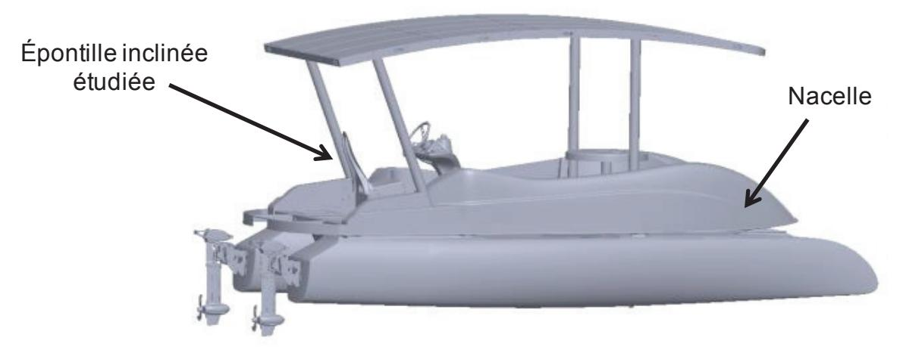

Figure 8 : localisation de l'épontille étudiée

### Hypothèses:

- l'épontille est soudée au point O à la nacelle du catamaran (encastrement, voir figure 9);
- le vent et le poids du toit exercent une action mécanique résultante sur l'épontille modélisée par un glisseur  $\vec{F}_{ext}$  = - $F_{ext}$   $\vec{z}_{O}$  avec  $F_{ext}$  = 1 210 N ;
- le repère R<sub>C</sub> (O,  $\vec{x}_C$ ,  $\vec{y}_C$ ,  $\vec{z}_C$ ) est lié au catamaran ;
- le repère R<sub>E</sub> (O,  $\vec{x}_E$ ,  $\vec{y}_F$ ,  $\vec{z}_E$ ) est lié à l'épontille ;

- l'angle d'inclinaison de l'épontille est β = 20°;
- l'épontille est réalisée en alliage d'aluminium E 6061 (AlMg1SiCu) de limite élastique Re = 241 MPa;
- l'épontille est un tube creux de diamètre extérieur D = 100 mm, d'épaisseur e = 2 mm, et de longueur L = 1 600 mm;
- la masse de l'épontille est négligée.

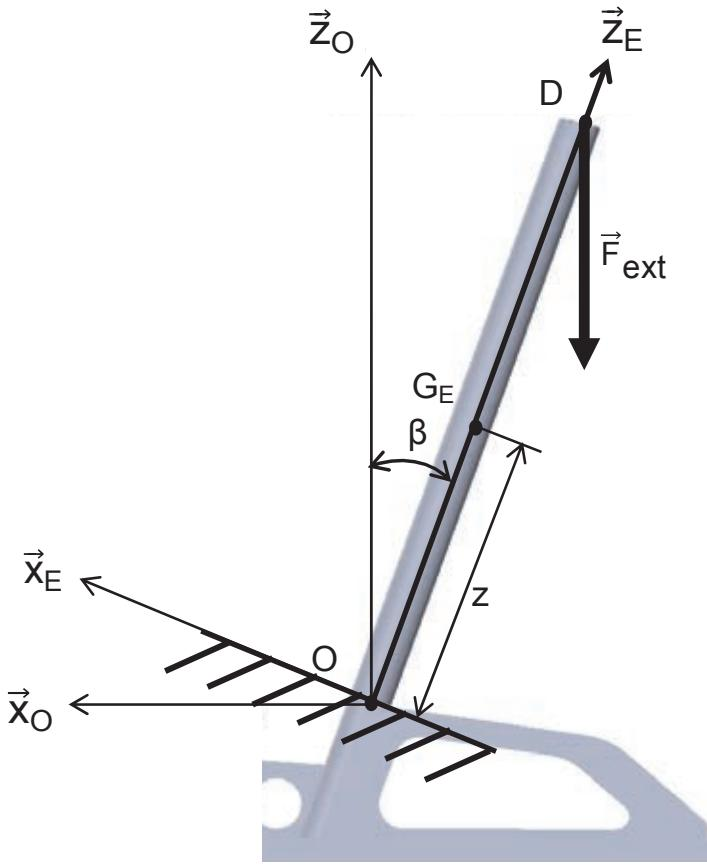

Figure 9 : modèle de l'épontille

**Question 11. Indiquer** à quel(s) type(s) de sollicitation est soumise l'épontille étudiée. **Justifier** la réponse à l'aide d'un schéma explicatif.

**Question 12. Déterminer** l'expression littérale des éléments de réduction du torseur de cohésion en G<sub>E</sub> en fonction de l'abscisse z le long de l'épontille. **Faire** l'application numérique pour les valeurs maximales.

**Question 13.** Sur les figures du document réponse DR1, **tracer** l'allure des répartitions des contraintes normales dans la section droite passant par G<sub>E</sub> pour chaque sollicitation. Remarque : un tracé qualitatif est demandé (pas d'échelle sur le DR1).

**Question 14.** En utilisant l'annexe A5, **calculer** la contrainte normale maximale subie par l'épontille. **Conclure** quant aux exigences ld 4.1 (Lors du calcul de la contrainte maximale, le coefficient de sécurité doit être au minimum de 3) et 4.2 (Le catamaran doit résister à la corrosion).

Question 15. Un modèle numérique et un calcul par éléments finis ont permis d'établir la répartition des contraintes dans l'épontille (voir figure 10). Comparer les

résultats théoriques et ceux de la simulation numérique. **Conclure** et **justifier** les éventuels écarts.

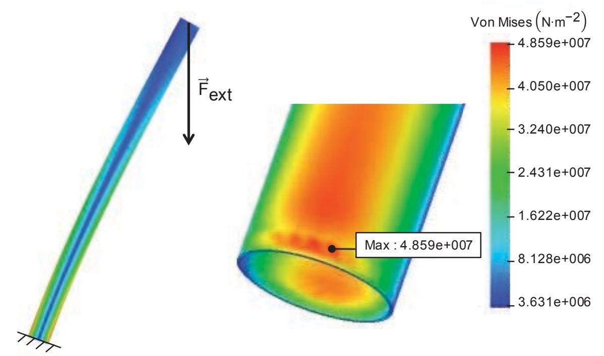

*Figure 10 : répartition des contraintes subies par l'épontille en vue globale et zoomée*

### **5. AUTONOMIE ÉNERGÉTIQUE DU CATAMARAN**

La conception du catamaran permet deux types de navigation : avec ou sans utilisation des batteries. L'objectif de la première étude est de vérifier la vitesse minimale de navigation garantie par le constructeur, sans utilisation des batteries. L'objectif de la seconde étude est de valider le dimensionnement de la batterie lorsque celle-ci est utilisée.

*Objectif 1 : vérifier la vitesse minimale du catamaran lorsqu'il n'utilise pas les batteries (exigence Id 1.3 – En septembre, par beau temps, la vitesse de croisière du catamaran, sans puiser dans les batteries, doit être au minimum de 1 nœud).*

La source d'énergie électrique, nécessaire pour alimenter les moteurs et les hélices ainsi que les instruments de navigation dépend, de la vitesse du catamaran (voir annexe A3) :

- cas 1 si la vitesse du catamaran est supérieure à la vitesse seuil, notée Vseuil, alors l'énergie nécessaire provient des panneaux solaires et des batteries de stockage ;
- cas 2 si la vitesse du catamaran est inférieure à la vitesse seuil, alors l'énergie provient uniquement des panneaux solaires. Le surplus d'énergie produit est stocké dans les batteries ;
- cas 3 si la vitesse du catamaran est égale à la vitesse seuil, alors l'énergie provient uniquement des panneaux solaires et les batteries ne se rechargent pas.

### *Hypothèses :*

on étudie le catamaran dans le cas 3 ;

- la sortie en catamaran a lieu à Marseille, en septembre, de 11h30 à 12h30, par ciel clair ;
- la puissance consommée par les instruments de navigation est de Pinstruments = 10 W ;
- les différents rendements (panneau, régulateur, moteur) sont donnés sur le diagramme partiel de définition des blocs (annexe A1) ;
- en régime établi, l'effort de poussée pour chaque hélice vaut Fpoussée = 750 N ;
- l'équivalence des vitesses est 1 nœud = 1,8 km·h-1 ;
- la surface d'un panneau solaire est Spanneau avec Spanneau = 0,57 m2 ;
- il y a n panneaux solaires, avec n = 16.

**Question 16.** À partir de l'annexe A4, **relever** la puissance moyenne Pmoy reçue par mètre carré dans les conditions de navigation décrites dans les hypothèses.

**Question 17. Calculer** la valeur de la puissance reçue Preçue par l'ensemble des panneaux solaires dans les conditions de navigation décrites dans les hypothèses. **En déduire** la valeur de la puissance produite Pproduite par l'ensemble des panneaux solaires.

**Question 18. Calculer** la puissance Prégulateur distribuée par le régulateur. En déduire la puissance Pmot disponible à la sortie des moteurs.

**Question 19. En déduire** la valeur de la vitesse Vseuil lorsque le catamaran navigue sans utiliser les batteries (cas 3 annexe A3). **Conclure** quant à l'exigence Id 1.3 (En septembre, par beau temps, la vitesse de croisière du catamaran, sans puiser dans les batteries, doit être au minimum de 1 nœud).

*Objectif 2 : vérifier le dimensionnement des batteries lorsque le catamaran parcourt 20 km en effectuant des parcours types.* 

On se place dans les cas 1 et 2 de l'annexe A3, c'est-à-dire que les batteries peuvent recevoir et restituer de l'énergie.

Lors d'un parcours type (5 km en 30 min), un relevé expérimental a permis d'établir l'histogramme de distribution de puissance au niveau des batteries.

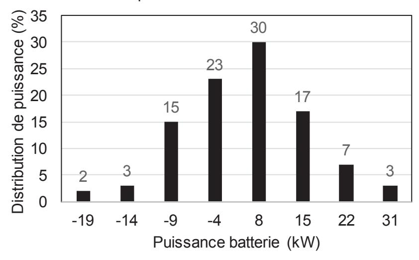

*Figure 11 : histogramme de distribution de puissance lors du parcours type* 

Cet histogramme représente le pourcentage de temps de parcours en fonction des

différentes valeurs de puissance échangée au niveau des batteries (pour la propulsion et les instruments). Par exemple, la puissance fournie par les batteries a été de 15 kW pendant 17 % du parcours et la puissance reçue par les batteries a été de 19 kW pendant 2 % du parcours.

### *Hypothèses :*

- le catamaran va parcourir 20 km en effectuant plusieurs fois le parcours type ;
- la distribution des puissances lors du parcours type est celle donnée en figure 11 ;
- le parcours type est de 5 km effectué en 30 minutes.

**Question 20.** À partir de l'annexe A1, **déterminer** Eembarquée, l'énergie embarquée totale dans les batteries sur le catamaran. **Faire** l'application numérique, exprimer le résultat en kWh.

**Question 21. Interpréter** le signe des puissances relevées sur l'histogramme de distribution de puissance de la figure 11.

**Question 22.** À partir de cet histogramme, **calculer** Enécessaire, l'énergie nécessaire pour effectuer un parcours de 20 km.

Conclure quant au respect des exigences Id 1.1 et 1.2 de l'annexe A2.

### **6. SÉCURITÉ ET ÉCORESPONSABILITÉ**

Le catamaran est maintenant destiné à la location de plaisance.

Suite à de nombreux incidents d'utilisateurs bloqués en mer par manque d'énergie suffisante pour le retour, le gestionnaire souhaite installer un système qui sécurise la navigation du catamaran. De plus, soucieux des enjeux énergétiques, il désire sensibiliser les utilisateurs au respect de l'environnement en les incitant à adopter une écoconduite.

*Objectif 1 : informer l'utilisateur de la réserve énergétique du catamaran en temps réel.* 

À partir des latitudes et longitudes obtenues grâce au GPS, on peut définir les coordonnées du catamaran (xc, yc) dans un repère donné. Au préalable, le gestionnaire du catamaran a saisi les coordonnées du port (xp, yp) dans le GPS. Les coordonnées sont exprimées en km.

**Question 23. Écrire** une fonction notée *calcul\_d\_max,* en langage python ou C++, qui :

- prend en arguments
  - la charge restante des batteries Cr (en A·h) ;
  - la consommation instantanée des batteries (en A·h·min-1), notée Ci ;
- calcule la distance maximale, notée d\_max, que le catamaran peut parcourir en restant à une vitesse V avec V= 5 nœuds ;
- retourne la valeur d\_max que peut parcourir le catamaran en km.

**Question 24. Écrire** une fonction, notée *calcul\_d*, en langage python ou C++, qui :

prend en arguments les coordonnées GPS du catamaran (xc, yc) ;

- calcule la distance en ligne droite, notée d, entre le quai (xp, yp) et le catamaran ;
- compare la distance d du catamaran au quai et la distance d\_max
  - si elle est inférieure à d\_max affiche « autonomie suffisante » ;
  - sinon affiche « autonomie insuffisante ».

### **Question 25. Compléter** le logigramme donné en document réponse DR2.

### *Objectif 2 : inciter l'utilisateur à l'écoconduite.*

L'écoconduite correspond à une navigation au cours de laquelle les batteries ne sont pas utilisées (cas 2 et 3 de l'annexe A3) et le retour à quai se fait avec les batteries chargées. C'est aussi, pour le gestionnaire, le moyen de diminuer le nombre de cycles de charge - décharge et donc de préserver les batteries en augmentant leur durée de vie.

Le gestionnaire a mis en place un système permettant d'informer en temps réel le pilote sur sa consommation énergétique. Des voyants lumineux sont installés sur le tableau de bord du catamaran. Ces derniers s'allument en fonction de la vitesse de déplacement V comme décrit ci-dessous :

- si V < 0,95·Vseuil , alors un voyant vert s'allume ;
- si V ∈ [0,95·Vseuil ; 1,05·Vseuil], alors un voyant bleu s'allume ;
- si V > 1,05·Vseuil , alors un voyant rouge s'allume.

Un calculateur détermine à chaque instant la vitesse Vseuil en fonction des conditions météorologiques.

Le temps d'allumage de chaque voyant est stocké dans une mémoire. Au retour à quai du catamaran, le gestionnaire exploite ces données pour évaluer la conduite de l'utilisateur. Il récompense les « bons utilisateurs » en leur offrant un temps de navigation supplémentaire, noté temps offert (toffert). Ce temps offert correspond à un pourcentage du temps de navigation total effectué (ttotal) La récompense est inversement proportionnelle au temps d'allumage du voyant rouge (voir figure 12) : plus la conduite est écoresponsable (faible utilisation des batteries), plus l'utilisateur est récompensé.

### Coefficient du temps offert (toffert)

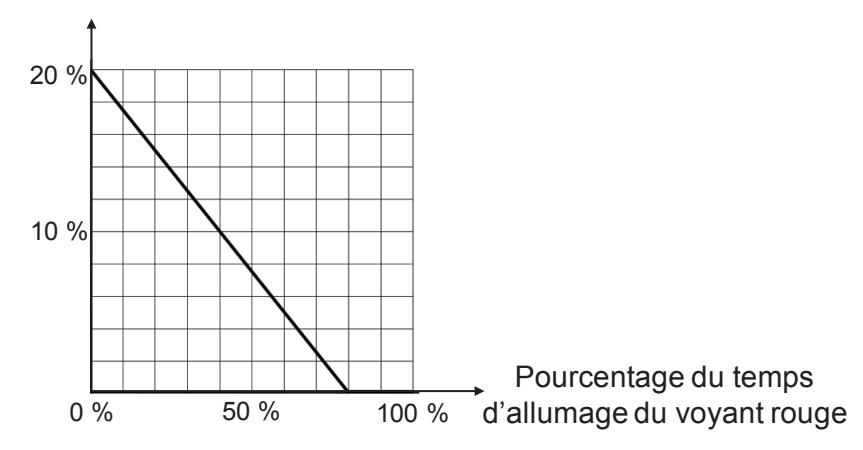

*Figure 12 : courbe permettant le calcul du temps offert en fonction du pourcentage de temps d'allumage du voyant rouge*

**Question 26.** On fait l'hypothèse que Vseuil est constante (sortie en mer par ciel clair). **Compléter** les chronogrammes du document réponse DR3 qui représentent les états des différents voyants en fonction d'un profil de vitesse du catamaran.

**Question 27.** À partir du chronogramme du DR3, **déterminer** le pourcentage du temps d'allumage du voyant rouge. **En déduire** le temps offert, noté toffert, pour sa prochaine location.

### **7. OPTIMISATION DU CATAMARAN SUNSEARIDER**

**Question 28.** L'étude énergétique menée précédemment sur le catamaran solaire a été réalisée pour une zone géographique aux conditions climatiques favorables, dans le sud de la France. **Proposer** des solutions complémentaires, s'inscrivant dans une démarche de développement durable, pour la production d'énergie nécessaire à une utilisation dans des régions moins ensoleillées.

### **8. PARTIE PÉDAGOGIQUE**

Pour traiter cette partie, il est fortement recommandé de lire la première partie du sujet consacrée à l'étude du catamaran SunSeaRider et l'ensemble des ressources associées.

Les descriptions pédagogiques proposées doivent conduire le candidat à formaliser l'organisation d'une séquence pédagogique qui s'inscrit dans le cycle terminal sciences et technologies de l'industrie et du développement durable (STI2D) en enseignement technologique transversal. Des extraits du programme STI2D Cycle terminal, issus du Bulletin Officiel spécial n°3 du 17 mars 2011 sont donnés dans le document de l'annexe A6.

### **Exploitation du support SunSeaRider**

Le programme de STI2D se caractérise par l'intégration du développement durable et de contenus scientifiques et technologiques organisés autour de l'approche globale matière – énergie – information.

**Question 29.** Dans le document réponse DR4 sont rappelées les principales études proposées dans la première partie du sujet. À partir des documents de l'annexe A6, pour chacune des trois études :

- **identifier** une compétence attendue pouvant être travaillée ;
- **identifier** les savoirs associés correspondants.

**Justifier** la pertinence du choix du support SunSeaRider pour une exploitation dans le cadre de l'enseignement technologique transversal en STI2D.

### **Organisation d'une progression**

L'équipe pédagogique a retenu neuf centres d'intérêt (CI-1 à CI-9) dans lesquels ont été répartis les éléments du programme mobilisables conformément au tableau de l'annexe A7.

La progression de l'enseignement technologique transversal élaborée par l'équipe pédagogique est présentée dans le document de l'annexe A8.

Question 30. Déterminer et justifier le choix retenu par l'équipe pédagogique en termes de durée et de répartition des séquences pédagogiques de l'année de première STI2D.

### Élaboration d'une séquence d'enseignement

L'emploi du temps de la classe de première STI2D est donné ci-dessous.

|                                            | Lundi                            | Ма     | ırdi       | Mercredi      | Jei   | udi        | Vend        | dredi     |
|--------------------------------------------|----------------------------------|--------|------------|---------------|-------|------------|-------------|-----------|
| 8h20                                       |                                  | Frar   | nçais      | ETT<br>Prof2  | PC    | Maths      | Fran        | ıçais     |
| 9h15                                       | PC                               | L۱     | <b>/</b> 1 | AP            | G1    | G2         | LV2/A<br>G2 | LV1/B     |
| 10h20 Français AP Ens. Spé EE-AC G1 G2 FTT |                                  |        |            |               |       |            |             |           |
| 11h15                                      | ETT<br>Prof 1                    | LV 1   | LV2        | Prof1/Prof2   | G1    | G2         |             | FT<br>of2 |
| 12h15                                      |                                  |        | Pa         | ause méridien | ne    |            |             |           |
| 13h10                                      | 5 0 <i>i</i>                     | E.     | гт         | HG            | E1    | гт         | Ma          | ths       |
| 14h05                                      | Ens. Spé<br>EE-AC<br>Prof1/Prof2 | Prof1. | /Prof2     | 110           | Prof1 | /Prof2     | IVIA        | u15       |
| 15h10                                      | . 15 1012                        | -      | ne         |               | ET    | LV         | Fran        | ıçais     |
| 16h05                                      | HG/A<br>G1                       | E      | PS         |               |       | HG/B<br>G2 | Ľ۱          | /1        |

17h00

PC : physique – chimie ETT : enseignement technologique transversal

HG : histoire – géographie Ens. Spé. : enseignement spécifique de

LV : langue vivante spécialités

AP : accompagnement personnalisé

### Hypothèses de travail :

Une classe est composée d'élèves de deux enseignements spécifiques de spécialité. Les séances d'enseignement technologique transversal sont systématiquement prises en charge en classe entière par un ou deux professeurs et se déroulent dans un laboratoire de technologie équipé de 15 ordinateurs reliés au réseau pédagogique et d'un vidéoprojecteur interactif. Les systèmes sont également disponibles dans cette salle.

La grille de préparation de la séquence n°3 proposée pour la classe de première STI2D est détaillée dans l'annexe A9.

### Hypothèses de travail retenues par l'équipe pédagogique :

- l'étude de dossier 1 s'appuie sur deux supports différents, elle a pour objectif d'illustrer le cours 1 ;
- l'étude de dossier 2 a pour objet la démarche de conception du SunSeaRider ;
- l'étude de dossier 3 a pour objet l'optimisation de la liaison entre l'épontille et le toit solaire du SunSeaRider ;

- les activités pratiques 1 et 2 ont pour objet l'étude de deux moyens de production d'électricité pour répondre à la question « SunSeaRider peut-il être transformé en WindSeaRider ? » (La production éolienne peut-elle remplacer la production photovoltaïque ?) ;
- les élèves doivent traiter les deux activités pratiques dont les 3 heures sont organisées en une heure de préparation et deux heures de manipulation et rédaction du compte rendu ;
- les séances d'enseignement technologique en langue vivante (ETLV) s'appuieront sur les supports utilisés en enseignement technologique transversal (ETT).

**Question 31.** À partir de l'organisation des activités retenue pour la séquence n°3 décrite dans le document de l'annexe A9 et de la progression présentée dans le document de l'annexe A8, **préciser** pour chaque activité :

- les éléments du programme travaillés ;
- les éléments de contexte et l'organisation de cette séance.

**Question 32. Proposer** l'organisation hebdomadaire des séances de la séquence n°3 en les répartissant dans l'emploi du temps de la classe de première STI2D proposé ci-dessus :

- sur le document réponse DR5, compléter le tableau « Organisation pratique de la séquence » en utilisant les abréviations précisées en bas du document ;
- sur copie, préciser l'objectif des différentes séances et décrire l'activité élève en précisant les démarches pédagogiques envisagées.

**Question 33.** Après avoir rappelé les différents types d'évaluation, **proposer** les modalités d'évaluation de la séquence n°3. **Préciser** pour la séance portant sur l'étude de dossier 3 les éléments d'évaluation.

**Question 34. Proposer** un exemple d'activité en enseignement technologique en langue vivante (ETLV) pour l'activité d'étude de dossier 2 « Une alternative au canot à moteur thermique » de la séquence n°3 de l'annexe A9. Les compétences évaluées dans le cadre de la seconde partie de l'épreuve ETLV du baccalauréat STI2D sont précisées dans le document de l'annexe A10.

### **DOCUMENTS ANNEXES**

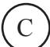

### **Document annexe A1 : diagramme partiel de définition des blocs du SunSeaRider**

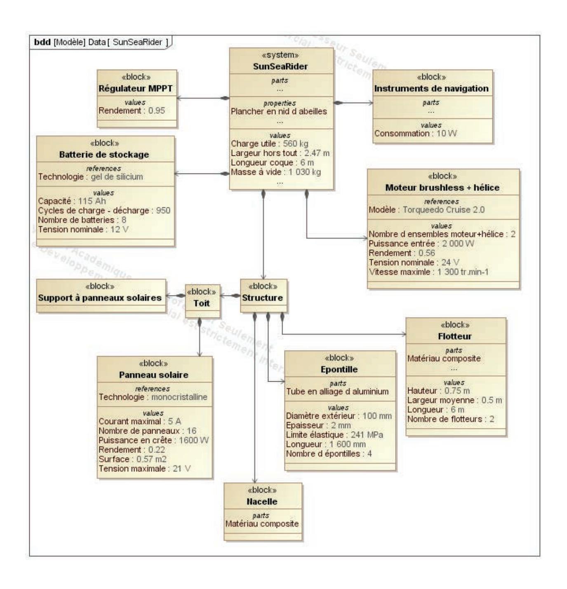

### **Document annexe A2 : diagramme partiel des exigences du SunSeaRider**

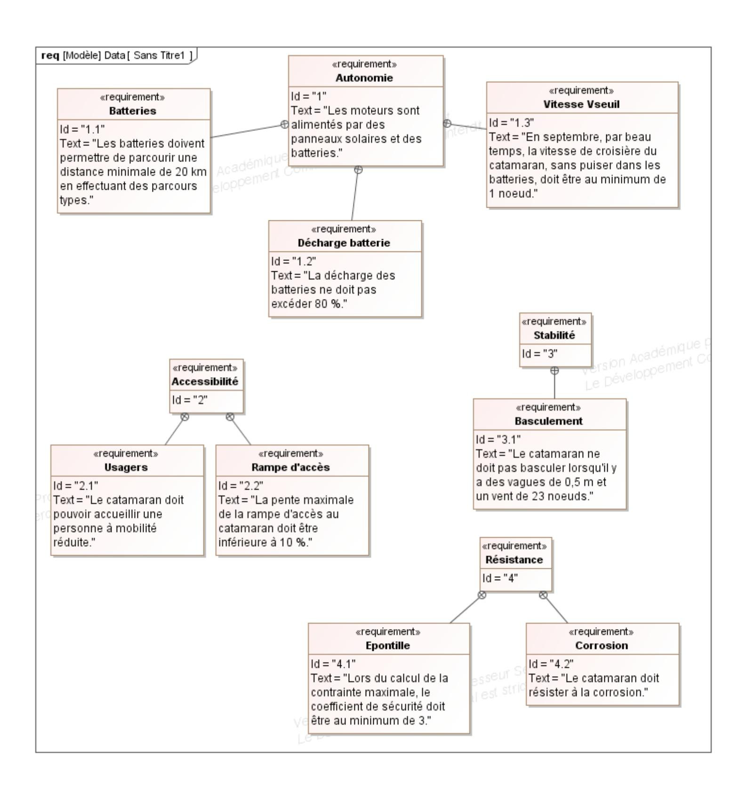

### **Document annexe A3 : distribution de l'énergie dans le catamaran**

**1) Le catamaran va à une vitesse V>Vseuil : l'énergie est puisée dans les batteries** 

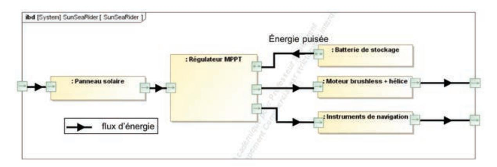

**2) Le catamaran va à une vitesse V<Vseuil : l'excès d'énergie est stockée dans les batteries** 

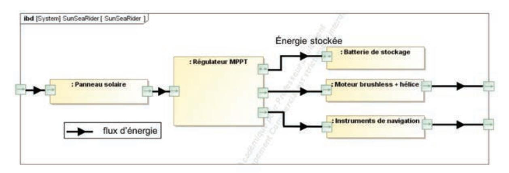

**3) Le catamaran avance à une vitesse V=Vseuil : non utilisation des batteries** 

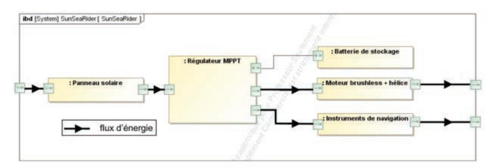

### Document annexe A4 : rayonnement solaire journalier moyen par ciel clair sur un panneau solaire

### Données :

- lieu Marseille (43°17'47" Nord, 5°22'11" Est);
- mois septembre ;
- inclinaison du panneau, 0 degré ;
- orientation du panneau, 0 degré ;
- source système d'information géographique photovoltaïque (http://re.jrc.ec.europa.eu/pygis/).

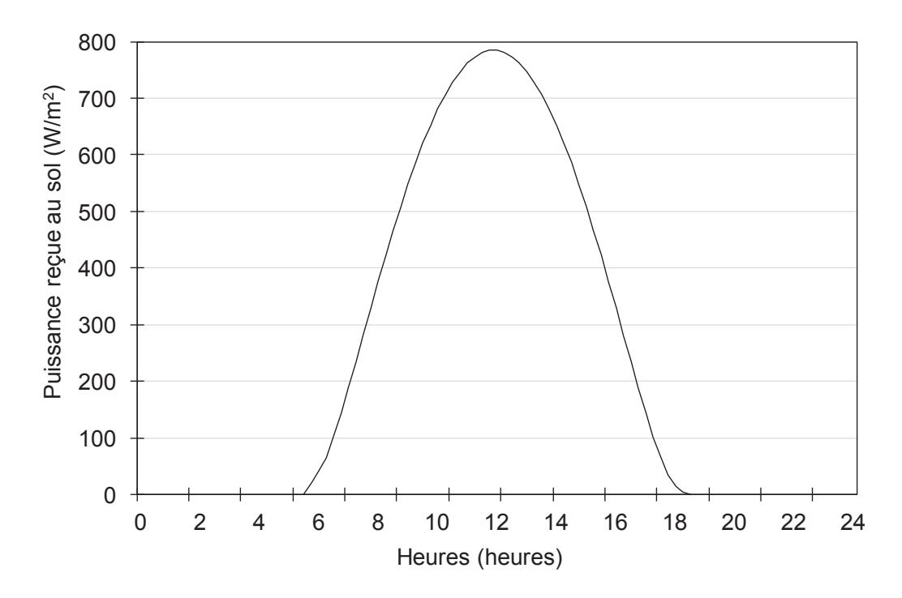

### Document annexe A5 : formulaires de résistance des matériaux

### Section circulaire

- Moment quadratique par rapport à l'axe  $(G,\vec{y})$ :  $I_{Gy} = \frac{\pi d^4}{64}$
- Moment quadratique par rapport à l'axe  $(G,\vec{z})$ :  $I_{Gz} = \frac{\pi d^4}{64}$

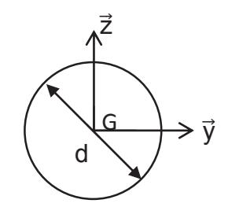

### Section rectangulaire

- Moment quadratique par rapport à l'axe  $(G, \vec{y})$ :  $I_{Gy} = \frac{bh^3}{12}$
- Moment quadratique par rapport à l'axe  $(G,\vec{z})$ :  $I_{Gz} = \frac{hb^3}{12}$

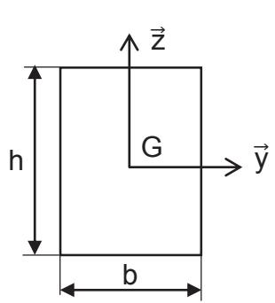

### **Document annexe A5 : formulaires de résistance des matériaux (suite)**

|                  | Relations entre<br>contraintes et<br>efforts intérieurs | Relations entre<br>contraintes et<br>déformations | Relations entre<br>déplacements et<br>efforts |
|------------------|---------------------------------------------------------|---------------------------------------------------|-----------------------------------------------|
| Traction pure    | N<br>σ<br>=<br>S                                        | σ<br>=<br>E∙ε                                     | N∙L0<br>ΔL =<br>E∙S                           |
| Cisaillement pur | T<br><br>=<br>S                                        | <br>G∙<br>=                                     |                                               |
| Flexion pure     | Mfz∙y<br>σ<br>=<br>-<br>IGz                             | σ<br>ε=<br>E                                      | E∙I∙y'' =<br>Mfz                              |

```
Avec : 
N, effort normal (N) ; 
T, effort tranchant (N) ; 
S, section (mm2) ; 
Mfz, moment fléchissant (N∙m) ; 
y, position du point M considéré dans la section droite (mm) ; 
IGz, moment quadratique (mm4) ; 
, contrainte normale (MPa) ; 
E, module d'Young (MPa) ; 
, déformation ; 
, contrainte de cisaillement (MPa) ; 
G, module de cisaillement (MPa) ; 
, angle de cisaillement
L, allongement (mm) ; 
L0, longueur initiale (mm)
```

### **Document annexe A6 : extrait du programme**

|                                     | Objectifs de formation                                                                                                         | Compétences attendues                                                                                                                                                                                                                                                                                                                                                                                                                                                 |
|-------------------------------------|--------------------------------------------------------------------------------------------------------------------------------|-----------------------------------------------------------------------------------------------------------------------------------------------------------------------------------------------------------------------------------------------------------------------------------------------------------------------------------------------------------------------------------------------------------------------------------------------------------------------|
| veloppement<br>Ible                 | O1 - Caractériser des systèmes privilégiant un usage raisonné du point de vue développement durable                            | CO1.1. Justifier les choix des matériaux, des structures d'un système et les énergies mises en œuvre dans une approche de développement durable CO1.2. Justifier le choix d'une solution selon des contraintes d'ergonomie et d'effets sur la santé de l'homme et du vivant                                                                                                                                                                                           |
| Société et développement<br>durable | O2 - Identifier les éléments<br>permettant la limitation de<br>l'impact environnemental d'un<br>système et de ses constituants | CO2.1. Identifier les flux et la forme de l'énergie, caractériser ses transformations et/ou modulations et estimer l'efficacité énergétique globale d'un système CO2.2. Justifier les solutions constructives d'un système au regard des impacts environnementaux et économiques engendrés tout au long de son cycle de vie                                                                                                                                           |
|                                     | O3 - Identifier les éléments<br>influents du développement d'un<br>système                                                     | CO3.1. Décoder le cahier des charges fonctionnel d'un système CO3.2. Évaluer la compétitivité d'un système d'un point de vue technique et économique                                                                                                                                                                                                                                                                                                                  |
| Technologie                         | O4 - Décoder l'organisation<br>fonctionnelle, structurelle et<br>logicielle d'un système                                       | CO4.1. Identifier et caractériser les fonctions et les constituants d'un système ainsi que ses entrées/sorties CO4.2. Identifier et caractériser l'agencement matériel et/ou logiciel d'un système CO4.3. Identifier et caractériser le fonctionnement temporel d'un système CO4.4. Identifier et caractériser des solutions techniques relatives aux matériaux, à la structure, à l'énergie et aux informations (acquisition, traitement, transmission) d'un système |
|                                     | O5 - Utiliser un modèle de<br>comportement pour prédire un<br>fonctionnement ou valider une<br>performance                     | CO5.1. Expliquer des éléments d'une modélisation proposée relative au comportement de tout ou partie d'un système CO5.2. Identifier des variables internes et externes utiles à une modélisation, simuler et valider le comportement du modèle CO5.3. Évaluer un écart entre le comportement du réel et le comportement du modèle en fonction des paramètres proposés                                                                                                 |
| Communication                       | O6 - Communiquer une idée, un<br>principe ou une solution<br>technique, un projet, y compris<br>en langue étrangère            | CO6.1. Décrire une idée, un principe, une solution, un projet en utilisant des outils de représentation adaptés CO6.2. Décrire le fonctionnement et/ou l'exploitation d'un système en utilisant l'outil de description le plus pertinent CO6.3. Présenter et argumenter des démarches, des résultats, y compris dans une langue étrangère                                                                                                                             |

### **Document annexe A6 : extrait du programme (suite)**

|                                     |                                                                                    |       | 1.1 Compétitivité et créativité | 1.2 Éco-conception | 2.1 Approche fonctionnelle<br>d'un système | 2.2 Les outils de<br>représentation | 2.3 Approche<br>comportementale | 3.1 Structures matérielles<br>et/ou logicielles | 3.2 Constituants d'un<br>système |
|-------------------------------------|------------------------------------------------------------------------------------|-------|---------------------------------|--------------------|--------------------------------------------|-------------------------------------|---------------------------------|-------------------------------------------------|----------------------------------|
| urable                              | Caractériser des systèmes<br>privilégiant un usage<br>raisonné du point de vue du  | CO1.1 | Х                               | Х                  |                                            |                                     |                                 | Х                                               |                                  |
| Société et<br>ppement d             | développement durable                                                              | CO1.2 | Х                               | Х                  |                                            |                                     |                                 |                                                 |                                  |
| Société et<br>développement durable | Identifier les éléments<br>permettant la limitation de<br>l'impact environnemental | CO2.1 |                                 | Х                  |                                            |                                     |                                 |                                                 | Х                                |
| déve                                | d'un système et de ses<br>constituants                                             | CO2.2 | Х                               |                    |                                            |                                     |                                 | Х                                               | х                                |
|                                     | Identifier les éléments<br>influents du développement                              | CO3.1 |                                 |                    | Х                                          |                                     |                                 |                                                 |                                  |
|                                     | d'un système                                                                       | CO3.2 | Х                               |                    |                                            |                                     |                                 |                                                 |                                  |
|                                     |                                                                                    | CO4.1 |                                 |                    |                                            |                                     | Х                               |                                                 | х                                |
| gie                                 | Décoder l'organisation<br>fonctionnelle, structurelle et                           | CO4.2 |                                 |                    |                                            |                                     |                                 |                                                 | х                                |
| Technologie                         | logicielle d'un système                                                            | CO4.3 |                                 |                    |                                            |                                     | Х                               | Х                                               |                                  |
| Te                                  |                                                                                    | CO4.4 |                                 |                    |                                            |                                     |                                 | Х                                               | х                                |
|                                     | Utiliser un modèle de                                                              | CO5.1 |                                 |                    |                                            |                                     | Х                               |                                                 |                                  |
|                                     | comportement pour prédire<br>un fonctionnement ou                                  | CO5.2 |                                 |                    |                                            |                                     | Х                               |                                                 |                                  |
|                                     | valider une performance                                                            | CO5.3 |                                 |                    |                                            |                                     | Х                               |                                                 |                                  |
| ation                               | Communiquer une idée, un                                                           | CO6.1 |                                 |                    |                                            | Х                                   |                                 |                                                 |                                  |
| Communication                       | principe ou une solution<br>technique, un projet, y<br>compris en langue           | CO6.2 |                                 |                    |                                            | Х                                   |                                 |                                                 |                                  |
| Com                                 | étrangère                                                                          | CO6.3 | X                               | Х                  | Х                                          | Х                                   | Х                               | Х                                               | х                                |

Document annexe A7 : croisement centres d'intérêt - compétences attendues

|                                                    | Г                                                                   |                                             |                                                                         |                  |                                                 |                              | ī                                   |                                                      | 1                                                |                                                          |                                | ī                                      |                                |                                                  |
|----------------------------------------------------|---------------------------------------------------------------------|---------------------------------------------|-------------------------------------------------------------------------|------------------|-------------------------------------------------|------------------------------|-------------------------------------|------------------------------------------------------|--------------------------------------------------|----------------------------------------------------------|--------------------------------|----------------------------------------|--------------------------------|--------------------------------------------------|
|                                                    |                                                                     |                                             |                                                                         | 3.2.4            |                                                 |                              |                                     |                                                      |                                                  |                                                          | ×                              | ×                                      |                                | 04.1                                             |
|                                                    | sər                                                                 |                                             | systèm                                                                  | 8.2.8            |                                                 |                              |                                     |                                                      |                                                  | ×                                                        |                                | ×                                      |                                | CO2.1 CO2.2 CO4.1<br>CO4.2 CO4.4 CO6.3           |
|                                                    | ogiqu                                                               | un <sub>i</sub> p s                         | Constituant                                                             | 2.2.8            |                                                 |                              |                                     |                                                      | ×                                                |                                                          |                                |                                        |                                | 2 00                                             |
|                                                    | Solutions technologiques                                            |                                             |                                                                         | 1.2.8            |                                                 |                              |                                     | ×                                                    | ×                                                |                                                          |                                | ×                                      |                                | 502                                              |
|                                                    | ns tec                                                              |                                             |                                                                         | 3.1.4            |                                                 |                              |                                     |                                                      |                                                  | ×                                                        | ×                              | ×                                      |                                | 74.3<br>3                                        |
| NS                                                 | lution                                                              |                                             | logiciel                                                                | 8.1.8            |                                                 |                              |                                     |                                                      | ×                                                |                                                          |                                |                                        |                                | 2.2 00                                           |
| MMU                                                | So                                                                  |                                             | utourt2<br>natérielles                                                  | 2.1.8            |                                                 |                              |                                     | ×                                                    |                                                  |                                                          |                                |                                        |                                | CO1.1 CO2.2 CO4.3<br>CO4.4 CO6.3                 |
| s cor                                              |                                                                     |                                             |                                                                         | 1.1.8            |                                                 |                              |                                     | ×                                                    |                                                  |                                                          |                                |                                        |                                | .100                                             |
| QUE                                                | des                                                                 |                                             |                                                                         | 2.3.6            |                                                 |                              |                                     |                                                      |                                                  |                                                          |                                |                                        | ×                              | 2                                                |
| POOL                                               | ption                                                               |                                             |                                                                         | 2.3.5            |                                                 | ×                            | ×                                   |                                                      |                                                  |                                                          |                                |                                        | ×                              | <i>CO5</i> .                                     |
| CHNC                                               | escri                                                               | əlstnər                                     | сошроцеш                                                                | 2.3.4            |                                                 | ×                            |                                     |                                                      |                                                  |                                                          |                                |                                        |                                | 205.1                                            |
| S TE(                                              | de d                                                                |                                             | Approc                                                                  | 2.3.3            |                                                 | ×                            |                                     |                                                      |                                                  |                                                          |                                |                                        | ×                              | 24.3 CO.                                         |
| MENT                                               | /se et<br>nes                                                       |                                             |                                                                         | 2.3.2            |                                                 |                              | ×                                   | -                                                    |                                                  | <b></b>                                                  |                                |                                        |                                | CO4.1 CO4.3 CO5.1 CO5.2<br>CO5.3                 |
| GNE                                                | l'analyse e<br>systèmes                                             |                                             |                                                                         | 1.5.2            |                                                 | ×                            | ×                                   |                                                      |                                                  |                                                          |                                |                                        | ×                              | 9                                                |
| NSE                                                | des d'                                                              | uone                                        | représent                                                               | 2.2.2            | ×                                               |                              |                                     | ×                                                    | ×                                                | ×                                                        | ×                              | ×                                      |                                | ~ ~ ~ ~                                          |
| DES E                                              | étho                                                                |                                             | Outils                                                                  | 1.2.2            | ×                                               |                              |                                     | ×                                                    |                                                  |                                                          |                                | ×                                      |                                | CO6.1<br>CO6.2<br>CO6.3                          |
| PROGRAMME DES ENSEIGNEMENTS TECHNOLOGIQUES COMMUNS | Outils et méthodes d'analyse et de description des<br>systèmes      |                                             | systèm                                                                  | 2.1.2            |                                                 |                              |                                     |                                                      |                                                  | ×                                                        | ×                              |                                        |                                | ~ B                                              |
| GRAI                                               | Outils                                                              |                                             | oorqqA<br>ennoitonof                                                    | 1.1.2            |                                                 | *************                |                                     |                                                      | ×                                                | ×                                                        |                                |                                        |                                | CO3.1<br>CO6.3                                   |
| PRO                                                |                                                                     |                                             |                                                                         | 1.2.3            | ×                                               |                              | ×                                   |                                                      |                                                  | ×                                                        |                                |                                        |                                | d w                                              |
|                                                    | tion c                                                              | noitq                                       | Eco-conce                                                               | 2.2.1            | ×                                               |                              |                                     |                                                      | ×                                                |                                                          |                                |                                        |                                | CO1.1 CO1.2<br>CO2.1 CO6.3                       |
|                                                    | Principes de conception des<br>systèmes et développement<br>durable |                                             |                                                                         | 1.2.1            |                                                 | ×                            |                                     | ×                                                    |                                                  | ·····                                                    |                                | ļ                                      |                                | CO1.                                             |
|                                                    | de conce<br>et dévelc<br>durable                                    |                                             |                                                                         | 1.1.3            |                                                 |                              |                                     | ×                                                    | ×                                                |                                                          |                                |                                        |                                | 2 2                                              |
|                                                    | cipes                                                               |                                             | Compétitiv<br>Compétitiv                                                | 2.1.1            | ×                                               |                              |                                     |                                                      |                                                  |                                                          |                                |                                        |                                | co1.1 co1.2<br>co2.2 co3.2<br>co6.3              |
|                                                    | Princ                                                               | 40 94:                                      | 1,1,149 41 444 57                                                       | 1.1.1            |                                                 | ×                            |                                     | ×                                                    |                                                  |                                                          |                                |                                        |                                | .002.                                            |
|                                                    |                                                                     | S                                           | / Matière                                                               | noitemvofnl      |                                                 |                              |                                     |                                                      |                                                  |                                                          |                                | S                                      | ر                              | elle                                             |
|                                                    |                                                                     | et axe                                      |                                                                         | Information      |                                                 |                              |                                     |                                                      |                                                  |                                                          | F-S                            |                                        | ر                              | onctionnelle<br>Structurelle                     |
|                                                    |                                                                     | aux d'analyse et<br>technologiques          | nonsemic                                                                | Fnergie / Info   |                                                 |                              | C                                   |                                                      |                                                  | S                                                        | 4                              |                                        |                                | F: Analyse Fonctionnelle S: Analyse Structurelle |
|                                                    |                                                                     | anal                                        |                                                                         | Energie          |                                                 |                              | -                                   |                                                      | S                                                |                                                          |                                |                                        |                                | F : Analyse F<br>S : Analyse .                   |
|                                                    |                                                                     | ux d'<br>echr                               | 9                                                                       |                  |                                                 |                              | ٥                                   |                                                      | F-S                                              |                                                          |                                |                                        |                                | . An                                             |
|                                                    |                                                                     | Niveaux d'analyse et axes<br>technologiques | ergie                                                                   | Matière / En     | S                                               | ٥                            |                                     | <u> </u>                                             |                                                  |                                                          |                                |                                        |                                | T 0 4                                            |
|                                                    |                                                                     |                                             |                                                                         | Matière          |                                                 | C                            |                                     | F-S                                                  |                                                  |                                                          |                                |                                        |                                | ,                                                |
|                                                    |                                                                     |                                             | Enseignement tecnnologique Tranversal<br>Centres d'intérêt pédagogiques | 1STI2D et TSTI2D | CI-1 Ressources, cycle de vie et éco-conception | CI-2 Efficience des systèmes | Cl-3 Gestion raisonnée de l'énergie | Cl-4 Composants, matières et solutions constructives | CI-5 Conversion, transport et stockage d'énergie | CI-6 Traitement de l'information et modulation d'énergie | CI-7 Réseaux et communications | CI-8 Pilotage et commande des systèmes | CI-9 Intelligence des systèmes |                                                  |
|                                                    |                                                                     |                                             |                                                                         |                  |                                                 |                              | L                                   |                                                      |                                                  |                                                          |                                |                                        |                                | J                                                |

### Document annexe A8 : progression 1<sup>re</sup> STI2D

|                                  | Progression ETT + ETLV                                                    |                    |                  |                        |                |                   |                 |           |                 |                    | CLA                   | SSE                | DE 1      | STI2          | D : 3               | 1 Se                  | emai              | nes   |                       |               |                     |             |           |                      |                        |
|----------------------------------|---------------------------------------------------------------------------|--------------------|------------------|------------------------|----------------|-------------------|-----------------|-----------|-----------------|--------------------|-----------------------|--------------------|-----------|---------------|---------------------|-----------------------|-------------------|-------|-----------------------|---------------|---------------------|-------------|-----------|----------------------|------------------------|
|                                  | Cycle terminal STI2D                                                      |                    |                  | SEQ                    | N°1            | SEQ               | N°2             |           | SEQ             | N°3                | SEQ                   | N°4                |           | SEQ           | N°5                 | SEQ                   | N°6               |       | SEQ                   | N°7           | SEQ                 | N°8         |           | SEQ                  | N°9                    |
|                                  |                                                                           |                    | Thème de travail | Quelles énéergies pour | quels usages ? | Comment préserver | notre planète ? |           | On est ce du nu | système innovant ? | Une machine peut elle | être itelligente ? |           | Comment faire | objets techniques ? | Comment construire la | ville de demain ? |       | Tous les moteurs sont | ils pareils ? | Pilotage écologique | enclenché ! |           | alice of a second of | Off Cour sur na come : |
| Contenu du                       | programme                                                                 | TOTAL<br>sur 2 ans | Heures<br>Ire    | CI2                    | CIS            | CI1               | CI3             |           | CI4             | CI8                | C16                   | CI9                |           | CI3           | CI7                 | CI4                   | CI2               |       | CI5                   | CI6           | CI1                 | CI8         |           | CI7                  | CI9                    |
|                                  | 1.1.1 Paramètres de la compétitivité                                      |                    | 5                | 2                      | Г              |                   |                 |           | 1               | Г                  |                       |                    |           |               |                     | 1                     | 1                 |       |                       | П             |                     | П           |           |                      |                        |
|                                  | 1.1.2 Cycle de vie d'un produit et choix                                  | 16                 | 4                |                        |                | 2                 | П               |           |                 |                    |                       |                    |           | $\vdash$      |                     |                       |                   |       |                       | Н             | 2                   | П           |           |                      | $\neg$                 |
| et créativité                    | techniques, économiques et environnementaux                               |                    |                  |                        |                | ٠                 | Н               |           |                 |                    |                       |                    |           | H             |                     |                       |                   |       |                       | Н             | -                   | $\dashv$    |           |                      | -                      |
|                                  | 1.1.3 Compromis complexité-efficacité-coût                                | -                  | 4                |                        | 1              | L                 |                 |           | 1               | L                  | L                     |                    |           | L             |                     | 1                     |                   |       | 1                     | Ш             |                     | $\sqcup$    |           |                      | $\dashv$               |
|                                  | 1.2.1 Étapes de la démarche de conception                                 |                    | 10               | 2                      | L              |                   |                 |           | 2               | L                  |                       |                    |           | L             |                     | 3                     | 3                 |       |                       |               |                     |             |           |                      |                        |
| 1.2 Éco-conception               | 1.2.2 Mise à disposition des ressources                                   | 40                 | 8                |                        | 2              | 2                 | П               |           |                 |                    |                       |                    |           |               |                     |                       |                   |       | 2                     |               | 2                   |             |           |                      |                        |
|                                  | 1.2.3 Utilisation raisonnée des ressources                                |                    | 11               |                        | Γ              | 2                 | 2               |           |                 | Г                  | 2                     |                    |           | 2             |                     |                       |                   |       |                       | 1             | 2                   | П           |           |                      |                        |
| 2.1 Approche                     | 2.1.1 Organisation fonctionnelle d'une chaîne<br>d'énergie                |                    | 12               |                        | 4              | Г                 | П               |           |                 |                    | 4                     |                    |           | Г             |                     |                       |                   |       | 2                     | 2             |                     | П           |           |                      |                        |
| fonctionnelle des<br>systèmes    | 2.1.2 Organisation fonctionnelle d'une chaîne d'information               | 36                 | 18               |                        |                |                   |                 |           | Г               | T                  | 4                     |                    |           |               | 6                   |                       |                   |       |                       | 2             |                     | П           |           | 6                    | П                      |
| 2.2 Outils de                    | 2.2.1 Représentation du réel                                              |                    | 10               |                        |                | 2                 | П               |           | 4               |                    | Г                     |                    |           | Г             |                     | 1                     | Г                 |       |                       | П             | 1                   | 2           |           |                      | П                      |
| représentation                   | 2.2.2 Représentations symboliques                                         | 52                 | 16               |                        | 1              | 2                 | П               |           | 1               | 2                  | 1                     |                    |           | Г             | 1                   | 1                     |                   |       | 1                     | 1             | 1                   | 2           |           | 2                    |                        |
|                                  | 2.3.1 Modèles de comportement                                             |                    | 22               | 4                      | Γ              |                   | 4               |           | Γ               |                    |                       | 3                  |           | 4             | П                   |                       | 3                 |       |                       |               |                     | П           |           | П                    | 4                      |
|                                  | 2.3.2 Comportement des matériaux                                          |                    | 4                | Г                      |                |                   | 4               | aint      |                 | Г                  |                       |                    |           |               |                     |                       |                   | ı.    |                       | П             |                     | П           | sdus      |                      |                        |
| 2.3 Approche                     | 2.3.3 Comportement mécanique des systèmes                                 |                    | 9                | 4                      | Г              |                   |                 | Toussaint |                 |                    |                       | 2                  | Noë       |               |                     |                       | 3                 | Hiver |                       |               |                     |             | Printemps |                      |                        |
| comportementale                  | 2.3.4 Structures porteuses                                                | 121                | 3                |                        |                |                   |                 |           |                 |                    |                       |                    |           |               |                     |                       | 3                 |       |                       |               |                     |             |           |                      |                        |
|                                  | 2.3.5 Comportement énergétique des systèmes                               |                    | 19               | 4                      |                |                   | 4               |           |                 |                    |                       | 2                  |           | 2             |                     |                       | 3                 |       |                       |               |                     |             |           |                      | 4                      |
|                                  | 2.3.6 Comportements informationnels des<br>systèmes                       |                    | 8                | Г                      |                |                   | П               |           |                 |                    |                       | 2                  |           | Г             |                     |                       | П                 |       |                       | П             |                     | П           |           |                      | 6                      |
|                                  | 3.1.1 Choix des matériaux                                                 |                    | 0                | $\vdash$               |                | $\vdash$          | П               |           |                 |                    | T                     |                    |           | Г             |                     |                       |                   |       |                       | П             | П                   | П           |           |                      |                        |
| 3.1 Structures                   | 3.1.2 Typologie des solutions constructives des<br>liaisons entre solides |                    | 5                |                        |                |                   |                 |           | 2               | Г                  |                       |                    |           |               |                     | 3                     |                   |       |                       |               |                     | П           |           |                      |                        |
| matérielles et/ou<br>logicielles | 3.1.3 Typologie des solutions constructives de<br>l'énergie               | 53                 | 0                |                        |                | Г                 |                 |           | Г               |                    |                       |                    |           | Г             |                     |                       |                   |       |                       | П             |                     | П           |           |                      |                        |
|                                  | 3.1.4 Traitement de l'information                                         |                    | 18               |                        | Г              |                   |                 |           | Г               | 3                  | 2                     |                    |           | Г             | 3                   |                       |                   |       |                       | 3             |                     | 3           |           | 4                    |                        |
|                                  | 3.2.1 Transformateurs et modulateurs<br>d'énergie associés                |                    | 20               |                        | 4              | Г                 |                 |           | 2               | 2                  | Г                     |                    |           |               |                     | 6                     |                   |       | 3                     | П             |                     | 3           |           |                      |                        |
| 3.2 Constituants                 | 3.2.2 Stockage d'énergie                                                  |                    | 7                |                        | 4              |                   |                 |           | Г               |                    |                       |                    |           |               |                     |                       |                   |       | 3                     |               |                     | П           |           |                      |                        |
| d'un système                     | 3.2.3 Acquisition et codage de l'information                              | 102                | 10               |                        |                |                   |                 |           |                 | 2                  | 2                     |                    |           |               |                     |                       |                   |       |                       | 3             |                     | 3           |           |                      |                        |
|                                  | 3.2.4 Transmission de l'information, réseaux et<br>internet               |                    | 17               |                        |                |                   |                 |           |                 | 2                  |                       |                    |           |               | 6                   |                       |                   |       |                       |               |                     | 3           |           | 6                    |                        |
|                                  |                                                                           | 420                | 240<br>naines    | -                      | 4              | -                 | 3               |           | _               | 3                  | -                     | 3                  |           | -             | 4                   | _                     | 2                 |       | -                     | 3             | -                   | 4 3         |           | 3:                   | _                      |
|                                  | Nombre d'heures en ETT + ETLV en première :                               | Sen<br>8           | ]                |                        | 4              |                   | 3               |           | _               | <u>,</u>           | =                     | uenc               | J<br>o ér | _             |                     |                       |                   | Nomi  |                       | 5<br>heures   |                     |             | à l'iter  |                      |                        |
|                                  | Nombre d'heures en ETT + ETLV en Terminale :                              |                    | ĺ                |                        |                |                   |                 |           |                 | _                  |                       | ques               |           |               |                     |                       | _                 |       |                       | isable r      |                     |             |           |                      |                        |

# Document annexe A9 : fiche de séquence

| THÈME DE                          | TRAVAIL: qu'                                   | 'est-c    | THÈME DE TRAVAIL : qu'est-ce qu'un système innovant ?                                                                                                    |                                                                                                                                                                                       |                                          |                                                         |                                      | Séq ETT 1-03                                 | 1-03       |
|-----------------------------------|------------------------------------------------|-----------|----------------------------------------------------------------------------------------------------------------------------------------------------------|---------------------------------------------------------------------------------------------------------------------------------------------------------------------------------------|------------------------------------------|---------------------------------------------------------|--------------------------------------|----------------------------------------------|------------|
| La technologie                    | e au service de l'inn                          | novatior  | La technologie au service de l'innovation intègre le développement de solutions respectueuses de l'environnement en diminuant les impacts tant au niveau | pectueuses de l'environnem                                                                                                                                                            | nent en diminua                          | ant les impacts tant                                    | au niveau                            | AC:                                          | SIN:       |
| de leur constr                    | de leur construction que de leur exploitation. | exploita  | ation.                                                                                                                                                   |                                                                                                                                                                                       |                                          | -                                                       |                                      | ITEC:                                        | EE :       |
|                                   |                                                | -         | -                                                                                                                                                        | -                                                                                                                                                                                     |                                          |                                                         |                                      |                                              |            |
| Situation dans                    | - See                                          | +nis:     | <b>&gt;</b>                                                                                                                                              | ę                                                                                                                                                                                     | Durée                                    | EFFECTIF ELEVES                                         | HORA                                 | HORAIRES ELEVES pour la séquence             | a séquence |
| la progression                    | <b>⊢</b><br>Rentr                              | 331101    | ssuo1                                                                                                                                                    | iejuninq<br>iejuninq<br>iejuninq<br>iejuninq<br>iejuninq<br>iejuninq<br>iejuninq                                                                                                      | 3 semaines                               | Cl. entière : 30 élèves<br>Eff. réduit : 15 élèves      |                                      | 24 heures<br>(20h + ETLV 3h + Évaluation 1h) | uation 1h) |
|                                   | Intitulé                                       |           |                                                                                                                                                          | Élém                                                                                                                                                                                  | ents du prog                             | Éléments du programme travaillés                        |                                      |                                              |            |
| Centre(s)                         | CI-4 : Composant                               | nts, mati | CI-4: Composants, matières et solutions constructives                                                                                                    | , C                                                                                                                                                                                   | prócisor day                             | nrácisor dans la mostion 031 de la nartie nádadoricione | 034 do la p                          | artio pódado                                 | 01.010     |
|                                   | CI-8 : Pilotage et                             | t comme   | CI-8 : Pilotage et commande des systèmes                                                                                                                 | •                                                                                                                                                                                     | אופכוספו ממו                             | is la question c                                        | מ שוש ש                              | ai iie pedago                                | anhiñ      |
|                                   | Туре                                           |           |                                                                                                                                                          | Indications sur le contenu du cours                                                                                                                                                   | tenu du cours                            | 8                                                       |                                      |                                              | Durée      |
|                                   | Activation:                                    | lnno      | Innovation, compétitivité et normalisation                                                                                                               | L'importance du service rendu – Innovation en réponse à de nouveaux besoins – La recherche de nouvelles solutions techniques – La propriété industrielle – Enjeux de la normalisation | u – Innovation en<br>s – La propriété ii | réponse à de nouveal<br>ndustrielle – Enjeux de         | ux besoins – La<br>e la normalisatio | recherche de<br>n                            | 1 heure    |
| Cours                             | Cours 1:                                       | Qu'e.     | Qu'est-ce qu'un produit performant ?                                                                                                                     | Compromis technico-économique.                                                                                                                                                        | ique.                                    |                                                         |                                      |                                              | 1 heure    |
|                                   | Cours 2:                                       | Com       | Comment relever de l'information physique?                                                                                                               | Capteurs – Grandeur mesurée – conditionnement – Restitution de l'information                                                                                                          | e – conditionnem                         | ent – Restitution de l'ir                               | information                          |                                              | 1 heure    |
|                                   | Cours 3:                                       | Repr      | Représentation graphique du réel                                                                                                                         | Croquis – Représentation volumique – Schéma architectural.                                                                                                                            | umique – Schéma                          | a architectural.                                        |                                      |                                              | 2 heures   |
|                                   | Structuration                                  | Syntl     | hèse des connaissances                                                                                                                                   |                                                                                                                                                                                       |                                          |                                                         |                                      |                                              | 1 heure    |
|                                   | Type                                           |           | Intitulé                                                                                                                                                 |                                                                                                                                                                                       | Support                                  |                                                         | Nb postes                            | Nb élèves                                    | Durée      |
|                                   | Étude de dossier 1                             |           | Analysons un produit innovant                                                                                                                            | Lampadaire L                                                                                                                                                                          | Lampadaire LUMEA / Éolienne WIBEE        | ine WIBEE                                               | ,                                    |                                              | 2 heures   |
| A ofivitor                        | Étude de dossier 2                             |           | Une alternative au canot à moteur thermique                                                                                                              |                                                                                                                                                                                       | SunSeaRider                              |                                                         | À précise                            | À préciser dans la                           | 2 heures   |
| Activités                         | Étude de dossier 3                             |           | Optimisons une solution                                                                                                                                  |                                                                                                                                                                                       | SunSeaRider                              |                                                         | question                             | question Q31 de la                           | 4 heures   |
|                                   | Activité pratique                              | 1         | Énergie embarquée                                                                                                                                        | Platine pro                                                                                                                                                                           | Platine production photovoltaique        | oltaïque                                                | partie péc                           | partie pédagogique                           | 3 heures   |
|                                   | Activité pratique 2                            | e 2       | Énergie embarquée                                                                                                                                        | Platine                                                                                                                                                                               | Platine production éolienne              | enne                                                    |                                      |                                              | 3 heures   |
| Organisation<br>de la<br>séquence | Ö                                              | ette      | Cette partie est l'objet de la que                                                                                                                       | la question de la partie pédagogique Q32 – Document DR5                                                                                                                               | e pédago                                 | gique Q32 –                                             | - Docume                             | ent DR5                                      |            |
|                                   |                                                |           |                                                                                                                                                          |                                                                                                                                                                                       |                                          |                                                         |                                      |                                              |            |
| Évaluation                        |                                                |           | Cette partie est l'objet                                                                                                                                 | 'objet de la question de la partie pédagogique Q33                                                                                                                                    | e la partie                              | pédagogiq                                               | lue Q33                              |                                              |            |
|                                   |                                                |           |                                                                                                                                                          |                                                                                                                                                                                       |                                          |                                                         |                                      |                                              |            |

28

### **Document annexe A10 : évaluation de la seconde partie de l'épreuve ETLV**

*Extrait de l'annexe 8 du Bulletin officiel n° 39 du 23 octobre 2014*

### **Objectifs de l'évaluation :**

- convaincre le client du projet que la production présentée correspond bien aux besoins exprimés ;
- identifier les éléments pertinents du cahier des charges importants aux yeux du client (qui peuvent être différents des enjeux techniques affrontés par le groupe projet) ;
- présenter les éléments techniques de réponse aux points importants identifiés dans le cahier des charges (fonctions, performances).

|           |                                                  |                                                        | _       | _       | _       |
|-----------|--------------------------------------------------|--------------------------------------------------------|---------|---------|---------|
|           | ences évaluées                                   | Indicateur de performance                              | 0       | 1 :     | 2 3     |
| O7- Prés  | enter les enjeux techniques et culturels du pro  | ojet en langue vivante 1 - 1 point                     |         |         |         |
|           | À partir du CDC, argumenter sur le bien-fondé    | Sur au moins un besoin, le candidat a su               | П       | Τ       | Т       |
| CO7       | des solutions techniques retenues d'un point de  | expliquer et justifier son choix, le ou les enjeux     |         | ı       |         |
|           | vue social et technique                          | techniques, le ou les impacts sociétaux                |         | $\perp$ |         |
|           |                                                  | enue caractéristique d'une ou de performances          |         |         |         |
| recherch  | ées en langue vivante 1 - 2 points               |                                                        |         | _       | _       |
|           | Valider un principe, une solution, en présentant | Le candidat a su présenter une solution                |         | ı       |         |
| CO8       | ou en mesurant la performance attendue           | technique. Il a su justifier les protocoles            |         | ı       |         |
| ***       | obtenue par le biais d'une simulation, d'une     | d'expérimentation permettant de la valider ou          |         | ı       |         |
|           | maquette, d'un prototype                         | non                                                    | Ш       |         | 上       |
| 09 – Réa  |                                                  | ıne présentation de projet en langue vivante - 2       | po      | int     | S       |
|           | Choisir le media de communication le plus        | Le candidat a su choisir l'outil de communication      | $  \  $ | ı       |         |
| CO9.1     | pertinent (schémas, textes, modèles              | adapté pour présenter les informations                 |         | ı       |         |
|           | numériques, résultats d'expérimentations) pour   | souhaitées                                             |         | ı       |         |
|           | l'information ciblée                             | La condidata a cuma dulas das da cuma esta             | ₩       | +       | +       |
| CO9.2     | Produire des documents visuels de qualité du     | Le candidat a su produire des documents                |         | ı       |         |
| CO9.2     | point de vue scientifique et technique           | visuels exempts de défauts scientifiques et techniques |         | ı       |         |
|           | Veiller à la correction linguistique (grammaire, | leciniques                                             | ₩       | +       | +       |
|           | lexique, orthographe) et richesse linguistique   | Le candidat a su enrichir les documents visuels        |         | ı       |         |
| CO9.3     | (variété des structures, richesse et précision   | d'un vocabulaire technique en respectant la            |         | ı       |         |
|           | lexicale)                                        | correction linguistique                                | $  \  $ | ı       |         |
| O10 - S'6 | exprimer en continu lors d'une présentation tec  | chnique en LV1 - 1.5 points                            |         | _       | _       |
| CO10      | Produire un discours en LV1                      | Le candidat a su produire un discours en LV1           | П       | Т       | $\top$  |
| 011 - Pr  | endre part à une conversation technique en LV    |                                                        |         | _       | _       |
|           |                                                  | Le candidat a su argumenter face au                    | П       | Τ       | Т       |
| CO11      | Interagir avec le jury en vue de le convaincre   | questionnement du jury                                 | $  \  $ |         |         |
| O12 - Co  | nstruire un message intelligible dans un conte   |                                                        |         |         |         |
| CO12      | Produire un message intelligible et recevable    | Le candidat a su s'exprimer dans une langue            | П       | Τ       | П       |
| CO12      | sur le plan linguistique                         | correcte                                               | Ш       | $\perp$ | $\perp$ |
|           |                                                  |                                                        |         |         |         |

| Modèle CMEN-D         | OC v2 ©NEOPTEC                                                                                            |                                           |                                             |                                          |                                       |                                                             |                               |                                                |                                          |                     |        | _    | _ | <br>$\neg$ |
|-----------------------|-----------------------------------------------------------------------------------------------------------|-------------------------------------------|---------------------------------------------|------------------------------------------|---------------------------------------|-------------------------------------------------------------|-------------------------------|------------------------------------------------|------------------------------------------|---------------------|--------|------|---|------------|
|                       | n de famille :                                                                                            |                                           |                                             |                                          |                                       |                                                             |                               |                                                |                                          |                     |        |      |   |            |
|                       | Prénom(s) :                                                                                               |                                           |                                             |                                          |                                       |                                                             |                               |                                                |                                          |                     |        | Ī    |   |            |
|                       | Numéro<br>Inscription :                                                                                   |                                           |                                             |                                          |                                       | - E- ::  - =  -                                             |                               | Né(e)                                          | le :                                     |                     |        |      |   |            |
| (Remplir cette partie | •                                                                                                         | e numéro est                              | , ,                                         |                                          |                                       | ection/S                                                    |                               | ,                                              | ):                                       |                     |        | <br> |   | <br>       |
|                       | Epreuve:                                                                                                  |                                           |                                             |                                          |                                       | /latière :                                                  |                               |                                                |                                          | Sess                | ion :  | <br> |   | <br>       |
| CONSIGNES             | <ul> <li>Remplir soigne</li> <li>Ne pas signer</li> <li>Numéroter che</li> <li>Rédiger avec un</li> </ul> | · la composi<br>aque PAGE<br>un stylo à e | tion et ne pa<br>(cadre en b<br>ncre foncée | as y apporte<br>as à droite<br>(bleue ou | er de sigr<br>de la pa<br>noire) et l | ne distinctif <sub>l</sub><br>ge) et place<br>ne pas utilis | oouvan<br>r les fe<br>er de s | t indiquer sa<br>uilles dans l<br>tylo plume a | a provenan<br>le bon sens<br>à encre cla | et dans l'o<br>ire. | ordre. |      |   |            |

EDE STI 1

**DR1 - DR2** 


Tournez la page S.V.P.

30

### **DOCUMENT RÉPONSE DR2**

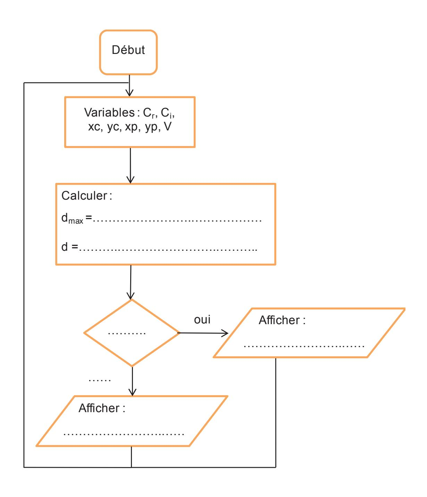

| Modèle CMEN-D         | OC v2 ©NEOPTEC                                                                                            |                                           |                                             |                                          |                                       |                                                             |                               |                                                |                                          |                     |        | _    | _ | <br>$\neg$ |
|-----------------------|-----------------------------------------------------------------------------------------------------------|-------------------------------------------|---------------------------------------------|------------------------------------------|---------------------------------------|-------------------------------------------------------------|-------------------------------|------------------------------------------------|------------------------------------------|---------------------|--------|------|---|------------|
|                       | n de famille :                                                                                            |                                           |                                             |                                          |                                       |                                                             |                               |                                                |                                          |                     |        |      |   |            |
|                       | Prénom(s) :                                                                                               |                                           |                                             |                                          |                                       |                                                             |                               |                                                |                                          |                     |        | Ī    |   |            |
|                       | Numéro<br>Inscription :                                                                                   |                                           |                                             |                                          |                                       | - E- ::  - =  -                                             |                               | Né(e)                                          | le :                                     |                     |        |      |   |            |
| (Remplir cette partie | •                                                                                                         | e numéro est                              | , ,                                         |                                          |                                       | ection/S                                                    |                               | ,                                              | ):                                       |                     |        | <br> |   | <br>       |
|                       | Epreuve:                                                                                                  |                                           |                                             |                                          |                                       | /latière :                                                  |                               |                                                |                                          | Sess                | ion :  | <br> |   | <br>       |
| CONSIGNES             | <ul> <li>Remplir soigne</li> <li>Ne pas signer</li> <li>Numéroter che</li> <li>Rédiger avec un</li> </ul> | · la composi<br>aque PAGE<br>un stylo à e | tion et ne pa<br>(cadre en b<br>ncre foncée | as y apporte<br>as à droite<br>(bleue ou | er de sigr<br>de la pa<br>noire) et l | ne distinctif <sub>l</sub><br>ge) et place<br>ne pas utilis | oouvan<br>r les fe<br>er de s | t indiquer sa<br>uilles dans l<br>tylo plume a | a provenan<br>le bon sens<br>à encre cla | et dans l'o<br>ire. | ordre. |      |   |            |

EDE STI 1

DR3 - DR4 - DR5

### NE RIEN ECRIRE DANS CE CADRE

### **DOCUMENT RÉPONSE DR3**

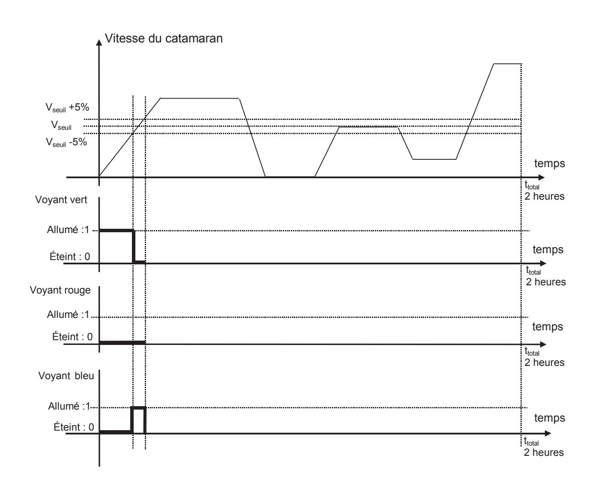

## **DOCUMENT RÉPONSE DR4**

| TENUE MÉCANIQUE DE LÁ STRUCTURE PORTEUSE DU TOIT AUTONOMIE ÉNERGÉTIQUE DU CATAMARAN SÉCURITÉ ET ÉCORESPONSABILITÉ                                 |                                                        |
|---------------------------------------------------------------------------------------------------------------------------------------------------|--------------------------------------------------------|
| AUTONOMIE ÉNERGÉTIQUE DU CATAMARAN SÉCURITÉ ET ÉCORESPONSABILITÉ                                                                                  |                                                        |
| SÉCURITÉ ET ÉCORESPONSABILITÉ                                                                                                                     |                                                        |
|                                                                                                                                                   |                                                        |
| Justifier la pertinence du choix du support SunSeaRider pour une exploitation dans le cadre de l'enseignement technologique transversal en STI2D. | oitation dans le cadre de l'enseignement technologique |
|                                                                                                                                                   |                                                        |

# **DOCUMENT RÉPONSE DR5**

Organisation hebdomadaire des séances de la séquence n°3

|                 |       |                                                          |       | maine 1<br>Se |   |       |   |          |
|-----------------|-------|----------------------------------------------------------|-------|---------------|---|-------|---|----------|
|                 | Lundi |                                                          | Mardi | Mercredi      |   | Jeudi |   | Vendredi |
| Heures hebdo. : | 1     | 2                                                        | 3     | 4             | 5 | 6     | 7 | 8        |
| Groupe 1        |       |                                                          |       |               |   |       |   |          |
| Groupe 2        |       |                                                          |       |               |   |       |   |          |
|                 |       |                                                          |       | maine 2<br>Se |   |       |   |          |
|                 | Lundi |                                                          | Mardi | Mercredi      |   | Jeudi |   | Vendredi |
| Heures hebdo. : | 1     | 2                                                        | 3     | 4             | 5 | 6     | 7 | 8        |
| Groupe 1        |       |                                                          |       |               |   |       |   |          |
| Groupe 2        |       |                                                          |       |               |   |       |   |          |
|                 |       |                                                          |       | maine 3<br>Se |   |       |   |          |
|                 | Lundi |                                                          | Mardi | Mercredi      |   | Jeudi |   | Vendredi |
| Heures hebdo. : | 1     | 2                                                        | 3     | 4             | 5 | 6     | 7 | 8        |
| Groupe 1        |       |                                                          |       |               |   |       |   |          |
| Groupe 2        |       |                                                          |       |               |   |       |   |          |
| Pour co         |       | mpléter les grilles, adopter les abréviations ci-dessous |       |               |   |       |   |          |

**Pour compléter les grilles, adopter les abréviations ci-dessous** 

étude de dossier : EDD

activité pratique : TP

 structuration des connaissances : SDC étude technologique en langue vivante : ETLV

 activation évaluation

cours