**EDE ENE 2** 

#### **SESSION 2018**

# CAPET CONCOURS EXTERNE ET CAFEP CORRESPONDANT

Section: SCIENCES INDUSTRIELLES DE L'INGÉNIEUR

**Option: INGÉNIERIE ÉLECTRIQUE** 

## ÉTUDE D'UN SYSTÈME, D'UN PROCÉDÉ OU D'UNE ORGANISATION

Durée: 4 heures

Calculatrice électronique de poche - y compris calculatrice programmable, alphanumérique ou à écran graphique — à fonctionnement autonome, non imprimante, autorisée conformément à la circulaire n° 99-186 du 16 novembre 1999.

L'usage de tout ouvrage de référence, de tout dictionnaire et de tout autre matériel électronique est rigoureusement interdit.

Dans le cas où un(e) candidat(e) repère ce qui lui semble être une erreur d'énoncé, il (elle) le signale très lisiblement sur sa copie, propose la correction et poursuit l'épreuve en conséquence.

De même, si cela vous conduit à formuler une ou plusieurs hypothèses, il vous est demandé de la (ou les) mentionner explicitement.

NB: La copie que vous rendrez ne devra, conformément au principe d'anonymat, comporter aucun signe distinctif, tel que nom, signature, origine, etc. Si le travail qui vous est demandé comporte notamment la rédaction d'un projet ou d'une note, vous devrez impérativement vous abstenir de signer ou de l'identifier.

#### **INFORMATION AUX CANDIDATS**

Vous trouverez ci-après les codes nécessaires vous permettant de compléter les rubriques figurant en en-tête de votre copie

Ces codes doivent être reportés sur chacune des copies que vous remettrez.

► Concours externe du CAPET de l'enseignement public :

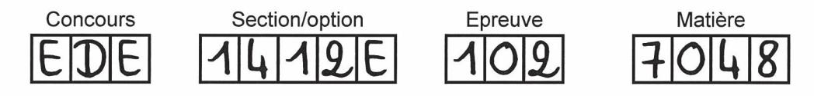

► Concours externe du CAFEP/CAPET de l'enseignement privé :

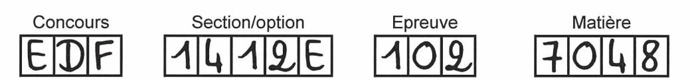

### **CAPET SII - OPTION INGENIERIE ÉLECTRIQUE**

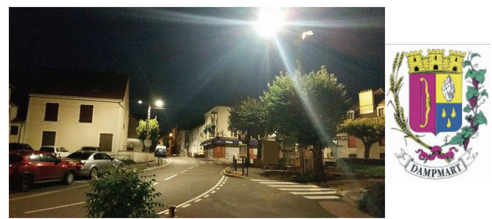

Ville de Dampmart : la rue principale

#### Coefficient 4 – Durée 4 heures

#### **Aucun document autorisé**

#### **Ce sujet comporte 3 dossiers :**

- présentation et travail demandé pages 2 à 13 ;
- documents techniques et ressources pages 14 à 33 ;
- documents réponses pages 34 à 36.

#### **Une lecture préalable et complète du sujet est indispensable.**

Le candidat doit répondre aux différentes questions du sujet sur les documents réponses quand cela est demandé et sur feuilles de copie quand cela n'est pas précisé.

Il lui est rappelé qu'il doit utiliser les notations propres au sujet, présenter clairement les calculs et dégager ou encadrer tous les résultats.

Il sera tenu compte de la présentation de la copie, de la qualité de la rédaction (orthographe et syntaxe), en particulier pour les réponses aux questions ne nécessitant pas de calcul.

Si le sujet (les questions ou les annexes) conduit à formuler une ou plusieurs hypothèses, il est demandé au candidat de la (ou les) mentionner explicitement sur la copie.

#### **Ce sujet comporte 5 parties :**

- PARTIE A : définition des obligations et des niveaux d'éclairement normatifs ;
- PARTIE B : validation du nouveau régulateur par rapport à l'ancien ;
- PARTIE C : choix du matériel et schéma ;
- PARTIE D : mise en communication de l'armoire de pilotage ;
- PARTIE E : validation des économies d'énergie.

#### **Présentation générale**

*La ville de Dampmart s'est engagée sur la voie des économies d'énergie. Elle a ainsi fait rénover la gestion de l'éclairage public.* 

*En 2012, la ville a rénové la rue Daniel Leduc qui consomme 11 % de l'énergie consacrée à l'éclairage public. En 2013 c'est la rue Clément Brévard qui a été rénovée. Le système de gestion mis en place sur ces rues donne pleinement satisfaction mais il n'est plus distribué par le fabricant. La ville envisage de rénover l'éclairage de la rue des fêtes. L'objet de cette étude consiste donc à choisir un nouveau système de gestion de l'éclairage.*

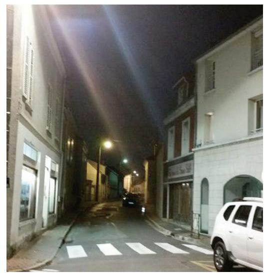

Une vue de la rue des fêtes

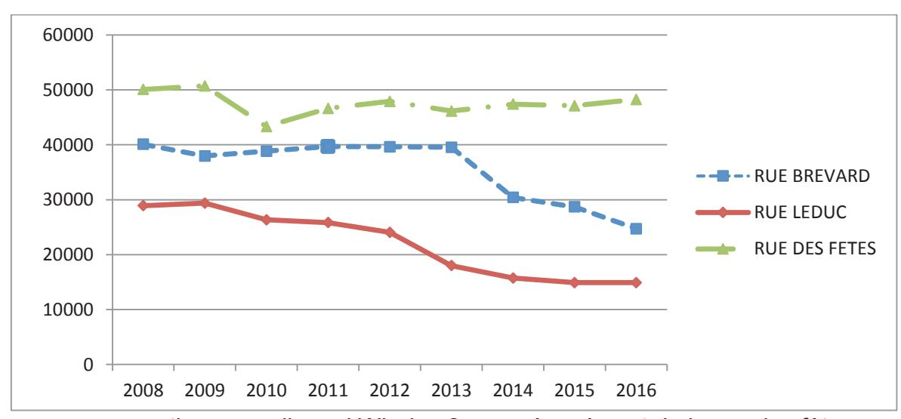

consommation annuelle en kWh des 2 rues rénovées et de la rue des fêtes.

#### **Définition des parties d'un candélabre**

*Un candélabre est composé:* 

- *d'une ampoule produisant la lumière ;*
- *d'un luminaire protégeant la lampe des intempéries et diffusant le flux lumineux ;*
- *d'un mat, assurant la fixation au sol et supportant l'ensemble des composants du candélabre ;*
- *d'un ballast amorceur destiné à maitriser l'allumage de la lampe et à limiter la tension sur cette lampe en fonctionnement.*

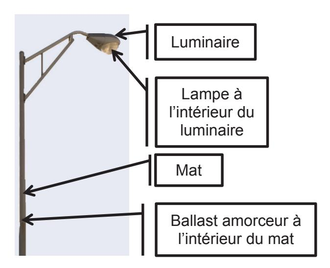

figure 1 : description d'un candélabre

*Du point de vue électrique un luminaire désigne l'ensemble lampe plus amorceur.*

#### **Problématiques**

*Les services techniques de la ville ont identifié un autre fabriquant de système de gestion. Avant de s'engager, la ville demande à ses services une pré-étude pour :* 

- *définir pour la rue des fêtes les niveaux d'éclairement normalisés,*
- *valider le nouveau système de gestion,*
- *choisir le matériel nécessaire pour l'armoire de régulation de la rue des fêtes,*
- *configurer la communication de l'armoire, afin d'assurer un suivi des consommations journalières,*
- *évaluer les économies d'énergie possibles sur ce site et le temps de retour sur investissement.*

#### 4. **PARTIE A : définition des obligations et du niveau d'éclairement normatif**

*Objectif : valider les niveaux d'éclairement pour les valeurs nominale et réduite de la basse tension régulée alimentant les candélabres.*

*Le niveau d'éclairement minimal normatif correspond au besoin en nuit profonde de 22 heures à 5 heures. Pour des raisons de confort des usagers la municipalité choisit de régler un niveau d'éclairement plus élevé avant 22 heures et après 5 heures. Ce choix impose de pouvoir régler la tension d'alimentation des luminaires selon deux valeurs : la tension nominale pour le niveau d'éclairement le plus élevé et la tension économique pour l'éclairement en nuit profonde. Cette fonction de réglage de la tension est assurée par un régulateur.*

*Le système de gestion comprend un régulateur abaisseur de tension de type COMPACTO II® (figure 2)*.

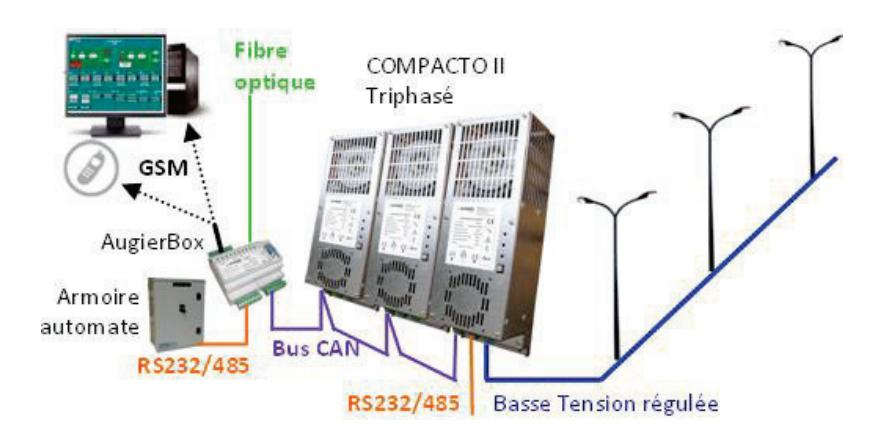

figure 2 : synoptique du système de gestion

*Les luminaires alimentés par l'armoire de commande de la rue des fêtes viennent d'être remplacés. De nouvelles lampes au sodium haute pression (SHP) ont été installées lors du remplacement des luminaires. Les mâts et les ballasts, adaptés aux nouveaux luminaires et lampes, n'ont pas été remplacés.*

Caractéristiques de la rue des fêtes :

- 2 *46 luminaires, séparés de 24 m et d'une hauteur de 12 m,*
- 2 *luminaires IP 65 avec vasque en plastique,*
- 2 *ampoules de type SHP SON T PIA Plus 150 W,*
- 2 *voie pénétrante urbaine à faible trafic en zone habitée d'une largeur de 12 m,*
- 2 *zone à faible degré de pollution,*
- 2 *contrat d'entretien des luminaires tous les 18 mois soit toutes les 12 000 heures.*
- Question 1. À l'aide du tableau 2, document technique DRS 1, déterminer le niveau de luminance moyenne (*Lm* en cd·m-2) à maintenir.
- Question 2. À partir de la figure 3 page 5, évaluer la surface de la rue éclairée (Sé) par chaque candélabre. En déduire le flux lumineux minimal à maintenir (*Jmin* en lumen). Un candélabre doit permettre d'assurer l'éclairement de la surface même si ses voisins directs sont en panne.

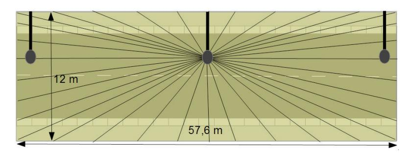

figure 3 : zone éclairée par le candélabre central

*L'ancienne installation nécessitait un contrat d'entretien toutes les 12 000 heures. Pour la nouvelle installation les services techniques proposent de passer à un contrat de 8 000 heures. La municipalité veut s'assurer que cela est possible.*

Question 3. À l'aide du document technique sur les lampes, DRS 6, déterminer le flux lumineux nominal des lampes (*JM*) et la tension nominale correspondante (*UN*). À l'aide du tableau A, document technique DRS 2, déduire les limites de ce même flux lumineux après 12 000 heures (*JM12*) et après 8 000 heures (*JM8*).

*Le flux lumineux est proportionnel au carré de la tension d'alimentation du luminaire* 

*suivant la relation :* 1 2 = 1 2 2 2

- Question 4. Déterminer la tension minimale à appliquer aux luminaires pour garantir la valeur normative du flux lumineux dans les 2 cas d'utilisation après 12 000 heures (*Um12*) et après 8 000 heures (*Um8)*.
- Question 5. Le fournisseur du système de gestion préconise de limiter la tension d'alimentation des luminaires à 200 V pour garantir une économie compatible avec l'amortissement financier du système. Quelle est la périodicité du contrat d'entretien à conseiller à la municipalité ?

#### **PARTIE B : validation du nouveau régulateur**

*Objectif : vérifier les performances du nouveau régulateur pour s'assurer qu'il répond aux exigences attendues.*

*Les régulateurs précédemment installés, dans les postes des rues Brévard et Leduc, sont de type LUBIO.*

*Pour éviter les sauts de luminosité, toutes les variations sont faites avec des rampes de 10 minutes. L'allumage a lieu au plus tôt à 17 h 00 et l'extinction au plus tard à 08 h 00. Un interrupteur crépusculaire permet de retarder l'allumage et d'avancer l'extinction en fonction de la luminosité naturelle. Le passage à la tension économique démarre tous les jours de l'année à 22 h 00 et le retour à la tension nominale à lieu à 05 h 00. L'évolution de la tension dans le cas le plus sévère est présentée figure 4.*

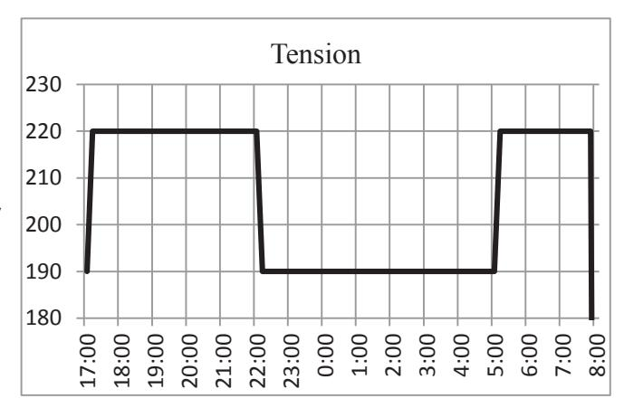

figure 4 : évolution de la tension appliquée au luminaire dans le cas le plus sévère

*La ville envisage aussi de remplacer les lampes par des LED.*

*Les documents ressources DRS 3 et DRS 4 présentent l'ancien régulateur de type LUBIO et le nouveau régulateur de type COMPACTO II®. Ils renseignent, pour une même charge, les valeurs des grandeurs appelées au réseau pour la tension, le courant, les puissances et les harmoniques de courant dans les conditions d'application aux luminaires de la tension nominale (230 V) ou de la tension économique (190 V).*

#### **Comparaison des deux régulateurs**

Question 6. Déterminer le nombre de niveau de tensions paramétrables sur le COMPACTO II®. Comparer avec ceux du LUBIO.

Question 7. Pour chaque type de régulateur et pour le fonctionnement en mode nominal et économique identifier et comparer :

- *la valeur de la tension et du courant absorbé au réseau,*
- *la valeur de la puissance absorbée et apparente,*
- *le taux de distorsion harmonique (THD),*
- *le facteur de puissance (FP) et le facteur de déplacement de puissance (cos()).*

*On rappelle que représente le déphasage entre la tension du réseau sinusoïdale et le fondamentale de courant.*

Question 8. En déduire la valeur de la puissance réactive *Q1* liée au fondamental de courant et de la puissance déformante *D* attribuée aux harmoniques de courant. On rappelle :

$$Q_1 = P \times \tan(\varphi_1)$$
 et  $S = \sqrt{(P^2 + Q_1^2 + D^2)}$ 

Question 9. Quels sont les intérêts du COMPACTO II® par rapport au LUBIO ? Les 2 régulateurs seront ils adaptés à la commande des futures LED.

#### **Validation du principe de la technologie dite « sans pollution harmonique »**

*La technologie utilisée par les régulateurs COMPACTO II® permet de ne générer que peu de déformation du courant appelé au réseau par les luminaires qui reste ainsi quasiment sinusoïdale. On parle alors d'absence de pollution harmonique.* 

*Pour réguler la tension des luminaires, ces régulateurs ajoutent une tension alternative sinusoïdale (dite tension injectée) en opposition de phase par rapport à la tension du réseau (voir figure 5).*

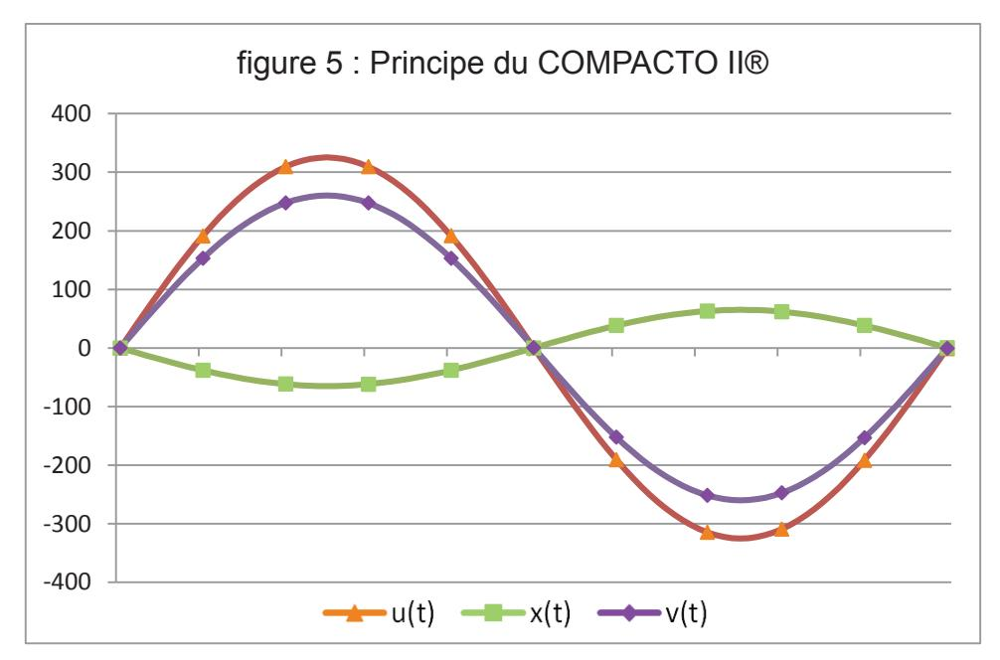

figure 5 : tension du réseau u(t), tension injectée x(t), tension résultante appliquée au luminaire v(t)

*Les valeurs nominales qui caractérisent le réseau électrique en France sont une tension de Umax=230√2 Volts à la fréquence de 50 Hertz.*

Question 10. Déterminer la valeur de l'angle φ dans l'expression de la tension x(t) pour que cette tension soit en opposition de phase par rapport à la tension u(t) du réseau. On donne :

$$u(t) = U_{max.} \sin(\omega t)$$
  
$$x(t) = X_{max.} \sin(\omega t + \varphi)$$

*La tension instantanée appliquée aux luminaires est : v(t) = u(t) + x(t)*

Question 11. Déterminer l'expression de la tension injectée x(t) pour que la tension efficace aux bornes des luminaires soit *V* = 190 V.

Question 12. Quels sont les intérêts du COMPACTO II® par rapport au LUBIO ? Les 2 régulateurs seront ils adaptés à la commande des futures LED ?

#### **PARTIE C : choix des matériels et réalisation des schémas électriques**

*Objectif : choisir le régulateur et les éléments de protection adaptés à l'installation, réaliser les schémas électriques et les schémas d'implantation dans le coffret.*

*Des informations nécessaires pour traiter cette partie sont données ci-dessous :*

- *réseau électrique d'alimentation triphasé 3 P + N 400 V 50 Hz,*
- *schéma de liaison à la terre de l'installation de type TT,*
- *pas de paratonnerre à moins de 30 m du coffret d'installation,*
- *46 luminaires répartis de manière équilibrée sur les 3 régulateurs assurant l'alimentation triphasée des candélabres,*
- *ampoules de type SHP SON T PIA Plus 150 W avec un facteur de puissance de 0,84, associées à des amorceurs (un par ampoule) d'une puissance Pa = 50 W.*

#### **Choix du régulateur dans la gamme COMPACTO II®**

- Question 13. À l'aide de la documentation technique DRS 5 vérifier, pour un luminaire (ensemble lampe et amorceur), la puissance active *P1L*, et déterminer la puissance réactive *Q1L* et la puissance apparente *S1L*.
- Question 14. Calculer la puissance apparente *STL* qui caractérise la totalité des luminaires sur la zone de la rue des fêtes.
- Question 15. À l'aide du document constructeur, choisir le modèle et la puissance du variateur électronique. Justifier les réponses.

#### **Protection contre la foudre**

*Le constructeur du régulateur COMPACTO II® préconise l'installation de parafoudres en amont et en aval du régulateur pour assurer la protection de son matériel à la fois pour les surtensions en mode commun (MC) et les surtensions en mode différentiel (MD).*

- Question 16. À l'aide du document ressource DRS 7, justifier la nécessité de protéger le régulateur pour les deux types de surtensions.
- Question 17. Justifier le choix de parafoudre de type 2. Expliquer pourquoi le constructeur préconise la mise en place d'un parafoudre en amont et d'un autre en aval du régulateur.
- Question 18. Le courant maximum de décharge étant estimé à 15 kA, déterminer, à l'aide des documents constructeurs la référence des parafoudres à mettre en place dans l'installation.
- Question 19. À l'aide des documents constructeurs, déterminer le calibre et le type de courbe de déclenchement des disjoncteurs de déconnexion à associer aux parafoudres choisis précédemment.

#### **Détermination des protections associées**

*La protection en tête de l'installation sera assurée par un disjoncteur différentiel à courant résiduel. Une mesure de la prise de terre donne Rm = 150 Ω.*

- Question 20. Justifier le rôle de ce dispositif de protection. Expliquer ce qui justifie son utilisation pour cette installation.
- Question 21. Déterminer la sensibilité IΔn du dispositif différentiel à mettre en place. En déduire, à l'aide des documents constructeurs, la référence du matériel à mettre en place dans l'installation.

#### **Réalisation des schémas électriques**

Question 22. Compléter le document réponse DR1 en y intégrant les différents éléments choisis pour assurer la fonctionnalité et les protections nécessaires.

#### **PARTIE D : mise en communication des régulateurs**

*Objectif : compléter le schéma électrique par le câblage de la partie communication et paramétrer le superviseur.*

*La communication entre les régulateurs et le superviseur est réalisée grâce à la passerelle AUGIERBOX®. Cette passerelle est en liaison avec chaque régulateur par le biais d'un bus de communication de type CAN. La passerelle permet également de mesurer les tensions régulées fournies par les régulateurs.* 

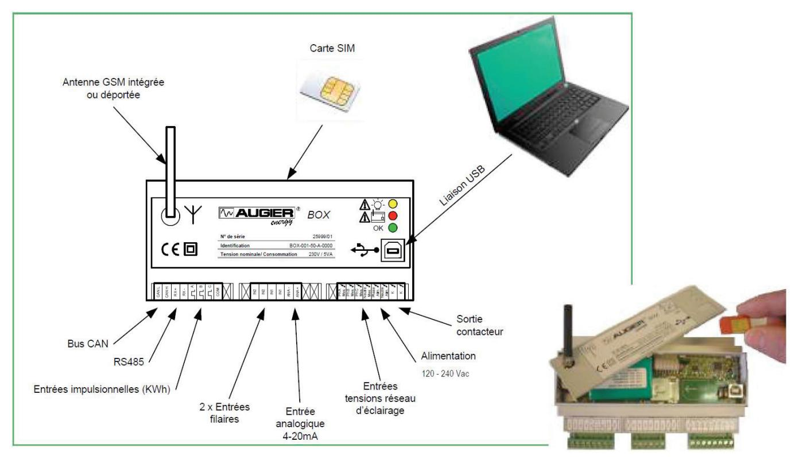

figure 6 : synoptique de connexion de l'AUGIERBOX*®*

#### **Réalisation du câblage de la passerelle AUGIERBOX***®*

Question 23. Compléter le document réponse DR 1 pour :

- *commander l'ouverture et la fermeture du contacteur principal KM1 par la passerelle (sortie contacteur : bornes K),*
- *mesurer les tensions du réseau d'éclairage par la passerelle,*
- *réaliser la communication entre la passerelle et les régulateurs par le bus CAN.*

#### **Paramétrage du superviseur**

*La connexion (figure 7) du port USB du COMPACTO sur un ordinateur en utilisant le logiciel Compacto PC permet de modifier tous les paramètres internes. Ce logiciel permet l'adaptation du COMPACTO II® variateur à n'importe quelle application spécifique.* figure 7

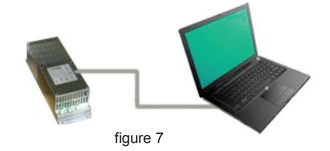

*Par exemple, il est possible de régler les valeurs de la date et de l'heure, la fréquence d'augmentation et de diminution de la tension, les niveaux d'économie de tension, les vitesses du gradient de tension (haut/bas), les cycles d'éclairages en fonction du calendrier, etc.*

*L'armoire « rue des Fêtes » possède un compteur d'énergie à sortie à impulsion pour totaliser la consommation de l'éclairage.*

*Les coordonnées GPS de la ville de Dampmart :*

**Géographique degré décimaux X**: 48.883331 **Y**: 2.73333 **DMS X**: 48° 52' 59.99" **Y**: 2° 43' 59.99"

Question 24. Compléter le document réponse DR 2 (zones encadrées) pour configurer les tensions du COMPACTO et le cycle de fonctionnement.

*Chaque Augier-Box® possède une identité propre (codification sur 16 caractères), des coordonnées géographiques de longitude et latitude (pour l'horloge astronomique et une géo localisation).*

*Elle possède en mémoire des numéros de téléphone pour l'envoi d'informations vers le personnel* 

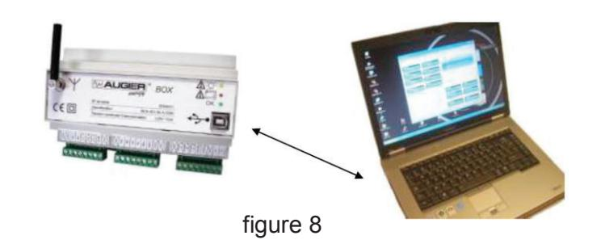

*d'astreinte et mémorise également le journal des derniers évènements survenus. La communication avec le personnel d'astreinte s'effectue par SMS via le réseau GSM, de manière bidirectionnelle : l'Augier-Box® peut être à l'origine de l'appel (sur alarme ou évènement), ou recevoir un appel pour consultation (télé relevés opérés à partir d'un téléphone mobile),* figure 8.

*La communication avec un superviseur est effectuée via le réseau GSM-data / GPRS. Les liaisons CAN, RS485, EN62053 permettent toutes les extensions vers d'autres systèmes d'analyse, ou vers d'autres matériels AUGIER à contrôler tels que les variateurs COMPACTO.*

*L'armoire où est installé l'Augier-Box contient 3 régulateurs abaisseurs COMPACTO qui ont pour adresse respective 1, 2 et 3.*

*La configuration GSM de l'Augier-Box est la suivante : le numéro de téléphone rattaché à la carte SIM est le 06 77 03 54 76, le code PIN de la carte est le 1234 et le mot de passe le 5476. Elle porte le nom de : rue des fêtes.*

Question 25. Compléter le document réponse DR 3 pour configurer l'Augier-Box et la liaison GSM.

Question 26. Un technicien désire envoyer un SMS pour enclencher l'éclairage le 31 décembre à 12 h. Définir le contenu du message à envoyer.

#### **PARTIE E : validation des économies d'énergie**

*Objectif : vérifier les consommations d'énergie pour déterminer le retour sur investissement des solutions d'éclairage public.*

*Il s'agit d'effectuer un comparatif entre une solution classique d'alimentation des lampes à travers des ballasts ferromagnétiques et une solution d'alimentation par un régulateur abaisseur de type COMPACT II®.*

*Dans cette partie, il faudra :*

- *estimer la consommation électrique avec une solution d'alimentation fixe sur le réseau,*
- *estimer la consommation électrique avec dispositif d'alimentation de type COMPACT II®,*
- *réaliser le bilan économique.*

*Les consommations, exprimées en kWh, seront arrondies à l'unité immédiatement supérieure.*

*Les puissances, exprimées en kW ou kVA, seront arrondies à la décimale immédiatement supérieure.*

*Les coûts, exprimés en € TTC, seront arrondies à l'unité immédiatement supérieure.*

*La durée moyenne d'éclairage sur une journée est de 11,6 h ce qui représente 4 240 h sur une année. L'éclairage sous tension réduite est fixe tous les jours de l'année, il est réglé entre 22 h et 5 h.*

*Le coût de l'énergie en incluant l'abonnement EDF selon le tarif souscrit est de 0,11 € par kWh TTC sur toute l'année.*

*La lampe avec son ballast consomme 204 W sous tension nominale de 230V.*

*Le tarif des COMPACTO II® est donné sur le document ressource DRS 9.*

*Le bilan de la consommation annuelle entre 2008 et 2017 de l'installation « rue des fêtes » est donné par le graphe figure 9.*

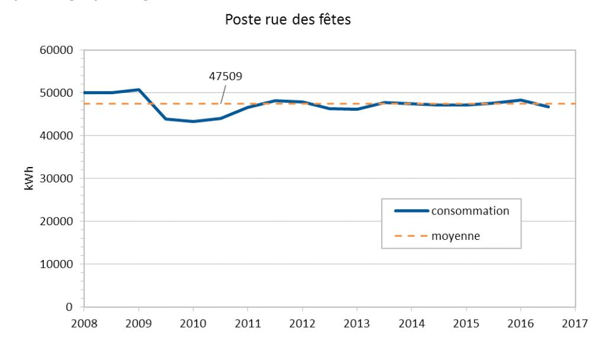

figure 9 : consommation annuelle et moyenne de l'installation « rue des fêtes »

- Question 27. Calculer la puissance consommée par le luminaire alimenté sous tension réduite de 190 V.
- Question 28. Déterminer la consommation d'énergie en kWh sur une journée pour une solution en alimentation directe j1 et une solution avec régulateur abaisseur de tension j2. En déduire le pourcentage d'économie d'énergie de la solution avec régulateur abaisseur.
- Question 29. À la lecture du graphe figure 9, déterminer la consommation annuelle de l'armoire en kWh et en déduire l'économie d'énergie réalisée en kWh et calculer le gain financier sur une année en € TTC.

*L'armoire électrique de commande de l'éclairage comprend :*

- *3 modules régulateur abaisseur de tension monophasé COMPACTO II® de 3 KVA,*
- *un module AUGIERBOX® pour la commande et le dialogue à distance de 900€ HT,*
- *le coffret de 170€ HT,*
- *les protections et l'appareillage électrique pour un montant de 280€ HT.*

*La réalisation de l'armoire électrique nécessite 8 h de travail avec un coût horaire total estimé à 90 € HT.*

Question 30. Calculer le coût de l'installation.

*La durée de vie moyenne de ce type de luminaire associé à ce type de lampe est de 15 ans.*

*Le temps moyen de bon fonctionnement MTBF (Mean Time Between Failures) du régulateur abaisseur de tension COMPACTO II® est de 18 ans.*

*Avec ce choix technologique, la durée de vie des lampes est augmentée de 50%, la maintenance notamment pour le relamping des ampoules par les services techniques de la ville est diminuée. Les économies annuelles sur la maintenance des 46 candélabres sont estimées à 370 €/an TTC.*

Question 31. Déterminer le temps de retour sur investissement *TRI* de cette solution. Cette solution est-elle économiquement viable, par rapport à la durée de vie des lampes et des COMPACTO II® ?

## DOSSIER TECHNIQUE ET RESSOURCES

| 3201-1                                                                                 | 13201.1                                       | SITUATIONS             | A1                                                                                                           |                              |                    | B1                                                                                                                                           | B2                                                                                                                                            |
|----------------------------------------------------------------------------------------|-----------------------------------------------|------------------------|--------------------------------------------------------------------------------------------------------------|------------------------------|--------------------|----------------------------------------------------------------------------------------------------------------------------------------------|-----------------------------------------------------------------------------------------------------------------------------------------------|
| m -2 ) NF EN 1                                                              | NORME EN 13201.1                              | CLASSES D'ÉCLAIRAGE |                                                                                                              | ME2                          | ME1                | ME3 – ME2                                                                                                                                    | ME2                                                                                                                                           |
| maintenir (en cd.                                                                      | LUMINANCE RETENUE POUR CONTRAINTES MAXI |                        |                                                                                                              |                              | 2                  | 1,5                                                                                                                                          | 7,                                                                                                                                            |
| nale à                                                                                 | 4U EUX NT                               | ELEVÉ                  |                                                                                                              | 1,5                          | 2                  | I                                                                                                                                            | 1,5                                                                                                                                           |
| าe miniท                                                                               | NIVEAU LUMINEUX AMBIANT                 | FAIBLE Á MOYEN      |                                                                                                              | * * *                        | ı                  | ~                                                                                                                                            | 1                                                                                                                                             |
| iveau de luminance moyenne minimale à maintenir (en cd.m -2 ) NF EN 13201-1 | CONTRAINTES                                   |                        | Zone de conflit : non Complexité : élevée Tâche de navigation : élevée Distance entre échangeur ≥ 3 km | Trafic 15 000 < V/J < 25 000 | Trafic V/J > 25000 | Complexité : élevée Véhicules en stationnement : non Trafic cyclistes : existant Intersections ≥ 3 par km Tâche navigation : élevée | Complexité : élevée Véhicules en stationnement : oui Trafic cyclistes : normal Intersections > 3 par km Tâche navigation : élevée |
| DRS 1 : tableau 2 voies urbaines. Niveau de                                            | DEFINITION DE LA VOIE                         |                        | ROCADE PÉRIPHÉRIQUE, AUTOROUTE URBAINE Chaussées séparées Vitesse ≤ 110 km/h                           | Motorisés seuls              |                    | PÉNÉTRANTE URBAINE Chaussée unique Vitesse ≤ 70 km/h Zone hors habitations Zone industrielle Motorisés Cyclistes Piétons            | PÉNÉTRANTE URBAINE Vitesse ≤ 70 km/h Zone habitée Motorisés Véhicules lents Cyclistes Piétons                                           |
| DRS 1                                                                       | REPERES**                                     |                        | 5                                                                                                            | ©                            |                    |                                                                                                                                              |                                                                                                                                               |

#### DRS 2 : facteur de maintenance de l'installation d'éclairage

Tableau A. Facteur de maintenance de l'installation d'éclairage

| DEODÉ DE              | NOMBRE D'HEURES DE FONCTION- | FACTEUR DE MAINTENANCE DE L'INSTALLATION (M) |                     |                     |                                  |  |
|-----------------------|---------------------------------------|----------------------------------------------|---------------------|---------------------|----------------------------------|--|
| DEGRÉ DE POLLUTION | NEMENT                                |                                              |                     | LUMINAIRE           |                                  |  |
| I OLLO HON            | AVANT                                 | TYPE DE                                      | IP 55               | IP                  | 65                               |  |
|                       | ENTRETIEN (H)                      | LAMPE                                        | VASQUE PLASTIQUE | VASQUE PLASTIQUE | VASQUE VERRE                  |  |
| Faible                | 8 000                                 |                                              | 0,74 à 0,78         | 0,76 à 0,80         | 0,81 à 0,86                      |  |
| Degré                 | 12 000                                | S.H.P. tubulaire                             | 0,61 à 0,70         | 0,63 à 0,72         | 0,68 à 0,78                      |  |
| Fort Dográ            | 8 000                                 | S.H.P. lubulalle                             | 0,63 à 0,66         | 0,68 à 0,72         | 0,76 à 0,80                      |  |
| Fort Degré            | 12 000                                |                                              | 0,50 à 0,57         | 0,55 à 0,63         | <b>&gt;</b> 0,63 à 0,72 <b>♥</b> |  |
| Faible                | 8 000                                 | IODURES                                      | 0,59 à 0,70         | 0,60 à 0,71         | 0,65 à 0,76                      |  |
| Degré                 | 12 000                                | METALLIQUES                                  | 0,44 à 0,59         | 0,46 à 0,60         | 0,49 à 0,66                      |  |
| Fort Dográ            | 8 000                                 | Brûleur                                      | 0,50 à 0,60         | 0,55 à 0,65         | 0,60 à 0,71                      |  |
| Fort Degré            | 12 000                                | céramique                                    | 0,36 à 0,48         | 0,40 à 0,53         | 0,46 à 0,61                      |  |

Le facteur de maintenance est un coefficient multiplicateur permettant de déterminer l'efficacité lumineuse d'un luminaire après 12 000 h ou 8 000 h de fonctionnement. Exemple :

- luminaire en verre IP 65;
- lampe S.H.P. tubulaire;
- fort degré de pollution ;
- 12 000 heures entre 2 entretiens.

Soit un facteur de maintenance compris entre 0,63 et 0,72.

#### DRS 3 documentation du LUBIO

#### 1. Étude du système LUBIO

Le régulateur/réducteur de tension de la gamme LUBIO (LUBIO VR et LUBIO VRI) permet de :

- réguler et de faire varier la tension d'alimentation des réseaux d'éclairage public ;
- gérer la mise en marche et l'extinction de l'éclairage public ;
- mesurer les paramètres électriques du réseau (LUBIO VRI).

#### La commande peut être :

- locale (horloge astronomique intégrée) ;
- ou à distance (pilotage par un relais Pulsadis ou un interrupteur crépusculaire).

Il est utilisé sur tous les réseaux d'éclairage public monophasé ou triphasé de type aérien, souterrain ou mixte.

Il fonctionne avec tous les types de lampes :

- vapeur de sodium haute et basse pression ;
- vapeur de mercure (ballon fluorescent) ;
- iodures métalliques ;
- fluorescentes compactes, tubulaires ;
- lumière mixte (association mercure et incandescence).

#### 2. Cycle de commande du LUBIO VR-VRI

Le cycle de fonctionnement est paramétrable à l'aide de l'IHM.

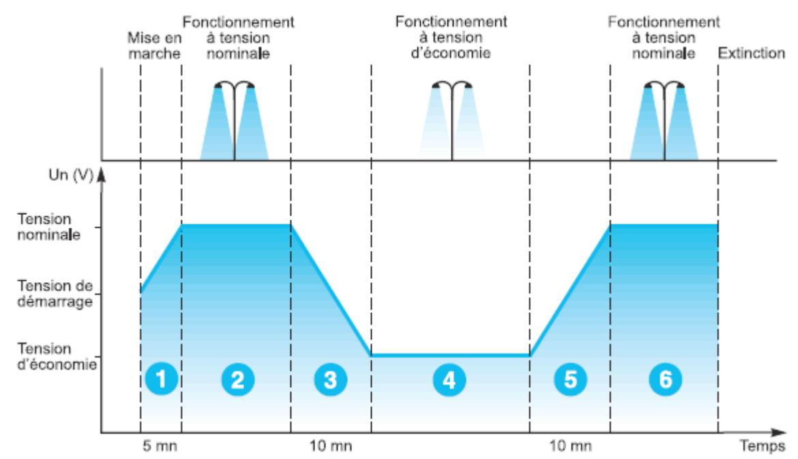

- 1. démarrage progressif de l'éclairage jusqu'à la tension nominale ;
- 2. régulation à la tension nominale jusqu'à une heure fixe paramètrable ;
- 3. passage à la tension d'économie de façon continue et linéaire sur une durée fixe de 10 mn ;
- 4. régulation à la tension d'économie pendant une durée paramétrable ;
- 5. retour à la tension nominale de façon continue et linéaire sur une durée de 10 mn ;
- 6. régulation à la tension nominale jusqu'à l'extinction.

#### DRS 3 documentation du LUBIO (suite)

- 3. Les paramètres modifiables sont les suivants :
- tension nominale de fonctionnement, réglable de 210 V à 230 V, par pas de 1 V
- tension d'économie, réglable de 180 V à 210 V, par pas de 1 V
- heure de passage à la tension d'économie
- durée de fonctionnement à la tension d'économie
- décalage au lever et au coucher du soleil (±120 mm).
- 4. Principe de la commande du hacheur

Le LUBIO hache la tension du réseau pour réduire sa valeur efficace.

Tension d'entrée du régulateur

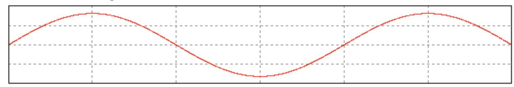

Tension de sortie du régulateur LUBIO avant filtrage

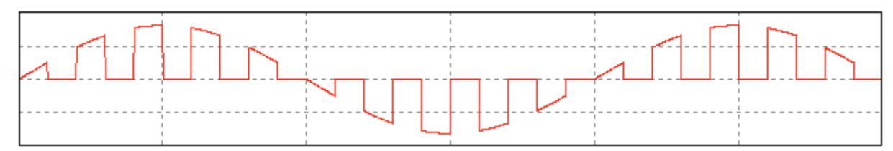

5. Relevés sous tension nominale des luminaires 220 V

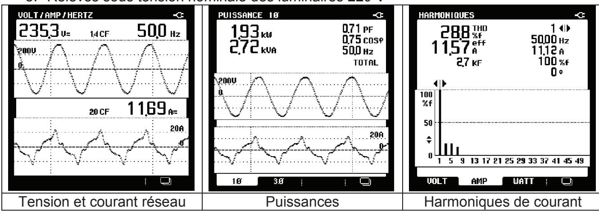

6. Relevés sous tension économique des luminaires 190 V

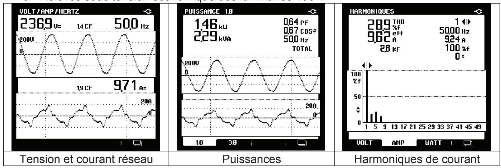

Page 18 sur 36

#### DRS 4 documentation du COMPACTO II®

#### 1. Régulateur/abaisseur de tension

#### 1.1.Régulation

Tension stabilisée et surtension effacée Variation de la tension tout en souplesse Séparation du réseau d'injection du réseau d'éclairage Régulation monophasée et triphasée

#### 1.2.Abaissement

Abaissement jusqu'à 50V de la tension réseau Économie : de 30 à 50% sur la période d'éclairage Compatible avec les évolutions technologiques LED Eligible CEE Certificat d'économie RES-EC-101 et RES-EC-107

#### 2. Gestion

Commande de l'éclairage grâce à l'horloge astronomique intégrée 2 tensions d'économies et plusieurs cycles paramétrables (saisons, semaine/WE, période de dérogation)

Compatible avec tout automate de télégestion (liaison RS485)

Couplage avec une AUGIER BOX II pour le contrôle à distance de votre armoire

Mesure d'énergie intégrée

Paramétrage avec un ordinateur portable

#### 3. Principe du COMPACTO II®

Parfaitement sinusoïdale, la tension délivrée par le COMPACTO II® ne génère aucune pollution harmonique.

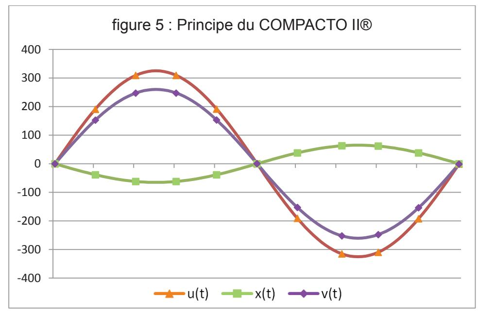

#### 4. Relevés sous tension nominale des luminaires 220 V

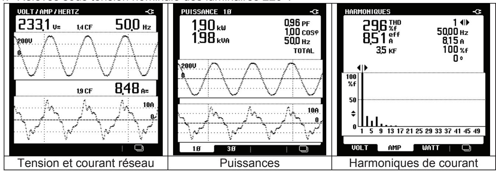

#### 5. Relevés sous tension économique des luminaires 190 V

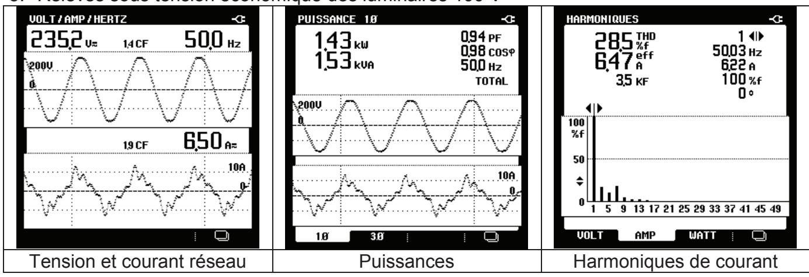

#### 6. Cycles d'Éclairage

Le COMPACTO® offre un fonctionnement préprogrammé standard, mais possède aussi des fonctions évoluées qui permettent de créer des cycles d'éclairages selon les besoins.

A l'échelle d'une semaine, le COMPACTO® permet d'avoir un comportement différent entre les jours de semaine et le week-end. Par exemple, il sera possible de moins éclairer une zone industrielle le week-end afin d'augmenter l'économie d'énergie.

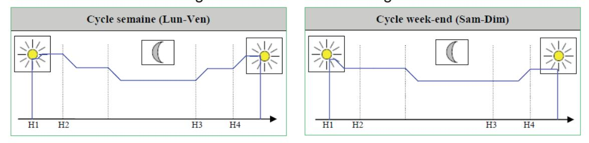

Á l'échelle d'une année, il est possible d'avoir un comportement différent suivant la saison. « Saison » devant être pris au sens large, comme une période entre 2 mois spécifiés.

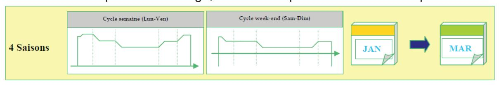

#### DRS 4 documentation du COMPACTO II®(suite)

En complément, il est possible de prévoir un comportement différent jusqu' à 8 jours par an :

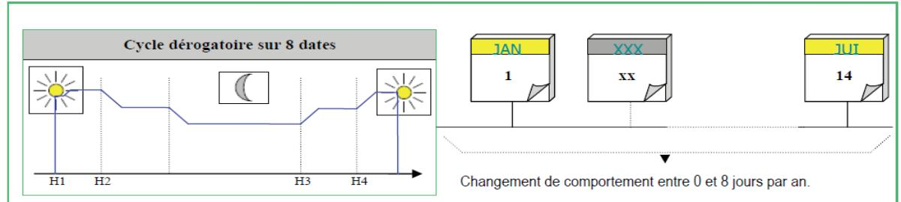

Le COMPACTO II® peut travailler de manière autonome avec son horloge interne (et peut aussi utiliser son horloge astronomique pour piloter le contacteur d'éclairage).

#### 7. Communication

Il comporte un port USB.

Le COMPACTO II® peut être connecté avec tous les types de système de supervision : Directement via le port RS232/485,

Ou via le modem AUGIERBOX*®* et ses interfaces GSM ou Fibre Optique.

La technologie de communication Bus CAN est utilisé entre les COMPACTO II®, si triphasé et série (voire l'option modem AugierBox*®*):

Pour synchronisation, si triphasé, série Pour mise à jour et supervision si AugierBox*®*.

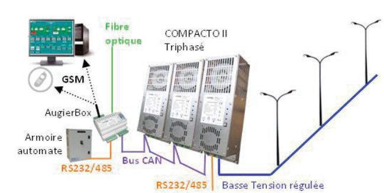

COMPACTO II® est équipé de ports USB, RS232/485 & bus CAN.

AUGIERBOX*®* complète avec modem GSM ou interface fibre optique.

Insertion dans un Réseau d'Eclairage

Le COMPACTO II® est très facile à installer dans une armoire existante.

Vous conservez votre système de commande de l'éclairage et le variateur s'insère directement après le contacteur d'éclairage Public. Le câblage est réduit au strict minimum.

#### 8. Tensions et Puissances pour le COMPACTO II®

|                       | (kVA) | 3   | 4   | 6   | 9   | 12  |        |        |         |         |
|-----------------------|-------|-----|-----|-----|-----|-----|--------|--------|---------|---------|
|                       | (A)   | 14  | 17  | 26  | 40  | 53  |        |        |         |         |
| Monophasé 230-240V | (kg)  | 10  | 10  | 12  | 18  | 24  |        |        |         |         |
|                       | (mm)  | 150 | 150 | 150 | 120 | 160 |        |        |         |         |
|                       | (mm)  | 150 | 150 | 120 | 205 | 210 |        |        |         |         |
|                       | (mm)  | 394 | 394 | 444 | 530 | 555 |        |        |         |         |
|                       | (kVA) | 9   | 12  | 18  | 27  | 36  | 54 (*) | 72 (*) | 108 (*) | 144 (*) |
|                       | (A)   | 14  | 17  | 26  | 40  | 53  | 80     | 106    | 159     | 212     |
|                       | (kg)  | 28  | 28  | 36  | 54  | 72  | 160    | 200    | 300     | 400     |
| 400-410V Triphasé  | (mm)  | 360 | 360 | 510 | 420 | 540 | 1400   | 1400   | 1400    | 1400    |
|                       | (mm)  | 180 | 180 | 120 | 205 | 210 | 400    | 400    | 400     | 400     |
|                       | (mm)  | 500 | 500 | 444 | 530 | 555 | 1250   | 1250   | 1500    | 2000    |

(\*) Les dimensions données sont celles d'un châssis supportant les Compacto triphasés mis en série (Modèles VETCS) Pour d'autres puissances et tensions --> Consulter Augier

#### DRS 4 documentation du COMPACTO II®(suite)

#### 9. Caractéristiques Générales

 Alimentation : monophasé 230-240V+N +/-10%,

Fréquence de 45 Hz à 65 Hz. Extensions en 120, 208, 277, 347, 480 & 600V.

- Charge : 0 à 100%, facteur de puissance indifférent.
- Constitution de la charge : tous types de lampes. (à décharge ou fluorescente ou résistive voire LEDs)
- Précision de régulation en sortie : +/- 0,5%.
- Rendement : supérieur à 98,5 %.
- Retours d'indication : LED marche, défaut, éco.
- Entrées : prise USB (paramétrage hors tension).

#### 10.Caractéristiques Environnementales

- Enveloppe : IP 20 (IP 21sur demande).
- Température ambiante : de -20°C à +55°C. (-40°C sur demande particulière ou chauffage armoire)
- Humidité : de 0 à 85 % sans condensation.
- Refroidissement : par convection forcée.
- Altitude : inférieure ou égale à 2000 m.

#### 11.Informations de Commande Modèle Triphasé

Pour un coffret triphasé, le principe est le même : vous aurez juste à connecter un Compacto® par phase. Les 2 modèles triphasé 9 & 12 kVA peuvent être livrés soit dans un seul boîtier, soit dans 3 boîtiers différents.

A préciser à la date de commande.

La gamme triphasée couvre des puissances de 9 à 36 kVA, voire 144 kVA, en montage série.

#### Modèles en série

Augier peut créer des COMPACTO II® triphasés, à partir de modèle monophasé, pour élargir la gamme jusqu'à des puissances de 144 kVA.

Ci-joint un schéma d'un 18 kVA – 347V,

Et une vue d'un régulateur 72 kVA – 230/400V

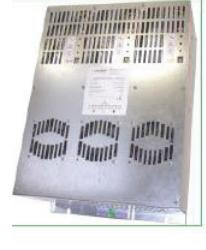

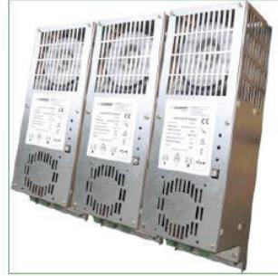

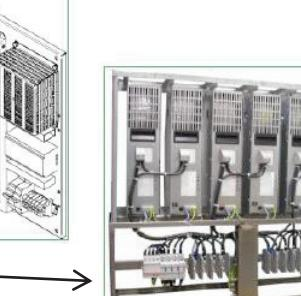

#### DRS 4 documentation du COMPACTO II®(suite)

Informations de Commande

V E M C - 0 0 3 - A - 1 A 1 A - 230 – S

Modèle VEMC : Variateur Electronique Monophasé Compacto

VETC : Variateur Electronique Triphasé Compacto (pour 4.5 & 6 kVA - 120 / 210 V ou 9 &

12 kVA– 230 / 400 V)

VETCS : Variateur Electronique Triphasé Compacto Série (pour puissances = ou > à 54

kVA)

#### Puissances

003 : 1 x 3 kVA sur une phase 036 : 3 x 12 kVA par Phase

006 : 1 x 6 kVA sur une phase 054 : 3 x 18 kVA par Phase (9+9 kVA)

009 : 1 x 9 kVA sur une phase 072 : 3 x 24 kVA par Phase (12+12 kVA)

012 : 1 x 12 kVA sur une phase 108 : 3 x 36 kVA par Phase (12+12+12 kVA)

018 : 3 x 6 kVA par Phase 144 : 3 x 48 kVA par Phase (12+12+12+12 kVA)

027 : 3 x 9 kVA par Phase PPP : Sur demande particulière

Type A : Type intérieur IP 20

B : Type extérieur - étanche IP 68 (pour l'instant en Compacto TT - 6 kVA - 230 /

240 V ou 3 kVA - 127 V)

Option 1 XXX : Standard XX 1 X : Standard

2 XXX : COMPACTO II® (2ème génération)XX 2 X : Alimentation pour horloge

astronomique

X A XX : Standard XXX A : Standard n pour les 6 & 9 kVA

Tension 120 : 120 V 277 : 277 V

230 : 230 V 347 : 347 V 240 : 240 V 480 : 480 V

Etoile / S : Star - Etoile (montage entre le neutre et une phase)

Triangle D : Delta - Triangle (Absence de neutre - montage entre 2 phases)

DRS 5 : relevé de la consommation sur 15 luminaires (ensemble lampe plus amorceur)

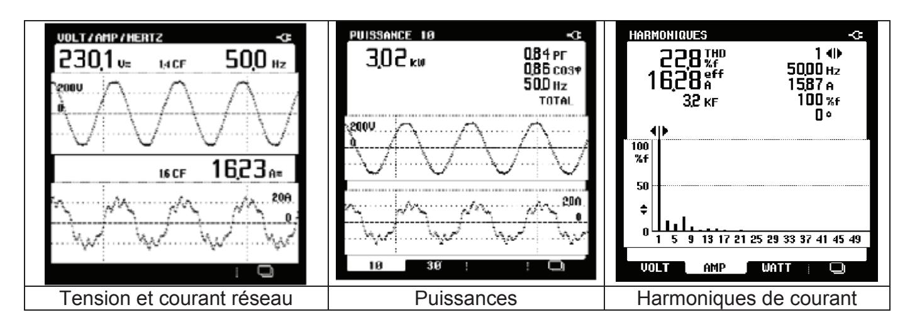

#### DRS 6 : lampe SHP SON T PIA PLUS

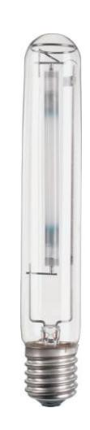

## MASTER SON-T PIA Plus

MASTER SON-T PIA Plus 150W/220 E40 - 1SL/12

Lampe au sodium haute pression avec technologie PIA (Antenne Intégrée Philips) à flux amélioré. La MASTER SON-T PIA Plus offre une fiabilité inégalée, un excellent maintien du flux dans le tempset une excellente durée de vie économique

| Caractéristiques générales             |                      | Coordonnée de chromaticité Y (nom.)           | 420          |
|----------------------------------------|----------------------|-----------------------------------------------|--------------|
| Culot                                  | E40 [ E40]           | Température de couleur proximale (nom.)    | 2000 K       |
| Position de fonctionnement             | UNIVERSAL [ toutes]  | Efficacité lumineuse (valeur nominale)        | 116 lm/W     |
| Durée de vie à 5% de mortalité (nom.)  | 20500 h              | Indice de rendu des couleurs (max.)           | 25           |
| Durée de vie à 10% de mortalité (nom.) | 24000 h              | Dépréciation à 2000 h                         | 99%          |
| Durée de vie à 20% de mortalité (nom.) | 28000 h              | LLMF 4000 h Rated                             | 98%          |
| Durée de vie moyenne (nom.)            | 36000 h              | Dépréciation à 5000 h                         | 97%          |
| Code Ansi HID -                        |                      | LLMF 8000 h Rated                             | 96%          |
| Description du système                 | Amorceur externe (E) | LLMF 12000 h Rated                            | 96%          |
| LSF 2000 h Rated                       | 100%                 | LLMF 16000 h Rated                            | 95%          |
| LSF 4000 h Rated                       | 99%                  | LLMF 20000 h Rated                            | 94%          |
| LSF 6000 h Rated                       | 99%                  |                                               |              |
| LSF 8000 h Rated                       | 99%                  | Caractéristiques électriques                  |              |
| LSF 12000 h Rated                      | 99%                  | Tension d'alimentation de la lampe            | 230 V [ 230] |
| LSF 16000 h Rated                      | 98%                  | Puissance (valeur nominale)                   | 154.0 W      |
| LSF 20000 h Rated                      | 95%                  | Courant lampe (EM) (nom.)                     | 1.8 A        |
|                                        |                      | Tension d'alimentation à l'allumage (max.) | 198 V        |
| Photométries et Colorimétries          |                      | Tension d'amorçage (max.)                     | 2800 V       |
| Flux lumineux (nominal) (nom.)         | 17700 lm             | Temps minimum de réamorçage (max.)            | 180 s        |
| Coordonnée trichromatique x (nom.)     | 535                  | Délai d'allumage (max.)                       | 5 s          |
|                                        |                      |                                               |              |

| Température de couleur proximale    |        |
|-------------------------------------|--------|
| (nom.)                              | 2000 K |
|                                     |        |
|                                     |        |
|                                     |        |
|                                     |        |
|                                     |        |
|                                     |        |
|                                     |        |
|                                     |        |
|                                     |        |
|                                     |        |
|                                     |        |
|                                     |        |
|                                     |        |
|                                     |        |
| Tension d'alimentation à l'allumage |        |
| (max.)                              | 198 V  |
|                                     |        |
|                                     |        |
|                                     |        |

#### DRS 7 : PARAFOUDRES (d'après merlin Gérin)

### Parafoudres **Protection secondaire** Déterminer le nombre de pôles en fonction des SLT

| Compatibilité schéma | TT  | TN-S | TN-C | IT |
|----------------------|-----|------|------|----|
| mode différentiel    |     |      |      |    |
| phase et phase       | -   | -    | -    | -  |
| phase et neutre      | OUI | OUI  | -    | -  |

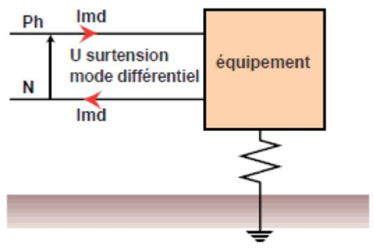

| Compatibilité schéma | TT  | TN-S | TN-C | IT                           |
|----------------------|-----|------|------|------------------------------|
| mode commun          |     |      |      |                              |
| phase et phase       | OUI | OUI  | OUI  | OUI                          |
| phase et neutre      | OUI | OUI  | -    | OUI (si neutre distribué) |

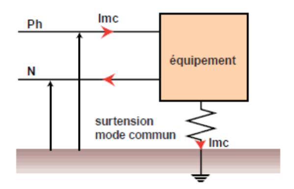

#### DRS 7 : PARAFOUDRES (d'après merlin Gérin) (suite)

#### Parafoudres **Panorama de l'offre**

Type 2: PF

#### **Fonction PF**

La gamme de parafoudre PF monobloc multipolaire est particulièrement adaptée aux schémas de liaison à la terre (régimes de neutre) TT, TN-S et IT. Les parafoudres PF avec signalisation (PF65r et PF30r) disposent de la visualisation ainsi que le report à distance de l'information "cartouche à changer". Chaque parafoudre de la gamme a une utilisation spécifique :

#### **protection de tête :**

le PF65r est conseillé pour un niveau de risque très élevé (site fortement exposé) les PF30r/PF30 sont conseillés pour un niveau de risque élevé le PF15 est conseillé pour un niveau de risque faible

#### **protection fine :**

|                                                        | le PF8 assure une protection fine des récepteurs à protéger et se place en cascade avec les parafoudres de tête. |
|--------------------------------------------------------|------------------------------------------------------------------------------------------------------------------|
| Caractéristiques communes PF                          | Caractéristiques particulières PF PF65r                                                                          |
| Fréquence : 50/60 Hz.                                  |  Protection en mode commun :                                                                                    |
|  Courant de fuite maxi < 200 μA.                      |  Imax (8/20 μs) : 65 kA                                                                                         |
|  Signalisation de fonctionnement par                  |  In (8/20 μs) : 20 kA                                                                                           |
| voyant orange :                                        |  Up : 2 kV.                                                                                                     |
|  éteint : ok                                          |  Bouton de test du voyant en face avant.                                                                        |
|  clignotant : parafoudre à changer impérativement. |  Contact de signalisation à distance :  normalement fermé                                                   |
|  Déconnexion surcharge thermique                      |  raccordement par bornes à cage 2 x 2,5                                                                         |
| intégrée au parafoudre.                                | mm2.                                                                                                             |
|  Déconnexion du parafoudre en                         |  Raccordement par bornes à cage :                                                                               |
| court-circuit à réaliser avec un                       |  phase et neutre : 25 mm2                                                                                       |
| disjoncteur (voir tableau de choix page                |  terre : 50 mm2                                                                                                 |
| 52).                                                   |  câble souple ou rigide u 10 mm2 si                                                                             |
|  Temps de réponse : < 25 ns.                          | installation avec paratonnerre.                                                                                  |
|  Courant de court-circuit interne                     | PF30r et PF30                                                                                                    |
| admissible PF8 et PF15 :                               |  Protection en mode commun :                                                                                    |
|  1P+N et 3P+N : 10 kA.                                |  Imax (8/20 μs) : 30 kA                                                                                         |
|  Courant de court-circuit interne                     |  In (8/20 μs) : 10 kA                                                                                           |
| admissible PF30 et PF65 :                              |  Up : 1,8 kV.                                                                                                   |
|  1P+N et 3P+N : 25 kA.                                |  Bouton de test du voyant en face avant.                                                                        |
|  Température de fonctionnement : -                    |  Le PF30r intègre un contact de signalisation à                                                                 |
| 25 °C à +60 °C.                                        | distance :                                                                                                       |
|  Température de stockage : -40 °C à                   |  normalement fermé                                                                                              |
| +70 °C.                                                |  raccordement par bornes à cage                                                                                 |
|  Classe de protection :                               | 2 x 2,5 mm2.                                                                                                     |
|  IP20 aux bornes                                      |  Raccordement par bornes à cage :                                                                               |
|  IP40 en face avant.                                  |  phase et neutre : 25 mm2                                                                                       |
|  Masse (g) :                                          |  terre : 50 mm2                                                                                                 |
|  1P+N : 475                                           |  câble souple ou rigide u 10 mm2 si                                                                             |
|  3P+N : 650.                                          | installation avec paratonnerre.                                                                                  |
| Normes  EN 61643-11 (Type 2)                       | PF15  Protection en mode commun :                                                                            |
|  CEI 61643-1 (classe 2 test).                         |  Imax (8/20 μs) : 15 kA                                                                                         |
|                                                        |  In (8/20 μs) : 5 kA                                                                                            |
|                                                        |  Up : 1,8 kV.                                                                                                   |
|                                                        |  Protection en mode différentiel :                                                                              |
|                                                        |  Imax (8/20 μs) : 8 kA                                                                                          |
|                                                        |  In (8/20 μs) : 2 kA                                                                                            |
|                                                        |  Up : 1 kV.                                                                                                     |
|                                                        |  Raccordement par bornes à cage :                                                                               |
|                                                        |  phase et neutre : 16 mm2                                                                                       |
|                                                        |  terre : 25 mm2                                                                                                 |
|                                                        |  câble souple ou rigide u 10 mm2 si                                                                             |
|                                                        | installation avec paratonnerre.                                                                                  |
|                                                        | PF8                                                                                                              |
|                                                        |  Protection en mode commun :                                                                                    |
|                                                        |  Imax (8/20 μs) : 8 kA                                                                                          |
|                                                        |  In (8/20 μs) : 2 kA                                                                                            |
|                                                        |  Up : 1,5 kV.                                                                                                   |
|                                                        |  Protection en mode différentiel :                                                                              |
|                                                        |  Imax (8/20 μs) : 8 kA                                                                                          |
|                                                        |  In (8/20 μs) : 2 kA                                                                                            |
|                                                        |  Up : 1 kV.                                                                                                     |
|                                                        |  Raccordement par bornes à cage :                                                                               |
|                                                        |  phase et neutre : 16 mm2                                                                                       |
|                                                        |  terre : 25 mm2                                                                                                 |
|                                                        |  câble souple ou rigide u 10 mm2 si                                                                             |
|                                                        | installation avec paratonnerre.                                                                                  |

#### DRS 7 : PARAFOUDRES (d'après merlin Gérin) (suite)

### Parafoudres **Panorama de l'offre**

Type 2: PF

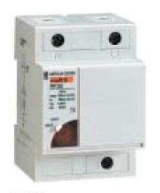

| Références PF |        |     |         |      |            |       |  |
|---------------|--------|-----|---------|------|------------|-------|--|
| Type          |        | Un  | Uc (V)  | In   | Largeur    | Réf.  |  |
|               |        | (V) | MC/MD   | (kA) | en modules |       |  |
|               |        |     |         |      | de 18 mm   |       |  |
| 1P+N          | PF 65r | 400 | 440     | 20   | 7          | 15684 |  |
|               | PF 30r | 400 | 440     | 10   | 3          | 15689 |  |
|               | PF 30  | 400 | 440     | 10   | 3          | 15687 |  |
|               | PF 15  | 400 | 440/250 | 5    | 2          | 15692 |  |
|               | PF 8   | 400 | 440/250 | 2    | 2          | 15695 |  |

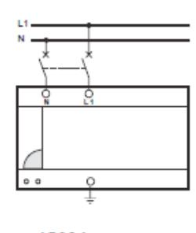

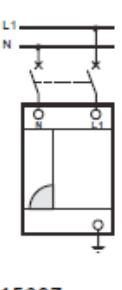

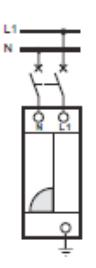

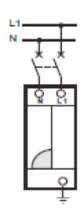

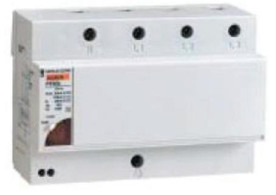

|      | Références PF |     |         |      |            |       |  |  |
|------|---------------|-----|---------|------|------------|-------|--|--|
| Type |               |     | Uc (V)  | In   | Largeur    | Réf.  |  |  |
|      |               | (V) | MC/MD   | (kA) | en modules |       |  |  |
|      |               |     |         |      | de 18 mm   |       |  |  |
| 3P+N | PF 65r        | 400 | 440     | 20   | 7          | 15685 |  |  |
|      | PF 30r        | 400 | 440     | 10   | 7          | 15690 |  |  |
|      | PF 30         | 400 | 440     | 10   | 4          | 15688 |  |  |
|      | PF 15         | 400 | 440/250 | 5    | 4          | 15693 |  |  |
|      | PF 8          | 400 | 440/250 | 2    | 4          | 15696 |  |  |

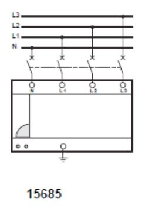

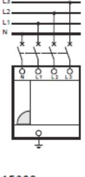

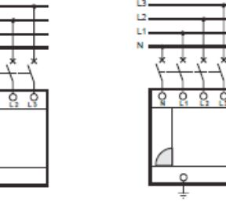

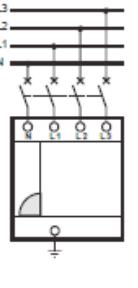

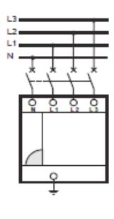

#### DRS 7 : PARAFOUDRES (d'après merlin Gérin) (suite)

### Installations **Les règles générales d'installation** La déconnexion des parafoudres

La déconnexion des parafoudres

Trois types de protection sont à assurer avec un parafoudre:

- la protection interne contre le vieillissement
- la protection externe contre les courants de court-circuit
- la protection contre les contacts indirects, si nécessaire.

Protection contre le vieillissement :

Déconnexion intégrée au parafoudre

Le parafoudre à varistance est caractérisé par un courant de fuite très faible (< 1 mA). Etant à base de semi-conducteur, son courant de fuite augmente très légèrement à chaque choc de foudre. Cela entraîne un échauffementet à la longue un vieillissement du composant par emballement thermique, voire une destruction.

Aussi un système de déconnexion thermique interne mettra hors circuit le parafoudre en fin de vie, avant d'atteindre l'échauffement maximum admissible.

Un voyant signalera cet état à l'utilisateur. Sur certains parafoudres, on disposera en plus d'un contact de report à distance (fig. 10).

La durée de vie d'un parafoudre est importante s'il est correctement choisi en fonction de l'installation à protéger. Elle est comparable aux autres produits modulaires installés dans le tableau électrique.

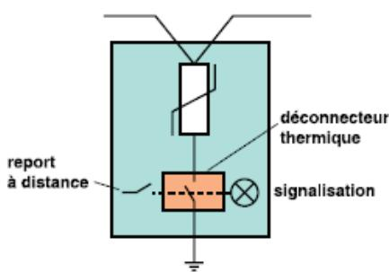

Protection contre les court-circuits :

Déconnexion extérieure au parafoudre

Un des paramètres du parafoudre est la valeur du courant maximum (I max en onde 8/20 μs) qu'il peut supporter sans dégradation. Si cette valeur est dépassée, le parafoudre sera détruit et se mettra en court-circuit définitivement. Il devra être changé impérativement. Le courant de défaut devra être éliminé par un déconnecteur externe placé en amont (fig. 11).

Seul un disjoncteur pourra assurer la protection complète exigée par l'installation d'un parafoudre, à savoir :

- tenue aux ondes d'essais normalisés 8/20 μs et 1,2/50 μs :
  - o ne doit pas déclencher à 20 chocs à In
  - o peut déclencher à Imax sans se détruire.
- assurer la déconnexion du parafoudre en cas de court-circuit de ce dernier

Le déconnecteur interne ne fonctionne pas dans ce cas là car il n'est sensible qu'à l'échauffement après des chocs répétitifs.

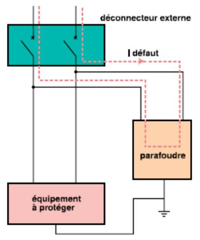

#### DRS 8 : disjoncteurs à différentiel intégré (d'après Schneider)

#### **Sectionnement et protection "tête de tableau"**

### **Disjoncteurs à différentiel intégré**

#### DDI

Les disjoncteurs différentiels de tête de tableau DDI sont destinés aux installations jusqu'à 36 kW. Ils protègent :

- les circuits contre les surcharges et les courts-circuits,
- les personnes contre les contacts indirects,
- les installations contre les défauts d'isolement.

#### **Disjoncteurs à différentiel intégré**

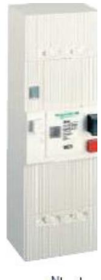

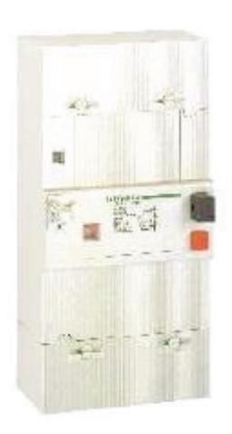

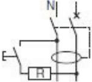

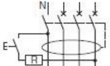

| calibre        | sensibilité | DDI - 2P | DDI - 4P |
|----------------|-------------|----------|----------|
| (A)            | (mA)        | (240 V)  | (415 V)  |
| 10/16/20/25/32 | 30          | 16871    | 16881    |
|                | 300         | 16873    | 16883    |
|                | 500         | 16874    | 16884    |
| 32/40/50/63    | 30          | 16876    | 16886    |
|                | 300         | 16878    | 16888    |
|                | 500         | 16879    | 16889    |

- disjoncteur avec sectionnement à coupure pleinement apparente selon EN 60947-2 (un voyant mécanique assure la visualisation de la position réelle des contacts)
- pouvoir de coupure : 4 500 A selon NF EN 60898 (6 kA selon NF EN 60947-2)
- bouton test de vérifi cation du bon fonctionnement du dispositif différentiel
- dispositif différentiel protégé contre les déclenchements intempestifs dus aux surtensions passagères (coup de foudre, manœuvre d'appareillage sur le réseau...)
- tension d'emploi : 230/415 V CA
- réglage des calibres : 40 °C
- nombre de cycles (O-F) : 10 000
- tropicalisation exécution 1 (humidité relative 90 % à 40 °C)
- raccordement par bornes orientables de 35 mm2 (câble cuivre), vis de serrage imperdables (bornes de pôle neutre repérées en bleu)
- fixation sur rail symétrique avec platine (fonctionne dans toutes les positions)
- livré avec un jeu de cache-bornes plombables
- couleur blanc RAL 9010

#### DRS 9 : VARIATEURS REGULATEURS 'COMPACTO' TARIFS 2017

| VARIATEUR MONOPHASE -230V                 |                |  |  |  |
|-------------------------------------------|----------------|--|--|--|
| Fixation murale ou en armoire             |                |  |  |  |
| Puissance                                 | Prix H.T ( € ) |  |  |  |
| 3 KVA                                     | 1 160,00 €     |  |  |  |
| 4 KVA                                     | 1 215,00 €     |  |  |  |
| 6 KVA                                     | 1 432,00 €     |  |  |  |
| 9 KVA                                     | 1 758,00 €     |  |  |  |
| 12 KVA                                    | 2 017,00 €     |  |  |  |
| 24 KVA                                    | 3 424,00 €     |  |  |  |
| Alimentation pour horloge Astronomique | 83,00 €        |  |  |  |

| VARIATEUR TRIPHASÉ -230V               |                |  |  |  |  |
|-------------------------------------------|----------------|--|--|--|--|
| Fixation murale ou en armoire             |                |  |  |  |  |
| Puissance                                 | Prix H.T ( € ) |  |  |  |  |
| 9 KVA                                     | 3 518 €        |  |  |  |  |
| 12 KVA                                    | 3 581 €        |  |  |  |  |
| 18 KVA                                    | 3 899 €        |  |  |  |  |
| 27 KVA                                    | 4 086€         |  |  |  |  |
| 36 KVA                                    | 4 287 e        |  |  |  |  |
| Alimentation pour horloge Astronomique | 83,00 €        |  |  |  |  |

#### DRS 10 : commande SMS de l'Augier-Box

Correspondance entre les commandes SMS et le mode de fonctionnement de l'Augier-Box :

|   | Commandes SMS       | Mode de fonctionnement de l'Augier-Box          |
|---|---------------------|-------------------------------------------------|
| 1 | #xxxx#ON PERMANENT  | ON PERMANENT                                    |
| 2 | #xxxx#ON            | ON DEROGATION                                   |
| 3 | #xxxx#AUTO          | AUTO                                            |
| 4 | #xxxx#OFF           | OFF DEROGATION                                  |
| 5 | #xxxx#OFF PERMANENT | OFF PERMANENT                                   |
| 6 | #xxxx#STATUS        | Pas de changement de mode, l'Augier-Box renvoie |
|   |                     | les informations sur son état.                  |

Exemples :

Commande : **#0000#STATUS**

Réponse : **Augier Box N1**

**MODE AUTO Commande : ON OK. Pas d'alarme.**

Commande : #0000#ON

Réponse : **Augier Box N1**

**MODE ON DEROGATION**

Commande : **#0000# OFF PERMANENT**

Réponse : **Augier Box N1**

**MODE OFF PERMANENT**

#### Définition des commandes :

- 1. Mode : ON PERMANENT : l'éclairage reste allumé en permanence
- 2. Mode : OFF PERMANENT : l'éclairage reste éteint en permanence
- 3. Mode : AUTO : l'éclairage est allumé par l'horloge astronomique.
- 4. Mode : ON DEROGATION : l'éclairage s'allume. Le passage de ON DEROGATION à AUTO se fait au moment où le cycle normal de l'horloge astronomique passe de éteint à allumé.
- 5. Mode : OFF DEROGATION : l'éclairage s'éteint. Le passage de OFF DEROGATION à AUTO se fait au moment où le cycle normal de l'horloge astronomique passe de allumé à éteint.

#### Autres commandes

#### **SWITCH**

|        | L'AugierBox renvoie les dates & heures d'allumage et extinction forcés programmées. |                                                                                                                                                                                                                |        |
|--------|----------------------------------------------------------------------------------------|----------------------------------------------------------------------------------------------------------------------------------------------------------------------------------------------------------------|--------|
|        | Syntaxe commande                                                                       | Syntaxe retour                                                                                                                                                                                                 | Erreur |
| SWITCH | #MotDePasse#SWITCH #0000#SWITCH                                                     | Augier Box N1 DATE:25/12 FORCED SWITCH ON: 10h00 TIME: 60mn DATE:25/12 FORCED SWITCH OFF: 0h00 TIME: 120mn Ou Augier Box N1 NO FORCED SWITCH ON NO FORCED SWITCH OFF |        |

#### DRS 10 : commande SMS de l'Augier-Box (suite)

#### **SWITCHON**

| SWITCHON | Enclenche l'éclairage à une heure et durée (facultatif) précise. Si aucune durée n'est précisée, la commande équivaut à une commande « ON » |                                                                          |        |  |  |  |  |  |  |  |  |  |
|----------|---------------------------------------------------------------------------------------------------------------------------------------------------|--------------------------------------------------------------------------|--------|--|--|--|--|--|--|--|--|--|
|          | Syntaxe commande                                                                                                                                  | Syntaxe retour                                                           | Erreur |  |  |  |  |  |  |  |  |  |
|          | #MotDePasse#SWITCHON#Date#Heure#Durée# #0000#SWITCHON#25/12#10h00#60#                                                                          | Augier Box N1 DATE: 25/12 FORCED SWITCH ON: 10h00 TIME: 60mn |        |  |  |  |  |  |  |  |  |  |
|          | # MotDePasse #SWITCHON#Date#Heure# #0000#SWITCHON#25/12#10h00#                                                                                 | Augier Box N1 DATE:25/12 FORCED SWITCH ON: 10h00 TIME: 0mn   |        |  |  |  |  |  |  |  |  |  |

#### **SWITCHOFF**

|           | Déclenche l'éclairage à une heure et durée (facultatif) précise. Si aucune durée n'est précisée, la commande équivaut à une commande « OFF » |                |                                                                             |  |  |  |  |  |  |  |  |
|-----------|----------------------------------------------------------------------------------------------------------------------------------------------------|----------------|-----------------------------------------------------------------------------|--|--|--|--|--|--|--|--|
|           | Syntaxe commande                                                                                                                                   | Syntaxe retour | Erreur                                                                      |  |  |  |  |  |  |  |  |
| SWITCHOFF | #MotDePasse#SWITCHOFF#Date#Heure#Durée# #0000#SWITCHOFF#25/12#0h00#60#                                                                          |                | Augier Box N1 DATE:25/12 FORCED SWITCH OFF: 10h00 TIME: 60mn |  |  |  |  |  |  |  |  |
|           | #MotDePasse#SWITCHOFF#Date#Heure# #0000#SWITCHOFF#25/12#0h00#                                                                                   |                | Augier Box N1 DATE:25/12 FORCED SWITCH OFF: 0h00 TIME: 60mn  |  |  |  |  |  |  |  |  |

| Modèle CMEN-D                                                                                                                                                                                                                                                                                                                                                                                                                                                               | OC v2 ©NEOPTEC          |              |                |              |           |              |                     |        |       |      | _ |     |  |    |  |  |  | _ |
|-----------------------------------------------------------------------------------------------------------------------------------------------------------------------------------------------------------------------------------------------------------------------------------------------------------------------------------------------------------------------------------------------------------------------------------------------------------------------------|-------------------------|--------------|----------------|--------------|-----------|--------------|---------------------|--------|-------|------|---|-----|--|----|--|--|--|---|
| Nom de famille : (Suivi, s'il y a lieu, du nom d'usage)                                                                                                                                                                                                                                                                                                                                                                                                                  |                         |              |                |              |           |              |                     |        |       |      |   |     |  |    |  |  |  |   |
|                                                                                                                                                                                                                                                                                                                                                                                                                                                                             | Prénom(s) :             |              |                |              |           |              |                     |        |       |      |   |     |  |    |  |  |  |   |
|                                                                                                                                                                                                                                                                                                                                                                                                                                                                             | Numéro Inscription : | e numéro est | celui qui fiqu | re sur la co | onvocatio | on ou la feu | ille d'ém           | argeme | Né(e) | le : |   | ]/[ |  | ]/ |  |  |  |   |
| (Le numéro est celui qui figure sur la convocation ou la feuille d'émargement)  (Remplir cette partie à l'aide de la notice)  Concours / Examen : Section/Spécialité/Série :                                                                                                                                                                                                                                                                                                |                         |              |                |              |           |              |                     |        |       |      |   |     |  |    |  |  |  |   |
| Epreuve :                                                                                                                                                                                                                                                                                                                                                                                                                                                                   |                         |              |                |              |           |              | Matière : Session : |        |       |      |   |     |  |    |  |  |  |   |
| <ul> <li>Remplir soigneusement, sur CHAQUE feuille officielle, la zone d'identification en MAJUSCULES.</li> <li>Ne pas signer la composition et ne pas y apporter de signe distinctif pouvant indiquer sa provenance.</li> <li>Numéroter chaque PAGE (cadre en bas à droite de la page) et placer les feuilles dans le bon sens et dans l'ordre.</li> <li>Rédige tavec un stylo à encre foncée (bleue ou intro et le pas utiliser de stylo plume à encre claire.</li> </ul> |                         |              |                |              |           |              |                     |        |       |      |   |     |  |    |  |  |  |   |

EDE ENE 2

**DR1 - DR2** 

## Document réponse DR1

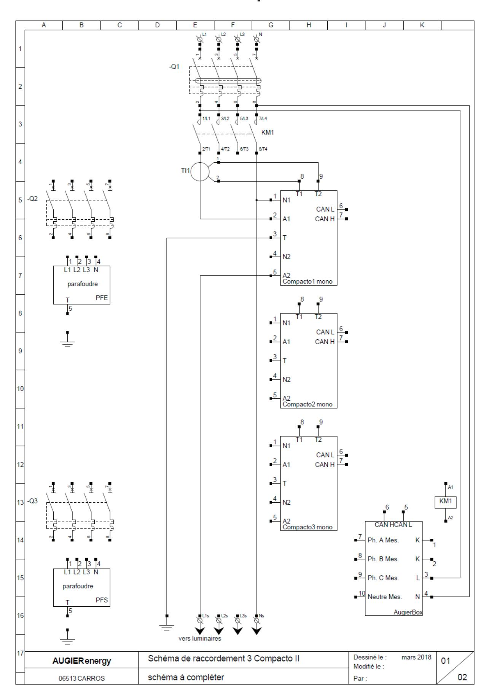

Document réponse DR2

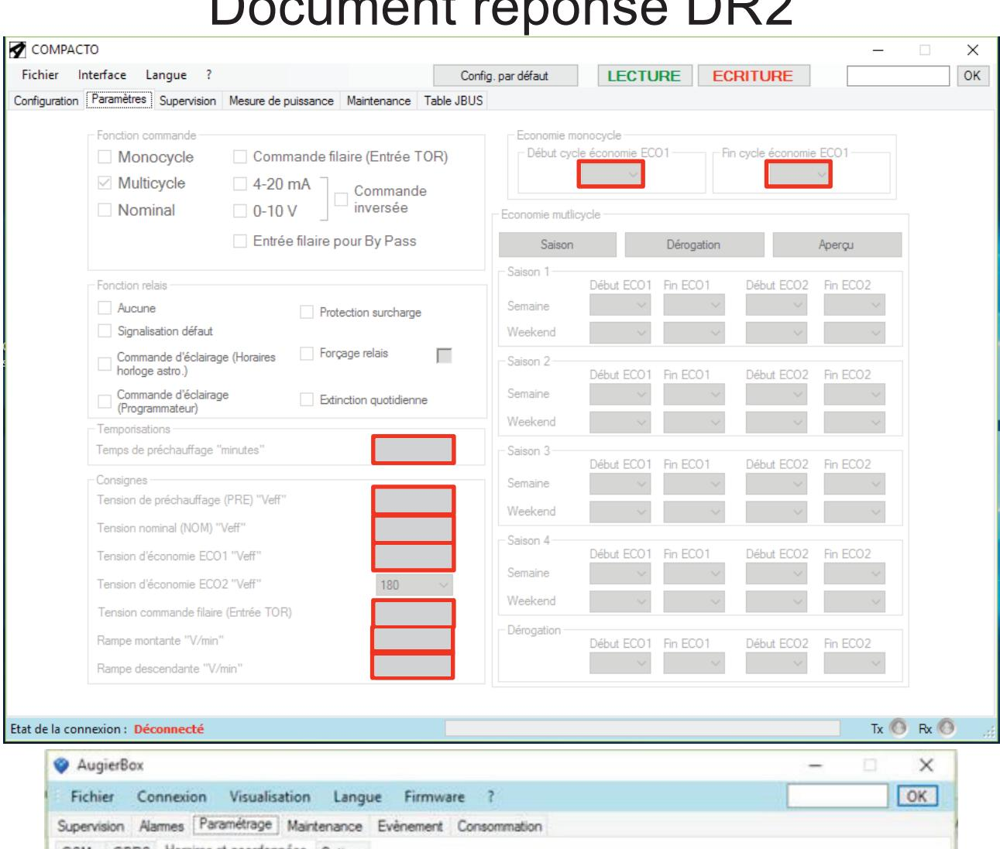

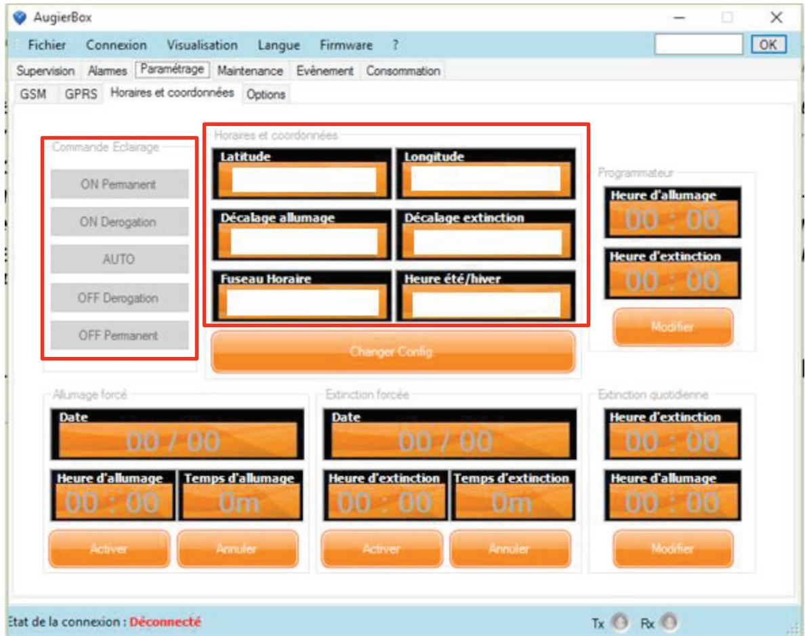

| Modèle CMEN-D                                                                                                                                                                                                                                                                                                                                                                                                                                                                | OC v2 ©NEOPTEC          |              |                |            | _       |            |               |                     |       |      |  |  |  |     |  |                    |  | _ |
|------------------------------------------------------------------------------------------------------------------------------------------------------------------------------------------------------------------------------------------------------------------------------------------------------------------------------------------------------------------------------------------------------------------------------------------------------------------------------|-------------------------|--------------|----------------|------------|---------|------------|---------------|---------------------|-------|------|--|--|--|-----|--|--------------------|--|---|
| Nom de famille : (Suivi, s'il y a lieu, du nom d'usage)                                                                                                                                                                                                                                                                                                                                                                                                                   |                         |              |                |            |         |            |               |                     |       |      |  |  |  |     |  | 丄                  |  |   |
| <b>■</b> %■                                                                                                                                                                                                                                                                                                                                                                                                                                                                  | Prénom(s) :             |              |                |            |         |            |               |                     |       |      |  |  |  |     |  | $\perp$            |  | ] |
|                                                                                                                                                                                                                                                                                                                                                                                                                                                                              | Numéro Inscription : | e numéro est | celui qui fiai | ıre sur la | convoca | tion ou li | a feuille d'é | margem              | Né(e) | le : |  |  |  | ]/[ |  | $\overline{\perp}$ |  | ] |
| (Le numéro est celui qui figure sur la convocation ou la feuille d'émargement)  (Remplir cette partie à l'aide de la notice)  Concours / Examen : Section/Spécialité/Série :                                                                                                                                                                                                                                                                                                 |                         |              |                |            |         |            |               |                     |       |      |  |  |  |     |  |                    |  |   |
|                                                                                                                                                                                                                                                                                                                                                                                                                                                                              | Epreuve:                |              |                |            |         |            |               | Matière : Session : |       |      |  |  |  |     |  |                    |  |   |
| <ul> <li>Remplir soigneusement, sur CHAQUE feuille officielle, la zone d'identification en MAJUSCULES.</li> <li>Ne pas signer la composition et ne pas y apporter de signe distinctif pouvant indiquer sa provenance.</li> <li>Numéroter chaque PAGE (cadre en bas à droite de la page) et placer les feuilles dans le bon sens et dans l'ordre.</li> <li>Rédiger avec un stylo à encre foncée (bleue ou noire) et ne pas utiliser de stylo plume à encre claire.</li> </ul> |                         |              |                |            |         |            |               |                     |       |      |  |  |  |     |  |                    |  |   |

EDE ENE 2

DR3

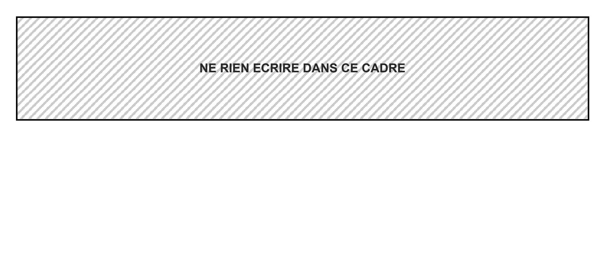

### Document réponse DR3

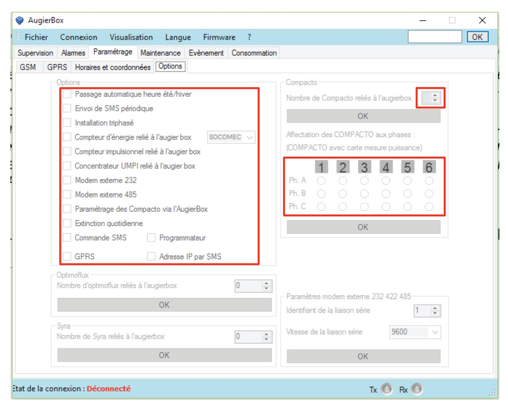

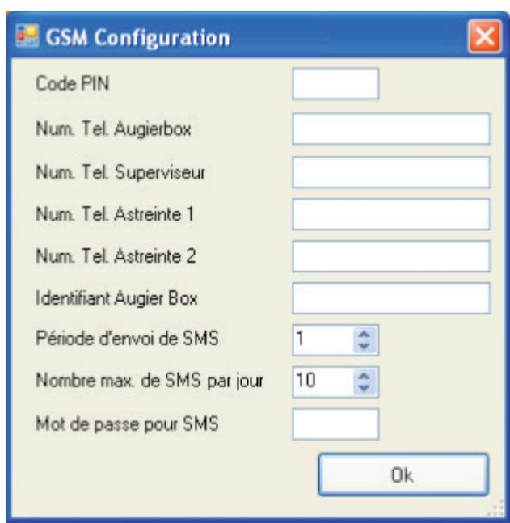