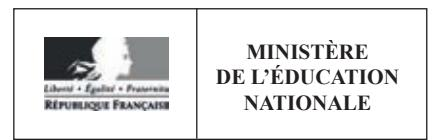

**EDE STI 1** 

### **SESSION 2019**

# CAPET CONCOURS EXTERNE TROISIEME CONCOURS ET CAFEP CORRESPONDANT

Section : SCIENCES INDUSTRIELLES DE L'INGÉNIEUR

Option: INGÉNIERIE DES CONSTRUCTIONS

Option: INGÉNIERIE ÉLECTRIQUE Option: INGÉNIERIE INFORMATIQUE Option: INGÉNIERIE MÉCANIQUE

# ANALYSE ET EXPLOITATION PÉDAGOGIQUE D'UN SYSTEME PLURITECHNIQUE

Durée: 5 heures

Calculatrice électronique de poche - y compris calculatrice programmable, alphanumérique ou à écran graphique – à fonctionnement autonome, non imprimante, autorisée conformément à la circulaire n° 99-186 du 16 novembre 1999.

L'usage de tout ouvrage de référence, de tout dictionnaire et de tout autre matériel électronique est rigoureusement interdit.

Si vous repérez ce qui vous semble être une erreur d'énoncé, vous devez le signaler très lisiblement sur votre copie, en proposer la correction et poursuivre l'épreuve en conséquence. De même, si cela vous conduit à formuler une ou plusieurs hypothèses, vous devez la (ou les) mentionner explicitement.

NB: Conformément au principe d'anonymat, votre copie ne doit comporter aucun signe distinctif, tel que nom, signature, origine, etc. Si le travail qui vous est demandé consiste notamment en la rédaction d'un projet ou d'une note, vous devrez impérativement vous abstenir de la signer ou de l'identifier.

### **INFORMATION AUX CANDIDATS**

Vous trouverez ci-après les codes nécessaires vous permettant de compléter les rubriques figurant en en-tête de votre copie. Ces codes doivent être reportés sur chacune des copies que vous remettrez.

Concours externe du CAPET de l'enseignement public :

| • option | option : Ingénierie des constructions |                                                |                     |                   |
|----------|---------------------------------------|------------------------------------------------|---------------------|-------------------|
| • option | Concours  EDE  Ingénierie électri     | Section/option 1411E                           | Epreuve 101         | Matière 7809      |
| • option | Concours  EDE  Ingénierie inform      | Section/option 14195                           | Epreuve 101         | Matière 7809      |
| • option | Concours  EDE  : Ingénierie mécar     | Section/option 1413E                           | Epreuve 101         | Matière 7809      |
|          | Concours                              | Section/option  1414E  PET de l'enseignement p | Epreuve 101         | Matière 7809      |
|          | : Ingénierie des co Concours       | Section/option 1411E                           | Epreuve             | Matière 7809      |
|          | Concours EDF  : Ingénierie électri    | Section/option 1419E                           | Epreuve 101         | Matière 7809      |
|          | Concours EDF  : Ingénierie méd        | Section/option 1413E                           | Epreuve 101         | Matière 7809   |
|          | Concours                              | Section/option  1414E  APET de l'enseignement  | Epreuve 101 public: | Matière 7809      |
|          | : Ingénierie des co                   |                                                |                     |                   |
| • option | Concours  EDV  Ingénierie électri     | Section/option [1]4]1]E  que                   | Epreuve 101         | Matière [7 8 0 9] |
| • option | Concours EDV : Ingénierie inform      | Section/option 14195                           | Epreuve 101         | Matière [7 8 0 9] |
|          | Concours EDV : Ingénierie mécan       | Section/option 1413E                           | Epreuve 101         | Matière [7 8 0 9] |
| эрион    | Concours EDV                       | Section/option 1414E                           | Epreuve 101         | Matière 7809      |

### **Constitution du dossier :**

- − texte (mise en situation et questionnement), pages 2 à 27 ;
- − documents annexes, pages 28 à 35 ;
- − documents réponses, pages 36 à 40.

### **Conseils au candidat**

Vérifier que tous les documents définis ci-dessus sont présents. La phase d'appropriation d'un système pluri-technologique passe par la lecture attentive de l'ensemble du sujet. Il est fortement conseillé de consacrer au moins 30 minutes à cette phase indispensable de découverte.

### **SYSTÈME DE TRANSPORT URBAIN PAR CÂBLE**

### **I. Mise en situation**

### **1. Contexte**

La mobilité joue un rôle prépondérant dans le quotidien et le fonctionnement des sociétés. Il existe plusieurs modes et services d'aide aux déplacements des personnes et des marchandises. Or, nombre d'entre eux pèsent lourd sur l'environnement et la santé, tout en ayant un rôle fondamental dans l'économie et donc sur le plan social.

En 2015, l'Agence de l'environnement et de la maîtrise de l'énergie (ADEME) annonçait que le secteur des transports était le premier émetteur de gaz à effet de serre (28 % des émissions sont dus au secteur des transports, dont 91 % plus spécifiquement aux modes routiers). Cette problématique invite l'ensemble des sociétés modernes à repenser les modes de déplacements et encourage à transporter et à se déplacer mieux et autrement tout en garantissant une qualité de service pour les usagers.

Les solutions de transport aérien par câble s'imposent de plus en plus en milieu urbain, notamment pour réunifier une agglomération morcelée, désenclaver des populations excentrées, reconnecter des zones d'activités à des centres-villes. L'entreprise française POMA, leader mondial du transport par câble, propose depuis 2003 des systèmes complètement intégrés aux réseaux de transports urbains.

Ces solutions permettent de s'affranchir des obstacles naturels ou urbains – lac, fleuve, réseau routier ou ferré, immeubles... – et de s'élever sur des dénivelés importants (voir figures 1 et 2).

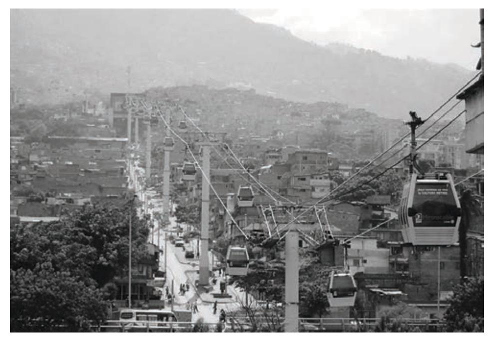

Figure 1 – Exemple d'installation existante pour l'accès aux reliefs de Medellín (Colombie)

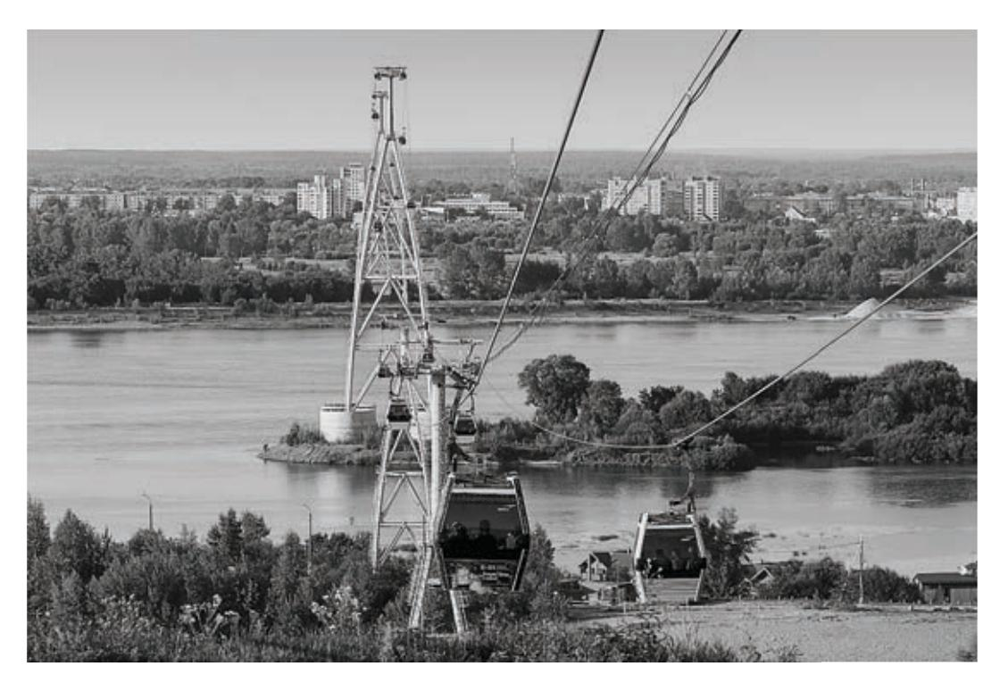

Figure 2 – Exemple d'installation existante pour le franchissement d'un fleuve à Nizhny Novgorod Bor (Russie)

Au cœur de tissus urbains de plus en plus saturés, des lignes directes, autorisant des trajets rapides et des horaires fiables, indépendamment des facteurs météorologiques et des aléas de la circulation routière, sont autant d'avantages appréciés par les usagers.

Les agglomérations approuvent également la faible emprise foncière, limitée aux gares et aux pylônes, et les habitants le fonctionnement silencieux des cabines, minimisant la pollution sonore.

### **2. Orientation de l'étude**

Dérivées d'un contexte de loisir, les cabines de ces installations sont passives, n'offrant qu'une ventilation naturelle, ou simplement équipées de batteries et de panneaux solaires pour assurer l'éclairage. De nos jours, les usagers attendent un minimum de confort, chauffage, climatisation et de connectivité, écran d'informations et haut-parleurs (voir figure 3).

On se propose ainsi d'étudier la rétroconception thermique des cabines d'une installation existante, réalisée par le groupe POMA, pour répondre aux exigences de confort (id 1.4) en zone tropicale (voir figure 4)**.** Les exigences techniques de l'exploitant de l'installation et les hypothèses de dimensionnement utilisées sont réalistes mais ne correspondent pas nécessairement aux choix retenus dans les solutions déployées sur le système final.

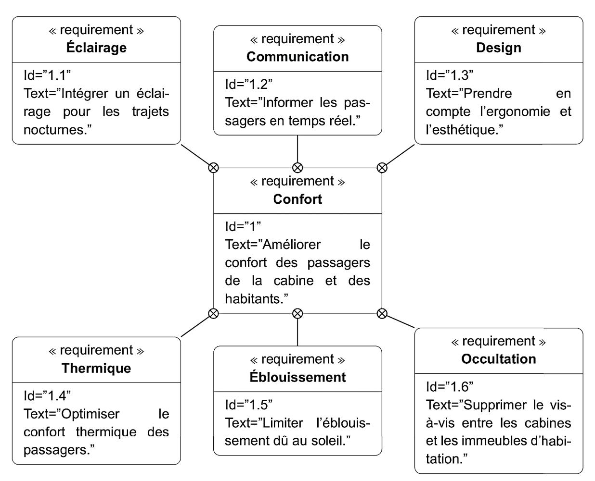

Figure 3 – Diagramme des exigences partiel relatif à la rétroconception

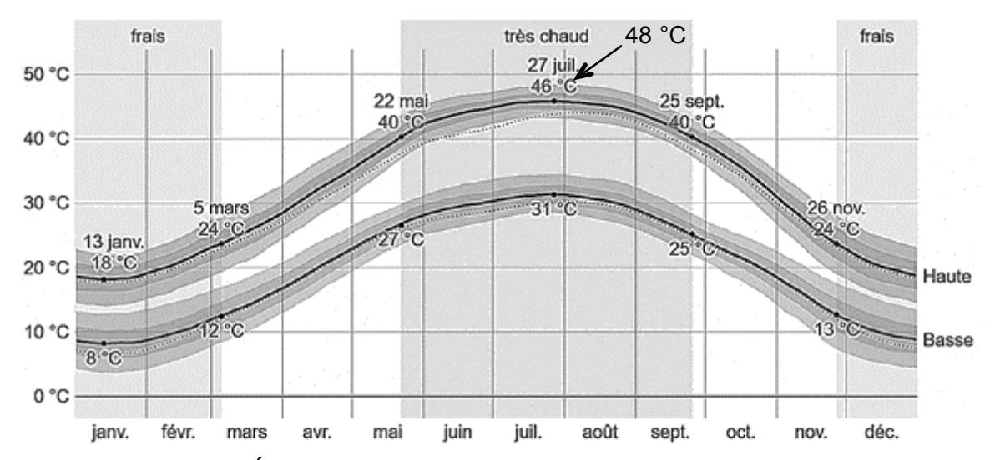

Figure 4 – Évolution annuelle des températures du site considéré

### 3. Présentation de l'installation existante

L'installation existante se situe dans une ville des caraïbes présentant peu de dénivelé et traversée par deux cours d'eau.

La ligne est constituée en deux tronçons indépendamment motorisés (voir figure 5) : l'une des motorisations se situe au niveau du terminal T2, l'autre au niveau du terminal T3B.

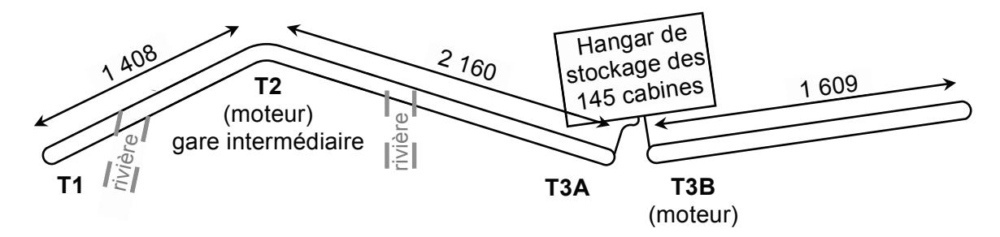

Figure 5 – Schématisation de la ligne étudiée (vue de dessus)

Au T2 se situe également une gare intermédiaire. Les gares T3A et T3B sont indépendantes : le débarquement/réembarquement des passagers est obligatoire pour poursuivre le trajet.

Les gares sont connectées au réseau de bus de la ville (voir figure 6).

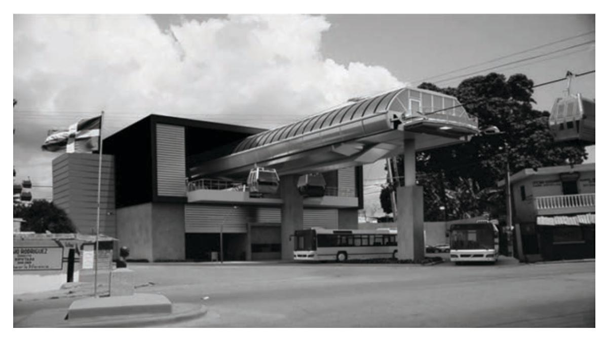

Figure 6 – Illustration d'une gare intermodale bus/télécabine

| Longueur I 23                         | 2 160 m                   |
|--------------------------------------------------|---------------------------|
| Nombre de cabines $n_c$                          | 60                        |
| Nombre de places par cabine $n_{p max}$          | 10                        |
| Vitesse moyenne de déplacement des cabines $v_0$ | 5 m·s -1       |
| Débit Q                                          | 3 000 personnes par heure |

Tableau 1 – Données sur le tronçon T2-T3A

Les cabines (voir figure 7) sont équipées de panneaux solaires (voir figure 7, à droite) et batteries alimentant éclairage et haut-parleurs. Les informations sont communiquées aux passagers par radio.

Une structure porteuse est associée à chaque cabine (voir figure 8).

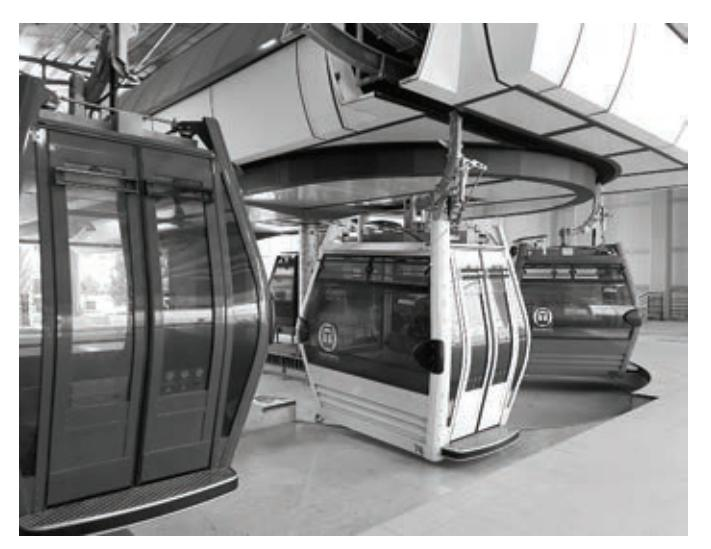

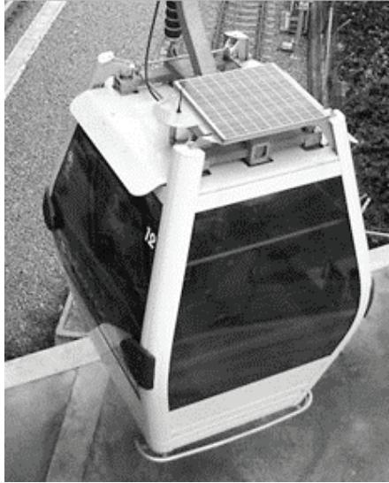

Figure 7 – Cabine actuellement utilisée sur la ligne existante

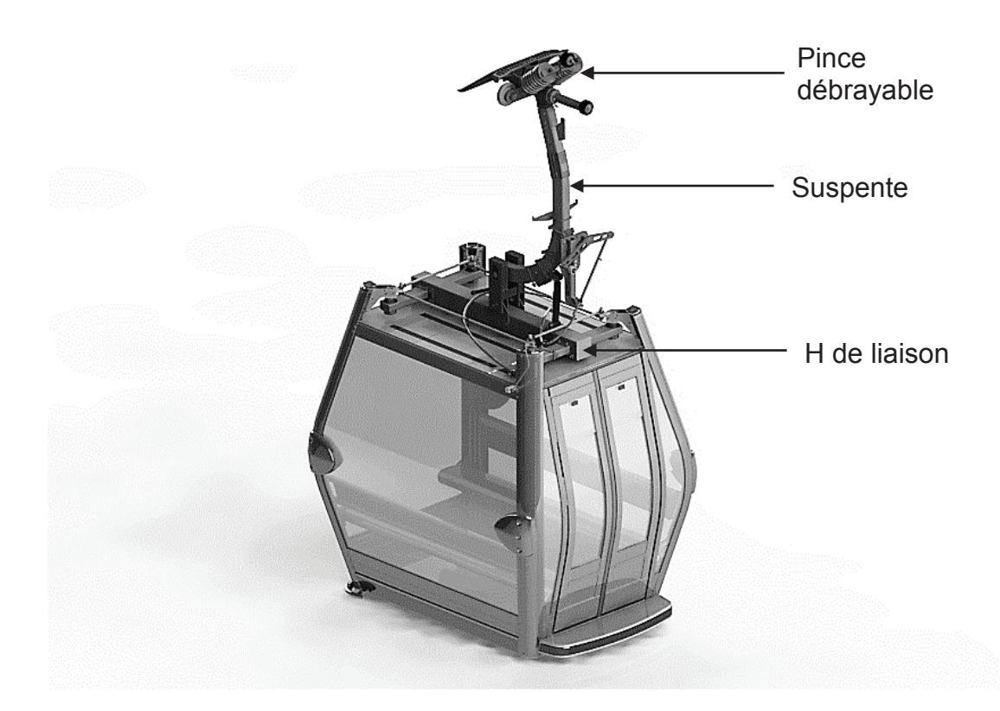

Figure 8 – Principaux éléments constitutifs de la structure porteuse

### **4. Performances attendues**

On donne figure 9 un extrait du cahier des charges relatif à la rétroconception envisagée pour la partie thermique.

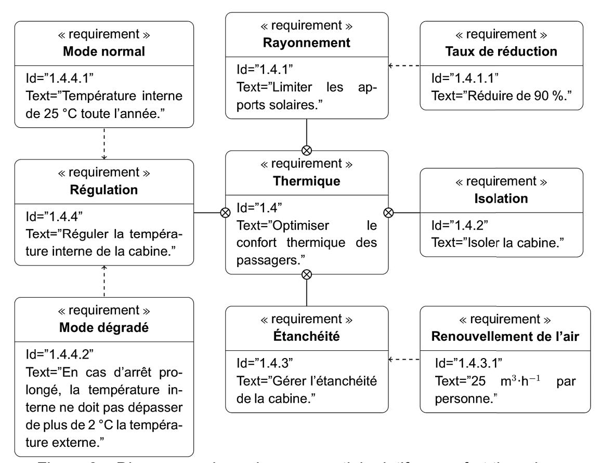

Figure 9 – Diagramme des exigences partiel relatif au confort thermique

### **5. Organisation de la rétroconception**

La première partie permet d'évaluer l'impact des modifications envisagées sur la masse de l'ensemble suspendu.

La seconde partie consiste à satisfaire l'exigence 1.4.1 avec des vitrages à teinte variable et la mise en place d'une gestion automatisée de l'occultation.

La troisième partie propose l'étude thermique d'une cabine isolée, exigence 1.4.2, afin de déterminer la puissance frigorifique nécessaire au respect de l'exigence 1.4.4, puis de valider le choix d'un climatiseur.

Dans la quatrième partie, la question de l'autonomie énergétique nécessaire à la mise en place de ces nouveaux équipements est étudiée.

La cinquième partie permet de valider la masse maximale de la cabine assurant la sécurité des passagers.

En sixième et dernière partie, la modification du matériau d'un élément de la structure porteuse limite l'effet de l'augmentation de la masse embarquée.

### **II. Évolution de la masse de la cabine**

*Objectif : évaluer l'impact des modifications envisagées en termes de masse ajoutée.* 

Les améliorations envisagées pour satisfaire les exigences présentées figure 9 sont :

- − remplacement du vitrage actuel (plexiglas de 5 mm d'épaisseur) par un double vitrage verre-krypton-verre (4 mm/16 mm/4 mm d'épaisseur), soit un ajout de masse de 139 kg ;
- − ajout d'un isolant sur le plafond et les parois de la cabine, soit un ajout de masse de 5 kg ;
- − ajout d'une climatisation d'une masse de 35 kg ;
- − remplacement des batteries au plomb et du panneau solaire par des supercondensateurs et une batterie de secours au lithium, soit un ajout de masse de 22 kg.

### **Question 1**

Déterminer l'ajout de masse, en kg, consécutif aux modifications envisagées.

L'ensemble suspendu (cabine et sa structure porteuse) possède initialement une masse de 1 800 kg. On estime une majoration possible de 10 % après modification sans que cela nuise à la sécurité des passagers.

### **Question 2**

Déterminer l'augmentation de masse possible pour l'ensemble suspendu. Le résultat obtenu est-il compatible avec celui de la question précédente ? Argumenter la réponse.

Citer trois possibilités permettant de gagner de la masse sur l'ensemble suspendu.

*Conclusion : après avoir mis en œuvre les solutions validant le confort thermique, il faudra réaliser un gain de masse sur l'ensemble suspendu.* 

### **III. Mise en œuvre d'un système d'occultation solaire**

Afin de minimiser les apports solaires, mais aussi d'éviter l'éblouissement des passagers, on envisage le remplacement des vitrages par un modèle à teinte variable SageGlass (voir figure 10) commercialisé par la société Saint-Gobain. Ceuxci utilisent un revêtement déposé sur la face intérieure du verre extérieur du doublevitrage, qui permet de se teinter sur ordre.

### **1. Principe de fonctionnement du système d'occultation**

La teinte est obtenue sous l'action d'une tension *U*, provoquant un transfert des ions lithium et des électrons d'une couche électrochrome à une autre (voir figure 11). Les couches conductrices transparentes (CT1 et CT2) forment un sandwich autour de la couche électrochrome (EC), du conducteur ionique (CI) et de la contreélectrode (CE). Lorsque que l'on applique une tension positive *U = Uop* avec *Uop* = 3 V entre les couches conductrices transparentes (CT1 et CT2), les ions lithium passent dans le conducteur ionique (CI) et s'insèrent dans la couche électrochrome (EC), tandis qu'un électron compensateur de charge quitte la contre-électrode (CE) pour suivre le circuit extérieur et s'insérer finalement aussi dans la couche électrochrome (EC). Ces deux phénomènes ont pour effet de teinter la vitre.

Le maintien de la teinte nécessite une tension *U = Um* avec *Um* = 0,3 V.

Lorsque l'on inverse la polarité de la tension telle que *U = Uec* avec *Uec* = -1,5 V, les ions et électrons retournent sur leur couche d'origine et le vitrage s'éclaircit jusqu'à devenir à nouveau transparent.

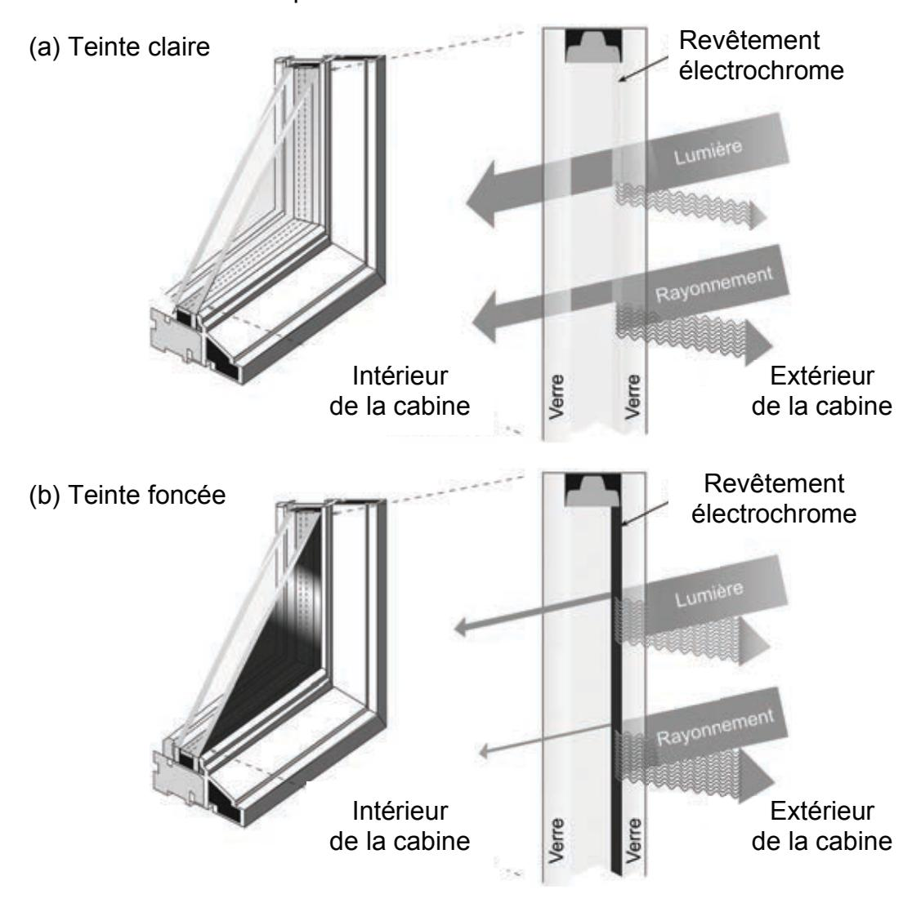

Figure 10 – Principe du vitrage à teinte variable SageGlass

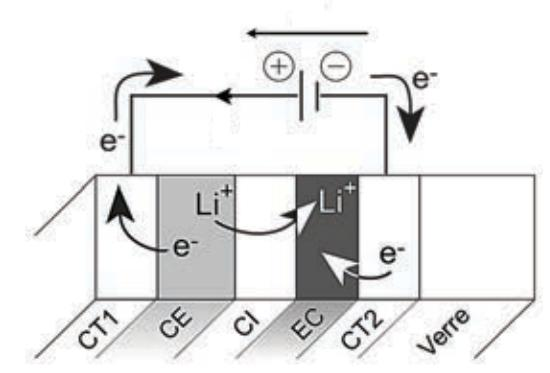

Figure 11 – Empilement des couches sur la vitre et transfert des ions Lithium

### 2. Performances

Le revêtement permet de faire varier le facteur solaire du vitrage (voir figure 12). Ce dernier traduit la capacité du vitrage à transmettre la chaleur du soleil : c'est le rapport entre l'énergie de rayonnement solaire transmise et l'énergie reçue par le vitrage (voir figure 10).

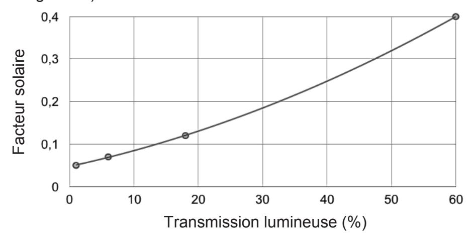

Figure 12 – Performance du vitrage dynamique SageGlass

**Objectifs** : réaliser une gestion automatique de la teinte des vitrages de la cabine et évaluer le gain sur le comportement thermique du vitrage.

### 3. Réalisation d'une gestion automatique

Pour gérer la teinte des vitrages quatre capteurs de luminosité, un par face vitrée, sont placés sur le toit. Ainsi dans la configuration de la figure 13, les vitrages à opacifier pour assurer le confort des passagers et limiter les apports thermiques sont les vitres 0 et 1.

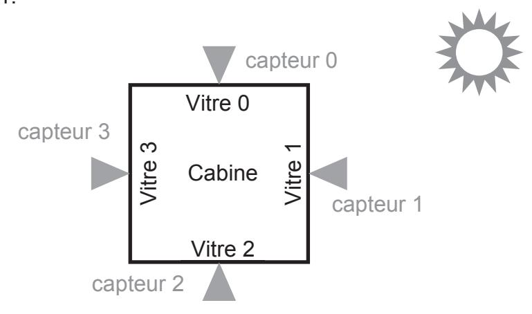

Figure 13 – Exemple de situation (vue de dessus)

On adopte la stratégie décrite par les diagrammes d'états présentés sur le document annexe 1. À la mise sous tension du système, les états initiaux de tous les diagrammes sont activés.

Des éléments de syntaxe permettant la lecture des diagrammes et l'élaboration d'un programme en Python sont précisés sur le document annexe 2.

La liste *op* (voir figure 32) contient quatre éléments, associés aux quatre vitres : *op[k]* contient la commande de teinte permettant de gérer la tension d'alimentation de la vitre *k* (*k* prenant la valeur 0, 1, 2 ou 3) : -1 pour éclaircir, 0 pour maintenir la teinte, 1 pour opacifier (voir figure 30).

Ces commandes de teinte d'un vitrage *k* sont déterminées de façon à assurer la régulation de la valeur de l'éclairement intérieur de la cabine *Eint* (définie ci-après) autour d'un seuil. On fixe ce seuil à 2 000 lux, avec une flexibilité de 5 %. Les variables globales *seuil* et *flexibilite* sont considérées définies telles que : *seuil* = 2000 et *flexibilite* = 0.05.

### **Question 3**

Indiquer, sur copie, les conditions des transitions repérées A et B sur la figure 32 du document annexe 1, permettant de déclencher l'éclaircissement des vitres opacifiées ou l'opacification des vitres ensoleillées suivant la situation.

Pour un vitrage *k*, trois grandeurs sont relevées et placées dans une liste *mesures*  (voir figure 31) :

- − l'éclairement extérieur reçu par le vitrage (en lux), dont la valeur est stockée dans *mesures[k][0]* ;
- − la tension d'alimentation du vitrage (en V), dont la valeur est stockée dans *mesures[k][1]* ;
- − l'intensité dans le circuit du vitrage (en A), dont la valeur est stockée dans *mesures[k][2]*.

La transmission lumineuse du vitrage dépend du rapport tension sur intensité (voir figure 11). De ce fait on calcule un indicateur.

### **Question 4**

Donner l'expression de l'indicateur *indicateur\_0* pour la vitre *0 (k=0)* en fonction des valeurs disponibles.

On considère pour la suite une liste *indicateurs\_calcules* (voir figure 31) contenant les indicateurs pour les quatre vitres (*indicateurs\_calcules[0]* = *indicateur\_0*).

La loi définissant la transmission lumineuse du vitrage est connue. On dispose alors de deux listes de valeurs, de même longueur :

- − *liste\_indicateurs* contient un ensemble discret d'indicateurs de transmission lumineuse couvrant la plage de fonctionnement, disposés dans l'ordre croissant ;
- − *liste\_T* contient l'ensemble discret des valeurs de transmission lumineuse associées ; *liste\_T[i]* est la valeur de transmission lumineuse associée à l'indicateur *liste\_indicateurs[i]*.

Ces deux variables sont globales.

Ainsi pour connaître la transmission lumineuse d'une vitre *k*, on détermine la position de son indicateur tel que *indicateurs\_calcules[k]* soit compris entre *liste\_indicateurs[i]* (inclus) et *liste\_indicateurs[i + 1]* (exclu).

### **Question 5**

Compléter le logigramme du document réponse 1 pour déterminer l'indice *i* et la valeur associée de transmission lumineuse notée *T\_k*.

On considère pour la suite une liste *T\_calcules* contenant les transmissions lumineuses pour les quatre vitres.

La transmission lumineuse d'un vitrage, notée *TLk* et exprimée en %, se définit à partir de l'éclairement reçu par le vitrage, noté *Erk* et exprimé en lux, et de l'éclairement transmis par le vitrage, noté *Etk* et exprimé en lux :

$$TL_k = \frac{E_{tk}}{E_{rk}}$$

L'éclairement intérieur de la cabine, noté *Eint* et exprimé en lux, est la somme des éclairements transmis *Etk* par chacun des vitrages.

### **Question 6**

Exprimer *Eint* en fonction de *Erk* et *TLk*. En langage Python ou C++ ou en pseudocode, rédiger le corps d'une fonction *calcul\_eclairement* qui prend en arguments les listes *T\_calcules* et *mesures* et renvoie la valeur de l'éclairement intérieur de la cabine.

### **4. Évaluation du gain sur le comportement thermique**

### **Question 7**

À partir de la figure 12, expliquer l'apport de ce nouveau vitrage vis-à-vis de l'exigence 1.4.1 (limiter les apports solaires) définie figure 9.

*Conclusions : la gestion de la teinte du vitrage est automatisée ; l'apport thermique dû au rayonnement solaire traversant les vitres est alors très faible.* 

### **IV. Choix d'un climatiseur**

*Objectifs : déterminer la puissance frigorifique nécessaire au respect de l'exigence 1.4.4.1 (température interne de 25 °C toute l'année) pour une cabine plus isolée et valider le choix d'une climatisation.* 

### **1. Détermination de la conductivité thermique du double vitrage**

La figure 14 et le tableau 2 détaillent les caractéristiques du double-vitrage.

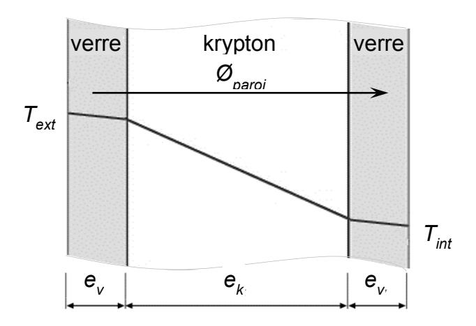

Figure 14 – Constitution du double-vitrage

| Épaisseur d'un vitrage e v           | 4 mm                                     |
|-------------------------------------------------|------------------------------------------|
| Épaisseur de la couche de krypton $e_k$         | 16 mm                                    |
| Surface S                                       | 2,2 m 2                       |
| Conductivité thermique du verre $\lambda_{\nu}$ | 1,15 W·m -1 ·K -1  |
| Conductivité thermique du krypton $\lambda_k$   | 0,009 W·m -1 ·K -1 |

Tableau 2 – Données sur le double-vitrage considéré

Une paroi multicouche peut se modéliser par des résistances associées en série (voir annexe 3). Ce modèle peut être simplifié en une résistance équivalente. La figure 15 représente ces deux approches pour le double-vitrage considéré.

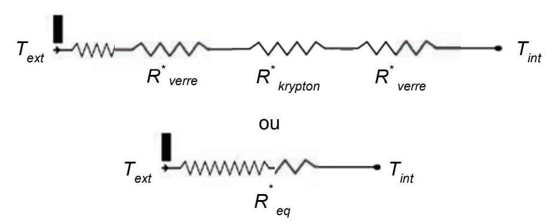

Figure 15 – Modèles thermiques du double-vitrage

On se propose de déterminer la conductivité thermique équivalente du double vitrage, notée  $\lambda_{eq}$ .

### **Question 8**

Exprimer la résistance thermique  $R_{eq}$  telle que  $\phi_{paroi} = \frac{S \cdot (T_{ext} - T_{int})}{R_{eq}}$  en fonction  $e_v$ ,

 $e_k$ ,  $\lambda_v$  et  $\lambda_k$ . On pourra appliquer l'analogie électrique présentée en annexe 3 et utiliser la figure 15.

### **Question 9**

En déduire l'expression de la conductivité thermique équivalente du double vitrage, notée  $\lambda_{eq}$ . Faire l'application numérique.

### 2. Évaluation du flux de chaleur transmis par conduction

La figure 16 indique les matériaux retenus pour l'isolation de la cabine. Le tableau 3 donne leurs caractéristiques thermiques et les surfaces concernées.

| Épaisseur du double-vitrage e eq                            | 24 mm                                    |
|------------------------------------------------------------------------|------------------------------------------|
| Surface vitrée totale $S_{\nu}$                                        | 10 m 2                        |
| Conductivité thermique du double-vitrage $\lambda_{eq}$                | 0,013 W·m -1 ·K -1 |
| Épaisseur des parois {aluminium + isolant} e p              | 45 mm                                    |
| Surface de paroi {aluminium + isolant} S p                  | 9 m 2                         |
| Conductivité thermique de l'ensemble {aluminium + isolant} $\lambda_p$ | 0,025 W·m -1 ·K -1 |

Tableau 3 – Données sur le choix retenu

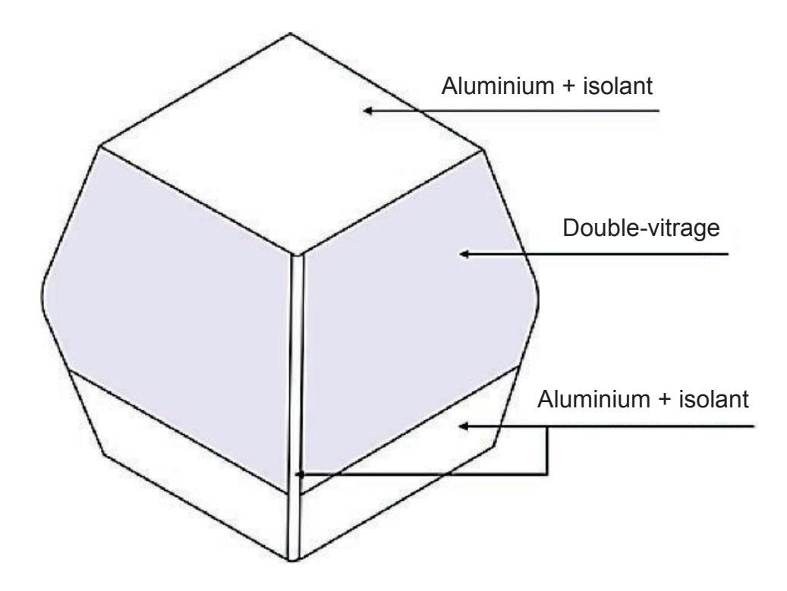

Figure 16 - Constitution des parois de la cabine

Un volume clos délimité par *n* parois se modélise par des résistances associées en parallèle (voir figure 17 et annexe 3). Le flux de chaleur global correspond à la somme des flux traversant chacune des parois du volume considéré :

$$\phi_{tot} = \sum_{i=1}^{n} \phi_i \text{ avec } \phi_i = \frac{\lambda_i \cdot S_i}{e_i} (T_{ext} - T_{int}) = \frac{S_i}{R_i} (T_{ext} - T_{int})$$

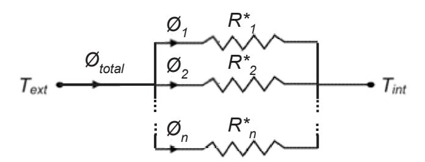

Figure 17 – Modèle de flux thermique pour *n* parois

On se propose de déterminer l'apport de chaleur par conduction à l'intérieur de la cabine  $(T_{ext} > T_{int})$ .

### **Question 10**

Réaliser le bilan des puissances thermiques transmises par conduction à travers les parois de la cabine. Exprimer alors le flux thermique  $\phi_{tot}$  sous la forme  $\phi_{tot} = A \cdot (T_{ext} - T_{int})$  où A est une constante qui sera exprimée en fonction de  $e_{eq}$ ,  $S_v$ ,  $e_p$ ,  $S_p$ ,  $\lambda_{eq}$ ,  $\lambda_p$ . Faire l'application numérique.

### 3. Comportement thermique de la cabine en milieu tropical

On utilise la valeur numérique de A pour configurer une simulation du comportement thermique de la cabine (voir figure 18, à gauche). Le modèle intègre aussi les autres phénomènes : convection, apports thermiques du soleil, des passagers et renouvellement de l'air (exigence 1.4.3.1 : 25 m3·h-1 par personne).

On se propose d'observer par simulation l'évolution de la température intérieure de la cabine pour le site considéré (voir figure 4). Les gares sont climatisées à 25 °C; cette température se retrouve dans la cabine à la fermeture des portes.

### **Question 11**

Compte tenu des caractéristiques de la ligne (voir figure 5 et tableau 1), exprimer la durée  $t_{23}$  du trajet entre les gares T2 et T3A en fonction de  $t_{23}$  et  $t_{23}$ . Faire l'application numérique. Justifier l'utilisation de  $t_{23}$  pour la durée de simulation.

Le résultat de cette simulation est donné figure 18.

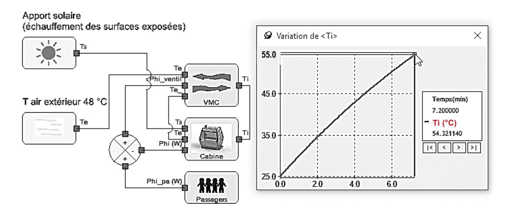

Figure 18 – Simulation de l'évolution de la température intérieure entre les gares T2 et T3A

### Question 12

Commenter le comportement thermique de la cabine isolée.

On simule à présent le comportement d'une régulation de température de cette cabine à l'aide d'une climatisation. Les relevés de température intérieure et de puissance frigorifique sont donnés figure 19.

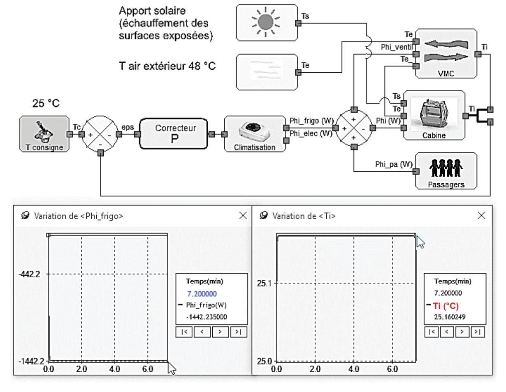

Figure 19 – Simulation de l'évolution de la température intérieure et de la puissance frigorifique entre les gares T2 et T3A

### **Question 13**

Commenter l'évolution de la température et de la puissance frigorifique. Relever la valeur de la puissance frigorifique nécessaire au maintien de la température intérieure à 25 °C.

### **4. Comportement thermique de la cabine sur un autre site**

On désire s'assurer de l'utilisation possible de cette cabine en des sites où la climatisation des gares n'est pas indispensable, les températures maximales ne dépassant pas 34 °C. Dans ce contexte, l'exigence de confort impose une variation de la température intérieure de -6 °C en moins d'une minute.

Les relevés de simulation de la température intérieure et de la puissance frigorifique pour deux climatisations différentes sont donnés figure 20. Le tableau 4 indique les paramètres à définir pour le composant *Climatisation* (voir figure 19).

### Simulation climatisation 1

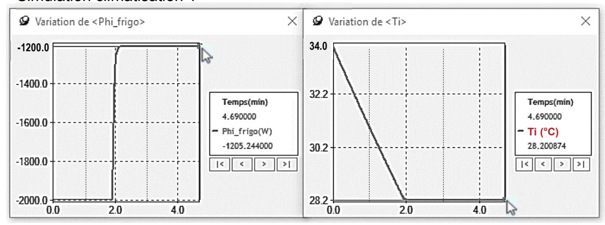

### Simulation climatisation 2

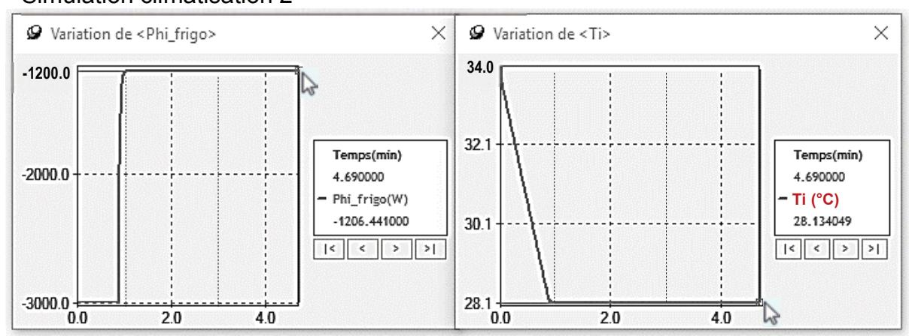

Figure 20 – Évolution de la température intérieure et de la puissance frigorifique pour deux climatisations

| Paramètre | Valeur  | Commentaire                                      |
|-----------|---------|--------------------------------------------------|
| Pmax      | - 2 000 | Puissance frigorifique en W                      |
| COP       | 2       | Coefficient de performance de la pompe à chaleur |

Tableau 4 – Réglage des paramètres du composant *Climatisation* (voir figure 19)

### **Question 14**

Indiquer le paramètre qui a été modifié entre les deux simulations. Justifier le choix de la climatisation 2. Relever la puissance frigorifique requise.

*Conclusion : on a déterminé la puissance frigorifique à retenir avec l'isolation envisagée et validé le choix d'une climatisation.* 

### V. Gestion de l'autonomie énergétique

**Objectifs** : dimensionner les éléments de stockage de l'énergie nécessaire au respect de l'exigence 1.4 et valider les choix de composants.

### 1. Étude du stockage de l'énergie nécessaire à la climatisation

Deux technologies sont envisagées: des batteries lithium ou des supercondensateurs. Les premières ont une énergie massique de l'ordre de 100 W·h·kg-1, nécessitent 2 heures de recharge et permettent 2 000 cycles. Les seconds ont une énergie massique de l'ordre de 5 W·h·kg-1, permettent des recharges en quelques secondes avec un nombre de cycles de 106.

Cela débouche sur deux stratégies bien différentes : stocker l'énergie nécessaire à la journée de fonctionnement et recharger la nuit pour les batteries ou stocker à minima et recharger lors des passages en gare pour les super condensateurs.

La durée de vie attendue pour les éléments de stockage est de 10 ans. La ligne fonctionne 20 heures par jour et 365 jours par an. Les durées moyennes à considérer sont respectivement de 5 minutes pour le trajet et de 1 minute pour le passage en gare.

### Question 15

Calculer le nombre de cycles de recharge à effectuer pour chacune des deux stratégies. Justifier pourquoi les supercondensateurs ont été retenus.

La figure 21 représente la chaîne d'énergie de la solution retenue.

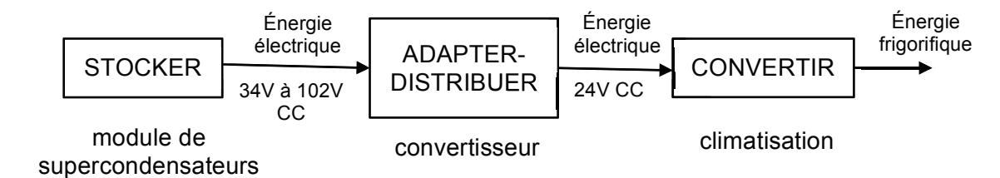

Figure 21 – Chaîne d'énergie de la climatisation

Pour dimensionner le module de stockage, on considère un trajet avec le cycle suivant : la climatisation délivre 3 000 W de puissance frigorifique durant une minute et 1 200 W durant 6 minutes.

Dans les conditions de l'étude, le COP de la climatisation vaut 2 et le rendement du convertisseur est de 94 %.

Le coefficient de performance de la pompe à chaleur est donné par :

$$COP = \frac{Puissance\ frigorifique\ produite}{Puissance\ électrique\ absorbée}$$

### **Question 16**

Calculer la puissance électrique moyenne appelée par la climatisation durant le trajet considéré. Déterminer la quantité d'énergie à stocker ; donner la valeur numérique en W·h.

Pour la suite de l'étude, on considère une quantité d'énergie nécessaire à la climatisation de 91 W∙h.

Le module de stockage (voir tableau 5) est constitué de 36 supercondensateurs associés en série et d'une électronique assurant l'équilibrage des tensions unitaires.

| Tension nominale                                           | 102 V                  |
|------------------------------------------------------------|------------------------|
| Tension maximale                                           | 108 V               |
| Capacité                                                   | 89 F                |
| Résistance interne                                      | 5,9 mΩ                 |
| Courant maximal de pointe durant 1 s                    | 2 980 A             |
| Énergie maximale stockée                                | 128 W∙h             |
| Nombre de cellules                                         | 36                     |
| Masse                                                      | 28,8 kg             |
| Durée de vie projetée à 25 °C                           | 1 000 000 cycles |
| (-20 % de capacité, +100 % de résistance interne) |                        |
| Plage de températures de fonctionnement                 | -40 °C à +65 °C  |

Tableau 5 – Caractéristiques du module de supercondensateurs

La quantité d'énergie, exprimée en Joules (J), contenue dans le module de supercondensateurs est donnée par :

$$E = \frac{1}{2} \cdot C \cdot (V_{max}^2 - V_{min}^2)$$

avec *C* capacité en F, *Vmax* tension maximale en V et *Vmin* tension minimale en V.

Le module est utilisé sur une plage de tensions s'étendant de 34 V à 102 V (voir figure 21).

Le fabricant annonce une perte de capacité de 20 % en fin de vie (voir tableau 5).

### **Question 17**

Calculer la quantité d'énergie utilisable pour un module en fin de vie. Exprimer la valeur numérique en W∙h, comparer avec la quantité d'énergie nécessaire à la climatisation et conclure.

Une simulation du comportement du module lors de la recharge est donnée figure 22. Y apparaissent les relevés de l'énergie emmagasinée, de l'intensité et de la tension.

### **Question 18**

Relever les valeurs utiles et calculer la puissance maximale que doit fournir le dispositif de recharge.

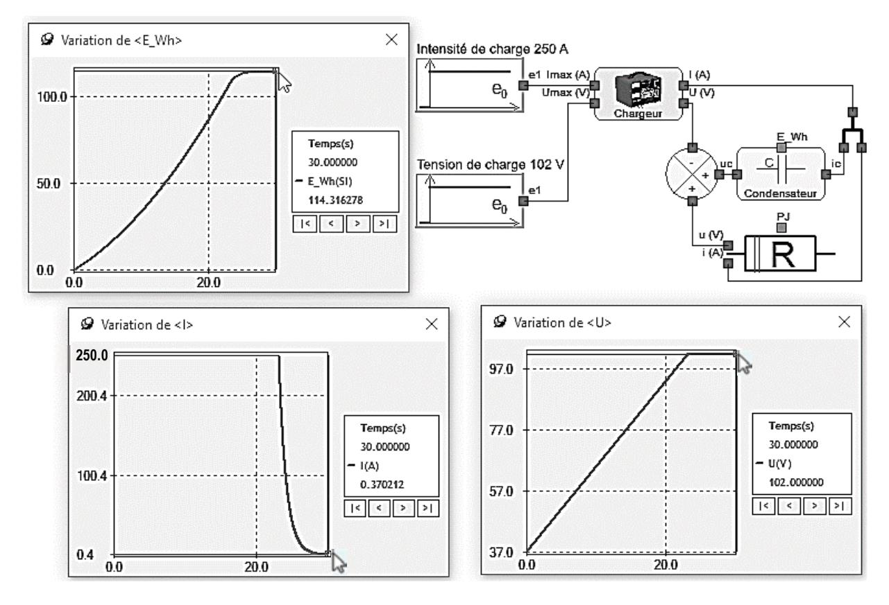

Figure 22 – Comportement du module lors de la recharge

### **Question 19**

Valider l'utilisation du module de supercondensateurs pour le stockage de l'énergie nécessaire à la climatisation.

### **2. Étude du stockage d'énergie pour les fonctions de sécurité**

Les fonctions de sécurité – aération, occultation des vitres et communications – doivent être assurées lors d'un arrêt inopiné. Dans ce cas, la climatisation est neutralisée et un système de ventilation de secours limite l'élévation de température à 2 °C, conformément à l'exigence 1.4.4.2 (en cas d'arrêt prolongé, la température interne ne doit pas dépasser de plus de 2 °C la température externe).

Le tableau 6 donne les caractéristiques de la batterie envisagée.

| Tension nominale                        | 12,8 V             |
|-----------------------------------------|--------------------|
| Capacité nominale                       | 55 A·h             |
| Cycles                                  | 2 000              |
| Tension de charge                       | 14,6 V             |
| Masse                                   | 7,8 kg             |
| Dimensions                              | 228 x 138 x 210 mm |
| Plage de températures de fonctionnement | -20 °C à +60 °C    |

Tableau 6 – Caractéristiques de la batterie de secours

La réglementation impose une durée maximale d'attente avant évacuation de 3 h. Les fonctions de secours appellent une puissance maximale de 190 W.

### **Question 20**

Valider le choix de la batterie.

*Conclusion : les éléments de stockage de l'énergie nécessaire au respect de l'exigence 1.4 (limiter les apports solaires) sont dimensionnés et les choix de composants validés.* 

### **VI. Vérification de la sécurité des passagers**

Il n'est pas envisagé de modifier la pince (voir figure 23) réalisant la liaison débrayable entre la suspente de la cabine (voir figures 7 et 8) et le câble. La pince est composée d'une mâchoire (1) mobile en rotation par rapport au solide (2), permettant de libérer le câble en gare. *A contrario*, les ressorts assurent le serrage des mâchoires sur le câble lors du déplacement de la cabine entre deux gares.

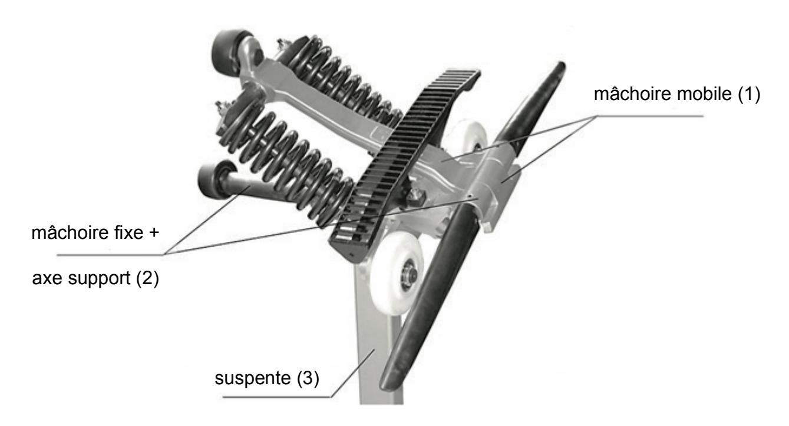

Figure 23 – Pince débrayable

Pour d'évidentes raisons de sécurité des passagers, cet effort de serrage doit permettre d'assurer l'adhérence de la pince sur le câble, quel que soit l'angle pris par le câble (voir figure 24).

Or, l'ajout des nouvelles fonctionnalités précédemment étudiées va alourdir la cabine actuelle.

*Objectif : vérifier le non-glissement de la pince sur le câble pour un ensemble suspendu alourdi de 10 %*.

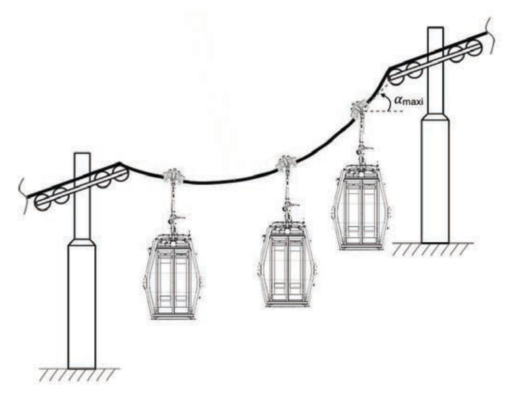

Figure 24 – Définition de l'angle entre le câble et l'horizontale dans la configuration la plus défavorable

### **1. Détermination de l'effort de serrage créé par les ressorts**

On retient la modélisation présentée à travers le schéma cinématique de la figure 25.

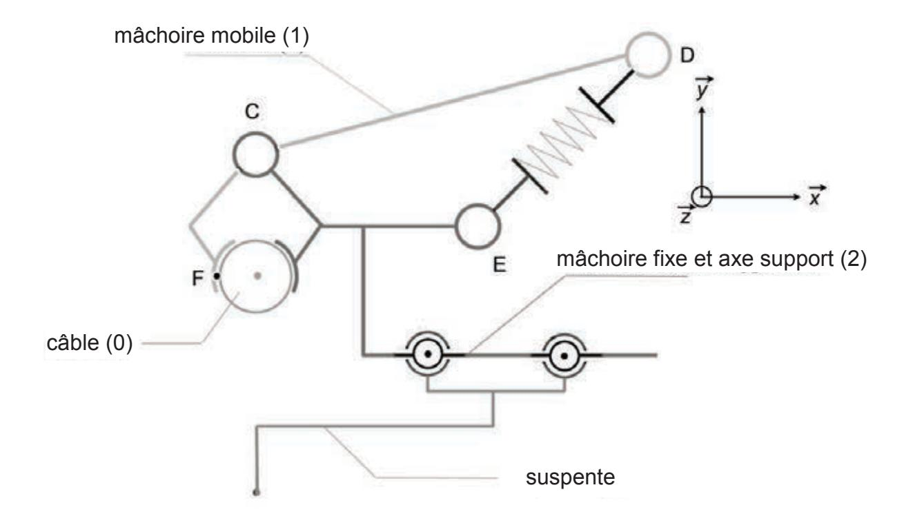

Figure 25 – Schéma cinématique de la modélisation retenue

Le problème est considéré plan dans le plan  $(E, \vec{x}, \vec{y})$ . Le référentiel associé au câble (0) est supposé galiléen. Les poids des différents solides sont négligeables devant les autres actions en présence. Les liaisons sont supposées parfaites.

On note  $\overrightarrow{CF} = -a \cdot \overrightarrow{x} - b \cdot \overrightarrow{y}$  et  $\overrightarrow{CD} = c \cdot \overrightarrow{x} + d \cdot \overrightarrow{y}$ .

L'action mécanique de la mâchoire (1) sur le câble (0) est modélisée par un glisseur en F :

$$\{T_{1\to 0}\} = \begin{Bmatrix} N_c \overrightarrow{X} \\ \overrightarrow{0} \end{Bmatrix}_E$$

L'action mécanique exercée par le ressort est transmise au solide (1) en D. On la modélise par le torseur suivant :

$$\{T_{r\to 1}\} = \left\{\begin{matrix} F_r \cos(\beta) \vec{x} + F_r \sin(\beta) \vec{y} \\ \vec{0} \end{matrix}\right\}_{D}$$

avec  $F_r$  l'effort équivalent exercé par les deux ressorts et  $\vec{\beta}$  l'angle entre  $\vec{x}$  et  $\vec{ED}$ .

Le torseur de l'action mécanique transmissible par une liaison entre les solides *i* et *j* sera noté en un point K, d'une façon générale :

$$\{T_{i\to j}\} = \left\{ \begin{matrix} X_{ij}\vec{x} + Y_{ij}\vec{y} + Z_{ij}\vec{z} \\ L_{ij}\vec{x} + M_{ij}\vec{y} + N_{ij}\vec{z} \end{matrix} \right\}_{K}$$

### **Question 21**

On isole le solide (1). Réaliser le bilan des actions mécaniques extérieures sous forme de torseurs.

### **Question 22**

Appliquer le Principe fondamental de la statique à ce solide. Écrire en particulier le théorème du moment statique au point C. En déduire une expression de  $N_c$  en fonction de  $F_r$ ,  $\beta$ , b, c et d.

L'application numérique donne  $N_c$  = 93 kN.

### 2. Étude du non-glissement de la pince sur le câble

On considère le cas le plus défavorable du point de vue de l'adhérence des mâchoires de la pince sur le câble : juste en amont d'un pylône, l'angle  $\alpha$  entre l'horizontale et le câble est maximal (voir figure 24). Sur l'installation existante,  $\alpha_{max,i} = 18,35^{\circ}$ .

La résultante de l'action des mâchoires sur le câble  $\overrightarrow{R}_{1\to 0}$  se décline alors en deux composantes (voir figure 26) :

- une composante normale  $N_c$ ;
- une composante tangentielle  $T_c$ .

Le coefficient d'adhérence entre les mâchoires et le câble est noté f et vaut :  $f = \tan(\varphi) = 0.18$ .

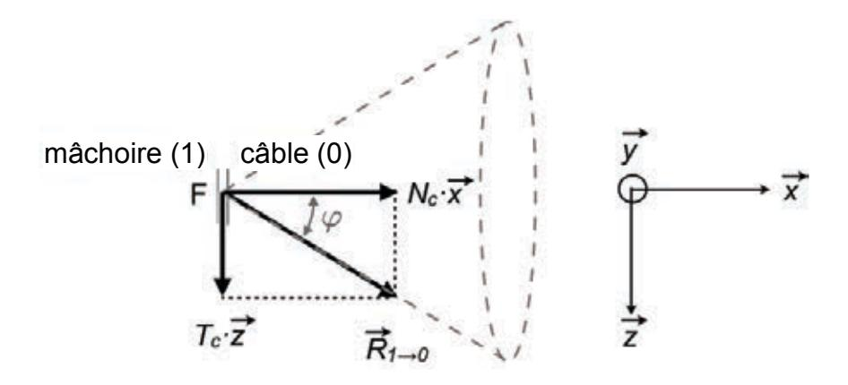

Figure 26 – Définition du coefficient d'adhérence

Pour assurer le non-glissement de l'ensemble suspendu au câble, de poids *Pe*, il faut, dans le cas le plus défavorable : 2⋅*T s P sin( ) c e* = ⋅ ⋅ α *max i* où *s* = 3 est le coefficient de sécurité retenu.

La masse de l'ensemble suspendu vaut *Me* = 1 800 kg. Avec la majoration de 10 %, la valeur à retenir est *Pe* = 19 424 N.

### **Question 23**

Déterminer la valeur minimale de *Nc* permettant d'assurer le non-glissement de la pince sur le câble. Conclure quant à la sécurité des passagers.

*Conclusion : la valeur minimale de serrage est assurée par les ressorts ; la sécurité des passagers est réalisée avec un ajout de masse de 10 % sur l'ensemble suspendu.* 

### **VII. Modification de la structure porteuse**

*Objectif : valider la modification de matériau d'un élément de la structure porteuse.* 

### **1. Modification du matériau du H de liaison**

Comme le montre la figure 8, la cabine est liée à la suspente via une pièce en forme de H. Cette pièce volumineuse est en acier ; on peut espérer un gain de masse significatif en utilisant un alliage léger.

L'étude consistera à vérifier la résistance du longeron (voir figure 27) du H de liaison après modification du matériau.

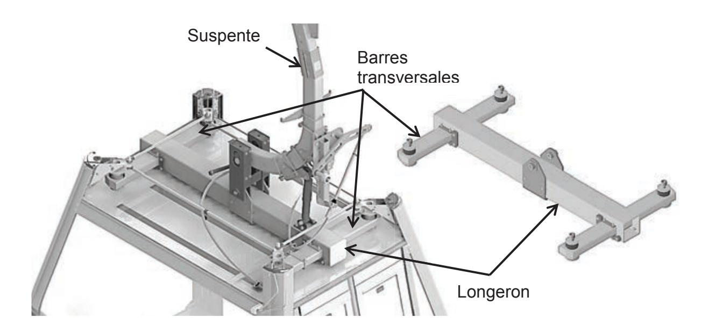

Figure 27 – Localisation et constitution du H de liaison

On retient la modélisation présentée à travers le schéma de la figure 28.

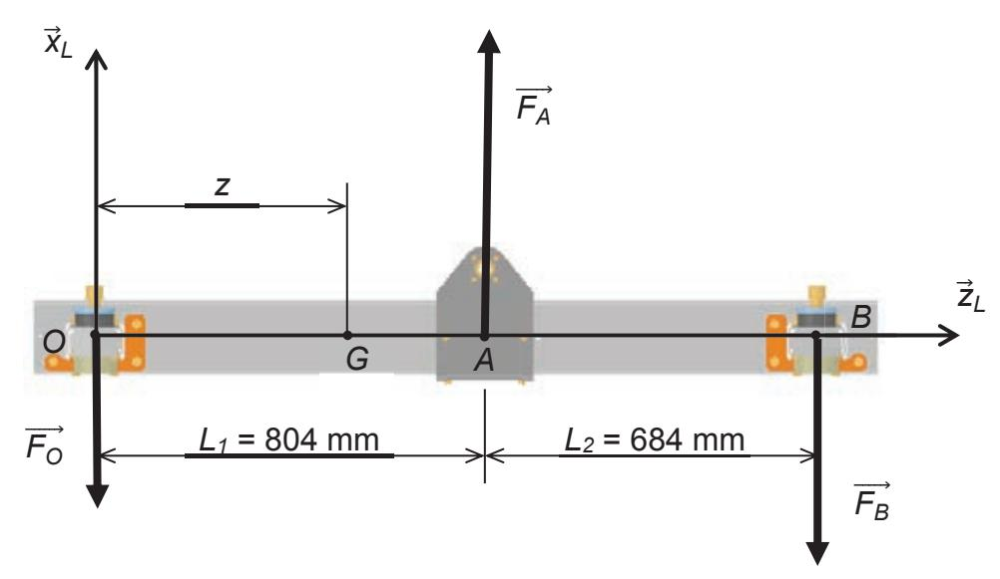

Figure 28 – Modèle du H de liaison

Le H de liaison est accroché à la suspente au point A. L'action mécanique résultante est modélisée par un glisseur *FA* ⃗⃗⃗⃗ *= FA∙x*⃗ *L* avec *FA =* 18 540 N.

La cabine repose sur deux appuis aux points O et B. Les actions mécaniques qui en résultent sont modélisées par les glisseurs *F*O ⃗⃗⃗⃗ *=* Ǧ*F*O *∙x*⃗ *L* avec *F0 =* 8 522 N et *FB* ⃗⃗⃗⃗ *=* Ǧ*FB∙x*⃗ *L* avec *FB =* 10 018 N.

Le longeron est un tube de section rectangulaire creuse de base et hauteur extérieures *b* = 150 mm et *h* = 200 mm, d'épaisseur *e* = 7 mm et de longueur *L* = 1 737 mm. Il est en alliage d'aluminium 6005A T6 de limite élastique *Re* = 200 MPa.

Le coefficient de sécurité requis est de 5, le poids du H de liaison est négligé et le repère *RL* (*O*, *x*⃗ *L*, ⃗ *y L*, ⃗ *z L*) est lié au longeron.

### **Question 24**

Indiquer à quel(s) type(s) de sollicitation est soumis le longeron et expliquer, à l'aide d'un schéma, la déformation qui en résulte.

### **Question 25**

Déterminer l'expression littérale des éléments de réduction du torseur des efforts de cohésion en *G* en fonction de l'abscisse z pour *G* ∈ [*OA*[ (zone *OA*). Faire l'application numérique pour les valeurs maximales.

### **Question 26**

En utilisant l'annexe 4, calculer la contrainte normale maximale subie par le longeron. Conclure sur sa résistance.

La masse initiale du longeron en acier est de 49 kg. La masse volumique de l'aluminium de 2 700 kg·m-3.

### **Question 27**

Calculer le volume et la masse du longeron en aluminium. Quantifier le gain de masse réalisé sur cet élément.

### **2. Conclusion et synthèse**

### **Question 28**

Conclure sur la validité des modifications envisagées dans l'ensemble du sujet.

*Conclusion : les modifications envisagées sur la cabine permettront de maintenir la sécurité des passagers et les performances attendues.* 

### **VIII. Exploitation pédagogique**

Les problèmes technologiques couvrent une grande variété de situations et de niveaux de complexité. Les réponses sont rarement uniques, elles peuvent évoluer dans le temps et en fonction du contexte. Formaliser une méthode de résolution, qui serait universelle, est donc un exercice improbable. Au collège, la conduite d'une démarche de résolution de problème technologique prend appui sur une question et peut s'inspirer efficacement du cheminement d'une démarche d'investigation.

### **Question 29**

Une séance conduite suivant une démarche d'investigation peut être structurée par trois phases essentielles, nommer et expliciter ces trois phases.

### **Question 30**

À l'aide du document annexe 5, relatif à la construction d'une séance par l'enseignant, compléter sur le document réponse 2 les différentes phases du déroulement d'une séance vécue par l'élève.

### **Question 31**

Au regard de l'analyse scientifique et technique menée préalablement, une description de séquence au cycle 4 est fournie en annexe 6. Dans ce tableau sont clairement identifiées les compétences, thématiques du programme et connaissances visées par l'enseignant, permettant ainsi l'élaboration du déroulé de la séquence par la définition de chacune des séances la constituant (voir annexe 7).

À partir de la proposition du déroulé de la séquence 3 en annexe 6 et de sa description en annexe 7, en tenant compte de la problématique, compléter le document réponse 3 en décrivant le contenu envisagé pour la séance 4.

### **Question 32**

La carte heuristique présentée figure 29 permet de situer les différentes possibilités d'exploitation pédagogique en sciences industrielles de l'ingénieur.

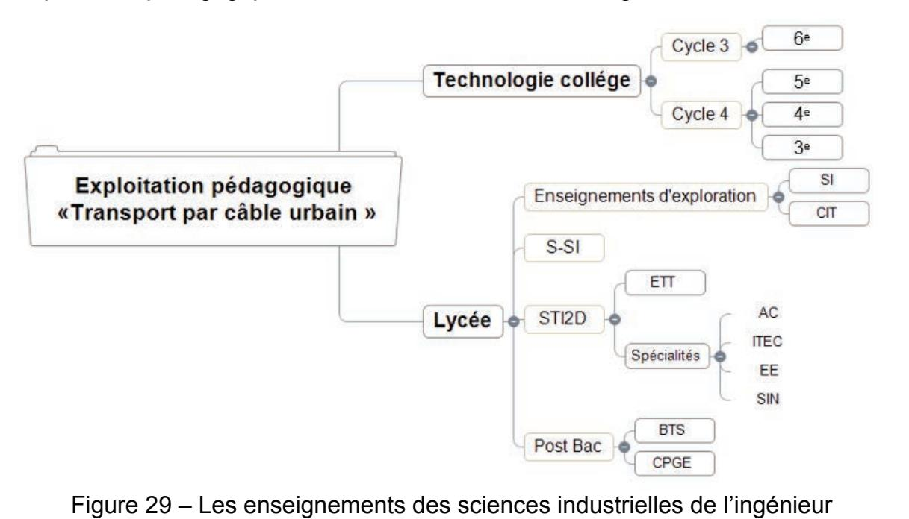

En filigrane, apparaissent les trois dimensions sous-jacentes du programme de technologie du collège jusqu'en CPGE, à savoir :

- **dimension ingénierie-design,** pour comprendre, imaginer et réaliser de façon collaborative des objets et systèmes pluri technologiques ;
- **dimension scientifique,** qui fait appel aux lois physiques, outils mathématiques pour résoudre des problématiques technologiques, analyser et investiguer ;
- **dimension socioculturelle,** qui permet de discuter des besoins, des conditions et des implications de la transformation du milieu par des objets techniques.

En référence à l'organisation de l'étude de rétroconception du transport urbain par câble, et plus globalement au regard du contexte d'installation et d'exploitation de ce système, sur le document réponse 4, proposer une exploitation pédagogique possible pour les niveaux d'enseignement de sciences de l'ingénieur du baccalauréat scientifique et de l'enseignement technologique transversal du baccalauréat STI2D.

## **DOCUMENTS ANNEXES**

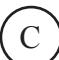

### **Annexe 1 : diagrammes d'états décrivant la gestion de la teinte des vitrages électrochromes d'une cabine**

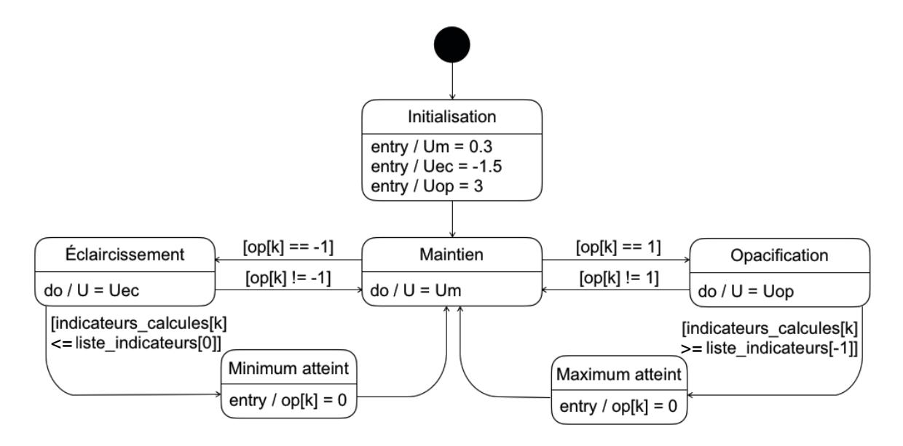

Figure 30 – Gestion de la tension de commande d'un vitrage *k*

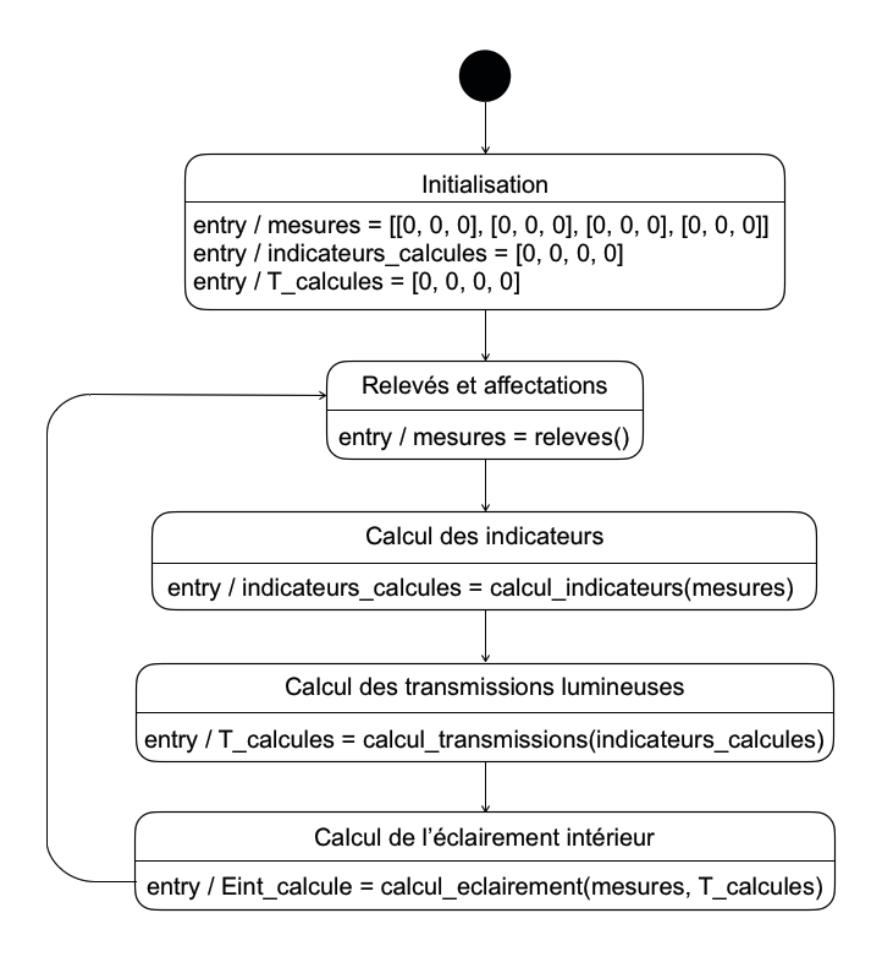

Figure 31 – Détermination de l'éclairement intérieur de la cabine

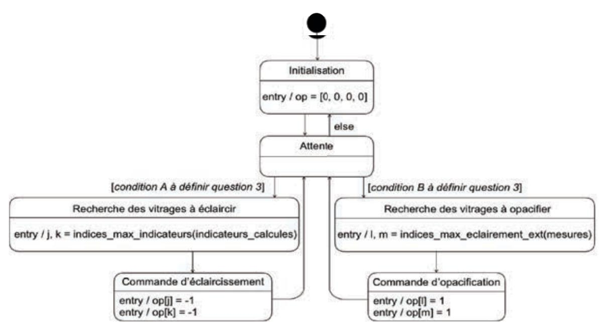

Figure 32 – Gestion de la teinte des quatre vitrages

### **Annexe 2 : éléments de syntaxe pour la lecture des diagrammes**

Syntaxe diagramme d'états

| Type       | Exemple    | Syntaxe SysML |
|------------|------------|---------------|
| Séparateur | do / a = 2 | /             |
| Condition  | [a > b]    | [ ]           |

Logique booléenne

| Type         | Exemple     | Syntaxe Python  |
|--------------|-------------|-----------------|
| Valeur       | Faux        | False           |
| Comparateurs | = ≠ < ≤ > ≥ | == != < <= > >= |
| Et logique   | a et b      | a and b         |
| Ou logique   | a ou b      | a or b          |

Opérateurs mathématiques

| Type          | Exemple | Syntaxe Python |
|---------------|---------|----------------|
| Opérateurs    | + - × ÷ | + - * /        |
| mathématiques |         |                |

Types conteneurs

| Type                 | Exemple        | Syntaxe Python |
|----------------------|----------------|----------------|
| Liste                | [8, -37.5, 27] | [ ]            |
| Tuple                | (8, -37.5, 27) | ( )            |
| Chaîne de caractères | "toto"         | str            |

Indexation de la liste [8, -37.5, 27

| Type                               | Exemple | Syntaxe Python |
|------------------------------------|---------|----------------|
| Nombre d'éléments                  | 3       | len(liste)     |
| Accès au premier élément           | 8       | liste[0]       |
| Accès au deuxième élément | -37.5   | liste[1]       |
| Accès au dernier élément           | 27      | liste[-1]      |

### Annexe 3: transfert thermique par conduction

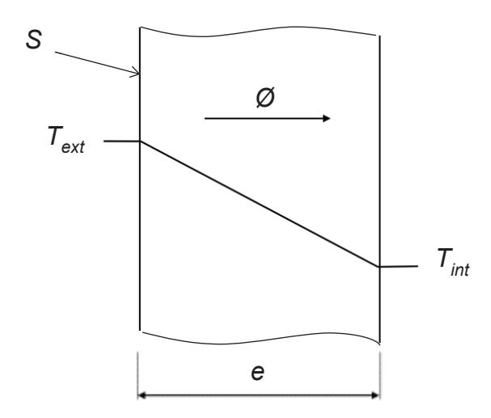

Figure 33 – Illustration du flux thermique de conduction à travers une paroi d'épaisseur e et de surface S

### 1. Transfert unidirectionnel

Le flux de chaleur  $\phi$  (en W) associé à un phénomène de conduction dans un matériau homogène et isotrope, sans génération ni stockage d'énergie, s'écrit (voir figure 33) :

$$\phi = \frac{\lambda \cdot S}{e} (T_{\text{ext}} - T_{\text{int}}) \text{ ou encore } \phi = \frac{S}{R} (T_{\text{ext}} - T_{\text{int}})$$

avec  $\lambda$  la conductivité thermique du matériau (en W·m-1·K-1), R sa résistance thermique (en m2·K·W-1), S la surface d'échange normale au flux (en m2), e l'épaisseur du matériau (en m),  $T_{ext}$  et  $T_{int}$  les températures (en K) de part et d'autre du matériau, avec  $T_{ext} > T_{int}$ .

### 2. Analogie électrique

On peut proposer l'analogie électrique illustrée à la figure 34, en considérant une résistance par unité de surface  $R^* = \frac{R}{S} = \frac{e}{\lambda \cdot S}$ , pendant thermique de la résistance électrique.

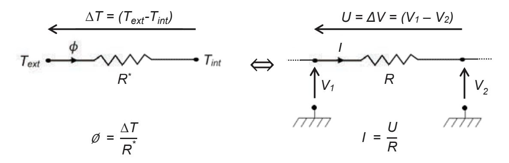

Figure 34 – Analogie électrique

### Annexe 4 : formulaire de résistance des matériaux

### Section circulaire:

- moment quadratique par rapport à l'axe  $(G,\vec{y})$ :  $I_{Gy} = \frac{\pi \cdot d^4}{64}$
- moment quadratique par rapport à l'axe  $(G,\vec{x})$ :  $I_{Gx} = \frac{\pi \cdot d^4}{64}$

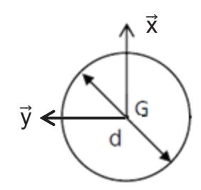

### Section rectangulaire:

- moment quadratique par rapport à l'axe  $(G,\vec{y})$ :  $I_{Gy} = \frac{b \cdot h^3}{12}$
- moment quadratique par rapport à l'axe  $(G,\vec{x})$ :  $I_{Gx} = \frac{h \cdot b^3}{12}$

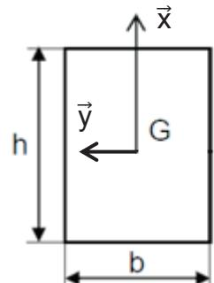

|               | Relations entre                           | Relations entre                  | Relations entre                            |
|---------------|-------------------------------------------|----------------------------------|--------------------------------------------|
|               | contraintes et                            | contraintes et                   | déplacements et                            |
|               | efforts intérieurs                        | déformations                     | efforts                                    |
| Traction pure | $\sigma = \frac{N}{S}$                    | σ = Ε⋅ε                          | $\Delta L = \frac{N \cdot L_0}{E \cdot S}$ |
| Flexion pure  | $\sigma = -\frac{M_{fy} \cdot x}{I_{Gy}}$ | $\varepsilon = \frac{\sigma}{E}$ | $E \cdot I_{Gy} \cdot x'' = M_{fy}$        |

### Avec:

- N, effort normal (N);
- S. section (mm²):
- Mfy, moment fléchissant (N·mm);
- x, position du point M considéré dans la section droite (mm);
- IGv, moment quadratique (mm4);
- σ, contrainte normale (MPa) ;
- E, module d'Young (MPa);
- ε, déformation ;
- $-\Delta L$ , allongement (mm);
- L0, longueur initiale (mm).

### **Annexe 5 : exemple d'organisation d'une séquence**

Au collège, la complexité des problèmes technologiques doit être progressive tout au long du cycle 4. La résolution s'effectuera en se référant à des problèmes analogues et en procédant à des transpositions.

### **Thèmes de séquences :**

- − assurer le confort dans une habitation ;
- − préserver les ressources (économiser l'énergie et préserver l'environnement) ;
- − produire / distribuer une énergie ;
- − mesurer une performance, une grandeur physique ;
- − acquérir et transmettre des informations ou des données ;
- − se déplacer sur terre / air / mer ;
- − programmer un objet ;
- − autres thèmes…

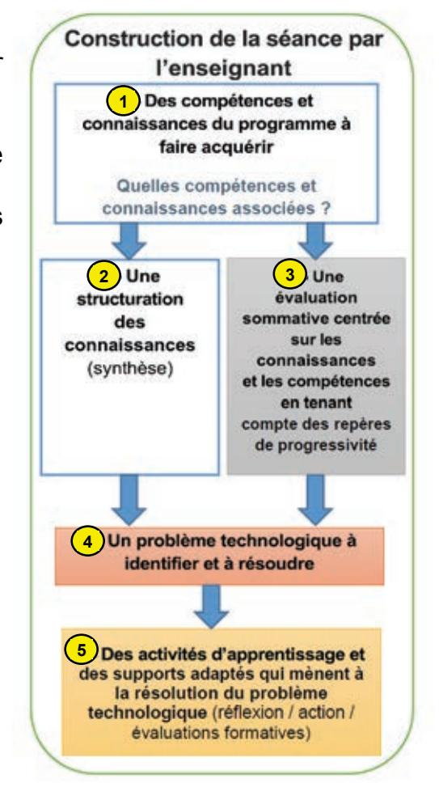

|                        | Séance 1                                                                                                                      | Séance 2                                                                                             | Séance 3                                                                                                                                |
|------------------------|-------------------------------------------------------------------------------------------------------------------------------|------------------------------------------------------------------------------------------------------|-----------------------------------------------------------------------------------------------------------------------------------------|
| Question directrice | Qu'est-ce qu'un établissement recevant du public (ERP), quels sont les différents espaces d'une salle de spectacle ? | Comment prendre en compte les différentes contraintes pour agencer une salle de spectacle ? | Quelles propositions d'agencement pour cette salle de spectacle ?                                                                 |
| Démarche               | Démarche d'investigation.                                                                                                     | Démarche de résolution de problème.                                                               | Démarche de résolution de problème.                                                                                                  |
| Activités              | Recherche documentaire, production de croquis.                                                                             | Recherche documentaire, modélisation numérique 3D.                                             | Chaque équipe crée à partir de la modélisation réalisée, l'agencement de la salle de spectacle. Une simulation est engagée. |
| Conclusion – Bilan  | Définir un ERP. Indiquer à quelle catégorie appartient une salle de spectacle.                                          | Repérer les différentes contraintes. Proposer une réponse adaptée pour chaque contrainte.   | Définir ce qu'apporte une simulation.                                                                                                |
| Évaluation             | Formative                                                                                                                     | Aucune                                                                                               | Sommative                                                                                                                               |
| Ressources             | Document sur les normes. Document relatif à la situation déclenchante.                                                  | Logiciel de modélisation 2D/3D.                                                                   | Application multimédia « agencement d'une salle de spectacle ».                                                                   |

| 4                                               |
|-------------------------------------------------|
| Ø                                               |
| $\tilde{\tau}$                                  |
| Š                                               |
| ΰ                                               |
| Ø                                               |
| ŏ                                               |
| Ō                                               |
| ☴                                               |
| S                                               |
| 9                                               |
| <u>e</u>                                        |
| Q                                               |
| <u>0</u>                                        |
| <ul> <li>Technologie collège cycle 4</li> </ul> |
| Ć                                               |
| $\mathbf{\zeta}$                                |
| Š                                               |
| Ĕ                                               |
| ٠.                                              |
| ı                                               |
| 3                                               |
| ທ                                               |
| -                                               |
| ø                                               |
| Ce                                              |
| ence                                            |
| uence                                           |
| auence                                          |
| équence                                         |
| séguence                                        |
| e séguence                                      |
| de séguence                                     |
| if de séauence S3 – 1                           |
| otif de séguence                                |
| riptif de séguence                              |
| criptif de séauence                             |
| scriptif de séauence                            |
| descriptif de séguence                          |
| descriptif de séauence                          |
| : descriptif de séauence                        |
| 6 : descriptif de séguence                      |
| ce 6 : descriptif de séauence                   |
| exe 6 : descriptif de séauence                  |
| nexe 6 : descriptif de séauence                 |
| nnexe 6 : descriptif de séguence                |
| Annexe 6 : descriptif de séguence               |

| Thème de séquence   Thème de séquence   Thème de séquence   Thème de séquence   Thème de séquence   Thème de séquence   Thème de séquence   Thème de séquence   Thème de séquence   Thème de séquence   Thème de séquence   Thème de séquence   Thème de séquence   Thème de séquence   Thème de séquence   Thème de séquence   Thème de séquence   Thème de séquence   Thème de séquence   Thème de séquence   Thème de séquence   Thème de séquence   Thème de séquence   Thème de séquence   Thème de séquence   Thème de séquence   Thème de séquence   Thème de séquence   Thème de séquence   Thème de séquence   Thème de séquence   Thème de séquence   Thème de séquence   Thème de séquence   Thème de séquence   Thème de séquence   Thème de séquence   Thème de séquence   Thème de séquence   Thème de séquence   Thème de séquence   Thème de séquence   Thème de séquence   Thème de séquence   Thème de séquence   Thème de séquence   Thème de séquence   Thème de séquence   Thème de séquence   Thème de séquence   Thème de séquence   Thème de séquence   Thème de séquence   Thème de séquence   Thème de séquence   Thème de séquence   Thème de séquence   Thème de séquence   Thème de séquence   Thème de séquence   Thème de séquence   Thème de séquence   Thème de séquence   Thème de séquence   Thème de séquence   Thème de séquence   Thème de séquence   Thème de séquence   Thème de séquence   Thème de séquence   Thème de séquence   Thème de séquence   Thème de séquence   Thème de séquence   Thème de séquence   Thème de séquence   Thème de séquence   Thème de séquence   Thème de séquence   Thème de séquence   Thème de séquence   Thème de séquence   Thème de séquence   Thème de séquence   Thème de séquence   Thème de séquence   Thème de séquence   Thème de séquence   Thème de séquence   Thème de séquence   Thème de séquence   Thème de séquence   Thème de séquence   Thème de séquence   Thème de séquence   Thème de séquence   Thème de séquence   Thème de séquence   Thème de séquence   Thème de séquence   Thème de séquence   Thème de séquence   Thèm |                                                                                                                                                                                                                    | 500 05d.:0005 . 0 000:                                                                                                                                                                                                                                                                                                                                                                                                                                                                                                                                                                                                                                                                                                                                                                                                                                                                                                                 | F                                                                                                                                                                                                                                                                  |                                                           |                                                                                                                                                                                                                                                                                                                                                                                                                                                                               |                                                                                                                                                                                                                                                                                                                                                                                                                                                                                                             |
|------------------------------------------------------------------------------------------------------------------------------------------------------------------------------------------------------------------------------------------------------------------------------------------------------------------------------------------------------------------------------------------------------------------------------------------------------------------------------------------------------------------------------------------------------------------------------------------------------------------------------------------------------------------------------------------------------------------------------------------------------------------------------------------------------------------------------------------------------------------------------------------------------------------------------------------------------------------------------------------------------------------------------------------------------------------------------------------------------------------------------------------------------------------------------------------------------------------------------------------------------------------------------------------------------------------------------------------------------------------------------------------------------------------------------------------------------------------------------------------------------------------------------------------------------------------------------------------------------------------------------------------------------------------------------------------------------------------------------------------------------------------------------------------------------------------------------------------------------------------------------------------------------------------------------------------------------------------------------------------------------------------------------------------------------------------------------------------------------------------------------|--------------------------------------------------------------------------------------------------------------------------------------------------------------------------------------------------------------------|----------------------------------------------------------------------------------------------------------------------------------------------------------------------------------------------------------------------------------------------------------------------------------------------------------------------------------------------------------------------------------------------------------------------------------------------------------------------------------------------------------------------------------------------------------------------------------------------------------------------------------------------------------------------------------------------------------------------------------------------------------------------------------------------------------------------------------------------------------------------------------------------------------------------------------------|--------------------------------------------------------------------------------------------------------------------------------------------------------------------------------------------------------------------------------------------------------------------|-----------------------------------------------------------|-------------------------------------------------------------------------------------------------------------------------------------------------------------------------------------------------------------------------------------------------------------------------------------------------------------------------------------------------------------------------------------------------------------------------------------------------------------------------------|-------------------------------------------------------------------------------------------------------------------------------------------------------------------------------------------------------------------------------------------------------------------------------------------------------------------------------------------------------------------------------------------------------------------------------------------------------------------------------------------------------------|
|                                                                                                                                                                                                                                                                                                                                                                                                                                                                                                                                                                                                                                                                                                                                                                                                                                                                                                                                                                                                                                                                                                                                                                                                                                                                                                                                                                                                                                                                                                                                                                                                                                                                                                                                                                                                                                                                                                                                                                                                                                                                                                                              |                                                                                                                                                                                                                    | Thème de séquence                                                                                                                                                                                                                                                                                                                                                                                                                                                                                                                                                                                                                                                                                                                                                                                                                                                                                                                      |                                                                                                                                                                                                                                                                    | <u>a</u>                                                  | Problématique                                                                                                                                                                                                                                                                                                                                                                                                                                                                 |                                                                                                                                                                                                                                                                                                                                                                                                                                                                                                             |
| s s s s s s s s s s s s s s s s s s s                                                                                                                                                                                                                                                                                                                                                                                                                                                                                                                                                                                                                                                                                                                                                                                                                                                                                                                                                                                                                                                                                                                                                                                                                                                                                                                                                                                                                                                                                                                                                                                                                                                                                                                                                                                                                                                                                                                                                                                                                                                                                        | SS S                                                                                                                                                                                                               | Évolution des transports urbains et rétroconcep                                                                                                                                                                                                                                                                                                                                                                                                                                                                                                                                                                                                                                                                                                                                                                                                                                                                                        | tion.                                                                                                                                                                                                                                                              | Q , F. E                                                  | echniques nique de                                                                                                                                                                                                                                                                                                                                                                                                                                                         | aux exigences transport urbain                                                                                                                                                                                                                                                                                                                                                                                                                                                                           |
|                                                                                                                                                                                                                                                                                                                                                                                                                                                                                                                                                                                                                                                                                                                                                                                                                                                                                                                                                                                                                                                                                                                                                                                                                                                                                                                                                                                                                                                                                                                                                                                                                                                                                                                                                                                                                                                                                                                                                                                                                                                                                                                              | Compéten                                                                                                                                                                                                           | Sept                                                                                                                                                                                                                                                                                                                                                                                                                                                                                                                                                                                                                                                                                                                                                                                                                                                                                                                                   |                                                                                                                                                                                                                                                                    | u programme                                               |                                                                                                                                                                                                                                                                                                                                                                                                                                                                               | Connaissances                                                                                                                                                                                                                                                                                                                                                                                                                                                                                               |
|                                                                                                                                                                                                                                                                                                                                                                                                                                                                                                                                                                                                                                                                                                                                                                                                                                                                                                                                                                                                                                                                                                                                                                                                                                                                                                                                                                                                                                                                                                                                                                                                                                                                                                                                                                                                                                                                                                                                                                                                                                                                                                                              | CT 7.2                                                                                                                                                                                                             | ► Relier les évolutions technologiques aux inventions et innovations qui marquent des ruptures dans les solutions techniques.                                                                                                                                                                                                                                                                                                                                                                                                                                                                                                                                                                                                                                                                                                                                                                                                          |                                                                                                                                                                                                                                                                    | Relier les évolu nventions et in uptures dans la    | utions technologiques aux novations qui marquent des les solutions techniques.                                                                                                                                                                                                                                                                                                                                                                                          | Outils numériques de présentation. Charte graphique. Carte heuristique.                                                                                                                                                                                                                                                                                                                                                                                                                                     |
|                                                                                                                                                                                                                                                                                                                                                                                                                                                                                                                                                                                                                                                                                                                                                                                                                                                                                                                                                                                                                                                                                                                                                                                                                                                                                                                                                                                                                                                                                                                                                                                                                                                                                                                                                                                                                                                                                                                                                                                                                                                                                                                              | CT 2.4                                                                                                                                                                                                             | ► Associer des solutions techniques à des fonctions.                                                                                                                                                                                                                                                                                                                                                                                                                                                                                                                                                                                                                                                                                                                                                                                                                                                                                   |                                                                                                                                                                                                                                                                    | Associer des sonctions.                                   | olutions techniques à des                                                                                                                                                                                                                                                                                                                                                                                                                                                     | Analyse fonctionnelle systémique.                                                                                                                                                                                                                                                                                                                                                                                                                                                                           |
|                                                                                                                                                                                                                                                                                                                                                                                                                                                                                                                                                                                                                                                                                                                                                                                                                                                                                                                                                                                                                                                                                                                                                                                                                                                                                                                                                                                                                                                                                                                                                                                                                                                                                                                                                                                                                                                                                                                                                                                                                                                                                                                              | CT 4.1                                                                                                                                                                                                             | ► Décrire, en utilisant les outils et langages de descriptions adaptés, la structure et le comportement des objets.                                                                                                                                                                                                                                                                                                                                                                                                                                                                                                                                                                                                                                                                                                                                                                                                                    |                                                                                                                                                                                                                                                                    | Décrire, en utili Jescriptions ad structure et le c | isant les outils et langages de daptés, le fonctionnement, la comportement des objets.                                                                                                                                                                                                                                                                                                                                                                                  | Outils de description d'un fonctionnement, d'une structure et d'un comportement.                                                                                                                                                                                                                                                                                                                                                                                                                            |
|                                                                                                                                                                                                                                                                                                                                                                                                                                                                                                                                                                                                                                                                                                                                                                                                                                                                                                                                                                                                                                                                                                                                                                                                                                                                                                                                                                                                                                                                                                                                                                                                                                                                                                                                                                                                                                                                                                                                                                                                                                                                                                                              | Présentati                                                                                                                                                                                                         | ion de la séquence                                                                                                                                                                                                                                                                                                                                                                                                                                                                                                                                                                                                                                                                                                                                                                                                                                                                                                                     |                                                                                                                                                                                                                                                                    | S                                                         | ituation déclenchante possible                                                                                                                                                                                                                                                                                                                                                                                                                                                |                                                                                                                                                                                                                                                                                                                                                                                                                                                                                                             |
| onnement dans le cycle Début de cycle ou les possibles avec les EPI ou les parcours (Avenir, Citoyen, PEAC)                                                                                                                                                                                                                                                                                                                                                                                                                                                                                                                                                                                                                                                                                                                                                                                                                                                                                                                                                                                                                                                                                                                                                                                                                                                                                                                                                                                                                                                                                                                                                                                                                                                                                                                                                                                                                                                                                                                                                                                                                  | L'objectif e par câble c taille et le r impactent nécessaire réglemente Les élèves transport u en s'aidan chaque grc II s'agira e installation chaque for être discutt Eléments Selon l'épo connaissar contexte de | est de rechercher et de valider l'implantation d'ul qui correspondra au mieux aux souhaits et exigen nombre d'ouvrages de la ligne supportant le câble l'appareil envisagé. Dans le cadre de l'imple de proposer la meilleure solution alliant ations, au coût du projet et à la pérennité d'exploit s'réfléchissent aux contraintes d'un ouvrage long d'urbain par câble. Ils vont émettre des hypothèses it de la cartographie d'une ville. Plusieurs sites oupe présente ses choix à la classe. ensuite, dans le cadre d'une rétroconception the existante, de répondre aux exigences de confonnction technique, une solution technique. Les straées.  pour la synthèse de la séquence (objectifs) a conception ou rétroconception d'un produit, sy inement possibles pour réaliser une fonction. La oque, les principes techniques sont différents, ils ences scientifiques et technologiques. De nos joi e développement durable. | ne ligne de trans ces du client. La sont autant de d antation d'ouvra les paramètres ation.\ne travaux publics quant au tracé seront proposéis arégies des élèvratégies des élèvratème plusieur stème plusieur plus adaptée e évoluent avec l'avars, il faut tenir |                                                           | Problème sociétal.  a mobilité joue un rôle prépondé cociétés. Il existe plusieurs modes personnes et des marchandises. Genvironnement et la santé, tout e lonc sur le plan social.  Depuis plusieurs années, le trans nontagne. Ces derniers temps, il sesiste-t-on à la mutation de ce ty vidéo d'installations existantes, in esponsable, tracts, articles, sites siponsable, tracts, articles, sites vioposer une autre situation où l'é ontraintes du cahier des charges | ant dans le quotidien et le fonctionnement des et services d'aide aux déplacements des Dr, nombre d'entre eux pèsent lourd sur n ayant un rôle fondamental dans l'économie et nort par câble a été associé au ski et à la send à prendre sa place dans le paysage urbain. pe de transport ?  Rerventions d'un constructeur et/ou d'un web polémiques  Relève devra choisir des solutions en fonctions des lève devra choisir des solutions en fonctions des leve simulation numérique pourra être utilisée. |
| Ou les parcours (Avenir, Citoyen, PEAC)                                                                                                                                                                                                                                                                                                                                                                                                                                                                                                                                                                                                                                                                                                                                                                                                                                                                                                                                                                                                                                                                                                                                                                                                                                                                                                                                                                                                                                                                                                                                                                                                                                                                                                                                                                                                                                                                                                                                                                                                                                                                                   | Position                                                                                                                                                                                                           |                                                                                                                                                                                                                                                                                                                                                                                                                                                                                                                                                                                                                                                                                                                                                                                                                                                                                                                                        |                                                                                                                                                                                                                                                                    | <u> </u>                                                  | iens possibles avec les EPI                                                                                                                                                                                                                                                                                                                                                                                                                                                   | Sciences, technologie et société                                                                                                                                                                                                                                                                                                                                                                                                                                                                            |
|                                                                                                                                                                                                                                                                                                                                                                                                                                                                                                                                                                                                                                                                                                                                                                                                                                                                                                                                                                                                                                                                                                                                                                                                                                                                                                                                                                                                                                                                                                                                                                                                                                                                                                                                                                                                                                                                                                                                                                                                                                                                                                                              | Prérequis                                                                                                                                                                                                          |                                                                                                                                                                                                                                                                                                                                                                                                                                                                                                                                                                                                                                                                                                                                                                                                                                                                                                                                        |                                                                                                                                                                                                                                                                    | o O                                                       | ou les parcours (Avenir, litoyen, PEAC)                                                                                                                                                                                                                                                                                                                                                                                                                                    | Transition écologique et développement durable                                                                                                                                                                                                                                                                                                                                                                                                                                                              |

# **Annexe 7 : proposition déroulé séquence S3**

|                         | SÉANCE 1                                                                                                                                                                                                                                                                                                                                                                                                                                                  | SÉANCE 2                                                                                                                                                                                                                                                                                                                                                                     | SÉANCE 3                                                                                                                                                                                                                                                                                                                                                                                                                                                                                                                                                                                                            | SÉANCE 4                                                                                                                                                                                                     | SÉANCE 5                                                                                                                                                                                                                                                                                                                                                         |
|-------------------------|-----------------------------------------------------------------------------------------------------------------------------------------------------------------------------------------------------------------------------------------------------------------------------------------------------------------------------------------------------------------------------------------------------------------------------------------------------------|------------------------------------------------------------------------------------------------------------------------------------------------------------------------------------------------------------------------------------------------------------------------------------------------------------------------------------------------------------------------------|---------------------------------------------------------------------------------------------------------------------------------------------------------------------------------------------------------------------------------------------------------------------------------------------------------------------------------------------------------------------------------------------------------------------------------------------------------------------------------------------------------------------------------------------------------------------------------------------------------------------|--------------------------------------------------------------------------------------------------------------------------------------------------------------------------------------------------------------|------------------------------------------------------------------------------------------------------------------------------------------------------------------------------------------------------------------------------------------------------------------------------------------------------------------------------------------------------------------|
| Question directrice  | transports urbains dans le Comment ont évolué les temps ?                                                                                                                                                                                                                                                                                                                                                                                           | Comment choisir le tracé d'un transport urbain par câble ?                                                                                                                                                                                                                                                                                                                | constituent un transport par câble ? Quels sont les éléments qui                                                                                                                                                                                                                                                                                                                                                                                                                                                                                                                                                 | d'une installation de transport urbain par exigences de confort en zone tropicale ? rétroconception thermique de cabines Quelles solutions proposer lors de la câble existante pour répondre aux | Comment réinvestir mon travail dans un nouveau contexte, l'habitat ?                                                                                                                                                                                                                                                                                       |
| Activités               | synthétisent sous forme libre Ils établissent les raisons de urbains jusqu'à aujourd'hui. chaque îlot doit réaliser un Dans un second temps, ils l'évolution pour ainsi avoir l'évolution des transports travail d'investigation sur Chaque équipe présente Dans un premier temps, son système grâce à un support multimédia et la un fil conducteur à leur synthèse réalisée. ces évolutions. présentation. | métropole, les élèves font le choix d'un cours d'eau. La ligne est constituée en une ville des caraïbes présentant peu L'installation existante se situe dans tracé, le but étant de satisfaire une de dénivelé et traversée par deux À partir de la cartographie d'une deux tronçons indépendamment majorité d'acteurs (pas de véto). motorisés. | doivent choisir un modèle (télésiège, description de la fonction d'usage de funiculaire) de transport par câble plusieurs croquis légendés de leurs Dans un premier temps, les élèves Dans un second temps, les élèves au regard du contexte d'utilisation (milieu urbain) et des contraintes proposition de croquis légendés géographiques de la métropole structurelle de l'ouvrage et une avec les textes de description. chaque élément. Ils réalisent Chaque équipe présente sa proposent une organisation télécabine, téléphérique, propositions. choisie. | ar p er ét pl m o c À                                                                                                                                                                | Cet objet n'aura pas été étudié précédentes sur une nouvelle L'objectif est de vérifier si les travaillées lors des séances Les élèves utilisent comme réinvestir les compétences élèves sont en capacité de Évaluation sommative de support une maquette dans cette séquence. d'habitation (BBC) . problématique. séquence. |
| pédagogique Démarche | Investigation.                                                                                                                                                                                                                                                                                                                                                                                                                                            | Investigation.                                                                                                                                                                                                                                                                                                                                                               | Investigation.                                                                                                                                                                                                                                                                                                                                                                                                                                                                                                                                                                                                      | ur s at d di n a c e l                                                                                                                                                            |                                                                                                                                                                                                                                                                                                                                                                  |
| Conclusion / bilan      | indispensables d'explication. Les éléments schématiques s'adapter aux besoins, aux (développement durable) Chaque objet évolue pour progrès techniques, aux enjeux sociétaux sont des outils                                                                                                                                                                                                                                         | Le choix d'un tracé est le compromis entre les différentes contraintes imposées par les acteurs.                                                                                                                                                                                                                                                                       | en vue de dessus, l'identification des Le croquis d'un transport par câble (départ, intermédiaire et arrivée)) éléments constitutifs de l'ouvrage (pylônes, câbles, cabines, gares et leur fonction.                                                                                                                                                                                                                                                                                                                                                                                                 | nt 3 e e s m n u o c p o é d r                                                                                                                                     | inventés pour résoudre certains problèmes de communications, des conditions de vie (confort) Ils participent à l'amélioration contexte de développement Les objets techniques sont de transport, de dureté du tout en tenant compte du problèmes, tels que les travail durable.                                                    |
| Évaluation              | formative                                                                                                                                                                                                                                                                                                                                                                                                                                                 | formative                                                                                                                                                                                                                                                                                                                                                                    | formative                                                                                                                                                                                                                                                                                                                                                                                                                                                                                                                                                                                                           |                                                                                                                                                                                                              | sommative                                                                                                                                                                                                                                                                                                                                                        |
| Ressources              | Document ressource papier Logiciel pour la création Système réel ou virtuel. rapide de présentation. et numérique.                                                                                                                                                                                                                                                                                                                            | numérique, sites constructeurs. Google Maps, modélisation                                                                                                                                                                                                                                                                                                                 | Document ressource papier ou PDF. Animation vidéo de différents types Logiciel pour la création rapide de de transports par câble. Photo numérique. croquis légendés.                                                                                                                                                                                                                                                                                                                                                                                                                                |                                                                                                                                                                                                              | Documents ressources papiers et numériques.                                                                                                                                                                                                                                                                                                                   |

| Modèle CMEN-D Non           | OC v2 ©NEOPTEC                                                                                                                   |                                    |                                       |                              |                              |                               |                               |                                           |                               |                            |                                         |                             |                          |               |          |     |      |   | $\overline{}$ |   |   |
|--------------------------------|----------------------------------------------------------------------------------------------------------------------------------|------------------------------------|---------------------------------------|------------------------------|------------------------------|-------------------------------|-------------------------------|-------------------------------------------|-------------------------------|----------------------------|-----------------------------------------|-----------------------------|--------------------------|---------------|----------|-----|------|---|---------------|---|---|
| (Suivi, s'il y a               | lieu, du nom d'usage)                                                                                                            | 井                                  | +                                     | ╄                            | Щ                            |                               |                               |                                           |                               |                            |                                         | ₩                           |                          |               | Щ        | _   | Щ    | _ | 井             | _ | = |
|                                | Prénom(s) :                                                                                                                      | Ш                                  |                                       |                              |                              |                               |                               |                                           |                               |                            |                                         |                             |                          |               |          |     |      |   | Ш             |   |   |
|                                | Numéro Inscription :                                                                                                          |                                    |                                       |                              |                              |                               |                               |                                           |                               |                            | Né(e                                    | ) le :                      |                          |               | /        |     | /    |   | $\Box$        |   |   |
|                                | (Le                                                                                                                              | e numéro e                         | est celui qu                          | i figure :                   | sur la co                    | onvocat                       | tion ou                       | la feuill                                 | le d'ém                       | argeme                     | ent)                                    |                             |                          |               |          |     |      |   |               |   |   |
| (Remplir cette partie Concours | à l'aide de la notice) / Examen :                                                                                                |                                    |                                       |                              |                              |                               | S                             | ectio                                     | n/Sp                          | oécia                      | lité/Sér                                | e:                          |                          |               |          |     |   |   |               |   |   |
|                                | Epreuve:                                                                                                                         |                                    |                                       |                              |                              |                               | N                             | latiè                                     | re:.                          |                            |                                         |                             |                          | Se            | ssior    | ı : |   |   |               |   |   |
| CONSIGNES                      | <ul> <li>Remplir soigne</li> <li>Ne pas signer</li> <li>Numéroter cha</li> <li>Rédiger avec u</li> <li>N'effectuer au</li> </ul> | la compo aque PAC un stylo a | osition et GE (cadre a encre fo | ne pas e en ba ncée (l | y appo s à dro bleue o | orter d oite de ou noir | le sign la pag re) et i | ne disti ge) et l ne pas | inctif p placer utilise | ouvan les fe er de s | t indiquer uilles dans tylo plume | sa prov le bon à encr | enand sens e clair | et dan: e. | s l'ordr | e.  |      |   |               |   |   |

EDE STI 1

### **DR1 - DR2**

Tous les documents réponses sont à rendre, même non complétés.

### NE RIEN ECRIRE DANS CE CADRE

# Document réponse 1 : détermination de la transmission lumineuse d'un vitrage k

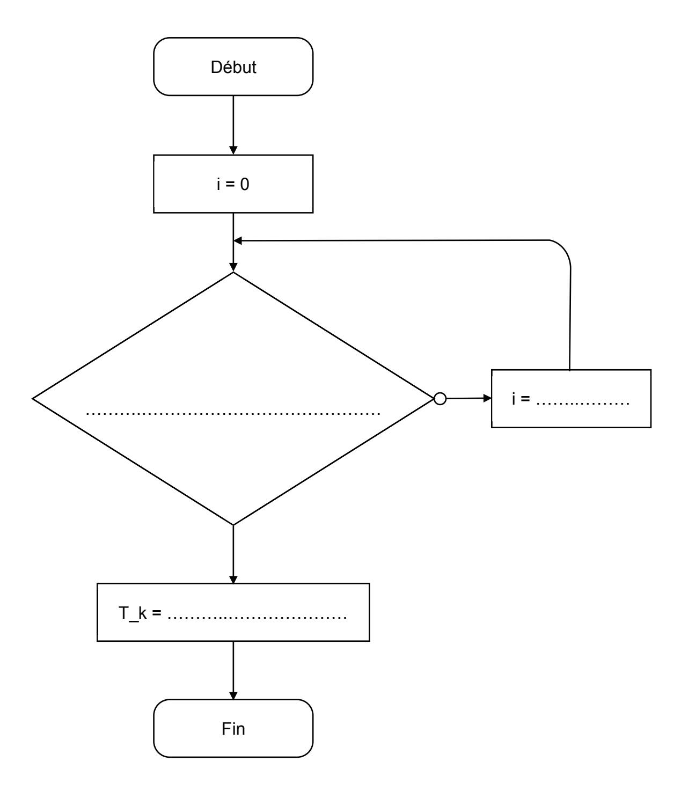

**Document réponse 2 : les différentes phases du déroulement d'une séance vécue par l'élève**

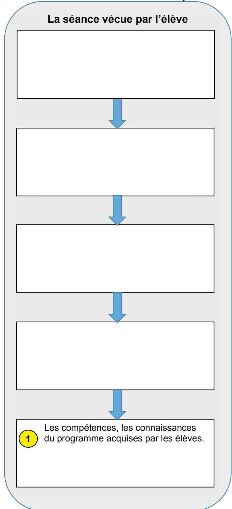

| Modèle CMEN-D Non           | OC v2 ©NEOPTEC                                                                                                                   |                                    |                                       |                              |                              |                               |                               |                                           |                               |                            |                                         |                             |                          |               |          |     |      |   | $\overline{}$ |   |   |
|--------------------------------|----------------------------------------------------------------------------------------------------------------------------------|------------------------------------|---------------------------------------|------------------------------|------------------------------|-------------------------------|-------------------------------|-------------------------------------------|-------------------------------|----------------------------|-----------------------------------------|-----------------------------|--------------------------|---------------|----------|-----|------|---|---------------|---|---|
| (Suivi, s'il y a               | lieu, du nom d'usage)                                                                                                            | 井                                  | +                                     | ╄                            | Щ                            |                               |                               |                                           |                               |                            |                                         | ₩                           |                          |               | Щ        | _   | Щ    | _ | 井             | _ | = |
|                                | Prénom(s) :                                                                                                                      | Ш                                  |                                       |                              |                              |                               |                               |                                           |                               |                            |                                         |                             |                          |               |          |     |      |   | Ш             |   |   |
|                                | Numéro Inscription :                                                                                                          |                                    |                                       |                              |                              |                               |                               |                                           |                               |                            | Né(e                                    | ) le :                      |                          |               | /        |     | /    |   | $\Box$        |   |   |
|                                | (Le                                                                                                                              | e numéro e                         | est celui qu                          | i figure :                   | sur la co                    | onvocat                       | tion ou                       | la feuill                                 | le d'ém                       | argeme                     | ent)                                    |                             |                          |               |          |     |      |   |               |   |   |
| (Remplir cette partie Concours | à l'aide de la notice) / Examen :                                                                                                |                                    |                                       |                              |                              |                               | S                             | ectio                                     | n/Sp                          | oécia                      | lité/Sér                                | e:                          |                          |               |          |     |   |   |               |   |   |
|                                | Epreuve:                                                                                                                         |                                    |                                       |                              |                              |                               | N                             | latiè                                     | re:.                          |                            |                                         |                             |                          | Se            | ssior    | ı : |   |   |               |   |   |
| CONSIGNES                      | <ul> <li>Remplir soigne</li> <li>Ne pas signer</li> <li>Numéroter cha</li> <li>Rédiger avec u</li> <li>N'effectuer au</li> </ul> | la compo aque PAC un stylo a | osition et GE (cadre a encre fo | ne pas e en ba ncée (l | y appo s à dro bleue o | orter d oite de ou noir | le sign la pag re) et i | ne disti ge) et l ne pas | inctif p placer utilise | ouvan les fe er de s | t indiquer uilles dans tylo plume | sa prov le bon à encr | enand sens e clair | et dan: e. | s l'ordr | e.  |      |   |               |   |   |

EDE STI 1

### **DR3 - DR4**

Tous les documents réponses sont à rendre, même non complétés.

|                                               | SÉANCE 5 |                                                                                                                                                                                                                                            | 7 e x e n n a oir V |                         |                    |            |            |
|-----------------------------------------------|----------|--------------------------------------------------------------------------------------------------------------------------------------------------------------------------------------------------------------------------------------------|---------------------------------------------|-------------------------|--------------------|------------|------------|
| S3 ment réponse 3 : déroulé de la séquence | SÉANCE 4 | aux de la cabines d'une installation de transport urbain par exigences de confort en zone tropicale ? répondre proposer lors de thermique pour solutions existante rétroconception Quelles câble |                                             |                         |                    |            |            |
|                                               | SÉANCE 3 |                                                                                                                                                                                                                                            | 7 e                                      |                         |                    |            |            |
| ocu D                                      | SÉANCE 2 |                                                                                                                                                                                                                                            | x e n n a oir                |                         |                    |            |            |
|                                               | SÉANCE 1 |                                                                                                                                                                                                                                            | V                                           |                         |                    |            |            |
|                                               |          | Question directrice                                                                                                                                                                                                                     | Activités                                   | pédagogique Démarche | Conclusion / bilan | Évaluation | Ressources |

| Baccalauréat) |
|---------------|
|               |
|               |
|               |
| pré-          |
| (             |
| ycée          |
|               |
| bles en l     |
|               |
|               |
| ossi          |
| ues p         |
| q             |
|               |
|               |
| ogi           |
|               |
|               |
| ons pédag     |
|               |
| oitati        |
|               |
|               |
|               |
| onse 4 : expl |
| p             |
|               |
| ment ré       |
|               |
| ocu D      |

| Niveau                                                                                       | ments Enseigne                                         | Exploitations pédagogiques possibles                                                                                                                                                                                                                                                                                                                                                                                                                                                                                                                     |
|----------------------------------------------------------------------------------------------|-----------------------------------------------------------|----------------------------------------------------------------------------------------------------------------------------------------------------------------------------------------------------------------------------------------------------------------------------------------------------------------------------------------------------------------------------------------------------------------------------------------------------------------------------------------------------------------------------------------------------------|
|                                                                                              | l'ingénieur (SI) Sciences de                           | ments mporte mériques pour prévoir les co mulations nu modélisations et des si du transport urbain par câble. Exploiter des                                                                                                                                                                                                                                                                                                                                                                                                         |
| ments d'exploration en classe de seconde Enseigne                                | Technologique Création et Innovation CIT) (   | mplantation d'une marche de créativité pour aborder de nouvelles solutions technologiques visant mique de cabines de transport cadre à l'i dans le mentale due une innovation environne répondre aux exigences fixées lors d'une rétroconception ther et à mique d'aboutir urbain par câble d'une installation existante. écono mettant Appréhender l'approche sociétale, d'un transport urbain par câble. per processus rétroconception. Découvrir les Vivre une dé    |
| ment technologie du Baccalauréat Sciences et D) durable développe (STI2 | ment technologique transversal Enseigne          |                                                                                                                                                                                                                                                                                                                                                                                                                                                                                                                                                          |
|                                                                                              | Sciences de l'ingénieur (SI) Baccalauréat scientifique |                                                                                                                                                                                                                                                                                                                                                                                                                                                                                                                                                          |