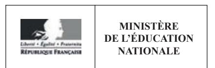

**EDE ARC 2** 

#### SESSION 2019

# CAPET CONCOURS EXTERNE ET CAFEP CORRESPONDANT

Section: SCIENCES INDUSTRIELLES DE L'INGÉNIEUR

**Option: INGÉNIERIE DES CONSTRUCTIONS** 

# ÉTUDE D'UN SYSTÈME, D'UN PROCÉDÉ OU D'UNE ORGANISATION

Durée: 4 heures

Calculatrice électronique de poche - y compris calculatrice programmable, alphanumérique ou à écran graphique – à fonctionnement autonome, non imprimante, autorisée conformément à la circulaire n° 99-186 du 16 novembre 1999.

L'usage de tout ouvrage de référence, de tout dictionnaire et de tout autre matériel électronique est rigoureusement interdit.

Si vous repérez ce qui vous semble être une erreur d'énoncé, vous devez le signaler très lisiblement sur votre copie, en proposer la correction et poursuivre l'épreuve en conséquence. De même, si cela vous conduit à formuler une ou plusieurs hypothèses, vous devez la (ou les) mentionner explicitement.

NB: Conformément au principe d'anonymat, votre copie ne doit comporter aucun signe distinctif, tel que nom, signature, origine, etc. Si le travail qui vous est demandé consiste notamment en la rédaction d'un projet ou d'une note, vous devrez impérativement vous abstenir de la signer ou de l'identifier.

## **SOMMAIRE**

| Présentation :                                                                                            | Page     |
|--------------------------------------------------------------------------------------------------------------|----------|
| Information aux candidats et sommaire du sujet                                                               | 02       |
| Éléments de contexte                                                                                         | 03       |
| Questionnaire :                                                                                           |          |
| Étude 1 : Conception architecturale d'un lieu d'accueil.                                               | 04       |
| Étude 2 : Choix constructifs ; Élingage                                                             | 05       |
| Étude 3 : Études des bétons et de ses composants                                                       | 07       |
| Étude 4 : Environnement numérique collaboratif                                                         | 08       |
| Étude 5 : Étude structurelle de l'arc du pont                                                          | 09       |
| Étude 6 : Organisation et coût des essais de convenance                                                | 10       |
| Documents techniques :                                                                                       |          |
| DT N°1 : Planches de concours et dossier de plans d'ouvrage : extraits                           | 12       |
| DT N°2 : Extraits du phasage travaux                                                                   | 14       |
| DT N°3 : Bétons et granulats                                                                           | 15       |
| DT N°4 : Essais de convenance sur la structure                                                         | 18       |
| Documents réponses :                                                                                         |          |
| - DR 1 : Questions Q11 à 14 liées à l'étude 3                                                          | 23       |
| - - DR 2 : Question Q19 liée à l'étude 5 - DR 3 : Questions Q23 et 24 liées à l'étude 6 | 26 28 |

*Nota : Les différentes études de ce questionnaire sont totalement indépendantes les unes des autres et peuvent être traitées dans un ordre quelconque choisi par le(la) candidat(e). Tous les documents réponse, y compris ceux non renseignés, sont à remettre en fin d'épreuve. Les compléments sur copie doivent être référencés au numéro de question.* 

# *Présentation du support d'études : Pont de la Citadelle.*

# **ÉLÉMENTS DE CONTEXTE :**

Avec une offre de service de transport public s'étendant sur l'ensemble de l'Eurométropole de Strasbourg, la CTS (compagnie des transports strasbourgeois) poursuit son développement au service des usagers. L'un des axes de croissance passe par la (re)création d'une ligne continue de tramway entre Strasbourg et Kehl, la ville-frontière allemande. En plus de la réalisation d'un ouvrage d'art de franchissement du Rhin à hauteur de Strasbourg, le tracé de la ligne impose la construction d'un deuxième ouvrage d'envergure. Ce pont franchissant le bassin portuaire "Vauban" est le **support de l'étude** proposée pour cette épreuve.

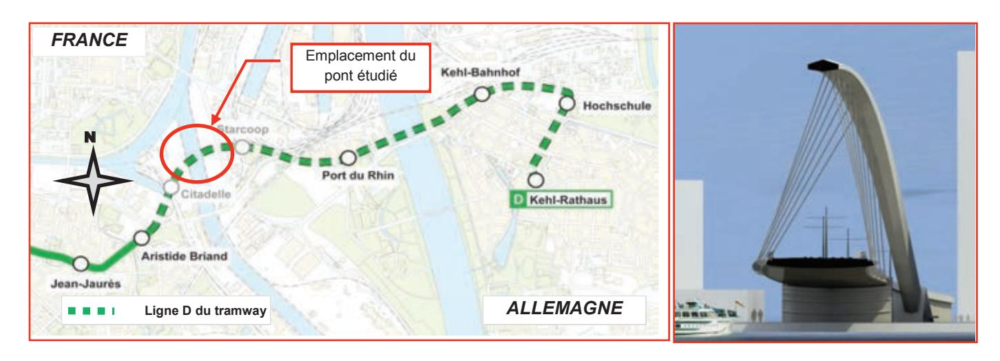

*Source autorisée par CTS Compagnie des transports strasbourgeois Maître d'ouvrage*

#### **Dispositions principales :**

L'ouvrage est un pont métallique à arc supérieur supportant un tablier intermédiaire suspendu courbe, d'une portée de 163 m entre axes des culées.

L'arc, qui se développe suivant une ligne d'épure située dans un plan vertical, présente un biais par rapport au tablier qu'il "enjambe". Son axe de symétrie est également vertical (les deux platines métalliques en pied sont calées au même niveau).

Le tablier est suspendu à l'arc par l'intermédiaire de suspentes.

La réalisation de cette opération, hors études de conception et d'équipements du tablier, est planifiée avec un délai de 18 mois et ne doit en aucun cas perturber le trafic fluvial. Elle nécessite environ 2300 tonnes d'acier de charpente métallique dont 1300 pour le tablier et 1000 pour l'arc, ainsi que 4750 m3 de bétons pour les appuis et fondations.

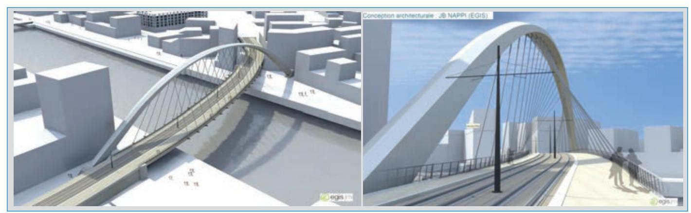

*Photos montage du pont pour le concours d'architecture ; Conception EGIS*

#### **INFORMATION AUX CANDIDATS**

Vous trouverez ci-après les codes nécessaires vous permettant de compléter les rubriques figurant en en-tête de votre copie

Ces codes doivent être reportés sur chacune des copies que vous remettrez.

► Concours externe du CAPET de l'enseignement public :

Concours

Section/option
1411E

Fpreuve 109

Matière 7048

► Concours externe du CAFEP/CAPET de l'enseignement privé :

Concours

Section/option
1411E

102

Matière 7 0 4 8

# **Étude 1 - CONCEPTION ARCHITECTURALE D'UN LIEU D'ACCUEIL**

*Objectif : Esquisser un bâtiment multi services au profit des croisiéristes.* 

*Voir D.T. N°1. Extraits planches de concours et Extraits du dossier de plans p. 12-13*

Le lauréat (**EGIS**) du concours d'architecture pour ce projet a imaginé dans ses planches de présentation, le pont dans un nouvel environnement urbain.

Bien que pouvant servir de base de travail aux urbanistes et architectes, les photomontages de cet ancien quartier du port fluvial de Strasbourg n'ont strictement aucune valeur contractuelle et laissent place à d'autres choix.

C'est ainsi que l'une des propositions d'idées porte sur le déplacement des appontements (les embarcadères étant situés actuellement au niveau du bassin Dusuzeau) vers le bassin Vauban, concomitamment à la réalisation d'un **lieu d'accueil**.

Les tenants de cette solution avancent l'argument de mobilité pour les nombreux **croisiéristes** en transit à Strasbourg, du fait de la proximité immédiate de la station de tram "Starcoop".

Dans ce bâtiment pourraient être installés des services telles une antenne de l'office de tourisme, des toilettes publiques, une salle d'exposition, une cafétéria et/ou autres, le tout au service principalement des touristes.

Dans le cahier des charges imposées par l'Eurométropole, de nombreuses contraintes techniques imposent au bâtiment des contraintes **dimensionnelles** (*emprise totale hors-tout dans un cube de 10 m de côté maximum -non compris terrasses et balcons éventuels-*) et **environnementales** (*bâtiment à énergie positive, soit un BEPOS*).

Par ailleurs, les urbanistes de la ville souhaitent faire de ce bâtiment un marqueur des références suivantes :

- Visibilité et écho à l'architecture du pont,
- Visibilité de l'excellence du "génie français" en matière de construction d'ouvrages d'art,
- Visibilité du rapport de Strasbourg à ses origines (camp romain il y a plus de 2000 ans) à l'eau, à son port et à l'Europe.

#### **Question 1 : Traité architectural de Vitruve**

Dans son traité "De architectura", l'architecte romain *Vitruve* (1er siècle av J.C.), décrit les principes constitutifs de l'architecture selon sa formule : *utilitas, firmitas, venustas*, soit l'utilité, la solidité, la beauté.

*Associer succinctement quelques liens possibles entre les mots de Vitruve et les contraintes du cahier des charges pour le lieu d'accueil.*

#### **Question 2 : Esquisse du bâtiment**

*Sur les 2 pages intérieures d'une copie, permettant un travail au format A3, proposer obligatoirement à MAIN LEVÉE une planche d'esquisse dans laquelle doivent apparaître les positions planimétrique et altimétrique du bâtiment, les façades orientées ainsi que 2 coupes représentatives de l'ensemble. Commenter très simplement le positionnement des espaces et l'orientation du bâtiment.*

#### **Question 3 : Analyse du choix architectural**

*Conclure quant aux choix des habillages dans le parti pris architectural.* 

# **Étude 2 - CHOIX CONSTRUCTIFS - ÉLINGAGES -**

*Objectif : Justifier les choix constructifs proposés, dimensionner les efforts à reprendre par certains apparaux de levage pendant les phases de mise en place de l'arc du pont.*

*Voir document technique D.T. N°2 : Phasage travaux et manutention du tronçon Ci-A3 p. 14*

#### **Question 04 : Choix constructifs**

Les méthodes de construction envisagées pour la réalisation du tablier du pont s'orientent vers la technique du pont lancé. Dans un 1er temps, le tablier est assemblé par tronçon sur l'une des berges, puis accompagné d'un avant-bec en tête de pont, poussé jusqu'à atteindre la 1ère palée provisoire. L'opération est réitérée jusqu'à atteindre la 2ème culée.

*Justifier la pose d'un avant-bec en tête de pont dans ce type de mode opératoire. Rappeler la principale contrainte excluant d'office d'autres modes d'assemblage.* 

#### **Question 05 : Poids d'un élément à manutentionner.**

Quant à l'arc, le mode opératoire consiste à préparer les tronçons -de section variable- en usine, de les transporter sur chantier et de les assembler in situ au fur et à mesure de l'avancement. En phase travaux, le maintien de l'équilibre statique est assuré grâce à des tours d'étaiement adaptées aux géométries propres au tronçon posé. La partie centrale de l'arc est posée sur le tablier avant poussage et hissée d'un seul tenant.

On s'intéresse particulièrement à la pose du tronçon **N° Ci-A3**, dernier tronçon du pied droit de l'arc juste avant la partie médiane de rayon 120 mètres. Raidi par 2 diaphragmes et de longueur **13,5** mètres, il doit être positionné sur une tour d'étaiement et prendre appui sur le tronçon Ci-A2.

*Calculer le poids total de l'élément Ci-A3.* 

*NB : Par souci de simplification, on prendra les valeurs renseignées dans le tableau suivant:* 

| 1— |    | ×"            | <u>2</u>       |
|----|----|---------------|----------------|
|    | [. |               | Axe de constru |
| ,_ |    | 8             |                |
| L  | 7  | $\overline{}$ |                |

| Pièces        | Désignation                                                                        | Ép. | Largeur   | Longueur |
|---------------|------------------------------------------------------------------------------------|-----|-----------|----------|
| Tôle 1 (id 2) | Semelle supérieure                                                                 | 60  | 1578/1856 | 13500    |
| Tôle 3 (id 4) | Âme Nord et Sud                                                                    | 30  | 3791/3190 | 13500    |
| Tôle 5 (id 6) | Semelle inférieure                                                                 | 35  | 1339/1623 | 13500    |
| Tôle 7        | Diaphragmes                                                                        | 40  | 350       | 12000    |
|               | NB :12000 = Longueur développée d'un diaphragme (il y en a 2 sur tout le tronçon). |     |           |          |
| Tôle 8        | Raidisseurs d'âme                                                                  | 30  | 150       | 13500    |
|               | NB : Toutes les valeurs sont exprimées en mm ; Prendre MVacier = 7850 kg.m-3       |     |           |          |

#### **Question 06 : Centre de gravité du tronçon Ci-A3**

 *Rappeler la valeur de l'angle maximal d'élingage conseillée par les organismes tels OPPBTP et INRS.* 

*Déterminer l'abscisse xG du centre de gravité de ce tronçon, l'axe de ces abscisses étant confondu avec sa longueur.* 

*NB : Par souci de simplification et contrairement à la question précédente, on négligera l'impact des 2 diaphragmes et des raidisseurs (tôles 7 et 8)*

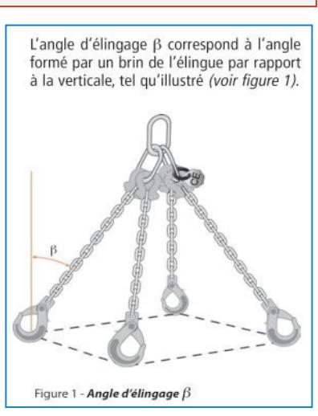

#### **Question 07 : Efforts de tension dans les chaînes - Manutention Camion zone de stockage**

La manutention des tronçons s'effectue grâce à une grue mobile dont le crochet de levage porte 4 chaînes. Celles-ci sont accrochées aux 4 oreilles soudées aux extrémités de l'élément.

Pour minimiser les risques, Il est impératif d'apporter et de présenter la pièce dans la même position que celle qu'elle aura dans sa position définitive.

Pour des raisons de sécurité, on considérera que **seules 2 chaînes assurent la stabilité** du tronçon. Par ailleurs et ce, **quels que soient les résultats trouvés précédemment**, les valeurs à prendre pour les calculs inhérents aux chaînes sont les suivantes :

- Parfaite symétrie de l'ensemble du tronçon impliquant une position du centre de gravité **xG située à 6,750 m** sur l'axe de longueur,
- **13000 13500** x **XG = 6750** Variable Variable y
- Masse de l'élément : **67,5 tonnes**
- Angle d'élingage égal à **30° maximum.**
- Position des oreilles située à **250 mm des extrémités,**
- Inclinaison du tronçon égale **à 30°** par rapport à l'horizontale lors de la manutention de la zone de stockage jusqu'à sa position finale.
- Accélération de la pesanteur supposée égale à 10 m/s2 ),

Dans un 1er temps, le tronçon arrivant sur site par convoi exceptionnel doit être déchargé en **position horizontale** et stocké avant sa pose in situ.

*Calculer les efforts dans les chaînes lors du déchargement. Quelle est leur longueur minimale dans cette configuration ?* 

#### **Question 08 : Longueur de chaînes lors de la manutention de la zone de stockage In situ**

La 2ème phase de manutention nécessite l'inclinaison de la pièce. Des chaînes de longueur 20 mètres sont à disposition pour ce type de transport.

On rappelle que les chaînes, contrairement aux élingues peuvent être facilement adaptées aux longueurs désirées.

*Quelle est la longueur à donner à la 2ème chaîne dans cette 2ème configuration, sachant que la 1ère chaîne a une longueur de 20 mètres et que l'angle d'ouverture des chaines au sommet est de 60° ?* 

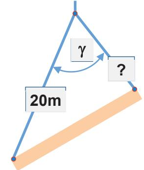

#### **Question 09 : Efforts de tension dans les chaînes dans cette phase**

*En considérant que la longueur du 2ème brin est de 14 m, montrer que la valeur de l'angle d'ouverture est inférieur à 60° et déduire les efforts de traction dans les 2 chaînes.*

 *Conclure quant au choix du type de chaînes à utiliser pour ce tronçon Ci-A3.* 

# **Étude 3 – ÉTUDE DES BÉTONS ET DE SES COMPOSANTS**

*Objectif : Valider la qualité des matériaux issus de 3 centrales différentes et mesurer l'impact environnemental des bétons produits.* 

*Voir Doc Technique D.T. N°3 : Bétons et granulats utilisés p.15-17 et doc réponse DR1 p.23-25*

Le fabriquant de béton titulaire du marché d'approvisionnement a mis en avant dans sa réponse à l'appel d'offre, l'assurance de livraison en matériaux bétons à tous moments en fonction des besoins et ce, en raison d'un réseau de 3 centrales de fabrication de béton pouvant se substituer l'une à l'autre si nécessaire.

#### **Question 10 : Masses volumiques du béton de propreté.**

Le squelette granulaire des bétons utilisés pour l'ouvrage est composé de granulats issus de 3 gravières différentes, alimentant elles-mêmes les 3 centrales à béton capables de fournir tous les types de bétons exigés par les besoins du projet.

Extraits par dragage, ils sont embarqués par convoyeur sur le site de stockage et enfin, acheminés par camion-benne dans les 3 centrales du groupe.

*Voir D.T. N°3 §A p.15 : Processus de fabrication du béton.* 

L'étude ne concerne que les **3 bétons de propreté** (formule N°16005058) issus des 3 centrales.

*Voir D.T. N°3 §B p.15 : Cartes d'identité et Compositions des bétons de propreté.* 

*Connaissant la moyenne des masses volumiques réelles mesurées des bétons issus des 3 centrales, soit 2329 kg/m3 et sachant que la formulation est validée si l'écart entre les MV théorique et réelle n'excède pas 2,5%, calculer la masse volumique théorique des 3 bétons frais et en déduire la validation –ou non- de la formulation pondérale.* 

#### **Question 11 : Granularité des sables.**

*Voir D.T. N° 3 §C p.15-16 Granulométrie des granulats*

Pour rentrer dans la composition des bétons issus de la centrale d'ENTZHEIM, le matériau **S,**  dont la courbe granulométrique est établie sur le **document réponse DR1 p.23**, doit être mélangé à un autre sable **S**, pour produire le **sable 0/4 recomposé** retenu dans la composition.

*Établir la courbe granulométrique du sable S à partir du tableau de ses mesures d'essai sur le document réponse DR1 p.23.* 

#### **Question 12 : Mélange granulaire du sable 0/4 recomposé.**

La valeur du module de finesse Mf attendu pour ce sable 0/4 recomposé est de **2,75.**

*Calculer les modules de finesse Mf et Mf des sables* **S et** *S*

*Établir sur le même document réponse DR1 p.23., la courbe granulométrique théorique du mélange granulaire « sable 0/4 recomposé ».*

#### **Question 13 : Quantité d'énergie par m3 de béton fabriqué.**

En se calquant sur les attentes des calculs **"bilan E+C-"** appliqués généralement au secteur plus spécifique du bâtiment, la maîtrise d'ouvrage souhaite connaître l'impact environnemental du projet.

*Voir D.T. N° 3 §D et §E p.16-17 Tableau des distances et données environnementales*

L'étude se limite à **2** catégories d'impacts: Réchauffement global : Énergie non renouvelable. Est exclu de l'étude l'impact "Épuisement des ressources" et sont négligées les conséquences liées à la consommation d'eau et à sa distribution.

*Démontrer que la valeur arrondie moyenne de 14,5 MJ par m3 correspond à la quantité d'énergie nécessaire à la fabrication en centrale d'un m3 de béton.* 

## **Question 14 : Étude d'impacts.**

*Voir Doc Technique D.T. N°3 p.15-17 et doc réponse DR1 p.24-25*

 *Évaluer, pour les phases du processus complet de fabrication du béton développées dans les tableaux du D.T. N° 3 §A, les 2 indicateurs d'impacts ( Réchauffement global et Énergie non renouvelable) pour 1 m3 de béton fabriqué à partir des granulats et ciment et transporté jusqu'au chantier. Le calcul porte uniquement sur les bétons de propreté issus des 3 centrales.*

*Conclure quant à la qualité attendue des granulats pour les bétons proposés et commenter par une analyse succincte les résultats de l'étude d'impacts environnementaux.*

*Quelle influence -hors coût économique- cette étude pourrait-elle avoir dans la désignation d'un site de production pour l'approvisionnement en béton.* 

# **Étude 4 - ENVIRONNEMENT NUMÉRIQUE COLLABORATIF - BIM**

*Objectif : Identifier, analyser et exploiter les apports des nouveaux outils de transition numérique et modes de communication dans les projets de construction.*

L'Éducation Nationale propose chaque année à l'ensemble des élèves et étudiants de nombreux concours comme les Olympiades des Sciences de l'Ingénieur ou la création de mini entreprise par exemple. Une aide est généralement apportée par différentes institutions (régions, villes etc.), fondations et associations diverses (Main à la pâte, ASCO TP, ConstruirAcier, École française du béton, UPSI, APMBTP etc.) et organisations professionnelles (FFB ; FNTP).

Ces concours ont pour objectif de mettre les apprenants en situation professionnelle réelle à partir de projets innovants existants ou à créer.

#### **Question 15 : Réflexions autour des démarches collaboratives.**

Pour comprendre au mieux les liens école-entreprise et mettre à profit leurs propres apprentissages universitaires, un groupe d'étudiants en « MASTER MEEF 2nd degré - parcours sciences industrielles de l'ingénieur – option ingénierie de la construction », participe au concours « Les génies de la construction (*anciennement Batissiel+)* », dont le thème est :

« **Importance du développement numérique et de la démarche collaborative au profit de l'étude et de la réalisation d'un ouvrage public** ».

Le support à partir duquel s'articuleront les travaux d'analyse et de réflexions du groupe est le pont de la citadelle.

*En fonction de l'étude menée par le groupe, proposer un « poster » au format A4 en vue de la soutenance du projet.* 

*Il conviendra de mettre en avant les points sur lesquels porteront l'exposé d'une part et de les argumenter par l'un ou l'autre exemple d'autre part.*

*Conclure quant aux bénéfices apportés par les démarches collaboratives numériques dans les projets de construction.*

# Étude 5 – ÉTUDE DE L'ARC DU PONT.

Objectif: Étudier la stabilité de l'arc du pont pour valider le mode constructif des appuis.

Voir doc technique D.T.N°1 p. 13: Extraits du dossier de plans et document réponse DR2 p. 26-27

L'étude concerne l'arc du pont et ce, lors de la phase précédant la pose des suspentes maintenant le tablier. Elle se limitera à un problème **plan**. Le repère global à utiliser pour l'analyse statique est orthonormé direct avec **l'axe des X** confondu avec l'horizontale.

#### Question 16 : Étude de la géométrie de l'arc.

Le schéma « Caractéristiques générales de l'ouvrage » du **D.T. N°1** donne la géométrie réelle de l'arc. Ce dernier est parfaitement symétrique et repose sur des appuis empêchant tous mouvements de rotation et de translation.

Il est constitué d'éléments métalliques soudés entre eux, de longueur 6,000 mètres à l'axe de construction (sauf les 2 premiers tronçons adjacents aux appuis dont la longueur est de 6,517 m).

⇒⇒⇒ Calculer la longueur exacte de l'arc au niveau de son **axe de construction.** En déduire l'angle concerné par l'arc de cercle de rayon 120 mètres. Commenter la valeur obtenue.

#### Question 17 : Étude simplifiée du cas de charge lié au seul poids propre de l'arc.

Les suspentes n'étant pas encore fixées, l'étude de ce cas de charge ne prendra en compte que l'incidence du poids propre de l'arc et ce, **sans aucune pondération**.

Dans un souci de simplification, on considèrera que

- Géométriquement, l'arc devient arbalétrier, en "V inversé", constitué de 2 éléments droits (AB et BC) de pente régulière, symétriques par rapport à l'axe vertical passant par B. Voir schéma ci-contre
- la structure est bi-encastrée au niveau de ses appuis.
- les valeurs suivantes sont à prendre en compte :
  - o Le linéaire est de 200 mètres (2∗100 m);
  - o La distance horizontale entre les appuis est de 181,4 m;
  - o La masse totale, répartie de manière homogène est estimée à **1000 tonnes.** (g : 10 m/s2) ;

⇒⇒⇒ Faire le schéma du modèle mécanique de l'arc en vue de calculer ses actions aux appuis. Placer le repère global décrit précédemment. En déduire le degré d'hyperstaticité du système.

#### Question 18 : Calculs des actions à l'appui C.

Les résultats des calculs issus d'un logiciel de structure donnent les valeurs des intensités suivantes au point A (appui gauche)

 $X_A = 5385 \text{ kN}$ ;  $Y_A = 5000 \text{ kN}$ ;  $Z_A = 37800 \text{ kN.m.}$ 

⇒⇒ En déduire les actions au point C.

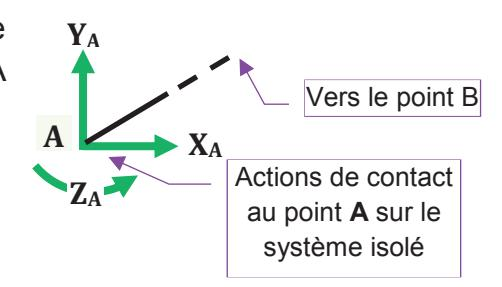

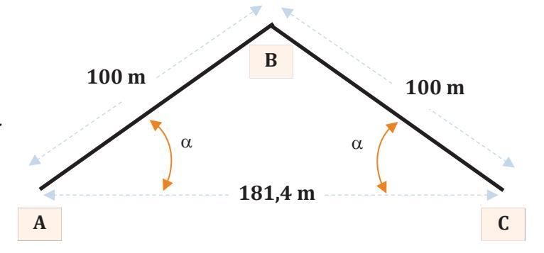

#### Question 19 : Graphe de N(x), V(x), Mf(x) dans la partie BC.

Utiliser le Document Réponse DR2 p.26 pour les calculs et p.27 pour les graphes

⇒⇒⇒ Établir les équations des éléments de cohésion dans cette « barre » BC en adoptant la convention ci contre.

Tracer sur le les graphes correspondants.

Convention à adopter selon ce schéma : Partie gauche conservée.

 $\Rightarrow \Rightarrow \Rightarrow$  A la seule lecture des graphes, en

déduire et justifier l'endroit où les contraintes normales et de cisaillement sont les plus sévères.

## **Étude 6- ORGANISATION ET COUT DES ESSAIS DE CONVENANCE**

**Objectif**: Organiser et valider un planning prévisionnel des essais de convenance de stabilité à réception du tablier et en établir le coût selon les variantes proposées.

Voir doc technique D.T.N°4 p. 18-22 Essais de convenance sur la structure et doc rép DR3 p.28

La CTS impose au préalable de la réception du tablier une procédure d'essais et mesures conforme aux référentiels techniques applicables pour ce type d'ouvrage.

Elle demande par ailleurs que les mesures **soient systématiquement doublées** à partir de 2 zones d'implantation différentes des appareils télémétriques.

#### Question 20 : Expression des valeurs des résultats de mesures

Le tableau du document technique **DT4 §C p.19** donne une partie des résultats de mesures associées aux valeurs des résultats de calculs issus du BET.

⇒⇒⇒ Expliquer pourquoi tous les résultats des **mesures** donnés dans ce tableau sont libellés avec une décimale, -valeurs entières comprises-, sauf pour ceux concernant les arcs.

#### Question 21 : Analyse et validité des résultats de mesure. Convenance du tablier.

Voir document technique D.T.N°4 &C p.19

Une analyse des valeurs des résultats données dans le tableau doit être menée afin d'être en capacité -ou non- d'assurer la conformité de l'ouvrage.

On note pour ce faire que :

- tous les tassements d'appui relevés suite aux pré-chargements doivent être **inférieurs à 10**
- la flèche mesurée doit être comprise entre **0,8 et 1,1** fois la flèche théorique. Entre **1,1 et 1,5** fois, les mesures sont à refaire. Au-delà, le dossier doit être « repris ». Cette contrainte ne s'applique pas pour les valeurs mesurées **ET** calculées inférieures à **10 mm**.

⇒⇒⇒ Valider la conformité de l'ouvrage vis-à-vis de la flèche (tablier et arc) et du tassement (culées).

⇒⇒⇒ Que faudrait-il envisager –si besoin- comme remédiation ?

NB: Toutes les autres mesures affectant les files 29, 15 et 7 du tablier et la face NORD de l'arc ne sont reportées dans le tableau. Elles sont réputées, chacune pour ce qui les concerne, convenir aux exigences du CCTP.

Tournez la page S.V.P.

## **Question 22 : Analyse de l'organisation calendaire des essais menés lors de l'étape .**

La maîtrise d'ouvrage impose pour ces essais de convenance un délai ne dépassant pas **une journée d'amplitude limitée à 13 heures (7h00 - 20h00)** et exige au préalable un planning.

Une 1ère ébauche *voir D.T. N°4 §D et §E p.20-21* définit précisément le cadencement prévisionnel de **l'étape**  -soit les pré-chargements-, en donnant l'enclenchement des tâches spécifiques de cette étape dans **2 configurations de travail** :

- **1** brigade avec **2** personnes soit :
- 1 ingénieur, 1 aide opérateur-géomètre et **1** station totale robotisée.
- **2** brigades avec **4** personnes soit :
- 1 ingénieur, **2** opérateurs-géomètre, 1 aide opérateur-géomètre et **2** stations totales.

*Démontrer l'impossibilité de répondre aux exigences calendaires si une seule brigade est sur site pour réaliser l'ensemble des étapes de ces essais . Expliquer en quoi il est impossible d'avoir proportionnalité entre budget d'heures et délais ?* 

## **Question 23 : Étude N°1 estimative du coût de l'opération "essais de convenance".**

Le planning établi avec les 2 brigades (1 ingénieur, 2 opérateurs-géomètre et 1 aide) et les 2 stations totales robotisées » est retenu. L'ensemble de la mission peut être mené à bien en **12** heures.

*voir DT N°4 §F p.22 : tableau « Données communes pour l'établissement des offres de prix ».* 

*Établir sur le document réponse DR3 –partie gauche du tableau de la page 28- le prix de revient HT de la prestation dans le format : 2 brigades et 2 stations totales LEICA TS50.*

## **Question 24 : Étude N°2 estimative avec les nouvelles technologies.**

La **veille normative et technologique** des personnels du BET amène à repenser complètement la mission. De nouvelles obligations réglementaires tels l'établissement d'un PCRS (Plan de Corps de Rue Simplifié) ou le suivi de la réforme des DT/DICT, imposent aux entreprises et bureaux à anticiper et chercher à moderniser leurs modes opératoires et ce, allant de pair avec l'utilisation de nouveaux matériels.

Dans le domaine du génie civil, des solutions innovantes de capture de la réalité 3D sont à même de proposer une réponse bien au-delà des contrôles exigés par la CTS : le traitement numérique du nuage de points obtenu permettant en effet de construire l'image réelle du pont au format IFC tout en la comparant au modèle virtuel.

Le planning ainsi modifié montre que la capture par visée scanner ne nécessite qu'une **seule demi-journée sur site**, avec le seul ingénieur et un seul appareil de type **LEICA RTC360** sans aucune plateforme à préparer. Cependant, il faut prévoir une formation complémentaire si besoin.

*Établir une 2ème offre (prix de revient hors taxes) de cette même mission en utilisant les nouveautés technologiques décrites ci-dessus et ce, avec l'option location. Utiliser le DR3 partie droite du tableau de la page 28-* 

#### **Question 25 : Réflexions autour des nouvelles technologies.**

*Conclure quant à l'offre à proposer à la maîtrise d'ouvrage et préparer un argumentaire susceptible d'influencer ou non l'achat d'un appareil de capture 3D.*

# Document Technique D.T. N°1: EXTRAITS PLANCHES DE CONCOURS

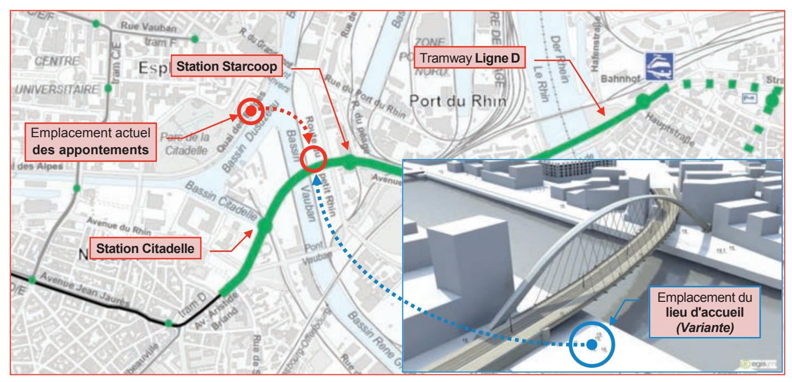

Plan de l'extension de la ligne D - sans échelle- En incrustation : photomontage du pont dans un environnement virtuel.

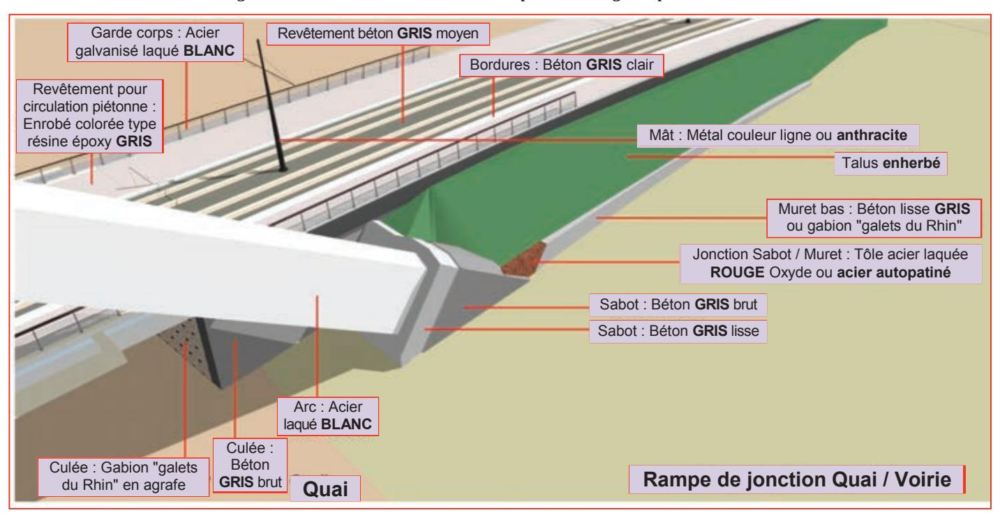

Photomontage de la culée C1 (côté EST du pont). Détails architecturaux : Formes, matières et couleurs.

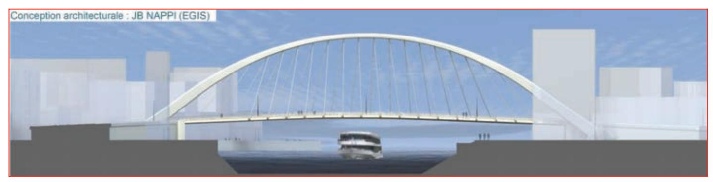

Photomontage du pont (vue du côté SUD). Architecture d'ensemble et urbanisation de son environnement

# *Document Technique D.T. N°1 : EXTRAITS DU DOSSIER DE PLANS*

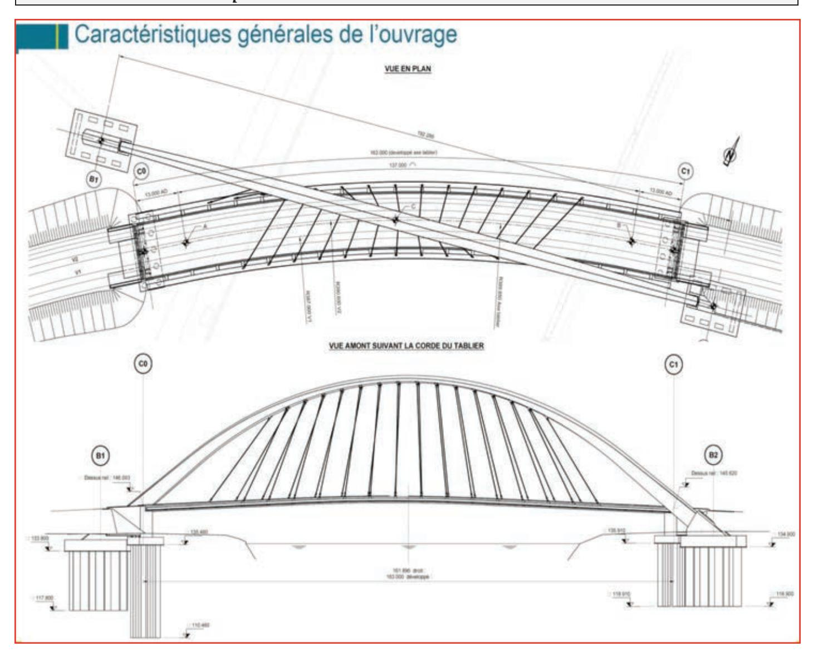

*Caractéristiques générales de l'ouvrage*

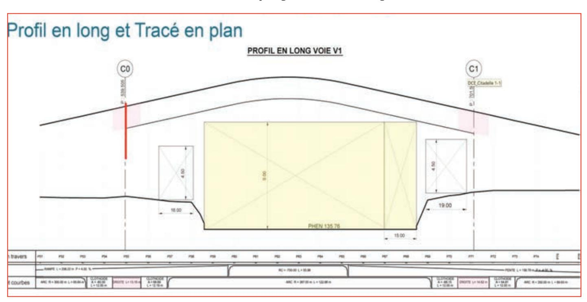

13 *Profil en long et tracé en plan de l'ouvrage. Dimensions des gabarits de passage. Rapport d'échelle Longueur/hauteur = 5*

# *Doc. Technique D.T. N°2 : PHASAGE TRAVAUX–MANUTENTION Ci-A3*

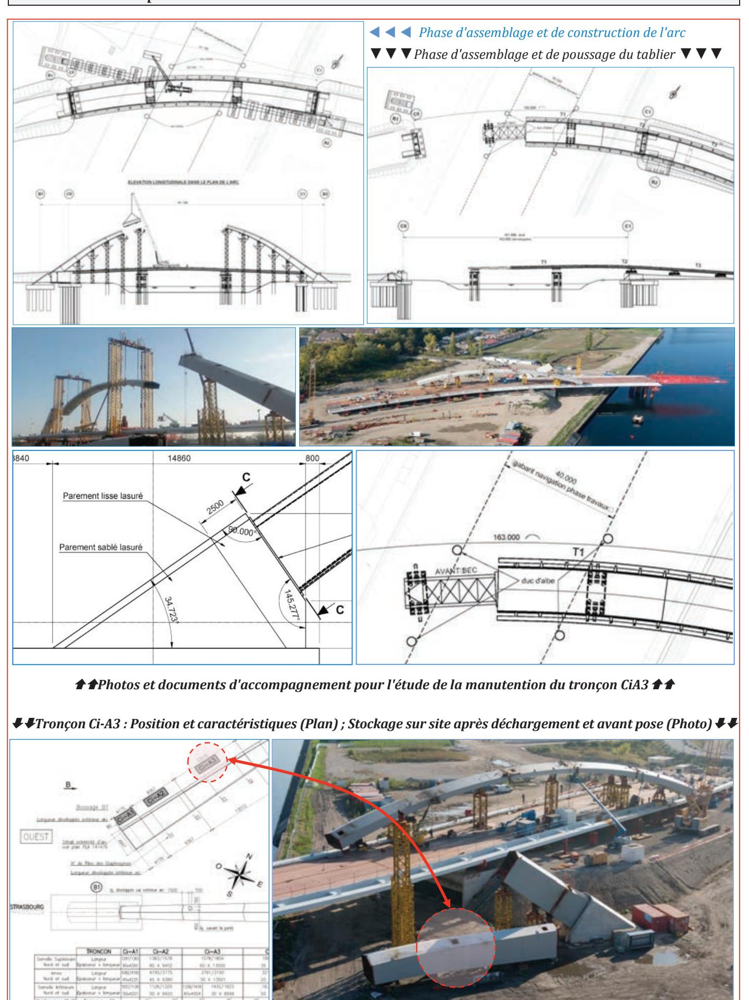

# Document Technique **D.T. N°3** : **BÉTONS ET GRANULATS UTILISÉS**

# A] Processus de fabrication du béton

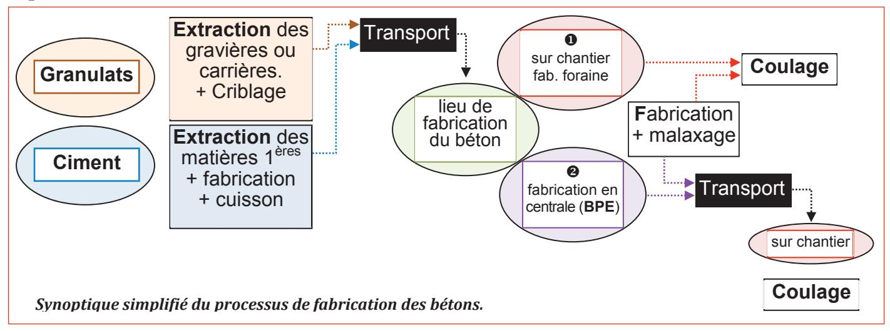

## B] Cartes d'identité et compositions des bétons de propreté utilisés.

| B. de proprete N°16005058 | •                                       | F EN 206/CN                          |                                       |                                       | C16/20 250Kg à 150mm X0(F)                |        |                    | 2,5   |
|------------------------------|-----------------------------------------|--------------------------------------|---------------------------------------|---------------------------------------|----------------------------------------------|--------|--------------------|-------|
| 14 10000000                  | N OL OF                                 | T IVI DIIIAX -                       | - 22 11111 33 7                       | AI I AIS. 100                         | a 13011111 XU(1 )                            | OL 0,- | +0                 |       |
| Matériau                     | <b>0/4 R</b> d abs : 2,60    | <b>4/8R</b> d abs : 2,59  | <b>8/16R</b> d abs : 2,58  | <b>16/22R</b> d abs : 2,57 | <b>CEM II/B 42,5</b> d abs : 3,06 | Filler | Plast Delta CER | Eau   |
| Origine                      | Lingolsheim                             | Lingolsheim                          | Lingolsheim                           | Lingolsheim                           | HOLCIM Héming                                |        | Chryso             | Puits |
| Quantité (kg)                | 830                                     | 200                                  | 300                                   | 620                                   | 250                                          | 0      | 0,75               | 154   |
|                              | Béto                                    | n composé e                          | t fabriqué d                          | ans la centro                         | ale de ENTZHEI                               | M      |                    |       |
| Matériau                     | <b>0/4 R</b> d abs : 2,66 | <b>4/16R</b> d abs : 2,62 | <b>16/22R</b> d abs : 2,59 |                                       | <b>CEM II/B 42,5</b> d abs : 3,06 | Filler | Plast Delta CER | Eau   |
| Origine                      | Entzheim                                | Entzheim                             | Entzheim                              |                                       | HOLCIM Héming                                |        | Chryso             | Puits |
| Quantité (kg)                | 870                                     | 460                                  | 620                                   |                                       | 250                                          | 0      | 0,75               | 160   |
|                              | Béton com                               | posé et fabr                         | iqué dans la                          | centrale de                           | STRASBOURG-                                  | Neudo  | orf                |       |
| Matériau                     | <b>0/4 R</b> d abs : 2,63    | <b>4/16R</b> d abs : 2,62 | <b>16/22R</b> d abs : 2,61 |                                       | <b>CEM II/B 42,5</b> d abs : 3,06 | Filler | Plast Delta CER | Eau   |
| Origine                      | Hoerdt                                  | Hoerdt                               | Hoerdt                                |                                       | HOLCIM Héming                                |        | Chryso             | Puits |
| Quantité (kg)                | 870                                     | 460                                  | 620                                   |                                       | 250                                          | 0      | 0,75               | 160   |
|                              | Béte                                    | on composé                           | et fabriqué d                         | dans la centi                         | rale de HOERD                                | T      |                    |       |
| Tableau de co                | omposition de                           | es différents l                      | pétons de pro                         | preté (N°160                          | 05058) issus des                             | 3 cen  | trales du gro      | oupe. |

# C] Granulométrie des granulats

| Tableau de mesures pour l'Analyse granulométrique des sables S① et S②                          |                                                          |         |         |          |                |       |      |     |   |     |   |   |   |  |
|------------------------------------------------------------------------------------------------|----------------------------------------------------------|---------|---------|----------|----------------|-------|------|-----|---|-----|---|---|---|--|
| Les valeurs indiquées correspondent à la masse (en g) des <b>refus cumulés</b> à chaque tamis. |                                                          |         |         |          |                |       |      |     |   |     |   |   |   |  |
| Tamis                                                                                          | Tamis Fond 0,063 0,08 0,125 0,25 0,5 1 2 3,15 4 5 5,60 8 |         |         |          |                |       |      |     |   |     |   |   |   |  |
|                                                                                                | Quantité de sable S1 analysée : <b>2550 g</b>            |         |         |          |                |       |      |     |   |     |   |   |   |  |
| Sable <b>S</b> ①                                                                               | 2543                                                     | 2480    | 2425    | 2240     | 1276           | 715   | 460  | 77  | 0 | 0   |   |   |   |  |
|                                                                                                | Quanti                                                   | té de s | able S2 | 2 analys | sée : <b>2</b> | 875 g |      |     |   |     |   |   |   |  |
| Sable <b>S</b> ②                                                                               | 2869                                                     | 2848    | _       | 2790     | 2470           | 1877  | 1525 | 802 | - | 148 | - | 0 | 0 |  |

## HOLCIM GRANULATS

12 B Rue des Hérons 67960 ENTZHEIM

Page 1/1

Producteur : HOLCIM - LINGOLSHEIM
Granulats : SABLE 0/4 RECOMPOSE
Pétrographie : Alluvions silico-calcaires

Elaboration: Recomposés

| Classe g  | ranulaire | -//   | Valeurs sp | pécifiée |      |   |       | cteur s'e | ngage | (    | Catégorie |       |
|-----------|-----------|-------|------------|----------|------|---|-------|-----------|-------|------|-----------|-------|
| 0         | 139       | Code  | A (03/09/  | 2009)    |      |   |       |           |       |      |           |       |
|           |           |       | -          |          |      |   | D     | 1.4D      | 2D    | T-   |           |       |
|           | 0.063     | 0.125 | 0.25       | 0.5      | 1    | 2 | 4     | 5.6       | 8     | FM   | SE        | f     |
| Etendue e |           |       | 40         |          | 40   |   | 10    |           |       | 0.6  |           | 10    |
| V.S.S.+U  |           |       | 54.0       |          | 84.0 |   | 100.0 |           |       | 3.25 |           | 7.00  |
| V.S.S.    | 6.0       |       | 50.0       |          | 80.0 |   | 98.0  |           |       | 3.10 |           | 6.00  |
| V.S.I.    |           |       | 10.0       |          | 40.0 |   | 88.0  | 95.0      | 100.0 | 2.50 | 65.00     |       |
| V.S.IU    |           |       | 6.0        |          | 36.0 |   | 86.0  | 94.0      |       | 2.35 | 60.00     |       |
| LS        |           |       |            |          |      |   | 99.0  |           |       |      |           | 10.00 |
| LI.       |           |       |            |          |      |   | 85.0  | 95.0      | 100.0 |      |           |       |

#### Rappels de définitions.

- Classe granulaire: Les granulats sont désignés selon leur classe granulaire d/D (avec d : dimension inférieure et D : dimension supérieure). L'intervalle d/D est appelé classe granulaire. Elle est spécifiée suite à l'analyse d'essais issus des résultats nécessitant une série de tamis normalisés.
- **Module de finesse**: Le module de finesse d'un sable est une valeur caractérisant sa granularité. C'est la somme des pourcentages des refus sur les 6 tamis de la série (en mm):

$$[0.16 - 0.315 - 0.63 - 1.25 - 2.5 - 5]$$

 Mélange granulaire: Les mélanges granulaires sont issus des résultats donnés par les différentes valeurs suivantes de modules de finesse: Mf① pour S①; Mf② pour S② et Mf pour celui visé du sable composé.

Le mélange est établi à partir de la formule ci-dessous avec l'hypothèse : Mf2 > Mf > Mf0.

 $%S \odot = (Mf \odot - Mf) / (Mf \odot - Mf \odot) et %S \odot = (Mf - Mf \odot) / (Mf \odot - Mf \odot)$ 

## D] Tableau des distances de transport matériaux à effectuer.

| Site <b>0</b> Fabrication des ciments | Site <b>2</b> Extraction des granulats | Site <b>3</b> Fabrication des bétons | Distance <b>1</b> ▶ <b>3</b> | Distance  ②▶③ (en km) | Site <b>4</b> Construction du pont | Distance (en km) <b>3</b> ▶ <b>4</b> |
|---------------------------------------|----------------------------------------|--------------------------------------|---------------------------------|-----------------------|------------------------------------|--------------------------------------|
| <b>H</b> éming                        | Lingolsheim                            | Entzheim                             | <b>100</b> km                   | <b>2</b> km           | Stbg-Citadelle                     | <b>18</b> km                         |
| <b>H</b> éming                        | Entzheim                               | Strbg-Neudorf                        | <b>110</b> km                   | <b>12</b> km          | Stbg-Citadelle                     | <b>4</b> km                          |
| <b>H</b> éming                        | Hoerdt                                 | Hoerdt                               | <b>90</b> km                    | <b>1</b> km           | Stbg-Citadelle                     | <b>15</b> km                         |

#### E] Données issues des FDES & déclarations environnementales de produits

| Catégorie d'impact         | pour le transport. I granulats et camion | e∗kilomètre est calculé en for ∟eur capacité de charge (cam ns dédiés pour ciments est de e sont des camions-toupie de | ions-benne pour les e 32 tonnes soit le type <b>①</b> . |
|----------------------------|------------------------------------------|---------------------------------------------------------------------------------------------------------------------------------|------------------------------------------------------------|
|                            | Unité                                    | Transport type <b>9</b> pour bétons                                                                                             |                                                            |
| ① Réchauffement global     | kg équivalent CO 2            | 0,105                                                                                                                           | 0,165                                                      |
| ② Énergie non renouvelable | MJ                                       | 1,83                                                                                                                            | 2,76                                                       |

#### Impacts dus aux transports des matériaux

Ces données sont calculées en considérant les camions chargés à plein lors de leur transport aller. Elles représentent une valeur moyenne rapportée à **1 tonne** de matériau transportée sur **1 km**. Le retour est pris en compte dans ces valeurs.

**NB:** La tonne\*kilomètre (T\*km) est une unité de mesure correspondant au transport d'une tonne de marchandise (y compris le conditionnement et la tare des unités de transport intermodal) sur une distance d'un kilomètre par n'importe quel moyen de transport. Ce terme est défini par analogie avec la notion de travail en physique : il s'agit d'une quantité de transport. Les tonnes\*kilomètres sont additives.

| Catégorie d'impact          | Unité                         | Granulats               | Ciment |
|-----------------------------|-------------------------------|-------------------------|--------|
| ① Réchauffement global      | kg équivalent CO 2 | 2,30                    | 648    |
| ② Énergie non renouvelable  | MJ                            | 64,4                    | 4050   |
| ③ Épuisement des ressources | kg équivalent Sb              | 1,62 * 10 -2 | 1,59   |

Impacts pour l'extraction des granulats et la fabrication du ciment (extraction+cuisson) pour 1 t de matière.

**NB**: Le kg équivalent Sb (Sb étant le symbole chimique de l'Antimoine) exprime l'importance des réserves disponibles des différents éléments. Les consommations sont exprimées en kg puis multipliées par les coefficients de conversion propres à chaque élément pour tenir compte de l'impact d'épuisement des ressources. L'élément de référence est l'antimoine dont le coefficient est de 1.

| Catégorie d'impact         | Données complémentaires particulièr pour les calcu                                                   |                                             | à prendre e                            | n compte                      |
|----------------------------|------------------------------------------------------------------------------------------------------|---------------------------------------------|----------------------------------------|-------------------------------|
| ① Réchauffement global     | Pour le fonctionnement de chaque cer par <b>tonne</b> de béton produite e                            | ntrale, le rejet est estimé à <b>2</b> , | de gaz à effe , <b>40</b> kg éq. C0 | et de serre D 2 |
|                            |                                                                                                      | Hoerdt                                      | <b>243</b> kW                          | <b>60</b> m 3 /h   |
| ② Énergie non renouvelable | Puissance (en kW) et Capacité réelle de production (en m³/h) de chaque malaxeur des 3 centrales sont | Entzheim                                    | <b>224</b> kW                          | <b>56</b> m 3 /h   |
|                            | maiaxed des o certifales sont                                                                        | Strasbourg                                  | <b>274</b> kW                          | <b>68</b> m 3 /h   |

#### Impacts pour la fabrication du béton

 $NB_1$ : Pour la fabrication du béton, l'impact "épuisement des ressources" est négligé.  $NB_2$ : 1 kWh = 3,6 MJ

## Doc. Technique **D.T. N°4**: **ESSAIS DE CONVENANCE SUR STRUCTURE**

#### A/ Essais, mesures et calculs de validation.

Les épreuves de chargement ont pour objet de s'assurer que l'ouvrage livré est apte à supporter les charges pour lesquelles il a été conçu. Elles permettront également de vérifier *a posteriori* que le fonctionnement de l'ouvrage sous charge est conforme au *modèle* de calcul utilisé.

Les mesures sont faites sur à partir de points (voir §B) du tablier, de l'arc et des culées au cours des chargements, puis après déchargements pour calculer les déplacements réels et les écarts.

Les essais suivent un protocole organisé en 4 étapes. Ils se limitent au contrôle des éléments suivants : ① culées, ② tablier et ③ arc. *Voir résultats partiels dans le tableau de mesures §C* 

#### Étape • : Pré-chargement des appuis

Cette 1ère étape permet de valider la bonne tenue des appuis et d'étalonner les mesures sur le tablier et l'arc en vue des étapes 2,3 et 4 qui s'en suivront.

Les culées **C0** et **C1** sont chargées successivement par des convois de tramways. Le protocole définit 2 cas de charge entrainant soit la **flexion**, soit la **torsion** du tablier. **Voir schémas ci-dessous** 

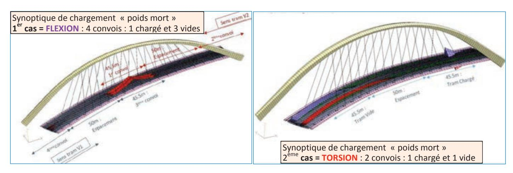

Le nivellement du tablier est à effectuer avant et à l'issue des "pré-chargements", pour s'assurer de l'absence de tassements d'appuis avant de procéder à la mesure des flèches du tablier.

Voir §D et §E le planning d'enclenchement des opérations de l'étape 

avec 2 appareils (soit 2 brigades) et sa cinématique (positions des appareils) associée.

Le protocole des étapes suivantes ne sont pas développés dans cette étude :

- «Chargement par "poids mort" du tablier»
- «Chargement par "poids roulant" du tablier»
- 4 «Essai de freinage»

On note que les résultats des mesures de niveau des différents points visés sont issus de la moyenne arithmétique établie à partir de 2 valeurs issues de 2 emplacements différents d'appareil visant ce même point, sauf pour la file 22 où chaque résultat est validé pour 4 mesures.

On note également que les cibles réfléchissantes sont placées au droit de chaque point visé sur le tablier (20 pts) et les culées (8 pts) soit **28** cibles au total. Elles sont installées en extrados du tablier et ne doivent pas gêner le passage des convois. Pour les **6 points de l'arc**, les mesures faites à partir de l'appareil télémétrique par visée laser s'affranchissent de la pose de réflecteurs.

Voir §B: Repère des points de mesure sur les culées et le tablier et le repérage des joints de l'arc

#### B/ Planimétrie des mises en station, des cibles (tablier ; culées) et points visés (arc).

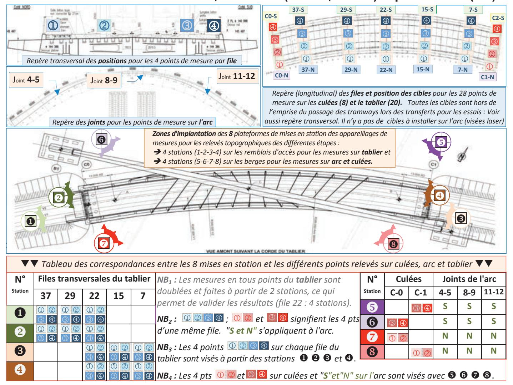

## C/ Tableaux des mesures de déplacements.

Les mesures des flèches sont assurées par des stations totales robotisées (type TS 50 LEICA) permettant une précision des mesures de 0,3 mm pour le tablier et de 1 mm pour l'arc. Chaque déplacement est calculé grâce aux mesures effectuées à partir de 2 stations différentes. Les tableaux ci-dessous renseignent quelques résultats de flèches et écarts. Ces mesures sont liées uniquement aux chargements en poids mort pour les vérifications en FLEXION (4 convois) et en TORSION (2 convois). Les valeurs sont exprimées en mm.

| M est la valeur mesurée C valeur th |                                                                                                 |      |      |       |       |       |       |       |        | C valeur théorique calculée é : écart calculé entre M et C |       |        |       |       |        | C     |      |        |                  |      |              |       |      |
|-------------------------------------|-------------------------------------------------------------------------------------------------|------|------|-------|-------|-------|-------|-------|--------|------------------------------------------------------------|-------|--------|-------|-------|--------|-------|------|--------|------------------|------|--------------|-------|------|
|                                     | Mesures sur tablier File 37  La 1 ère ligne donne les valeurs obtenues après le cha. |      |      |       |       |       |       |       |        |                                                            |       |        |       |       | Mes    |       |      |        |                  |      |              |       |      |
| La                                  | 1 ère li                                                                             | igne | donn | e les | vale  | urs c | btenu | es ap | orès l | le cha                                                     | argen | nent p | our c | ontro | ôle de | FLE   | EXIO | N ; la | 2 éme | pour | la <b>TC</b> | RSI   | NC   |
| Point 1 Point 2 Point 3 Point 4     |                                                                                                 |      |      |       |       |       |       |       |        | 4                                                          | Р     | oint 1 | 1     | Р     | oint 2 | 2     | F    | oint 3 | 3                | Р    | oint 4       | 4     |      |
| М                                   | С                                                                                               | é    | М    | С     | é     | М     | С     | é     | М      | С                                                          | é     | М      | С     | é     | М      | С     | é    | М      | С                | é    | М            | С     | é    |
| -2,6                                | -1,4                                                                                            | 1,2  | -2,4 | - 1,2 | 1,2   | -2,0  | -0,6  | 1,4   | -1,3   | -0,2                                                       | 1,1   | -28,1  | -29,9 | 1,8   | -29,8  | -29,7 | 0,1  | -29,4  | -28,9            | 0,5  | -26,0        | -28,4 | 2,4  |
| -9,9                                | -12,1                                                                                           | 2,2  | -9,3 | -10,8 | 1,5   | -8,1  | -10,0 | 1,9   | -4,9   | +0,6                                                       | 5,5   | -3,6   | -4,0  | 0,4   | -4,5   | -3,4  | 1,1  | -1,6   | -1,2             | 0,4  | -0,7         | +0,3  | 1,0  |
|                                     | IV                                                                                              | lesu | ıres | sur   | la fa | ace   | SUD   | de    | l'arc  | <b>.</b>                                                   |       | ľ      | Vlesi | ures  | des    | tas   | ser  | nent   | s su             | r le | s cu         | lées  |      |
|                                     | Joint                                                                                           | 4/5  |      |       | Join  | t 8/9 |       | J     | Joint  | 11/12                                                      | 2     |        | (     | Culé  | e C0   |       |      |        |                  | Culé | e C1         |       |      |
| М                                   | С                                                                                               | ;    | é    | М     | C     |       | é     | M     | C      | )                                                          | é     | Pt 1   | I P   | t 2   | Pt 3   | 3 F   | Pt 4 | Pt '   | 1 F              | Pt 2 | Pt           | 3 F   | Pt 4 |
| +5                                  | +5                                                                                              | ,2   | 0,2  | -18   | -17   | 7,0   | 1,0   | +6    | +5     | ,6                                                         | 0,4   | 0,0    | (     | 0,0   | 0,0    | _     | 0,1  | +0,    | 1 +              | 0,1  | +0,          | 1 +   | 0,1  |
| +1                                  | +1,                                                                                             | ,1   | 0,1  | -4    | -3    | ,5    | 0,5   | -1    | -0     | ,7                                                         | 0,3   | -0,3   | -(    | 0,1   | 0,0    | (     | 0,0  | -0,2   | 2 -              | 0,1  | -0,2         | 2 -   | 0,1  |

# D/ Description des opérations d'essais et mesures pour l'étape 1

|    | Enclenchement des opérations de l'éta                                              |             |                                                  |      |                   | ades)              |
|----|------------------------------------------------------------------------------------|-------------|--------------------------------------------------|------|-------------------|--------------------|
|    | Description succincte des tâches élémentaires                                      | T. Unit     |                                                  |      | Tps Total         | Tps Total          |
| N° | à effectuer par la brigade en charge d'1 appareil                                  | équipe      | Unité                                            | Qté  | pour 1 brigade | pour 2 brigades |
| Et | ape 1 : Pré-chargement des appuis. Contrôle de tas                                 | sement      | des culées.                                      | Étal |                   |                    |
| 1a | Préparation des plateformes pour les appareils                                     | 0,1         | h / plateforme                                | 8    | 0,8               | 0,4                |
| 1b | Marquage et installation des cibles ; <i>géoréférencement</i> .                    | + -         | h / cible installée.                          | 28   | 3,36              | 1,68               |
| 2  | Transfert et Mise en Station des appareils.                                        | 0,20        | h / appareil mis en station                   | 2    | 0,4               | 0,2                |
| 3  | Mes. <i>d'étalonnage</i> du tablier ∆ <b>0</b> Tablier files 37, 29, 22 | 0,001       | h / cible visée                               | 24   | 0,024             | 0,012              |
| 4  | Transfert et Mise en Station des appareils.                                        | 0,20        | h / appareil mis en station                   | 2    | 0,4               | 0,2                |
| 5  | Mesures d'étalonnage arc ∆ <b>0</b> Arc Sud et Nord                     | 0,005       | h / point (visée laser)                       | 12   | 0,06              | 0,03               |
| 6  | Mesures d'étalonnage des culées ∆0 Culées file C0                       | 0,001       | h / cible visée                               | 8    | 0,008             | 0,004              |
| 7  | Transfert et Mise en Station des appareils.                                        | 0,20        | h / appareil mis en station                   | 2    | 0,4               | 0,2                |
| 8  | Mes. de nivellement du tablier $\Delta 0_{Tablier}$ files 22, 15, 7                | 0,001       | h / <b>cible</b> visée                        | 24   | 0,024             | 0,012              |
| 9  | Transfert et Mise en Station des appareils.                                        | 0,20        | h / appareil mis en station                   | 2    | 0,4               | 0,2                |
| 10 | Mesures d'étalonnage des culées ∆0 Culées file C1                       | 0,001       | h / <b>cible</b> visée                        | 8    | 0,008             | 0,004              |
| 11 | Transfert convois pour charge « 0 » ► FLEXION                                      | 0,3         | h / Charg ement <b>0→4</b> convois | 1    | 0,3               | 0,3                |
| 12 | Mesures de nivellement des culées Δ1F Culées file C1                    | 0,001       | h / <b>cible</b> visée                        | 8    | 0,008             | 0,004              |
| 13 | Transfert et Mise en Station des appareils.                                        | 0,20        | h / appareil mis en station                   | 2    | 0,4               | 0,2                |
| 14 | Mesures de nivellement des culées Δ1F Culées file C0                    | 0,001       | h / <b>cible</b> visée                        | 8    | 0,008             | 0,004              |
| 15 | Transfert convois pour charge « F » ►TORSION                                       | 0,4         | h / transfert 4→2 convois                     | 1    | 0,4               | 0,4                |
| 16 | Mesures de nivellement des culées Δ1T Culées file C0                    | 0,001       | h / <b>cible</b> visée                        | 8    | 0,008             | 0,004              |
| 17 | Transfert et Mise en Station des appareils.                                        | 0,20        | h / appareil mis en station                   | 2    | 0,4               | 0,2                |
| 18 | Mesures de nivellement des culées Δ1T Culées file C1                    | 0,001       | h / <b>cible</b> visée                        | 8    | 0,008             | 0,004              |
| 19 | Transfert convois déchargement « T » ▶ « 0 »                                       | 0,1         | h / décharg emt 2→0 convois        | 1    | 0,1               | 0,1                |
| 20 | Tps de relaxation de la structure avant reprise essais                             | 1           | h                                                | 1    | 1                 | 1                  |
| 21 | Mesures de nivellement des culées Δ0' Culées file C1                    | 0,001       | h / <b>cible</b> visée                        | 8    | 0,008             | 0,004              |
| 22 | Mesures de nivellement de l'arc Δ0' Arc Sud et Nord                     | 0,005       | h / <b>point</b> (visée laser)                | 12   | 0,06              | 0,03               |
| 23 | Transfert et Mise en Station des appareils.                                        | 0,20        | h / appareil mis en station                   | 2    | 0,4               | 0,2                |
| 24 | M. de nivellement du tablier $\Delta 0^{\bullet}_{Tablier}$ files 22, 15, 7        | 0,001       | h / <b>cible</b> visée                        | 24   | 0,024             | 0,012              |
| 25 | Transfert et Mise en Station des appareils.                                        | 0,20        | h / appareil mis en station                   | 2    | 0,4               | 0,2                |
| 26 | M. de nivellement du tablier Δ0' Tablier files 37, 29, 22               | 0,001       | h / <b>cible</b> visée                        | 24   | 0,024             | 0,012              |
| 27 | Transfert et Mise en Station des appareils.                                        | 0,20        | h / appareil mis en station                   | 2    | 0,4               | 0,2                |
| 28 | Mesures de nivellement des culées Δ0' Culées file C0                    | 0,001       | h / <b>cible</b> visée                        | 8    | 0,008             | 0,004              |
|    | L'analyse des mesures doit permettre le contrôle                                   | de <b>0</b> | Retour à la                                      | pos  | ition initiale    | du tablier         |

L'analyse des mesures doit permettre le contrôle de  $\bullet$  Retour à la position initiale du tablier et de l'arc et  $\bullet$  Non tassement des culées.  $: \Delta 0 \simeq \Delta 0' \simeq \Delta 1T \simeq \Delta 1F$ .

L'étape ② –non décrite- concerne les essais statiques aux fins de mesurer les flèches du tablier réellement obtenues et les comparer aux flèches théoriques données par le calcul sur le modèle.

#### E/ Cinématique des opérations de l'étape • avec 2 stations totales robotisées.

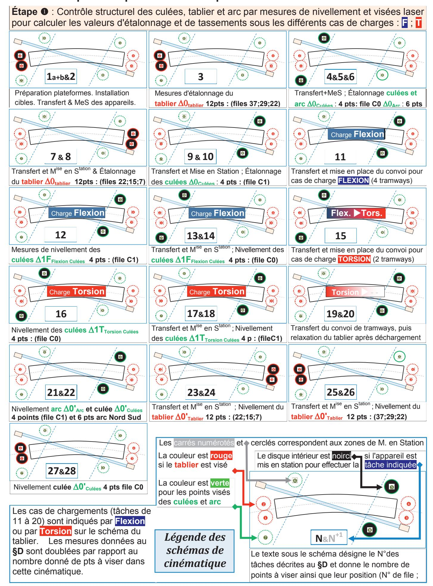

# F/ Données communes pour l'établissement des offres de prix N°1 et N°2

| Main d'œuvre                                                                                                                                                                                                        |                                                                                                                                                                                                                                                                                                                                             |                           |             |              |  |  |  |
|---------------------------------------------------------------------------------------------------------------------------------------------------------------------------------------------------------------------|---------------------------------------------------------------------------------------------------------------------------------------------------------------------------------------------------------------------------------------------------------------------------------------------------------------------------------------------|---------------------------|-------------|--------------|--|--|--|
| Tableau des différents taux (horaires et mensuel). E                                                                                                                                                                | 22j/mois et 35h/semaine.                                                                                                                                                                                                                                                                                                                    | Т                         | aux         |              |  |  |  |
| Technicien opérateur géomètre                                                                                                                                                                                       |                                                                                                                                                                                                                                                                                                                                             |                           | 28,42       | € / heure    |  |  |  |
| Compagnon aide-opérateur                                                                                                                                                                                            |                                                                                                                                                                                                                                                                                                                                             |                           | 21,16       | € / heure    |  |  |  |
| Cadre ingénieur chef de projet payé au mois                                                                                                                                                                         |                                                                                                                                                                                                                                                                                                                                             |                           | 11580,8     | 30 € / mois  |  |  |  |
| rais de déplacement                                                                                                                                                                                                 |                                                                                                                                                                                                                                                                                                                                             |                           |             |              |  |  |  |
| Frais de déplacement pour personnels ETAM et o                                                                                                                                                                      | uvrie                                                                                                                                                                                                                                                                                                                                       | ers                       | 35 € / jour |              |  |  |  |
| Frais de repas pour Cadre et ETAM                                                                                                                                                                                   |                                                                                                                                                                                                                                                                                                                                             |                           | 18,30       | ) € / jour   |  |  |  |
| Natériels et consommables                                                                                                                                                                                           |                                                                                                                                                                                                                                                                                                                                             |                           |             |              |  |  |  |
| Petits consommables pour le marquage et cibles c                                                                                                                                                                    | 78,00                                                                                                                                                                                                                                                                                                                                       | € forfait                 |             |              |  |  |  |
| Petits consommables pour les appareils (batteries                                                                                                                                                                   | 2,20 €                                                                                                                                                                                                                                                                                                                                      | / appareil                |             |              |  |  |  |
| Matériaux divers pour aménagement des plateforn                                                                                                                                                                     | nes.                                                                                                                                                                                                                                                                                                                                        |                           | 150         | 0,00€        |  |  |  |
| Appareil télémétrique LEICA TS50 en location                                                                                                                                                                        |                                                                                                                                                                                                                                                                                                                                             |                           | 400         | € / jour     |  |  |  |
| Appareil de capture 3D LEICA RTC360 en locatio                                                                                                                                                                      | n                                                                                                                                                                                                                                                                                                                                           |                           | 1500        | €/jour       |  |  |  |
| Journée de formation (appareils et logiciels)                                                                                                                                                                       |                                                                                                                                                                                                                                                                                                                                             |                           | 1200        | €/jour       |  |  |  |
| Véhicules 4 places (location mensuelle en leasing                                                                                                                                                                   | -bas                                                                                                                                                                                                                                                                                                                                        | se d'utilisation 15j/mois | 300 =       | 300 € / mois |  |  |  |
| Véhicule de service pour cadre : comptabilisé dans                                                                                                                                                                  | s les                                                                                                                                                                                                                                                                                                                                       | frais généraux            | -           |              |  |  |  |
| Oonnées complémentaires                                                                                                                                                                                             |                                                                                                                                                                                                                                                                                                                                             |                           |             |              |  |  |  |
| Appareil de capture 3D LEICA RTC360, compris s formation des personnels avec durée d'utilisation g                                                                                                                  |                                                                                                                                                                                                                                                                                                                                             |                           | 100         | 0000€        |  |  |  |
| Coefficient frais généraux (coûts indirects) appliqu                                                                                                                                                                | é su                                                                                                                                                                                                                                                                                                                                        | r tous les déboursés.     | 18          | 8,2%         |  |  |  |
| Selon les accords d'entreprise, les "heures supplémentaires" sont rémunérées pour les ETAM                                                                                                                          | 1 et                                                                                                                                                                                                                                                                                                                                        | Durée du tps de travail   | >7h/j       | >10h/        |  |  |  |
| ouvriers comme suit :                                                                                                                                                                                               |                                                                                                                                                                                                                                                                                                                                             | Majoration                | 25%         | 50%          |  |  |  |
| Données spécifiques pour l'établis                                                                                                                                                                                  | sen                                                                                                                                                                                                                                                                                                                                         | nent des offres de p      | rix N°1 e   | et N°2       |  |  |  |
| Étude N°1                                                                                                                                                                                                           | Étude N°2                                                                                                                                                                                                                                                                                                                                   |                           |             |              |  |  |  |
| L'opération complète (Étude du projet, préparation, encadrement in situ et rédaction du rapport d'essais suite aux résultats) nécessite 3 journées de travail dont 1 sur le terrain et 2 pour les études au pureau- | L'opération complète et rédaction du rappo d'essai après analyse des résultats et rend fichier IFC) nécessite <b>3 journées de trava</b> -dont 2,5 journées d'études au bureau- pour l'ingénieur. A cela, s'ajoute <b>une journ</b> <b>de formation</b> pour découvrir appareils et logiciels d'exploitation des données. |                           |             |              |  |  |  |

| Modèle CMEN-                   | OOC v2 ©NEOPTEC                                                                                                                   |                                |                                    | _                            |                              |                              |                            |                             |                                 |                            |                                  |                           |                       |                            |               |          |     |      |      | $\overline{}$ |
|--------------------------------|-----------------------------------------------------------------------------------------------------------------------------------|--------------------------------|------------------------------------|------------------------------|------------------------------|------------------------------|----------------------------|-----------------------------|---------------------------------|----------------------------|----------------------------------|---------------------------|-----------------------|----------------------------|---------------|----------|-----|------|------|---------------|
|                                | n de famille : a lieu, du nom d'usage)                                                                                         | Ш                              |                                    |                              |                              |                              |                            |                             |                                 |                            |                                  |                           |                       |                            |               |          |     |      |      |               |
|                                | Prénom(s) :                                                                                                                       |                                |                                    |                              |                              |                              |                            |                             |                                 |                            |                                  |                           |                       |                            |               |          |     |      |      |               |
|                                | Numéro Inscription :                                                                                                           |                                |                                    |                              |                              |                              |                            |                             |                                 |                            | Né                               | ė(e)                      | le :                  |                            |               |          |     | ]/   |      |               |
|                                | (Le                                                                                                                               | e numéro                       | est celui q                        | ui figure                    | sur la c                     | onvoca                       | tion ou                    | la feuil                    | le d'ém                         | argeme                     | ent)                             |                           |                       |                            |               |          |     |      |      |               |
| (Remplir cette partie Concours | à l'aide de la notice) / Examen:                                                                                                  |                                |                                    |                              |                              |                              | S                          | ectic                       | on/Sp                           | oécia                      | lité/S                           | érie                      | :                     |                            |               |          |     |   |   |            |
|                                | Epreuve:                                                                                                                          |                                |                                    |                              |                              |                              | N                          | /latiè                      | re:                             |                            |                                  |                           |                       |                            | Se            | ssio     | າ : |   |   |            |
| CONSIGNES                      | <ul> <li>Remplir soigne</li> <li>Ne pas signer</li> <li>Numéroter cha</li> <li>Rédiger avec u</li> <li>N'effectuer aux</li> </ul> | la comp aque PA un stylo | osition e GE (cadi à encre f | ne pas e en ba oncée ( | s y app as à dro bleue | orter d oite de ou noi | de sigr la pa re) et | ne dist ge) et ne pas | inctif p placer s utilise | ouvan les fe er de s | t indiqu uilles d tylo plu | ier sa ans le ime à | provi bon encre | enanc sens ( e clair | et dan: e. | s l'ordi | e.  |      |      |               |

EDE ARC 2

# DR1

Tous les documents réponses sont à rendre, même non complétés.

#### **NE RIEN ECRIRE DANS CE CADRE**

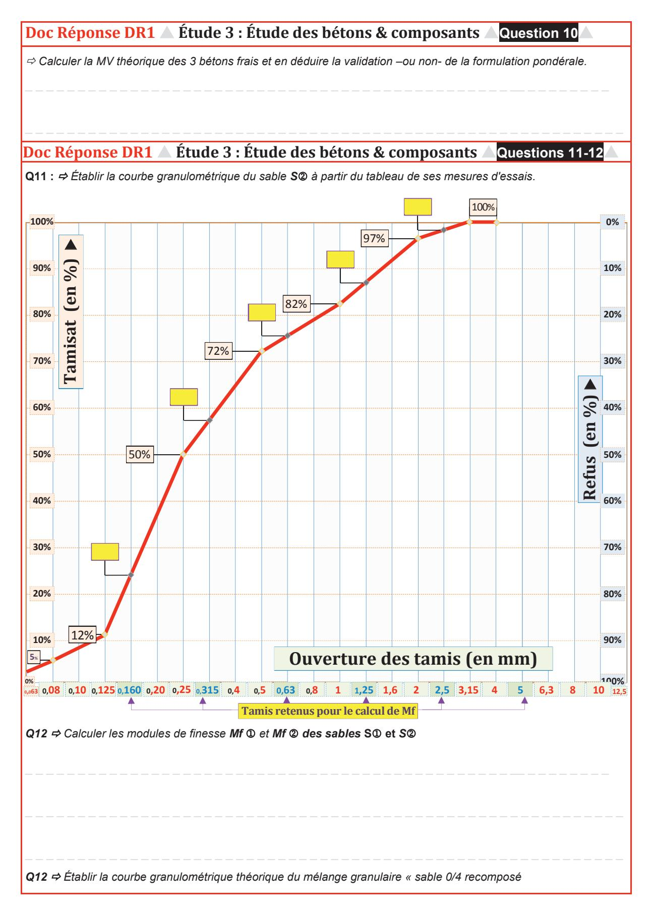

# **Doc Réponse DR1 Étude 3 : Étude des bétons & composants Question 13**

*Démontrer que la valeur 14,5 MJ/m3 correspond à la Q. d'énergie nécessaire pour fabriquer 1 m3 de B. en centrale*

# **Impact (Énergie non Renouvelable) de la fabrication d'1 m3 de béton en centrale**

|            | Données  Origine  |     | Entzheim | Strasbourg |  |  |  |  |
|------------|---------------------|-----|----------|------------|--|--|--|--|
| Puissance  | en kW               | 243 | 224      | 274        |  |  |  |  |
| Production | en m3/h             | 60  | 56       | 68         |  |  |  |  |

*Quelle que soit la moyenne trouvée à l'issue des calculs précédents, la valeur de la Q. d'énergie à prendre en compte pour fabriquer 1 m3 de béton en centrale est :* **14,5 MJ/m3**

# **Doc Réponse DR1 Étude 3 : Étude des bétons & composants Question 14**

*Évaluer les impacts ÉnR et réchauffement global pour le processus complet de fabrication du béton.* 

# **Impact (Énergie non Ren.) du transport des Granulats et Ciments par camion**

|          |             |        | Granulats |           | Ciment |
|----------|-------------|--------|-----------|-----------|--------|
|          | Impact Unit | Quant. | Distance  | Total Imp | 274    |
| Origine | t.km/m3     | En t.  | En km     |           | 68     |
| Entzheim | 0,105       | 1,95   | 2         |           |        |
| Strasbg  |             |        |           |           |        |

**Hoerdt** 

# **Impact (Réchauffement global en kg éq CO2.) du transport des G et C par camion**

**Granulats Ciment**

| Doc Réponse                      | DR1 🛆 Étude 3 : bétons & composa                                           | nts A Questions 14 [SUITE]            |
|----------------------------------|----------------------------------------------------------------------------|---------------------------------------|
| Impac                            | ct <mark>(Énergie non Ren.)</mark> du transport d                          | '1 m 3 de béton par camion |
|                                  |                                                                            |                                       |
|                                  |                                                                            |                                       |
|                                  |                                                                            |                                       |
|                                  |                                                                            |                                       |
|                                  |                                                                            |                                       |
|                                  |                                                                            |                                       |
|                                  |                                                                            |                                       |
|                                  |                                                                            |                                       |
|                                  |                                                                            |                                       |
|                                  |                                                                            |                                       |
|                                  |                                                                            |                                       |
|                                  |                                                                            |                                       |
|                                  |                                                                            |                                       |
|                                  |                                                                            |                                       |
|                                  |                                                                            |                                       |
|                                  |                                                                            |                                       |
| I                                | D - ( DC) 4 2 d - 1 - ( 1 ) d                                              |                                       |
| Impact (Énl                      | R et RG) pour 1 m³ de béton à prend                                        | -                                     |
| Impact (Énl                      | R et RG) pour 1 m³ de béton à prend Énergie non Renouvelable en MJoules | -                                     |
| Impact (Énl Entzheim          |                                                                            | -                                     |
|                                  |                                                                            | -                                     |
| Entzheim Strasbourg           |                                                                            | -                                     |
| Entzheim Strasbourg Hoerdt | Énergie non Renouvelable en MJoules                                        | -                                     |
| Entzheim Strasbourg Hoerdt |                                                                            | -                                     |
| Entzheim Strasbourg Hoerdt | Énergie non Renouvelable en MJoules                                        | -                                     |
| Entzheim Strasbourg Hoerdt | Énergie non Renouvelable en MJoules                                        | -                                     |
| Entzheim Strasbourg Hoerdt | Énergie non Renouvelable en MJoules                                        | -                                     |
| Entzheim Strasbourg Hoerdt | Énergie non Renouvelable en MJoules                                        | -                                     |
| Entzheim Strasbourg Hoerdt | Énergie non Renouvelable en MJoules                                        | -                                     |
| Entzheim Strasbourg Hoerdt | Énergie non Renouvelable en MJoules                                        | -                                     |
| Entzheim Strasbourg Hoerdt | Énergie non Renouvelable en MJoules                                        | -                                     |
| Entzheim Strasbourg Hoerdt | Énergie non Renouvelable en MJoules                                        | -                                     |

| Modèle CMEN- | OOC v2 ©NEOPTEC                                                                                                                   |                                |                                     | _                            |                                | 1                            |                            |                             |                                 |                            |                                     | $\overline{}$         |                       |                           |        |          |     | _ |    |      | $\overline{}$ |
|--------------|-----------------------------------------------------------------------------------------------------------------------------------|--------------------------------|-------------------------------------|------------------------------|--------------------------------|------------------------------|----------------------------|-----------------------------|---------------------------------|----------------------------|-------------------------------------|-----------------------|-----------------------|---------------------------|--------|----------|-----|---|----|------|---------------|
|              | n de famille : a lieu, du nom d'usage)                                                                                         |                                |                                     |                              |                                |                              |                            |                             |                                 |                            |                                     |                       |                       |                           |        |          |     |   |    |      |               |
|              | Prénom(s) :                                                                                                                       |                                |                                     |                              |                                |                              |                            |                             |                                 |                            |                                     |                       |                       |                           |        |          |     |   |    |      |               |
|              | Numéro Inscription :                                                                                                           |                                |                                     |                              |                                |                              |                            |                             |                                 |                            | Né(                                 | e) l                  | e :                   |                           |        |          |     |   | ]/ |      |               |
|              | (Le                                                                                                                               | e numéro                       | est celui qı                        | ui figure                    | sur la c                       | onvoca                       | tion ou                    | la feuil                    | le d'ém                         | argeme                     | ent)                                |                       |                       |                           |        |          |     |   |    |      |               |
|              | à l'aide de la notice) / Examen:                                                                                                  |                                |                                     |                              |                                |                              | S                          | ectic                       | on/Sp                           | écia                       | lité/Sé                             | rie                   | <b>:</b>              |                           |        |          |     |   |    |   |            |
|              | Epreuve:                                                                                                                          |                                |                                     |                              |                                |                              | N                          | /latiè                      | re:                             |                            |                                     |                       |                       |                           | Se     | ssio     | n : |   |    |   |            |
| CONSIGNES    | <ul> <li>Remplir soigne</li> <li>Ne pas signer</li> <li>Numéroter cha</li> <li>Rédiger avec u</li> <li>N'effectuer aux</li> </ul> | la comp aque PA un stylo | osition et GE (cadr à encre f | ne pas e en ba oncée ( | s y app is à dro bleue ( | orter d oite de ou noi | de sigr la pa re) et | ne dist ge) et ne pas | inctif p placer s utilise | ouvan les fe er de s | t indique uilles da tylo plun | r sa ns le ne à | prove bon encre | enanc sens e claire | et dan | s l'ordi | re. |   |    |      |               |

EDE ARC 2

# DR2

Tous les documents réponses sont à rendre, même non complétés.

#### Écritures et convention adoptées :

Le repère général de calculs pour la partie statique est un repère orthonormé direct dont l'axe X est confondu avec l'horizontale et noté X, Y, Z (lettres en majuscules).

Les actions extérieures au système sont repérées par rapport à leur axe support et indicées par le point d'application. Exemple : XA et non AX.

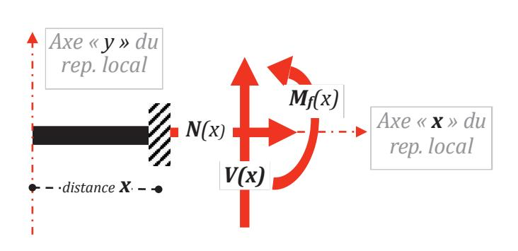

Pour l'étude des éléments de cohésion, la convention résumée ci-contre sous forme schématique est adoptée. Le repère local, nécessaire aux calculs de résistance des matériaux, est noté x, y, z (en lettres minuscules) et son origine est confondue avec l'extrémité "gauche" de la poutre. Son axe x suit la ligne moyenne formée par les centres de gravité des sections transversales.

| ⇒ Établir les équations des éléments de cohésion dans la « barre » BC. |
|------------------------------------------------------------------------|
|                                                                        |
|                                                                        |
|                                                                        |
|                                                                        |
|                                                                        |
|                                                                        |
|                                                                        |
|                                                                        |
|                                                                        |
|                                                                        |
|                                                                        |
|                                                                        |
|                                                                        |
|                                                                        |
|                                                                        |
|                                                                        |

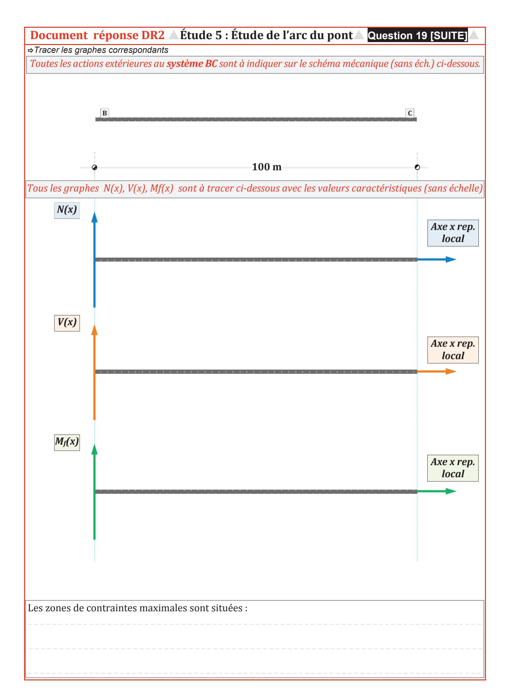

| Modèle CMEN-D                  | OOC v2 ©NEOPTEC                                                                                                                  | П                                  |                                       |                              |                              |                               |                             |                                          |                              |                            |                                         |                             |                            |               |          |     |      |   |   |       |
|--------------------------------|----------------------------------------------------------------------------------------------------------------------------------|------------------------------------|---------------------------------------|------------------------------|------------------------------|-------------------------------|-----------------------------|------------------------------------------|------------------------------|----------------------------|-----------------------------------------|-----------------------------|----------------------------|---------------|----------|-----|------|---|---|-------|
|                                | lieu, du nom d'usage)                                                                                                            | H                                  |                                       | <u> </u>                     | Щ                            |                               | _                           | _                                        |                              |                            |                                         | <u> </u>                    | <u></u>                    |               |          | _   |      | _ | 믁 |  4 |
|                                | Prénom(s) :                                                                                                                      | Ш                                  |                                       |                              |                              |                               |                             |                                          |                              |                            |                                         |                             |                            |               |          |     |      |   |   |       |
|                                | Numéro Inscription :                                                                                                          |                                    |                                       |                              |                              |                               |                             |                                          |                              |                            | Né(e                                    | ) le :                      |                            |               | //       |     | ]/   |   |   |       |
|                                | (Le                                                                                                                              | e numéro e                         | est celui qu                          | i figure :                   | sur la co                    | onvocat                       | ion ou                      | la feuill                                | e d'ém                       | argeme                     | ent)                                    |                             |                            |               |          |     |      |   |   |       |
| (Remplir cette partie Concours | à l'aide de la notice) / Examen:                                                                                                 |                                    |                                       |                              |                              |                               | S                           | ectio                                    | n/Sp                         | oécia                      | lité/Sér                                | ie :                        |                            |               |          |     |   |   |   |    |
|                                | Epreuve:                                                                                                                         |                                    |                                       |                              |                              |                               | N                           | latiè                                    | re:                          |                            |                                         |                             |                            | Se            | ssior    | ı : |   |   |   |    |
| CONSIGNES                      | <ul> <li>Remplir soigne</li> <li>Ne pas signer</li> <li>Numéroter cha</li> <li>Rédiger avec u</li> <li>N'effectuer au</li> </ul> | la compo aque PA0 un stylo a | osition et GE (cadre à encre fo | ne pas e en ba ncée (l | y appo s à dro bleue o | orter d oite de ou noir | e sign la pag e) et i | e disti ge) et l ne pas | nctif p placer utilise | ouvan les fe er de s | t indiquer uilles dans tylo plume | sa prov le bon à encr | renand sens re clair | et dan: e. | s l'ordr | e.  |      |   |   |       |

EDE ARC 2

# DR3

Tous les documents réponses sont à rendre, même non complétés.

| Étude : Coût des essais de convenance Questions 23 et 24 Doc réponse DR3 6 |           |          |        |                                   |             |                        |             |            |   |         |  |  |  |
|----------------------------------------------------------------------------------------------|-----------|----------|--------|-----------------------------------|-------------|------------------------|-------------|------------|---|---------|--|--|--|
| Main d'œuvre                                                                                 |           |          |        | Format 1 : 1 Ing ; 2 OG ; 1 aide  |             | Format 2 : 1 ingénieur |             |            |   |         |  |  |  |
| Taux h. personnels                                                                           |           |          | Nb H   | H à payer                         | Q           | Coût T.                | NbH         | Hàp.       | Q | Coût T. |  |  |  |
| Opérateur Géomètre                                                                           | 28,42 €/h |          |        |                                   |             |                        |             |            |   |         |  |  |  |
| Aide Op. Géomètre                                                                            | 21,16 €/h |          |        |                                   |             |                        |             |            |   |         |  |  |  |
| Taux journée cadre                                                                           |           | Sur site | au BET |                                   |             | Site                   | BET         |            |   |         |  |  |  |
| Ingénieur                                                                                    | 526,4 €/j |          | 1      | 2                                 | 1           | 1579,2                 |             |            |   |         |  |  |  |
|                                                                                              |           |          |        | Coût total Main d'oeuvre HT       |             | 2651,70                |             | Coût total |   |         |  |  |  |
| Matériels locations                                                                          |           |          | Prix / | Nb j                              | Q           | Coût T.                | P /         | Nb j       | Q | Coût T. |  |  |  |
|                                                                                              |           |          |        |                                   |             |                        |             |            |   |         |  |  |  |
|                                                                                              |           |          |        |                                   |             |                        |             |            |   |         |  |  |  |
|                                                                                              |           |          |        | Coût total HT matériels           |             |                        | Coût total  |            |   |         |  |  |  |
| Matériaux et consommables                                                                    |           |          | Prix U |                                   | Q           | Coût T.                | Px/ j       | Nb j       | Q | Coût T. |  |  |  |
|                                                                                              |           |          |        | Coût total matériaux et conso. HT |             |                        |             | Coût total |   |         |  |  |  |
| Divers                                                                                       |           |          | Prix U | Q                                 |             | Coût T.                |             |            |   |         |  |  |  |
| Frais de déplacement OG + aide                                                               |           |          |        |                                   |             |                        |             |            |   |         |  |  |  |
|                                                                                              |           |          |        |                                   |             |                        |             |            |   |         |  |  |  |
|                                                                                              |           |          |        | Coût total divers HT              |             |                        |             | Coût total |   |         |  |  |  |
|                                                                                              |           |          |        | Total global HT                   |             |                        | Total HT    |            |   |         |  |  |  |
| Données complémentaires                                                                      |           |          |        |                                   |             |                        |             |            |   |         |  |  |  |
| Coefficient FG appliqué sur tous les déboursés, frais d'études et divers                  |           |          | 18,20% |                                   | Total FG HT |                        | Total FG HT |            |   |         |  |  |  |
| Prix de revient HT format 1 Prix de revient HT format 2                                   |           |          |        |                                   |             |                        |             |            |   |         |  |  |  |