**EDE STI 1** 

### **SESSION 2020**

### CAPET CONCOURS EXTERNE TROISIEME CONCOURS ET CAFEP CORRESPONDANT

Section : SCIENCES INDUSTRIELLES DE L'INGÉNIEUR

Option: INGÉNIERIE DES CONSTRUCTIONS
Option: INGÉNIERIE ÉLECTRIQUE

Option: INGÉNIERIE INFORMATIQUE
Option: INGÉNIERIE MÉCANIQUE

### ANALYSE ET EXPLOITATION PÉDAGOGIQUE D'UN SYSTEME PLURITECHNIQUE

Durée: 5 heures

Calculatrice électronique de poche - y compris calculatrice programmable, alphanumérique ou à écran graphique — à fonctionnement autonome, non imprimante, autorisée conformément à la circulaire n° 99-186 du 16 novembre 1999.

L'usage de tout ouvrage de référence, de tout dictionnaire et de tout autre matériel électronique est rigoureusement interdit.

Si vous repérez ce qui vous semble être une erreur d'énoncé, vous devez le signaler très lisiblement sur votre copie, en proposer la correction et poursuivre l'épreuve en conséquence. De même, si cela vous conduit à formuler une ou plusieurs hypothèses, vous devez la (ou les) mentionner explicitement.

NB: Conformément au principe d'anonymat, votre copie ne doit comporter aucun signe distinctif, tel que nom, signature, origine, etc. Si le travail qui vous est demandé consiste notamment en la rédaction d'un projet ou d'une note, vous devrez impérativement vous abstenir de la signer ou de l'identifier.

### **INFORMATION AUX CANDIDATS**

Vous trouverez ci-après les codes nécessaires vous permettant de compléter les rubriques figurant en en-tête de votre copie. Ces codes doivent être reportés sur chacune des copies que vous remettrez.

Concours externe du CAPET de l'enseignement public :

| • option : Ingénierie                    | des constructions                                    |                            |                   |
|------------------------------------------|------------------------------------------------------|----------------------------|-------------------|
| Concours<br>EDE<br>• option : Ingénierie | Section/option [1]4]1]E  électrique                  | Epreuve 101                | Matière 7809      |
| Concours<br>EDE<br>• option : Ingénierie | Section/option 1419E \ninformatique                  | Epreuve                    | Matière 7809      |
| Concours EDE  option: Ingénierie         | Section/option [1413E]                               | Epreuve 101                | Matière 7809      |
| Concours                                 | Section/option  [1]4]14[5]  FEP/CAPET de l'enseignen | Epreuve [101] nent privé : | Matière 7809      |
|                                          | <del>-</del>                                         |                            |                   |
| • option : Ingénierie<br>Concours<br>EDF | Section/option 1411E                                 | Epreuve 101                | Matière 7809      |
| • option : Ingénierie                    |                                                      | <b>-</b>                   | <b>8.4</b> - 4:   |
| Concours<br>EDF<br>• option : Ingénier   | Section/option  1419E \nie informatique              | Epreuve 101                | Matière           |
| Concours EDF  option: Ingénier           | Section/option                                       | Epreuve 101                | Matière 7809      |
| Concours                                 | Section/option  1414E  ne du CAPET de l'enseigne     | Epreuve [101] ment public: | Matière [7 8 0 9] |
| • option : Ingénierie                    | des constructions                                    |                            |                   |
| Concours EDV  option: Ingénierie         | Section/option [1][4][1][E]                          | Epreuve                    | Matière [7 8 0 9] |
| Concours                                 | Section/option                                       | Epreuve                    | Matière           |
| E DV<br>• option ∶ Ingénierie            | 1412E                                                | 101                        | 7809              |
| Concours EDV                             | Section/option  1413E                                | Epreuve 101                | Matière 7809      |
| • option : Ingénierie<br>Concours<br>EDV | Section/option                                       | Epreuve                    | Matière [7]8 0 9  |

### **SYSTÈME DE PRÉPARATION DE COMMANDE**

### **I. MISE EN SITUATION**

### **1.1 Le contexte général**

Le commerce électronique (e-commerce) est un mode d'échange en vogue et présente une croissance ininterrompue en France depuis 10 ans. Les commerçants, qui vendent en ligne, doivent continuer à augmenter le choix et la taille de leur magasin en ligne ainsi que la facilité d'acheter, de ramasser et de retourner les articles localement.

Après la commande d'un article sur un site de e-commerce, un opérateur doit ensuite la préparer, en collectant les produits, pour réaliser le colis client. Cet opérateur met les produits collectés dans des rayonnages, dans un chariot, avant de les apporter à la ligne de mise sous emballage. L'opérateur n'est capable d'attraper que des articles situés à 1,80 m tout au plus (voir Figure *1*) et peut parcourir jusqu'à 15 kilomètres en une journée tout en poussant un chariot.

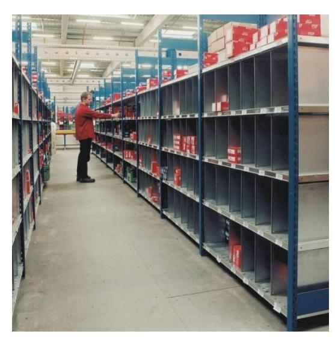

Figure 1 : un rayonnage à hauteur d'homme

Il existe désormais sur le marché des solutions automatisées, qui apportent les caisses chargées de produits directement auprès du préparateur de commande. Majoritairement ces solutions n'utilisent pas d'étagères de grande hauteur (pour l'optimisation du stockage), sont figées et ne permettent pas une évolution de stockage dans le temps pour suivre l'évolution de l'entreprise.

### **1.2 La solution Exotec**

L'entreprise Exotec propose un dispositif robotique qui permet à des robots de travailler en équipe au milieu des étagères d'un entrepôt (voir Figure *2*). Ces robots peuvent se hisser le long des étagères jusqu'à 10 mètres de hauteur afin de récupérer le bac de produits désirés et l'amener à l'opérateur qui est maintenant statique.

Le système s'adapte à l'alimentaire (sec et frais) et au non-alimentaire, comme le textile.

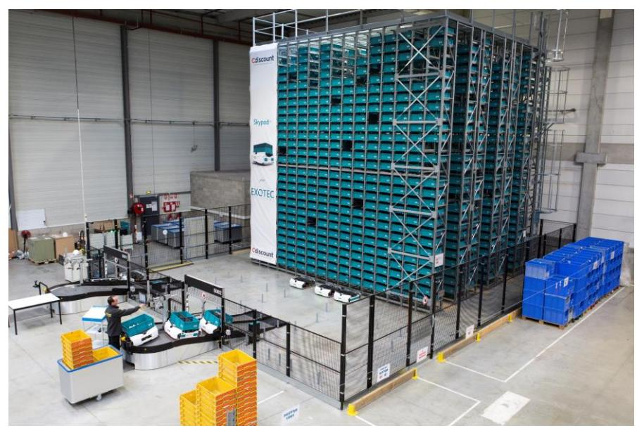

Figure 2 : la solution Exotec

Cette solution permet d'importants gains de productivité (cadence des robots quatre fois plus rapide que les solutions classiques), une optimisation de la capacité de stockage et une réduction de la pénibilité du travail en supprimant les déplacements des préparateurs de commande.

L'entreprise Exotec garantit une évolutivité de la solution avec la possibilité d'augmenter facilement la flotte de robots, le nombre d'étagères ou encore le nombre de stations de préparation, en fonction du volume d'activité.

### **1.3 La présentation de l'installation**

Les robots baptisés Skypod naviguent dans l'entrepôt entre les racks de stockage et les stations de préparation de commandes, sans infrastructure de guidage (voir

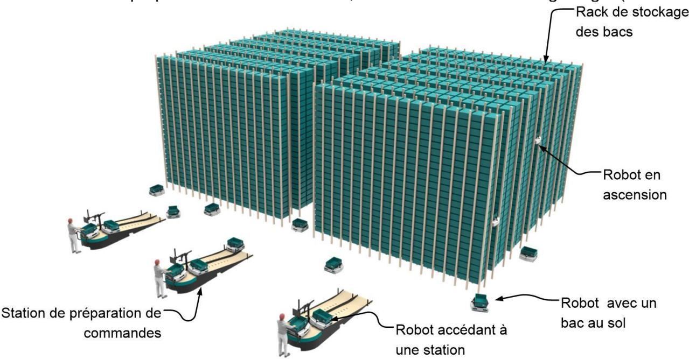

Figure 3). Chaque robot transporte et range un bac contenant les articles dans des racks jusqu'à 10 mètres de hauteur.

À l'extérieur de la matrice de rangement (ou *rack*) haute de 10 mètres, un opérateur indique, depuis le terminal d'une station de préparation de commande, le produit qu'il souhaite sortir.

Affecté à cet ordre, le Skypod se déplace de manière autonome pour aller chercher le bac correspondant à une vitesse atteignant 4 mètres par seconde, se repérant grâce à des lasers. Puis il s'agrippe et s'élève le long des rails verticaux des étagères. Une fois arrivé à destination, il soulève le bac qui contient le produit désiré, avec son plateau télescopique (appelé fourche) et le rapporte ensuite vers la station de préparation de commande, où l'opérateur saisit manuellement le nombre d'articles souhaités. Chaque bac contient jusqu'à 30 kilogrammes d'articles stockés. Les trajets sont optimisés par intelligence artificielle, c'est-à-dire un algorithme complexe qui optimise les trajets, depuis un ordinateur central pouvant contrôler jusqu'à 1 000 robots.

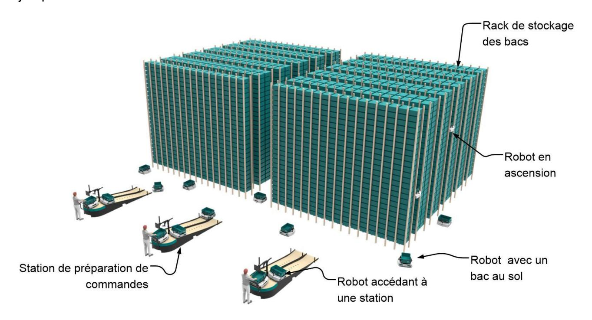

Figure 3 : les robots Skypod dans leur environnement

### **1.4 Le robot Skypod**

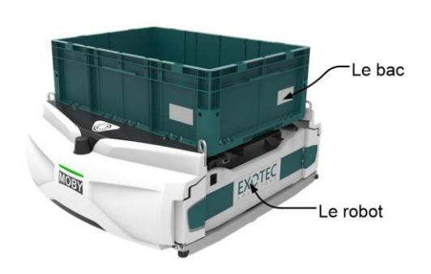

Figure 4 : le robot Skypod avec un bac

Le robot (voir figure 4) pour effectuer sa tâche, dispose de :

- deux roues motrices et deux roues omnidirectionnelles (déplacement horizontal et accès à la station de préparation de commande) ;
- un capteur laser (position dans son environnement);
- deux bras motorisés rétractables s'agrippant aux rails des étagères (déplacement vertical) ;
- une fourche télescopique (voir Figure 5) permettant de saisir et déposer un bac dans l'étagère (picking de bac) :
- une commande embarquée en dialogue avec la supervision (pilotage des mouvements du robot et réception des missions à accomplir);
- une batterie (alimentation autonome en énergie).

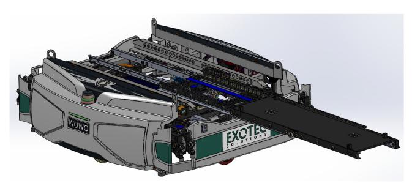

Figure 5 : la fourche télescopique

### 1.5 Les problématiques du sujet

L'objectif de l'étude est de vérifier la faisabilité de l'implantation d'un système de préparation de commande dans un entrepôt existant. La première partie du sujet permet donc de valider les solutions envisagées (seulement les fonctions les plus critiques), lors de l'étude d'avant-projet afin de lancer la conception détaillée du système et en particulier du Skypod.

L'étude proposée aborde six problématiques techniques indépendantes devant répondre aux exigences détaillées dans le document annexe **DA1** :

- vérifier la possibilité d'implantation du rack de stockage dans l'entrepôt existant :
- assurer l'ascension du robot dans le rack ;
- assurer le positionnement vertical du robot ;
- choisir la batterie permettant une autonomie suffisante du robot ;
- vérifier la stabilité du robot lors de ses déplacements au sol;
- vérifier que la fourche télescopique permet l'extraction des bacs.

La deuxième partie, **indépendante** des précédentes, concerne la mise en place de séquences pédagogiques en collège et en lycée. **Il est conseillé de consacrer 1,5 h à cette partie**.

Il est fortement recommandé de formuler explicitement sur la copie, toutes les hypothèses jugées utiles.

### **II. IMPLANTATION DU RACK**

*Objectif : vérifier la résistance au poinçonnement du dallage en béton sous l'effet de la charge des poteaux intérieurs du rack*

Le rack est constitué de plusieurs étagères identiques espacées soit d'une largeur de robot, soit d'une distance de 150 mm entre elles (voir Figure 6) puis assemblées et contreventées par des traverses supérieures. Le sol est en béton armé.

On souhaite vérifier que ce dallage ne sera pas poinçonné (non-déformation du dallage) sous l'effet du poids d'une étagère. La contrainte admissible du dallage est σbéton= 25 MPa.

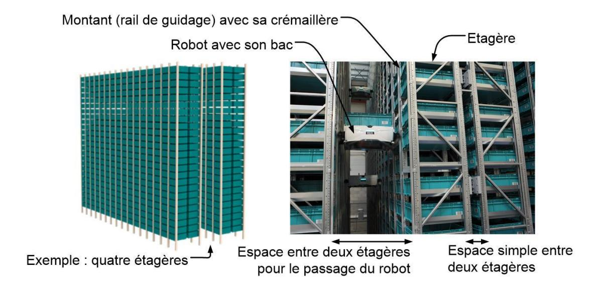

Figure 6 : vues générales du rack rempli de bacs

L'étude est limitée à la platine représentée dans la zone étudiée de la Figure *7*.

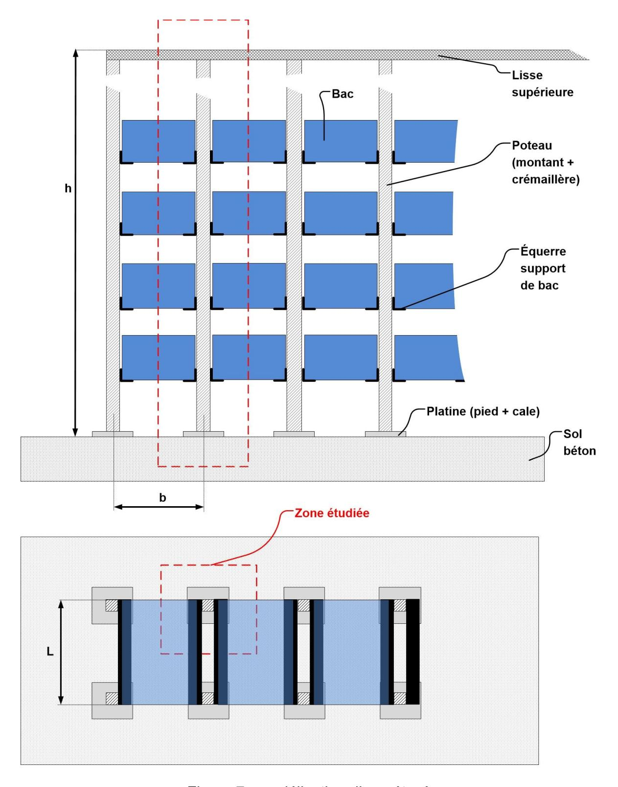

Figure 7 : modélisation d'une étagère

Pour cette étude, les données et hypothèses retenues sont les suivantes :

- la charge totale (bac et charge embarquée) est symétrique et uniformément répartie ;
- seuls les efforts verticaux seront pris en compte ;
- seuls les éléments porteurs représentés sur la Figure 7 sont pris en compte (dans un souci de clarté, les lisses intermédiaires ne sont pas représentées) ;
- l'accélération de la pesanteur est notée g = 9,81 m·s-2 ;

 les données de modélisation d'une étagère sont précisées dans le tableau cidessous.

| Désignation                            | Quantité                                                          | Longueur<br>utile                             | Masse                     |
|----------------------------------------|-------------------------------------------------------------------|-----------------------------------------------|---------------------------|
| Poteau                                 |                                                                   |                                               |                           |
| Montant (rail de guidage)              | 1                                                                 | h = 10 m                                      | 2,97 kg le mètre linéaire |
| Crémaillère                            | 1                                                                 | h = 10 m                                      | 5,9 kg le mètre linéaire  |
| Platine                                |                                                                   |                                               |                           |
| Pied ancrage au sol<br>(acier)         |                                                                   | 100<br>mm x 60<br>mm x 10<br>mm               | négligée                  |
| Plaque de calage                       |                                                                   |                                               | négligée                  |
| Traverses                              |                                                                   |                                               |                           |
| Equerre                                |                                                                   | L = 600 mm                                    | 1,28 kg le mètre linéaire |
| Lisse                                  | 1 tous les 3,5<br>mètres<br>+ 1 en<br>bas<br>+<br>1<br>en<br>haut | b =<br>480 mm                                 | 0,53 kg le mètre linéaire |
| Accessoires                            |                                                                   |                                               |                           |
| Visserie, entretoise,<br>…             | 1                                                                 |                                               | 1<br>kg par poteau        |
| Charge<br>d'exploitation               |                                                                   |                                               |                           |
| Bac                                    | 24                                                                | 600<br>mm<br>x<br>400<br>mm<br>x<br>320<br>mm | 3 kg                      |
| Charge<br>maxi<br>embarquée<br>par bac | 1                                                                 |                                               | 30 kg                     |

**Question 1 . Déterminer** la charge permanente (poids de la structure), notée G, supportée par une platine*.*

**Question 2 . Déterminer** la charge d'exploitation (poids du chargement), notée Q, supportée par une platine.

Ces charges sont pondérées par des coefficients de sécurité : 1,35 G et 1,5 Q.

**Question 3 . Calculer** la pression exercée par une platine sur le sol. **Conclure** quant à la résistance du dallage.

**Question 4 . Préciser** si la pression exercée par une platine sur le sol, est modifiée lorsque le robot monte ou descend le long du rack (masse du robot Mr = 45 kg). **Conclure**.

### **III. ASCENSION DU ROBOT**

*Objectif : choisir la motorisation permettant le déplacement vertical du robot sur le rack*

Lors du réapprovisionnement du stock, le robot Skypod doit déposer des bacs pleins dans le rack. Pour cela le robot se déplace au sol, se positionne face à une rangée, sort ses deux bras, s'agrippe aux rails puis monte jusqu'à l'emplacement désiré grâce à un système pignon /crémaillère à denture droite (voir Figure 8).

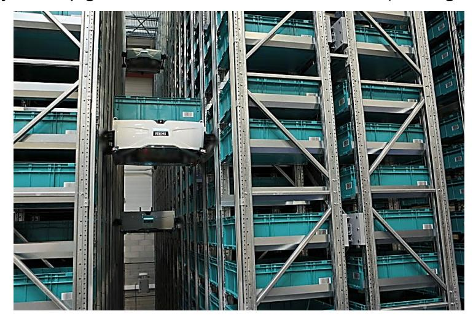

Figure 8 : déplacement vertical du robot entre les étagères

Cette solution est représentée en

Figure 9.

Pour cette étude, les données et hypothèses retenues sont les suivantes :

- le repère R<sub>0</sub> (O,  $\vec{x}$ ,  $\vec{y}$ ,  $\vec{z}$ ) est supposé galiléen ;
- les liaisons sont considérées comme parfaites ;
- masse totale du robot M<sub>r</sub> = 45 kg;
- masse d'un bac M<sub>b</sub> = 3 kg;
- masse maximale de la charge embarquée M<sub>c</sub> = 30 kg;
- poids total de l'ensemble (1) (robot + bac + charge). Sa résultante est appliquée au centre de gravité G de l'ensemble (1) ;
- accélération de la pesanteur g = 9,81 m·s<sup>-2</sup> et  $\overrightarrow{g}$  = -g  $\overrightarrow{z}$ ;
- caractéristiques du pignon, module m = 3,18 nombre de dents Z = 24, angle de pression  $\alpha$  = 20°;
- les quatre crémaillères sont notées (0), (0"), (0"), (0");
- rendement global de la transmission : η = 0,8 ;
- les deux bras sont identiques et symétriques :
- accélération à la montée a<sub>m</sub> = 1 m·s<sup>-2</sup>;
- vitesse linéaire maximale lors de l'ascension V<sub>m</sub> = 1 m·s<sup>-1</sup>.

Notation : le torseur de l'action mécanique transmissible par une liaison entre les solides *i* et *j* sera noté en un point K, d'une façon générale :

$$\{T_{i \to j}\} = \begin{cases} X_{ij} \vec{x} + Y_{ij} \vec{y} + Z_{ij} \vec{z} \\ L_k \vec{x} + M_k \vec{y} + N_k \vec{z} \end{cases}_K = \begin{cases} X_{ij} & L_k \\ Y_{ij} & M_k \\ Z_{ij} & N_k \end{cases}_K$$

La loi de vitesse est la suivante :

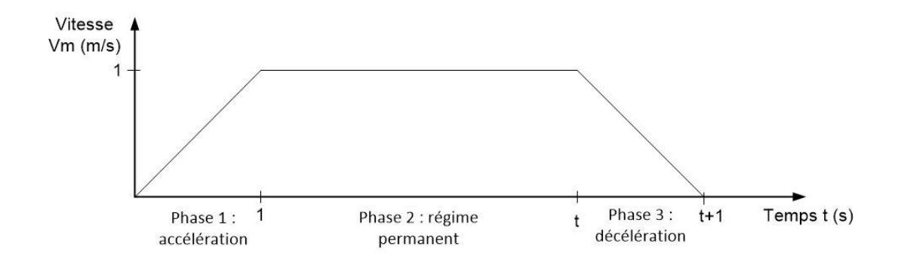

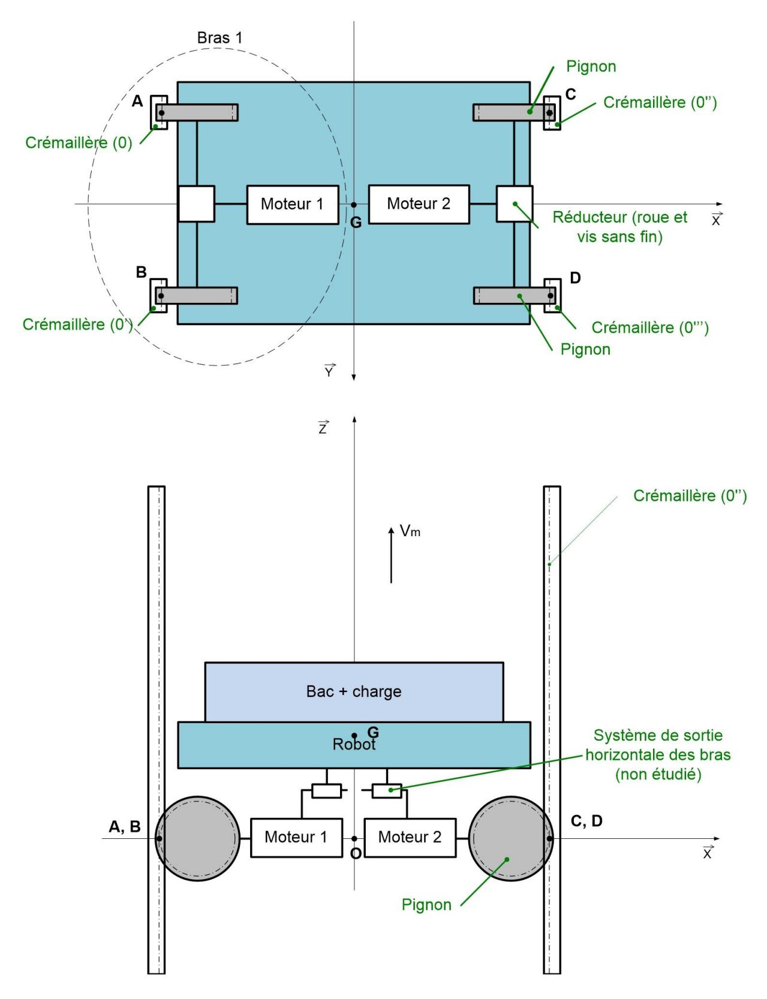

Figure 9 : schéma structurel de la motorisation verticale

En cas de défaillance d'un des deux moteurs, le second moteur est dimensionné pour assurer la montée du robot à pleine charge.

**Question 5 . Exprimer** le torseur de l'action mécanique du poids, noté {Tpoids→1}, au centre de gravité G de l'ensemble (1) (robot + bac +charge).

**Question 6 .** En appliquant le principe fondamental de la dynamique à l'ensemble (1), **déterminer** la force motrice maximale Fm (effort nécessaire à la montée de la charge maximale). **Calculer** sa valeur.

**Question 7 . Calculer** la puissance maximale nécessaire à l'ascension du robot.

**Question 8 .** À partir du document annexe **DA2**, **choisir et justifier** le moteur répondant à cette exigence de puissance.

### **IV. POSITIONNEMENT DU ROBOT SUR L'AXE VERTICAL**

*Objectif : être capable de s'arrêter sur le rail à la position désirée pour saisir le bac* 

*Pour saisir un bac, le robot doit être positionné avec précision avant déploiement de la fourche (voir* Figure 10*igure 10 et*

Figure *11*) et retrait du bac.

Le robot se positionne de sorte que la fourche soit 10 mm en-dessous de l'équerre sur laquelle repose le bac à retirer.

La fourche se déploie, le robot monte de 30 mm.

La fourche se rétracte avec le bac. Le robot redescend.

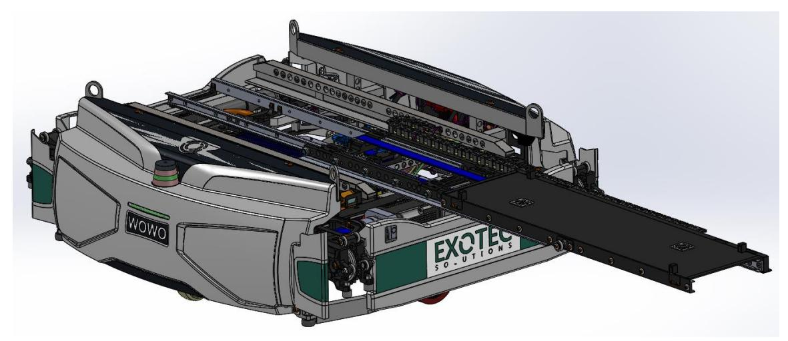

Figure 10 : système de saisie

Pour cette étude, les données et hypothèses retenues sont les suivantes :

- caractéristiques du pignon, module m = 3,18 nombre de dents Z = 24 angle de pression α = 20° ;
- i indice de l'emplacement du bac à saisir (étage à atteindre) ;
- capteur inductif, logique positive (PNP), noyable, raccordement par câble ;
- fréquence de rotation du pignon N = 240 tr·min-1 ;
- la hauteur de sortie de la fourche His se trouve 10 mm en-dessous de Hi ;
- un signal de sortie commande la marche du moteur ;
- le sens de rotation du moteur vaut 1 pour la montée et 0 pour la descente ;
- les différentes vitesses de déplacement, phases d'accélération et de décélération, ne seront pas prises en compte dans cette partie.

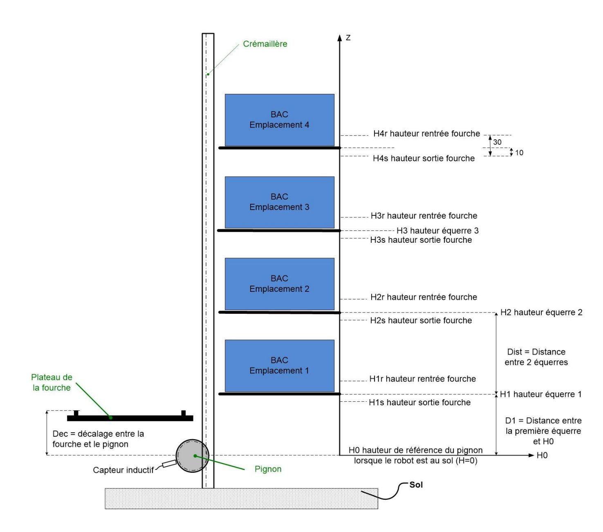

Figure 11 : schéma des positions à atteindre pour la saisie d'un bac

**Question 9 . Calculer** le pas p du pignon.

**Question 10 . Déterminer** la hauteur de la traverse Hi en fonction de D1, Dist et i. Puis **déterminer** la hauteur Hf que doit atteindre le pignon pour positionner la fourche à His.

**Question 11 . Montrer** que Hf = 9390 mm pour i = 24 sachant que Dec = 100 mm, D1 = 300 mm et Dist = 400 mm. Est-ce cohérent ?

**Question 12 . Déterminer** le nombre de dents à compter Nf en fonction de Hf et p.

*Un capteur inductif est placé devant la denture (voir* 

Figure *11* et Figure *12*) et génère un signal A qui permet de détecter la présence d'une dent.

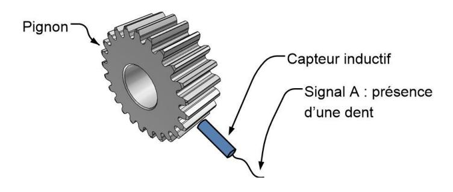

Figure 12 : détection de la présence d'une dent

**Question 13 . Compléter** l'algorigramme sur le document réponse **DR1** décrivant le fonctionnement voulu c'est-à-dire la montée du robot jusqu'à la position de sortie de fourche.

Afin de valider le programme envisagé, une simulation a été réalisée avec le logiciel *Proteus* (voir Figure *13*). On y trouve un moteur CC à deux sens de rotation (montée/descente), une carte Arduino Uno (commande), un signal carré de 100 Hz (pour simuler le signal A du capteur inductif) et un écran permettant d'afficher la valeur de consigne i (ordre de la supervision).

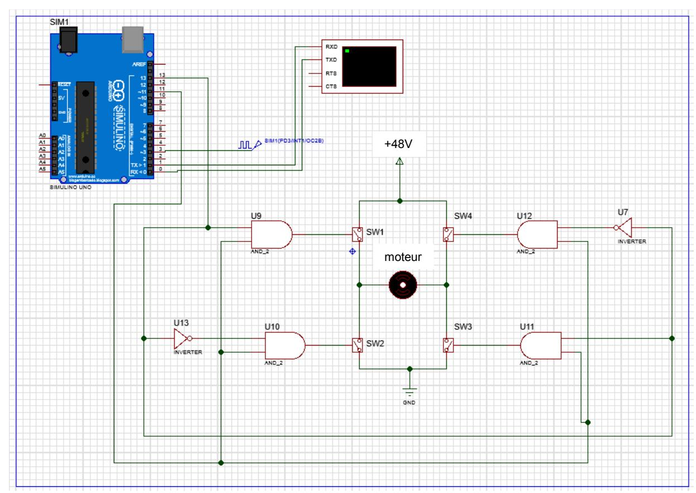

Figure 13 : simulation du programme sous Proteus

### Tableau de correspondance :

| Variables algorigramme | Affectation Arduino |
|------------------------|---------------------|
| i                      | etage               |
| Hf                     | hauteur             |
| C0                     | compteur            |
| moteur                 | EnMotPin (marche)   |
|                        | SensMotPin (sens)   |
| A                      | Captind             |
| Nf                     | …                   |
|                        | …                   |

**Question 14 . Compléter** sur le document réponse **DR2** (zone en pointillés), le programme noté *position\_arret* en langage C de type Arduino à partir des informations contenues dans le document annexe **DA4**. Toute variable supplémentaire devra être justifiée.

On souhaite enfin choisir le capteur inductif capable de délivrer le signal A (présence d'une dent).

**Question 15 . Calculer** la fréquence du signal A du capteur inductif et à l'aide du document annexe **DA3. Donner** la référence du capteur retenu.

### **V. CARACTÉRISTIQUES DE LA BATTERIE POUR UNE AUTONOMIE OPTIMALE**

*Objectif : calculer la capacité de la batterie nécessaire pour que le robot puisse effectuer 160 trajets types*

*Le robot dispose d'une batterie conçue sur mesure (compromis masse/puissance) pour alimenter l'ensemble de ses composants et assurer 160 trajets types avant recharge (voir* 

Figure *14*).

Pour cette étude, les données et hypothèses retenues sont les suivantes :

- batterie Li ion de 48 V continu ;
- taux de décharge = 80 % ;
- consommation électrique des composants électroniques (carte de commande, capteur de position, WIFI …) **I9 = 1 A** pendant la durée du trajet type ;
- accélération de la pesanteur g = 9,81 m·s-2 ;
- phases d'accélération négligées lors des déplacements du robot ;
- frottements négligés lors de la descente.

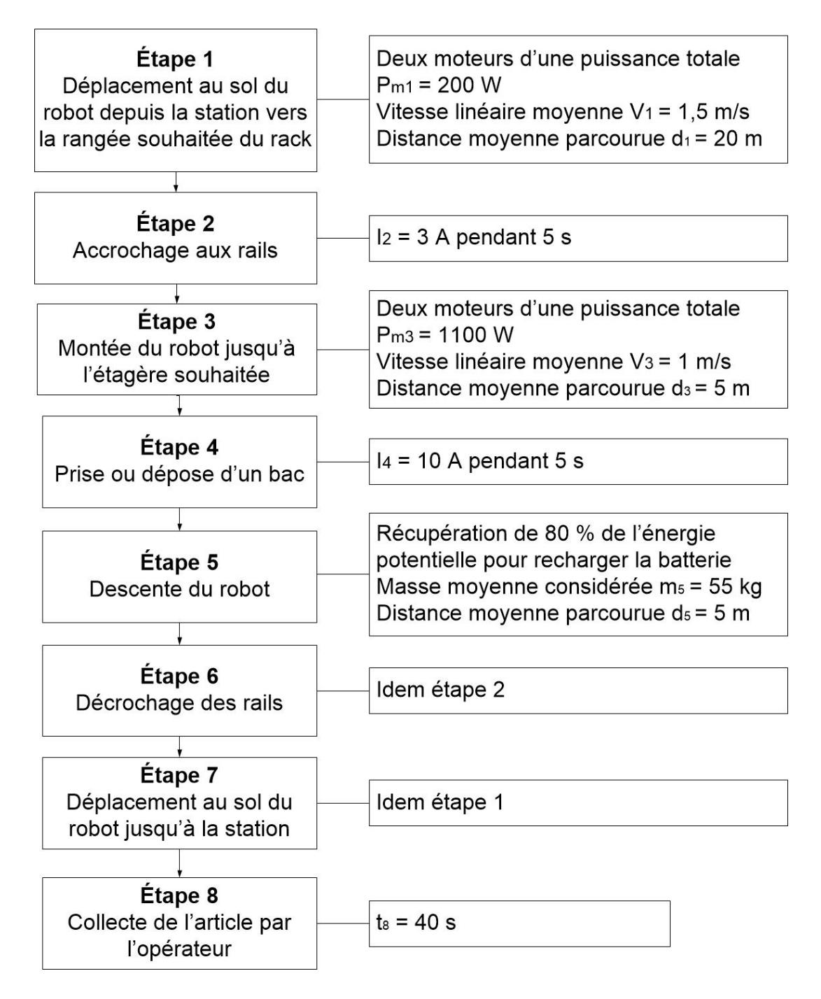

Figure 14 : descriptif des différentes phases d'un trajet type

**Question 16 . Calculer** l'énergie potentielle récupérée E<sup>p</sup> en J puis en W*·*h lors de la descente du robot (étape 5).

**Question 17 . Montrer** que le temps t5 est égal à 1s (temps de descente du robot).

**Question 18 . Calculer** le temps total ttrajet d'un trajet type.

**Question 19 . Calculer** l'énergie consommée Econsommée par le robot durant un trajet type en J puis en W*·*h.

**Question 20 . Calculer** l'énergie nécessaire Enécessaire en W*·*h pour réaliser 160 trajets types (en tenant compte du taux de décharge).

**Question 21 . Calculer** la capacité nécessaire Cb en A*·*h de la batterie.

La batterie est un assemblage de cellules élémentaires dont les caractéristiques sont les suivantes :

- U = 3,7 V ;
- C = 5,2 A·h ;
- Mc = 0,092 Kg.

**Question 22 . Définir** la structure de la batterie. **Calculer** la masse de la batterie ainsi définie. **Conclure** quant au respect de l'exigence " la masse de la batterie doit être inférieure à 5 kg ".

### **VI. STABILITÉ DU ROBOT LORS DES DÉPLACEMENTS AU SOL**

*Objectif : vérifier la répartition de la charge sur les quatre roues et leur contact avec le sol dans tous les cas de chargement du Skypod*

Le robot Skypod dispose de deux roues motrices et deux roues omnidirectionnelles réparties de façon symétrique (voir Figure *15* et Figure *16*) pour effectuer ses déplacements horizontaux et accéder aux stations de préparation de commandes.

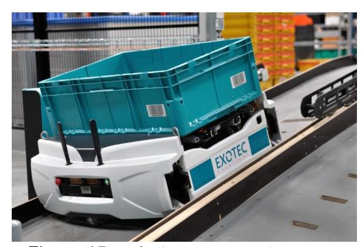

Figure 15 : robot sur ses quatre roues

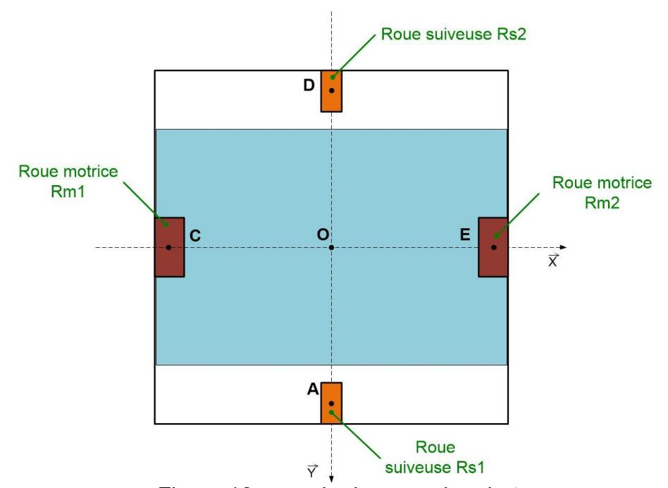

Figure 16 : vue de dessous du robot

Le support de roues embarquant la charge totale c'est-à-dire le poids du robot luimême, le poids du bac ainsi que le poids du chargement, est constitué de trois éléments (1, 2 et 3) comme le montre la Figure *17*. La solution retenue doit permettre d'assurer l'appui au sol des quatre roues quelle que soit la situation.

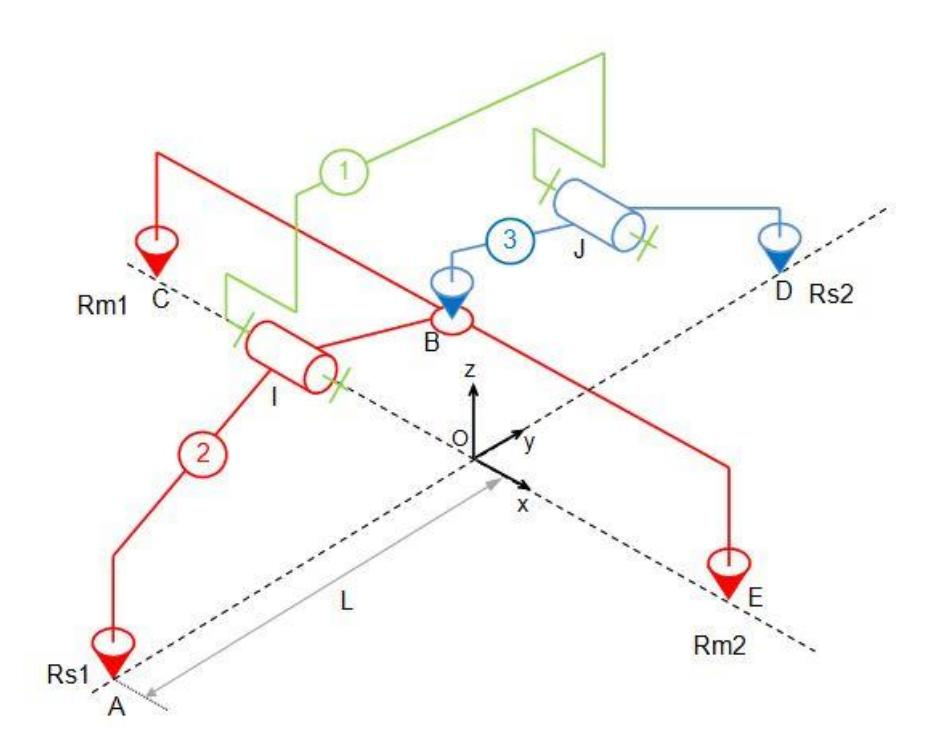

Figure 17 : schéma de cinématique 3D du support de roues

Le système étant symétrique, on ramène cette étude à un problème plan comme illustré par la Figure *18*.

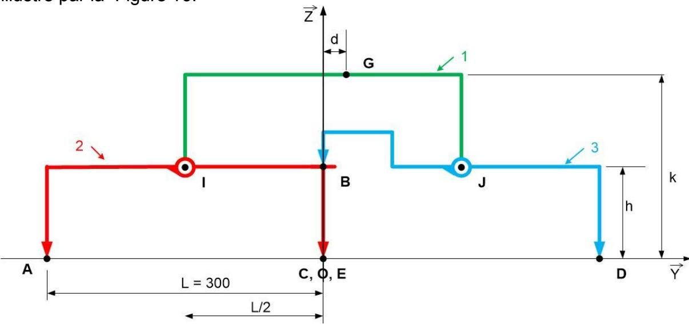

Figure 18 : schéma cinématique du support de roues

Une première étude, avec une charge maximale placée au centre du robot (d = 0), a permis de démontrer une répartition de la charge identique sur chacune des roues c'est-à-dire que chaque roue supporte un quart de la charge totale (voir Figure *19*).

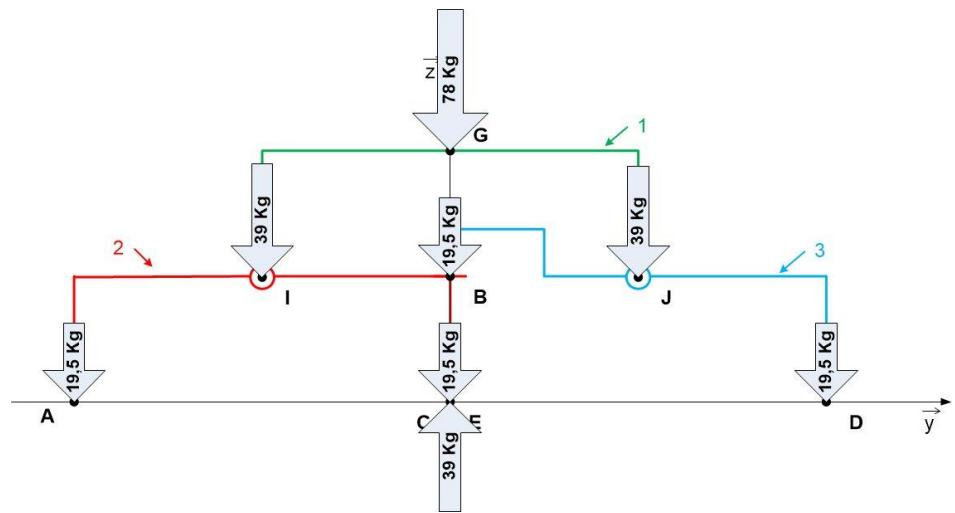

Figure 19 : répartition avec charge centrée

On se propose de vérifier que chaque roue appuie bien sur le sol, avec une charge décalée de la distance **d** du centre du robot par rapport à l'axe  $\vec{y}$  (voir Figure 18) lors d'un déplacement horizontal à vitesse constante.

Pour cette étude, les données et hypothèses retenues sont les suivantes :

- le repère R<sub>0</sub> (O,  $\vec{x}$ ,  $\vec{y}$ ,  $\vec{z}$  ) est supposé galiléen ;
- les liaisons sont considérées comme parfaites ;
- masse totale de l'ensemble (robot, bac et chargement) m = 78 kg;
- accélération de la pesanteur g = 9,81 m·s<sup>-2</sup> et  $\vec{g}$ = -g  $\vec{z}$ .

### A - On isole 1

Les torseurs mis en jeu sont :

$$\{T_{2\to 1}\} = \begin{cases} 0 & 0 \\ Y_i & 0 \\ Z_i & 0 \end{cases}, \quad \{T_{3\to 1}\} = \begin{cases} 0 & 0 \\ Y_j & 0 \\ Z_j & 0 \end{cases}, \quad \{T_{poids\to 1}\} = \begin{cases} 0 & 0 \\ 0 & 0 \\ -m \ g & 0 \end{cases}_G$$

L'étude menée nous donne les trois équations suivantes :

### B - On isole 3

Les torseurs mis en jeu sont :

$$\{T_{1\to 3}\} = \begin{cases} 0 & (-\frac{L}{2} Z_j + h Y_j) \\ -Y_j & 0 \\ -Z_j & 0 \end{cases}$$
 
$$\{T_{2\to 3}\} = \begin{cases} 0 & 0 \\ 0 & 0 \\ Z_b & 0 \end{cases}_B$$
 
$$\{T_{sol\to 3}\} = \begin{cases} 0 & 0 \\ 0 & 0 \\ Z_d & 0 \end{cases}_D$$

L'étude menée nous donne les trois équations suivantes :  $\begin{cases} Y_i = Y_j = 0 \\ Z_b = Z_d = \frac{1}{2} \text{ mg } \left(\frac{1}{2} - \frac{d}{L}\right) \\ Z_d = \frac{1}{2} \text{ mg } \left(\frac{1}{2} - \frac{d}{L}\right) \end{cases}$ 

### C - On isole 2

**Question 23**. Écrire les actions mécaniques  $\{T_{1\to 2}\}$  en I ,  $\{T_{3\to 2}\}$  en B ,  $\{T_{solA\to 2}\}$  en A et  $\{T_{solCE\to 2}\}$  en O.

**Question 24 . Appliquer** le principe fondamental de la statique au point O. **Écrire** le système d'équations puis **déterminer** en particulier, les composantes sur l'axe  $\vec{z}$  de la résultante.

**Question 25**. Calculer les forces appliquées sur chacune des roues pour d = 100 mm. Conclure quant au maintien du contact des roues avec le sol et à la répartition de la charge sur les quatre roues.

### VII. DÉFORMATION DE LA FOURCHE

### Objectif : vérifier la déformation totale en bout de fourche télescopique

Lors de la sortie d'un bac du stock, une fois le robot arrivé en position de prise, la fourche (voir Figure 10) sort entre le bac inférieur et le bac à extraire, monte de 30 mm puis revient dans sa position initiale (voir Figure 20).

La déformation totale à l'extrémité de la fourche ne doit pas dépasser 20 mm pour assurer le retrait du bac et éviter toute collision avec l'étagère lors de l'extraction (rentrée de la fourche télescopique).

Cette exigence s'applique également lors du dépôt d'un bac dans le stock.

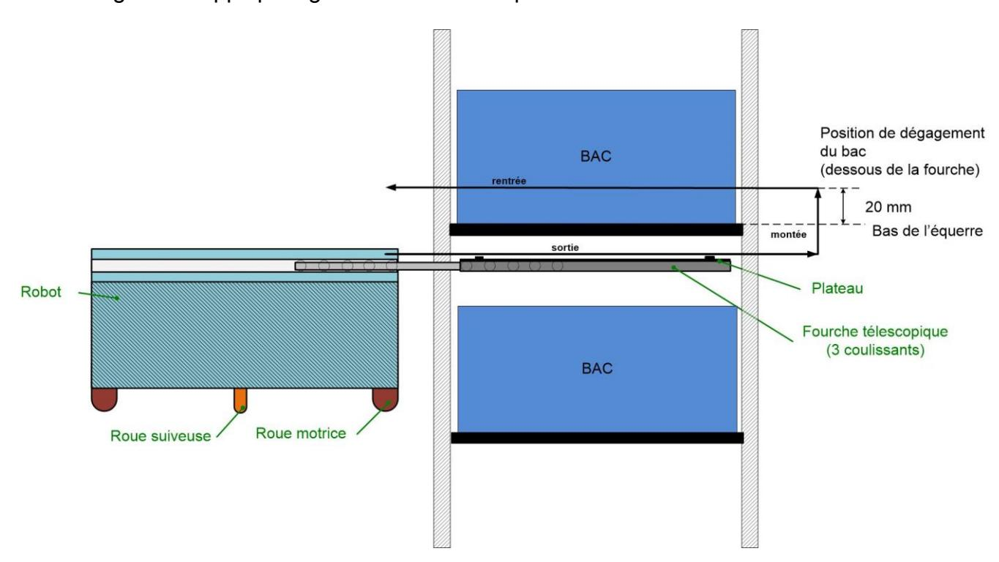

Figure 20 : principe de saisie d'un bac

La fourche est composée de deux glissières télescopiques (voir Figure 21) à grande extension identiques. Les coulissants 1 sont fixés au robot. Un plateau servant à la saisie des bacs est fixé entre les deux coulissants 3 des deux glissières (droite et gauche).

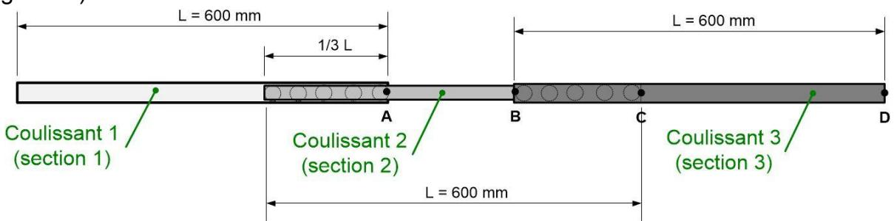

Figure 21 : glissière télescopique déployée

On se propose d'étudier la glissière de gauche (voir Figure 22).

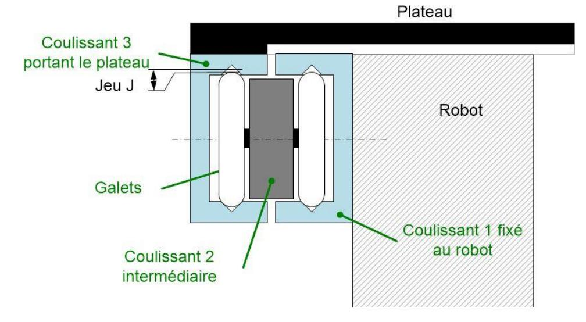

Figure 22 : montage de la glissière de gauche

Pour cette étude, les données et hypothèses retenues sont les suivantes :

- masse du bac chargé = 33 kg;
- masse propre d'une glissière (avec un demi plateau) = 1 kg;
- module d'Young E = 74 000 MPa (alliage d'aluminium 2017A)
- le plateau ne se déforme pas ;
- le coulissant 1 est monté encastré sur le robot, il est donc indéformable ;
- tous les coulissants ont une longueur L :
- les sections 1 et 3 de forme en U sont identiques ;
- la section 2 est rectangulaire ;
- la course de sortie d'un coulissant est égale à 2/3 de la longueur L :
- dans le cas d'une charge centrée, chaque glissière supporte 50% de la charge totale :
- dans le cas d'une charge non centrée, une glissière peut supporter jusqu'à 65 % de la charge totale ;
- le plan  $(O, \vec{x}, \vec{z})$  est plan de symétrie du système ;
- le jeu entre deux coulissants est égal à 0,1 mm (voir Figure 22 et Figure 23).

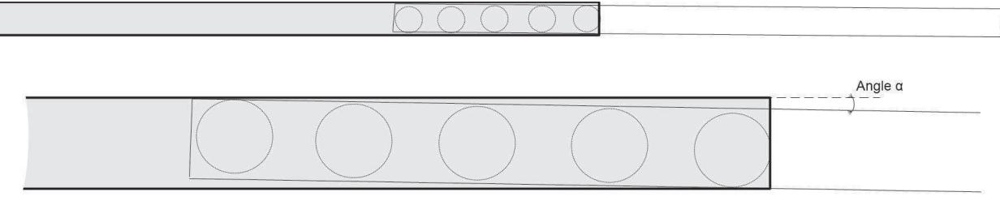

Figure 23 : jeu entre deux coulissants (1 et 2)

**Question 26 . Représenter** sur un schéma explicatif le jeu total Jtotal en bout de fourche. **Déterminer** sa valeur.

On étudie maintenant la flèche d'une glissière en bout de fourche dans le cas le plus défavorable. L'effort Pb-<sup>f</sup> ⃗⃗⃗⃗⃗⃗ est vertical et prend en compte le bac chargé et la masse propre de la glissière (voir Figure *24*).

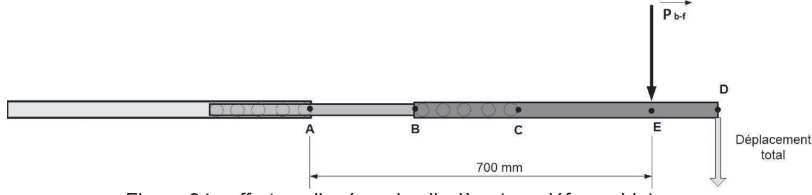

Figure 24 : effort appliqué sur la glissière (cas défavorable)

**Question 27 . Calculer** l'effort Pb-<sup>f</sup> ⃗⃗⃗⃗⃗⃗ appliqué sur la glissière de gauche dans le cas le plus défavorable.

**Question 28 .** À l'aide du document annexe **DA5**, **déterminer** la flèche totale ftotale en bout de fourche.

**Question 29 . Calculer** le déplacement total Dtotal en bout de fourche. **Conclure** quant au respect de non-collision lors de l'extraction d'un bac.

### **VIII. CONCLUSION ET SYNTHÈSE**

**Question 30 . Conclure** quant à la possibilité d'installer un tel système dans un entrepôt existant et d'assurer les préparations de commandes demandées.

### **IX. PARTIE PÉDAGOGIQUE**

### **Préparation d'une séquence pédagogique**

Quel que soit le niveau de classe pris en charge, l'élaboration d'une séquence pédagogique doit s'intégrer dans une progression des apprentissages qu'il convient de positionner dans le cycle de formation de l'élève. Au cours de cette phase de préparation, à partir de l'objectif pédagogique qu'il s'est fixé, l'enseignant structure la séquence selon les phases du diagramme ci-dessous.

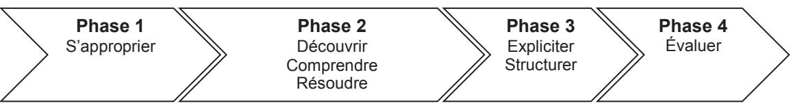

**Question 31 -** À partir de l'exemple de séquence pédagogique du document annexe **DA6**, **compléter** le document réponse **DR3**, en précisant, pour chacune des étapes, les éléments que doit définir l'enseignant lors de sa préparation.

### **Mise en œuvre d'une séquence pédagogique**

Dans la séquence pédagogique proposée dans le document annexe **DA6**, l'intention pédagogique de l'enseignant est de faire acquérir aux élèves des compétences en lien avec l'expression du besoin et la démarche d'élaboration d'une solution en réponse à un besoin.

### Mise en contexte :

- le laboratoire de technologie est organisé en 8 îlots pédagogiques disposant chacun d'un ordinateur avec les principaux outils bureautiques et de création 3D ;
- chaque îlot dispose d'un robot programmable avec un jeu de capteurs (capteur de ligne, capteur ultrasons, capteur infra rouge) ;
- dans le FabLab commun aux deux laboratoires de l'établissement les outils de prototypage classiques sont disponibles (imprimante 3D, plieuse, machine d'usinage pour matériau tendre) ;
- la séance dure 55 min l'effectif est de 26 élèves.

**Question 32 -** Dans le document réponse **DR4, proposer** une situation déclenchante en relation avec le support étudié dans la première partie l'épreuve, le robot Skypod. **Décrire** le déroulement de la phase d'appropriation, pour aboutir à la formalisation de la situation problème de la séance 1 rédigée dans la colonne questionnement de la fiche pédagogique de séquence du document annexe **DA6**. **Préciser** la principale compétence travaillée lors de la séance 1.

**Question 33 -** Dans la classe prise en charge, le niveau des élèves est hétérogène. Ils se répartissent en 9 élèves plutôt moteurs, 10 élèves moyens et 7 élèves en difficulté. Pour mettre en œuvre la séance 2 décrite dans le document de l'annexe **DA6**, à partir des pistes mentionnées dans le document de l'annexe **DA7**, **proposer**  et **décrire** dans le document réponse **DR4,** deux actions pour prendre en compte les différents profils d'élèves de la classe.

**Question 34 –** À partir de la proposition formulée pour la séance 2 de la fiche pédagogique de séquence du document annexe **DA6**, **proposer** le déroulement de la séance 3 en complétant le Document **DR5.**

### **Démarches pédagogiques**

Dans la série technologique STI2D et dans la spécialité de sciences de l'ingénieur de la série générale, les démarches et la didactique de la discipline s'inscrivent dans la continuité du programme de Technologie du collège. Dans le programme de STI2D mis en œuvre depuis la rentrée 2019, les modalités d'enseignement sont décrites dans l'extrait ci-dessous :

*« Des particularités pédagogiques perdurent : un équilibre entre abstraction et concrétisation, analyse et action, théorie et confrontation avec le réel, indispensable à toute une catégorie d'élèves qui repoussent le choix d'une formation*  *professionnelle, mais qui sont davantage sensibles à des approches concrètes. À partir de produits réels et contemporains, les modalités d'enseignement privilégient les démarches actives : activités pratiques d'expérimentation, de simulation et d'analyse de produits réels et actuels, ainsi que le projet. Ce dernier, qui permet de synthétiser les activités et de favoriser la collaboration entre élèves, n'est pas seulement support à des situations d'application, mais constitue tout d'abord un temps d'apprentissage. (…). Pour les élèves, le projet, dans le cadre de ce programme, est un élément essentiel aux démarches d'investigation et de résolution de problème. Il conforte l'acquisition du corpus de connaissances générales et techniques, indispensable à la poursuite d'études notamment. »*

Composantes essentielles du projet, les démarches d'investigation et de résolution de problème doivent être mobilisées dans les activités proposées aux élèves dans les enseignements de sciences de l'ingénieur en STI2D mais également en Technologie au collège et dans l'enseignement de spécialité de sciences de l'ingénieur de la série générale.

**Question 35 - Expliciter** dans le document réponse **DR6** ce qui caractérise les démarches d'investigation et de résolution de problème en termes d'objectif, d'activités et de supports mobilisables.

On se place maintenant dans la cadre de l'enseignement Innovation et Développement Durable en STI2D.

Dans la séance envisagée, les connaissances travaillées sont en lien avec l'approche comportementale des produits et en particulier le comportement mécanique des produits.

**3** – Approche comportementale des produits

3-2 – Comportement mécanique des produits

|         | Résistance<br>à<br>la<br>rupture,<br>résistance<br>à<br>la<br>déformation.               |
|---------|------------------------------------------------------------------------------------------|
|         | Résistance des matériaux :<br>hypothèses et modèle poutre ; notion de                    |
|         | contrainte normale ; pour une sollicitation de traction simple, notion de                |
| 3.2.3.1 | déformation et loi de Hooke ; module d'Young ; limite élastique ;                        |
|         | sollicitation<br>simple<br>de<br>type<br>traction,<br>compression,<br>flexion<br>simple. |
|         | Simulations par éléments finis.                                                          |

### Objectif de formation

**O6** – Préparer une simulation et exploiter les résultats pour prédire un fonctionnement, valider une performance ou une solution

### Compétence travaillée

| CO6.3 | Évaluer un écart entre le comportement du réel et les résultats fournis                  |
|-------|------------------------------------------------------------------------------------------|
|       | par le modèle en fonction des paramètres proposés, conclure sur la<br>validité du modèle |

**Question 36 -** A partir de l'étude proposée dans la partie « *VII – Déformation de la fourche* » de la première partie du sujet, **décrire** dans le document réponse **DR6** une activité pratique d'expérimentation qui permet de répondre à l'objectif : « *Vérifier la déformation totale en bout de fourche télescopique* ».

### **Documents annexes**

### **Document annexe DA1 : diagramme des exigences partiel de la solution**

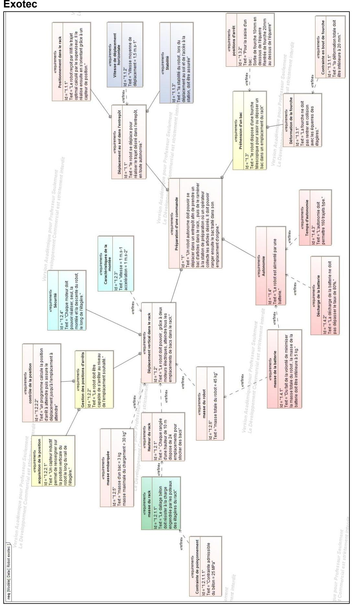

### **Document annexe DA2 : documentation constructeur du MOVINOR servo moteur basse tension**

De par leur puissance supérieure, leur excellente capacité d'accélération, leur compacité et leur légèreté, les moteurs de la gamme sont particulièrement indiqués pour les applications embarquées à haute dynamique en association avec la gamme de servo-variateurs INFRANOR XtrapulsEasy 60VDC.

| Туре      |                  | Bobinage B       | (48VDC)          |                  |       | Longueur K |
|-----------|------------------|------------------|------------------|------------------|-------|------------|
|           | Couple nominal   | Vitesse nominale | Courant nominal  | Vitesse maximale |       |            |
|           | M <sub>nom</sub> | n <sub>nom</sub> | I <sub>nom</sub> | n <sub>max</sub> | sans  | avec       |
|           |                  |                  |                  | @48VDC           | frein | frein      |
|           | [Nm]             | [t/min]          | [Arms]           | [t/min]          | [mm]  | [mm]       |
| LT037-1-B | 0.10             | 4 000            | 2.10             | 9 430            | 81    | 111        |
| LT037-2-B | 0.20             | 4 000            | 3.20             | 7 410            | 96    | 126        |
| LT037-3-B | 0.29             | 4 000            | 3.80             | 6 200            | 111   | 141        |
| LT055-1-B | 0.19             | 3 000            | 3.20             | 7 530            | 98    | 131        |
| LT055-2-B | 0.38             | 3 000            | 4.30             | 5 310            | 113   | 146        |
| LT055-3-B | 0.57             | 3 000            | 6.20             | 5 170            | 128   | 161        |
| LT055-4-B | 0.76             | 3 000            | 6.90             | 4 280            | 143   | 176        |
| LT088-1-B | 0.60             | 3 000            | 7.00             | 5 370            | 109   | 142        |
| LT088-2-B | 1.15             | 3 000            | 9.90             | 3 980            | 127   | 160        |
| LT088-3-B | 2.20             | 3 000            | 14.50            | 3 410            | 163   | 196        |
| LT088-4-B | 2.50             | 3 000            | 22.40            | 4 240            | 181   | 214        |
| LT098-1-B | 2.30             | 3 000            | 18.40            | 3 660            | 146   | 178        |
| LT098-2-B | 4.60             | 3 000            | 34.00            | 3 480            | 176   | 208        |
| LN055-1-B | 0.26             | 3 000            | 3.50             | 6 520            | 67    | 105        |
| LN055-2-B | 0.51             | 3 000            | 6.00             | 5 930            | 82    | 120        |
| LN055-3-B | 0.71             | 3 000            | 7.70             | 5 390            | 97    | 135        |
| LN055-4-B | 0.91             | 3 000            | 7.30             | 4 180            | 112   | 150        |
| LN086-1-B | 1.13             | 3 000            | 12.90            | 5 450            | 82    | 120        |

### **Document annexe DA3 : documentation constructeur du capteur inductif**

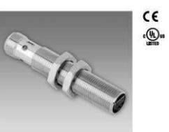

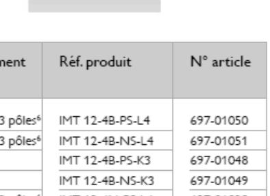

### **Document annexe DA4 (3 pages) : éléments de syntaxe du langage C sous Arduino**

### **Structure générale**

- void setup() (configuration-préparation)
- void loop() (exécution)

### **Opérations de comparaison**

- == (équivalent à)
- != (différent de)
- < (inférieur à)
- > (supérieur à)
- <= (inférieur ou égal à)
- >= (supérieur ou égal à)

### **Operations booléènnes**

- && (et)
- || (ou)
- ! (et pas)

### **Autres commandes**

- // (commentaire simple ligne)
- /\* \*/ (commentaire multi-lignes)

### **Variables**

- •char (variable 'caractère')
- •int (variable 'nombre entier')
- •long (variable 'nombre entier de grande taille')
- •string (variable 'chaine de caractères')
- •array (tableau de variables)
- •byte (variable 'octet')

### **Niveaux logiques des connecteurs numériques**

- •HIGH (état 1)
- •LOW (état 0)
- •INPUT (configuré en entrée)
- •OUTPUT (configuré en sortie)

### **Entrées-sorties numériques**

- •pinMode(broche, état) (configuration des broches)
- •digitalWrite(broche, état) (écrire un état sur une broche num)
- •digitalRead(broche) (lire un état sur une broche num)

### **Gestion du temps**

- •delay(ms) (attente, en millisecondes)
- •delayMicroseconds(us) (attente, en microsecondes)

### **Communications série entre Arduino et autres machines ou ordinateur**

- Serial.begin(speed) (configuration de la vitesse de communication Série)
- Serial.available() (indique le nombre de caractères disponibles dans la zone tampon Série)
- Serial.read() (lit les données Série)
- Serial.print(data) (transmission des données Série)
- Serial.println(data) (transmission des données Série suivie d'un retour à la ligne)

### **Contrôle et conditions**

- if (si...)
- if...else (si...alors...)
- for (pour...)
- switch case (dans le cas où...)
- while (pendant que ...)

| Boucle while                   | Exemple                  |
|--------------------------------|--------------------------|
| while (/*condition à tester*/) | int compteur = 0<br>;    |
| {                              | while (compteur<br>!= 5) |
| // instructions                | {                        |
| }                              | Compteur++<br>;          |
|                                | }                        |

| Structure if … else         | Exemple                        |
|-----------------------------|--------------------------------|
| if (/*condition à tester*/) | if<br>(temperature >= 70)      |
| {                           | {                              |
| // instructions A           | //Danger! Shut down the system |
| }                           | }                              |
| else                        | else                           |
| {                           | {                              |
| // instructions B           | //Safe! Continue usual tasks   |
| }                           | }                              |

### **La gestion d'une fonction**

Lorsque l'on programme une carte Arduino, on va écrire notre programme dans des fonctions. Une fonction est un programme qui permet de réaliser une tâche bien précise.

On ne peut pas écrire un programme sans mettre de fonctions à l'intérieur ! On est obligé d'utiliser la fonction **setup** () et **loop** () (même si on ne met rien dedans).

Une fonction de type void ne retourne pas de valeur, c'est donc une procédure.

| Fonction VOID             | Exemple |
|---------------------------|---------|
| void nom_de_la_fonction() |         |
| {<br>// instruction       |         |
| }                         |         |

### **Fonctions particulières liées aux interruptions externes**

Seules les broches 2 et 3 sont utilisés pour les interruptions.

### **attachInterrupt** (interruption**,** fonction**,** mode) ;

Active la lecture d'une broche attachée à une interruption.

Paramètres

**interruption** : numéro de l'interruption (type int)

**fonction**: fonction à appeler quand l'interruption survient; la fonction doit recevoir aucun paramètres et ne renvoie rien. Cette fonction est également appelée une routine de service d'interruption (ou ISR).

**mode** : définit la façon dont l'interruption externe doit être prise en compte. Quatre constantes ont des valeurs prédéfinies valables :

- LOW : pour déclenchement de l'interruption lorsque la broche est au niveau BAS
- CHANGE : pour déclenchement de l'interruption lorsque la broche change d'état BAS/HAUT
- RISING : pour déclenchement de l'interruption lorsque la broche passe de l'état BAS vers HAUT (front montant)
- FALLING : pour déclenchement de l'interruption lorsque la broche passe de l'état HAUT vers l'état BAS (front descendant)

```
const byte ledPin = 13;
const byte interruptPin = 2;
volatile byte state = LOW;
void setup() {
 pinMode(ledPin, OUTPUT);
 pinMode(interruptPin, INPUT);
 attachInterrupt(digitalPinToInterrupt(interruptPin), inter, CHANGE);
}
void loop() {
 digitalWrite(ledPin, state);
}
void inter() {
 state = !state;
}
```

### **detachInterrupt**(digitalPinToInterrupt(pin));

Désactive la lecture d'une broche attachée à une interruption

### **Interrupt() ;**

Active les interruptions dans le programme principal.

Les interruptions permettent à certaines tâches importantes de se produire en arrière-plan et sont activées par défaut. Sans cela la communication entrante peut être ignorée.

### **Document annexe DA5 : étude de la flexion des coulissants**

### Étude du coulissant 2

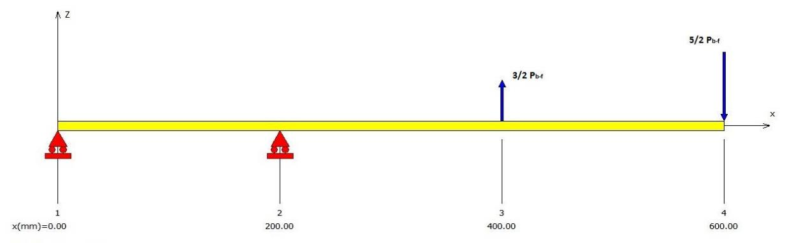

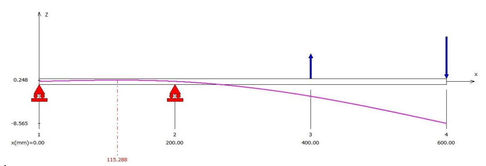

### Étude du coulissant 3

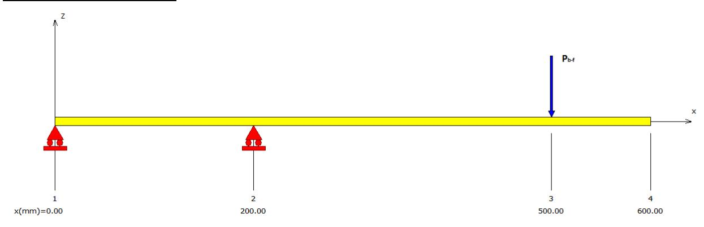

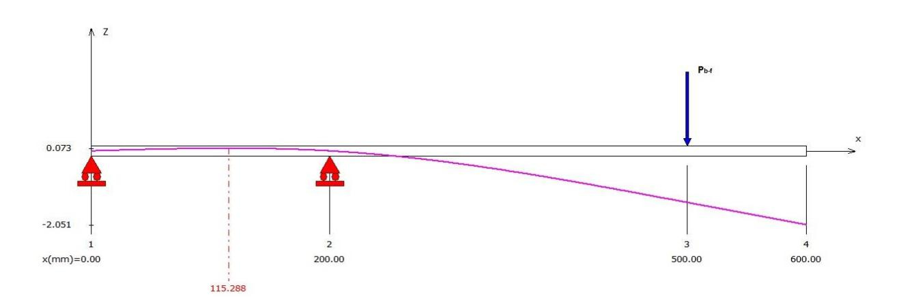

### **Document annexe DA6 : Fiche pédagogique de séquence de Technologie**

| Cycle 4<br>–<br>S5                                        | FICHE PÉDAGOGIQUE DE SÉQUENCE<br>Pôle des Sciences et de la Technologie au collège |                                                      |   |                |  |                             | ACADEMIE<br>De x |              |  |
|-----------------------------------------------------------|------------------------------------------------------------------------------------|------------------------------------------------------|---|----------------|--|-----------------------------|------------------|--------------|--|
| Se déplacer sur terre, air, mer                           | THEME DE SEQUENCE                                                                  | PROBLEMATIQUE<br>Comment rendre un véhicule autonome |   |                |  | ?                           |                  |              |  |
| OBJET OU SYSTEME TECHNIQUE<br>Robot Mbot suiveur de ligne |                                                                                    |                                                      | X | DEBUT DE CYCLE |  | POSITIONNEMENT SUR LE CYCLE |                  | FIN DE CYCLE |  |

| Compétences associées (CA)                                                                                                                                                                                                    | Connaissances (CO)                                                                                                                                   |
|-------------------------------------------------------------------------------------------------------------------------------------------------------------------------------------------------------------------------------|------------------------------------------------------------------------------------------------------------------------------------------------------|
| DIC1.5 Imaginer des solutions pour<br>produire des objets et des éléments de<br>programmes informatiques en réponse<br>au besoin.                                                                                             | Design. Innovation et créativité. Veille.<br>Représentation de solutions (croquis, schémas,<br>algorithmes). Réalité augmentée. Objets<br>connectés. |
| MSOST.1.2 Associer des solutions<br>techniques à des fonctions.                                                                                                                                                               | Analyse fonctionnelle systémique                                                                                                                     |
| OTSCIS.2.1 Exprimer sa pensée à<br>l'aide d'outils de description adaptés :<br>croquis, schémas, graphes,<br>diagrammes, tableaux.                                                                                            | Croquis à main levée. Différents schémas.<br>Carte heuristique. Notion d'algorithme.                                                                 |
| DIC.2.1 Réaliser, de manière<br>collaborative, le prototype d'un objet<br>pour valider une solution.<br>MSOST.1.1 : Respecter une procédure<br>de travail garantissant un résultat en<br>respectant les règles de sécurité et | Prototypage rapide de structures et de circuits<br>de commande à partir de cartes standard.<br>Procédures, protocoles. Ergonomie.                    |
|                                                                                                                                                                                                                               | d'utilisation des outils mis à disposition.                                                                                                          |

### **Prérequis des élèves**

Connaissance des outils d'analyse systémique du besoin.

### **Présentation de la séquence**

Cette séquence a pour objectif la recherche et la formalisation d'une solution technique qui doit contribuer à rendre autonome un robot convoyeur dans une infrastructure existante. La solution technique envisagée est prototypée avec un outil de simulation puis réalisée en réponse aux critères de performance du cahier des charges construit par les élèves en fonction du besoin du client.

Besoin : le client souhaite équiper le robot convoyeur de détecteurs pour intégrer ultérieurement dans le programme un protocole d'évitement d'obstacle.

| Situation déclenchante             | Éléments de la synthèse                                                                                |  |  |  |
|------------------------------------|--------------------------------------------------------------------------------------------------------|--|--|--|
| Objet de la question 32            | Le cahier des charges<br>Les outils d'analyse systémique – Diagramme FAST<br>Les outils de prototypage |  |  |  |
| Liens avec les autres disciplines, |                                                                                                        |  |  |  |
| EPI ou parcours (C4)               | Modalités d'évaluation                                                                                 |  |  |  |

|                                                                                                                                                                              | Déroulement de la séquence                                                                            |                         |                                                                                                                          |                                                                                                                       |                                                                  |  |  |  |
|------------------------------------------------------------------------------------------------------------------------------------------------------------------------------|-------------------------------------------------------------------------------------------------------|-------------------------|--------------------------------------------------------------------------------------------------------------------------|-----------------------------------------------------------------------------------------------------------------------|------------------------------------------------------------------|--|--|--|
|                                                                                                                                                                              | Questionnement                                                                                        | Démarche<br>Pédagogique | Activités                                                                                                                | Ressources –<br>Matériels                                                                                             | Conclusion - Bilan                                               |  |  |  |
| Séance 1                                                                                                                                                                     | Quelles solutions<br>techniques peut-on<br>mettre en œuvre pour<br>éviter un obstacle ?               | Investigation           | Rechercher de solutions<br>techniques existantes.<br>Analyser une partie du<br>fonctionnement d'un<br>véhicule autonome. | Pré-requis : classe<br>inversée avec parcours<br>numérique sur ENT.<br>Postes informatiques.<br>Documents ressources. | Proposition de<br>solutions techniques en<br>réponse à un besoin |  |  |  |
| Séance 2                                                                                                                                                                     | Comment concevoir la solution technique ?                                                             | Résolution de problème  | Compléter un cahier des<br>charges à partir des<br>mesures effectuées.<br>Réaliser un croquis.                           | Postes informatiques.<br>Documents ressources.<br>Outils de mesure (pieds à<br>coulisse, réglet)                      | Croquis                                                          |  |  |  |
| Séance 3                                                                                                                                                                     | Séance 3 Comment modéliser et réaliser le prototype de la solution retenue ?  Objet de la question 34 |                         |                                                                                                                          |                                                                                                                       |                                                                  |  |  |  |
| Commentaires : Cette séquence peut se poursuivre par une séquence consacrée à la modification du programme du véhicule autonome pour prendre en compte les capteurs ajoutés. |                                                                                                       |                         |                                                                                                                          |                                                                                                                       |                                                                  |  |  |  |

### **Document annexe DA7 : Pratiques enseignantes**

*Un enseignant, dans sa classe, doit être en mesure de faire varier ses pratiques, afin de s'adapter à la diversité de ses élèves, tout en maintenant des objectifs communs et des temps d'apprentissage collectifs. Cela suppose une maîtrise des contenus enseignés, une évaluation fine et régulière des savoirs des élèves et la mise en place de routines dans les classes.* 

### **Garantir des objectifs ambitieux communs à tous**

La différenciation pédagogique ne signifie pas la différenciation des objectifs pédagogiques qui conduit à un creusement des inégalités scolaires. Ainsi, l'entraînement des élèves sur des tâches à automatiser est nécessaire mais ne doit pas faire perdre de vue les habiletés de plus haut niveau pour tous les élèves. Une baisse du niveau d'exigence est contre-productive pour la réussite des élèves. **Il s'agit alors de proposer une palette diversifiée de manières d'arriver au résultat, sans pour autant abaisser le niveau des tâches demandées**.

### **Prendre en compte la diversité des élèves dans les situations collectives**

La différenciation ne signifie pas la fin de l'enseignement en classe entière. La conduite de séances collectives n'est pas contradictoire avec la prise en compte des singularités des élèves. Ainsi**, en classe entière, les enseignants peuvent récolter les différentes méthodes proposées par les élèves, de la plus simple à la plus complexe, et les exposer à la classe**. Chaque élève peut repérer où il en est et identifier des méthodes plus expertes proches de la sienne.

### **Faire expliciter par les élèves ce que l'on attend d'eux**

**Les élèves doivent être amenés, régulièrement, à expliciter leur cheminement, pour rendre objectif ce qu'ils ont appris, en utilisant un langage adapté**. Leur enseignant doit les accompagner dans cette phase. Cela suppose qu'il fasse des retours précis à chaque élève sur ses progrès et sur les nouveaux objectifs qui lui sont fixés.

### **Pratiquer l'auto-évaluation pour responsabiliser davantage les élèves**

Les enseignants doivent permettre aux élèves de formuler eux-mêmes les critères de réussite des tâches qu'ils ont à accomplir. **Il s'agit de construire, avec les élèves, une grille progressive et claire des buts visés**. Cela leur donne un appui pour repérer ce qui est essentiel et accroît leur sentiment de compétence.

### **Varier les situations d'apprentissage**

Les apprentissages doivent s'appuyer sur un ensemble cohérent de situations de classe variées, toutes nécessaires (phase d'entraînement, phase de résolution de problèmes, phase de bilan…). La recherche montre que les approches laissant trop de liberté aux élèves ne sont pas les plus efficaces notamment pour les élèves qui rencontrent le plus de difficultés scolaires.

### **Agencer les différentes phases d'apprentissage**

Les enseignants doivent penser que la différenciation peut intervenir à plusieurs moments d'une séquence pédagogique avec des intentions variées.

- **Avant l'enseignement** : réactiver les connaissances, identifier la nature de ce qui est déjà appris ou encore fragile pour chaque élève, préparer la tâche en fournissant des clés d'accès vers ce qui suit ;
- **Pendant l'enseignement** : soutenir l'apprentissage, aménager la tâche en la rendant accessible, évaluer le cheminement cognitif de chaque élève via une analyse de ses acquis et de ses erreurs ; s'arrêter pour formaliser et structurer progressivement ce qui est acquis ;
- **Après l'enseignement** : exercer, revoir ce qui n'a pas été compris, vérifier l'autonomie acquise par l'élève sur les objets d'apprentissage.

### **Adopter des postures enseignantes variées**

La recherche a montré que les élèves qui réussissent adoptent une variété de postures dans leurs apprentissages, et notamment, pour les plus avancés, des postures réflexives et créatives. Pour arriver à ce résultat, les enseignants doivent euxmêmes adopter une variété de postures d'enseignement : posture de contrôle (cadrage d'une situation), posture d'accompagnement (aide ponctuelle, individuelle ou collective) … **En faisant varier leurs propres postures, les enseignants encouragent les élèves à recourir, eux aussi, à une large palette de postures**.

### **Éviter les difficultés liées au travail à la maison**

Le travail individuel des élèves, réalisé à la maison, ne doit pas comporter de difficultés majeures mais se concentrer sur le renforcement de ce que les élèves savent déjà. Les devoirs donnés aux élèves doivent être à leur portée.

### **Dispositifs dans la classe**

*La différenciation pédagogique peut passer par une réorganisation de la classe. Les dispositifs proposés aux élèves doivent être variés et souples. Ils doivent favoriser les interactions entre l'enseignant et ses élèves d'une part, et entre les élèves d'autre part. Ils peuvent aussi s'appuyer sur la présence de deux enseignants intervenant ensemble ou séparément dans la même classe.* 

### **Se libérer, ponctuellement, de la gestion collective de la classe**

**Les travaux de groupes et/ou les travaux individuels permettent à l'enseignant de se libérer momentanément de la gestion collective de la classe** et d'être plus disponible pour accompagner un ou quelques élèves.

### **Faire coopérer les élèves efficacement**

La recherche montre qu'un travail dans un groupe est bénéfique à chacun de ses membres, uniquement s'il respecte certaines conditions. Ainsi, pour qu'un travail coopératif existe, **la tâche réalisée par les élèves doit résulter d'un apport de chaque individu dans le collectif, dans le cadre d'une organisation structurée** (explicitation des rôles de chacun), **avec des responsabilités partagées**.

### **Organiser un tutorat entre élèves**

**L'intervention d'un élève tuteur, moins formelle que celle de l'enseignant, est un moyen de répondre aux obstacles rencontrés par un élève tutoré**. La recherche montre que, pour que cela bénéficie à tous, les tuteurs doivent bénéficier d'une préparation pour accompagner efficacement les turorés. Les tuteurs tirent systématiquement bénéfice de ce dispositif car ils se voient offrir des occasions d'explicitation et de consolidation des savoirs et savoir-faire qu'ils maîtrisent.

### **Regrouper temporairement des élèves autour d'un même besoin**

La recherche montre que composer un groupe réduit d'élèves sur un temps spécifique est bénéfique aux apprentissages, uniquement si certaines conditions sont réunies. Ainsi, les enseignants peuvent constituer des groupes autour d'un même besoin, reposant sur l'évaluation préalable (pas forcément écrite) d'une compétence précise. **Le groupement doit être flexible et réévalué en fonction des progrès des élèves, pour éviter la démotivation et la stigmatisation**. Les temps en groupe homogène peuvent être réguliers mais doivent rester nettement inférieurs au temps en groupe/classe hétérogène.

*Extrait du dossier de synthèse – Conférence de consensus – Différenciation pédagogique – Mars 2017*

### **Documents réponses**

| Modèle CMEN-  | DOC v2 ©NEOPTEC                                                                                                               |                               |                            |                             | _                          |                             | _                            |                            | _                           |                                 |                              |                                           | 1                                                |                          |              |          |     |   | _   |   |   |   |   |
|---------------|-------------------------------------------------------------------------------------------------------------------------------|-------------------------------|----------------------------|-----------------------------|----------------------------|-----------------------------|------------------------------|----------------------------|-----------------------------|---------------------------------|------------------------------|-------------------------------------------|--------------------------------------------------|--------------------------|--------------|----------|-----|---|-----|---|---|---|---|
|               | m de famille :<br>a lieu, du nom d'usage)                                                                                     |                               |                            |                             |                            |                             |                              |                            |                             |                                 |                              |                                           |                                                  |                          |              |          |     |   |     |   |   |   |   |
| (Gaivi, Sii y | a nea, aa nom a asage)                                                                                                        | $\vdash$                      |                            |                             | <u> </u>                   |                             |                              | _                          |                             |                                 |                              |                                           | <del>!                                    </del> | <u> </u>                 |              |          |     | _ |     | = | = | _ |   |
|               | Prénom(s) :                                                                                                                   |                               |                            |                             |                            |                             |                              |                            |                             |                                 |                              |                                           |                                                  |                          |              |          |     |   |     |   |   |   |   |
| 17:3H-4       | Numéro                                                                                                                        | 一                             |                            |                             |                            |                             |                              |                            |                             |                                 |                              | •                                         | -                                                |                          |              |          |     |   | 1 / | 一 | 一 |   | 一 |
|               | Inscription :                                                                                                                 |                               |                            |                             |                            |                             |                              |                            |                             |                                 |                              | Né(e                                      | le:                                              |                          |              | /        |     |   | /   |   |   |   |   |
|               | (L                                                                                                                            | e numér                       | o est ce                   | elui qui                    | figure                     | sur la c                    | onvoca                       | tion ou                    | la feuil                    | le d'ém                         | argeme                       | ent)                                      |                                                  |                          |              |          |     |   | • • |   |   |   |   |
|               | e à l'aide de la notice)<br><b>s / Examen :</b>                                                                               |                               |                            |                             |                            |                             |                              | s                          | ectic                       | on/Sp                           | oécia                        | lité/Séri                                 | e :                                              |                          |              |          |     |   |     |   |   |   |   |
|               | Epreuve:                                                                                                                      |                               |                            |                             |                            |                             |                              | N                          | /latiè                      | re:                             |                              |                                           |                                                  |                          | Se           | ssio     | າ : |   |     |   |   |   |   |
| CONSIGNES     | <ul> <li>Remplir soign</li> <li>Ne pas signer</li> <li>Numéroter che</li> <li>Rédiger avec</li> <li>N'affectuer au</li> </ul> | la com<br>aque Pi<br>un stylo | positio<br>AGE (o<br>a eno | on et r<br>cadre<br>cre for | ne pas<br>en ba<br>ncée (l | y app<br>s à dro<br>bleue ( | orter d<br>oite de<br>ou noi | le sigi<br>la pa<br>re) et | ne dist<br>ge) et<br>ne pas | inctif p<br>placer<br>s utilise | ouvan<br>r les fe<br>er de s | t indiquer s<br>uilles dans<br>tylo plume | a prov<br>le bon<br>à encr                       | enand<br>sens<br>e clair | et dan<br>e. | s l'ordi | e.  |   |     |   |   |   |   |

EDE STI 1

### **DR1 - DR2**

Tous les documents réponses sont à rendre, même non complétés.

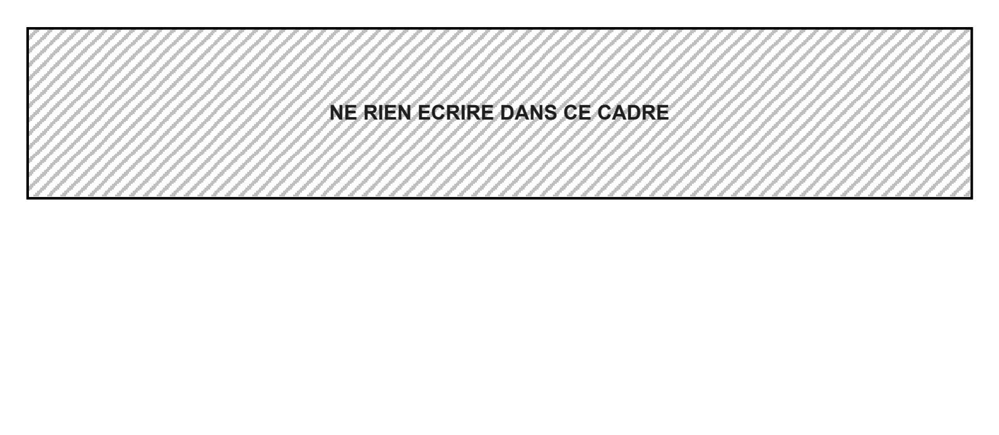

**Document réponse DR1 –** algorigramme de positionnement du robot lors de la prise d'un bac à un emplacement i. (Corps du programme)

### **Déplacement jusqu'à la position d'arrêt Hf en vue de la prise d'un bac**

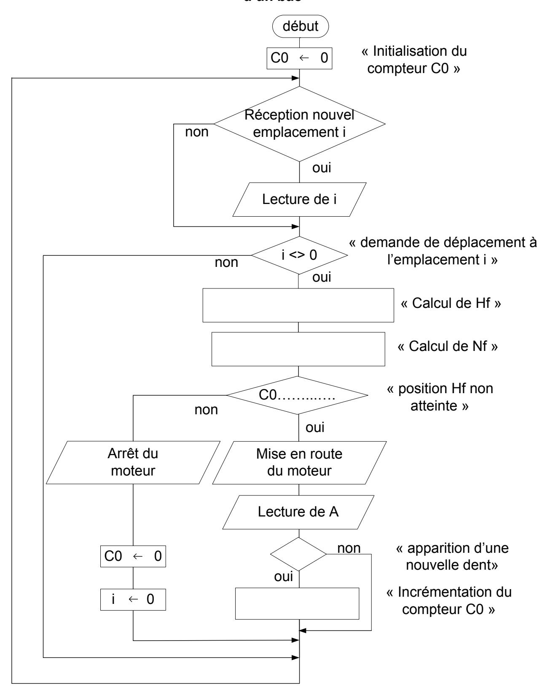

Remarque : C0 = compteur de nombre de dents

### **Document réponse DR2 –** programme *position\_arret* (…… zone à compléter)

```
// déclaration des constante et variables
const byte captind = 3; // le capteur inductif est sur la broche 3
const byte EnMotPin = 11;
const byte SensMotPin = 13;
int compteur = 0;
int etage = 0;
int hauteur = 0;
………………
// Initialisation – configuration des entrées et sorties
void setup() 
{
 pinMode(captind, INPUT); // le capteur inductif est une Entrée
 pinMode(EnMotPin, OUTPUT); 
 pinMode(SensMotPin, OUTPUT);
 Serial.begin(9600);
 interrupts(); // valide les interruptions
 }
// définition de la fonction inter appelée lors de l'interruption
// qui réalise le comptage des impulsions du capteur inductif
void inter()
{
 ………………..
 Serial.println(compteur);
}
// fonction loop - boucle sans fin – Corps du programme
void loop() 
{
 // lecture de l'étage à atteindre saisi au clavier à l'aide de l'interface écran
 while (Serial.available() > 0)
 {
 etage = Serial.parseInt();
 delay(20); //pour rester dans la boucle entre chaque caractère
 } 
 // déplacement jusqu'à l'étage souhaité
…………………………………………………….
```

| Modèle CMEN-  | DOC v2 ©NEOPTEC                                                                                                               |                               |                            |                             | _                          |                             | _                            |                            | _                           |                                 |                              |                                           | 1                                                |                          |              |          |     |   | _   |   |   |   |   |
|---------------|-------------------------------------------------------------------------------------------------------------------------------|-------------------------------|----------------------------|-----------------------------|----------------------------|-----------------------------|------------------------------|----------------------------|-----------------------------|---------------------------------|------------------------------|-------------------------------------------|--------------------------------------------------|--------------------------|--------------|----------|-----|---|-----|---|---|---|---|
|               | m de famille :<br>a lieu, du nom d'usage)                                                                                     |                               |                            |                             |                            |                             |                              |                            |                             |                                 |                              |                                           |                                                  |                          |              |          |     |   |     |   |   |   |   |
| (Gaivi, Sii y | a nea, aa nom a asage)                                                                                                        | $\vdash$                      |                            |                             | <u> </u>                   |                             |                              | _                          |                             |                                 |                              |                                           | <del>!                                    </del> | <u> </u>                 |              |          |     | _ |     | = | = | _ |   |
|               | Prénom(s) :                                                                                                                   |                               |                            |                             |                            |                             |                              |                            |                             |                                 |                              |                                           |                                                  |                          |              |          |     |   |     |   |   |   |   |
| 17:3H-4       | Numéro                                                                                                                        | 一                             |                            |                             |                            |                             |                              |                            |                             |                                 |                              | •                                         | -                                                |                          |              |          |     |   | 1 / | 一 | 一 |   | 一 |
|               | Inscription :                                                                                                                 |                               |                            |                             |                            |                             |                              |                            |                             |                                 |                              | Né(e                                      | le:                                              |                          |              | /        |     |   | /   |   |   |   |   |
|               | (L                                                                                                                            | e numér                       | o est ce                   | elui qui                    | figure                     | sur la c                    | onvoca                       | tion ou                    | la feuil                    | le d'ém                         | argeme                       | ent)                                      |                                                  |                          |              |          |     |   | • • |   |   |   |   |
|               | e à l'aide de la notice)<br><b>s / Examen :</b>                                                                               |                               |                            |                             |                            |                             |                              | s                          | ectic                       | on/Sp                           | oécia                        | lité/Séri                                 | e :                                              |                          |              |          |     |   |     |   |   |   |   |
|               | Epreuve:                                                                                                                      |                               |                            |                             |                            |                             |                              | N                          | /latiè                      | re:                             |                              |                                           |                                                  |                          | Se           | ssio     | າ : |   |     |   |   |   |   |
| CONSIGNES     | <ul> <li>Remplir soign</li> <li>Ne pas signer</li> <li>Numéroter che</li> <li>Rédiger avec</li> <li>N'affectuer au</li> </ul> | la com<br>aque Pi<br>un stylo | positio<br>AGE (o<br>a eno | on et r<br>cadre<br>cre for | ne pas<br>en ba<br>ncée (l | y app<br>s à dro<br>bleue ( | orter d<br>oite de<br>ou noi | le sigi<br>la pa<br>re) et | ne dist<br>ge) et<br>ne pas | inctif p<br>placer<br>s utilise | ouvan<br>r les fe<br>er de s | t indiquer s<br>uilles dans<br>tylo plume | a prov<br>le bon<br>à encr                       | enand<br>sens<br>e clair | et dan<br>e. | s l'ordi | e.  |   |     |   |   |   |   |

EDE STI 1

### **DR3 - DR4**

Tous les documents réponses sont à rendre, même non complétés.


**Question 31 Phase 1** S'approprier **Phase 2** Découvrir – Comprendre - Résoudre **Phase 3** Expliciter Structurer **Phase 4** Évaluer **Objectif pédagogique 1 – 2 – Activités d'apprentissage** Démarche d'investigation Démarche de résolution de problème **Restitution / Synthèse** Confrontation / Échanges argumentés **1 – 2 – 1 – 2 – Évaluer 1 –** 37

**DR3 - Préparation d'une séquence pédagogique**

**DR4 – Mise en œuvre d'une séquence pédagogique Question 32**

|                        |                                                                             | ?<br>œuvre pour éviter un obstacle<br>mettre en<br>Quelles solutions techniques peut-on<br>ment |                           |
|------------------------|-----------------------------------------------------------------------------|-------------------------------------------------------------------------------------------------|---------------------------|
| Situation déclenchante | de la phase<br>(Durée 5 à 10 minutes)<br>d'appropriation<br>ment<br>Déroule | Questionne                                                                                      | mpétence Travaillée<br>Co |

*exe DA6*

| Action | Description succincte<br>de l'action retenue<br>Description | Action | Description succincte<br>de l'action retenue<br>Description |
|--------|-------------------------------------------------------------|--------|-------------------------------------------------------------|

**Question 33**

| Modèle CMEN- | DOC v2 ©NEOPTEC                                                   |                                 | _                          | 1                             |                            |                              | _                            | _                             |                             |                               |                            |                                    |                         |                       |                            |              |         | _   | _ |              |      |      |
|--------------|-------------------------------------------------------------------|---------------------------------|----------------------------|-------------------------------|----------------------------|------------------------------|------------------------------|-------------------------------|-----------------------------|-------------------------------|----------------------------|------------------------------------|-------------------------|-----------------------|----------------------------|--------------|---------|-----|---|--------------|------|------|
|              | m de famille :<br>a lieu, du nom d'usage)                         |                                 |                            |                               |                            |                              |                              |                               |                             |                               |                            |                                    |                         |                       |                            |              |         |     |   |              |      |      |
|              | Prénom(s) :                                                       |                                 |                            |                               |                            |                              |                              |                               |                             |                               |                            |                                    | Ī                       |                       |                            |              |         |     |   |              |      |      |
|              | Numéro<br>Inscription :                                           |                                 |                            |                               |                            |                              |                              |                               |                             |                               |                            | Né                                 | (e) l                   | le :                  |                            |              | /       |     |   | <del> </del> |      |      |
|              | (L                                                                | e numér                         | o est c                    | elui qui                      | figure                     | sur la c                     | onvoca                       | tion ou                       | la feuil                    | le d'ém                       | argeme                     | ent)                               |                         |                       |                            | •            | . ,     |     |   |              |      |      |
|              | e à l'aide de la notice)<br>s / Examen :                          |                                 |                            |                               |                            |                              |                              | s                             | ectic                       | n/Sp                          | oécia                      | lité/So                            | érie                    | :                     |                            |              |         |     |   |              | <br> | <br> |
|              | Epreuve:                                                          |                                 |                            |                               |                            |                              |                              | N                             | /latiè                      | re:                           |                            |                                    |                         |                       |                            | Se           | ssio    | n : |   |              | <br> | <br> |
| CONSIGNES    | Remplir soign     Ne pas signer     Numéroter ch     Rédiger avec | · la com<br>aque P.<br>un stylo | npositi<br>AGE (<br>o à en | on et i<br>(cadre<br>icre foi | ne pas<br>en ba<br>ncée (l | s y app<br>is à dro<br>bleue | orter d<br>oite de<br>ou noi | de sigi<br>e la pa<br>ire) et | ne dist<br>ge) et<br>ne pas | inctif p<br>placer<br>utilise | ouvar<br>les fe<br>er de s | t indiqu<br>uilles da<br>tylo plui | er sa<br>ins le<br>ne à | prove<br>bon<br>encre | enanc<br>sens (<br>e clair | et dan<br>e. | s l'ord | re. |   |              |      |      |

EDE STI 1

### **DR5 - DR6**

Tous les documents réponses sont à rendre, même non complétés.


**DR5 – Mise en œuvre d'une séquence pédagogique**

| on 34<br>Questi |
|-----------------|
|                 |

|          |                                                                                                           |                           | ment de la séquence<br>Déroule                                                                                    |                                                                                                                       |                                                                        |
|----------|-----------------------------------------------------------------------------------------------------------|---------------------------|-------------------------------------------------------------------------------------------------------------------|-----------------------------------------------------------------------------------------------------------------------|------------------------------------------------------------------------|
|          | Questionnement                                                                                            | Pédagogique<br>Démarche   | Activités                                                                                                         | Ressources –<br>Matériels                                                                                             | Bilan<br>Conclusion -                                                  |
| Séance 1 | solutions<br>peut-on<br>œuvre pour<br>éviter un obstacle ?<br>techniques<br>mettre en<br>Quelles          | Investigation             | Analyser une partie du fonctionnement d'un véhicule autonome.<br>Rechercher de solutions techniques existantes.   | avec<br>parcours numérique ELEA<br>Documents ressources<br>Postes informatiques<br>inversée<br>Pré-requis :<br>classe | solutions<br>techniques en réponse à un<br>de<br>Proposition<br>besoin |
| Séance 2 | concevoir la<br>solution technique ?<br>Comment                                                           | de problème<br>Résolution | Compléter un cahier des charges à partir des mesures effectuées.<br>Réaliser un croquis.                          | Outils de mesure (pieds à<br>Documents ressources<br>Postes informatiques<br>coulisse, réglet)                        | Croquis                                                                |
| Séance 3 | modéliser et<br>réaliser le prototype de<br>complé<br>ter<br>Partie à<br>la solution retenue ?<br>Comment |                           |                                                                                                                   |                                                                                                                       |                                                                        |
|          |                                                                                                           | mentaires :<br>m<br>Co    | Cette séquence peut se poursuivre par une séquence consacrée à la<br>pour prendre en compte les capteurs ajoutés. |                                                                                                                       | modification du programme du véhicule autonome                         |

# **DR6 – Démarches pédagogiques**

**Question 35**

|                                                                                                                   | marche d'investigation<br>Dé | me<br>marche de résolution de problè<br>Dé |
|-------------------------------------------------------------------------------------------------------------------|------------------------------|--------------------------------------------|
| la<br>de<br>marche<br>Objectif<br>dé                                                                              |                              |                                            |
| Activités induites                                                                                                |                              |                                            |
| en<br>le<br>ce<br>Support d'activité<br>support d'activité.<br>caractérise<br>mots<br>quelques<br>Préciser<br>qui |                              |                                            |

## **Question 36**

| ment<br>Questionne                                                                                                                  | marche<br>Dé | Description de l'activité | Ressources |
|-------------------------------------------------------------------------------------------------------------------------------------|--------------|---------------------------|------------|
| mation totale en bout<br>me à l'exigence du<br>est<br>de fourche télescopique<br>?<br>cahier des charges<br>elle confor<br>La défor |              |                           |            |
| Connaissances travaillées                                                                                                           |              |                           |            |
|                                                                                                                                     |              |                           |            |