**EDE ENE 2** 

#### **SESSION 2020**

# CAPET CONCOURS EXTERNE ET CAFEP CORRESPONDANT

Section: SCIENCES INDUSTRIELLES DE L'INGÉNIEUR

**Option: INGÉNIERIE ÉLECTRIQUE** 

# ÉTUDE D'UN SYSTÈME, D'UN PROCÉDÉ OU D'UNE ORGANISATION

Durée: 4 heures

Calculatrice électronique de poche - y compris calculatrice programmable, alphanumérique ou à écran graphique — à fonctionnement autonome, non imprimante, autorisée conformément à la circulaire n° 99-186 du 16 novembre 1999.

L'usage de tout ouvrage de référence, de tout dictionnaire et de tout autre matériel électronique est rigoureusement interdit.

Si vous repérez ce qui vous semble être une erreur d'énoncé, vous devez le signaler très lisiblement sur votre copie, en proposer la correction et poursuivre l'épreuve en conséquence. De même, si cela vous conduit à formuler une ou plusieurs hypothèses, vous devez la (ou les) mentionner explicitement.

NB: Conformément au principe d'anonymat, votre copie ne doit comporter aucun signe distinctif, tel que nom, signature, origine, etc. Si le travail qui vous est demandé consiste notamment en la rédaction d'un projet ou d'une note, vous devrez impérativement vous abstenir de la signer ou de l'identifier.

# **INFORMATION AUX CANDIDATS**

Vous trouverez ci-après les codes nécessaires vous permettant de compléter les rubriques figurant en en-tête de votre copie

Ces codes doivent être reportés sur chacune des copies que vous remettrez.

► Concours externe du CAPET de l'enseignement public :

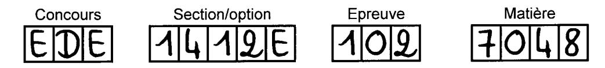

► Concours externe du CAFEP/CAPET de l'enseignement privé :

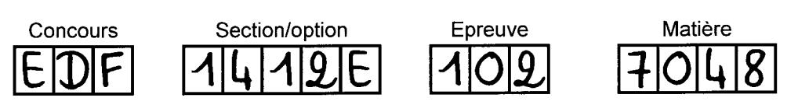

# **SOMMAIRE**

**MISE EN SITUATION** : page 2 

PARTIE A : page 4 à 6

PARTIE B : page 7 à 10

PARTIE C : page 11 à 13

PARTIE D : page 14 à 15

**DOSSIER TECHNIQUE** : pages 16 à 26

# **MISE EN SITUATION**

Le sujet se base sur l'étude d'un voilier, présenté sur la figure 1, utilisé par une famille de 3 personnes. Leur objectif est de préparer leur première navigation en autonomie, sur un simple trajet de Marseille à Gibraltar (voir figure 2), fait en 13 jours pendant les vacances d'été.

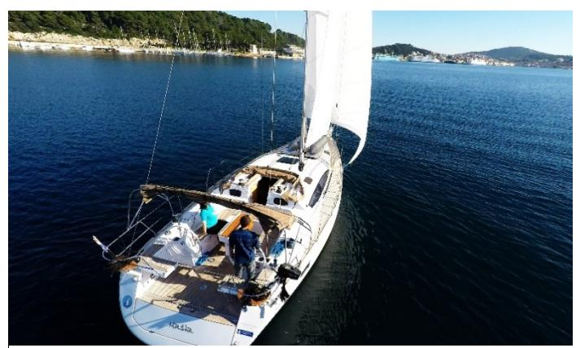

**figure 1 : voilier exemple**

*Source : https://www.yacht-rent.fr*

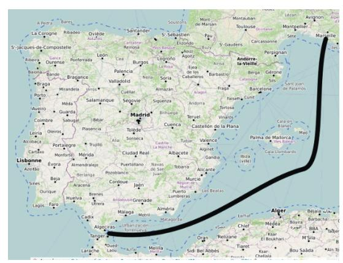

**figure 2 : trajet de Marseille à Gibraltar**

La vie à bord d'un bateau nécessite des équipements permettant une navigation aisée et sécurisée (GPS, radars…), ainsi que des équipements pour la vie à bord : divers appareils domestiques (chauffage, éclairage, appareils électroménager…), accès à l'eau douce et potable. Il faut s'assurer que l'énergie embarquée permet d'alimenter tous ces appareils pendant la durée du trajet.

Ce sujet traite l'étude d'un dessalinisateur d'eau de mer : le DUO 60 AC&DC – 60L/H commercialisé par la société Dessalator. La fonction de ce système est de transformer une eau salée (eau de mer) en eau douce et potable.


**figure 3 : logo de l'entreprise**

Un dessalinisateur alimenté en 12 ou 24 Volts, produisant environ 30 litres d'eau potable par heure, a été conçu dans les années 80. Quelques années plus tard l'entreprise innove en créant un dessalinisateur fonctionnant en bi-alimentation (autonome ou raccordé au réseau) : le DUO.

#### **Composition de l'eau de mer**

L'eau de mer est constituée à 96,5 % d'eau pure, le reste se répartissant entre :

- le « sel marin » le chlorure de sodium NaCl ;
- d'autres éléments chimiques fluor, soufre, potassium, calcium.

La composition de l'eau de mer est toujours la même, seule la quantité de sel dissous varie (tableau de la figure 4).

| Nom               | -1<br>Salinité en g·l | Concentration en sel en mol·m-3 |
|-------------------|-----------------------|---------------------------------|
| Mer Baltique      | 7                     | 100                             |
| Océan Antarctique | 34,7                  | 594                             |
| Océan Pacifique   | 35                    | 600                             |
| Océan Indien      | 36,5                  | 625                             |
| Océan Atlantique  | 36,5                  | 625                             |
| Mer Méditerranée  | 28,5                  | 659                             |
| Mer Rouge         | 39,7                  | 679                             |

**figure 4 : salinité et concentration en sel des mers et océans**

# **Problématiques**

*Problématique générale : comment produire l'eau douce et potable nécessaire à la vie à bord d'un bateau tout en prenant en compte tous les aspects de la sécurité des utilisateurs/navigateurs ?*

Ce sujet comporte 4 parties indépendantes abordant les problématiques suivantes.

Partie A : comment dessaliniser l'eau de mer afin d'obtenir de l'eau douce ?

Partie B : comment vérifier que l'installation d'un dessalinisateur est compatible avec l'énergie embarquée existante ?

Partie C : comment installer le dessalinisateur dans les conditions de sécurité électrique conformes à la réglementation maritime ?

Partie D : comment vérifier la quantité d'eau douce disponible ?

# **PARTIE A : comment dessaliniser l'eau de mer afin d'obtenir de l'eau douce ?**

*Objectifs : analyser le processus de dessalinisation et valider la mesure de salinité vis-àvis des réglementations en vigueur.*

Le procédé de dessalinisation par osmose inverse repose sur le principe d'une séparation sel - eau faisant appel à une membrane semi-perméable. Elle a été mise au point par la NASA pour les besoins en eau douce des astronautes.

L'osmose correspond à un mouvement d'eau qui se fait naturellement à travers une membrane semi perméable, c'est-à-dire laissant passer les molécules d'eau mais pas les molécules de sel.

De l'eau osmosée, dépourvue de sel, est ainsi générée. La pression nécessaire appliquée est appelée pression d'osmose inverse POI (schéma figure 5).

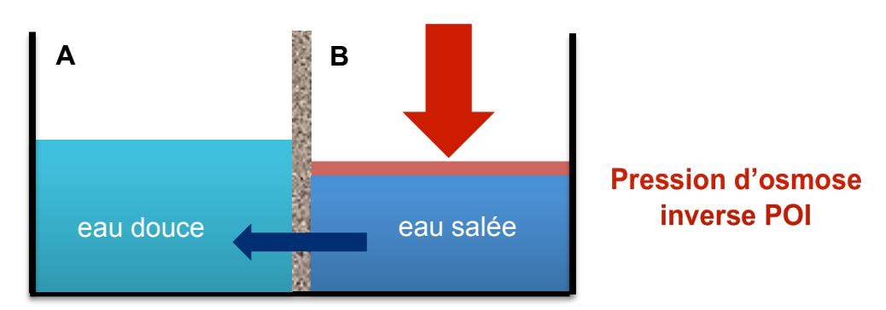

**figure 5 : principe de l'osmose inverse**

L'eau de mer arrive par la vanne d'entrée du passe coque. Elle traverse ensuite le pré-filtre. L'eau de mer, pré-filtrée, est ensuite poussée contre la membrane par la pompe haute pression. L'eau sous pression passe par les orifices de la surface de la membrane, en laissant le sel et les minéraux, qui seront déversés à la mer avec le restant de la solution (schéma figure 6).

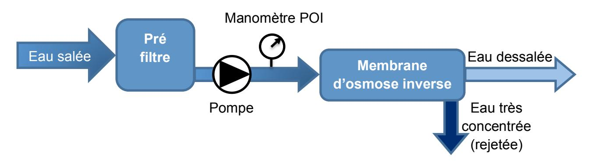

**figure 6 : schéma de principe de l'unité d'osmose inverse**

La pression osmotique inverse notée POI peut être calculée d'après la loi de Van't Hoff comme suit : = 2 ×××

POI : pression osmotique inverse en Pascal

n : nombre d'ions composant la molécule du sel considéré, Na<sup>+</sup> + Cl- = 2

C : concentration en NaCl, en mol·m-3

R : constante des gaz parfaits : R = 8,314 J·mol-1 ·K-1

T : température en °K

# **Question 1.** *Document technique DT1*

*La pompe haute pression choisie délivre une pression comprise entre 6*·*10<sup>6</sup> et 6,5*·*10<sup>6</sup> Pascals. Valider ce choix pour le cas de la navigation retenue, sachant que la pompe doit appliquer la POI sur une eau de température moyenne 23° C pour ce trajet.*

La teneur en sel de l'eau obtenue est mesurée par la sonde de salinité :

- o si l'eau est suffisamment dessalée, la vanne 3 voies est permutée automatiquement afin de diriger l'eau douce vers les réservoirs ;
- o si la sonde de salinité enregistre une teneur en sel trop élevée, la vanne rejettera l'eau produite à la mer.

La sonde de salinité présente dans le système est un conductimètre qui mesure la conductance électrique et affiche la conductivité électrique. La conductance est définie comme étant égale à l'inverse de la résistance, elle se mesure en Siemens (S).

> = × avec G : conductance en S

σ : conductivité en S·m-1

s : surface d'une électrode en m²

d : distance entre les électrodes en m

Typiquement, un conductimètre applique un courant alternatif à deux électrodes actives, puis il mesure la différence de potentiel qui en résulte. La conductance, déterminée à partir du courant et de la différence de potentiel, permet au conductimètre de calculer et afficher la conductivité grâce à la relation :

!"°! <sup>=</sup> × avec <sup>σ</sup> : conductivité en S·m-1

K : constante de cellule en m-1

G : conductance en S

#### **Question 2.** *Document technique DT2*

*Expliquer à quoi correspond la constante de cellule K. Relever la valeur de cette constante pour la sonde utilisée dans le système de dessalinisation.*

**Question 3.** *Exprimer la relation liant la conductivité σ et le courant appliqué à la sonde, soit σ = f(i). Expliquer comment évolue la conductivité en fonction du courant appliqué.*

# **Question 4.** *Document technique DT3 & figure 7*

*Déterminer la valeur de la conductivité σ dans le cas de la navigation considérée et justifier le choix d'une sonde de salinité à 4 pôles platinés.*

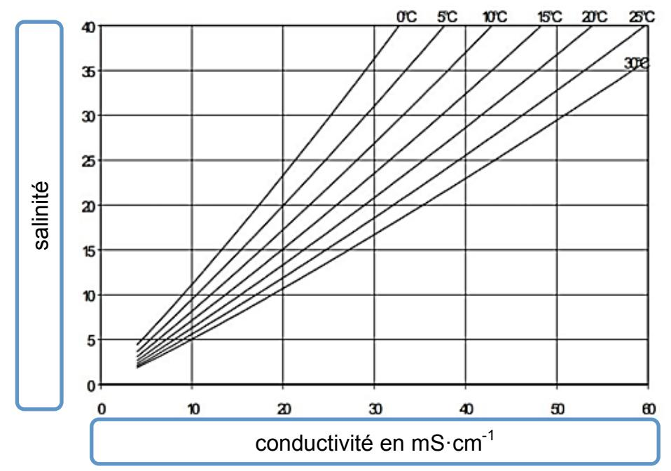

**figure 7 : courbe de salinité en fonction de la conductivité et de la température**

# **Question 5.** *Figure 7*

*Expliquer comment évolue la conductivité en fonction de la salinité et de la température.*

**Question 6.** *Justifier la présence d'une compensation de la température dans ce type de sonde.*

#### **Question 7.** *Documents techniques DT2, DT4 & DT5*

*Si l'eau produite est impropre à la consommation, la vanne devra être actionnée afin de la rejeter. Calculer dans ce cas la valeur de la teneur en sels TDSmax. Donner pour cette valeur, la résolution TDS de la sonde implantée dans le système.*

**Question 8.** *Conclure quant à la capacité du dessalinisateur à produire une eau potable vis-à-vis de la précision de la mesure concernant la teneur en sel.*

# **PARTIE B : comment vérifier que l'installation d'un dessalinisateur est compatible avec l'énergie embarquée existante ?**

*Objectifs : analyser la consommation énergétique de ce système nouvellement intégré aux équipements et valider la chaîne de puissance.*

Maintenant que la qualité de l'eau douce obtenable est validée, on décide d'installer le dessalinisateur pour profiter de navigations en autonomie. Mais il faut vérifier que son utilisation lors de ce type de trajet est compatible avec l'alimentation en énergie de tous les équipements.

Le bateau est équipé d'un panneau photovoltaïque grand public et de deux batteries de servitude (document technique DT6).

**Question 9.** *Calculer la consommation totale journalière des instruments de bord déjà installés en utilisant les données suivantes :*

| Poste                 | Puissance | Durée de fonctionnement |
|-----------------------|-----------|-------------------------|
|                       | (W)       | -1<br>(h·j<br>)         |
| Speedomètre           | 40        | 24                      |
| Radio VHF             | 30        | 1                       |
| Feux de signalisation | 70        | 10                      |

Le panneau photovoltaïque, déjà installé, est un panneau monocristallin Etsolar ET-M53695 dont les caractéristiques électriques sont les suivantes.

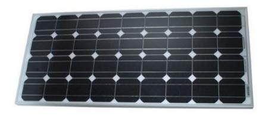

• Puissance crête Wc = 95 W.

• Isc : 5,57 A. • Voc : 22,5 V. • Vmpp : 18,52 V. • Impp : 5,13 A.

**figure 8 : Etsolar ET-M53695**

Isc : courant débité par le panneau lorsque ce dernier est en court-circuit, pour V = 0 V donc en court-circuit (Short Circuit), c'est l'intensité maximale.

Voc : tension aux bornes du panneau lorsque ce dernier est à vide, pour I = 0 A, c'est la tension maximale.

Vmpp : tension présente aux bornes du panneau lorsque ce dernier fournit la puissance maximale.

Impp : courant débité par le panneau lorsque ce dernier fournit la puissance maximale.

La caractéristique I = f(U) typique de ce modèle de panneaux est la suivante :

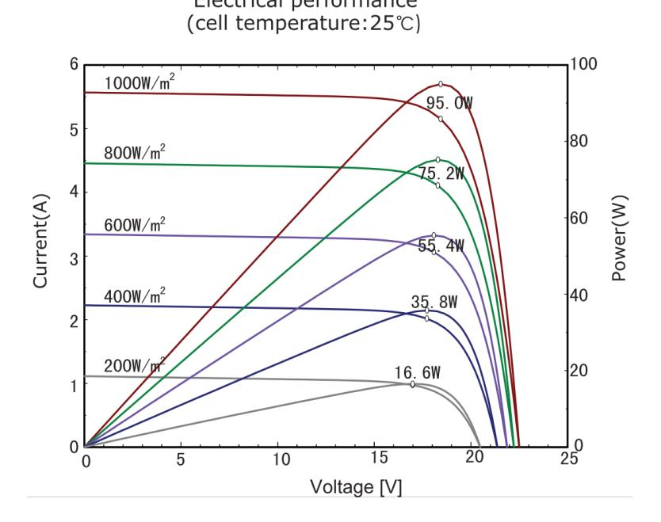

**figure 9 : caractéristique I = f(U)**

L'ensoleillement moyen sur le trajet est celui donné par la figure 10 ci-dessous, calculé à partir des données suivantes :

- lieu Marseille ;
- mois août ;
- inclinaison du panneau 0 degré (cas défavorable) ;
- orientation du panneau 0 degré (cas défavorable) ;
- source système d'information géographique photovoltaïque PVGIS.

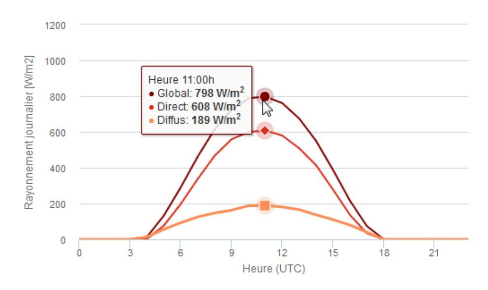

**figure 10 : ensoleillement**

# **Question 10.** *Figures 9 & 10*

*Pour le rayonnement moyen le plus favorable, déterminer la valeur des caractéristiques (*Vmpp*,* Impp*,* Voc*,* Isc*,* puissance maximale*) du panneau photovoltaïque utilisé.*

Les autres caractéristiques de ce panneau sont les suivantes :

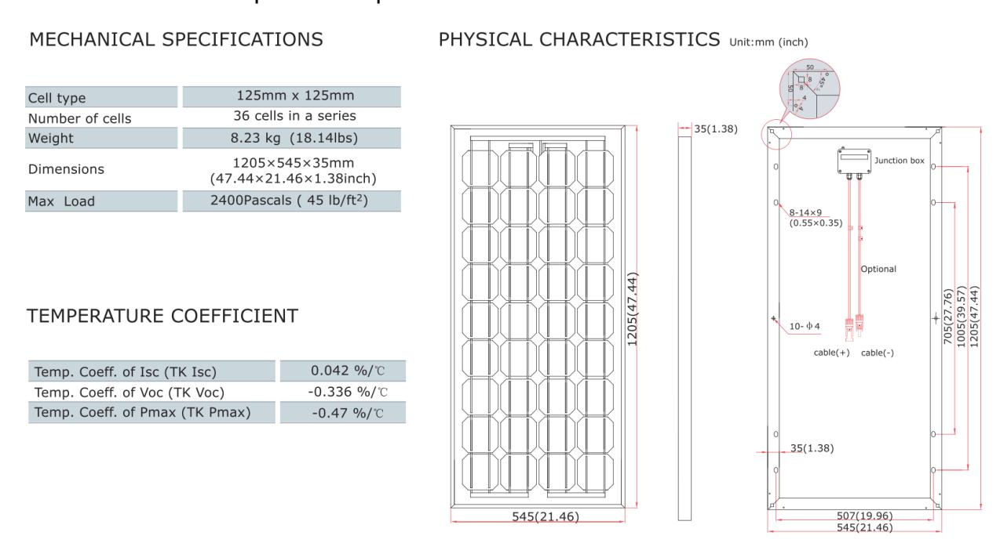

**figure 11 : caractéristiques du panneau**

#### **Question 11.** *Figure 11*

*Calculer le rendement global du panneau en conditions normalisées (1 000 W·m-2 ) puis le rendement des cellules dans notre cas de figure.*

#### **Question 12.** *Document technique DT6*

*Déterminer l'énergie théorique stockée dans la batterie GEL12-130 qui équipe le bateau.*

Sur cette petite installation, l'ensemble des pertes par effet joule dans les fils, dans le régulateur de charge et les batteries représente à peu près 8 % de l'énergie consommée.

**Question 13.** *Détailler la démarche permettant de vérifier que l'installation permet de ne pas excéder 70 % de décharge de la batterie. Critiquer de façon qualitative et quantitative l'installation existante.*

Le bateau n'ayant été utilisé que pour des trajets de jour avec escale au port pour la nuit, prévoir une navigation en autonomie complète, y compris la nuit, nécessite en plus quelques équipements : GPS, pilote automatique et aussi le dessalinisateur. Il faut vérifier que tous ces équipements, une fois installés, ne risquent pas d'engendrer une décharge profonde de la batterie.

**Question 14.** *Calculer la nouvelle consommation globale des appareils embarqués sur le bateau à partir des données suivantes :*

| Poste                 | Puissance (W) | Durée de fonctionnement |
|-----------------------|---------------|-------------------------|
|                       |               | -1<br>(h·j<br>)         |
| GPS                   | 80            | 18                      |
| Pilote automatique    | 40            | 18                      |
| Dessalinisateur       | 432           | 1                       |
| Speedomètre           | 40            | 24                      |
| Radio VHF             | 30            | 1                       |
| Feux de signalisation | 70            | 10                      |

Pour la suite du sujet, on considère l'alimentation à bord du bateau en 12 V DC. Le calcul de la capacité C (exprimée en A·h) du parc de batteries dépend de plusieurs données :

- N, le nombre de jours avec un ensoleillement insuffisant.
- Ec, la demande énergétique journalière exprimée en W·h·j-1 .
- U, la tension sous laquelle est installée le parc de batteries.
- L, la profondeur de décharge maximum des batteries.

$$C = \frac{Ec \times N}{L \times U}$$

**Question 15.** *En s'appuyant sur les données précédentes, conclure sur la possibilité d'avoir une installation permettant une autonomie correspondant à deux jours de consommation sans apport énergétique (cas de météo la plus défavorable) et respectant la profondeur de décharge maximale.*

# **PARTIE C : comment installer le dessalinisateur dans les conditions de sécurité électrique conformes à la réglementation maritime ?**

*Objectif : étudier la réalisation du circuit électrique respectant la réglementation maritime.*

La navigation en autonomie nécessite de modifier l'installation électrique tout en respectant les normes de sécurité stipulées dans la réglementation maritime.

Le dessalinisateur DUO AC&DC fonctionne en bi-alimentation, il dispose :

- d'un moteur à courant continu faisant fonctionner le dessalinisateur avec l'énergie fournie par les batteries ;
- d'un moteur à courant alternatif faisant fonctionner le dessalinisateur avec l'énergie fournie par le secteur, lors de la recharge au port.

Un seul convertisseur permet la mise en marche du moteur soit en 12 V ou 24 V DC, soit en 120 V ou 230 V AC.

**Question 16.** *Justifier en quelques lignes l'intérêt du fonctionnement en bi-alimentation du dessalinisateur.*

La navigation de plaisance répond à la règlementation maritime, ou « Division 240 », qui concerne les embarcations dont la longueur de coque est inférieure ou égale à 24 mètres dont voici deux extraits :

#### *Article 240-2.31*

#### *Caractéristiques générales des installations électriques*

- *II. Toute installation électrique est classée soit dans :*
- *- le domaine 1, lorsqu'elle utilise des tensions égales ou inférieures à 50 volts en alternatif et 120 volts en continu ;*
- *- le domaine 2, lorsqu'elle utilise des tensions supérieures à 50 volts en alternatif.*
- *III. Les installations utilisent les tensions de 12 V, 24 V et 48 V en courant continu, et 230 V monophasé en courant alternatif. Toutefois, les installations de propulsion électrique peuvent utiliser des tensions différentes.*
- *IV. La tolérance de tension continue nominale aux bornes de la batterie pour laquelle tous les matériels à courant continu doivent fonctionner est de –10 % à +20 %. Les tolérances pour les réseaux à tension alternative sont de + ou –5 % en fréquence, et de +6 % à -10 % en tension.*
- *V. Les canalisations sont prévues pour que la chute de tension maximale ne dépasse pas 5 %.*

# *Article 240-2.37*

#### *Réalisation des circuits*

*I. L'appareillage électrique du bord est réalisé de manière à atteindre un indice de protection exprimé conformément aux normes CEI 60529, en fonction des risques afférents à l'emplacement concerné. À l'extérieur, les appareillages atteignent au moins l'indice de protection IP56. Dans les locaux de machines ainsi que les emplacements fermés soumis à l'humidité, les appareillages atteignent au moins l'indice de protection IP55. Dans les autres emplacements, l'indice de protection atteint au minimum IP21.*

Lors de l'achat du dessalinisateur, l'entreprise fournit l'appareillage de protection et donne une indication sur la section des câbles à mettre en œuvre dans le but de répondre aux exigences de la réglementation imposée. Toutes les caractéristiques de ces éléments se trouvent dans le document technique DT1.

Pour la suite du sujet, on considère l'alimentation à bord du bateau en 12 V DC et au port en 230 V AC.

# **Question 17.** *Document technique DT7 & extrait de la « Division 240 »*

*Justifier le choix de la gamme de disjoncteur Schneider iC60 vis-à-vis du critère énoncé dans l'article 240-2.37.*

#### **Question 18.** *Documents techniques DT1 & DT7*

*Choisir en justifiant l'appareillage de protection du bloc moteur à courant continu.*

#### **Question 19.** *Figure 12*

*Justifier le choix du disjoncteur du bloc moteur pompe alternatif, sachant que lors du démarrage du bloc moteur l'intensité absorbée est égale à 3* × *In.* 

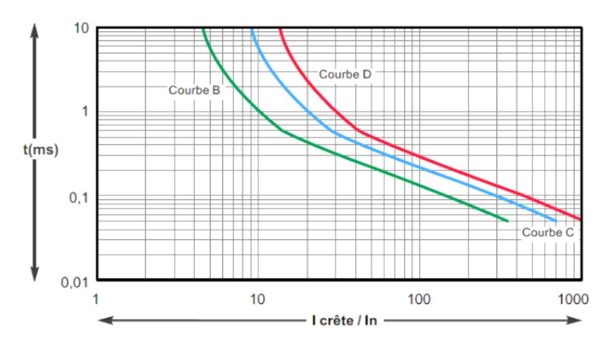

**figure 12 : t = f(I) du disjoncteur**

**Page 12 sur 26**

Lors de l'installation du dessalinisateur à bord du voilier, un câble d'une longueur de 15 m est installé pour l'alimentation du bloc moteur en 12 V DC et un câble de 6 m pour l'alimentation du bloc moteur en 230 V AC. L'âme des conducteurs est en cuivre souple de classe 2. On souhaite valider la valeur de la chute de tension vis-à-vis de la réglementation.

Résistivité du cuivre : ρ = 22,5 Ω·mm²·km-1

§ Chute de tension en monophasé :

$$\Delta U = 2 \times I_B \times \left(\frac{\rho}{s} \times \cos\varphi + X \times \sin\varphi\right) \times L$$

- ü La réactance linéique X peut être négligée pour les câbles de section inférieure à 50 mm². Dans les autres cas = 0,08 Ω ∙ !!.
- § Chute de tension en continu :

$$\Delta U = \rho \times \frac{L}{s} \times I$$

ü L : longueur du conducteur, exprimée en mètres.

- **Question 20.** *Calculer en % la chute de tension obtenue dans les deux câbles d'alimentation DC et AC.*
- **Question 21.** *Conclure sur la conformité du choix des câbles à installer par l'utilisateur vis-à-vis de la réglementation « Division 240 ».*

# **PARTIE D : comment vérifier la quantité d'eau douce disponible ?**

*Objectif : générer une alerte lorsque le niveau minimum d'eau douce est atteint.*

Pour une navigation, les besoins journaliers par personne sont estimés entre 10 et 15 litres d'eau. Cela comprend les besoins suivants : boisson, cuisine, vaisselle, toilette légère, douche, nettoyage du linge, lavage du bateau.

Rappel : la masse volumique moyenne de l'eau de mer à la surface est ρ = 1 025 kg·m-3 .

#### **Question 22.** *Document technique DT1*

*Calculer le volume d'eau douce nécessaire pour la traversée prévue de Marseille à Gibraltar, avec 3 personnes à bord, et justifier l'intérêt du dessalinisateur plutôt que des réserves d'eau douce.*

Le réservoir d'eau douce doit permettre d'assurer une autonomie en eau de 2 jours pour 3 personnes, y compris en cas de défaillance du système de dessalinisation. Ce temps est estimé suffisant pour rejoindre les côtes.

Le réservoir choisi est le CAN-SB, réservoir avec cloison interne freinant les mouvements de l'eau, différentes contenances existent.

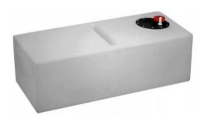

| Capacité | Longueur  | Largeur   | Hauteur      |
|----------|-----------|-----------|--------------|
| 100<br>l | 910<br>mm | 410<br>mm | 300 + 30* mm |

*<sup>\*</sup> : hauteur du réservoir + embout de connexion*

**figure 13 : réservoir choisi**

On souhaite vérifier le niveau d'eau douce dans le réservoir : il va falloir équiper celui-ci de capteurs afin de fournir l'indication de niveau à l'utilisateur.

L'utilisateur ne désire pas introduire de plongeur dans le réservoir d'eau douce, il s'oriente vers des technologies sans contact.

#### **Question 23.** *Document technique DT8*

*Déterminer le capteur le plus adapté pour mesurer la hauteur d'eau douce. Justifier pourquoi les autres capteurs ne conviennent pas.*

Le microcontrôleur commande la marche du dessalinisateur en tout ou rien via une interface si le niveau d'eau douce est inférieur à 20 % du réservoir. Le microcontrôleur choisi est celui d'une carte Arduino Nano.

Ce système n'ayant pas besoin de fonctionner en permanence, il n'est activé qu'une fois par heure.

#### **Question 24.** *Document technique DT9*

*Rédiger l'algorithme correspondant aux contraintes suivantes :*

- *le code correspondant à la mesure de niveau doit être déplacé dans une fonction nommée 'level\_sense' ;*
- *cette fonction de mesure ne doit être lancée que toutes les 60 mn mais effectue 5 relevés en 2 mn pour être significative ;*
- *le relevé appelle, pour l'utilisation du capteur, une fonction propre à sa bibliothèque nommée 'volToPercent' et qui renvoie directement le pourcentage de volume de liquide comme un entier ;*
- *la fonction 'level\_sense' doit ensuite renvoyer la valeur moyenne mesurée pendant les 5 relevés ;*
- *le microcontrôleur doit activer sur le panneau 3 DEL correspondant au niveau d'eau :*
  - o *supérieur à 65 % : DEL verte,*
  - o *supérieur à 35 % : DEL orange,*
  - o *inférieur à 35 % : DEL rouge,*
- *si la valeur renvoyée passe sous le seuil critique de 20 % alors il faut activer un relais de commande de l'électrovanne fixée sur le préfiltre jusqu'à dépasser les 65 %.*

# **Question 25.** *Documents techniques DT9 & DT10*

*Rédiger le code en C 'Arduino' correspondant à l'algorithme précédent, en prenant soin de faire apparaître les points suivants : indentation, commentaires, utilisation de variables, brochage en définition de variable, etc.*

# **DOSSIER TECHNIQUE**

DT1 : schéma d'implantation et caractéristiques du dessalinisateur DUO 60 AC&DC

DT2 : caractéristiques de la sonde de salinité modèle

DT3 : choix des cellules de conductivité

DT4 : réglementation sur la qualité de l'eau potable

DT5 : mesure de TDS - Total Dissolved Solids

DT6 : batterie – extrait de catalogue

DT7 : extrait du catalogue Schneider Electric

DT8 : technologie de détecteurs de proximité

DT9 : équivalences algorithmiques/langage C

DT10 : syntaxe en langage C

# **Document Technique 1 : schéma d'implantation et caractéristiques du dessalinisateur DUO 60 AC&DC**

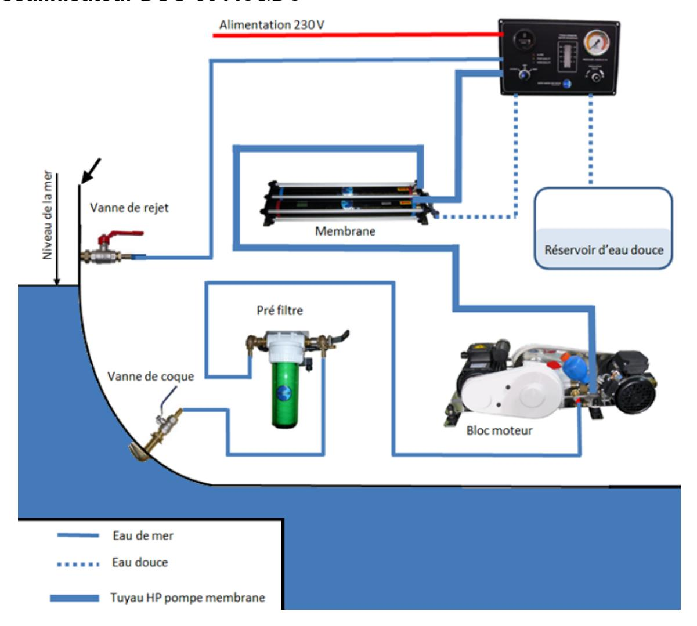

# **Éléments du dessalinisateur :**

- Cuve de pré filtration avec électrovanne de rinçage.
- Bloc moteurs pompe haute pression :
  - o 750 W (*η* = 0,86 et *cos φ* = 0,8) : 120 ou 230 V AC.
  - o 370 W (*η* = 0,86) : 12 V ou 24 V DC.
- Bloc membranes dimensions : L 70 cm x l 19 cm x H 12 cm.
- Boîtier électrique avec carte électronique, fixé sur la façade.
- Manomètre haute pression fixé sur la façade.
- Débitmètre médical gradué fixé sur la façade.
- Capteur de pression.
- Sonde d'analyse de salinité.

#### **Câblage et consommation :**

- Utilisation en 24 V DC : 370 W Section de câble : 16 mm².
- Utilisation en 230 V AC : 750 W Disjoncteur D6A Section de câble : 1,5 mm².

**Pression de travail de la pompe :** entre 60 et 65 bars.

**Masse** : 50 kg. **Débit** : 60 l·h-1 .

# **Document Technique 2 : caractéristiques de la sonde de salinité**

| Caractéristiques           | Détails<br>du modèle CDC40101                                                                                                                                                                                                       |
|----------------------------|-------------------------------------------------------------------------------------------------------------------------------------------------------------------------------------------------------------------------------------|
| Type de sonde              | Sonde de conductivité à 4 pôles platinés                                                                                                                                                                                            |
| Plage de conductivité      | µS·cm-1 à 200<br>mS·cm-1<br>0,01                                                                                                                                                                                                    |
| Constante de la cellule    | cm-1<br>0,40                                                                                                                                                                                                                        |
| Résolution de conductivité | µS·cm-1 :<br>µS·cm-1<br>0,0 à 19,99<br>0,01<br>µS·cm-1 :<br>µS·cm-1<br>20,0 à 199,9<br>0,1<br>µS·cm-1 :<br>µS·cm-1<br>200 à 1999<br>1<br>mS·cm-1 :<br>mS·cm-1<br>2,0 à 19,99<br>0,01<br>mS·cm-1 :<br>mS·cm-1<br>20,0 à 200,0<br>0,1 |
| Précision de conductivité  | ±<br>0,5<br>% de la mesure                                                                                                                                                                                                          |
| Gamme TDS                  | -1 en NaCl<br>0 à 50<br>000<br>mg·l                                                                                                                                                                                                 |
| Résolution TDS             | -1 :<br>-1<br>0,0 à 19,99<br>mg·l<br>0,01<br>mg·l<br>-1 :<br>-1<br>200 à 1999<br>mg·l<br>1<br>mg·l<br>-1 :<br>-1<br>2,0 à 19,99<br>g·l<br>0,01<br>g·l<br>-1 :<br>-1<br>20,0 à 200,0<br>g·l<br>0,1<br>g·l                            |
| Précision TDS              | +/-<br>0,5<br>% de la mesure                                                                                                                                                                                                        |

| Options                      | Description                                                                                                                                                                                                                         |
|------------------------------|-------------------------------------------------------------------------------------------------------------------------------------------------------------------------------------------------------------------------------------|
| Correction de                | Détermine la correction de température<br>:<br>Aucune, Linéaire, NaCl non                                                                                                                                                           |
| température                  | linéaire (par défaut) ou Eau naturelle.                                                                                                                                                                                             |
| Facteur de<br>correction     | Lorsque la correction de température est définie sur Linéaire, cette<br>option<br>définit<br>un<br>facteur<br>de<br>correction<br>basé<br>sur<br>le<br>type<br>d'échantillon<br>:<br>% par °C<br>(par défaut<br>:<br>1,90% par °C). |
| Température de<br>référence  | Lorsque le paramètre est défini sur Conductivité, TDS ou Résistivité,<br>cette option définit la température de référence pour la correction de<br>température<br>:<br>20°C ou 25°C (par défaut).                                   |
| Facteur<br>correction<br>TDS | Lorsque le paramètre est défini sur TDS, cette option définit le facteur<br>de conversion<br>de la conductivité sur le total de solides dissous<br>(TDS)<br>:<br>facteur 0,5.                                                       |

# **Document Technique 3 : choix des cellules de conductivité**

# **Les cellules et la gamme de mesure**

Le nombre de pôles et le fait qu'ils soient platinés ou non ont une influence sur la mesure. La gamme de mesure dans laquelle la cellule reste linéaire est d'autant plus étendue que le nombre de pôles est grand. Platiner les pôles contribue également à augmenter la gamme de mesure dans laquelle la cellule est linéaire.

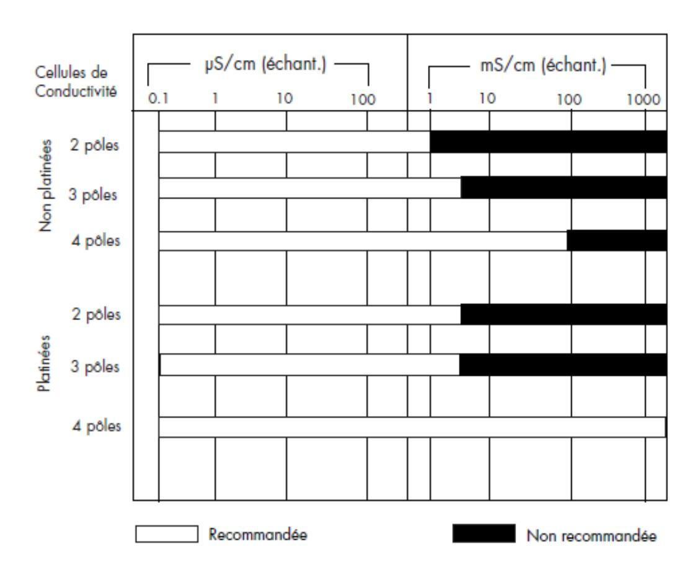

#### **Cellules platinées**

Afin de réduire les effets de polarisation, qui entraînent une erreur sur la mesure, on peut déposer sur les pôles une couche de noir de platine. Ceci va augmenter la surface de l'électrode, la densité de courant va donc être plus petite, ce qui va diminuer l'effet de polarisation. L'utilisation de cellules platinées est recommandée dans des échantillons non visqueux et sans particules en suspension.

# **Document Technique 4 : réglementation sur la qualité de l'eau potable**

L'eau potable est encadrée par une réglementation européenne, le Code de la Santé publique. La qualité de l'eau potable est encadrée par la Directive européenne 98/83 du 3 novembre 1998 et le décret 2001-1220, qui fixe les limites et références de qualité pour l'eau potable.

En particulier, en France, les normes applicables sont définies dans l'arrêté du 11 janvier 2007 relatif aux limites et références de qualité des eaux brutes et des eaux destinées à la consommation humaine.

Extrait du paragraphe B de l'Arrêté du 11 janvier 2007 du code de la santé publique :

| PARAMÈTRES                                                                               | RÉFÉRENCES DE QUALITÉ                      | UNITÉS                               | NOTES                                                                                                                                                           |
|------------------------------------------------------------------------------------------|--------------------------------------------|--------------------------------------|-----------------------------------------------------------------------------------------------------------------------------------------------------------------|
| Aluminium total.                                                                         | 200                                        | μg/L                                 | A l'exception des eaux ayant subi un traitement thermique pour la production d'eau chaude pour lesquelles la valeur de 500 μg/L (Al) ne doit pas être dépassée. |
| Ammonium (NH,+).                                                                         | 0,10                                       | mg/L                                 | S'il est démontré que l'ammonium a une origine naturelle, la valeur à respecter est de 0,50 mg/L pour les eaux souterraines.                                    |
| Carbone organique total (COT).                                                           | 2,0<br>et<br>aucun changement anormal      | mg/L                                 |                                                                                                                                                                 |
| Oxydabilité au permanganate de<br>potassium mesurée après<br>10 minutes en milieu acide. | 5,0                                        | mg/L O₂                              |                                                                                                                                                                 |
| Chlore libre et total.                                                                   |                                            |                                      | Absence d'odeur ou de saveur désagréable et pas de changement anormal.                                                                                          |
| Chlorites.                                                                               | 0,20                                       | mg/L                                 | Sans compromettre la désinfection, la valeur la plus faible possible doit être visée.                                                                           |
| Chlorures.                                                                               | 250                                        | mg/L                                 | Les eaux ne doivent pas être corrosives.                                                                                                                        |
| Conductivité.                                                                            | ≥ 180 et ≤ 1 000<br>ou<br>≥ 200 et ≤ 1 100 | µS/cm<br>à 20 °C<br>µS/cm<br>à 25 °C | Les eaux ne doivent pas être corrosives.                                                                                                                        |

Il en résulte qu'une eau dont la concentration en sel (σ) est supérieure à 410 mg·l -1 est impropre à la consommation quotidienne.

Information concernant les unités : 1,4 µS·cm-1 = 1 mg·l -1

# **Document Technique 5 : mesure de TDS - Total Dissolved Solids**

La mesure de TDS permet de connaître la quantité totale de matières organiques et inorganiques dissoutes dans l'eau c'est-à-dire la quantité de particules autre que l'eau (H2O). Le TDS correspond à la masse de la totalité des cations, anions et toutes autres espèces non dissociées présentes dans un litre de solution aqueuse. Celle-ci s'exprime en PPM (particules par millions) ou en mg·l -1 .

Il existe deux méthodes de mesure.

- La méthode normalisée pour déterminer le TDS consiste à faire évaporer une quantité connue d'un échantillon d'eau en le chauffant à 180 °C. Il suffit ensuite de peser le résidu de solides obtenu. L'exactitude de la méthode normalisée dépend de la nature des espèces dissoutes.
- La méthode TDS intégrée dans les conductimètres offre un moyen facile et rapide de déterminer le TDS en se basant sur une mesure de conductivité et en utilisant un facteur de conversion pour exprimer le résultat TDS.
  - Il y a une corrélation directe entre la quantité de solides dissous et la conductivité d'une solution.

Elle suit la formule :

$$TDS = K_e \times \sigma$$

avec TDS en mg·l -1

σ : concentration en sel en µS·cm-1

Ke : facteur de conversion dont la valeur est fonction de la sonde de salinité utilisée, se référer aux caractéristiques techniques de celle-ci.

# Document Technique 6 : batterie - extrait de catalogue

# BATTERIES ÉTANCHES À DÉCHARGE LENTE GEL


#### **Points Forts**

- Batterie service idéale
- Longue durée de vie
- Résistance aux cyclages intensifs
- Bornes cuivre M8
- Très faible auto-décharge
- Sans entretien ni émission de gaz
- Les batteries ont une importance essentielle dans toute installation d'énergie autonome, que ce soit dans un véhicule, à bord d'un bateau ou pour un site isolé.

Souvent négligées lors de la détermination des éléments composant un système, elles forment pourtant le réservoir d'énergie indispensable au bon fonctionnement de celui-ci.

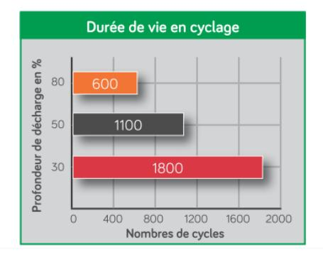

| Elles sont étanches et ne nécessitent aucun entret |
|----------------------------------------------------|

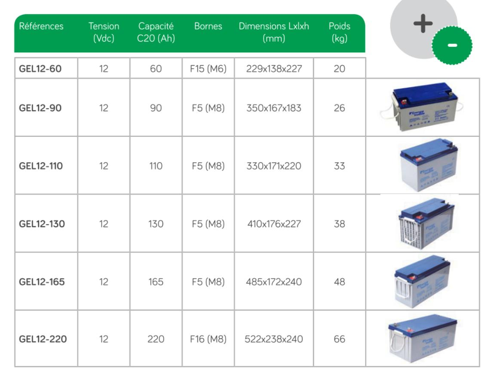

# **Document Technique 7 : extrait du catalogue Schneider Electric**

Disjoncteur iC60 : les disjoncteurs iC60 sont aptes à fonctionner dans des ambiances humides et/ou polluées par des agents agressifs (piscines, ports de plaisance, industries agroalimentaire, station de traitement de l'eau, etc.).

| Caractéristiques                            | principales                    |                                                 |  |
|---------------------------------------------|--------------------------------|-------------------------------------------------|--|
| Selon CEI/EN 60947                          | 7-2                            |                                                 |  |
| Tension d'isolement (                       | Ui)                            | 500 V CA                                        |  |
| Degré de pollution                          |                                | 3                                               |  |
| Tension assignée de                         | tenue aux chocs (Uimp)         | 6 kV                                            |  |
| Déclenchement                               | Température de référence       | 50 °C                                           |  |
| thermique                                   | Déclassement en<br>température | Voir guide technique 32VP231F                   |  |
| Déclenchement<br>magnétique                 | Courbe B                       | 4 In ± 20 %                                     |  |
|                                             | Courbe C                       | 8 ln ± 20 %                                     |  |
|                                             | Courbe D                       | 12 ln ± 20 %                                    |  |
| Catégorie d'utilisatior                     | 1                              | A                                               |  |
| Selon CEI/EN 60898                          | 8-1                            |                                                 |  |
| Classe de limitation                        |                                | 3                                               |  |
| Pouvoir de coupure e<br>un seul pôle (lcn1) | t de fermeture assigné sur     | lcn1 = lcn                                      |  |
| Caractéristiques                            | complémentaires                |                                                 |  |
| Degré de protection<br>(CEI 60529)          | Appareil seul                  | IP20                                            |  |
|                                             | Appareil en coffret modulaire  | IP40<br>Classe d'isolement II                   |  |
| Endurance (O-F)                             | Electrique                     | 10000 cycles                                    |  |
|                                             | Mécanique                      | 20000 cycles                                    |  |
| Catégorie de surtens                        | ion (CEI 60364)                | IV                                              |  |
| Température de fonct                        | tionnement                     | -35 °C à +70 °C                                 |  |
| Température de stock                        | kage                           | -40 °C à +85 °C                                 |  |
| Tropicalisation (CEI 6                      | 60068-1)                       | Exécution 2 (humidité relative de 95 % à 55 °C) |  |
|                                             |                                |                                                 |  |

| Disjoncteur iC      |                  | 40                                                                  |          |          | 0.0                                                                 |          |  |
|---------------------|------------------|---------------------------------------------------------------------|----------|----------|---------------------------------------------------------------------|----------|--|
| Туре                | 1P               | 1P                                                                  |          |          | 2P                                                                  |          |  |
|                     | *                |                                                                     |          |          | * *                                                                 |          |  |
| Auxiliaires         |                  | Signalisation et déclenchement à distance,<br>voir pages 138 et 139 |          |          | Signalisation et déclenchement à distance,<br>voir pages 138 et 139 |          |  |
| Vigi iC60           | Bloc différentie | Bloc différentiel Vigi iC60, voir pages 80 et 94                    |          |          | Bloc différentiel Vigi iC60, voir pages 80 et 94                    |          |  |
| Calibre (In)        | Courbe           | Courbe                                                              |          | Courbe   | Courbe                                                              |          |  |
|                     | В                | c                                                                   | D (1)    | В        | С                                                                   | D (1)    |  |
| 0,5 A (1)           | A9F73170         | A9F74170                                                            | A9F75170 | A9F73270 | A9F74270                                                            | A9F75270 |  |
| 1 A <sup>(1)</sup>  | A9F73101         | A9F74101                                                            | A9F75101 | A9F73201 | A9F74201                                                            | A9F75201 |  |
| 2 A <sup>(1)</sup>  | A9F73102         | A9F74102                                                            | A9F75102 | A9F73202 | A9F74202                                                            | A9F75202 |  |
| 3 A (1)             | A9F73103         | A9F74103                                                            | A9F75103 | A9F73203 | A9F74203                                                            | A9F75203 |  |
| 4 A (1)             | A9F73104         | A9F74104                                                            | A9F75104 | A9F73204 | A9F74204                                                            | A9F75204 |  |
| 6 A                 | A9F78106         | A9F79106                                                            | A9F75106 | A9F78206 | A9F79206                                                            | A9F75206 |  |
| 10 A                | A9F78110         | A9F79110                                                            | A9F75110 | A9F78210 | A9F79210                                                            | A9F75210 |  |
| 13 A <sup>(1)</sup> | A9F73113         | A9F74113                                                            | A9F75113 | A9F73213 | A9F74213                                                            | A9F75213 |  |
| 16 A                | A9F78116         | A9F79116                                                            | A9F75116 | A9F78216 | A9F79216                                                            | A9F75216 |  |
| 20 A                | A9F78120         | A9F79120                                                            | A9F75120 | A9F78220 | A9F79220                                                            | A9F75220 |  |
| 25 A                | A9F78125         | A9F79125                                                            | A9F75125 | A9F73225 | A9F79225                                                            | A9F75225 |  |
| 32 A                | A9F78132         | A9F79132                                                            | A9F75132 | A9F78232 | A9F79232                                                            | A9F75232 |  |
| 40 A                | A9F78140         | A9F79140                                                            | A9F75140 | A9F78240 | A9F79240                                                            | A9F75240 |  |
| 50 A                | A9F78150         | A9F79150                                                            | A9F75150 | A9F78250 | A9F79250                                                            | A9F75250 |  |
| 63 A                | A9F78163         | A9F79163                                                            | A9F75163 | A9F78263 | A9F79263                                                            | A9F75263 |  |
|                     |                  | •                                                                   |          | -        |                                                                     | •        |  |

# **Document Technique 8 : technologies de détecteurs de proximité**

|             | Inductif                                                                                                                                                                                                                                                        | Optique                                                                                                                                                                                                                                    | Magnétique                                                                                                                                                                                                                                                                                       | Capacitif                                                                                                                                                                                                                                                                             | Ultrasons                                                                                                                                                                                                                                       |
|-------------|-----------------------------------------------------------------------------------------------------------------------------------------------------------------------------------------------------------------------------------------------------------------|--------------------------------------------------------------------------------------------------------------------------------------------------------------------------------------------------------------------------------------------|--------------------------------------------------------------------------------------------------------------------------------------------------------------------------------------------------------------------------------------------------------------------------------------------------|---------------------------------------------------------------------------------------------------------------------------------------------------------------------------------------------------------------------------------------------------------------------------------------|-------------------------------------------------------------------------------------------------------------------------------------------------------------------------------------------------------------------------------------------------|
| Type        |                                                                                                                                                                                                                                                                 |                                                                                                                                                                                                                                            |                                                                                                                                                                                                                                                                                                  |                                                                                                                                                                                                                                                                                       |                                                                                                                                                                                                                                                 |
| Principe    |                                                                                                                                                                                                                                                                 |                                                                                                                                                                                                                                            |                                                                                                                                                                                                                                                                                                  |                                                                                                                                                                                                                                                                                       |                                                                                                                                                                                                                                                 |
| Avantages   | • Faible coût<br>(30-200 €)<br>• Robustesse<br>(détecteur<br>insensible aux<br>vibrations, aux<br>chocs, à la<br>poussière, aux<br>huiles de coupe,<br>etc.)<br>• Cadences<br>élevées<br>(plusieurs kHz)<br>• Pas d'usure<br>• Très répandu<br>dans l'industrie | • Coût moyen<br>(60-300 €)<br>• Grande portée<br>(1 m)<br>• Cadences<br>élevées<br>• Insensible aux<br>vibrations et pas<br>d'usure<br>• Détecte tout type<br>de pièce ayant un<br>pouvoir<br>réfléchissant<br>(mode réflexion<br>directe) | • Faible coût<br>(20-120 €)<br>• Portées plus<br>grandes par rapport<br>aux capteurs<br>inductifs de même<br>taille<br>• Détection à travers<br>des parois en métal<br>non ferreux<br>• Réagit au pôle<br>nord et au pôle sud<br>• Insensible aux<br>vibrations et<br>salissures, pas<br>d'usure | • Coût moyen<br>(100-200 €)<br>• « Voit » à<br>travers des<br>parois en<br>matériaux non<br>métalliques<br>• Détecte tout<br>matériau (métal,<br>plastique, bois,<br>liquide)<br>• Cadences<br>élevées<br>• Sensibilité<br>réglable<br>• Insensible aux<br>vibrations, pas<br>d'usure | • Grande portée<br>(15 m)<br>• Détecte sans<br>contact tout objet<br>quel que soit le<br>matériau (métal,<br>plastique, bois),<br>la nature (solide,<br>liquide), la<br>couleur et le<br>degré de<br>transparence<br>• Sensibilité<br>ajustable |
| Limitations | • Portée faible<br>(< 80 mm)<br>• Ne détecte que<br>les pièces<br>métalliques<br>• Portée variable<br>en fonction de la<br>nature de l'alliage                                                                                                                  | • Supporte mal<br>les<br>environnements<br>difficiles (sensible<br>aux salissures et<br>aux projections<br>d'huile)<br>• Sensible à<br>l'aspect des<br>pièces (matériau,<br>état de surface,<br>couleur, brillance,<br>incidence)          | • Portée faible<br>(< 100 mm)<br>• Nécessite<br>l'utilisation d'un<br>aimant<br>• Sensible aux<br>perturbations<br>électromagnétiques                                                                                                                                                            | • Portée faible<br>(< 60 mm)<br>• Sensible à<br>l'humidité et aux<br>vapeurs denses                                                                                                                                                                                                   | • Coût élevé (200-<br>1 000 €)<br>• Sensible aux<br>courants d'air<br>• Sensible à la<br>température des<br>pièces (de –10 à<br>50 °C)<br>• Ne détecte pas<br>les absorbants<br>phoniques (ouate,<br>mousse)                                    |

*Source : revue Technologie n°189, extrait.*

# **Document Technique 9 : équivalences algorithmiques/langage C**

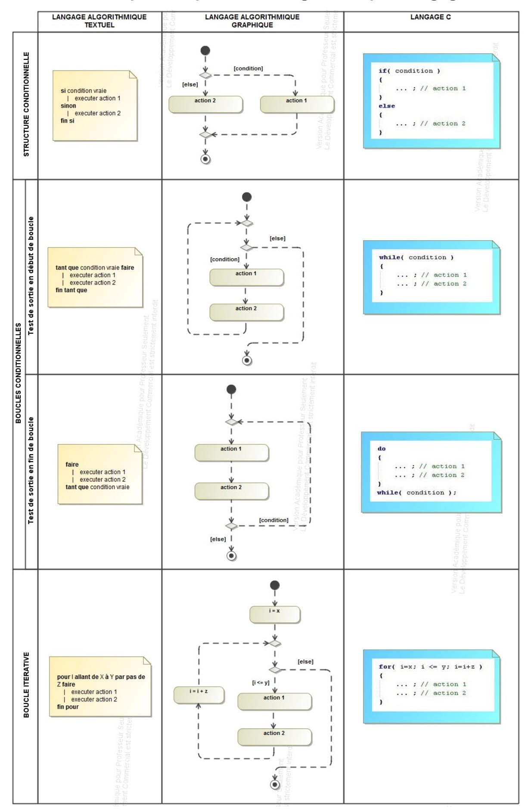

**Page 25 sur 26**

# **Document Technique 10 : syntaxe en langage C**

• **Commentaires** : après **//** sur une ligne ou entre **/\*** et **\*/** sur plusieurs lignes.

```
// Commentaire sur une ligne
/* commentaire sur
 plusieurs lignes */
```

• **Instruction** : chaque instruction (ou ligne de programme) se termine par un « **;** »

```
var = 12 ;
lcd.print(var) ;
```

- **Opérateur d'affectation** : signe égal « **= »**
- **Opérateurs arithmétiques** : +, -, \*, /, % (appelé modulo et valant le reste de la division entière des 2 opérandes).

Les règles de priorité sont :

- o 1 : parenthèses ; o 2 : \*, /, % ;
- o 3 : +, -.
- **Opérateurs de comparaison** :
  - o égal : **==**
  - o supérieur : **>**
  - o supérieur ou égal : **>=**
  - o inférieur : **<**
  - o inférieur ou égal : **<=**
  - o différent : **!=**
- **Opérateurs logiques** :
  - o ET : **&&** o OU : **||**
  - o NON : **!**

```
c = 3 ;
b = 5 / (2 + c) ;
a = 11 % 5 ; // 11 / 5 = 2 et reste 1 donc a = 1
```

```
if((a >= 0) && (a < 10))
{
         //a est un chiffre…
}
if ( !go)
{
         //actions exécutées si 'go' est faux…
}
```