**EDE STI 1** 


## **SESSION 2021**

\_\_\_\_

# CAPET CONCOURS EXTERNE TROISIEME CONCOURS ET CAFEP CORRESPONDANT

**Section : SCIENCES INDUSTRIELLES DE L'INGÉNIEUR Option : INGÉNIERIE DES CONSTRUCTIONS**

**Option : INGÉNIERIE ÉLECTRIQUE Option : INGÉNIERIE INFORMATIQUE Option : INGÉNIERIE MÉCANIQUE**

## **ANALYSE ET EXPLOITATION PÉDAGOGIQUE D'UN SYSTÈME PLURITECHNIQUE**

Durée : 5 heures

\_\_\_\_

*Calculatrice électronique de poche - y compris calculatrice programmable, alphanumérique ou à écran graphique – à fonctionnement autonome, non imprimante, autorisée conformément à la circulaire n° 99-186 du 16 novembre 1999.*

*L'usage de tout ouvrage de référence, de tout dictionnaire et de tout autre matériel électronique est rigoureusement interdit.*

*Si vous repérez ce qui vous semble être une erreur d'énoncé, vous devez le signaler très lisiblement sur votre copie, en proposer la correction et poursuivre l'épreuve en conséquence. De même, si cela vous conduit à formuler une ou plusieurs hypothèses, vous devez la (ou les) mentionner explicitement.*

**NB : Conformément au principe d'anonymat, votre copie ne doit comporter aucun signe distinctif, tel que nom, signature, origine, etc. Si le travail qui vous est demandé consiste notamment en la rédaction d'un projet ou d'une note, vous devrez impérativement vous abstenir de la signer ou de l'identifier.**

## **INFORMATION AUX CANDIDATS**

Vous trouverez ci-après les codes nécessaires vous permettant de compléter les rubriques figurant en en-tête de votre copie. Ces codes doivent être reportés sur chacune des copies que vous remettrez.

Concours externe du CAPET de l'enseignement public :

| • option : Ingénierie                    | des constructions                  |                           |                 |
|------------------------------------------|------------------------------------|---------------------------|-----------------|
| Concours EDE  option: Ingénierie         | Section/option 1411E  électrique   | Epreuve 101               | Matière 7809    |
| Concours EDE  option: Ingénierie         | Section/option 1419E\ninformatique | Epreuve 101               | Matière 7809    |
| Concours EDE  option: Ingénierie         | Section/option 1413E               | Epreuve 101               | Matière 7809    |
| Concours  EDE  Concours externe du CAF   | Section/option                     | Epreuve 101               | Matière 7809    |
| • option : Ingénierie                    | •                                  |                           |                 |
| Concours EDF  option: Ingenierie         | Section/option                     | Epreuve 101               | Matière 7809    |
| Concours EDF  option: Ingénieri          | Section/option                     | Epreuve 101               | Matière 7809    |
| Concours EDF  option:Ingénier            | Section/option                     | Epreuve 101               | Matière 7809    |
| Concours  EDF  Troisième concours extern | Section/option                     | Epreuve 101 ment public : | Matière 7/8/0/9 |
| • option : Ingénierie                    | <del>-</del>                       | <del></del>               |                 |
| Concours EDV  option: Ingénierie         | Section/option  ALATE              | Epreuve 101               | Matière 7809    |
| Concours EDV  option: Ingénierie         | Section/option                     | Epreuve 101               | Matière 7809    |
| Concours                                 | Section/option                     | Epreuve 101               | Matière 7809    |
| • option : Ingénierie<br>Concours<br>EDV | Section/option  1414E              | Epreuve 101               | Matière 7809    |

## Ce sujet se décompose en trois documents :

- présentation et questionnement (page 1 à 23) ;
- documents annexes (page 24 à 33) ;
- documents réponses (page 34 à 41).

## Il est demandé aux candidats de :

- répondre sur feuilles de copie, en prenant soin d'indiquer le numéro de la question ;
- rendre, avec les feuilles de copie, les documents réponses, complétés ou non.

# **OPTIMISATION D'UNE ÉTAPE D'UN PROCÉDE INDUSTRIEL D'EXTRACTION DU NICKEL**

## **PARTIE 1. MISE EN SITUATION**

## **1.1. Contexte général**

La Nouvelle-Calédonie est une collectivité française située dans l'océan Pacifique sud. Son économie, l'une des plus fortes et des plus dynamiques de l'outre-mer français, est liée aux ressources de son sous-sol. Elle détient entre 20 et 30 % des réserves mondiales connues de nickel, visibles sur la figure 1.

Le procédé principal d'extraction du nickel est la pyrométallurgie, adaptée aux hautes teneurs en minerai dans les sols. Elle est mise en œuvre par la société le nickel (SLN), l'usine historique de la Nouvelle-Calédonie, et par l'usine Koniambo nickel SAS (KNS) qui a vu le jour au nord de l'île dans les années 2000.

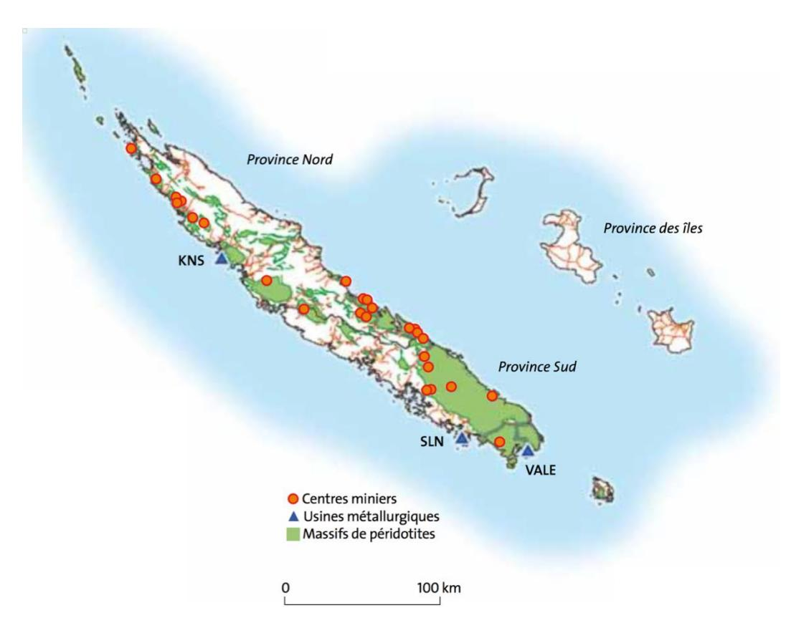

*Figure 1 : centres miniers et métallurgiques de Nouvelle-Calédonie (source : DIMENC 2011)* 

Après plus d'un siècle d'exploitation intensive des sols, la Nouvelle-Calédonie dispose encore de beaucoup de minerais, mais à faible teneur en nickel. C'est pourquoi, depuis 2010, l'entreprise minière Vale a misé sur une extraction hydrométallurgique dans le sud de la Nouvelle-Calédonie, plus adaptée pour traiter les latérites (terres rouges contenant des minerais métalliques) à faible teneur.

## **1.2. Comparaison des deux procédés métallurgiques et enjeux**

Le nickel intervient dans la composition de l'acier inoxydable, ce qui rend son extraction indispensable. Il existe 2 procédés principaux d'extraction :

- la pyrométallurgie qui permet essentiellement de produire du ferronickel, adapté à la production d'acier inoxydable ;
- l'hydrométallurgie qui permet d'obtenir, à partir de minerais moins riches, du nickel très pur (une installation est visible à la figure 2).

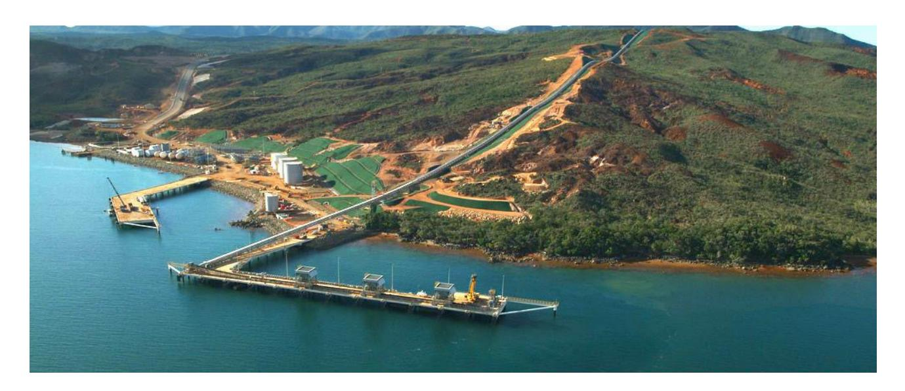

*Figure 2 : Installations portuaires de Vale dans le sud de la Nouvelle-Calédonie (source : www.vale.nc)* 

Avec la mise en œuvre récente des deux nouveaux projets métallurgiques (KNS et Vale), le nickel devrait à terme contribuer entre 30 et 40 % du PIB local et faire travailler près de 12 % de la population active locale. C'est un enjeu majeur pour la Nouvelle-Calédonie.

## **1.3. Procédé hydrométallurgique d'extraction du nickel**

D'abord utilisée au début du XXème siècle pour extraire le zinc, le cuivre et l'aluminium, l'hydrométallurgie a été adaptée dans les années 50 pour traiter les minerais latéritiques de nickel. Cela en fait un procédé relativement récent, que l'on cherche encore à optimiser.

Ce procédé permet l'extraction des métaux du minerai au moyen de réactifs chimiques (lixiviation) dans un milieu à haute température et sous haute pression, puis leur séparation pour produire de l'oxyde de nickel et du carbonate de cobalt (purification et électrolyse).

Les résidus boueux de ce procédé sont actuellement stockés dans des bassins de rétention, ce qui pose des problèmes de sécurité et n'est pas satisfaisant d'un point de vue environnemental. L'usine de Vale dans le sud de la Nouvelle-Calédonie sert cependant d'avant-poste dans ce domaine : depuis décembre 2018, un projet de stockage des résidus une fois asséchés, permettant à la fois de s'affranchir des bassins de rétention et de revégétaliser le terrain minier, est développé en Nouvelle-Calédonie et pourrait permettre une avancée mondiale notable dans la revalorisation des déchets issus de l'hydrométallurgie.

## **1.4. Problématiques du sujet**

L'étude porte sur une étape du procédé hydrométallurgique de l'usine Vale en Nouvelle-Calédonie : la décantation. Après une injection d'acide sulfurique dans la « pulpe » extraite de la mine (mélange de latérite, de déchets solides et d'eau) pour dissoudre les métaux, la solution obtenue décante dans six cuves successives (voir figure 3). Cela permet de soutirer les solides (déchets) par le fond des cuves, et de récupérer la solution-mère, qui contient les métaux dissous, par surverse (débordement par le haut de la cuve).

Pour cela, du floculant est ajouté à la solution pour agglomérer les particules solides, qui sont entraînées en fond de cuve, par gravité où elles forment une boue épaisse. Un bras rotatif équipé de lames racleuses aide au transfert de cette boue vers le centre de la cuve pour l'évacuer, tout en facilitant le dégagement de l'eau et des gaz qu'elle contient.

Lorsque la boue est trop compacte, le couple moteur qui fait tourner le bras devient trop important. Le dispositif est alors soulevé. La vue détaillée du mécanisme est fournie en document annexe A1 et les exigences auxquelles il doit répondre sont données en document annexe A2.

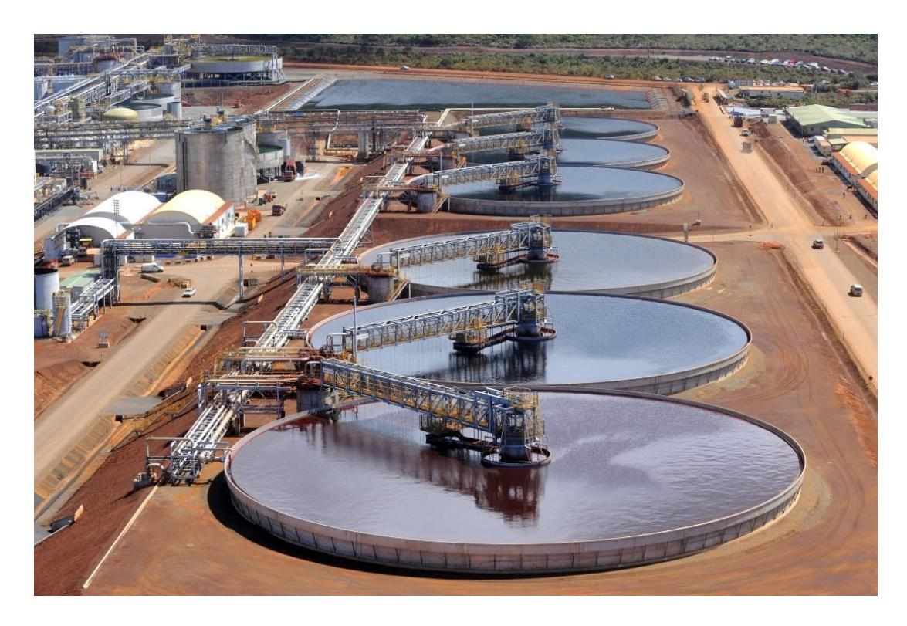

*Figure 3 : Vue extérieure des cuves de décantation*

Dans la cuve, le fluide se retrouve schématiquement sous 3 formes (voir figure 4) :

- au-dessus, solution mère, liquide, chargée en nickel, récupérée par surverse ;
- au-dessous, une boue compacte à évacuer par le bas ;
- entre les deux, une couche intermédiaire moins dense.

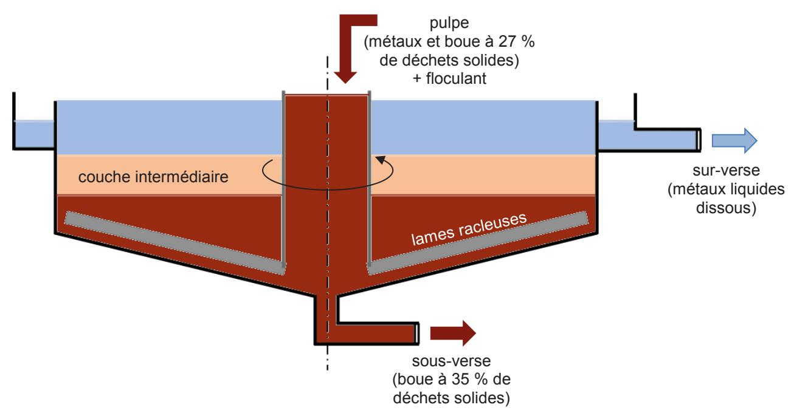

*Figure 4 : schéma de principe d'une cuve de décantation*

Actuellement, la pulpe qui entre dans les cuves contient 27% de solides, et en ressort à 35 % après 1500 heures de décantation (voir figure 5). Pour optimiser cette étape du procédé, les ingénieurs souhaitent atteindre 50 % de solides dans la boue à l'issue de la décantation.

Cela suppose d'ajuster le dosage du floculant ajouté à la pulpe en entrée, et de s'assurer que la chaîne de puissance est bien dimensionnée pour une telle concentration de solides.

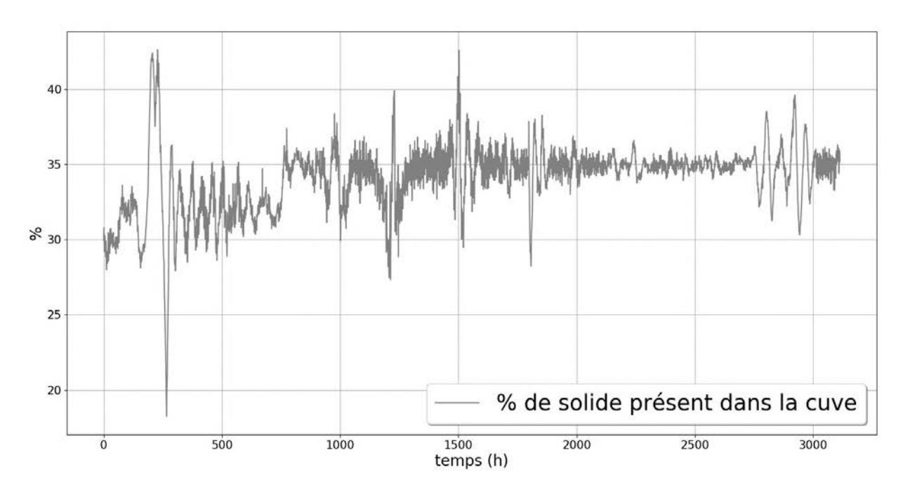

*Figure 5 : courbe d'évolution de la quantité de solide dans la boue dans une cuve de décantation au mois de juin 2019* 

Dans cette étude, il est proposé :

- d'estimer le couple résistant dû à une boue à 50 % de solides en fond de cuve afin de valider le dimensionnement des moteurs en régime permanent (partie 2) ;
- de valider puis d'utiliser un modèle multiphysique pour confirmer le choix des moteurs lors des petites variations du pourcentage de solides autour de la valeur souhaitée (partie 3) :
- d'analyser le dispositif de sécurité actuellement mise en œuvre pour limiter le couple moteur (partie 4) ;
- d'analyser une solution alternative d'ajustement en continu du dosage de floculant (partie 5) ;
- de modéliser mécaniquement la cuve pour identifier des solutions visant à limiter les fuites de pulpe (partie 6) ;
- de conclure sur l'étude réalisée (partie 7) ;
- d'utiliser l'étude cinématique de la partie 5 comme support d'évaluation d'une séquence proposée (partie 8).

**Question 1.** Relever, sur le document annexe A2, le nom et l'identifiant de l'exigence correspondant à l'objectif d'optimisation de cette étude.

# PARTIE 2. CHOIX D'UN MOTEUR POUR LE BRAS ROTATIF EN REGIME PERMANENT

L'objectif de cette partie est d'estimer le couple résistant dû à la boue en fond de cuve afin de valider le dimensionnement des moteurs en régime permanent.

### 2.1. Calcul du couple résistant dû à la force de frottement visqueux

Cette partie s'appuiera sur la vue détaillée du mécanisme fournie en document annexe A2.

Les actions mécaniques extérieures qui s'exercent sur le bras rotatif d'une cuve de décantation sont les suivantes :

- le couple moteur qui permet la rotation du bras ;
- la force de frottement visqueux au contact avec la boue ;
- la pression hydrostatique due à la boue en fond de cuve. Elle s'équilibre de part et d'autre des lames racleuses.

Ainsi, la seule action mécanique extérieure utile en-dehors du couple moteur est celle de la force de frottement visqueux. Cette force se modélise, dans le cas général, pour les faibles vitesses :

$$F = k \times \rho \times S \times V$$

Où:

- k est un coefficient empirique qui dépend notamment de la forme et de l'état de surface du solide (les lames racleuses) en contact avec le fluide (la boue) ;
- ρ est la masse volumique du fluide en contact avec le solide ;
- S est la surface de contact :
- V est la vitesse relative du solide par rapport au fluide.

La masse volumique de la boue en contact avec les lames racleuses dépend du pourcentage de solides qu'elle contient. On fournit la relation suivante :

$$\frac{1}{\rho_{\text{boue}}} = \frac{\%_{\text{solides}}}{\rho_{\text{solides}}} + \frac{1 - \%_{\text{solides}}}{\rho_{\text{liquide}}}$$

Avec, dans les conditions de température des cuves de décantation :

- $\rho_{\text{liquide}} = 1110 \text{ kg} \cdot \text{m}^{-3}$
- $\rho_{\text{solides}} = 4010 \text{ kg} \cdot \text{m}^{-3}$

Par exemple, cette relation permet de déterminer que la pulpe entrant dans les cuves de décantation à 27 % de solides a une masse volumique  $\rho_{\text{pulpe}} = 1380 \text{ kg} \cdot \text{m}^{-3}$ .

**Question 2.** Calculer la masse volumique de la boue  $\rho_{\rm boue}$  en sortie des cuves de décantation, lorsqu'elle contient 50 % de solides.

Afin de calculer une valeur approchée du couple résistant dû à l'action de cette force de frottement visqueux, il est considéré le cas simplifié suivant :

- le bras rotatif tourne à une vitesse constante de 0,064 tr·min<sup>-1</sup> (voir annexe A2);
- les lames racleuses sont en contact avec la boue à 50 % de solides ;
- l'action de la force de frottement, sur les éléments de treillis des deux bras longs et des deux bras courts qui constituent un bras rotatif, est négligée, seule l'action sur les lames racleuses est donc prise en compte ;
- la surface des lames racleuses sur laquelle s'exerce la force de frottement correspond à la surface projetée dans le plan vertical ;
- l'inclinaison des lames racleuses par rapport à l'horizontale et les variations de hauteur de ces lames sont négligées : ainsi, pour chaque bras long et court du bras rotatif, le modèle simplifié de la figure 6 est adopté.

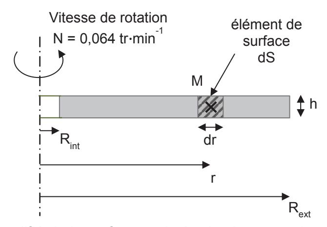

Figure 6 : Modèle simplifié de la surface projetée des lames racleuses en contact avec la boue pour un bras court ou long du bras rotatif

Pour les calculs, les valeurs numériques suivantes seront à prendre en compte :

- R<sub>int</sub> = 3 m pour les bras courts et les bras longs ;
- Rext = Rcourt = 10 m pour les bras courts ;
- Rext = Rlong = 30 m pour les bras longs;
- h = 0.1 m la hauteur movenne des lames racleuses.

**Question 3.** Calculer la vitesse de rotation  $\omega_{bras}$  du bras rotatif en rad·s<sup>-1</sup>.

**Question 4.** Donner l'expression de la vitesse V d'un point M des lames racleuses, situé à un rayon r de l'axe de rotation du bras, en fonction de r et de  $\omega_{bras}$ .

**Question 5.** Donner l'expression de l'élément de surface dS en fonction des données de la Figure 6.

**Question 6.** En déduire que la force élémentaire de frottement visqueux qui s'exerce sur l'élément de surface dS des lames racleuses s'exprime de la manière suivante :

$$dF = k \times \rho_{boue} \times r \times \omega_{bras} \times h \times dr$$

Le couple élémentaire généré par cette force, sur l'axe de rotation du bras, est  $dC = r \times dF$ .

Le couple global correspondant s'obtient en intégrant dC sur la longueur des lames :

$$C = \int_{R_{int}}^{R_{ext}} r \times dF = k \times \rho_{boue} \times \omega_{bras} \times h \int_{R_{int}}^{R_{ext}} r^2 dr$$

où  $k = 120 \text{ N} \cdot \text{s} \cdot \text{kg}^{-1}$ .

**Question 7.** Déterminer l'expression de C en fonction de k,  $\rho_{boue}$ ,  $\omega_{bras}$ , h,  $R_{int}$  et  $R_{ext}$ , puis calculer la valeur numérique  $C_{court}$  de ce couple pour un bras court et la valeur numérique  $C_{long}$  de ce couple pour un bras long.

**Question 8.** Donner l'expression du couple global  $C_{\text{bras}}$  sur l'axe de rotation du bras, dû à l'action de la force de frottement visqueux sur les deux bras longs et les deux bras courts, en fonction de  $C_{\text{court}}$  et de  $C_{\text{long}}$ . Effectuer l'application numérique.

Une campagne de mesures a permis de tracer l'évolution du couple en kN·m sur l'axe du bras rotatif en fonction du pourcentage de solides en fond de cuve. Les résultats obtenus sont fournis à la figure 7 ci-après. Ils permettent, grâce à une courbe de tendance exponentielle, d'extrapoler la valeur du couple pour des pourcentages de solide plus importants que ceux réalisés actuellement.

Ainsi, avec une boue à 35 % de solides en sortie de cuve, le couple sur le bras rotatif est de 550 kN·m environ (voir figure 7).

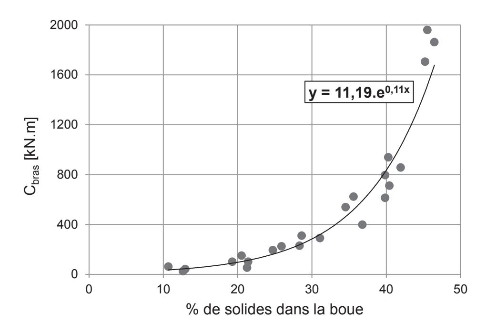

Figure 7 : couple mesuré sur le bras en fonction du pourcentage de solides dans la boue en fond de cuve

**Question 9.** À l'aide de l'équation donnée en figure 7, calculer la valeur de C<sub>bras</sub> pour une boue à 50 % de solides. Comparer le résultat à celui de la question 8 en calculant l'écart relatif entre les deux valeurs obtenues. Conclure sur le résultat de la question 8.

Dans la suite du sujet, les calculs seront effectués avec C<sub>bras</sub> = 2800 kN⋅m pour une boue à 50 % de solides.

## 2.2. Calcul du couple moteur maximal

Le passage du pourcentage de solides dans la boue de 35 % à 50 % augmente très largement la valeur du couple sur le bras, qui passe de 550 kN·m à 2800 kN·m. Le couple correspondant sur les moteurs mettant le bras en rotation doit être calculé, en vue de valider leur dimensionnement ou d'envisager un changement.

La chaîne de puissance du bras rotatif est fournie sur le document réponse R1.

Le bras rotatif est mis en rotation par deux motoréducteurs électriques : ils entraînent chacun un pignon de 12 dents qui engrène avec une couronne de 124 dents, solidaire du bras rotatif. Ainsi, les deux moteurs tournent à la même vitesse, et fournissent

Figure 8 : Vue 3D d'un moteur avec ses deux étages de réduction à trains épicycloïdaux

chacun la moitié du couple C<sub>bras</sub> nécessaire à la rotation du bras (voir figure 8).

**Question 10.** Calculer le rapport de réduction r3 du réducteur pignon-couronne et compléter le bloc correspondant du document réponse R1.

Sur le document réponse R1, les valeurs des rapports de réduction r1 et r2 des deux étages de train épicycloïdal de chacun des moteurs sont indiquées, ainsi que la valeur du rendement η3 du réducteur pignon-couronne. Les trains épicycloïdaux sont supposés parfaits, avec des rendements η1 = η2 = 1.

**Question 11.** Connaissant la vitesse de rotation du bras Nbras = 0,064 tr·min-1 en régime permanent, calculer et compléter sur le document réponse R1 les valeurs des vitesses aux différents étages de transmission de l'énergie mécanique. Indiquer, sur la copie, l'expression de la vitesse de rotation d'un moteur Nmot en fonction de Nbras, r1, r2 et r3.

**Question 12.** Connaissant le couple Cbras = 2800 kN·m en régime permanent, calculer et compléter sur le document réponse R1 les valeurs des couples aux différents étages de transmission de l'énergie mécanique. Indiquer, sur la copie, l'expression du couple fourni par un seul moteur Cmot en fonction de Cbras, r1, r2, r3 et η3.

Pour comparaison, le pourcentage actuel de 35 % de solides dans la boue délivre un couple pour chaque moteur de 20 N·m environ.

## **2.3. Validation d'un choix de moteur en régime permanent**

La documentation des moteurs asynchrones utilisés actuellement sur le système est fournie sur le document annexe A3. Le moteur qui a été retenu lors du dimensionnement du système, et actuellement en service, est celui dont la ligne est encadrée sur la documentation.

**Question 13.** Commenter le choix des moteurs en termes de couple, de vitesse de rotation, de puissance et de rendement pour le pourcentage visé de solides dans la boue par l'exigence 1.4.2.1 et le pourcentage actuellement réalisé (35 %). Proposer, le cas échéant, un moteur adapté à l'application souhaitée avec une marge de sécurité de 10 %.

## **PARTIE 3. VALIDATION DU DIMENSIONNEMENT DES MOTEURS EN RÉGIME TRANSITOIRE**

*L'objectif de cette partie est de modéliser la chaine de puissance du système afin de valider le dimensionnement des moteurs en régime transitoire.* 

Les calculs de la partie précédente ont permis de valider un choix de moteur en régime permanent, pour le pourcentage souhaité de solides dans la boue de 50 %. Lorsque ce pourcentage présente des variations autour de 50 %, mêmes faibles, le couple résistant sur le bras rotatif peut augmenter ou diminuer de façon significative (voir figure 7). Une étude plus complète est donc nécessaire pour valider le dimensionnement des moteurs en régime transitoire également.

La rotation du bras est assurée par deux moteurs sur lesquels la charge est répartie. Ces moteurs sont accouplés au niveau de l'engrenage pignons-couronne. Ils ont donc une vitesse identique. Comme il s'agit de machines asynchrones 50 Hz, une vitesse constante est assurée en les alimentant directement sur le réseau, solution la plus aisée à mettre en œuvre et la moins coûteuse. Ainsi, un asservissement de vitesse du bras rotatif n'est pas nécessaire.

Afin de vérifier le dimensionnement des moteurs en régime transitoire, un modèle multiphysique est proposé, dont la validité est étudiée dans une première partie.

## **3.1. Validation du modèle multiphysique**

Pour estimer le couple ainsi que le courant dans les moteurs pour différentes densités de boues, un modèle multiphysique partiel du bras motorisé est fourni en document réponse R2.

**Question 14.** Identifier les différents éléments de la liste ci-dessous de la modélisation multiphysique en complétant le document réponse R2 :

*Trains d'engrenage, Machine asynchrone, Réseau électrique, Lames racleuses* 

**Question 15.** Compléter le modèle multiphysique sur le document réponse R2 en ajoutant la prise en compte d'un couple résistant dû à la boue et la mesure d'un couple moteur. Une palette composée de constituants standards est donnée en annexe A4.

Le modèle étant complété, on peut le paramétrer. Différentes grandeurs intrinsèques de la machine asynchrone doivent être déterminées : inductances statoriques, glissement nominal, résistance rotorique, inductance de fuite rotorique, inductance magnétisante, nombre de paires de pôles.

**Question 16.** À partir de la valeur de la vitesse nominale indiquée dans l'annexe A3, déterminer le nombre de paires de pôles ainsi que la valeur de la vitesse de synchronisme pour la machine asynchrone choisie.

**Question 17.** Déterminer alors la valeur du glissement au point de fonctionnement nominal.

Un essai à vide a été effectué pour déterminer les valeurs numériques des paramètres des deux machines asynchrones qui sont identiques.

## **Essai à vide**

| Conditions de l'essai                                                           | Mesure                                      |
|---------------------------------------------------------------------------------|---------------------------------------------|
| Machine désaccouplée<br>Tension d'alimentation V = 133 V<br>Fréquence f = 50 Hz | Puissance réactive absorbée : Q0 = 2137 VAR |

**Question 18.** En supposant le glissement nul lors de l'essai à vide, le schéma équivalent par phase est donné ci-contre. Exprimer la puissance réactive en fonction des éléments du schéma et en déduire la valeur numérique de l'inductance de magnétisation.

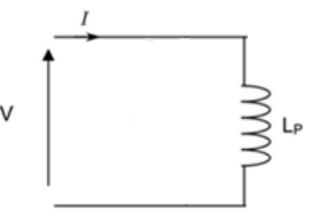

Les valeurs numériques des autres grandeurs sont obtenues par simulation numérique, ou renseignées dans la documentation technique de la machine. Elles sont alors utilisées pour configurer le modèle multiphysique, dont on se sert pour déterminer couple moteur et le courant consommé par le moteur.

Deux résultats obtenus sont fournis dans le tableau ci-dessous :

| Couple résistant sur les bras Cbras | 8300 kN·m    | 3000 kN·m    |
|-------------------------------------|--------------|--------------|
| Courant moteur                      | 67 A         | 22 A         |
| Couple résistant sur un moteur      | 280 N·m      | 108 N·m      |
| Vitesse de rotation                 | rotor bloqué | 970 tr·min-1 |

**Question 19.** On souhaite valider le modèle à partir de ces deux résultats. Est-il possible, à l'aide du document annexe A5**,** de conclure sur la validité du modèle multiphysique ? Si oui, indiquer les limites de cette validation.

## **3.2. Vérification du dimensionnement des machines asynchrones par modélisation multiphysique**

Le modèle multiphysique ayant été ensuite validé par l'entreprise, il peut être utilisé pour vérifier que les deux machines asynchrones sont bien dimensionnées pour l'application lors du passage du pourcentage de solides dans la boue de 35 % à 50 %. Le pourcentage de boue appliqué sur le bras suit une évolution typique mesurée par l'entreprise, mais augmentée pour avoir un pourcentage autour de 50 % de solides (voir figure 9). Le couple moteur est calculé par le modèle à partir de ce relevé. Le couple moteur est affiché en fonction du pourcentage du couple nominal des moteurs installés dans le système.

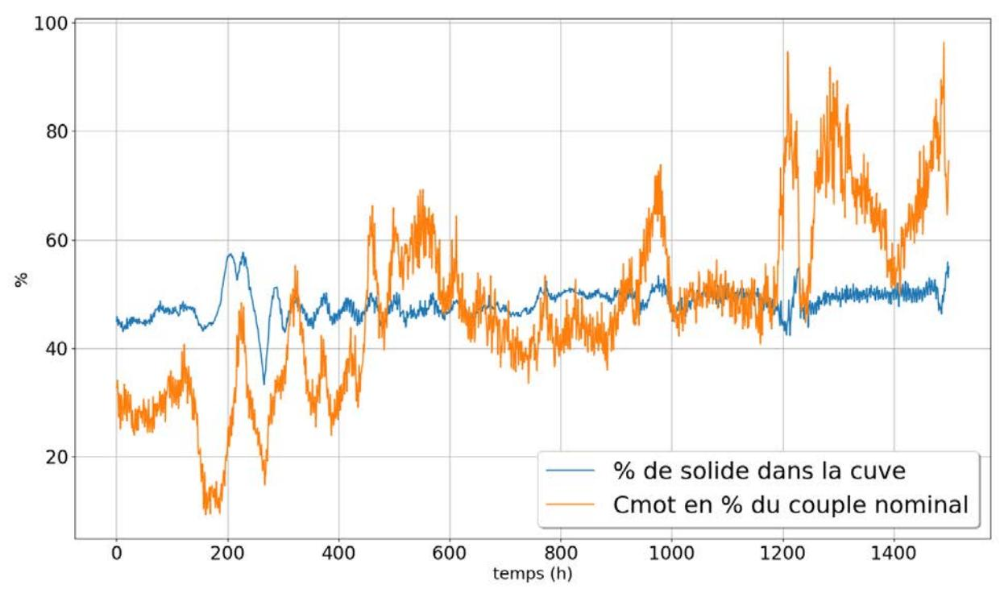

*Figure 9 : Simulation du couple moteur à partir d'un relevé du pourcentage de solides présents dans la cuve*

**Question 20.** À partir du résultat de la simulation de la figure 9, conclure sur le dimensionnement en couple des moteurs pour un pourcentage de solides dans la boue tel que visé par l'exigence 1.4.2.1 (annexe A2), lors des petites variations de ce pourcentage.

## **PARTIE 4. ANALYSE DU DISPOSITIF DE LEVAGE DE SECURITÉ**

*L'objectif de cette partie est de choisir un capteur de couple adapté à l'application souhaitée et analyser le comportement séquentiel du dispositif de levage de sécurité.* 

Le couple résistant correspondant à une boue contenant 50 % de solides est le couple maximal que peuvent supporter les moteurs. Pour ne pas risquer de détériorer le système, et afin de répondre à l'exigence 1.5.2 du diagramme des exigences, un dispositif de levage visible en annexe A1 permet de soulever le bras pour l'extraire de la boue si elle devient trop épaisse en fond de cuve. Le bras continue alors de tourner, mais en contact avec de la boue moins épaisse.

Le mécanisme de levage est activé dès lors que le couple sur le bras dépasse une valeur limite Clim = 1600 kN·m.

Le dispositif retenu pour mesurer le couple est un capteur à jauges de déformation, placé entre le stator des machines asynchrones et le bâti. Ces capteurs de type « poutre en porte à faux » dont les jauges sont protégées par un soufflet rigide, se situent sur chacun des moteurs mettant en rotation le bras (« load cells » en anglais). Ils sont actuellement utilisés dans des conditions où le pourcentage de solides dans la boue est proche de 35 %, et on souhaite valider leur utilisation pour une boue à 50 % de solides.

Une photographie du montage est donnée en figure 10, ainsi qu'un schéma simplifié du montage en figure 11.

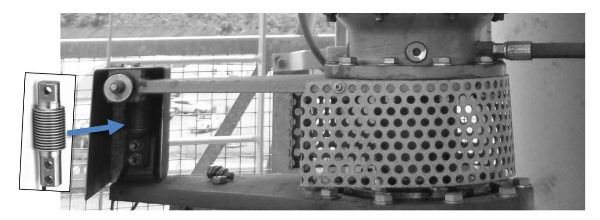

Figure 10 : Photographie d'un capteur à jauges de déformation (à gauche) monté entre le bâti et le stator du moteur (à droite)

Dans cette partie, le couple nécessaire à la mise en rotation du bras lorsque la boue contient 50 % de solides fourni par un moteur vaut  $C_{mot}$  = 90 N·m. Cela correspond à un couple sur le bras rotatif  $C_{bras}$  = 2800 kN·m. La force qui s'exerce sur un capteur est notée F et la distance entre l'axe de rotation du moteur et le point de fixation du capteur est notée L.

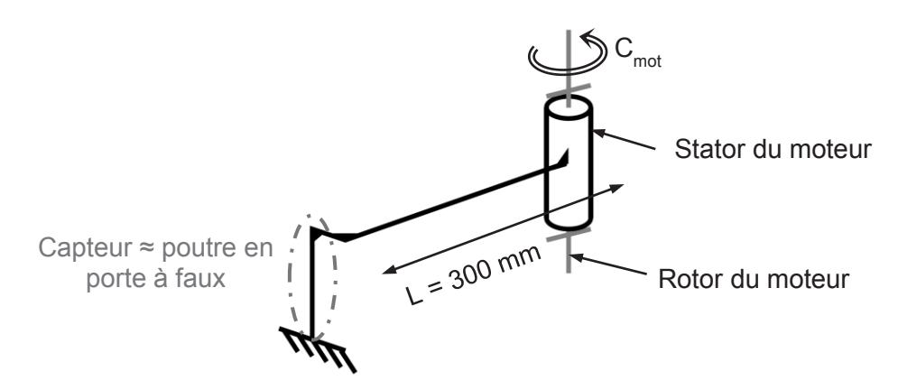

Figure 11 : Schéma simplifié du montage pour la mesure du couple moteur

**Question 21.** Déterminer l'expression de la force F en fonction de  $C_{mot}$  et de la distance L, puis calculer la valeur numérique de F.

**Question 22.** En déduire la valeur de la charge en kg qui s'exerce sur le capteur. Choisir, à l'aide de l'annexe A5, le capteur qui sera le plus adapté pour la mesure du couple moteur. Indiquer pour cela la valeur de la charge nominale retenue parmi la liste proposée.

Le capteur se comporte comme une poutre en porte à faux soumise à une force F. À partir des spécifications du capteur, le modèle simplifié de la figure 12 a été retenu. La flèche (déformation maximale de la poutre) ne doit pas dépasser 1 mm dans les conditions prévues pour l'utilisation du capteur, comme le spécifie la documentation technique de l'annexe A5.

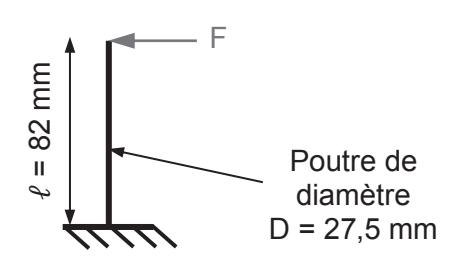

*Figure 12 : Modèle simplifié du capteur sollicité en flexion*

Pour une poutre homogène encastrée sollicitée en flexion à son extrémité, la flèche (en m) est donnée par :

$$f = \frac{F \times \ell^3}{3 \times E \times I}$$

où E est le module d'Young du matériau de la poutre et I son moment quadratique en m4.

Le capteur est en acier inoxydable, son module d'Young est donc E = 200 GPa.

Pour une poutre de section circulaire : I = π×D4 64 où D est le diamètre de la poutre.

**Question 23.** Calculer la valeur de la flèche pour les conditions données et valider le capteur choisi.

**Question 24.** Tracer un croquis de la poutre étudiée montrant la déformation ainsi que la valeur de la flèche.

**Question 25.** En comparant les valeurs de Cbras lorsqu'on passe d'une boue à 35 % de solides, à une boue à 50 % de solides, avec la valeur de Clim qui déclenche le relevage des lames racleuses, mettre en évidence les problèmes liés à ce dispositif de sécurité vis-à-vis de l'objectif à atteindre.

## **PARTIE 5. MISE EN ŒUVRE D'UNE SOLUTION D'AJUSTEMENT EN CONTINU DU DOSAGE DU FLOCULANT**

*L'objectif de cette partie est de proposer une solution d'ajustement en continu du dosage de floculant dans la solution.* 

En parallèle du mécanisme de levage, les ingénieurs de l'usine souhaitent ajuster en continu le dosage de floculant dans la boue. Une sonde acoustique descend à chaque rotation du bras pour relever le profil acoustique de la solution dans la profondeur : cela permet d'avoir une image précise de la répartition verticale de la boue dans la cuve (voir figure 14).

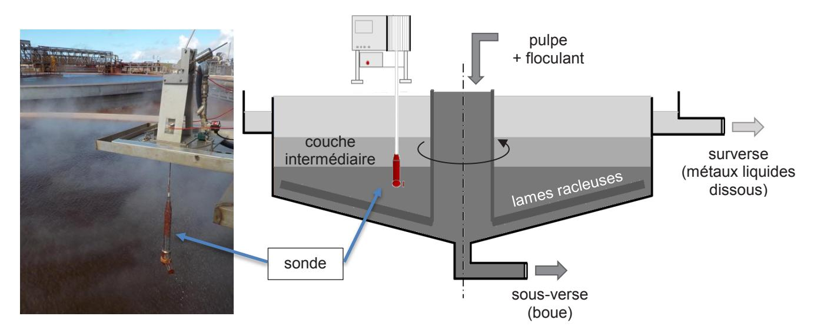

*Figure 14 : système d'ajustement du dosage du floculant gauche : photo de la sonde - droite : schéma du système.*

## **5.1. Comportement de l'automate de sonde**

La sonde est fixée à l'extrémité d'un câble enroulé sur une poulie mise en rotation par un moteur à courant continu. Un codeur incrémental placé sur l'arbre moteur permet de mesurer sa position angulaire et d'en déduire la position verticale de la sonde (figure 15).

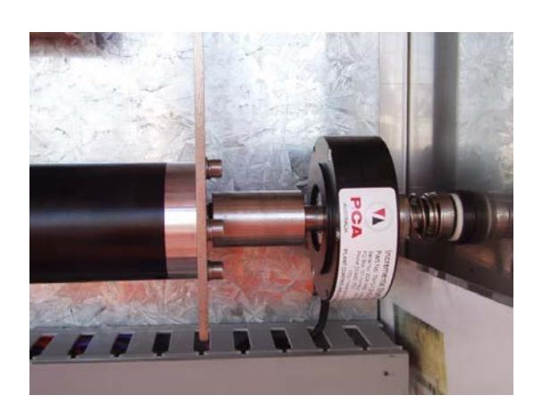

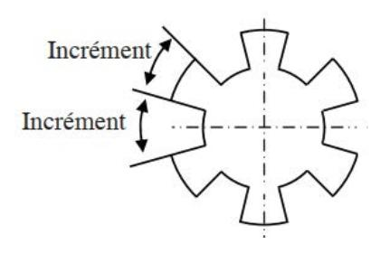

*Figure 15 : codeur incrémental équipant l'arbre moteur. Forme d'une roue codeuse avec 12 incréments.*

La résolution du codeur incrémental est de 500 incréments par tour et le rayon de la poulie est Rpoulie = 180 mm.

**Question 26.** Déterminer la valeur du gain du codeur Kcod en m/incrément.

La sonde relève un profil acoustique en décibel (dB) et trois niveaux sont définis :

| Surverse<br>(mesure de référence )                 | mesure_ref = 6<br>à 8 dB                                |
|----------------------------------------------------|---------------------------------------------------------|
| Couche intermédiaire<br>(particules en suspension) | mesure_ref + 0,6 dB < niveau sonore < mesure_ref + 4 dB |
| Boue                                               | niveau sonore > mesure_ref + 4 dB                       |

À partir de la mesure de référence « mesure\_ref », des valeurs enregistrées en continu du niveau sonore et de la profondeur à laquelle se trouve la sonde, les positions de la couche intermédiaire et de la boue dans la cuve sont connues. Dès lors que la hauteur de boue est trop faible, il est nécessaire d'ajouter du floculant pour sédimenter plus de solides en fond de cuve.

La commande de la sonde est gérée par un automate programmable industriel. L'entreprise souhaite modifier cet automate et la nouvelle solution utilisera une programmation en langage Python.

Deux grandeurs seront relevées et placées dans une liste *mesures* :

- la valeur en dB mesurée par la sonde, dont la valeur est stockée dans *mesures*[ :,0] ;
- le nombre d'incréments en sortie du codeur, dont la valeur est stockée dans *mesures*[ :,1]*.*

Dès lors que le niveau sonore est inférieur à 20 dB en fond de cuve, c'est-à-dire à la dernière valeur de la liste mesures[:,0], on estime que la boue n'est pas assez sédimentée et qu'il est nécessaire d'ajouter du floculant.

Pour la maintenance, on souhaite créer une fonction qui affiche :

- la valeur de la profondeur ;
- si l'ajout de floculant est nécessaire ou non.

**Question 27.** Compléter sur le document réponse R4 le programme permettant cet affichage, à savoir :

- la valeur du gain du codeur Kcod ;
- la fonction *affichage\_mesures*, qui possède comme argument la liste *mesures*. Elle permet le calcul de la dernière profondeur mesurée en m de la sonde et retourne un message sous la forme « profondeur de la sonde en m =…, l'ajout de floculant est nécessaire/non nécessaire ».

Pour effectuer la mesure de référence « mesure\_ref » dans les meilleures conditions, une attente de 10 secondes à la surface de la cuve est prévue. Le niveau supérieur du liquide se trouve 2,5 m en-dessous de la position initiale de la sonde.

Pour éviter que le câble auquel est attachée la sonde ne se prenne dans les bras longs, des détecteurs inductifs s'assurent de l'absence de bras avant chaque descente de la sonde.

La commande de la sonde est gérée par un automate programmable industriel, dont le comportement séquentiel est décrit par le diagramme états-transitions de la figure 16.

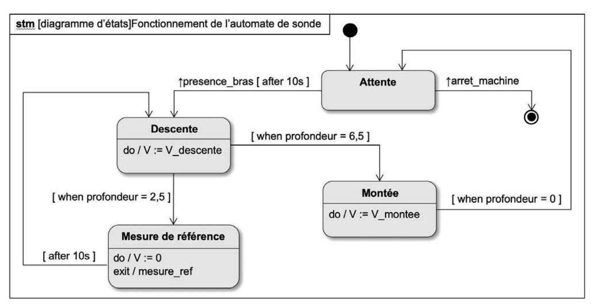

*Figure 16 : diagramme états-transitions de l'automate de sonde*

| Variable      | Description                                                                      |
|---------------|----------------------------------------------------------------------------------|
| V             | Vitesse linéaire de la sonde :<br>V_descente = 0,1 m·s-1<br>V_montee = 0,2 m·s-1 |
| presence_bras | détection de la présence d'un bras long                                          |
| profondeur    | profondeur en m parcourue par la sonde depuis sa position initiale               |
| mesure_ref    | enregistrement de la mesure de référence par la sonde                            |
| arret_machine | arrêt demandé                                                                    |

**Question 28.** Connaissant la vitesse de rotation du bras N = 0,064 tr·min-1, calculer la durée en minutes entre deux passages de bras long.

**Question 29.** À l'aide du diagramme états-transitions de la figure 16, et des éléments de syntaxe de l'annexe A6, déterminer la durée totale d'un aller-retour de la sonde en secondes, puis en minutes. Justifier.

**Question 30.** Conclure sur le risque pour le câble de sonde de s'enrouler dans un bras long.

## 5.2. Ajustement en continu du dosage du floculant

Avec l'automate programmable, l'ajustement du dosage du floculant s'effectue de manière séquentielle.

Une solution permettant de faire cet ajustement en continu doit être mise en place, à l'aide d'une boucle d'asservissement. En effet, le couple mesuré sur le bras et le couple consigne peuvent être comparés en continu. À l'aide d'un correcteur, la tension de commande des pompes gérant le débit de floculant dans la cuve peut varier. Lorsque la quantité de floculant dans la cuve augmente, la sédimentation de la pulpe est accélérée, et le pourcentage de solides dans la boue en fond de cuve augmente. Ainsi, avec le bon réglage de correcteur, le couple mesuré sur le bras sera toujours proche du couple souhaité, à savoir le couple nominal.

Cependant, le modèle de connaissance reliant le débit de floculant en sortie de pompe au pourcentage de solides dans la cuve est complexe. Dans un premier temps, un modèle de comportement simplifié du couple sur le bras rotatif en fonction de la tension de commande des pompes de floculant va être identifié, comme représenté en figure 17.

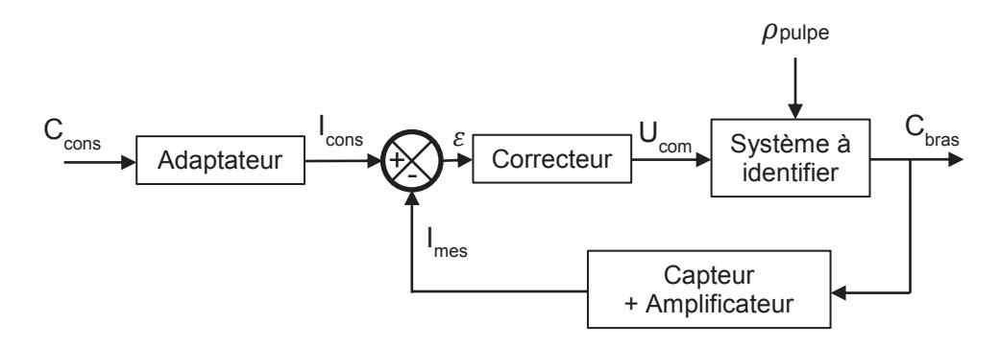

Figure 17 : schéma-blocs simplifié de l'asservissement du couple sur le bras rotatif

Les notations utilisées pour cette partie sont :

- C<sub>cons</sub>: couple consigne (correspondant au couple nominal) en N⋅m;
- Icons: courant image du couple consigne en A;
- C<sub>bras</sub>: couple sur le bras rotatif en N·m;
- I<sub>mes</sub>: courant mesuré, image du couple sur le bras, en A;
- $\varepsilon$ : écart ( $\varepsilon$  = I<sub>cons</sub> I<sub>mes</sub>) en A;
- U<sub>com</sub>: tension de commande des pompes gérant le débit de floculant dans la cuve, en V;
- $\rho_{\text{pulpe}}$ : masse volumique de la pulpe en entrée des cuves en kg·m<sup>-3</sup>.

Une mesure du couple sur le bras  $C_{bras}$  est effectuée pour un échelon de tension de commande  $U_{com}$  des pompes de dosage du floculant. Pendant la durée de l'expérience, les variations de masse volumique de la pulpe  $\rho_{pulpe}$  sont supposées négligeables.

La mesure de  $C_{bras}$  est donnée en figure 18, pour un échelon de  $U_{com}$  de 10 V ( $U_{com}$  passe de 30 V à 40 V à t = 100 minutes).

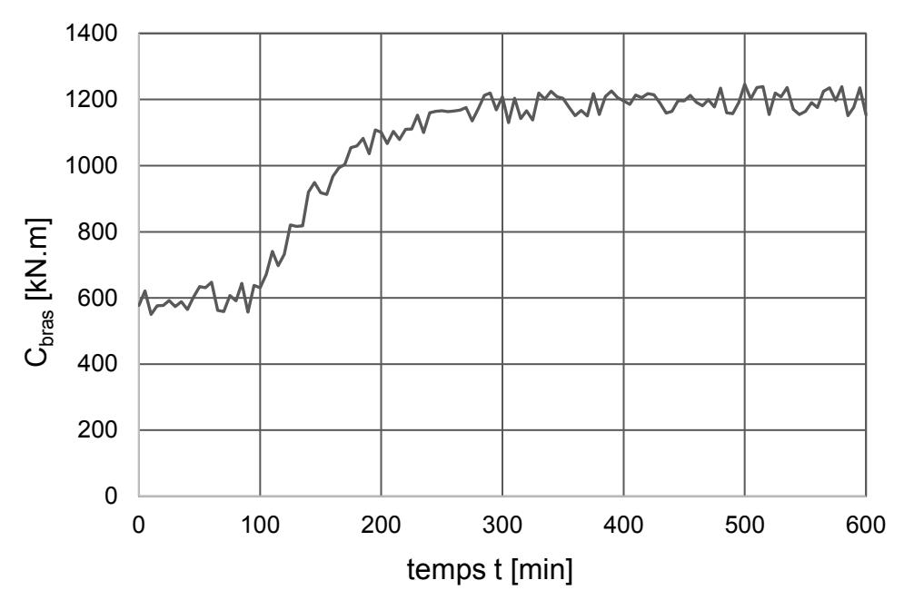

Figure 18 : couple mesuré sur le bras en fonction du temps, pour une variation de  $U_{com}$  sous forme d'échelon de 10 V à t = 100 min

**Question 31.** Justifier, au vu de l'allure de C<sub>bras</sub> en figure 18, que l'on peut modéliser le système en boucle ouverte non corrigée par un système du premier ordre :

$$\tau \cdot \frac{dC_{\text{bras}}(t)}{dt} + C_{\text{bras}}(t) = K \cdot U_{\text{com}}(t)$$

**Question 32.** Déterminer alors, pour ce modèle, des valeurs approchées du gain K en  $kN \cdot m \cdot V^{-1}$  et de la constante de temps  $\tau$  en minutes. Les tracés nécessaires devront apparaître sur le document réponse R4.

Le réglage du correcteur de la boucle d'asservissement doit permettre de répondre aux exigences suivantes :

- précision : erreur statique nulle en régime permanent ;
- rapidité : temps de réponse t<sub>5%</sub> < 500 min ;
- dépassement : inférieur à 15 % du couple consigne Ccons.

À l'aide de ce modèle simplifié, plusieurs simulations ont été réalisées afin de déterminer le réglage du correcteur le plus approprié aux exigences. Dans ces simulations, le couple consigne est constant et vaut  $C_{cons}$  = 2800 kN·m. On prend en compte les variations de  $\rho_{pulpe}$  qui traduisent des discontinuités dans le pourcentage de solides contenus dans la pulpe, et constituent une perturbation pour l'asservissement. Les résultats de ces simulations sont fournis en annexe A7.

**Question 33.** Au vu des résultats de l'annexe A7, choisir le réglage du correcteur qui permet de répondre au mieux aux exigences de l'asservissement en justifiant la réponse.

## **PARTIE 6. LIMITATION DES FUITES DE LA CUVE DE DÉCANTATION EN FONCTION DE LA DENSITÉ DE LA BOUE**

*L'objectif de cette partie est de modéliser mécaniquement la cuve de décantation pour proposer une solution pour prévenir les fuites de pulpe.* 

Les cuves de décantation ont un diamètre intérieur de 70 m pour une hauteur totale de 6,835 m. Les parois verticales se composent d'éléments métalliques soudés les uns aux autres posés sur une murette en béton armé. Le sol est composé de bâches étanches collées entre elles, posées sur un remblai de type hérisson (différentes granulométries de graviers et de sables posées du plus gros au plus fin, de bas en haut), visibles sur la figure 19. La poussée de la boue sur les parois est en première approximation une poussée hydrostatique. Les poids volumiques ne sont donnés que pour cette partie. La cuve est modélisée selon la figure 20.

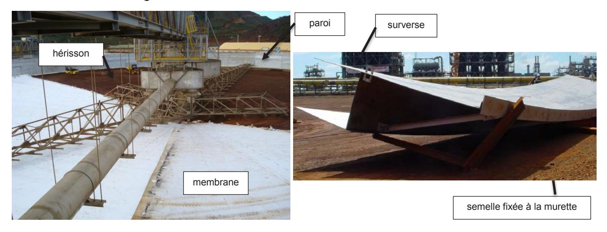

*Figure 19 : vue du sol à gauche et du panneau formant la paroi à droite (couché)*

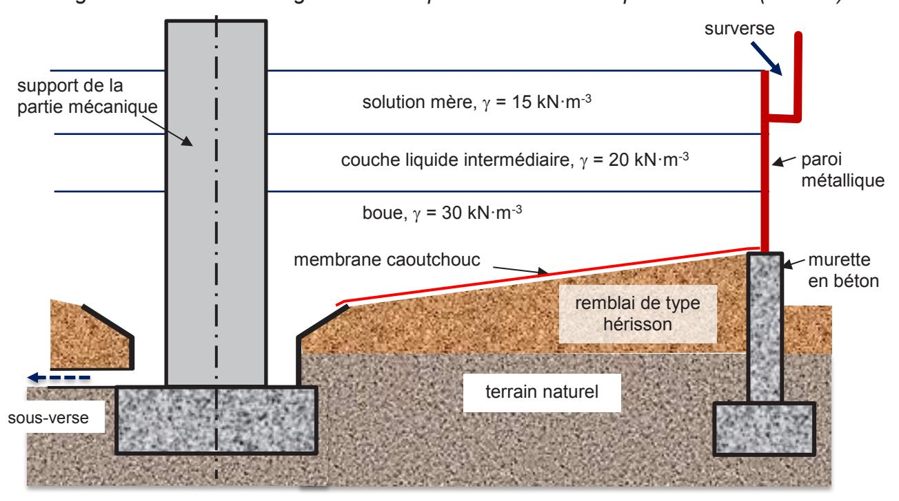

*Figure 20 : section simplifiée d'une moitié de cuve*

La poussée hydrostatique d'un fluide de poids volumique (kN·m-3) sur une paroi verticale de hauteur h (m) est modélisée par la figure ci-contre.

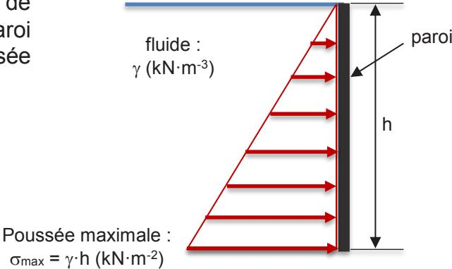

**Question 34.** Compléter, sans calculs et sur le document réponse R5, l'allure des poussées qui s'exercent sur la paroi verticale métallique d'une cuve lorsqu'elle est pleine. Compléter également, sur R5, l'expression de la poussée maximale 3.

**Question 35.** Indiquer comment l'augmentation du poids volumique de la boue à l'intérieur de la cuve (passage de 35 % à 50 % de solides) influe sur ces poussées horizontales.

La poussée verticale qui s'exerce sur une demi-cuve lorsqu'elle est pleine est donnée à la figure 21.

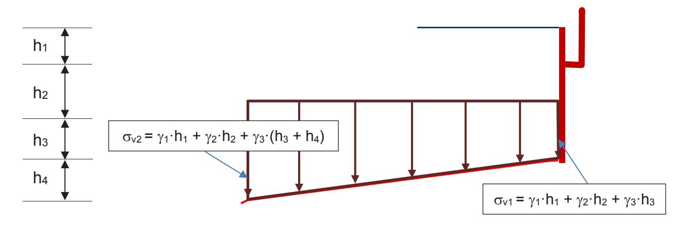

*Figure 21 : Poussée verticale des fluides sur le sol* 

**Question 36.** Indiquer comment l'augmentation du poids volumique de la boue à l'intérieur de la cuve (passage de 35 % à 50 % de solides) influe sur la poussée verticale.

**Question 37.** Sur l'annexe A2, relever l'exigence relative aux fuites à travers la cuve.

**Question 38.** À partir des questions précédentes, entourer sur le document réponse R5, en expliquant sur la copie, quels sont les points de la cuve où les risques de fuites sont les plus importants. Expliciter sur la copie les phénomènes à l'intérieur de la cuve qui peuvent aggraver ces fuites, et notamment le passage de 35 % à 50 % de solides.

**Question 39.** Proposer des solutions pour diminuer les fuites, tant en phase de construction qu'en service, y compris celles retenues par la société (annexe A2).

## **PARTIE 7. CONCLUSION ET SYNTHÈSE**

*L'objectif de cette partie est de conclure sur la possibilité d'optimiser l'étape de décantation du procédé hydro-métallurgique d'extraction du nickel.* 

**Question 40.** Afin de conclure, au vu des différentes études menées dans ce sujet, quant à la possibilité d'atteindre 50 % de solides dans la boue à l'issue de la décantation, remplir le schéma de synthèse du document réponse R6 :

- dans les blocs 1 et 2, compléter par *sous-dimensionnés*, *bien dimensionnés* ou *surdimensionnés* ;
- dans le bloc 3, compléter par *augmenté* ou *diminué* ;
- dans les blocs 4 et 5, donner une description très brève des solutions mises en œuvre ou envisagées.

## **PARTIE 8. EXPLOITATION PÉDAGOGIQUE DU SUPPORT**

*L'objectif de cette partie est de créer une évaluation sommative à partir d'une séquence fournie.* 

La séquence étudiée s'intègre en enseignement de spécialité Sciences de l'Ingénieur (SI), dans la progression pédagogique décrite dans le document annexe A8. La problématique proposée aux élèves est centrée sur l'optimisation des performances de plusieurs systèmes du laboratoire. À l'aide de mesures prises sur l'élément étudié, de modèles multiphysiques fournis, de diagrammes SySML, les élèves doivent établir le lien entre la commande des moteurs des systèmes et le déplacement qui en résulte.

Il s'agit ici de créer l'évaluation sommative correspondant à cette séquence en utilisant comme support le pilotage de la sonde acoustique permettant le dosage de floculant dans la solution (partie 5.1 du sujet). L'étude portera sur les questions de cinématique de la sonde et des bras (questions 28 à 30). Les élèves devront, dans cette évaluation, étudier le mouvement de la sonde et du bras pour conclure sur un possible risque de collision.

La séquence proposée est précisée dans les annexes A9 et A10.

Les systèmes étudiés dans cette séquence sont didactisés et permettent l'accès à différentes grandeurs. Les déplacements et les vitesses sont mesurés en filmant le système en fonctionnement. Chaque système est modélisé en 3D et a un modèle multiphysique associé. Ce sont :

- Un tapis de course : le but est de pouvoir implémenter un système d'adaptation de la consigne en fonction du poids de l'utilisateur ;
- Une barrière de péage : le but est d'accélérer le mouvement de la barrière pour éviter les fraudes ;
- Un skate électrique : le but est d'éviter les saccades qui risquent de faire tomber l'utilisateur ;

 Un robot tondeur : le but est d'optimiser sa vitesse de déplacement pour réduire le temps de tonte.

## **8.1. Rôle des différents types d'évaluations**

L'évaluation prend sa place tout au long de la séquence. Il s'agit ici de préciser son rôle et sa forme en fonction du moment choisi.

**Question 41.** Compléter le document réponse R7 en précisant, pour chaque type d'évaluation, à quel moment pédagogique (phase de la séquence, moment dans l'année scolaire) se situe l'évaluation, dans quel but elle est effectuée, et sous quelle forme elle peut se présenter (écrit, oral, numérique, QCM…).

## **8.2. Évaluation sommative de la séquence proposée**

Il s'agit maintenant de construire l'évaluation sommative de la séquence proposée. L'étude du pilotage de la sonde acoustique permettant de mesurer la viscosité du fluide contenu dans la cuve de décantation permet de mobiliser, auprès des élèves, les compétences acquises lors de la séquence proposée ci-dessus. Les caractéristiques du système sont disponibles dans le diagramme partiel des exigences (document annexe A2) du système qui sera rendu disponible aux élèves pour l'évaluation.

Les questions suivantes seront à rédiger sur le document réponse R8.

**Question 42.** Établir un questionnaire, contenant au maximum 6 questions, permettant d'évaluer les compétences acquises lors de la séquence et la résolution de la problématique posée. La première question est complétée dans le document réponse.

**Question 43.** Associer, pour chacune des questions, les compétences évaluées. On pourra pour ce faire utiliser les numérotations proposées dans le document annexe A9. La compétence associée à la première question est complétée dans le document réponse.

La nature même des compétences étudiées dans cette séquence ne permet pas une évaluation sommative écrite seule. Certaines compétences doivent être remobilisées par les élèves sur les supports didactisés disponibles dans le laboratoire.

**Question 44.** Proposer une organisation, avec les supports du laboratoire déjà décrits, pour évaluer les compétences restantes sur le document réponse R8 (supports utilisés, durée, élèves seuls ou en groupe, évaluation notée ou non).

**Question 45.** Décrire succinctement les activités demandées lors de l'évaluation de ces compétences restantes dans le document réponse R8 (tâches demandées, questions posées).

Document annexe A1 : Vue détaillée d'une cuve de décantation

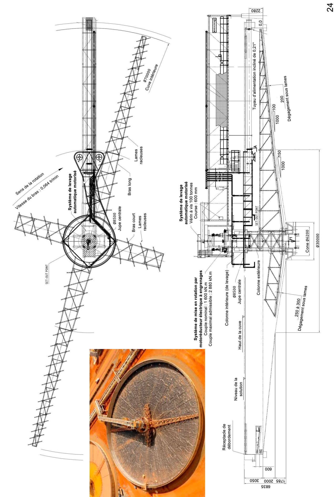

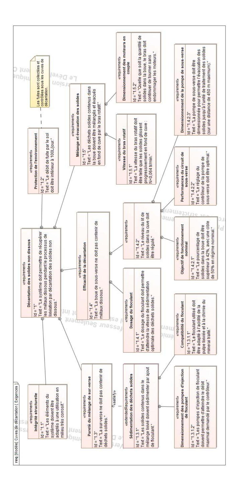

**Document annexe A2 : Diagramme partiel des exigences** 

## **Document annexe A3 : Documentation des moteurs asynchrones**

|            |                |                |                    |              | ency [<br>full loa |              | [cos | er facto<br>φ]<br>full loa |      | Curre                        | nt                                                |                                      | Torque                          |                                                   |                                              |                                                 |                                                                     | Weight                              |
|------------|----------------|----------------|--------------------|--------------|--------------------|--------------|------|----------------------------|------|------------------------------|---------------------------------------------------|--------------------------------------|---------------------------------|---------------------------------------------------|----------------------------------------------|-------------------------------------------------|---------------------------------------------------------------------|-------------------------------------|
| kW         | Motor fr       | ame            | Speed<br>[ r/min ] | 100          | 75                 | 50           | 100  | 75                         | 50   | Full load I <sub>N</sub> [A] | Locked<br>rotor<br>I <sub>L</sub> /I <sub>N</sub> | t <sub>E</sub> 1)<br>time<br>[ sec ] | Full load T <sub>N</sub> [ Nm ] | Locked<br>rotor<br>T <sub>L</sub> /T <sub>N</sub> | Pull<br>up<br>T <sub>U</sub> /T <sub>N</sub> | Break<br>down<br>T <sub>B</sub> /T <sub>N</sub> | Moment<br>of Inertia<br>J=½GD <sup>2</sup><br>[ kg•m <sup>2</sup> ] | of foot<br>mount<br>motor<br>[ kg ] |
| 0.37       | 80A            | - 19           | 930                | 69.3         | 69.4               | 65.4         | 0.71 | 0.61                       | 0.48 | 1.1                          | 3.9                                               | <u>W</u>                             | 3.8                             | 1.8                                               | 1.4                                          | 2.4                                             | 0.0004                                                              | 20                                  |
| 0.55       | 80B            | - 19           | 930                | 72.3         | 72.3               | 68.5         |      | 0.60                       | 0.46 | 1.6                          | 4.2                                               | _                                    | 5.6                             | 2.1                                               | 1.7                                          | 2.7                                             | 0.0005                                                              | 21                                  |
| 0.75       | 905            | - 24           | 950                | 79.1         | 78.8               |              | 0.70 | 0.61                       | 0.48 | 1.9                          | 5.3                                               | 45                                   | 7.5                             | 2.2                                               | 1.8                                          | 2.7                                             | 0.0007                                                              | 28                                  |
| 1.1        | 90L            | - 24           | 950                | 80.6         | 80.5               |              | 0.70 | 0.61                       |      | 2.7                          | 5.1                                               | 25                                   | 11.1                            | 2.3                                               | 1.8                                          | 2.7                                             | 0.0009                                                              | 32                                  |
| 1.5        | 100L           | - 28           | 970                | 82.4         | 81.5               | 78.0         | 0.72 | 0.63                       | 0.50 | 3.6                          | 6.5                                               | 20                                   | 14.8                            | 2.3                                               | 1.8                                          | 2.9                                             | 0.0017                                                              | 49                                  |
| 2.2        | 112M           | - 28           | 960                | 84.0         | 84.0               | 81.7         | 0.73 | 0.65                       | 0.51 | 5.0                          | 6.4                                               | 17                                   | 21.9                            | 2.4                                               | 1.7                                          | 2.9                                             | 0.035                                                               | 53                                  |
| 3          | 132S           | - 38           | 975                | 87.0         | 87.1               | 85.5         | 0.77 | 0.70                       | 0.57 | 6.2                          | 7.1                                               | 20                                   | 29.4                            | 2.0                                               | 1.4                                          | 2.8                                             | 0.007                                                               | 78                                  |
| 4          | 132MA          | - 38           | 970                | 86.9         | 87.5               | 86.5         | 0.79 | 0.73                       | 0.60 | 8.2                          | 6.7                                               | 12                                   | 39.4                            | 2.3                                               | 1.8                                          | 2.6                                             | 0.009                                                               | 91                                  |
| 5.5        | 132MB          | - 38           | 970                | 87.8         | 88.6               | 87.9         | 0.79 | 0.73                       | 0.62 | 11.0                         | 7.0                                               | 11                                   | 54.1                            | 2.0                                               | 1.9                                          | 2.6                                             | 0.046                                                               | 100                                 |
| 7.5        | 160M           | - 42           | 975                | 89.4         | 89.5               | 88.3         | 0.78 | 0.73                       | 0.62 | 15.0                         | 6.3                                               | 15                                   | 73.5                            | 2.5                                               | 1.9                                          | 2.8                                             | 0.11                                                                | 139                                 |
| 11         | 160L           | - 42           | 970                | 89.7         | 89.8               | 88.5         | 0.76 | 0.70                       | 0.57 | 22.5                         | 7.2                                               | 19                                   | 108                             | 2.5                                               | 1.9                                          | 2.6                                             | 0.13                                                                | 161                                 |
| 15         | 180L           | - 48           | 975                | 90.6         | 91.1               | 90.4         | 0.86 | 0.81                       | 0.69 | 27.0                         | 7.5                                               | 12                                   | 147                             | 2.4                                               | 2.0                                          | 2.6                                             | 0.25                                                                | 211                                 |
| 18.5       | 200LA          | - 55           | 985                | 91.8         | 91.9               | 90.7         | 0.84 | 0.79                       | 0.68 | 33.5                         | 7.4                                               | 10                                   | 179                             | 2.7                                               | 1.9                                          | 2.7                                             | 0.31                                                                | 262                                 |
| 22         | 200LB          | - 55           | 975                | 91.6         | 92.2               | 91.8         | 0.85 | 0.83                       | 0.76 | 39.5                         | 6.8                                               | 13                                   | 215                             | 2.4                                               | 1.8                                          | 2.6                                             | 0.41                                                                | 282                                 |
| 30         | 225M           | - 60           | 985                | 92.8         | 92.7               | 91.6         | 0.84 | 0.80                       | 0.75 | 54                           | 7.0                                               | 25                                   | 291                             | 2.4                                               | 2.0                                          | 3.0                                             | 0.67                                                                | 373                                 |
| 37         | 250S           | - 70           | 985                | 93.0         | 93.5               | 93.1         | 0.88 | 0.87                       | 0.82 | 63                           | 6.5                                               | 15                                   | 359                             | 2.1                                               | 1.6                                          | 2.6                                             | 0.94                                                                | 443                                 |
| 45         | 250M           | - 70           | 990                | 93.9         | 94.2               |              | 0.90 | 0.88                       | 0.83 | 75                           | 7.0                                               | 20                                   | 434                             | 2.2                                               | 1.8                                          | 2.6                                             | 1.15                                                                | 501                                 |
| 55         | 280S           | - 80           | 994                | 94.8         | 94.8               | 94.3         |      | 0.89                       | 0.87 | 90                           | 6.6                                               | 20                                   | 528                             | 2.4                                               | 1.9                                          | 2.7                                             | 1.82                                                                | 613                                 |
| 75         | 280M           | - 80           | 992                | 94.9         | 95.0               |              | 0.90 | 0.89                       | 0.83 | 123                          | 6.6                                               | 13                                   | 722                             | 2.8                                               | 2.1                                          | 3.0                                             | 2.33                                                                | 735                                 |
| 90         | 315S           | - 85           | 991                | 94.9         | 94.8               | 93.9         | 0.87 | 0.84                       | 0.77 | 152                          | 6.6                                               | 22                                   | 867                             | 2.2                                               | 1.8                                          | 2.6                                             | 4.57                                                                | 1015                                |
| 110        | 315MA          | - 85           | 991                | 95.5         | 95.6               | 95.1         | 0.86 | 0.84                       | 0.77 | 185                          | 6.1                                               | 15                                   | 1060                            | 2.1                                               | 2.0                                          | 3.4                                             | 4.83                                                                | 1075                                |
| 132        | 315MB          | - 85           | 990                | 95.4         | 95.6               |              | 0.87 | 0.85                       | 0.80 | 222                          | 6.1                                               | 7                                    | 1274                            | 2.0                                               | 1.5                                          | 2.4                                             | 5.32                                                                | 1145                                |
| 150        | 315L           | - 85           | 990                | 95.5         | 95.8               | 95.5         | 0.90 | 0.90                       | 0.89 | 244                          | 6.0                                               | 10                                   | 1447                            | 2.3                                               | 1.4                                          | 2.3                                             | 5.95                                                                | 1170                                |
| 185        | 315LX          | - 85           | 990                | 95.8         | 95.9               | 95.9         | 0.88 | 0.88                       | 0.86 | 306                          | 4.9                                               | 6                                    | 1785                            | 2.2                                               | 1.3                                          | 2.1                                             | 6.64                                                                | 1570                                |
| 200        | 355LA          | - 110          | 989                | 95.8         | 96.0               | 95.7         | 0.87 | 0.86                       | 0.80 | 334                          | 5.5                                               | 8                                    | 1931                            | 1.7                                               | 1.1                                          | 2.3                                             | 8.63                                                                | 1900                                |
| 220        | 355LB<br>355LC | - 110<br>- 110 |                    | 95.7<br>96.1 | 96.1<br>96.3       | 96.0<br>96.0 | 0.88 | 0.88                       | 0.84 | 362<br>415                   | 5.2<br>5.7                                        | 9                                    | 2129<br>2414                    | 1.6<br>1.5                                        | 1.0<br>1.1                                   | 2.2                                             | 9.17<br>9.83                                                        | 1985<br>2050                        |
| 250<br>280 | 355LD          | - 110          |                    | 95.9         | 96.3               |              | 0.87 | 0.86                       | 0.82 | 462                          | 5.7                                               | 9                                    | 2704                            | 1.5                                               | 0.8                                          | 2.4                                             | 10.64                                                               | 2150                                |
| 315        | 355LX          | - 110          |                    | 96.1         | 96.2               | 95.7         | 0.88 | 0.86                       | 0.81 | 521                          | 6.1                                               | 7                                    | 3033                            | 1.4                                               | 1.2                                          | 2.5                                             | 11.25                                                               | 2245                                |
| 355        | 400LA          | - 110          |                    | 96.6         | 96.6               | 96.0         | 0.88 | 0.86                       | 0.80 | 584                          | 8.1                                               | 8                                    | 3411                            | 2.4                                               | 1.3                                          | 3.0                                             | 16.56                                                               | 2790                                |
| 400        | 400LA          | - 110          | 50733000           | 96.9         | 97.0               | 96.7         | 0.88 | 0.86                       | 0.81 | 655                          | 7.6                                               | 7                                    | 3847                            | 2.3                                               | 1.3                                          | 2.8                                             | 19.26                                                               | 2960                                |
| 450        | 400LX          | - 110          |                    | 96.6         | 96.8               | 96.7         | 0.88 | 0.87                       | 0.83 | 737                          | 7.9                                               | 8                                    | 4323                            | 2.3                                               | 0.8                                          | 2.8                                             | 20.34                                                               | 3050                                |
|            |                |                |                    |              |                    |              |      |                            |      |                              |                                                   | 7                                    | 4804                            |                                                   |                                              |                                                 |                                                                     |                                     |
| 500        |                | - 110          |                    | 96.7         | 96.6               |              | 0.87 | 0.85                       | 0.79 | 824                          | 8.4                                               |                                      |                                 | 2.7                                               | 1.4                                          | 3.1                                             | 21.83                                                               | 3140                                |
| 630        | 450L           | - 125          |                    | 96.7         | 96.3               | 95.4         | 0.86 | 0.85                       | 0.79 | 1055                         | 6.6                                               | -                                    | 6047                            | 2.2                                               | 1.7                                          | 2.9                                             | 36.5                                                                | 4800                                |
| 800        | 450L           | - 125          | 995                | 96.7         | 96.4               | 95.5         | 0.86 | 0.85                       | 0.78 | 8102)                        | 8.0                                               | 40                                   | 7678                            | 2.4                                               | 2.0                                          | 3.2                                             | 43.1                                                                | 5800                                |

## **Document annexe A4 : Description des blocs du modèle multiphysique**

| Solide en rotation autour<br>d'un axe fixe | Mesure d'un couple de<br>rotation   |
|--------------------------------------------|-------------------------------------|
| Couple imposé à partir d'un<br>signal      | Visualisation d'un signal           |
| Bâti (référentiel galiléen<br>d'étude)     | Constante                           |
| Force imposée à partir d'un<br>signal      | Force électromotrice en<br>rotation |
| Mesure d'un courant                        | Signal sinusoïdal                   |

## **Document annexe A5 : Documentation technique des capteurs à jauge de déformation utilisés pour mesurer les couples des moteurs**

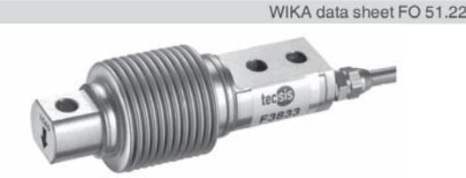

| Maximum bending | 1 mm |
|-----------------|------|
|                 |      |
|                 |      |
|                 |      |
|                 |      |
|                 |      |
|                 |      |
|                 |      |
|                 |      |
|                 |      |
|                 |      |
|                 |      |
|                 |      |

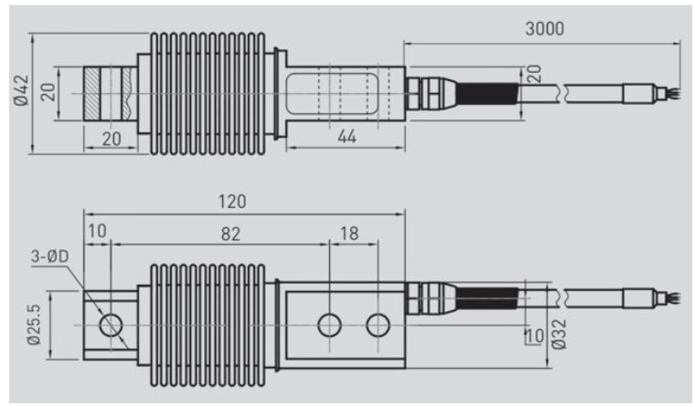

| Nominal load                            | Dimensions in mm |
|-----------------------------------------|------------------|
| in kg                                   | D                |
| 5/10/20/30/40/50/75/<br>100/150/200/250 | 8.2              |
| 300 / 500                               | 10.2             |

## **Document annexe A6 : Éléments d'écriture d'un diagramme d'états-transitions**

État initial

État final

## **État**

entry / Action 1 do / Action 2 exit / Action 3

Situation d'une durée finie, pendant laquelle des actions peuvent avoir lieu :

- *entry / Action 1* indique que l'action 1 est faite en entrant dans l'état
- *do / Action 2* indique que l'action 2 est faite pendant l'activation de l'état
- *exit / Action 3* indique que l'action 3 est faite en sortant de l'état

événement [condition]

Transition d'un état à un autre, à laquelle peut être associé un événement et/ou une condition.

Certains mots clés sont utilisés en particulier :

- *after x s* : après x secondes
- *at h* : à l'heure indiquée
- *when x=xc* : lorsqu'une valeur particulière est atteinte

# Document annexe A7 : Résultats de simulation de l'asservissement du couple sur le bras rotatif

La simulation est réalisée avec un couple consigne constant  $C_{cons}$  = 2800 kN·m et des variations de  $\rho_{pulpe}$  d'amplitudes différentes à t = 400 min, 640 min, 1480 min, 1960 min et 2310 min.

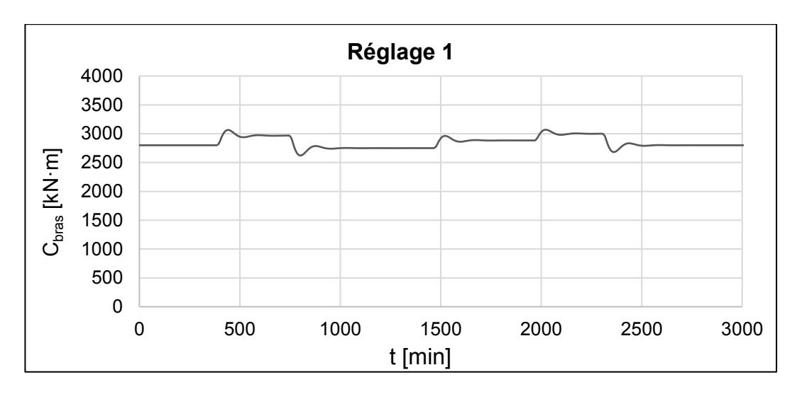

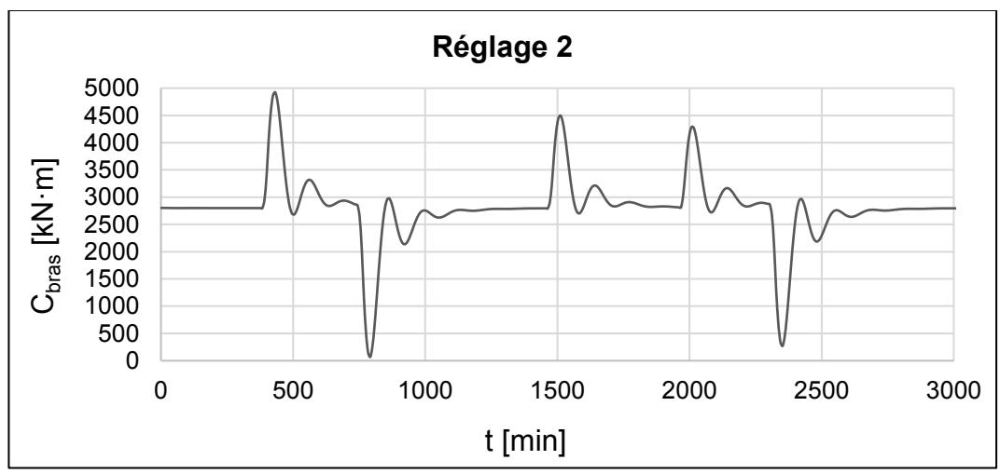

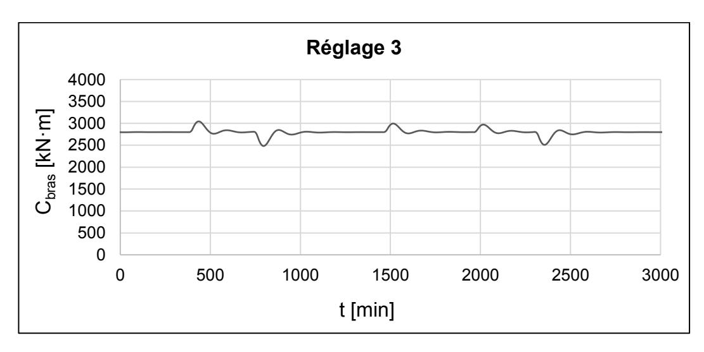

| Marge<br>porisati<br>on<br>de tem                                                                                                           | Si1-11      | 2                            | 8                            |
|---------------------------------------------------------------------------------------------------------------------------------------------|-------------|------------------------------|------------------------------|
| que util<br>e ?<br>mécani<br>énergie<br>ent qua<br>ntifier l'<br>Comm                                                                       | Si1-10      | 3                            | 12                           |
| systèm<br>ants ?<br>es dist<br>er plusi<br>muniqu<br>eurs<br>e com<br>ent fair<br>Comm                                                      | Si1-9       | 2                            | 8                            |
| ment ?<br>mouve<br>er le<br>modifi<br>re et/ou<br>nsmett<br>ent tra<br>Comm                                                                 | Si1-8       | 3                            | 12                           |
| systèm<br>e réel ?<br>perfor<br>d'un<br>mance<br>uler la<br>ent sim<br>Comm                                                                 | Si1-7       | 3                            | 12                           |
| ge<br>Challen                                                                                                                               | Si1-6       | 3                            | 12                           |
| 'un sys<br>compo<br>x ?<br>ntre eu<br>tème e<br>sants d<br>muniqu<br>er les<br>e com<br>ent fair<br>Comm                                    | Si1-5       | 3                            | 12                           |
| d'un sy<br>?<br>stème<br>es perf<br>ces<br>orman<br>surer l<br>ent me<br>Comm                                                               | Si1-4       | 3                            | 12                           |
| d'un sy<br>?<br>stème<br>omport<br>me<br>autono<br>ement<br>er le c<br>autoris<br>tions p<br>our<br>nforma<br>ter les i<br>ent trai<br>Comm | Si1-3       | 3                            | 12                           |
| un syst<br>tique d'<br>énergé<br>ème ?<br>ficacité<br>luer l'ef<br>ent éva<br>Comm                                                          | Si1-2       | 4                            | 16                           |
| soin ?<br>à un be<br>ure rép<br>ent app<br>onse<br>meille<br>orter la<br>Comm                                                               | Si1-1       | 2                            | 8                            |
| matiques :<br>Problé                                                                                                                        | Séquences : | maines :<br>mbre de se<br>No | mbre d'heures élèves :<br>No |

## Document annexe A9 : Fiche de séquence

| 1 <sup>ère</sup><br>spécialité<br>SI | FICHE PÉDAGOGI<br>SÉQUENCI       |                             | DE        |      |   | ADEM | 1IE |
|--------------------------------------|----------------------------------|-----------------------------|-----------|------|---|------|-----|
|                                      | PROBLEMATION                     | QUE                         |           |      |   |      |     |
| Permettre ur                         | ne amélioration des performances | des sys                     | tèmes étu | diés |   |      |     |
|                                      | OBJET OU SYSTEME TECHNIQUE       | POSITIONNEMENT DANS L'ANNEE |           |      |   |      |     |
| Tapis de cou                         | rse                              | DEBUT D'ANNEE               |           |      |   |      |     |
| Barrière de p                        | péage                            | D'ANNEE                     |           |      |   |      |     |
| Robot tonde                          | use                              |                             |           |      |   | Χ    |     |
| Skate électri                        | que                              |                             |           |      | • |      |     |

| Compétences développées                                                                                                    | Connaissances associées                                                                                                                                                              | Tâches élèves                                                                                                       |  |  |  |  |
|----------------------------------------------------------------------------------------------------------------------------|--------------------------------------------------------------------------------------------------------------------------------------------------------------------------------------|---------------------------------------------------------------------------------------------------------------------|--|--|--|--|
| Analyser le besoin, l'organisation matérielle et fonctionnelle d'un produit par une démarche d'ingénierie système          | fonctionnels, définition des exigences et des<br>critères associés, cas d'utilisations, analyse<br>structurelle                                                                      | Analyse SYSML du système<br>(diagramme de définition de blocs,<br>diagramme de blocs internes,<br>diagramme d'état) |  |  |  |  |
| Conduire des essais en toute sécurité à partir d'un protocole expérimental fourni                                          | Règle de raccordement des appareils de mesure et des capteurs                                                                                                                        | Mesurer les caractéristiques<br>cinématiques du système                                                             |  |  |  |  |
| Caractériser les grandeurs physiques en entrées/sorties d'un modèle multi-physique traduisant la transmission de puissance | Grandeur effort, grandeur flux<br>Énergie<br>Puissance instantanée, moyenne<br>Réversibilité de la chaîne de puissance                                                               | Établir la loi d'entrée/des chaines de<br>puissance                                                                 |  |  |  |  |
| Modéliser les mouvements Modéliser les actions mécaniques  4                                                               | Trajectoires et mouvement Liaisons Torseurs cinématiques et d'actions mécaniques transmissibles, de contact ou à distance Réciprocité mouvement relatif/actions mécaniques associées | Calculer une loi d'entrée/sortie d'une<br>chaine de puissance                                                       |  |  |  |  |

## Prérequis des élèves

Connaissance des outils d'analyse systémique SYSML et des éléments constitutifs d'une chaine de puissance.

## Présentation de la séquence

La démarche consiste à l'analyse de documents existants pour comprendre le système (SySML, modèle multi-physique de la chaine de puissance théorique), de mesurer les grandeurs physiques étudiées, puis de compléter le modèle multi-physique pour trouver en simulant une réponse au cahier des charges.

# **Document annexe A10 : Descriptif de la séquence**

|          |                          | Déroule                                                                                                                                                                                                                                            | ment	de	la	séquence                                                                                                                                                                                                                                             |                                                                                                                                                                                                                                                                                   |
|----------|--------------------------|----------------------------------------------------------------------------------------------------------------------------------------------------------------------------------------------------------------------------------------------------|-----------------------------------------------------------------------------------------------------------------------------------------------------------------------------------------------------------------------------------------------------------------|-----------------------------------------------------------------------------------------------------------------------------------------------------------------------------------------------------------------------------------------------------------------------------------|
|          | Organisation             | Contenu                                                                                                                                                                                                                                            | Compétences du programme visées                                                                                                                                                                                                                                 | Descriptif de la séance                                                                                                                                                                                                                                                           |
| Séance 1 | 1 heure classe entière   | Présentation de la problématique : comment améliorer les<br>performances d'un système en modélisant sa chaine de<br>Définition du cahier des charges, pistes de résolution du<br>Analyse du besoin<br>puissance ?<br>problème                      | Analyser le besoin, l'organisation matérielle<br>et fonctionnelle d'un produit par une<br>démarche d'ingénierie système                                                                                                                                         | performance du système étudié, il s'agit d'identifier la loi d'entrée<br>Suite à un cahier des charges exigeant une amélioration de<br>sortie de la cinématique de la chaine étudiée                                                                                              |
| Séance 2 | 3 heures effectif réduit | Prises de mesures sur les supports du laboratoire<br>Élaboration de protocoles de mesures<br>Étude de la chaine de puissance :<br>Analyse des composants                                                                                           | nécessaire au fonctionnement d'un produit ou<br>Conduire des essais en toute sécurité à partir<br>Repérer les échanges d'énergie sur un<br>Caractériser la puissance et l'énergie<br>d'un protocole expérimental fourni<br>diagramme structurel<br>d'un système | Ils mesurent ensuite, avec une caméra, les cinématiques des chaines de<br>Les élèves, par groupes de 3, complètent la chaine de puissance sur<br>document réponse fourni, à l'aide de documents numériques sur les<br>supports du laboratoire fournis.<br>puissances des systèmes |
| Séance 3 | 3 heures effectif réduit | Appropriation d'un modèle multiphysique représentant la<br>chaine de puissance du support mesuré précédemment<br>Recherche et simulation de solutions<br>Implantation des valeurs mesurées                                                         | Associer un modèle aux composants d'une<br>chaine de puissance                                                                                                                                                                                                  | Les élèves par groupes de 3 travaillent sur le modèle multiphysique de<br>caractéristiques associées, puis rentrent les valeurs trouvées grâce aux<br>la chaine de puissance : recherche des divers composants, des<br>mesures effectuées                                         |
| Séance 4 | 1 heure classe entière   | Les différents protocoles de mesures de vitesses et de<br>La modélisation multiphysique, définition de blocs,<br>Les constituants de la chaine de puissance<br>Synthèse des activités précédentes :<br>signaux de commande<br>paramètres influents | nécessaire au fonctionnement d'un produit ou<br>Caractériser la puissance et l'énergie<br>d'un système                                                                                                                                                          | expliquant les principes de la chaine de puissance, les moyens de<br>mesures utilisés. Il montre et explique les principes d'un modèle<br>Le professeur effectue la synthèse de l'activité précédente en<br>multiphysique de la chaine de puissance étudiée                       |
| Séance 5 | 1 heure classe entière   | Evaluation sommative                                                                                                                                                                                                                               | A définir                                                                                                                                                                                                                                                       | A définir                                                                                                                                                                                                                                                                         |
| Séance 6 | 3 heures effectif réduit | Correction et remédiation                                                                                                                                                                                                                          |                                                                                                                                                                                                                                                                 |                                                                                                                                                                                                                                                                                   |

| No                                                                                                                                                                                                                                                                                                                                                                                                                                                                                                                                                                                            | Modèle CMEN-DOC v2 ©NEOPTEC  Nom de famille: (Suivi, s'il y a lieu, du nom d'usage)          |  |  |  |  |  |   |        |     |  |       |      |  |    |       |     |                  |      |  |  |
|-----------------------------------------------------------------------------------------------------------------------------------------------------------------------------------------------------------------------------------------------------------------------------------------------------------------------------------------------------------------------------------------------------------------------------------------------------------------------------------------------------------------------------------------------------------------------------------------------|----------------------------------------------------------------------------------------------|--|--|--|--|--|---|--------|-----|--|-------|------|--|----|-------|-----|------------------|------|--|--|
|                                                                                                                                                                                                                                                                                                                                                                                                                                                                                                                                                                                               | Prénom(s):                                                                                   |  |  |  |  |  |   |        |     |  |       |      |  |    |       |     |                  |      |  |  |
|                                                                                                                                                                                                                                                                                                                                                                                                                                                                                                                                                                                               | Numéro<br>Inscription :                                                                      |  |  |  |  |  |   |        |     |  | Né(e) | le : |  |    | /     |     | $\overline{ / }$ |      |  |  |
| (Le numéro est celui qui figure sur la convocation ou la feuille d'émargement)                                                                                                                                                                                                                                                                                                                                                                                                                                                                                                                |                                                                                              |  |  |  |  |  |   |        |     |  |       |      |  |    |       |     |                  |      |  |  |
|                                                                                                                                                                                                                                                                                                                                                                                                                                                                                                                                                                                               | (Remplir cette partie à l'aide de la notice)  Concours / Examen : Section/Spécialité/Série : |  |  |  |  |  |   |        |     |  |       |      |  |    |       |     |                  |      |  |  |
|                                                                                                                                                                                                                                                                                                                                                                                                                                                                                                                                                                                               | Epreuve:                                                                                     |  |  |  |  |  | N | /latiè | re: |  |       |      |  | Se | ssior | ı : | <br>             | <br> |  |  |
| <ul> <li>Remplir soigneusement, sur CHAQUE feuille officielle, la zone d'identification en MAJUSCULES.</li> <li>Ne pas signer la composition et ne pas y apporter de signe distinctif pouvant indiquer sa provenance.</li> <li>Numéroter chaque PAGE (cadre en bas à droite de la page) et placer les feuilles dans le bon sens et dans l'ordre.</li> <li>Rédiger avec un stylo à encre foncée (bleue ou noirie) et ne pas utiliser de stylo plume à encre claire.</li> <li>N'effectuer aucun collage ou découpage de sujets ou de feuille officielle. Ne joindre aucun brouillen.</li> </ul> |                                                                                              |  |  |  |  |  |   |        |     |  |       |      |  |    |       |     |                  |      |  |  |

EDE STI 1

# DR1 à DR3

Tous les documents réponses sont à rendre, même non complétés.

## **NE RIEN ECRIRE DANS CE CADRE**

## **Document Réponse R1 : Chaîne de puissance de la mise en rotation des bras**

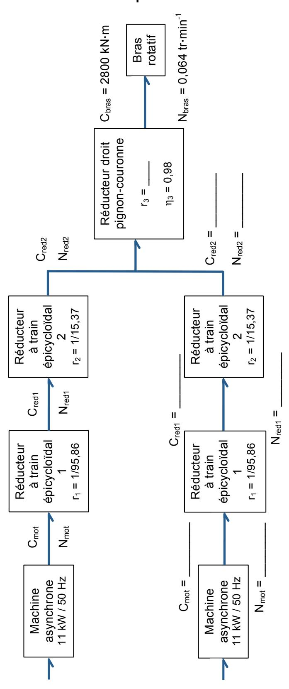

## 

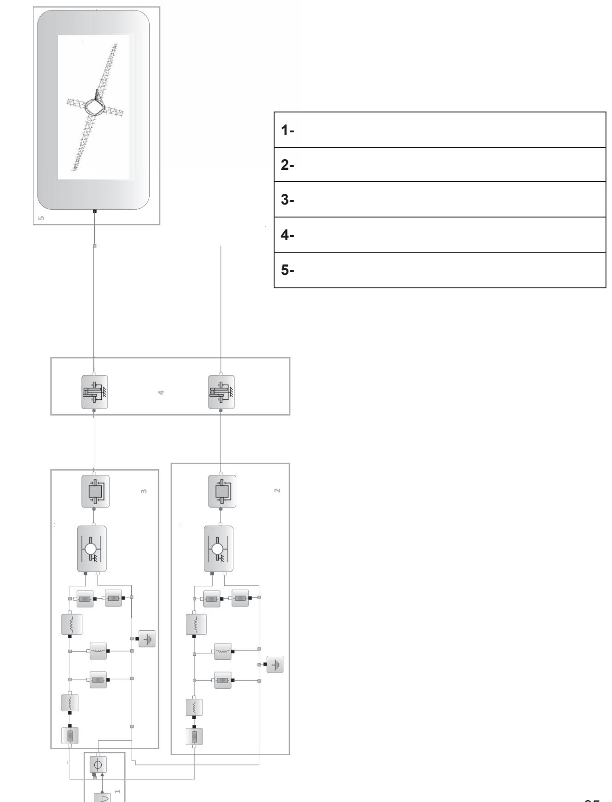

## Document Réponse R3 : Extrait de la fonction de commande de la sonde

```
# -*-coding:Latin-1 -*
import os
import numpy
import matplotlib.pyplot as plt
#définition de la valeur du codeur incrémental
Kcod =.....
## Ouverture et lecture du fichier de donnees mesurées par la sonde
fichierIn = "courbe sonde .CSV"
with open (fichierIn, "r") as file:
   valeurs = file.read()
#Initialisation de la liste de mesures
mesures = []
#Stockage des valeurs mesurée par la sonde dans la première colonne de mesures
for val in valeurs:
   mesures.append(float(val.split(";")[0]))
## Ouverture et lecture du fichier de donnees mesurées par le codeur
fichierIn2 = "courbe codeur.CSV"
with open (fichierIn2, "r") as file:
   valeurs2 = file.read()
#Stockage des valeurs mesurée par le codeur dans la seconde colonne de mesures
for val2 in valeurs2:
   mesures.append(float(val2.split(";")[1]))
#Création d'une variable égale à la longueur de la liste mesures
long= []
long=len (mesures)
#Fonction d'affichage de la profondeur (dernière valeur mesurée)
def affichage mesures(mesures):
   if mesures[long][0].....
       floculant = .....
   9159
       floculant = .....
profondeur = .....
#Affichage valeur profondeur
print("profondeur de la sonde en m =" + str(profondeur))
#Affichage de la consigne d'ajout ou non de floculant
print(.....)
```

| No        | DOC v2 ©NEOPTEC  m de famille : a lieu, du nom d'usage)                                                                        |                                     |                                       |                               |                              |                               |                               |                              |                              |                            |                                           |                            |                          |              |          |     |      |      |      |
|-----------|--------------------------------------------------------------------------------------------------------------------------------|-------------------------------------|---------------------------------------|-------------------------------|------------------------------|-------------------------------|-------------------------------|------------------------------|------------------------------|----------------------------|-------------------------------------------|----------------------------|--------------------------|--------------|----------|-----|------|------|------|
|           | Prénom(s) :                                                                                                                    | П                                   |                                       |                               |                              |                               |                               |                              |                              |                            |                                           |                            |                          |              |          |     |      |      |      |
|           | Numéro<br>Inscription :                                                                                                        |                                     |                                       |                               |                              |                               |                               |                              |                              |                            | Né(e                                      | le :                       |                          |              | /        |     | ]/   |      |      |
|           | (Li                                                                                                                            | e numéro                            | est celui qu                          | ii figure                     | sur la co                    | onvoca                        | tion ou                       | la feuili                    | e d'ém                       | argeme                     | nt)                                       |                            |                          |              |          |     |      | <br> |      |
|           | à l'aide de la notice)<br><b>LEXAMEN:</b>                                                                                      |                                     |                                       |                               |                              |                               | S                             | ectio                        | n/Sp                         | écia                       | lité/Séri                                 | e:                         |                          |              |          |     | <br> | <br> | <br> |
|           | Epreuve:                                                                                                                       |                                     |                                       |                               |                              |                               | N                             | /latiè                       | re:                          |                            |                                           |                            |                          | Se           | ssior    | ı : | <br> | <br> | <br> |
| CONSIGNES | <ul> <li>Remplir soigne</li> <li>Ne pas signer</li> <li>Numéroter che</li> <li>Rédiger avec</li> <li>N'effectuer au</li> </ul> | · la compo<br>aque PA<br>un stylo a | osition et<br>GE (cadre<br>à encre fo | ne pas<br>e en ba<br>oncée (l | y appo<br>s à dro<br>bleue d | orter d<br>oite de<br>ou noir | le sign<br>la pag<br>re) et i | ne disti<br>ge) et<br>ne pas | nctif p<br>placer<br>utilise | ouvan<br>les fe<br>er de s | t indiquer s<br>uilles dans<br>tylo plume | a prov<br>le bon<br>à encr | enanc<br>sens<br>e clair | et dan<br>e. | s l'ordr | e.  |      |      |      |

EDE STI 1

# DR4 à DR6

Tous les documents réponses sont à rendre, même non complétés.

## NE RIEN ECRIRE DANS CE CADRE

## Document Réponse R4 : Extrait de la fonction de commande de la sonde

Figure à compléter avec les tracés nécessaires à l'identification du gain K en  $kN \cdot m \cdot V^{-1}$  et de la constante de temps  $\tau$  en minutes :

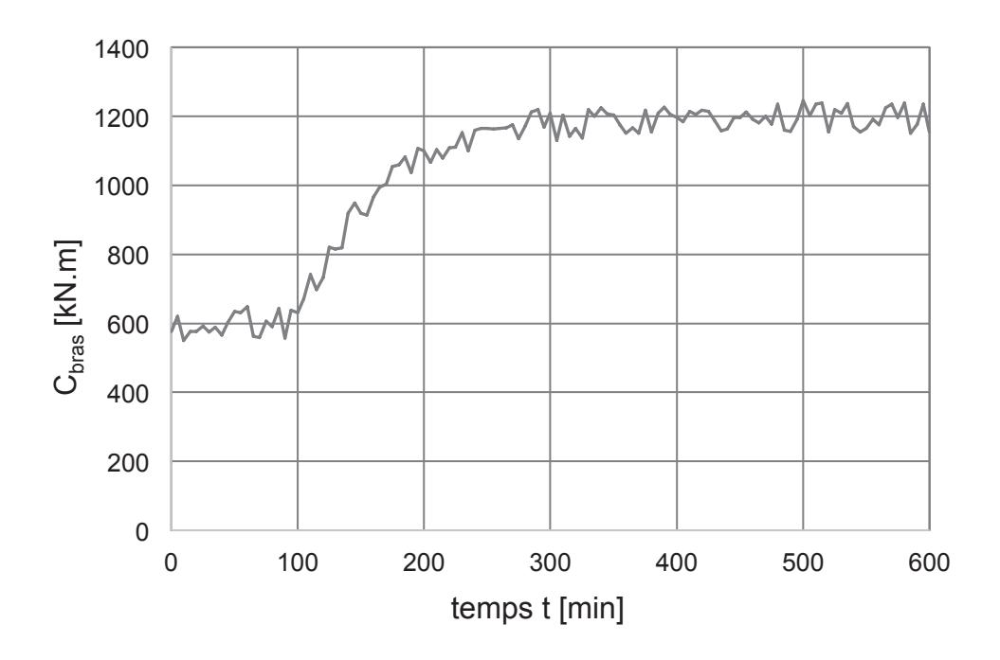

## **Document Réponse R5 : Étude de la cuve**

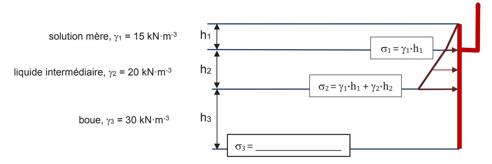

*Poussées horizontales des fluides contre la paroi* 

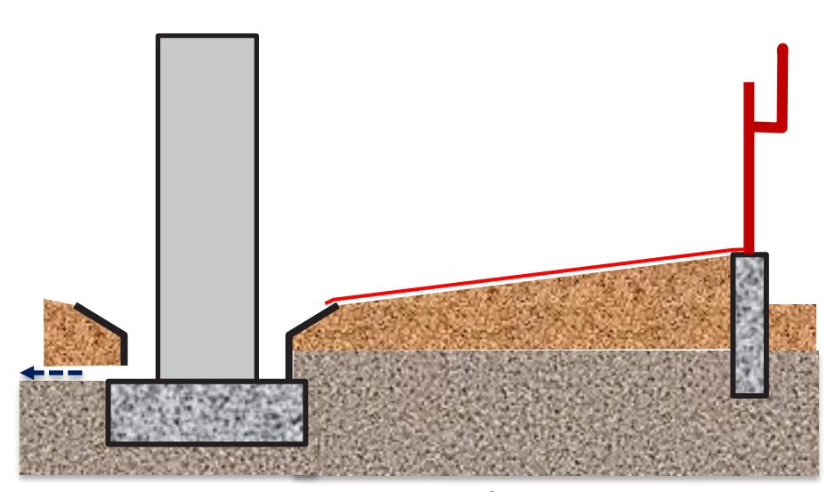

*Repérage des points de fuite potentiels* 

## **Document Réponse R6 : Schéma de synthèse de l'étude**

| <br>Boue à 35 % de déchets solides en surverse                                                                                      |  |
|--------------------------------------------------------------------------------------------------------------------------------------|--|
| Cbras = 500 kN·m                                                                                                                     |  |
| Moteurs en régime permanent                                                                                                          |  |
| Optimisation du procédé                                                                                                              |  |
| <br>Boue à 50 % de déchets solides en surverse                                                                                      |  |
| Cbras<br>= 2800 kN·m                                                                                                                 |  |
| Moteurs en régime permanent                                                                                                          |  |
| petites variations du<br><br>pourcentage de solides<br>Risque de fuites<br>Risque d'endommager les moteurs<br>en régime transitoire |  |
| <br><br>Solution 2 envisagée :<br>Solution 1 mise en œuvre :<br><br><br><br><br><br>                                               |  |

| Modèle CMEN-D                  | OCC v2 ©NEOPTEC                                                                                                                  |                                    |                                       |                              |                              |                               |                               |                                           |                               |                            |                                         |                             |                            |              |          |     |      |      |      |
|--------------------------------|----------------------------------------------------------------------------------------------------------------------------------|------------------------------------|---------------------------------------|------------------------------|------------------------------|-------------------------------|-------------------------------|-------------------------------------------|-------------------------------|----------------------------|-----------------------------------------|-----------------------------|----------------------------|--------------|----------|-----|------|------|------|
|                                | lieu, du nom d'usage)                                                                                                            | Ш                                  |                                       |                              |                              |                               |                               |                                           |                               |                            |                                         |                             |                            |              |          |     |      |      |      |
|                                | Prénom(s) :                                                                                                                      |                                    |                                       |                              |                              |                               |                               |                                           |                               |                            |                                         |                             |                            |              |          |     |      |      |      |
|                                | Numéro<br>Inscription :                                                                                                          |                                    |                                       |                              |                              |                               |                               |                                           |                               |                            | Né(e                                    | ) le :                      |                            |              | /        |     | ]/   |      |      |
|                                | (Le                                                                                                                              | e numéro e                         | est celui qu                          | i figure :                   | sur la co                    | onvoca                        | tion ou                       | la feuill                                 | le d'ém                       | argeme                     | ent)                                    |                             |                            |              |          |     |      |      |      |
| (Remplir cette partie Concours | à l'aide de la notice) / Examen :                                                                                                |                                    |                                       |                              |                              |                               | S                             | ectio                                     | n/Sp                          | oécia                      | lité/Sér                                | ie :                        |                            |              |          |     | <br> | <br> | <br> |
|                                | Epreuve:                                                                                                                         |                                    |                                       |                              |                              |                               | N                             | /latiè                                    | re:                           |                            |                                         |                             |                            | Se           | ssior    | າ : | <br> | <br> | <br> |
| CONSIGNES                      | <ul> <li>Remplir soigne</li> <li>Ne pas signer</li> <li>Numéroter cha</li> <li>Rédiger avec u</li> <li>N'effectuer au</li> </ul> | la compo<br>aque PAC<br>un stylo à | osition et<br>GE (cadre<br>a encre fo | ne pas<br>e en ba<br>ncée (l | y appo<br>s à dro<br>bleue o | orter d<br>oite de<br>ou noii | le sign<br>la pag<br>re) et i | ne disti<br>ge) et <sub>l</sub><br>ne pas | inctif p<br>placer<br>utilise | ouvan<br>les fe<br>er de s | t indiquer<br>uilles dans<br>tylo plume | sa prov<br>le bon<br>à encr | renand<br>sens<br>re clair | et dan<br>e. | s l'ordr | e.  |      |      |      |

EDE STI 1

# DR7 et DR8

Tous les documents réponses sont à rendre, même non complétés.


| <br><br><br><br>         |                                            |                                 |                                           |
|-------------------------------------------------|--------------------------------------------|---------------------------------|-------------------------------------------|
| <br><br><br><br><br><br><br> |                                            |                                 |                                           |
| <br><br><br><br><br>         |                                            |                                 |                                           |
| <br><br><br><br><br>        |                                            |                                 |                                           |
|                                                 | <br><br><br><br><br> | <br><br><br> | <br><br><br><br><br> |

# Document Réponse R8 : Évaluation de la séquence proposée

| PROBLEMATIQUE DE | Déterminer si la sonde a une vitesse adéquate pour éviter toute |
|------------------|-----------------------------------------------------------------|
| L'EVALUATION     | collision avec les bras de la cuve                              |

| •                                                                                            | -                                     |
|----------------------------------------------------------------------------------------------|---------------------------------------|
| Questions posées (question 42)                                                               | Compétences évaluées<br>(question 43) |
| A l'aide du diagramme des exigences SYSML fourni, identifier la vitesse de rotation des bras | 1                                     |
|                                                                                              |                                       |
|                                                                                              |                                       |
|                                                                                              |                                       |
|                                                                                              |                                       |
|                                                                                              |                                       |
| Organisation de l'évaluation des compétences restantes                                       | s (question 44)                       |
|                                                                                              |                                       |
| Description succincte de l'activité d'évaluation (que                                        | estion 45)                            |
|                                                                                              | ,                                     |