**EDE ENE 2** 

### **SESSION 2021** \_\_\_\_

# CAPET CONCOURS EXTERNE ET CAFEP CORRESPONDANT

**Section : SCIENCES INDUSTRIELLES DE L'INGÉNIEUR**

**Option : INGÉNIERIE ÉLECTRIQUE**

## **ÉTUDE D'UN SYSTÈME, D'UN PROCÉDÉ OU D'UNE ORGANISATION**

Durée : 4 heures

\_\_\_\_

*Calculatrice électronique de poche - y compris calculatrice programmable, alphanumérique ou à écran graphique – à fonctionnement autonome, non imprimante, autorisée conformément à la circulaire n° 99-186 du 16 novembre 1999.*

*L'usage de tout ouvrage de référence, de tout dictionnaire et de tout autre matériel électronique est rigoureusement interdit.*

*Si vous repérez ce qui vous semble être une erreur d'énoncé, vous devez le signaler très lisiblement sur votre copie, en proposer la correction et poursuivre l'épreuve en conséquence. De même, si cela vous conduit à formuler une ou plusieurs hypothèses, vous devez la (ou les) mentionner explicitement.*

**NB : Conformément au principe d'anonymat, votre copie ne doit comporter aucun signe distinctif, tel que nom, signature, origine, etc. Si le travail qui vous est demandé consiste notamment en la rédaction d'un projet ou d'une note, vous devrez impérativement vous abstenir de la signer ou de l'identifier.**

### **INFORMATION AUX CANDIDATS**

Vous trouverez ci-après les codes nécessaires vous permettant de compléter les rubriques figurant en en-tête de votre copie

Ces codes doivent être reportés sur chacune des copies que vous remettrez.

► Concours externe du CAPET de l'enseignement public :

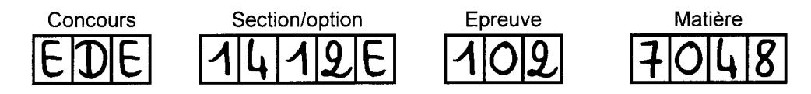

► Concours externe du CAFEP/CAPET de l'enseignement privé :

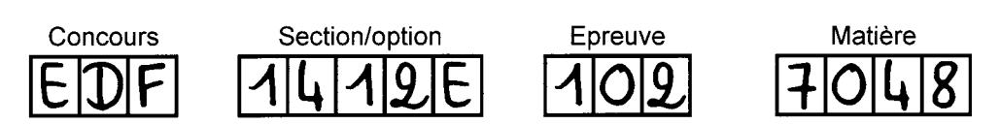

## **CAPET SII – OPTION INGÉNIERIE ÉLECTRIQUE**

**Coefficient 4 – Durée 4 heures**

**Aucun document autorisé** 

### **Ce sujet comporte :**

- présentation et questionnement, pages 2 à 13 ;
- documents techniques, pages 14 à 32 ;
- documents réponses, pages 33 à 34.

# **MISE EN SITUATION**

Le bon fonctionnement du réseau électrique dépend de l'équilibre entre l'offre et la demande. Le développement des sources d'énergies renouvelables connectées au réseau rend plus difficile la gestion de cet équilibre. Cette gestion impose de développer des moyens de stockage de l'énergie. De nombreux systèmes existent qui permettent un stockage par air comprimé, par gravité, dans des batteries, etc., les technologies existent (à grande ou à faible capacité) mais leur rendement demande, pour la plupart, à être amélioré et leur coût contrôlé. Les solutions devront être combinées et connectées à travers les smart grids, ces réseaux intelligents qui optimiseront la production, la distribution et la consommation de l'électricité.

Une des solutions actuellement utilisée pour stocker l'énergie à grande échelle est la station de transfert d'énergie par pompage-turbinage (STEP) qui permet de stocker l'énergie électrique sous forme d'énergie potentielle. Une masse d'eau est remontée dans un bassin en hauteur pour le stockage d'énergie, ensuite libérée par gravité dans la phase de récupération d'énergie. Une installation est composée d'un bassin supérieur et d'un bassin inférieur reliés par une ou plusieurs conduites hydrauliques et une centrale de pompage-turbinage. En mode pompage **(figure 1a)**, l'énergie électrique du réseau est utilisée pour pomper l'eau du bassin inférieur vers le bassin supérieur. Pour générer l'énergie électrique, l'énergie potentielle de l'eau ainsi stockée est transformée par turbinage de l'eau du bassin supérieur vers le bassin inférieur **(figure 1b)**.

Le rendement de ce type d'installation sur un cycle peut atteindre 75 à 80 %. Le pompageturbinage représente à ce jour 99 % de la capacité de stockage massif connectée au réseau électrique dans le monde avec une puissance de plus de 100 GW et près de 400 ouvrages installés dont 6 en France. Le cycle de fonctionnement en mode pompe et en mode turbine est basé en partie sur le marché de l'électricité. En effet, lorsque la demande est forte, les prix augmentent et les centrales turbinent l'eau disponible. À l'inverse, lorsque les prix sont bas, la centrale fonctionne en mode pompage.

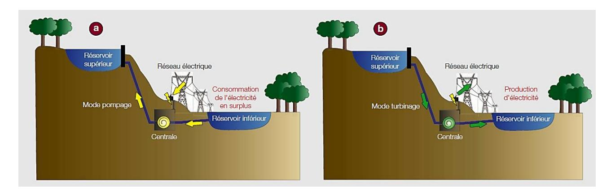

Figure 1 : principe de fonctionnement d'une STEP

C'est en s'inspirant de ce type de procédé de stockage de l'énergie que la jeune société STEPsol propose de concevoir et réaliser des micro-STEP d'une puissance inférieure à 1 MW. Cette microcentrale associe une production d'énergie par panneaux solaires photovoltaïques et un système de pompage-turbinage d'eau. Le jour, une partie de l'énergie fournie par les panneaux alimente une pompe qui monte l'eau dans un réservoir

supérieur. Lorsque les panneaux solaires ne produisent pas ou peu d'énergie, notamment la nuit, l'eau stockée redescend dans une conduite forcée et actionne un groupe turbinegénérateur, produisant ainsi de l'électricité. Cette solution permet de palier, en partie, le problème de l'intermittence de l'énergie solaire en utilisant un moyen de stockage « propre » respectueux de l'environnement. L'énergie ainsi produite est utilisée localement et le surplus peut être réinjecté dans le réseau de distribution.

# **PRÉSENTATION DU SUPPORT D'ÉTUDE**

Un des premiers projets de micro-STEP confié à la société STEPSol, présenté sur la figure 2, consiste à alimenter en énergie un village situé dans la montagne Corse composé d'une trentaine de foyers. Le point haut est constitué d'une citerne souple de 1 000 m3. La partie basse comprend un hangar recouvert de panneaux solaires photovoltaïques abritant une citerne souple de 1 000 m3 ainsi que les équipements hydrauliques et électriques.

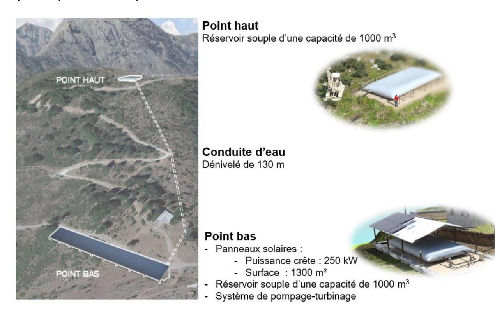

Figure 2 : projet d'installation d'une micro-STEP dans un village de montagne

La plus grande partie de l'énergie produite par la centrale est utilisée localement, le surplus est réinjecté dans le réseau électrique et donc revendu au distributeur. Malgré l'utilisation de l'énergie solaire « gratuite » et la revente du surplus d'énergie produite, le bilan global fait apparaitre, pour l'instant, un prix de revient de l'énergie élevé car le coût de l'investissement reste important. Néanmoins, ce type d'installation devrait trouver sa place dans la transition énergétique.

 Le premier processus de l'ingénierie système définissant la mission, le contexte, les cas d'utilisations, les scénarios et les besoins des parties prenantes est présenté sur les documents techniques DT1, DT2 et DT3.

### **Problématique générale**

*Une micro-STEP solaire apporte-t-elle une réelle plus-value à une installation solaire classique et le coût de l'énergie ainsi produite est-il acceptable ?*

Ce sujet comporte 5 parties indépendantes :

Partie A : pertinence du choix du procédé de stockage de l'énergie.

Partie B : validation du dimensionnement du système de production de l'énergie.

Partie C : choix et mise en œuvre du modulateur d'énergie associé au groupe motopompe.

Partie D : validation du dispositif de mesure de la quantité d'énergie stockée.

Partie E : validation du procédé en termes de coût énergétique.

### **PARTIE A : pertinence du choix du procédé de stockage de l'énergie.**

*Objectifs : effectuer un bilan énergétique du sous-système de stockage afin de définir ses performances.*

**Question 1** : *citer au moins deux avantages et deux inconvénients d'une micro-STEP solaire et préciser dans quelle mesure elle peut répondre aux enjeux de la transition énergétique.*

**Question 2** : *à partir du premier processus de l'ingénierie système présenté dans les documents techniques DT1 à DT3 et du diagramme de définition des blocs du document technique DT4, indiquer, pour chaque cas d'utilisation, la ou les solution(s) technique(s) retenue(s).*

**Question 3** : *indiquer, à partir de l'organigramme de pilotage du document technique DT5, les conditions de mise en service du turbinage.*

**Question 4** : *indiquer, à partir du diagramme de blocs internes partiel de la figure 3, la forme de l'énergie (mécanique, électrique, cinétique, …) sur les liens repérés (1), (2) et (3).* 

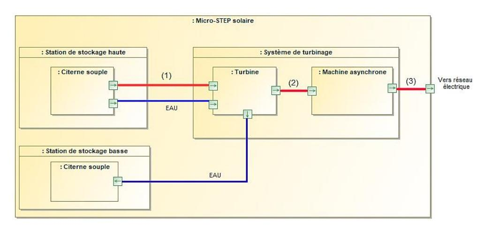

Figure 3 : IBD partiel en phase de turbinage

Comme indiqué sur l'organigramme de pilotage du document technique DT5, le volume d'eau utilisé pour la production d'énergie électrique se situe entre 5% et 95% du volume total du réservoir.

**Question 5** : *déterminer l'énergie potentielle, en kW·h, disponible lorsque le niveau d'eau dans le réservoir supérieur est maximal (volume utile maximal = 90% du volume total).* 

*Données : la masse volumique de l'eau est de 1 000 kg∙m-3 ; g= 9,81 m·s-2.*

La consommation journalière moyenne du village est estimée à 580 kW·h. Le rendement global de la phase de turbinage, prenant en compte les pertes énergétiques dans les conduites ainsi que celles de la turbine et du générateur, est évalué à 78 %.

**Question 6** : *déterminer, en kW·h, la quantité d'énergie électrique disponible produite à partir de l'énergie potentielle. Comparer et commenter l'écart entre cette valeur et la consommation journalière moyenne du village.*

**Question 7** : *indiquer, à partir de l'organigramme de pilotage du document technique DT5, les conditions de mise en service du pompage.*

La hauteur manométrique totale (HMT) vue par la pompe, qui tient compte de la hauteur de chute ainsi que des pertes de charges dans le circuit hydraulique a été évaluée à 135 m. Les caractéristiques de la pompe et du moteur sont données dans le document technique DT6.

**Question 8** : *indiquer la valeur du débit de la pompe et en déduire la durée totale nécessaire pour remplir totalement le réservoir supérieur.*

**Question 9** : *à partir des caractéristiques de la pompe données dans le document technique DT6, déterminer l'énergie électrique nécessaire au remplissage complet du réservoir supérieur si celle-ci fonctionne à son régime nominal. En déduire le rendement global du système de stockage ɳst avec :*

> ɳst = é é é é é é

**Question 10 :** *Conclure quant aux performances et à l'intérêt de ce procédé de stockage par pompage.*

### **PARTIE B : validation du dimensionnement du système de production de l'énergie.**

*Objectifs : valider le dimensionnement de la centrale solaire et vérifier sa capacité à produire suffisamment d'énergie.*

La figure 2 définie la puissance crête souhaitée. Le document technique DT7 présente les caractéristiques techniques des panneaux photovoltaïques envisagés. Le choix se porte sur le panneau référencé DMH320M6 d'une puissance crête de 320 W.

**Question 11** : d*éterminer, à partir des caractéristiques techniques du panneau photovoltaïque du document technique DT7, la superficie nécessaire pour atteindre la valeur de la puissance crête souhaitée. Comparer cette valeur à celle annoncée par le constructeur.*

Afin de réaliser le modèle de la centrale solaire photoélectrique, il est nécessaire de paramétrer le modèle d'un panneau photoélectrique. Le panneau est constitué de 60 cellules reliées en série. Le modèle électrique d'une cellule est représenté sur la figure 4.

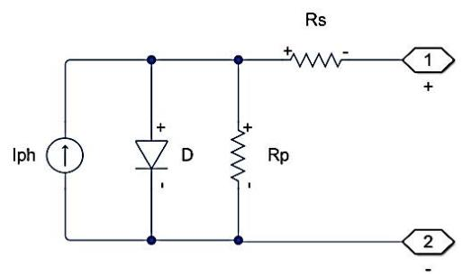

Figure 4 : modèle équivalent d'une cellule photoélectrique

**Question 12** : *à partir des caractéristiques techniques du panneau fournies dans le document technique DT7, indiquer les valeurs Isc et Voc (tension à vide entre les bornes 1 et 2) à renseigner dans le modèle d'une cellule (voir figure 5).*

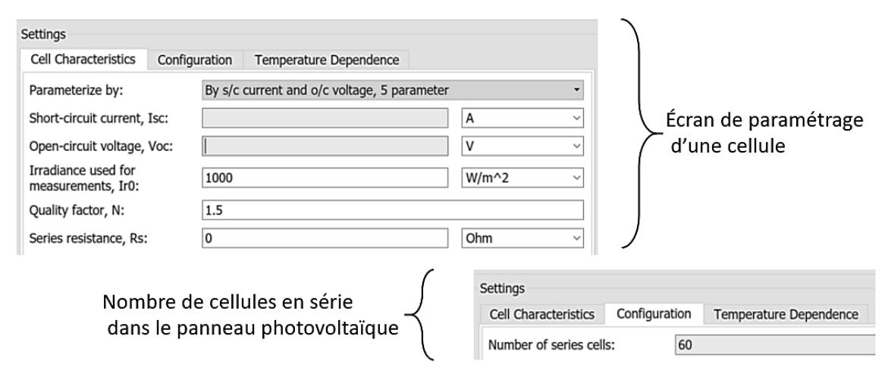

Figure 5 : paramétrage du modèle du panneau photovoltaïque

La figure 6 présente l'organisation de la connexion des panneaux , chaque onduleur reçoit six groupements de panneaux (un seul groupement est représenté sur la figure):

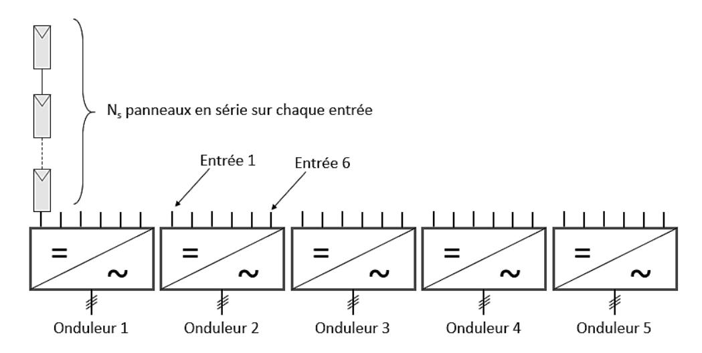

Figure 6 : organisation de la connexion des panneaux photovoltaïque

Afin d'optimiser le fonctionnement, les panneaux seront répartis de façon égale sur toutes les entrées des 5 onduleurs. Les caractéristiques techniques des onduleurs sont données dans le document technique DT8.

**Question 13** : *définir le nombre de panneaux Ns à connecter en série sur chaque entrée. En déduire la puissance MPPT, la tension MPPT et le courant MPPT au niveau de chaque entrée pour une irradiance de 1 000 W∙m- ². Vérifier et commenter le choix de l'onduleur.* 

Les orages, en période estivale, provoquent un abaissement de la luminosité tout en maintenant une température élevée des panneaux photovoltaïques. La simulation a permis de définir les caractéristiques I=f(U) et P=f(U) de la centrale photoélectrique pour une irradiance réduite à 600 W∙m- ². Ces caractéristiques sont représentées sur la figure 7.

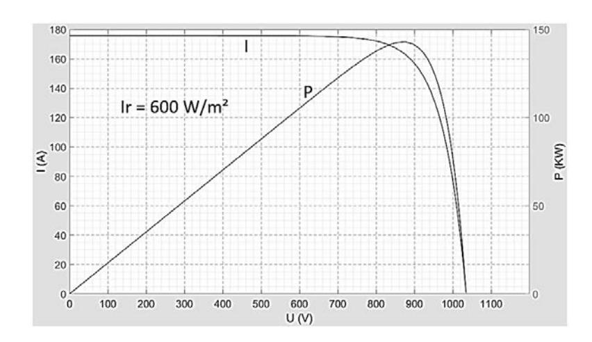

Figure 7 : caractéristiques de la centrale photoélectrique pour une irradiance de 600 W∙m- ² et une température des panneaux de 25 °C

Le constructeur indique l'influence de la température sur les paramètres électriques du panneau. Les courbes correspondantes sont données dans le document technique DT7.

**Question 14** : *à partir des valeurs relevées sur la figure 7 et des indications du DT7, déterminer la valeur de la puissance maximale (MPPT) pour une irradiance de 600 W∙m- ² et une température du panneau de 50°C. En déduire, dans ces conditions, la capacité du système à produire suffisamment d'énergie pour alimenter la charge et stocker l'eau.*

### **PARTIE C : choix et mise en œuvre du modulateur d'énergie associé au groupe motopompe**

*Objectifs : choisir le variateur de fréquence et sa protection, réaliser une partie du schéma électrique du circuit de pompage.*

Un automate programmable industriel pilote le variateur et récupère des informations du circuit hydraulique (pression, débit…). La figure 8 présente le principe simplifié de commande du variateur.

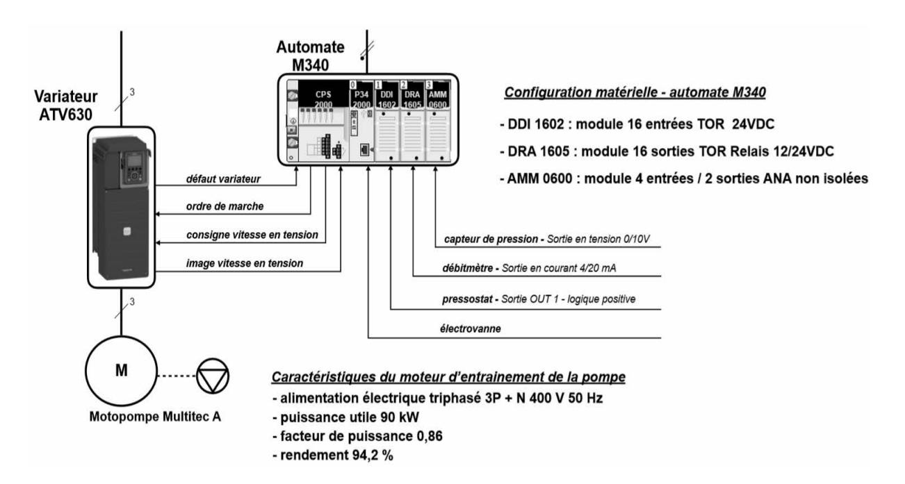

Figure 8 : représentation simplifiée du circuit de pompage

Le circuit de pompage comprend :

- une motopompe Multitec A KSB,
- un variateur de type ATV630 Schneider Electric,
- un automate programmable industriel de type M340 Schneider Electric,
- un débitmètre électromagnétique de type PROline promag 10 W Hendress et Hauser,
- un capteur de pression de type SHD-U 16 Regeltechnik,
- un pressostat de type PN7003 ifm electronic,
- une électrovanne de type IR-410-X Bermad,

**Question 15** : *préciser deux avantages dans l'utilisation d'un variateur de vitesse et indiquer les paramètres physiques que l'on peut contrôler grâce à ce modulateur d'énergie dans cette application.*

**Question 16** : *à l'aide du document technique DT9, choisir le modèle et la puissance du variateur de vitesse de type ATV630 en admettant une surcharge de l'ordre de 150 % du courant nominal du moteur. Justifier les réponses*.

**Question 17** : *à l'aide du document technique DT10, déterminer la référence complète du disjoncteur à associer au variateur. Indiquer, en développant, le(s) type(s) de protection assurée(s).* 

**Question 18** : *à l'aide du document technique DT12, Déterminer la valeur de réglage du paramètre Ith du variateur. Justifier la réponse.* 

Les adresses des entrées - sorties de l'automate ne sont pas imposées. Le variateur est piloté par une commande 2 fils. Le schéma des liaisons à la terre est de type TT.

*Question 19 : à l'aide des documents techniques DT11 à DT15, réaliser les schémas de puissance et de commande du variateur en complétant les documents réponses DR1 et DR2.* 

*Question 20 : à l'aide des documents techniques DT16 à DT18, réaliser le schéma de commande reliant le débitmètre, le capteur de pression, l'électrovanne et le pressostat aux modules d'entrées-sorties de l'automate en complétant le document réponse DR2.* 

### **PARTIE D : validation du procédé de mesure de la quantité d'énergie stockée.**

*Objectifs : vérifier l'efficacité du procédé de mesure de la quantité d'énergie stockée et proposer une piste d'amélioration.*

Afin de connaitre la quantité d'énergie stockée, il est envisagé de mesurer la hauteur d'eau dans la citerne supérieure puis de la convertir en volume. Le choix se porte sur le capteur de niveau HITEC CP5220 présenté dans le document technique DT19. Le principe est basé sur une mesure différentielle de pression entre le niveau haut et le niveau bas de la cuve.

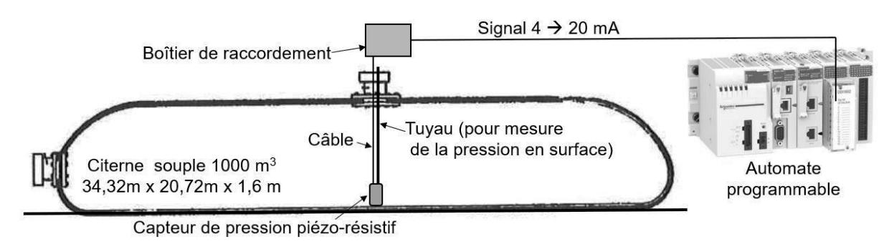

Figure 9 : synoptique du système de mesurage du volume d'eau stockée

Des relevés expérimentaux ont permis de tracer la caractéristique Volume = f(Hauteur) représentée sur la figure 10.

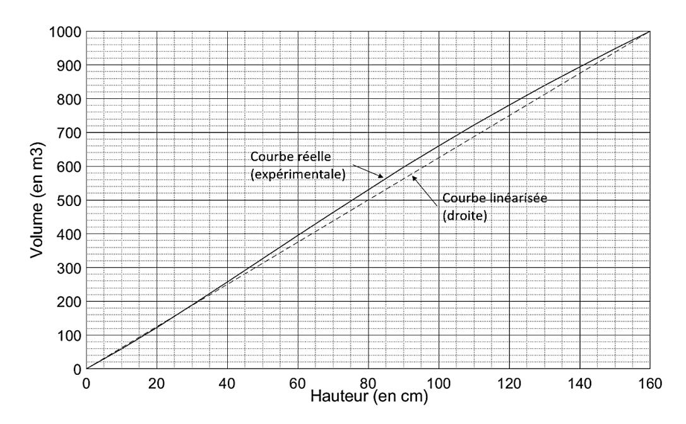

Figure 10 : volume de la citerne en fonction de la hauteur

Afin d'obtenir une relation simple entre le volume et la hauteur mesurée, il est envisagé de modéliser cette caractéristique par une droite.

**Question 21** : *indiquer les raisons de la non-linéarité de la courbe réelle et déterminer, en valeur relative, le plus grand écart entre le réel et le modèle.*

**Question 22** : *à partir de la caractéristique modélisée, déterminer la relation entre le volume d'eau en m3 et la hauteur en cm.*

La hauteur maximale d'eau est de 1,6 m. La valeur pleine échelle HPE du capteur est réglée à 2 m. Les conversions réalisées par la chaîne de mesure sont modélisées par les droites représentées sur la figure 11.

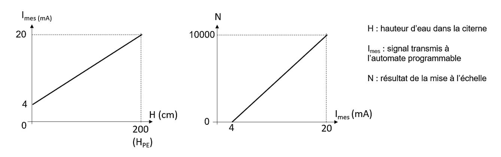

Figure 11 : caractéristiques de la chaîne de mesure

Un bloc fonction utilisateur contrôlant le volume d'eau dans la citerne est programmé dans l'automate programmable. Ses entrées-sorties sont représentées sur la figure 12.

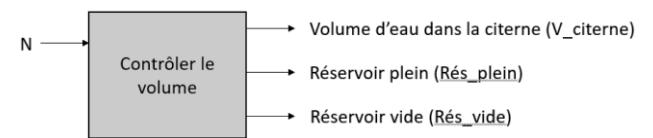

Figure 12 : entrées-sorties du bloc fonction « Contrôler le volume »

L'information binaire Rés\_plein est mise à l'état 1 lorsque le volume d'eau atteint 95% de sa valeur maximale sinon elle prend l'état 0.

L'information binaire Rés\_vide est mise à l'état 1 lorsque le volume d'eau descend en dessous des 5% de sa valeur maximale sinon elle prend l'état 0.

**Question 23** : *définir l'équation V\_citerne = f(N) à écrire dans le bloc fonction qui permet de mémoriser dans la variable V\_citerne le volume d'eau restant dans la citerne en m3.*

**Question 24** : *proposer un algorigramme du programme à écrire dans le bloc fonction « Contrôler le volume ». Cet algorigramme devra faire apparaître les calculs nécessaires ainsi que les relations permettant de définir les valeurs des sorties en fonction de l'entrée.*

**Question 25** : *conclure quant aux performances de la chaîne de mesure du volume d'eau restant dans la citerne et proposer, sans la développer, une solution qui permettrait de réduire l'erreur due à la modélisation de la courbe V=f(H).* 

### **PARTIE E : validation du procédé en termes de coût énergétique**

*Objectifs : effectuer un bilan financier et évaluer le coût énergétique.*

Une simulation sur une période d'un an a permis de définir les consommations et les productions annuelles en énergie (figure 13).

| Consommation village (Charge)                                                              | 320 MW.h / an            |
|--------------------------------------------------------------------------------------------|-----------------------------|
| Production des panneaux solaires photovoltaïques                                           | 390 MW.h / an               |
| produite par les PV(1) utilisée pour Énergie électrique le pompage (EPVPomp)     | 25% de la production des PV |
| (2) Rendement global du système de stockage ɳp                                       | 50 %                        |
| Énergie produite par les PV utilisée pour alimenter directement le village (EPVCharge) | 40% de la production des PV |
| Énergie produite par les PV et réinjecter dans le réseau (EPVRéseau)                | 35% de la production des PV |

(1) : PV = panneaux photovoltaïques

(2) : ɳp = é é à ′é é é é

Figure 13 : consommations et productions annuelles

Le tableau de la figure 14 représente les coûts de l'installation ainsi que les prix d'achat et de vente de l'énergie.

| Investissement                                              | 850        |
|-------------------------------------------------------------|------------|
| total                                                       | 000 €      |
| Maintenance                                                 | 10         |
| de l'installation                                           | 000 €/an   |
| Prix d'achat moyen de l'électricité sur une année        | 170 €/MW.h |
| Prix de vente de l'électricité (réinjection dans le réseau) | 100 €/MW.h |

Figure 14 : coûts d'installation et prix d'achat et de vente de l'énergie

**Question 26** : *déterminer le coût énergétique annuel du village avant l'installation de la micro-STEP solaire.* 

**Question 27** : *déterminer, en MW·h, la quantité d'énergie électrique annuelle EStock produite à partir du stockage de l'eau*.

**Question 28** : *après sa mise en service, déterminer la quantité d'énergie électrique ESTEPCharge provenant de la micro-STEP solaire et utilisée pour alimenter le village. En déduire celle achetée au fournisseur Eréseau ainsi que le coût énergétique annuel total du village.* 

**Question 29** : *en tenant compte de l'investissement et de la maintenance de l'installation, faire un bilan financier sur 25 ans, estimer le coût de revient du MW·h et conclure quant à l'intérêt d'une micro-STEP solaire.* 

### Définition des besoins des parties prenantes (1/3)

## Mission du système :

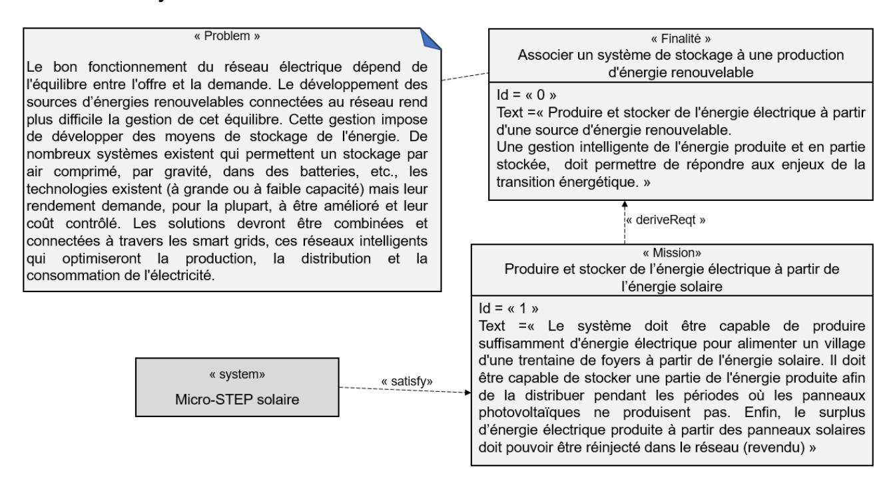

### Contexte

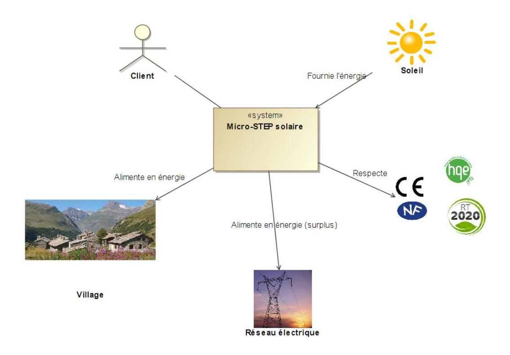

### Définition des besoins des parties prenantes (2/3)

### Utilisation du système :

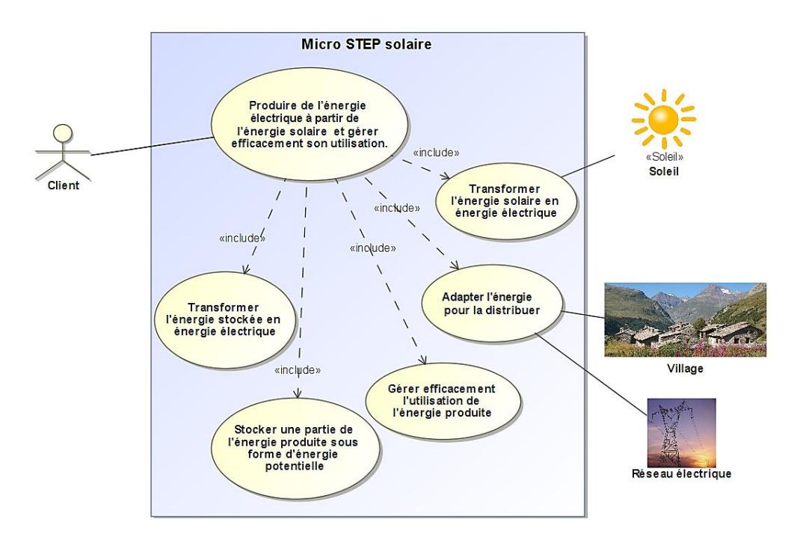

### Scénarios :

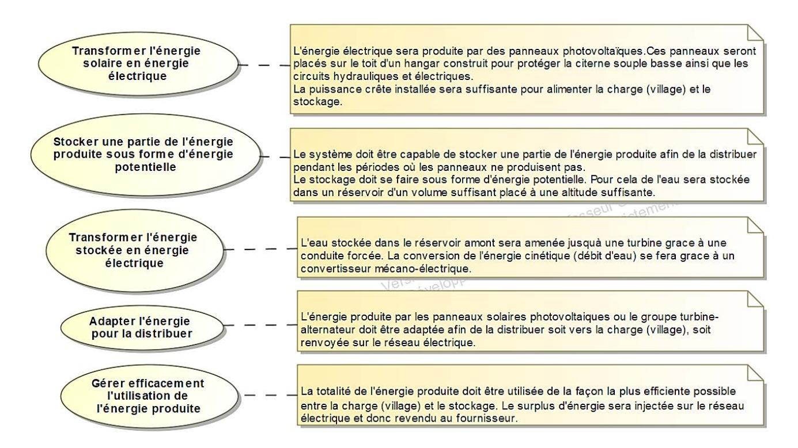

### Définition des besoins des parties prenantes (3/3)

## Définition des besoins :

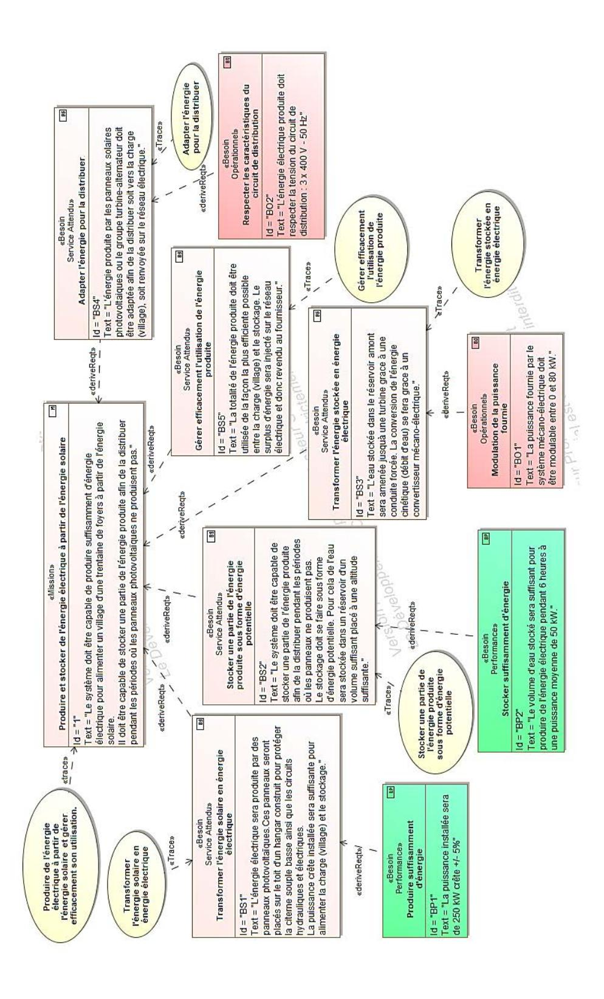

## Diagramme de définition des blocs

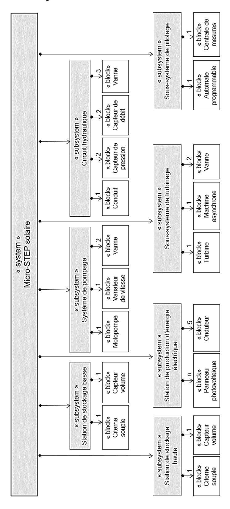

## Organigramme de pilotage

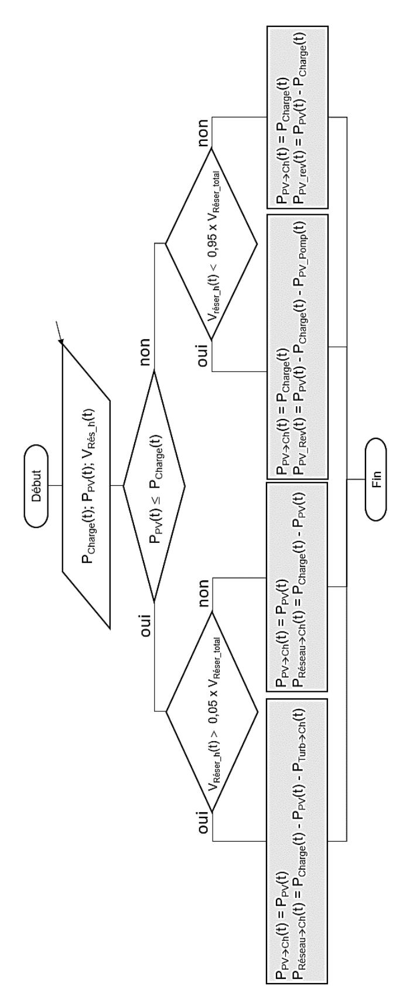

## Caractéristiques de la pompe

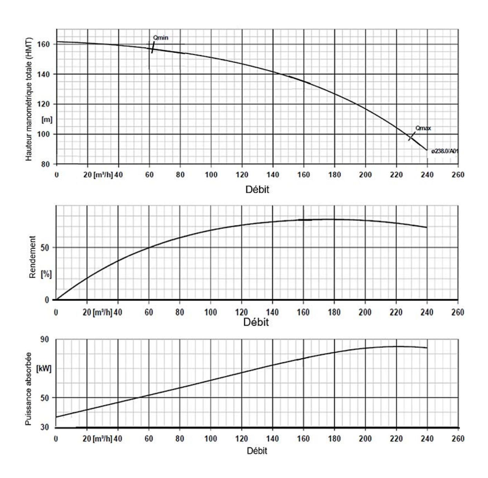

### Caractéristiques techniques du panneau solaire photovoltaïque

| Electrical Specifications |       |           | * STC irradia | ance of 1000W/ | m² spectrum / | AM 1.5 and ce | ll temperature of 25°C |
|---------------------------|-------|-----------|---------------|----------------|---------------|---------------|------------------------|
| Module Type               | Pm(W) | Tolerance | Imp(A)        | Vmp(V)         | Isc(A)        | Voc (V)       | Module Efficiency      |
| DMH305M6-120SW            | 305   | 0/+3%     | 9.13          | 33.44          | 9.57          | 40.33         | 18.36%                 |
| DMH310M6-120SW            | 310   | 0/+3%     | 9.21          | 33.69          | 9.63          | 40.53         | 18.66%                 |
| DMH315M6-120SW            | 315   | 0/+3%     | 9.27          | 34.02          | 9.70          | 40.73         | 18.96%                 |
| DMH320M6-120SW            | 320   | 0/+3%     | 9.34          | 34.32          | 9.76          | 40.96         | 19.26%                 |

Dimensions du panneau : 1675 mm x 992 mm

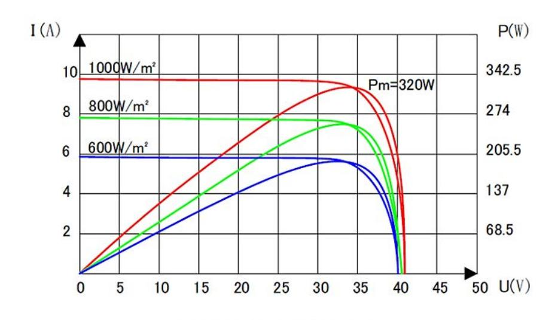

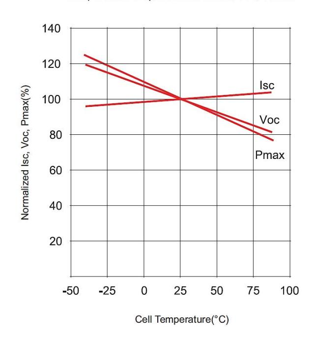

**Page 20 sur 34**

### Caractéristiques techniques de l'onduleur

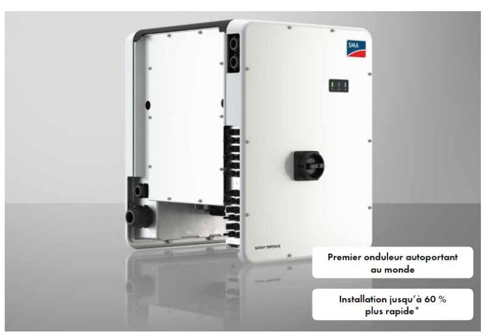

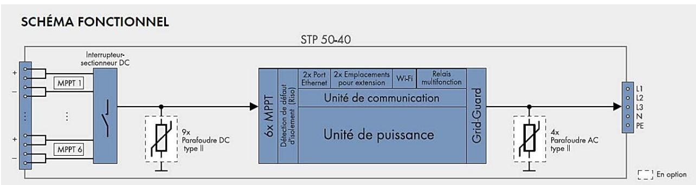

| Caractéristiques techniques (préliminaires)                            | Sunny Tripower CORE1                                   | Caractéristiques techniques (préliminaires)                                                  | Sunny Tripower CORE1                                                        |
|------------------------------------------------------------------------|--------------------------------------------------------|----------------------------------------------------------------------------------------------|-----------------------------------------------------------------------------|
| Entrée (DC)                                                            |                                                        | Rendement                                                                                    |                                                                             |
| Puissance DC max. (pour cos $\phi = 1$ ) / Puissance assignée (DC)     | 51000 W / 51000 W                                      | Rendement max./européen Caractéristiques générales                                           | >98,0 % / >98,0 %                                                           |
| Tension d'entrée max.                                                  | 1000 V                                                 | Dimensions (L/H/P)                                                                           | 621 mm / 733 mm / 560 mm                                                    |
| Plage de tension MPPT / tension d'entrée assignée                   | 150 V à 1000 V / 500 V à 800 V                         | Poids                                                                                        | 621 mm / 733 mm / 569 mm (24.4 in / 28.8 in / 22.4 in) 82 kg (180 lb) |
| Tension d'entrée min. / tension d'entrée de démarrage                  | 150 V / 188 V                                          | Plage de température de fonctionnement Émissions sonores (typiques)                       | -25 °C à +60 °C (-13 °F à +140 °F) <60 dB(A)                             |
| Courant d'entrée max. / par MPPT                                       | 120 A / 20 A                                           | Autoconsommation (nuit)                                                                      | < 5 W                                                                       |
| Courant de court-circuit max. par MPP tracker/ par entrée de string | 30 A / 30 A                                            | Topologie/système de refroidissement                                                         | Sans transformateur / OptiCool                                              |
| Nombre d'entrées MPPT indépendantes / strings par entrée MPPT       | 6/2                                                    | Indice de protection (selon IEC 60529) Classe climatique (selon IEC 60721-3-4)               | IP65 4K4H                                                                |
| Sortie (AC)                                                            |                                                        | Valeur maximale admissible d'humidité relati- ve de l'air (sans condensation)             | 100 %                                                                       |
| Puissance assignée (pour 230 V, 50 Hz)                                 | 50000 W                                                | Équipement/Fonction/Accessoires                                                              |                                                                             |
| Puissance apparente AC max.                                            | 50000 VA                                               | Raccordement DC/Raccordement AC                                                              | SUNCLIX/Borne à vis                                                         |
| Tension nominale AC                                                    | 3/N/PE; 220 V/380 V                                    | Affichage DEL (état/erreur/communication)                                                    | •                                                                           |
|                                                                        | 3 / N / PE; 230 V / 400 V 3 / N / PE; 240 V / 415 V | Interface : Ethernet/WLAN/RS485                                                              | <ul> <li>(2 entrées) / ● / ○</li> </ul>                                     |
| Plage de tension AC                                                    | 405 V / 365 à 465 V                                    | Interface de données : SMA Modbus/Sun-                                                       | •/•/•                                                                       |
| Fréquence du réseau AC/plage                                           | 50 Hz / 44 Hz à 55 Hz 60 Hz / 54 Hz à 65 Hz         | Spec Modbus/Speedwire, Webconnect Relais multifonctions/Ports pour modules d'extension | <ul> <li>         • (2 entrées)     </li> </ul>                             |
| Fréquence de réseau assignée/tension de réseau assignée                | 50 Hz / 230 V                                          | OptiTrack Global Peak/Integrated Plant                                                       | •/•/•                                                                       |
| Courant de sortie max./Courant de sortie assigné                       | 72,5 A / 72,5 A                                        | Control/Q on Demand 24/7                                                                     |                                                                             |
| Phases d'injection/phases de raccordement                              | 3/3                                                    | Compatible off-grid/compatible SMA Fuel Save Controller                                      | •/•                                                                         |

## Caractéristiques techniques du variateur de vitesse ATV630

### Références (suite)

### Variateurs de vitesse

Altivar Process

Vanishama 200 400 V ID 04/III Ton

Tension d'alimentation 380...480 V triphasée 50/60 Hz Variateurs pour montage mural

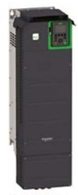

ATV630D55N4

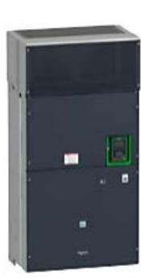

ATV630C25N4

| Mote                                 | ır       |             | Réseau  | I .         |                   |        | Altivar Proces    | S                      |                 |                    |
|--------------------------------------|----------|-------------|---------|-------------|-------------------|--------|-------------------|------------------------|-----------------|--------------------|
| Puissance indiquée sur plaque (1) |          |             |         | nt de ligne | apparente présumé |        | Courant permanent | Courant transitoire | Référence       | Masse              |
|                                      |          |             | 380 V   | 480 V       | 380 V             | - maxi | maximal (1)       | maxi pendant 60 s   |                 |                    |
| ND:                                  | Norm     | al duty (3) |         |             |                   |        |                   |                        |                 |                    |
| HD:                                  | Heavy    | duty (4)    |         |             |                   |        |                   |                        |                 |                    |
|                                      | kW       | HP          | A       | Α           | kVA               | kA     | Α                 | A                      |                 | kg/                |
| Avec                                 | filtre C | EM caté     | gorie C | 3 intégré   |                   |        |                   |                        |                 |                    |
| ND                                   | 55       | 75          | 97,2    | 84,2        | 70                | 50     | 106               | 116,6                  | ATV630D55N4     | 56,500 124,561  |
| HD                                   | 45       | 60          | 81,4    | 71,8        | 59,7              | 50     | 88                | 132                    |                 |                    |
| ND                                   | 75       | 100         | 131,3   | 112,7       | 93,7              | 50     | 145               | 159,5                  | ATV630D75N4     | 58,000             |
| HD                                   | 55       | 75          | 98,9    | 86,9        | 72,2              | 50     | 106               | 159                    |                 | 127,868            |
| ND                                   | 90       | 125         | 156,2   | 135,8       | 112,9             | 50     | 173               | 190,3                  | ATV630D90N4     | 58,500/ 128,970 |
| HD                                   | 75       | 100         | 134,3   | 118,1       | 98,2              | 50     | 145               | 217,5                  |                 |                    |
| ND                                   | 110      | 150         | 201     | 165         | 121,8             | 50     | 211               | 232,1                  | ATV630C11N4 (5) | 82,000 180,779  |
| HD                                   | 90       | 125         | 170     | 143         | 102,6             | 50     | 173               | 259,5                  |                 |                    |
| ND                                   | 132      | 200         | 237     | 213         | 161,4             | 50     | 250               | 275                    | ATV630C13N4 (5) | 82,000             |
| HD                                   | 110      | 150         | 201     | 165         | 121,8             | 50     | 211               | 317                    |                 | 180,775            |
| ND                                   | 160      | 250         | 284     | 262         | 201,3             | 50     | 302               | 332,2                  | ATV630C16N4 (5) | 82,000             |
| HD                                   | 132      | 200         | 237     | 213         | 161,4             | 50     | 250               | 375                    |                 | 180,775            |
| ND                                   | 220      | 350         | 397     | 324         | 247               | 50     | 427               | 470                    | ATV630C22N4 (5) | 163,000            |
| HD                                   | 160      | 250         | 296     | 246         | 187               | 50     | 302               | 453                    |                 | 359,35             |
| ND                                   | 250      | 400         | 451     | 366         | 279               | 50     | 481               | 529                    | ATV630C25N4 (5) | 207,000            |
| HD                                   | 220      | 300         | 365     | 301         | 229               | 50     | 387               | 581                    |                 | 456,35             |
| ND                                   | 315      | 500         | 569     | 461         | 351               | 50     | 616               | 678                    | ATV630C31N4 (5) | 207,000            |
| HD                                   | 250      | 400         | 457     | 375         | 286               | 50     | 481               | 722                    |                 | 456,357            |

Ces valeurs sont données pour une fréquence de découpage nominale de 2,5 kHz en utilisation en régime permanent (ATV630D55N4...C31N4).

La fréquence de découpage est réglable de 2...8 kHz (ATV630D55N4...C31N4).

Au-delà de 4 kHz, le variateur diminuera de lui-même la fréquence de découpage en cas d'échauffement excessif.

Pour un fonctionnement en régime permanent au-delà de la fréquence de découpage nominale, un déclassement doit être appliqué au courant nominal du variateur (voir les courbes de déclassement sur notre site internet www.schneider-electric.com).

Nota: consulter les tableaux de synthèse des associations possibles entre variateurs, options et accessoires (voir page 30).

(2) Valeur typique pour la puissance moteur indiquée et pour lcc ligne présumé maxi.

(3) Valeurs données pour des applications nécessitant une faible surcharge (jusqu'à 110 %).

(4) Valeurs données pour des applications nécessitant une surcharge importante (jusqu'à 150 %).

(5) Produit livré en IP 00 pour montage en armoire. Pour montage mural IP 21/UL Type 1, un kit d'adaptation doit être commandé séparément (voir page 25).

### Protection à associer au variateur de vitesse ATV630

### Associations à monter par VOS SOINS (suite)

### Variateurs de vitesse

Altivar Process Départs-moteurs Tension d'alimentation 380...415 V

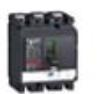

NSX100FMA100

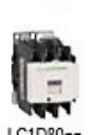

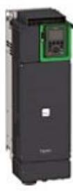

ATV830D45N4

| Moteur Variateur Puissance (1) Référence |            | Variateur          | Disjoncteur              |         |       | Contacteur de ligne |
|---------------------------------------------|------------|--------------------|--------------------------|---------|-------|---------------------|
|                                             |            | Référence          | Référence (2)            | Calibre | Irm   | Référence (3) (4)   |
| kW                                          | HP         |                    |                          | A       | A     |                     |
| Tens                                        | ion d'alin | nentation triphase | ée 380415 V 50/60 Hz     |         |       |                     |
| 0,75                                        | 1          | ATV630U07N4        | GV2L07                   | 2,5     | 33,5  | LC1D09++            |
| 1,5                                         | 2          | ATV630U15N4        | GV2L08                   | 4       | 51    | LC1D09++            |
| 2,2                                         | 3          | ATV630U22N4        | GV2L10                   | 6,3     | 78    | LC1D09++            |
| 3                                           | -          | ATV630U30N4        | GV2L14                   | 10      | 138   | LC1D09++            |
| 4                                           | 5          | ATV630U40N4        | GV2L14                   | 10      | 138   | LC1D09++            |
| 5,5                                         | 7,5        | ATV630U55N4        | GV2L16                   | 14      | 170   | LC1D18++            |
| 7,5                                         | 10         | ATV630U75N4        | GV2L20                   | 18      | 223   | LC1D18++            |
| 11                                          | 15         | ATV630D11N4        | GV2L22                   | 25      | 327   | LC1D25ee            |
| 15                                          | 20         | ATV630D15N4        | GV3L32                   | 32      | 448   | LC1D25**            |
| 18,5                                        | 25         | ATV630D18N4        | GV3L40                   | 40      | 560   | LC1D40Aee           |
| 22                                          | 30         | ATV630D22N4        | GV3L50                   | 50      | 700   | LC1D50Aee           |
| 30                                          | 40         | ATV630D30N4        | GV3L65                   | 65      | 910   | LC1D50Aee           |
| 37                                          | 50         | ATV630D37N4        | NS80HMA                  | 80      | 1 000 | LC1D65Aee           |
| 45                                          | 60         | ATV630D45N4        | NSX100+MA100             | 100     | 1 300 | LC1D80ee            |
| 55                                          | 75         | ATV630D55N4        | NSX160+MA150             | 150     | 1 500 | LC1D11500           |
| 75                                          | 100        | ATV630D75N4        | NSX160+MA150             | 150     | 1 500 | LC1D11500           |
| 90                                          | 125        | ATV630D90N4        | NSX250+MA220             | 220     | 2 420 | LC1F185 ••          |
| 110                                         | 150        | ATV630C11N4        | NSX250+MA220             | 220     | 2 860 | LC1F185**           |
| 132                                         | 200        | ATV630C13N4        | NSX400. Micrologic 1.3-M | 320     | 3 500 | LC1F265 ••          |
| 160                                         | 250        | ATV630C16N4        | NSX400. Micrologic 1.3-M | 320     | 4 000 | LC1F265++           |
| 220                                         | 350        | ATV630C22N4        | NSX630. Micrologic 1.3-M | 500     | 3 000 | LC1F400++           |
| 250                                         | 400        | ATV630C25N4        | NSX630. Micrologic 1.3-M | 500     | 3 000 | LC1F500◆◆           |
| 310                                         | 500        | ATV630C31N4        | NS800L Micrologic 2 ou 5 | 800     | 1 600 | LC1F630++           |

Puissances normalisées des moteurs 4 pôles 400 V 50/60 Hz.
Les valeurs exprimées en HP sont conformes au NEC (National Electrical Code).
 Pour les références à compléter, remplacer le point par la lettre correspondant à la performance de coupure du disjoncteur

| Disjoncteur              | Icu (kA) pour 380415 V |    |               |                   |      |                   |  |
|--------------------------|------------------------|----|---------------|-------------------|------|-------------------|--|
|                          | 6                      | F  | N             | Н                 | S    | L                 |  |
| GV2L07L14                | >100                   | -  | <del></del> : | 2.4               | -    | \$ <u>#</u>       |  |
| GV2L16L22                | 50                     | -  | -             | 5 <del>-</del> 8  | -    | -                 |  |
| GV3L32L65                | 50                     |    | -             | 5. <del>5</del> 5 | 1.17 | , . <del></del> . |  |
| N S80HMA                 | 70                     | +  | #5            | 2.4               | -    | ( <del>-</del> )  |  |
| NSX100+MA100             | -                      | 36 | 50            | 70                | 100  | 150               |  |
| NSX160+MA150             |                        | 36 | 50            | 70                | 100  | 150               |  |
| NSX250+MA220             | -                      | 36 | 50            | 70                | 100  | 150               |  |
| NSX400+, NSX630+         | -                      | 36 | 50            | 70                | 100  | 150               |  |
| NS800L Micrologic 2 ou 5 |                        | _  | _             |                   | _    | 150               |  |

(3) Composition des contacteurs :

LC1D09...D115: 3 pôles + 1 contact auxiliaire "F" + 1 contact auxiliaire "O"

LC1F185...F265: 3 pôles.

Pour ajouter des contacts auxiliaires ou d'autres accessoires, veuillez consulter le catalogue "Solutions départs-moteurs.

Constituants de commande et profection puissance".

(4) Remplacer ●● par le repère de tension du circuit de commande dans le tableau ci-dessous :

|             | Volts ∼               | 24 | 48 | 110 | 220 | 230 | 240 |
|-------------|-----------------------|----|----|-----|-----|-----|-----|
| LC1D09D115  | 50 Hz                 | B5 | E5 | F5  | M5  | P5  | U5  |
|             | 60 Hz                 | B6 | E6 | F6  | M6  | -   | U6  |
|             | 50/60 Hz              | B7 | E7 | F7  | M7  | P7  | U7  |
| LC1F185     | 50 Hz (bobine LX1)    | B5 | E5 | F5  | M5  | P5  | U5  |
|             | 60 Hz (bobine LX1)    | 23 | E6 | F6  | M6  | -   | U6  |
|             | 40400 Hz (bobine LX9) | -  | E7 | F7  | M7  | P7  | U7  |
| LC1F265     | 40400 Hz (bobine LX1) | B7 | E7 | F7  | M7  | P7  | U7  |
| LC1F400F800 | 40400 Hz (bobine LX1) | -  | E7 | F7  | M7  | P7  | U7  |

Autres tensions disponibles entre 24 V et 660 V ou circuit de commande en courant continu, consulter notre centre de relation clients.

## Schéma de raccordement du variateur de vitesse ATV630

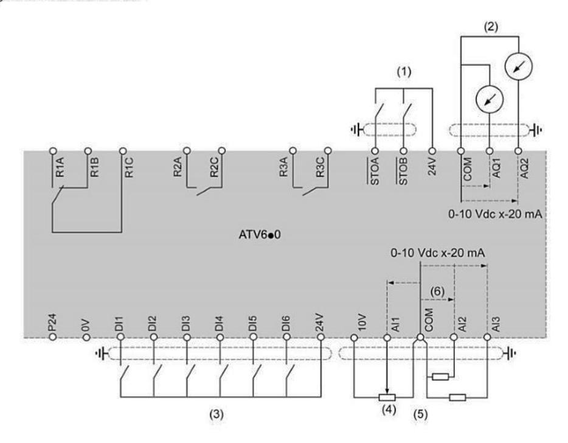

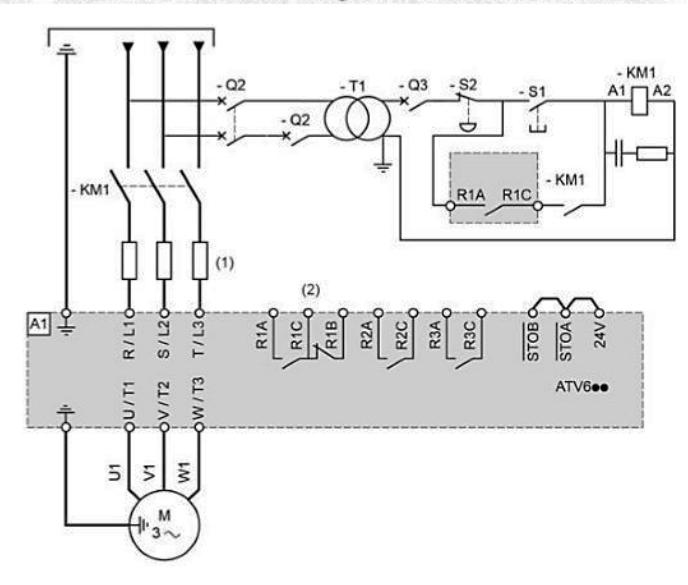

### Paramètres du variateur de vitesse ATV630

Ce tableau présente les paramètres de base du variateur et les valeurs des réglages usine correspondant :

| Code         | Nom                   | Valeurs des réglages usine                                                                                                                      |
|--------------|-----------------------|-------------------------------------------------------------------------------------------------------------------------------------------------|
| bFr          | [Fréquence De Base]   | [50Hz IEC] 5 D                                                                                                                                  |
| רוח          | [Désact. Arrière]     | [Oui] 4 E S                                                                                                                                     |
| FCC          | [Commande 2/3 fils]   | [Commande 2 fils] 2 [: commande 2 fils                                                                                                          |
| C E E        | [Type Cde Moteur]     | [U/F VC Quad.] u F 9 : U/F pour charges quadratiques                                                                                            |
| ЯСС          | [Accélération]        | 10,0 s                                                                                                                                          |
| d E C        | [Décélération]        | 10,0 s                                                                                                                                          |
| LSP          | [Vitesse Basse]       | 0 Hz                                                                                                                                            |
| H S P        | [Vitesse Haute]       | 50 Hz                                                                                                                                           |
| , E H        | [Cour. Therm. Moteur] | Courant nominal du moteur (valeur en fonction des caractéristiques nominales du variateur)                                                   |
| Frd          | [Sens Avant]          | [DI1] d , I: Entrée logique DI1                                                                                                                 |
| FrI          | [Config. Fréq. Réf.1] | [Al1] R , I: Entrée analogique Al1                                                                                                              |
| r 1          | [Affectation R1]      | [Erreur Etat Fonctionnement] F L L: le contact s'ouvre lorsque le variateur a détecté une erreur ou lorsque le variateur a été mis hors tension |
| ЬгЯ          | [Adapt. Rampe Décél.] | [Oui] 9 £ 5: fonction active (adaptation automatique de la rampe de décélération)                                                               |
| Atr          | [Fault Reset Auto]    | [Non] n a : fonction inactive                                                                                                                   |
| 5 <i>E E</i> | [Type d'arrêt]        | [Sur Rampe] r II P: activation sur rampe                                                                                                        |

[Commande 2/3 fils] E [ [

Commande 2 ou à 3 fils.

### **A** AVERTISSEMENT

### FONCTIONNEMENT INATTENDU DE L'EQUIPEMENT

Si ce paramètre est modifié, les paramètres [Affect. marche arrière] r r 5 et [type à 2 fils] Ł C Ł ainsi que les affectations des entrées logiques sont réinitialisés aux réglages d'usine.

Vérifiez que cette modification est compatible avec le type de câblage utilisé.

Le non-respect de ces instructions peut provoquer la mort, des blessures graves ou des dommages matériels.

| Réglage           | Code/Valeur | Description                                                                                                                                                                                                                        |
|-------------------|-------------|------------------------------------------------------------------------------------------------------------------------------------------------------------------------------------------------------------------------------------|
| [Commande 2 fils] | 5.0         | Commande 2 fils (commandes par niveau) : état (0 ou 1) ou front (0 à 1 ou 1 à 0) de l'entrée qui commande la marche ou l'arrêt. Exemple de câblage source :                                                                        |
|                   |             | 224 DI1 DIx                                                                                                                                                                                                                        |
|                   |             | DI1 Sens Avant                                                                                                                                                                                                                     |
|                   |             | DIx Sens Arrière                                                                                                                                                                                                                   |
|                   |             | Réglage usine                                                                                                                                                                                                                      |
| [Commande 3 fils] | 3.0         | Commande 3 fils (commandes par impulsions) [3 fils]: Une impulsion de marche avant ou arrière est suffisante pour commander le démarrage. Une impulsion d'arrêt est suffisante pour commander l'arrêt. Exemple de câblage source : |
|                   |             | ATV                                                                                                                                                                                                                                |
|                   |             | DI1 Arrêt                                                                                                                                                                                                                          |
|                   |             | DI2 Sens Avant                                                                                                                                                                                                                     |
|                   |             | Dix Sens Arrière                                                                                                                                                                                                                   |

[Cour. Therm. Moteur] , E H

Courant de surveillance de l'état thermique du moteur devant être réglé à une valeur égale à celle du courant nominal indiqué sur la plaque signalétique.

| Réglage ()                  | Description                                                                                         |
|-----------------------------|-----------------------------------------------------------------------------------------------------|
| 0,2 à 1,1 In (1) | Plage de réglages Réglage usine : Selon les caractéristiques nominales du variateur                 |
| (1) Corresponde             | ant au courant nominal du variateur indiqué dans le guide d'installation et sur la plaque signaléti |

## Raccordement des modules d'entrées TOR - Schneider Electric

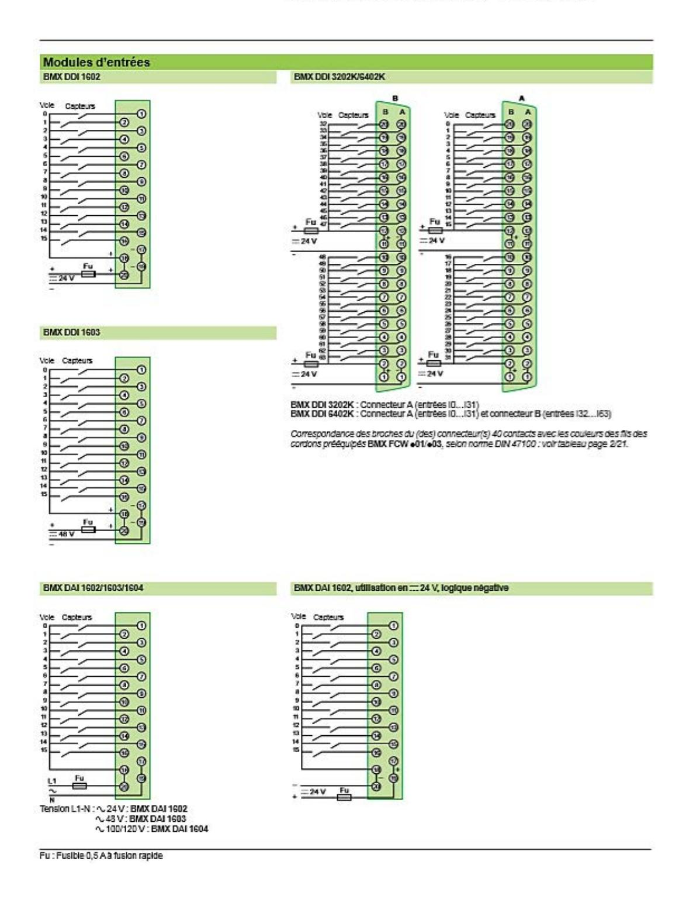

Raccordement des modules de sorties TOR - Schneider Electric

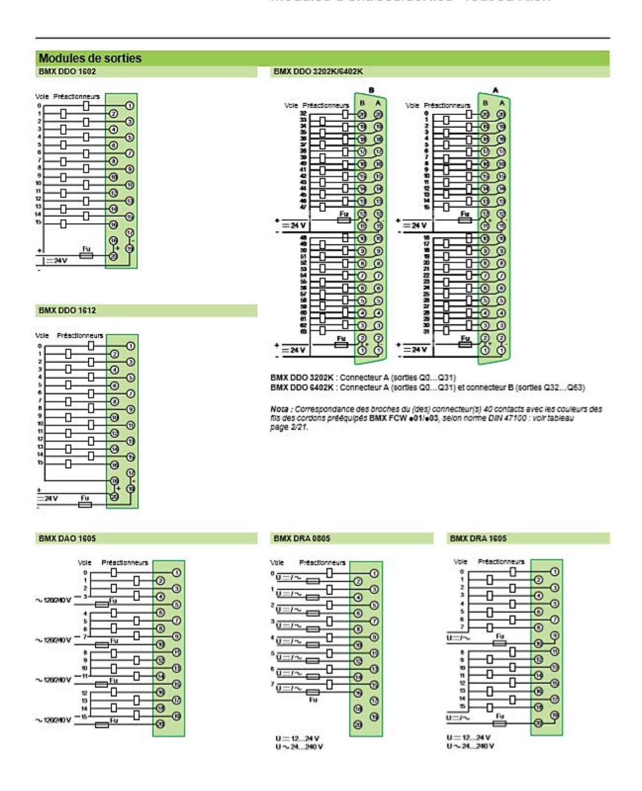

## Raccordement des modules d'entrées-sorties ANA - Schneider Electric

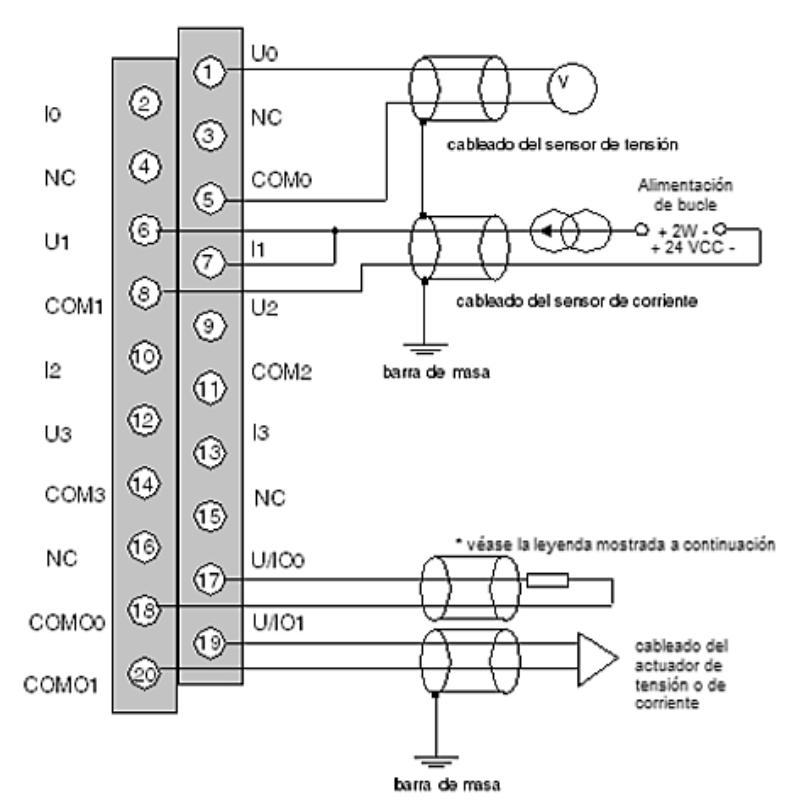

# Débitmètre électromagnétique PROline promag 10 W

### Mesure du débit dans l'industrie de l'eau et de l'environnement

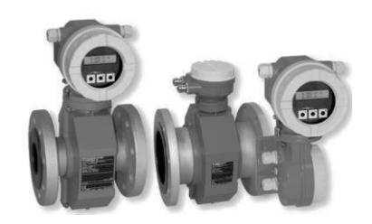

Raccordement électrique unité de mesure

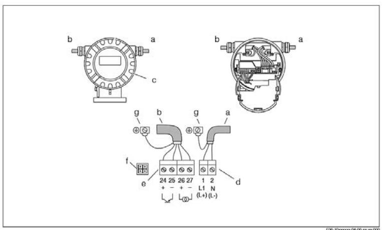

Raccordement du transmetteur (boitier de terrain en aluminium). Section de ligne : max. 2,5 mm²

- Câble pour l'énergie auxiliaire : 85...250 V AC, 20...28 V AC, 11...40 V DC Borne N° 1: L1 pour AC, L+ pour DC
- Borne N° 2: N pour AC, L- pour DC Câble de signal : Bornes N° 24–27
- Couvercle du compartiment de l'électronique
- Bornes de raccordement pour énergie auxiliaire Bornes de raccordement pour la sortie courant et impulsion/état
- Connecteur de service pour le raccordement à l'interface de service FXA 193 (FieldCheck, FieldTool)
- Bornes de terre pour câble de terre

|                       | N° bornes (sorties) |                        |  |  |
|-----------------------|---------------------|------------------------|--|--|
| Variante de commande  | 24 (+) / 25 (–)     | 26 (+) / 27 (-)        |  |  |
| 10***_****** <b>A</b> | Sortie impulsion    | Sortie courant HART |  |  |

Sortie impulsion (passive)

Collecteur ouvert, max. 30 V DC / 250 mA, séparation galvanique, configurable

Mode de fonction impulsion : fréquence d'impulsion max. 100 Hz

Mode de fonction état : configurable

Sortie courant active

galvaniquement séparée, active : 4...20 mA, RL < 700  $\Omega$ , HART: RL  $\geq$  250  $\Omega$ 

Terre, énergie auxiliaire → voir fig. ci-dessus

## Capteur de pression de type SHD-U - Regeltechnik

| CARACTÉRISTIQUES TE                    | CHNIQUES                                                                                                                                                                                               |
|----------------------------------------|--------------------------------------------------------------------------------------------------------------------------------------------------------------------------------------------------------|
| Tension d'alimentation :               | 24 V ca/cc pour sortie 0 -10 V 7 - 33 V cc pour sortie 4 20 mA                                                                                                                                      |
| Plages de mesure :                     | voir tableau (d'autres plages de mesure sur demande)                                                                                                                                                   |
| Signal de sortie :                     | 0 -10 V, 3 fils, (charge > 10 kOhm) ou 4 20 mA, 2 fils, (charge < (UB (V) -7 V)/0,02 A ; R c dépend de la charge                                                                      |
| Raccordement électrique :              | 0,25 - 1,5 mm², via connecteur DIN EN 175301-803-A (comprise dans la livraison)                                                                                                                     |
| Prise de pression :                    | G ½ " étanchéité à l'arrière et manomètre (combiné) avec joint profilé FPM spécial ou au choix, G ½ " DIN 3852                                                                                      |
| Type de pression :                     | relative                                                                                                                                                                                               |
| Principe de mesure :                   | cellule de mesure en acier                                                                                                                                                                             |
| Température du milieu :                | −40 +135 °C                                                                                                                                                                                            |
| Montage :                              | directement sur la conduite sous pression                                                                                                                                                              |
| Boîtier :                              | acier inox V2A (1.4305)                                                                                                                                                                                |
| Tête de raccordement :                 | matière plastique, env. 98 x 50 x 34 mm                                                                                                                                                                |
| Parties en contact avec le milieu : | acierinox V2A (1.4305)                                                                                                                                                                                 |
| Temps de réponse :                     | 2 ms. (temps caractéristique 1 ms)                                                                                                                                                                     |
| Ligne caractéristique :                | ± 0,3 %                                                                                                                                                                                                |
| Surcharge :                            | < 6 bars : 5 x pleine échelle > 6 bars : 3 x pleine échelle (max. 1500 bars)                                                                                                                        |
| Pression d'éclatement :                | < 6 bars : 10 x pleine échelle > 6 bars : 6 x pleine échelle (max. 2500 bars)                                                                                                                       |
| Classe de protection :                 | III (selon EN 60 730)                                                                                                                                                                                  |
| Indice de protection :                 | IP 65 (selon EN 60 529)                                                                                                                                                                                |
| Normes :                               | conformité CE, compatibilité électromagnétique selon EN 61 326, Directive « CEM » 2014/30/EU                                                                                                        |
| Certificats :                          | Homologation pour l'eau potable selon NSF/ANSI 61/372, certification UL selon ANSI/UL 61010-1                                                                                                       |
| En option:                             | Module d'écran, en plastique, matière polyamide couleur noir, hauteur supplémentaire : env. 73 mm, enfichable, étalonné et configuré en usine, pour l'affichage de la pression différentielle |
|                                        | (en bar, autres unités sur demande)                                                                                                                                                                    |

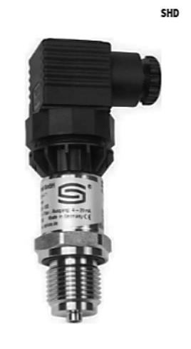

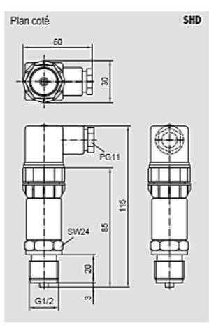

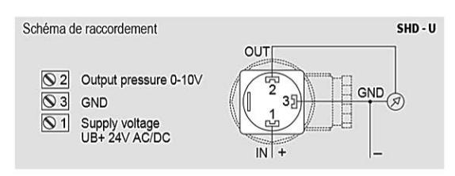

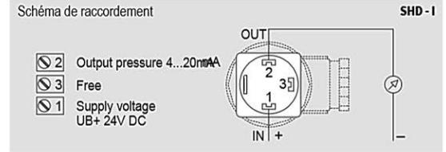

| Type/ WG01 | plage de mesure | référence          | Type/ WG01 | plage de mesure | référence          |
|---------------|--------------------|--------------------|---------------|--------------------|--------------------|
| SHD - U       |                    | variante U         | SHD-I         |                    | variante I         |
| SHD-U 1       | 01 bar             | 1301-2111-0520-220 | SHD-I 1       | 01 bar             | 1301-2112-0520-120 |
| SHD-U 2,5     | 02,5 bar           | 1301-2111-0530-220 | SHD-I 2,5     | 02,5 bar           | 1301-2112-0530-120 |
| SHD-U 6       | 06 bar             | 1301-2111-0550-220 | SHD-I 6       | 06 bar             | 1301-2112-0550-120 |
| SHD-U 10      | 010 bar            | 1301-2111-0560-220 | SHD-I 10      | 010 bar            | 1301-2112-0560-120 |
| SHD-U 16      | 016 bar            | 1301-2111-0570-220 | SHD-I 16      | 016 bar            | 1301-2112-0570-120 |
| SHD-U 25      | 025 bar            | 1301-2111-0580-220 | SHD-I 25      | 025 bar            | 1301-2112-0580-120 |
| SHD-U 40      | 040 bar            | 1301-2111-0590-220 | SHD-I 40      | 040 bar            | 1301-2112-0590-120 |

## Pressostat de type PN7003 - ifm electronic

| Référence   | Etendue | de mesure |     | ession ssible | Pression d'éclatement |        |  |  |  |
|-------------|---------|-----------|-----|------------------|--------------------------|--------|--|--|--|
|             | bar     | PSI       | bar | PSI              | bar                      | PSI    |  |  |  |
| PN7000      | 0400    | 05 800    | 600 | 8 700            | 1 000                    | 14 500 |  |  |  |
| PN7001 0250 |         | 03 625    | 400 | 5 800            | 850                      | 12 300 |  |  |  |
| PN7002      | 0100    | 01 450    | 300 | 4 350            | 650                      | 9 400  |  |  |  |
| PN7003 025  |         | 0363      | 150 | 2 175            | 350                      | 5 075  |  |  |  |
| PN7004      | -110    | -14,5145  | 75  | 1 087            | 150                      | 2 175  |  |  |  |
| PN7006      | 02,5    | 036,3     | 20  | 290              | 50                       | 725    |  |  |  |
| PN7007      | 01      | 014,5     | 10  | 145              | 30                       | 450    |  |  |  |
| PN7009 -11  |         | -14,514,5 | 20  | 290              | 50                       | 725    |  |  |  |
| PN7060      | 0600    | 08 700    | 800 | 11 600           | 1 200                    | 17 400 |  |  |  |

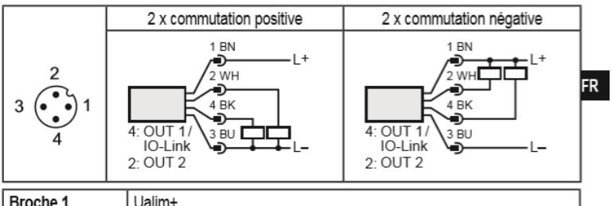

| Broche 1        | Ualim+                                                                                                       |
|-----------------|--------------------------------------------------------------------------------------------------------------|
| Broche 3        | Ualim-                                                                                                       |
| Broche 4 (OUT1) | sortie de commutation TOR contrôle de pression; IO-Link                                                      |
| Broche 2 (OUT2) | sortie de commutation TOR si [OU2] = [Hno], [Hnc], [Fno] ou [Fnc]     sortie de diagnostic si [OU2] = [dESI] |

| Tension d'alimentation [V]                               | 1836 DC 1) |
|----------------------------------------------------------|-----------------------|
| Consommation [mA]                                        |                       |
| Courant de sortie par sortie de commutation [mA]         |                       |
| Protection inversion de polarité / protection surcharges |                       |
| Protection contre les courts-circuits ; watchdog intégré |                       |
| Chute de tension [V]                                     | <2                    |
| Retard à la disponibilité [s]                            |                       |
| Fréquence de commutation [Hz]                            |                       |

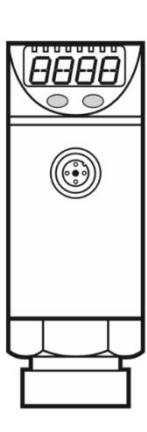

## **Transmetteur de niveau pour réservoirs HITEC CP5220**

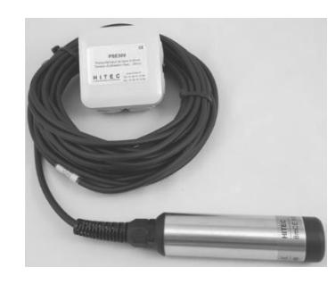

### **Présentation**

Mesure de niveau, surveillance et pilotage de hauteur de liquide (stable ou en mouvement), pour les réservoirs, les rivières et les nappes phréatiques.

La mesure de niveau est réalisée par mesure de pression différentielle entre la surface du liquide et la position du transmetteur immergé. La pression est convertie en signal électrique par technologie piézorésistive et conditionnée en boucle 4-20mA.

### **Gammes de mesure**

Hauteur d'eau réglée en usine à la pleine échelle désirée. Pleine échelle possible : de 0,5 m à 30 m de colonne d'eau.

Équivalent pression : 50 mbar à 3 bars.

### **Caractéristiques mécaniques**

Corps acier inox 316L et PVC.

Diamètre: 31 mm, hauteur: 150 mm, poids: 435 g sans câble.

Fixation pendulaire par câble autoporteur muni d'un système d'accrochage KITCAB.

Équipé en standard de 10 mètres de câble (ou plus sur demande) blindé muni d'un capillaire

interne.

### **Caractéristiques électroniques**

Cellule de mesure piézo résistive sur isolant et membrane souple silicone.

Signal conditionné en boucle de courant 4-20 mA sur 2 fils.

Non-linéarité: 0,15 % de la P.E., hystérésis: 0,1 % de la P.E..

Température de fonctionnement : De 2°C à 50°Celsius.

Large plage de fonctionnement: de 6 à 38 volts cc.

Livré en standard avec boîtier de raccordement et parasurtenseur PSE30V.

### **Conversions**

Pour toute valeur intermédiaire : H (m) = [Signal (mA) - 4mA] x PE (m)/16,

et inversement : Signal (mA) = [( Hauteur (m) / PE (m) ] x 16 ) + 4mA

### **Raccordements électriques**

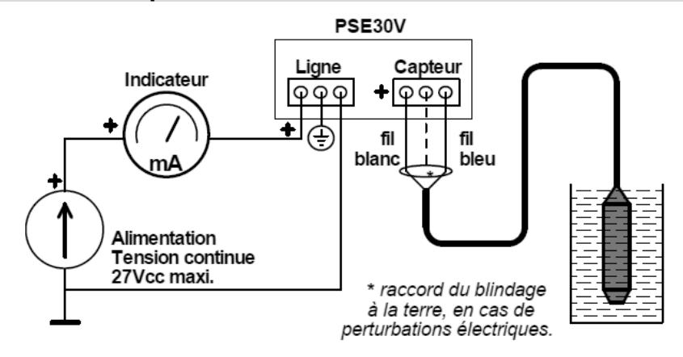

| Modèle CMEN-DOC v2 ©NEOPTEC  Nom de famille : (Suivi, s'il y a lieu, du nom d'usage)                                                                                                                                                                                                                                                                                                                                                                                                                                                                                                           |                         |   |  |  |  |  |  |  |  |  |       |      |  |   |  |                  |  |  |  |
|------------------------------------------------------------------------------------------------------------------------------------------------------------------------------------------------------------------------------------------------------------------------------------------------------------------------------------------------------------------------------------------------------------------------------------------------------------------------------------------------------------------------------------------------------------------------------------------------|-------------------------|---|--|--|--|--|--|--|--|--|-------|------|--|---|--|------------------|--|--|--|
|                                                                                                                                                                                                                                                                                                                                                                                                                                                                                                                                                                                                | Prénom(s) :             | П |  |  |  |  |  |  |  |  |       |      |  |   |  |                  |  |  |  |
|                                                                                                                                                                                                                                                                                                                                                                                                                                                                                                                                                                                                | Numéro Inscription : |   |  |  |  |  |  |  |  |  | Né(e) | le : |  | / |  | $\overline{ / }$ |  |  |  |
| (Le numéro est celui qui figure sur la convocation ou la feuille d'émargement)                                                                                                                                                                                                                                                                                                                                                                                                                                                                                                                 |                         |   |  |  |  |  |  |  |  |  |       |      |  |   |  |                  |  |  |  |
| (Remplir cette partie à l'aide de la notice)  Concours / Examen : Section/Spécialité/Série :                                                                                                                                                                                                                                                                                                                                                                                                                                                                                                   |                         |   |  |  |  |  |  |  |  |  |       |      |  |   |  |                  |  |  |  |
| Epreuve : Matière : Session :                                                                                                                                                                                                                                                                                                                                                                                                                                                                                                                                                                  |                         |   |  |  |  |  |  |  |  |  |       |      |  |   |  |                  |  |  |  |
| <ul> <li>Remplir soigneusement, sur CHAQUE feuille officielle, la zone d'identification en MAJUSCULES.</li> <li>Ne pas signer la composition et ne pas y apporter de signe distinctif pouvant indiquer sa provenance.</li> <li>Numéroter chaque PAGE (cadre en bas à droite de la page) et placer les feuilles dans le bon sens et dans l'ordre.</li> <li>Rédiger avec un stylo à encre foncée (bleue ou noire) et ne pas utiliser de stylo plume à encre claire.</li> <li>N'affectuer avec no collage ou déroupage de sujets ou de feuille officielle. Ne jointre aveun brouillon.</li> </ul> |                         |   |  |  |  |  |  |  |  |  |       |      |  |   |  |                  |  |  |  |

EDE ENE 2

# **DR1 - DR2**

Tous les documents réponses sont à rendre, même non complétés.

# **DOCUMENT RÉPONSE DR1** (réponses aux questions 19 et 20)

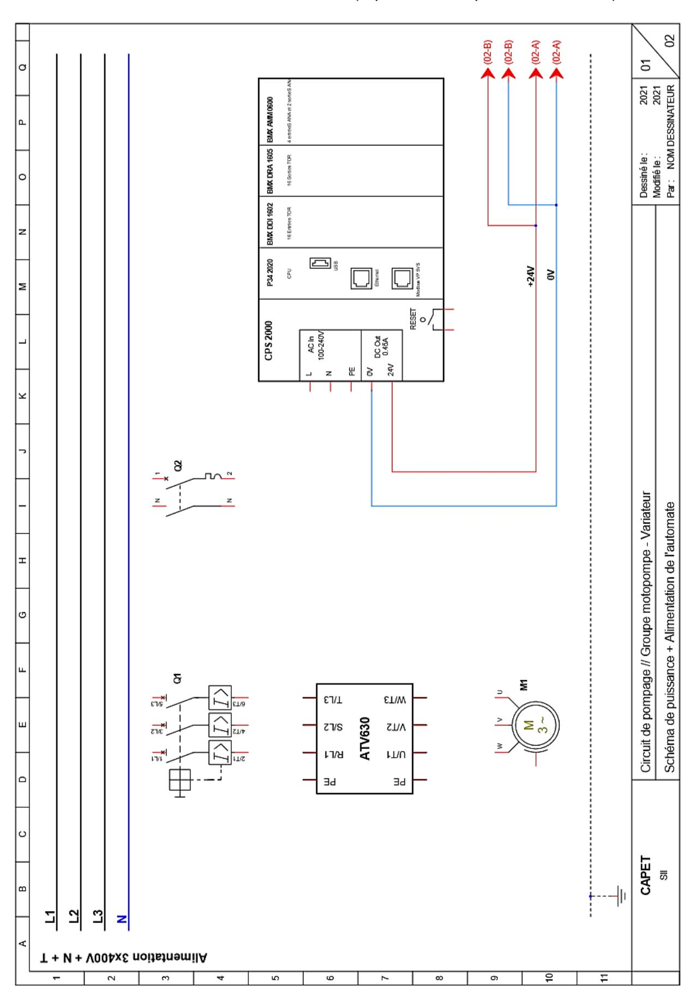

**Page 33 sur 34**

# **DOCUMENT RÉPONSE DR2** (réponse à la question 20)

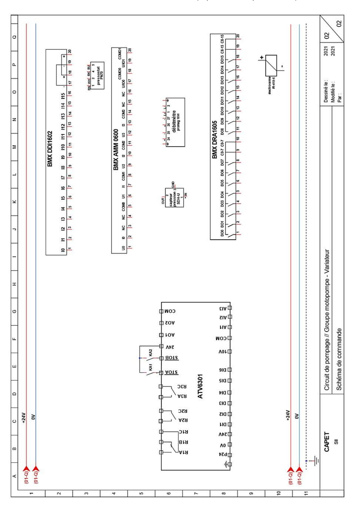

**Page 34 sur 34**