**EDE ENE 1**


#### **SESSION 2022** \_\_\_\_

# CAPET CONCOURS EXTERNE ET CAFEP CORRESPONDANT ET TROISIEME CONCOURS

**Section : SCIENCES INDUSTRIELLES DE L'INGÉNIEUR**

**Option : INGÉNIERIE ÉLECTRIQUE**

# **ÉPREUVE ÉCRITE DSICIPLINAIRE**

Durée : 5 heures \_\_\_\_

*Calculatrice autorisée selon les modalités de la circulaire du 17 juin 2021 publiée au BOEN du 29 juillet 2021.*

*L'usage de tout ouvrage de référence, de tout dictionnaire et de tout autre matériel électronique est rigoureusement interdit.*

*Si vous repérez ce qui vous semble être une erreur d'énoncé, vous devez le signaler très lisiblement sur votre copie, en proposer la correction et poursuivre l'épreuve en conséquence. De même, si cela vous conduit à formuler une ou plusieurs hypothèses, vous devez la (ou les) mentionner explicitement.*

**NB : Conformément au principe d'anonymat, votre copie ne doit comporter aucun signe distinctif, tel que nom, signature, origine, etc. Si le travail qui vous est demandé consiste notamment en la rédaction d'un projet ou d'une note, vous devrez impérativement vous abstenir de la signer ou de l'identifier.**

#### **INFORMATION AUX CANDIDATS**

Vous trouverez ci-après les codes nécessaires vous permettant de compléter les rubriques figurant en en-tête de votre copie

Ces codes doivent être reportés sur chacune des copies que vous remettrez.

**► Concours externe du CAPET de l'enseignement public** :

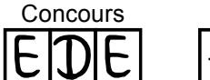

Concours Section/option Epreuve Matière EDE 1412E 101 9311

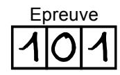

**► Concours externe du CAFEP/CAPET de l'enseignement privé** :


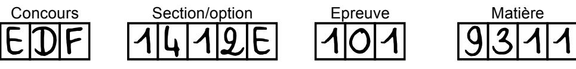

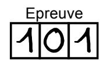

|   | Mat | ière |   |
|---|-----|------|---|
| 9 | 3   | 1    | 1 |

**►Troisième concours externe du CAPET de l'enseignement public :**

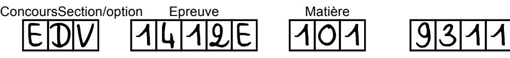

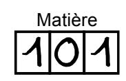

#### Ce sujet comporte :

- présentation et questionnement, pages 2 à 18
- documents techniques, pages 19 à 36
- documents réponses, pages 37 à 41

#### **Mise en situation**

Le chauffage représente 66 % des consommations énergétiques d'un foyer et la production d'eau chaude sanitaire 11 %. Le choix du système de chauffage et d'eau chaude est donc très important pour ne pas pénaliser le budget des ménages mais également pour offrir un confort optimal. Les rendements des appareils se sont beaucoup améliorés. Le gaz, le fioul et l'électricité ne sont plus les seules énergies disponibles pour se chauffer et produire de l'eau chaude. Les systèmes utilisant les énergies renouvelables sont de plus en plus performants, souvent plus économiques et toujours plus écologiques (source : Ademe).

Aujourd'hui les encadrements législatifs et techniques conduisent à la réalisation d'installations performantes, rentables et peu polluantes comme le chauffage urbain. Il apparaît comme un vecteur majeur de l'essor des énergies alternatives.

Dans le sujet proposé le chauffage urbain s'appuie sur le principe de cogénération. Cela consiste à produire en même temps et dans la même installation de l'énergie thermique à flamme et de l'énergie mécanique. La chaleur est utilisée pour le chauffage et la production d'eau chaude. L'énergie mécanique est convertie en énergie électrique grâce à un alternateur.

La cogénération n'est pas un concept nouveau. Des années 50 aux années 80, la cogénération était utilisée pour produire de l'électricité, principalement dans les grandes industries fortement consommatrices d'énergie thermique (sucreries, papeteries…) et équipées de grosses chaudières délivrant de la vapeur à haute pression nécessaire dans leur procédé.

#### **Présentation du support d'étude**

Le sujet se base sur l'étude du principe d'un réseau de chaleur urbain permettant le chauffage collectif à l'échelle d'une grande ville européenne ou d'un quartier.

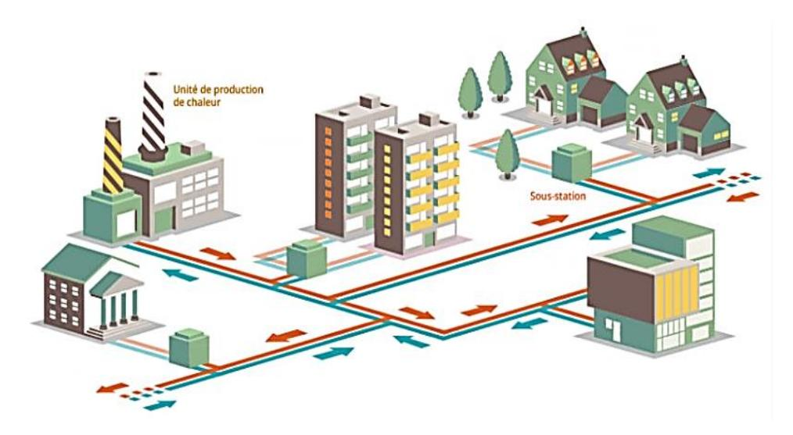

*Figure 1 : schéma de principe d'un réseau de chauffage urbain (source : ADEME)*

La figure 1 représente un réseau de chaleur urbain composé de 3 éléments fondamentaux :

- une unité de production de chaleur qui alimentent en fluide caloporteur le réseau de distribution primaire ;

- un réseau de distribution constitué de canalisations dans lesquelles la chaleur est transportée par le fluide caloporteur (de la vapeur ou de l'eau chaude) vers des postes d'échange ou sous-stations. Le fluide, plus tard refroidi, sera réacheminé vers l'unité de production pour être à nouveau chauffé ;
- des sous-stations qui transfèrent la chaleur du réseau de distribution primaire au réseau de distribution secondaire afin d'assurer la répartition de la chaleur entre les différents bâtiments (publics, immeubles de bureaux, logements collectifs et individuels).

L'acheminement du fluide par les canalisations vers les sous-stations engendre une perte d'énergie qui se traduit par la formation de condensats. Tous les ouvrages sont donc équipés de postes de purges qu'il est nécessaire de surveiller. Les cas d'utilisations de cette surveillance et la transmission de ces données de surveillance sont décrits dans les Documents Techniques DT1 et DT2.

#### **Problématique générale**

Comment fabriquer et transporter de la vapeur au sein d'un réseau de chaleur en toute sécurité tout en respectant les engagements des plans Climat ?

Ce sujet comporte 5 parties indépendantes abordant les problématiques suivantes :

- Partie A : comment améliorer le rendement lors de la production d'électricité ?
- Partie B : comment transporter la chaleur en toute sécurité et réduire les pertes thermiques ?
- Partie C : comment s'assurer que l'intervention d'un technicien de maintenance s'effectue en toute sécurité dans les postes de purge ?
- Partie D : comment alimenter en énergie électrique les systèmes de surveillance dans les postes de purge et comment opérer cette surveillance pour permettre une purge correcte ?
- Partie E : comment envoyer les données sur les paramètres du réseau en minimisant la consommation de l'énergie électrique ?

### **Partie A : comment améliorer le rendement lors de la production d'électricité ?**

L'objectif de cette partie est de comparer les moyens de production d'énergie et de justifier du choix de la cogénération pour la production d'électricité.

Au niveau national, le Gouvernement a adopté, en juillet 2004, le plan climat, qui regroupe un ensemble de mesures traduisant l'engagement de stabilisation des émissions de gaz à effet de serre de la France. Ce plan climat a été révisé en 2006 et fait l'objet d'une communication annuelle.

Dans la lutte contre le changement climatique, la France se place sur la trajectoire d'une division par quatre de ses émissions de gaz à effet de serre d'ici 2050 et entend contribuer de manière ambitieuse et déterminée au triple objectif européen d'une réduction de 20 % de nos consommations énergies, d'une part de 20 % des énergies renouvelables dans la consommation d'énergie et d'une diminution de 20 % de nos émissions de gaz à effet serre.

Cette directive répartit l'effort entre les États membres en fixant des objectifs nationaux en termes d'utilisation des énergies renouvelables pour les transports, la production de chaleur et la production d'électricité tout en mettant en avant les économies d'énergie et l'efficacité énergétique.

Pour assurer son autonomie, la France a choisi de promouvoir un bouquet énergétique appelé MIX ÉNERGÉTIQUE.

## **Plan climat / Mix Énergétique**

Dans le contexte énergétique en évolution rapide, la France doit disposer d'une énergie sûre, compétitive et non émettrice de gaz à effet de serre. Ainsi, la politique énergétique française doit conjuguer, dans le cadre de l'intégration des marchés européens, l'impératif de la lutte contre le changement climatique, la nécessité d'assurer la sécurité de notre approvisionnement et la maîtrise de l'impact de l'évolution des prix des énergies fossiles.

Les experts climatiques (rapport du GIEC sur l'évolution du climat, Groupe d'Experts Intergouvernemental du 09 août 2021), quand ils sont optimistes, prévoient que la température moyenne de la planète augmentera de 1,5°C et que le niveau des mers augmentera de 44 à 74 centimètres en moins de 100 ans.

Aujourd'hui deux types de sources d'énergie sont exploitées : les sources d'énergies non renouvelables et les sources d'énergie renouvelables.

**Question 1 :** proposer quelques exemples de sources d'énergie renouvelables et préciser quels en sont les avantages et inconvénients face aux sources d'énergies fossiles durant la phase d'exploitation (critères de disponibilité dans la durée, émission à effet de serre, stratégie d'approvisionnement national).

La composition du mix énergétique est très variable d'un pays ou d'une région à l'autre et peut évoluer fortement d'une période à l'autre.

S'il est très différent d'un pays à l'autre, le mix énergétique est, à l'échelle du monde, composé à plus de 80 % par les énergies fossiles. (source : https://www.planeteenergies.com)

**Question 2 :** après avoir rappelé ce qu'est le "mix énergétique", indiquer de quelle façon les engagements du plan climat devront le faire évoluer.

#### **Comment utiliser la chaleur pour produire de l'électricité lors de la cogénération ?**

Avec 4 % de la production d'électricité globale issue de la cogénération (7 % en hiver, saison où elle est le plus utilisée), la France est le troisième plus gros parc européen derrière les Pays-Bas (43 % de la production d'électricité) et l'Allemagne (9 %).

On compte 860 installations de cogénération en France (produisant 6,5 GW, dont 5 GW par des installations alimentées en gaz).

Plus du tiers de ces installations sont concentrées en Île-de-France, en Haute-Normandie et en Rhône-Alpes (source : http://www.mtaterre.fr).

**Question 3 :** compléter le Document Réponse DR1 qui illustre le principe de cogénération.

#### **Le rendement de la cogénération**

Une unité de cogénération produira 35 kWh d'électricité et 55 kWh de chaleur à partir de 100 kWh de combustible.

Une centrale classique produira 35 kWh d'électricité à partir de 100 kWh de combustible et 55 kWh de chaleur à partir de 60 kWh de combustible.

**Question 4 :** calculer les rendements des deux centrales et conclure quant à la pertinence des unités de cogénération.

#### **Les énergies primaires**

Pour produire 350 kWh d'électricité et 530 kWh de chaleur, à partir de gaz comme source d'énergie primaire :

- une unité de cogénération au gaz va consommer 1 000 kWh d'énergie primaire ;
- la meilleure centrale électrique (Turbine Gaz Vapeur), avec un rendement de 55 %, va consommer 636 kWh d'énergie primaire pour produire séparément 350 kWh d'énergie électrique. La meilleure chaudière, avec un rendement de 90 %, va consommer 589 kWh d'énergie primaire pour produire 530 kWh de chaleur. Le total pour les filières séparées s'élève à 1 225 kWh d'énergie primaire.
- **Question 5 :** compléter le Document Réponse DR2 et justifier de la pertinence du choix de la cogénération en calculant l'économie d'énergie primaire (en kWh et en pourcentage) dans les deux installations de référence précédentes, pour produire la même énergie (880 kWh).

#### **L'impact environnemental**

RTE (gestionnaire du Réseau de Transport d'Electricité) publie de manière périodique des bilans et analyses : passage de l'hiver, bilan électrique de l'année, évolutions nécessaires du réseau, enjeux autour du développement de la mobilité électrique, etc.

De fait, RTE fournit en continu une estimation des émissions de gaz carbonique générées par la production d'électricité, exprimée en grammes de CO2 par kWh produit.

**Question 6 :** à partir des données fournies par RTE dans le Document Technique DT A1, reprendre les chiffres des deux installations précédentes et calculer les émissions de CO2 pour chacune de deux filières. Pour 1 MWh d'énergie produite, quelle est l'économie d'émission de CO<sup>2</sup> réalisée ?

**Question 7 :** conclure quant à l'intérêt de l'utilisation de la centrale en cogénération.

# **Partie B : comment transporter la chaleur en toute sécurité et réduire les pertes thermiques ?**

L'objectif de cette partie est de vérifier que les condensats seront correctement réinjectés dans le circuit retour d'eau dans le respect des exigences imposées par l'exploitant et de valider le choix de nouveaux matériels vis-à-vis de nouvelles exigences.

Le réseau de chauffage urbain implique trois éléments fondamentaux : les sources de chaleur assurant la production de la chaleur, le réseau de distribution et les sous-stations situées dans les immeubles.

#### **Le transport de la vapeur**

Lors de l'acheminement du fluide par les canalisations (le réseau de distribution) desservant les immeubles équipés de postes de livraison (les sous-stations), il existe une perte d'énergie liée au transfert d'une partie de la chaleur aux canalisations, supports, points fixes et tout autre accessoire constituant le réseau de distribution.

Cette perte d'énergie se traduit d'abord par de la surchauffe de la vapeur en sortie des générateurs de vapeur puis par de la condensation d'une fraction de ce débit (condensats).

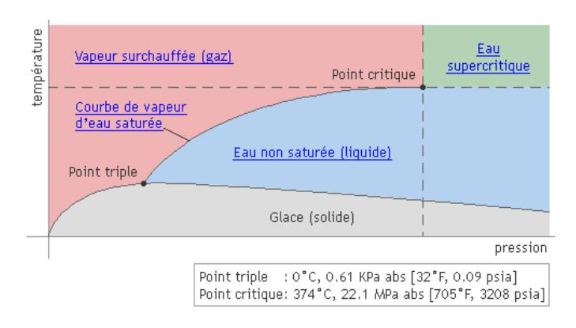

*Figure 2 : effet de la pression sur la température de l'eau / de la vapeur*

L'unité étudiée produit de la vapeur à la pression de 12 bars.

**Question 8 :** à partir de la formule empirique de Duperray, calculer la valeur de la température de vaporisation en fonction de la pression de 12 bars.

$$P_s = \left(\frac{T_s}{100}\right)^4$$
  $T_s$  est exprimée en degrés Celsius et Ps en bars.

Il existe des tables permettant de déterminer directement la correspondance pression / vapeur. Vérifier le calcul à l'aide de la table de vapeur saturée du Document Technique DT B1.

#### La surveillance des températures des condensats

La production et la distribution de la vapeur est décrite figure 3.

Le transport de la vapeur et les pertes thermiques dans la tuyauterie engendrent de la condensation d'une partie de cette vapeur. Ce phénomène produit des condensats. Il est impératif d'évacuer rapidement cette condensation sous peine d'altérer l'intégrité des conduites avec l'apparition de coup de bélier ou coup de marteau dans le circuit de retour. Ces condensats sont stockés dans des réservoirs appelés des « bâches ».

Ils sont également renvoyés dans le réseau de retour d'eau afin de récupérer toute l'énergie dont ils sont encore pourvus. Cette opération améliorera encore le rendement global de l'installation et générera des économies en termes de coûts en évitant de puiser dans le fleuve voisin de l'eau nécessaire à la production de vapeur et dont le coût de déminéralisation, non négligeable, est de l'ordre de  $3 \in I$  m<sup>3</sup>.

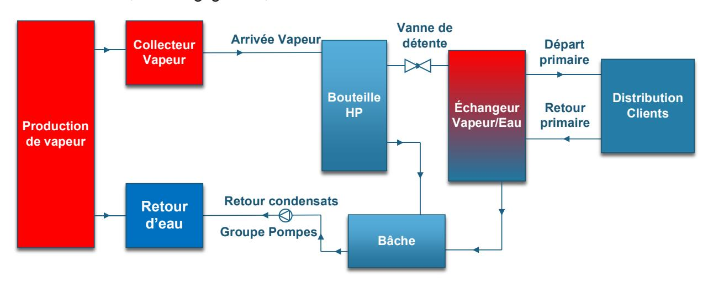

Figure 3 : architecture générale de la production / distribution de la chaleur

Afin d'assurer une purge correcte des condensats, un système de surveillance représenté sur le Document Technique DT B2 est fixé sur les tuyaux de vapeur dans un local qui se nomme poste de purge. Les mesures seront traitées par le module TRT200 développé par la société LOREME basée à METZ (Moselle). Un algorithme de surveillance de la température est implémenté dans la carte électronique et décrit dans le Document Technique DT B3.

En cas de dysfonctionnement des systèmes de surveillance ou d'alimentation électrique, les condensats doivent pouvoir être renvoyés vers les égouts mais avec un impératif : la température de l'eau doit être inférieure à 30°C.

**Question 9 :** compléter l'algorigramme du Document Réponse DR3 qui assurera la surveillance du poste de purge pour les températures T1, T2 et T3.

#### **Le dimensionnement de la pompe de relevage**

Un groupe de relevage des condensats est destiné à recueillir ces derniers et à les renvoyer au réseau vapeur par le retour d'eau. Le groupe est constitué d'une bâche et d'une ou plusieurs pompes de relevage. La bâche est la capacité tampon à la pression atmosphérique, destinée à recevoir les condensats provenant de l'échangeur et de la bouteille de purge.

Le débit du retour d'eau doit être suffisant pour obtenir par mélange avec les purges diphasiques de l'eau chaude à une température inférieure à la température de saturation du retour d'eau.

Afin de vérifier si la pompe installée correspond bien aux exigences, il faut déterminer un ordre de grandeur du rapport entre le débit de retour d'eau et le débit des purges

Soit Tr et Qr la température et le débit du retour d'eau et Tm la température de mélange.

Soit Qp le débit des purges du réseau à Tsat = 192°C à 12 bars effectifs.

En supposant que les capacités thermiques massiques Cp varient peu avec la température, on peut écrire :

Qp **∙** (Tsat -Tm) + Qr **<sup>∙</sup>** (Tr -Tm) = 0 (conservation de l'énergie dans la bouteille de condensation)

**Question 10 :** calculer le rapport minimum Qr Qp à obtenir, rapport entre le débit de retour d'eau et le débit des purges du réseau pour une température de retour d'eau inférieure à 65°C et une température de mélange inférieure à 95°C.

Le volume que l'on appelle actif (Va) de la bâche est le volume de condensats compris entre les niveaux haut et bas du fonctionnement de la pompe.

Ce volume (Va) est calculé en fonction du débit maximal (Qm) de la pompe des condensats. Il est égal à : Va = Q<sup>m</sup> 4∙n avec Qm le débit de la pompe maximal exprimé en l∙h-1, Va en dm3 et n le nombre maximal de démarrage de la pompe en une heure (il faut considérer le cas où n = 10). La surface S de la bâche représentée sur la figure 4 est de 6 m2.

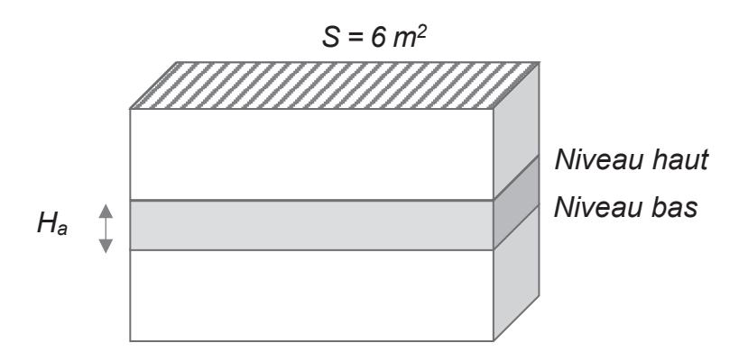

Figure 4 : schéma d'une bâche recevant des condensats

Dans les spécifications techniques, il est indiqué que H<sub>a</sub> doit être supérieure à 100 mm pour un bon fonctionnement de la pompe comme indiqué dans le diagramme des exigences du Document Technique DT 3.

Les caractéristiques du moteur de cette pompe, également indiquées dans le Document Technique DT B5, sont définies dans la figure 5.

Tension nominale : 400 V Fréquence : 50 Hz

Puissance nominale P1: 2.8 kW Puissance nominale P2: 2.2 kW

Courant nominal: 4,8 A

Figure 5 : caractéristiques techniques de la pompe de relevage

P1 est la puissance nominale électrique et P2 est la puissance mécanique disponible sur l'arbre du moteur

#### **Question 11:** exprimer H<sub>a</sub> en fonction de Q<sub>m</sub>, S et n.

Effectuer l'application numérique pour un débit maximal de la pompe de 36 m<sup>3</sup>·h<sup>-1</sup>.

Calculer le rendement hydraulique de la pompe sachant qu'il est égal à  $\eta_H = \frac{H \cdot Q_m}{11000}$  où P1 est exprimée en kW, H est appelé Hydraulic data dans la

Documentation Technique DT B5 de la pompe et Q<sub>m</sub> est exprimé en m<sup>3</sup>·h<sup>-1</sup>.

Calculer le rendement du moteur de la pompe.

**Question 12 :** les exigences du diagramme sysml du Document Technique DT 3 sont-elles satisfaites pour toutes ces valeurs ?

#### Le circuit de commande des pompes et la surveillance des défauts

Afin d'optimiser l'encombrement tout en améliorant les performances du matériel électrique à utiliser dans les coffrets de puissance pour commander les groupes de pompes de condensats, il a été nécessaire de choisir un nouveau matériel.

**Question 13 :** à partir des Documents Techniques DT B4 et DT B6, citer les trois fonctions remplies par le Tesys U Lub12 par rapport à une solution conventionnelle. Déterminer si le module Tesys U Lub 12 est configuré en mode Arrêt Standard ou Arrêt Reflexe. Justifier la référence du module Luca12BL (Document technique DT B7) et donner le rôle du module RM17G du Document Technique DT B8.

**Question 14 :** compléter le schéma électrique sur le Document Réponse DR 4 en y ajoutant les contacts (SD : signal défaut) PRIMAIRE ALIM 24 Vcc et CONTROLEUR DE RÉSEAU TRI afin de signaler un ou des défauts regroupés vers le module TRT200.

**Question 15 :** compte tenu de l'ensemble des questions de cette partie B, quels seraient les conséquences d'un défaut sur le réseau alimentant les moteurs ?

# **Partie C : comment s'assurer que l'intervention d'un technicien de maintenance s'effectue en toute sécurité dans les postes de purge ?**

Dans cette partie, l'objectif est d'exploiter au format numérique la valeur de la température au sein du poste de purge.

Il est vital de s'assurer qu'aucun tuyau n'ait préalablement cédé car il serait susceptible de causer une pression et une température trop élevées dans le poste. La température qui règne dans la chambre du poste de purge doit être obligatoirement connue par le technicien de maintenance qui intervient.

Cette température est mesurée à l'aide du composant DS1820 dans le TRT 200. Il mesure la température ambiante au sein du poste de purge.

Ce composant est basé sur le protocole OneWire (Document Technique DT C1) et est considéré comme étant un capteur intelligent. Chaque capteur est repéré par un identifiant unique. On connaîtra ainsi sa géolocalisation dans le poste de purge où il a été placé après avoir interrogé une base de données.

La société qui produit ce composant fabrique deux types de familles :

- le DS18B20 (valeur de la température codée et configurable entre 9 et 12 bits) ;
- le DS18S20 (valeur de la température codée sur 9 bits).

Une mesure de l'identifiant pour un capteur DS1820 dans le poste de purge « PstPurge102 » est notée en figure 6 ci-dessous :

| Octet  | CRC  |      |      |      | Numéro de série |      |      | Code<br>Family |
|--------|------|------|------|------|-----------------|------|------|----------------|
| Valeur | 0xCC | 0x3C | 0x01 | 0xA8 | 0x16            | 0x48 | 0xC8 | 0x28           |

*Figure 6 : résultat d'une mesure de l'identifiant du capteur DS1820*

**Question 16 :** à partir du Document Technique DT C2 du composant DS18B20, exprimer le nombre total de capteurs par famille pouvant être fabriqué théoriquement et possédant un identifiant unique.

Donner le rôle du CRC.

À partir de la mesure précédente, indiquer la famille de ce composant (DS18B20 ou DS18S20).

Un envoi de la valeur 0x44 par le microcontrôleur vers le capteur lance une conversion de la température. Une temporisation de 750 ms (codage de la température sur 12 bits) est nécessaire. Puis la valeur 0xBE est envoyée par le microcontrôleur vers le DS1820. Cette commande permet de récupérer les valeurs stockées. Il s'agit de 9 octets placés dans la mémoire interne (appelée Scratchpad ; Document Technique DT C3).

La figure 7 ci-dessous présente le résultat dans le Scratchpad (mémoire du composant) d'une demande de mesure d'une température.

| N°Octet | Byte 8 | Byte 7 | Byte 6 | Byte 5 | Byte 4 | Byte 3 | Byte 2 | Byte 1 | Byte 0 |
|---------|--------|--------|--------|--------|--------|--------|--------|--------|--------|
| Valeur  | 0xE0   | 0x10   | 0x0C   | 0xFF   | 0x7F   | 0x46   | 0x4B   | 0x03   | 0x36   |

*Figure 7 : résultat de la conversion de la mesure d'une température*

Un extrait d'un programme et plus précisément de la fonction lecture du DS1820 écrite en micropython est donnée en figure 8*.* 

```
N°ligne
1: temp = Byte[1] << 8 | Byte[0]
2: return temp / 16
```

*Figure 8 : extrait de la fonction lecture du DS1820 en langage micropython*

**Question 17 :** en reprenant les valeurs stockées dans le Scratchpad de la mémoire du DS1820 (tableau précédent) envoyées au microcontrôleur (Byte 0 à Byte 8) et en s'inspirant des Documents Techniques DT C3 à DT C5, donner la valeur de la variable temp de la ligne 1 en binaire.

Donner le nom de cette opération informatique.

En déduire sur combien de bits est codée la température (voir Document Technique DT C4).

Décoder puis indiquer la valeur en décimal de la température au sein du poste de purge.

Le technicien peut-il intervenir en toute sécurité (voir DT 3) ?

Les données des différentes températures sont enregistrées dans un système de gestion de base de données relationnelles (SGBDR) dont voici l'extrait de deux tables en figure 9 :

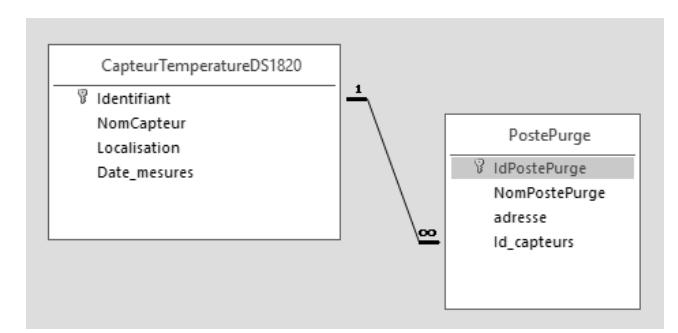

*Figure 9 : extrait de la base de données relationnelles*

Le technicien avant d'intervenir le 23 mars 2021 interroge la base de données pour connaître l'évolution de la température au sein du poste de purge lors de cette journée. Il peut vérifier que la température soit cohérente avec une intervention humaine en toute sécurité.

**Question 18 :** compléter la requête SQL sur le Document Réponse DR 5 pour obtenir la valeur de la température dans le poste de purge « PstPurge102 » le 23/03/2021.

**Partie D : comment alimenter en énergie électrique les systèmes de surveillance dans les postes de purge et comment opérer cette surveillance pour permettre une purge correcte ?**

L'objectif de cette partie porte sur l'étude d'une solution assurant une alimentation électrique suffisante du TRT200 pour permettre l'émission des paramètres de surveillance vers une régie de supervision et d'en déduire la chaîne fonctionnelle du système.

#### **Comment alimenter en énergie électrique les postes de purge ?**

La surveillance des différents paramètres au sein des postes de purge (Température, hygrométrie, pression, conductivité …) est assurée par le TRT200. Il est important d'alerter lorsqu'un ou plusieurs paramètres dépassent certains seuils notamment lorsque la purge n'est pas assurée (questionnement partie B).

Il est essentiel d'alimenter en énergie électrique le module TRT 200 qui surveille ces paramètres. Les postes de purge alimentés par le réseau électrique sont très peu nombreux (moins de 10%). Les autres postes de purge, peu accessibles par le réseau de distribution électrique national, sont alimentés par des modules autonomes fournissant leur propre énergie.

Il est nécessaire de trouver une solution technologique pour répondre à cette problématique de fourniture d'énergie électrique autonome au plus près des modules.

C'est la société Loreme située à Metz (57) qui a su innover avec la mise en œuvre d'un module Peltier.

Description de l'effet Peltier : lorsqu'un courant électrique continu traverse des semiconducteurs, l'un de type P et l'autre de type N, un côté de la jonction baisse en température et l'autre côté monte en température. Deux plaques de céramique isolent les composants semi-conducteurs. Il existe un effet inverse, l'effet Seebeck : une différence de température imposée à une jonction composée de matériaux différents induit une différence de potentiel électrique. C'est la différence de potentiel électrique qui est exploitée pour constituer une source d'énergie électrique.

**Question 19 :** comparer les trois modes de production d'électricité autonomes que sont le module Peltier, une micro turbine-Alternateur ou des panneaux photovoltaïques en établissement la liste des avantages et inconvénients dans le tableau du Document Réponse DR 6.

On prendra comme température au sein du poste de purge une valeur de 50°C et on considérera que celle mesurée sur les tuyaux vapeur où est implanté le module Peltier monté sur son radiateur est de 130°C.

**Question 20 :** dans notre application, quel est l'effet souhaité (Peltier ou Seebeck) pour pouvoir alimenter en électricité le TRT200 ?

> À partir du Document Technique DT D2, déterminer la valeur de la tension de sortie du module puis le courant de sortie que peut délivrer le module. En déduire la puissance utile.

> Ces valeurs sont-elles compatibles avec les spécifications des accumulateurs notées sur le schéma structurel du TRT200 150 mA.h pour IchargePEL = 3 mA ?

Les tensions disponibles pour alimenter le TRT 200 sont de +3,5V et +5V.

La tension issue du module Peltier est appliquée au circuit MAX1703. Cette tension sera convertie grâce au système dont le schéma de principe est décrit sur la figure 10 (page 14). La tension d'entrée est la tension issue du module Peltier.

Un convertisseur électronique est en charge d'alimenter le TRT 200 à partir de la tension d'entrée fournie par le module Peltier. Il n'est pas exigé d'isolation galvanique entre le module Peltier et le TRT 200.

La tension de sortie du module Peltier est égale à 2 V lorsque la différence de température au sein du poste de purge est de 130 – 50 = 80°C.

**Question 21 :** à partir des caractéristiques des grandeurs d'entrée et de sortie du convertisseur, qualifier celui-ci d'un point de vue fonctionnel.

**Question 22 :** compléter le diagramme des blocs internes du système à l'aide du vocabulaire du Document Réponse DR7.

Des mesures sur le module Peltier ont été effectuées et montrent que la tension à ses bornes dépasse souvent les 5 V.

# **Comment surveiller des paramètres pour prévenir lors d'un dysfonctionnement de l'alimentation électrique du TRT200 ?**

Des accumulateurs sont installés pour palier à une éventuelle défaillance des alimentations par le réseau ou par le module Peltier.

On considérera dans cette partie que les accumulateurs sont chargés à 2,4 V par cellule.

La partie gestion de la charge n'est pas représentée.

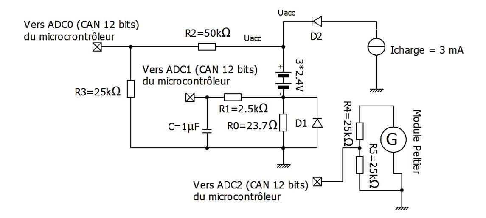

*Figure 10 : schéma structurel de surveillance des paramètres*

Le circuit de charge et de décharge ainsi que la tension issue du module Peltier est représentée sur la figure 10 par un générateur de tension. Le TRT200 surveille différents paramètres que sont les grandeurs physiques telles que les températures avec des sondes PT100, la pression d'eau, la conductivité de l'eau, ou l'hygrométrie qui sont mesurées et converties par des CAN Sigma Delta LT2439 mais non étudiées.

D'autres grandeurs physiques (tensions) sont appliquées sur les entrées d'un convertisseur analogique - numérique du microcontrôleur PIC 18F1823 (ADC0, ADC1 et ADC2). La surveillance de la présence de la tension du secteur (lorsqu'elle est disponible) n'est pas représentée. On considérera une tension de seuil des diodes de 0,6 V.

La tension de référence du Convertisseur Analogique Numérique est égale à 3,5 V.

La tension Uacc alimente la carte électronique du module TRT200. Un extrait de la structure du CAN interne du PIC 18F8723 est présente dans le Document Technique DT D3 et DT D4.

**Question 23 :** indiquer le nombre de CAN représenté sur cette structure, le nombre d'entrées disponibles à la conversion, le rôle des entrées CHS0 à CHS3 et la résolution de ce CAN.

**Question 24 :** indiquer les différents paramètres mesurés sur les entrées ADC0, ADC1 et ADC2.

Calculer le quantum du convertisseur analogique numérique.

En déduire la valeur en sortie du CAN exprimée en base décimale lorsque la tension aux bornes du module Peltier est de 2 V.

Justifier l'alarme télétransmise pour une valeur de 0xAF (175 en base décimale) à la sortie du CAN lors de la numérisation d'une valeur de la tension du module Peltier.

**Question 25 :** remplir l'octet à écrire du registre ADCON0 du microcontrôleur 18F8723 (DT D4) sur le Document Réponse DR 8 sachant que ADC2 est connectée sur l'entrée analogique AN2 du microcontrôleur et que l'on vient juste de lancer la conversion pour obtenir la valeur de la tension du module Peltier. Exprimer cet octet en hexadécimal.

**Question 26 :** expliquer le rôle de la résistance R0 dans la mesure de la charge des accumulateurs.

**Question 27 :** la diode D1 est nécessaire pour protéger en tension l'entrée analogique du CAN. Expliquer le principe de cette protection.

# **Partie E : comment envoyer les données sur les paramètres du réseau en minimisant la consommation de l'énergie électrique ?**

L'objectif de cette partie est l'étude d'un nouveau système de transmission des données de surveillance.

Afin d'envoyer tous les paramètres de surveillance des postes de purges vers un système de supervision centralisé et de télésurveillance, la solution technologique adoptée actuellement est l'envoi par sms. En effet, le réseau RTC (téléphonique) est très peu présent dans les différentes chambres de postes de purge tout comme l'électrification. Le réseau RTC tend à disparaître et à être remplacé par un autre type de réseau.

Avec l'émergence de la technologie des objets connectés, il convient d'envisager une autre voie pour émettre les données issues du TRT 200.

Il a été décidé d'utiliser une technique de transmission des informations avec la technologie d'internet des objets et protocole de type « Lora » dont l'architecture est représentée sur la figure 11.

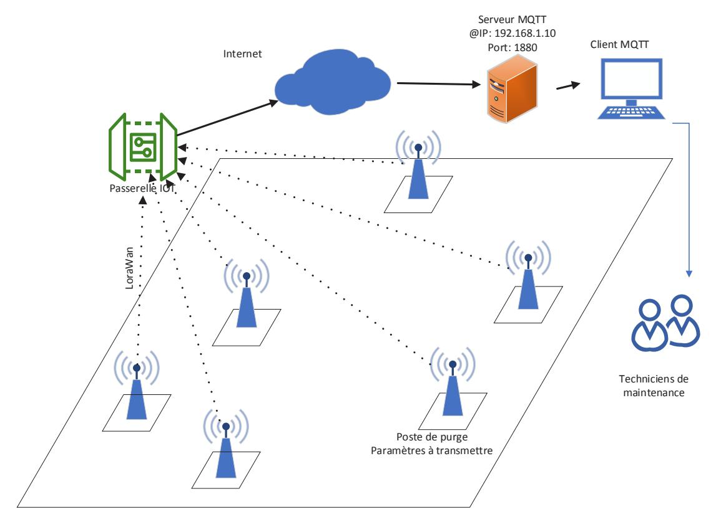

*Figure 11 : Architecture du réseau de la transmission des données*

**Question 28 :** après avoir consulté les Documents Techniques DT E1 et DT E2, donner la valeur de la bande de fréquence utilisée pour la technologie LoraWan en Europe.

On souhaite envoyer la valeur de la tension aux bornes du module Peltier. Cette valeur sera codée sur 12 bits. (Spreading Factor : SF = 12).

**Question 29 :** calculer le débit binaire utile pour une bande passante de 125 KHz si l'on rajoute 1 bit redondant (CR = 4/5) pour chaque symbole. Discuter autour de cette valeur.

Le symbole envoyé représente la valeur de la tension du module Peltier (module qui permet d'alimenter la carte électronique du TRT200). Cette valeur de la tension ne doit pas être inférieure à 0,9 V.

**Question 30 :** à l'aide du Document Technique DT E2, décoder la valeur du symbole représenté sur la figure 12.

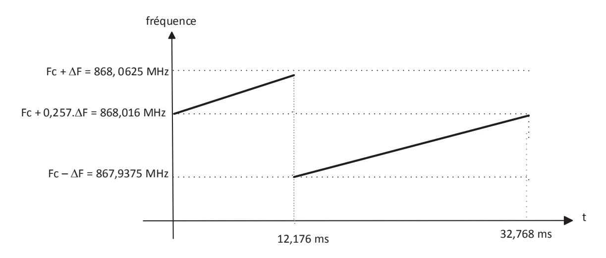

*Figure 12 : chronogramme de la transmission d'un symbole*

À partir du schéma structurel de la figure 13, déduire la valeur de la tension à la sortie du module Peltier (cette tension est numérisée par un CAN 12 bits et sa tension de référence de 3,5V).

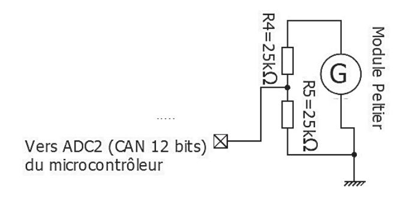

*Figure 13 : schéma structurel Surveillance Tension du Peltier*

Les informations sont transmises grâce au protocole MQTT qui est un protocole de communication dédié aux objets connectés.

**Question 31 :** à l'aide du schéma de transmission des données de la figure 11, compléter le Document Réponse DR 9 en indiquant l'adresse IP à configurer ainsi que le port dans le champ Server du server MQTT.

> Sur ce même Document Réponse DR9, compléter le Topic dédié à l'affichage de la tension issue du module Peltier du poste de purge 102 (voir Document Technique DT E3).

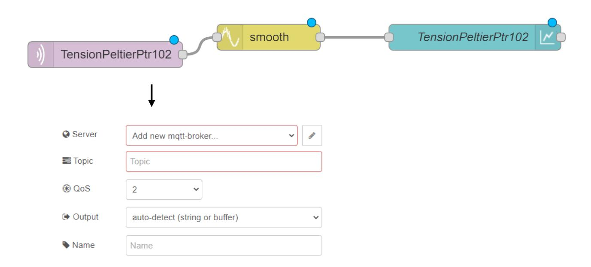

*Figure 14 : Configuration du broker Protocole MQTT*

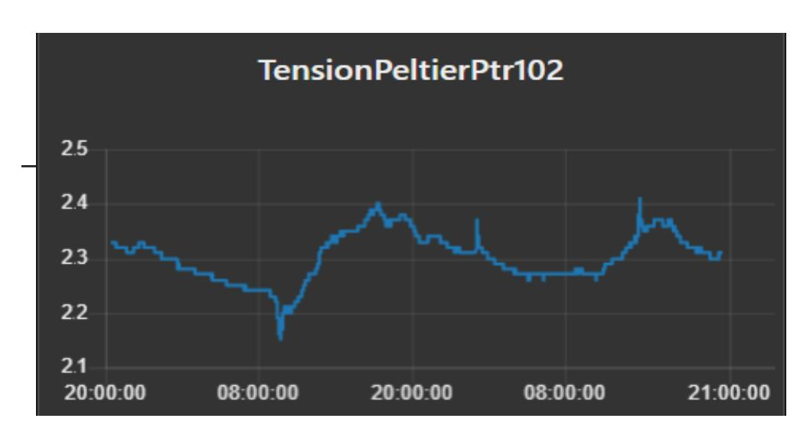

*Figure 15 : relevé de l'évolution de la tension Peltier*

**Question 32 :** la tension aux bornes du module Peltier est-elle compatible avec les spécifications du cahier des charges d'après le relevé effectué en figure 15 ?

### **DOCUMENTS TECHNIQUES**

#### DOCUMENT TECHNIQUE DT 1

#### **Cas d'utilisations du TRT 200**

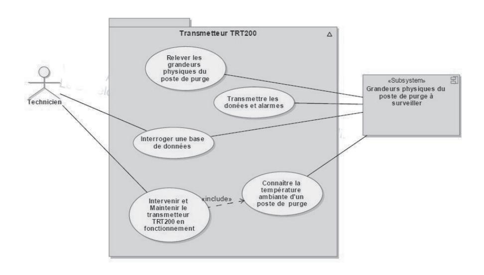

#### DOCUMENT TECHNIQUE DT 2

#### **Extrait du Diagramme de définitions de blocs concernant le TRT200**

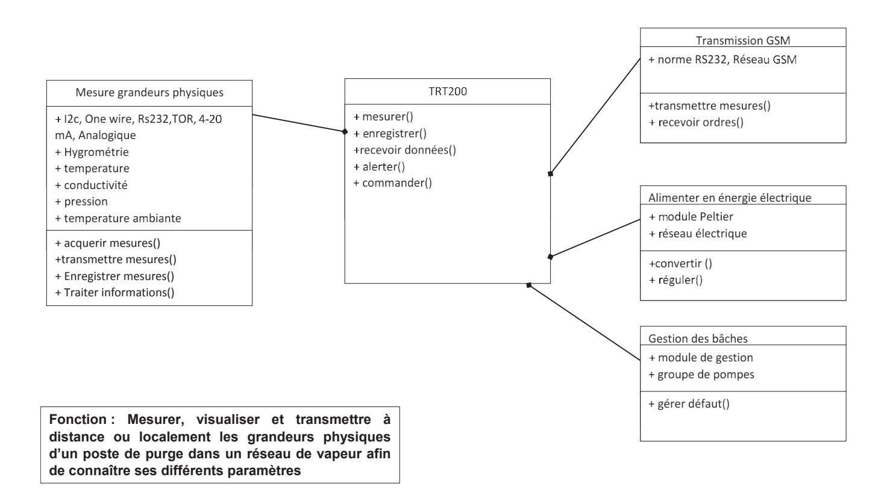

#### DOCUMENT TECHNIQUE DT 3

#### **Extrait du Diagramme des exigences du TRT200**

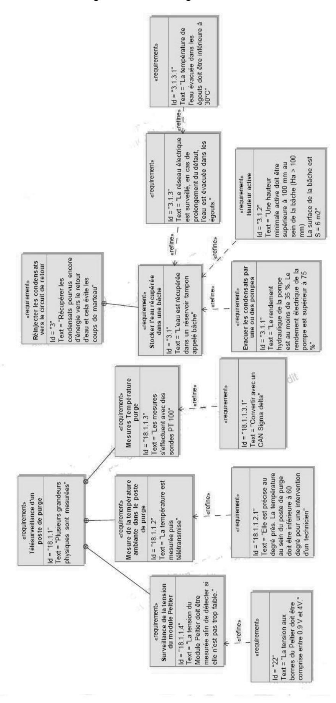

#### DOCUMENT TECHNIQUE DT A1

#### **Calcul en temps réel des émissions de CO2**

Ces valeurs illustrent uniquement les émissions de CO2 générées par,la consommation du combustible primaire des centrales de production situées sur le territoire français. Elles ne prennent pas en compte les émissions de carbone générées lors de la construction des moyens de production ou lors du cycle d'extraction/transformation/transport des combustibles utilisés.

De la même façon, les émissions de CO2 par kWh produit en France ne prennent pas en compte les échanges d'énergies aux interconnexions (imports ou exports d'électricité).

Ces valeurs sont révisées régulièrement en fonction des évolutions techniques des moyens de production et de la part des différentes technologies au sein d'une filière.

RTE (gestionnaire du Réseau de Transport d'Electricité)

| Combustible                          | Emissions de CO2 (t CO2<br>eq / MWh) |
|--------------------------------------|--------------------------------------|
| Gaz («<br>turbine à combustion<br>») | 0,486                                |
| Groupe «<br>co-génération<br>»       |                                      |
| et «<br>cycle combiné<br>» gaz       | 0,352                                |

#### DOCUMENT TECHNIQUE DT B1

#### **Caractéristiques physiques de la vapeur d'eau saturée**

#### **Table de vapeur saturée**

Une table de vapeur saturée est un outil indispensable pour tout ingénieur travaillant dans la vapeur. Elle permet de déterminer la température de la vapeur saturée à partir de la pression, ou l'inverse : la pression à partir de la température de la vapeur. Ces tables comportent généralement d'autres données comme l'enthalpie spécifique (h) et le volume spécifique (v).

Les valeurs déduites dans une table de vapeur se réfèrent toujours à la vapeur à un point de saturation ou d'ébullition donné. C'est le point où l'eau (liquide) et la vapeur (gaz) peuvent coexister à la même température et pression.

| Ps<br>(en bars) | Température<br>de vaporisation<br>(°C) | ρ<br>(kg/m3<br>) | Enthalpie<br>massique<br>vaporisation<br>kJ/kg | Enthalpie<br>massique vapeur<br>kJ/kg |
|-----------------|----------------------------------------|------------------|------------------------------------------------|---------------------------------------|
| 8               | 170,41                                 | 4,1615           | 2046,5                                         | 2767,5                                |
| 8,5             | 172,94                                 | 4,4092           | 2037,9                                         | 2769,9                                |
| 9               | 175,36                                 | 4,6555           | 2029,5                                         | 2772,1                                |
| 9,5             | 177,66                                 | 4,902            | 2020,9                                         | 2775                                  |
| 10              | 179,88                                 | 5,1467           | 2013,6                                         | 2776,2                                |
| 11              | 184,07                                 | 5,637            | 1998,5                                         | 2779,7                                |
| 12              | 187,96                                 | 6,1275           | 1984,3                                         | 2782,7                                |

| 13 | 191,61 | 6,6181 | 1970,7 | 2785,4 |
|----|--------|--------|--------|--------|
| 14 | 195,04 | 7,1073 | 1957,7 | 2787,8 |
| 15 | 198,29 | 7,593  | 1945,2 | 2789,9 |
| 16 | 201,37 | 8,0841 | 1933,2 | 2791,7 |
| 17 | 204,31 | 8,5763 | 1921,5 | 2793,4 |
| 18 | 207,11 | 9,0662 | 1910,3 | 2794,8 |
| 19 | 209,8  | 9,5511 | 1899,3 | 2796,1 |

*Extrait de table de vapeur saturée.*

#### DOCUMENT TECHNIQUE DT B2

#### **Schéma de principe purge des condensats dans un poste de purge**

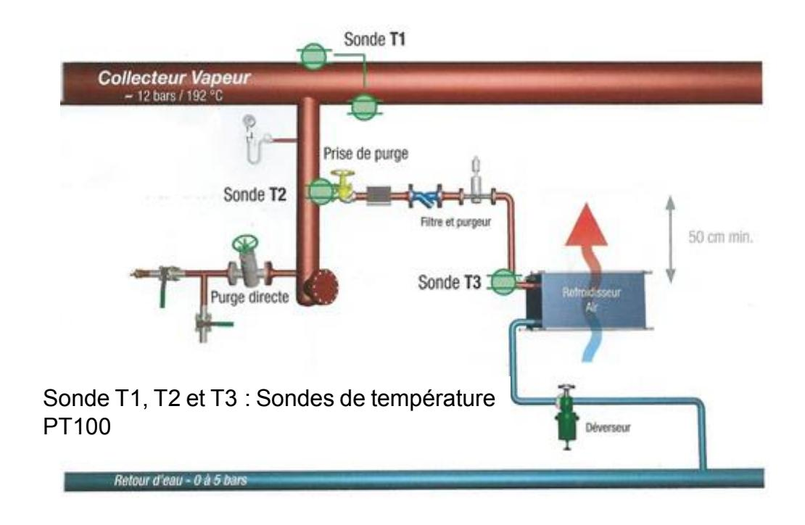

#### DOCUMENT TECHNIQUE DT B3

#### **Algorithme de surveillance des sondes de température dans les postes de purge**

L'algorithme de surveillance de trois sondes (PT100) pour une purge efficace est le suivant :

| T1 -<br>T2 < 12°C | et T3 < 160°C | Fonctionnement correct |
|-------------------|---------------|------------------------|
| T1 –<br>T2 > 12°C | et T2 > 140°C | Purge insuffisante     |
| T1 –<br>T2 < 12°C | et T3 > 160°C | Purge fuyard           |
| T2 < 140°C        |               | Ne purge pas           |

#### Document Technique DT B4

### **Schémas électriques**

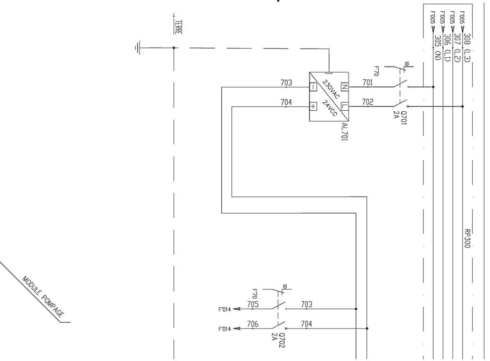

*Chambre Réseau \_Coffret Distribution 24V*

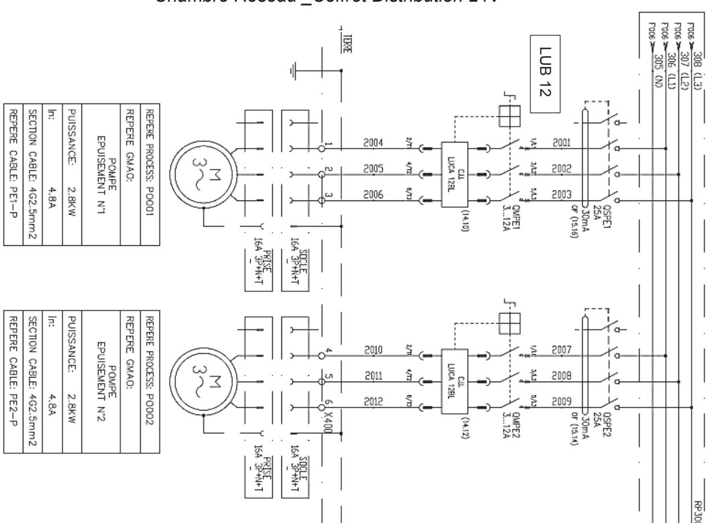

*Chambre Distribution 400 VAC Puissance Moteur*

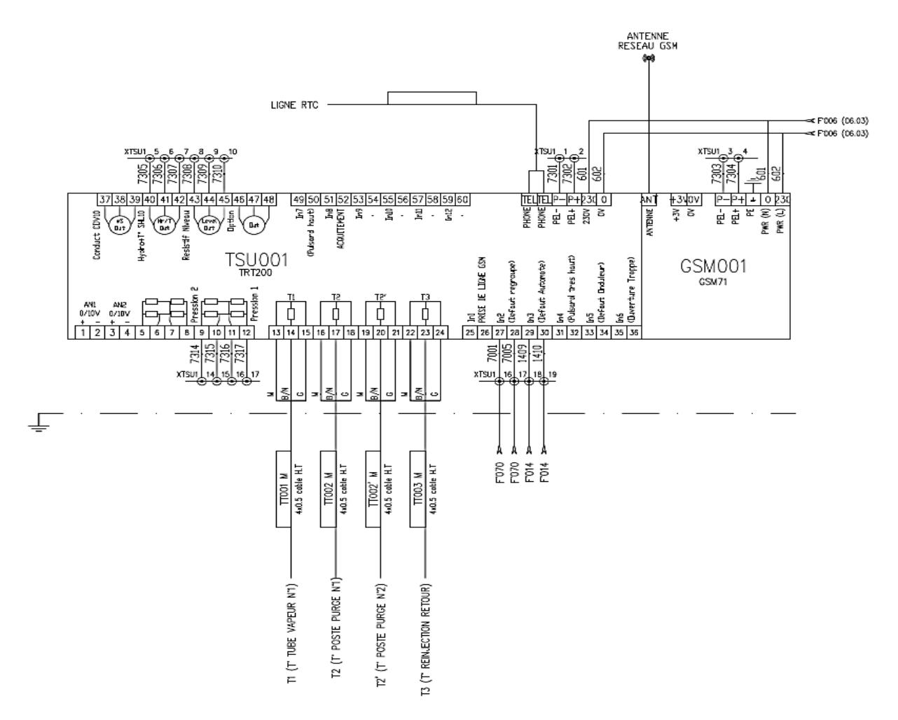

*Coffret Distribution Module TSU001 (TRT200) et GSM 001 (GSM71)*

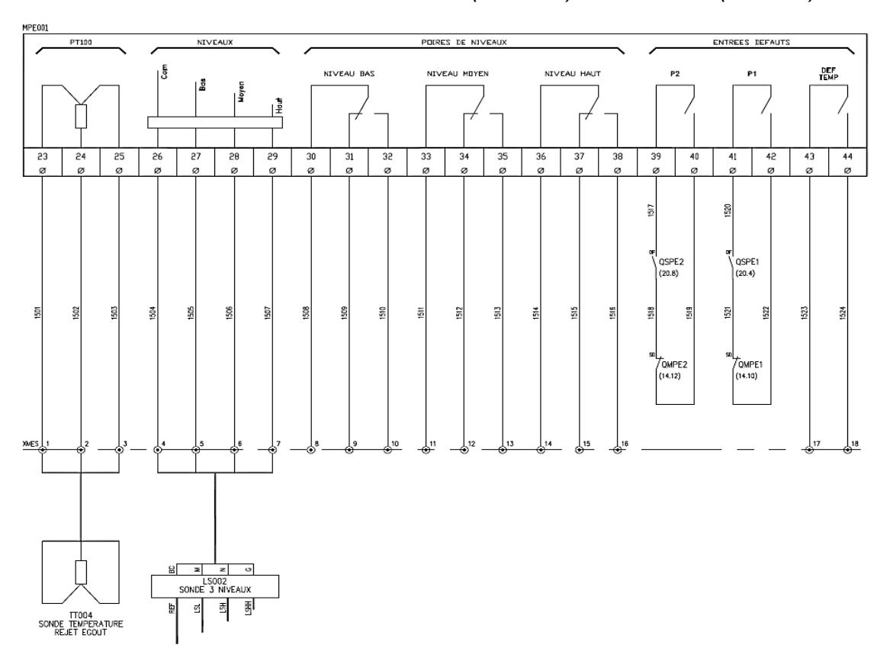

*Coffret Distribution Commande Pompes*

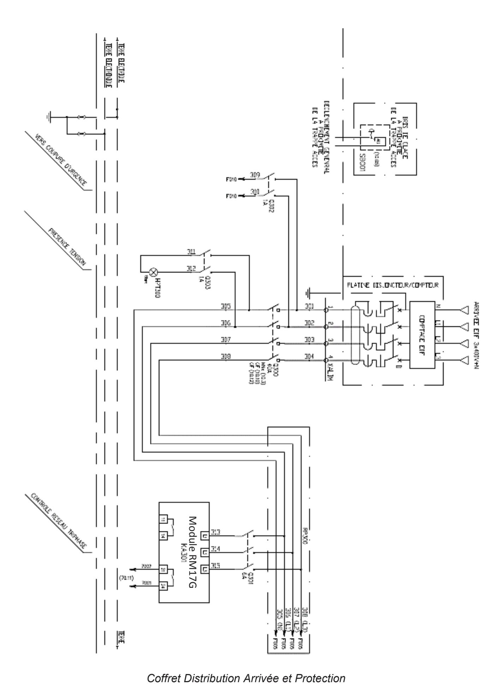

#### DOCUMENT TECHNIQUE DT B5

#### **Caractéristiques de la pompe utilisée pour le relevage des condensats**

| MODEL              | CODE     |
|--------------------|----------|
| FEKA FXC 20.07 MA  | 60191213 |
| FEKA FXC 20.07 MNA | 60191211 |
| FEKA FXC 20.07 TNA | 60191212 |
| FEKA FXC 20.11 MA  | 60191233 |
| FEKA FXC 20.11 MNA | 60191231 |
| FEKA FXC 20.11 TNA | 60191232 |
| FEKA FXC 20.15 MA  | 60191251 |
| FEKA FXC 20.15 MNA | 60191249 |
| FEKA FXC 20.15 TNA | 60191250 |
| FEKA FXC 20.22 TNA | 60191273 |

|  |  |  | Q=m3/h |  |  |  |  |  |
|--|--|--|--------|--|--|--|--|--|
|  |  |  |        |  |  |  |  |  |
|  |  |  |        |  |  |  |  |  |
|  |  |  |        |  |  |  |  |  |
|  |  |  |        |  |  |  |  |  |
|  |  |  |        |  |  |  |  |  |
|  |  |  |        |  |  |  |  |  |
|  |  |  |        |  |  |  |  |  |
|  |  |  |        |  |  |  |  |  |
|  |  |  |        |  |  |  |  |  |
|  |  |  |        |  |  |  |  |  |
|  |  |  |        |  |  |  |  |  |

#### DOCUMENT TECHNIQUE DT B6

#### **Démarreur-contrôleur LUB12**

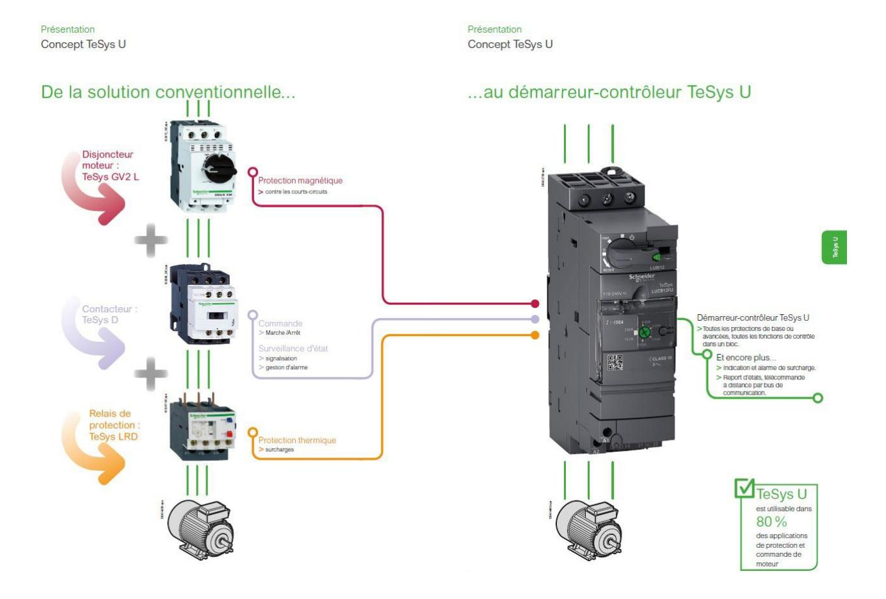

Les démarreurs en coffret TeSys U sont conçus pour commander des moteurs électriques principalement pour des systèmes de convoyage. L'arrêt du moteur est commandé par des capteurs de position de 2 manières différentes, en fonction du raccordement des capteurs :

- les capteurs sont raccordés directement sur le démarreur : arrêt réflexe ;
- les capteurs sont raccordés au démarreur via le bus AS-Interface : arrêt standard.

### **Fonction "Arrêt standard"**

L'arrêt du moteur est géré à distance depuis l'automate programmable en fonction de l'état des capteurs transmis sur le bus AS-Interface.

### **Fonction "Arrêt réflexe"**

L'arrêt du moteur est géré localement via les capteurs par action directe sur le démarreur. L'état des capteurs est aussi transmis à l'automate programmable par le bus AS-Interface.

#### DOCUMENT TECHNIQUE DT B7

#### **Module Luca 12BL**

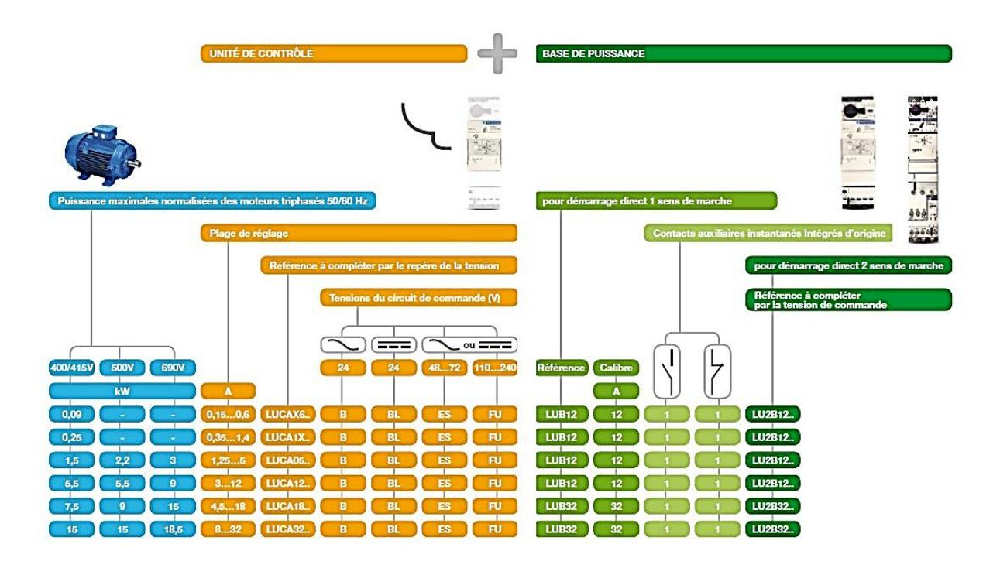

#### TeSys U Universal

Comprendre les références commerciale à partir d'une comparaison avec un départ moteur conventionnel

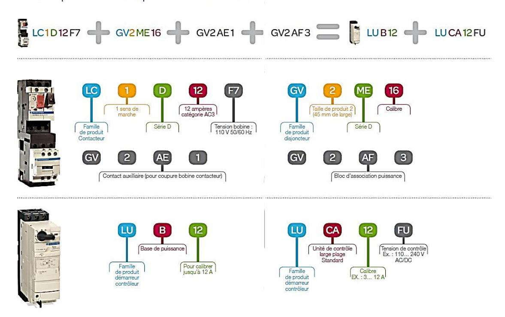

#### **DOCUMENT TECHNIQUE DT B8**

#### Relais de mesure RM17 TG

Présentation, description

# Relais de mesure et de contrôle modulaires Zelio Control

Relais de contrôle de réseaux triphasés RM17 TG

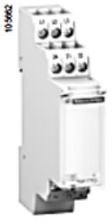

RM17 TG •0

#### Présentation

Les relais de mesure et de contrôle RM17 TG•0 surveillent, sur les réseaux triphasés, l'ordre des phases L1, L2 et L3 ainsi que l'absence d'une ou plusieurs phases.

Ces relais de contrôle acceptent différentes valeurs de tensions nominales triphasées :

- ~ 208...480 V pour RM17 TG00,
- ~ 208...440 V pour RM17 TG20.

Ils contrôlent leur propre alimentation, mesurée en valeur efficace vraie.

La visualisation de l'état de contrôle est indiquée par DEL.

La fixation du relais se fait par encliquetage sur profilé \_\_\_\_.

#### Domaines d'application

- Contrôle pour le raccordement d'équipements mobiles (matériel de chantier, matériel agricole, camions frigorifiques).
- Contrôle pour la protection des personnes et des matériels contre une inversion de sens de marche (levage-manutention, ascenseurs, escaliers roulants, etc...).
- Contrôle de réseaux sensibles.
- Protection contre le risque de charge entraînante (coupure de phase).
- Commutation de sources normal/secours.

| R - R1/R2 | <b>≅</b>                | RM17 TG00      | RM17 TG20 |
|-----------|-------------------------|----------------|-----------|
| ⊗ ×       | OFF                     | 12<br>14<br>11 | R1 R2     |
| *         | ON $0$ $U > \sim 183V$  | 12<br>14<br>14 | R1 R2     |
| 8         | ON 8 L2 8 L1 U < ~100 V | 5 4 R          | FR1 R2    |

#### DOCUMENT TECHNIQUE DT C1

#### **OneWire**

1-Wire (aussi connu sous le nom de bus Dallas ou OneWire) est un bus conçu par Dallas Semiconductor qui permet de connecter (en série, parallèle ou en étoile) des composants avec seulement deux fils (un fil de données et un fil de masse)

De nature similaire à I²C, il présente cependant des vitesses de transmission et un coût inférieur.

#### DOCUMENT TECHNIQUE DT C2

#### **Identifiant du composant DS18B20**

|     | 8-BIT CRC | 48-BIT SERIAL NUMBER |     | 8-BIT FAMILY CODE (28h) | )   |
|-----|-----------|----------------------|-----|-------------------------|-----|
| MSB | LSB       | MSB L                | LSB | MSB                     | LSB |

#### DOCUMENT TECHNIQUE DT C3

#### **Mémoire Scratchpad DS1820**

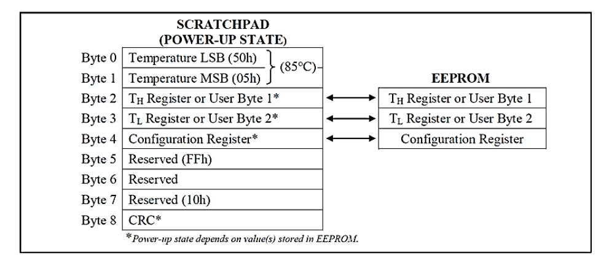

#### DOCUMENT TECHNIQUE DT C4

#### **Format Température**

| LS BYTE  | BIT 7       | BIT 6  | BIT 5  | BIT 4       | BIT 3  | BIT 2                    | BIT 1 | BIT 0 |
|----------|-------------|--------|--------|-------------|--------|--------------------------|-------|-------|
| MS BYTE  | BIT 15<br>S | BIT 14 | BIT 13 | BIT 12<br>S | BIT 11 | BIT 10<br>2 <sup>6</sup> | BIT 9 | BIT 8 |
| S = SIGN |             |        |        |             |        |                          |       |       |

| TEMPERATURE (°C) | DIGITAL OUTPUT<br>(BINARY) | DIGITAL OUTPUT<br>(HEX) |
|------------------|----------------------------|-------------------------|
| +125             | 0000 0111 1101 0000        | 07D0h                   |
| +85*             | 0000 0101 0101 0000        | 0550h                   |
| +25.0625         | 0000 0001 1001 0001        | 0191h                   |
| +10.125          | 0000 0000 1010 0010        | 00A2h                   |
| +0.5             | 0000 0000 0000 1000        | 0008h                   |
| 0                | 0000 0000 0000 0000        | 0000h                   |
| -0.5             | 1111 1111 1111 1000        | FFF8h                   |
| -10.125          | 1111 1111 0101 1110        | FF5Eh                   |

#### **Configuration du Byte 4 du DS18B20**

| BIT 7 | BIT 6 | BIT 5 | BIT 4 | BIT 3 | BIT 2 | BIT 1 | BIT 0 |
|-------|-------|-------|-------|-------|-------|-------|-------|
| 0     | R1    | R0    | 1     | 1     | 1     | 1     | 1     |

| R1 | R0 | RESOLUTION<br>(BITS) |         | VERSION<br>ME          |  |  |
|----|----|----------------------|---------|------------------------|--|--|
| 0  | 0  | 9                    | 93.75ms | (t <sub>conv</sub> /8) |  |  |
| 0  | 1  | 10                   | 187.5ms | (t <sub>conv</sub> /4) |  |  |
| 1  | 0  | 11                   | 375ms   | (t <sub>CONV</sub> /2) |  |  |
| 1  | 1  | 12                   | 750ms   | (t <sub>conv</sub> )   |  |  |

#### DOCUMENT TECHNIQUE DT C5

#### **Opérations en MicroPython**

| Opérateurs | Opérations                            |
|------------|---------------------------------------|
| &          | Opération<br>et<br>bit à bit          |
|            | Opération<br>bit à bit.<br>ou         |
| ^          | Opération<br>bit à bit<br>ou exclusif |
| ~          | Opération<br>non<br>bit à bit         |
| <<         | Décalage à gauche                     |
| >>         | Décalage à droite                     |

#### DOCUMENT TECHNIQUE DT D1

#### **Module Peltier monté sur radiateur**

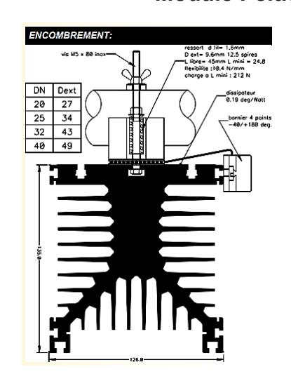

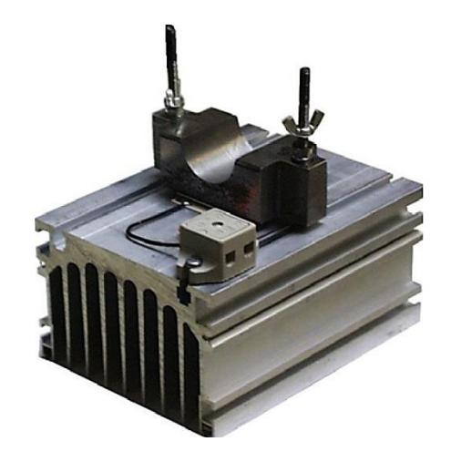

#### DOCUMENT TECHNIQUE DT D2

#### **Caractéristiques Module Peltier**

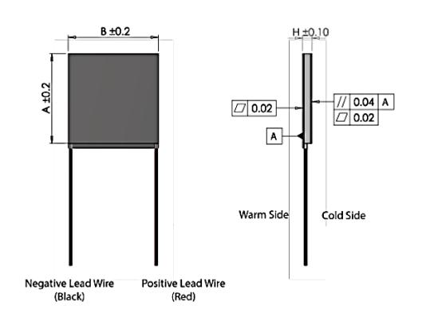

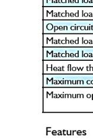

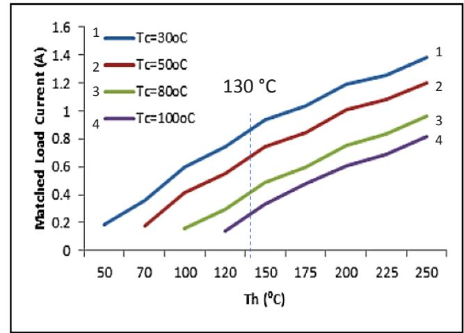

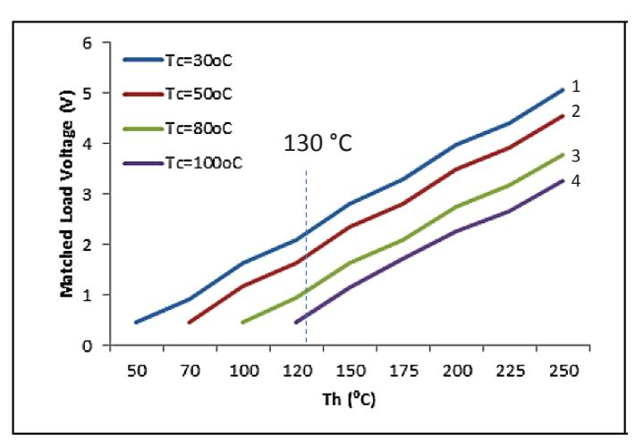

Tc est la température ambiante, Th est la température du conduit.

#### DOCUMENT TECHNIQUE DT D3

#### **Structure interne du CAN du PIC 18F8723**

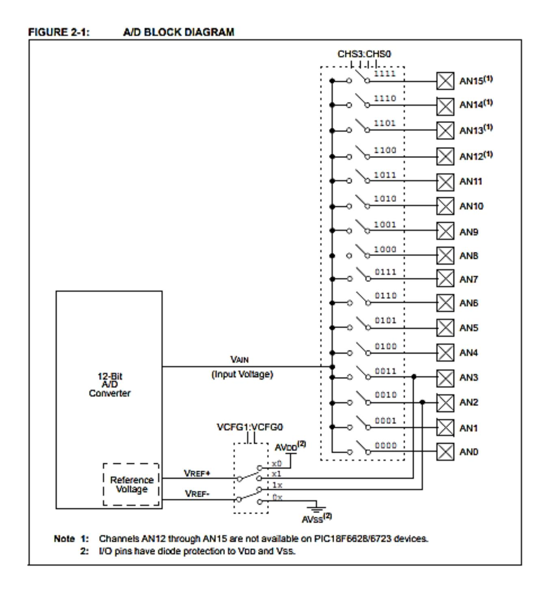

#### DOCUMENT TECHNIQUE DT D4

#### Registre ADCON0 du CAN du PIC 18F8723

# PIC18F8723 FAMILY

# 2.0 12-BIT ANALOG-TO-DIGITAL CONVERTER (A/D) MODULE

The Analog-to-Digital (A/D) Converter module has 12 inputs for the 64-pin devices (PIC18F6628/6723) and 16 for the 80-pin devices (PIC18F8628/8723). This module allows conversion of an analog input signal to a corresponding 12-bit digital number.

The module has five registers:

- · A/D Result High Register (ADRESH)
- · A/D Result Low Register (ADRESL)
- A/D Control Register 0 (ADCON0)
- A/D Control Register 1 (ADCON1)
- A/D Control Register 2 (ADCON2)

The ADCOND register, shown in Register 2-1, controls the operation of the A/D module. The ADCON1 register, shown in Register 2-2, configures the functions of the port pins. The ADCON2 register, shown in Register 2-3, configures the A/D clock source, programmed acquisition time and justification.

#### REGISTER 2-1: ADCON0: A/D CONTROL REGISTER 0

| U-0   | U-0 | R/W-0 | R/W-0 | R/W-0 | R/W-0 | R/W-0   | R/W-0 |
|-------|-----|-------|-------|-------|-------|---------|-------|
| _     | _   | CHS3  | CHS2  | CHS1  | CHS0  | GO/DONE | ADON  |
| bit 7 |     |       |       |       |       |         | bit 0 |

| Legend:           |                  |                        |                    |
|-------------------|------------------|------------------------|--------------------|
| R = Readable bit  | W = Writable bit | U - Unimplemented bit, | read as '0'        |
| -n = Value at POR | '1' = Bit is set | '0' = Bit is cleared   | x = Bit is unknown |

#### Nit 7-6 Unimplemented: Read as "0" CHS3:CHS0: Analog Channel Select bits bit 5-2 0000 = Channel 0 (AN0) 0001 = Channel 1 (AN1) 0010 = Channel 2 (AN2) 0011 = Channel 3 (AN3) 0100 = Channel 4 (AN4) 0101 = Channel 5 (AN5) 0110 = Channel 6 (AN6) 0111 = Channel 7 (AN7) 1000 = Channel 8 (AN8) 1001 = Channel 9 (AN9) 1010 = Channel 10 (AN10) 1011 = Channel 11 (AN11) 1100 = Channel 12 (AN12)(1,2) 1101 = Channel 13 (AN13)(1,2) 1110 = Channel 14 (AN14)(1,2) 1111 = Channel 15 (AN15)(1,2) bit 1 GO/DONE: A/D Conversion Status bit When ADON = 1; 1 = A/D conversion in progress 0 = A/D Idle bit 0 ADON: A/D On bit

Note 1: These channels are not implemented on PIC18F6628/6723 devices.

1 = A/D Converter module is enabled 0 = A/D Converter module is disabled

2: Performing a conversion on unimplemented channels will return a floating input measurement.

#### DOCUMENT TECHNIQUE DT E1

#### **Protocole LORAWAN**

LoRaWAN est un protocole de télécommunication qui permet la communication à bas débit, par radio, d'objets à faible consommation électrique communiquant selon la technologie LoRa et connectés à l'Internet via des passerelles, participant ainsi à l'Internet des objets.

Ce protocole est un protocole de communication pour l'internet des objets (IOT) qui utilise une technique de modulation par étalement de spectre de type Chirp spread spectrum (en) propriétaire appelée LoRa. Les caractéristiques de ce protocole sont simplicité, peu cher et très peu énergivore.

#### DOCUMENT TECHNIQUE DT E2

#### **Modulation LoRa**

LoraWAN utilise une modulation à étalement de spectre de type Chirp spread spectrum (en) propriétaire appelée LoRa. Cette modulation s'effectue principalement sur les bandes radios ISM 868 MHz en Europe et 915 MHz en Amérique du Nord. Cette modulation permet en moyenne une distance entre une passerelle et un équipement jusqu'à 5 km en zone urbaine et 15 km en zone rurale.

Les bandes passantes possibles à configurer pour un canal sont 125, 250 et 500 kHz pour la bande 868 MHz, ce qui permet d'atteindre un débit maximum de 22 kbit/s avec une bande passante de 500 kHz et un Spreading Factor de 7.

| Data Rate<br>(DR) | Modulation                      | Spreading<br>Factor (SF) | Bande<br>Passante | Débit Physique<br>(bit/s) |
|-------------------|---------------------------------|--------------------------|-------------------|---------------------------|
| 0                 | LoRa                            | SF12                     | 125 kHz           | 250                       |
| 1                 | LoRa                            | SF11                     | 125 kHz           | 440                       |
| 2                 | LoRa                            | SF10                     | 125 kHz           | 980                       |
| 3                 | LoRa                            | SF9                      | 125 kHz           | 1 760                     |
| 4                 | LoRa                            | SF8                      | 125 kHz           | 3 125                     |
| 5                 | LoRa                            | SF7                      | 125 kHz           | 5 470                     |
| 6                 | LoRa                            | SF7                      | 250 kHz           | 11 000                    |
| 7                 | FSK                             | 50kbit/s                 |                   | 50 000                    |
| 8                 | Réservé pour utilisation future |                          |                   |                           |

Il est possible de définir **le débit utile Rb (en bits/s)** par la formule mathématique suivante :

$$R_b = \frac{SF * BW * CR}{2^{SF}}$$

BW: Bande passante

SF: Facteur d'étalement

CR: Taux de codage, Pour ce qui concerne la modulation LoRa, il est possible de sélectionner 4 valeurs de CR distinctes : 4/5, 4/6, 4/7 et 4/8.

#### Caractérisation du signal modulé su(t) :

On propose ci-dessous la représentation de la fréquence fu du signal modulé su(t) en fonction du temps, correspondant à la transmission d'un symbole de valeur quelconque n :

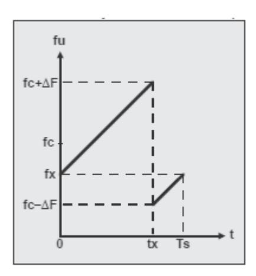

On note:

- fu(t) (u pour Upchirp), la fonction représentative de l'évolution de la fréquence de l'Upchirp su(t) au cours du temps ;
- $\Delta F$ , l'excursion de fréquence de l'Upchirp (dont la fréquence varie entre fc- $\Delta F$  et fc+ $\Delta F$ , ce qui correspond à une variation de fréquence de  $2\Delta F$ );
- fx, la fréquence à laquelle commence l'Upchirp (instant t=0) ;
- Ts, la durée de transmission d'un symbole ;
- tx, l'instant où le chirp présente une discontinuité de fréquence.

On précise que dans ce qui suit, les symboles n à transmettre sont codés sur 12 bits (de 0 à 4 095 ).

On démontre aisément que pour toute valeur de n comprise entre 0 et 4 095 :

$$fx = fc - \frac{2048 - n}{2048} \cdot \Delta F$$

$$tx = \frac{4096 - n}{4096}$$
. Ts

fc+ΔF

Largeur de bande BW ou encombrement spectral du signal modulé su(t)

La variation de fréquence d'un chirp (fmax-fmin), que nous avons notée 2ΔF, se note en anglais BW pour BandWidth, soit *largeur de bande* en français.

La norme prévoit 3 valeurs de BW possibles : 125 kHz, 250 kHz et 500 kHz. En Europe, seules les largeurs de bande 125 kHz et 250 kHz sont utilisées.

#### Facteur d'étalement SF ou nombre de bits par symbole

Le constructeur définit une grandeur notée SF pour Spreading Factor (*facteur d'étalement*  en français), telle que Ts = 2SF/BW, où Ts désigne la durée de transmission d'un symbole.

#### DOCUMENT TECHNIQUE DT E3

#### **Protocole MQTT**

MQTT permet aux appareils d'envoyer des informations sur un sujet donné à un serveur qui fonctionne comme un broker de messages. Le broker pousse ces informations vers les clients qui se sont précédemment abonnés. Pour l'utilisateur, un sujet ressemble à un chemin hiérarchique (TOPIC). Les clients peuvent s'abonner à un niveau spécifique de la hiérarchie d'un sujet ou à plusieurs niveaux s'ils utilisent un caractère générique.

#### **TOPIC :**

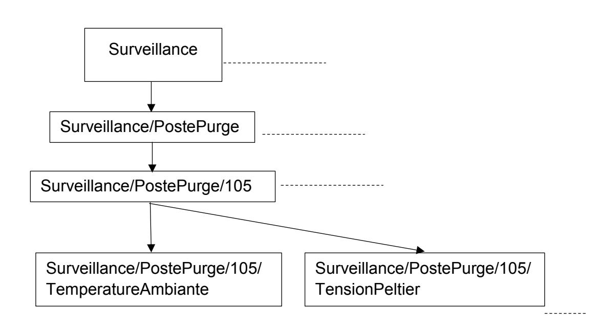

Ex : Surveillance de la tension du module Peltier du Poste de purge 105 :

Le topic sera le suivant : Surveillance/postePurge/105/TensionPeltier

|           |                                                                                                                                                                                                                                                                                                                                                                                                                                                                                                                                                                                                |          |             |           |          |        |         |          |         |        |         |         |     |      |      |     |      | <br>              |  |  |
|-----------|------------------------------------------------------------------------------------------------------------------------------------------------------------------------------------------------------------------------------------------------------------------------------------------------------------------------------------------------------------------------------------------------------------------------------------------------------------------------------------------------------------------------------------------------------------------------------------------------|----------|-------------|-----------|----------|--------|---------|----------|---------|--------|---------|---------|-----|------|------|-----|------|-------------------|--|--|
|           | OOC v2 ©NEOPTEC                                                                                                                                                                                                                                                                                                                                                                                                                                                                                                                                                                                | П        |             | 1         |          |        |         |          |         |        |         | Τ       | Ī   | ī    |      |     | П    | $\overline{\Box}$ |  |  |
|           | a lieu, du nom d'usage)                                                                                                                                                                                                                                                                                                                                                                                                                                                                                                                                                                        |          |             |           |          |        |         |          |         |        |         |         |     |      |      |     |      |                   |  |  |
|           | Prénom(s) :                                                                                                                                                                                                                                                                                                                                                                                                                                                                                                                                                                                    |          |             |           |          |        |         |          |         |        |         |         |     |      |      |     |      |                   |  |  |
|           | Numéro<br>Inscription :                                                                                                                                                                                                                                                                                                                                                                                                                                                                                                                                                                        |          |             |           |          |        |         |          |         |        | Né(     | e) le   | : [ |      | /    |     | ]/   |                   |  |  |
|           | (Le                                                                                                                                                                                                                                                                                                                                                                                                                                                                                                                                                                                            | e numéro | est celui q | ui figure | sur la c | onvoca | tion ou | la feuil | le d'ém | argeme | ent)    |         |     |      |      |     |      |                   |  |  |
|           | à l'aide de la notice)  L'Examen:                                                                                                                                                                                                                                                                                                                                                                                                                                                                                                                                                              |          |             |           |          |        | s       | ectic    | n/Sp    | oécia  | lité/Sé | rie : . |     |      |      |     | <br> | <br>              |  |  |
|           | Epreuve:                                                                                                                                                                                                                                                                                                                                                                                                                                                                                                                                                                                       |          |             |           |          |        | N       | /latiè   | re:     |        |         |         |     | . Se | ssio | າ : | <br> | <br>              |  |  |
| CONSIGNES | <ul> <li>Remplir soigneusement, sur CHAQUE feuille officielle, la zone d'identification en MAJUSCULES.</li> <li>Ne pas signer la composition et ne pas y apporter de signe distinctif pouvant indiquer sa provenance.</li> <li>Numéroter chaque PAGE (cadre en bas à droite de la page) et placer les feuilles dans le bon sens et dans l'ordre.</li> <li>Rédiger avec un stylo à encre foncée (bleue ou noire) et ne pas utiliser de stylo plume à encre claire.</li> <li>N'effectuer avecun collage ou découpage de suites ou de feuille officielle. Ne injudge avecup brouillon.</li> </ul> |          |             |           |          |        |         |          |         |        |         |         |     |      |      |     |      |                   |  |  |

EDE ENE 1

# DR1 à DR6

Tous les documents réponses sont à rendre, même non complétés.

#### **NE RIEN ECRIRE DANS CE CADRE**

# DOCUMENT RÉPONSE DR1

#### **Schéma de principe de la cogénération** (réponse à la question 3)

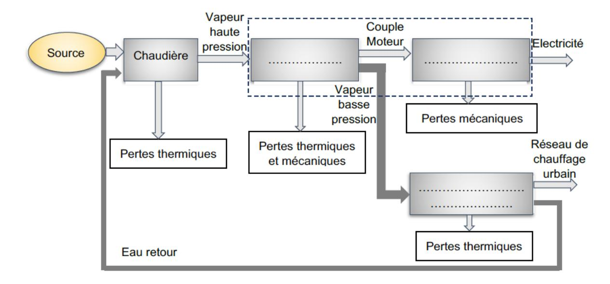

### DOCUMENT RÉPONSE DR2

#### **Quantité d'énergie primaire** (réponse à la question 5)

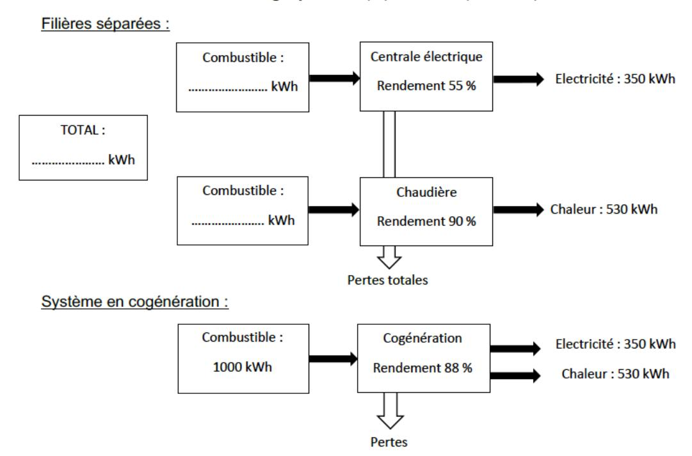

# DOCUMENT RÉPONSE DR3

#### **Algorigramme de surveillance de la température des postes de purge**

(réponse à la question 9)

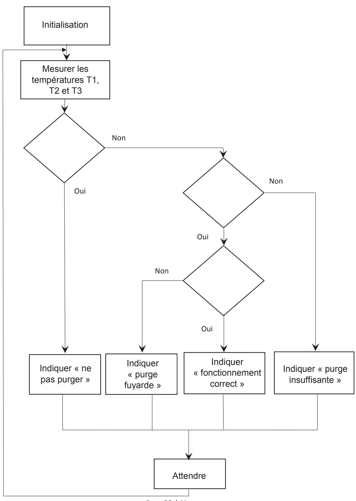

Page 38 / 41

**Tournez la page S.V.P.**

# DOCUMENT RÉPONSE DR4

#### **Schéma de l'alimentation du groupe de pompage** (réponse à la question 14)

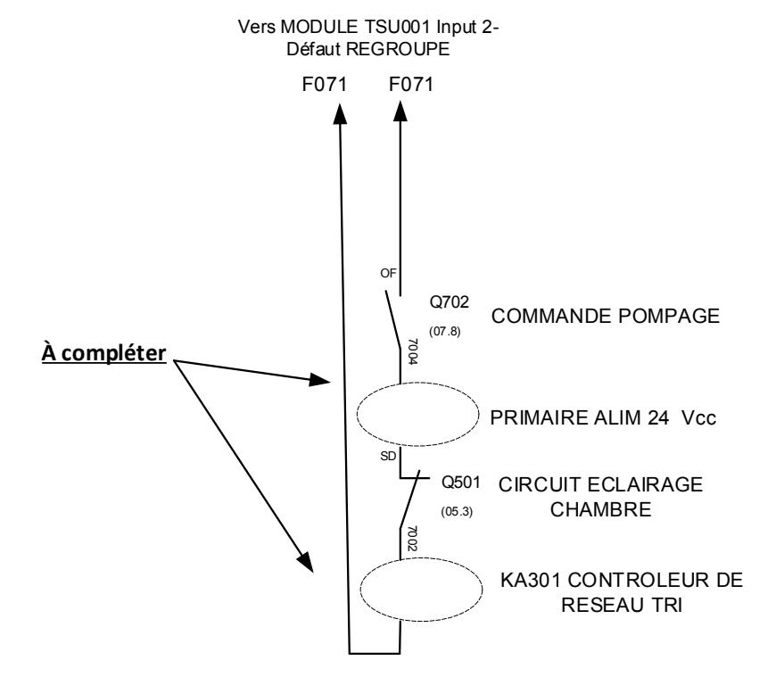

# DOCUMENT RÉPONSE DR5

**Requête SQL** (réponse à la question 18)

SELECT PostePurge.NomPostePurge, CapteurTemperatureDS1820.NomCapteur, CapteurTemperatureDS1820.Date\_mesures, CapteurTemperatureDS1820.Localisation, CapteurTemperatureDS1820.ValeurTempérature FROM CapteurTemperatureDS1820 INNER JOIN PostePurge ON CapteurTemperatureDS1820.Identifiant = PostePurge.Id\_capteurs WHERE (((PostePurge.NomPostePurge)="") **.** ((CapteurTemperatureDS1820.Date\_mesures)=));

#### DOCUMENT RÉPONSE DR6

**Comparaison des moyens de production d'électricité autonomes** (réponse à la question 19).

|               | Module Peltier | Turbine-Alternateur | Panneaux<br>photovoltaïques |
|---------------|----------------|---------------------|-----------------------------|
| Avantages     |                |                     |                             |
| Inconvénients |                |                     |                             |

| Noi                                                                                                                                                                                                                                                                                                                                                                                                                                                                                                                                                                                            | OOC v2 ©NEOPTEC  m de famille : a lieu, du nom d'usage) |          |              |             |           |         |          |           |        |        |           |      |        |       |     |      |      |  |  |
|------------------------------------------------------------------------------------------------------------------------------------------------------------------------------------------------------------------------------------------------------------------------------------------------------------------------------------------------------------------------------------------------------------------------------------------------------------------------------------------------------------------------------------------------------------------------------------------------|---------------------------------------------------------|----------|--------------|-------------|-----------|---------|----------|-----------|--------|--------|-----------|------|--------|-------|-----|------|------|--|--|
|                                                                                                                                                                                                                                                                                                                                                                                                                                                                                                                                                                                                | Prénom(s) :                                             |          |              |             |           |         |          |           |        |        |           |      |        |       |     |      |      |  |  |
|                                                                                                                                                                                                                                                                                                                                                                                                                                                                                                                                                                                                | Numéro<br>Inscription :                                 |          |              |             |           |         |          |           |        |        | Né(e)     | le : |        | /     |     | /    |      |  |  |
|                                                                                                                                                                                                                                                                                                                                                                                                                                                                                                                                                                                                | (Li                                                     | e numéro | est celui qu | ii figure : | sur la co | onvocat | ion ou l | la feuill | e d'ém | argeme | nt)       |      |        |       |     |      |      |  |  |
|                                                                                                                                                                                                                                                                                                                                                                                                                                                                                                                                                                                                | à l'aide de la notice)  L'Examen:                       |          |              |             |           |         | Se       | ectio     | n/Sp   | écia   | lité/Séri | e:   | <br>   |       |     | <br> | <br> |  |  |
|                                                                                                                                                                                                                                                                                                                                                                                                                                                                                                                                                                                                | Epreuve:                                                |          |              |             |           |         | N        | latiè     | re : . |        |           |      | <br>Se | ssior | ı : | <br> | <br> |  |  |
| <ul> <li>Remplir soigneusement, sur CHAQUE feuille officielle, la zone d'identification en MAJUSCULES.</li> <li>Ne pas signer la composition et ne pas y apporter de signe distinctif pouvant indiquer sa provenance.</li> <li>Numéroter chaque PAGE (cadre en bas à droite de la page) et placer les feuilles dans le bon sens et dans l'ordre.</li> <li>Rédiger avec un stylo à encre foncée (bleue ou noire) et ne pas utiliser de stylo plume à encre claire.</li> <li>N'affectuer avecun collage ou découpage de sujets ou de feuille officielle. Ne injudge avecun brouillon.</li> </ul> |                                                         |          |              |             |           |         |          |           |        |        |           |      |        |       |     |      |      |  |  |

EDE ENE 1

# DR7 à DR9

Tous les documents réponses sont à rendre, même non complétés.


# DOCUMENT RÉPONSE DR7

#### **Diagramme de blocs Internes** (réponse à la question 22)

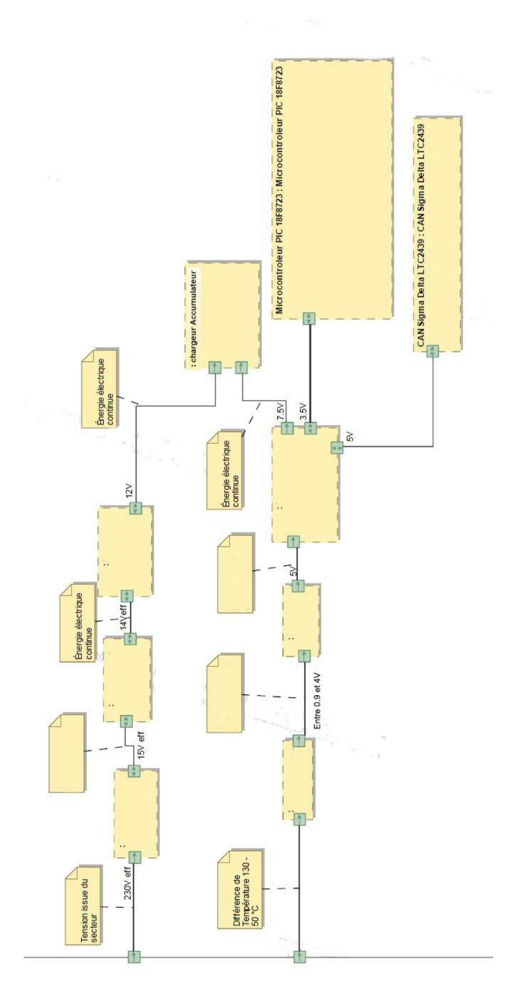

Vocabulaire à utiliser :

Redresser, Module Peltier, Hacheur, Régulateur, Filtrage, Transformer, Convertir, Énergie électrique Alternative, Énergie électrique Continue.

# DOCUMENT RÉPONSE DR8

#### **Registre ADCON0** (réponse à la question 25)

| U –<br>0 | U –<br>0 | R/W-0 | R/W-0 | R/W-0 | R/W-0 | R/W-0   | R/W-0 |
|----------|----------|-------|-------|-------|-------|---------|-------|
| -        | -        | CHS3  | CHS2  | CHS1  | CHS0  | GO-DONE | ADON  |
| 0        | 0        |       |       |       |       |         |       |
| Bit7     | Bit6     | Bit5  | Bit4  | Bit3  | Bit2  | Bit1    | Bit 0 |

# DOCUMENT RÉPONSE DR9

#### **Adresse IP et port du server** (réponse à la question 31)

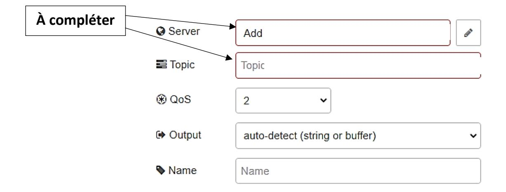