**EDE STI 2** 


## **SESSION 2022**

\_\_\_\_

# CAPET CONCOURS EXTERNE ET CAFEP CORRESPONDANT

**Section : SCIENCES INDUSTRIELLES DE L'INGÉNIEUR Option : INGÉNIERIE DES CONSTRUCTIONS**

**Option : INGÉNIERIE ÉLECTRIQUE Option : INGÉNIERIE INFORMATIQUE Option : INGÉNIERIE MÉCANIQUE**

#### **EPREUVE ECRITE DISCIPLINAIRE APPLIQUEE**

Durée : 5 heures

\_\_\_\_

*Calculatrice autorisée selon les modalités de la circulaire du 17 juin 2021 publiée au BOEN du 29 juillet 2021.* 

*L'usage de tout ouvrage de référence, de tout dictionnaire et de tout autre matériel électronique est rigoureusement interdit.*

*Si vous repérez ce qui vous semble être une erreur d'énoncé, vous devez le signaler très lisiblement sur votre copie, en proposer la correction et poursuivre l'épreuve en conséquence. De même, si cela vous conduit à formuler une ou plusieurs hypothèses, vous devez la (ou les) mentionner explicitement.*

**NB : Conformément au principe d'anonymat, votre copie ne doit comporter aucun signe distinctif, tel que nom, signature, origine, etc. Si le travail qui vous est demandé consiste notamment en la rédaction d'un projet ou d'une note, vous devrez impérativement vous abstenir de la signer ou de l'identifier.**

#### **INFORMATION AUX CANDIDATS**

**Vous trouverez ci-après les codes nécessaires vous permettant de compléter les rubriques figurant en en-tête de votre copie. Ces codes doivent être reportés sur chacune des copies que vous remettrez.**

**Concours externe du CAPET de l'enseignement public :** 

**• option** : **Ingénierie des constructions**  Concours Section/option Epreuve Matière EDE 1411E 102 9312 **• option** : **Ingénierie électrique** Concours Section/option Epreuve Matière EDE 1412E 102 9312 **• option** : **Ingénierie informatique** Concours Section/option Epreuve Matière EDE 1413E 102 9312 **• option : Ingénierie mécanique** Concours Section/option Epreuve Matière EDE 1414E 102 9312 ► Concours externe du CAFEP/CAPET de l'enseignement privé : **• option** : **Ingénierie des constructions** Concours Section/option Epreuve Matière EDF 1411E 102 9312 **• option** : **Ingénierie électrique** Concours Section/option Epreuve Matière EDF 1412E 102 9312 **• option** : **Ingénierie informatique** Concours Section/option Epreuve Matière EDF 1413E 102 9312 **• option : Ingénierie mécanique** Concours Section/option Epreuve Matière EDF 1414E 102 9312

# **ÉTUDE ET EXPLOITATION PÉDAGOGIQUE D'UN BANC D'ESSAIS AUTOMOBILE**

## **PARTIE 1. MISE EN SITUATION**

#### **1.1. Contexte général : professeur(e) en STI2D dans un lycée**

Ce sujet met en situation un professeur, ou une professeure, de sciences industrielles de I'ingénieur (SII) dans un lycée général et technologique. Une partie de son service est donné dans une classe de première STI2D de 32 élèves en spécialités ingénierie et développement durable (I2D) et innovation technologique (IT) (annexe A1) :

- la répartition horaire hebdomadaire d'I2D pour les élèves est de trois fois une heure en classe entière avec le professeur, ou la professeure, et deux fois trois heures en co-intervention avec un autre enseignant. En IT, les séances se déroulent toutes en co-intervention (deux enseignants) ;
- le laboratoire se compose de trois zones : une zone projets (avec FabLab), une zone d'étude des systèmes pluri-technologiques et une zone d'expérimentation, toutes agencées en îlots informatisés et pouvant accueillir chacune 36 élèves simultanément.

Pour traiter les parties pédagogiques du sujet, les documents suivants sont disponibles :

- des extraits du programme des enseignements technologiques en STI2D (bulletin officiel spécial n°1 du 22 janvier 2019) fournis en annexe A2 ;
- une progression pédagogique en spécialité I2D, commune à toute l'équipe SII de l'établissement, donnée en annexe A3.

L'établissement est doté d'un banc à rouleaux Autoscan Fi de la société Rotronics pour les besoins pédagogiques du BTS motorisation toutes énergies (figures 1 et 2). Ce système va être étudié à un haut niveau pour en dégager des exploitations pédagogiques à destination des élèves de première STI2D.

Pour développer cette démarche globale, le sujet propose :

- de limiter la transmission des sons à travers les parois du lycée ;
- d'analyser et de vérifier le bon fonctionnement du système ;
- d'étudier un cycle d'essai standardisé ;
- de vérifier que le système garantit la sécurité des utilisateurs en fonctionnement normal ;
- d'étudier les possibilités d'exploitation pédagogique du système dans le cadre de la spécialité I2D.

#### **1.2. Le véhicule particulier aujourd'hui**

Le véhicule particulier présente aujourd'hui un enjeu environnemental majeur. En 1975, la France en comptait 16,7 millions pour 52,7 millions d'habitants ; en 2019, ce chiffre s'élevait à 37,7 millions pour 65 millions d'habitants. Les transports représentent environ 30 % des émissions de gaz à effet de serre en France dont plus de la moitié est produite par les voitures particulières.

L'Europe impose des règles : l'émission moyenne de CO2 des véhicules particuliers neufs doit être inférieure à 95 g·km-1 depuis 2020, avec de lourdes amendes pour les constructeurs ne respectant pas ce seuil.

Cet objectif est un grand défi pour les constructeurs automobiles et les émissions autorisées à partir de 2025 vont les pousser à innover davantage.

Les véhicules particuliers doivent ainsi rejeter toujours moins de gaz à effet de serre tout en maintenant le service rendu à un niveau de performance acceptable. La puissance est un indicateur fort de ces performances, permettant aux utilisateurs de cibler un modèle en fonction de leurs besoins.

#### **1.3. Innovations et performances**

Un grand nombre d'innovations dans le domaine de l'automobile a été développé grâce à la compétition. La puissance a longtemps été la cible principale des constructeurs avec, par exemple, les moteurs à turbocompresseur. La sécurité a également progressé sur les véhicules particuliers autour des années 90 avec l'ABS, l'antipatinage, la suspension active, etc.

Aujourd'hui, le développement durable intègre les règlements de courses automobiles : nombre de pneus ou de moteurs limités sur une saison, contraintes de consommations (courses avec véhicules hybridation ou 100 % électriques). Le système de récupération d'énergie cinétique issu d'un développement en formule 1 a notamment inspiré les concepteurs de la première génération de véhicules hybrides grand public.

Pour valider ces innovations, il est nécessaire de mesurer les performances d'un véhicule telles que sa puissance ou ses émissions de CO2 sur un cycle standardisé.

#### **1.4. Banc d'essais à rouleaux automobile**

La société Rotronics développe et commercialise des bancs d'essai à rouleaux : AutoScan Fi (figures 1 et 2). Les concepteurs ont cherché à fournir à leurs clients un produit pouvant reproduire en atelier des conditions équivalentes à un contexte normal. L'intérêt est la reproductibilité du cycle. L'utilisateur va pouvoir modifier, comme il le souhaite, des paramètres ou des éléments de son véhicule et tester rapidement le gain de puissance ou l'évolution des émissions qu'il obtient.

Le banc est équipé de quatre rouleaux sur lesquels reposent les quatre roues du véhicule testé. Ces rouleaux sont raccordés deux à deux par un axe, à l'avant et à l'arrière. Ces axes qui tournent à la même vitesse sont mis en rotation par une courroie à tension réglable afin d'adapter l'écartement entre les rouleaux avant et arrière à la taille du véhicule étudié. Une machine électrique entraîne la courroie (figure 1).

Afin de simuler des phases de roue libre, de montée ou de descente équivalentes aux conditions réelles, le banc est équipé d'un frein à courant de Foucault (figure 7). En freinant le système, il produit un couple résistant aux roues. Il permet aussi de faire fonctionner la récupération d'énergie cinétique sous forme électrique des véhicules hybrides ou 100 % électrique.

En termes de sécurité, l'arrêt immédiat et total des mouvements se fait grâce à un frein à disque pneumatique à serrage par ressort à manque de courant (figures 21 et 22). Le véhicule est retenu en permanence par quatre sangles, à l'avant et à l'arrière (figure 20). Les parties tournantes (roues et rouleaux) sont protégées par un carter pendant les essais.

La figure 1 propose des photos prises lors d'un essai sur une automobile. Un schéma de principe permet de visualiser le système d'entrainement et de réglage des rouleaux situé sous les tôles bleues au sol et non visible en configuration normale.

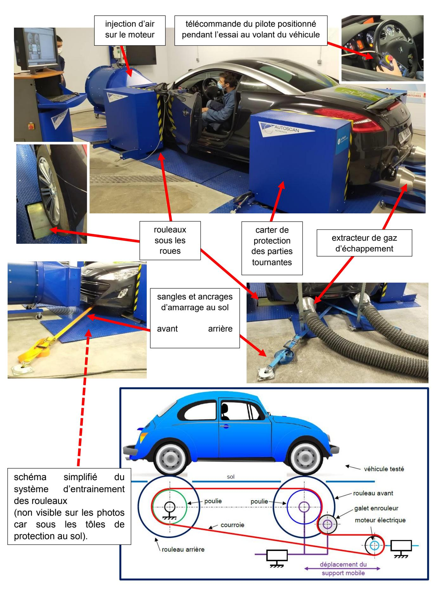

*Figure 1 : vues d'un véhicule en test et schéma de principe de l'AutoScan Fi* 

#### **1.5. Performances attendues**

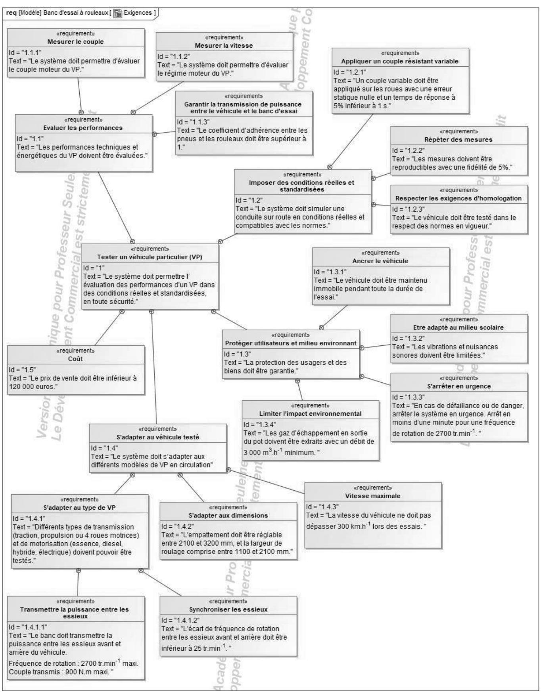

*Figure 2 : diagramme partiel des exigences du banc Autoscan Fi (SysML)* 

#### **1.6. Exploitation pédagogique du diagramme des exigences**

Objectifs : permettre aux élèves de comprendre le fonctionnement du système à partir du diagramme des exigences.

- **Question 1.** Relever, dans l'annexe A2, les objectifs de formation, les compétences et la connaissance du programme, rattachés à l'étude des diagrammes SysML en général.
- **Question 2.** Relever la spécialité de première STI2D dans laquelle ces compétences peuvent être abordées. Donner le niveau taxonomique attaché.
- **Question 3.** Citer les quatre exigences en termes de « protection des utilisateurs et du milieu » données par la figure 2. Élaborer un questionnement de trois à quatre questions permettant aux élèves d'appréhender ces exigences.

#### **PARTIE 2. ISOLATION ACOUSTIQUE DES PAROIS**

Objectif : éviter que les locaux d'enseignement périphériques ne soient trop perturbés par les bruits aériens causés par le banc d'études et choisir une solution adaptée.

Le banc d'essais est installé dans un ancien garage du lycée réaménagé. Il est séparé d'une salle de classe par une cloison en carreaux de plâtre de 100 mm d'épaisseur. Lorsque le banc fonctionne à plein régime, une mesure par décibel-mètre a montré que l'intensité du son produit est de 92 dB dans le local et de l'ordre de 60 dB dans la salle de classe.

| Intensité en dB | Impression                  | Conversation audible | Exemple                  |
|-----------------|-----------------------------|----------------------|--------------------------|
| 140             | Destruction de l'oreille    | Impossible           | Usines très bruyantes    |
| 120             | Supportable un bref instant | Impossible           | Usines bruyantes         |
| 95              | Très pénible                | En criant            | Usines bruyantes         |
| 75              | Supportable                 | Difficile            | Télévision               |
| 55              | Bruit courant               | Normale              | Appartement en ville     |
| 35              | Calme                       | Chuchotée            | Salle de classe          |
| 15              | Très calme                  | Chuchotée            | Studio                   |
| 0               | Silence anormal             | Chuchotée            | Laboratoire d'acoustique |

*Figure 3 : échelle des sensations sonores au niveau de l'oreille humaine*

**Question 4.** Estimer si la mesure du son perçu dans la salle de classe est admissible. Justifier la réponse en précisant les conséquences pour le cours qui s'y déroule.

Le bruit rose simule les bruits émis dans les bâtiments et par le trafic aérien. Le bruit routier simule les bruits émis par le trafic routier. Il est plus riche en sons graves que le bruit rose. Ces deux bruits servent de référence pour l'isolation acoustique des bâtiments.

**Question 5.** Préciser si les bruits émis par le véhicule sur le banc d'essais sont à classer en bruit rose ou en bruit routier.

Loi masse-fréquence : l'affaiblissement des bruits aériens à travers les solides dépend de deux paramètres :

- la fréquence sonore : plus un son est grave et moins il est affaibli à travers une paroi ;
- la masse surfacique de la paroi : plus elle est élevée et plus les sons sont affaiblis à travers la paroi.

La corrélation entre ces deux paramètres est donnée par la loi dite de "masse-fréquence" figure 4 où R en dB correspond à l'intensité du son affaibli à travers la paroi.

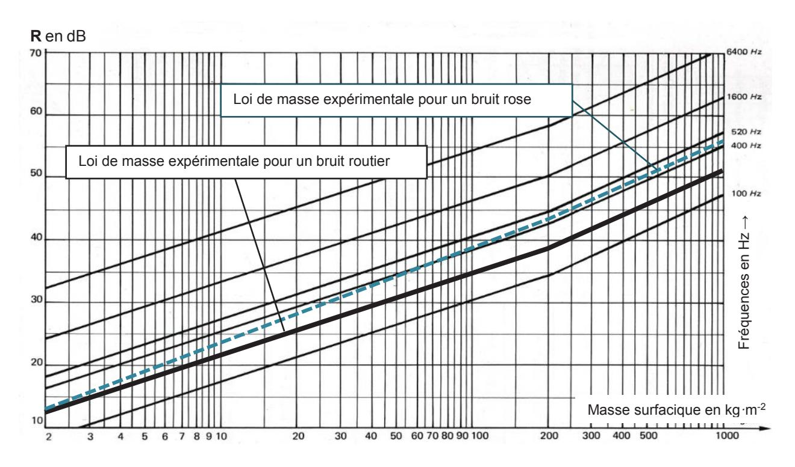

*Figure 4 : loi masse-fréquence* 

Les carreaux de plâtre ont une masse volumique de 1 008 kg*·*m-3.

**Question 6.** Donner, à partir de la figure 4, l'intensité R en dB du son affaibli à travers la paroi en carreaux de plâtre de 100 mm d'épaisseur. En déduire l'intensité du son en dB qui traverse la paroi. Comparer cette valeur à celle mesurée dans la salle de classe.

Afin de mieux isoler acoustiquement la salle de classe, le bruit dû aux essais doit avoir une intensité perceptible inférieure à 35 dB. Pour ce faire, il a été décidé de doubler la paroi côté laboratoire par un complexe d'isolation avec effet ressort. La société « Placo Saint Gobain », entre autres, propose notamment trois solutions de doublage en fonction du matériau utilisé pour la cloison et de l'affaiblissement recherché. Ce doublage se pose contre le mur existant. Les performances acoustiques annoncées correspondent à l'affaiblissement supplémentaire du son à travers la paroi. Elles sont résumées sur la figure 5.

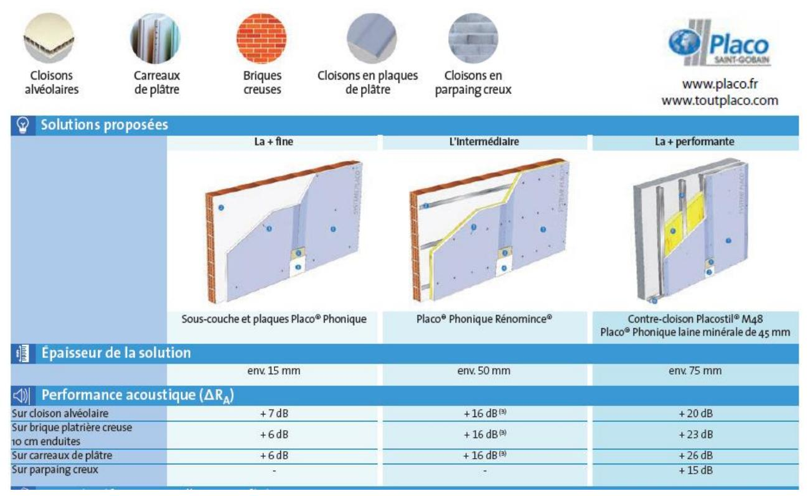

*Figure 5 : solutions d'isolation acoustique par doublage contre une cloison existante*

- **Question 7.** Choisir la ou les solutions constructives, parmi celles proposées sur la figure 5, permettant d'atteindre l'objectif de 35 dB perçu au maximum dans la salle de classe.
- **Question 8.** Préciser si l'isolation du mur de séparation est suffisante à elle seule pour affaiblir suffisamment les bruits. Le cas échéant, décrire les autres points de vigilance à observer et les solutions constructives à respecter.

Afin d'illustrer ces phénomènes acoustiques avec une classe de première STI2D, un système didactique, le banc d'essais acoustique (figure 6), est utilisé.

L'objectif de formation visé est : « O6 – Préparer une simulation et exploiter les résultats pour prédire un fonctionnement, valider une performance ou une solution ».

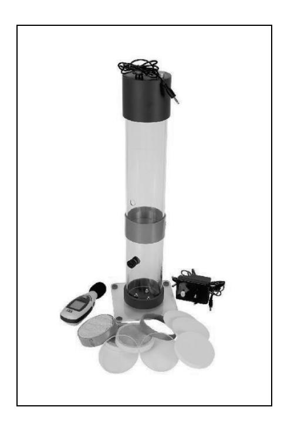

## **Descriptif du banc d'essais acoustique :**

Grâce à un système simple d'emboîtement de tubes, il suffit :

- d'insérer les galettes de matériaux à tester au centre ;
- d'émettre un son d'un côté du matériau ;
- de mesurer au décibel-mètre le son avant et après le matériau ;
- de déterminer l'affaiblissement acoustique.

La conclusion de l'étude amène l'élève à caractériser le choix d'un matériau en fonction de ses propriétés acoustiques.

*Figure 6 : descriptif du banc d'essais acoustique* 

**Question 9.** Après lecture de la documentation fournie en figure 6, décrire succinctement la problématique et les attendus d'une activité pratique sur le banc acoustique en lien avec l'étude précédente.

## **PARTIE 3. VÉRIFICATION DU BON DÉROULEMENT D'UN ESSAI**

Objectif : déterminer les conditions d'essai garantissant l'absence de glissement entre le rouleau et la roue lors d'une mesure

Le banc est composé de quatre rouleaux sur lesquels sont positionnées les quatre roues du véhicule dont les performances sont mesurées (figure 1). Les rouleaux sont accouplés deux à deux, et chaque axe est équipé d'un frein à courant de Foucault (figure 7).

Ces freins permettent de mesurer la puissance dissipée et ainsi d'évaluer la puissance à la roue du véhicule.

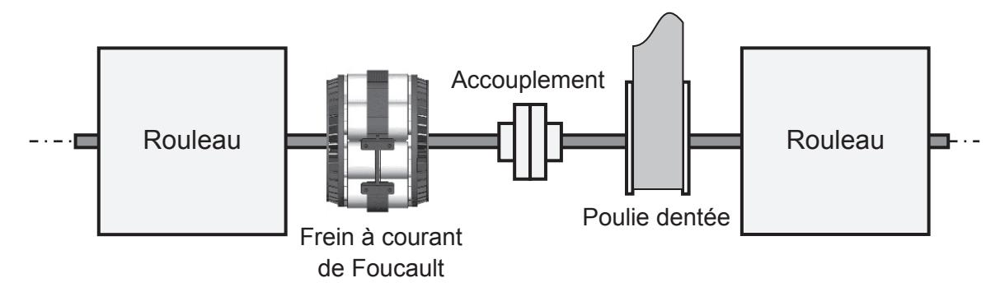

Figure 7: composition d'un axe du banc Autoscan Fi

En évaluant les pertes dans la chaîne de transmission entre le moteur du véhicule et les rouleaux du banc, il est possible d'estimer la puissance moteur, sous réserve que la transmission entre les pneus et les rouleaux se fasse sans glissement.

Cette partie vise à s'en assurer.

La chaîne de transmission d'un véhicule particulier à traction se compose globalement du moteur, de l'embrayage, de la boîte de vitesse, d'un pont et de roues (figure 8).

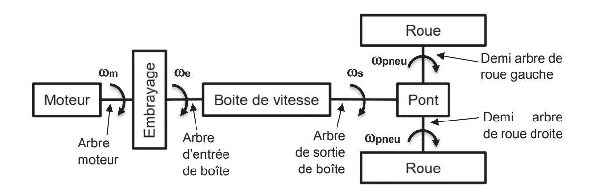

Figure 8 : chaîne de transmission du véhicule

Les vitesses angulaires en rad-s<sup>-1</sup> des arbres moteur, des arbres d'entrée et de sortie de boîte de vitesses et des demi-arbres de roue gauche et droite (elles tournent à la même vitesse sur le banc) sont respectivement notées  $\omega_m$ ,  $\omega_e$ ,  $\omega_s$ , et  $\omega_{pneu}$ .

#### Caractéristiques du véhicule étudié pour cet essai :

■ lorsque l'embrayage est en position embrayée, ωe / ωm = 1 ;

| Rapport engagé                      | 1 <sup>er</sup> | 2 <sup>e</sup> | 3 <sup>e</sup> | <b>4</b> e | 5 <sup>e</sup> | 6 <sup>e</sup> |
|-------------------------------------|-----------------|----------------|----------------|------------|----------------|----------------|
| Rapport $k_v = \omega_s / \omega_e$ | 12/41           | 23/41          | 33/37          | 44/35      | 51/33          | 58/31          |

Figure 9 : rapports de vitesse d'une boîte de vitesses ML6C/L

- le rapport de réduction du pont différentiel avant est kp = pneu / <sup>s</sup> = 16/69 ;
- le rendement de la chaîne de transmission du moteur thermique, pour une fréquence de rotation Nm de l'arbre moteur comprise entre 2 500 tr·min-1 et 3 000 tr·min-1, est = 80 % ;
- les pneus équipés sur le véhicule sont de type 235/45 R18. Ils ont un diamètre dp = 668,7 mm, sans tenir compte de l'écrasement du pneu, et une largeur lp = 235 mm. La pression dans les pneus est 2,2 bars ;
- le véhicule utilisé a une masse de 1,4 tonnes ;
- l'accélération de la pesanteur est g = 9,81 m·s-2.

Lors d'un essai, l'opérateur est assis dans le véhicule. Il démarre le moteur, engage une vitesse et accélère. Les pneus du véhicule entraînent alors les rouleaux par adhérence.

**Question 10.** Déterminer la vitesse angulaire pneu des roues lorsque le premier rapport de vitesse est enclenché avec une fréquence de rotation de l'arbre moteur Nm = 3 000 tr·min-1.

Le contact en M entre les rouleaux du banc d'essais et les pneus du véhicule est considéré comme ponctuel (dans le plan (0, x⃗ , ⃗ y )) ; la déformation des pneus est négligée. Les rouleaux ont un diamètre dr = 600 mm.

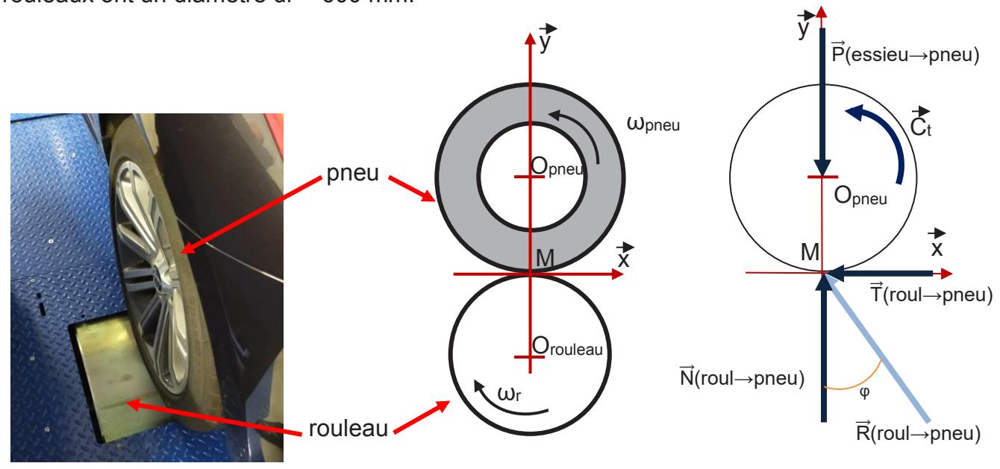

*Figure 10 : liaison pneu-rouleau et représentation des efforts sur le pneu isolé* 

**Question 11.** En supposant la condition de roulement sans glissement respectée au niveau du point coïncident M entre le pneu et le rouleau, déterminer la vitesse angulaire ωr des rouleaux entrainés par les roues motrices.

Le véhicule est immobile tout au long de l'essai, seules ses roues tournent. Deux actions mécaniques s'exercent alors sur les rouleaux :

- le poids du véhicule supposé uniformément réparti sur les quatre appuis ;
- le couple C<sub>t</sub> transmis au niveau des roues motrices.

Question 12. Déterminer la norme  $\|\vec{N}(\text{roul}\rightarrow\text{pneu})\|$  en kN de l'effort normal  $\vec{N}(\text{roul}\rightarrow\text{pneu})$  exercé par le rouleau sur le pneu (figure 10).

Le coefficient d'adhérence entre le pneu et le rouleau est fa = 1,1.

Question 13. Calculer la valeur maximale  $\|\vec{T}(\text{roul}\rightarrow\text{pneu})\|_{\text{max}}$  en kN de l'effort tangentiel  $\vec{T}(\text{roul}\rightarrow\text{pneu})$  pouvant être transmis avant glissement du rouleau sur le pneu.

Il faut maintenant s'assurer que, dans le cas le plus défavorable, le moteur du véhicule n'impose pas un effort de traction  $F_t$  à la roue supérieure à 3,8 kN pour un régime moteur compris entre 2 500 tr·min<sup>-1</sup> et 3 000 tr·min<sup>-1</sup>.

**Question 14.** En effectuant un bilan des puissances sur la chaîne de transmission représentée en figure 8, exprimer littéralement l'effort maximal de traction F<sub>tmax</sub> à la roue en fonction de C<sub>max</sub>, k<sub>v</sub>, k<sub>p</sub>, d<sub>r</sub> et η.

Le constructeur automobile fournit une courbe de couple moteur.

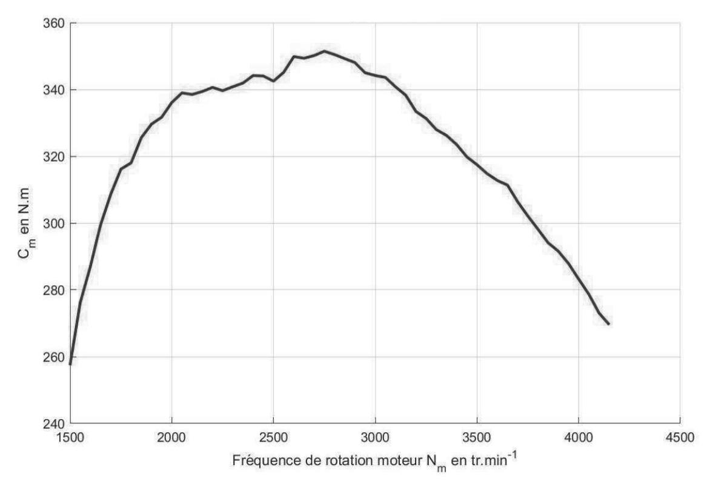

Figure 11 : couple moteur  $C_m$  en  $N \cdot m$  en fonction de la fréquence de rotation  $N_m$  en  $tr \cdot min^{-1}$ 

**Question 15.** Relever la valeur du couple maximum Cmax développé par le moteur sur la figure 11. Exprimer numériquement Ftmax pour chaque rapport kv engagé en présentant les résultats sous forme d'un tableau.

**Question 16.** Expliciter si les conditions d'essai garantissent l'absence de glissement entre le rouleau et la roue lors d'une mesure.

Le laboratoire est équipé du système didactique Tamiya TT02 électrique. Une description est donnée en figure 12.

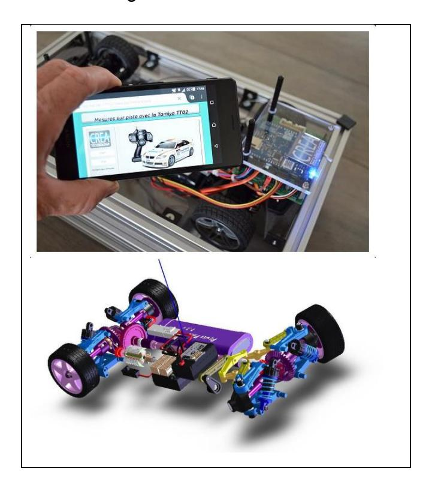

Ce système permet de reproduire des conditions de piste en toute sécurité dans un laboratoire de STI2D sur un modèle réduit d'un véhicule électrique.

Un web serveur embarqué permet de transmettre les mesures de télémétrie sur smartphone, tablette et PC.

Il permet de mesurer des écarts entre performances attendues, simulées et souhaitées.

L'analyse des performances et l'étude des asservissements peut se faire sous l'environnement Labview.

Il est fourni avec les modèles comportementaux Matlab, SysML, etc.

*Figure 12 : descriptif du système didactique Tamiya*

**Question 17.** Expliciter en quoi l'étude de ce système didactisé peut être rapprochée du banc d'essais à rouleaux.

**Question 18.** Décrire en cinq lignes au maximum une activité pratique sur le système Tamiya, pour un groupe d'élèves en I2D, en lien avec l'étude précédente.

**Question 19.** Situer cette activité dans la progression donnée en annexe A3. Justifier la réponse.

## **PARTIE 4. CYCLE D'ESSAIS STANDARDISÉ**

## **4.1. Simulation d'un parcours**

Objectif : simuler sur le banc le profil d'un parcours quelconque en récupérant et exploitant ses données topographiques.

Vu le coût élevé du banc d'essais, son financement a été mutualisé avec une école d'ingénieurs voisine. Ses étudiants développent chaque année une voiture de course et participent à une compétition inter-écoles. Ils peuvent simuler n'importe quel type de parcours, dont les circuits automobiles, en limitant les coûts (déplacements, location du circuit, etc). L'interface du système utilise des fichiers topographiques au format « .gpx ». Il existe de nombreux outils en ligne gratuits pour générer ce genre de fichier.

Les données topographiques du fichier exporté se présentent sous la forme d'une succession de points comme en figure 13. Ces points sont caractérisés par leurs latitudes, longitudes et altitudes.

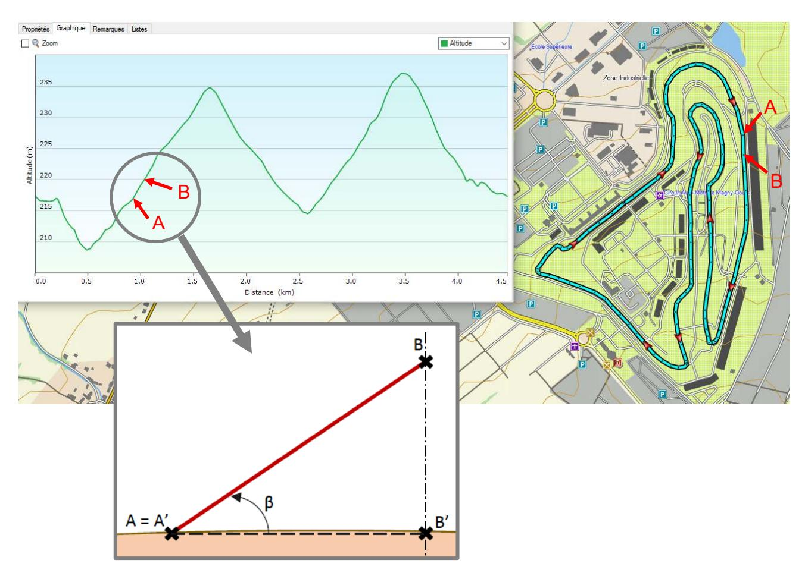

*Figure 13 : exemple de tracé réalisé avec basecamp pour un circuit au Mans*

Les données récupérées se présentent sous la forme de trois listes de valeurs. La première liste contient la latitude, la deuxième la longitude et la troisième l'altitude.

Pour déterminer à tout instant la commande à envoyer aux différents organes du banc d'essais (notamment aux freins à courant de Foucault et à la machine asynchrone d'entrainement), de nombreux paramètres sont à prendre en compte, tels que la pente qui va modifier la charge imposée au véhicule, voire l'entrainer. Il faut, pour cela, extraire les données topographiques du fichier puis en fonction de la position du véhicule sur le parcours, déterminer l'angle correspondant à la pente.

La longueur de l'arc de cercle entre deux points A' et B', projection des deux points A et B sur une sphère de rayon R, est donnée par la relation suivante :

longueur d'arc(A'B')=R× arccos(
$$\sin(\phi_A)$$
×  $\sin(\phi_B)$  +  $\cos(\phi_A)$  ×  $\cos(\phi_B)$  ×  $\cos(\lambda_B$ - $\lambda_A$ ))

#### Où:

- A et B sont deux points du parcours (exemple donné figure 13);
- R = 6 379 137 m est le rayon de la terre ;
- $\phi_{\Delta}$  et  $\phi_{B}$  sont les latitudes en radians des points A et B ;
- $\lambda_A$  et  $\lambda_B$  sont les longitudes en radians des points A et B.

La récupération de ces données topographiques est décrite dans la fonction lecturegpx du document réponse DR1. La figure 14 rappelle des éléments de syntaxe en code python.

|                                        | Opération, instruc | tion       | Écriture Python |         |  |  |  |
|----------------------------------------|--------------------|------------|-----------------|---------|--|--|--|
| Déclaration de variable et affectation | a = 2,1            |            | a=2.1           |         |  |  |  |
| Opérations mathématiques               | a+3                | a-3        | a+3             | a-3     |  |  |  |
|                                        | $a \times 2$       | a/2        | a*2             | a/2     |  |  |  |
|                                        | $a^2$              | $\sqrt{a}$ | a**2            | sqrt(a) |  |  |  |
|                                        | cos(a)             | arccos(a)  | cos(a)          | acos(a) |  |  |  |
|                                        | sin(a)             | arcsin(a)  | sin(a)          | asin(a) |  |  |  |
|                                        | tan(a)             | arctan(a)  | tan(a)          | atan(a) |  |  |  |

Figure 14 : instructions et opérations en python

**Question 20.** Compléter sur le document réponse DR1 le calcul de la variable d de la fonction calculdistele afin d'obtenir la longueur de l'arc entre les deux points A' et B'.

Par hypothèse, cette longueur d'arc s'apparente à la longueur du segment de droite reliant les deux points A' et B'. Le changement d'altitude a une influence non négligeable sur la distance que va parcourir le véhicule entre les deux points A et B.

**Question 21.** Déterminer la distance corrigée en mètres correspondant à dcorrigee, qui représente la distance réellement parcourue par un véhicule entre les points A et B (figure 13) et la reporter sur le document réponse DR1.

Question 22. Déterminer l'angle  $\beta$  en radians de la pente entre les points A et B défini sur la figure 13 et nommé elevation dans le programme du document réponse DR1 à compléter.

**Question 23.** À partir de l'aide « python », en figure 14, et du programme informatique du document réponse DR1, proposer trois questions à poser aux élèves de première STI2D sur l'organigramme donné en annexe A4 en veillant au niveau taxonomique des connaissances liées à l'algorithmique (2.4.3) et au codage (4.3.5).

**Question 24.** Indiquer le type d'évaluation associable à ces questions.

#### **4.2. Création des conditions réelles de conduite**

Objectif : contrôler le courant dans le frein à courant de Foucault pour exercer une charge variable sur les rouleaux du banc et ainsi reproduire un environnement proche de la réalité.

AutoScan Fi utilise la loi de route, étudiée en partie 4.1, pour piloter le frein de charge et faire évoluer la résistance au banc pendant l'essai. Le véhicule testé subit ainsi une résistance équivalente à celle rencontrée sur la route. Dans cette partie, le fonctionnement du frein à courant de Foucault sera étudié afin de s'assurer qu'il répond à l'exigence 1.2.1 « Appliquer un couple résistant variable » du diagramme des exigences (figure 2).

Le modèle retenu par la société Rotronics est le F16-250 EL (192 V) de la société Frenelsa dont la documentation technique est donnée en annexe A5.

**Question 25.** Relever sur l'annexe A5 la tension et l'intensité nominales de ce frein.

**Question 26.** En exploitant les deux courbes de l'annexe A5, déterminer les paramètres influant le couple de freinage en fonctionnement nominal (courant constant). Justifier la nécessité d'un asservissement en courant.

Une simulation sur Matlab Simulink permet de régler le correcteur. Le modèle simplifié de la boucle d'asservissement est donné figure 15.

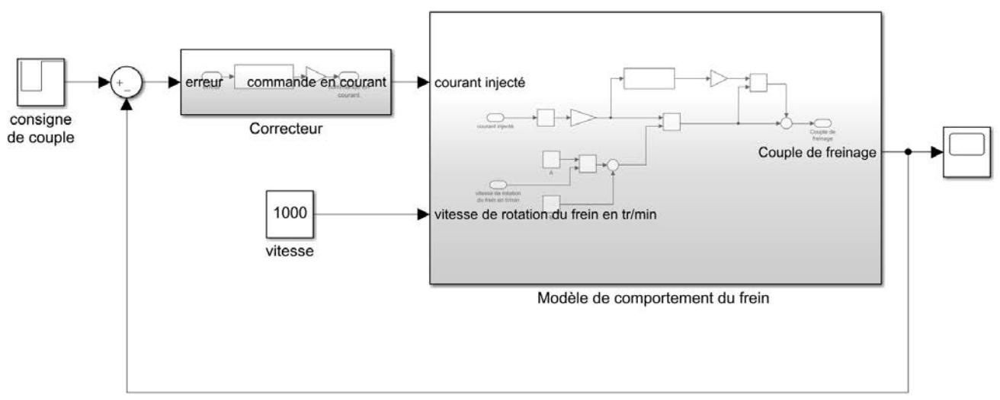

*Figure 15 : modèle Matlab de la boucle d'asservissement du couple*

Le réglage du correcteur se fait par essais successifs. La fréquence de rotation du disque de frein varie très lentement par rapport à la consigne en couple. Elle est considérée constante et égale à 1 000 tr*·*min-1. La consigne de couple est un échelon qui passe de 700 N·m à 750 N·m.

Deux essais, utilisant un correcteur proportionnel, sont représentés figure 16 : un pour un gain unitaire et l'autre pour un gain égal à 10.

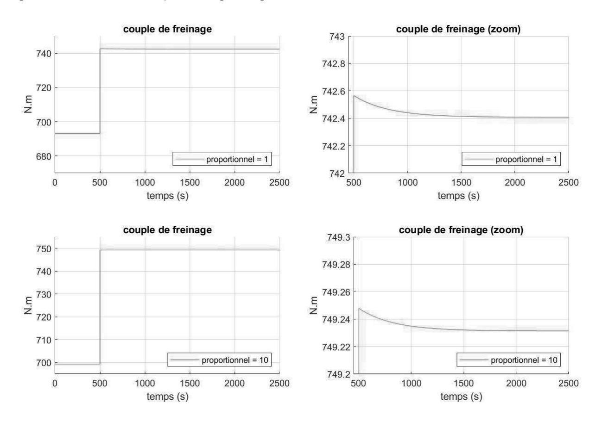

*Figure 16 : couple de freinage avec un correcteur proportionnel de gains 1 et 10*

**Question 27.** Indiquer le critère de performance de l'asservissement qui a été amélioré en augmentant le gain proportionnel du correcteur.

**Question 28.** Déterminer si l'un de ces deux réglages répond aux exigences du système (SysML de la figure 2).

Un dernier réglage est effectué avec un correcteur proportionnel intégral, le résultat est représenté en figure 17.

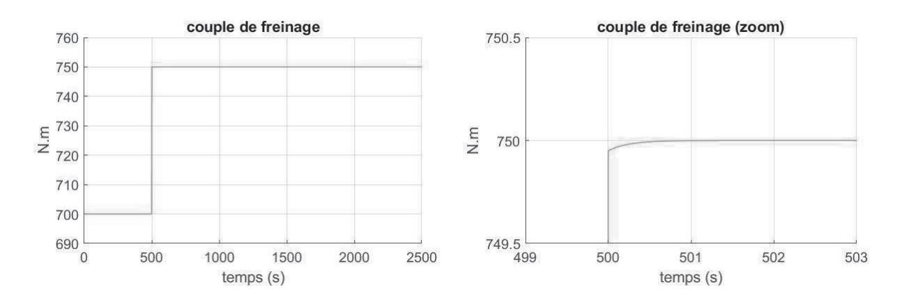

Figure 17 : couple de freinage pour un correcteur proportionnel intégral

**Question 29.** Donner les deux critères de performance qui ont été améliorés entre la figure 16 et la figure 17 et préciser si ce correcteur répond aux exigences du système données en figure 2.

L'alimentation du frein nécessite un convertisseur statique permettant la variation du courant moyen ; elle doit aussi permettre la démagnétisation du disque de frein en inversant le sens de ce courant. Il faut donc appliquer une tension moyenne réglable aux bornes du frein. La structure de ce convertisseur statique est composée d'un pont redresseur, d'un filtre (L, C) et d'un hacheur (figure 18). Le pont redresseur est alimenté par une tension alternative sinusoïdale de valeur efficace 230 V et 50 Hz.

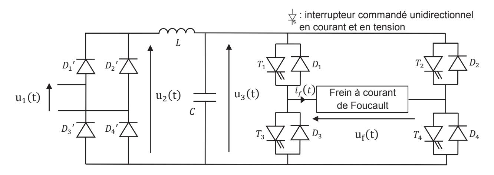

Figure 18 : schéma électrique d'alimentation du frein

Question 30. Justifier la structure du hacheur utilisé (figure 18).

**Question 31.** Indiquer, pour les quatre tensions représentées sur le document réponse DR2, la correspondance avec les tensions  $u_1(t)$ ,  $u_2(t)$ ,  $u_3(t)$  et  $u_f(t)$ .

**Question 32.** Proposer une représentation de cette structure d'alimentation (figure 18) correspondant au niveau des élèves de première STI2D (annexe A2 : connaissances 2.3.4 et 2.3.5).

Le modèle électrique simplifié du frein à courant de Foucault est une résistance en série avec une inductance (figure 19).

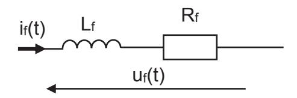

*Figure 19 : schéma équivalent du frein* 

**Question 33.** À l'aide de la figure 19, exprimer uf(t) en fonction de if(t), Lf et Rf.

Les valeurs moyennes de uf(t) et if(t) sont respectivement notées <uf(t)> et <if(t)>.

**Question 34.** Sachant que le courant if(t) est périodique, justifier que < uf(t) > = Rf <if(t)>.

La tension de sortie du filtre (L, C) est supposée constante et égale à E = 207 V.

- **Question 35.** Déterminer la valeur moyenne <uf(t)> en sortie du hacheur en fonction de E et du rapport cyclique de commande des interrupteurs noté α, la forme d'onde ayant été déterminée dans le document réponse DR2.
- **Question 36.** En déduire la valeur de α permettant d'atteindre le point de fonctionnement nominal relevé à la question 25.
- **Question 37.** Conclure quant à l'objectif de contrôler le courant dans le frein à courant de Foucault pour exercer une charge variable sur les rouleaux du banc et ainsi reproduire un environnement proche de la réalité.

## **PARTIE 5. SÉCURITÉ DES UTILISATEURS**

#### **5.1. Maintien à l'arrêt du véhicule pendant l'essai**

Objectif : s'assurer du maintien à l'arrêt du véhicule pendant un essai pour garantir la sécurité des utilisateurs et des biens.

Au début de l'essai, un véhicule est chargé sur le banc par l'utilisateur qui vient positionner chaque pneu sur un rouleau. Le véhicule est ensuite maintenu en place par un jeu de sangles à l'avant et à l'arrière comme sur la figure 20.

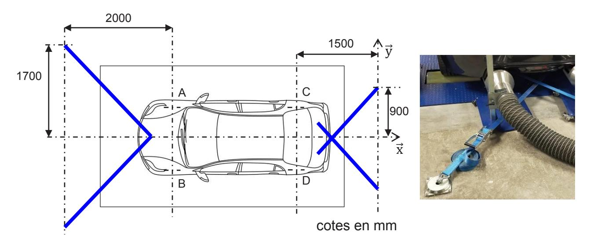

*Figure 20 : arrimage du véhicule pendant un essai avec quatre sangles* 

Pendant l'essai, l'utilisateur est à l'intérieur du véhicule où il gère les phases d'accélération et de décélération, comme lors d'une conduite classique. Les mesures se font via une télécommande reliée au pupitre du banc. Cette partie est consacrée à la vérification de la tenue des sangles pendant un essai.

#### Hypothèses d'étude et caractéristiques du véhicule pour cet essai :

- le véhicule est à l'arrêt au début de l'essai ;
- l'accélération maximale amax est supposée constante ;
- le frein à courant de Foucault est désactivé ;
- l'action mécanique d'une roue sur un rouleau est modélisée par contact ponctuel avec adhérence (aux points A, B, C et D) ;
- le véhicule est de type quatre roues motrices. En phase d'accélération, chaque roue motrice transmet au rouleau, avec lequel elle est en contact, un effort tangentiel T⃗⃗ (roue→rouleau) de module T(roue→rouleau) ;
- l'ensemble { véhicule + conducteur } a une masse : m = 2 300 kg ;
- le véhicule demeure immobile pendant toute la durée de l'essai, seules les roues tournent ;
- le constructeur annonce pour ce véhicule, de forte cylindrée, la performance suivante : 0 à 100 km*·*h-1 en 2,7 s.

Le véhicule étudié est testé sur le banc, en phase d'accélération maximale. Le module de l'effort tangentiel exercé par un rouleau sur une roue est T(roue→rouleau) = 6 kN. Les sangles sont considérées horizontales.

**Question 38.** Lister les actions mécaniques s'exerçant sur le véhicule pendant l'essai en phase d'accélération. Justifier que deux des quatre sangles ne sont pas sollicitées.

- **Question 39.** Sur le document réponse DR3, représenter les efforts tangentiels exercés par les quatre rouleaux sur le véhicule et les forces exercées par les deux sangles sur le véhicule.
- **Question 40.** En étudiant l'équilibre du véhicule, déterminer la norme de la force exercée par chaque sangle sur le véhicule.

Un extrait de catalogue de sangles d'amarrage est donné en annexe A6.

**Question 41.** En exploitant l'annexe A6, choisir un système d'arrimage adapté au véhicule étudié.

Afin de proposer une activité pédagogique liée à l'étude précédente, une machine de traction est installée dans le laboratoire de STI2D. L'objectif de formation visé est : « O7 – Expérimenter et réaliser des prototypes ou des maquettes ».

- **Question 42.** Identifier les connaissances du programme pouvant être abordées lors de l'activité pratique sur la machine de traction (annexe A2). Préciser si elle concerne IT ou I2D et son niveau taxonomique.
- **Question 43.** À partir de l'étude réalisée précédemment, proposer succinctement une mise en situation et une problématique pour une activité d'élèves sur la machine de traction.

#### **5.2. Arrêt du système en urgence**

Objectif : vérifier l'exigence 1.3.3 « S'arrêter en urgence » en présence d'un dysfonctionnement.

En cas de panne de courant, de déplacement des carters de protection, ou d'appui sur un bouton d'arrêt d'urgence, le système doit arrêter rapidement la rotation des rouleaux et des roues du véhicule. La solution retenue par la société Rotronics est un frein pneumatique à serrage par ressort à manque de courant, positionné sur l'axe arrière du banc.

**Question 44.** Expliquer le principe de fonctionnement d'un frein à manque de courant et son intérêt pour la sécurité.

Le frein est composé d'un unique disque de diamètre Ddisque, en contact avec deux garnitures. Le modèle retenu pour modéliser l'action mécanique des garnitures sur le disque est représenté à la figure 21. Le facteur de frottement de la garniture sur le disque est noté f3. La pression de contact entre la garniture et le disque, notée px, est supposée constante.

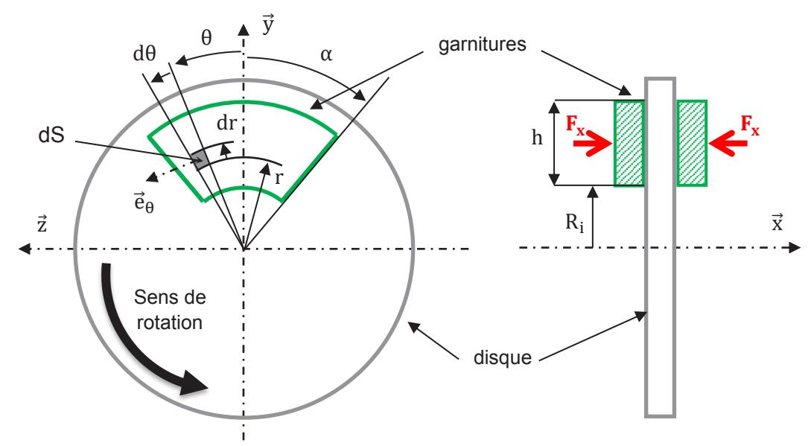

Figure 21 : modèle retenu pour le frein à disque

Question 45. Exprimer l'élément de surface dS en fonction des données de la figure 21.

**Question 46.** Montrer que l'action élémentaire dF exercée par une garniture sur le disque sur l'élément de surface dS du disque s'exprime de la manière suivante :

$$d\vec{F} = dN \vec{x} - f_3 \times dN \vec{e}_{\theta}$$
 avec  $dN = -p_x \times r \times dr \times d\theta$ 

Le couple élémentaire généré par cette force sur l'axe de rotation du disque est alors :

$$dC_x = f_3 \times p_x \times r^2 \times dr \times d\theta$$

Le couple de freinage correspondant s'obtient en intégrant dC<sub>x</sub> sur la surface de contact entre la garniture et le disque, puis en multipliant par le nombre de garnitures :

$$C_f = 2 \times C_x = 2 \times \int_{R_i}^{R_i + h} \int_{-\alpha}^{\alpha} f_3 \times p_x \times r^2 \times dr \times d\theta = 2 \times f_3 \times p_x \times \int_{R_i}^{R_i + h} r^2 \times dr \times \int_{-\alpha}^{\alpha} d\theta$$

**Question 47.** Déterminer l'expression du couple de freinage C<sub>f</sub> en fonction de p<sub>x</sub>, f<sub>3</sub> et des paramètres géométriques du frein.

De la même manière, il est possible d'exprimer la force de freinage  $F_x$  en fonction de la pression  $p_x$ . Il en découle la relation suivante entre le couple de freinage et la force exercée sur les garnitures :

$$C_f = \frac{4}{3} \times f_3 \times \frac{(R_i + h)^3 - R_i^3}{(R_i + h)^2 - R_i^2} \times F_x$$

#### Caractéristiques du système de freinage :

- dimensions des plaquettes : h = 45 mm ; α = 10°;
- diamètre du disque de frein : D<sub>disque</sub> = 460 mm ;
- position de la plaquette : rayon R<sub>i</sub> = 180 mm ;
- coefficient de frottement : f<sub>3</sub> = 0,5.

Afin de satisfaire l'exigence 1.3.3 « s'arrêter en urgence » du cahier des charges (figure 2), le frein doit exercer un couple  $C_f = 530 \text{ N} \cdot \text{m}$  sur l'axe arrière du banc.

**Question 48.** Calculer la force  $F_x$  qu'il faut appliquer sur la garniture pour obtenir un tel couple de freinage.

Un modèle cinématique du frein pneumatique à serrage par ressort est proposé sur la figure 22. Au repos, le ressort exerce une force constante sur le piston (1) et maintient ainsi les garnitures serrées autour du disque. Pour desserrer le frein, de l'air sous pression est injecté sous le piston (1), comprimant le ressort et libérant le disque. Le disque est en liaison glissière sur l'axe des roues et translate sous l'effet du serrage / desserrage du frein. Les liaisons pivots en B et C permettent d'ajuster les plaquettes pour garantir l'adhérence totale des surfaces de friction.

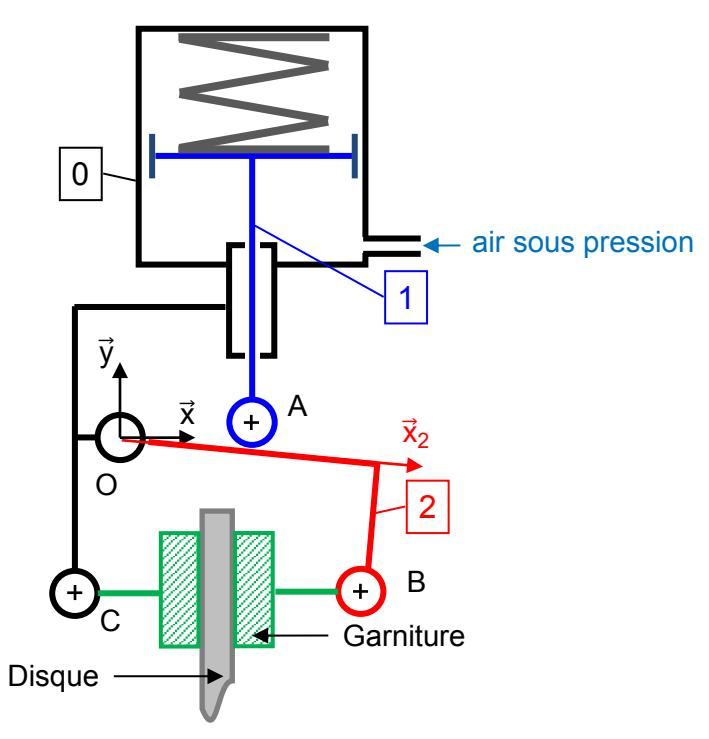

Figure 22 : schéma cinématique du frein pneumatique à serrage par ressort

**Question 49.** Proposer, pour une classe de première STI2D, une évaluation formative de trois questions portant sur le schéma de la figure 22. Préciser les compétences abordées.

#### Paramétrage et données :

- l'effet de la pesanteur sur les pièces composant le frein est négligé ;
- l'étrier (2) est en rotation d'axe  $(O, \vec{z})$  par rapport au bâti (0),  $\theta_{20} = (\vec{x}, \vec{x}_2)$  et  $\overrightarrow{OB} = x_B \vec{x}_2 y_B \vec{y}_2$ , avec  $x_B = 87$  mm et  $y_B = 54$  mm;
- le piston (1) est en translation de direction  $\vec{y}$  par rapport au bâti (0),  $\overrightarrow{OA} = x_A \vec{x} + (y_A \lambda) \vec{y}$ , avec  $x_A = 40$  mm,  $y_A = 15$  mm et  $\lambda$  l'écrasement du ressort.
- la raideur du ressort est notée k ;
- le système est étudié en phase de serrage.
- **Question 50.** Exprimer  $\overrightarrow{R}$  (ressort $\rightarrow$ 1), résultante de l'action mécanique exercée par le ressort sur la pièce (1) en fonction de sa raideur k et de son écrasement  $\lambda$ .
- **Question 51.** En étudiant l'équilibre de la pièce (1) de la figure 22, en déduire l'expression de  $\overrightarrow{R}(2\rightarrow 1)$ , résultante de l'action mécanique exercée par l'étrier (2) sur la pièce (1).
- **Question 52.** En étudiant l'équilibre de l'étrier (2) au point O, établir une relation entre  $F_x = \overrightarrow{R}(garniture \rightarrow 2) \cdot \overrightarrow{x}$  et la raideur du ressort.

Lorsque le frein est serré,  $\theta_{20} = 13^{\circ}$  et  $\lambda = 10$  mm.

**Question 53.** Évaluer la raideur du ressort pour obtenir un effort presseur  $F_x = 2600 \text{ N}$  sur le disque, nécessaire au freinage.

#### PARTIE 6. CONCLUSION

**Question 54.** Conclure sur la capacité du banc Autoscan Fi à remplir sa fonction principale, tout en garantissant la sécurité des personnes et des biens, dans un contexte scolaire.

Tout au long du sujet, des pistes d'exploitations pédagogiques du banc Autoscan Fi en première STI2D ont été étudiées.

**Question 55.** Conclure sur l'intérêt d'un tel système et les limites de son utilisation en lycée technologique.

## **Annexe A1 : répartition des enseignements technologiques en STI2D**

#### Première STI2D

| IT  | Innovation technologique                                            |
|-----|---------------------------------------------------------------------|
| 3 h | Répondre à un besoin à travers une approche active de mini projets. |

| I2D | Ingénierie et développement durable                                                                                                               |
|-----|---------------------------------------------------------------------------------------------------------------------------------------------------|
| 9 h | Prendre en compte l'exigence du développement durable à travers une approche<br>expérimentale du triptyque MEI (matière, énergie et information). |

#### Terminale STI2D

| 2I2D | Ingénierie, innovation et développement durable                                                                                                                                                                                          |  |  |  |  |  |  |  |  |
|------|------------------------------------------------------------------------------------------------------------------------------------------------------------------------------------------------------------------------------------------|--|--|--|--|--|--|--|--|
| 12 h | Concevoir, expérimenter, dimensionner et réaliser des prototypes pluri technologiques par<br>une approche collaborative.                                                                                                                 |  |  |  |  |  |  |  |  |
|      | Un enseignement spécifique au choix :<br><br>AC : architecture et construction ;<br><br>ITEC : innovation technologique et éco- conception ;<br><br>EE : énergie et environnement ;<br><br>SIN : système d'information et numérique. |  |  |  |  |  |  |  |  |

#### **Annexe A2 : extraits du programme de la filière STI2D (bulletin officiel spécial n°1 du 22 janvier 2019) – 7 pages**

#### **Objectifs et compétences des enseignements technologiques (extraits)**

|                                   | Objectifs de<br>formation                                     |        | Compétences développées                                                                                                                                             | IT | I2D | 2I2D | Connaissances                        |
|-----------------------------------|---------------------------------------------------------------|--------|---------------------------------------------------------------------------------------------------------------------------------------------------------------------|----|-----|------|--------------------------------------|
|                                   | O1 -<br>Caractériser des<br>produits ou des                   | CO1.1. | Justifier les choix des structures<br>matérielles et/ou logicielles d'un produit,<br>identifier les flux mis en œuvre dans une<br>approche de développement durable | X  | XX  | XX   | 1-3 / 1-4 / 1-5 /<br>2-1 / 4-2       |
|                                   | constituants<br>privilégiant un                               | CO1.2. | Justifier le choix d'une solution selon des<br>contraintes d'ergonomie et de design                                                                                 | X  | XX  | XX   | 1-1 / 1-3 / 1-5 /<br>2-1             |
| Dimension socio - culturelle      | usage raisonné<br>du point de vue<br>développement<br>durable | CO1.3. | Justifier les solutions constructives d'un<br>produit au regard des performances<br>environnementales et estimer leur<br>impact sur l'efficacité globale            |    | XX  | XX   | 1-5 / 3-1 / 3-3 /<br>4-1 / 4-3 / 5   |
|                                   | O2 - Identifier<br>les éléments<br>influents du               | CO2.1. | Décoder le cahier des charges d'un<br>produit, participer, si besoin, à sa<br>modification.                                                                         | XX |     | XX   | 1-1 / 1-2                            |
|                                   | développement<br>d'un produit                                 | CO2.2. | Évaluer la compétitivité d'un produit<br>d'un point de vue technique et<br>économique.                                                                              | XX |     | XX   | 1-1 / 1-3 / 1-4 /<br>1-5             |
| mension scientifique et technique |                                                               | CO3.1. | Identifier et caractériser les fonctions et<br>les constituants d'un produit ainsi que<br>ses entrées/sorties                                                       |    | XX  | XX   | 1-2 / 2 / 4-1 /<br>4-3/ 5            |
|                                   | O3 - Analyser<br>l'organisation                               | CO3.2. | Identifier et caractériser l'agencement<br>matériel et/ou logiciel d'un produit                                                                                     |    | XX  | XX   | 1-2 / 2 / 4-1 /<br>4-3/ 5            |
|                                   | fonctionnelle et<br>structurelle d'un<br>produit              | CO3.3. | Identifier et caractériser le<br>fonctionnement temporel d'un produit                                                                                               | X  | XX  | XX   | 1-2 / 2-3 / 2-4 /<br>3-4 / 4-3 / 6-3 |
| Di                                |                                                               | CO3.4. | ou d'un processus<br>Identifier et caractériser des solutions<br>techniques                                                                                         | X  | XX  | XX   | 1-2 / 2 / 4-3 / 5<br>/ 6-2           |
|                                   | O4 -<br>Communiquer                                           | CO4.1. | Décrire une idée, un principe, une<br>solution, un projet en utilisant des outils                                                                                   | XX | X   | XX   | 1-1 / 1-2 / 2 /<br>4-1               |
| munication                        | une idée, un<br>principe ou une<br>solution                   | CO4.2. | de représentation adaptés<br>Décrire le fonctionnement et/ou<br>l'exploitation d'un produit en utilisant                                                            | X  | XX  | XX   | 1-1 / 1-2 / 2 /<br>4-1               |
| m<br>Co                           | technique, un<br>projet, y compris<br>en langue               | CO4.3. | l'outil de description le plus pertinent<br>Présenter de manière argumentée des<br>démarches, des résultats, y compris dans                                         | X  | XX  | XX   | 1-1 / 1-2 / 4-1 /<br>4-2 / 6-2       |
|                                   | étrangère                                                     |        | une langue étrangère                                                                                                                                                |    |     |      |                                      |

Le nombre de croix de ces trois colonnes précise dans quelle spécialité la compétence ne sera pas mobilisée (absence de croix), sera partiellement mobilisée (1 croix), sera totalement mobilisée et évaluée en priorité (2 croix).

|                                     |                                | CO5.1. | S'impliquer dans une démarche de projet menée en groupe                                        | XX   |    | XX   | 1-1                             |
|-------------------------------------|--------------------------------|--------|------------------------------------------------------------------------------------------------|------|----|------|---------------------------------|
|                                     |                                | CO5.2. | Identifier et justifier un problème technique à partir de l'analyse globale d'un produit       | xx   | Х  | XX   | 1/2-1/4-3                       |
|                                     |                                | 005.0  | (approche matière – énergie – information)                                                     |      |    |      |                                 |
| ign                                 |                                |        | Mettre en évidence les constituants d'un produit à partir des diagrammes pertinents.           | Х    | XX | XX   | 1-1 / 1-2 / 2 /<br>5            |
| des                                 |                                | CO5.4. | Planifier un projet (diagramme de Gantt, chemin critique) en utilisant les outils              | XX   |    | XX   | 1-1                             |
| ierie                               | O5 – Imaginer une              |        | adaptés et en prenant en compte les données technico-économiques                               |      |    |      |                                 |
| ngér                                | solution,<br>répondre à un     | CO5.5. | Proposer des solutions à un problème technique identifié en participant à des                  | XX   | Х  | XX   | 1-1 / 1-3 / 1-4 / 4-2 / 4-3 / 5 |
| Dimension ingénierie design         | besoin                         |        | démarches de créativité, choisir et justifier la solution retenue                              |      |    |      | / 6-2                           |
| nens                                |                                | CO5.6. | Participer à une étude de design d'un                                                          | XX   | Х  | XX   | 1-1 / 1-3 / 1-4                 |
| اتا                                 |                                |        | produit dans une démarche de développement durable                                             |      |    |      | / 1-5 / 4                       |
|                                     |                                | CO5.7. | Définir la structure matérielle, la constitution d'un produit en fonction des caractéristiques | XX   | Х  | XX   | 1 / 2-3 / 2-4 /<br>4 / 5        |
|                                     |                                |        | technico-économiques et environnementales attendues                                            |      |    |      |                                 |
|                                     |                                | CO5.8. | Concevoir                                                                                      |      |    | XX   |                                 |
|                                     |                                | CO6.1. | Expliquer des éléments d'une modélisation                                                      |      | XX | XX   | 1-2 / 2-3 / 2-                  |
|                                     |                                |        | multiphysique proposée relative au comportement de tout ou partie d'un                         |      |    |      | 4 / 3 /<br>5-2 / 5-3            |
| ne                                  |                                |        | produit                                                                                        |      |    |      | J-2 / J-3                       |
| hniq                                | O6 – Préparer une              | CO6.2. | Identifier et régler des variables et des                                                      | Χ    | XX | XX   | 3                               |
| tec                                 | simulation et                  |        | paramètres internes et externes utiles à une simulation mobilisant une                         |      |    |      |                                 |
| e et                                | exploiter les                  |        | modélisation multiphysique                                                                     |      |    |      |                                 |
| ifiqu                               | résultats pour<br>prédire un   | CO6.3. | Évaluer un écart entre le comportement du                                                      | Χ    | XX | XX   | 3 / 6-3                         |
| ient                                | fonctionnement,                |        | réel et les résultats fournis par le modèle en fonction des paramètres proposés,               |      |    |      |                                 |
| Dimension scientifique et technique | valider une                    |        | conclure sur la validité du modèle                                                             |      |    |      |                                 |
| nsio                                | performance ou<br>une solution | CO6.4. | Choisir pour une fonction donnée, un                                                           |      |    |      | - /                             |
| ime                                 |                                |        | modèle de comportement à partir d'observations ou de mesures faites sur le                     |      | XX | XX   | 3 / 6-3                         |
|                                     |                                |        | produit                                                                                        |      |    |      |                                 |
|                                     |                                | CO6.5. | Interpréter les résultats                                                                      |      |    | XX   |                                 |
|                                     |                                | CO7.1  | Réaliser et valider un prototype ou une                                                        | XX   |    | XX   | 1-2 / 6                         |
| rie                                 |                                | 307.1. | maquette obtenus en réponse à tout ou                                                          | ,,,, |    | ,,,, | 12,0                            |
| énie                                | 07 –                           | 607.3  | partie du cahier des charges initial.                                                          | ٧,   | VV | VV   | 4 2 / 2 4 / 6                   |
| Dimension d'ingénierie              | Expérimenter et                | CO7.2. | Mettre en œuvre un scénario de validation devant intégrer un protocole d'essais, de            | Χ    | XX | XX   | 1-2 / 2-1 / 6-<br>2 / 6-3       |
| on d                                | réaliser des prototypes ou des |        | mesures et/ou d'observations sur le                                                            |      |    |      | ,                               |
| ensi                                | maquettes                      |        | prototype ou la maquette, interpréter les                                                      |      |    |      |                                 |
| Dim                                 | - <b>1</b>                     | CO7.3. | résultats et qualifier le produit  Expérimenter                                                |      |    |      |                                 |
|                                     |                                |        |                                                                                                |      |    | XX   |                                 |

## **Connaissances associées des enseignements technologiques (extraits)**

#### *Dans un souci de simplification, des parties ne concernant pas le sujet ont été enlevées.*

#### 1. Principes de conception des produits et développement durable

| 1.1.<br>La démarche de projet                                                                                                                                  |                |        |     |    |                                                                                                                                                                      |  |  |              |  |  |  |  |
|----------------------------------------------------------------------------------------------------------------------------------------------------------------|----------------|--------|-----|----|----------------------------------------------------------------------------------------------------------------------------------------------------------------------|--|--|--------------|--|--|--|--|
| 1.1.1.<br>Les projets industriels                                                                                                                              | Liens sciences | IT     | I2D | AC | ITEC EE SIN                                                                                                                                                          |  |  | Commentaires |  |  |  |  |
| 1.1.2.<br>Communication                                                                                                                                        |                | 2      |     |    |                                                                                                                                                                      |  |  |              |  |  |  |  |
| technique                                                                                                                                                      |                |        |     |    |                                                                                                                                                                      |  |  |              |  |  |  |  |
| Cartes mentales, représentations<br>numériques, diagrammes SysML<br>pertinents, prototype et maquette,<br>croquis et schémas non normalisés,<br>organigrammes. |                | 2<br>3 |     |    | Il s'agit de savoir choisir et utiliser un<br>outil de communication technique en<br>fonction du contenu à transmettre et de<br>l'interlocuteur auquel on s'adresse. |  |  |              |  |  |  |  |

| 1.5<br>Approche environnementale                                          |                   |   |     |    |      |    |     |                                                                                 |  |  |  |
|---------------------------------------------------------------------------|-------------------|---|-----|----|------|----|-----|---------------------------------------------------------------------------------|--|--|--|
| 1.5.1 Cycle de vie                                                        | Liens sciences IT |   | I2D | AC | ITEC | EE | SIN | Commentaires                                                                    |  |  |  |
| Cycle de vie d'un produit.                                                |                   | 2 |     |    |      |    |     |                                                                                 |  |  |  |
| 1.5.2 Mise à disposition des<br>ressources                                | Liens sciences IT |   | I2D | AC | ITEC | EE | SIN | Commentaires                                                                    |  |  |  |
| Coûts relatifs, disponibilité, impacts<br>environnementaux des matériaux. | PC                |   | 2   |    |      |    |     | Les études de dossiers technologiques<br>doivent permettre l'identification des |  |  |  |
| Enjeux énergétiques mondiaux : …                                          |                   |   | 2   |    |      |    |     | paramètres influant sur le coût de<br>l'énergie et sur sa disponibilité…        |  |  |  |

*Si le niveau taxonomique (voir en fin de l'annexe 2) n'est pas indiqué dans la colonne I2D, c'est que la connaissance associée n'y est pas enseignée (exemple : le cycle de vie d'un produit n'est vu qu'en IT).* 

#### 2. Approche fonctionnelle et structurelle des produits

| 2.1<br>Représentation des flux MEI                                                                   |                             |    |     |             |      |    |                                                                                                        |                                                                                           |  |  |  |
|------------------------------------------------------------------------------------------------------|-----------------------------|----|-----|-------------|------|----|--------------------------------------------------------------------------------------------------------|-------------------------------------------------------------------------------------------|--|--|--|
|                                                                                                      | Liens<br>sciences           | IT | I2D | AC          | ITEC | EE | SIN                                                                                                    | Commentaires                                                                              |  |  |  |
| Notion de flux et de stock.<br>Principaux flux de transfert de<br>matière, d'énergie, d'information… | PC :<br>Énergie<br>interne. |    | 2   |             | 3    |    |                                                                                                        | Différencier et identifier sur un produit<br>les principaux flux et principaux<br>stocks… |  |  |  |
| Diagrammes de blocs internes IBD<br>(Internal Block Diagram) SysML.                                  |                             |    | 2   | 3<br>3<br>3 |      |    | Ces diagrammes sont abordés en<br>lecture, et en modification partielle sur<br>des diagrammes simples. |                                                                                           |  |  |  |

*Une connaissance peut être abordée en I2D et détaillée en terminale, transversalement (Notion de flux et de stock) ou par enseignements spécifiques (IBD) comme ci-dessus.* 

| 2.2<br>Approche fonctionnelle et structurelle des ossatures et des enveloppes                                                                                                                                                     |                |    |     |    |      |    |     |                                                                                                                                                                                                         |  |  |
|-----------------------------------------------------------------------------------------------------------------------------------------------------------------------------------------------------------------------------------|----------------|----|-----|----|------|----|-----|---------------------------------------------------------------------------------------------------------------------------------------------------------------------------------------------------------|--|--|
| 2.2.1 Typologie des<br>enveloppes                                                                                                                                                                                                 | Liens sciences | IT | I2D | AC | ITEC | EE | SIN | Commentaires                                                                                                                                                                                            |  |  |
| Principaux types d'enveloppe des<br>produits.<br>Principales fonctions (esthétique,<br>isolations diverses, sécurité,<br>étanchéités ou perméabilités,<br>agencement d'éléments).<br>Caractéristiques, niveaux de<br>performance. | PC             |    | 2   | 3  | 3    |    |     | Le terme « enveloppe » désigne les<br>enveloppes rigides ou non rigides,<br>les revêtements extérieurs ou<br>intérieurs des constructions…<br>Il s'agit ici d'étudier différents<br>types d'enveloppes… |  |  |

| 2.3<br>Approche fonctionnelle et structurelle des chaînes de puissance                                                                                                                       |                                  |    |     |    |         |    |     |                                                                                                                                                                                                                                                                                                                                                 |
|----------------------------------------------------------------------------------------------------------------------------------------------------------------------------------------------|----------------------------------|----|-----|----|---------|----|-----|-------------------------------------------------------------------------------------------------------------------------------------------------------------------------------------------------------------------------------------------------------------------------------------------------------------------------------------------------|
| 2.3.1 Typologie des chaînes de<br>puissance                                                                                                                                                  | Liens sciences                   | IT | I2D | AC | ITEC EE |    | SIN | Commentaires                                                                                                                                                                                                                                                                                                                                    |
| Notion de chaîne de puissance…                                                                                                                                                               | PC                               |    | 2   |    | 3       | 3  |     |                                                                                                                                                                                                                                                                                                                                                 |
| 2 .3.2 Stockage d'énergie                                                                                                                                                                    | Liens sciences                   | IT | I2D | AC | ITEC    | EE | SIN | Commentaires                                                                                                                                                                                                                                                                                                                                    |
| Types d'énergie stockée …                                                                                                                                                                    | PC                               |    | 2   |    |         |    |     |                                                                                                                                                                                                                                                                                                                                                 |
| 2.3.3 Conversion de puissance                                                                                                                                                                | Liens sciences                   | IT | I2D | AC | ITEC    | EE | SIN | Commentaires                                                                                                                                                                                                                                                                                                                                    |
| Types de conversion :<br>électriquemécanique,<br>chimiquethermique,<br>chimiqueélectrique,<br>électriqueLumineuse.                                                                       | PC : L'énergie<br>et ses enjeux. |    | 2   |    |         |    |     | Il s'agit de connaître les types de<br>conversion de puissance habituels<br>et les grands principes mis en<br>œuvre ainsi que de s'intéresser à la<br>possibilité de réversibilité en<br>fonctions des exemples choisis.                                                                                                                        |
| 2.3.4 Modulation de<br>puissance                                                                                                                                                             | Liens sciences                   | IT | I2D | AC | ITEC EE |    | SIN | Commentaires                                                                                                                                                                                                                                                                                                                                    |
| Types de modulation électrique<br>commandée (AC/AC, AC/DC,<br>DC/AC, DC/DC).                                                                                                                 | PC : L'énergie<br>électrique     |    | 2   |    |         | 3  |     | Il s'agit de connaître les types de<br>modulation de puissance (tout ou<br>rien (TOR) ou progressive) habituels<br>et les grands principes mis en<br>œuvre sans aborder le détail de la<br>structure utilisée.                                                                                                                                  |
| 2.3.5 Adaptation de puissance                                                                                                                                                                | Liens sciences                   | IT | I2D | AC | ITEC EE |    | SIN | Commentaires                                                                                                                                                                                                                                                                                                                                    |
| Types d'adaptation : électrique<br>non commandée (AC/AC, AC/DC,<br>DC/AC, DC/DC).                                                                                                            | PC : L'énergie<br>électrique     |    | 2   |    |         | 3  |     | Il s'agit de connaître les types<br>d'adaptation de puissance habituels<br>et les grands principes mis en<br>œuvre (sans aborder le détail de la<br>structure utilisée).<br>Il s'agit également d'expliquer que<br>l'adaptation porte soit sur la forme,<br>soit sur les grandeurs flux ou effort.                                              |
| 2.3.6 Transmission de<br>puissance                                                                                                                                                           | Liens sciences                   | IT | I2D | AC | ITEC EE |    | SIN | Commentaires                                                                                                                                                                                                                                                                                                                                    |
| Représentation plane et spatiale<br>des liaisons élémentaires parfaites.<br>Classes d'équivalences<br>cinématiques, graphe de liaison.<br>Schéma cinématique, schéma<br>cinématique minimal. | PC : Énergie<br>mécanique.       |    | 2   | 3  | 3       |    |     | Reconnaître et choisir les<br>représentations des liaisons<br>élémentaires.<br>Produire ou modifier un schéma<br>cinématique d'un système simple et<br>plan (3 ou 4 liaisons élémentaires<br>parfaites maximum).<br>Décoder et compléter des schémas<br>cinématiques de mécanismes et<br>également de structures porteuses<br>planes immobiles. |
| 2.4<br>Approche fonctionnelle et structurelle d'une chaîne d'information                                                                                                                     |                                  |    |     |    |         |    |     |                                                                                                                                                                                                                                                                                                                                                 |
| 2.4.1 Typologie des chaînes<br>d'information                                                                                                                                                 | Liens sciences                   | IT | I2D | AC | ITEC    | EE | SIN | Commentaires                                                                                                                                                                                                                                                                                                                                    |
| Notion de chaîne d'information.                                                                                                                                                              | PC                               |    | 2   |    |         | 3  | 3   | réalisée par des schémas blocs.                                                                                                                                                                                                                                                                                                                 |
| 2.4.2 Acquisition et restitution<br>de l'information                                                                                                                                         | Liens sciences                   | IT | I2D | AC | ITEC    | EE | SIN | Commentaires                                                                                                                                                                                                                                                                                                                                    |
| Acquisition d'une grandeur<br>physique…                                                                                                                                                      | PC                               |    | 2   |    |         |    | 3   |                                                                                                                                                                                                                                                                                                                                                 |
| Conditionnement d'une grandeur<br>électrique…                                                                                                                                                |                                  |    | 2   |    |         |    | 3   |                                                                                                                                                                                                                                                                                                                                                 |
| Conversion<br>Analogique/Numérique                                                                                                                                                           |                                  |    | 2   |    |         |    | 3   |                                                                                                                                                                                                                                                                                                                                                 |

| 2.4.3 Codage et traitement de<br>l'information                | Liens sciences                               | IT | I2D | AC | ITEC | EE | SIN | Commentaires                                                                                                                                                                                               |
|---------------------------------------------------------------|----------------------------------------------|----|-----|----|------|----|-----|------------------------------------------------------------------------------------------------------------------------------------------------------------------------------------------------------------|
| Encodage de l'information : :<br>binaire, hexadécimal, ASCII. |                                              |    | 2   |    |      |    | 3   | Identification du type de codage.                                                                                                                                                                          |
| Algorithmique.                                                | Math :<br>algorithmique et<br>programmation. |    | 2   |    |      | 3  | 3   | Structures conditionnelles,<br>itératives. Utilisation de variables<br>(type, taille, …). Appel de<br>procédures/sous-programme.                                                                           |
| Traitement numérique.                                         |                                              |    | 2   |    |      |    | 3   | Le traitement numérique est limité<br>aux opérateurs arithmétiques. Les<br>effets de bords liés à la taille des<br>données, aux capacités de<br>stockage, aux temps de traitement<br>sont mis en évidence. |

#### 3. Approche comportementale des produits

| 3.1<br>Modélisations et simulations               |                   |    |     |    |      |    |     |              |
|---------------------------------------------------|-------------------|----|-----|----|------|----|-----|--------------|
| 3.1.1 Progiciels de simulation                    | Liens<br>sciences | IT | I2D | AC | ITEC | EE | SIN | Commentaires |
| Typologie des progiciels.                         |                   |    | 2   |    | 3    |    |     | -            |
| 3.1.2 Paramétrage d'un<br>modèle                  | Liens<br>sciences | IT | I2D | AC | ITEC | EE | SIN | Commentaires |
| Variables internes, externes.                     |                   |    | 2   |    | 3    |    |     |              |
| Notion de grandeur flux, d'effort.                |                   |    | 2   |    |      | 3  |     |              |
| Entrées, sources de simulation.                   |                   |    | 2   |    | 3    |    |     |              |
| Sorties, rendus des résultats.                    |                   |    | 2   |    | 3    |    |     |              |
| 3.1.3 Paramétrage d'une<br>simulation             | Liens<br>sciences | IT | I2D | AC | ITEC | EE | SIN | Commentaires |
| 3.1.4 Post-traitement et<br>analyse des résultats | Liens<br>sciences | IT | I2D | AC | ITEC | EE | SIN | Commentaires |

| 3.2<br>Comportement<br>mécanique des produits                                                                                                                                                                                                                                                                                             |                   |    |     |    |      |    |     |                                                                                                                                                                                    |  |  |  |  |  |
|-------------------------------------------------------------------------------------------------------------------------------------------------------------------------------------------------------------------------------------------------------------------------------------------------------------------------------------------|-------------------|----|-----|----|------|----|-----|------------------------------------------------------------------------------------------------------------------------------------------------------------------------------------|--|--|--|--|--|
| 3.2.1 Concept de mouvement                                                                                                                                                                                                                                                                                                                | Liens<br>sciences | IT | I2D | AC | ITEC | EE | SIN | Commentaires                                                                                                                                                                       |  |  |  |  |  |
| Degré de mobilité …                                                                                                                                                                                                                                                                                                                       |                   |    | 2   |    |      |    |     |                                                                                                                                                                                    |  |  |  |  |  |
| Mouvements des mécanismes…                                                                                                                                                                                                                                                                                                                | PC<br>Math        |    | 2   |    | 3    |    |     |                                                                                                                                                                                    |  |  |  |  |  |
| Comportement des liaisons<br>élémentaires…                                                                                                                                                                                                                                                                                                |                   |    | 2   | 3  | 3    |    |     | L'utilisation de suites logicielles<br>adaptées à l'enseignement pré-bac…                                                                                                          |  |  |  |  |  |
| 3.2.2 Concept d'équilibre                                                                                                                                                                                                                                                                                                                 | Liens<br>sciences | IT | I2D | AC | ITEC | EE | SIN | Commentaires                                                                                                                                                                       |  |  |  |  |  |
| Équilibre des solides :<br>principe fondamental de la<br>statique ;<br>modélisation des actions mécas,<br>des liaisons…                                                                                                                                                                                                                   | PC<br>Math        |    | 2   | 3  | 3    |    |     | Il s'agit de mettre en relief les<br>paramètres influents pour valider<br>et/ou optimiser les performances<br>observées vis à vis de celles<br>attendues…                          |  |  |  |  |  |
| Transmission des efforts.                                                                                                                                                                                                                                                                                                                 |                   |    | 2   | 3  | 3    | 3  |     |                                                                                                                                                                                    |  |  |  |  |  |
| 3.2.3 Concept de résistance                                                                                                                                                                                                                                                                                                               | Liens<br>sciences | IT | I2D | AC | ITEC | EE | SIN | Commentaires                                                                                                                                                                       |  |  |  |  |  |
| Résistance à la rupture, à la<br>déformation, des matériaux :<br>hypothèses et modèle poutre ;<br>notion de contrainte normale ;<br>pour une sollicitation de traction<br>simple, notion de déformation et<br>loi de Hooke,module d'Young,<br>limite élastique, sollicitation<br>simple de type traction,<br>compression, flexion simple… |                   |    | 2   | 3  | 3    |    |     | L'utilisation de progiciels intégrant<br>un module de calcul par éléments<br>finis ou dédié est privilégiée.<br>Lien indispensable avec les essais des<br>matériaux du chapitre 6. |  |  |  |  |  |

| 3.4<br>Comportement informationnel des produits                        |                   |    |     |    |      |    |     |              |
|------------------------------------------------------------------------|-------------------|----|-----|----|------|----|-----|--------------|
| 3.4.1 Nature et<br>représentation de<br>l'information                  | Liens<br>sciences | IT | I2D | AC | ITEC | EE | SIN | Commentaires |
| Nature d'une information.                                              | PC                |    | 2   |    |      |    | 3   |              |
| Représentation temporelle d'une<br>information.                        | Math              |    | 2   |    |      |    | 3   |              |
| 3.4.2 Description et<br>simulation comportementale<br>de l'information | Liens<br>sciences | IT | I2D | AC | ITEC | EE | SIN | Commentaires |
| Diagramme de séquence.                                                 |                   |    | 2   |    |      |    | 3   |              |
| Diagramme d'états, d'activités.                                        |                   |    | 2   |    |      | 3  | 3   |              |
| 3.4.3 Inter-opérabilité des<br>produits                                | Liens<br>sciences | IT | I2D | AC | ITEC | EE | SIN | Commentaires |
| Typologies des communications.                                         |                   |    | 2   |    |      |    | 3   |              |
| Liaisons séries…                                                       |                   |    | 2   |    |      |    | 3   |              |
| Configuration d'un réseau…                                             |                   |    | 2   |    |      |    | 3   |              |
| 3.4.4 Comportement des<br>systèmes régulés ou asservis                 | Liens<br>sciences | IT | I2D | AC | ITEC | EE | SIN | Commentaires |
| Représentation d'une boucle de<br>régulation ou d'asservissement.      |                   |    | 2   |    |      | 3  |     |              |

#### 4. Conception des produits

| 4.1                                                                                                                     | Outils de représentation du réel |  |   |  |   |  |  |                                |  |  |  |  |  |  |
|-------------------------------------------------------------------------------------------------------------------------|----------------------------------|--|---|--|---|--|--|--------------------------------|--|--|--|--|--|--|
| 4.1.2 Outils de<br>Liens sciences<br>IT<br>I2D<br>AC<br>ITEC<br>EE<br>SIN<br>Commentaires<br>représentation schématique |                                  |  |   |  |   |  |  |                                |  |  |  |  |  |  |
| Schéma architectural                                                                                                    |                                  |  | 2 |  | 3 |  |  | Le schéma architectural permet |  |  |  |  |  |  |
| (mécanique, énergétique,                                                                                                |                                  |  |   |  |   |  |  | de décrire l'organisation      |  |  |  |  |  |  |
| informationnel).                                                                                                        |                                  |  |   |  |   |  |  | structurelle d'un produit      |  |  |  |  |  |  |

| 4.3                                                                                                                                                                                                                                                                                                                                                               | Conception des produits                      |    |     |    |      |    |     |                                                                                                                                                                                                                                                                                                                                                                                                                                                                                                 |  |  |  |  |  |  |  |
|-------------------------------------------------------------------------------------------------------------------------------------------------------------------------------------------------------------------------------------------------------------------------------------------------------------------------------------------------------------------|----------------------------------------------|----|-----|----|------|----|-----|-------------------------------------------------------------------------------------------------------------------------------------------------------------------------------------------------------------------------------------------------------------------------------------------------------------------------------------------------------------------------------------------------------------------------------------------------------------------------------------------------|--|--|--|--|--|--|--|
| 4.3.5 Conception<br>informationnelle des<br>produits                                                                                                                                                                                                                                                                                                              | Liens sciences                               | IT | I2D | AC | ITEC | EE | SIN | Commentaires                                                                                                                                                                                                                                                                                                                                                                                                                                                                                    |  |  |  |  |  |  |  |
| Bilan et nature des entrées<br>sorties.<br>Structures de programmation.<br>Fonctions logicielles.<br>Méthodes et des propriétés<br>utiles en lien avec les librairies<br>choisies.<br>Types de variables.<br>Diagrammes de description.<br>Codage dans un langage<br>spécifique.<br>Règles d'écriture (organisation<br>du code, commentaires,<br>documentation…). | Math :<br>algorithmique et<br>programmation. |    | 2   |    |      |    | 3   | Lister les entrées et les sorties du<br>système en fonction de leur<br>nature (analogique, logique,<br>numérique).<br>Identifier, pour les librairies<br>utilisées, les méthodes utiles ainsi<br>que les propriétés de celles-ci.<br>Le choix des diagrammes retenus<br>pour décrire le système est<br>motivé par l'intention de<br>communiquer à l'écrit comme à<br>l'oral.<br>Les langages Python et C++ sont<br>à utiliser.<br>Pour l'écriture de pages web on<br>utilisera HTML/CSS et PHP. |  |  |  |  |  |  |  |
| Codage dans un langage<br>spécifique.<br>Règles d'écriture (organisation<br>du code, commentaires,<br>documentation…).                                                                                                                                                                                                                                            |                                              |    | 2   |    |      |    | 3   | Les langages Python et C++ sont<br>à utiliser.<br>Pour l'écriture de pages web on<br>utilisera HTML/CSS et PHP.                                                                                                                                                                                                                                                                                                                                                                                 |  |  |  |  |  |  |  |

| 6.2<br>Expérimentations et essais                                                                                                                              |                   |    |     |    |                       |    |     |                                                                                                                                                                                                                                                                                                     |
|----------------------------------------------------------------------------------------------------------------------------------------------------------------|-------------------|----|-----|----|-----------------------|----|-----|-----------------------------------------------------------------------------------------------------------------------------------------------------------------------------------------------------------------------------------------------------------------------------------------------------|
|                                                                                                                                                                | Liens<br>sciences | IT | I2D | AC | ITEC                  | EE | SIN | Commentaires                                                                                                                                                                                                                                                                                        |
| Protocole d'essai.<br>Sécurité de mise en œuvre.                                                                                                               | PC                |    | 3   |    |                       |    |     | La nécessité d'une démarche<br>raisonnée, progressive, organisée en<br>fonction de l'objectif recherché est<br>expliquée.<br>La nécessité de procédures de mise<br>en œuvre en sécurité est expliquée<br>vis-à-vis des risques rencontrés.                                                          |
| Expérimentation sur les<br>matériaux et sur les structures.                                                                                                    | PC                |    | 2   | 3  | 3                     |    |     | Les expérimentations seront<br>réalisées sur des :<br>éprouvettes (traction,<br>-<br>compression, flexion simple),<br>afin de valider une forme, une<br>répartition de matière ou une<br>caractéristique d'un matériau<br>(y compris composite) ;<br>-<br>des maquettes de solutions<br>techniques… |
|                                                                                                                                                                |                   |    |     |    | maîtrise des contenus |    |     | Niveaux<br>Indicateur du niveau d'acquisition et de<br>1<br>2<br>3<br>4                                                                                                                                                                                                                             |
| Le contenu est relatif à l'appréhension<br>d'une vue d'ensemble d'un sujet :<br>montrer<br>ses<br>réalités<br>sous<br>aspects de manière partielle ou globale. | certains          |    |     |    | Niveau d'information  |    |     |                                                                                                                                                                                                                                                                                                     |
| Le contenu est relatif à l'acquisition de<br>moyens<br>d'expression                                                                                            | et<br>de          |    |     |    |                       |    |     |                                                                                                                                                                                                                                                                                                     |

 **Niveau de la maîtrise** 

**méthodologique** 

moyens d'expression et de communication : définir, utiliser les termes composant la discipline. Il s'agit de maîtriser un savoir « appris ». Ce niveau englobe le précédent.

Le contenu est relatif à la maîtrise d'outils d'étude ou d'action : utiliser, manipuler des règles ou des ensembles de règles (algorithme), des principes, des démarches formalisées en vue d'un résultat à atteindre.

Ce niveau englobe les deux niveaux précédents.

Le contenu est relatif à la maîtrise d'une méthodologie de formulation et de résolution de problèmes : assembler, organiser les éléments d'un sujet, identifier les relations, raisonner à partir de ces relations, décider en vue d'un but à atteindre. Il s'agit de maîtriser une démarche : induire, déduire, expérimenter, se documenter.

Ce niveau englobe les trois niveaux précédents.

| Niveau d'information           |  |
|--------------------------------|--|
| Niveau d'expression            |  |
| Niveau de la maîtrise d'outils |  |
|                                |  |

# Annexe A3 : progression pédagogique de l'équipe enseignant en I2D de l'établissement

| Séquences | Nombre de semaines | Thème                                              | Intitulé des séquences                                                            | Compétences<br>Associées |
|-----------|--------------------|----------------------------------------------------|-----------------------------------------------------------------------------------|--------------------------|
| 1         | 3                  | Réduire l'impact<br>environnemental                | Comment justifier les choix technologiques dans un contexte DD ?                  | CO1.1<br>CO1.2           |
| 2         | 3                  | Assister l'homme                                   | Comment décrire le fonctionnement des produits ?                                  | CO4.2<br>CO5.3           |
| 3         | 4                  | Favoriser la pratique<br>sportive                  | Comment identifier et caractériser la structure matérielle d'un produit ?         | CO3.1                    |
| 4         | 4                  | Améliorer l'efficacité<br>énergétique d'un produit | Comment identifier et caractériser les flux de puissance d'un produit ?           | CO3.1<br>CO3.3           |
| 5         | 4                  | Gérer la ville du futur<br>(smart city)            | Comment identifier et caractériser les flux informationnels d'un produit ?        | CO3.1<br>CO3.3           |
| 6         | 4                  | Construire les ouvrages de demain                  | Comment évaluer les solutions technologiques dans une démarche d'éco-conception ? | CO1.3<br>CO3.4           |
| 7         | 3                  | Assister l'homme                                   | Comment modéliser un produit ?                                                    | CO6.1<br>CO6.2<br>CO6.4  |
| 8         | 6                  | Améliorer l'efficacité<br>énergétique d'un produit | Comment valider un modèle et qualifier un produit ?                               | CO6.3<br>CO7.2           |
| 9         | 3                  | Préserver la santé                                 | Expérimenter                                                                      | CO4.3                    |

#### **Annexe A4 : organigramme du programme python**

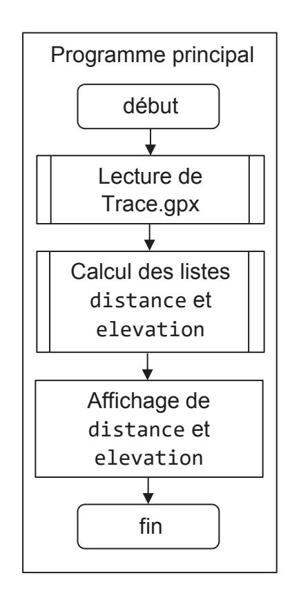

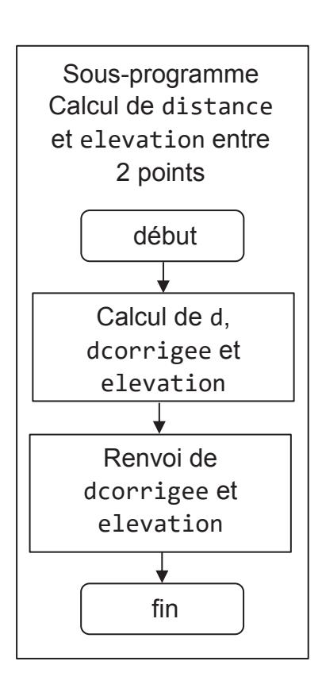

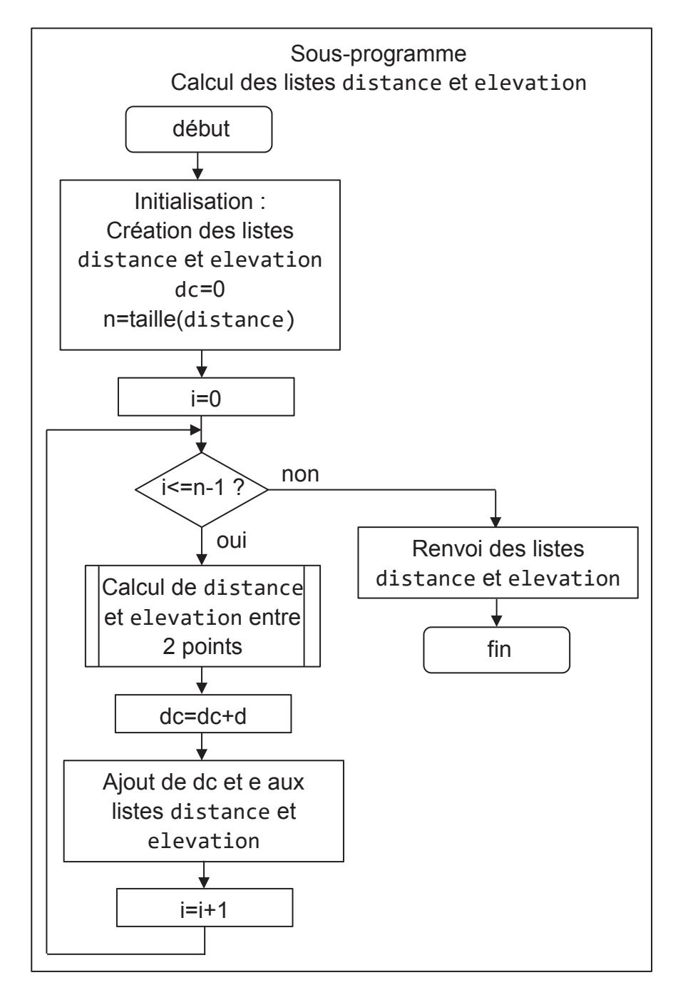

Rq : Lecture de Trace.gpx n'est pas détaillée ici

#### Annexe A5 : documentation technique du frein à courant de Foucault


FRENOS ELECTRICOS UNIDOS S.A.

Pol. Ind. Comarca 1, Calle L, nº 10

31160 ORCOYEN (NAVARRA)

Tel.: Int+34 902 145611 Fax.:Int+34 948 141418

www.frenelsa.com

#### RETARDER

## F16-250 EL (192 V)

#### **ELECTRICAL CHARACTERISTICS**

| Rated voltage     | 192 V  |
|-------------------|--------|
| Total resistance  | 10,1 Ω |
| Total consumption | 19 A   |

#### MECHANICAL CHARACTERISTICS

| Max. transmissible torque | 1700/2300 mkg         |
|---------------------------|-----------------------|
| Max. rotational speed     | 3600 rpm              |
| Rotors inertia            | 2,96 Kgm <sup>2</sup> |

| Rotors weight | 87 Kg  |
|---------------|--------|
| Stator weight | 212 Kg |
| Total weight  | 299 Kg |

WEIGHT

MAINTENANCE:

Lubrication with lithium grease EP2

#### **BRAKING TORQUE CURVES**

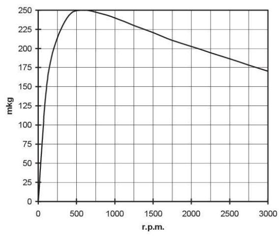

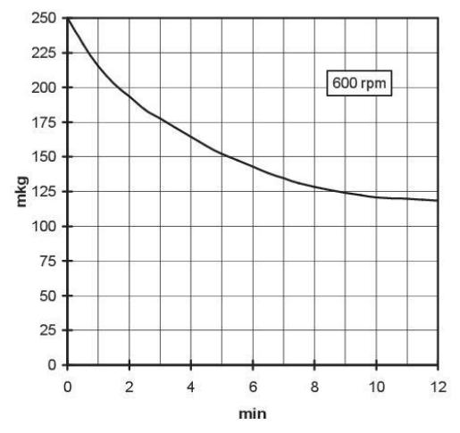

Braking torque according to rotational speed

Braking torque according to time at steady rpm

#### **OUTER AND ASSEMBLY DIMENSIONS**

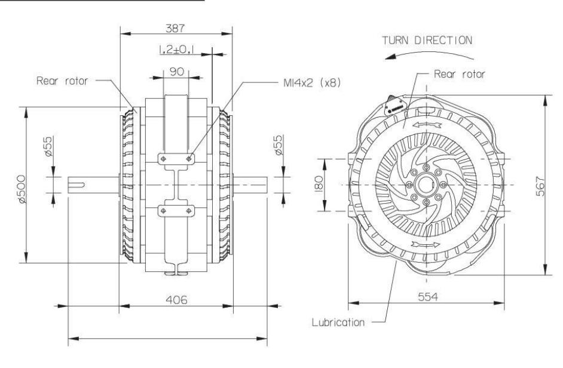

Information can be modified without previous notice

23/11/01

#### **Annexe A6 : choix du système d'arrimage**

#### **Extrait de la norme EN 12 195-2**

- Tension Maximale d'Utilisation (TMU) ou Capacité d'amarrage (LC) = Force maximale utilisée en traction directe qu'un système d'amarrage est capable de supporter lors de l'utilisation.
- Épreuve : Tous les éléments d'accrochage du dispositif d'amarrage complet ne doivent présenter aucune trace de déformation affectant leur fonctionnement à une capacité d'amarrage de 1,25 LC et ensuite doivent résister à une force ayant un coefficient d'utilisation d'au moins 2.
- Allongement : La sangle textile ne doit pas s'allonger de plus de 7% lorsqu'elle est soumise à la capacité d'amarrage (LC).

## **Extrait du catalogue du matériel d'arrimage (groupe Barciet-Marlev)**

| Tension directe<br>en daN | Largeur<br>sangle<br>en mm | LC<br>système<br>en daN | Tension double | Rupture de la<br>sangle seule<br>en daN | Longueur<br>standard<br>en m |
|---------------------------|----------------------------|-------------------------|----------------|-----------------------------------------|------------------------------|
| LC 5 000 daN              | 75                         | 5 000                   | 10 000         | 15 000                                  | 9,10                         |
| LC 3 500 daN              | 75                         | 3 500                   | 7 000          | 11 000                                  | 9, 10                        |
| LC 2 500 daN              | 50                         | 2 500                   | 5 000          | 7 500                                   | 8, 9, 10                     |
| LC 2 000 daN              | 50                         | 2 000                   | 4 000          | 6 000                                   | 8, 9, 10                     |
| LC 800 daN                | 45                         | 800                     | 1 600          | 3 000                                   | 4, 5, 6                      |
| LC 1000 daN               | 35                         | 1000                    | 2 000          | 3 200                                   | 6, 7                         |
| LC 400 daN                | 25                         | 400                     | 800            | 1 200                                   | 4, 5, 6                      |

|                                                                                                                                                                                                                                                                                                                                                                                                                                                                                                                                                                                              |                                                                                |   |  |   |  |  |   |        |      |       |          |        |   |    |      |     |      | <br>              |      |
|----------------------------------------------------------------------------------------------------------------------------------------------------------------------------------------------------------------------------------------------------------------------------------------------------------------------------------------------------------------------------------------------------------------------------------------------------------------------------------------------------------------------------------------------------------------------------------------------|--------------------------------------------------------------------------------|---|--|---|--|--|---|--------|------|-------|----------|--------|---|----|------|-----|------|-------------------|------|
|                                                                                                                                                                                                                                                                                                                                                                                                                                                                                                                                                                                              | OOC v2 ©NEOPTEC                                                                | П |  | 1 |  |  |   |        |      |       |          | Ī      | ĺ |    |      |     | П    | $\overline{\Box}$ |      |
|                                                                                                                                                                                                                                                                                                                                                                                                                                                                                                                                                                                              | a lieu, du nom d'usage)                                                        |   |  |   |  |  |   |        |      |       |          |        |   |    |      |     |      |                   |      |
|                                                                                                                                                                                                                                                                                                                                                                                                                                                                                                                                                                                              | Prénom(s) :                                                                    |   |  |   |  |  |   |        |      |       |          |        |   |    |      |     |      |                   |      |
|                                                                                                                                                                                                                                                                                                                                                                                                                                                                                                                                                                                              | Numéro<br>Inscription :                                                        |   |  |   |  |  |   |        |      |       | Né(e     | ) le : |   |    | /    |     | ]/   |                   |      |
|                                                                                                                                                                                                                                                                                                                                                                                                                                                                                                                                                                                              | (Le numéro est celui qui figure sur la convocation ou la feuille d'émargement) |   |  |   |  |  |   |        |      |       |          |        |   |    |      |     |      |                   |      |
|                                                                                                                                                                                                                                                                                                                                                                                                                                                                                                                                                                                              | à l'aide de la notice)  L'Examen:                                              |   |  |   |  |  | s | ectic  | n/Sp | oécia | lité/Sér | ie:    |   |    |      |     | <br> | <br>              | <br> |
|                                                                                                                                                                                                                                                                                                                                                                                                                                                                                                                                                                                              | Epreuve:                                                                       |   |  |   |  |  | N | /latiè | re:. |       |          |        |   | Se | ssio | າ : | <br> | <br>              | <br> |
| <ul> <li>Remplir soigneusement, sur CHAQUE feuille officielle, la zone d'identification en MAJUSCULES.</li> <li>Ne pas signer la composition et ne pas y apporter de signe distinctif pouvant indiquer sa provenance.</li> <li>Numéroter chaque PAGE (cadre en bas à droite de la page) et placer les feuilles dans le bon sens et dans l'ordre.</li> <li>Rédiger avec un stylo à encre foncée (bleue ou noire) et ne pas utiliser de stylo plume à encre claire.</li> <li>N'effectuer aucun collage ou découpage de suiets ou de feuille officielle. Ne joindre aucun brouillon.</li> </ul> |                                                                                |   |  |   |  |  |   |        |      |       |          |        |   |    |      |     |      |                   |      |

EDE STI 2

## DR1 à DR3

Tous les documents réponses sont à rendre, même non complétés.


#### **Document réponse DR1 (questions 20 à 22)**

```
Question 20 
                                                                     Question 21 
                                                                     Question 22 
"""Ce programme est un reflet partiel de la programmation interne du banc, il a 
largement été adapté pour ce sujet."""
from pylab import * 
import xml.etree.ElementTree as ET
from math import * 
def lecturegpx(nomdefichier:str)->list:
    """Récupère les coordonnées de latitude, longitude et altitude des points du 
    parcours à partir d'un fichier GPX. Non détaillé ici"""
 return latitude,longitude,altitude
def calculdistele(latA,lonA,altA,latB,lonB,altB):
 """calcul la distance réelle entre 2 points et donne l'angle d'élévation en
 radian à partir des coordonnées de 2 points"""
 d = 
 dcorrigee =
 elevation =
 return dcorrigee,elevation
def distcumul(lat,lon,alt):
    """construit 2 listes, l'une contient la distance cumulée en mètre depuis le 
    début du parcours, l'autre l'angle d'élévation entre chaque point"""
 distance = []
 elevation = []
 dc = 0
 for i in range(len(lat)-1):
 d,e = calculdistele (lat[i],lon[i],alt[i],lat[i+1],lon[i+1],alt[i+1])
 dc = dc+d
 distance.append(dc)
 elevation.append(e)
 return distance,elevation
"""[...]"""
"""récupération des coordonnées à partir du fichier"""
latitude,longitude,altitude = lecturegpx('Trace.gpx') 
"""calcul des listes distance cumulée et élévation"""
distance,elevation = distcumul(latitude,longitude,altitude)
print(distance,elevation)
"""[...]"""
```

## Document réponse DR2 (question 31)

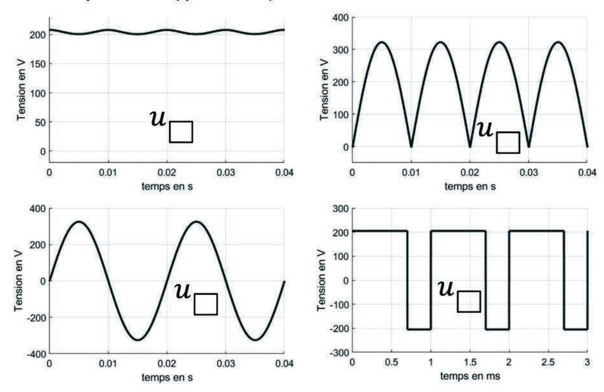

## Document réponse DR3 (question 39)

Remarques : Les dimensions sont indiquées en millimètres. Les proportions et échelles ne sont pas respectées sur le schéma.

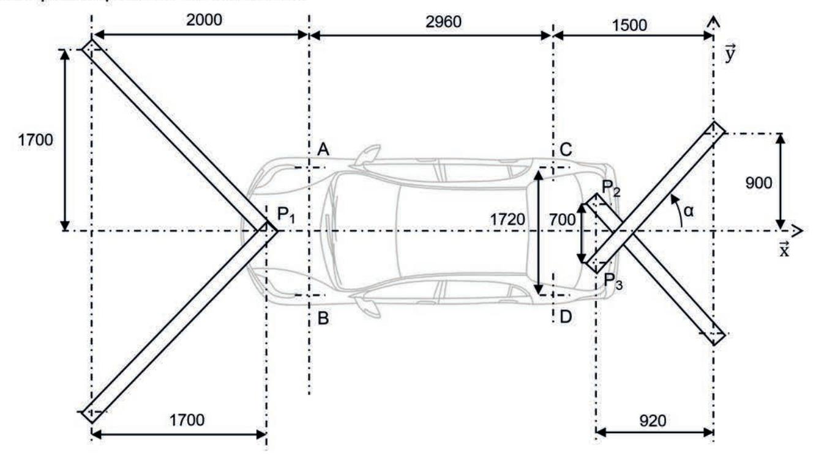