**EDE STI 2** 

### **SESSION 2023**

\_\_\_\_

### CAPET CONCOURS EXTERNE ET CAFEP CORRESPONDANT

**Section : SCIENCES INDUSTRIELLES DE L'INGÉNIEUR Option : INGÉNIERIE DES CONSTRUCTIONS**

**Option : INGÉNIERIE ÉLECTRIQUE Option : INGÉNIERIE INFORMATIQUE Option : INGÉNIERIE MÉCANIQUE**

### **ÉPREUVE ÉCRITE DISCIPLINAIRE APPLIQUÉE**

Durée : 5 heures

\_\_\_\_

*Calculatrice autorisée selon les modalités de la circulaire du 17 juin 2021 publiée au BOEN du 29 juillet 2021.* 

*L'usage de tout ouvrage de référence, de tout dictionnaire et de tout autre matériel électronique est rigoureusement interdit.*

*Il appartient au candidat de vérifier qu'il a reçu un sujet complet et correspondant à l'épreuve à laquelle il se présente.* 

*Si vous repérez ce qui vous semble être une erreur d'énoncé, vous devez le signaler très lisiblement sur votre copie, en proposer la correction et poursuivre l'épreuve en conséquence. De même, si cela vous conduit à formuler une ou plusieurs hypothèses, vous devez la (ou les) mentionner explicitement.*

**NB : Conformément au principe d'anonymat, votre copie ne doit comporter aucun signe distinctif, tel que nom, signature, origine, etc. Si le travail qui vous est demandé consiste notamment en la rédaction d'un projet ou d'une note, vous devrez impérativement vous abstenir de la signer ou de l'identifier. Le fait de rendre une copie blanche est éliminatoire.**

Ce sujet se décompose de la façon suivante :

- Énoncé, pages 2 à 25 ;
- Annexes, pages 26 à 39 ;
- Document réponse (à rendre avec la copie), pages 40 à 47.

### Il est demandé aux candidats :

- de rédiger les réponses aux différentes parties sur des feuilles de copie séparées et clairement repérées ;
- de numéroter chaque feuille de copie et indiquer le numéro de la question traitée ;
- d'utiliser exclusivement les notations indiquées dans le sujet lors de la rédaction des réponses ;
- de justifier clairement les réponses ;
- d'encadrer ou souligner les résultats ;
- de présenter lisiblement les applications numériques, sans omettre les unités, après avoir explicité les expressions littérales des calculs ;
- de formuler les hypothèses nécessaires à la résolution des problèmes posés si celles-ci ne sont pas indiquées dans le sujet.

### **INFORMATION AUX CANDIDATS**

**Vous trouverez ci-après les codes nécessaires vous permettant de compléter les rubriques figurant en en-tête de votre copie. Ces codes doivent être reportés sur chacune des copies que vous remettrez.** 

### **Concours externe du CAPET de l'enseignement public :**

**• option** : **Ingénierie des constructions** 

 Concours Section/option Epreuve Matière EDE 1411E 102 9312

**• option** : **Ingénierie électrique**

 Concours Section/option Epreuve Matière EDE 1412E 102 9312

**• option** : **Ingénierie informatique**

 Concours Section/option Epreuve Matière EDE 1413E 102 9312

**• option : Ingénierie mécanique**

 Concours Section/option Epreuve Matière EDE 1414E 102 9312

► Concours externe du CAFEP/CAPET de l'enseignement privé :

**• option** : **Ingénierie des constructions**

 Concours Section/option Epreuve Matière EDF 1411E 102 9312

**• option** : **Ingénierie électrique**

 Concours Section/option Epreuve Matière EDF 1412E 102 9312

**• option** : **Ingénierie informatique**

 Concours Section/option Epreuve Matière EDF 1413E 102 9312

**• option : Ingénierie mécanique**

 Concours Section/option Epreuve Matière EDF 1414E 102 9312

### LE SYSTÈME DE TRAITEMENT D'AIR PILOTÉ DANS UNE SERRE SEMI-FERMÉE

### PARTIE 1. MISE EN SITUATION

### 1.1. Contexte général

En 2050, la terre comptera plus de neuf milliards d'habitants, 70 % d'entre eux seront des citadins. Cette population urbaine devra s'alimenter correctement. Les gouvernements et les ONG (organisations non gouvernementales) encouragent la consommation de produits frais pour des raisons de santé et soulignent l'importance de produire des aliments sains dans le cadre d'une agriculture durable. Les productions sous serres cultivées hors-sol gagnent du terrain partout dans le monde. Elles sont une des solutions pour répondre aux problèmes d'alimentation des générations futures.

En France, plus de 90 % des tomates sont cultivées sous serre. Les serres permettent de s'affranchir des aléas climatiques et assurent une production en toutes saisons. Leur environnement protégé, sans contact direct avec l'extérieur et à l'abri des parasites, limite l'emploi de produits phytosanitaires.

Néanmoins, leur consommation énergétique reste importante et alourdit les coûts de production. Il est nécessaire de rechercher une meilleure efficience énergétique tout en maintenant les performances agronomiques et la qualité du produit.

### 1.2. Les serres semi-fermées

Depuis quinze ans, un nouveau concept de serre s'est développé en France : la serre semi-fermée. Une enquête réalisée en 2019 par le centre technique interprofessionnel (CTIFL) de Balandran dans le Gard a permis de recenser 88,7 hectares de serres semifermées, principalement dans le sud, pour produire de la tomate cerise (figure 1).

Plusieurs modèles de serres ont été développés par les différents constructeurs mais actuellement une version standard est proposée. Elle est caractérisée par un système de traitement d'air piloté (figure 2) dont le rôle est d'homogénéiser le climat de la serre en évitant de forts écarts de température et d'hygrométrie. Ce système comprend un corridor technique, couloir occupant toute la longueur de la serre et permettant les opérations suivantes :

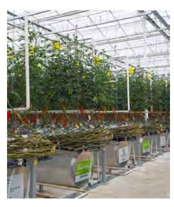

Figure 1 : production de tomates cerises dans le sud de la France

- réchauffer l'air via des aérothermes (échangeurs thermiques air / eau) installés en hauteur dans le corridor ;
- distribuer et brasser l'air dans la serre au moyen de ventilateurs et de gaines de distribution perforées et placées sous les tubes de chauffage d'eau situés dans la végétation ;
- refroidir et humidifier l'air extérieur en le faisant circuler au travers de panneaux de refroidissement par évaporation, appelés Cooling PAD, positionnés en façade du corridor et humidifiés en continu ;
- injecter du CO2 dans la serre pour améliorer le rendement photosynthétique (la distribution du CO2 n'est pas représentée sur le schéma de principe).

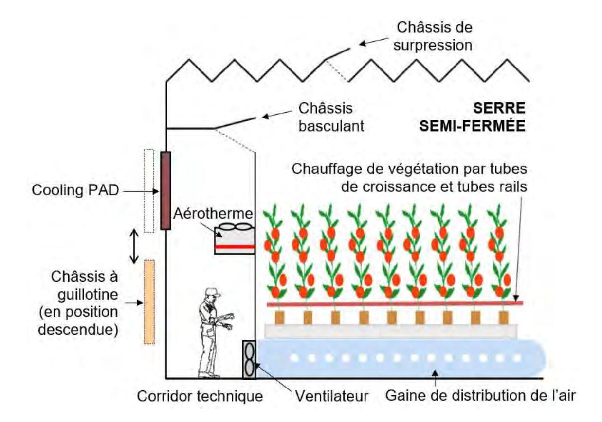

Figure 2 : schéma de principe de la serre semi-fermée

Des châssis à guillotine autorisent l'entrée d'air extérieur au niveau des Cooling PAD et les châssis de surpression en nombre limité permettent de contrôler la surpression dans la serre « ouverte ». Le pilotage climatique de la serre est plus complexe à gérer qu'une serre classique. Toutefois, il permet d'augmenter notablement le rendement des cultures avec une consommation d'eau maîtrisée, de diminuer leur risque phytosanitaire et contribue à la réduction des émissions de CO2 grâce aux économies d'énergie réalisées.

### 1.3. Problématique du sujet

L'étude porte sur le système de traitement d'air piloté qui équipe les deux serres semifermées du Mas Blanc à Alenya dans les Pyrénées-Orientales. Il répond à la problématique générale :

### « Créer dans la serre un climat de croissance optimal pour la tomate avec une utilisation rationnelle de l'énergie et de l'eau. »

Les caractéristiques dimensionnelles, le plan de niveau et les élévations des serres sont détaillés en annexe 1. Le système étudié doit remplir plusieurs exigences décrites dans le diagramme partiel des exigences donné en annexe 2, notamment :

- de résister aux chargements climatiques et d'exploitation ;
- de diffuser dans la serre l'air extérieur refroidi ou l'air intérieur réchauffé ;
- de gérer la surpression et d'évacuer l'air chaud en toiture ;
- de rafraîchir et humidifier l'air de la serre.

L'objectif de l'étude est de valider les solutions techniques envisagées pour satisfaire ces exigences et de vérifier que le système répond à la problématique générale.

### 1.4. Visite de la serre

L'objectif est de conduire un projet pluridisciplinaire à partir de la visite de la serre au sein du collège Paul Langevin (66200 Elne).

Piloté par le professeur de technologie, ce projet est porté par le pôle "sciences et technologie" de l'établissement et mobilise les quatre classes de troisième du collège.

La problématique retenue est « comment produire des légumes en limitant les traitements phytosanitaires et en maitrisant les consommations ? ».

La séquence débute par la visite des serres semi-fermées de la ferme du Mas Blanc à Alenya. Les élèves sont amenés à observer la structure de la serre, les installations de ventilation et de distribution de l'air, la centrale de cogénération (gaz / électricité), le système de nutrition des plants de tomates, le système de pilotage des installations et les populations d'insectes présentes à l'intérieur de la serre.

Les problématiques tirées de la visite de la serre sont exploitées dans les classes pour développer des compétences du programme dans une démarche de projet.

- Question 1 En tant qu'initiateur du projet, proposer l'ordre du jour en trois points de la première réunion de concertation de l'équipe de professeurs de sciences.
- Question 2 Un des professeurs d'anglais rejoint l'équipe. Proposer des exemples de collaboration.

### PARTIE 2. RÉSISTANCE DE LA STRUCTURE

### 2.1. Étude des sollicitations mécaniques

L'objectif est d'analyser la structure et de vérifier la section du poteau à la compression.

La structure porteuse de la serre est constituée de files de poteaux supportant les éléments de la toiture. Ces poteaux reprennent le poids propre, les charges d'exploitation et les charges climatiques. Les poteaux situés en périphérie supportent les éléments de façade.

Les poutres treillis situées entre poteaux permettent de supporter la charge sur une portée de 9 m dans le sens est - ouest de la serre (annexe 1 (1/3) vue en coupe façade sud). Les travées nord - sud séparant chaque file de poutres treillis ont une largeur de 4,5 m.

Des dispositifs de stabilité sont prévus pour reprendre les efforts horizontaux dus au vent.

- Question 3 Donner le nom et expliquer le rôle des éléments repérés « détails G et H » sur la vue en plan et en coupe du projet en annexe 1 (2/3 et 3/3).
- Question 4 À partir de l'annexe 1 (3/3), définir la nature des sollicitations mécaniques qui s'exercent dans les barres AD et BC implantées dans la zone « halls techniques » pour un vent de direction nord - sud.

Les charges surfaciques et linéiques s'appliquant sur la structure sont répertoriées dans le tableau de la figure 3.

| Charges permanentes G           |               |
|---------------------------------|---------------|
| Charges de cultures suspendues  | 400 N·m- ² |
| Charge de gouttières            | 150 N·m- ² |
| Poutres treillis (poids propre) | 111 N·m-1     |
| Charge climatique de neige S    | 638 N·m- ² |

Figure 3 : extrait des charges s'exerçant sur la structure

Question 5 À partir des données de la figure 3, calculer les charges G et S s'appliquant en tête d'un poteau courant situé en position centrale du bâtiment. En déduire la charge totale à l'état limite ultime définie par la combinaison d'actions 1,35·G + 1,5·S.

Les poteaux ont été définis par le bureau d'études avec une section rectangulaire creuse de 160 x 60 x 4 mm. L'acier utilisé présente une limite élastique fy = 235 MPa.

- Question 6 Vérifier la section du poteau courant à la compression.
- Question 7 Expliquer les raisons qui ont poussé le bureau d'études à choisir une section plus importante.

### 2.2. Étude de la poutre treillis

L'objectif est de proposer une activité expérimentale en collège permettant de valider une solution technologique.

Lors de la visite de la serre, les élèves ont observé la poutre treillis de longueur 9 m entre poteaux, soumise à la flexion. Cette poutre treillis (figure 4) est constituée de deux membrures et de haubans. Dans le cadre d'une activité pédagogique, l'enseignant veut montrer expérimentalement l'intérêt de mettre en œuvre ce type de poutres.

Question 8 Proposer une activité expérimentale permettant de justifier l'intérêt de la poutre treillis comparativement à d'autres types de poutres.

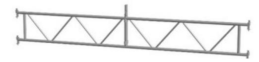

Figure 4 : poutre treillis

Question 9 En s'appuyant sur l'annexe 8 (1/4), citer trois compétences travaillées lors de cette activité. Relever dans l'annexe 8 (2/4 et 3/4), une connaissance et une compétence associée pouvant être abordées.

### PARTIE 3. DISTRIBUTION DE L'AIR DANS LE CORRIDOR ET LA SERRE

### 3.1. Détermination de la plage de variation des vitesses des ventilateurs

L'objectif est d'appréhender le principe de fonctionnement d'une serre semi-fermée et de déterminer la plage de variation des vitesses des ventilateurs pour satisfaire le taux de renouvellement d'air exigé.

L'implantation des constituants du système de traitement d'air équipant l'un des corridors des serres du Mas Blanc est décrite en annexe 4. Le diagramme partiel de définition des blocs est fourni en annexe 3. Le principe de fonctionnement de la serre semi-fermée en été puis en hiver est détaillé ci-dessous.

### Fonctionnement de la serre semi-fermée en été

Le châssis guillotine est descendu afin de laisser l'air circuler à travers le Cooling PAD. Le châssis basculant du corridor est en position fermée. L'air chaud extérieur est aspiré par les ventilateurs , refroidi par le Cooling PAD en le traversant, puis diffusé dans la serre par le système de distribution (ventilateurs et gaines perforées ). La maîtrise de la surpression est assurée par les châssis de surpression en toiture qui permettent d'évacuer l'air chaud.

### Fonctionnement de la serre semi-fermée en hiver

Le châssis guillotine est relevé afin d'obstruer le Cooling PAD. Le châssis basculant du corridor est en position ouverte, les châssis de surpression en position fermée. L'air froid de la serre est aspiré par les ventilateurs et réchauffé par les aérothermes avant d'être distribué dans la serre.

- Question 10 Tracer sur le document réponse DR1 la circulation de l'air dans le corridor et dans la serre par des flèches de couleur rouge (air chaud ou réchauffé) ou bleue (air froid ou refroidi) en été puis en hiver. Représenter la position du châssis basculant du corridor et celle du châssis de surpression.
- Question 11 Relever dans le diagramme partiel des exigences (annexe 2) la plage de variation du taux de renouvellement d'air dans la serre. Compte tenu du volume total de la serre (annexe 1), exprimer en m3·h-1 cette plage de variation.
- Question 12 Relever dans le diagramme partiel de définition des blocs (annexe 3) le nombre total de ventilateurs.

En été, pour atteindre le taux maximal de renouvellement d'air exigé, tous les ventilateurs sont en fonctionnement et délivrent le même débit d'air. En hiver, pour atteindre le taux minimal de renouvellement d'air exigé tout en réduisant la consommation énergétique électrique, seuls un tiers des ventilateurs sont en fonctionnement ; ils délivrent également tous le même débit d'air.

- Question 13 Déterminer la plage de variation du débit d'air des ventilateurs en fonctionnement.
- Question 14 Vérifier que ces valeurs sont compatibles avec le débit d'air maximal des gaines donné dans le diagramme partiel de définition des blocs en annexe 3.

Quels que soient les résultats obtenus précédemment, le débit d'air délivré par chaque ventilateur est supposé désormais varier de 8 100 m3·h-1 en hiver à 14 200 m3·h-1 en été.

Les performances des ventilateurs Zieh-Abegg type ZN 080 utilisés sont répertoriées sous forme de courbes caractéristiques dans la documentation des fabricants (DR2).

Le débit d'air qv en m3·h-1 délivré par un ventilateur est fonction de sa vitesse de rotation N en tr·min-1 et de la perte de charge rencontrée dans le circuit aéraulique appelée pression statique psF et exprimée en Pa (Pascal).

Le point de fonctionnement du ventilateur (psF, qv) est à l'intersection des courbes paramétrées par la vitesse de rotation N et de la parabole psF = f(qv) (perte de charge en fonction du débit) caractéristique du réseau aéraulique de l'installation étudiée. Cette dernière est ajoutée en traits pointillés sur les courbes caractéristiques données en DR2.

Question 15 Estimer par extrapolation, à partir des courbes caractéristiques de fonctionnement données, la plage de variation de la vitesse de rotation N des ventilateurs. Les constructions graphiques nécessaires à sa détermination seront effectuées sur le document réponse DR2.

### 3.2. Pilotage des machines électriques d'entraînement des ventilateurs

L'objectif est d'analyser la structure du modulateur d'énergie et de déterminer la plage de variation des fréquences d'alimentation des machines asynchrones triphasées en fonctionnement.

Quels que soient les résultats obtenus précédemment, la vitesse de rotation N des ventilateurs est supposée varier de 450 tr·min-1 (vitesse minimale en hiver) à 800 tr·min-1 (vitesse maximale en été) en régime établi.

Les ventilateurs sont entraînés directement par des machines asynchrones triphasées (MAS 3 ). La variation de vitesse est réalisée grâce à un modulateur d'énergie agissant par variation de fréquence. Sa structure interne est décrite sur la figure 5. Le réseau d'alimentation est le réseau électrique triphasé 3 x 400 V - 50 Hz. Le modulateur est constitué d'un pont redresseur triphasé à diodes PD3 associé à un filtre (L, C) et à un onduleur de tension triphasé commandé en modulation de largeur d'impulsions (MLI). L'inductance de lissage L est telle que le courant ired(t) est considéré quasi-constant.

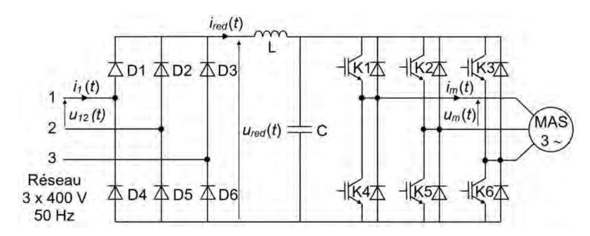

Figure 5 : structure interne du modulateur d'énergie

Les caractéristiques électriques et mécaniques des MAS choisies par le fabricant sont regroupées dans le tableau de la figure 6.

Figure 6 : caractéristiques des MAS avec modulateur d'énergie intégré

|                                 | Résea                        | u 3 x 400 V                                     | – 50 Hz                        |                      | 4 | Modulateur |
|---------------------------------|------------------------------|-------------------------------------------------|--------------------------------|----------------------|---|------------|
| Puissance nominale [ kW ] | Couple nominal [ N·m ] | Vitesse nominale [ tr·min -1 ] | Intensité nominale [ A ] | Facteur de puissance |   | d'énergie  |
| 1,6                             | 16                           | 950                                             | 3,9                            | 0,7                  | 5 | MAS        |

Une simulation numérique du modulateur d'énergie pour un fonctionnement du moteur au point nominal a conduit aux relevés fournis sur le document réponse DR3.

**Question 16** Identifier sur le document réponse DR3 les représentations temporelles et spectrales correspondant aux grandeurs électriques  $u_{12}(t)$ ,  $i_1(t)$ ,  $u_{red}(t)$ ,  $i_{red}(t)$ ,  $u_m(t)$  et  $i_m(t)$ .

**Question 17** Préciser l'intérêt de la commande MLI des tensions de sortie de l'onduleur sur les courants absorbés par la MAS.

### Notations adoptées

- fréquence des courants et tensions statoriques : f (en Hz) ;
- pulsation des courants et tensions statoriques :  $\omega = 2 \cdot \pi \cdot f$  (en rad·s-1);
- nombre de paires de pôles de la MAS : p :
- vitesse de synchronisme :  $\Omega_s = \frac{\omega}{\rho}$  (en rad·s-1) et  $N_s$  (en tr·min-1);
- vitesse de l'arbre de la MAS :  $\Omega$  (en rad·s-1) et N (en tr·min-1) ;
- glissement :  $g = \frac{\Omega_s \Omega}{\Omega_s} = \frac{N_s N}{N_s}$ ;
- couple sur l'arbre de la MAS : C (en N⋅m).

**Question 18** Déterminer le nombre de paires de pôles p des MAS en expliquant la démarche suivie. Calculer la valeur de la vitesse de synchronisme  $N_s$  pour f = 50 Hz.

Le réglage de la vitesse N des MAS est obtenu par action sur la fréquence d'alimentation f des courants et tensions statoriques au moyen d'onduleurs de tension triphasés travaillant à  $V/f = C^{\text{ste}}$  et commandés en MLI. Dans leur partie utile, les caractéristiques mécaniques C = f(N) (figure 7) de la MAS sont alors assimilées à des segments de droite, de même coefficient directeur, paramétrés par la fréquence f.

Figure 7 :
caractéristiques
mécaniques
C = f(N) des
MAS alimentées
à fréquence
variable

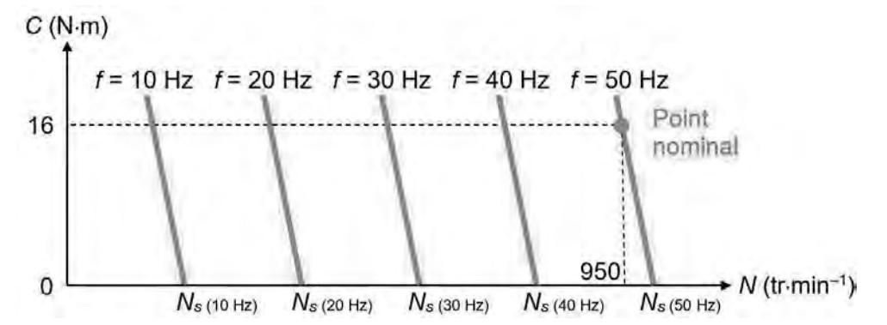

**Question 19** Montrer que  $C = 0.32 \cdot (N_s - N)$  dans la partie utile. En déduire l'expression du couple C en fonction de f, p et N.

Les ventilateurs opposent un couple résistant  $C_r$  (en N·m) proportionnel au carré de la vitesse N (en tr·min-1). Leur caractéristique mécanique  $C_r = f(N)$  peut être modélisée par :

$$C_r = 1,77 \cdot 10^{-5} \cdot N^2$$

- Question 20 Déterminer en régime établi la plage de variation de la fréquence f des courants et tensions statoriques des MAS entrainant les ventilateurs.
- Question 21 Synthétiser l'ensemble des résultats des parties 3.1 et 3.2 dans le tableau du document réponse DR4.

### 3.3. Communication entre l'ordinateur de supervision et les modulateurs d'énergie

L'objectif est de valider l'architecture réseau proposée pour le pilotage des modulateurs puis de décoder et d'interpréter les trames transmises sur le bus RS 485.

Les consignes de fréquence f d'alimentation des MAS sont transmises aux modulateurs d'énergie intégrés dans les ventilateurs par l'ordinateur de supervision via le réseau Ethernet puis une liaison série multipoints RS 485. Le synoptique partiel du réseau informatique de commande des 102 ventilateurs (51 ventilateurs par corridor) est décrit sur la figure 8. Les répéteurs permettent d'étendre la limite en termes d'équipement relative à la liaison série RS 485.

Figure 8 : synoptique partiel du réseau informatique de commande des ventilateurs

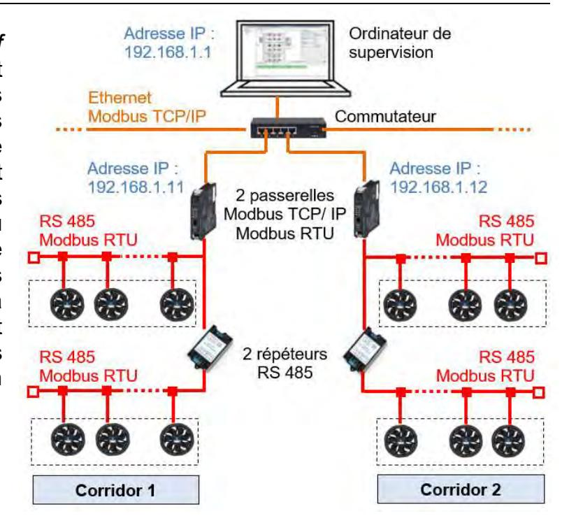

Le protocole Modbus RTU (Remote Terminal Unit) est un protocole de communication basé sur une structure hiérarchisée entre un maître et plusieurs esclaves. Une liaison série multipoints RS 485 relie maître et esclaves. Chaque passerelle joue le rôle de maître. Elle peut s'adresser individuellement aux modulateurs d'énergie considérés comme des esclaves numérotés ou leur envoyer un message de diffusion générale (annexe 5 (1/2)).

Ce protocole peut être implémenté sur une liaison série de type RS 232, RS 422 ou RS 485 avec des débits et des distances variables. Les caractéristiques principales de ces liaisons sont répertoriées dans le tableau de la figure 9.

Figure 9 : tableau comparatif des caractéristiques des liaisons série

|                                  | RS 232                   | RS 422                | RS 485                    |  |
|----------------------------------|--------------------------|-----------------------|---------------------------|--|
| Type d'interface                 | Mode commun              | Diffe                 | érentiel                  |  |
| Distance maximale                | 12 m                     | 1 2                   | 200 m                     |  |
| Dáhit mayimal                    | G4 khita ar1             | 10 Mbits⋅s-¹ sur 10 m |                           |  |
| Débit maximal                    | 64 kbits·s -1 | 100 kbits·s           | -1 sur 1 200 m |  |
| Multipoints                      | non                      | oui                   |                           |  |
| Conneyions électriques           | 3 fils                   | 5 fils                | 3 fils                    |  |
| Connexions électriques minimales | Rx,Tx                    | Paire Tx,             | Paire Tx / Rx             |  |
| minimales                        | masse                    | paire Rx, masse       | masse                     |  |
| Nombre d'émetteurs               | 1                        | 1                     | 32                        |  |
| Nombre de récepteurs             | 1                        | 10                    | 32                        |  |
| Niveaux de tension               | ± 3 V à ± 25 V           | ± 0,3 \               | V à ± 6 V                 |  |

Question 22 Justifier le choix de liaisons RS 485 parmi les liaisons proposées ainsi que la nécessité de répéteurs.

La trame Modbus RTU est constituée d'une suite de caractères hexadécimaux. Chaque trame contient quatre types d'informations (figure 10).

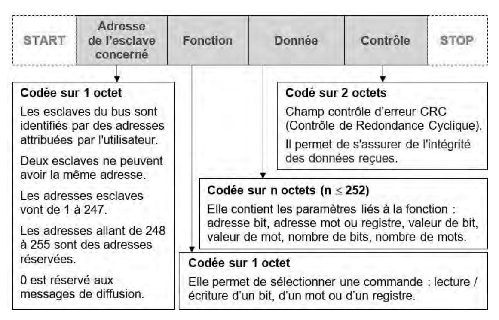

Figure 10 : structure d'une trame Modbus RTU

Avant et après chaque trame, il doit y avoir un temps de silence (START et STOP).

Afin de s'assurer de la qualité des échanges en situation réelle, le relevé d'une trame Modbus RTU est effectué sur la liaison série multipoints RS 485 de chaque corridor (figure 11).

Figure 11 : relevé d'une trame Modbus RTU

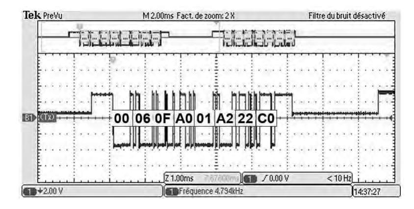

- Question 23 À l'aide de la documentation technique donnée en annexe 5 (1/2) et (2/2) et du tableau de la figure 10, analyser la trame émise par la passerelle en indiquant l'adresse de l'esclave, la fonction, la donnée et le CRC.
- Question 24 Sachant que le registre ModBus 4000 (0FA0 en hexadécimal) des modulateurs contient la consigne de fréquence f en Hz avec un facteur d'échelle 10 (la valeur réelle est donc la valeur du registre divisée par 10), interpréter ce message.
- Question 25 À partir de la description du fonctionnement de la serre et du tableau de synthèse du document réponse DR4, déduire le mode de fonctionnement en service (été ou hiver) lors de l'émission de ce message sur les liaisons séries multipoints RS 485. Justifier.

### 3.4. Architecture du réseau

L'objectif est de simuler en classe le fonctionnement du réseau de pilotage de la serre.

Plusieurs applications permettent de construire un réseau virtuel et de le tester. Les élèves du collège travaillent à partir de documents ressources élaborés par le professeur présentant l'architecture du réseau de la serre.

- Question 26 Lister les constituants matériels d'un réseau local (LAN) et proposer une activité s'inspirant de la serre semi-fermée permettant d'aborder la notion d'adressage IP à l'aide d'un logiciel de modélisation de réseau.
- Question 27 Proposer trois questions sous forme de QCM portant sur le réseau informatique (structure, fonctionnement ou usage).

Le professeur souhaite mettre en place un relevé des paramètres de la serre sur tablette à l'aide d'une application.

Question 28 En s'appuyant sur l'annexe 8 (2/4, 3/4 et 4/4), citer les attendus de fin de cycle 4 de technologie qui peuvent être développés dans ce contexte. À partir de l'annexe 8 (4/4), citer les connaissances travaillées en programmation.

### PARTIE 4. GESTION DE LA SURPRESSION DANS LA SERRE

L'objectif est de valider le choix de la motorisation des châssis de surpression.

Les châssis de surpression (annexe 4) fonctionnent comme des soupapes. Leur ouverture, pilotée par l'ordinateur climatique, permet de maintenir une surpression dans la serre comprise entre 15 et 25 Pa.

Sur le plan de niveau en annexe 1 (2/3) sont représentés par des rectangles noirs les 126 châssis de surpression et par des rectangles blancs, les 756 châssis de sécurité, non étudiés dans ce sujet. Tous les châssis de surpression sont situés sur le versant ouest de la toiture, le moins exposé aux vents, par sécurité.

La mise en position des châssis de surpression est réalisée au moyen de motoréducteurs à renvoi d'angle répartis dans les 6 zones de la serre (annexe 1 (2/3)). Chaque motoréducteur doit permettre d'ouvrir simultanément 21 châssis grâce à un système d'entraînement mécanique dont le schéma cinématique simplifié est donné en annexe 6 et dont les constituants sont définis sur les figures 12 et 13.

Un motoréducteur entraîne en rotation, par l'intermédiaire de 2 accouplements à chaîne, un axe tubulaire dénommé tube de commande. Ce dernier met en mouvement via un réducteur simple et un système pignon-crémaillère, 2 tubes « push-pull » (figure 12).

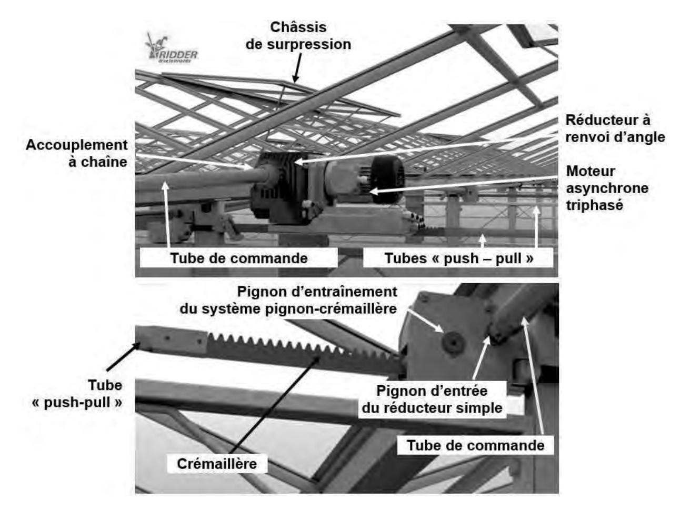

Figure 12 : vues du système d'entraînement mécanique des châssis

Ces 2 tubes « push – pull » sont entraînés en translation sur la partie supérieure des poutres treillis et sont reliés aux châssis de surpression de la serre par des bras pousseurs (figure 13). Les mouvements de translation des tubes « push - pull » sur les poutres permettent de régler l'ouverture des 21 châssis de surpression (respectivement 11 châssis pour le premier tube et 10 châssis pour le second tube).

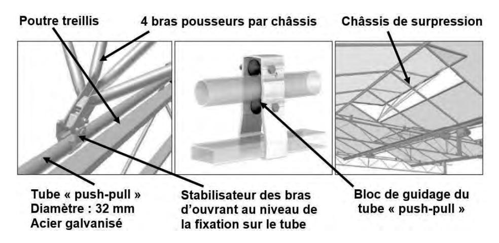

Figure 13 : vues du système d'entraînement mécanique des châssis

Question 29 Le système d'entraînement doit interdire toute ouverture ou fermeture intempestives des châssis. En utilisant l'annexe 7, nommer le constituant interne au motoréducteur qui permet de garantir ce critère. Expliciter la propriété utile.

L'étude se limite à la mise en position d'un seul châssis de surpression illustrée par le schéma cinématique simplifié paramétré figure 14.  $\vec{y}_1 \quad \vec{y}_0 \quad \vec{x}_2 \quad (3)$   $\vec{y}_2 \quad \vec{y}_1 \quad \vec{y}_0 \quad \vec{x}_2 \quad (2)$   $\vec{y}_2 \quad \vec{x}_3 \quad (2)$   $\vec{z}_0 \quad (1)$ 

Figure 14 : schéma cinématique simplifié du système d'entraînement mécanique d'un châssis

### Hypothèses

- le repère  $(O, \vec{x}_0, \vec{y}_0, \vec{z}_0)$  lié à la structure de la serre est considéré galiléen ;
- le repère  $R_2 = (A, \vec{x}_2, \vec{y}_2, \vec{z}_0)$  est rattaché au bras pousseur (2) ;
- le repère  $R_3 = (C, \vec{x}_3, \vec{y}_3, \vec{z}_0)$  est rattaché au châssis de surpression (3) ;
- l'équilibre du système peut être étudié dans le plan de symétrie  $(A, \vec{x}_0, \vec{y}_0)$ ;
- les liaisons pivot d'axe  $(A, \vec{z}_0)$ ,  $(B, \vec{z}_0)$  et  $(C, \vec{z}_0)$  et la liaison glissière de direction  $\vec{x}_0$  sont considérées comme parfaites ;
- le poids du bras pousseur (2) est négligé ;
- le poids du châssis (3) est noté  $\vec{P}_3 = m_3 \cdot \vec{g}$  et appliqué au point G ;
- la masse d'un châssis de surpression est notée m3 = 38 kg ;
- l'accélération de la pesanteur est notée q = 9,81 m⋅s-²;
- la vitesse du vent est négligée.

### Paramètres géométriques

$$\vec{AB} = L_2 \cdot \vec{x}_2$$
;  $\vec{CB} = L_3 \cdot \vec{x}_3$ ;  $\vec{CG} = \frac{L_3}{2} \cdot \vec{x}_3$ ;  $\vec{AO} = x(t) \cdot \vec{x}_0$ ;  $\vec{CO} = L \cdot \vec{x}_0 - H \cdot \vec{y}_0$   
avec  $L_2 = 1.9$  m;  $L_3 = 1.2$  m;  $H = 1.21$  m et  $L = 1.1$  m.

La validation de la motorisation s'effectue en déterminant la vitesse de rotation  $N_M$  de l'arbre de sortie du motoréducteur en régime établi ainsi que le couple maximal  $C_{M\,max}$  sur ce même arbre lors de l'ouverture complète des châssis. Il est nécessaire de calculer au préalable :

- la vitesse linéaire moyenne de déplacement  $V = \left|\dot{x}(t)\right|_{moy}$  du tube « push-pull » ;
- I'action mécanique exercée par le tube « push-pull » (1) sur le bras pousseur (2).

L'objectif est de déterminer les vitesses aux différents étages de la transmission.

La figure 15 représente les positions du tube « push-pull » (1) et du bras pousseur (2) lorsque le châssis (3) est en position ouverte maximale puis en position fermée. L'angle maximal d'ouverture est égal à  $2 \cdot \alpha_{max} = 46^{\circ}$ .

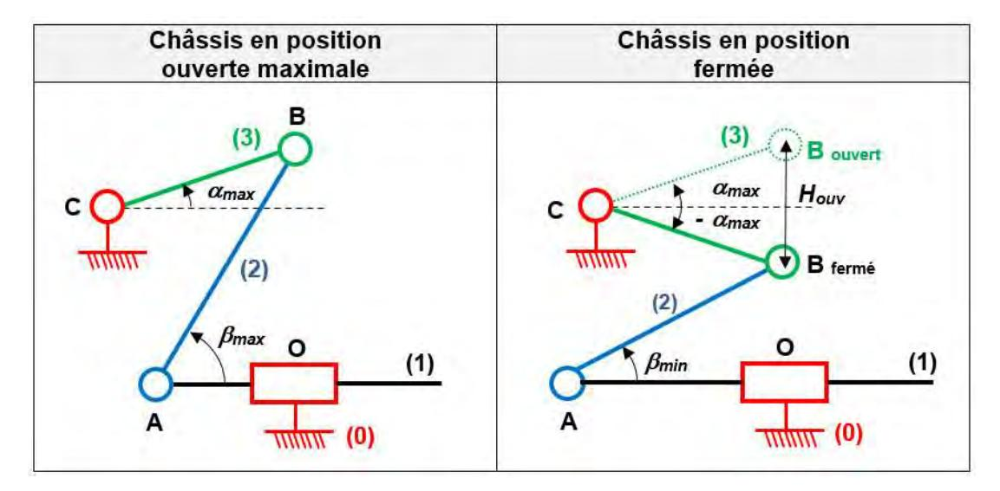

Figure 15 : schéma cinématique du positionnement des châssis

Question 30 Déterminer le sens de déplacement du tube « push-pull » (point A), afin d'ouvrir le châssis. Dans ces conditions, en déduire si le tube « push-pull » doit exercer un effort de poussée ou de tirage au point A.

**Question 31** Calculer, la hauteur maximale d'ouverture  $H_{ouv}$  définie sur la figure 15.

Une simulation numérique a permis de tracer la loi entrée-sortie géométrique  $\alpha = f(x)$  (figure 16).

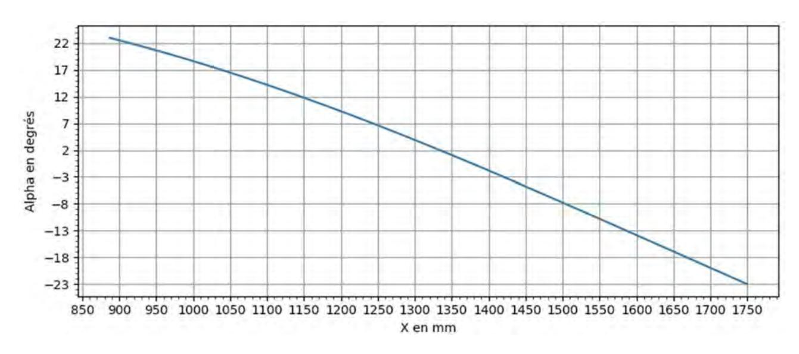

Figure 16 : courbe de la loi entrée-sortie géométrique  $\alpha$  = f(x)

Question 32 Déterminer la course maximale du tube « push-pull ». Sachant qu'une ouverture complète du châssis prend en moyenne 180 s, en déduire la vitesse linéaire moyenne de déplacement  $V = |\dot{x}(t)|_{moy}$  du tube « push-pull » en m·s-1.

Le mécanisme d'entraînement des tubes « push-pull » se décompose en un système de transformation de mouvement pignon-crémaillère et un réducteur à train simple (annexe 6 et figure 17).

Figure 17 : système pignoncrémaillère et réducteur à train simple

Pignon 1 (pignon relié à l'arbre de sortie du motoréducteur via le tube de commande)  $Z_1 = 17 \text{ dents}$ 

Espace pour le passage de la crémaillère (non représentée)

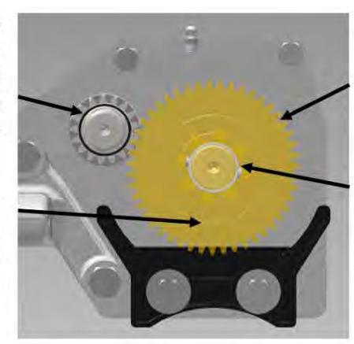

Pignon 2  $Z_2 = 47$  dents

Pignon 3 (pignon d'entraînement de la crémaillère)  $Z_3 = 8$  dents  $D_3 = 44$  mm

**Question 33** Calculer et compléter sur le document réponse DR5 les valeurs des vitesses  $(V, \omega_r, N_r, \omega_m, N_m)$  aux différents étages de transmission de puissance. Indiquer l'expression littérale de la vitesse angulaire  $\omega_r$  en rad·s-1 puis celles des vitesses de rotation  $N_r$  et  $N_m$  en tr·min-1, sur la copie.

### 4.2. Étude statique du système d'entraînement

L'objectif est de déterminer les couples aux différents étages de la transmission.

L'action mécanique exercée par le tube « push-pull » (1) sur le bras pousseur (2) en A est déterminée lors de l'ouverture du châssis de surpression (3). Le schéma cinématique simplifié sur lequel porte cette étude est donné figure 15.

Étant donné les très faibles accélérations des différents solides, les effets inertiels sont négligés, l'étude du positionnement du châssis se ramène alors à celle d'une succession d'équilibres statiques.

Les termes non nuls des torseurs des actions mécaniques exercées par le solide (i) sur le solide (j) modélisées au point K sous la forme générale, seront notés :

$$\left\{\tau_{i\to j}\right\} = \begin{cases} X_{ij} \cdot \vec{X}_{?} + Y_{ij} \cdot \vec{y}_{?} \\ N_{ij} \cdot \vec{z}_{0} \end{cases} \quad \text{ou} \quad \left\{\tau_{i\to j}\right\} = \begin{cases} X_{ij} & 0 \\ Y_{ij} & 0 \\ 0 & N_{ij} \end{cases}$$

L'action mécanique exercée par le bras pousseur (2) sur le châssis (3) est modélisée par un glisseur en B :

$$\left\{ \tau_{2 \to 3} \right\} = \left\{ \vec{B}_{2 \to 3} \atop \vec{0} \right\} = \left\{ \vec{X}_{23} \cdot \vec{X}_{2} \right\}$$

L'action mécanique exercée par le bâti (0) sur le châssis (3) est modélisée par un glisseur en C :

$$\left\{ \tau_{0\to 3} \right\} = \left\{ \vec{C}_{0\to 3} \atop \vec{0} \right\} = \left\{ X_{03} \cdot \vec{X}_0 + Y_{03} \cdot \vec{Y}_0 \atop \vec{0} \right\}$$

**Question 34** Le châssis (3) est isolé. Réaliser le bilan des actions mécaniques extérieures appliquées sur (3) sous forme de torseurs.

Question 35 En appliquant le théorème du moment statique au point C, montrer que :

$$X_{23} = \frac{m_3 \cdot g \cdot \cos(\alpha)}{2 \cdot \sin(\beta - \alpha)}$$

**Question 36** En déduire, à partir de l'isolement du bras pousseur (2), l'action mécanique  $\vec{A}_{1,2}$  exercée par le tube « push-pull » au point A.

La projection de l'action  $\vec{A}_{1\to 2}$  sur l'axe de translation  $\vec{X}_0$  du tube « push-pull » détermine la force de tirage  $F_T$  que doit fournir ce dernier pour ouvrir un châssis. Une simulation numérique a permis de tracer l'effort de tirage  $F_T$  exercé par le tube « push-pull » sur l'axe  $\vec{X}_0$  lors de l'ouverture d'un châssis de surpression. Le graphe est donné sur la figure 18.

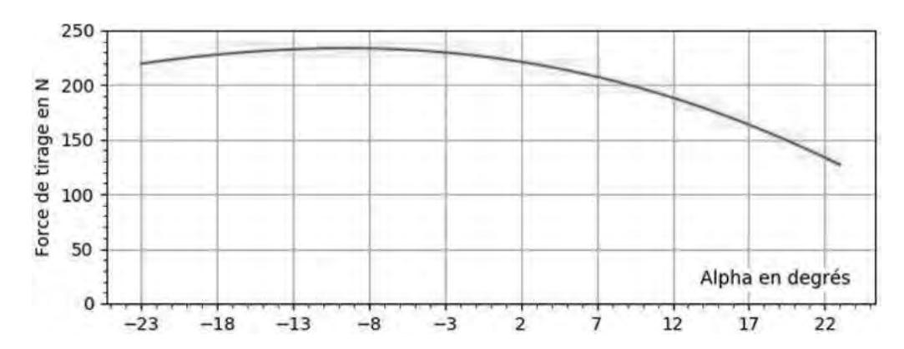

Figure 18 : courbe de l'effort de tirage en fonction de l'angle d'ouverture du châssis

**Question 37** Relever la valeur maximale de l'effort de tirage sur la figure 18, notée  $F_{Tmax}$ .

**Question 38** Étant donné le nombre de châssis de surpression manœuvrés par chaque tube « push-pull », en déduire les valeurs de l'effort maximal de tirage, exercé respectivement par les tubes 1 et 2, notées  $F_{1max}$  et  $F_{2max}$ . Reporter ces valeurs sur le document réponse DR5.

Les différents transmetteurs de puissance sont supposés parfaits (rendement unitaire).

**Question 39** Calculer et compléter sur le document réponse DR5 les valeurs des couples  $(C_{r1max}, C_{r2max}, C_{1max}, C_{2max}, C_{Mmax})$  aux différents étages de transmission de puissance. Détailler les calculs sur la copie.

Le constructeur a choisi le motoréducteur RW45-3 ; les caractéristiques sont détaillées en annexe 7.

Question 40 Valider ce choix en s'appuyant sur les résultats des études menées.

### 4.3. Commande de l'ouvrant dans la serre expérimentale connectée du collège

L'objectif est de choisir une solution pour actionner l'ouvrant de la serre expérimentale, par une démarche de résolution de problème.

Pour réaliser des expérimentations in situ, le collège fait l'acquisition d'une serre connectée à vocation expérimentale (figure 19) installée dans l'établissement.

Chaque classe participe à l'étude d'une problématique de technologie en relation avec la serre connectée.

La serre expérimentale du collège est ventilée à l'aide d'un ouvrant piloté en partie supérieure (figure 20).

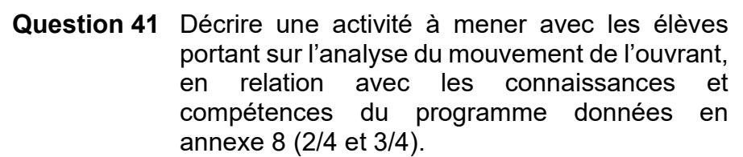

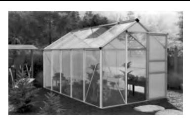

Figure 19 : serre expérimentale

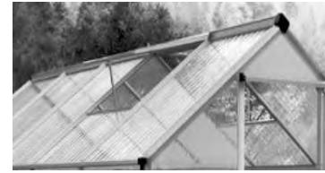

Figure 20 : ouvrant

Les élèves doivent imaginer des solutions pour mettre en mouvement l'ouvrant et en choisir une.

- Question 42 Décrire les différentes étapes permettant d'aboutir à la proposition d'une solution par une démarche de résolution de problème.
- Question 43 La salle de classe est équipée de deux maquettes de serres didactisées. Proposer un déroulé de la séance consacrée à la démarche de résolution de problème en présentant les phases de travail en classe entière, en ilot et en travail individuel.
- Question 44 Préciser les conditions matérielles nécessaires à la réalisation du prototype dans le laboratoire de technologie.

### 4.4. Asservissement en position des châssis de surpression

L'objectif est de proposer une programmation du capteur de position satisfaisant l'exigence de précision de positionnement angulaire des châssis de surpression.

Pour faciliter l'obtention d'un climat de serre optimal, les châssis de surpression sont asservis en position. Le schéma-bloc fonctionnel de l'asservissement en position est donné figure 21.

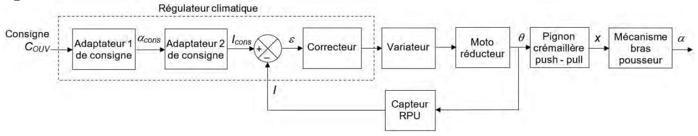

Figure 21 : schéma-bloc de l'asservissement en position des châssis de surpression

### Notations adoptées

COUV consigne d'ouverture des châssis de surpression exprimée en % générée à partir de plusieurs mesures (vitesse et direction du vent, débit d'air des ventilateurs et température intérieure de la serre) ;

position angulaire des châssis de surpression exprimée en degrés ;

cons consigne de position angulaire des châssis de surpression exprimée en degrés ;

écart défini par = Icons - I exprimé en mA ;

I intensité du courant délivrée par le capteur RPU (Ridder Positioning Unit) exprimée en mA ;

Icons consigne de courant exprimée en mA ;

x position de la crémaillère liée au tube « push-pull » manœuvrant les châssis de surpression exprimée en mètre ;

position angulaire de l'arbre de sortie du motoréducteur exprimée en degrés.

### Question 45 Préciser à partir du schéma-bloc la grandeur physique asservie.

La mesure de la position angulaire des châssis est effectuée au moyen d'un capteur RPU. Il s'agit d'un dispositif de mesure de position installé dans les motoréducteurs Ridder RW pourvus d'un système de fin de course RSU (Ridder limit Switch Unit). Ce système de fin de course (figure 22), composé d'une combinaison d'interrupteurs de service et de sécurité, permet de définir le débattement angulaire mécanique maximal des châssis de surpression (- 23° + 23°).

Figure 22 : vue éclatée du système de fin de course RSU pour moteur Ridder RW

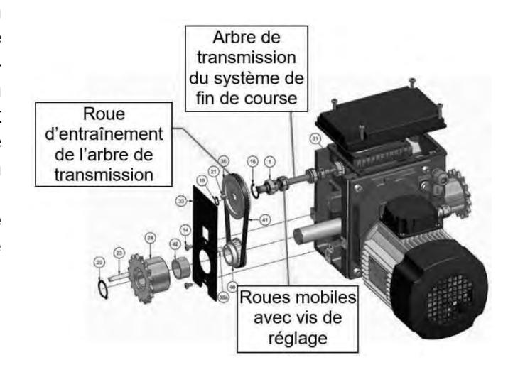

Le capteur RPU communique constamment la position des châssis au régulateur climatique à l'aide d'un signal 4 - 20 mA. Ce signal est généré par une sonde à effet Hall intégrée dans le capteur RPU et de l'axe magnétique qui se trouve au-dessus.

Cet axe magnétique (figure 23) est monté sur l'arbre de transmission du système de fin de course RSU (figure 23) et tourne sans contact avec la sonde.

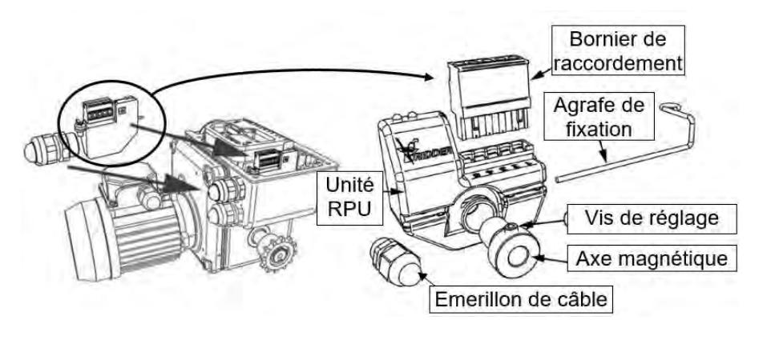

Figure 23 : constituants du capteur RPU

Le capteur RPU est facile à installer et à programmer lors de la mise en service. Le trajet à faire apprendre au capteur RPU (appelé trajet de mesurage) correspond normalement au débattement angulaire mécanique maximal des châssis de surpression.

Les positions finales mémorisées (SP1 et SP2) par le capteur RPU correspondent alors aux positions finales (ES11 et ES12) du système de fin de course RSU. Il est possible d'établir une position finale du trajet de mesurage (SP2' SP2) différente de celle du système de fin de course. Le trajet de mesurage (figure 24) est alors plus court que le débattement angulaire mécanique maximal des châssis de surpression.

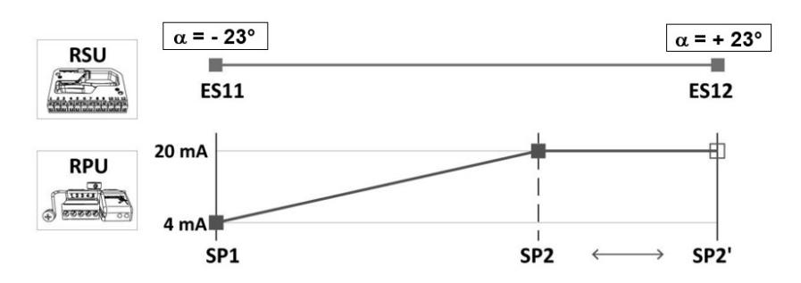

Figure 24 : trajet de mesurage du capteur RPU

Question 46 Justifier l'intérêt de travailler avec la plage 4 - 20 mA plutôt qu'avec la plage 0 - 20 mA.

Dans un premier temps, le technicien programme le capteur RPU avec SP1 = ES11 et SP2 = ES12.

Question 47 Tracer sur le document réponse DR6 l'évolution de l'intensité I du courant délivré par le capteur RPU en fonction de la position angulaire des châssis de surpression. En déduire l'expression de I en mA en fonction de en degrés.

Cette relation est implantée dans le bloc adaptateur de consigne 2 du régulateur climatique (figure 21) pour générer la consigne de courant Icons. Elle est également renseignée dans le modèle multiphysique donné figure 25.

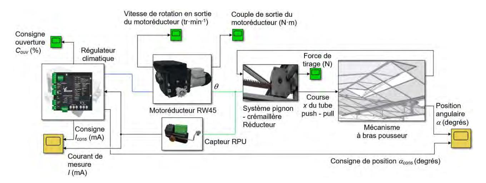

Figure 25 : modèle multiphysique pour l'asservissement en position des châssis

Des simulations ont été réalisées pour différentes valeurs de COUV (25 %, 50 %, 75 % et 100 %) ; elles conduisent aux résultats donnés figure 26.

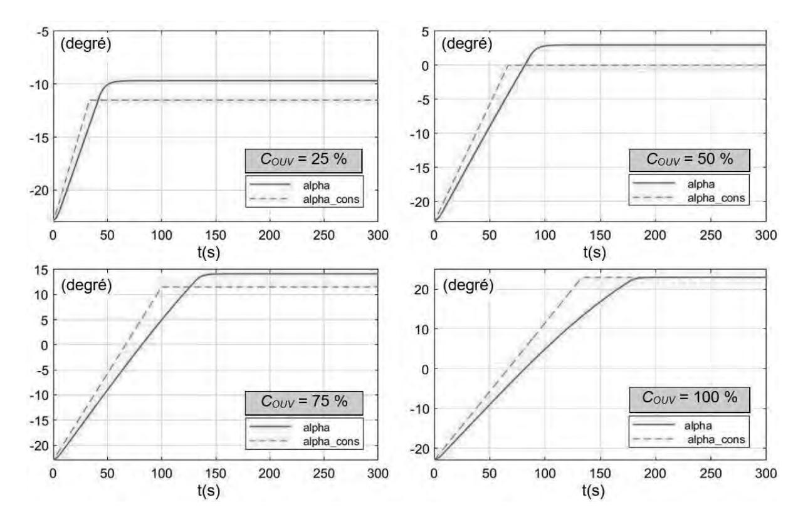

Figure 26 : évolutions de (alpha) et cons (alpha\_cons) pour différentes valeurs de COUV

Question 48 Évaluer l'erreur de positionnement angulaire des châssis de surpression définie par cons t lim (t ) (t ) puis compléter le tableau du document réponse DR7.

Le capteur RPU ne mesure pas directement la positon angulaire des châssis de surpression mais la position angulaire de l'arbre de sortie du motoréducteur (figures 21 et 25) et donc la position x du tube « push - pull » manœuvrant les châssis de surpression. La loi entrée - sortie géométrique = f(x) n'étant pas linéaire (figure 16), il en résulte des erreurs possibles au niveau du positionnement angulaire des châssis.

Le graphe suivant (figure 27) donne pour différentes valeurs de Icons les valeurs de cons et de en régime établi.

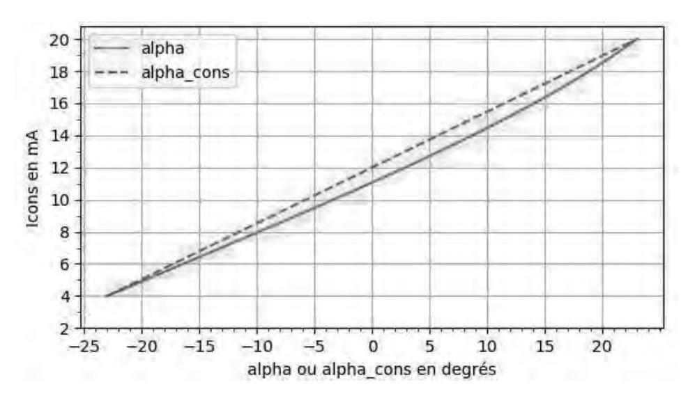

Figure 27 : valeurs de cons et de en régime établi pour différentes valeurs de Icons

Question 49 L'exigence Id = '60' (annexe 2) relative à la précision de positionnement angulaire des châssis de surpression est-elle satisfaite avec la programmation initiée par le technicien ? Justifier.

En fonctionnement normal, la consigne d'ouverture des châssis de surpression n'excède jamais 50 % (- 23° cons 0°).

Question 50 Proposer une programmation du capteur RPU permettant de satisfaire l'exigence Id = '60'. Tracer sur le document réponse DR8 la nouvelle évolution de Icons = f(cons). Hachurer la zone hors trajet de mesurage. Plusieurs réponses sont possibles.

### 4.5. Activités en classe sur la chaine d'information de la serre didactisée

L'objectif est d'identifier avec les élèves les constituants de la chaine d'information.

La problématique porte sur l'automatisation du pilotage de l'ouverture de l'ouvrant de la serre expérimentale connectée pendant les heures de fermeture du collège. Pour mettre en place des activités liées à l'identification et au traitement des signaux, l'équipement du laboratoire de technologie doit être complété.

Question 51 Proposer une liste de matériels permettant de prototyper une solution technique (flux d'information) pour un groupe de 24 élèves répartis en 6 ilots.

L'objectif de la séance est de différencier les modes de fonctionnement que permettent les capteurs proposés. Les serres didactisées de la classe sont équipées de capteurs de fin de course sur les ouvrants et d'un capteur de température.

Question 52 Décrire une activité pédagogique simple permettant de développer les notions de signaux logique et analogique.

### PARTIE 5. RAFRAÎCHIR ET HUMIDIFIER L'AIR DANS LA SERRE

L'objectif est de compléter le programme partiel de pilotage des électrovannes du système de refroidissement et d'humidification de l'air intérieur.

Afin de satisfaire les exigences Id = '10' et Id = '20' (annexe 2) relatives à la température et à l'hygrométrie à l'intérieur de la serre, des panneaux Cooling PAD, associés à des systèmes de ventilation mécanique, sont installés sur les façades nord et sud (longueur totale de PAD : 180 m) de la serre (annexe 1 (3/3)).

Le principe est celui d'un refroidissement adiabatique, efficace dans les climats chauds et secs. Il consiste à refroidir l'air extérieur en le faisant circuler à travers des panneaux (PAD) (figure 28) composés de feuilles en cellulose alvéolaire ondulées, collées et humidifiées en continu.

Au contact de l'eau, l'air se charge en humidité modifiant ainsi l'hygrométrie et la température dans la serre. Un système de pompage distribue l'eau dans les PAD. Une partie de l'eau s'évapore sous l'action des ventilateurs. L'eau restante est collectée dans une gouttière au bas du mur puis stockée dans des réservoirs avant d'être recyclée.

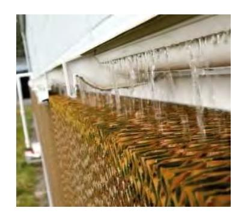

Figure 28 : panneaux de cellulose

Un système d'écrans en toiture et sur les façades intérieures permet aussi de faire baisser la température à l'intérieur de la serre. Ce dispositif n'est pas abordé dans ce sujet.

### 5.1. Fonctionnement du Cooling PAD

Afin d'humidifier le PAD, trois lignes de goutte à goutte (figure 29) sont disposées sur la partie supérieure du PAD. Celles-ci sont contrôlées indépendamment grâce à des électrovannes, ce qui permet de déclencher simultanément de 1 à 3 lignes. L'avantage de ce système réside notamment dans la capacité à moduler la teneur en eau du PAD, avec 3 seuils d'arrosage : 33 %, 66 % et 100 %, en fonction des conditions climatiques extérieures et intérieures.

Figure 29 : fonctionnement simplifié du Cooling PAD

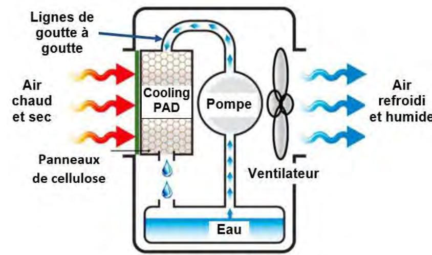

Question 53 Sur le diagramme partiel des blocs internes (ibd) donné sur le document réponse DR9, compléter les flux d'énergie et d'information manquants. Surligner le cheminement de l'eau en bleu et de l'air en vert.

### 5.2. Pilotage des électrovannes

Le diagramme de l'air humide (DAH) (figure 30) représente graphiquement les principales caractéristiques physiques et thermodynamiques de l'air humide à la pression atmosphérique normale (1013 hPa).

Le refroidissement par évaporation adiabatique se détermine en suivant le réseau de droites obliques (passage du point A au point B) appelées isenthalpes.

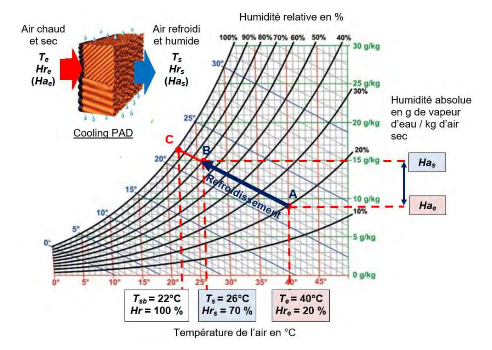

Figure 30 : diagramme de l'air humide (DAH)

### Notations adoptées

- Te température de l'air en entrée du PAD en °C ;
- Hre humidité relative de l'air en entrée du PAD en % ;
- Hae humidité absolue de l'air en entrée du PAD en g de vapeur d'eau par kg d'air sec ;
- Ts température de l'air en sortie du PAD en °C ;
- Tsb température la plus basse (point C) pouvant être obtenue en sortie du PAD par évaporation adiabatique de l'eau dans l'air jusqu'à saturation de l'air (Hr = 100 %), appelée aussi température de bulbe humide ;
- Hrs humidité relative de l'air en sortie du PAD en % ;
- Has humidité absolue de l'air en sortie du PAD en g de vapeur d'eau par kg d'air sec.

Dans l'exemple proposé sur le diagramme, l'air extérieur en entrée du PAD a une température Te = 40°C et une humidité relative Hre = 20 % (point A). Son humidité absolue est Hae = 9 g·kg-1.

Compte tenu de l'efficacité du PAD (c'est-à-dire son pouvoir de saturation) avoisinant 78 %, le refroidissement par évaporation conduit à une température de l'air Ts en sortie du PAD (point B) donnée par :

$$T_s = T_e - 0.78 \cdot (T_e - T_{sb}) = 40 - 0.78 \cdot (40 - 22) \approx 26^{\circ}C$$

Son humidité relative et son humidité absolue s'obtiennent par lecture du diagramme de l'air humide (DAH) : Hrs = 70 % et Has = 15 g·kg-1.

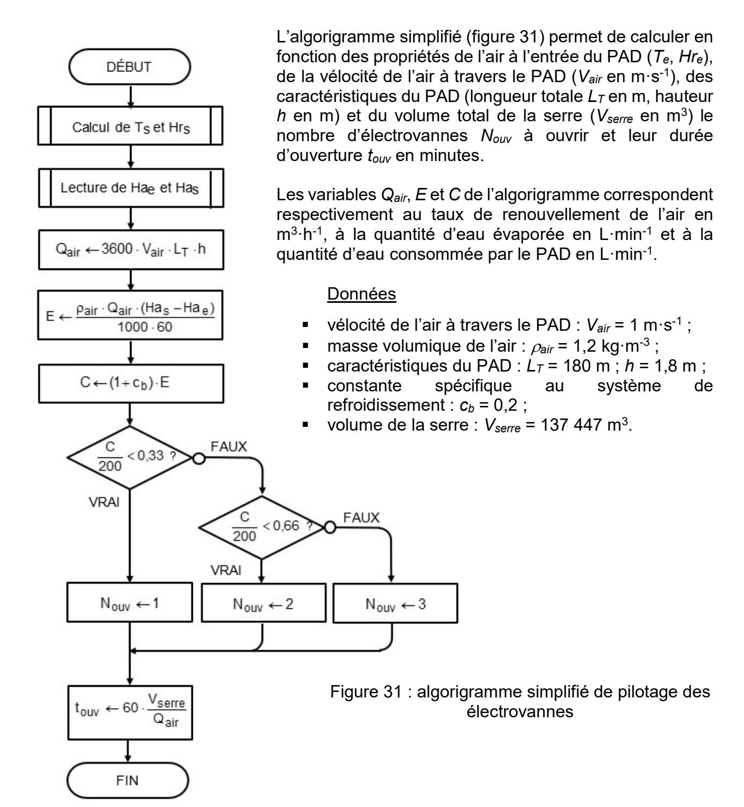

Question 54 Pour Te = 40°C et Hre = 20 %, déterminer à l'aide de l'algorigramme et du diagramme de l'air humide, les valeurs de Qair, E et C puis le nombre Nouv d'électrovannes à ouvrir et leur durée d'ouverture touv.

Question 55 En déduire la quantité d'eau totale consommée par le PAD dans ces conditions.

L'algorigramme précédent est traduit en Python et implémenté sous forme de fonction dans le programme principal de pilotage climatique de la serre. Cette fonction piloter\_EV prend en arguments la vélocité de l'air Vair (entre 0,5 et 1,2 m·s-1), la température Te et l'humidité relative Hre de l'air extérieur à l'entrée du PAD relevées par une sonde climatique.

Elle retourne le nombre Nouv d'électrovannes à ouvrir et leur durée d'ouverture touv. Elle est décrite sur le document réponse DR10. Les fonctions suivantes sont disponibles :

| Fonction                  | Description                                                                                                                    |
|---------------------------|--------------------------------------------------------------------------------------------------------------------------------|
| lire_Ha_DAH(T,Hr)         | Détermine sur le DAH l'humidité absolue en g de vapeur d'eau par kg d'air sec à une température T et une humidité relative Hr. |
|                           | <u>Entrées</u>                                                                                                                 |
|                           | <ul><li>T : float, température de l'air en °C</li><li>Hr : float, humidité relative de l'air en %</li></ul>                    |
|                           | Sortie                                                                                                                         |
|                           | - Ha : float, humidité absolue en g de vapeur d'eau par kg d'air sec                                                           |
| calcul_Ts_Hrs_PAD(Te,Hre) | Calcule la température et l'humidité relative de l'air en sortie du cooling PAD.                                               |
|                           | <u>Entrées</u>                                                                                                                 |
|                           | - Te : float, température de l'air en entrée du PAD en °C - Hre : float, humidité relative de l'air en entrée du PAD en %   |
|                           | Sorties                                                                                                                        |
|                           | - Ts : float, température de l'air en sortie du PAD en °C - Hrs : float, humidité relative de l'air en sortie du PAD en %   |

Figure 32 : bibliothèque de fonctions disponibles

- Question 56 Compléter sur le document réponse DR10 les lignes permettant de définir Hae et Has.
- Question 57 Compléter sur le document réponse DR10 la structure conditionnelle « if … elif …. else » traduisant les deux tests imbriqués de l'algorigramme.

### PARTIE 6. CONCLUSION

Le document réponse DR11 regroupe deux tableaux.

Le premier tableau donne le rendement des cultures par m3 d'eau apportée pour différentes conditions de croissance de la tomate en France.

Le second répertorie les résultats d'une enquête récente, réalisée par le centre technique interprofessionnel (CTIFL) de Balandran auprès de dix-huit serristes producteurs de tomates répartis entre les Bouches-du-Rhône et le Vaucluse. Compte tenu de l'ancienneté des serres analysées, trois cas types ont été définis en fonction de la superficie de serres semi-fermées au sein de l'exploitation.

### Question 58 Compléter les deux tableaux en calculant :

- l'efficience hydrique en litres d'eau apportée par kg de tomates produites ;
- les efficiences énergétiques en kW·h apporté par kg de tomates produites pour les trois cas étudiés ;
- les coûts totaux énergétiques en euros par kg de tomates produites pour les trois cas étudiés.

Question 59 Commenter les tableaux et conclure au regard de la problématique générale énoncée.

### Fin du questionnement.

### **Annexe 1 (1/3)**

### Caractéristiques dimensionnelles

| Zone             | Travées (m) | Quantité | Longueur (m) | Quantité | Largeur (m) | Surface (m²) |
|------------------|----------------|----------|-----------------|----------|----------------|-----------------|
| Serre 1          | 4,50           | 43       | 193,5           | 20       | 90,0           | 17415           |
| Serre 2          | 4,50           | 44       | 198,0           | 1        | 4,5            | 891             |
| Hall 1 technique | 4,50           | 5        | 22,5            | 3        | 13,5           | 304             |
| Hall 2 technique | 4,50           | 12       | 54,0            | 4        | 18,0           | 972             |

La **serre 2** de largeur 4,50 m et de longueur 198 m permet de stocker les équipements électromécaniques nécessaires (chariot de récolte sur rail, ...).

| Surface totale serre (m²) | 18 306  |
|---------------------------|---------|
| Volume total serre (m³)   | 137 447 |

| Hauteurs (m)                 |      |
|------------------------------|------|
| Hauteur sous chéneau         | 7,00 |
| Hauteur des poteaux rive     | 6,70 |
| Hauteur des poteaux centraux | 5,80 |
| Hauteur du faitage           | 7,96 |

### Vue en coupe façade sud

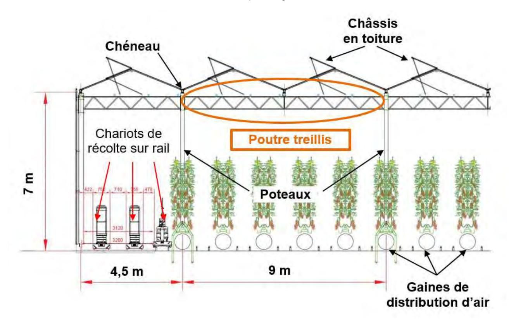

### Annexe 1 (2/3) : Plan de niveau

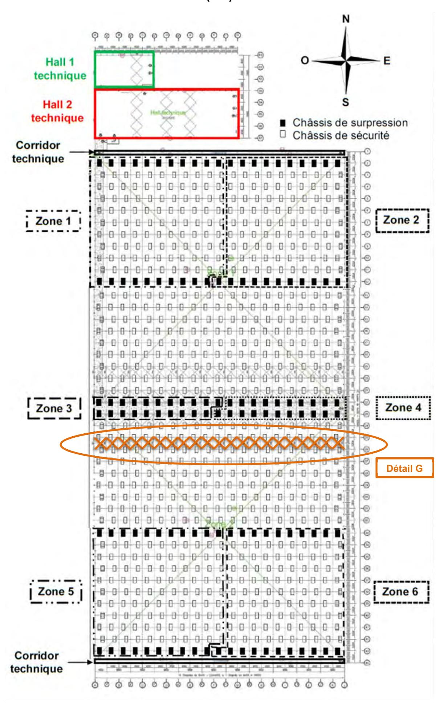

28 / 47

**Tournez la page S.V.P.**

Annexe 1 (3/3) : Élévations

Annexe 2 : Diagramme partiel des exigences

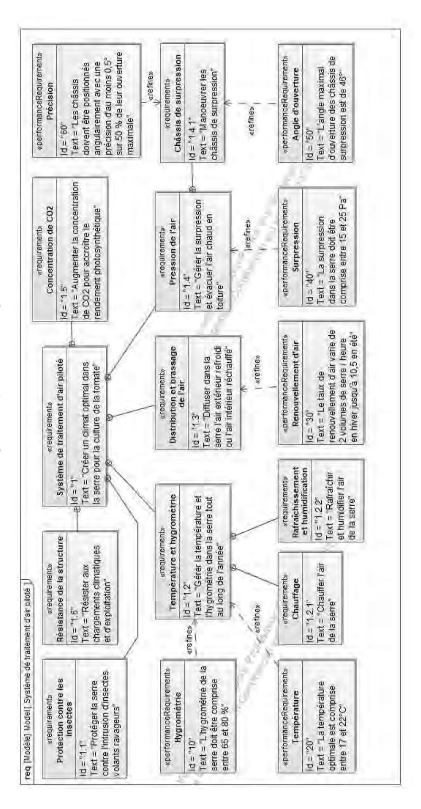

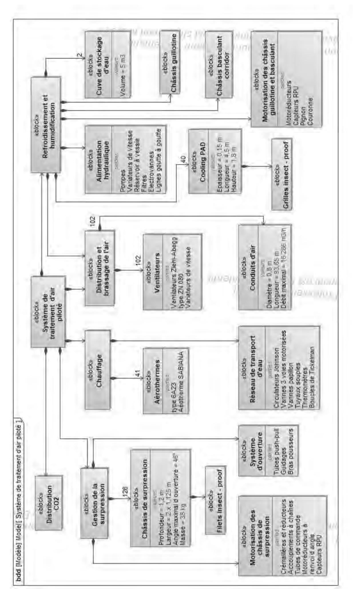

**Annexe 3** : Diagramme partiel de définition des blocs

**Tournez la page S.V.P.**

### Annexe 4

Constituants du système de traitement d'air piloté

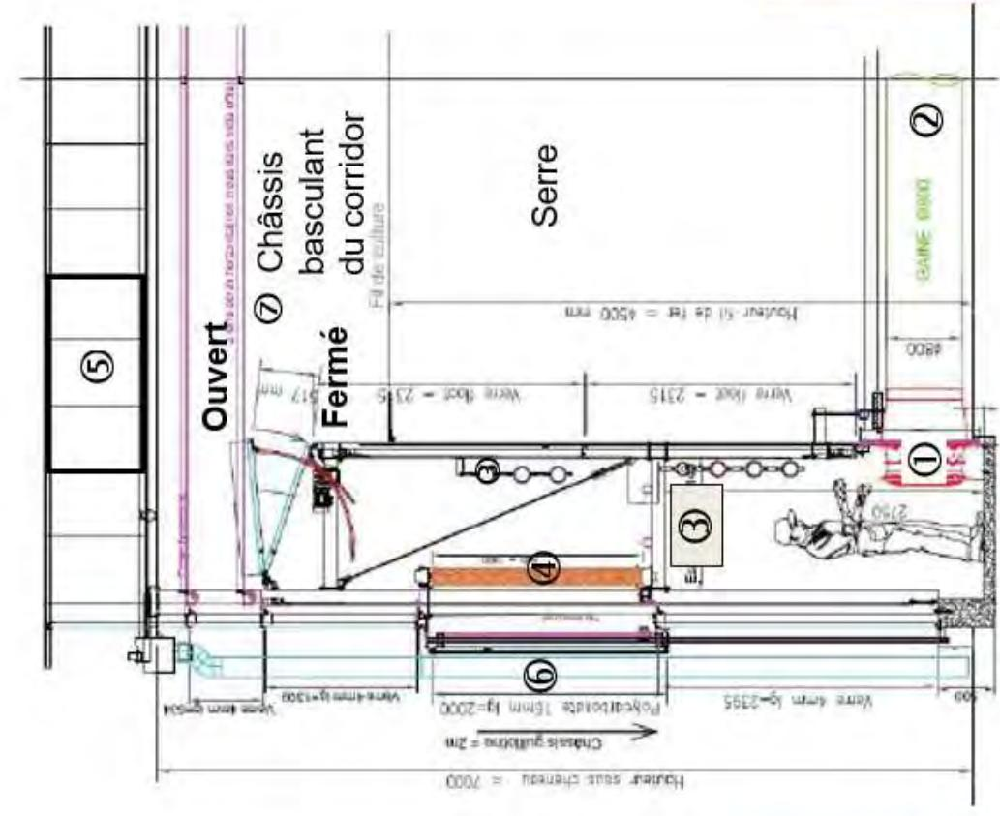

### **Annexe 5 (1/2)** : Protocole Modbus

Le protocole Modbus est un protocole maître / esclave :

- § il ne peut y avoir qu'un seul équipement en train d'émettre,
- § le maître gère les échanges et lui seul en a l'initiative,
- § aucun esclave ne peut de lui-même envoyer de message sans y avoir été invité,
- § les communications directes d'esclave à esclave ne sont pas possibles.

Deux types de dialogue sont possibles entre maître et esclaves :

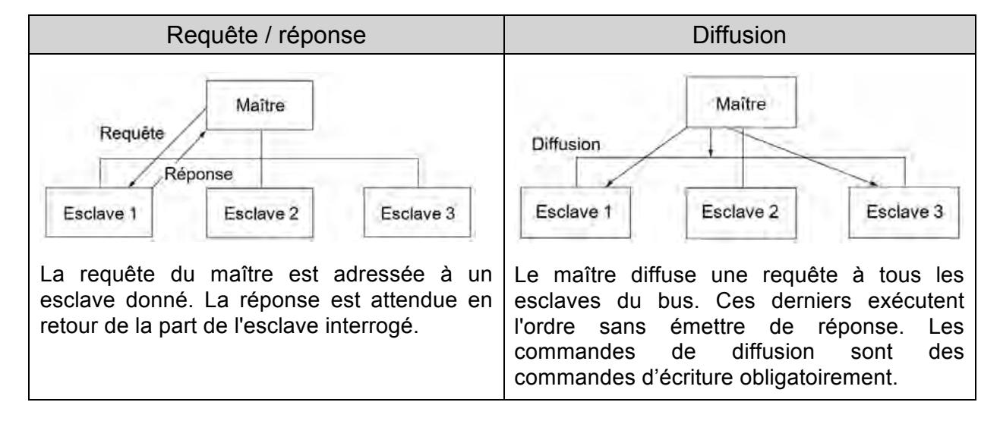

Le protocole Modbus offre de nombreuses fonctions. Elles se caractérisent par un code fonction sur un octet. Le tableau suivant indique des fonctions standard gérées par les modulateurs d'énergie intégrés dans les ventilateurs. La définition des fonctions « lecture » et « écriture » s'entend vue du maître.

| Code fonction (hexadécimal) | Nom des fonctions                       |
|-----------------------------|-----------------------------------------|
| 03                          | Lecture de N mots de sortie consécutifs |
| 06                          | Ecriture d'un mot de sortie             |
| 10                          | Ecriture de N mots de sortie            |

Ce protocole sécurisé est basé sur le calcul d'un CRC (Cyclical Redundancy Check) ou contrôle de redondance cyclique. Ce CRC calculé sur 16 bits fait partie intégrante du message et est vérifié par le destinataire. Il est calculé sur tous les octets de la trame à part lui-même.

### q **Lecture de N mots de sortie** : **fonction 3 (0316)**

Cette fonction permet de lire un ou plusieurs mots. La lecture s'effectue à partir de l'adresse du premier mot puis par incrément de 1 de l'adresse.

### § Requête du maître

| N°      | N°       | N° du pre | mier mot | Nombre | e de mots | CRC      |    |
|---------|----------|-----------|----------|--------|-----------|----------|----|
| esclave | fonction | PF        | Pf       | PF     | Pf        | PF       | Pf |
| 1 octet | 1 octet  | 2 00      | 2 octets |        | octets    | 2 octets |    |

On note PF = Poids Forts et Pf = Poids faibles. Les valeurs sont exprimées en hexadécimal.

### Annexe 5 (2/2) : Protocole Modbus

### Réponse de l'esclave

| N° esclave | N° fonction |         | premi | leur er mot | Mots     | derni | eur er mot | C    | RC    |
|---------------|----------------|---------|-------|----------------|----------|-------|---------------|------|-------|
| -             |                | lus     | PF    | Pf             | suivants | PF    | Pf            | PF   | Pf    |
| 1 octet       | 1 octet        | 1 octet | 20    | ctets          |          | 2 00  | ctets         | 2 00 | ctets |

- Exemple : lecture de la valeur du registre 4000 (0FA016) de l'esclave 4 (0416).
- Requête du maître :

| 04 | 03 | 0F A0 | 00 01 | CRC |
|----|----|-------|-------|-----|
|    |    |       |       |     |

Réponse de l'esclave : la valeur contenue dans le registre 4000 est 600 (025816).

| 04 | 03 | 02 | 02 58 | CRC |
|----|----|----|-------|-----|
|----|----|----|-------|-----|

- Écriture d'un mot de sortie : fonction 6 (0616)
- Requête et réponse : le format des trames dans ce cas est identique.

| N°      | N° N°    |     | N° du mot |      | Valeur du mot |     | CRC   |  |
|---------|----------|-----|-----------|------|---------------|-----|-------|--|
| esclave | fonction | PF  | Pf        | PF   | Pf            | PF  | Pf    |  |
| 1 octet | 1 octet  | 200 | ctets     | 2 00 | tets          | 200 | ctets |  |

- Exemple : écriture de la valeur 500 (01F416) dans le registre 4000 de l'esclave 5 (0516).
- Requête du maître et réponse de l'esclave :

| 05 | 06 | 0F A0   | 01 F4 | CRC   |
|----|----|---------|-------|-------|
|    |    | 21 7.10 |       | W11.W |

### Écriture de N mots de sortie : fonction 16 (1016)

Cette fonction permet d'écrire un ou plusieurs mots.

L'écriture s'effectue à partir de l'adresse du premier mot puis par incrément de 1 de l'adresse.

### Requête du maître

| N° esclave | N° fonction | prei | du nier ot |      |      | Nombre d'octets | pre | ur du mier ot | Mots suivants | CRC  |      |  |
|---------------|----------------|------|------------------|------|------|--------------------|-----|---------------------|------------------|------|------|--|
|               |                | PF   | Pf               | PF   | Pf   |                    | PF  | Pf                  |                  | PF   | Pf   |  |
| 1 octet       | 1 octet        | 200  | tets             | 2 00 | tets | 1 octet            | 20  | ctets               |                  | 2 00 | tets |  |

### Réponse de l'esclave

| N°      | N°       | N° du pre | emier mot | Nombre | de mots | CRC      |  |  |  |
|---------|----------|-----------|-----------|--------|---------|----------|--|--|--|
| esclave | fonction | PF        | Pf        | PF     | Pf      | PF Pf    |  |  |  |
| 1 octet | 1 octet  | 20        | ctets     | 2 00   | ctets   | 2 octets |  |  |  |

34 / 47

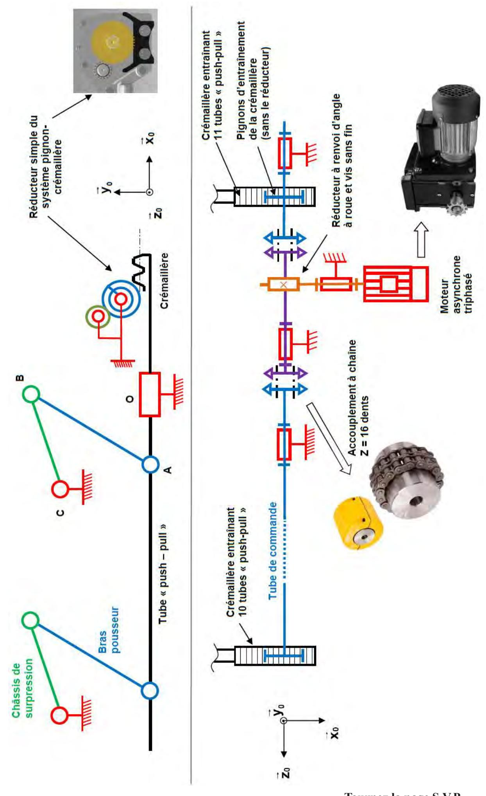

Annexe 6 : Schéma cinématique simplifié du système d'ouverture-fermeture des châssis de surpression

**Tournez la page S.V.P.**

### Annexe 7 : Motoréducteur RW45

Les motoréducteurs RW45 sont des systèmes compacts, sans maintenance, pour l'entraînement de systèmes de ventilation et de stores dans des serres ou des étables. Ils peuvent travailler à des températures ambiantes comprises entre 0°C et 60°C.

Tous les motoréducteurs RW45 sont réalisés avec un set de vis sans fin autobloquant. Cette transmission assure le freinage de l'arbre d'entraînement quand l'entraînement est arrêté. La combinaison de transmissions à pignons et à denture hélicoïdale assorties produit une transmission mécanique très silencieuse.

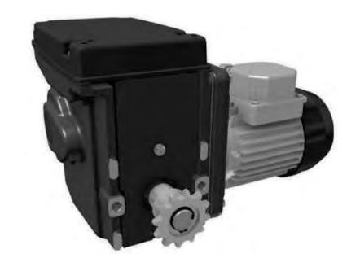

Les motoréducteurs RW45 sont équipés d'un système de fin de course linéaire intégré breveté comportant des interrupteurs de fonctionnement et des disjoncteurs de protection à excellente précision de commutation. L'amplitude maximale de commutation du système de fin de course est de 97 révolutions de l'arbre d'entraînement. Avec l'utilisation optionnelle de l'unité de positionnement RPU, il est possible de signaler de manière précise à un ordinateur (climatique) les positions d'un système d'entraînement. Le signalement de position est également possible en utilisant un set intégré avec potentiomètre.

### Motoréducteurs RW45 - 3 :

- moteurs électriques asynchrones triphasés 3 x 400 V 50 Hz,
- moteurs électriques de série tropicalisés et exécutés selon la classe de protection IP55,
- couple moteur jusqu'à 120 Nm pour une fréquence réseau de 50 Hz,
- vitesse de 6 tr/min à 50 Hz,
- adaptés à un usage discontinu, classe d'utilisation S3 35 %, période d'engagement max. 25 min,
- équipés de roues à chaîne galvanisées 1/2" x 5/16" à 12 dents pour accouplements à chaîne,
- option pour des roues à chaîne 16 dents 1/2" x 5/16" pour compenser des différences d'angle importantes (jusqu'à 6º).

## Domaine 4 / les systèmes naturels et les systèmes techniques Domaine 17 les langages pour penser et communiquer Domaine 3 / la formation de la personne et du citoyen Domaine 2 / les méthodes et outils pour apprendre CYCLE 4 : DOMAINES DU SOCLE

# CYCLE 4: TECHNOLOGIE: COMPÉTENCES TRAVAILLÉES

Domaine 5 / les représentations du monde et l'activité humaine

# Pratiquer des démarches scientifiques et technologiques

- Imaginer, synthétiser, formaliser et respecter une procédure, un
- Mesurer des arandeurs de manière directe ou indirecte
- Rechercher des solutions techniques à un problème posé, expliciter ses choix et les communiquer en arquimentant.
  - Participer à l'organisation et au déroulement de projets Domaine du socle 4

## Concevoir, créer, réaliser

- Identifier un besoin et énoncer un problème technique, identifier les conditions, contraintes (normes et règlements) et ressources correspondantes
- Identifier le(s) matériau(x), les flux d'énergie et d'information dans le cadre d'une production technique sur un objet et décrire les transformations qui s'opèrent
  - S'approprier un cahier des charges
- Associer des solutions techniques à des fonctions
  - Imaginer des solutions en réponse au besoin.
- Réaliser, de manière collaborative, le prototype de tout ou partie d'un objet pour valider une solution
- Imaginer, concevoir et programmer des applications informatiques pour des appareils nomades.

## Domaine du socle 4

# S'approprier des outils et des méthodes

- Exprimer sa pensée à l'aide d'outils de description adaptés : croquis, schémas. graphes, diagrammes, tableaux (représentations non normées)
- Traduire, à l'aide d'outils de représentation numérique, des choix de solutions sous forme de croquis, de dessins ou de schémas
- Présenter à l'oral et à l'aide de supports numériques multimédia des solutions techniques au moment des revues de projet

## Domaine du socle : 2

- Décrire, en utilisant les outils et langages de descriptions adaptés, la structure et le comportement des objets. Pratiquer des langages
  - Appliquer les principes élémentaires de l'algorithmique et du codage à la résolution d'un problème simple

### Domaine du socle : 1

# Mobiliser des outils numeriques

- Simuler numériquement la structure et/ou le comportement d'un objet Organiser, structurer et stocker des ressources numériques.
- Lire, utiliser et produire des représentations numériques d'objets. Piloter un système connecté localement ou à distance
- Modifier ou paramètrer le fonctionnement d'un objet communicant. Domaine du socle : 2

# Adopter un comportement éthique et responsable

- Développer les bonnes pratiques de l'usage des obiets communicants.
  - Analyser l'impact environnemental d'un objet et de ses constituants.

### Analyser le cycle de vie d'un objet Domaine du socle : 3, 5

# Se situer dans l'espace et dans le temps

- Regrouper des obiets en familles et lignées
- Relier les évolutions technologiques aux inventions et innovations qui marquent des ruptures dans les solutions techniques.

## Domaine du socle : 5

# Annexe 8:Document ressource technologie - programme 2016 - cycle 4 - extrait (2/4)

# Design, innovation et creativite

l'élève participe activement, dans une pratique créative et réfléchie, au déroulement de projets techniques, en intégrant une dimension design, dont l'objectif est d'améliorer des solutions technologiques réalisant une fonction ou de rechercher des solutions à une nouvelle fonction. Dans cette thématique, la démarche de projet est privilégiée et une attention particulière est apportée au développement des compétences liées à la réalisation de prototypes

# Attendus de fin de cycle

Imaginer des solutions en réponse aux besoins, matérialiser des idées en intégrant

|                                | Imaginer des solutions en réponse aux besoins, matérialiser une idée en | Imaginer des solutions en réponse aux besoins, matérialiser une idée en intégrant une dimension design | réaliser, de manière collaborative, le prototype d'un objet communicant.      Exemples de situations, d'activités Connaissances et compétences associées et de ressources pour l'élève. |
|--------------------------------|-------------------------------------------------------------------------|-----------------------------------------------------------------------------------------------------------|-----------------------------------------------------------------------------------------------------------------------------------------------------------------------------------------|
| integrant une dimension design |                                                                         |                                                                                                           |                                                                                                                                                                                         |

conditions, contraintes (normes et règlements) et et énoncer un problème technique ; identifier les quantifier simplement les performances d'un ressources correspondantes, qualifier et objet technique existant ou à créer.

- Besoin, contraintes, normalisation.
   Principaux éléments d'un cahier des
  - charges

Imaginer, synthétiser et formaliser une procédure, un protocole

Participer à l'organisation de projets, la définition des rôles, la planification (se projeter et anticiper) Outils numériques de présentation. Charte graphique.

- des participants, planning, revue de projets. Imaginer des solutions pour produire des objets et des élèments de programmes informatiques → Organisation d'un groupe de projet, rôle et aux revues de projet. en réponse au besoin
- Design.
- Innovation et créativité. · Veille
- Représentation de solutions (croquis, schémas, algorithmes)
  - Réalité augmentée.
- Objets connectes

Organiser, structurer et stocker des ressources - Arborescence. numériques.

leur environnement et du besoin auquel ils répondent. Formalisation ou analyse d'un cahier objet technique ou pour imaginer un nouvel objet technique répondant à un besoin nouveau ou en évolution. des charges pour faire évoluer un

répartition des rôles, revue de projet, présentation des résultats. Organisation d'un groupe de projet

(CAO, Web, bases de connaissances, travail spécialisés dans la production Environnements numériques de etc.)

Applications numériques de gestion de projet (planification, tâches, etc.). Progiciels de présentation.

numériques multimédia des solutions techniques Outils numériques de présentation. Présenter à l'oral et à l'aide de supports au moment des revues de projet

Charte graphique.

Réaliser, de manière collaborative, le prototype d'un objet communicant

répartition des rôles, revue de projet, Organisation d'un groupe de projet : présentation des résultats. Réaliser, de manière collaborative, le prototype

circuits de commande à partir de cartes Prototypage rapide de structures et de

standard.

d'un objet pour valider une solution

rapide de la chaine d'information. Microcontrôleurs et prototypage FabLab: impression3D et prototypage rapide.

mais de façon progressive et modeste sur des projets simples. Des projets complets Repères de progressivité  $S'agissant des activités de projet, la conception doit être introduite dès la classe de <math>5^{\pm m_e}$ . conception, realisation, validation) sont attendus en classe de 3 eme

Les projets à caractère pluri-technologique seront principalement conduits en 3ème

# Annexe 8 : Document ressource technologie - programme 2016 - cycle 4 - extrait (3/4)

|                                                                           | Les élèves doivent être sensibilisés à l'adéquation entre les grandeurs à mesurer et les instruments de mesure.                              | descriptions adaptés, le fonctionnement, la structure et le comportement des objets.  Outils de description d'un fonctionnement, d'une structure et d'un comportement.                                                                                                                                                                                                                                                                                                                                                                                                                                                                                                                                                                                                                                                                                                                                                                                                                                                                                                                                                                                                                                                                                                                                                                                                                                                                                                                                                                                                                                                                                                                                                                                                                                                                                                                                                                                                                                                                                                                                                         |
|---------------------------------------------------------------------------|-------------------------------------------------------------------------------------------------------------------------------------------------------|--------------------------------------------------------------------------------------------------------------------------------------------------------------------------------------------------------------------------------------------------------------------------------------------------------------------------------------------------------------------------------------------------------------------------------------------------------------------------------------------------------------------------------------------------------------------------------------------------------------------------------------------------------------------------------------------------------------------------------------------------------------------------------------------------------------------------------------------------------------------------------------------------------------------------------------------------------------------------------------------------------------------------------------------------------------------------------------------------------------------------------------------------------------------------------------------------------------------------------------------------------------------------------------------------------------------------------------------------------------------------------------------------------------------------------------------------------------------------------------------------------------------------------------------------------------------------------------------------------------------------------------------------------------------------------------------------------------------------------------------------------------------------------------------------------------------------------------------------------------------------------------------------------------------------------------------------------------------------------------------------------------------------------------------------------------------------------------------------------------------------------|
| résultats.                                                                | de leur obtention.                                                                                                                                    | <ul> <li>Chaîne d'information.</li> <li>Décrire, en utilisant les outils et langages de</li> </ul>                                                                                                                                                                                                                                                                                                                                                                                                                                                                                                                                                                                                                                                                                                                                                                                                                                                                                                                                                                                                                                                                                                                                                                                                                                                                                                                                                                                                                                                                                                                                                                                                                                                                                                                                                                                                                                                                                                                                                                                                                             |
| de comporteme interpréter les r deux paramètre                      | Une réflexion doit être menèe entre les résultats de mesure et le contexte                                                                         | Sources d'énergies.                                                                                                                                                                                                                                                                                                                                                                                                                                                                                                                                                                                                                                                                                                                                                                                                                                                                                                                                                                                                                                                                                                                                                                                                                                                                                                                                                                                                                                                                                                                                                                                                                                                                                                                                                                                                                                                                                                                                                                                                                                                                                                            |
| techniques conr puis les modèle En fin de cycle, l                  | Diagrammes, graphes. Logiciels de CAO.                                                                                                             | ransformation sur un biger et decrire les ransformations qui s'opèrent.  Y Familles de matériaux avec leurs  principales de aracrégiques                                                                                                                                                                                                                                                                                                                                                                                                                                                                                                                                                                                                                                                                                                                                                                                                                                                                                                                                                                                                                                                                                                                                                                                                                                                                                                                                                                                                                                                                                                                                                                                                                                                                                                                                                                                                                                                                                                                                                                                    |
| Dans un premi                                                             | repèrès et analysès.                                                                                                                                  | dentifier le(s) matériau(x), les flux d'énergie et                                                                                                                                                                                                                                                                                                                                                                                                                                                                                                                                                                                                                                                                                                                                                                                                                                                                                                                                                                                                                                                                                                                                                                                                                                                                                                                                                                                                                                                                                                                                                                                                                                                                                                                                                                                                                                                                                                                                                                                                                                                                             |
| vue de valider d aspects. Il ne s modèles voire                     | Les matériaux utilisés sont justifiés et les flux d'énergie et d'information sont                                                                  | Chaîne d'energie.                                                                                                                                                                                                                                                                                                                                                                                                                                                                                                                                                                                                                                                                                                                                                                                                                                                                                                                                                                                                                                                                                                                                                                                                                                                                                                                                                                                                                                                                                                                                                                                                                                                                                                                                                                                                                                                                                                                                                                                                                                                                                                              |
| Repères de pro                                                            | démontage permettent de comprendre l'architecture et le fonctionnement d'un objet technique.                                                          | Analyser le fonctionnement et la structure d'un objet, identifier les entrêes et sorties.  — Représentation fonctionnelle des systèmes.  — Structure des systèmes.                                                                                                                                                                                                                                                                                                                                                                                                                                                                                                                                                                                                                                                                                                                                                                                                                                                                                                                                                                                                                                                                                                                                                                                                                                                                                                                                                                                                                                                                                                                                                                                                                                                                                                                                                                                                                                                                                                                                                          |
| comportement communiquer e                                             | charges.                                                                                                                                              | Associer des solutions techniques à des onctions.                                                                                                                                                                                                                                                                                                                                                                                                                                                                                                                                                                                                                                                                                                                                                                                                                                                                                                                                                                                                                                                                                                                                                                                                                                                                                                                                                                                                                                                                                                                                                                                                                                                                                                                                                                                                                                                                                                                                                                                                                                                                              |
| Prouver.  Outils de d'une stru Simuler numéric comportement comportement. | Les activités expérimentales ont pour objectif de vérifier les performances d'un objet technique et de vérifier qu'elles sont conformes au cahier des | Respecter une procédure de travail garantissant un résultat en respectant les régles de sécurité et d'utilisation des outils mis à disposition.  Procédures, protocoles.                                                                                                                                                                                                                                                                                                                                                                                                                                                                                                                                                                                                                                                                                                                                                                                                                                                                                                                                                                                                                                                                                                                                                                                                                                                                                                                                                                                                                                                                                                                                                                                                                                                                                                                                                                                                                                                                                                                                                       |
| formaliser, part                                                          | la structure d'un objet                                                                                                                               | Analyser le fonctionnement et la structure d'un objet                                                                                                                                                                                                                                                                                                                                                                                                                                                                                                                                                                                                                                                                                                                                                                                                                                                                                                                                                                                                                                                                                                                                                                                                                                                                                                                                                                                                                                                                                                                                                                                                                                                                                                                                                                                                                                                                                                                                                                                                                                                                          |
| Utiliser une mod                                                          | Exemples de situations, d'activités et de ressources pour l'élève                                                                                     | Connaissances et compétences associées                                                                                                                                                                                                                                                                                                                                                                                                                                                                                                                                                                                                                                                                                                                                                                                                                                                                                                                                                                                                                                                                                                                                                                                                                                                                                                                                                                                                                                                                                                                                                                                                                                                                                                                                                                                                                                                                                                                                                                                                                                                                                         |
| par le cah l'expérime                                                  | un objet. ortement d'un objet.                                                                                                                     | <ul> <li>Analyser le fonctionnement et la structure d'un objet.</li> <li>Utiliser une modélisation et simuler le comportement d'un objet.</li> </ul>                                                                                                                                                                                                                                                                                                                                                                                                                                                                                                                                                                                                                                                                                                                                                                                                                                                                                                                                                                                                                                                                                                                                                                                                                                                                                                                                                                                                                                                                                                                                                                                                                                                                                                                                                                                                                                                                                                                                                                           |
| argumentant.                                                              |                                                                                                                                                       | Attendus de fin de cycle                                                                                                                                                                                                                                                                                                                                                                                                                                                                                                                                                                                                                                                                                                                                                                                                                                                                                                                                                                                                                                                                                                                                                                                                                                                                                                                                                                                                                                                                                                                                                                                                                                                                                                                                                                                                                                                                                                                                                                                                                                                                                                       |
| analogique d'u analogique Interpréter des i une conclusion       | que. ation est privilégiée et une attention les compétences liées aux activités                                                                 | ondements d'une culture scientifique et technologique. ans cette thématique, la démarche d'investigation est privilégiée et une attention articulière est apportée au développement des compétences liées aux activités xpérimentales.                                                                                                                                                                                                                                                                                                                                                                                                                                                                                                                                                                                                                                                                                                                                                                                                                                                                                                                                                                                                                                                                                                                                                                                                                                                                                                                                                                                                                                                                                                                                                                                                                                                                                                                                                                                                                                                                                |
| d'un code                                                                 | ossibilité de sa réalisation matérielle et itions de sa matérialisation. Les activités                                                             | occasion de confronter une réalité virtuelle à la possibilité de sa réalisation matérielle et étudier le passage d'un choix technique aux conditions de sa matérialisation. Les activités                                                                                                                                                                                                                                                                                                                                                                                                                                                                                                                                                                                                                                                                                                                                                                                                                                                                                                                                                                                                                                                                                                                                                                                                                                                                                                                                                                                                                                                                                                                                                                                                                                                                                                                                                                                                                                                                                                                                   |
| r Instrumen                                                               | elisation, la simulation et l'expérimentation.                                                                                                        | interior description theoriques or commongately are not simulation affects on the fraction of the foreign of the fraction of the fraction of the fractions of the simulations informations of the simulations informations of the simulations informations of the simulations informations of the simulations of the simulations of the simulations of the simulations of the simulations of the simulations of the simulations of the simulations of the simulations of the simulations of the simulations of the simulations of the simulations of the simulations of the simulations of the simulations of the simulations of the simulations of the simulations of the simulations of the simulations of the simulations of the simulations of the simulations of the simulations of the simulations of the simulations of the simulations of the simulations of the simulations of the simulations of the simulations of the simulations of the simulations of the simulations of the simulations of the simulations of the simulations of the simulations of the simulations of the simulations of the simulations of the simulations of the simulations of the simulations of the simulations of the simulations of the simulations of the simulations of the simulations of the simulations of the simulations of the simulations of the simulations of the simulations of the simulations of the simulations of the simulations of the simulations of the simulations of the simulations of the simulations of the simulations of the simulations of the simulations of the simulations of the simulations of the simulations of the simulations of the simulations of the simulations of the simulations of the simulations of the simulations of the simulations of the simulations of the simulations of the simulations of the simulations of the simulations of the simulations of the simulations of the simulations of the simulations of the simulations of the simulations of the simulations of the simulations of the simulations of the simulations of the simulations of the simulations of the simulati |

| Utiliser une modélisation et simuler le comportement d'un objet                                                                                                                                                                                                                                                                                                                                                                                                                    | comportement d'un objet                                                                                                                                                                                            |
|------------------------------------------------------------------------------------------------------------------------------------------------------------------------------------------------------------------------------------------------------------------------------------------------------------------------------------------------------------------------------------------------------------------------------------------------------------------------------------|--------------------------------------------------------------------------------------------------------------------------------------------------------------------------------------------------------------------|
| Utiliser une modélisation et simuler le                                                                                                                                                                                                                                                                                                                                                                                                                                            | comportement d'un objet                                                                                                                                                                                            |
| Utiliser une modélisation pour comprendre, formaliser, partager, construire, investiguer, prouver.  • Outils de description d'un fonctionnement, d'une structure et d'un comportement. Simuler numériquement la structure et/ou le comportement d'un objet. Interprêter le comportement de l'objet technique et le comportement de l'objet technique et le communiquer en argumentant.  • Notions d'écarts entre les attentes fixées par le cahier des charges et les résultats de | La modélisation volumique pour do objets techniques simples peut êtrexigée. En revanche, la modélisat pour étudier le comportement d'ur objet technique ne peut être exigé Diagrammes, graphes.  Logiciels de CAO. |

# **Annexe 8:**Document ressource technologie - programme 2016 - cycle 4 - extrait (4/4)

# L'informatique et la programmation

stocker, partager, l'ensembles des ressources et données numériques mises en œuvre a technologie au cycle 4 vise à conforter la maîtrise des usages des moyens informatiques. et des architectures numériques mises à la disposition des élèves pour établir, rechercher, continuellement dans les activités d'apprentissage.

Det enseignement vise à appréhender les solutions numériques pilotant l'évolution des objets techniques de l'environnement de vie des élèves. Les notions d'algorithmique sont raitées conjointement en mathématiques et en technologie.

à une interface graphique pour en faciliter la lecture. La conception, la lecture et la modification de la programmation sont réalisées au travers de logiciels d'application utilisant echercher, concevoir, produire, planifier, simuler) et conçoivent tout ou partie d'un programme, le compilent et l'exécutent pour répondre au besoin du système et des fonctions à réaliser. Ils peuvent être inities à programmer avec un langage de programmation couplé Dans le cadre des projets, les élèves utilisent des outils numériques adaptés (organiser, a représentation graphique simplifiée des éléments constitutifs de la programmation.

# Attendus de fin de cycle

Comprendre le fonctionnement d'un réseau informatique. Ecrire, mettre au point et exécuter un programme

Exemples de situations, d'activités et Connaissances et compétences associées

# Comprendre le fonctionnement d'un reseau informatique

- Composants d'un réseau, architecture d'un Observer et décrire sommairement réseau local, moyens de connexion d'un moyen informatique.
  - Notion de protocole, d'organisation de protocoles en couche, d'algorithme de

Exploiter un moyen informatique diversifié dans différents points du collège. Simuler un protocole de routage dans une

structure du réseau informatique d'un collège, se repèrer dans ce rèseau.

de ressources pour l'élève

routage, Internet

# Ecrire, mettre au point et exécuter un programme

activité déconnectée

le comportement attendu d'un Concevoir, paramètrer, programmer des système réel et décomposer le problème posé applications informatiques pour en sous-problèmes afin de structurer un programme de commande. Analyser

appareils nomades.

Écrire, mettre au point (tester, corriger) et Observer et décrire le comportement d'un exécuter un programme commandant un robot ou d'un système embarqué. En et vérifier le comportement décrire système réel

Sa

éléments

programmation.

Écrire un programme dans lequel des actions | Agencer un robot (capteurs, actionneurs) des évènements sont déclenchées par extérieurs

pour répondre à une activité et un

programme donnés.

Notions d'algorithme et de programme.
 Notion de variable informatique.

- èvènement, séquences d'instructions, boucles, instructions conditionnelles. → Déclenchement d'une action par un
  - Systèmes embarquès.
     Forme et transmission du signal.
     Capteur, actionneur, interface.

fonctionnement, un programme afin de commander un système ou un système programmable de la vie courante, identifier les variables d'entrée et de Écrire, à partir d'un cahier des charges de programmable de la sortie. Modifier un programme existant dans un mieux répondre à une problématique système technique, afin d'améliorer son comportement, ses performances pour pluri-technologiques réels didactisés ou es moyens utilisés sont des systèmes donnée.

Ils peuvent être complètés par l'usage de par ordinateur ou une tablette numérique. modélisation numérique permettant des non, dont la programmation est pilotée simulations et des modifications du comportement.

## Repères de progressivité

En 5ème : traitement, mise au point et exécution de programme simple avec un nombre limité de variables d'entrée et de sortie, développement de programmes avec des boucles itératives.

En 4eme: traitement, mise au point et exécution de programme avec introduction de plusieurs variables d'entrée et de sortie En 3ème: introduction du comptage et de plusieurs boucles conditionnelles imbriquées,

décomposition en plusieurs sous-problèmes

| Nor                   | DOC v2 ©NEOPTEC  n de famille : a lieu, du nom d'usage)                                                                        |                               |                         |                               |                           |                             |                              |                               |                             |                                 |                              |                                 |                            |                       |                          |              |         |     |      |      |      |
|-----------------------|--------------------------------------------------------------------------------------------------------------------------------|-------------------------------|-------------------------|-------------------------------|---------------------------|-----------------------------|------------------------------|-------------------------------|-----------------------------|---------------------------------|------------------------------|---------------------------------|----------------------------|-----------------------|--------------------------|--------------|---------|-----|------|------|------|
|                       | Prénom(s) :                                                                                                                    |                               |                         |                               |                           |                             |                              |                               |                             |                                 |                              |                                 |                            |                       |                          |              |         |     |      |      |      |
|                       | Numéro Inscription :                                                                                                        |                               |                         |                               |                           |                             |                              |                               |                             |                                 |                              | N                               | é(e)                       | le :                  |                          |              | ]/      |     | ]/   |      |      |
|                       | (Le                                                                                                                            | e numér                       | o est c                 | elui qu                       | i figure                  | sur la c                    | onvoca                       | ation ou                      | ı la feuil                  | lle d'ém                        | argeme                       | ent)                            |                            |                       |                          |              |         |     |      |      |      |
| (Remplir cette partie | à l'aide de la notice) <b>i / Examen :</b>                                                                                  |                               |                         |                               |                           |                             |                              | s                             | ectio                       | on/Sp                           | oécia                        | lité/S                          | érie                       | :                     |                          |              |         |     |   |   |   |
|                       | Epreuve:                                                                                                                       |                               |                         |                               |                           |                             |                              | N                             | Matiè                       | re:                             |                              |                                 |                            |                       |                          | Se           | ssio    | n : |   |   |   |
| CONSIGNES             | <ul> <li>Remplir soigne</li> <li>Ne pas signer</li> <li>Numéroter che</li> <li>Rédiger avec</li> <li>N'effectuer au</li> </ul> | la com aque P. un stylo | positi AGE o à en | ion et i (cadre icre fo | ne pas en ba ncée ( | s y app is à dr bleue | orter d oite de ou noi | de sigi e la pa ire) et | ne dist ge) et ne pas | inctif p placer s utilise | ouvan r les fe er de s | t indiq uilles d tylo plu | uer sa lans le ume à | prove bon encre | enanc sens e clair | et dan e. | s l'ord | re. |      |      |      |

EDE STI 2

### DR1 - DR2 - DR3 - DR4

Tous les documents réponses sont à rendre, même non complétés.

### **NE RIEN ECRIRE DANS CE CADRE**

### Document réponse DR1 (question 10)

Circulation de l'air dans le corridor et dans la serre

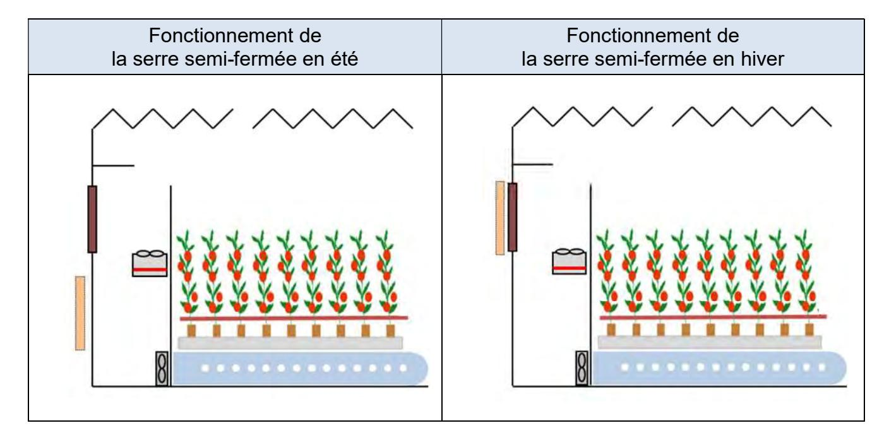

### Document réponse DR2 (question 15)

Courbes caractéristiques de fonctionnement des ventilateurs Perte de charge du circuit aéraulique

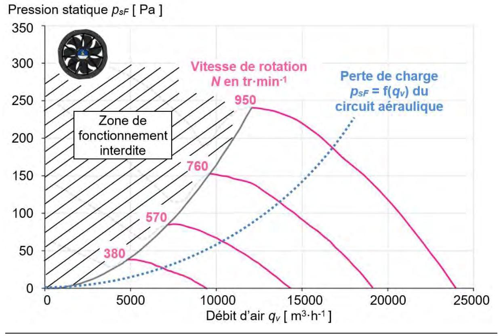

### Document réponse DR3 (question 16)

Consigne : Compléter les zones pointillées ( … ) en précisant la grandeur électrique

relevée et son unité. Exemple : um ( V )

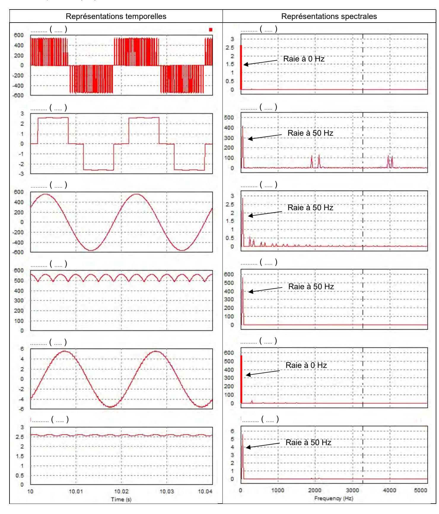

### Document réponse DR4 (question 21)

### Distribution de l'air dans le corridor et dans la serre Tableau de synthèse des résultats

|                                                                          | Valeur minimale (hiver) | Valeur maximale (été) |
|--------------------------------------------------------------------------|----------------------------|--------------------------|
| Taux de renouvellement d'air en volumes de serre·h-1 (question 11) |                            |                          |
| Taux de renouvellement d'air en m3·h-1 (question 11)               |                            |                          |
| Nombre de ventilateurs en fonctionnement (question 13)             |                            |                          |
| Débit d'air des ventilateurs en fonctionnement en m3·h-1              | 8 100                      | 14 200                   |
| Vitesse de rotation des ventilateurs en fonctionnement en tr·min-1 | 450                        | 800                      |
| Fréquence d'alimentation f des MAS en Hz (question 20)             |                            |                          |

| Non                               | OOC v2 ©NEOPTEC  n de famille :  n lieu, du nom d'usage)                                                                          |                                |                             |                                  |                                |                            |                                |                              |                               |                               |                                     |                         |                       |                          |              |         |     |      |      |      |
|-----------------------------------|-----------------------------------------------------------------------------------------------------------------------------------|--------------------------------|-----------------------------|----------------------------------|--------------------------------|----------------------------|--------------------------------|------------------------------|-------------------------------|-------------------------------|-------------------------------------|-------------------------|-----------------------|--------------------------|--------------|---------|-----|------|------|------|
|                                   | Prénom(s) :                                                                                                                       |                                |                             |                                  |                                |                            |                                |                              |                               |                               |                                     |                         |                       |                          |              |         |     |      |      |      |
|                                   | Numéro Inscription :                                                                                                           | e numéro                       | est cell                    | ui qui fiqu                      | re sur la                      | convoc                     | ation o                        | ı la feui                    | lle d'ém                      | nargeme                       |                                     | (e)                     | le:                   |                          |              | /       |     | ]/   |      |      |
| (Remplir cette partie Concours | à l'aide de la notice) / Examen :                                                                                                 |                                |                             |                                  |                                |                            | S                              | Section                      | on/S l             | pécia                         | lité/Se                             |                         |                       |                          |              |         |     |      |      |      |
|                                   | Epreuve :                                                                                                                         |                                |                             |                                  | •••••                          | ••••                       | l                              | Matiè                        | re :                          |                               |                                     | • • • • •               |                       |                          | Se           | ssio    | n : |   |   |   |
| CONSIGNES                         | <ul> <li>Remplir soigne</li> <li>Ne pas signer</li> <li>Numéroter cha</li> <li>Rédiger avec u</li> <li>N'effectuer aux</li> </ul> | la comp aque PA un stylo | osition GE (ca à encr | n et ne p adre en re foncé | as y ap bas à d e (bleue | porter roite d ou no | de sig le la pa pire) et | ne dist age) et ne pa: | inctif p place s utilis | oouvar r les fe er de s | t indique uilles da tylo plui | er sa ans le me à | prove bon encre | enanc sens e clair | et dan e. | s l'ord | re. |      |      |      |

EDE STI 2

### DR5 - DR6 - DR7 - DR8 - DR9

Tous les documents réponses sont à rendre, même non complétés.

### **NE RIEN ECRIRE DANS CE CADRE**

# Document réponse DR5 (questions 33, 38 et 39)

Chaîne de puissance pour la mise en position des tubes « push – pull » 11 châssis de surpression sont manœuvrés par le tube 1 et 10 châssis de surpression par le tube 2. Le motoréducteur pilote donc l'ouverture de 21 châssis.

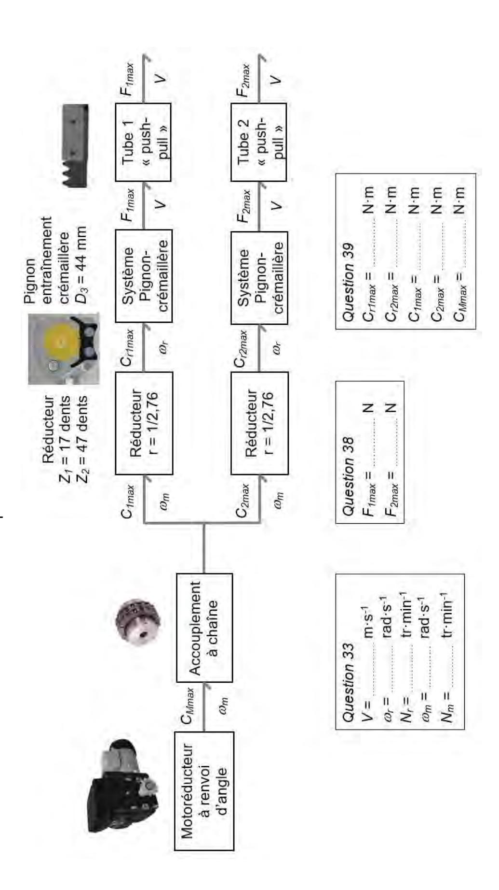

### Document réponse DR6 (question 47)

Évolution de l'intensité I du courant délivré par le capteur RPU en fonction de la position angulaire des châssis de surpression

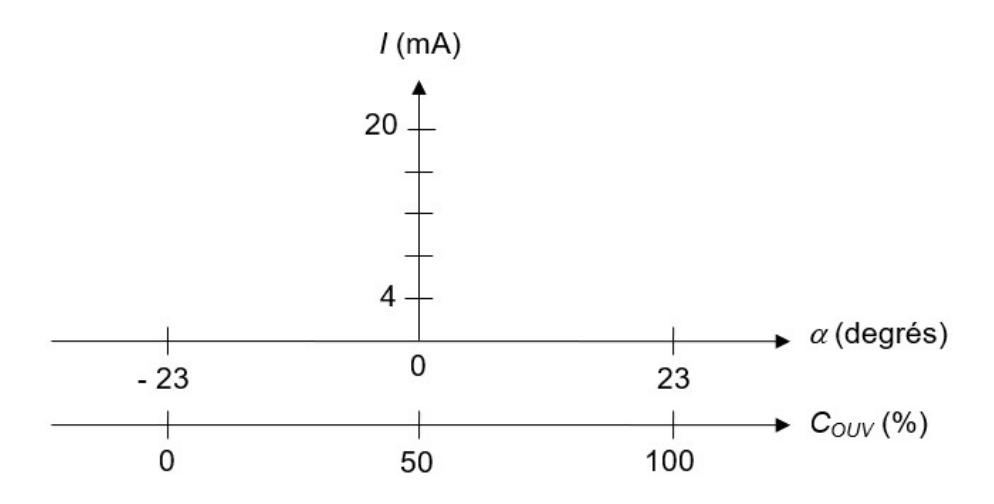

### Document réponse DR7 (question 48)

Erreurs de positionnement angulaire des châssis de surpression

| Couv | 25 % | 50 % | 75 % | 100 % |
|------|------|------|------|-------|
|    |      |      |      |       |

### Document réponse DR8 (question 50)

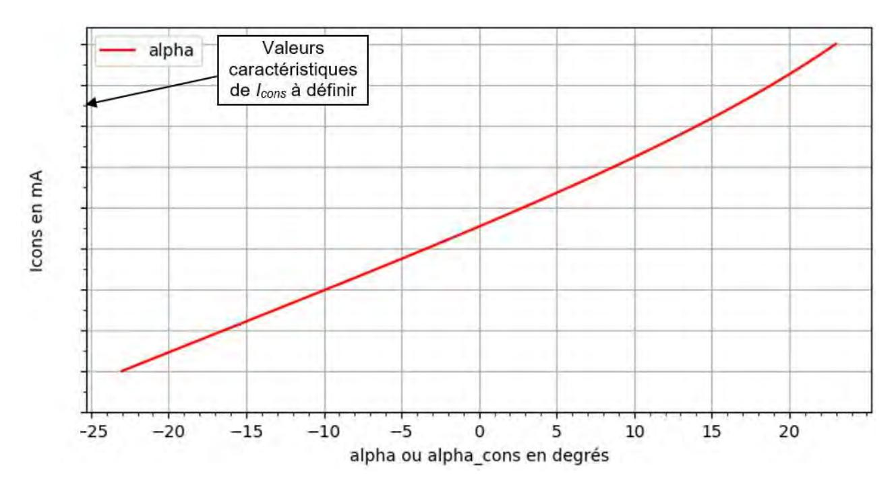

### Document réponse DR9 (question 53)

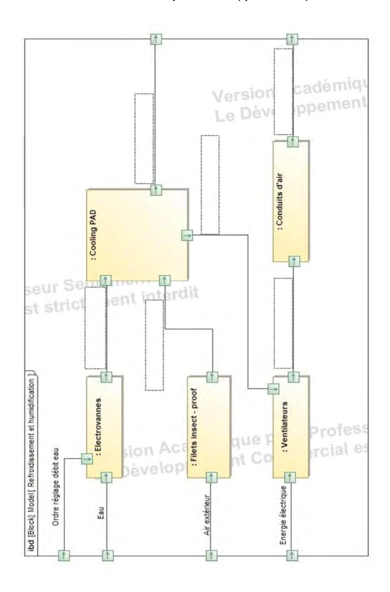

| No        | DOC v2 ©NEOPTEC  m de famille : a lieu, du nom d'usage)                                                                        |                                |                                   |                                  |                                 |                              |                               |                              |                              |                            |                                           |                            |                          |              |          |     |                  |      |      |
|-----------|--------------------------------------------------------------------------------------------------------------------------------|--------------------------------|-----------------------------------|----------------------------------|---------------------------------|------------------------------|-------------------------------|------------------------------|------------------------------|----------------------------|-------------------------------------------|----------------------------|--------------------------|--------------|----------|-----|------------------|------|------|
|           | Prénom(s) :                                                                                                                    | П                              |                                   |                                  |                                 |                              |                               |                              |                              |                            |                                           |                            |                          |              |          |     |                  |      |      |
|           | Numéro Inscription :                                                                                                        |                                |                                   |                                  |                                 |                              |                               |                              |                              |                            | Né(e)                                     | le :                       |                          |              | /        |     | $\overline{ / }$ |      |      |
|           | (Li                                                                                                                            | e numéro                       | est celui d                       | qui figure                       | sur la c                        | onvoca                       | tion ou                       | la feuili                    | e d'ém                       | argeme                     | nt)                                       |                            |                          |              |          |     |                  |   |      |
|           | e à l'aide de la notice) <b>6 / Examen :</b>                                                                                |                                |                                   |                                  |                                 |                              | S                             | ectio                        | n/Sp                         | écia                       | lité/Séri                                 | e:                         |                          |              |          |     |               |   |   |
|           | Epreuve:                                                                                                                       |                                |                                   |                                  |                                 |                              | N                             | /latiè                       | re:                          |                            |                                           |                            |                          | Se           | ssior    | ı : |               |   |   |
| CONSIGNES | <ul> <li>Remplir soigne</li> <li>Ne pas signer</li> <li>Numéroter che</li> <li>Rédiger avec</li> <li>N'effectuer au</li> </ul> | la comp aque PA un stylo | oosition e IGE (cad à encre | t ne pas re en ba foncée ( | s y app as à dro (bleue ( | orter d oite de ou noi | le sign la pag re) et i | ne disti ge) et ne pas | nctif p placer utilise | ouvan les fe er de s | t indiquer s uilles dans tylo plume | a prov le bon à encr | enanc sens e clair | et dan e. | s l'ordr | e.  |                  |      |      |

EDE STI 2

### **DR10 - DR11**

Tous les documents réponses sont à rendre, même non complétés.

### **NE RIEN ECRIRE DANS CE CADRE**

### Document réponse DR10 (questions 56 et 57)

| def | # Caractéristiques LT = 180 h = 1.8 cb = 0.2                 | ombre d'électrovannes à ouvrir et leur durée d'o s du PAD et de la serre # en m # en m # constante spécifique au système # masse volumique de l'air | ouverture """ |
|-----|--------------------------------------------------------------|--------------------------------------------------------------------------------------------------------------------------------------------------------------------|---------------|
|     | # Calculs de Qair Ts,Hrs = calcul_T                       | , E et C s_Hrs_PAD(Te,Hre)                                                                                                                                      |               |
|     | Hae =                                                        |                                                                                                                                                                    | Question 56   |
| İ   | Has =                                                        |                                                                                                                                                                    |               |
|     | Qair = 3600 * Vair E = rho_air * Qair C = (1 + cb) * E | r * LT * h * (Has - Hae) / (1000 * 60)                                                                                                                          |               |
|     | # Détermination d                                            | le Nouv et calcul de touv                                                                                                                                          |               |
|     | if                                                           |                                                                                                                                                                    | Question 57   |
|     |                                                              |                                                                                                                                                                    |               |
|     | else :                                                       |                                                                                                                                                                    |               |
| ļ   | touv = 60 * Vserre                                           |                                                                                                                                                                    |               |

### Document réponse DR11 (questions 58 et 59)

| Conditions                        | de culture           | Rendement des cultures par m³ d'eau apportée (kg·m⁻³) | Efficience hydrique (L·kg -1 ) |
|-----------------------------------|----------------------|-------------------------------------------------------------|-------------------------------------------------|
| Champ                             | Culture en terre     | 14                                                          |                                                 |
| Serres en plastique non chauffées | Culture en terre     | 24                                                          | *******                                         |
| Serres chauffées traditionnelles  | Culture sur substrat | 39                                                          |                                                 |
| Serres semi - fermées          | Culture sur substrat | 66                                                          |                                                 |

Tableau 1 : consommation en eau pour différentes conditions de culture

|                                                        | Cas type A                                                                                      | Cas type B                                            | Cas type C                                                                                |  |  |
|--------------------------------------------------------|-------------------------------------------------------------------------------------------------|-------------------------------------------------------|-------------------------------------------------------------------------------------------|--|--|
| Date de construction                                   | 2009 (2001 – 2015)                                                                           | 1997 (1974 – 2015)                                 | 1979 (1960 – 1988)                                                                     |  |  |
| Superficies de serres semi-fermées                  | 30 %                                                                                            | 5 %                                                   | 0 %                                                                                       |  |  |
| Calendrier de production                               | Deux productions Semi en novemb en production dél Semi en août pou production début | re pour une entrée out février ur une entrée en | Plantation plus tardive (décembre à février) pour limiter les coûts de chauffage |  |  |
|                                                        | Consommation                                                                                    | énergétique totale                                    |                                                                                           |  |  |
| Consommation énergétique (kW·h·m -2 ) | 282                                                                                             | 306                                                   | 165                                                                                       |  |  |
| Rendement des cultures (kg·m -2 )     | .53                                                                                             | 42,5                                                  | 31                                                                                        |  |  |
| Efficience énergétique (kW·h·kg -1 )  | . 1011111                                                                                       | 2125001                                               | 1,50,51,511.6                                                                             |  |  |
|                                                        | Coût lié                                                                                        | à l'énergie                                           |                                                                                           |  |  |
| Chauffage (€·m⁻²)                                   | 6,30                                                                                            | 8,10                                                  | 4,85                                                                                      |  |  |
| Électricité (€·m-²)                                 | 1,44                                                                                            | 0,68                                                  | 0,67                                                                                      |  |  |
| CO 2 liquide (€·m -2 )        | 0,78                                                                                            | 0,25                                                  | 0,40                                                                                      |  |  |
| Coût total énergétique (€·kg⁻¹)                  | Secretaria                                                                                      | 71011000                                              | 390000                                                                                    |  |  |

Tableau 2 : consommations et coûts énergétiques pour différents types de serres