### **SESSION 2023** \_\_\_\_

# CAPET CONCOURS EXTERNE ET CAFEP CORRESPONDANT ET TROISIEME CONCOURS

**Section : SCIENCES INDUSTRIELLES DE L'INGÉNIEUR**

**Option : INGÉNIERIE ÉLECTRIQUE**

# **ÉPREUVE ÉCRITE DSICIPLINAIRE**

Durée : 5 heures \_\_\_\_

*Calculatrice autorisée selon les modalités de la circulaire du 17 juin 2021 publiée au BOEN du 29 juillet 2021.*

*L'usage de tout ouvrage de référence, de tout dictionnaire et de tout autre matériel électronique est rigoureusement interdit.*

*Il appartient au candidat de vérifier qu'il a reçu un sujet complet et correspondant à l'épreuve à laquelle il se présente.* 

*Si vous repérez ce qui vous semble être une erreur d'énoncé, vous devez le signaler très lisiblement sur votre copie, en proposer la correction et poursuivre l'épreuve en conséquence. De même, si cela vous conduit à formuler une ou plusieurs hypothèses, vous devez la (ou les) mentionner explicitement.*

**NB : Conformément au principe d'anonymat, votre copie ne doit comporter aucun signe distinctif, tel que nom, signature, origine, etc. Si le travail qui vous est demandé consiste notamment en la rédaction d'un projet ou d'une note, vous devrez impérativement vous abstenir de la signer ou de l'identifier. Le fait de rendre une copie blanche est éliminatoire.**

### **INFORMATION AUX CANDIDATS**

Vous trouverez ci-après les codes nécessaires vous permettant de compléter les rubriques figurant en en-tête de votre copie

Ces codes doivent être reportés sur chacune des copies que vous remettrez.

**► Concours externe du CAPET de l'enseignement public** :

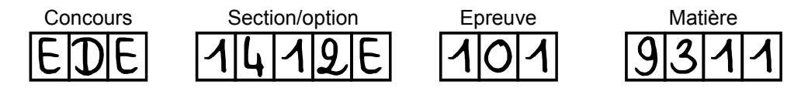

**► Concours externe du CAFEP/CAPET de l'enseignement privé** :

Concours Section/option Epreuve Matière EDF 1412E 101 9311

**►Troisième concours externe du CAPET de l'enseignement public :**

| ConcoursSection/option | Epreuve | Matière |      |
|------------------------|---------|---------|------|
| EDV                    | 1412E   | 101     | 9311 |

### **Enjambeur électrique autonome pour le travail des vignes**

L'entreprise Vitibot basée à Reims conçoit et réalise le robot Bakus. Il s'agit d'un enjambeur viticole électrique autonome. Il est capable d'exécuter la plupart des travaux viticoles, aujourd'hui assurés par des tracteurs conventionnels, dans des conditions de sécurité et de qualité optimales. Le robot Bakus présente de multiples avantages. En effet, compte tenu de son poids (≈ 2 500 kg) inférieur à un enjambeur traditionnel (3 000 à 5 000 kg), il contribue à limiter le tassement des sols. De plus, sa conduite autonome permet de libérer le viticulteur qui peut, pendant ce temps, se consacrer à d'autres tâches au sein de la parcelle de vigne tout en assurant la supervision du robot.

La société commercialise deux modèles de robot viticole, Bakus S et Bakus L, répondant à des besoins adaptés à chaque type de vigne (basse ou haute).

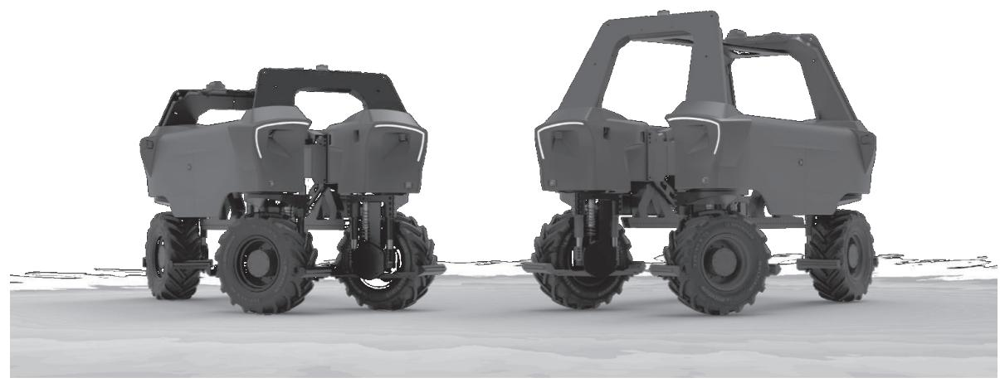

Figure 1 : Vue des robots Bakus S (à gauche) et Bakus L (à droite)

Grâce aux porte-outils latéraux qui s'intègrent aisément de chaque côté de la structure, le robot Bakus peut ainsi embarquer plusieurs outils dans différentes configurations tout en étant manipulable par une seule personne.

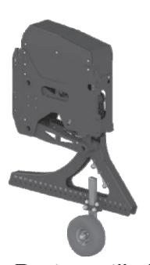

Figure 2 : Porte-outils latéral

Vitibot commercialise aussi les outils nécessaires aux différents travaux viticoles, en voici quelquesuns :

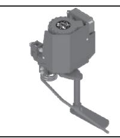

L'intercep est un outil de désherbage entre deux ceps de vigne consécutifs. Ce dernier est muni d'un capteur qui détecte la présence d'un cep provoquant le pivotement de la lame afin de ne pas endommager le cep.

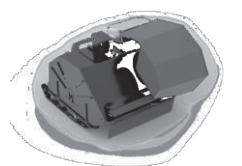

Les gyro-tondeuses sont composées de lames rotatives qui permettent l'entretien de la végétation entre deux rangs de vigne.

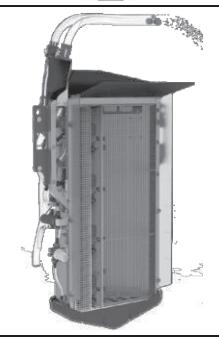

La pulvérisation confinée est un système innovant de traitement des vignes par pulvérisation. Le confinement du traitement permet en fonction des saisons et de la végétation de récupérer entre 20 % et 80 % des produits pulvérisés. Le système cesse de fonctionner en cas d'absence d'un cep. Ce système permet de limiter la quantité de produit nécessaire tout en protègeant l'opérateur des expositions aux produits phytosanitaires.

### Le sujet comporte six parties indépendantes :

- Partie A : dimensionnement des moteurs d'avancement et des batteries embarquées dans le robot Bakus ;
- Partie B : autonomie énergétique du robot Bakus ;
- Partie C : étude du convertisseur DC/DC permettant la recharge du robot Bakus ;
- Partie D : asservissement de la perche porte-outils ;
- Partie E : acquisition de la position du robot ;
- Partie F : instrumentation du robot Bakus.

## **Partie A : dimensionnement des moteurs d'avancement et des batteries embarquées dans le robot Bakus**

L'objectif de cette partie est de valider le dimensionnement des moteurs d'avancement et de la capacité énergétique des batteries du robot Bakus.

### **Dimensionnement du moteur**

Le robot Bakus est équipé d'un moteur d'avancement par roue. Pour valider leur dimensionnement on se place dans le cas où le robot, initialement à l'arrêt, doit démarrer sur une pente de 35 %. La figure 3 illustre les forces extérieures s'appliquant sur le robot Bakus.

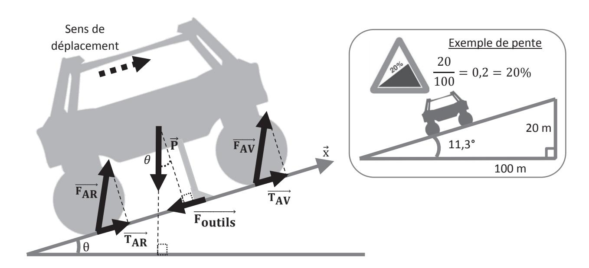

Figure 3 : Forces extérieures s'appliquant sur le robot Bakus et rappel sur la pente

Le problème est supposé plan. Le robot se déplace selon l'axe ⃗x avec une accélération notée aX. Les forces extérieures s'appliquant sur le robot Bakus sont :

- le poids du robot noté P⃗ ;
- la force du sol sur les outils notée Foutils ⃗⃗⃗⃗⃗⃗⃗⃗⃗⃗⃗ ;
- la force du sol sur la roue avant notée FAV ⃗⃗⃗⃗⃗⃗⃗ dont la composante sur l'axe x⃗ est notée TAV ⃗⃗⃗⃗⃗⃗ ;
- la force du sol sur la roue arrière notée FAR ⃗⃗⃗⃗⃗⃗⃗ dont la composante sur l'axe ⃗x est notée TAR ⃗⃗⃗⃗⃗⃗ .
- **Question A1. Déterminer** l'expression de la projection de ⃗ P⃗ sur l'axe x⃗ en fonction de la masse du véhicule (notée M)*,* de l'accélération de la pesanteur (notée g) et de l'angle de la pente (noté θ).
- **Question A2. Appliquer** le principe fondamental de la dynamique au véhicule en translation sur l'axe x⃗ pour établir l'expression de a<sup>X</sup> en fonction de M, g, θ, ‖TAR ⃗⃗⃗⃗⃗⃗ ‖, ‖TAV ⃗⃗⃗⃗⃗⃗ ‖ et ‖Foutils ⃗⃗⃗⃗⃗⃗⃗⃗⃗⃗⃗ ‖.

### On donne:

```
- M = 2 500 kg;

- g = 9,81 m·s<sup>-2</sup>;

- \theta correspond à une pente de 35 %;

- a_X = 0,1 m·s<sup>-2</sup>;

- \|\overrightarrow{F}_{outrils}\| = 2000 N;

- \|\overrightarrow{T}_{AR}\| = 5 \times \|\overrightarrow{T}_{AV}\|.
```

**Question A3. Déterminer** la valeur numérique de  $\|\overrightarrow{T_{AR}}\|$  permettant au robot de démarrer avec l'accélération voulue.

Les roues du robot Bakus ont un rayon R = 368 mm.

**Question A4. Déterminer** le couple que doivent fournir les deux motoréducteurs des roues arrières pour permettre au robot de démarrer avec l'accélération voulue.

La figure 4 illustre les caractéristiques couple/vitesse de deux références de moto-réducteur.

**Question A5.** À l'aide de la figure 4, **déterminer** la référence du motoréducteur permettant d'assurer le déplacement du robot dans les conditions de l'étude.

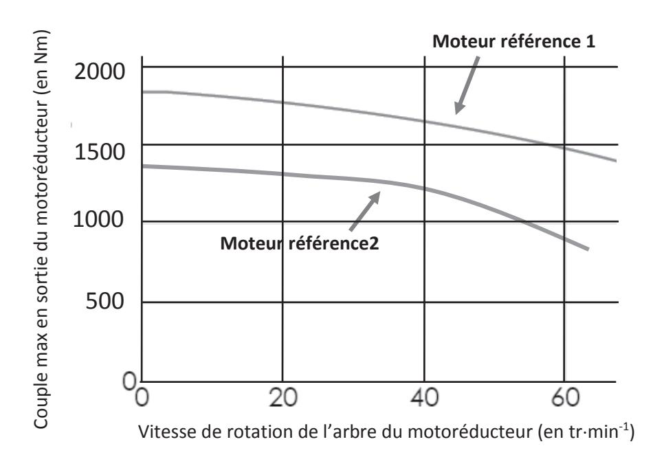

Figure 4 : Courbes du couple maximum en fonction de la vitesse de rotation de la jante

### Choix de la capacité énergétique de la batterie

La capacité énergétique des batteries à embarquer dans le robot Bakus influence la masse de celuici. Il est donc nécessaire de choisir les batteries garantissant une autonomie suffisante tout en considérant leur impact sur la masse totale du robot.

L'étude se limite aux moteurs d'avancement du robot. On considère que la consommation électrique de l'électronique embarquée et des moteurs de direction des roues est négligeable devant celle des moteurs d'avancement. On ne tient pas compte des phases d'accélération et de décélération, l'étude est menée à vitesse constante.

Chaque roue est mue pour un motoréducteur sur lequel est fixée directement la jante. La figure 5 illustre la chaîne de puissance des moteurs d'avancement du robot Bakus.

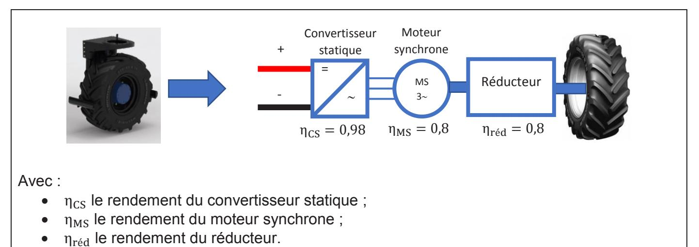

Figure 5 : Chaine de puissance des moteurs d'avancement

Le dimensionnement de la capacité énergétique des batteries est réalisée sur un terrain plat (pente nulle) à vitesse constante V = 4,0 km·h<sup>-1</sup>. Dans une telle situation la puissance mécanique nécessaire au mouvement du robot Bakus se calcule avec la formule suivante :

$$P_{m} = \left(C_{rr} \cdot M \cdot g + \left\| \overrightarrow{F_{outils}} \right\| \right) \cdot V$$

Оù

- Crr = 0,05 est le coefficient de résistance au roulement dû à la déformation des roues ;
- $\|\overrightarrow{F_{\text{outule}}}\| = 2\,000\,\text{N}$  est la force exercée par la terre sur les outils ;
- M est la masse du véhicule :
- g = 9,81 m⋅s<sup>-2</sup> est l'accélération de la pesanteur.

La masse M varie en fonction de la capacité énergétique des batteries embarquées sur le robot Bakus. Les configurations possibles sont les suivantes :

|                 | Capacité énergétique totale embarquée | Masse totale embarquée pour une configuration de travail donnée |
|-----------------|---------------------------------------|-----------------------------------------------------------------|
| Configuration 1 | 80 kWh                                | 2 500 kg                                                        |
| Configuration 2 | 60 kWh                                | 2 450 kg                                                        |
| Configuration 3 | 40 kWh                                | 2 400 kg                                                        |

- **Question A6. Déterminer** la valeur de la puissance mécanique nécessaire au mouvement du robot pour les trois configurations possibles.
- **Question A7. Déterminer** la valeur de la puissance électrique nécessaire au mouvement du robot pour les trois configurations possibles.
- **Question A8. Déterminer** la durée maximale de fonctionnement permise du robot Bakus dans les trois configurations possibles.

La durée minimale attendue de fonctionnement du robot Bakus est fixée à 7 heures par jour. À l'issue de chaque journée d'utilisation les batteries du robot sont totalement rechargées.

**Question A9. Choisir** une configuration permettant de satisfaire la durée d'utilisation du robot. **Justifier** la réponse.

### **Partie B : autonomie énergétique du robot Bakus**

L'objectif de cette partie est d'étudier la possibilité d'atteindre la neutralité carbone dans la période d'utilisation du robot Bakus. Pour ce faire, une solution utilisant des panneaux photovoltaïques est envisagée.

L'étude est menée dans le cadre d'une parcelle type illustrée figure 6. Le parcours du robot y est également illustré. Dans la suite de l'étude, on néglige les temps de retournement ainsi que la puissance consommée lors de ces phases à vitesse réduite.

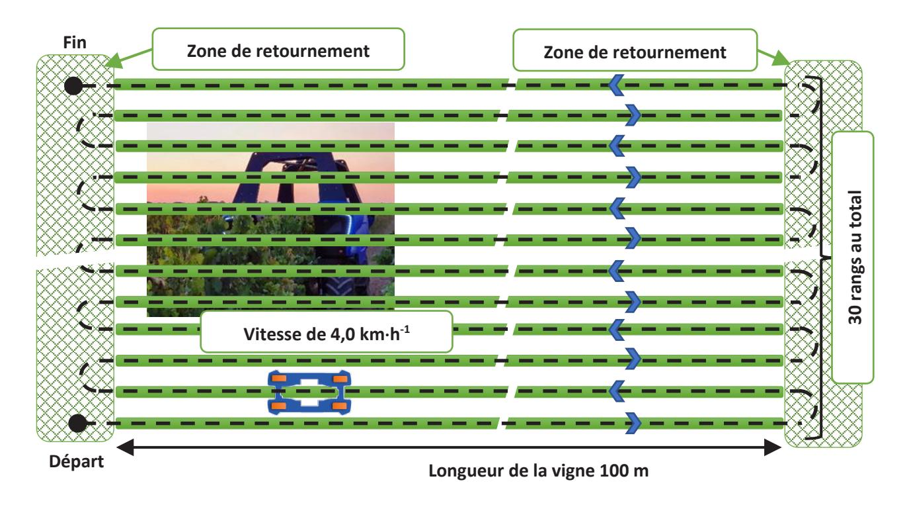

Figure 6 : Schéma d'implantation d'une parcelle de vigne

**Question B1. Calculer** la distance du parcours à réaliser. À l'aide de la vitesse de déplacement du robot indiquée figure 6, **déterminer** le temps nécessaire au robot Bakus pour réaliser le parcours type.

La puissance électrique moyenne consommée par les moteurs permettant le déplacement du robot en ligne droite est de 5,6 kW. La consommation électrique des autres constituants du robot est supposée négligeable devant la consommation des moteurs de déplacement.

**Question B2. Calculer** l'énergie électrique requise pour réaliser le parcours type.

Le robot réalise les opérations sur les parcelles pendant la journée, il est stocké dans un hangar pendant la nuit. La faible surface du robot et la nécessité de pouvoir accéder facilement à ses constituants pour des actes de maintenance ne permettent pas d'installer des panneaux photovoltaïques directement sur le robot. La solution envisagée est donc l'installation des panneaux photovoltaïques sur le toit du hangar qui abrite le robot Bakus.

Le synoptique de la structure électrique retenue pour le hangar est illustré figure 7.

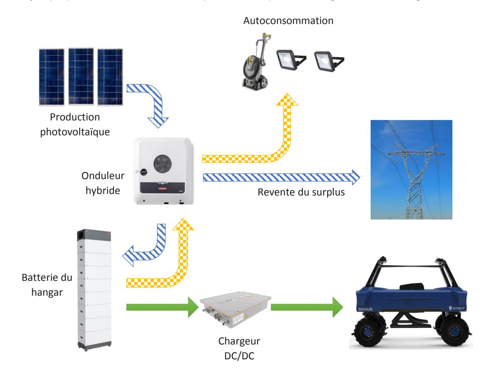

Figure 7 : Synoptique de l'installation électrique du hangar

**Question B3. Justifier** la structure de l'installation retenue, notamment la présence de l'onduleur et de batteries de stockage dans le hangar. **Préciser** la nature du convertisseur permettant le transfert d'énergie électrique des batteries du hangar vers la batterie du robot Bakus.

Le rendement d'un transfert énergétique des batteries du hangar vers la batterie du robot Bakus (via le chargeur DC/DC) est de 88 %. Le rendement de l'onduleur hybride est de 98 %. On suppose que la recharge de la batterie du robot Bakus est réalisée en dehors des périodes de production d'énergie solaire (c'est à dire la nuit).

**Question B4. Calculer** l'énergie que doivent produire les panneaux photovoltaïques pour pouvoir disposer d'1,0 kWh dans la batterie du Bakus.

On suppose que le rendement global de la chaine de puissance des moteurs d'avancement est de 63 %.

**Question B5. En déduire** l'énergie à produire par les panneaux photovoltaïques pour que le robot puisse réaliser le parcours complet de la parcelle type illustrée figure 6.

Dans le cadre d'un premier dimensionnement, on cherche à obtenir un fonctionnement du robot Bakus sans apport d'énergie issu du réseau pendant l'ensemble de sa période d'utilisation. La figure 8 illustre la période d'utilisation du robot Bakus pendant laquelle il est utilisé quotidiennement.


Figure 8 : Période d'utilisation du robot Bakus

Le document technique DT1 précise le gisement solaire disponible localement sur une année pour un panneau photovoltaïque de 1,0 kWp (c'est-à-dire 1,0 kW crête installé). Le robot Bakus devant réaliser le parcours de plusieurs parcelles par jour, on suppose que la production d'énergie solaire nécessaire au fonctionnement journalier du robot pendant sa période d'utilisation est de 40 kWh.

**Question B6.** À l'aide du document technique DT1, **déterminer** l'énergie produite par un panneau photovoltaïque de 1,0 kWp dans le mois le plus défavorable. En considérant que tous les mois ont 30 jours, **en déduire** la puissance en kWp à installer sur le hangar pour atteindre l'autonomie énergétique visée.

Dans le cadre de ce premier dimensionnement, on cherche à évaluer le surplus énergétique produit par les panneaux photovoltaïques positionnés sur le hangar et qui pourrait être revendu à l'exploitant du réseau électrique.

- **Question B7.** En considérant que les mois ont tous 30 jours, **compléter** le tableau du document réponse DR1 établissant le bilan énergétique annuel de l'installation de panneaux photovoltaïques du hangar.
- **Question B8. Déterminer** le surplus énergétique produit par les panneaux photovoltaïques pendant la période d'utilisation du robot Bakus.
- **Question B9. Déterminer** l'énergie produite par les panneaux photovoltaïques en dehors de la période d'utilisation du robot Bakus.

Dans le cadre d'une deuxième étude de dimensionnement, on envisage une autre solution qui permettrait un fonctionnement du robot Bakus sans apport d'énergie issu du réseau sur la période d'avril à septembre.

**Question B10. Comparer** qualitativement les deux solutions envisagées en termes de coût initial, de retour sur investissement et d'autonomie énergétique.

# **Partie C – Étude du convertisseur DC/DC permettant la recharge du robot Bakus**

Dans un objectif d'autonomie énergétique, des panneaux photovoltaïques ont été installés sur le toit du hangar qui abrite le robot Bakus. Ceux-ci permettent le chargement de batteries présentes dans le hangar. L'objectif de cette partie de déterminer la structure et les éléments constitutifs du convertisseur permettant le transfert d'énergie des batteries du hangar vers les batteries du robot Bakus.

La figure 7 (voir partie B) illustre le synoptique de l'installation électrique du hangar. La batterie installée dans le hangar est de type Lithium Fer Phosphate (LiFePO4), la batterie présente dans le robot Bakus est de type Lithium ion (Li-ion). La capacité énergétique de la batterie du robot Bakus de 40 kWh. Un schéma de puissance simplifié du robot Bakus est fourni dans le document technique DT2.

La première étape de cette étude porte sur la modélisation d'une des quatre batteries du robot Bakus, constituées par un assemblage mixte (série / parallèle) de cellules élémentaires. Les caractéristiques d'une cellule élémentaire sont fournies dans le document technique DT2.

**Question C1.** À l'aide du document technique DT2, **déterminer** le nombre de cellules élémentaires à mettre en série (appelée branche) correspondant aux caractéristiques d'une batterie du robot Bakus. **Déterminer** les valeurs numériques du modèle équivalent de Thévenin de cette association.

**Question C2.** À l'aide du document technique DT2, **déterminer** le nombre de branches à mettre en parallèle pour réaliser une batterie du robot Bakus. **Déterminer** les valeurs numériques du modèle équivalent de Thévenin de cette association.

L'ensemble des quatre batteries du robot Bakus est modélisé par un unique modèle de Thèvenin de force électromotrice notée ELi-ion et de résistance notée RLi-ion. La valeur de ELi-ion dépend de l'état de charge la batterie. Dans la suite de l'étude, ELi-ion est considérée constante.

Dans la suite de l'étude la batterie LiFePO4 du hangar est modélisée par une source de tension de valeur ELiFePO4. On suppose que la résistance de la batterie LiFePO4 est négligeable. La figure 9 illustre le schéma du convertisseur étudié.

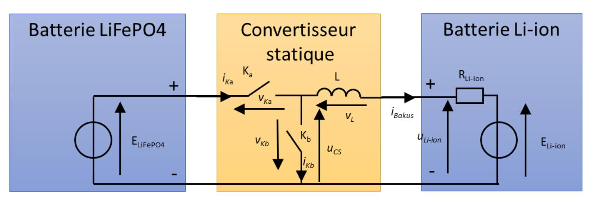

Figure 9 : Schéma du convertisseur DC/DC

Le convertisseur statique est constitué de deux interrupteurs Ka et Kb qui sont commandés, sur une période de découpage T, selon le cycle suivant :

- pour un instant t ∈ [0 ; αT[ : Ka fermé et Kb ouvert ;
- pour un instant t ∈ [αT ; T[ : Ka ouvert et Kb fermé où α est le rapport cyclique (0 ≤ α ≤ 1).

### L'étude est menée avec les hypothèses suivantes :

- les interrupteurs sont supposés parfaits (commutations instantanées et aucune consommation de puissance) ;
- le convertisseur statique fonctionne en régime périodique et en conduction continue (pas de phase à courant nul) ;
- le courant *iBakus* est toujours positif ;
- l'ondulation du courant *iBakus* absorbée par le robot est très faible au regard de la valeur moyenne du courant *iBakus*, la chute de tension aux bornes de la résistance peut être considérée comme constante sur une période de découpage T ;
- la force électromotrice de la batterie ELi-ion variant lentement au regard de la période de découpage, elle est considérée constante ;
- la période de découpage T est considérée très faible devant la constante de temps τ = <sup>L</sup> RLi−ion (on suppose donc que le courant *iBakus(t)* évolue linéairement entre deux instants de commutation).
- **Question C3.** Pour t ∈ [0 ; αT[, **dessiner** le schéma équivalent du montage. **Établir** l'équation différentielle vérifiée par *iBakus(t)*. En supposant RLi-ion négligeable, **déterminer** l'expression temporelle de *iBakus(t)*. **Compléter** le chronogramme de *iBakus(t)* sur le document réponse DR2.
- **Question C4.** Pour t ∈ [αT ; T[, **dessiner** le schéma équivalent du montage. **Établir** l'équation différentielle vérifiée par *iBakus(t)*. En supposant RLi-ion négligeable, **déterminer** l'expression temporelle de *iBakus(t)*. **Compléter** le chronogramme de *iBakus(t)* sur le document réponse DR2.
- **Question C5.** À l'aide du chronogramme fourni sur le document réponse DR2, **déterminer** l'expression de la valeur moyenne de uCS (notée 〈uCS〉), en fonction de α et de ELiFePO4. **Déterminer** la relation entre la valeur moyenne de uLi−ion (notée 〈uLi−ion〉), α et ELiFePO4.

On dimensionne L pour limiter l'ondulation du courant dans la batterie du robot Bakus. L'ondulation du courant *iBakus* peut être calculée grâce à la formule :

$$\Delta i_{Bakus} = \frac{E_{LiFePO4} \cdot T \cdot (1 - \alpha) \cdot \alpha}{L}$$

Afin de préserver la batterie du robot Bakus, on fixe une ondulation maximale de 2,0 A du courant de recharge. La valeur moyenne 〈uLi−ion〉 doit être comprise entre 70 V et 117,5 V. La fréquence de découpage est de 50 kHz et ELiFePO4 = 500 V.

**Question C6. Déterminer** la valeur du rapport cyclique qui correspond à une ondulation  $\Delta i_{Bakus}$  maximale. **Déterminer** la valeur de l'inductance minimale à installer pour respecter l'exigence d'ondulation maximale du courant.

Afin de réduire l'ondulation du courant, on envisage d'utiliser une technologie de convertisseur comportant quatre branches entrelacées. Les chronogrammes des courants des quatre branches et la description de la commande de commutation sont fournis dans le document technique DT3.

**Question C7.** À l'aide du document technique DT3, **indiquer** sur les chronogrammes du document réponse DR3 le nom des interrupteurs qui sont dans un état passant pour chaque branche et chaque zone de conduction.

Avec un convertisseur comportant quatre branches entrelacées, l'ondulation du courant de recharge de la batterie du robot Bakus est déterminée par la formule :

$$\Delta i'_{Bakus} = \frac{E_{LiFePO4} \cdot T \cdot (1 - 4\alpha) \cdot 4\alpha}{4 \cdot L'}$$

Question C8. Déterminer la valeur du rapport cyclique qui correspond à une ondulation  $\Delta i'_{Bakus}$  maximale. Déterminer l'ondulation du courant pour le convertisseur à branches entrelacées avec L' = L. Conclure quant à l'intérêt de ce convertisseur.

### Partie D : Asservissement de la perche porte-outils

L'objectif de cette partie est de valider les performances de l'asservissement de vitesse et de position de la perche porte-outils. Les exigences de cet asservissement sont les suivantes :

- l'asservissement de vitesse doit avoir une marge de phase de 45° pour garantir sa stabilité,
- l'erreur statique doit être nulle pour l'asservissement de position.

La perche porte-outils permet la descente et le relevage des différents outils nécessaires au travail du sol dans les vignes.

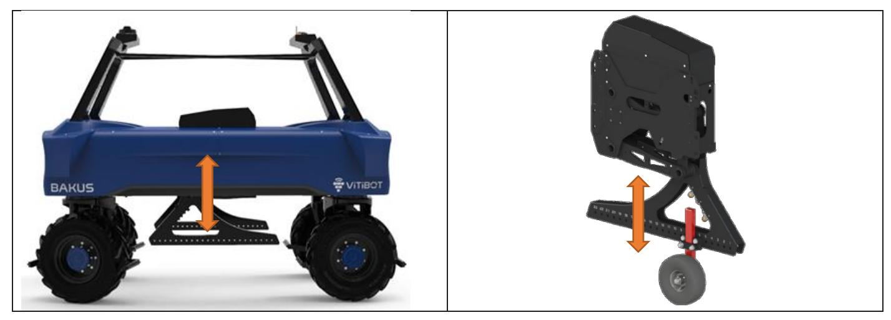

Figure 10 : Détails de la perche porte-outils

Le mouvement de la perche porte-outils est réalisé par la mise en parallèle de deux actionneurs linéaires électriques afin de répartir la charge (qui est limitée à 400 kg). Cela permet d'avoir une vitesse de montée plus élevée et de minimiser le temps nécessaire au demi-tour de l'enjambeur en extrémité de la parcelle de vigne. La montée et la descente de la perche porte-outils doit se faire à une vitesse d'environ 40 mm·s<sup>-1</sup>.

**Question D1.** À l'aide du document technique DT4, **déterminer** la référence des vérins compatible avec l'exigence de vitesse de montée et de descente.

Le constructeur du vérin propose différentes solutions technologiques pour mesurer la position de la tige du vérin. L'une d'elles est basée sur l'utilisation d'un codeur incrémental. Cette solution permet d'avoir une résolution de 0,15 mm/impulsion.

L'excursion maximale de la tige du vérin est de 680 mm. Lorsque le vérin est complètement rentré, la valeur décimale du compteur d'impulsions issue du codeur incrémental est 0.

**Question D2. Déterminer** le nombre de bits qui sont nécessaires pour coder la position en binaire de la tige du vérin. **Indiquer** le code de la position maximale.

La précision requise pour contrôler la position de la perche est de 5 mm.

**Question D3. Déterminer** la précision de mesure en mm de la position de la perche obtenue en ne retenant que les 8 bits de poids fort. **Justifier** qu'on ne retienne que les 8 bits de poids fort dans la mise en œuvre de l'asservissement. **Donner** l'octet correspondant à la position maximale en code binaire et en hexadécimal.

Le positionnement de la perche porte-outils se fait grâce aux deux actionneurs linéaires commandés de façon synchrone. L'étude de l'asservissement de position de la perche porte sur un seul actionneur. Le schéma de l'asservissement est illustré sur la figure 11.

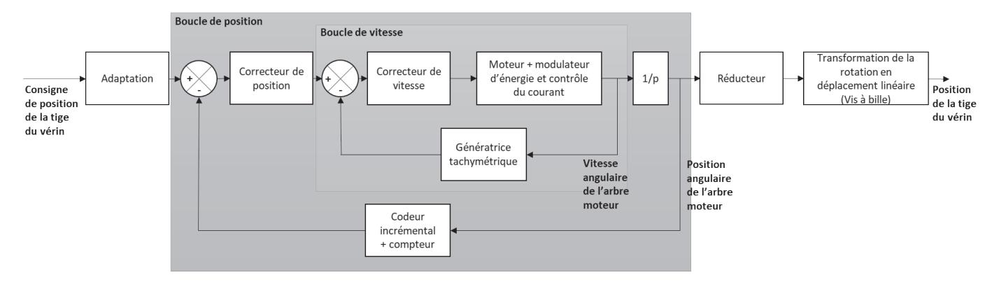

Figure 11 : Structure de l'asservissement de la tige de vérin

Dans un premier temps on s'intéresse au réglage du correcteur de la boucle de vitesse afin de respecter l'exigence de stabilité. Le schéma bloc simplifié de la boucle de vitesse est illustré sur la figure 12.


Avec : -  $\Omega_{\rm m}$  vitesse de rotation de l'arbre moteur (en rad·s<sup>-1</sup>) ;

- u<sub>GT</sub> tension image de la vitesse de rotation de l'arbre moteur (en V);
- $u_{cons}$  tension image de la consigne de la vitesse de rotation de l'arbre moteur (en V) ;
- $u_{mod}$  tension de commande du modulateur d'énergie de l'actionneur (en V) ;
- $C_V(p)$  fonction de transfert du correcteur proportionnel de vitesse ;
- H<sub>M</sub>(p) fonction de transfert du moteur associé à son modulateur d'énergie ;
- K<sub>GT</sub>(p) fonction de transfert de la génératrice tachymétrique.

Figure 12 : Schéma bloc de l'asservissement de la vitesse

L'étude fréquentielle du moteur associé à son modulateur d'énergie a permis de tracer le diagramme de Bode de la fonction de transfert  $H_M(p) = \frac{\Omega_m(p)}{U_{mod}(p)}$ . Ce diagramme de Bode est fourni sur le document réponse DR4.

$$\text{La fonction de transfert peut se mettre sous la forme}: H_M(p) = \frac{\Omega_m(p)}{U_{mod}(p)} = \frac{K_M}{\left(1 + \frac{p}{\omega_a}\right) \cdot \left(1 + \frac{p}{\omega_b}\right)} \text{ avec } \omega_a < \omega_b.$$

**Question D4.** À l'aide du diagramme de Bode (gain et phase) du document réponse DR4, **déterminer** les valeurs numériques de  $K_M$ ,  $\omega_a$  et  $\omega_b$ .

La génératrice tachymétrique fournit une tension proportionnelle à la vitesse de rotation. Elle donne une tension en sortie de 5,0 V pour 1 000 tr·min<sup>-1</sup> en entrée.

Question D5. À l'aide de la figure 12, déterminer l'expression de la fonction de transfert de Kgt(p).

Le correcteur proportionnel a pour fonction de transfert  $C_V(p) = K_{PV}$  où  $K_{PV}$  est une constante.

**Question D6.** À l'aide de la figure 12, **déterminer** l'expression de la fonction de transfert en boucle ouverte  $FTBO_V(p) = \frac{U_{GT}(p)}{\epsilon_V(p)}$ .

**Question D7. Tracer** sur le document réponse DR4, le diagramme de Bode de la fonction de transfert en boucle ouverte  $FTBO_V(p)$  pour  $K_{PV}=1$ .

Un rappel de la définition de la marge de phase ainsi qu'une illustration de cette dernière figurent sur le document réponse DR4.

**Question D8. Déterminer** la valeur à donner à  $K_{PV}$  pour respecter la marge de phase souhaitée de  $45^{\circ}$ .

Le schéma bloc de l'asservissement de position est illustré figure 13.

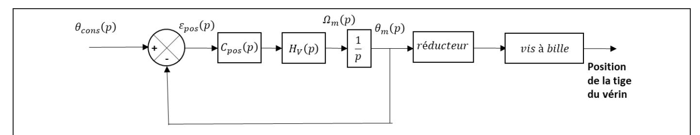

Avec : -  $\theta_{cons}$  la consigne de position angulaire de l'arbre moteur ;

- $\theta_{\rm m}$  la position angulaire de l'arbre moteur (en rad sur plusieurs tours) ;
- $\Omega_{\rm m}$  vitesse de rotation de l'arbre moteur (en rad·s<sup>-1</sup>);
- C<sub>pos</sub>(p) fonction de transfert du correcteur de position ;
- $H_V(p)$  fonction de transfert de la boucle de vitesse.

Figure 13 : Asservissement de position de la tige du vérin

Un essai indiciel de la boucle de position a donné la réponse illustrée figure 14.

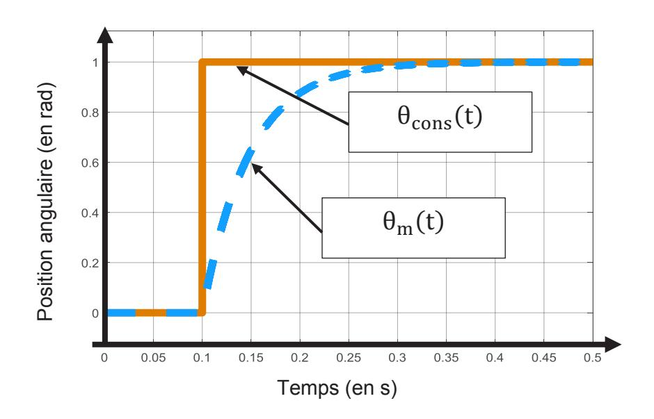

Figure 14 : Réponse indicielle de la position angulaire

On rappelle que l'exigence sur l'asservissement de position est une erreur statique nulle.

**Question D9.** À l'aide de la figure 14, **déterminer** l'erreur statique de position angulaire. **Conclure** vis-à-vis de l'exigence de précision.

### **PARTIE E : Acquisition de la position du robot**

L'objectif de cette partie est d'étudier la structure électronique permettant l'acquisition de la position du robot Bakus et de valider ses performances temporelles.

Le robot Bakus est doté d'un système de navigation qui permet une gestion du robot à distance (pour l'assistance technique au client) ainsi qu'une correction de sa trajectoire en temps réel. La figure 15 illustre le module implanté sur le robot qui permet l'acquisition de la position du robot.

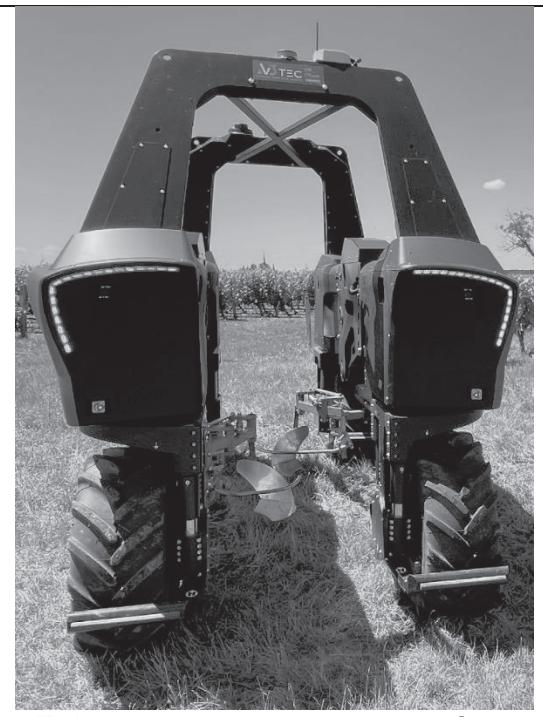

Système de navigation

Enjambeur autonome vue de face

Figure 15 : Implantation du système de navigation

**Question E1.** À l'aide du document technique DT5, **relever** la technologie de navigation retenue et **préciser** le nombre d'équipements installés.

La figure 16 illustre les échanges d'information nécessaires au fonctionnement de la technologie DGPS.

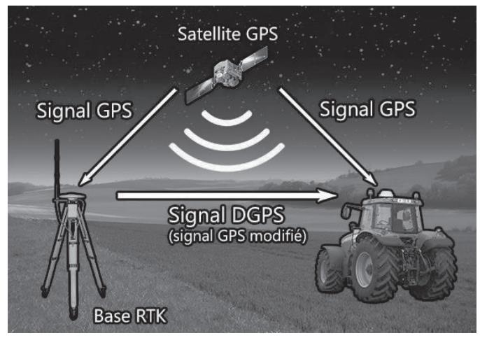

Figure 16 : Illustration du système GPS et DGPS

**Question E2.** À l'aide des documents techniques DT5 et DT6, **justifier** le choix de la technologie DGPS pour l'acquisition de la position du robot Bakus.

La figure 17 illustre le câblage entre la carte de contrôle du robot et le module GPS permettant l'acquisition de la position du robot.

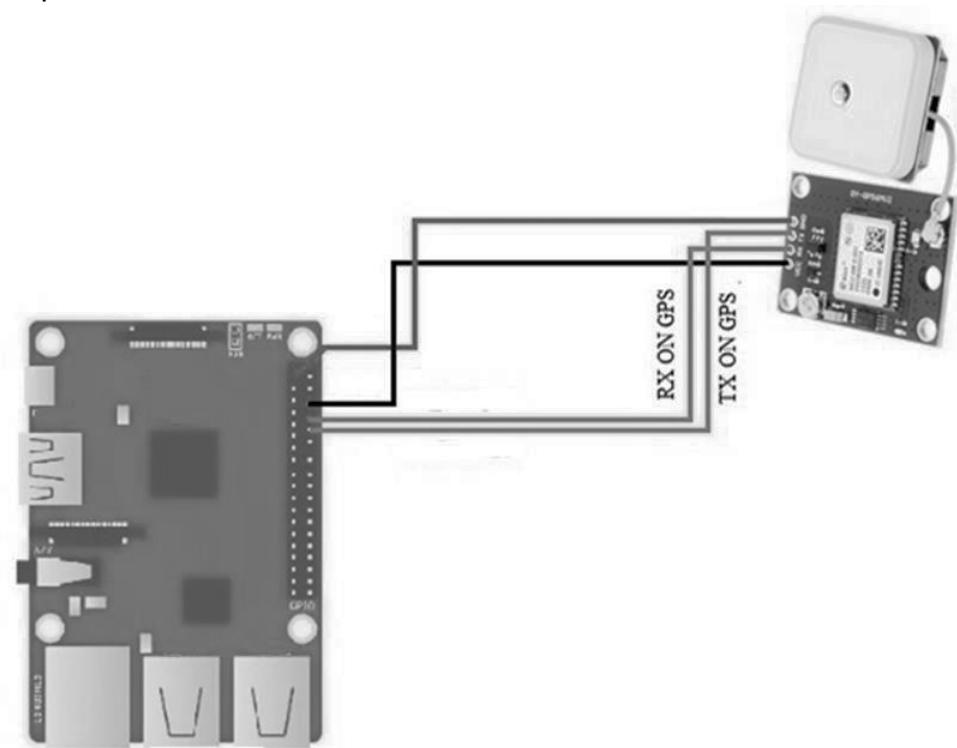

Figure 17 : Schéma de câblage entre la carte de contrôle et le module GPS

**Question E3.** À l'aide du document technique DT7 et de la figure 17, **déterminer** les broches du port GPIO de la carte de contrôle utilisées pour la communication avec le module GPS. **En déduire** le type de liaison permettant l'échange d'informations entre la carte de contrôle et le module GPS.

Les données échangées entre le module GPS et la carte de contrôle sont transmises sous forme de caractères codés en ASCII sur un octet. La figure 18 illustre la transmission d'un caractère du module GPS vers la carte de contrôle.

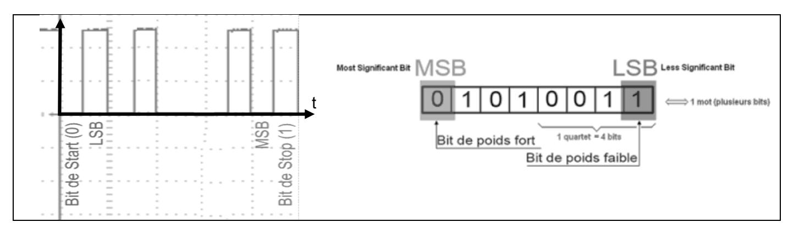

Figure 18 : Transmission d'un caractère du module GPS vers la carte de contrôle

**Question E4.** À l'aide de la figure 18, **déterminer** le nombre de bits transmis pour un caractère ASCII à transmettre.

La figure 19 représente la table illustrant les codes hexadécimaux correspondant aux différents caractères ASCII utilisés pour l'échange d'information entre la carte de contrôle et le module GPS.

| MSB | 0   | 1   | 2  | 3 | 4 | 5 | 6   | 7   |
|-----|-----|-----|----|---|---|---|-----|-----|
| LSB |     |     |    |   |   |   |     |     |
| 0   | NUL | DLE | SP | 0 | @ | Р | `   | р   |
| 1   | SOH | DC1 | ļ  | 1 | Α | Q | а   | q   |
| 2   | STX | DC2 | "  | 2 | В | R | ь   | r   |
| 3   | ETX | DC3 | #  | 3 | С | S | С   | S   |
| 4   | EOT | DC4 | \$ | 4 | D | Т | d   | t   |
| 5   | ENQ | NAK | %  | 5 | Е | ٥ | e   | u   |
| 6   | ACK | SYN | &  | 6 | F | > | f   | ٧   |
| 7   | BEL | ETB | •  | 7 | G | W | g   | w   |
| 8   | BS  | CAN | (  | 8 | Н | Χ | h   | Х   |
| 9   | HT  | EM  | )  | 9 | I | Υ | i   | у   |
| Α   | LF  | SUB | *  | : | J | Ζ | j   | Z   |
| В   | VT  | ESC | +  | : | K | [ | k   | }   |
| С   | FF  | FS  | 1  | < | L | \ | - 1 |     |
| D   | CR  | GS  | -  | = | М | ] | m   | {   |
| Е   | so  | RS  |    | > | N | ٨ | n   | ~   |
| F   | SI  | US  | 1  | ? | 0 | _ | 0   | DEL |

Figure 19 : Codes hexadécimaux des caractères ASCII

**Question E5. Déterminer** la valeur en hexadécimal transmise sur l'échange d'information de la figure 18. À l'aide de la figure 19, **déterminer** le caractère transmis lors de cet échange.

**Question E6.** Sur le document réponse DR5, **compléter** le chronogramme correspondant à l'envoi du caractère W du module GPS vers la carte de contrôle.

La figure 20 illustre l'ensemble des caractères ASCII qui forme une trame complète transmise par le module GPS vers la carte de contrôle. La vitesse de transmission de la liaison entre le module GPS et la carte de contrôle est fixée à 115 200 bauds.

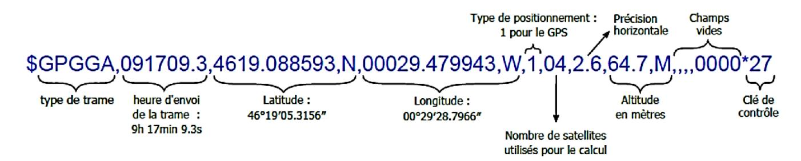

Figure 20 : Trame complète transmise par le module GPS

**Question E7.** À l'aide de la figure 20, **déterminer** le nombre d'octets contenus dans une trame complète transmise par le module GPS à la carte de contrôle. **En déduire** le temps nécessaire pour transmettre cette trame.

Le robot se déplace à une vitesse maximale de 6 kmh-1. L'exigence de précision de mesure de la position du robot est fixée à 1 cm.

**Question E8. Déterminer** la distance maximale parcourue par le robot pendant l'intervalle de temps nécessaire à la transmission de la trame entre le module GPS et la carte de contrôle. **Conclure** vis-à-vis de l'exigence de précision de la mesure de position.

### **PARTIE F : Instrumentation du robot Bakus**

L'objectif de cette partie est l'étude de la chaîne d'acquisition des grandeurs nécessaires à la conduite autonome du robot Bakus. L'étude se centre sur la mesure du niveau de charge de la batterie et sur la détection de pente qui permet d'éviter le basculement du robot.

La figure 21 illustre le niveau de tension aux bornes d'une batterie en fonction de sa profondeur de décharge pour deux technologies différentes. Les batteries utilisées dans le robot Bakus sont de type Lithium-Ion. Afin de préserver la durée de vie de la batterie, on déclenche le retour du robot Bakus à l'entrepôt lorsque la profondeur de décharge atteint 80 %.

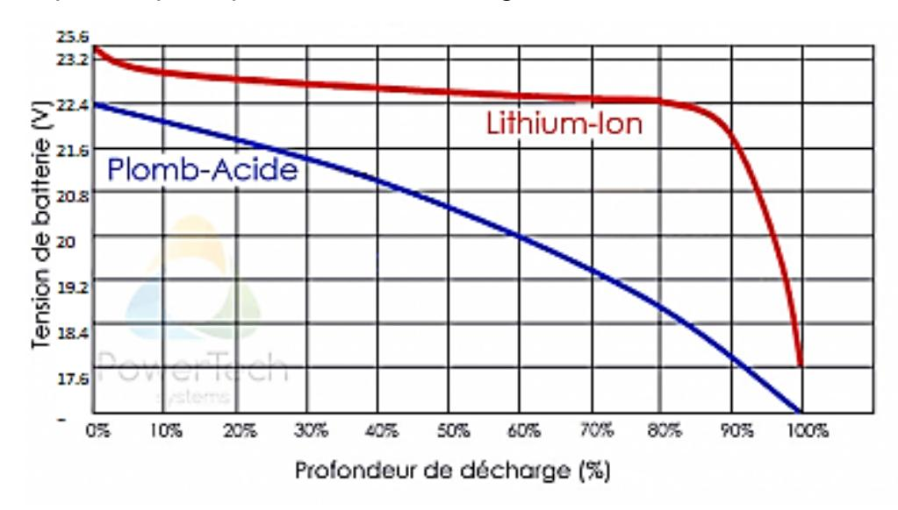

Figure 21 : Courbe de décharge pour des batteries Lithium-Ion et Plomb-Acide

**Question F1.** À l'aide de la figure 21, **déterminer** le seuil de tension aux bornes de la batterie qui correspond au déclenchement du retour à l'entrepôt.

La tension aux bornes de la batterie étant trop élevée pour pouvoir être traitée directement par la carte de contrôle du robot Bakus, une adaptation du niveau de tension est donc nécessaire. La figure 22 illustre le montage utilisé pour réaliser cette adaptation.

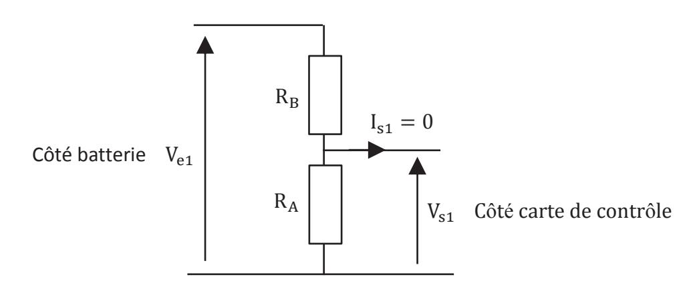

Figure 22 : Schéma du montage d'adaptation de la tension de la batterie

**Question F2. Déterminer** la relation entre  $R_A$  et  $R_B$  qui permet d'obtenir  $V_{s1} = \frac{V_{e1}}{10}$ . **Déterminer** les valeurs de la tension  $V_{s1}$  correspondant aux taux de décharge de 80 % et de 90 %.

Afin de pouvoir être traitée par la carte de contrôle du robot Bakus, la tension issue du montage d'adaptation illustré figure 22 est numérisée par un Convertisseur analogique numérique (CAN).

On rappelle que le quantum q d'un CAN se détermine par l'expression  $q = \frac{V_{ref1}}{2^N}$  où  $V_{ref1}$  est la tension de référence et N le nombre de bits du CAN. Dans la suite de l'étude, on considère que  $V_{ref1} = 4$  V et N = 10 bits

**Question F3. Déterminer** les valeurs décimales du mot binaire en sortie du CAN pour les taux de décharge de 80 % et de 90 %.

On souhaite obtenir une précision de la mesure du taux de décharge de 1 % dans la zone de la caractéristique correspondant à une décharge comprise entre 80 % et 90 %. On suppose que, dans cette zone, la tension aux bornes de la batterie évolue linéairement en fonction du taux de décharge.

Question F4. Déterminer la précision de mesure du taux de décharge dans la zone de la caractéristique correspondant à une décharge comprise entre 80 % et 90 %.
Conclure quant au respect de l'exigence de précision de la mesure du taux de décharge.

L'électronique embarquée dans le robot Bakus permet également la détection de pente importante afin d'éviter le basculement du robot. Les vignes, pour optimiser leur ensoleillement, sont situées sur des coteaux. L'enjambeur autonome doit évoluer sur ces pentes en garantissant la sécurité du personnel responsable ou des personnes travaillant dans le rang d'à côté ainsi que sa propre sécurité

Question F5. À l'aide du document technique DT5, déterminer la pente de travail maximale autorisée pour le robot Bakus. À l'aide des documents techniques DT8 et DT9, déterminer les différents comportements adoptés par le robot Bakus en fonction de la pente sur laquelle il évolue.

Deux centrales inertielles sont utilisées pour prendre la mesure de l'assiette du robot Bakus. On considère pour l'étude du système que les valeurs de sorties analogiques une fois traitées évoluent de manière proportionnelle entre 0 V et 5 V pour des inclinaisons respectives comprises entre 0 % et +50 %.

Pour éviter des changements d'état intempestifs autour de la tension correspondante à la valeur de pente 25 %, un comparateur inverseur à hystérésis (à caractéristique descendante) est utilisé. Ce comparateur est réalisé à l'aide d'un amplificateur linéaire intégré (ALI) considéré parfait. La figure 23 illustre le montage électronique correspondant.

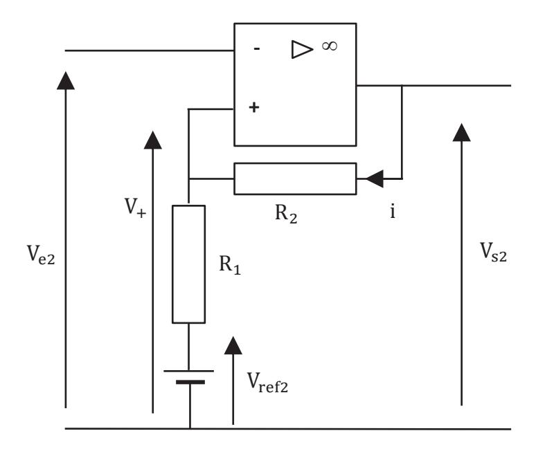

Figure 23 : Schéma du comparateur inverseur à hystérésis

**Question F6.** À l'aide de la figure 24, **déterminer** l'expression littérale du courant i traversant  $R_2$  en fonction de  $V_{ref2}$ ,  $V_{s2}$ ,  $R_2$  et  $R_1$ .

**Question F7. Démontrer** que l'expression de la tension  $V_+$  en fonction de  $V_{ref2}$ ,  $V_{s2}$ ,  $R_2$  et  $R_1$  s'écrit :

$$V_{+} = V_{ref2} \cdot \frac{R_2}{R_1 + R_2} + V_{s2} \cdot \frac{R_1}{R_1 + R_2}$$

Le montage illustré figure 23 est réalisé avec les caractéristiques suivantes :

- la tension V<sub>ref2</sub> est fixée à 2,42 V,
- l'amplificateur linéaire intégré est alimenté en ±15 V,
- on considère que les tensions de saturation en sortie de l'amplificateur linéaire intégré sont de  $\pm 15$  V.
- $R_1$  = 1 kΩ et  $R_2$  = 150 kΩ.

Question F8. Calculer les valeurs de V<sub>+</sub> correspondant aux seuils de basculements du comparateur.

Question F9. Représenter sur le document réponse DR6 la caractéristique V<sub>s2</sub> en fonction de V<sub>e2</sub>.

La tension  $V_{\rm s2}$  est utilisée pour détecter le passage du robot du mode autonome vers le mode manuel si une pente supérieure à 25 % est détectée. Le retour au mode autonome du robot n'est possible qu'après une intervention humaine et le retour du robot sur un terrain dont la pente est inférieure à 23 %. On considère que la tension issue des sorties analogiques des centrales inertielles permettant de mesurer l'inclinaison évolue proportionnellement entre 0 V et 5 V pour des inclinaisons respectives comprises entre 0 % et +50 %. Cette tension correspond à la tension  $V_{\rm e2}$  illustrée figure 23.

Question F10. Conclure quant à la conformité du montage illustré figure 23 vis-à-vis du basculement attendu entre le mode autonome et le mode manuel du robot Bakus.

# **Données de production énergétique solaire pour une installation sur le toit du hangar**

Remarque : la pente et l'orientation du toit du hangar correspondent aux valeurs optimales des angles d'inclinaison et d'azimut.

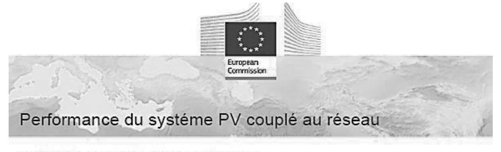

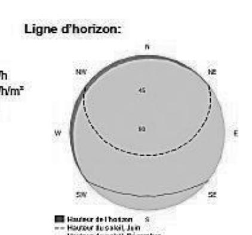

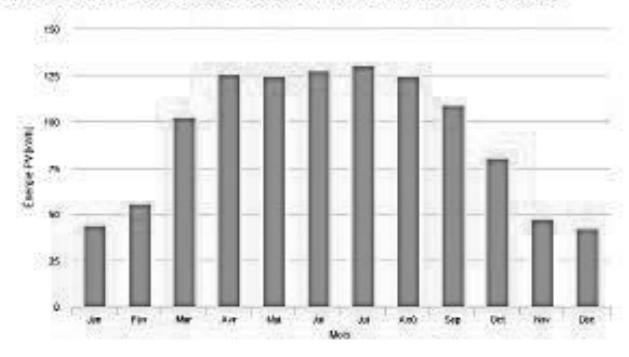

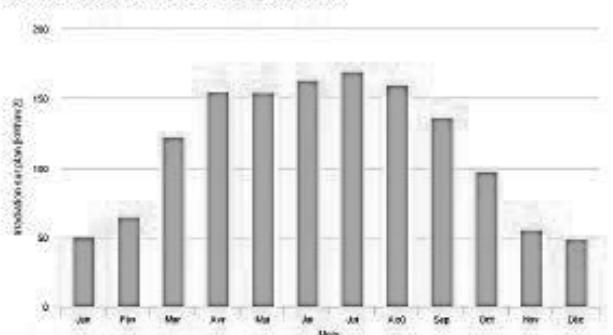

| Mois      | E_m   | H(i)_m | SD_n |
|-----------|-------|--------|------|
| Janvier   | 44.0  | 50.7   | 9.1  |
| Février   | 55.8  | 65.0   | 14.6 |
| Mars      | 102.2 | 121.8  | 18.5 |
| Avril     | 125.6 | 154.9  | 21.2 |
| Mai       | 124.1 | 154.4  | 20.5 |
| Juin      | 127.8 | 163.3  | 18.1 |
| Juillet   | 130.5 | 169.4  | 14.5 |
| Août      | 124.3 | 159.5  | 14.1 |
| Septembre | 108.9 | 136.7  | 6.9  |
| Octobre   | 80.3  | 97.3   | 7.8  |
| Novembre  | 47.1  | 55.6   | 8.7  |
| Décembre  | 41.9  | 48.9   | 12.4 |

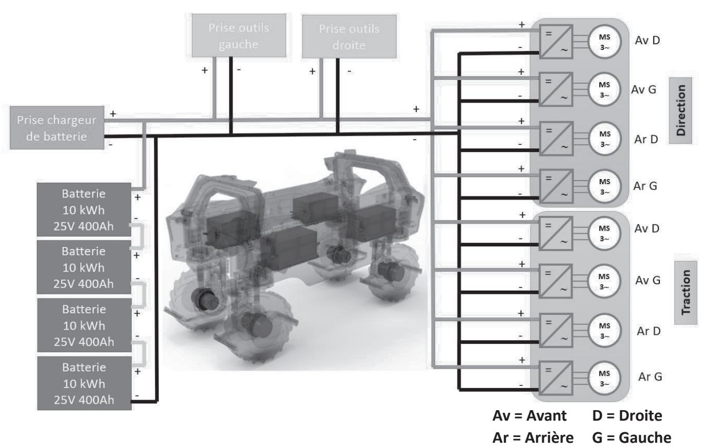

### **Schéma de puissance simplifié du robot Bakus**

Caractéristiques des cellules élémentaires Lithium-ion utilisées pour la constitution des batteries du robot Bakus

| Référence de la batterie                  | 18650           |
|-------------------------------------------|-----------------|
| Batterie chimique                         | Li-ion          |
| Batterie                                  | Rechargeable    |
| Tension nominale                          | 3,6 V           |
| Min. capacité                             | 3 300 mAh       |
| Version batterie                          | Haut plat       |
| Courant de décharge                       | 4,8 A           |
| Résistance interne                        | 15 mΩ           |
| Protection des circuits                   | Non protégé     |
| Hauteur                                   | 64,90 mm        |
| Diamètre                                  | 18,20 mm        |
| Tension de fin de cycle de<br>charge      | 4,20 V ± 0,05 V |
| Ne pas décharger plus<br>profondément que | 2,5 V           |

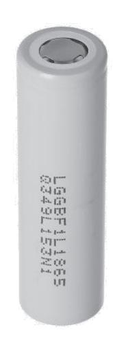

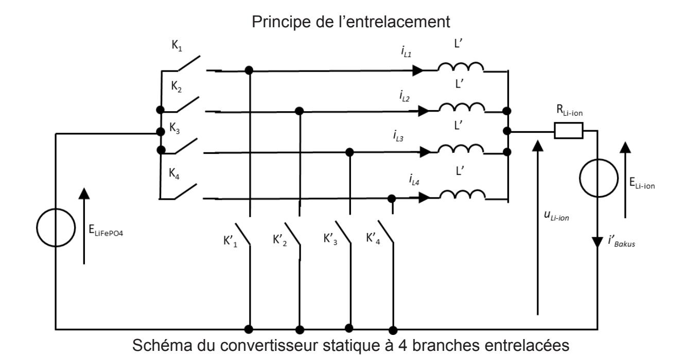

L'interrupteur  $K_1$  conduit de pour  $t \in [0; \alpha T[$ .  $K'_1$  conduit le reste de la période. De manière générale, les interrupteurs  $K_x$  (pour x allant de 1 à 4) conduisent pendant une durée de  $\alpha T$  sachant que les interrupteurs  $K'_x$  conduisent de manière complémentaire sur le reste de la période de conduction de leurs interrupteurs  $K_x$  associés. Chaque commande de branche est décalée de T/4 de façon régulière les unes par rapport aux autres avec un rapport cyclique identique pour chaque branche. Chronogrammes des courants

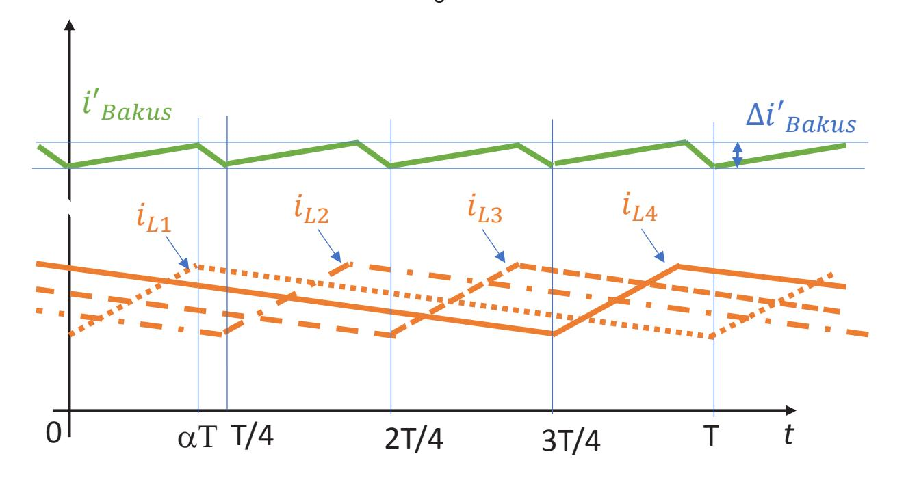

## Actionneur linéaire ELECTRAK HD

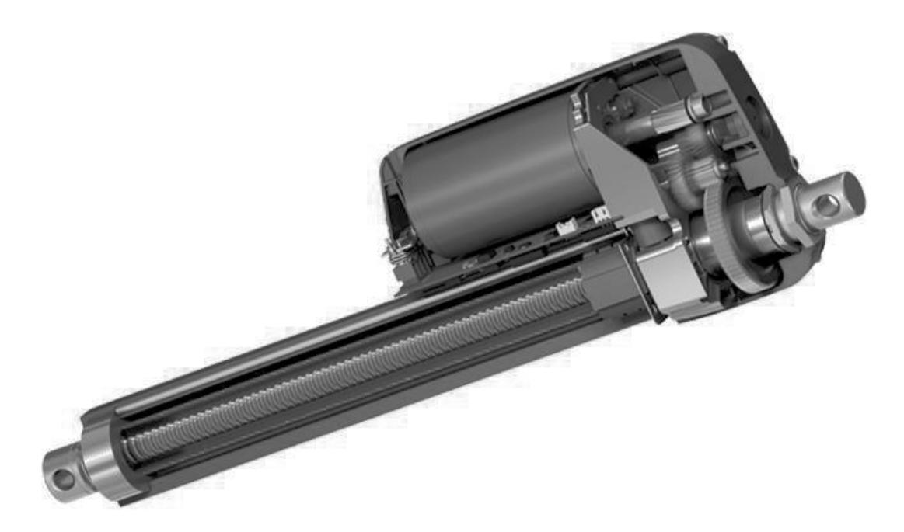

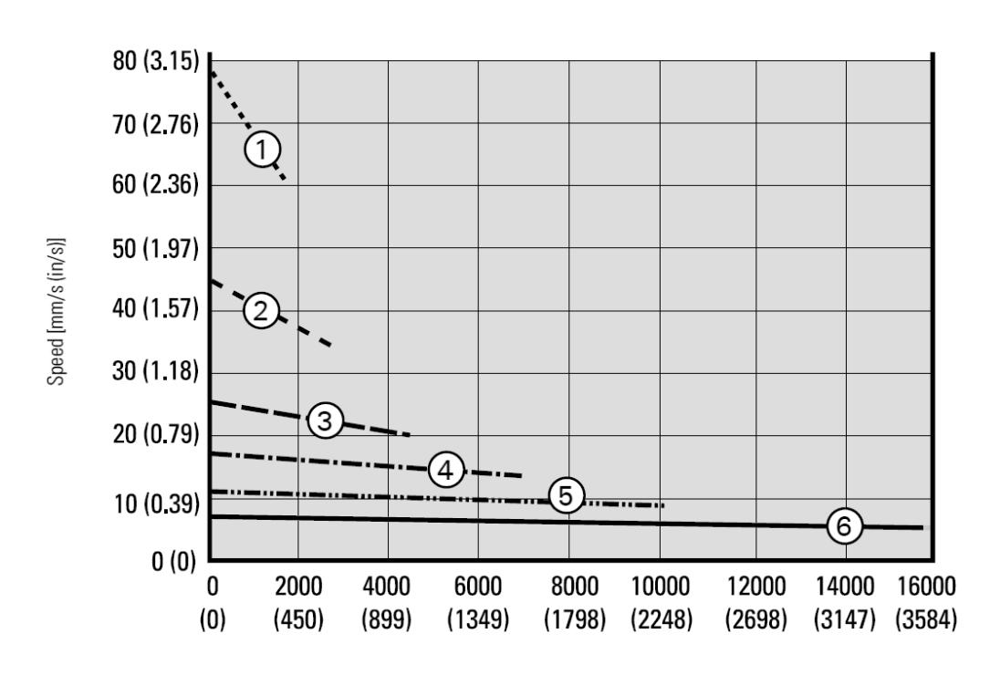

| 1. HDxxB017 (1.7 kN (382 lbf)) | 3. HDxxB045 (4.5 kN (1012 lbf)) — — — | 5. HDxxB100 (10 kN (2248 lbf)) |
|--------------------------------|---------------------------------------|--------------------------------|
| 2. HDxxB026 (2.6 kN (585 lbf)) | 4. HDxxB068 (6.8 kN (1529 lbf))       | 6. HDxxB160 (16 kN (3584 lbf)) |

| Dimensions     | (L) 3,50 m x (I) 1,75 m x (H) 2 m                                                          |                             | (L) 3,50 m x (I) 1,95 m x (H) 2,50 m |               |
|----------------|--------------------------------------------------------------------------------------------|-----------------------------|--------------------------------------|---------------|
| Passage H et l | (H) 1,75 m x (I) 0,60 m                                                                    |                             | (H) 2,20 m x (I) 0,80 m              |               |
| Voie           | 1,10 m                                                                                     |                             | 1,30                                 | ) m           |
| Poids à vide   | P40S: 2 000 kg                                                                             | P60S: 2050 kg               | P40L: 2 050 kg                       | P60L: 2100 kg |
| Pneumatiques   | Michelin Multibib 320/65 R16 - Basse pression 0.9 bar (Faible tassement et respect du sol) |                             |                                      |               |
| Châssis        | Mécano soudé - finition thermolaquée                                                       |                             |                                      |               |
| Suspensions    | Am                                                                                         | ortisseurs à l'avant et jar | mbes de roues fixes à l'arri         | ère           |

|            | · · · · · · · · · · · · · · · · · · ·              |
|------------|----------------------------------------------------|
| Contrôle   | 1 smartphone pour commander le Bakus via 4G        |
| Sécurité   | Bords sensibles, devant et derrière chaque roue    |
|            | Multiples capteurs sous carrosserie                |
|            | 6 boutons d'arrêts d'urgences tout autour du Bakus |
| Navigation | 2 centrales inertielles                            |
|            | 2 GPS RTK, précision centimétrique                 |

| Batteries           | 4 batteries Lithium Ion pour un total de 40/60kWh*, 400/600Ah*, 100 V (* Selon modèle)                                                                                   |  |  |  |
|---------------------|--------------------------------------------------------------------------------------------------------------------------------------------------------------------------|--|--|--|
| Poids               | 4 blocs de 60/90 kg* répartis uniformément sur chaque essieu (*Selon modèle)                                                                                             |  |  |  |
| Autonomie           | Environ 10 h, suivant la pente, la nature du terrain et les outils                                                                                                       |  |  |  |
| Durée de vie        | 7 ans à 70 % de sa capacité nominale. Valeurs minimum attendues en cas de respect des<br>recommandations. À titre indicatif, cela représente plus de 10 000 h de travail |  |  |  |
| Sécurité électrique | Protection contre : courts-circuits, surintensités, décharges profondes, anomalies thermiques                                                                            |  |  |  |

| Charran   | Une gamme de chargeurs en 220V ou 380V                                |
|-----------|-----------------------------------------------------------------------|
| Chargeurs | Recharge de 0 % à 80 % en 2h ou recharge complète en 10h selon modèle |

| Moteurs de roues  | 4 moteurs électriques brushless (sans entretien) avec récupération d'énergie en descente                       |  |  |  |
|-------------------|----------------------------------------------------------------------------------------------------------------|--|--|--|
| Moto-réducteurs   | 4 réducteurs planétaires intégrés dans chaque roue (faible entretien) - couple important                       |  |  |  |
| Direction         | 4 moteurs de direction, électriques et indépendants, pivot à ± 120° (permettant tous les mouvements souhaités) |  |  |  |
| Vitesse           | 6 km/h Vitesse maxi                                                                                            |  |  |  |
| Force de traction | 1800 Kg                                                                                                        |  |  |  |
| Puissance         | 48 kw                                                                                                          |  |  |  |

| Dimensions          | (L) 118 cm x (H) 107 cm                |
|---------------------|----------------------------------------|
| Poids               | 160 kg                                 |
| Système de relevage | Vérin hydro-électrique, sans entretien |
| Course              | 680 mm                                 |


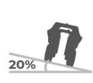

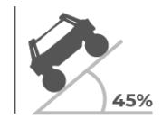


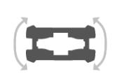

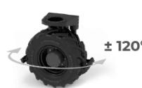

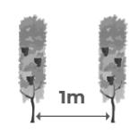


### Difference Between GPS and DGPS:

- 1. In GPS world, handheld device receive signal from the satellite for the position where as in DGPS world hand held device (rover) receives calibrated signal from the ground based transmitter.
- 2. GPS accuracy is around 15 meters whereas DGPS is around 10 cm.
- 3. GPS instrument can be used globally where as DGPS are meant locally may be within 100km. DGPS accuracy will start to degrade once instrument distance from ground based transmitters start to increase. Best results by the United States Department of Transportation was 0.67 m error growth within 100 km.
- **4.** GPS system is affordable compare to DGPS system which is why all smart phones have built-in GPS system.
- 5. In GPS satellite transmit signal in frequency ranging from 1.1 to 1.5 GHz. In DGPS frequency varies by agencies, here is the list of frequency used by different agency.
- 6. GPS accuracy is highly depend upon the number of satellites used for the calculation, for example there will be better accuracy on open space compare to the forested area, read this. DGPS accuracy is not affected by these variables, it might be affected by the distance between transmitters and the instrument (rover).
- 7. Most of the time coordinate system used in GPS will be WGS84 in Longitude and Latitude format where as DGPS might have local coordinate system.

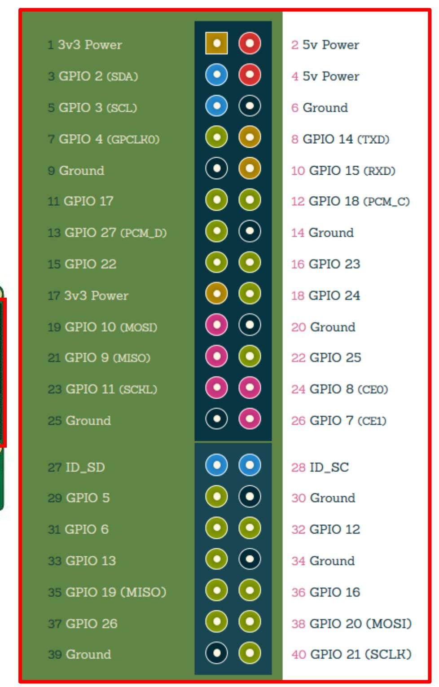

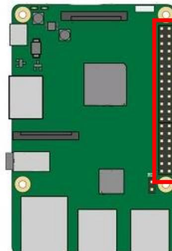


| Pente (%)      | Vitesse Max (km/h)       |
|----------------|--------------------------|
| Entre 0 et 25  | 6                        |
| Entre 25 et 45 | de 6 à 2,5 (décroissant) |
| Supérieur à 45 | 2,5                      |

| Mode     | Devers(%)      | Vitesse Max (km/h)          |
|----------|----------------|-----------------------------|
| Autonome | Entre 0 et 15  | 6                           |
| Autonome | Entre 15 et 25 | de 6 à 1 (décroissant)      |
| Autonome | Supérieur à 25 | Coupure mode autonome       |
| Manuel   | Entre 0 et 15  | 6                           |
| Manuel   | Entre 15 et 25 | de 6 à 1 (décroissant)      |
| Manuel   | Entre 25 et 35 | 1                           |
| Manuel   | Supérieur à 35 | Intervention Service Client |

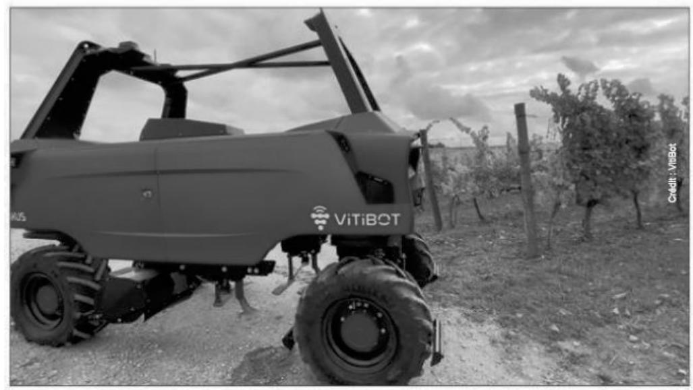

Verzeaux, Anne. « Bakus et tous ses outils. » La Marne viticole, mars 2021, p12.

|                                                                                                                                                                                                                                                                                                                                                                                                                                                                                                                                                                                              | OOC v2 ©NEOPTEC               | П          | T            | T         |          | Ī      |         |          |         |        |      | Ī      | ĺ |   |  |    | 1 | 1 |  |  |
|----------------------------------------------------------------------------------------------------------------------------------------------------------------------------------------------------------------------------------------------------------------------------------------------------------------------------------------------------------------------------------------------------------------------------------------------------------------------------------------------------------------------------------------------------------------------------------------------|-------------------------------|------------|--------------|-----------|----------|--------|---------|----------|---------|--------|------|--------|---|---|--|----|---|---|--|--|
|                                                                                                                                                                                                                                                                                                                                                                                                                                                                                                                                                                                              | a lieu, du nom d'usage)       |            |              |           |          |        |         |          |         |        |      |        |   |   |  |    |   |   |  |  |
|                                                                                                                                                                                                                                                                                                                                                                                                                                                                                                                                                                                              | Prénom(s) :                   |            |              |           |          |        |         |          |         |        |      |        |   |   |  |    |   |   |  |  |
|                                                                                                                                                                                                                                                                                                                                                                                                                                                                                                                                                                                              | Numéro<br>Inscription :       |            |              |           |          |        |         |          |         |        | Né(e | ) le : |   | / |  | ]/ |   |   |  |  |
|                                                                                                                                                                                                                                                                                                                                                                                                                                                                                                                                                                                              | (Le                           | e numéro e | est celui qu | ıi figure | sur la c | onvoca | tion ou | la feuil | le d'ém | argeme | nt)  |        |   |   |  |    |   |   |  |  |
| (Remplir cette partie à l'aide de la notice)  Concours / Examen : Section/Spécialité/Série :                                                                                                                                                                                                                                                                                                                                                                                                                                                                                                 |                               |            |              |           |          |        |         |          |         |        |      |        |   |   |  |    |   |   |  |  |
|                                                                                                                                                                                                                                                                                                                                                                                                                                                                                                                                                                                              | Epreuve : Matière : Session : |            |              |           |          |        |         |          |         |        |      |        |   |   |  |    |   |   |  |  |
| <ul> <li>Remplir soigneusement, sur CHAQUE feuille officielle, la zone d'identification en MAJUSCULES.</li> <li>Ne pas signer la composition et ne pas y apporter de signe distinctif pouvant indiquer sa provenance.</li> <li>Numéroter chaque PAGE (cadre en bas à droite de la page) et placer les feuilles dans le bon sens et dans l'ordre.</li> <li>Rédiger avec un stylo à encre foncée (bleue ou noire) et ne pas utiliser de stylo plume à encre claire.</li> <li>N'effectuer aveun collage ou découpage de sujets ou de feuille officielle. Ne joindre aucun brouillen.</li> </ul> |                               |            |              |           |          |        |         |          |         |        |      |        |   |   |  |    |   |   |  |  |

EDE ENE 1

# **DR1 - DR2 - DR3**

Tous les documents réponses sont à rendre, même non complétés.


# **Production énergétique et consommation du robot Bakus sur l'année**

| Mois      | Production mensuelle<br>d'un panneau<br>photovoltaïque<br>d'1kWp<br>installé<br>sur le<br>hangar<br>(en kWh) | Consommation<br>mensuelle du robot<br>Bakus<br>(en kWh) | Surplus<br>mensuel<br>d'énergie<br>produite<br>par l'ensemble de<br>l'installation de panneaux<br>photovoltaïques<br>(en kWh) |
|-----------|--------------------------------------------------------------------------------------------------------------|---------------------------------------------------------|-------------------------------------------------------------------------------------------------------------------------------|
| Janvier   | 44                                                                                                           |                                                         |                                                                                                                               |
| Février   | 55,8                                                                                                         |                                                         |                                                                                                                               |
| Mars      | 102,2                                                                                                        |                                                         |                                                                                                                               |
| Avril     | 125,6                                                                                                        |                                                         |                                                                                                                               |
| Mai       | 124,1                                                                                                        |                                                         |                                                                                                                               |
| Juin      | 127,8                                                                                                        |                                                         |                                                                                                                               |
| Juillet   | 130,5                                                                                                        |                                                         |                                                                                                                               |
| Août      | 124,3                                                                                                        |                                                         |                                                                                                                               |
| Septembre | 108,9                                                                                                        |                                                         |                                                                                                                               |
| Octobre   | 80,3                                                                                                         |                                                         |                                                                                                                               |
| Novembre  | 47,1                                                                                                         |                                                         |                                                                                                                               |
| Décembre  | 41,9                                                                                                         |                                                         |                                                                                                                               |

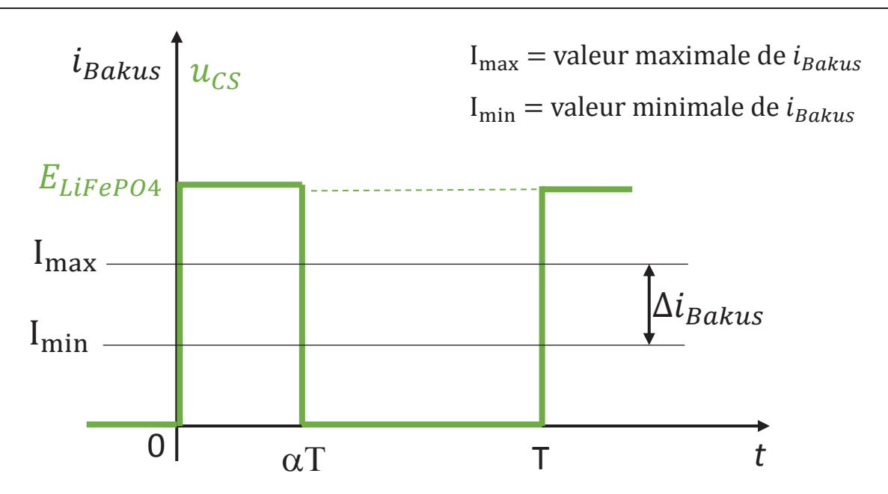

## **DOCUMENT REPONSE DR3**

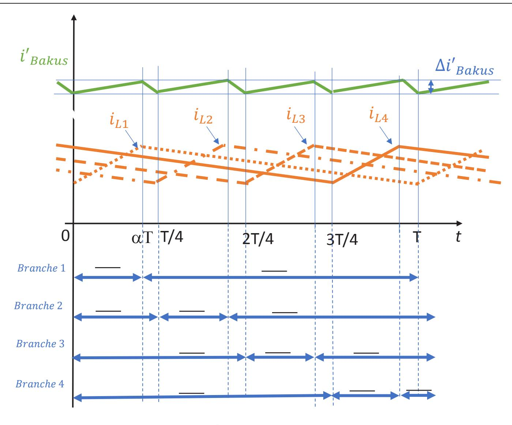

Page 34 sur 36

| Modèle CMEN-                                                                                                                                                                                                                                                                                                                                                                                                                                                                                                                                                                                 | OOC v2 ©NEOPTEC                           | $\overline{}$ |              | _         |          |        |         |           |         |        |      | _       | _ |   |  | $\overline{}$ |  |  | $\overline{}$ |
|----------------------------------------------------------------------------------------------------------------------------------------------------------------------------------------------------------------------------------------------------------------------------------------------------------------------------------------------------------------------------------------------------------------------------------------------------------------------------------------------------------------------------------------------------------------------------------------------|-------------------------------------------|---------------|--------------|-----------|----------|--------|---------|-----------|---------|--------|------|---------|---|---|--|---------------|--|--|---------------|
|                                                                                                                                                                                                                                                                                                                                                                                                                                                                                                                                                                                              | n de famille :<br>a lieu, du nom d'usage) | Ш             |              |           |          |        |         |           |         |        |      | $\perp$ |   |   |  | Ш             |  |  |               |
|                                                                                                                                                                                                                                                                                                                                                                                                                                                                                                                                                                                              | Prénom(s) :                               |               |              |           |          |        |         |           |         |        |      |         |   |   |  |               |  |  |               |
|                                                                                                                                                                                                                                                                                                                                                                                                                                                                                                                                                                                              | Numéro<br>Inscription :                   |               |              |           |          |        |         |           |         |        | Né(  | e) le   |   | / |  | ]/            |  |  |               |
|                                                                                                                                                                                                                                                                                                                                                                                                                                                                                                                                                                                              | (Le                                       | e numéro      | est celui qu | ii figure | sur la c | onvoca | tion ou | la feuili | le d'ém | argeme | ent) |         |   |   |  |               |  |  |               |
| (Remplir cette partie à l'aide de la notice)  Concours / Examen : Section/Spécialité/Série :                                                                                                                                                                                                                                                                                                                                                                                                                                                                                                 |                                           |               |              |           |          |        |         |           |         |        |      |         |   |   |  |               |  |  |               |
|                                                                                                                                                                                                                                                                                                                                                                                                                                                                                                                                                                                              | Epreuve : Matière : Session :             |               |              |           |          |        |         |           |         |        |      |         |   |   |  |               |  |  |               |
| <ul> <li>Remplir soigneusement, sur CHAQUE feuille officielle, la zone d'identification en MAJUSCULES.</li> <li>Ne pas signer la composition et ne pas y apporter de signe distinctif pouvant indiquer sa provenance.</li> <li>Numéroter chaque PAGE (cadre en bas à droite de la page) et placer les feuilles dans le bon sens et dans l'ordre.</li> <li>Rédiger avec un stylo à encre foncée (bleue ou noire) et ne pas utiliser de stylo plume à encre claire.</li> <li>N'effectuer aveur collage ou découpage de sujets ou de feuille officielle. Ne joindre aucun brouillon.</li> </ul> |                                           |               |              |           |          |        |         |           |         |        |      |         |   |   |  |               |  |  |               |

EDE ENE 1

# **DR4 - DR5 - DR6**

Tous les documents réponses sont à rendre, même non complétés.


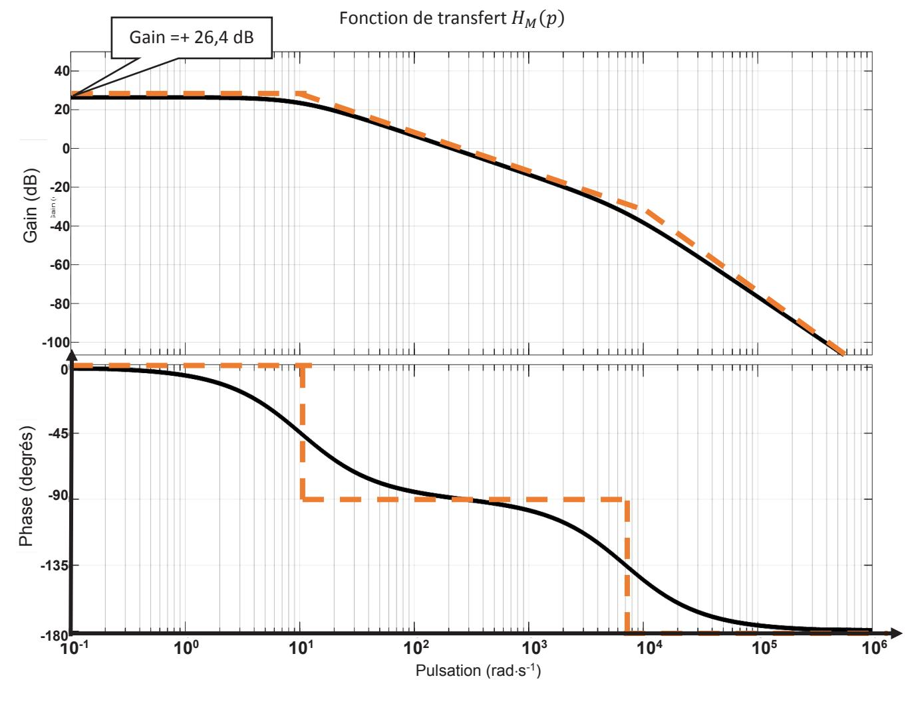

Diagramme de Bode de ()

Diagramme asymptotique de Bode de ()

# **Rappel de la marge phase**

Soit Ula pulsation pour laquelle

$$\left| \frac{H_{BO}}{1} (j\omega_u) \right| = 1$$

La marge de phase M est :

$$M\varphi = Arg \left[ \underline{H_{BO}} (j\omega_u) \right] - (-180^\circ)$$

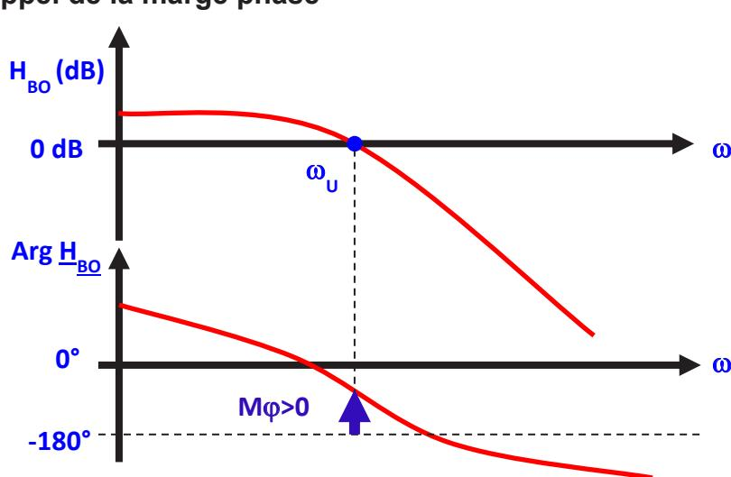

Page 35 sur 36

L'espace entre deux traits pointillés, représente la largeur d'un bit*.*

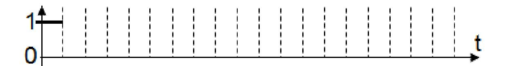

# **DOCUMENT REPONSE DR6**

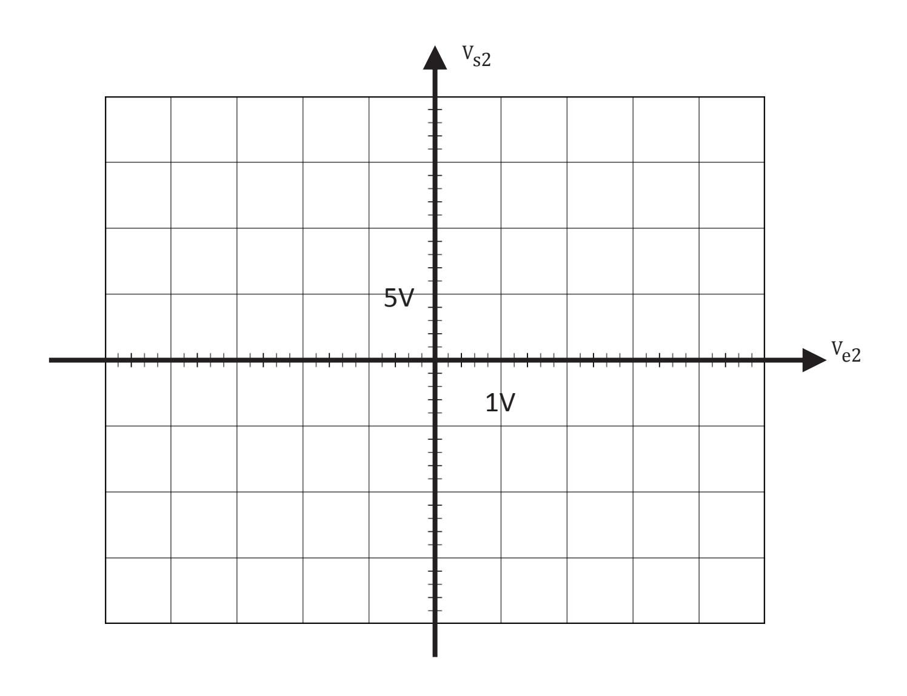