**EDE STI 2**

#### **SESSION 2024** \_\_\_\_

CAPET CONCOURS EXTERNE ET CAFEP CORRESPONDANT

**Section : SCIENCES INDUSTRIELLES DE L'INGÉNIEUR Option : INGÉNIERIE DES CONSTRUCTIONS**

> **Option : INGÉNIERIE ÉLECTRIQUE Option : INGÉNIERIE INFORMATIQUE Option : INGÉNIERIE MÉCANIQUE**

# **ÉPREUVE ÉCRITE DISCIPLINAIRE APPLIQUÉE**

Durée : 5 heures \_\_\_\_

*Calculatrice autorisée selon les modalités de la circulaire du 17 juin 2021 publiée au BOEN du 29 juillet 2021.*

*L'usage de tout ouvrage de référence, de tout dictionnaire et de tout autre matériel électronique est rigoureusement interdit.*

*Il appartient au candidat de vérifier qu'il a reçu un sujet complet et correspondant à l'épreuve à laquelle il se présente.* 

*Si vous repérez ce qui vous semble être une erreur d'énoncé, vous devez le signaler très lisiblement sur votre copie, en proposer la correction et poursuivre l'épreuve en conséquence. De même, si cela vous conduit à formuler une ou plusieurs hypothèses, vous devez la (ou les) mentionner explicitement.*

**NB : Conformément au principe d'anonymat, votre copie ne doit comporter aucun signe distinctif, tel que nom, signature, origine, etc. Si le travail qui vous est demandé consiste notamment en la rédaction d'un projet ou d'une note, vous devrez impérativement vous abstenir de la signer ou de l'identifier. Le fait de rendre une copie blanche est éliminatoire.**

#### **INFORMATION AUX CANDIDATS**

**Vous trouverez ci-après les codes nécessaires vous permettant de compléter les rubriques figurant en en-tête de votre copie. Ces codes doivent être reportés sur chacune des copies que vous remettrez.**

#### **Concours externe du CAPET de l'enseignement public :**

**• option** : **Ingénierie des constructions**

| Concours EDE • option : Ingénierie électrique                                            | Section/option 1411E | Epreuve 102      | Matière 9312 |
|------------------------------------------------------------------------------------------------|-------------------------|---------------------|-----------------|
| Concours EDE • option : Ingénierie informatique                                          | Section/option 1412E | Epreuve 102      | Matière 9312 |
| Concours EDE • option : Ingénierie mécanique                                             | Section/option 1413E | Epreuve 102      | Matière 9312 |
| Concours EDE ► Concours externe du CAFEP/CAPET de l'enseignement privé                   | Section/option 1414E | Epreuve 102 : | Matière 9312 |
|                                                                                                |                         |                     |                 |
| • option : Ingénierie des constructions Concours EDF • option : Ingénierie électrique | Section/option 1411E | Epreuve 102      | Matière 9312 |
| Concours EDF • option : Ingénierie informatique                                          | Section/option 1412E | Epreuve 102      | Matière 9312 |
| Concours EDF • option : Ingénierie mécanique                                             | Section/option 1413E | Epreuve 102      | Matière 9312 |
| Concours EDF                                                                                | Section/option 1414E | Epreuve 102      | Matière 9312 |

# **Définition de l'épreuve**

L'épreuve, commune à toutes les options, porte sur l'analyse et l'exploitation pédagogique d'un système pluri-technologique. Elle invite le candidat à la conception d'une séquence d'enseignement, à partir d'une problématique et d'un cahier des charges.

L'épreuve permet de vérifier :

- que le candidat est capable de mobiliser ses connaissances scientifiques et technologiques pour conduire une analyse systémique, élaborer et exploiter les modèles de comportement permettant de quantifier les performances d'un système pluri-technologique des points de vue de la matière, de l'énergie et/ou de l'information, afin de valider tout ou partie de la réponse au besoin exprimé par un cahier des charges ;
- qu'il est capable d'élaborer tout ou partie de l'organisation d'une séquence pédagogique ainsi que les documents techniques et pédagogiques associés (documents professeurs, documents fournis aux élèves, éléments d'évaluation).

Les productions pédagogiques attendues sont relatives à une séquence d'enseignement portant sur les programmes de collège ou de lycée.

# **Conseils aux candidats**

Il est demandé aux candidats :

- de rédiger les réponses aux différentes parties sur des feuilles de copie séparées et clairement repérées ;
- de numéroter chaque feuille de copie et indiquer le numéro de la question traitée ;
- de rendre tous les documents réponses, même non complétés ;
- d'utiliser exclusivement les notations indiquées dans le sujet lors de la rédaction des réponses ;
- de justifier clairement les réponses ;
- d'encadrer ou souligner les résultats ;
- de présenter lisiblement les applications numériques, sans omettre les unités, après avoir explicité les expressions littérales des calculs ;
- de formuler les hypothèses nécessaires à la résolution des problèmes posés si celles-ci ne sont pas indiquées dans le sujet.

# **Étude proposée**

Le support d'étude est l'Urbanloop présenté en page suivante.

L'étude est décomposée en 6 parties indépendantes.

Ce sujet se décompose de la façon suivante :

- texte du sujet, pages 2 à 20 ;
- documents techniques DT1 à DT8, pages 21 à 29 ;
- documents réponses DR1 à DR7, pages 30 à 38, à rendre avec la copie.

# **L'URBANLOOP**

L'enseignement de spécialité de sciences de l'ingénieur (SI) du baccalauréat général invite les enseignants à contextualiser leurs enseignements dans de grandes thématiques, en particulier celle de la mobilité des personnes et des biens. L'Urbanloop est choisi comme un des supports transversaux pour une classe de première ayant choisi la spécialité SI. Le volume horaire d'enseignement est de quatre heures par semaine.

## **PARTIE 1. MISE EN SITUATION**

#### **1.1. Contexte général**

L'Urbanloop est un système innovant de transport public sur rail développé à l'origine en 2017 par trois écoles d'ingénieurs (les Mines de Nancy, Télécom Nancy, l'école de géologie de Nancy) et trois laboratoires de recherche (le CRAN, le LORIA et le GREEN). Depuis 2019, le développement de l'Urbanloop est assuré par la société SAS Urbanloop.

L'étude qui suit porte sur le prototype de février 2022 ; depuis certaines solutions techniques ont évolué et/ou ne sont plus d'actualité.

Ce système de transport est fondé sur un nouveau concept basé sur le déplacement individuel au lieu de collectif. Cette solution devrait permettre d'obtenir un réseau de transport sans attente à quai, sans arrêt intermédiaire et sans correspondance.

Elle devrait pouvoir concurrencer les systèmes de transport individuel tels que la voiture en assurant un temps de trajet minimal.

Le système est principalement constitué de rails et de capsules (voir figure 1). La masse d'une capsule en charge est d'une tonne. Elle peut accueillir une ou deux personnes, une personne et deux enfants, une personne à mobilité réduite et son accompagnateur ou une personne et un vélo. Le rail cumule les fonctions de support, de guidage et d'alimentation électrique du matériel roulant. Les capsules sont équipées de quatre roues avec pneus et se déplacent sur le circuit sans autre action de la part du ou des utilisateurs que celle de la sélection de la destination. Chaque roue est motorisée par une machine synchrone.

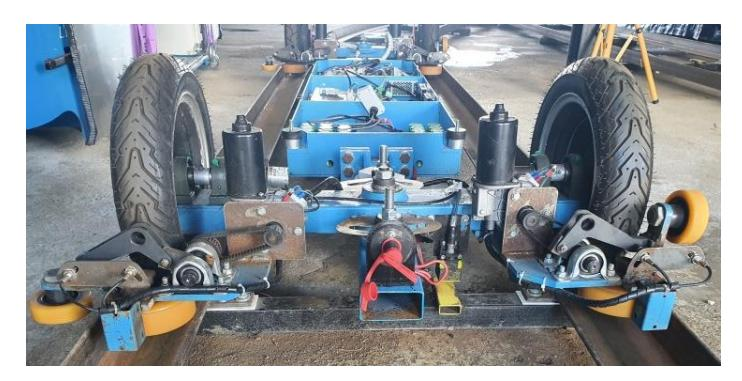

Figure 1 – Capsule et rails Urbanloop

Le système Urbanloop a battu le record du monde de plus faible consommation énergétique pour un véhicule autonome sur rail en 2021 (0,05 kWh par km) et a été sélectionné pour présenter cette technologie lors des Jeux Olympiques et Paralympiques Paris (JOP) 2024.

Un démonstrateur de ce système sera mis en service à Saint-Quentin-en-Yvelines pour relier le vélodrome national (station 1) et la base nautique (station 2), voir tracé figure 2.

Ce tracé est composé d'une boucle avec un seul sens de parcours, deux stations et d'une zone technique ; 10 capsules circuleront sur ce parcours.

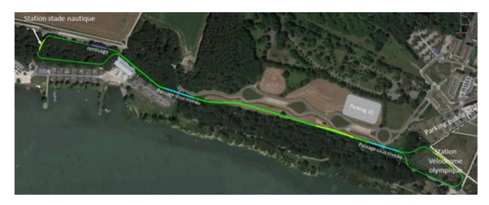

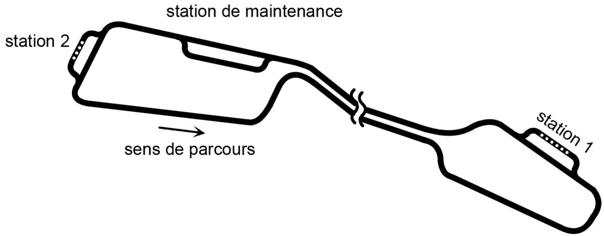

Figure 2 – Projet de tracé du parcours pour les JOP 2024

La station 1 a une capacité d'accueil de six capsules tandis qu'elle n'est que de quatre pour la station 2.

#### **1.2. Problématique**

L'Urbanloop répond à la problématique générale :

**« Transporter rapidement des personnes en environnement urbain et péri-urbain en ayant le moins d'impact possible sur l'environnement. »**

Le système étudié doit pour ce faire remplir plusieurs exigences dont :

- rejeter moins de CO2 que les transports urbains actuels ;
- avoir un coût du titre de transport au plus équivalent aux transports urbains actuels ;
- s'intégrer harmonieusement dans l'environnement urbain ;
- transporter les personnes en toute sécurité ;
- être alimenté par le réseau EDF ;
- permettre d'acheminer les personnes au bon endroit en toute autonomie.

L'objectif de cette étude est de valider les solutions techniques envisagées pour satisfaire ces exigences et de vérifier que le système répond bien à la problématique générale.

*Notations utilisées* : - *v*(*t*) vitesse linéaire d'une capsule en m·s-1 ; - *aC*(*t*) accélération d'une capsule en m·s-2 ;

- *MC* masse d'une capsule en kg.

## **1.3. Étude de la pertinence du concept Urbanloop**

*L'objectif est de comparer les moyens de transport traditionnels et l'Urbanloop.*

Afin de comparer le transport par bus et le transport par capsules, les hypothèses suivantes seront utilisées :

- la vitesse moyenne d'un bus est de 20 km·h-1 ;
- la capacité de transport d'un bus est de 50 personnes ;
- la vitesse moyenne des capsules est de 40 km·h-1 ;
- la capacité de transport d'une capsule est de deux personnes ;
- la longueur par la route est de 2 km entre la station 1 et la station 2 ;
- la longueur par le rail est de 1,1 km entre la station 1 et la station 2 ;
- le temps nécessaire pour le départ d'un bus (remplissage, ...) est de 2 min ;
- le temps nécessaire pour la descente des passagers d'un bus est de 1 min ;
- le temps nécessaire pour le départ d'une capsule (mise en stationnement, remplissage, choix de la destination,…) est de 30 s ;
- le temps nécessaire pour la descente de la capsule est de 15 s ;
- il y a toujours une capsule disponible pour un départ (hypothèse de disponibilité des capsules).

Pour comparer les différents moyens de transport ; l'étude porte sur un groupe de 50 personnes désirant se rendre de la station 1 à la station 2.

Les calculs de temps de trajet seront faits dans le cas de remplissage le plus favorable, c'est-à-dire 50 personnes dans le même bus et deux personnes par capsule.

- **Question 1** Le temps de trajet moyen pour le bus est donné sur le document réponse DR1. Justifier cette valeur numérique et le fait que la même valeur soit renseignée pour le premier arrivé et le dernier arrivé.
- **Question 2** Compléter le document réponse DR1 en calculant le temps de trajet entre les deux stations pour la première personne arrivée, la dernière arrivée et le temps moyen de transport pour 50 personnes pour le mode de transport Urbanloop.

La plus petite des stations, la station 2, ne peut accueillir que quatre capsules (voir figure 2).

**Question 3** Calculer le temps minimal pour faire partir les quatre capsules de la station 2 et le temps minimal pour faire venir une capsule de la station 1 à la station 2. Conclure sur la validité de l'hypothèse de disponibilité des capsules.

Les différents coûts des énergies et les consommations moyennes des différents modes de transports sont présentés dans les tableaux 1 et 2.

| Type d'énergie utilisée     | Électricité    | Gaz naturel | Gazole  |
|-----------------------------|----------------|-------------|---------|
| Coût des énergies par unité | 13 ct·kW-1 h-1 | 7,5 ct·kg-1 | 2 €·L-1 |

Tableau 1 – Coût des différentes énergies (*Source ministère de la transition écologique et solidaire estimation pour 2020*)

| Mode de transport    | Urbanloop | Bus GNV (gaz) | Bus diesel |
|----------------------|-----------|---------------|------------|
| Consommation moyenne | kWh·km-1  | kg·km-1       | L·km-1     |
|                      | 0,05      | 0,273         | 0,349      |

Tableau 2 – Consommation moyenne des différents modes de transports étudiés

- **Question 4** Compléter le document réponse DR1 en déterminant le coût des différents moyens de transport par kilomètre (coût pour 1 km pour un véhicule), puis le coût en euros du déplacement de 50 personnes dans le cas de remplissage le plus favorable pour 1 km (coût pour 50 personnes pour 1 km).
- **Question 5** En utilisant le document réponse DR1, conclure quant à la pertinence du moyen de transport Urbanloop par rapport au bus pour cette application qui est un démonstrateur. Élargir la réflexion pour une application urbaine et périurbaine.

L'enseignant de SI souhaite utiliser l'Urbanloop parmi d'autres systèmes pour introduire la compétence « Évaluer une solution ». En première approche, il souhaite montrer à ses étudiants qu'un ingénieur doit réfléchir de façon globale pour innover.

- **Question 6** Citer au moins trois grandes thématiques permettant d'évaluer si une solution est innovante ou non.
- **Question 7** Proposer la trame en quelques lignes d'une activité d'une heure inspirée de cette partie permettant de comparer l'Urbanloop et le bus du point de vue environnemental en début de première.

## **1.4. Étude de l'impact de la pose de la voie**

*L'objectif est de valider le dimensionnement retenu de la surface des pieds.*

Contrairement aux autres moyens de transport, le concept Urbanloop ne nécessite pas de gros travaux d'aménagement pour sa mise en place. L'infrastructure légère et compacte (taille d'un trottoir) est autoportante et ne nécessite pas de fondations.

Un tronçon de voie est constitué de deux rails de 6 m reposant sur 9 traverses et 18 pieds sans système de fixation afin de rendre la voie facilement démontable (voir figure 3). Chaque traverse, de masse 1 kg, repose sur deux pieds. La masse d'un pied est de 1 kg.

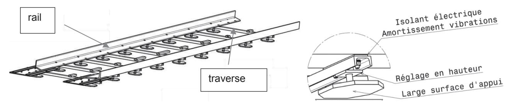

Figure 3 – Constitution d'un tronçon de voie (rails, traverses et pieds)

Pour assurer une bonne rigidité de la voie, la déformation des rails entre deux pieds ne doit pas être trop importante ; le cahier des charges impose une flèche maximale du rail inférieure à 0,1 mm.

Les résultats de simulation de déformation sont donnés pour deux espacements différents entre les traverses et deux sections différentes sur le document technique DT1.

**Question 8** En utilisant les résultats de simulation (document technique DT1), choisir la configuration (espacement entre les traverses et choix de section de rail) qui respecte le cahier des charges.

Ces dimensions donnent une masse pour un rail de 123,5 kg.

Pour ne pas endommager le sol, la pression au sol doit être faible et inférieure à 1 bar (105 Pa). La surface minimale de chaque pied est imposée par cette contrainte.

- **Question 9** Dans le cas le plus défavorable (présence d'une capsule de masse *MC* = 1 tonne sur ce tronçon de voie), donner l'expression et la valeur de la force *FSol*→*Pied* que le sol exerce sur chacun des pieds.
- **Question 10** Déterminer la surface minimale *SPiedMin* que doivent avoir les pieds pour garantir une pression au sol inférieure à la limite autorisée.
- **Question 11** Les concepteurs ont choisi des pieds d'une surface de 190 cm2. Justifier la pertinence de ce choix.

# **PARTIE 2. GESTION DU FREINAGE**

## **2.1. Dimensionnement du système de freinage**

*L'objectif est, pour une décélération donnée, de déterminer le nombre de capsules pouvant circuler en toute sécurité et de choisir les freins d'urgence à utiliser.*

La gestion des capsules étant entièrement automatisée ; il est nécessaire de limiter les risques de collisions entre capsules. Ces dernières envoient des informations régulièrement, en particulier leur position sur le parcours. Pour simplifier l'étude, seules deux capsules CA et CB sont considérées, la capsule CB suivant la capsule CA. Le profil de vitesse de la capsule CB est donné figure 4.

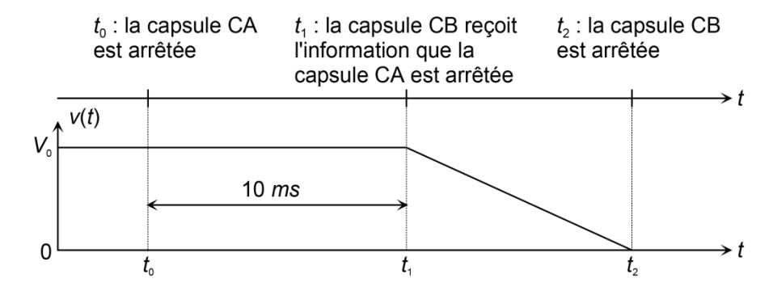

Figure 4 – Évolution de la vitesse de la capsule CB en fonction du temps

La décélération est de *aC* = -1,4 m·s-2. Il faut s'assurer que la capsule CA ne soit pas percutée par la capsule CB.

**Question 12** Donner l'expression littérale de *t*2 - *t*1 en fonction de *aC* et de *V*0.

**Question 13** Donner l'expression littérale de la distance minimale *Dmin* nécessaire entre les deux capsules lors de leurs circulations pour éviter que la capsule CB ne percute la capsule CA lors d'un arrêt brutal de cette dernière. Effectuer l'application numérique pour *V*0 = 60 km·h-1.

**Question 14** Calculer alors le nombre maximum de capsules *NCmax* pouvant circuler au même moment sur la boucle de Saint-Quentin-en-Yvelines de 2,2 km.

**Question 15** Conclure par rapport au nombre de capsules choisi pour cette application.

Le freinage d'urgence est réalisé à l'aide de freins à disque (voir figure 5). Il y a un frein par roue (deux roues à l'avant, deux roues à l'arrière). Les caractéristiques des freins avant et arrière sont données dans le tableau 3.

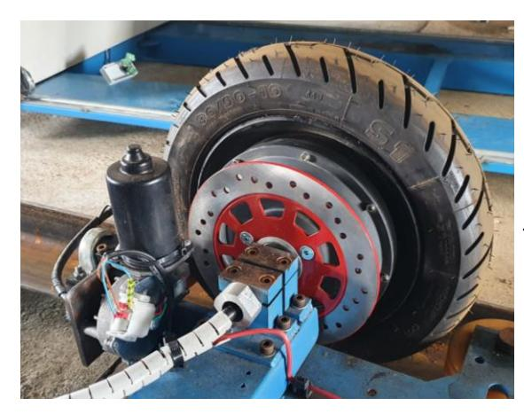

| Freins        | Couple de freinage d'un frein |
|---------------|-------------------------------|
| frein avant   | 150 N·m                    |
| frein arrière | 60 N·m                     |

Tableau 3 – Couple de freinage des freins de secours avant et arrière

Le rayon de la roue est *Rroue* = 20 cm.

Figure 5 - Freins à disques

**Question 16** Après avoir donné les résultantes tangentielles *TFAR* due au freinage sur une roue arrière et *TFAV* due au freinage sur une roue avant, déterminer numériquement la résultante tangentielle *TF* due à l'ensemble du freinage sur la capsule.

**Question 17** Vérifier que ce dispositif permet bien d'atteindre une décélération conforme à la décélération souhaitée de -1,4 m·s-2.

Pour des raisons de sécurité, le freinage en cas de défaillance d'un des freins doit tout de même être assuré.

**Question 18** Dans la situation la plus défavorable, vérifier que le système de freinage permet bien d'atteindre la décélération de -1,4 m·s-2 demandée. Si ce n'est pas le cas, proposer un autre choix de freins pour que le cahier des charges soit respecté (voir document technique DT2).

L'enseignant propose une évaluation en fin de première sur les actions mécaniques en utilisant le support de l'Urbanloop avec lequel les élèves sont déjà familiarisés. Deux copies d'élèves sont disponibles sur le document réponse DR2.

**Question 19** Compléter le document réponse DR2 (5 pages) en proposant une durée pour cette évaluation et des commentaires, pour ces deux copies, destinés aux élèves. Compléter le tableau d'évaluation pour ces deux copies. Pour la première compétence, détailler quelles réponses des élèves correspondraient respectivement aux niveaux A, B, C et D.

La copie 2 est représentative de 80 % des copies de la classe.

**Question 20** Proposer des actions à court et moyen terme pour permettre l'acquisition des compétences liées à l'application du principe fondamental de la statique.

Deux élèves de la classe n'ont progressé sur aucune des compétences évaluées pour la deuxième fois consécutive.

**Question 21** Proposer des actions à court et moyen terme pour aider ces élèves à acquérir les compétences visées.

## **2.2. Étude de la chaîne d'information de la position d'une capsule**

*L'objectif est de vérifier que le dimensionnement de la chaîne d'information permet d'obtenir l'erreur de position souhaitée.*

Le cahier des charges impose une erreur de position inférieure à 1 cm.

L'information de position est obtenue à l'aide d'un codeur incrémental et d'un DSP (Digital Signal Processor).

Un DSP est un microprocesseur optimisé pour exécuter des applications de traitement numérique du signal le plus rapidement possible.

Le codeur incrémental est disposé sur l'axe de rotation d'une des roues (rayon 20 cm). Il délivre un signal carré sur ses voies A et B, voir figure 6.

Sur un tour, le codeur délivre 100 impulsions par voie.

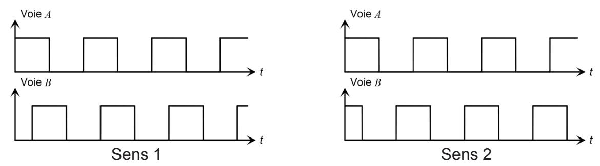

Figure 6 – Signaux en sortie du codeur pour les deux sens de rotation

**Question 22** En utilisant les fronts montants et descendants et les deux voies A et B en quadrature du codeur (figure 6), déterminer la précision sur le positionnement de la capsule obtenu avec ce seul capteur.

Le DSP possède une fréquence maximale de 40 MHz.

La capsule Urbanloop est actionnée par quatre moteurs entraînant directement chaque roue. La vitesse maximale est de 60 km·h-1.

**Question 23** Calculer la fréquence maximale *fcmax* des signaux issus du codeur. Conclure sur la fréquence du DSP choisi.

Le risque de glissement du pneu par rapport au rail est important.

**Question 24** Expliquer pourquoi le glissement compromet la fiabilité de la mesure de position par le codeur incrémental.

Cette mesure est régulièrement corrigée par un deuxième dispositif qui, à chaque traverse, donne un positionnement absolu de la capsule sur le circuit. Le DSP traite ces différentes données ; une information de position est ainsi disponible toutes les millisecondes.

Pour transmettre l'information de position, chaque capsule utilise le protocole UDP.

**Question 25** En vous référant au document technique DT3, justifier en quelques lignes que le protocole UDP est bien adapté à la transmission d'informations pour l'Urbanloop.

La structure du datagramme est donnée figure 7.

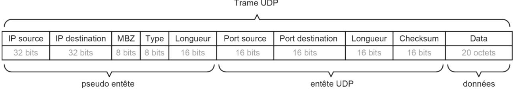

Figure 7 – Structure de la trame UDP

Les premiers octets de « Data » de cette trame sont utilisés pour coder la position et l'instant associé à la donnée de position.

Pour coder l'instant, une première proposition de solution est d'utiliser le système horaire sur 24 heures hh : mm : ss (hh : heure, mm : minutes et ss : secondes).

- **Question 26** Compléter les bits correspondant au codage de l'instant 13 heures 45 minutes et 33 secondes sur le document réponse DR3.
- **Question 27** Donner l'erreur maximale, en secondes, faite sur l'instant avec ce système de codage. Vérifier que l'erreur maximale faite sur l'estimation de la position de la capsule due au choix de ce codage est de 16,7 m.
- **Question 28** Conclure sur le respect du cahier des charges avec ce codage. En cas de non-respect, proposer une solution de codage pour obtenir une erreur de position respectant le cahier des charges.

Afin de s'assurer que la trame arrive sans erreur, un code de détection d'erreur, codé sur 16 bits, est élaboré (CRC-16 Contrôle de Redondance Cyclique).

La trame sans les bits du code de détection d'erreur est découpée en mots de 16 bits. Si le nombre total d'octets n'est pas pair, un octet ne contenant que des zéros est ajouté à la fin des données. Tous les mots de 16 bits sont ensuite additionnés et seuls les 16 bits de droite du résultat sont utilisés. Le code de détection d'erreur est le complément à 1 des 16 bits utilisés.

Une trame est envoyée, certaines données relatives à cette trame ont déjà été calculées et sont données sur le document réponse DR4.

**Question 29** Vérifier en calculant le code de détection d'erreur sur le document réponse DR4, la présence ou non d'une erreur dans la trame envoyée.

Le temps d'élaboration de la trame est de *Tet* = 20 µs. Le datagramme est transmis par l'intermédiaire d'une fibre optique de débit *df* = 300 Mbits·s-1.

- **Question 30** Donner le nombre *Nb* de bits contenus dans la trame. En déduire le temps de transmission *Ttrans* de la trame.
- **Question 31** Calculer la durée *Tret* entre l'instant où la capsule récupère sa position absolue et l'instant où la centrale de gestion dispose des informations de position et de date.
- **Question 32** Conclure sur l'erreur de position obtenue.

Pour aborder les compétences « Analyser les principaux protocoles pour un réseau de communication et les supports matériels » et « Caractériser les échanges d'informations » rappelées dans le tableau 4, l'enseignant part de l'exemple de l'Urbanloop.

| Compétences développées                                                                            | Connaissances associées                                                                                                                   | Classe |
|----------------------------------------------------------------------------------------------------|-------------------------------------------------------------------------------------------------------------------------------------------|--------|
| Analyser les principaux protocoles pour un réseau de communication et les supports matériels | Protocole, trames, encapsulation. Support filaire et sans fil                                                                          | 1ère   |
| Caractériser les échanges d'informations                                                        | Natures et caractéristiques des signaux, des données, des supports de communication. Protocole, trame Débit maximal, débit utile | 1ère   |

Tableau 4 – Extrait du programme de la spécialité SI

L'enseignant propose une activité de travaux pratiques (TP) qui permet aux élèves de reproduire de façon simplifiée les échanges de trames du système Urbanloop à l'aide d'un logiciel de simulation de réseaux.

**Question 33** Proposer trois manipulations de ce TP et mettre en regard les connaissances associées (on pourra s'appuyer sur l'extrait du programme du tableau 4).

**Question 34** Rappeler le but d'une évaluation formative puis proposer trois des questions possibles d'un QCM (Questionnaire à Choix Multiples) qui servirait d'évaluation formative pour clôturer cette activité.

# **PARTIE 3. ÉTUDE DU SYSTEME D'ALIMENTATION DES CAPSULES**

#### **3.1. Détermination du courant circulant dans les rails**

*L'objectif est de déterminer le courant moyen maximal circulant dans les rails.*

L'étude se fait sur une portion horizontale du parcours et en ligne droite. Le profil de vitesse d'une capsule est donné figure 8. Les seules actions mécaniques considérées sont la force aérodynamique due à l'action du vent sur la capsule, l'action des moteurs, l'action de pesanteur et la réaction normale du rail ; la résistance au roulement est donc négligée.

## Données :

Vitesse constante : *V*0 = 60 km·h-1. Décélération : *aC* = -1,4 m·s-2.

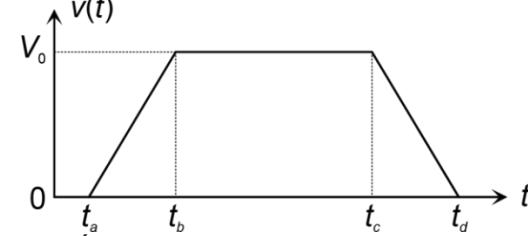

Figure 8 – Évolution de la vitesse de la capsule dans une ligne droite

La force aérodynamique *Fv* s'exerçant sur la capsule s'exprime par *Fv* = 0,5.*ρair*.*v*2.*Sc*.*Cx* où :

- *ρair* est la masse volumique de l'air égale à 1,2 kg·m-3 ;
- *v* est la vitesse de déplacement de la capsule ;
- *Sc* est la surface frontale maximale de la capsule, *Sc* = *k*.*h*.*ℓ* avec k = 0,85 ;
- *h* est la hauteur de la capsule égale à 1,6 m ;
- *ℓ* est la largeur de la capsule égale à 1 m ;
- *Cx* est le coefficient de traînée aérodynamique ici égal à 0,3.

**Question 35** Donner la valeur de la force aérodynamique quand la capsule se déplace à une vitesse de 60 km·h-1.

Afin de simplifier l'étude, l'énergie cinétique des pièces qui ne sont pas en translation par rapport au repère galiléen associé au sol est négligée et les rendements sont tous supposés unitaires.

**Question 36** En utilisant le théorème de l'énergie cinétique appliqué à la capsule, donner la valeur de la puissance maximale  $P_{max}$  absorbée par une capsule.

La puissance moyenne consommée par toutes les capsules en mouvement sur le trajet est  $P_{moy}$  = 7,2 kW car toutes les capsules n'accélèrent pas en même temps, sous une tension  $U_0$  de 72 V (tension entre rails).

**Question 37** En déduire le courant  $I_{mov}$  circulant dans les rails.

#### 3.2. Détermination du positionnement des boîtiers d'alimentation

L'objectif est de déterminer l'espacement maximal entre deux boîtiers d'alimentation afin de garantir la bonne alimentation des capsules.

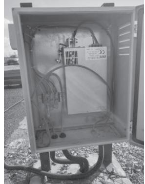

Figure 9 - Boitier

L'alimentation électrique des capsules est assurée par plusieurs boîtiers (voir figure 9) répartis régulièrement le long de la voie (voir figure 10).

Les rails transportent la puissance des boitiers aux capsules.

Les boitiers d'alimentation électrique sont raccordés au réseau EDF et imposent en sortie une tension  $U_0$  de 72 V continue (TBTS : très basse tension de sécurité) entre les deux rails.

La structure du boitier d'alimentation est composée d'un pont redresseur PD2, d'un filtre et d'un hacheur série (voir figure 13).

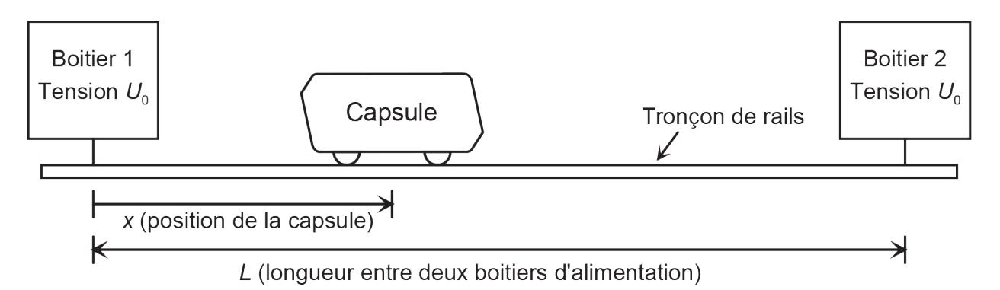

Figure 10 – schéma de la position de la capsule relativement aux boitiers d'alimentation

Rappel : la résistance électrique  $R_c$  d'un conducteur est donnée par  $R_c = \frac{\rho L}{S}$  avec  $\rho$  la

résistivité du conducteur, L sa longueur et S sa section.

La résistivité de l'acier est  $\rho$  = 0,13  $\Omega \cdot \text{mm}^2 \cdot \text{m}^{-1}$ .

Les dimensions de la section du rail sont données sur la figure 11.

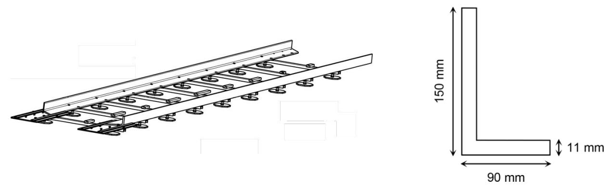

Figure 11 – Constitution de la voie et section des rails

**Question 38** Déterminer numériquement la valeur de la résistance électrique linéaire du rail  $R_{\ell}$  (en  $\Omega \cdot m^{-1}$ ).

**Question 39** À l'aide de la figure 10, déterminer l'expression de la résistance électrique  $R_1$  des rails situés entre le boitier d'alimentation 1 et la capsule puis la résistance électrique  $R_2$  des rails situés entre le boitier d'alimentation 2 et la capsule.

L'alimentation de la capsule peut être représentée par les deux schémas électriques de la figure 12 qui sont équivalents.

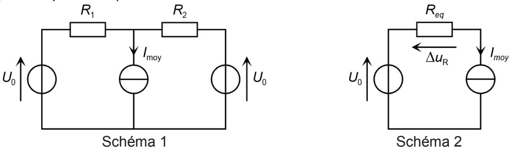

Figure 12 – Schémas équivalents de l'alimentation de la capsule

**Question 40** Montrer que l'expression de  $R_{eq}$  est donnée par  $R_{eq}$  = 2  $R_{\ell}$ .L. $\left(1 - \frac{x}{L}\right)$ . $\frac{x}{L}$ .

**Question 41** Déterminer la chute de tension  $\Delta u_R$  due à la résistance  $R_{eq}$ .

**Question 42** Indiquer la position la plus défavorable pour la capsule au regard du critère de la chute de tension et déterminer l'expression de  $\Delta u_{Rmax}$  en fonction de  $R_{\ell}$ , L et  $I_{mov}$ .

Pour assurer la bonne alimentation des capsules, le cahier des charges impose une chute de tension maximale de 5% de  $U_0$ .

Le courant moven est pris égal à 100 A.

**Question 43** Déterminer la distance maximale  $L_{max}$  entre deux boîtiers d'alimentation pour respecter le critère sur la chute de tension maximale et vérifier que deux boitiers d'alimentation suffisent pour ce parcours.

#### 3.3. Étude de l'alimentation de la machine synchrone

L'objectif est d'étudier la variation de vitesse de la machine synchrone et la réversibilité de son alimentation.

Question 44 En utilisant le profil de vitesse représenté figure 8, hachurer sur le document réponse DR5, les quadrants de fonctionnement de la machine synchrone lors d'un trajet entre deux stations et indiquer le mode de fonctionnement de la machine (générateur ou moteur).

La capsule Urbanloop est motorisée par quatre machines synchrones triphasées à aimants permanents située dans chaque roue. Les machines synchrones possèdent 28 pôles. Elles sont alimentées par l'intermédiaire d'onduleurs triphasés de tension dont la fréquence f est variable. La relation donnant la vitesse de rotation du moteur roue  $\omega_m$  en fonction de la

fréquence d'alimentation f et du nombre de paires de pôles p est  $\omega_m = \frac{2\pi f}{p}$ 

**Question 45** Déterminer la fréquence d'alimentation  $f_0$  permettant d'obtenir une vitesse  $V_0 = 60 \text{ km} \cdot \text{h}^{-1}$  pour la capsule.

Les onduleurs triphasés de tension délivrent une tension composée de valeur efficace 72 V. Chaque enroulement des machines synchrones supporte une tension de 72 V efficace.

**Question 46** Indiquez en le justifiant le couplage (étoile ou triangle) du stator de la machine synchrone.

La structure d'un boitier d'alimentation est donnée figure 13.

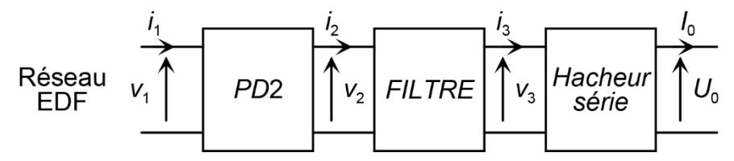

Figure 13 – Structure d'un boitier d'alimentation

La tension  $v_1$  est la tension délivrée par le réseau EDF monophasé.

Les différentes grandeurs sont obtenues à l'aide d'un logiciel de simulation sur le document réponse DR6.

**Question 47** Identifier sur le document réponse DR6 les représentations temporelles et spectrales correspondant aux grandeurs électriques  $v_1(t)$ ,  $i_1(t)$ ,  $v_2(t)$  et  $i_2(t)$ .

La structure du pont PD2 est donnée sur le document technique DT4.

Question 48 Indiguer les réversibilités (tension / courant) des boîtiers d'alimentation.

**Question 49** Conclure en indiquant les éventuels risques de l'utilisation des boitiers d'alimentation seuls.

#### 3.4. Dimensionnement du système de récupération d'énergie

L'objectif est de proposer une structure de stockage à base de supercondensateurs pour récupérer l'énergie lors du freinage de la capsule.

D'après la structure de l'alimentation, l'énergie électrique récupérée lors du freinage de la capsule ne peut pas être renvoyée au réseau.

Des supercondensateurs sont embarqués dans les capsules afin de stocker cette énergie.

**Rappel**: afin de simplifier l'étude, l'énergie cinétique des pièces qui ne sont pas en translation par rapport au repère galiléen est négligée et les rendements sont tous supposés unitaires.

Question 50 Montrer que l'énergie cinétique récupérée pour un freinage de la capsule lors du passage de la vitesse maximale à une vitesse nulle pour le profil de vitesse de la figure 8 est de -139 kJ.

En réalité, le pourcentage d'énergie récupérée n'excède pas les 80%. Les supercondensateurs utilisés possèdent les caractéristiques suivantes : 65 F, 16,2 V.

**Question 51** Comment faut-il agencer les supercondensateurs et combien en faut-il au minimum pour qu'ils puissent supporter une tension de 72 V ? Montrer dans ce cas que la valeur du condensateur équivalent est  $C_{eq} = 13$  F et déterminer la tension maximale  $U_{Ceamax}$  qu'il supporte.

Au début de la phase de freinage, la tension aux bornes du condensateur équivalent est :  $U_{Ceq}(t_c) = U_0$ .

**Question 52** Calculer alors la tension  $U_{Ceqf}$  aux bornes du condensateur équivalent à la fin de la phase de freinage.

Question 53 Conclure sur l'agencement des supercondensateurs de la question 49. Proposer une solution, le cas échéant, pour protéger les supercapacités et éviter leurs destructions.

Une fiche séquence est donnée sur le document technique DT5 ainsi qu'un extrait du programme (2 pages).

**Question 54** Pour la séance de TP prévue à la fin de cette séquence, préciser les prérequis, les compétences abordées, l'organisation, le matériel nécessaire, les mesures réalisées par les élèves et la restitution prévue.

#### PARTIE 4. MISE EN PLACE D'UN PASSAGE SOUTERRAIN

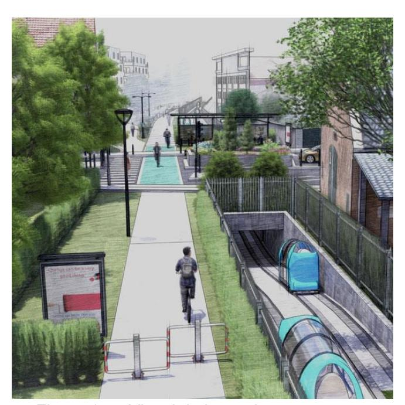

Figure 14 – Visuel de la section en passage inférieur de la ligne

Pour franchir une voie de circulation de véhicules située sur le tracé de la ligne, il est prévu que les capsules empruntent une partie dite en « passage inférieur », c'est-à-dire qu'elles circuleront dans une partie réalisée en souterrain (voir figure 14).

Pour permettre la circulation des capsules en toute sécurité, un cadre rigide fermé doit être réalisé.

Le choix des concepteurs s'est porté sur la confection d'éléments en forme de "U" refermés par une dalle, l'ensemble étant réalisé en béton armé (voir figure 15). Le nombre limité d'éléments à réaliser permet de recourir à une préfabrication « in situ » au moyen d'un atelier de fabrication localisé sur le chantier, afin d'éviter un transport par voie routière hors gabarit (convoi exceptionnel).

Chaque élément sera ensuite déplacé au moyen d'un engin de levage approprié afin d'être déposé à son emplacement définitif au fond d'une tranchée.

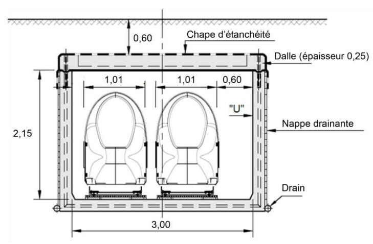

Figure 15 – Vue en coupe de la voie de circulation des capsules en souterrain (dimensions en m)

Une dalle en béton armé préfabriquée sera alors déposée et clavetée sur chaque « U » afin de permettre le remblaiement et le rétablissement de la voie de circulation aérienne.

#### **4.1. Manutention des éléments en « U »**

*L'objectif est d'étudier les opérations de déplacement et de pose d'un des éléments les plus volumineux afin d'en dimensionner les points de levage.*

Les dimensions d'un élément en « U » de longueur 4 m sont données sur la figure 16. Le poids volumique du béton armé est pris égal à 25 kN·m-3.

**Question 55** Montrer que le poids d'un élément en « U » est de 154 kN.

Lors de la préfabrication, chaque élément sera doté de quatre points de levage répartis comme indiqué figure 17. Pour la manutention des éléments, deux systèmes de levage sont

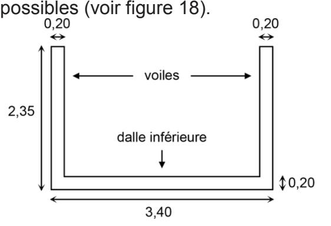

Figure 16 – Coupe transversale cotée (dimensions en m)

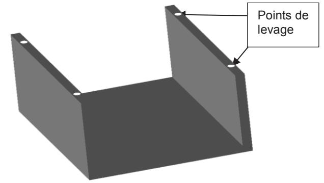

Figure 17 – Modélisation 3D d'un élément en « U » avec quatre points de levage

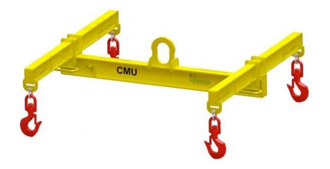

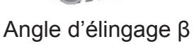

Figure 18 – Palonnier quatre brins en H et élingues à chaîne quatre brins

**Question 56** Justifier l'utilisation d'un palonnier en H pour la manutention des éléments (décoffrage, déplacement et pose) au détriment d'élingues à chaîne quatre brins (voir figure 18) en prenant en considération la stabilité et l'intégrité structurelle de l'élément en « U » lors du déplacement.

Après une phase de durcissement initiale, chaque élément est extrait de son moule de fabrication, appelé coffrage, pour être déposé sur une aire de stockage du chantier.

Au moment du décoffrage, seule la sous-face de la dalle inférieure sera encore en contact avec le moule. La manutention sera réalisée par un camion-grue (considéré comme une grue fixe) et à basse vitesse (inférieure à 1 m·s-1).

**Question 57** Grâce aux données du document technique DT6, déterminer l'effort dynamique qui s'exerce sur chaque point de levage au moment du décoffrage, et choisir la douille adaptée à la manutention de l'élément étudié.

#### **4.2. Analyse structurelle et modélisation mécanique d'un élément préfabriqué en U**

*L'objectif est de vérifier la stabilité du sol support des éléments préfabriqués de la zone centrale.*

Chaque élément de la zone centrale du passage inférieur comporte une dalle inférieure et deux murs verticaux (appelés voiles), voir figure 16. Pour vérifier la stabilité du sol support, il est nécessaire d'identifier et de caractériser l'ensemble des charges qui s'exercent sur la dalle inférieure.

Les charges à prendre en compte sont classées en deux catégories :

- les charges permanentes dont l'intensité varie peu ou pas au cours du temps ;
- les charges d'exploitation dont l'intensité dépend de l'usage et peut varier de manière importante au cours du temps.

Les pressions hydrostatiques exercées sur les voiles (dues à la présence d'eau dans le sol) sont négligées en raison de la présence d'un système de drainage (constitué d'une nappe drainante associée à deux drains latéraux, visibles sur la figure 15).

Il s'agit à présent d'étudier l'influence des charges appliquées sur les voiles de l'élément en « U ». Chaque voile est modélisé par une barre (notée B1) encastrée en pied (dans la dalle inférieure, nœud N1) et appuyée en tête (sur la dalle supérieure, nœud N2), voir les figures du document technique DT7 (2 pages).

**Question 58** Justifier par un calcul détaillé, les valeurs numériques particulières de la contrainte horizontale dans le sol *σh* entourées sur la figure 2 du document technique DT7.

La figure 3 du document technique DT7 représente la modélisation des actions mécaniques sur un voile.

**Question 59** Calculer la force résultante *Pterre* appliquée au point *T*, puis le couple résultant *MN*1, appelé moment d'encastrement, à la jonction entre le voile et la dalle inférieure.

Grâce à un logiciel de calcul structurel, la rotation du nœud N1, due aux actions mécaniques étudiées à la question 57, est évaluée à 3,5x10-4 radians.

**Question 60** Conclure quant à l'influence des efforts exercés sur les voiles verticaux sur la déformation par flexion de la dalle inférieure.

Afin de vérifier, en première approche et de manière simplifiée, que le sol de fondation supporte l'ouvrage en « U » et le passage des capsules, il faut vérifier que la contrainte résultante de compression exercée par la dalle inférieure du « U » n'excède pas la contrainte admissible du sol qui la supporte.

Les charges permanentes à prendre en considération sont :

- le poids propre du sol remblai situé au-dessus de la dalle supérieure du tunnel ;
- le poids propre de l'ouvrage constitué du « U » et de la dalle supérieure ;
- le poids propre des équipements permettant la circulation des capsules (rails, supports de rail, etc) évalué à 5 kN par mètre linéaire

Les charges d'exploitation à prendre en considération sont :

- le poids propre de deux capsules, évalué à une tonne chacune.

Le coefficient de pondération pris en considération est de 1,35 pour les charges dites permanentes et de 1,5 pour les charges dites d'exploitation.

**Question 61** Déterminer la force de compression exercée sur le sol support de l'ouvrage, pour une longueur de 1 m selon l'axe longitudinal.

L'étude de sol a évalué la contrainte admissible du sol, noté *qu*, à 0,5 MPa. La surface de référence de l'étude *Sr* est prise égale à 3,40 m2, correspondant à une longueur d'ouvrage de 1 m selon l'axe longitudinal.

**Question 62** Conclure quant à la capacité de portance du sol.

L'enseignant a pris contact avec la société qui lui propose une visite du site en construction pour les JOP 2024.

**Question 63** Quelles sont les précautions nécessaires à prendre pour organiser une sortie scolaire ? Cette sortie peut-elle avoir un caractère obligatoire ?

La sortie est co-encadrée avec un enseignant d'anglais.

**Question 64** Citer deux axes communs d'études entre les enseignements d'anglais et des sciences de l'ingénieur en lien avec la sortie. Proposer deux productions que les élèves pourraient réaliser pour rendre compte de leurs travaux.

## **PARTIE 5. GESTION DE L'AIGUILLAGE DE LA CAPSULE**

#### **5.1. Étude mécanique du système d'aiguillage passif**

*L'objectif est d'étudier le système de guidage pour vérifier qu'il assure un guidage sécurisé.*

Lorsqu'une capsule arrive aux abords d'une station, deux choix sont possibles (figure 19) : soit elle est arrivée à destination et elle doit se garer soit elle continue sur la voie principale.

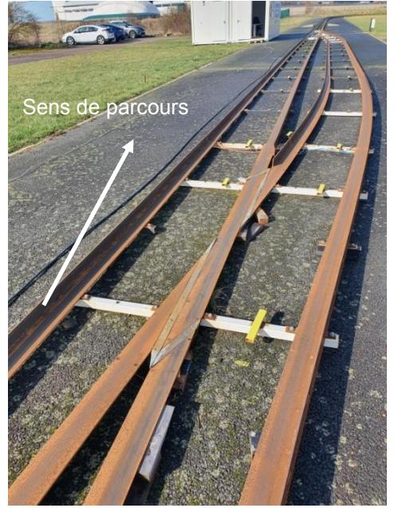

Figure 19 – Vue des rails au niveau d'une station

La fonction de changement de direction de la capsule est assurée par des basculeurs (figure 20). Les basculeurs sont des galets mobiles ayant deux positions, une basse et une haute. Lorsque le galet est en position basse, il assure le guidage de la capsule sur la partie verticale de la cornière du rail et permet le changement de direction.

Pour pouvoir se garer, d'après la configuration des stations (figures 2 et 19), les galets gauches doivent être en position haute et les galets droits en position basse. À l'inverse, pour pouvoir continuer sur la voir principale, les galets gauches doivent être en position basse et les galets droits en position haute.

Le système permettant de lever ou de baisser les galets est un système à grenouillère.

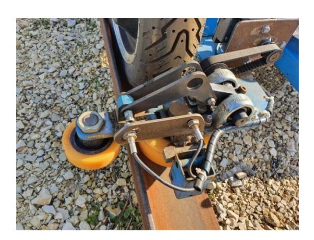

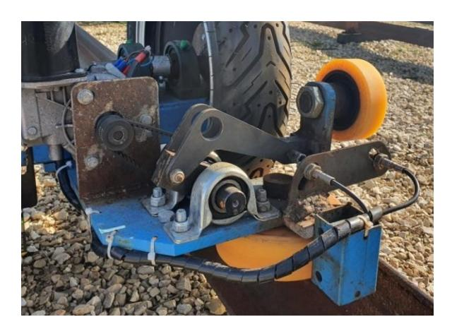

Figure 20 – Position basse et haute du galet

Le schéma cinématique de ce système dans deux positions est donné figure 21.

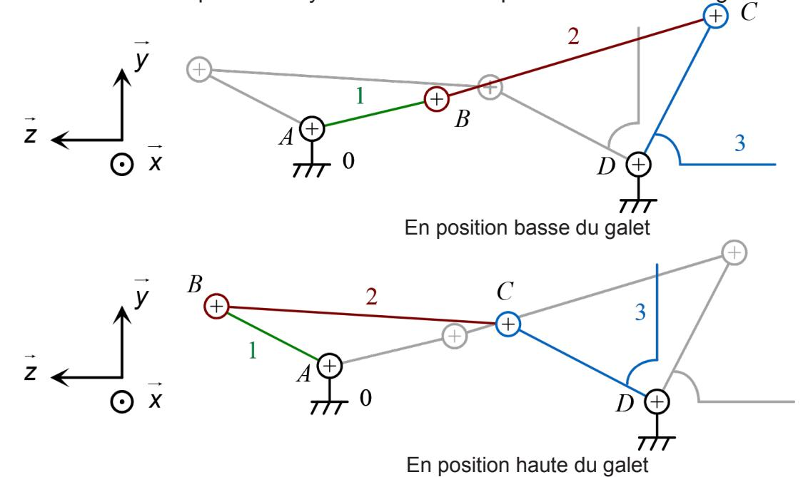

Figure 21 – Schéma cinématique de la grenouillère

**Question 65** Donner la trajectoire du point B dans le mouvement du solide 1 par rapport au solide 0.

Décrire le mouvement du solide 2 par rapport au solide 1.

Donner le nom et les caractéristiques de la liaison entre les solides 3 et 0.

- **Question 66** Expliquer l'irréversibilité du mécanisme de grenouillère en utilisant la figure 21.
- **Question 67** Quel est l'intérêt pour les concepteurs de la capsule d'avoir utilisé un système permettant le blocage du galet en position basse ? Quelle action permet alors de remonter le galet ?

#### **5.2. Étude du guidage**

*L'objectif est de vérifier que l'algorithme de la gestion des galets permet bien de desservir les deux stations ainsi que la station de maintenance.*

Lorsque la capsule part d'une station, deux destinations sont possibles. Par exemple, si la capsule part de la station de maintenance, elle peut aller se garer soit à la station 1 soit à la station 2. En fonction de la destination choisie, la commande des galets permettant de guider la capsule va être différente.

L'algorigramme de la commande des différents galets dans le cas d'un départ de la station de maintenance

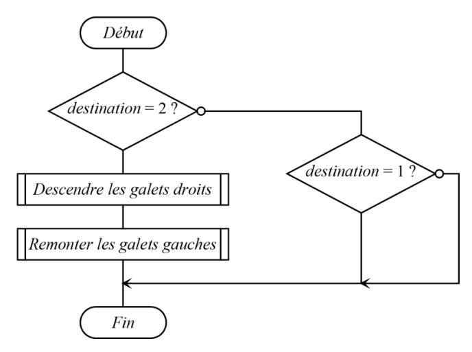

est donnée figure 22. Figure 22 – Algorigramme de la gestion des galets pour un départ de la station de maintenance

Lors du départ, les galets sont dans les positions dans lesquelles ils étaient lorsque la capsule est arrivée dans la station.

La destination est gérée par un algorigramme (non étudié ici) qui remplit la variable destination.

Cette variable vaut :

- 0 si la destination sélectionnée est la station de maintenance ;
- 1 si la destination sélectionnée est la station 1 ;
- 2 si la destination sélectionnée est la station 2.

**Question 68** Pour une capsule partant de la station 1, tracer l'algorigramme de la commande des différents galets en vous inspirant de celui de la figure 22.

L'actionnement de la grenouillère est réalisé par un moteur à courant continu. Deux capteurs inductifs (tout ou rien) permettent d'indiquer la position haute ou basse du galet. Le sousprogramme « Descendre les galets gauches » est décrit par les chronogrammes du document réponse DR7.

**Question 69** Compléter le chronogramme de l'actionneur (moteur à courant continu) sur le document réponse DR7.

# **PARTIE 6. L'URBANLOOP SUPPORT DE PROJET**

*L'objectif est d'utiliser l'Urbanloop comme support de projet pour la classe de première.*

Le programme de la spécialité SI précise : « Au cours de la classe de première, un projet de 12 heures mené en équipe permet aux élèves d'imaginer et de matérialiser tout ou partie d'une solution originale. Ce projet peut être commun à toutes les équipes d'une même classe ou d'un établissement sous la forme d'un défi ».

Pour ce projet, les élèves sont invités à participer à un challenge décrit dans le document technique DT8.

**Question 70** Proposer les activités 1 à 6 manquantes en précisant bien le numéro pour chacune des activités décrites.

# **Document technique DT1 : résultats de simulation**

L'espacement indiqué correspond à la distance entre deux traverses.

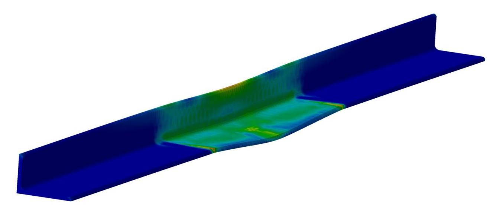

Déformation de 0,13 mm pour un rail de dimensions 120x80x8 mm et un espacement de 0,66 m.

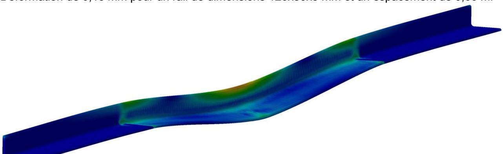

Déformation de 1,4 mm pour un rail de dimensions 120x80x8 mm et un espacement de 2 m.

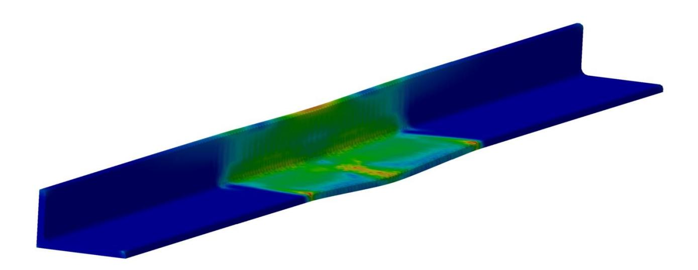

Déformation de 0,08 mm pour un rail de dimensions 150x90x11 mm et un espacement de 0,66 m

# **Document technique DT2 : choix de freins**

| Couple de freinage (N·m) | 60  | 100  | 150  | 250  | 500 |
|--------------------------|-----|------|------|------|-----|
| Poids (kg)               | 7,4 | 13,6 | 19,2 | 33,3 | 38  |

## **Document technique DT3 : les protocoles**

#### **1. Le protocole TCP**

Le protocole TCP (Transmission Control Protocol), est un protocole orienté connexion. Il est très utilisé lorsque l'on utilise des protocoles IP, c'est pour cela que l'on parle aussi de TCP/IP.

Avec le protocole TCP, avant que des données soient échangées entre les deux hôtes, l'hôte source va créer une session de connexion avec l'hôte distant afin de le prévenir qu'il va recevoir des données. Pour cela, un premier échange aura lieu entre les deux hôtes

Une fois que la connexion est établie, l'échange de données peut commencer. Pendant cet échange de données, les paquets (correspondants aux données) sont envoyés dans l'ordre, et le protocole TCP va s'assurer que tous les paquets sont bien transmis, et si ce n'est pas le cas, il est capable de renvoyer les paquets manquants. C'est l'un des avantages du protocole TCP.

Cette connexion sera maintenue jusqu'à ce qu'elle soit fermée, ce qui signifie qu'elle sera active à minima jusqu'à la fin de l'échange de données entre les deux hôtes. Elle peut être maintenue afin d'être prête dès que les deux hôtes auront besoin de communiquer ensemble.

En complément du contrôle des flux et de la gestion des erreurs, le protocole TCP est capable de contrôler la congestion du réseau sur lequel les paquets sont échangés. Un algorithme de contrôle de congestion est utilisé et en cas de surcharge du réseau, le flux TCP sera adapté en conséquence.

#### **2. Le protocole UDP**

Le protocole UDP (User Datagram Protocol), est un protocole de communication sans connexion. Le protocole UDP et une alternative au protocole TCP.

Lorsque le protocole UDP est utilisé pour transporter les données, les données d'un hôte source sont envoyées vers un hôte de destination, sans chercher à savoir si l'hôte de destination a bien reçu l'ensemble des données. Autrement dit, il n'y a pas de vérification des erreurs : si l'on envoie un fichier via UDP, on ne sait pas si l'hôte distant a reçu entièrement ce fichier ou s'il l'a reçu partiellement.

Puisque l'on ne vérifie pas que l'hôte distant a bien reçu les données, on économise des ressources, mais aussi du temps, donc le protocole UDP est plus rapide que le protocole TCP.

Une trame UDP possède la structure suivante :

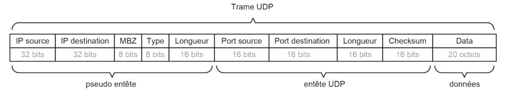

| IP source        | indique l'adresse IP de l'hôte émetteur                                     |
|------------------|-----------------------------------------------------------------------------|
| IP source        | indique l'adresse IP de l'hôte récepteur                                    |
| MBZ              | (Must Be Zero) permet d'obtenir un nombre d'octets pair                     |
| Type             | le type permet d'identifier quel est le protocole utilisé dans le paquet IP |
| Longueur         | longueur de la pseudo-entête en octet                                    |
| Port source      | ce champ précise le port logiciel de l'application de l'hôte source         |
| Port destination | ce champ spécifie le port de l'application de l'hôte de destination         |
| Longueur         | longueur du paquet UDP à savoir entête et données comprises en octet     |
| Checksum         | il permet de détecter les éventuelles erreurs dans le paquet UDP         |
| Data             | données envoyées                                                            |

# **Document technique DT4 : structure du pont PD2**

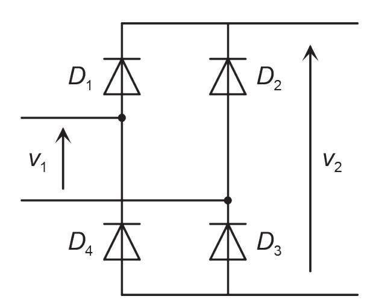

# **Document technique DT5 (1/2) : fiche de séquence**

| Fiche séquence N°2 | Thèmes: Les territoires et les produits intelli                              | produits intelligents, la mobilité des personnes et des biens                                                                                                              | Première 1 er trimestre | Durée:                          |
|-----------------------|------------------------------------------------------------------------------|----------------------------------------------------------------------------------------------------------------------------------------------------------------------------|---------------------------------------|---------------------------------|
| Problématique:        | Problématique: Comment visualiser les différentes grandeurs (flux, efforts)? | s (flux, efforts)?                                                                                                                                                         |                                       | 17h                             |
| Pré-requis            | SYSML (séquence 1), instruments de mesure usuels (collège)                | Physique:  SYSML (séquence 1), instruments de mesure seconde : énergie, puissance, relation puissance-maths : énergie, loi d'Ohm, bilan énergétique système python (simple | Maths : python (algorithmie)       | SNT : algorithmie- python |

|                            | Durée          | 2h                                                                                                                     | 2h                                                                             | 2h                                           | 2h                                                                          | 1h30                                                                                                                            | 30 min                                                                                                                  | 30 min              | 1h30                                                                               | 4h                                                                          | th                      |
|----------------------------|----------------|------------------------------------------------------------------------------------------------------------------------|--------------------------------------------------------------------------------|----------------------------------------------|-----------------------------------------------------------------------------|---------------------------------------------------------------------------------------------------------------------------------|-------------------------------------------------------------------------------------------------------------------------|---------------------|------------------------------------------------------------------------------------|-----------------------------------------------------------------------------|-------------------------|
|                            | Support        | Quizz ordres de grandeurs pour le lancement                                                                      |                                                                                |                                              |                                                                             | Simulation Urbanloop                                                                                                            |                                                                                                                         |                     |                                                                                    | Solex, trottinette, skate électrique,                                    |                         |
| Déroulement de la séquence | Description    | Introduction (ordres de grandeurs, problématique énergétique mondiale, puissance, définition énergie, formes énergies) | A partir d'ibd, noter les formes d'énergie + calcul d'énergie dans cas simples | Chaîne de puissance, grandeurs effort / flux | À partir d'ibd donner grandeurs efforts / flux, remplir chaîne de puissance | Simulation avec visualisation des grandeurs, calcul de puissance instantanée + petit programme valeur moyenne et calcul énergie | Blocs de la chaîne de puissance à compléter, définition énergie, tableau effort/flux à compléter + 2 ordres de grandeur | Rendement et pertes | Exercices sur les rendements avec comparaison des différentes solutions techniques | Mesures tension / courant, vitesse / effort, calcul de rendement et énergie |                         |
|                            | Type de séance | Cours                                                                                                                  | Travaux dirigés                                                             | Cours                                        | Travaux dirigés                                                          | Activité pratique                                                                                                            | Évaluation formative                                                                                                 | Cours               | Travaux dirigés                                                                 | Activité pratique                                                        | Évaluation sommative |

# **Document technique DT5 (2/2) : fiche de séquence**

|   |                                                                                                                                                                       | Compétences détaillées                                                                                                           |                                                                                         |   |
|---|-----------------------------------------------------------------------------------------------------------------------------------------------------------------------|----------------------------------------------------------------------------------------------------------------------------------|-----------------------------------------------------------------------------------------|---|
| - | Analyser                                                                                                                                                              | Modéliser et résoudre                                                                                                            | Expérimenter et simuler                                                                 | ပ |
|   | A2-Caractériser la puissance et l'énergie nécessaire au fonctionnement d'un produit ou d'un système. A2-Repérer les échanges d'énergie sur un diagramme structurel | M&R 1-Proposer et justifier des hypothèses ou simplification en vue d'une modélisation                                        | E&S 1-Prévoir l'ordre de grandeur de la mesure                                       |   |
|   | A12-Quantifier les écarts de performances entre les valeurs attendues, les valeurs mesurées et les valeurs obtenues par simulation                                    | M&R 2-Caractériser les grandeurs physiques en entrées/sorties d'un modèle multi-physique traduisant la transmission de puissance | E&S 2-Identifier les erreurs de mesure                                               |   |
|   |                                                                                                                                                                       | M&R 3-Associer un modèle aux composants d'une chaîne de puissance                                                             | E&S 3-Conduire des essais en toute sécurité à partir d'un protocole expérimental fourni |   |
|   |                                                                                                                                                                       | M&R 6-Modéliser sous une forme graphique une structure, un mécanisme ou un circuit                                               |                                                                                         |   |
|   |                                                                                                                                                                       | M&R 11-Déterminer les grandeurs flux (courant) et effort (tension) dans un circuit électrique                                    |                                                                                         |   |

|                                                                                                             | Connaissances associées                                                                                                      |                                                                           |  |
|-------------------------------------------------------------------------------------------------------------|------------------------------------------------------------------------------------------------------------------------------|---------------------------------------------------------------------------|--|
| CA2.1-Grandeurs physiques (mécanique, électrique, thermique) mobilisées par le fonctionnement d'un produit  | CM1.1-Hypothèses simplificatrices                                                                                            | CE1-Gamme d'appareils de mesure et capteurs (ordre grandeur mesure) |  |
| CA2.2-Grandeurs d'effort et de flux liées à la nature des procédés                                          | CM3.1-Sources parfaites de flux et d'effort                                                                                  | CE2-Gamme d'appareils de mesure et capteurs (erreurs mesures)       |  |
| CA12.1-Écarts de performance absolu ou relatif, et interprétations possibles                                | CM2.4-Réversibilité de la chaîne de puissance                                                                                | CE3-Règle de raccordement des appareils de mesure et des capteurs         |  |
| CA12.2-Erreurs et précision des mesures expérimentales ou simulées                                          | CM3.3-Modèle associé aux composants élémentaires de transformation, de modulation, de conversion ou de stockage de l'énergie |                                                                           |  |
| CA12.3-Traitement des données : tableaux, graphiques, valeurs moyennes, écarts types, incertitude de mesure | CM6.1-Circuit électrique                                                                                                     |                                                                           |  |
| CA12.4-Choix pertinent d'un ou plusieurs critères de comparaison                                            | CM11.2-Lois de comportement                                                                                                  |                                                                           |  |
| CA2.3-Rendements et pertes                                                                                  |                                                                                                                              |                                                                           |  |

## Document technique DT6 : effort dynamique et choix de la douille

L'effort dynamique  $F_d$  appliqué à chaque point de levage se calcule au moyen de l'expression suivante :  $F_d = \frac{\left(G + q_{adh}.S_f\right).\psi_{dyn}.\psi_e}{N_{eff}}$  :

- G est le poids de l'élément à lever ;
- qadh est l'effort surfacique d'adhérence au coffrage, pris égal à 100 daN·m-2;
- Sf est la surface de béton en contact avec le coffrage ;
- $\psi_{dyn}$  est le coefficient dynamique qui tient compte des effets de mise en tension des élingues par l'engin de levage ;
- $\psi_e$  est le coefficient d'élingage qui dépend de l'inclinaison de l'élingue par rapport à la verticale. Ce coefficient vaut 1 si les élingues sont verticales ;
- $N_{eff}$  est le nombre de points efficaces (nombre de points de levage pleinement sollicités en contrainte).

| Engin de levage                                       | Coefficient dynamique ( $\psi_{dyn}$ ) |
|-------------------------------------------------------|----------------------------------------|
| Grue fixe ou sur rails, vitesse < 1 m⋅s -1 | 1,15                                   |
| Grue fixe ou sur rails, vitesse > 1 m·s -1 | 1,30                                   |

| Cada   | Décionation                      | Charge ac | dm. (daN) | h    | ØD   | е    | f    | poids | øD _      |   |
|--------|----------------------------------|-----------|-----------|------|------|------|------|-------|-----------|---|
| Code   | Désignation                      | 0°-45°    | Cisail.   | (mm) | (mm) | (mm) | (mm) | (kg)  | Rd        |   |
| 100497 | DOUILLE A ADHERENCE ONDULEE Rd12 | 500       | 250       | 137  | 15   | 22   | 8    | 0.08  |           |   |
| 100498 | DOUILLE A ADHERENCE ONDULEE Rd14 | 800       | 400       | 170  | 18   | 25   | 10   | 0.14  | 9   1   1 |   |
| 100499 | DOUILLE A ADHERENCE ONDULEE Rd16 | 1200      | 600       | 216  | 21   | 27   | 12   | 0.25  | 177       |   |
| 100500 | DOUILLE A ADHERENCE ONDULEE Rd18 | 1600      | 800       | 235  | 24   | 34   | 14   | 0.39  | [1]       |   |
| 100501 | DOUILLE A ADHERENCE ONDULEE Rd20 | 2000      | 1000      | 257  | 27   | 35   | 16   | 0.53  |           |   |
| 100502 | DOUILLE A ADHERENCE ONDULEE Rd24 | 2500      | 1250      | 350  | 31   | 43   | 16   | 0.73  | 1         |   |
| 100503 | DOUILLE A ADHERENCE ONDULEE Rd30 | 4000      | 2000      | 450  | 40   | 56   | 20   | 1.45  |           | h |
| 100504 | DOUILLE A ADHERENCE ONDULEE Rd36 | 6300      | 3150      | 570  | 47   | 68   | 25   | 2.81  | 0         | " |
| 100505 | DOUILLE A ADHERENCE ONDULEE Rd42 | 8000      | 4000      | 620  | 54   | 80   | 28   | 3.89  |           |   |
| 100506 | DOUILLE A ADHERENCE ONDULEE Rd52 | 12500     | 6250      | 880  | 70   | 100  | 32   | 7.65  | A         |   |

Tableau 1 - Tableau des caractéristiques des douilles de levage noyées dans le béton

## Document technique DT7 (1/2) : poussée des terres sur un écran

Selon la théorie de RANKINE, le sol remblayé contre les voiles verticaux exerce une poussée selon une répartition triangulaire comme illustrée sur la figure 1.

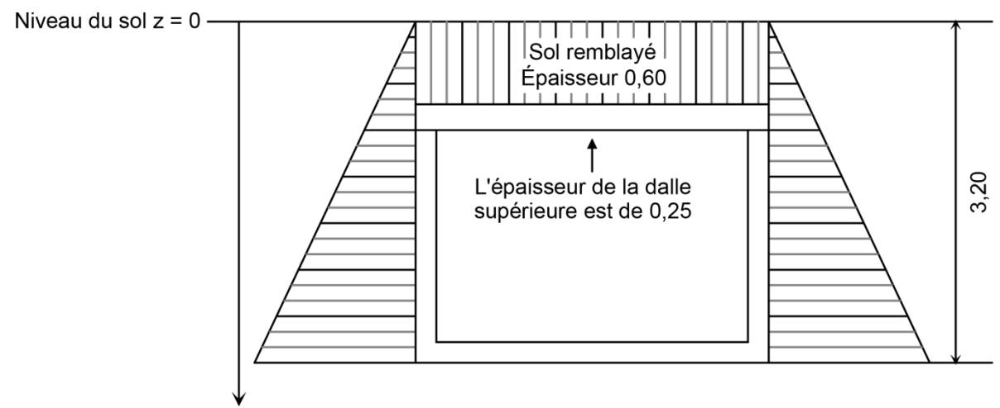

Figure 1 – Répartition de la poussée (dimensions en m)

La contrainte horizontale dans le sol, notée  $\sigma_h$  s'exprime en fonction de la contrainte verticale  $\sigma_V$  selon l'expression  $\sigma_h(z) = K_s.\sigma_V(z) = K_s.\gamma_{sol}.z$ :

- Ks est appelé coefficient de poussée du sol, ici égal à 0,5 ;
- $\gamma_{sol}$  est le poids volumique du sol, ici égal à 20 kN m-3.

Les contraintes  $\sigma_h$  et  $\sigma_v$  sont exprimées en kN·m-2.

La poussée des terres, notée  $P_{terre}$ , est calculée pour une bande d'un mètre linéaire horizontal, en fonction de la profondeur z, à partir de l'expression suivante :

$$P_{terre} = \int_{h_{a}}^{h_{2}} \sigma_{h}(z) dz$$

Elle sera exprimée en kN.

# **Document technique DT7 (2/2) : modélisation d'un voile latéral**

Les charges, exprimées en kN·m-1, sont calculées pour un mètre de longueur de voile.

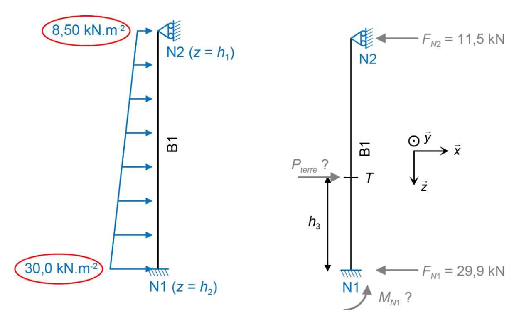

Figure 2 – Modélisation du voile latéral soumis à la poussée des terres

Figure 3 – Schéma mécanique avec actions de liaison

*h*3 = 0,875 m *Pterre* et *MN*1 efforts à déterminer

# **Document technique DT8 : proposition de projet de première**

#### **PROJET 1ère URBANLOOP 12h**

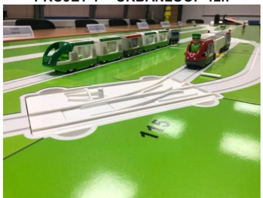

Agence-cub.com

Défis de type RoboCup

Plusieurs équipes de 4 élèves.

Le but est de réalisé une capsule miniature (circuits avec rails et stations fournis par l'enseignant) qui valide les objectifs suivants :

- - aller à une des 3 stations à la demande à partir de l'appui sur un bouton présent sur la capsule (commande d'aiguillage car mécanisme galets trop difficile à mettre en place) ;

- faire s'arrêter la capsule en cas d'obstacle (mise en place avec capteur à l'avant de la capsule pour simplifier).

| Planification | Élève 1                                                                                                                                                                                                                      | Élève 2                                                                                                                                                                | Élève 3                                                                   | Élève 4 |  |  |  |  |  |
|---------------|------------------------------------------------------------------------------------------------------------------------------------------------------------------------------------------------------------------------------|------------------------------------------------------------------------------------------------------------------------------------------------------------------------|---------------------------------------------------------------------------|---------|--|--|--|--|--|
| 1 heure       |                                                                                                                                                                                                                              | Activité 1                                                                                                                                                             |                                                                           |         |  |  |  |  |  |
|               | Activités préliminaires expérimentales                                                                                                                                                                                       |                                                                                                                                                                        |                                                                           |         |  |  |  |  |  |
| 2 heures      | Activité 2                                                                                                                                                                                                                   | vité 3                                                                                                                                                                 | Activité sur les capteurs et les signaux (logique, numérique, analogique) |         |  |  |  |  |  |
|               |                                                                                                                                                                                                                              | Activités de desig                                                                                                                                                     | n - programmation                                                         |         |  |  |  |  |  |
| 3 heures      | Design du châssis avec emplacement batterie, moteur, roues, boutons                                                                                                                                                    | Programmation du microcontrôleur pour envoyer 0, 1 ou 2 suivant sur quel bouton on a appuyé et commander les aiguillages (envoi commande sous une forme définie, Xbee) | Programmation du microcor logique en fonction de la do proximité    |         |  |  |  |  |  |
|               |                                                                                                                                                                                                                              | Impression 3D e                                                                                                                                                        | n temps masqué                                                            |         |  |  |  |  |  |
| 2 heures      |                                                                                                                                                                                                                              | Activités prototy                                                                                                                                                      | age - innovation                                                          |         |  |  |  |  |  |
| 2 fleures     | Acti                                                                                                                                                                                                                         | vité 4                                                                                                                                                                 | Activité 5                                                                |         |  |  |  |  |  |
| 1 heure       | Mise                                                                                                                                                                                                                         | en place de la commande mo                                                                                                                                             | teur à partir d'un programme à trous                                      |         |  |  |  |  |  |
|               |                                                                                                                                                                                                                              | Essais e                                                                                                                                                               | t réglages                                                                |         |  |  |  |  |  |
| 2 heure       | Tests sur la bonne comman fonction de l'appui bouton e performance (temps entre l' l'aiguillage, à vitesse donné distance il faut minimum en Ouverture sur comment per capsules et que plusieurs vaiguillage en même temps p | t caractérisation de la appui et le mouvement de e, calculer combien de tre deux stations) ut-on gérer si plusieurs eulent agir sur le même             | Activité 6                                                                |         |  |  |  |  |  |
| 1 heure       |                                                                                                                                                                                                                              | Validation et d                                                                                                                                                        | début des tests                                                           |         |  |  |  |  |  |

| Modèle CMEN v3                                          |             |         |                 | _                | _      |        |        | _                    |        |         | _                  |        |                  | -            |       |       | _      |         | _        | _                                         |        |       | -   |       |
|---------------------------------------------------------|-------------|---------|-----------------|------------------|--------|--------|--------|----------------------|--------|---------|--------------------|--------|------------------|--------------|-------|-------|--------|---------|----------|-------------------------------------------|--------|-------|-----|-------|
| <b>Nom de fam</b> (Suivi, s'il y a lieu, du nom d'us |             |         |                 |                  |        |        |        |                      |        |         |                    |        |                  |              |       |       |        |         |          |                                           |        |       |     |       |
| Prénom                                                  | (s) :       |         |                 |                  |        |        |        |                      |        |         |                    |        |                  |              |       |       |        |         |          |                                           |        |       |     |       |
| Num Secondi                                          |             |         |                 |                  |        |        |        |                      |        |         |                    |        |                  | é(e) le : |       |       | /      |         |          | ]/                                        |        |       |     |       |
| Cadre réservé aux candidats                             | de conc     | ours o  | le reci         | ruteme           | ent et | exame  | ens pr | ofessi               | onnels | S       |                    |        |                  |              |       |       |        |         |          |                                           |        |       |     |       |
| Concours:                                               | es six type | es de c | oncour ne sp | s suiva ecial | nts :  | intern | e ou 1 | l er inte | erne   | □ 2     | nd inte | ne     | ☐ 2 n | d inter      | ne sp | écial | C U | ocher p | oublic C | iptio OU privé pour les gnants : | ; s | publi | c 🗆 | privé |
| Examen profession                                       | mei po      | our i   | avai            | iceii            | ient   | au y   | raue   | ue.                  |        |         |                    |        |                  |              | ••••• |       |        |         |          |                                           |        |       |     |       |
| Cadre réservé aux candidats                             | d'exam      | ens et  | du co           | ncour            | s géné | éral   |        |                      |        |         |                    |        |                  |              |       |       |        |         |          |                                           |        |       |     |       |
| Examen :                                                |             |         |                 |                  |        |        |        |                      | Sé     | rie / S | Spéc               | ialité | <b>э:</b>        |              |       |       |        |         |          |                                           |        |       |     |       |
| Epreuve - Matière                                       |             |         |                 |                  |        |        |        |                      |        |         |                    |        | Ses              | sion         | :     |       |        |         |          |                                           |        |       |     |       |

EDE STI 2

DR1 - DR2 (1/5 et 2/5) - DR3 - DR5

Tous les documents réponses sont à rendre, même non complétés.

## **Document réponse DR1 (questions 2 et 4)**

|            | Moyens de transport utilisé         | Urbanloop | Bus GNV (gaz) | Bus diesel |
|------------|-------------------------------------|-----------|------------------|------------|
|            | Temps de trajet du 1er passager     |           | 9 min            | 9 min      |
| Question 2 | Temps de trajet du dernier passager |           | 9 min            | 9 min      |
|            | Temps de trajet moyen               |           | 9 min            | 9 min      |
|            | Coût pour 1km pour un véhicule   |           |                  |            |
| Question 4 | Coût pour 50 personnes pour 1km     |           |                  |            |

## **Document réponse DR3 (question 26)**

| Codage de l'heure sur 8 bits : 13   |  |  |  |  |
|----------------------------------------|--|--|--|--|
| Codage des minutes sur 8 bits : 45  |  |  |  |  |
| Codage des secondes sur 8 bits : 33 |  |  |  |  |

# **Document réponse DR5 (question 44)**

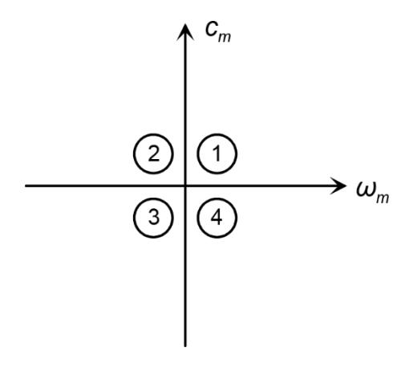

*cm* est le couple délivré par le moteur. *ωm* est la vitesse de rotation de l'arbre du moteur.

# **Document réponse DR2 1/5 (question 19)**

## Copie 1

| Interrogation 1 ère SI |                   | Durée :                 | Date: 03/06/24 |
|-----------------------------------|-------------------|-------------------------|----------------|
|                                   | Modéliser et déte | erminer les actions méd | caniques       |
| Nom : Martin                      | Commentaire       | es :                    |                |
| Note :                            |                   |                         |                |

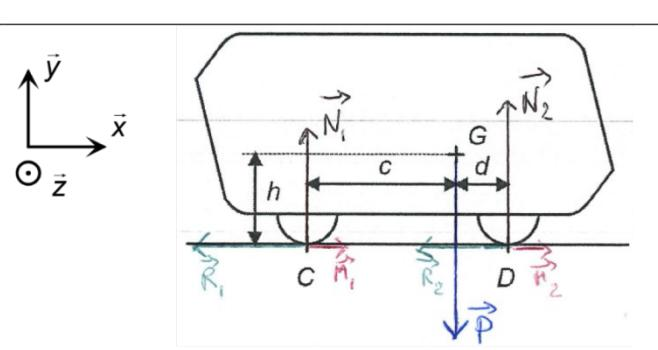

$$M(C, pes \rightarrow capsule) = Mg \times Vc^2 + h^2$$

$$c_{+} = 0$$

# **Document réponse DR2 2/5 (question 19)**

## Copie 1 (suite)

$$M(C, sol \rightarrow roue D) = N_2 \times (c+d)$$

$$- \text{Mg Vc}^2 + h^2 + \text{N2} (c+d) = 0$$

$$N_2 = F(sol > rone D)$$

$$= F(sol > rone D) \times (c+d) = \text{Mg Vc}^2 + h^2 = F(sol > rone D) = \frac{\text{Mg Vc}^2 + h^2}{c+d}$$

$$k < c = F(sol > rone D) = \frac{\text{Mg c}}{c+d}$$

| Modèle CMEN v3                                                         |            |             |           |         | _        |       | _     | 1       | _          |             | _ |      | _       | _        | _                                         | _      | _        | _   | _     |
|------------------------------------------------------------------------|------------|-------------|-----------|---------|----------|-------|-------|---------|------------|-------------|---|------|---------|----------|-------------------------------------------|--------|----------|-----|-------|
| Nom de famille : (Suivi, s'il y a lieu, du nom d'usage)             |            |             |           |         |          |       |       |         |            |             |   |      |         |          |                                           |        |          |     |       |
| Prénom(s) :                                                            |            |             |           |         |          |       |       |         |            |             |   |      |         |          |                                           |        |          |     |       |
| Numéro Candidat :                                                   |            |             |           |         |          |       |       |         |            | (e) le : |   | /    |         |          | ]/                                        |        |          |     |       |
| Cadre réservé aux candidats de co                                      | ncours de  | recrutem    | ent et ex | amens p | rofessic | nnels |       |         |            |             |   |      |         |          |                                           |        |          |     | =     |
| Concours:  Cocher une seule case parmi les six ty \nexterne 3e externe | pes de con | cours suiva | ints:     | •       |          |       |       |         |            |             |   | C    | ocher p | oublic C | iptio OU privé pour les gnants : | · · | ] public | : D | privé |
| Examen professionnel                                                   | our l'a    | vancen      | nent au   | ı grade | e de :   |       |       |         |            |             |   |      |         |          |                                           |        |          |     |       |
| Cadre réservé aux candidats d'exa                                      | mens et du | u concour   | s généra  | ı       |          |       |       |         |            |             |   |      |         |          |                                           |        |          |     |       |
| Examen :                                                               |            |             |           |         |          | Série | / Spé | cialite | <b>э́:</b> |             |   |   |         |          |                                           |        |          |     |       |
| Epreuve - Matière :                                                    |            |             |           |         |          |       |       |         | Ses        | sion        | : |   |         |          |                                           |        |          |     |       |

EDE STI 2

DR2 (5/5 - 3/5 - 4/5)

Tous les documents réponses sont à rendre, même non complétés.

#### NE RIEN ECRIRE DANS CE CADRE

# Document réponse DR2 5/5 (question 19)

L'enseignant a choisi d'évaluer le niveau des questions de 1 à 4 : 1 correspond à la connaissance, 2 à la compréhension, 3 à l'application et 4 à l'analyse. Le niveau de l'élève est évalué de A à D, A étant le niveau le plus élevé de maîtrise.

|                                                                                                | Modéliser les a | Modéliser les actions mécaniques |   |         |   |              |       |          |         |   |
|------------------------------------------------------------------------------------------------|-----------------|----------------------------------|---|---------|---|--------------|-------|----------|---------|---|
|                                                                                                |                 |                                  |   |         | ź | Niveau élève | élève |          |         |   |
| Compétences                                                                                    | Question(s)     | Niveau question                  |   | Copie 1 | _ |              |       | Cop      | Copie 2 |   |
|                                                                                                |                 |                                  | 4 | В       | ပ | ٥            | 4     | В        | ပ       | D |
| Savoir tracer une force donnée                                                                 | ۵1              | 4                                |   |         |   |              |       |          |         |   |
| Déterminer les actions mécaniques (statique) : expression d'une force                          | Q2              |                                  |   |         |   |              |       |          |         |   |
| Déterminer les actions mécaniques (statique) : utiliser le PFS pour déterminer une force       |                 |                                  |   |         |   |              |       |          |         |   |
| Déterminer les actions mécaniques (statique) : déplacer un moment                              | Q3, Q4          | 3                                |   |         |   |              |       |          |         |   |
| Déterminer les actions mécaniques (statique) : utiliser le PFS pour déterminer un moment | Q5              | 2                                |   |         |   |              |       |          |         |   |
|                                                                                                |                 |                                  |   |         |   |              |       |          |         |   |
|                                                                                                | Présenter et f  | Présenter et formaliser une idée |   |         |   |              |       |          |         |   |
|                                                                                                |                 |                                  |   |         | ź | Niveau élève | élève | <b>a</b> |         |   |
| Compétences                                                                                    | Question(s)     | Niveau question                  |   | Copie 1 | 1 |              |       | Copie 2  | ie 2    |   |
|                                                                                                |                 |                                  | A | В       | C | D            | 4     | В        | С       | D |
| Schéma/croquis                                                                                 |                 | _                                |   |         |   |              |       |          |         |   |

# **Document réponse DR2 3/5 (question 19)**

#### Copie 2

| Interrogation 1 ère SI |                   | Durée :                 | Date: 03/06/24 |
|-----------------------------------|-------------------|-------------------------|----------------|
|                                   | Modéliser et déte | erminer les actions méd | caniques       |
| Nom : Simon                       | Commentaire       | es:                     |                |
| Note :                            |                   |                         |                |

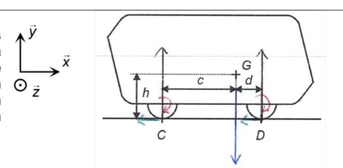

# **Document réponse DR2 4/5 (question 19)**

## Copie 2 (suite)

$$M(C, sol \rightarrow roue D) = \frac{Mg}{2} \times (c+d)$$

$$Mgc + \frac{Mg(c+d)}{2} = \frac{3Mgc+d}{2} = 0$$

$$-Mg+ + \frac{Mgc}{c+d} = 0$$

| Modèle CMEN     | v3                                    |        | _      | _        | _       | _     |        | _      | _      | _       | _    | _      | _          | _            | _ | _     |   | _       | _        | _                                         |        | _    | _            |       |
|-----------------|---------------------------------------|--------|--------|----------|---------|-------|--------|--------|--------|---------|------|--------|------------|--------------|---|-------|---|---------|----------|-------------------------------------------|--------|------|--------------|-------|
|                 | m de famille : eu, du nom d'usage) |        |        |          |         |       |        |        |        |         |      |        |            |              |   |       |   |         |          |                                           |        |      |              |       |
| ■※■             | Prénom(s) :                           |        |        |          |         |       |        |        |        |         |      |        |            |              |   |       |   |         |          |                                           |        |      |              |       |
|                 | Numéro Candidat :                  |        |        |          |         |       |        |        |        |         |      |        |            | é(e) le : |   |       | / |         |          | ]/                                        |        |      |              |       |
| Cadre réservé a | aux candidats de coi                  | ncours | de red | crutem   | ent et  | exame | ens pr | ofessi | onnels | 5       |      |        |            |              |   |       |   |         |          |                                           |        |      |              |       |
| Cocher une sei  | ule case parmi les six ty             | pes de | concou | rs suiva | ants:   | ·     |        |        |        |         |      |        |            |              |   |       | C | ocher p | oublic C | iptio OU privé pour les gnants : | ; s | publ | ic $\square$ | privé |
| Examen p        | professionnel p                       | our l  | 'ava   | ncen     | nent    | au g  | rade   | de :   |        |         |      |        |            |              |   |       |   |         |          |                                           |        |      |              |       |
| Cadre réservé a | aux candidats d'exar                  | nens e | t du c | oncour   | rs géne | éral  |        |        |        |         |      |        |            |              |   |       |   |         |          |                                           |        |      |              |       |
| Examen :        |                                       |        |        |          |         |       |        |        | Sé     | rie / : | Spéc | ialité | <b>é :</b> |              |   | ••••• |   |         |          |                                           |        |      |              |       |
| Epreuve -       | - Matière :                           |        |        |          |         |       |        |        |        |         |      |        | Ses        | sion         | : |       |   |         |          |                                           |        |      |              |       |

EDE STI 2

# **DR4 - DR6 - DR7**

Tous les documents réponses sont à rendre, même non complétés.

# **NE RIEN ECRIRE DANS CE CADRE**

## **Document réponse DR4 (question 29)**

| 0 1 1 0 0 1 1 0 0 0 0 1 1 1 0 0 | 1 1 0 0 1 1 0 0 1 1 1 0 0 1 1 1 1 1 1 1        | 0 1 1 0 0 1 1 0 0 0 1 1 1 0 1 1 1 0 0 1 1 1 1 0 1 1 1 1 0 1 1 1 1 1 1 1 1 1 1 1 1 1 1 1 1 1 1 1 1                                 | 1 0 0 0 1 1 0 0 0 1 1 1 1 1 1 1 1 1 1 1                                                          |
|---------------------------------|------------------------------------------------|-----------------------------------------------------------------------------------------------------------------------------------|--------------------------------------------------------------------------------------------------|
| 1 1 0 0 1 1 0 0 0 1             | 0 0 1 1 0 0 0 0 1 0 0 0 0 1 0 0 0 0 0 0        | 1 0 0 0 1 1 0 0 0 0 1 1 0 1 1 0 0 0 1 1 0 1 1 0 1 1 0 1 1 0 1 1 0 1 1 0 1 1 0 1 1 0 1 1 0 1 1 1 1 1 1 1 1 1 1 1 1 1 1 1 1 1 1 1 1 | 1 0 0 1 1 0 0 0 1 1 1 0 0 0 1 1 1 1 0 0 0 1 1 1 1 1 1 1 1 1 1 1 1 1 1 1 1 1 1 1 1                |
| 1 1 0 0 1 1 0 0 0               | 1 0 0 1 1 0 0 0 0 0 0 0 1 1 0 0 0 0 0 0        | 1 0 0 0 1 1 0 0 0 0 1 1 1 1 0 0 0 1 1 1 1 1 1 1 1 1 1 1 1 1 1 1 1 1 1 1 1                                                         | 1 0 0 0 1 1 0 0 0 1 1 0 0 0 1 1 1 1 1 1                                                          |
|                                 | 0 0 1 1 0 1 1                                  | 0 0 1 1 1 0 0 1 1 0 0 1 1 1 1 1 1 1 1 1                                                                                           | 0 0 0 0 0 0 0 0 0 0 0 0 0 0 0 0 0 0 0 0                                                          |
|                                 | 0 0 1 1 0 1                                    | 1 0 0 1 1 0 0 1 1 1 0 0 0 0 0 0 0 0 0 0                                                                                           | 1 0 0 1 1 1 1 1 1 1 1 1 1 1 1 1 1 1 1 1                                                          |
|                                 | 0 0 1 1 0 1                                    | 0 0 1 1 1 0 1 1 1 0 0 1 1 1 1 1 1 1 1 1                                                                                           | 0 0 0 0 0 0 0 0 0 0 0 0 0 0 0 0 0 0 0 0                                                          |
|                                 | 0 0 1 1 0                                      | 0 0 1 1 1 1 0 0 0 0 0 0 0 0 0 0 0 0 0 0                                                                                           | 0 0 0 0 0 0 0 0 0 0 0 0 0 0 0 0 0 0 0 0                                                          |
|                                 | 0 0 1 1                                        | 0                                                                                                                                 | 0                                                                                                |
|                                 | 0 0                                            | 0 1 1 1                                                                                                                           | 0 1 0 1                                                                                          |
|                                 | 0                                              | 0 -                                                                                                                               | 0 -                                                                                              |
|                                 | 0                                              | 0 -                                                                                                                               | 0 -                                                                                              |
| l                               |                                                |                                                                                                                                   |                                                                                                  |
| ļ                               | -                                              | - 0                                                                                                                               | - 0                                                                                              |
|                                 | -                                              |                                                                                                                                   |                                                                                                  |
|                                 |                                                |                                                                                                                                   |                                                                                                  |
|                                 | me des octets de l'entête UDP sans le checksum | me des octets de l'entête UDP sans le checksum Somme des octets de données                                                     | Somme des octets de l'entête UDP sans le checksum Somme des octets de données Somme totale |

| mparaison du checksum et du code d'erreur | Détection d'une erreur : | ino | non 🗆 |  |
|-------------------------------------------|--------------------------|-----|-------|--|
|                                           |                          |     |       |  |

Rappel : seuls les 16 premiers bits de droite sont utilisés.

# **Document réponse DR6 (question 47)**

Consigne : Compléter les … ( ) en précisant la grandeur électrique relevée et son unité.

Exemple : v1 ( V )

# **Document réponse DR7 (question 69)**

#### Liste des variables utilisées

*départ du cycle* : variable booléenne dont le front montant permet le lancement du

cycle de descente du galet

*fdcb* : variable booléenne qui vaut 1 quand le galet est en position basse

et 0 sinon

*fdch* : variable booléenne qui vaut 1 quand le galet est en position haute

et 0 sinon

*moteur* : variable booléenne qui vaut 1 quand le moteur est alimenté et 0

sinon.

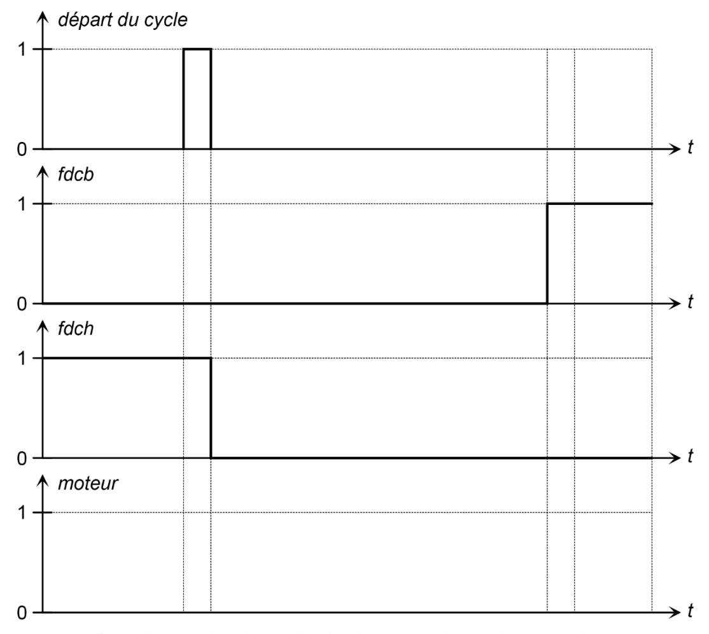

Représentation du cycle de descente des galets gauches