#### **SESSION 2024** \_\_\_\_

### CAPET CONCOURS EXTERNE ET CAFEP CORRESPONDANT ET TROISIEME CONCOURS

**Section : SCIENCES INDUSTRIELLES DE L'INGÉNIEUR**

**Option : INGÉNIERIE ÉLECTRIQUE**

#### **ÉPREUVE ÉCRITE DSICIPLINAIRE**

Durée : 5 heures \_\_\_\_

*Calculatrice autorisée selon les modalités de la circulaire du 17 juin 2021 publiée au BOEN du 29 juillet 2021.*

*L'usage de tout ouvrage de référence, de tout dictionnaire et de tout autre matériel électronique est rigoureusement interdit.*

*Il appartient au candidat de vérifier qu'il a reçu un sujet complet et correspondant à l'épreuve à laquelle il se présente.* 

*Si vous repérez ce qui vous semble être une erreur d'énoncé, vous devez le signaler très lisiblement sur votre copie, en proposer la correction et poursuivre l'épreuve en conséquence. De même, si cela vous conduit à formuler une ou plusieurs hypothèses, vous devez la (ou les) mentionner explicitement.*

**NB : Conformément au principe d'anonymat, votre copie ne doit comporter aucun signe distinctif, tel que nom, signature, origine, etc. Si le travail qui vous est demandé consiste notamment en la rédaction d'un projet ou d'une note, vous devrez impérativement vous abstenir de la signer ou de l'identifier. Le fait de rendre une copie blanche est éliminatoire.**

#### **INFORMATION AUX CANDIDATS**

Vous trouverez ci-après les codes nécessaires vous permettant de compléter les rubriques figurant en en-tête de votre copie

Ces codes doivent être reportés sur chacune des copies que vous remettrez.

**► Concours externe du CAPET de l'enseignement public** :

**► Concours externe du CAFEP/CAPET de l'enseignement privé** :

Concours Section/option Epreuve Matière EDF 1412E 101 9311

**►Troisième concours externe du CAPET de l'enseignement public :**

ConcoursSection/option Epreuve Matière EDV 1412E 101 9311

#### **Étude de l'extracteur d'air du pôle bois et menuiserie du lycée les Lombards de Troyes**

Le fonctionnement d'une industrie comme celle du bois génère de nombreuses particules de natures différentes. Celles-ci sont nuisibles pour l'homme et pour l'environnement. Parmi ces particules, on retrouve la poussière en très grande quantité. Elle contient des composés pouvant provoquer de graves problèmes de santé, raison pour laquelle il est indispensable de trouver des solutions efficaces pour l'évacuer de manière adaptée.

Chaque industrie en fonction de ses activités et des matières premières qu'elle utilise, peut avoir besoin d'une solution spécifique pour l'aspiration industrielle. Pour que la solution choisie soit efficace et adaptée aux besoins, il faudra prendre en compte :

- le type de polluants concerné (il peut s'agir de poussières de verre, de bois, de farine, de plastique, ou encore de poussières métalliques) ;
- la nature du (des) poste(s) à équiper.

Dans le souci de préserver la santé des opérateurs des machines, la réglementation impose aux industriels de se doter de systèmes permettant de purifier l'air dans leurs locaux.

L'étude porte sur un extracteur d'air (figure 1) équipant les locaux des salles de travaux pratiques du pôle bois et menuiserie (figure 2) du lycée les Lombards de Troyes.

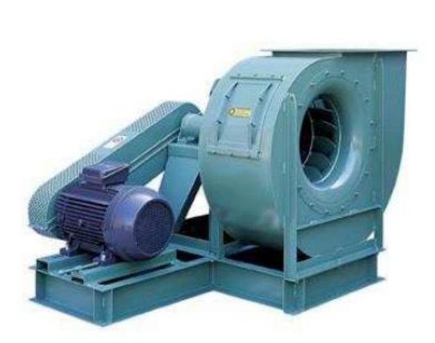

**Figure 1 : extracteur d'air** 

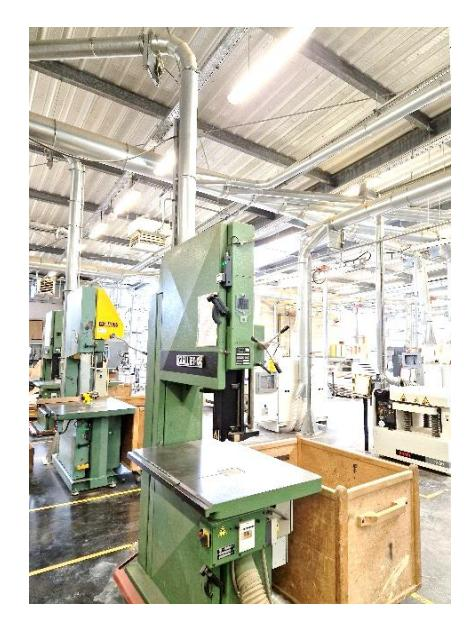

**Figure 2 : salle de travaux du CAP bois et menuiserie**

#### **Problématique générale**

Quelles sont les solutions technologiques permettant d'optimiser la consommation énergétique de l'extracteur d'air tout en assurant un fonctionnement conforme aux exigences du client et aux normes en vigueurs ?

Ce sujet comporte cinq parties indépendantes abordant les problématiques suivantes :

**Partie A** : comment dimensionner le variateur et le moto-extracteur électriques afin d'optimiser la consommation énergétique de l'extracteur d'air ?

**Partie B** : comment vérifier la conformité de l'installation électrique vis-à-vis des normes ?

**Partie C** : comment optimiser le contrôle de la vitesse d'extraction d'air ?

**Partie D** : comment surveiller les températures des équipements de la chaine d'énergie ?

**Partie E** : comment mettre en forme le signal issu d'un capteur de température en vue de son traitement par un automate programmable ?

#### **Partie A : comment dimensionner le variateur et le moto-extracteur électriques afin d'optimiser la consommation énergétique de l'extracteur d'air ?**

L'objectif de l'étude est de vérifier le dimensionnement de la motorisation utilisée pour entrainer les pales de l'extracteur d'air.

Le principe de fonctionnement de l'extraction et du recyclage de l'air repose sur l'association d'un ventilateur et d'une machine asynchrone à vitesse variable et contrôlée**,** le descriptif est présenté sur la figure 3.

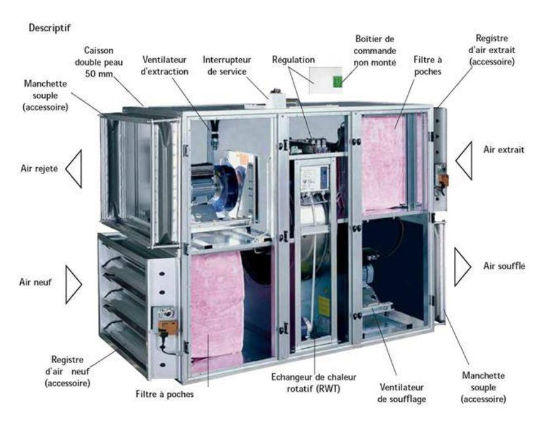

**Figure 3 : synoptique de l'extraction et du recyclage de l'air**

La première étape de l'étude consiste à dimensionner en puissance la pompe de l'extracteur d'air afin d'assurer le recyclage de l'air dans les conditions imposées par le client. Pour cela, le nombre de renouvellement par heure préconisé est égal à 10 (le volume total d'air de la pièce doit être renouvelé 10 fois par heure). Pour limiter le bruit, la vitesse de l'air dans les canalisations ne doit pas dépasser 5 ms-1. Le schéma de la figure 4 représente l'installation. L'extracteur doit permettre le renouvellement de l'air dans les deux salles du laboratoire. La salle 1 a un volume V1 = 2 500 m3 alors que la deuxième salle a un volume V2 = 2 750 m3.

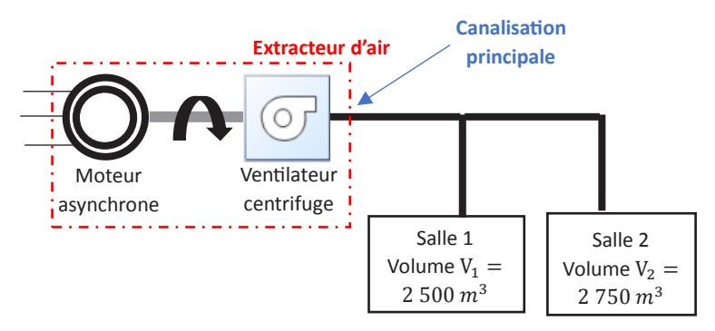

**Figure 4 : schéma de l'installation**

**A1** Calculer les débits  $D_1$  et  $D_2$  respectivement dans les salles 1 et 2 en fonction des données imposées par le client. **En déduire** le débit total  $D_t$  dans la canalisation principale.

Le réseau d'aspiration est constitué de nombreux coudes, tés, raccords et réductions qui augmentent fortement les pertes de charges des conduites. En tenant compte de la pression dynamique nécessaire pour mettre l'air en mouvement, l'extracteur doit alors exercer une pression totale  $\Delta p = 5$  297 Pa.

La puissance fournie par l'extracteur, notée  $P_{\rm extra}$ , pour assurer le débit  $D_t$  s'exprime par :

$$P_{extra} = \Delta p \times D_t$$
 avec  $P_{extra}$  en W,  $\Delta p$  en Pa et  $D_t$  en  $m^3 \cdot s^{-1}$  .

**A2** Calculer la puissance  $P_{extra}$  et la puissance utile  $P_u$  du moteur asynchrone sachant que le ventilateur a un rendement  $\eta = 0.78$ .

La seconde étape de l'étude vise à valider le choix de la motorisation au point de fonctionnement nominal. Le document technique DT1 précise le modèle de la machine asynchrone utilisé pour cette étude. La plaque signalétique du moteur asynchrone porte les indications suivantes :

- $\triangleright$  tension composée  $U_S = 400 \text{ V}$  soit une tension simple  $V_S = 230 \text{ V}$ ;
- $\triangleright$  courant nominal  $I_S = 229 \text{ A}$ ;
- $\triangleright$  facteur de puissance  $\cos \varphi_{mot} = 0.85$ ;
- fréquence d'alimentation du réseau f = 50 Hz;
- $\rightharpoonup$  pulsation des grandeurs électriques  $\omega_s = 2\pi \times f$
- $\triangleright$  vitesse de rotation nominale N = 1 400 tr · min-1:
- > nombre de paires de pôle p = 2.

A3 À l'aide du document technique DT1, **déterminer** l'expression littérale et **calculer** la vitesse des champs tournants vu du stator  $N_s$  en  $tr \cdot min^{-1}$ . **En déduire** la valeur du glissement nominal g.

On note X la valeur efficace de la grandeur complexe X.

**A4** À l'aide du document technique DT1, **exprimer** le courant  $I_r'$  en fonction de  $V_s$ ,  $L_f$ ,  $\omega_s$  et  $\frac{R_R'}{g}$ . **Calculer** la valeur de  $I_r'$ .

Dans la suite de l'étude on considère que  $I_r'$  = 122 A et que le couple de pertes est constant et égal à  $C_p=200\ Nm$ .

A5 À l'aide du document technique DT1, calculer :

- la puissance absorbée Pa;
- les pertes joules au rotor Pir;
- les pertes mécaniques Ppm.

**A6** À l'aide du document technique DT1, **en déduire** la valeur de la puissance utile  $P_{\rm u}$  en sortie de la machine asynchrone.

Pour la suite on pose  $P_u = 100 \text{ kW}$ .

**A7 Valider** le choix de la motorisation en comparant le résultat obtenu à la question A2 et la valeur de Pu.

Le document réponse DR1 représente les courbes suivantes :

- évolution du couple utile  $C_u$  de la machine asynchrone en fonction de la vitesse de rotation de l'arbre  $\Omega$  ;
- évolution des couples aérodynamique  $C_{\rm v}$  en fonction de  $\Omega$  selon différentes valeur du diamètre, noté d, des pâles du ventilateur.

On rappelle que la vitesse rotation nominal du moteur est  $N = 1400 \text{ tr} \cdot \text{min}^{-1}$ .

**A8** Sur le document réponse DR1, **placer** le point de fonctionnement nominal du moteur sur le courbe caractéristique  $C_u(\Omega)$ . **En déduire** le diamètre des pâles du ventilateur adapté au fonctionnement en régime établi.

#### **Partie B : comment rendre conforme l'installation électrique vis- à vis des normes ?**

L'objectif de l'étude est d'identifier et de dimensionner les matériels requis pour garantir un transfert d'énergie de qualité et conforme à la norme.

La figure 5 illustre l'installation électrique triphasée de l'atelier bois et menuiserie du lycée les lombards. L'atelier est alimenté par un réseau triphasé équilibré de tension composée Ur = 400 V et est constitué :

- du moto-ventilateur de l'extracteur d'air dont les caractéristiques sont les suivantes :
  - tension composée Un = 400 V soit une tension simple Vn = 230 V ;
  - courant nominal IS = 229 A ;
  - facteur de puissance cos φmot = 0,85 ;
  - fréquence d'alimentation du réseau f = 50 Hz ;
  - pulsation d'alimentation ω = 2π × f.
- d'ordinateurs et d'un automate de sécurité qui consomment une puissance électrique P0 = 1 kW avec un facteur de puissance cos φ0 = 1 ;
- du système d'éclairage et des équipements de l'atelier (groupe de perçage, brosses, chaines et scies) qui consomment une puissance active Pe = 43 kW et une puissance réactive Qe = 25,5 kVAR.

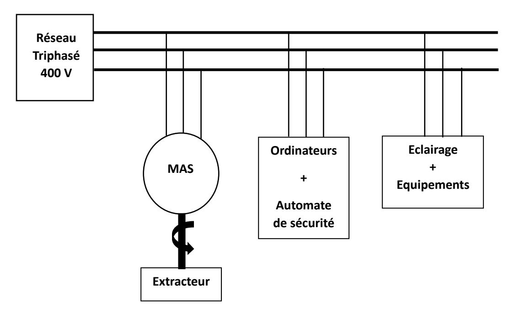

**Figure 5 : synoptique de l'installation de l'atelier bois et menuiserie**

- **B1 Calculer**, pour l'atelier, la puissance active totale Pcharge, la puissance réactive totale Qcharge et la puissance apparente totale Scharge.
- **B2 En déduire** le courant total absorbé noté Iabs, par cette installation ainsi que le facteur de puissance Fp.

Pour la suite de l'étude on prend  $P_{charge} = 178,3 \text{ kW}$  et  $Q_{charge} = 108,7 \text{ kVAR}$ .

Le gestionnaire d'énergie impose un facteur de puissance compris entre 0,92 et 1. Pour cela, une batterie de condensateurs a été ajoutée en parallèle (un condensateur de capacité C par phase) de l'installation.

Le dimensionnement des condensateurs de compensation d'énergie réactive est réalisé afin d'obtenir un facteur de puissance unitaire de l'ensemble de l'installation au point de fonctionnement nominal.

**B3 Montrer** que l'expression permettant de calculer la capacité d'un condensateur à coupler en étoile et ramenant le facteur de puissance à 1 est :

$$C = \frac{Q_{charge}}{3\times\omega\times V_n^2}$$
 avec  $\omega = 2\pi\times f$  .

#### **B4** En déduire la valeur de C pour compenser la puissance réactive.

Dans la suite de l'étude, l'atelier équipé de la batterie de condensateurs est assimilé à une charge dont la puissance active est  $P_{charge}=178,3~kW$  et le facteur de puissance  $F_p=1.$  Le réseau électrique défini précédemment alimente l'atelier au travers d'une ligne triphasée de longueur X=850~m via le secondaire du transformateur. Chaque fil de ligne est modélisé par l'association d'une résistance  $R_L$  en série avec une inductance  $L_L$ . Les câbles ont une résistance par unité de longueur  $R_u=20~m\Omega\cdot km^{-1}$  et une inductance par unité de longueur  $L_u=1,2~mH\cdot km^{-1}.$ 

La figure 6 illustre le schéma équivalent de l'installation étudiée. Les grandeurs utilisées sur cette figure sont :

- UD la valeur efficace de la tension composée tension au secondaire du transformateur considéré comme parfait;
- $\rm U_r$  la valeur efficace de la tension composée du réseau triphasé équilibré, alimentant l'atelier,  $\rm U_r=400~V$  ;
- $\Delta U = U_D U_r$  la chute de tension composée ;
- Itot la valeur efficace du courant dans un conducteur de phase.

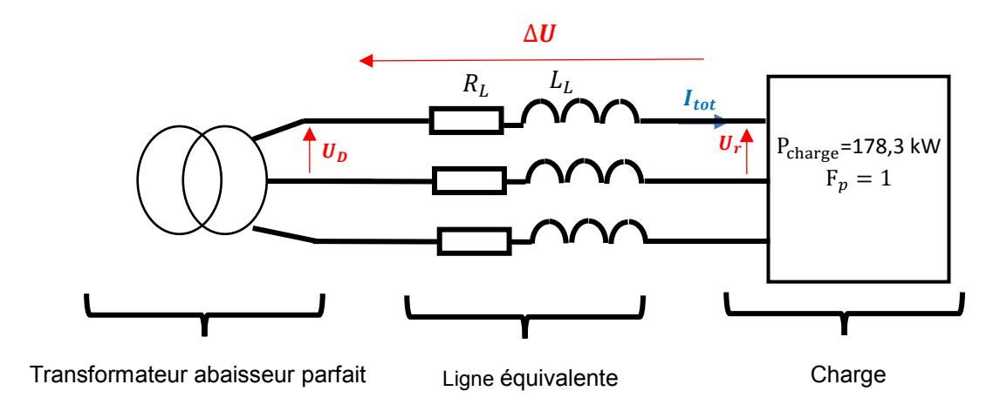

Figure 6 : schéma équivalent du réseau électrique

- **B5** Calculer la résistance  $R_L$  et l'inductance  $L_L$  pour chaque fil de ligne de longueur X=850 m.
- **B6 Exprimer** et **calculer** la valeur efficace de l'intensité Itot du courant dans un conducteur de phase.

Pour la suite, on pose  $I_{tot} = 258 \text{ A}$ .

- **B7** Pour l'ensemble « réseau électrique et récepteur », **exprimer** et **calculer** la puissance active totale  $P_T$ , la puissance réactive totale  $Q_T$  et la puissance apparente  $S_T$  vue du secondaire du transformateur abaisseur parfait.
- **B8** En déduire la valeur efficace de la tension entre phases  $U_D$  au secondaire du transformateur abaisseur ainsi que la chute de tension  $\Delta U$  en proportion de  $U_D$ .
- **B9** À l'aide du document technique DT2, **indiquer** si la valeur de ΔU est conforme à la norme NFC 15-100 sachant que le transformateur est du domaine public dans la catégorie « autres usages ». Dans le cas contraire, **proposer** une solution pour diminuer la chute de tension.

La suite de l'étude porte sur le fonctionnement du moto-extracteur en vitesse variable. L'objectif est de valider le choix d'une commande du variateur par MLI (Modulation de largeur d'impulsion) de l'onduleur au regard des impacts de compatibilité électromagnétique de celui-ci sur le reste du réseau. Le but est de calculer le taux de distorsion harmonique (THD) et de le valider vis-à-vis des exigences de la norme IEC/EN 61000-2-2.

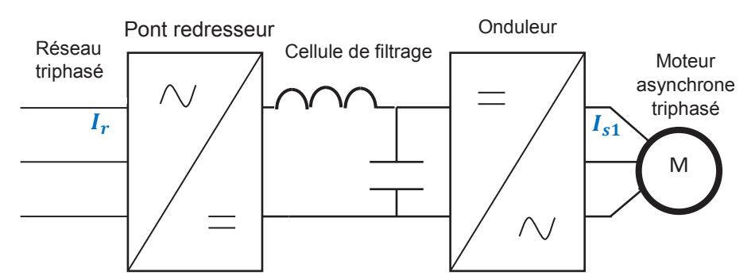

Figure 7 : synoptique de la structure "variateur + moto-extracteur"

La structure interne du variateur est présentée sur la figure 7. Il est constitué :

- d'un pont redresseur, celui-ci génère des harmoniques sur le réseau ;
- d'une cellule de filtrage :
- d'un onduleur commandé afin de piloter en vitesse la machine asynchrone.

Les simulations réalisées sont présentées sur le document technique DT3. Deux cas d'études sont présentés :

- le cas 1 où le variateur de vitesse est commandé en pleine onde ;
- le cas 2 où le variateur de vitesse est commandé par MLI avec une fréquence de la porteuse  $\rm f_p=6\,000\,Hz.$

On rappelle que le taux de distorsion harmonique (THD) est déterminé par la formule :

THD = 
$$\frac{\sqrt{I_2^2 + I_3^2 + I_4^2 + \dots + I_n^2}}{I_1}$$

avec:

- I1: valeur efficace du fondamental du courant
- I2, I3, I4, ..., In valeurs efficaces des harmoniques du courant

**B10** À l'aide du document technique DT3, **calculer**, à l'aide du fondamental et des harmoniques de rang 3, 5, 7 et 9, le THD du courant réseau Ir dans les deux cas.

La norme IEC/EN 61000-2-2 fixe un THD de courant inférieur à 25 % pour assurer une compatibilité électromagnétique conforme.

- **B11 Conclure** dans les deux cas sur la qualité du signal  $I_r$  vis-à-vis de l'exigence fixée par la norme IEC/EN 61000-2-2.
- **B12** À l'aide du document technique DT3, **commenter** la conséquence de la mise en place d'une MLI sur la décomposition spectrale du signal Ir. **Proposer** une solution pour pallier ce problème.
- **B13** À partir des résultats précédents, **justifier** le choix d'une commande MLI pour le pilotage du variateur de vitesse.

#### Partie C : Comment optimiser le contrôle de la vitesse d'extraction de l'air ?

L'objectif de cette partie est de définir une stratégie de commande permettant d'assurer le pilotage en vitesse de la motorisation.

On suppose que le point de fonctionnement nominal de la vitesse N se trouve dans la zone de linéarité. La figure 8 décrit le principe de la commande scalaire (asservissement en vitesse) de la motorisation. Pour cela un capteur de vitesse mesure la vitesse instantanée  $\Omega$  et la compare à une consigne de vitesse  $\Omega_{\rm réf}$ . L'écart entre la consigne et la vitesse réelle permet d'établir la commande de pulsation des champs statoriques  $\omega_{\rm sref}$  via un correcteur.

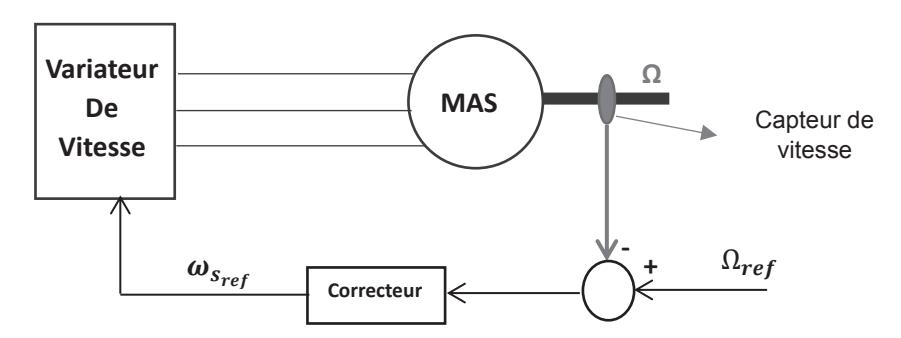

Figure 8 : schéma de l'autopilotage de la motorisation

Le modèle de la machine asynchrone et les équations associées sont indiquées dans le document technique DT1. L'étude sera faite pour un glissement faible ( $g \approx 0$ ).

- C1 À l'aide des équations 1 et 2 du document technique DT1 et de l'hypothèse d'un faible glissement, **montrer** que le couple  $C_{em}$  peut se mettre sous la forme  $C_{em} = \frac{3p}{R_s^4} \times \left(\frac{V_s}{\omega_s}\right)^2 \omega_s \times g.$
- C2 À l'aide du document technique DT1, **mettre** l'équation précédente sous la forme  $C_{\rm em} = A \cdot \omega_r$  avec  $\omega_r$  la pulsation des champs au rotor. **Donner** l'expression de A en fonction de p,  $V_s$ ,  $R'_r$  et  $\omega_s$ .
- **C3 Montrer** que l'équation 3 du document technique DT1 peut s'exprimer dans le domaine de Laplace (à conditions initiales nulles) sous la forme :

$$\Omega(p) = \frac{K_{meca}}{1 + \tau_{meca}} [C_{em}(p) - C_{r}(p)].$$

**Exprimer**  $K_{meca}$  et  $\tau_{meca}$  en fonction de J et f. **Déterminer** les valeurs numériques  $K_{meca}$  et  $\tau_{meca}$ .

**C4** À partir de l'équation 2 du document technique DT1 et des résultats précédents, **compléter** le document réponse DR2 illustrant le modèle scalaire de la motorisation asynchrone dans le domaine de Laplace.

La suite de l'étude porte sur le dimensionnement du correcteur qui assure l'asservissement en vitesse de la motorisation. La figure 9 illustre la modélisation de la boucle de vitesse. Pour la suite de l'étude, on considère que  $H_m(p) = \frac{K_{meca}}{1+\tau_{meca}p}$ .

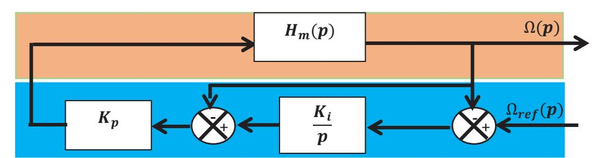

Figure 9 : modélisation de la boucle d'asservissement de vitesse

**C5 Déterminer** la fonction de transfert  $H_{bf}(p) = \frac{\Omega(p)}{\Omega_{ref}(p)}$  en fonction de  $K_p, K_i, K_{meca}$  et  $\tau_{meca}$ . **Mettre** l'expression obtenue sous la forme canonique :  $H_{bf}(p) = \frac{1}{1 + \frac{2m}{\omega_0} p + \frac{1}{\omega_0^2} p^2} \,.$ 

- **C6 Déterminer** l'expression de m et de  $\omega_0$  en fonction de  $K_p$ ,  $K_i$ ,  $K_{meca}$  et  $\tau_{meca}$ .
- C7 À l'aide du théorème de la valeur finale, **montrer** que l'erreur statique de la boucle de vitesse est nulle lorsque l'entrée est un échelon de vitesse d'amplitude  $\Omega_0$ .

Pour la suite du problème on pose :

- l'amortissement m = 1;
- le temps de réponse  $T_r$  (en s) = 1 s
- la pulsation propre  $\omega_0(\text{en rad} \cdot \text{s}^{-1}) = \frac{5}{\text{Tr}}$ .
- avec  $K_{meca}=250\,$  et  $\tau_{meca}=$  8,5 s.
- C8 Exprimer les gains  $K_P$  et  $K_i$  représentés figure 9 en fonction de m,  $K_{meca}$ ,  $\tau_{meca}$  et  $\omega_0$ . Déterminer les valeurs numériques de  $K_P$  et  $K_i$ .

Les performances de l'autopilotage sont étudiées dans un premier temps pour une situation parfaite dans laquelle la génération de  $\omega_s$  à partir de  $\omega_{sref}$  se fait instantanément soit  $\omega_s = \omega_{sref}$ .

Dans la suite de l'étude on considère que la consigne de vitesse est un échelon d'amplitude  $\Omega_0$ .

C9 À l'aide du document technique DT4, **déterminer** l'erreur statique  $\varepsilon_{s1}$  et le dépassement relatif  $D_1$  de la boucle de vitesse dans le cas où  $\omega_s = \omega_{sref}$ .

La marge de phase correspond à la différence entre la phase pour un gain de 0 dB et 180°, soit  $M_{\phi} = Arg(H_{bf(0dB)}) + 180°$ . La fonction Arg représente l'argument de  $H_{bf}(p)$ .

C10 À l'aide du document technique DT4, **déterminer** la marge de phase  $M_{\phi 1}$  de la boucle de vitesse.

Les exigences fixées par le cahier des charges sont :

- un dépassement  $D_{\%} \leq 5 \%$ ;
- une erreur statique sur la boucle de vitesse  $\varepsilon_v$  nulle ;
- une marge de phase  $M_{\omega} \ge 90^{\circ}$ .
- C11 Conclure sur les performances de la motorisation au regard des exigences fixées par le cahier des charges dans le cas où  $\omega_s = \omega_{sref}$ .

Dans un second temps, il faut prendre en compte le régime transitoire du variateur de vitesse tel que  $\omega_s=\frac{1}{1+\tau_{vv}p}\omega_{sref}$ .

- C12 À l'aide du document technique DT5, évaluer dans cette situation :
  - l'erreur statique  $\varepsilon_{s2}$ ;
  - le dépassement relatif D2;
  - la marge de phase  $M_{\omega 2}$ .
- C13 Conclure sur les performances de la motorisation au regard des exigences fixées par le cahier des charges dans le cas où  $\omega_s = \frac{1}{1+\tau_{\rm m,n}} \omega_{\rm sref}$ .

## Partie D : Comment surveiller les températures des équipements de la chaine d'énergie ?

L'objectif est d'établir la constitution matérielle et logicielle de la chaine d'information assurant la régulation de la température de l'armoire électrique du variateur de vitesse.

L'automate utilisé pour la gestion de la sécurité des équipements et la surveillance des températures est un Siemens S7-1500.

Celui-ci est accompagné d'un module d'alimentation ainsi que de quatre modules d'entrées/sorties (E/S « tout ou rien » et analogiques).

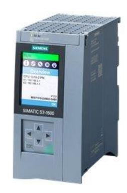

Parmi les fonctions de sécurité attribuées à l'automate, on retrouve également la surveillance les températures des éléments de la distribution en énergie : le redresseur, la cellule de filtrage, le moteur de l'extracteur mais aussi les températures intérieures et extérieures du bâtiment. Le diagramme des exigences de la figure 10 présente l'ensemble des fonctionnalités.

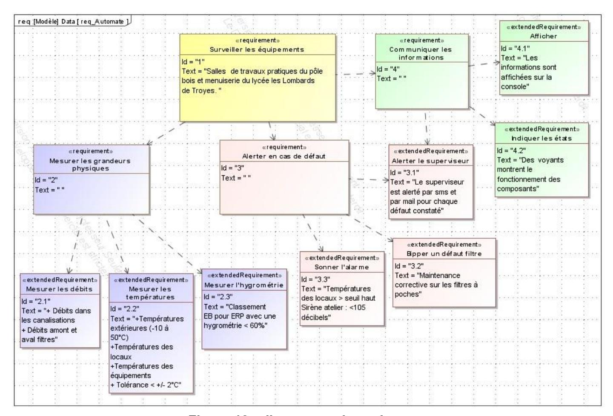

Figure 10 : diagramme des exigences

Le diagramme de définition des blocs de la figure 11, détaille les composants utilisés pour la surveillance de la température de l'armoire électrique contenant le variateur de vitesse de l'extracteur d'air.

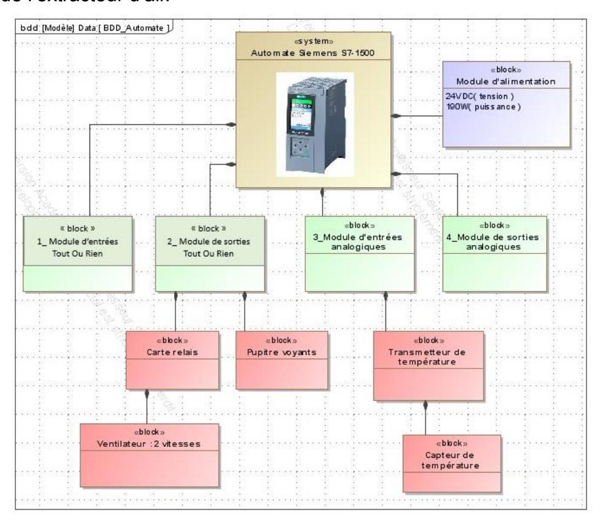

**Figure 11 : diagramme de définition des blocs**

#### **1 - Typologie des capteurs de température**

Les capteurs utilisés pour les mesures de l'ensemble des températures sont de type thermocouple.

*Principe de fonctionnement :* si on réunit à une extrémité (jonction) deux fils métalliques de natures différentes et que l'on élève la température de cette extrémité, il apparaît une tension eAB aux extrémités restées libres (figure 12).

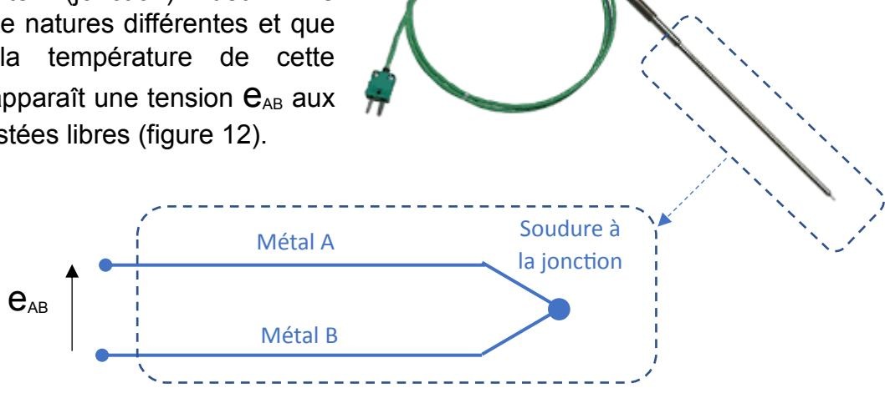

**Figure 12 : principe de fonctionnement du thermocouple**

Il est possible de déterminer la température de l'extrémité à partir de la mesure de la tension eAB.

La figure 13 présente les caractéristiques en fonction du type de thermocouple :

| Type | Plage de mesure conseillée en °C | Alliages                 | Tolérance (°C) | Comparaison qualitative des Prix | Fiabilité Durée de vie maintenance                                          |
|------|-------------------------------------------|--------------------------|-------------------|----------------------------------------|-----------------------------------------------------------------------------------|
| T    | -200 à 350                                | Cuivre et Constantan  | +/-1              | Très élevé                             | Répétabilité exceptionnelle de +/-0,1 °C de −200 à 200 °C |
| K    | -10 à 1 100                            | Chromel et Alumel     | +/- 2,5        | Faible                                 | Stabilité moins satisfaisante que d'autres thermocouples                 |
| N    | 0 à 1250                                  | Nicrosil et Nisil     | +/- 2,5        | Très élevé                             | Stabilité supérieure aux autres thermocouples courants                |
| J    | -30 à 700                                 | Fer et Constantan     | +/- 1,5        | Élevé                                  | S'oxyde rapidement en milieu humide                                         |
| E    | 0 à 800                                   | Chromel et Constantan | +/- 2          | Élevé                                  | Thermocouple à la FEM1 la plus élevée                                       |

**Figure 13 : caractéristiques en fonction du type de thermocouple**

**D1** À l'aide des figures 10 et 13, **justifier** le choix d'un type J pour les capteurs de température thermocouple.

#### **2 – La chaine d'acquisition**

La figure 14 présente les composants qui constituent la chaine d'acquisition de la température à l'intérieur de l'armoire électrique (TARM) vers l'automate programmable.

 1 FEM : Force Électro-Motrice

### Température dans l'armoire électrique : TARM

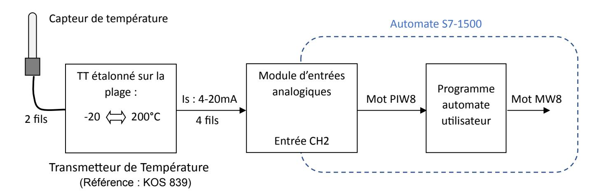

Figure 14 : chaîne d'acquisition de la température à l'intérieur de l'armoire électrique

Le transmetteur de température nommé « TT » convertit la tension (de l'ordre du millivolt) du capteur thermocouple en un signal de sortie normalisé, ici un courant 4 – 20 mA compatible avec le module d'entrée analogique de l'automate.

Le document technique DT6 présente la documentation du transmetteur de température de référence « KOS 839 ».

**D2** À l'aide des documents techniques DT6, **compléter** le schéma de raccordement entre la sonde de température et le transmetteur de température TT, du document réponse DR3.

Les documents techniques DT7 et DT8 présentent le module d'entrée analogique de référence « Al 8xU/I/RTD/TC ST ».

- **D3** À l'aide des documents DT6 et DT7, **compléter** le schéma de raccordement entre le transmetteur de température TT et le module d'entrées analogiques sur le document réponse DR3.
- A l'aide de la figure 14, **compléter** le document réponse DR4 afin de caractériser les valeurs d'entrée/sortie de la fonction de transfert ls = f(TARM) du transmetteur. **Préciser** l'unité employée.
- **D5** À l'aide du document technique DT6, **compléter** le tableau de configuration du switch S1 du transmetteur de température sur le document réponse DR4.

L'automate possède une mémoire interne lui permettant de stocker des variables. Une adresse mémoire codée sur 2 octets est allouée à chaque entrée, sortie et mot interne. Par exemple, MW8 est un mot interne permettant des traitements numériques via la programmation automate.

Toutes les entrées / sorties analogiques commencent par un « P » :

- PIWi pour les entrées
- PQWi pour les sorties
- **D6** À l'aide du document technique DT8, **indiquer** sur combien de bit est codée une entrée analogique, **préciser** le rôle du bit de poids fort.
- **D7** À l'aide de la figure 14, **compléter** le tableau du document réponse DR4 permettant de connaître la valeur décimale du mot PIW8 en fonction du courant ls mesuré.
- **D8** Compléter et dessiner la caractéristique PIW8=f(Is) dans la zone de fonctionnement du transmetteur de température du document réponse DR5.

MW8 est un mot interne à l'automate, il doit permettre de connaître la valeur de la température mesurée par le capteur de température en °C. Un calcul de « mise à l'échelle » entre les mots PIW8 et MW8 doit être élaboré dans le programme automate utilisateur.

La caractéristique de la valeur décimale du mot mémoire MW8 en fonction de la valeur décimale du mot PIW8 est donnée sur le document réponse DR5.

- **D9** Compléter le document réponse DR5 en indiquant les valeurs caractéristiques (PIW8min, PIW8max, MW8min et MW8max) dans la zone de fonctionnement du transmetteur de température.
- **D10** En utilisant les noms des variables, **déterminer** l'équation de la droite traduisant l'évolution MW8 = f(PIW8) du document réponse DR5. **Déterminer** la forme numérique de cette équation en remplaçant les variables par leurs valeurs numériques.
- **D11 Montrer** que l'équation de « mise en forme » permettant de connaître la valeur de la température mesurée en °C, en fonction de la valeur du mot PIW8 et de l'étendue de mesure E s'écrit :

MW8 = f(E, PIW8) = 
$$\frac{E}{27.648}$$
·PIW8 -20.

## 3 - Principe de fonctionnement du ventilateur au niveau du tableau électrique qui contient le variateur de vitesse

Un système de ventilation est enclenché si la température mesurée dans le tableau est supérieure aux consignes. Il fonctionne selon le principe suivant :

- si la température est inférieure à 35°C, pas de ventilation,
- si la température est supérieure à CB=35°C alors le ventilateur est enclenché en petite vitesse (PV),
- si la température est supérieure à CH=50°C alors le ventilateur est enclenché en grande vitesse (GV).

Un exemple de profil de température est donné figure 15. Il permet également de voir la vitesse du ventilateur en fonction du temps et de la température.

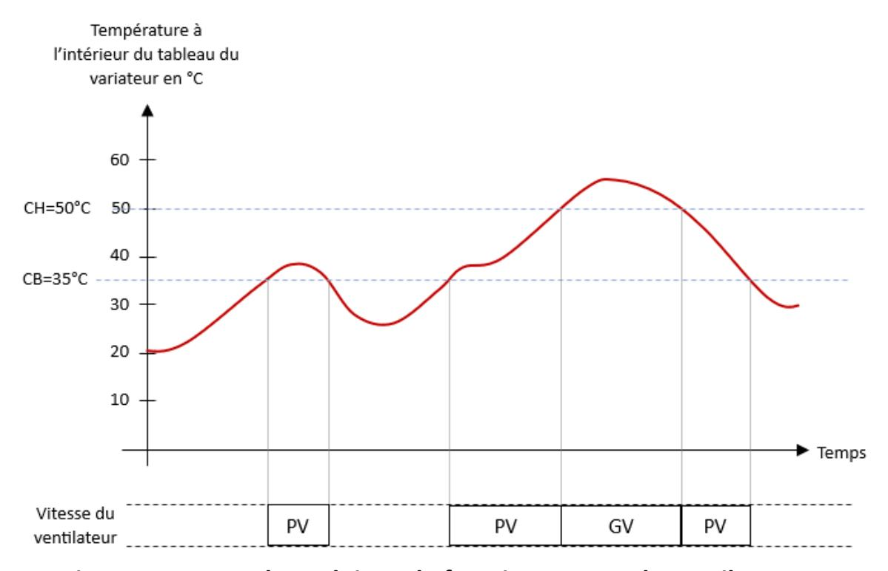

Figure 15 : exemple traduisant le fonctionnement du ventilateur

Deux voyants permettent de visualiser la vitesse de fonctionnement du ventilateur :

- VPV pour un fonctionnement du ventilateur en petite vitesse
- VGV pour un fonctionnement en grande vitesse

D12 En utilisant l'équation MW8 =  $\frac{E}{27.648}$  · PIW8 - 20 , **isoler** la variable PIW8 et **déterminer** la valeur décimale du mot PIW8 pour les valeurs de température CB et CH.

**D13** Sur le document réponse DR6, **compléter** le schéma en portes logiques traduisant le fonctionnement du ventilateur.

#### 4 - Sous-programme de « mise à l'échelle »

Le sous-programme de « mise à l'échelle » est appelé par le programme principal de l'automate et gère la mise à l'échelle de l'entrée analogique en température (°C). Il s'agit de gérer le pilotage du ventilateur et de restituer une information à l'usager par le biais d'un voyant.

Au départ, si l'entrée analogique envoie une valeur en dehors des valeurs limites alors un voyant de « défaut mesure » est enclenché et MW8 prend la valeur zéro. Dans le cas contraire, l'algorithme calcule la valeur de MW8 en degré Celsius (°C) en appliquant la formule :

MW8 = 
$$\frac{E}{27.648}$$
 ·PIW8 -20

La figure 16 illustre les mnémoniques et adressages utilisés par l'automate programmable.

| Adresses | Mnémoniques | Description                                          |
|----------|-------------|------------------------------------------------------|
| PWI8     | entree_ana  | Valeur brute de la mesure sur l'entrée analogique    |
|          |             | correspondante                                       |
| MW8      | mesure      | Valeur de la température en °C                       |
| MW12     | def_mesure  | Valeur binaire d'un défaut de mesure : 1 ⇒ Défaut,   |
|          |             | 0 ⇒ Pas de défaut                                    |
| MW14     | etendue     | Valeur décimale de l'étendue de mesure en °C         |
| MW16     | СВ          | Valeur décimale de la consigne de température        |
|          |             | basse                                                |
| MW18     | CH          | Valeur décimale de la consigne de température        |
|          |             | haute                                                |
| Q0.1     | PV          | Sortie TOR utilisée pour alimenter le ventilateur en |
|          |             | « Petite Vitesse »                                   |
| Q0.2     | GV          | Sortie TOR utilisée pour alimenter le ventilateur en |
|          |             | « Grande Vitesse »                                   |
| Q0.3     | VPV         | Voyant ventilation en Petite Vitesse                 |
| Q0.4     | VGV         | Voyant ventilation en Grande Vitesse                 |

Figure 16 : tableau des mnémoniques et adressages utilisés

Les mots MW16 et MW18 sont respectivement utilisés pour se laisser la possibilité de modifier les valeurs de CB et CH. De même, le mot MW14 permet de modifier l'étendue de mesure.

**D14** Sur le document réponse DR7, **compléter** l'algorigramme de fonctionnement du sous- programme de « mise à l'échelle » en utilisant les mnémoniques indiqués sur la figure 16.

#### **5 – Gestion de la vitesse du ventilateur**

La figure 17 illustre le schéma de câblage du moteur pilotant le ventilateur de refroidissement de l'armoire électrique.

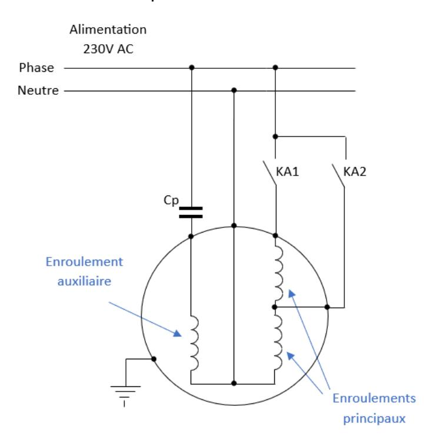

**Figure 17** : **schéma du moteur asynchrone monophasé à 2 vitesses pour la gestion PV (petite vitesse) et GV (grande vitesse) du ventilateur**

Le condensateur Cp, en série avec l'enroulement auxiliaire, produit le déphasage nécessaire au lancement du moteur, il reste sous tension en permanence. Les deux enroulements principaux permettent de choisir la grande vitesse (GV) ou la petite vitesse (PV). Deux relais 24 V continu, KA1 et KA2 sont prévus pour l'alimentation du moteur du ventilateur.

- **D15** Dans le cas où le contact KA1 de la figure 17 est fermé (KA2 ouvert), **dessiner** le schéma équivalent de l'alimentation du moteur du ventilateur.
- **D16** Dans le cas où le contact KA2 de la figure 17 est fermé (KA1 ouvert), **dessiner** le schéma équivalent de l'alimentation du moteur du ventilateur.
- **D17 Indiquer**, pour chaque cas, si le moteur est en grande vitesse ou en petite vitesse. **Justifier** la réponse.

Sur le document réponse DR8 sont donnés :

- le schéma partiel de la carte de sortie TOR de l'automate
- les relais 24 V continu de commande de vitesse du moteur du ventilateur
- les voyants de signalisation 24 V continu

La figure 18 illustre les affectations de la carte de sortie TOR de l'automate programmable.

| Adresses | Mnémoniques   | Descriptions                                             |
|----------|---------------|----------------------------------------------------------|
| Q0.0     | defaut_mesure | Voyant de « défaut mesure » hors étendue de mesure |
| Q0.1     | PV            | Sortie TOR utilisée pour alimenter le ventilateur en     |
|          |               | « Petite Vitesse »                                 |
| Q0.2     | GV            | Sortie TOR utilisée pour alimenter le ventilateur en     |
|          |               | « Grande Vitesse »                              |
| Q0.3     | VPV           | Voyant ventilation en Petite Vitesse                     |
| Q0.4     | VGV           | Voyant ventilation en Grande Vitesse                     |
| Q0.5     | NC            | Non connecté                                             |
| Q0.6     | NC            | Non connecté                                             |
| Q0.7     | NC            | Non connecté                                             |

**Figure 18** : **affectations de la carte de sorties TOR**

**D18 Compléter** le document réponse DR8 afin que le câblage des voyants de signalisation soit conforme aux affectations de la figure 18.

Un verrouillage électrique est à prévoir entre les relais KA1 et KA2 afin d'empêcher l'alimentation simultané des deux relais.

**D19 Compléter** le document réponse DR8 afin de proposer un raccordement des relais de commande de la ventilation.

Le document technique DT9 présente les symboles utilisés pour la programmation de l'automate Siemens S7-1500.

**D20 Compléter** le document réponse DR9 permettant de programmer la commande des voyants VPV et VGV.

Les équations logiques qui permettent la commande en vitesse du moteur du ventilateur sont les suivantes :

- #PV = ( #CB < #mesure ) . ( #mesure > #CH ) ̅̅̅̅̅̅̅̅̅̅̅̅̅̅̅̅̅̅̅̅̅̅̅̅̅
- #GV = #mesure > #CH

**D21 Compléter** le document réponse DR9 permettant de programmer la commande du ventilateur en petite et grande vitesse.

#### **Partie E : comment mettre en forme le signal issu d'un capteur de température en vue de son traitement par un automate programmable ?**

L'objectif est de vérifier la chaine de conversion du transmetteur de température utilisé pour la régulation de la température au niveau de l'armoire électrique du variateur de vitesse.

La figure 19 présente un synoptique du transmetteur de température identifiant la nature des signaux en entrée et en sortie de celui-ci. Il s'agit de convertir une tension eAB de quelques millivolts en entrée en un courant de sortie Is compris entre 4 et 20 mA compatible avec l'entrée analogique de l'automate. La plage de mesure de température est comprise entre -20 à 200 °C.

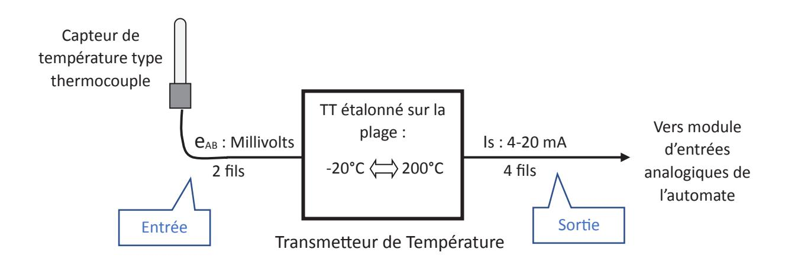

**Figure 19 : synoptique du transmetteur de température**

Les caractéristiques des grandeurs eAB et Is en fonction de la température sont présentés dans le document technique DT10. On considère que les profils sont linéaires.

La figure 20 présente le schéma fonctionnel interne du transmetteur de température. Il permet de distinguer 3 étages distincts permettant la résolution de la problématique de conversion.

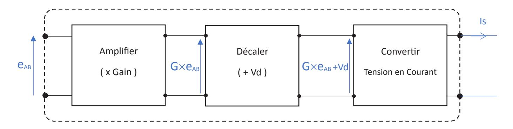

**Figure 20 : schéma fonctionnel interne du transmetteur de température**

On suppose que les amplificateurs opérationnels (AOP) sont parfaits et qu'ils fonctionnent en régime linéaire.

Rappel sur les amplificateurs opérationnels en régime linéaire :

Si la sortie de l'AOP est rebouclée sur l'entrée « - » alors on dit que l'AOP fonctionne en mode linéaire et on a :

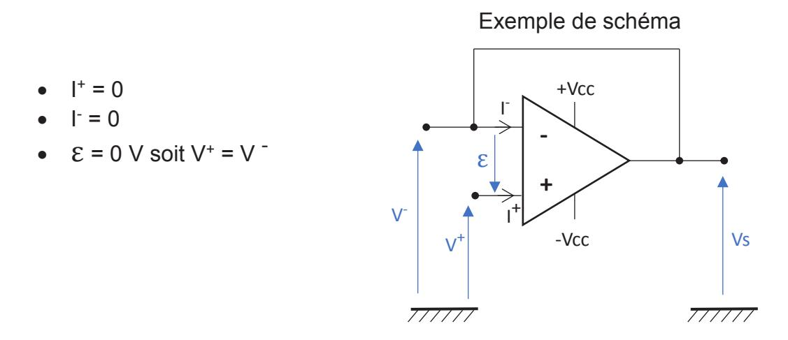

+Vcc et -Vcc sont les tensions d'alimentation de l'AOP. Les alimentations, qui ne font pas partie de l'étude, ne sont pas représentées dans les schémas de montage représentés dans la suite de l'étude.

#### 1. Étude de l'étage d'amplification

La figure 21 illustre les différents sous-étages constituant l'étage d'amplification du transmetteur de température.

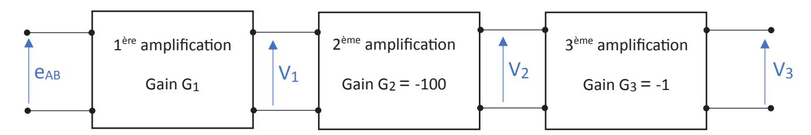

Figure 21 : constituants de l'étage d'amplification

Dans le premier sous-étage d'amplification, la tension **C**AB issue du capteur de température est amplifiée pour aboutir à une tension V1. Le montage de ce sous-étage est illustré par la figure 22.

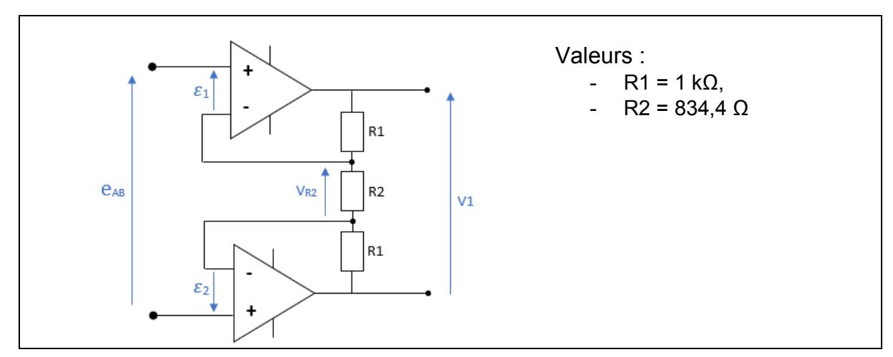

**Figure 22 : schéma de montage de la première amplification**

**E1** À l'aide de la figure 22, **écrire** la loi des mailles impliquant eAB, 1, 2 et VR2 et **montrer** que eAB = VR2.

**E2** Sachant que V1 = 
$$\frac{V_{R2} \cdot (2 \cdot R1 + R2)}{R2}$$
, **calculer** numériquement le gain G1 permettant d'écrire la tension V1=  $G_1 \cdot V_{R2}$  =  $G_1 \cdot e_{AB}$ .

Conformément à la figure 21, la tension V1 est encore amplifiée par deux étages successifs.

**E3** À l'aide de la figure 21, **exprimer** la relation entre eAB, G1, G2, G3 et V3 puis **exprimer** numériquement V3 en fonction de eAB.

#### **2. Étude de l'étage de décalage en tension**

La tension V3 fait office d'entrée pour le montage illustré figure 23. La tension V4 produite par ce montage correspond à un décalage en tension de V3.

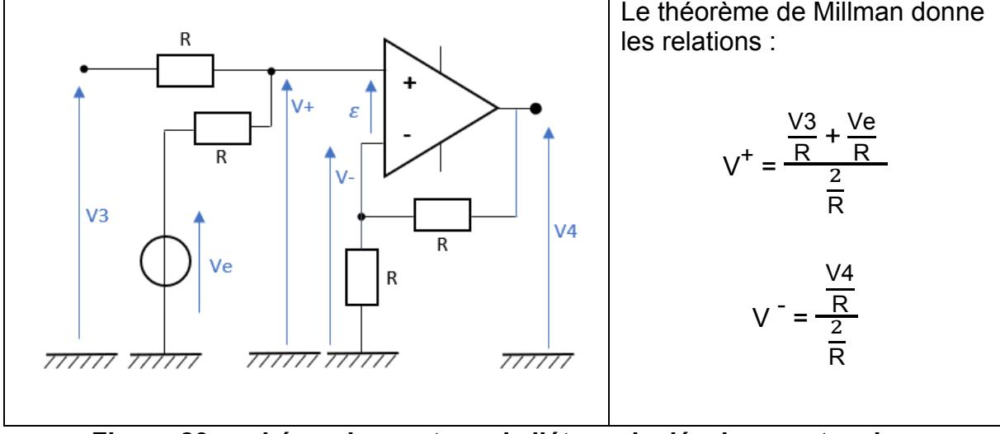

**Figure 23 : schéma de montage de l'étage de décalage en tension**

**E4** À l'aide de la figure 23, **montrer** que, en régime linéaire, la tension V4 vérifie la relation V4 = V3 + Ve. **En déduire** la relation entre V4 et eAB.

On donne Ve = 1,34 V ainsi que la relation V4 = 337,7⋅eAB + 1,34

**E5** À l'aide du document technique DT10, **calculer** V4 pour les deux tensions extrêmes de eAB puis **compléter** le document réponse DR10.

#### **3. Étude de l'étage de conversion tension en courant**

La tension V4 fait office d'entrée pour le montage illustré figure 24. Le courant Is produit par ce montage est le résultat de la conversion de la tension V4.

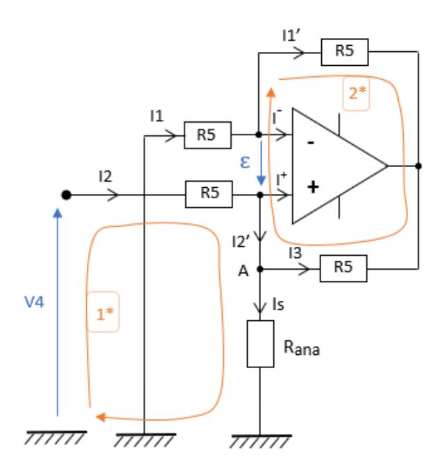

**Figure 24 : schéma de montage pour la conversion de V4 en un courant Is**

- **E6** À l'aide de la figure 24, **déterminer** les relations entre I2 et I2' puis entre I1 et I1'.
- **E7** En utilisant la loi des mailles dans la boucle 1\* illustrée figure 24, **déterminer** la relation liant V4, I2, R5, Is et Rana. **En déduire** l'expression de I2 en fonction de V4, R5, Is, Rana.
- **E8** En utilisant la loi des mailles dans la boucle 2\* illustrée figure 24, **déterminer** la relation liant ε, I1', R5, I3 puis **montrer** que I3 = I1.

L'expression du courant I1 est la suivante : I1 = − RanaIs R5 avec R5 = 250 Ω.

- **E9** En utilisant la loi des nœuds au point A illustré figure 24, **exprimer** le courant Is dans la résistance Rana et **montrer** qu'il est indépendant de Rana.
- **E10 Calculer** Is pour V4=1 V puis pour V4=5 V et **conclure** quant à la conformité du transmetteur de temp

#### DT1 : Modélisation de la machine asynchrone

#### Modèle monophasé équivalent de la machine asynchrone

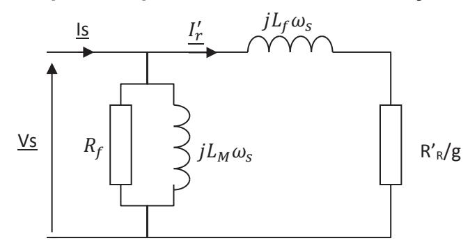

Où:

- $\rightharpoonup$  Rf est la résistance équivalente aux pertes fer, on a Rf = 420  $\Omega$  ;
- $\rightharpoonup R_R'$  est la résistance du rotor ramenée au stator, on a  $R_R'=0.1~\Omega$  ;
- LM est l'inductance magnétisante ;
- $\rightharpoonup$  Lf est la l'inductance rotorique vue du stator, on a Lf = 3.6 mH;
- > g est le glissement, on rappelle que  $g = \frac{\omega_s \omega}{\omega_s}$ ;
- > Vs est la tension simple d'alimentation du stator ;
- IS est le courant dans une phase du stator.

## Le bilan de puissance de la machine asynchrone en convention moteur peut être illustré de la manière suivante :

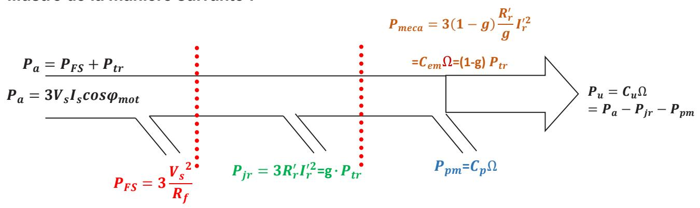

Avec:

- $\triangleright \Omega_s$ : vitesse de rotation du champ au stator
- $\triangleright$   $\Omega$ : vitesse nominale de rotation de la machine asynchrone
- $\triangleright$  cos  $\varphi_{mot}$ : facteur de puissance de l'installation
- Cem: Couple électromagnétique du moteur asynchrone
- $\triangleright$  Cu: couple utile de charge
- ➤ Cp: couple de pertes
- Pa: puissance absorbée
- > PFS: pertes fer au stator
- Pir: pertes joules au rotor
- ➤ Pmeca: puissance mécanique sur le rotor
- Pnm: pertes mécaniques

#### Équation 1 : Expression du couple $C_{em}$ en fonction de $C_{emax}$ et $g_{max}$ :

$$C_{em} = \frac{2C_{emax}}{\frac{g}{g_{max}} + \frac{g_{max}}{g}}$$

Avec:

- $\rightharpoonup g_{max} = \frac{R_R'}{L_f \, \omega_s}$  : représente le glissement maximal ;
- $\rightharpoonup C_{\rm emax} = \frac{3p}{2L_{\rm f}}(\frac{V_{\rm s}}{\omega_{\rm S}})^2$  : représente le couple maximal ;
- $\blacktriangleright \ \omega_s$  : pulsation des grandeurs électriques ;
- > p : le nombre de paires de pôle.
- $N_s = \frac{60 \times f}{p}$ : vitesse de rotation du champ statorique en tr·min-1

#### Équation 2 : Expression de la pulsation des champs au rotor $\omega_r$

$$\omega_r = \omega_s - \omega = \omega_s - p\Omega$$

#### Équation 3 : Principe fondamental de la dynamique en rotation

$$C_{em} - C_r = J \cdot \frac{d\Omega(t)}{dt} + f \cdot \Omega(t)$$

Avec:

- $f = 4.10^{-3} \text{ N} \cdot \text{m} \cdot \text{s} \cdot \text{rad}^{-1}$  : coefficient de frottement ;
- $J = 0.035 \text{ m} \cdot \text{kg}^2$ : moment d'inertie ramené à l'arbre du moteur.

#### Les normes limitent les chutes de tension en ligne

La norme NF C 15-100 impose que la chute de tension entre l'origine de l'installation BT et tout point d'utilisation n'excède pas les valeurs du tableau ci-dessous. D'autre part la norme NF C 15-100 § 559-6-1 limite la puissance totale des moteurs installés chez l'abonné BT tarif bleu. Pour des puissances supérieures aux valeurs indiquées dans le tableau ci-dessous, l'accord du distributeur d'énergie est nécessaire.

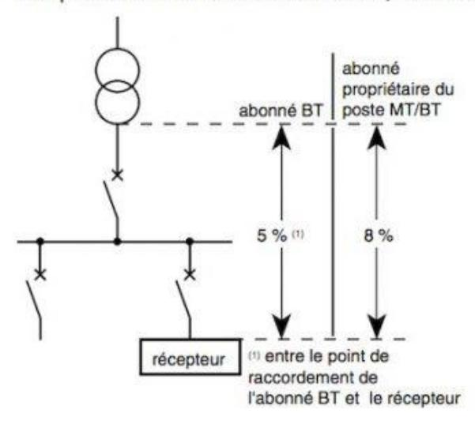

#### Chute de tension maximale entre l'origine de l'installation BT et l'utilisation

|                                                              | éclairage | autres usages (force motrice) |
|--------------------------------------------------------------|-----------|----------------------------------|
| abonné alimenté par le réseau BT de distribution publique | 3%        | 5%                               |
| abonné propriétaire de son poste HT-A/BT                     | 6%        | 8% (1)                           |

(1) Entre le point de raccordement de l'abonné BT et le moteur.

**Cas 1 : Variateur de vitesse commandé en pleine onde**. **Analyse spectrale de Ir pour une commande pleine onde**

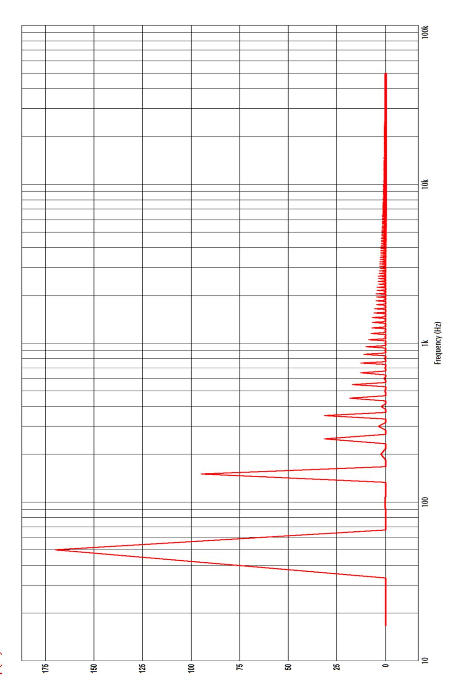

**Cas 2 : Variateur de vitesse commandée par Modulation de largeur d'impulsion (MLI) avec une fréquence de la porteuse**  =

#### **Analyse spectrale de Ir pour une commande MLI**

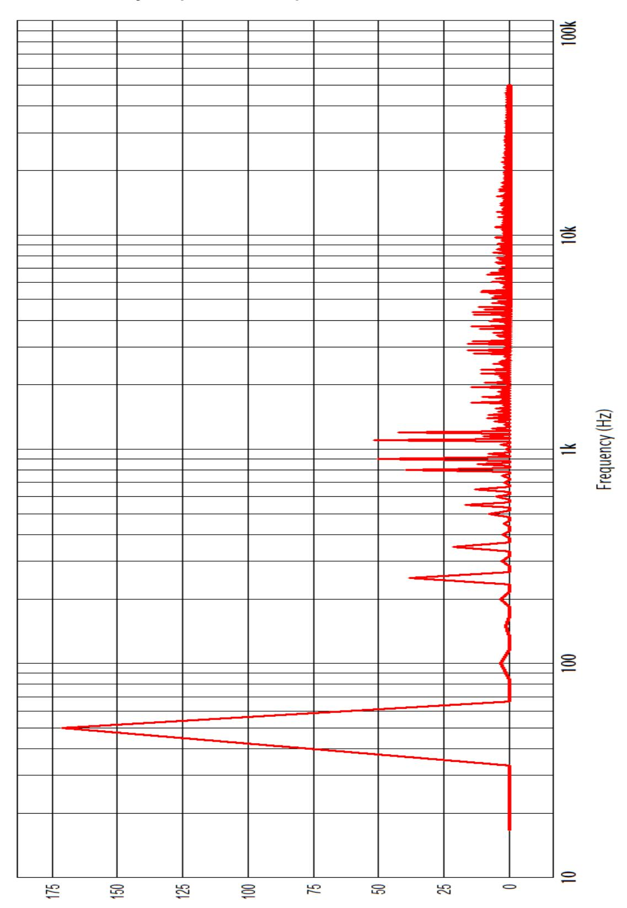

DT4 : Résultats de simulations pour l'autopilotage du moteur asynchrone pour le cas 1 : la génération de  $\omega_s$  à partir de  $\omega_{sref}$  se fait instantanément et sans erreur statique :  $\omega_s=\;\omega_{sref}$ 

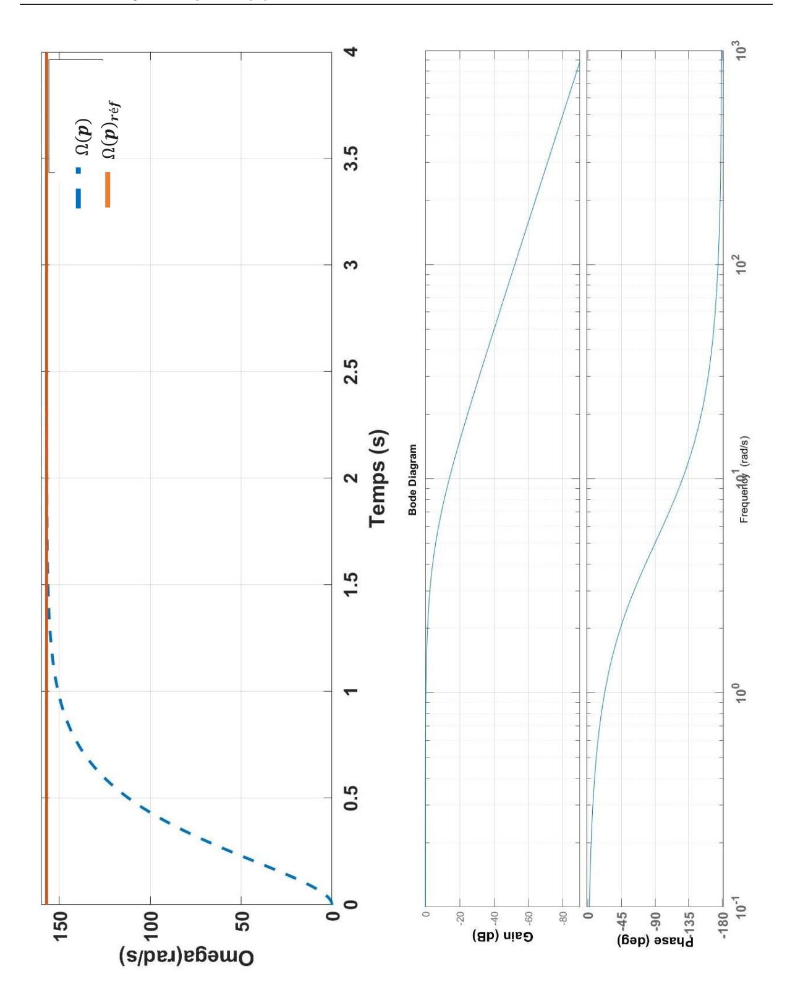

**DT5 : Résultats de simulations pour l'autopilotage du moteur asynchrone pour le cas 2 :** =

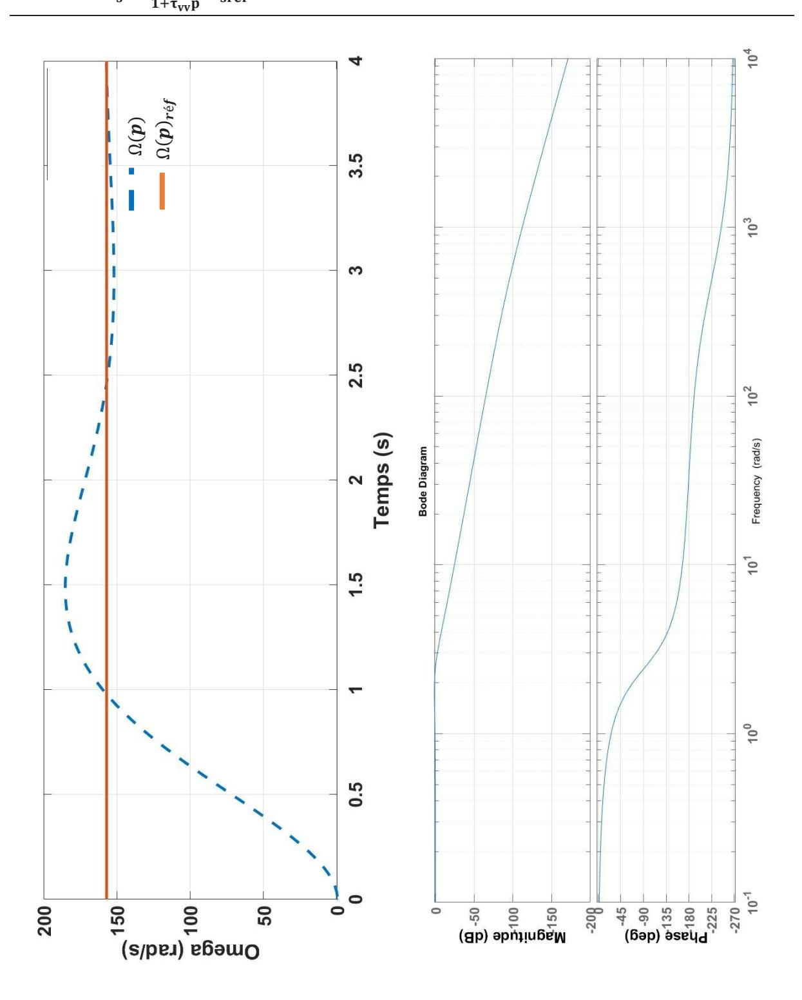

#### **Universal Temperature Transmitter KOS 839**

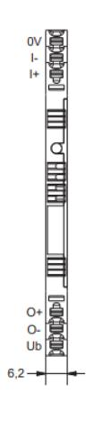

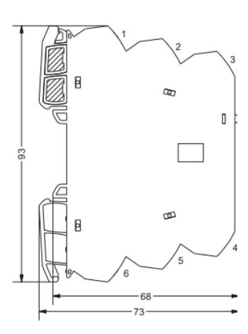

Identification LCIS-WTCA-1839-62-PI Code

KOS 839

Description Entrée : THhermocouples J, K

Sortie: 0-10 V / 0-20 mA / 4-20 mA Isolation: 2,5 kV, séparation 3 voies

Entrée Signal d'entrée Thermocouples J ou K (DIN/CEI 584-1)

Séparation galvanique Entrées/Sorties séparation 3 voies Procédé de mesures Mesure de la tension

-20 °C-200 °C / -50 °C-350 °C / 0 °C-200 °C / 0 °C-400 °C / 0 °C-600 °C / 0 °C-800 Plage de température

°C / 0 °C-1000 °C / 0 °C-1200 °C

Paramétrable Commutateur DIP S1 Zéro Calibrage en production

Résistance d'entrée > 1 MΩ

Compensation des points froids sur toute la plage de températures Mode d'antiparasitage Protection contre les surtensions

Sortie

0-10 V, 0-20 mA, 4-20 mA Signal de sortie

500 Ω Charge maximale pour sortie I Charge min. pour sortie U  $2 k\Omega$ 

Données générales Tension nominale

Plage de tensions de travail AC 19,2-26,4 V / DC 18,0-31,2 V

env. 22 mA @ AC 24 V / env. 13 mA @ DC 24 V Courant nominal

AC/DC 24 V

Visualisation d'état LED verte Temps de montée (10-90 %) env. 30 ms @ 23 °C

Tension d'isolement entrée / sortie 2,5 kVeff

Matière du boîtier PA 6.6 (UL 94 V-0, NFF I2, F2)

**RAL 7012** Couleur du boîtier gris basalte

Montage encliquetable sur profilé chapeau TS35

(EN 60715) IP20

Indice de protection Position de montage au choix Push-In Raccordement monofilaire

0,25 mm2-2,5 mm2 / AWG 20-14

brins fins avec embout

0,25 mm2-1,5 mm2 / AWG 20-16

Plage de températures de travail -25 °C ... +60 °C -40 °C ... +85 °C Plage de températures de stockage

6,2 × 93,0 × 73,0 mm Dimensions (I×h×p) Poids 0,030 kg/pièce 1 Piece

Homologation cULus in preparation DNV GL in preparation

Normes EN 60947-5-1

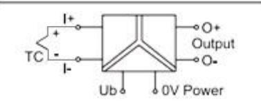

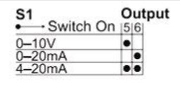

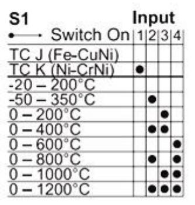

#### **Module d'entrée analogique**

Référence : Analog input module **AI 8xU/I/RTD/TC ST**

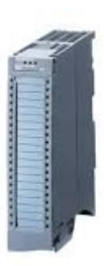

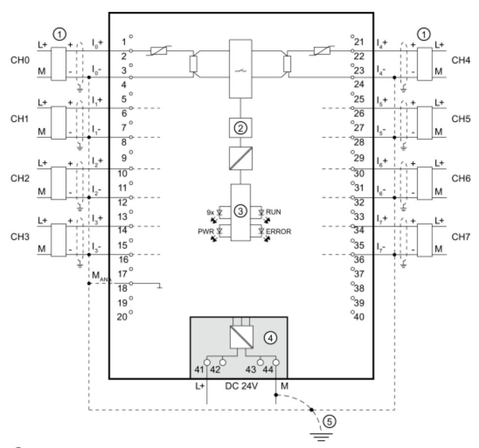

#### **Module d'entrée analogique suite**

Résolution of the analog values : PIWi

| Resolution in bits including sign | Val     | ues         | Analog             | g value  |
|-----------------------------------|---------|-------------|--------------------|----------|
|                                   | Decimal | Hexadecimal | High byte          | Low byte |
| 16                                | 1       | 1н          | Sign 0 0 0 0 0 0 0 | 00000001 |

#### Représentation of analog values in the current measuring ranges

| Values |      | Current measuring range |                 |  |  |  |  |  |  |  |  |  |
|--------|------|-------------------------|-----------------|--|--|--|--|--|--|--|--|--|
| dec    | hex  | ±20 mA                  |                 |  |  |  |  |  |  |  |  |  |
| 32767  | 7FFF | >23.52 mA               | Overflow        |  |  |  |  |  |  |  |  |  |
| 32511  | 7EFF | 23.52 mA                | Overshoot range |  |  |  |  |  |  |  |  |  |
| 27649  | 6C01 |                         |                 |  |  |  |  |  |  |  |  |  |
| 27648  | 6C00 | 20 mA                   | Rated range     |  |  |  |  |  |  |  |  |  |
| 20736  | 5100 | 15 mA                   |                 |  |  |  |  |  |  |  |  |  |
| 1      | 1    | 723.4 nA                |                 |  |  |  |  |  |  |  |  |  |
| 0      | 0    | 0 mA                    |                 |  |  |  |  |  |  |  |  |  |
| -1     | FFFF |                         |                 |  |  |  |  |  |  |  |  |  |
| -20736 | AF00 | -15 mA                  |                 |  |  |  |  |  |  |  |  |  |
| -27648 | 9400 | -20 mA                  |                 |  |  |  |  |  |  |  |  |  |
| -27649 | 93FF |                         | Undershoot      |  |  |  |  |  |  |  |  |  |
| -32512 | 8100 | -23.52 mA               | range           |  |  |  |  |  |  |  |  |  |
| -32768 | 8000 | < -23.52 mA             | Underflow       |  |  |  |  |  |  |  |  |  |

| Values |      | Current measuring ran | Current measuring range |                 |  |  |  |  |  |  |  |
|--------|------|-----------------------|-------------------------|-----------------|--|--|--|--|--|--|--|
| dec    | hex  | 0 to 20 mA            | 4 to 20 mA              |                 |  |  |  |  |  |  |  |
| 32767  | 7FFF | >23.52 mA             | >22.81 mA               | Overflow        |  |  |  |  |  |  |  |
| 32511  | 7EFF | 23.52 mA              | 22.81 mA                | Overshoot range |  |  |  |  |  |  |  |
| 27649  | 6C01 |                       |                         |                 |  |  |  |  |  |  |  |
| 27648  | 6C00 | 20 mA                 | 20 mA                   | Rated range     |  |  |  |  |  |  |  |
| 20736  | 5100 | 15 mA                 | 16 mA                   |                 |  |  |  |  |  |  |  |
| 1      | 1    | 723.4 nA              | 4 mA + 578.7 nA         |                 |  |  |  |  |  |  |  |
| 0      | 0    | 0 mA                  | 4 mA                    |                 |  |  |  |  |  |  |  |
| -1     | FFFF |                       |                         | Undershoot      |  |  |  |  |  |  |  |
| -4864  | ED00 | -3.52 mA              | 1.185 mA                | range           |  |  |  |  |  |  |  |
| -32768 | 8000 | <- 3.52 mA            | < 1.185 mA              | Underflow       |  |  |  |  |  |  |  |

#### **DT9 : symboles utilisés par l'automate Siemens S7-1500**

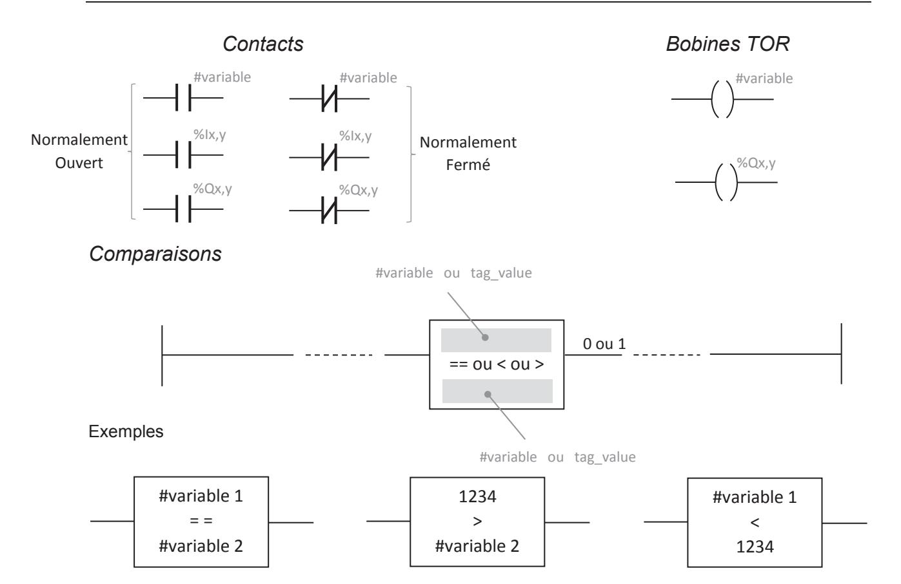

*Affectation :* permet d'affecter une valeur quelconque (IN) à un mot en mémoire (OUT).

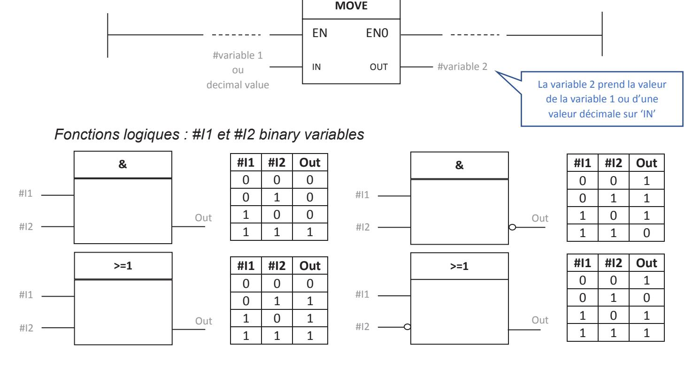

#### **DT10 : Profil de la tension fournie par le capteur de température**

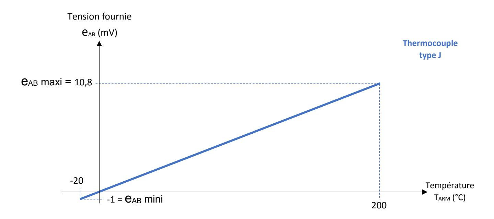

#### Points caractéristiques maximaux :

| Température mesurée (°C)             | -20              | 200                |
|--------------------------------------|------------------|--------------------|
| Tension délivrée par le capteur (mV) | eAB mini = -1 | eAB maxi = 10,8 |

#### **Profil du courant délivré par le transmetteur de température TT**

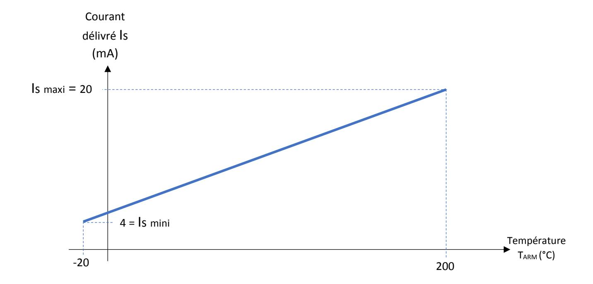

| Modèle CMEN                                                                                                                                                                                                                                   | v3                                   |        | _      | _      | _      | _     | _      | _      | _      | _       | _    |        | _         | _            |   | _ | _ |  _ | _  | _ |   | _ |
|-----------------------------------------------------------------------------------------------------------------------------------------------------------------------------------------------------------------------------------------------|--------------------------------------|--------|--------|--------|--------|-------|--------|--------|--------|---------|------|--------|-----------|--------------|---|---|---|-------|----|---|------|---|
|                                                                                                                                                                                                                                               | m de famille : u, du nom d'usage) |        |        |        |        |       |        |        |        |         |      |        |           |              |   |   |   |       |    |   |      |   |
| 圆彩画                                                                                                                                                                                                                                           | Prénom(s) :                          |        |        |        |        |       |        |        |        |         |      |        |           |              |   |   |   |       |    |   |      |   |
|                                                                                                                                                                                                                                               | Numéro Candidat :                 |        |        |        |        |       |        |        |        |         |      |        |           | é(e) le : |   |   | / |       | ]/ |   |      |   |
| Cadre réservé a                                                                                                                                                                                                                               | ux candidats de coi                  | ncours | de rec | crutem | ent et | exame | ens pr | ofessi | onnels | 3       |      |        |           |              |   |   |   |       |    |   |      |   |
| Concours: Option / Section:  Cocher une seule case parmi les six types de concours suivants: \nexterne 3e externe externe spécial interne ou 1er interne 2nd interne 2nd interne spécial  Examen professionnel pour l'avancement au grade de: |                                      |        |        |        |        |       |        |        |        |         |      |        |           |              |   |   |   |       |    |   |      |   |
| Cadre réservé a                                                                                                                                                                                                                               | ux candidats d'exar                  | nens e | t du c | oncour | s géne | éral  |        |        |        |         |      |        |           |              |   |   |   |       |    |   |      |   |
| Examen :                                                                                                                                                                                                                                      |                                      |        |        |        |        |       |        |        | Séi    | rie / S | Spéc | ialité | <b>э:</b> |              |   |   |   |    |    |   |      |   |
| Epreuve -                                                                                                                                                                                                                                     | Matière :                            |        |        |        |        |       |        |        |        |         |      |        | Ses       | sion         | : |   |   |    |    |   |   |   |

EDE ENE 1

#### DR 1 - DR 2 - DR 3

Tous les documents réponses sont à rendre, même non complétés.

## NE RIEN ECRIRE DANS CE CADRE

#### Document réponse DR1 : question A8

#### Caractéristiques mécaniques du moteur asynchrone et de la charge

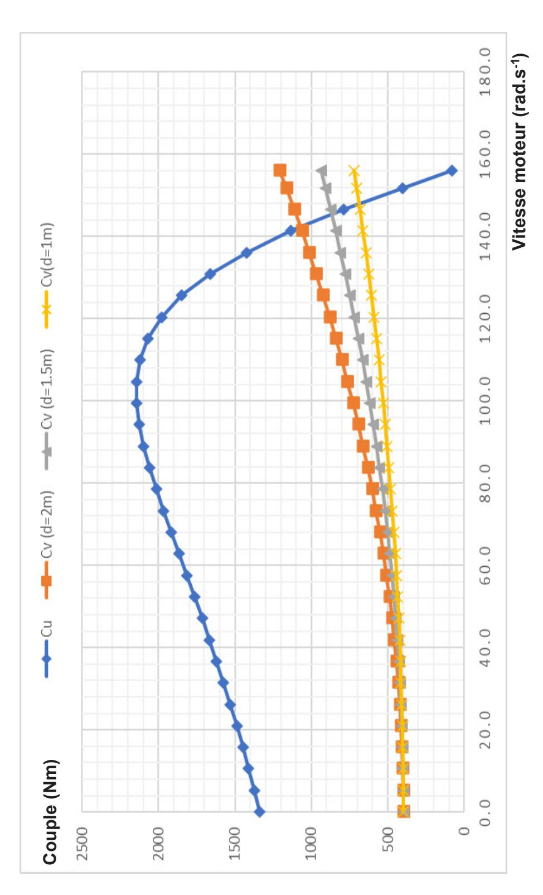

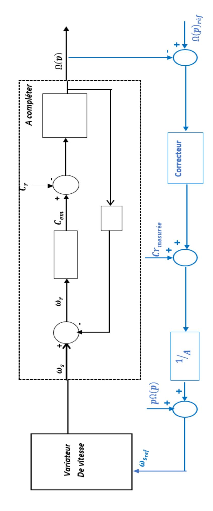

Rappel :

ωs ∶ pulsation des grandeurs électriques

ωsref ∶ consigne de la pulsation des grandeurs électriques

ωr ∶ pulsation du champs rotoriques

Ω(p) ∶ vitesse de rotation en sortie de l′arbre moteur

Ω(p)ref ∶ consigne de vitesse de rotation en sortie de l′arbre moteur

Crmesurée ∶ Couple résistif mesuré sur la charge mécanique (le ventilateur)

#### Schéma de raccordement :

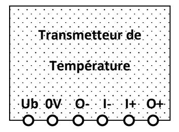

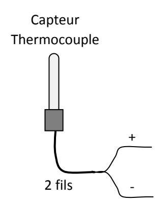

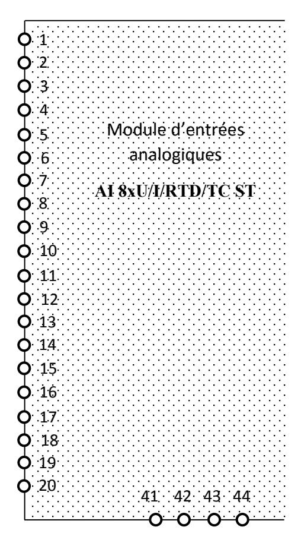

| Modèle CMEN v3                                                                                                                                                                                                                                   |         | _      |       |       | _      | _    | _    | _    | _  | _       | _    | _      | _          | _            |   | _ | _ |  _ | _  | _    |  |  |
|--------------------------------------------------------------------------------------------------------------------------------------------------------------------------------------------------------------------------------------------------|---------|--------|-------|-------|--------|------|------|------|----|---------|------|--------|------------|--------------|---|---|---|-------|----|------|--|--|
| Nom de fami (Suivi, s'il y a lieu, du nom d'usa                                                                                                                                                                                               |         |        |       |       |        |      |      |      |    |         |      |        |            |              |   |   |   |       |    |      |  |  |
| Prénom(                                                                                                                                                                                                                                          | s) :    |        |       |       |        |      |      |      |    |         |      |        |            |              |   |   |   |       |    |      |  |  |
| Numé Candid                                                                                                                                                                                                                                   | -       |        |       |       |        |      |      |      |    |         |      |        |            | é(e) le : |   |   | / |       | ]/ |      |  |  |
| Cadre réservé aux candidats de concours de recrutement et examens professionnels                                                                                                                                                                 |         |        |       |       |        |      |      |      |    |         |      |        |            |              |   |   |   |       |    |      |  |  |
| Concours:  Cocher une seule case parmi les six types de concours suivants:  Externe 3 3° externe externe spécial interne ou 1er interne 2nd interne 2nd interne spécial 2nd interne spécial 2nd interne spécial 2nd interne spécial public privé |         |        |       |       |        |      |      |      |    |         |      |        |            | privé        |   |   |   |       |    |      |  |  |
| Examen profession                                                                                                                                                                                                                                | nel po  | ur l'  | avar  | ncen  | nent   | au g | rade | de : | :  |         |      |        |            |              |   |   |   |       |    |      |  |  |
| Cadre réservé aux candidats                                                                                                                                                                                                                      | d'exame | ens et | du co | ncour | s géne | éral |      |      |    |         |      |        |            |              |   |   |   |       |    |      |  |  |
| Examen :                                                                                                                                                                                                                                         |         |        |       |       |        |      |      |      | Sé | rie / : | Spéc | ialite | <b>э́:</b> |              |   |   |   |    |    |   |  |  |
| Epreuve - Matière :                                                                                                                                                                                                                              |         |        |       |       |        |      |      |      |    |         |      |        | Ses        | sion         | : |   |   |    |    |   |  |  |

EDE ENE 1

### DR 4 - DR 5 - DR 6 - DR 7

Tous les documents réponses sont à rendre, même non complétés.

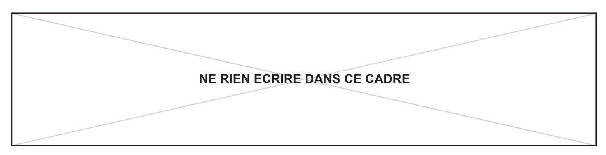

#### **Document réponse DR4 : questions D4 à D7**

**D4** - Caractérisation des valeurs d'entrée/sortie de la fonction de transfert Is = f(TARM) du transmetteur.

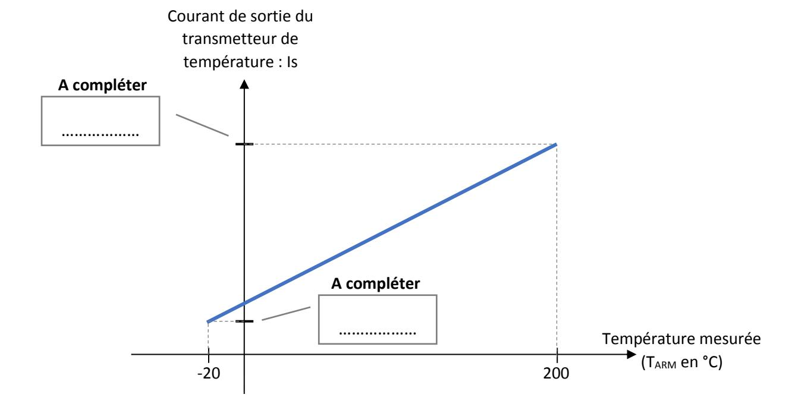

**D5** - Configuration du switch S1 du transmetteur de température TT :

| S1  | 1 | 2 | 3 | 4 | 5 | 6 |
|-----|---|---|---|---|---|---|
| ON  |   |   |   |   |   |   |
| OFF |   |   |   |   |   |   |

**D7** - Tableau des valeurs décimales du mot PIW8 en fonction du courant mesuré :

| Courant mesuré en mA        | 1,185 | 4 | 20 | 22,81 |
|-----------------------------|-------|---|----|-------|
| Valeur décimale du mot PIW8 |       |   |    |       |
|                             |       |   |    |       |

**D8** - Caractéristique de la valeur décimale du mot PIW8 en fonction du courant d'entrée du module d'entrées analogiques : PIW8 = f(Is)

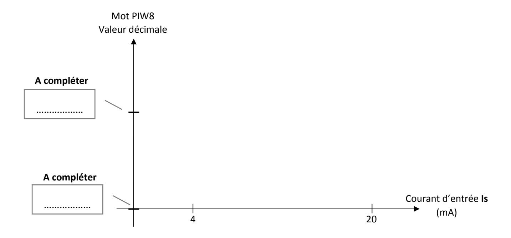

**D9** - Caractéristique de la valeur décimale du mot mémoire MW8 en fonction de la valeur décimale du mot PIW8 : MW8 = f(PIW8)

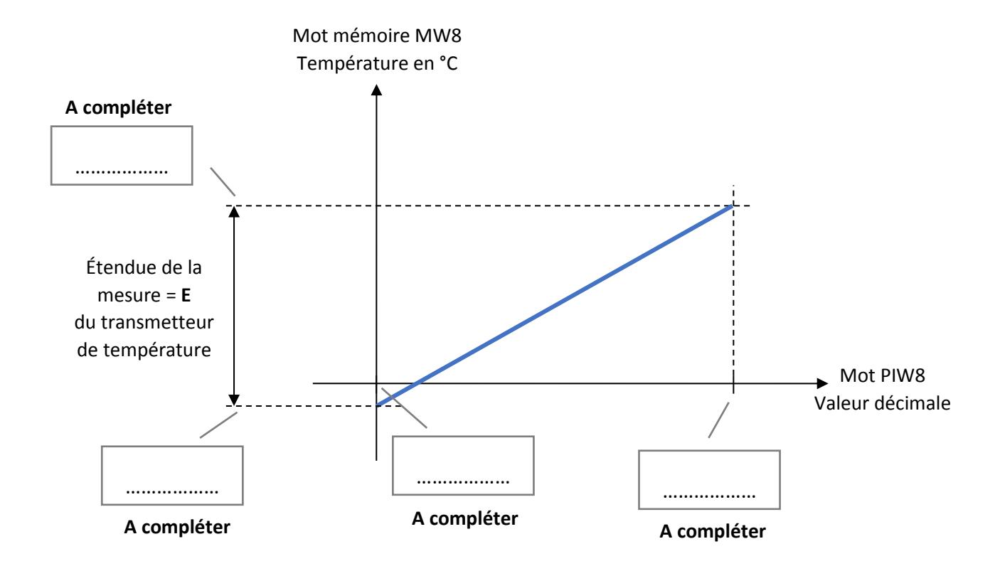

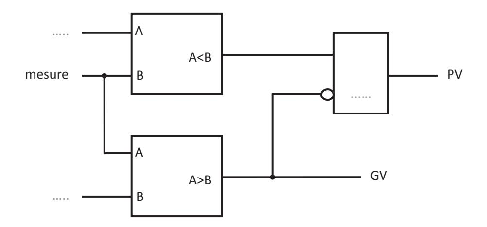

#### **Document réponse DR7 : question D14**

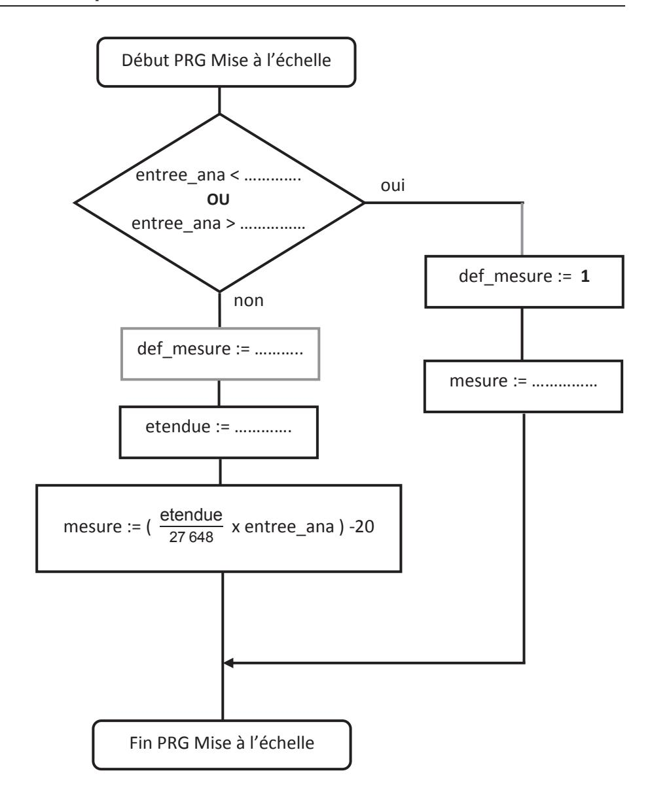

| Modèle CMEN v3                                             | $\overline{}$ |        | $\overline{}$ | $\overline{}$ |        | $\overline{}$ |         |         |         |        |          |              |       |       |   |         |        |                    |     |         |    | $\equiv$ |
|------------------------------------------------------------|---------------|--------|---------------|---------------|--------|---------------|---------|---------|---------|--------|----------|--------------|-------|-------|---|---------|--------|--------------------|-----|---------|----|----------|
| Nom de famille : (Suivi, s'il y a lieu, du nom d'usage) |               |        |               |               |        |               |         |         |         |        |          |              |       |       |   |         |        |                    |     |         |    |          |
| Prénom(s) :                                                |               |        |               |               |        |               |         |         |         |        |          |              |       |       |   |         |        |                    |     |         |    |          |
| Numéro Candidat :                                       |               |        |               |               |        |               |         |         |         |        |          | é(e) le : |       |       | / |         |        | ]/                 |     |         |    |          |
| Cadre réservé aux candidats de co                          | ncours d      | e recr | utemer        | nt et ex      | amens  | profess       | ionnels | 3       |         |        |          |              |       |       |   |         |        |                    |     |         |    |          |
| Concours :                                                 |               |        |               | (             | Optic  | on / Se       | ctior   | ı :     |         |        |          |              |       |       | N | l° d'i  | nscr   | iptio              | n:  | ΙI      |    |          |
| Cocher une seule case parmi les six t                      | •             |        |               |               | orno o | u. 1er int    | orno    | Па      | nd into | .no    | □ and    | lintor       | 20.00 | ścial | U | NIQUĖ   | MENT   | U privé pour le | s r | publi   |    | nrivá    |
|                                                            |               | •      |               |               |        |               |         |         |         |        |          |              |       |       |   | oncours | enseig | gnants             | _   | ] publi | СП | prive    |
| Examen professionnel                                       | our l'a       | avan   | ceme          | ent au        | u gra  | de de         | :       |         |         |        |          |              |       |       |   |         |        |                    |     |         |    |          |
| Cadre réservé aux candidats d'exa                          | mens et d     | du coi | ncours        | généra        | n/     |               |         |         |         |        |          |              |       |       |   |         |        |                    |     |         |    |          |
| Examen :                                                   |               |        |               |               |        |               | Sé      | rie / s | Spéc    | ialité | <b>:</b> |              |       |       |   |         |        |                    |     |         |    |          |
| Epreuve - Matière :                                        |               |        |               |               |        |               |         |         |         |        | Ses      | sion         | :     |       |   |         |        |                    |     |         |    |          |

EDE ENE 1

### DR 8 - DR 9 - DR 10

Tous les documents réponses sont à rendre, même non complétés.

# **NE RIEN ECRIRE DANS CE CADRE**

#### **Document réponse DR8 : questions D18 et D19**

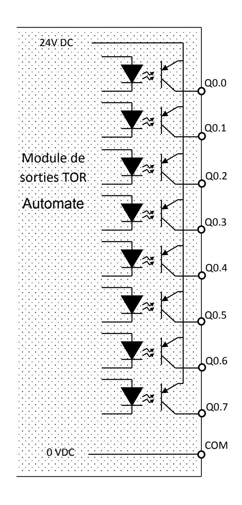

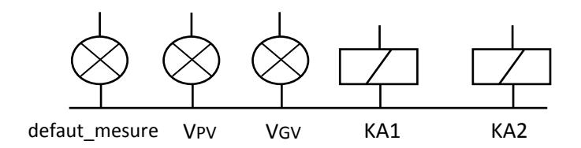

#### **Document Réponse DR9 : D20 et D21**

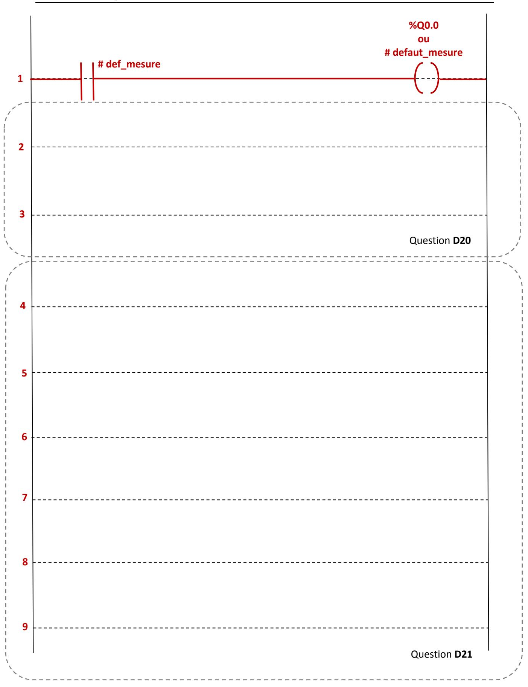

#### **Document Réponse DR10 : question E5**

#### Tableau de valeurs :

| Température mesurée (°C)             | -20              | 200                |
|--------------------------------------|------------------|--------------------|
| Tension délivrée par le capteur (mV) | eAB mini = -1 | eAB maxi = 10,8 |
| Tension V4 (V)                       |                  |                    |

#### **Profil de la tension délivrée en sortie de l'étage de décalage :**

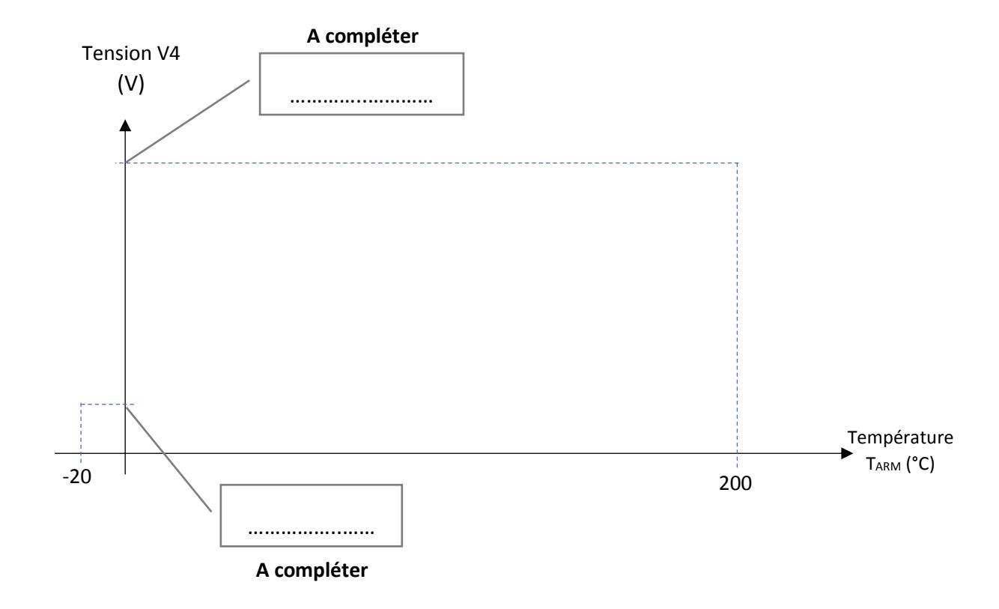