**EDE STI 2**

### **SESSION 2025** \_\_\_\_

# CAPET CONCOURS EXTERNE ET CAFEP CORRESPONDANT

**Section : SCIENCES INDUSTRIELLES DE L'INGÉNIEUR Option : INGÉNIERIE DES CONSTRUCTIONS**

> **Option : INGÉNIERIE ÉLECTRIQUE Option : INGÉNIERIE INFORMATIQUE Option : INGÉNIERIE MÉCANIQUE**

# **ÉPREUVE ÉCRITE DISCIPLINAIRE APPLIQUÉE**

Durée : 5 heures \_\_\_\_

*Calculatrice autorisée selon les modalités de la circulaire du 17 juin 2021 publiée au BOEN du 29 juillet 2021.*

*L'usage de tout ouvrage de référence, de tout dictionnaire et de tout autre matériel électronique est rigoureusement interdit.*

*Il appartient au candidat de vérifier qu'il a reçu un sujet complet et correspondant à l'épreuve à laquelle il se présente.* 

*Si vous repérez ce qui vous semble être une erreur d'énoncé, vous devez le signaler très lisiblement sur votre copie, en proposer la correction et poursuivre l'épreuve en conséquence. De même, si cela vous conduit à formuler une ou plusieurs hypothèses, vous devez la (ou les) mentionner explicitement.*

**NB : Conformément au principe d'anonymat, votre copie ne doit comporter aucun signe distinctif, tel que nom, signature, origine, etc. Si le travail qui vous est demandé consiste notamment en la rédaction d'un projet ou d'une note, vous devrez impérativement vous abstenir de la signer ou de l'identifier. Le fait de rendre une copie blanche est éliminatoire.**

### **INFORMATION AUX CANDIDATS**

**Vous trouverez ci-après les codes nécessaires vous permettant de compléter les rubriques figurant en en-tête de votre copie. Ces codes doivent être reportés sur chacune des copies que vous remettrez.**

### **Concours externe du CAPET de l'enseignement public :**

**• option** : **Ingénierie des constructions**

| Concours EDE • option : Ingénierie électrique                                       | Section/option 1411E | Epreuve 102      | Matière 9312 |
|-------------------------------------------------------------------------------------------|-------------------------|---------------------|-----------------|
| Concours EDE • option : Ingénierie informatique                                     | Section/option 1412E | Epreuve 102      | Matière 9312 |
| Concours EDE • option : Ingénierie mécanique                                        | Section/option 1413E | Epreuve 102      | Matière 9312 |
| Concours EDE ► Concours externe du CAFEP/CAPET de l'enseignement privé              | Section/option 1414E | Epreuve 102 : | Matière 9312 |
|                                                                                           |                         |                     |                 |
| • option : Ingénierie des constructions Concours EDF                                | Section/option 1411E | Epreuve 102      | Matière 9312 |
| • option : Ingénierie électrique Concours EDF • option : Ingénierie informatique | Section/option 1412E | Epreuve 102      | Matière 9312 |
| Concours EDF • option : Ingénierie mécanique                                        | Section/option 1413E | Epreuve 102      | Matière 9312 |

### **Définition de l'épreuve**

L'épreuve, commune à toutes les options, porte sur l'analyse et l'exploitation pédagogique d'un système pluri-technologique. Elle invite le candidat à la conception d'une séquence d'enseignement, à partir d'une problématique et d'un cahier des charges.

L'épreuve permet de vérifier :

- que le candidat est capable de mobiliser ses connaissances scientifiques et technologiques pour conduire une analyse systémique, élaborer et exploiter les modèles de comportement permettant de quantifier les performances d'un système pluri-technologique des points de vue de la matière, de l'énergie et/ou de l'information, afin de valider tout ou partie de la réponse au besoin exprimé par un cahier des charges
- qu'il est capable d'élaborer tout ou partie de l'organisation d'une séquence pédagogique ainsi que les documents techniques et pédagogiques associés (documents professeurs, documents fournis aux élèves, éléments d'évaluation).

Les productions pédagogiques attendues sont relatives à une séquence d'enseignement portant sur les programmes de collège ou de lycée.

### **Organisation du sujet**

Ce sujet se décompose de la façon suivante :

- Énoncé, pages 2 à 27 ;
- Documents techniques DT, pages 28 à 35 ;
- Documents réponses DR (à rendre avec la copie), pages 36 à 38.

### **Conseils aux candidats**

Il est demandé aux candidats :

- de rédiger les réponses aux différentes parties sur des feuilles de copie séparées et clairement repérées ;
- de numéroter chaque feuille de copie et indiquer le numéro de la question traitée ;
- d'utiliser exclusivement les notations indiquées dans le sujet lors de la rédaction des réponses ;
- de justifier clairement les réponses ;
- d'encadrer ou souligner les résultats ;
- de présenter lisiblement les applications numériques, sans omettre les unités, après avoir explicité les expressions littérales des calculs ;
- de formuler les hypothèses nécessaires à la résolution des problèmes posés si cellesci ne sont pas indiquées dans le sujet.

# **SYSTÈME SCÉNIQUE VIDÉO ET LUMIÈRE**

### **PARTIE 1. MISE EN SITUATION**

### **1.1. Contexte général**

Les concerts sont des événements culturels populaires dans le monde entier. Des milliers d'artistes de tous les genres musicaux se produisent sur scène chaque année dans de nombreuses villes du monde.

Les concerts peuvent avoir lieu dans une grande variété de lieux, tels que des salles de concert, des stades, des arènes ou encore des espaces en plein air.

Avec la révolution de la musique dématérialisée, les chiffres des ventes des supports physiques (CD, disques vinyles...) ne permettent plus aux artistes d'en faire leurs revenus principaux. Le spectacle vivant se retrouve donc tout naturellement au centre des préoccupations de l'industrie musicale.

En conséquence, les revenus liés aux concerts ont connu une évolution importante ces dernières années générant par exemple plus de 5 milliards de dollars uniquement pour les 100 plus grandes tournées, une première. Mais cela interroge également sur l'empreinte environnementale générée par la logistique déployée, notamment parce que les spectateurs eux-mêmes sont sensibles à ces questionnements.

De ce fait, les enjeux actuels pour les sociétés de production liés à ces évènements s'articulent principalement autour de deux champs :

- l'attractivité par la nouveauté ;
- l'adaptation des équipements aux multiples lieux dans une logique de développement durable.

Les systèmes scéniques évoluent pour devenir plus modulaires et plus flexibles, permettant aux organisateurs de concerts de créer des designs plus créatifs et plus audacieux. Les scènes hydrauliques, les éléments de décor automatisés et les structures gonflables sont de plus en plus utilisés pour répondre à ce besoin d'innovation.

### **1.2 La structure scénique**

La scène proposée par l'entreprise de production (figure 1) se caractérise principalement par l'utilisation d'écrans pilotés par des robots industriels. Les robots de scène sont des machines qui sont conçues pour se déplacer sur scène et interagir avec les artistes. Ils peuvent être utilisés pour créer des effets spéciaux, des chorégraphies et des performances originales.

Afin de limiter le poids et donc l'impact carbone lors de la manutention et des transports, seule la structure spécifique aux robots est déplacée et vient s'intégrer dans des structures de scène classique sur les lieux des concerts.

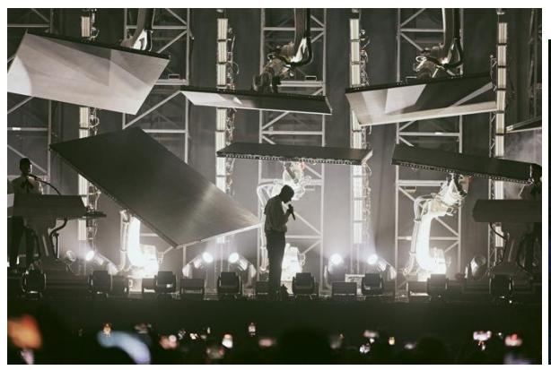

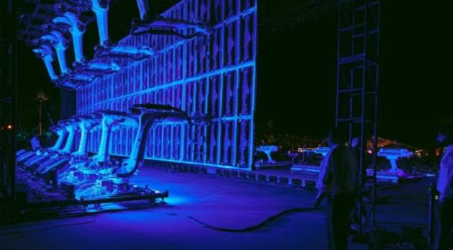

 *Figure 1 : Performance live de l'artiste*

Plus précisément, l'étude portera sur trois parties de cette installation :

- le système garantissant la mobilité d'une dizaine d'écrans géants, permettant de faire évoluer la surface vidéo au gré des demandes artistiques à différents moments de la prestation. Ce système est constitué de dix robots KUKA KR QUANTEC ainsi que de la structure démontable associée nécessaire à leur mise en place et leur adaptation dans chacun des lieux de spectacle (figure 2) ;
- les palans, liés au lieu d'accueil du concert qui supportent la partie haute de cette structure ;
- la gestion des flux de données permettant à l'ensemble des éléments scéniques de fonctionner en parfaite synchronisation.

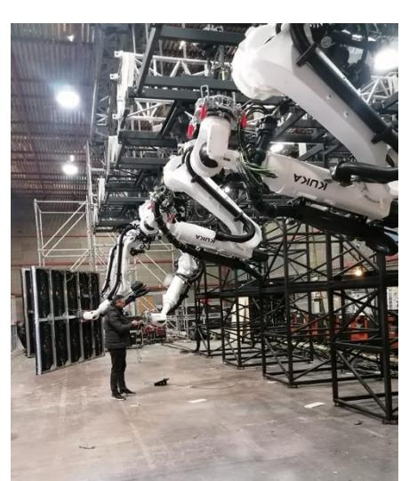

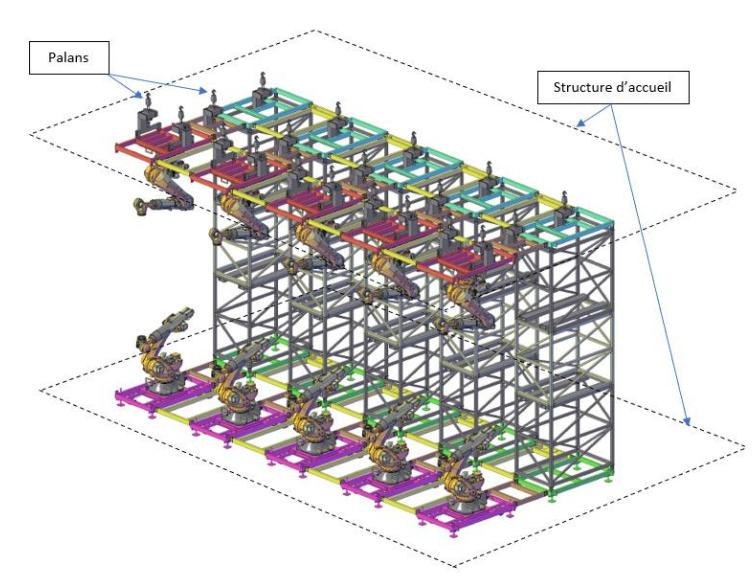

*Figure 2 : Robots KUKA KR QUANTEC et la structure démontable support des robots*

**Question 1** À partir du descriptif ci-dessus, préciser en quoi la solution scénique répond aux deux enjeux évoqués en partie 1.1.

### **1.3 La problématique**

La scène étudiée répond à la problématique générale :

### **« Offrir une expérience de concert toujours plus immersive et innovante dans une démarche de développement durable »**

Le système étudié doit pour ce faire, remplir plusieurs exigences dont celles de :

- répondre aux exigences artistiques ;
- s'intégrer dans une structure existante ;
- garantir la sécurité des biens et des personnes.

L'objectif de cette étude est de valider les solutions techniques envisagées pour satisfaire ces exigences et de vérifier que le système répond bien à la problématique générale.

L'enseignement de la technologie au collège invite les enseignants à contextualiser leurs enseignements dans de grandes thématiques, en particulier celles de l'enseignement au développement durable et de la robotique dans un autre contexte. La scène est choisie comme un des supports transversaux pour une classe de quatrième.

### **1.4. Éducation au développement durable (EDD)**

Dans cadre de l'EDD d'un collège, le comité de pilotage dédié s'interroge sur la représentation de plus en plus prégnante des élèves sur la mise en opposition de l'industrie et du développement durable.

L'objectif est de conduire une action collégiale lors de la semaine européenne du développement durable visant principalement cette problématique.

Il est décidé que pendant cette semaine, différents ateliers seraient proposés aux élèves sur des temps identifiés.

En tant que professeur de technologie vous avez la responsabilité d'imaginer et d'animer un atelier d'une heure valorisant les métiers en lien avec les technologies innovantes au regard des enjeux environnementaux.

**Question 2** Citer deux exemples de supports technologiques qu'il serait alors judicieux de faire découvrir aux élèves. Justifier synthétiquement vos choix.

**Question 3** Souhaitant poursuivre le travail initié autour de cette problématique à plus long terme, proposer des exemples d'actions partenariales qui permettraient de conforter l'animation faite lors de la semaine du développement durable.

# **PARTIE 2. VALIDATION DYNAMIQUE DU CHOIX DE ROBOT**

### **2.1. Détermination dynamique de la charge maximale que doit mouvoir le robot**

Les écrans, portés par les robots, se déplacent et représentent une charge à supporter. L'objectif de cette partie consiste en la détermination dynamique de la masse maximale que doit mouvoir le robot.

Afin de déterminer la charge maximale que doit mouvoir le robot, les hypothèses suivantes seront utilisées :

- chaque robot embarque une structure assemblée en aluminium et ses 10 écrans de projection (figure 4) ainsi qu'une interface robot/structure ;
- une bride (figure 5) permet l'assemblage de cette structure au robot ;
- la masse d'un écran CB5 est donnée dans le diagramme des exigences SysML de la documentation technique DT1 ;
- une structure porteuse de 10 écrans est constituée de 3 longerons (en vert sur la figure 5), de 2 traverses (en rouge sur la figure 5) et de 8 petites traverses (en bleu sur la figure 5), dont les dimensions sont spécifiées dans le tableau (figure 3) ;
- les profilés (longerons, traverses et petites traverses) sont positionnés de façon à minimiser l'épaisseur de l'ensemble structure-écran ;
- les éléments d'assemblage de la structure mécano-soudée (vis, soudure…) représentent pour l'étude une masse négligeable.

| Éléments de la structure porteuse de 10 écrans |            |   |  |
|------------------------------------------------|------------|---|--|
| Désignation Dimensions Quantité                |            |   |  |
| Longerons                                      | 30x50x2900 | 3 |  |
| Traverses                                      | 30x50x2400 | 2 |  |
| Petites Traverses                              | 30x50x1125 | 8 |  |

*Figure 3 : dimensions du profilé en mm*

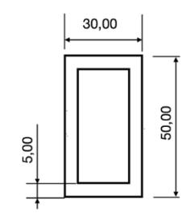

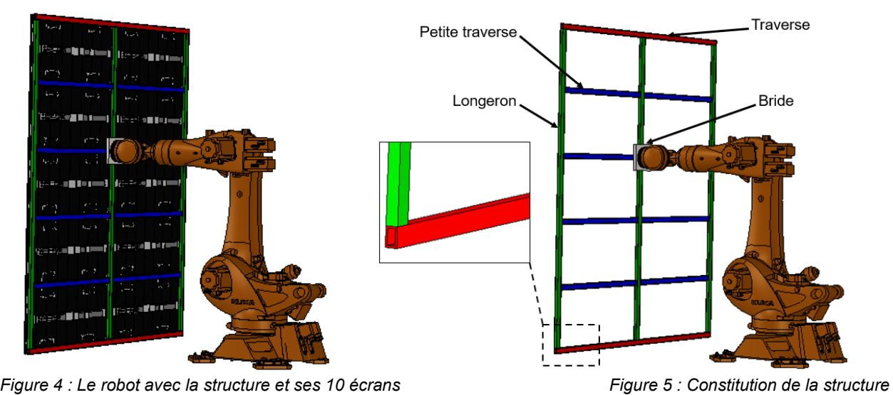

*porteuse des 10 écrans*

**Question 4** Calculer la masse m de la structure embarquée (structure + écrans) à partir de la figure 5 et des données précédentes sachant que la masse d'un longeron est de 5,5 kg, d'une traverse 4,5 kg et d'une petite traverse 2,12 kg.

### Pour les questions 5 et 6 :

- l'étude se limite à l'axe 6 (figure 6), les efforts y étant les plus préjudiciables ;
- la structure embarquée et les 10 écrans (caractéristiques voir DT1) sont modélisés par un parallélépipède rectangle (figure 7).

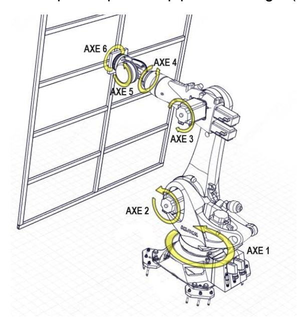

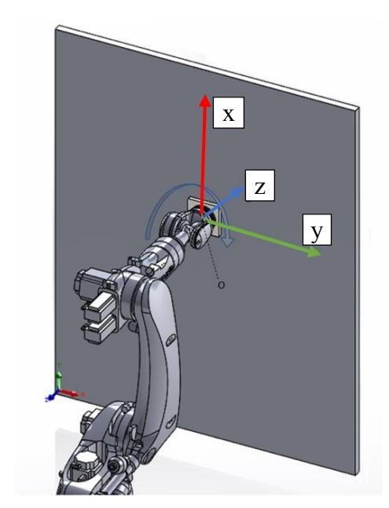

 *Figure 6 : définition des axes du robot Figure 7 : Modélisation de la structure embarquée*

**Question 5** Déterminer en détaillant votre démarche les dimensions en mètres du parallélépipède modélisant l'ensemble structure avec les 10 écrans.

Les conditions les plus défavorables pour l'axe 6 apparaissent lorsque la structure et les écrans sont disposés en mode "paysage" (figure 9). Cette position est étudiée pour la suite de ce questionnaire. Les formules permettant la détermination des moments d'inertie d'un parallélépipède sont rappelées (figure 8).

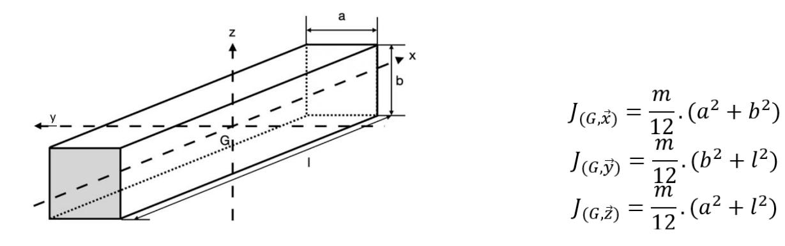

 *Figure 8 : Moments d'inertie d'un parallélépipède*

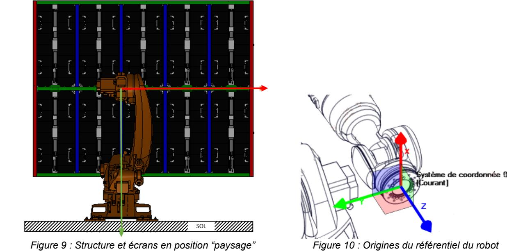

Pour les questions suivantes, la masse de la structure embarquée est de 181 kg et les dimensions de la structure embarquée sont de 3000 x 2400 x 60 mm.

**Question 6** Montrer que les moments d'inertie au centre de gravité noté G, par rapport aux trois axes x, y et z, du modèle parallélépipédique sont :

$$J_{(G,\vec{x})} = 86,9343 \text{ kg} \cdot \text{m}^2$$
  
 $J_{(G,\vec{y})} = 135,8043 \text{ kg} \cdot \text{m}^2$   
 $J_{(G,\vec{z})} = 222,63 \text{ kg} \cdot \text{m}^2$ 

Pour les questions suivantes, la bride entre la structure et le robot est un parallélépipède d'épaisseur 30 mm (figure 5), sa masse est négligée.

**Question 7** À l'aide des figures 5, 9 et 10, déterminer la position (XG, YG, ZG) du centre de gravité du modèle dans le repère outil "0" de la tête du robot (en m).

L'expression des moments d'inertie par rapport à un axe (, ) déduits de ceux par rapport à un axe (, ) est donnée par :

$$J_{(O,\vec{x})} = J_{(G,\vec{x})} + m(Y_G^2 + Z_G^2)$$
  

$$J_{(O,\vec{y})} = J_{(G,\vec{y})} + m(X_G^2 + Z_G^2)$$
  

$$J_{(O,\vec{z})} = J_{(G,\vec{z})} + m(Y_G^2 + X_G^2)$$

**Question 8** Déterminer les moments d'inertie *J(O,x), J(O,y), J(O,z)* rapportés au repère outil "0".

Les données partagées par le constructeur du robot sont présentées dans tableau de la figure 11).

| Caractéristiques moteur- réducteur axe 6        |                   |  |  |
|----------------------------------------------------------|-------------------|--|--|
| Moment d'inertie arbre moteur Jmot6 en kg·m² 0,003 |                   |  |  |
| Rapport de réduction axe 6                               | r = 0,00607 |  |  |

*Figure 11 : caractéristiques moteur-réducteur axe 6*

L'étude porte pour les questions suivantes, sur le mouvement d'axe 6 du robot. Le rendement du réducteur est considéré égal à 1.

**Question 9** À partir des données constructeur, du rapport de réduction de l'axe 6 et du moment d'inertie J(O,z) calculés précédemment, montrer que le moment d'inertie équivalent ramené à l'arbre moteur vaut : Jeq = 0,0118 kg·m².

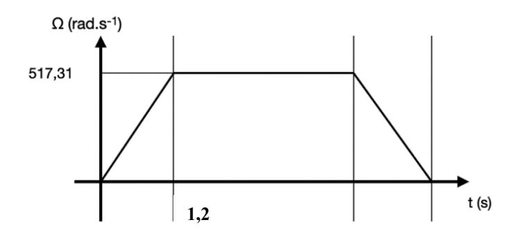

*Figure 12 : Évolution de la vitesse du moteur de l'axe 6 Vmot axe6*

**Question 10** À partir de la figure 12, déterminer l'accélération angulaire du moteur de l'axe 6 en précisant l'unité.

Le principe fondamental de la dynamique appliqué à un système en rotation autour d'un axe fixe est rappelé :

$$C_m - C_r = J. \frac{d\Omega}{dt}$$

Pour les questions suivantes, Jeq = 0,0118 kg·m² et le couple résistif *Cr* est négligé.

**Question 11** Calculer le couple moteur maximum Cm nécessaire pour mouvoir la structure embarquée.

**Question 12** À partir de DT2, choisir en justifiant le robot répondant à ce contexte d'utilisation.

**Question 13** À partir du robot identifié, calculer la masse maximale pouvant être embarquée.

### **2.2. Validation du choix de robot sur l'ensemble des contraintes dynamiques**

L'objectif de cette partie consiste en la validation du choix des robots réalisé par la société de production à l'aide du diagramme des charges fourni par la société conceptrice de ces derniers.

**Question 14** En observant les diagrammes de charges du document technique DT2, identifier les données ayant un impact sur la charge maximale que peut embarquer un robot.

**Question 15** À l'aide de la détermination de la position du centre de gravité de l'ensemble "structure + écrans" dans le repère outil "0", positionner la charge sur le diagramme constructeur des charges (document réponse DR1).

**Question 16** Conclure quant au choix du robot identifié question 12.

Le choix d'une solution technique est un temps fort dans le déroulement d'un projet. Il nécessite pour le concepteur, de savoir identifier les caractéristiques techniques attendues d'un objet ou système technique et mettre en relation celles proposées par les solutions techniques qui se présentent à lui.

**Question 17** Afin d'amener les élèves de classe de quatrième à comprendre les enjeux liés au choix du robot par la société de production, proposer une activité décontextualisée permettant une découverte de la notion d'association "fonction/solution technique" à partir de systèmes issus du quotidien des élèves (par exemple des vélos possédant différents types de systèmes de freinage).

# **PARTIE 3. VÉRIFICATION DES CONTRAINTES DE POSITIONNEMENT DES ROBOTS**

Le chorégraphe souhaite sur certaines phases du concert un effet d'écran unique pour tous les spectateurs, y compris les plus proches situés à 20 m de l'écran. L'objectif est donc de valider la précision du positionnement des écrans.

La contrainte scénographique d'effet écran unique interroge sur la précision du positionnement de l'écran par le robot. Cette étude se focalise sur la commande de l'axe 3.

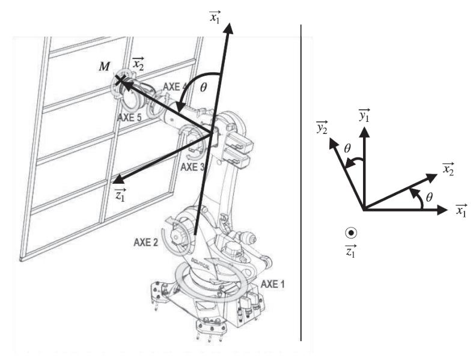

L'étude concerne la précision du positionnement d'un point M lors de la commande de l'axe 3 liant les bras 1 et 2 du robot. L'orientation du bras 2 par rapport au bras 1 est paramétrée par un angle représenté figure 13. La distance du point M à l'axe 3 est supposée égale à 1460 mm. Les robots KUKA KR QUANTEC sont munis de servomoteurs brushless pilotés depuis une interface de commande dédiée permettant de commander les angles des différents axes.

*Figure 13 : Référentiel axe 3*

**Question 18** Rappeler la définition d'un servomoteur en précisant la différence avec un moteur.

L'étude porte sur le pilotage du servomoteur. Chaque servomoteur peut évoluer entre deux positions angulaires extrêmes et . Il reçoit des consignes en position angulaire en provenance de l'interface de commande sous la forme d'un nombre entier k non signé codé sur 24 bits. Cet entier peut prendre N valeurs différentes et est utilisé pour calculer la consigne de position imposée au servomoteur = + ⋅ où est la précision angulaire : = − −1

**Question 19** Préciser la valeur de N ainsi que les valeurs minimales et maximales que peut prendre le nombre transmis k.

Le nombre k est transmis directement sur une voie UART (Universal Asynchronous Receiver-Transmitter) à l'interface de commande. Les caractéristiques d'une trame UART sont :

| 1     | 5-9        | 0-1    | 1-2  |
|-------|------------|--------|------|
| Start | Data Frame | Parity | Stop |
| Bit   |            | Bits   | Bits |

Le protocole choisi repose sur un bit de parité et 2 bits de stop. La synchronisation entre l'émetteur et le récepteur se fait grâce à une seconde voie portant un signal d'horloge. Chaque symbole a une durée de transmission de 8,68 µs soit 115 200 bauds (ou bit/s).

**Question 20** Rappeler la fonction des bits de parité. Préciser le risque pour le système si ces bits ne sont pas transmis.

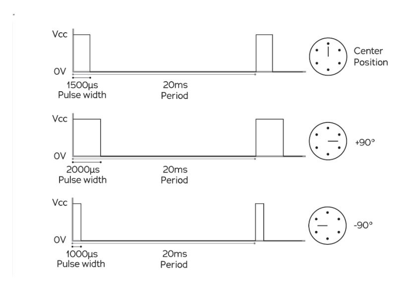

Le format couramment utilisé pour transmettre des données à des servomoteurs est le format PWM cadencé à 50 Hz. Dans ce format, un signal créneau dont le rapport-cyclique commande l'angle imposé au servomoteur est envoyé toutes les 20 ms. Un exemple tiré de la documentation d'un servomoteur est donné (figure 14). Dans ce cas, le servomoteur est piloté entre les angles =-90° et =+90°.

*Figure 14 : Commandes servomoteur*

**Question 21** Représenter graphiquement l'allure du signal PWM pour la consigne de position angulaire 60° en indiquant clairement la durée de chaque partie du signal. Préciser à quelle fréquence le récepteur doit échantillonner le signal pour obtenir une précision angulaire de 0.1°.

**Question 22** En comparant les avantages et inconvénients des deux formats (UART et PWM) de transmission, justifier le choix du format employé pour transmettre les consignes à l'interface de commande des robots.

Dans la suite, le système est supposé reposer sur le protocole UART. On souhaite valider le choix du servomoteur de l'axe 3 du robot KUKA KR QUANTEC vis à vis de la performance de précision du positionnement spatial d'un écran. L'axe en sortie du servomoteur considéré dispose d'un débattement angulaire de 288° et reçoit des commandes codées sur 24 bits. Le débattement angulaire en sortie du réducteur est entièrement parcouru lorsque l'axe tourne de la position jusqu'à .

**Question 23** Montrer que la précision du positionnement angulaire du bras est égale à 1.72 ⋅ 10−5 °.

On s'intéresse au mouvement de l'écran dont on souhaite garantir une précision de positionnement au dixième de millimètre près.

**Question 24** Estimer la distance parcourue par le point M (figure 13) lorsque l'axe 3 est piloté avec deux consignes angulaires consécutives. Vérifier que le nombre de bits de codage des valeurs de position angulaire de consignes satisfait la précision de positionnement attendue.

La suite de l'étude porte sur le capteur de position angulaire du servomoteur. Il s'agit d'un résolveur excité par une tension continue dont les deux signaux de sortie correspondant au cosinus et au sinus de la position angulaire de l'axe du moteur. Ces signaux sont traités par un circuit dédié en vue d'extraire la valeur de la position angulaire du moteur.

**Question 25** Rappeler le principe du fonctionnement d'un résolveur. Expliciter la présentation à l'aide d'un schéma indiquant pourquoi ce capteur renvoie le cosinus et le sinus de la position angulaire du moteur.

Un circuit de traitement permet de convertir l'information de position angulaire en une tension image valant –5 V lorsque l'axe du moteur est placé dans la position angulaire et +5 V lorsque celui-ci est placé dans la position angulaire . Un convertisseur analogique numérique de plage [-5 V, +5 V] est utilisé pour numériser cette information. définit la variation de tension en sortie de la chaîne d'acquisition lorsque la position angulaire du moteur tourne d'un angle (défini au début de cette partie).

# **Question 26** Établir la valeur de .

Le capteur est considéré comme suffisamment précis si son erreur de quantification *q* est 10 fois plus petite que la variation de tension entre deux positions angulaires commandables du moteur .

**Question 27** Sachant que le CAN choisi a une plage de valeurs d'entrée de [-5 V, +5 V], déterminer le nombre de bits de codage nécessaire pour que sa précision soit suffisante.

**Question 28** Cette conclusion portant sur les caractéristiques du servomoteur de l'axe 3 suffit-t-elle à garantir la précision du positionnement de l'écran ?

Afin de traiter la notion de grandeurs analogiques et numériques un enseignant met en place des séances s'appuyant sur l'étude menée lors des questions précédentes et sur des minirobots pédagogiques. L'objectif final est de développer un automate capable de réaliser un déplacement de précision dans le cadre d'un concours de robotique. Lors de la séance en question, l'enseignant souhaite mettre en lumière le fonctionnement des capteurs, en particulier le lien entre la grandeur physique mesurée et la valeur numérique affichée par la carte programmable.

La compétence visée concerne la mesure de grandeurs de manière directe ou indirecte, avec comme connaissances associées : le principe de fonctionnement d'un capteur, la nature d'un signal (analogique ou numérique), ainsi que la distinction entre une information logique et une information analogique.

À l'issue de cette séance, l'enseignant souhaite évaluer le degré de compréhension des notions abordées afin de déterminer la nécessité et le contenu d'une éventuelle remédiation, en fonction des résultats de chaque élève.

**Question 29** Proposer une évaluation rapide (type QCM) composée de 4 questions, permettant à l'enseignant de mesurer le degré de compréhension des notions travaillées.

# **PARTIE 4. RÔLE DE LA STRUCTURE PORTEUSE DES ROBOTS**

L'objectif est de vérifier que la structure dépendante porteuse des robots permet de garantir l'écartement entre les écrans nécessaire à l'effet "écran unique" voulu par le chorégraphe.

Afin de garantir l'adaptabilité du spectacle, et dans notre cas, celle de l'ensemble de 10 robots avec leurs écrans, une structure légère, indépendante de la scène de la salle de spectacle et facilement démontable est imaginée par l'équipe de production. Cette étude se limite à une section de cette structure porteuse de 2 unités robotiques (figures 15 et 16), modélisée solidaire du sol.

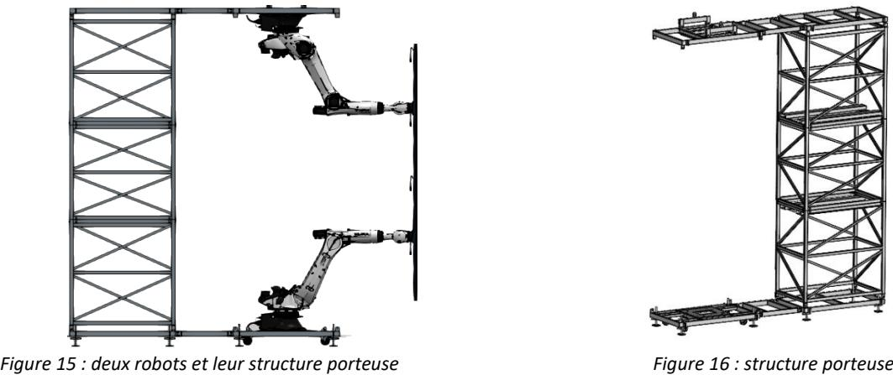

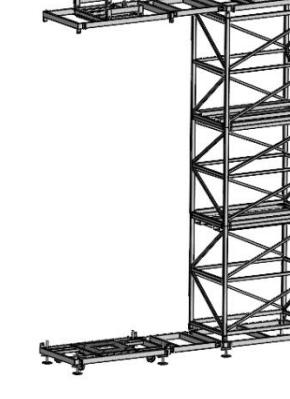

### **Partie 4.1 Étude de l'incidence des robots sur la structure porteuse**

La simulation par la fixation de deux robots à leur structure porteuse est donnée ci-après (figure 17). Les flèches violettes symbolisent la charge de 2 robots (un suspendu et un autre posé).

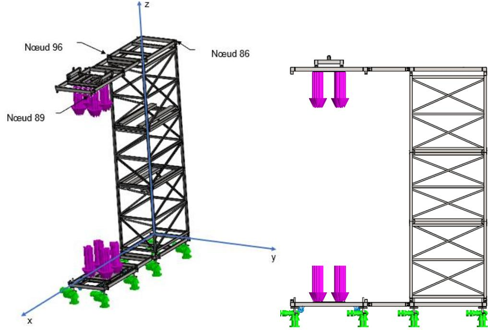

*Figure 17 : simulation de la charge de 2 robots sur la structure porteuse*

La simulation permet d'obtenir les résultats suivants :

*Figure 18 : tableau des déplacements maximaux aux points d'accroche du robot*

**Question 30** À partir de la figure 17 et des données du tableau de la figure 18 indiquant les déplacements maximaux pour chaque axe, représenter sur le document réponse DR2 la déformée de la structure sur l'axe z uniquement sans facteur d'échelle.

**Question 31** Expliquer synthétiquement les résultats de cette simulation.

**Question 32** Valider ou invalider la structure dans les conditions d'utilisation exposées à partir du diagramme des exigences (DT1).

Afin de compenser totalement les efforts sur l'axe vertical, le choix est fait d'utiliser des palans. Le résultat des simulations est donné figure 19.

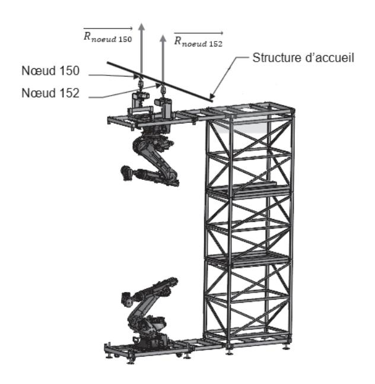

*Figure 19 : moments et résultantes / directions*

**Question 33** À partir d'une simulation de la partie étudiée de la structure représentée figure 19, identifier les charges compensées par les palans et conclure sur la fonction principale de la structure démontable accueillant les robots.

**Question 34** Afin de sensibiliser les élèves sur la notion d'écart entre essais réels et simulation numérique par la mesure d'une flèche d'une poutre encastrée soumise à une force définie, proposer une organisation d'activité avec les éléments ci-dessous :

- 6 ilots de 4 ou 5 élèves, 2 types de "poutre" en bois de section soit carrée de 5mm soit de section 3x8 mm et de longueur 400 mm en 3 exemplaires pour la classe, des réglets et 6 dynamomètres empruntés aux sciences ;
- 2 ordinateurs par ilot dont un proposant un modèle de simulation des poutres concernées et l'autre avec un tableau partagé à compléter en ligne par les résultats des expérimentations de chaque équipe ;
- durée 1h30.

**Question 35** Comment expliquer les écarts constatés via le tableau commun des résultats des ilots avec les élèves de quatrième ?

**Question 36** Citer les notions principales travaillées présentes dans la synthèse de la séance.

### **Partie 4.2 Étude de la structure sur la scène d'accueil**

L'objectif est de vérifier la résistance adéquate de l'ensemble scénique avec, en particulier, la structure porteuse des robots et le dimensionnement des appuis pour supporter les charges verticales et les transmettre au sol de manière efficace.

L'étude porte sur la structure constituant le plancher de la scène (figure 20 et figure 21), l'analyse et le contrôle des solutions prévues par le bureau d'étude pour les différents éléments la constituant.

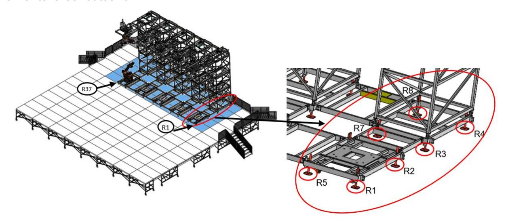

*Figure 20 : implantation de la structure des robots sur la scène d'accueil*

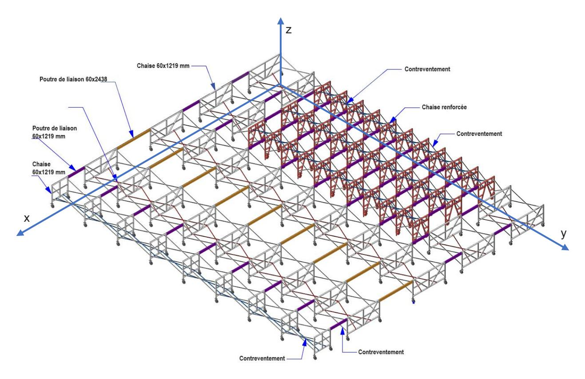

*Figure 21 : Structure de la scène d'accueil*

Le bureau d'étude a, en effet, fait le choix d'une structure composée de :

- chaise renforcée en acier galvanisé de 60x1219 mm ;
- chaise en acier galvanisé de 60x2438 mm ;
- chaise en acier galvanisé de 60x1219 mm ;
- poutres liaison de 60x2438 mm et de 60x1219 mm ;
- panneaux en matériau composite de 1219x2438 mm d'épaisseur 50 mm ;
- contreventements 40x40 mm ;
- pieds.

### Hypothèses :

- pour cette étude, seule la partie « renforcée de la scène » sur laquelle repose la structure porteuse des robots sera prise en compte.
- La masse volumique du plancher composite est de 700 kg.m-3
- La masse volumique de l'acier galvanisé est de 7800 kg.m-3

L'objectif est de définir la charge d'exploitation due à la structure porteuse liée aux palans et des robots.

Pour cela, un tableau de réactions aux appuis de la structure dont les repères apparaissent sur la figure 20 est disponible. Ces réactions d'appui génèrent une charge surfacique.

| Repère | Réaction (daN) | Repère | Réaction (daN) | Repère | Réaction (daN) | Repère | Réaction (daN) |
|--------|-------------------|--------|-------------------|--------|-------------------|--------|-------------------|
|        |                   |        |                   |        |                   |        |                   |
| R1     | 335               | R11    | 508               | R21    | 100               | R31    | 183               |
| R2     | 371               | R12    | 537               | R22    | 105               | R32    | 210               |
| R3     | 358               | R13    | 511               | R23    | 102               | R33    | 206               |
| R4     | 363               | R14    | 518               | R24    | 515               | R34    | 208               |
| R5     | 360               | R15    | 514               | R25    | 103               | R35    | 207               |
| R6     | 362               | R16    | 517               | R26    | 102               | R36    | 208               |
| R7     | 361               | R17    | 514               | R27    | 103               | R37    | 207               |
| R8     | 360               | R18    | 535               | R28    | 103               | R38    | 207               |
| R9     | 369               | R19    | 510               | R29    | 101               | R39    | 209               |
| R10    | 337               | R20    | 74                | R30    | 73                | R40    | 184               |

*Figure 22 : Tableau de relevé des réactions R1 à R40*

**Question 37** À l'aide du plan figure 20 (positionnement des appuis Ri) et du tableau figure 22, calculer le poids total de la structure. A partir de la surface d'un panneau composite, calculer la surface de reprise des charges puis montrer que la charge surfacique d'exploitation vaut 1,318 kN.m-2.

Pour la suite de l'étude, les poutres de liaison et les chaises sont liées par encastrement.

La structure des deux travées de plancher sous la zone d'appui de la structure des robots est modélisée par une poutre continue de longueur 5 995 mm de section creuse 60 x 150 mm d'épaisseur 10 mm représentées sur la figure 23. Le plancher est considéré uniforme.

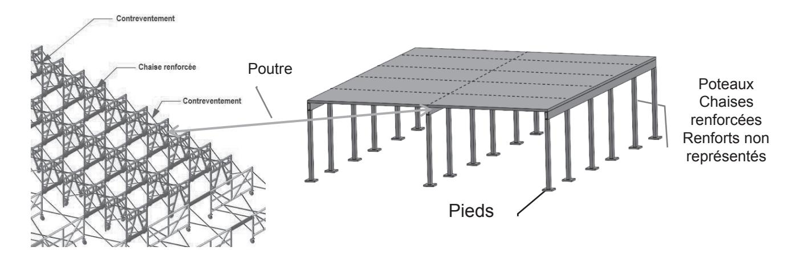

*Figure 23 : Modélisation de 2 travées du plancher de la scène*

**Question 38** À l'aide de la figure 23, calculer la surface d'influence Sp (zone qui transfère les charges) qui est reprise par la poutre A.

**Question 39** Afin d'établir le bilan des charges s'exerçant sur la poutre, calculer les charges permanentes linéiques G et G', respectivement liées au poids volumique du plancher et au poids volumique de la poutre, exprimées en kN.m-1. Reporter dans le tableau du document réponse DR3 les charges calculées.

**Question 40** Calculer la charge d'exploitation linéique Q à partir du résultat de la question 39. Reporter dans le tableau du document réponse DR3 la charge calculée. Pour le calcul du chargement réparti p appliqué à la poutre, la combinaison à l'ELU (Etat Limite Ultime) coefficientée est : p = 1,35(G+G') + 1,5Q.

**Question 41** Calculer à l'ELU la valeur du chargement réparti p exprimée en kN·m-1.

La modélisation retenue pour la poutre continue est représentée figure 24, la longueur de la poutre continue est ramenée à 5,995 m. La rigidité flexionnelle de la poutre est considérée constante.

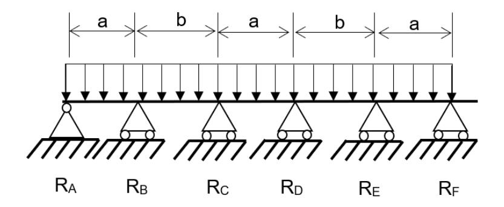

$$a = L_1 = L_3 = L_5 = 1,119 \text{ m}$$
  
 $b = L_2 = L_4 = 1,319 \text{ m}$ 

*Figure 24 modélisation de la poutre continue A*

**Question 42** Déterminer en le justifiant le degré d'hyperstatisme de la poutre.

Pour les questions suivantes, il est rappelé que les moments aux appuis RA et RF sont nuls.

**Question 43** À l'aide de la figure 24 et en utilisant la méthode des trois moments rappelée dans le document technique DT3, donner l'expression littérale de l'équation au niveau de l'appui RB puis réduire cette expression en utilisant les valeurs connues.

Les expressions littérales des équations des trois moments aux appuis de la poutre continue sont ci-dessous :

$$En R_C -> M_B L_2 + 2M_C (L_2 + L_3) + M_D L_3 = \frac{6(-pL_3^3 - pL_2^3)}{24}$$

$$En R_D -> M_C L_3 + 2M_D (L_3 + L_4) + M_E L_4 = \frac{6(-pL_4^3 - pL_3^3)}{24}$$

$$En R_E -> M_D L_4 + 2M_E (L_4 + L_5) + M_F L_5 = \frac{6(-pL_5^3 - pL_4^3)}{24}$$

Le résultat est donc un système d'équations comportant quatre équations et quatre inconnues, MB, MC, MD et ME. Pour rappel, les moments MA et MF sont nuls.

**Question 44** Écrire le système d'équation avec les valeurs numériques. En déduire que le système peut être ramené à un système de 2 équations à 2 inconnues MB et MC. Le résoudre.

Quelques soient les résultats obtenus à la question précédente, on prendra MA= 0 kN·m, MB= -0,996 kN·m, MC= -0,758 kN·m, MD= -0,758 kN·m, ME= -0,996 kN·m, MF= 0 kN·m.

**Question 45** D'après les valeurs des moments aux appuis de la poutre continue donnés cidessus et la modélisation figure 25 ci-dessous et du DT3, compléter le document réponse DR4.

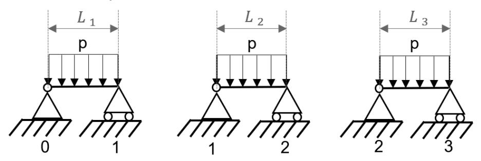

*Figure 25 : Décomposition de la poutre continue en travée indépendantes.*

**Question 46** Justifier que RA = RF ; RB = RE ; RC = RD. Conclure en énonçant les appuis les plus chargés.

Une autre modélisation prenant en compte les chaises renforcées est maintenant considérée.

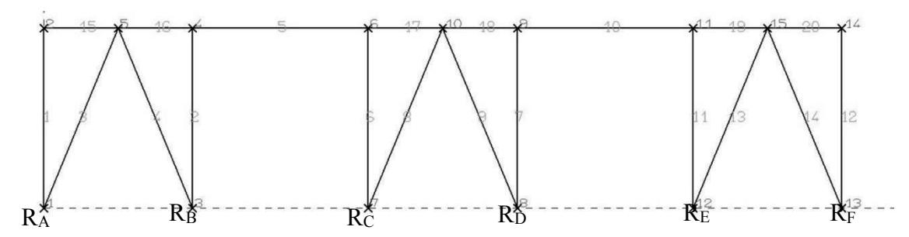

RA = RF = 306,7 daN RB = RE = 828,5 daN RC = RD = 773 daN *Figure 26 : Modélisation de la poutre avec les chaises renforcées*

**Question 47** Comparer les résultats de la simulation figure 26 avec les résultats issus de la première modélisation calculés question 45. Conclure. En termes de déformation, justifier l'usage de chaises renforcées par rapport à la structure poteaux poutres présentée dans la première modélisation.

L'étude se poursuit en prenant en considération les réactions aux appuis RB et RE qui prennent une valeur de 10000 N poids propre de la structure compris. L'intérêt est particulièrement porté sur l'appui RB.

La charge en tête de pied se repartie sur la surface de celui-ci. Deux solutions de pied sont étudiées figure 27.

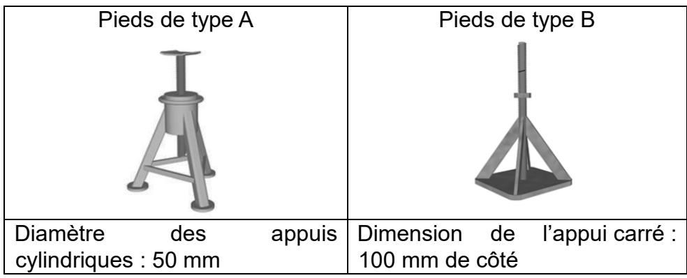

*Figure 27 : caractéristiques des pieds disponibles*

**Question 48** Identifier le pied qui permet de limiter au plus la contrainte au niveau du sol. Justifier le choix par le calcul.

**Question 49** Pour valider le prédimensionnement de la structure scénique, les organisateurs de spectacle demandent une valeur de pression au sol inférieure à 0,8 MPa. Proposer une solution permettant de respecter cette contrainte.

# **PARTIE 5. VALIDATION DU CHOIX DES PALANS**

L'objectif est de vérifier que les palans choisis par l'entreprise peuvent compenser la charge induite par les robots suspendus quel que soit le régime de fonctionnement.

L'étude de la déformation de la structure effectuée partie 4 a mis en évidence la nécessité de soutenir la partie haute rattachée aux robots articulés. La compensation du poids des robots et des écrans est effectuée par un système de câbles tendus par des palans attachés à la salle de concert. Cette partie se focalise sur le dimensionnement de la motorisation d'un palan.

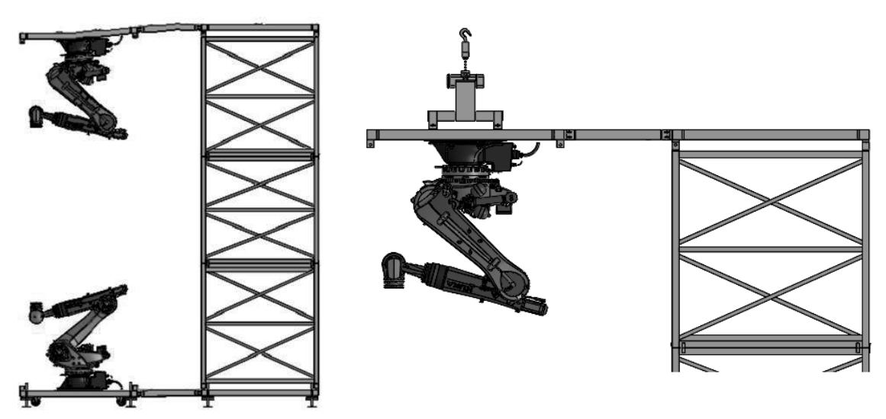

*Figure 28 : représentation de la structure avant et après l'action du palan* 

### Hypothèses :

- la variation de charge entraînée par le palan qui est liée à la déformation de la structure est négligée. La partie de la structure entraînée est modélisée par une masse constante M = 1380 kg ;
- la masse du câble est négligée devant celle de la structure ;
- g = 9,81 m·s-2 pour l'accélération de la pesanteur ;
- Le câble est enroulé sur une poulie. Le diamètre est considéré comme constant au cours du temps. Diamètre de l'enrouleur D = 65,45 mm ;
- Le câble sur l'enrouleur induit des frottements modélisés par un rendement de 0,9 ;
- Le rendement du réducteur vaut 0,94.

**Question 50** Calculer la puissance mécanique Pp qui doit être développée par le palan pour mettre en mouvement la structure lors d'une phase de montée à la vitesse nominale V = 0,11 m·s-1.

**Question 51** En tenant compte des différents rendements, calculer la puissance mécanique Pméca qu'il est nécessaire de fournir sur l'arbre de sortie du moteur afin de mettre la structure en mouvement.

**Question 52** En phase de montée à pleine vitesse avec la charge maximale, calculer la vitesse de rotation de l'enrouleur.

On donne les caractéristiques du réducteur :

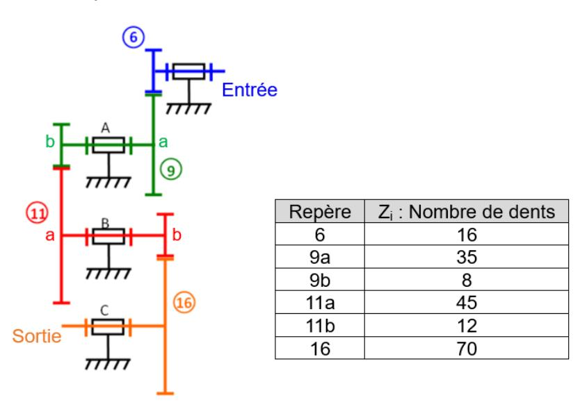

*Figure 29 : caractéristiques du réducteur*

**Question 53** Après avoir calculé le rapport de réduction r (figure 29), calculer la vitesse de rotation Nmoteur en tour/minute (tr·min-1) nécessaire pour l'arbre du moteur.

Une liste de moteurs est leurs caractéristiques est disponible ci-dessous :

| Motor type |               |                |       |                       | Nominal voltage 230 V – Amps | 230 V - Amps             |      | - TO CONTROL OF COLUMN |                            | ominal volta 00 V – Amp | - |
|------------|---------------|----------------|-------|-----------------------|---------------------------------|--------------------------|------|------------------------|----------------------------|----------------------------|---|
|            | Power [kW] | Speed n/rpm | Cos φ | Nbr. of pole pairs | ١                               | oltage rang 220-240 V | je   | PAYOR DOOR SHAPE S     | oltage rang -415 V – Ar | * T. CONTROL S. S. CONTROL |   |
|            |               |                |       |                       | lo                              | In                       | Ist  | lo                     | In                         | Ist                        |   |
| MT06CA200  | 0.2           | 1370           | 0.60  | 2                     | 1.6                             | 1.7                      | 4.9  | 0.9                    | 1.0                        | 2.8                        |   |
| MT07CA200  | 0.23          | 1410           | 0.71  | 2                     | 1.2                             | 1.4                      | 5.1  | 0.7                    | 0.8                        | 2.9                        |   |
| MT07CA104  | 0.45          | 2630           | 0.73  | 1                     | 2.6                             | 3.2                      | 11.2 | 1.5                    | 1.8                        | 6.6                        |   |
| MT08CA200  | 0.45          | 1390           | 0.82  | 2                     | 2                               | 2.4                      | 10.5 | 1.1                    | 1.4                        | 6.2                        |   |
| MT08CA106  | 0.9           | 2850           | 0.77  | 1                     | 3.6                             | 4.4                      | 18.3 | 2                      | 2.5                        | 10.5                       |   |
| MT10CA200  | 0.9           | 1350           | 0.70  | 2                     | 3.3                             | 4                        | 16.8 | 1.9                    | 2.3                        | 9.8                        |   |
| MT10CA106  | 1.8           | 2780           | 0.68  | 1                     | 7.9                             | 9.8                      | 33.5 | 3.8                    | 4.9                        | 20.9                       |   |
| MT10CC200  | 1.8           | 1370           | 0.86  | 2                     | 3.3                             | 6.6                      | 33   | 1.9                    | 3.8                        | 19                         |   |
| MT10CC106  | 3.6           | 2800           | 0.87  | 1                     | 7.8                             | 14                       | 68   | 4.5                    | 8.2                        | 39                         |   |

**Question 54** En reprenant les résultats précédents et en vous aidant du tableau ci-dessus, proposer un choix pour la motorisation du palan.

Afin de suivre l'évolution de la charge et en vue de sécuriser l'installation, des capteurs de force ont été placé entre le câble et l'attache sur la structure. Les capteurs sont des jauges de déformation équipées d'un circuit de conditionnement du signal d'un émetteur RF permettant de transmettre le signal à une station de commande et d'une alimentation autonome à batterie.

**Question 55** Rappeler le principe de fonctionnement d'une jauge de déformation (figure 30) en illustrant la description par un schéma.

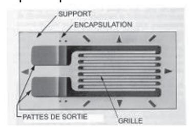

Figure 30 : jauge de déformation

La jauge de déformation a été étalonnée en laboratoire. Une tension continue Vcc de 5 V est appliquée à ses bornes et un relevé de courant a été effectué pour différents efforts longitudinaux appliqués sur la jauge. Les résultats sont donnés figure 31.

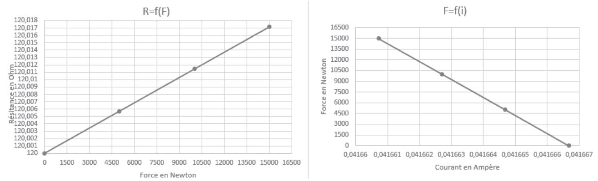

Figure 31 : courbes des efforts et des intensités

**Question 56** Montrer que la jauge de déformation peut être considérée comme un dipôle résistif dont la résistance vaut  $R(F) = R_0 + K_R \cdot F$ . Déterminer numériquement  $R_0$  et  $K_R$ , les deux constantes caractéristiques du capteur en précisant les unités.

Un circuit de conditionnement de type pont de Wheatstone (figure 32) est utilisé pour exploiter la mesure de force.

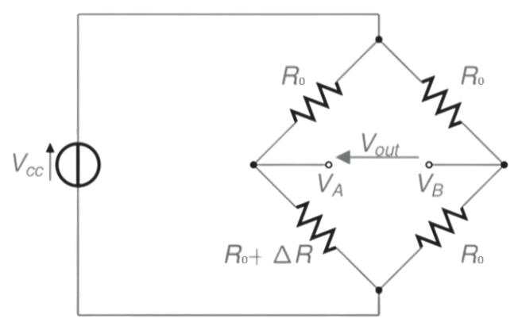

Figure 32 : circuit de conditionnement

**Question 57** Montrer que  $V_A-V_B=\frac{vcc}{2}.\left(\frac{1}{2R_0+\Delta R}\right).\Delta R$ . En déduire une expression simplifiée de  $V_A-V_B$  en fonction de  $\frac{\Delta R}{R_0}$  pour  $R_0\gg\Delta R$ .

La tension  $V_A - V_B$  est par la suite amplifiée par un étage d'amplification différentielle puis numérisée via un convertisseur analogique numérique. La résistance d'un conducteur est sensible à la température avec une expression de la forme  $R(T) = R_0(1 + \alpha T)$  avec  $R_0$  la résistance du conducteur à 0°C et  $\alpha$  le coefficient de température qui dépend du matériau du conducteur. Les 4 résistances du pont de Wheatstone sont considérées comme identiques et suivent la même dérive en température et partagent le même coefficient de température.

**Question 58** Quel est l'intérêt d'insérer le pont de Wheatstone pour procéder à la mesure par rapport à un mesure directe de la résistance de la jauge de contraintes ?

Il est choisi une tension d'alimentation du pont de Wheatstone de Vcc = 1 V. Pour rappel, la chaine d'acquisition complète est composée du pont de Wheatstone dont la tension est amplifiée par un amplificateur différentiel relié au CAN. On souhaite que la tension numérisée par le CAN varie de 5 V pour une charge variant de 0 à 1380 kg.

**Question 59** Calculer le gain KA de l'amplificateur différentiel de la chaîne d'acquisition permettant de valider ces contraintes.

Le relevé de l'évolution de la force mesurée par le capteur de force lors de l'activation du palan est représenté figure 33.

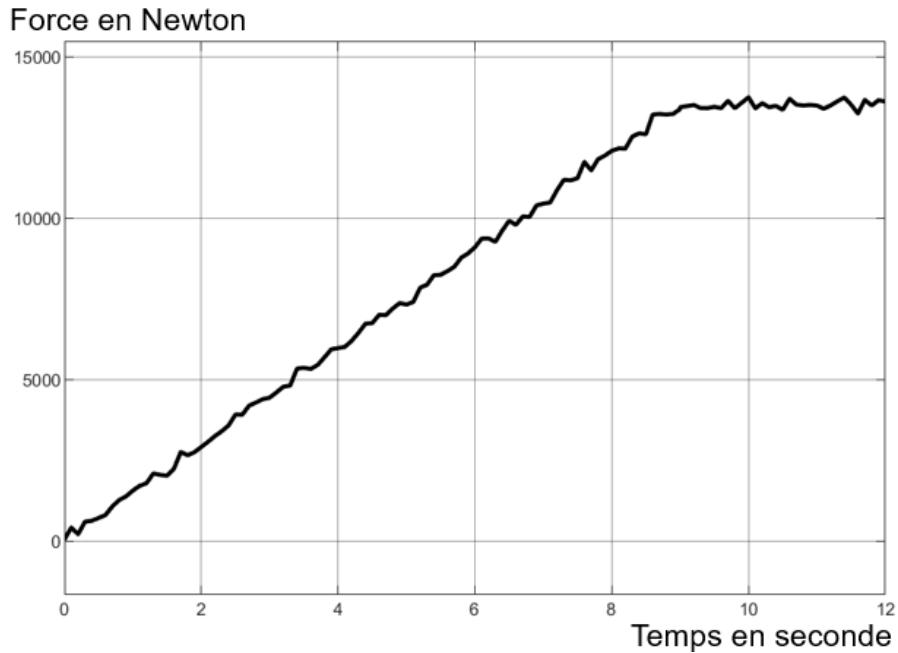

Figure 33 : Évolution de la force mesurée par le capteur de force en fonction du temps

**Question 60** Discuter l'hypothèse effectuée au début de la partie concernant la charge entrainée par le palan ainsi que l'impact sur la motorisation choisie.

# **PARTIE. 6 ÉTUDE DE L'ECLAIRAGE DE LA SCÈNE**

### **Partie 6.1 : Transmission des informations**

Un grand nombre de matériels doivent être mis en œuvre pour aboutir au spectacle immersif voulu par l'artiste. Les informations de pilotage de ces appareils doivent être parfaitement synchronisées afin de participer au confort visuel de l'espace scénique. L'objectif est d'identifier une configuration de raccordement afin d'optimiser le transfert des flux.

L'ensemble lumières du spectacle comportant près de 400 éléments lumineux pilotables par le protocole DMX sont représentés en partie sur le DT4. La technologie DMX est présentée sur le DT5.

**Question 61** Dans le cas de l'aménagement lumineux choisi par l'artiste, déterminer en justifiant que le pilotage de l'ensemble des éléments sur une même ligne DMX est compromis.

La commande se fait généralement à l'aide d'une console DMX ou encore console lumière. Cet appareil peut être plus ou moins complexe, et peut gérer à lui tout seul un spectacle complet, et plusieurs lignes DMX (chacune contenant 512 canaux). On parle alors d'univers DMX, un univers possédant 512 canaux. Pour le spectacle étudié, les univers ont été définis conformément aux souhaits artistiques. Un extrait de cette répartition est donné dans le tableau de la figure 34.

| Univers | Emplacement physique sur scène | Appareil     | Nombre d'appareils par univers |
|---------|-----------------------------------|--------------|--------------------------------------|
| 1 à 6   | Totem 1 à 6                       | JDC1         | 10                                   |
| 7 à 11  | POD 1 à 5                         | LED BEAM 350 | 24                                   |
| 12      | Niveau 2                          | X4 BAR 20    | 18                                   |
| 13      | Avant-scène                       | X4 BAR 20    | 18                                   |

*Figure 34 : extrait des univers utilisés sur le spectacle*

L'étude porte sur l'univers d'un POD comportant 24 lyres LED BEAM 350.

**Question 62** D'après la documentation DT6, relever le nombre de canaux nécessaires au pilotage complet de l'appareil LED BEAM 350. En déduire le nombre de canaux pour le pilotage de l'univers N°7. Conclure sur la possibilité d'exploiter pleinement toutes les fonctionnalités de l'appareil dans l'univers.

20 canaux sont utilisés sur la lyre LED BEAM 350.

**Question 63** Calculer le nombre de canaux utilisés par l'univers N°7 en supposant que l'on utilise 20 canaux par lyre. En vous aidant du DT5, calculer la durée de transmission d'un bit et en déduire le temps de rafraichissement de la trame DMX exprimé en millisecondes puis la fréquence correspondante en Hertz.

Pour des applications en temps réel, comme l'éclairage scénique ou d'autres dispositifs contrôlés par DMX, un taux de rafraîchissement élevé est nécessaire pour assurer une réactivité et une fluidité suffisantes. En général, pour les applications visuelles en direct, un taux de rafraîchissement de 30 Hz est souvent considéré comme le seuil minimal pour éviter une perception visible de saccades ou de décalages.

**Question 64** Conclure sur l'efficacité des univers des PODS et plus largement, sur les univers proposés dans le tableau de la figure 34.

Pour les besoins du spectacle, la lyre doit éclairer successivement deux musiciens pendant 5 secondes. L'éclairage doit être de couleur « Sky blue ». Les musiciens auront une place dédiée et précise : le musicien N° 1 est situé suivant les coordonnées 30° Pan et 60° Tilt et le musicien N° 2 à 90° Pan et 30° Tilt (par rapport à une lyre particulière). Le faisceau lumineux est obscurci entre deux musiciens le temps de se repositionner (la durée est définie à 5 secondes également). Pour éclairer un objet, il faut alors définir les valeurs des canaux, envoyer la trame DMX, puis recommencer pour atteindre les 5 secondes demandées. La durée d'une trame est de 25 ms.

**Question 65** D'après la documentation DT6, indiquer les plages de déplacement en degré des moteurs Pan et Tilt. Et d'en déduire le pas de déplacement en degré des moteurs Pan et Tilt, sachant que chaque canal est codé sur 8 bits. Pour que l'éclairage soit centré sur les musiciens, il est nécessaire que le pas de déplacement des moteurs n'excède pas 3 degrés. Conclure sur la précision de la lyre LED BEAM 350.

**Question 66** À l'aide la documentation DT6, définir les canaux et les valeurs à transmettre en binaire et en décimal pour le musicien n°1.

L'algorigramme décrivant la séquence d'éclairage des musiciens est représenté sur le document réponse DR5.

**Question 67** Compléter l'algorigramme sur le document réponse DR5 décrivant la séquence (cadres repérés Q67).

**Question 68** La durée d'une trame est de 25 ms, calculer la valeur i permettant le temps d'attente de 5 secondes et compléter l'algorigramme (repères Q68 sur DR5).

Pour permettre un flux de transmission plus élevé, il a été choisi de mettre en place un réseau DMX over IP présenté sur le document technique DT7.

**Question 69** À partir du document technique DT7, commenter le choix de l'architecture réseau effectué par l'équipe de production au regard des 2 protocoles du transport de l'information Médianet et DMX et de la liaison par fibre optique.

La production souhaite avoir deux consoles lumière afin d'offrir une redondance en cas de défaillance matérielle ou de problème technique sur l'une des consoles.

**Question 70** En analysant le document technique DT7, donner l'adresse du réseau MédiaNet ainsi que l'adresse de diffusion utilisées pour le pilotage des lumières. En déduire l'adresse pouvant être attribuée à la console de backup en tenant compte qu'elle doit prendre la dernière adresse disponible sur le réseau.

**Question 71** À partir de cette étude et des documents techniques DT5 et DT7, conclure quant au choix d'un réseau DMX over IP en comparaison à un réseau DMX.

# **PARTIE. 7 CONCLUSION**

**Question 72** En reprenant les solutions techniques choisies et présentées dans ce sujet (utilisation d'écran LED modulable, d'une structure porteuse des robots modeste et adaptable aux structures scéniques existantes dans les salles de concert, système d'éclairage moderne et optimisé dans son fonctionnement), conclure sur leur pertinence au regard de la problématique de départ faisant intervenir particulièrement la notion de développement durable dans l'organisation de la tournée mondiale d'un artiste majeur. En quoi cela peut faire écho à l'apprentissage de la technologie au collège ?

### **DT1 : Extrait du diagramme des exigences**

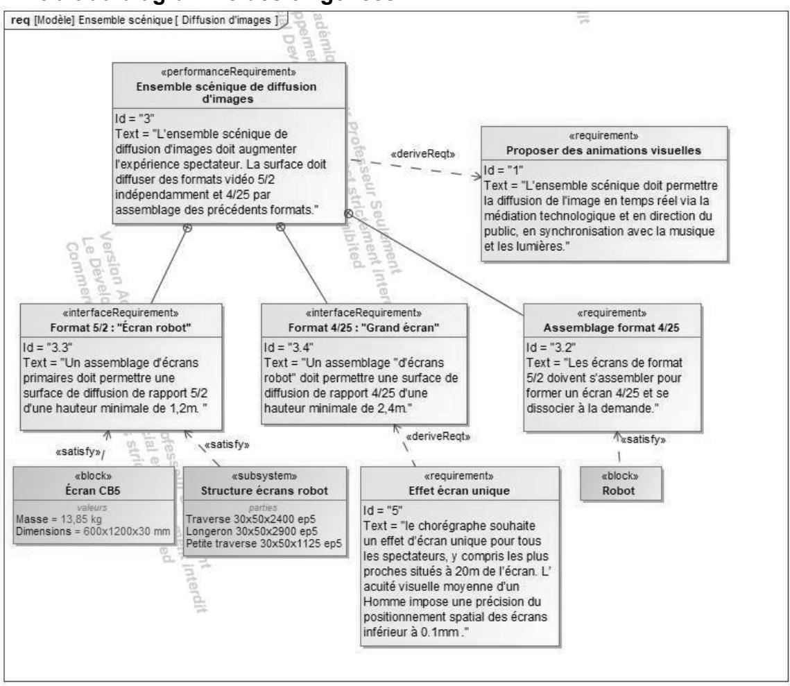

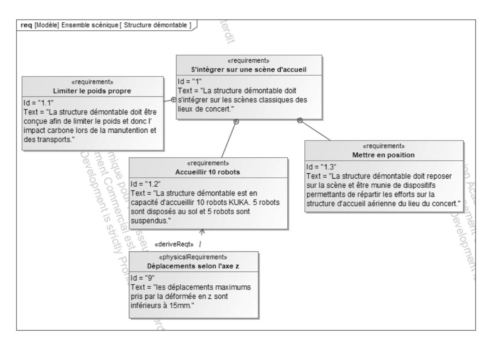

**DT2 : Extrait de la gamme des robots KUKA**

| Désignation  | Illustration | Diagramme de charge                             |
|--------------|--------------|-------------------------------------------------|
|              |              |                                                 |
|              |              | Masse maximale : 370 kg Cm max = 8,21 N.m |
|              |              |                                                 |
|              |              |                                                 |
|              |              |                                                 |
| KR 300 2700  |              |                                                 |
|              |              |                                                 |
|              |              |                                                 |
|              |              |                                                 |
|              |              |                                                 |
|              |              |                                                 |
|              |              | Cm max = 3,83 N.m Masse maximale : 210 kg |
|              |              |                                                 |
|              |              |                                                 |
|              |              |                                                 |
| KR 210 R3100 |              |                                                 |
|              |              |                                                 |
|              |              |                                                 |
|              |              |                                                 |
|              |              |                                                 |
|              |              |                                                 |

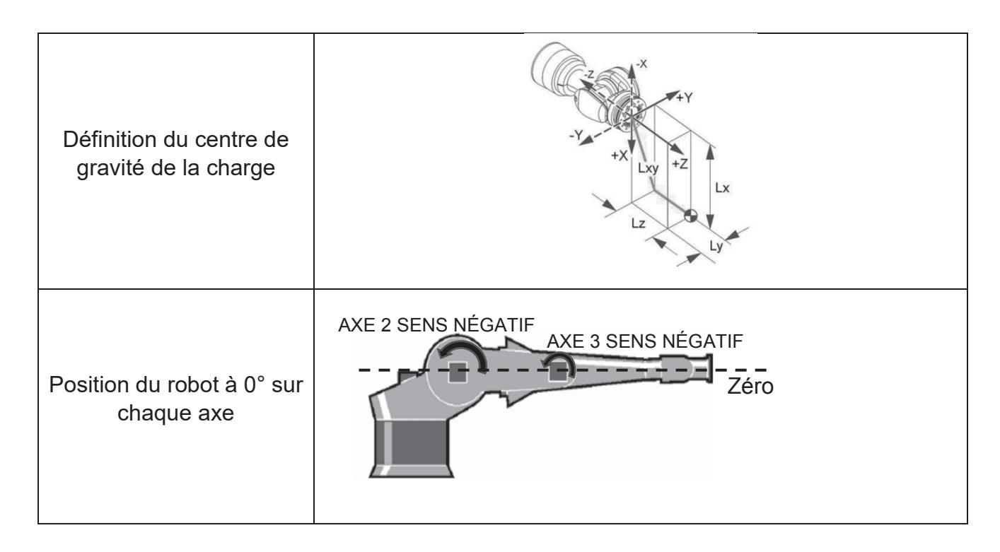

### **DT3 : Poutres continues – Résolution par la méthode des trois moments (2 pages)**

Il est considéré deux travées consécutives (i) et (i+1) d'une poutre hyperstatique à n travées, d'inerties flexionnelles constantes, de longueurs respectives Li et L(i+1) et soumises respectivement à des charges pi et p(i+1).

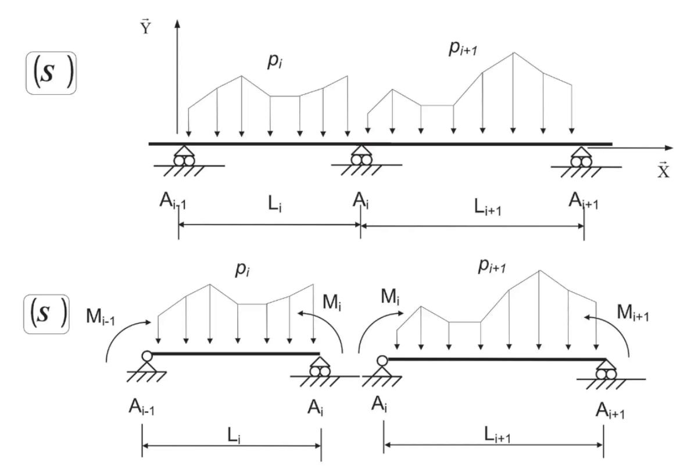

Système isostatique associé :

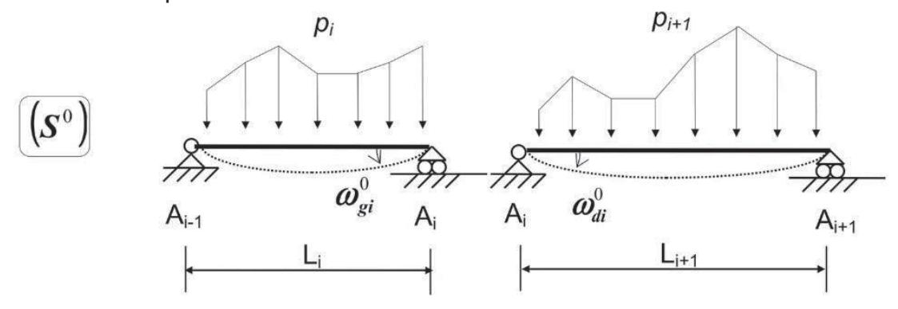

### EQUATION DES TROIS MOMENTS :

$$L_i M_{i-1} + 2(L_i + L_{i+1}) M_i + L_{i+1} M_{i+1} = 6EI(\omega_{di} - \omega_{gi})$$

Avec :

ωdi: La rotation à droite de l'appui Ai pour la travée (i+1) considérée indépendante.

ωgi: La rotation à gauche de l'appui Ai pour la travée (i) considérée indépendante.

### EXPRESSIONS DES REACTIONS D'APPUIS

$$RA_{i} = R_{Ai,g} + R_{Ai,d} + \frac{M_{i-1} - M_{i}}{L_{i}} + \frac{M_{i+1} - M_{i}}{L_{i+1}}$$

### Avec :

,: Réaction à droite de l'appui Ai de la travée isostatique (i+1).

,: Réaction à gauche de l'appui Ai de la travée isostatique (i).

ROTATION ET FLECHES (poutres isostatiques courantes)

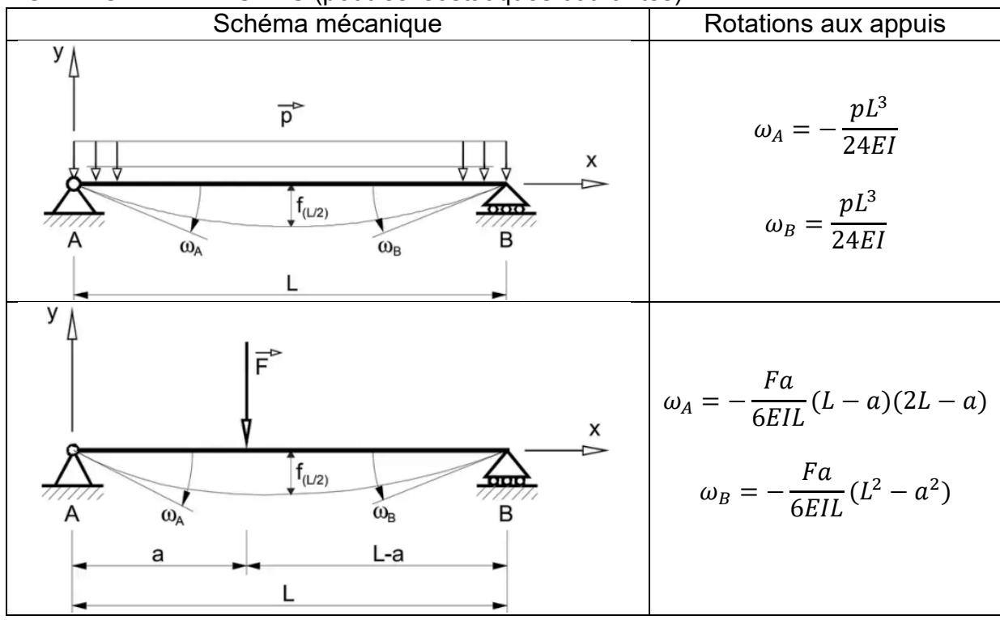

**DT4 : Extrait de l'implantation des lumières**

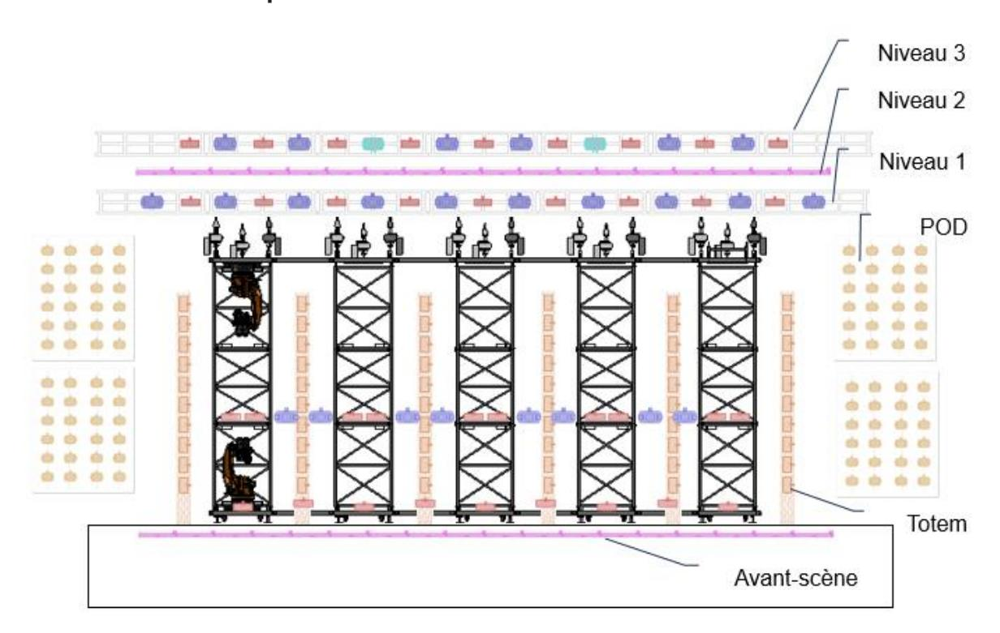

| Appareil                   | JDC1          | LED BEAM 350 | ROBIN FORTE | X4 BAR 20     | COLOR STRIKE |
|----------------------------|---------------|-----------------|----------------|---------------|-----------------|
| Symbole                    |               |                 |                |               |                 |
| Nombre de canaux DMX | 16 maximum | 24 maximum   | 20 maximum  | 10 maximum | 16 maximum      |

### **DT5 : Protocole de communication DMX**

Le DMX512 (Digital Multiplexing) est une norme de transmission de données utilisée pour le contrôle de l'éclairage et des effets de scène dans le spectacle vivant.

Le protocole DMX512 (norme EIA RS 485 cadencée à 250 kb/s) permet de contrôler 512 canaux (9 bits d'adressage) en affectant à chacun une valeur comprise entre 0 et 255 (8 bits de données par canal). La transmission numérique unidirectionnelle se fait de façon sérialisée par liaison symétrique, et chaque appareil reçoit en même temps l'ensemble des 512 valeurs (ce que l'on appelle une « trame » DMX). La norme prévoit la mise en série de maximums 32 appareils sur une même ligne DMX.

### **Principe :**

Le DMX utilise un codage temporel où les informations sont transmises dans un ordre croissant. Un cycle commence par une Initialisation (break + mark after break), puis suit un code indiquant la nature des informations (start-code de 11 bits), le premier octet (start-bit + data : bits de donnée + stop-bits), puis les onze bits du circuit suivant et ainsi de suite. Il reste possible de restreindre le nombre de canaux à transmettre (entre 24 et 512).

### **Structure d'un bloc de données :**

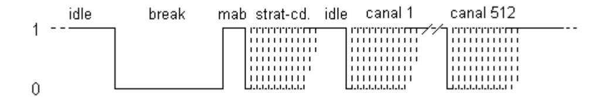

Un break (r.a.z.) de 88 µs (durée de deux trames). Une impulsion Mark After Break (état de travail) de 8 µs (durée deux bits). Le start-code indique la nature des informations transmises (non étudié).

Les données sont présentées sur le bus de façon sérielle. Un bit a une durée de 4µs avec une tolérance de 2 %.

Des temps de repos (idle) peuvent être intercalés entre les paquets de données, caractérisé par état haut de la ligne. On supposera les idle nuls.

### **Composition d'une trame :**

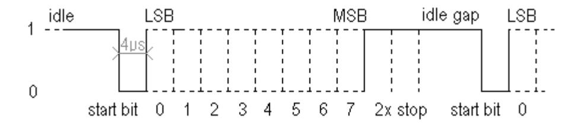

Un start-bit, état bas, précède la transmission de l'octet LSB > MSB : le bit de poids le plus faible jusqu'au bit de poids le plus fort Deux bits de stop, état haut, après la fin de l'octet

### **DT6 : Extrait de la documentation technique lyre LED BEAM 350**

Mode DMX :

Mode 1 - 20 control channels Mode 2 - 16 control channels

Mode 3 - 24 control channels (default)

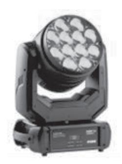

Pan/Tilt :

Max. pan movement range: 540°

Max. tilt movement range: 228°

| Channel | DMX value | Function                                                                                                                                                                             |
|---------|-----------|--------------------------------------------------------------------------------------------------------------------------------------------------------------------------------------|
| 1       | 0-255     | Pan (8 bit) (128=default)                                                                                                                                                            |
| 3       | 0-255     | Tilt (8 bit) (128=default)                                                                                                                                                           |
| 5       | 0 - 1  | Pan/Tilt speed, Pan/Tilt time                                                                                                                                                        |
| 6       | 50        | Blackout while pan/tilt moving                                                                                                                                                       |
| 7       | 0-255     | LED frequency selection                                                                                                                                                              |
| 8       | 0-255     | LED frequency fine adjusting                                                                                                                                                         |
| 9       | 0-255     | Virtual colour wheel No function (0=default) 1-2 Filter 4 (Medium Bastard Amber) 3-4 Filter 25 (Sunset Red) … 9-10 Filter 58 (Lavender) 11-12 Filter 68 (Sky Blue) |
| 10      | 0-255     | Red/Cyan Colour saturation control                                                                                                                                                   |
| 11      |           |                                                                                                                                                                                      |
| 12      | 0-255     | Green/Red Colour saturation control                                                                                                                                                  |
| 13      |           |                                                                                                                                                                                      |
| 14      | 0-255     | Blue/Yellow Colour saturation control                                                                                                                                                |
| 15      |           |                                                                                                                                                                                      |
| 16      | 0-255     | White Colour saturation control                                                                                                                                                      |
| 17      |           |                                                                                                                                                                                      |
| 18      | 0-255     | CTC                                                                                                                                                                                  |
| 19      | 0-255     | Colour Mix control                                                                                                                                                                   |
| 20      | 0-255     | Zoom                                                                                                                                                                                 |

### **DT7 : Extrait du synoptique réseau DMX over IP - MédiaNet**

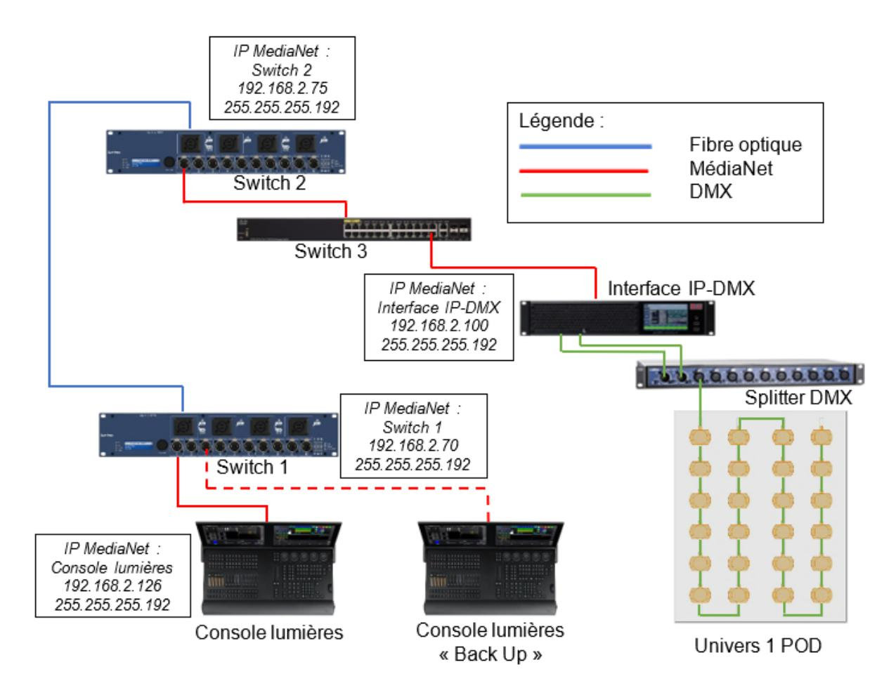

Le réseau MédiaNet est un protocole de communication informatique basé sur la norme UDP/IP2, qui vise à simplifier le transfert des trames DMX en les intégrant dans une communication Ethernet, permettant ainsi un câblage plus simple en utilisant des switches. Ce protocole est utilisé pour communiquer des informations dans un réseau, dans le but de contrôler plusieurs machines, notamment dans le domaine de l'appareillage scénique.

Le principal atout de MédiaNet est d'offrir de très nombreux univers (de 512 canaux DMX) en un seul réseau. Un univers DMX est l'ensemble des 512 canaux, ayant chacun 256 valeurs (de 0 à 255). Chacun de ces canaux correspond à un réglage : un canal peut tout autant régler l'intensité d'un projecteur, que son orientation ou son focus. Avec la norme DMX, un câble ne peut supporter qu'un seul univers alors qu'avec MédiaNet, il est possible d'aller jusqu'à 32 768 univers en un seul réseau.

La communication MédiaNet est basée sur le transfert d'informations d'un serveur (console adaptée, ordinateur...) vers des nodes. L'information provient de la console selon le protocole MédiaNet à travers un réseau de nodes. Un node fait la conversion entre les trames du réseau Ethernet et les trames DMX.

Dans notre configuration, la norme utilisée est 1000BaseT : Réseau équipé d'une connectique RJ45 avec un débit max de 1Gbit.s-1.

| Modèle CMEN v3                                                                                                                                                                                                                                                                                                                                                                                                                                                                                                                                                                                                                                                                                                                                                                                                                                                                                                                                                                                                                                                                                                                                                                                                                                                                                                                                                                                                                                                                                                                                                                                                                                                                                                                                                                                                                                                                                                                                                                                                                                                                                                                 |                                                | $\overline{-}$ |  |  |  |
|--------------------------------------------------------------------------------------------------------------------------------------------------------------------------------------------------------------------------------------------------------------------------------------------------------------------------------------------------------------------------------------------------------------------------------------------------------------------------------------------------------------------------------------------------------------------------------------------------------------------------------------------------------------------------------------------------------------------------------------------------------------------------------------------------------------------------------------------------------------------------------------------------------------------------------------------------------------------------------------------------------------------------------------------------------------------------------------------------------------------------------------------------------------------------------------------------------------------------------------------------------------------------------------------------------------------------------------------------------------------------------------------------------------------------------------------------------------------------------------------------------------------------------------------------------------------------------------------------------------------------------------------------------------------------------------------------------------------------------------------------------------------------------------------------------------------------------------------------------------------------------------------------------------------------------------------------------------------------------------------------------------------------------------------------------------------------------------------------------------------------------|------------------------------------------------|----------------|--|--|--|
| Nom de famille : (Suivi, s'il y a lieu, du nom d'usage)                                                                                                                                                                                                                                                                                                                                                                                                                                                                                                                                                                                                                                                                                                                                                                                                                                                                                                                                                                                                                                                                                                                                                                                                                                                                                                                                                                                                                                                                                                                                                                                                                                                                                                                                                                                                                                                                                                                                                                                                                                                                     |                                                |                |  |  |  |
| Prénom(s) :                                                                                                                                                                                                                                                                                                                                                                                                                                                                                                                                                                                                                                                                                                                                                                                                                                                                                                                                                                                                                                                                                                                                                                                                                                                                                                                                                                                                                                                                                                                                                                                                                                                                                                                                                                                                                                                                                                                                                                                                                                                                                                                    |                                                |                |  |  |  |
| Numéro Candidat :                                                                                                                                                                                                                                                                                                                                                                                                                                                                                                                                                                                                                                                                                                                                                                                                                                                                                                                                                                                                                                                                                                                                                                                                                                                                                                                                                                                                                                                                                                                                                                                                                                                                                                                                                                                                                                                                                                                                                                                                                                                                                                           | Né(e) le :                                     |                |  |  |  |
| Cadre réservé aux candidats de co                                                                                                                                                                                                                                                                                                                                                                                                                                                                                                                                                                                                                                                                                                                                                                                                                                                                                                                                                                                                                                                                                                                                                                                                                                                                                                                                                                                                                                                                                                                                                                                                                                                                                                                                                                                                                                                                                                                                                                                                                                                                                              | cours de recrutement et examens professionnels | $\overline{}$  |  |  |  |
| Concours :                                                                                                                                                                                                                                                                                                                                                                                                                                                                                                                                                                                                                                                                                                                                                                                                                                                                                                                                                                                                                                                                                                                                                                                                                                                                                                                                                                                                                                                                                                                                                                                                                                                                                                                                                                                                                                                                                                                                                                                                                                                                                                                     | Option / Section : N° d'inscription :          |                |  |  |  |
| Cocher une seule case parmi les six ty                                                                                                                                                                                                                                                                                                                                                                                                                                                                                                                                                                                                                                                                                                                                                                                                                                                                                                                                                                                                                                                                                                                                                                                                                                                                                                                                                                                                                                                                                                                                                                                                                                                                                                                                                                                                                                                                                                                                                                                                                                                                                         |                                                |                |  |  |  |
| externe 3° externe externe spécial interne ou 1° interne ou 1° interne 2° interne 2° interne spécial 2° interne spécial 2° interne spécial 2° interne spécial 2° interne spécial 2° interne spécial 2° interne spécial 2° interne spécial 2° interne spécial 2° interne spécial 2° interne spécial 2° interne spécial 2° interne spécial 2° interne spécial 2° interne spécial 2° interne spécial 2° interne spécial 2° interne spécial 2° interne spécial 2° interne spécial 2° interne spécial 2° interne spécial 2° interne spécial 2° interne spécial 2° interne spécial 2° interne spécial 2° interne spécial 2° interne spécial 2° interne spécial 2° interne spécial 2° interne spécial 2° interne spécial 2° interne spécial 2° interne spécial 2° interne spécial 2° interne spécial 2° interne spécial 2° interne spécial 2° interne spécial 2° interne spécial 2° interne spécial 2° interne spécial 2° interne spécial 2° interne spécial 2° interne spécial 2° interne spécial 2° interne spécial 2° interne spécial 2° interne spécial 2° interne spécial 2° interne spécial 2° interne spécial 2° interne spécial 2° interne spécial 2° interne spécial 2° interne spécial 2° interne spécial 2° interne spécial 2° interne spécial 2° interne spécial 2° interne spécial 2° interne spécial 2° interne spécial 2° interne spécial 2° interne spécial 2° interne spécial 2° interne spécial 2° interne spécial 2° interne spécial 2° interne spécial 2° interne spécial 2° interne spécial 2° interne spécial 2° interne spécial 2° interne spécial 2° interne spécial 2° interne spécial 2° interne spécial 2° interne spécial 2° interne spécial 2° interne spécial 2° interne spécial 2° interne spécial 2° interne spécial 2° interne spécial 2° interne spécial 2° interne spécial 2° interne spécial 2° interne spécial 2° interne spécial 2° interne spécial 2° interne spécial 2° interne spécial 2° interne spécial 2° interne spécial 2° interne spécial 2° interne spécial 2° interne spécial 2° interne spécial 2° interne spécial 2° interne spécial 2° interne spécial 2° interne spécial 2° inte |                                                |                |  |  |  |
| Examen professionnel pour l'avancement au grade de :                                                                                                                                                                                                                                                                                                                                                                                                                                                                                                                                                                                                                                                                                                                                                                                                                                                                                                                                                                                                                                                                                                                                                                                                                                                                                                                                                                                                                                                                                                                                                                                                                                                                                                                                                                                                                                                                                                                                                                                                                                                                           |                                                |                |  |  |  |
| Cadre réservé aux candidats d'exai                                                                                                                                                                                                                                                                                                                                                                                                                                                                                                                                                                                                                                                                                                                                                                                                                                                                                                                                                                                                                                                                                                                                                                                                                                                                                                                                                                                                                                                                                                                                                                                                                                                                                                                                                                                                                                                                                                                                                                                                                                                                                             | ens et du concours général                     |                |  |  |  |
| Examen :                                                                                                                                                                                                                                                                                                                                                                                                                                                                                                                                                                                                                                                                                                                                                                                                                                                                                                                                                                                                                                                                                                                                                                                                                                                                                                                                                                                                                                                                                                                                                                                                                                                                                                                                                                                                                                                                                                                                                                                                                                                                                                                       | Série / Spécialité :                           |                |  |  |  |
| Epreuve - Matière :                                                                                                                                                                                                                                                                                                                                                                                                                                                                                                                                                                                                                                                                                                                                                                                                                                                                                                                                                                                                                                                                                                                                                                                                                                                                                                                                                                                                                                                                                                                                                                                                                                                                                                                                                                                                                                                                                                                                                                                                                                                                                                            | Session:                                       |                |  |  |  |

EDE STI 2

# DR1 à DR5

Tous les documents réponses sont à rendre, même non complétés.

# **NE RIEN ECRIRE DANS CE CADRE**

### **DR1 (question 15)**

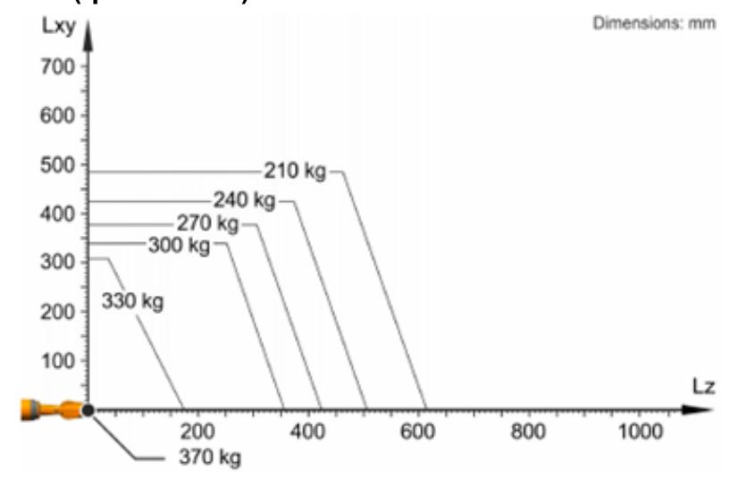

### **DR2 (question 30)**

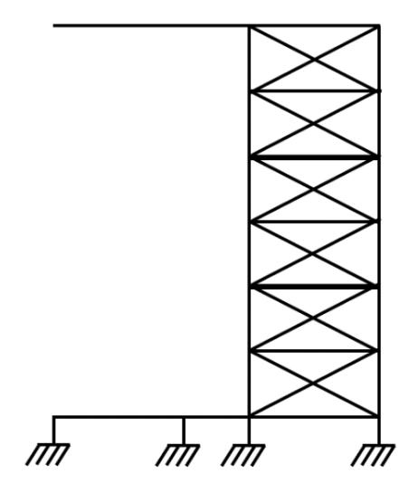

### DR3 (questions 39 et 40)

|                                   | Charges permanentes en kN.m -1 | Charge d'exploitation en kN.m -1 |
|-----------------------------------|-------------------------------------------|---------------------------------------------|
| Charge permanente du plancher G   |                                           |                                             |
| Charge permanente de la poutre G' |                                           |                                             |
| Charge d'exploitation Q           |                                           |                                             |
| Total                             |                                           |                                             |

# DR4 (question 45) Calcul de la valeur des réactions aux appuis

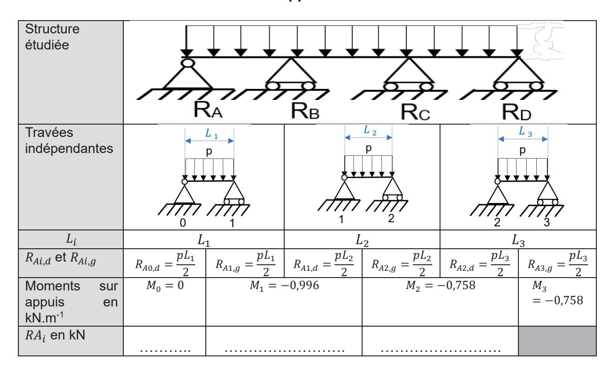

### **DR5 (questions 67 et 68)**

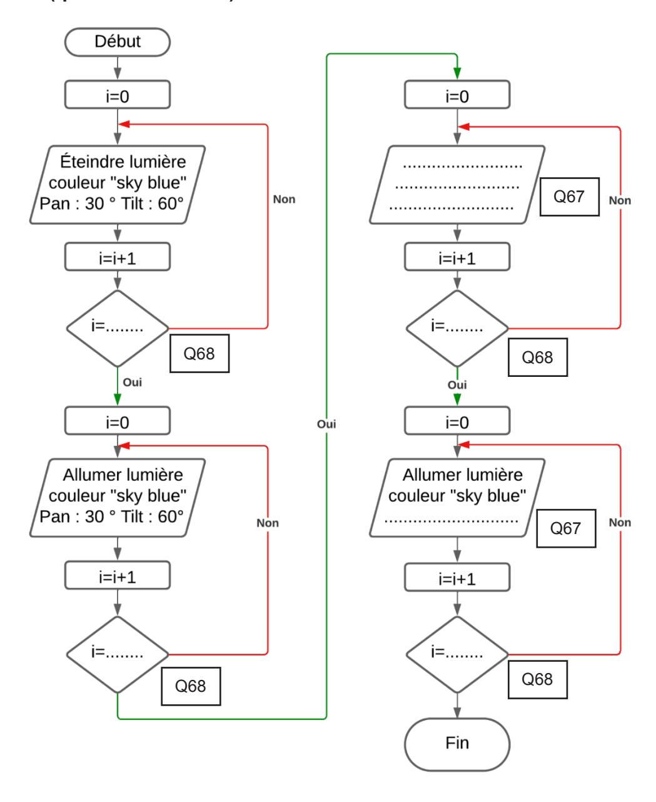