#### **SESSION 2025** \_\_\_\_

## CAPET CONCOURS EXTERNE ET CAFEP CORRESPONDANT ET TROISIEME CONCOURS

**Section : SCIENCES INDUSTRIELLES DE L'INGÉNIEUR**

**Option : INGÉNIERIE ÉLECTRIQUE**

#### **ÉPREUVE ÉCRITE DISCIPLINAIRE**

Durée : 5 heures \_\_\_\_

*Calculatrice autorisée selon les modalités de la circulaire du 17 juin 2021 publiée au BOEN du 29 juillet 2021.*

*L'usage de tout ouvrage de référence, de tout dictionnaire et de tout autre matériel électronique est rigoureusement interdit.*

*Il appartient au candidat de vérifier qu'il a reçu un sujet complet et correspondant à l'épreuve à laquelle il se présente.* 

*Si vous repérez ce qui vous semble être une erreur d'énoncé, vous devez le signaler très lisiblement sur votre copie, en proposer la correction et poursuivre l'épreuve en conséquence. De même, si cela vous conduit à formuler une ou plusieurs hypothèses, vous devez la (ou les) mentionner explicitement.*

**NB : Conformément au principe d'anonymat, votre copie ne doit comporter aucun signe distinctif, tel que nom, signature, origine, etc. Si le travail qui vous est demandé consiste notamment en la rédaction d'un projet ou d'une note, vous devrez impérativement vous abstenir de la signer ou de l'identifier. Le fait de rendre une copie blanche est éliminatoire.**

#### **INFORMATION AUX CANDIDATS**

Vous trouverez ci-après les codes nécessaires vous permettant de compléter les rubriques figurant en en-tête de votre copie

Ces codes doivent être reportés sur chacune des copies que vous remettrez.

**► Concours externe du CAPET de l'enseignement public** :

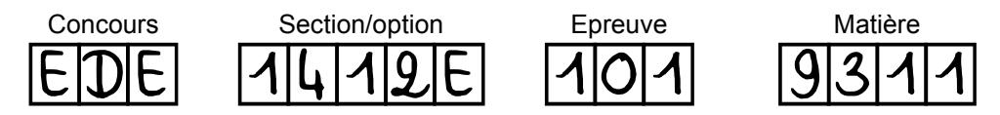

**► Concours externe du CAFEP/CAPET de l'enseignement privé** :

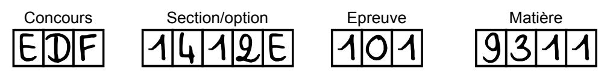

**►Troisième concours externe du CAPET de l'enseignement public :**

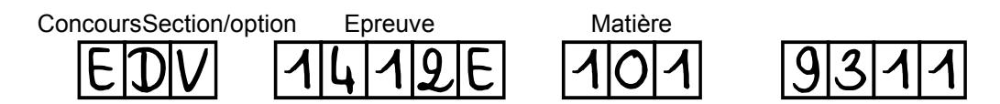

# Étude d'un réseau d'électrification dans un site isolé à l'île de La Réunion

#### **Mise en contexte :**

Au cours des dix dernières années, une proportion sans précédent de la population mondiale a obtenu l'accès à l'électricité, mais le nombre de personnes privées d'électricité en Afrique subsaharienne a en réalité augmenté. Si les pays affichant les plus importants déficits n'intensifient pas considérablement leurs efforts, le monde ne pourra toujours pas garantir l'accès de tous à une énergie abordable, fiable, durable et moderne à l'horizon 2030. C'est ce qu'affirme le rapport intitulé Tracking SDG 7: The Energy Progress Report publié en juin 2021 par l'Agence internationale de l'énergie (AIE), l'Agence internationale pour les énergies renouvelables (IRENA), le Département des affaires économiques et sociales des Nations Unies (UNDESA), la Banque mondiale et l'Organisation mondiale de la Santé (OMS).

Le nombre de personnes privées d'accès à l'électricité dans le monde a baissé, passant de 1,2 milliard en 2010 à 759 millions en 2019. L'électrification au moyen de solutions renouvelables décentralisées a connu un essor particulièrement significatif. Le nombre de personnes raccordées à des mini réseaux a plus que doublé entre 2010 et 2019, passant de 5 millions à 11 millions d'individus. Pour autant, au regard des politiques actuelles et futures et des effets de la crise de la COVID-19, on estime que 660 millions de personnes n'auront toujours pas accès à l'électricité en 2030, en Afrique subsaharienne pour la plupart.

#### **La situation de Mafate à l'Île de la Réunion :**

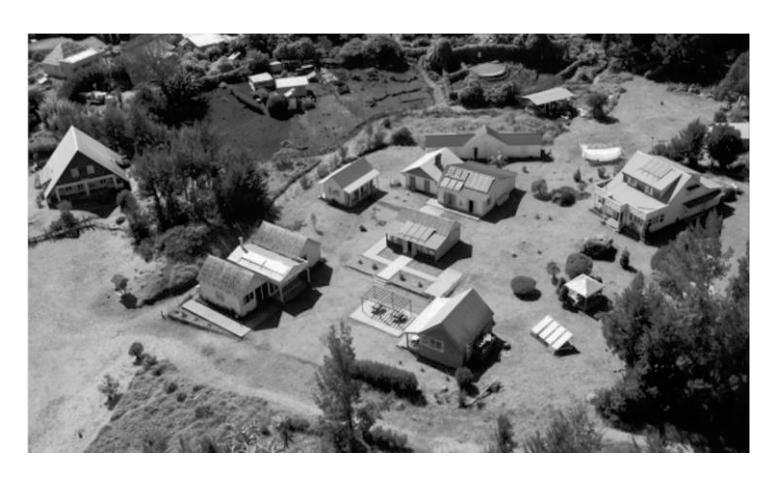

Coupé du monde au cœur du Parc national de La Réunion, situé dans un cirque au relief très escarpé, possédant un foncier restreint, le cirque de la nouvelle est classé au patrimoine mondial de l'UNESCO. Ce hameau ne peut compter que sur le soleil pour produire son électricité. Alimenté jusque-là par des panneaux photovoltaïques vieillissants, la croissance du tourisme l'oblige à augmenter et stabiliser sa production.

Il n'est desservi par aucune route, n'est pas connecté au réseau électrique, est ravitaillé par hélicoptère et pourtant 100 000 personnes le visitent chaque année. L'économie du cirque de Mafate et ses dix îlets (hameaux) peuplés par environ 700 habitants (310 familles) est très dépendante du tourisme. Les besoins en électricité augmentent, mais les installations de production se dégradent et ne permettent plus de satisfaire la demande.

Les 310 foyers et 13 gîtes équipés, il y a une vingtaine d'années, de panneaux photovoltaïques, se tournent désormais vers des groupes électrogènes. Selon un habitant, ils consommeraient environ 50 000 litres de carburant par an. Il faut donc trouver une solution pour éviter de transformer ce site naturel en un espace pollué et dépendant des énergies fossiles sur le long terme.

#### **Un système développé par une start-up française**

À La Nouvelle, l'îlet le plus peuplé du cirque de Mafate, EDF expérimente un système de stockage de l'énergie solaire via des batteries lithium-ion et de l'hydrogène. Développée par la start-up française Powidian, la technologie baptisée « SAGES » (Smart Autonomous Green Energy System) permet d'emmagasiner l'électricité excédentaire produite par les panneaux photovoltaïques installés sur les toits des bâtiments publics.

Stockée dans des batteries pour un usage à court terme, l'électricité peut également être convertie en hydrogène via un électrolyseur. Conservé dans un réservoir, il peut ensuite être retransformé en électricité grâce à une pile à combustible et injecté dans un microréseau selon les besoins. Lors de longues périodes sans ensoleillement, les habitants peuvent donc théoriquement continuer à être alimentés. Un premier dispositif a vu le jour en février 2016 sur le toit de l'école de La Nouvelle, avant un éventuel déploiement à plus grande échelle dans les autres îlets.

#### **Partie 1 : étude et analyse des besoins énergétiques du site isolé**

**Objectifs : comparer plusieurs solutions possibles pour faire face aux besoins énergétiques du site isolé.**

Le mixte énergétique d'électrification a consisté à recourir à des groupes électrogènes. Le site étant accessible par des sentiers de randonnée (aucune route de desserte), le ravitaillement en fioul se faisait par des rotations d'hélicoptère.

Les autres sources sont des panneaux photovoltaïques associés à du stockage individuel.

#### **Bilan énergétique des habitations**

**Q1.** À partir du document technique DT1 (Bilan statistique de consommation des équipements d'un foyer et équipement type d'un gîte) **faire** le bilan de consommation annuelle d'un foyer et d'un gîte. **Compléter** les tableaux du document réponse DR1. **En déduire** l'énergie consommée (ETOT) par l'ensemble des habitations du cirque sur un an.

Dans le cadre d'un premier scénario, on envisage de recourir exclusivement à des groupes électrogènes diesel. Un synoptique de l'installation est consigné sur le document DT2.

**On cherche à évaluer la quantité annuelle de fuel requise pour les groupes électrogènes et estimer le coût du kilowattheure (kWh).**

Le réseau serait maillé avec plusieurs groupes de 250 kVA. On admet que l'énergie annuelle consommée par l'ensemble des habitations et des équipements publics du cirque est ETOT = 1,3.109 Wh.

Le tarif du fuel est Tfuel = 1 170 € pour 1 000 litres. Son ravitaillement se fait en hélicoptère. Il permet de transporter 700 litres de fuel pour un coût Tvol = 400 €.

**Q2. Exprimer** puis **calculer** la quantité annuelle de fuel QF requise pour alimenter le hameau de la Nouvelle en énergie électrique. **En déduire** le prix du kilowattheure délivré aux habitants, comparer avec le prix du distributeur public EDF (environ 0,25 € le kWh).

L'estimation du prix montre que la solution basée uniquement sur les groupes électrogènes est prohibitive. Aussi, on envisage d'exploiter les ressources énergétiques renouvelables comme le soleil.

On propose d'alimenter le cirque en utilisant exclusivement des panneaux photovoltaïques. On admet que les panneaux photovoltaïques ont un rendement de P = 18,9 %.

#### **Étude du potentiel d'énergie solaire**

Sur le document technique DT3 est consignée la courbe de l'irradiance sur le site durant deux jours consécutifs.

**Q3. Analyser** et **commenter** l'allure de la courbe de l'irradiance (régularité, disponibilité, amplitude…).

Le document technique DT4 montre les détails de l'irradiance sur une durée de trois minutes. Afin d'estimer le potentiel solaire, on effectue une approche numérique par une méthode de Riemann à pas constant d'ordre 0 (méthode des rectangles à droite).

**Q4. Préciser** le pas du relevé (noté Pas). **Calculer** l'énergie surfacique (Es en Wh) reçue sur ces trois minutes.

On dispose des relevés de l'irradiance horaire moyenne du site sur une année complète. On souhaite les exploiter pour quantifier la ressource solaire disponible. Le traitement du calcul de l'énergie est fait numériquement grâce à l'algorithme fourni sur le document réponse DR2. Les données proviennent d'un fichier au format .csv dont le format est le suivant :

| Temps (s)          | (W.m-2) Valeur de l'irradiance Φ |
|-----------------------|----------------------------------------------|
| t                     | Valeur 1                                  |
| t + 1 heure  | Valeur 2                                  |
| t + 2 heures | Valeur 3                                  |
|                       |                                              |
| t_final               | Valeur finale                             |

**Q5. Compléter** l'algorithme du document DR2 afin de calculer et d'afficher la valeur de l'énergie surfacique annuelle reçue par les panneaux photovoltaïques (en kWh.m-2).

Le calcul issu du programme donne une énergie surfacique annuelle reçue Esan = 1 447 kWh.m-2. Le synoptique du document technique DT5 donne l'architecture simplifiée de l'installation. Le stockage de l'énergie permet de maintenir l'alimentation en l'absence de soleil.

**Q6.** En considérant un rendement unitaire pour la batterie lors de la charge et de la décharge, **calculer** la surface des panneaux photovoltaïques (STPanneau) nécessaire pour subvenir aux besoins énergétiques journaliers du village de La Nouvelle.

**Q7. Conclure** sur la possibilité d'alimenter tout le hameau en utilisant uniquement les groupes électrogènes ou uniquement des cellules photovoltaïques.

# Étude du stockage hydrogène et de l'hybridation avec la solution lithium au sein du microgrid

Dans cette partie il s'agit de déterminer la quantité d'énergie pour fabriquer l'hydrogène, l'énergie disponible après son stockage et de caractériser l'efficacité de la chaîne d'énergie dont le vecteur est le dihydrogène.

#### Étude du principe de décomposition de l'eau $H_2O$ .

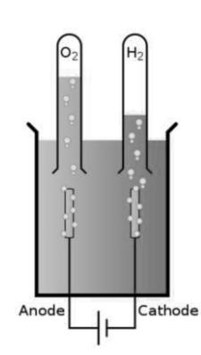

On obtient de l'hydrogène par électrolyse de l'eau.

Le courant électrique dissocie la molécule d'eau  $H_2O$  en ions hydroxyde  $HO^-$  et hydrogène  $H^+$ : dans la cellule électrolytique, les ions hydrogène acceptent des électrons à la cathode dans une réaction d'oxydoréduction en formant du dihydrogène gazeux  $H_2$ , selon la réaction de réduction, à la cathode on forme du  $H_2$ :

$$\alpha(H^+)_{aq} + \beta e^- \rightarrow (H_2)_{gaz}.$$

Sur l'anode une oxydation des ions hydroxyde qui perdent donc des électrons se produit afin de « fermer » le circuit électrique (équilibre de la réaction chimique en charges) :

$$2H_2O_{liq} \rightarrow (O_2)_{gaz} + 4(H^+)_{aq} + 4e^-.$$

Ce qui provoque la production d'eau liquide, de dihydrogène gazeux et de dioxygène gazeux selon l'équation suivante :

$$2H_2O_{liq} \longrightarrow 2(H_2)_{gaz} + (O_2)_{gaz}.$$

#### Bilan énergétique pour fabriquer 1 kg d'hydrogène

Pour parvenir à former du dihydrogène gazeux et du dioxygène gazeux à partir de deux molécules d'eau  $H_2O$  il faut briser 4 liaisons O-H puis reconstruire 2 liaisons H-H et 1 liaison O-O.

On doit d'abord apporter de l'énergie pour briser les liaisons des molécules d'eau :

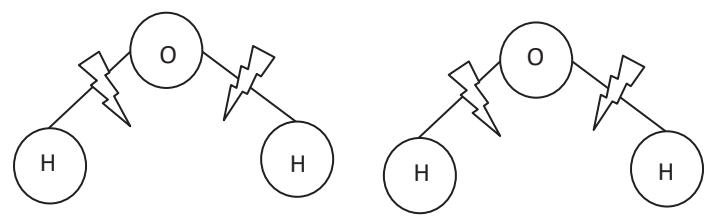

Puis on soustrait de l'énergie lors de la construction des molécules  $H_2$  et  $O_2$ .

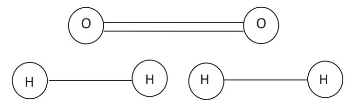

On donne dans le tableau ci-dessous quelques énergies de liaison :

| Energie          | Energie de quelques liaisons (en kJ·mol -1 ) |      |     |       |     |
|------------------|---------------------------------------------------------|------|-----|-------|-----|
| O=O              | 498                                                     | C-O  | 358 | F-F   | 148 |
| 0-0              | 146                                                     | C=O  | 799 | CI-CI | 242 |
| C (s) | 717                                                     | C-F  | 429 | Br-Br | 224 |
| C-C              | 347                                                     | C-Cl | 339 | 1-1   | 214 |
| C=C              | 614                                                     | C-Br | 275 | Н-Н   | 436 |
| C≡C              | 839                                                     | N-Cl | 200 | H-cl  | 427 |
| С-Н              | 413                                                     | N≡N  | 941 | Н-О   | 461 |

**Q8. Montrer** que l'énergie utile pour obtenir une mole de  $H_2$  est  $E_U=237 \, \mathrm{kJ}$ . La masse molaire de l'hydrogène est  $m_H=1 \, \mathrm{g \cdot mol}^{-1}$ , **en déduire** alors l'énergie utile ( $E_{UH}$ ) pour fabriquer 1 kg d'hydrogène. **Donner** cette énergie en kWh.

Pour fabriquer l'hydrogène on utilise un électrolyseur ayant un rendement  $\eta_{E}$ =57 %.

Q9. Calculer l'énergie électrique (EEH) qu'il faudrait fournir pour fabriquer 1 kg d'hydrogène.

Pour fabriquer de l'électricité en utilisant l'hydrogène, on utilise une pile à combustible (PAC) qui en recombinant le dihydrogène avec le dioxygène produit de l'eau.

Le rendement de la pile à combustible est ηP= 50 %.

**Q10. Calculer** l'énergie électrique (EER) que l'on pourrait récupérer avec 1 kg d'hydrogène.

**Q11. Compléter** le document réponse DR3 en donnant les valeurs de l'énergie électrique fournie à l'électrolyseur (EEH), celle nécessaire pour fabriquer 1 kg d'hydrogène (EUH) et celle restituée par la PAC (EER). **Donner** le rendement global (ηglobal) de la solution basée sur l'hydrogène.

On donne la loi des gaz parfait : P·V = n·R·(T+273) où :

P est la pression en Pa ; V le volume occupé par le gaz en m3 ; n le nombre de moles ; R la constante universelle des gaz parfaits (R = 8,314 J·mol -1 ·K-1 ) et T la température en °C. On rappelle que 1 bar = 1 013 hPa.

**Q12. Calculer** le volume occupé par 1 kg d'hydrogène à température ambiante de 25 °C à la pression atmosphérique (1 013 hPa).

On souhaite avoir suffisamment d'hydrogène pour alimenter les habitations du cirque pendant une journée.

**Q13. Calculer** le volume d'hydrogène qu'il faudrait stocker si on reste à la pression atmosphérique puis si on comprime le gaz à 500 bars, puis **comparer** ces deux solutions.

# Partie 2 : étude de l'architecture fonctionnelle et structurelle d'un sous-réseau d'électrification

Objectif : cette partie vise à identifier les fonctions et les éléments structurels qui concourent aux transferts de puissance et à valider leurs performances.

L'architecture retenue utilise des panneaux photovoltaïques, du stockage d'énergie à l'aide de batterie lithium et une pile à combustible associée à un électrolyseur et un stockage d'hydrogène. L'étude porte sur l'installation d'un foyer. Le synoptique global est donné sur le document technique DT6.

**Q14.** Compléter le document réponse DR4 en donnant le nom et la fonction des convertisseurs CV1 à CV3.

#### Étude du convertisseur CV1 dans le cadre d'un pilotage MPPT

**Q15. Préciser** la signification du sigle MPPT pour un convertisseur. **Donner** l'avantage de cette commande.

On donne les courbes d'intensité du courant en fonction de la tension et de la puissance en fonction de la tension en sortie du champ photovoltaïque sur le document technique DT7 et les caractéristiques d'un panneau du champ sur le document technique DT5.

La tension nominale du champ photovolta $\ddot{q}$ que est  $U_{nom}=317~V$  et le courant nominal  $I_{nom}=9,47~A$ .

**Q16.** Calculer le nombre de panneaux qui composent le champ photovolta $\ddot{q}$ que. Préciser le raccordement de ces panneaux puis calculer la puissance nominale  $P_{nom}$  et la surface du champ photovolta $\ddot{q}$ que.

Cas n°1 : on se place au point de fonctionnement  $P_1$  qui correspond à la tension  $U_1$  = 195 V et au courant  $I_1$  = 7,5 Å. Pour être plus efficace, le panneau doit délivrer sa puissance maximale. Un algorithme de commande impose au panneau la tension  $U_1$  +  $\Delta V$  ( $\Delta V$  très petit et positif).

Cas n°2 : on se place ensuite au point de fonctionnement  $P_2$  qui correspond à la tension  $U_2=340~V$  et au courant  $I_2=7,5~A$ . L'algorithme de commande impose toujours au panneau la tension  $U_2+\Delta V$  ( $\Delta V$  très petit et positif).

**Q17.** Indiquer le signe de la variation de puissance dP dans les deux cas.

**Q18. Expliquer** comment le régulateur MPPT opère dans les deux cas pour permettre au convertisseur CV1 de fournir le maximum de puissance.

La tension  $E_b$  (voir le document technique DT6) est liée à la tension  $U_{PV}$  par une fonction de modulation fm telle que  $U_{PV} = fm \cdot E_b$ .

**Q19.** À l'aide des documents techniques DT6 et DT7, pour les points  $P_1$ ,  $P_{max}$  (qui correspond au point nominal) et  $P_2$  **calculer** la valeur de fm puis **déterminer** la fonction de CV1 et **justifier** la présence de CV1 au sein de l'installation.

#### **Étude des grandeurs électriques à la sortie du convertisseur CV3.**

Les schémas du convertisseur CV3 sont donnés sur les documents techniques DT8 et DT9. CV3 est composé de deux convertisseurs CV3-1 et CV3-2 conformément au synoptique cidessous :

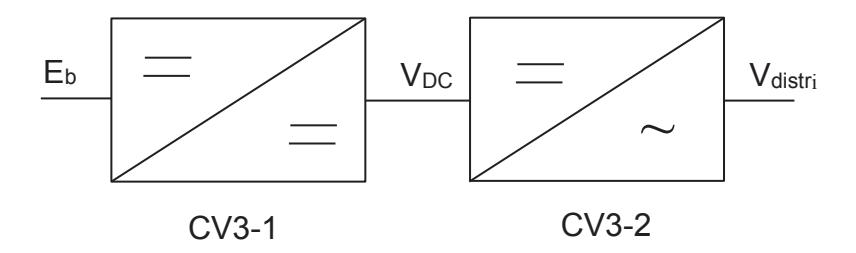

#### **Étude du convertisseur CV3-2**

L'utilisation est modélisée par une résistance R0 = 17,7 Ω et une inductance L = 10 mH. On simplifie l'étude en considérant que le convertisseur est commandé en pleine onde. Sur ce schéma la tension à l'entrée est considérée constante VDC = 230 V. Le convertisseur CV3-2 fonctionne à une fréquence F = 50 Hz.

**Q20. Compléter** le document réponse DR5 en dessinant l'allure de Vcom et Vdistri.

**Q21. Calculer** la valeur efficace de la tension Vdistri.

La charge consomme une puissance nominale Sdistri = 3 kVA.

**Q22. Calculer** les puissances active (Pdistri) et réactive (Qdistri) consommées par la charge.

**Q23.** Le calcul du THDfond (Total Harmonic Distortion) de la tension Vdistri donne THD = 0,48. **Commenter** ce résultat en termes de qualité de l'onde produite par CV3-2.

#### **Étude du convertisseur CV3-1**

La structure du convertisseur CV3-1 est donnée sur le document technique DT9. Tous les interrupteurs sont considérés comme parfaits, le rendement de CV3-1 est unitaire.

Pour simplifier, l'étude porte dans un premier temps sur le schéma du document technique DT10.

**Q24. Compléter** le document réponse DR6 en indiquant la possibilité de viabilité des combinaisons des états des interrupteurs Q1 et D1. **Argumenter** la réponse.

#### On note :

- VL1 la tension aux bornes de l'inductance L1,
- iL1 l'intensité du courant dans l'inductance L1,
- vQ1 la tension aux bornes du transistor Q1,
- iQ1 l'intensité du courant dans le transistor Q1,
- vD1 la tension aux bornes de la diode D1,
- iD1 l'intensité du courant dans la diode D1,
- vDC la tension délivrée par CV3 partie 1,
- Eb la tension aux bornes de la batterie,
- ib l'intensité du courant dans la batterie.

**Q25.** Sur le document réponse DR7 **flécher** les tensions Eb, vL1, vQ1, vD1 et vDC ainsi que les courants ib, iL1, iQ1, ID1.

**Q26. Écrire** les lois générales de Kirchhoff qui lient les grandeurs fléchées à la question Q25.

Pour la question suivante, on considère un fonctionnement en régime permanent. On étudie un premier temps uniquement le comportement de Q1 et D1. On considère que tous les interrupteurs sont parfaits. L'étude se base sur le schéma simplifié du document technique DT10.

Le transistor Q1 est commandé par un signal logique de rapport cyclique noté avec une période notée T.

**Q27.** Pour t ϵ ]0; αT] puis pour t ϵ ]αT; T] , en utilisant les lois de Kirchhoff données précédemment, **déterminer** l'expression littérale de l'intensité du courant iL1 sur les deux intervalles.

**Q28. Dessiner** l'allure temporelle de iL1 sur le document réponse DR8.

L'étude se base maintenant sur le schéma du document technique DT9. La commande de l'interrupteur Q2 est décalée de T 2 par rapport à celle de Q1.

**Q29. Donner** l'expression temporelle de iL2 pour t ϵ ] T 2 ; T 2 + αT] puis pour t ϵ ] T 2 + αT ; 3.T 2 ].

**Q30. Dessiner** l'allure temporelle de iL2 en correspondance avec celle de iL1 sur le document réponse DR8.

L'allure de ib et celle de iS sont données sur le document technique DT11.

**Q31. Exprimer** la valeur moyenne de iS en fonction de et du courant moyen dans batterie notée Ib.

**Q32.** En faisant un bilan de puissance, **exprimer** VDC en fonction de et de Eb puis **conclure**.

#### **Partie 3 : Étude de l'asservissement de la tension du bus continu**

Dans cette partie, il s'agit de justifier la nécessité de contrôler la tension du bus continu, d'établir un modèle du convertisseur dans l'optique d'identifier le type de correcteur à mettre en œuvre pour obtenir un asservissement et une régulation de la tension VDC délivrée à l'onduleur.

La batterie est composée d'un assemblage de cellules en série dont la tension nominale VCEN = 3,69 V. La tension nominale de la batterie est EbN = 48 V.

#### On note :

vDC la tension délivrée par CV3-1, Vdistri la tension délivrée par CV3-2.

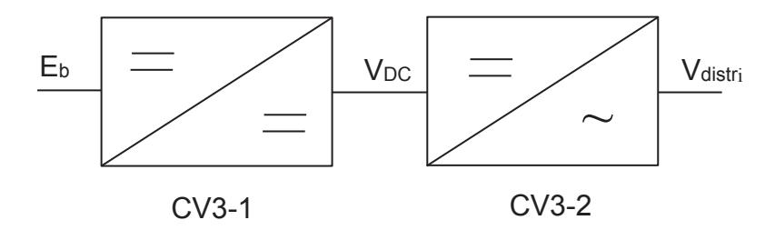

#### **Q33. Calculer** le nombre de cellules qui composent la batterie.

L'évolution de la tension aux bornes de la batterie en fonction de l'état de charge est donnée sur le graphe du document technique DT12.

**Q34. Calculer** la variation de la tension aux bornes de la batterie ΔEb entre une pleine charge et la fin de décharge pour une profondeur de décharge de 85 % qui correspond à une tension aux bornes de la cellule VCE = 3,3 V.

On a VDC = Eb (1−α) ; on fait l'hypothèse que la valeur efficace de Vdistri est VdistriE = VDC . On précise que la valeur efficace nominale de Vdistri est VdistriEN = 230 V et que le rapport cyclique nominal est αnom = 0,79.

**Q35.** Dans le cas d'un maintien du rapport cyclique à sa valeur nominale, **calculer** VdistriE lorsque la batterie est complètement chargée puis déchargée à 85 %. **Conclure** sur le respect de la réglementation qui prévoit de maintenir la tension efficace du réseau de distribution à plus ou moins 10 % de sa valeur efficace nominale.

L'étude précédente a montré que la tension du bus continu et celle de la tension de distribution dépendent de la tension de la batterie. Il est donc nécessaire d'ajuster le réglage du convertisseur CV3 lorsque la tension aux bornes de la batterie varie afin de maintenir la tension VdistriE constante.

Pour éviter cette variation, on peut agir sur la commande du convertisseur CV1 ou mettre en place une stratégie de contrôle du bus continu. L'étude suivante propose de fixer la commande de CV1 et d'agir sur CV3-1 (voir documents techniques DT8, DT9 et DT10) pour maintenir VDC et la valeur efficace de Vdistri constante.

Il convient d'asservir et de réguler le niveau de la tension du bus continu délivré à l'onduleur. L'étude est menée autour d'un point de repos. Afin de s'affranchir de la non-linéarité intrinsèque due aux commutations, la méthode mise en œuvre est basée sur les « modèles moyens », dits aussi « en comportements moyens » autour d'un point de repos. On admet que le fonctionnement reste dans le domaine linéaire.

On peut écrire :

$$\begin{split} E_b(t) &= E_{b0} + \delta E_b, \\ \alpha(t) &= \alpha_0 + \delta \alpha, \\ I_L(t) &= I_{L0} + \delta I_L, \\ V_{DC}(t) &= V_{DC0} + \delta V_{DC}. \end{split}$$

Les grandeurs (g) indicées 0 sont les valeurs moyennes (composantes continues) et les grandeurs  $\delta g$  représentent les « petites » modulations.

Le point de repos qui correspond au point de fonctionnement moyen est caractérisé par l'équation  $1-\alpha_0=\frac{E_{b0}}{V_{DC0}}=\frac{48}{230}$  et une puissance  $P_{S0}=3$  kW délivrée à la résistance  $R_0$  qui est alimentée par une tension  $V_{DC}=230$  V.

La résistance R0 traduit la consommation de puissance au niveau du bus continu au point de repos.

#### **Q36.** Exprimer puis calculer la valeur de $R_0$ en fonction de $V_{DC}$ et $P_{S0}$ .

Pour la suite on prendra  $R_0 = 17.7 \Omega$ , L = 10 mH et  $C = 220 \mu\text{F}$ .

L'étude de la modélisation dans l'espace d'état moyen conduit au schéma bloc suivant du convertisseur élévateur CV3-1, où p désigne la variable de Laplace :

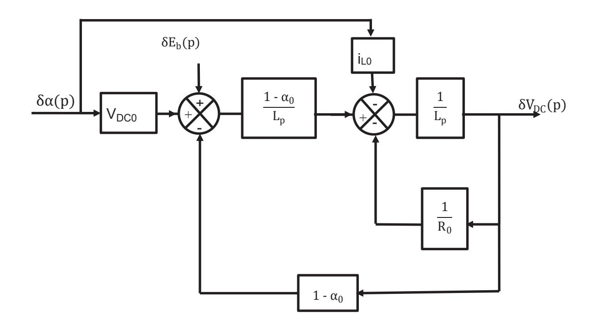

Dans ce schéma-bloc : { 
$$\begin{aligned} V_{DC0} &&= \frac{1}{1-\alpha_0}.\,E_{b0} \\ i_{L0} &&= \frac{1}{R_0(1-\alpha_0)^2}.\,E_{b0} \end{aligned}$$

 $\delta V_{DC}(p)$  peut se mettre sous la forme suivante :

 $\delta V_{DC}(p) = H_1(p) \cdot \delta E_b(p) + (H_2(p) \cdot V_{DC0} + H_3(p) \cdot i_{L0}) \cdot \delta \alpha(p)$ , où  $H_1(p), H_2(p)$  et  $H_3(p)$  sont trois fonctions de transfert à déterminer.

Pour faciliter la résolution, on utilise la méthode de superposition.

**Q37.** Montrer que pour  $\delta E_b(p) = 0$  on a :

$$\frac{\delta V_{DC}(p)}{\delta \alpha(p)} = \frac{(1 - \alpha_0) \cdot V_{DC0} \cdot L \cdot p \cdot i_{L0}}{(1 - \alpha_0)^2 + \frac{L}{R_0} \cdot p + L \cdot C \cdot p^2} \,, \, \text{en d\'eduire} \text{ les expressions de } H_2(p) \text{ et } H_3(p).$$

**Q38. En déduire** que 
$$\frac{\delta V_{DC}(p)}{\delta \alpha(p)} = \frac{E_{b0}}{(1-\alpha_0)^2} \cdot \frac{1 - \frac{L}{R_0 \cdot (1-\alpha_0)^2} \cdot p}{1 + \frac{L}{R_0 (1-\alpha_0)^2} \cdot p + \frac{LC}{(1-\alpha_0)^2} \cdot p^2}$$
.

**Q39.** Déterminer puis calculer la valeur finale de la tension du bus continu lorsque le rapport cyclique  $\alpha$  évolue de 1 % sous la forme d'un échelon.

On souhaite maintenant connaître le comportement du convertisseur pour une variation de la tension de la batterie. Dans cet objectif, la variation du rapport cyclique est nulle  $(\delta\alpha(p) = 0)$ .

**Q40. Montrer** que dans ce cas : 
$$\frac{\delta V_{DC}(p)}{\delta E_b(p)} = \frac{1}{(1-\alpha_0)} \cdot \frac{1}{1 + \frac{L}{R_0(1-\alpha_0)^2} \cdot p + \frac{LC}{(1-\alpha_0)^2} \cdot p^2}$$
. **Conclure** sur

la variation de la tension du bus continu suite à une variation de type échelon unitaire de la tension aux bornes de la batterie.

On a consigné sur le document technique DT12 la réponse du convertisseur CV3-1 lors d'une excitation de type échelon.

**Q41.** Exprimer  $\delta V_{DC}(p)$  dans le domaine de Laplace en prenant pour origine des temps  $t_0$  = 0,4 s. **Donner** la valeur de  $\alpha$  lors de cet essai. **Donner** en justifiant par un calcul la valeur finale de la tension du bus continu lors de cet essai.

**Q42. Analyser** de manière qualitative les difficultés de la mise en œuvre de la correction de ce système, avec en points de vigilance la stabilité, et la précision.

## Document technique DT1 : équipement type d'un foyer

| Appareils                  | Nombre |
|----------------------------|--------|
| Réfrigérateur              | 1      |
| Congélateur                | 1      |
| Four micro-onde            | 1      |
| Chargeur de smartphone     | 4      |
| Ordinateur de bureau       | 1      |
| Téléviseur LCD             | 1      |
| Lave linge                 | 1      |
| Fer à repasser             | 1      |
| Ampoule basse consommation | 10     |
| Autocuiseur                | 1      |

# Équipement type d'un gîte

| Appareils                  | Nombre |
|----------------------------|--------|
| Réfrigérateur              | 2      |
| Congélateur                | 2      |
| Four micro-onde            | 1      |
| Chargeur de smartphone     | 10     |
| Ordinateur de bureau       | 1      |
| Téléviseur LCD             | 1      |
| Lave linge                 | 1      |
| Fer à repasser             | 1      |
| Ampoule basse consommation | 20     |
| Autocuiseur                | 2      |
| Four                       | 1      |
| Lave vaisselle             | 1      |
| Sèche linge                | 1      |

#### **Document technique DT1 (suite) : consommation électrique des équipements**

| Appareils                       | Puissance de l'appareil (W) | Période d'utilisation | Fréquence d'utilisation | Consommation moyenne annuelle (kWh) |
|---------------------------------|--------------------------------------|--------------------------|----------------------------|----------------------------------------------|
| Réfrigérateur                   | 40 W                                 | 365 jours                | En continu                 | 350 kWh                                      |
| Congélateur                     | 130 W à 190 W                        | 365 jours                | En continu                 | 1 402 kWh                                    |
| Lave-vaisselle                  | 1 200 W                              | 48 semaines              | 5 fois par semaine      | 288 kWh                                      |
| Four à micro-ondes              | 1 300 W                              | 365 jours                | 5mn par jour               | 40 kWh                                       |
| Four                            | 2 000 W                              | 365 jours                | 30mn par jour           | 365 kWh                                      |
| Gaufrier                        | 800 W à 1 200 W                      | 15 jours                 | 1h par jour                | 15 kWh                                       |
| Aspirateur                      | 1 500 W                              | 52 semaines              | 2h par semaine          | 156 kWh                                      |
| Chargeur de smartphone          | 5 W                                  | 365 jours                | 1h par jour                | 2 kWh                                        |
| Ordinateur de bureau            | 90 W                                 | 365 jours                | 24h par jour               | 790 kWh                                      |
| Ordinateur portable             | 30 W                                 | 365 jours                | 2h par jour                | 22 kWh                                       |
| Téléviseur LCD                  | 100 W                                | 365 jours                | 3h par jour                | 110 kWh                                      |
| Lave-linge                      | 2 200 W                              | 48 semaines              | 4 fois par semaine      | 422 kWh                                      |
| Sèche-linge                     | 2 500 W                              | 32 semaines              | 2 fois par semaine      | 160 kWh                                      |
| Fer à repasser                  | 750 W                                | 48 semaines              | 5h par semaine          | 180 kWh                                      |
| Ampoule à incandescence      | 60 W                                 | 365 jours                | 5h par jour                | 110 kWh                                      |
| Ampoule à basse consommation | 12 W                                 | 365 jours                | 5h par jour                | 22 kWh                                       |
| Autocuiseur                     | 700 W                                | 365 jours                | 1h par jour                | 255 kWh                                      |

Source : https://www.lelynx.fr/energie/comparateur-electricite/consommation-electrique/appareils/

#### **Document technique DT2 : synoptique de l'installation**

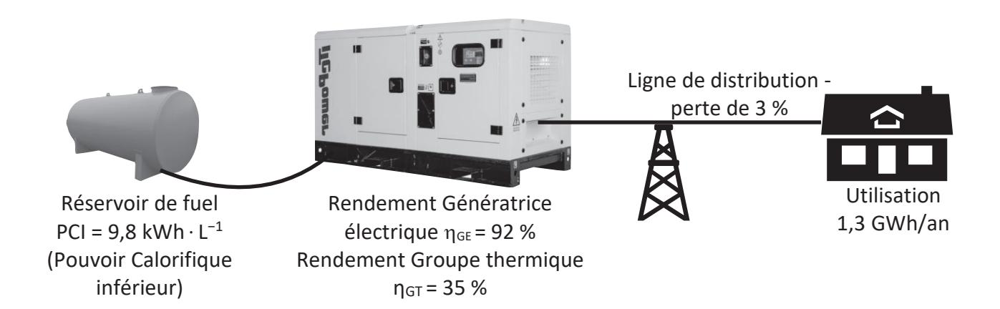

#### **Document technique DT3**

Les relevés d'irradiance notée sur deux jours (entre le 02/10/2021 à 00h00 et le 04/10/2021 à 00h00).

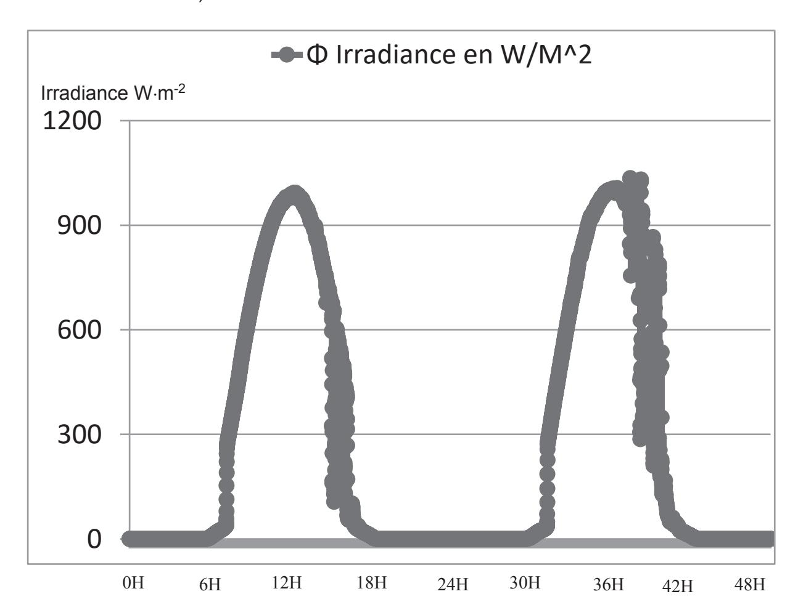

#### **Zoom sur la journée du 02/10/2021 de 7h28 à 7h31 donnant : Φ Irradiance en Wm-2 en fonction du temps**

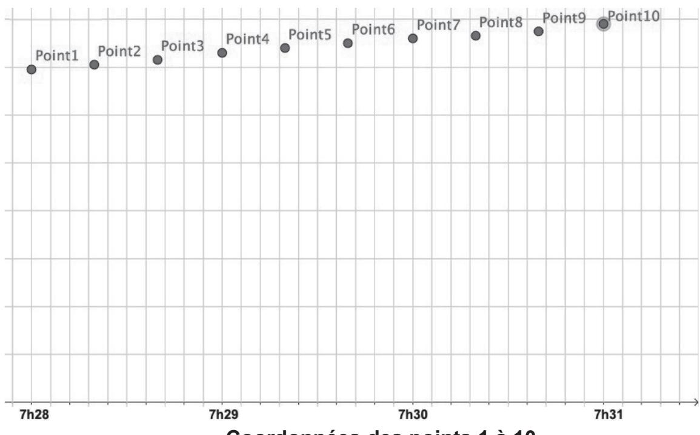

**Coordonnées des points 1 à 10**

|         | Dates et heures        | (Wm−2)  |
|---------|------------------------------|--------------|
| Point1  | 05/10/2021 ; 07h28     | 139          |
| Point2  |                              | 141          |
| Point3  |                              | 143          |
| Point4  | 05/10/2021 ; 07h29     | 146          |
| Point5  |                              | 148          |
| Point6  |                              | 150          |
| Point7  | 05/10/2021 ; 07h30     | 152          |
| Point8  |                              | 153          |
| Point9  |                              | 155          |
| Point10 | 05/10/2021 ; 07h 31 | 158          |

#### **Document technique DT5 : synoptique simplifié de l'installation**

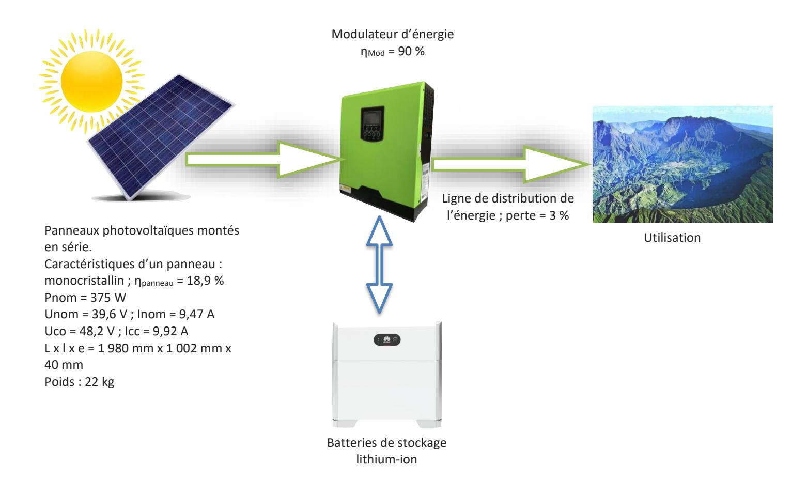

#### **Document technique DT6 : synoptique de l'installation**

#### **Document technique DT7 : caractéristiques du champ photovoltaïque**

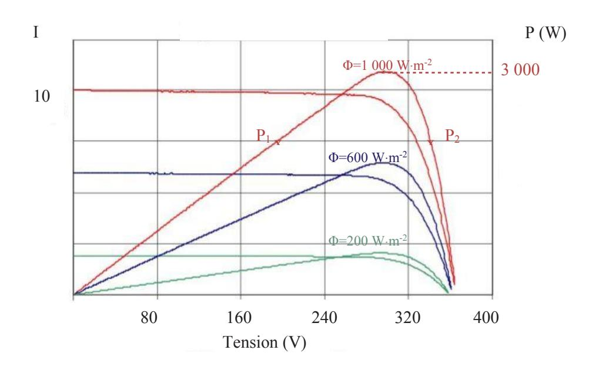

#### **Document technique DT8 : schéma de CV3-2**

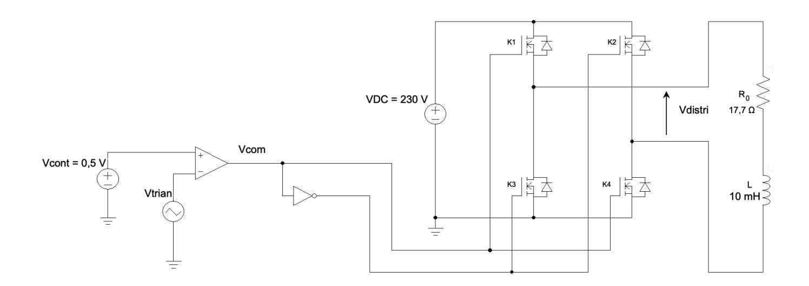

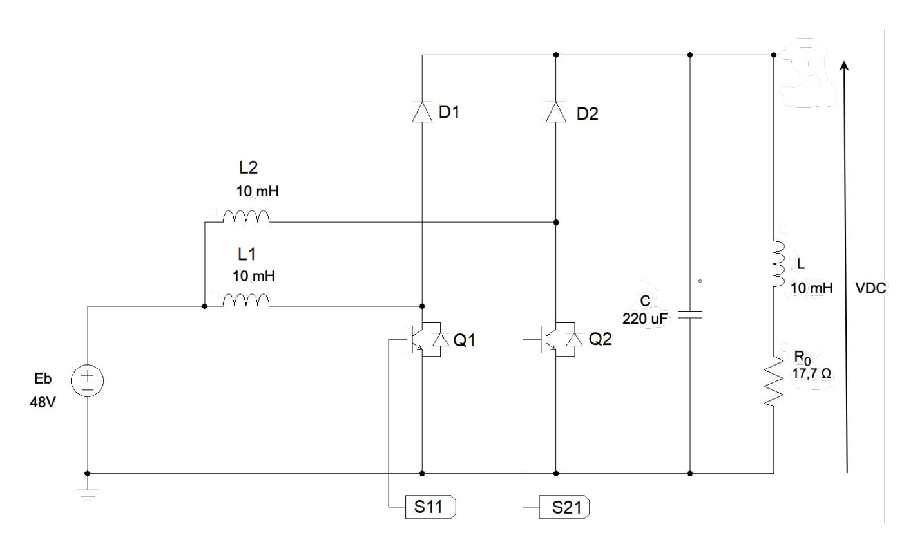

Les bornes S11 et S21 correspondent aux commandes de Q1 et Q2.

#### **Document technique DT10 : schéma de CV3-1 simplifié**

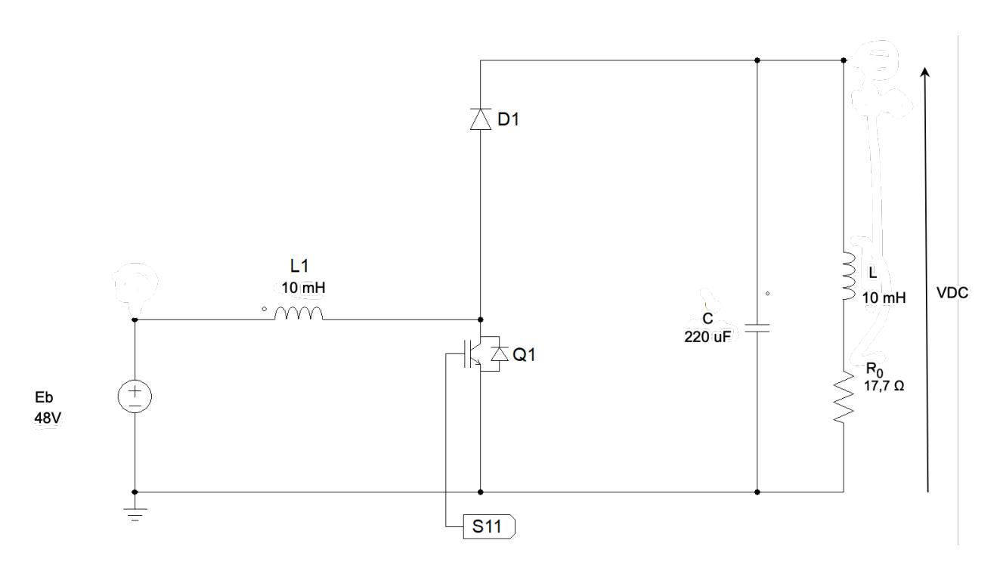

La borne S11 correspond à la commande de Q1.

#### **Document technique DT11 : allures des courants du convertisseur CV3-1**

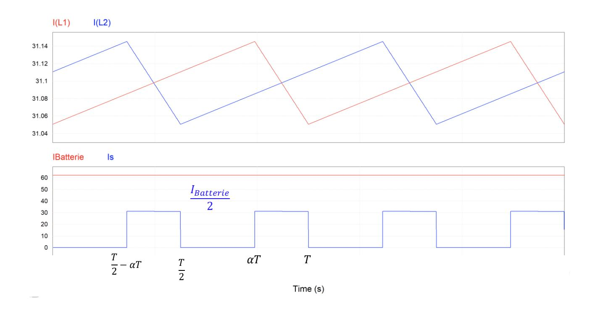

#### **Document technique DT12 : évolution de la tension d'une cellule de la batterie**

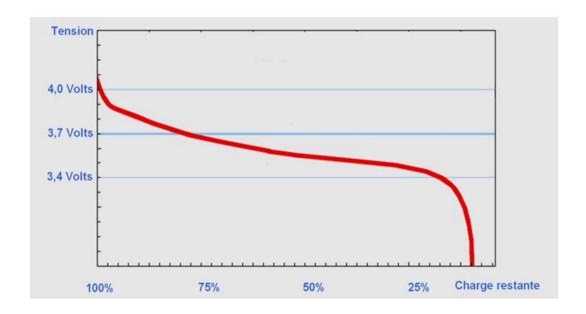

#### **Document technique DT13 : allure de la tension en sortie du convertisseur CV3-1**

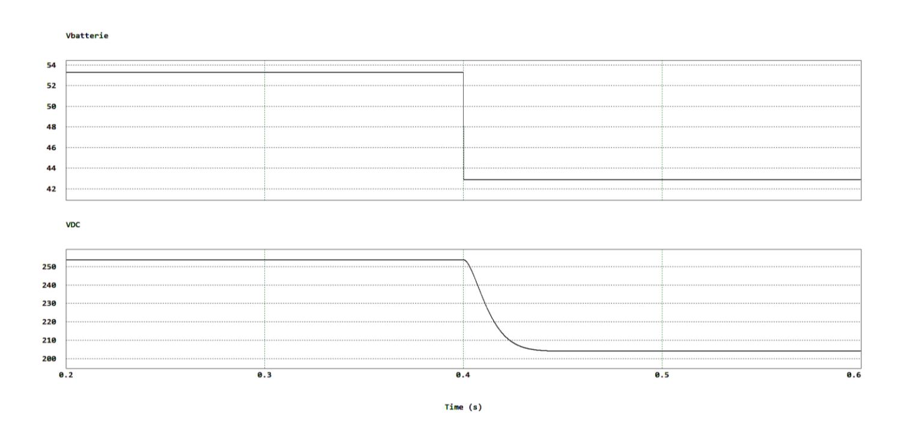

| Modèle CMEN v3                                                                                                                                         |                                                | $\overline{-}$ |  |  |  |
|--------------------------------------------------------------------------------------------------------------------------------------------------------|------------------------------------------------|----------------|--|--|--|
| Nom de famille : (Suivi, s'il y a lieu, du nom d'usage)                                                                                             |                                                |                |  |  |  |
| Prénom(s) :                                                                                                                                            |                                                |                |  |  |  |
| Numéro Candidat :                                                                                                                                   | Né(e) le :                                     |                |  |  |  |
| Cadre réservé aux candidats de co                                                                                                                      | cours de recrutement et examens professionnels | $\overline{}$  |  |  |  |
| Concours :                                                                                                                                             | Option / Section : N° d'inscription :          |                |  |  |  |
| Cocher une seule case parmi les six ty                                                                                                                 |                                                |                |  |  |  |
| □ externe □ 3° externe □ externe spécial □ interne ou 1° interne □ 2 nd interne □ 2 nd interne spécial □ interne spécial □ privé |                                                |                |  |  |  |
| Examen professionnel p                                                                                                                                 | our l'avancement au grade de :                 |                |  |  |  |
| Cadre réservé aux candidats d'exai                                                                                                                     | ens et du concours général                     |                |  |  |  |
| Examen :                                                                                                                                               | Série / Spécialité :                           |                |  |  |  |
| Epreuve - Matière :                                                                                                                                    | Session :                                      |                |  |  |  |

EDE ENE 1

## DR1 à DR6

Tous les documents réponses sont à rendre, même non complétés.

#### **NE RIEN ECRIRE DANS CE CADRE**

#### **Document Réponse DR1**

| Synthèse de la consommation annuelle d'un foyer |        |                                    |  |
|-------------------------------------------------|--------|------------------------------------|--|
| Appareils                                       | Nombre | Consommation totale annuelle (kWh) |  |
| Réfrigérateur                                   | 1      |                                    |  |
| Congélateur                                     | 1      |                                    |  |
| Four micro-onde                                 | 1      |                                    |  |
| Chargeur de smartphone                          | 4      |                                    |  |
| Ordinateur de bureau                            | 1      |                                    |  |
| Téléviseur LCD                                  | 1      |                                    |  |
| Lave-linge                                      | 1      |                                    |  |
| Fer à repasser                                  | 1      |                                    |  |
| Ampoule basse consommation                      | 10     |                                    |  |
| Autocuiseur                                     | 1      |                                    |  |
| Consommation totale                             |        |                                    |  |

| Synthèse de la consommation annuelle d'un gîte |        |                                    |  |
|------------------------------------------------|--------|------------------------------------|--|
| Appareils                                      | Nombre | Consommation totale annuelle (kWh) |  |
| Réfrigérateur                                  | 2      |                                    |  |
| Congélateur                                    | 2      |                                    |  |
| Four micro-onde                                | 1      |                                    |  |
| Chargeur de smartphone                         | 10     |                                    |  |
| Ordinateur de bureau                           | 1      |                                    |  |
| Téléviseur LCD                                 | 1      |                                    |  |
| Lave-linge                                     | 1      |                                    |  |
| Fer à repasser                                 | 1      |                                    |  |
| Ampoule basse consommation                     | 20     |                                    |  |
| Autocuiseur                                    | 2      |                                    |  |
| Four                                           | 1      |                                    |  |
| Lave-vaisselle                                 | 1      |                                    |  |
| Sèche-linge                                    | 1      |                                    |  |
| Consommation totale                            |        |                                    |  |

#### **Document Réponse DR2**

Déclaration des variables irrad : nombre réel. indice : nombre entier. Data : tableau. Commentaires

Data[1,2] retourne la valeur contenue dans la cellule ligne 1 colonne 2 du tableau Data

Début

Lire le fichier .csv en excluant la ligne 1 et stocker les valeurs dans Data

irrad = 0

Pour indice allant de 0 à la longueur du tableau Data Faire

irrad = irrad + {Data[indice,1] \* …………………………………………………)}

Fin Pour

………………………………………………………………………………………………..

Afficher la valeur de irrad

Fin

#### **Document réponse DR3 - Bilan énergétique pour 1 kg dihydrogène**

| Énergie fournie EEH = | Énergie pour 1 kg H2 EUH = | Énergie restituée Eres = |  |
|-----------------------------|----------------------------------|--------------------------------|--|
|                             |                                  |                                |  |

Pertes Electrolyseur = 24,85 kWh Pertes PAC = 16,45 kWh

#### **Document réponse DR4 - Noms et fonctions des convertisseurs d'énergie**

| Convertisseurs | Noms | Fonctions |
|----------------|------|-----------|
| CV1            |      |           |
| CV2            |      |           |
| CV3            |      |           |

#### Document réponse DR5 - Allure des tensions de CV3-2

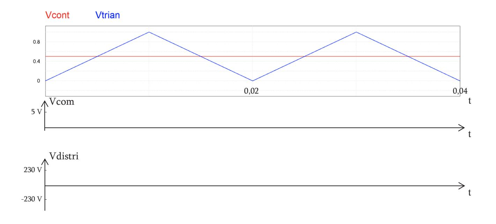

#### Document réponse DR6 - Commande des interrupteurs CV3-2

| Q1      | D1       | Possible/Impossible | Explication |
|---------|----------|---------------------|-------------|
| Bloqué  | Bloquée  |                     |             |
| Bloqué  | Passante |                     |             |
| Passant | Bloquée  |                     |             |
| Passant | Passante |                     |             |

| Modèle CMEN v3                                                                                                                                                                                                                                                                                                                                                                                                                                                                                                                                                                                                                                                                                                                                                                                                                                                                                                                                                                                                                                                                                                                                                                                                                                                                                                                                                                                                                                                                                                                                                                                                                                                                                                                                                                                                                                                                                                                                                                                                                                                                                                                 |                                               |  |  |  |  |
|--------------------------------------------------------------------------------------------------------------------------------------------------------------------------------------------------------------------------------------------------------------------------------------------------------------------------------------------------------------------------------------------------------------------------------------------------------------------------------------------------------------------------------------------------------------------------------------------------------------------------------------------------------------------------------------------------------------------------------------------------------------------------------------------------------------------------------------------------------------------------------------------------------------------------------------------------------------------------------------------------------------------------------------------------------------------------------------------------------------------------------------------------------------------------------------------------------------------------------------------------------------------------------------------------------------------------------------------------------------------------------------------------------------------------------------------------------------------------------------------------------------------------------------------------------------------------------------------------------------------------------------------------------------------------------------------------------------------------------------------------------------------------------------------------------------------------------------------------------------------------------------------------------------------------------------------------------------------------------------------------------------------------------------------------------------------------------------------------------------------------------|-----------------------------------------------|--|--|--|--|
| Nom de famille (Suivi, s'il y a lieu, du nom d'usage)                                                                                                                                                                                                                                                                                                                                                                                                                                                                                                                                                                                                                                                                                                                                                                                                                                                                                                                                                                                                                                                                                                                                                                                                                                                                                                                                                                                                                                                                                                                                                                                                                                                                                                                                                                                                                                                                                                                                                                                                                                                                       |                                               |  |  |  |  |
| Prénom(s)                                                                                                                                                                                                                                                                                                                                                                                                                                                                                                                                                                                                                                                                                                                                                                                                                                                                                                                                                                                                                                                                                                                                                                                                                                                                                                                                                                                                                                                                                                                                                                                                                                                                                                                                                                                                                                                                                                                                                                                                                                                                                                                      |                                               |  |  |  |  |
| Numéro Candidat                                                                                                                                                                                                                                                                                                                                                                                                                                                                                                                                                                                                                                                                                                                                                                                                                                                                                                                                                                                                                                                                                                                                                                                                                                                                                                                                                                                                                                                                                                                                                                                                                                                                                                                                                                                                                                                                                                                                                                                                                                                                                                             | Né(e) le :                                    |  |  |  |  |
| Cadre réservé aux candidats de                                                                                                                                                                                                                                                                                                                                                                                                                                                                                                                                                                                                                                                                                                                                                                                                                                                                                                                                                                                                                                                                                                                                                                                                                                                                                                                                                                                                                                                                                                                                                                                                                                                                                                                                                                                                                                                                                                                                                                                                                                                                                                 | ours de recrutement et examens professionnels |  |  |  |  |
| Concours: Option / Section: Cocher une seule case parmi les six types de concours suivants:    externe   3° externe   externe spécial   interne ou 1er interne   2nd interne   2nd interne spécial   public   privé   public   privé   public   privé   public   privé   public   privé   public   privé   public   privé   public   privé   public   privé   public   privé   public   privé   public   privé   public   privé   public   privé   public   privé   public   privé   public   privé   public   privé   public   privé   public   privé   public   privé   public   privé   public   privé   public   privé   public   privé   public   privé   public   privé   public   privé   public   privé   public   privé   public   privé   public   privé   public   privé   public   privé   public   privé   public   privé   public   privé   public   privé   public   privé   public   privé   public   privé   public   privé   public   privé   public   privé   public   privé   public   privé   public   privé   public   privé   public   privé   public   privé   public   privé   public   privé   public   privé   public   privé   public   privé   public   privé   public   privé   public   privé   public   privé   public   privé   public   privé   public   privé   public   privé   public   privé   privé   privé   privé   privé   privé   privé   privé   privé   privé   privé   privé   privé   privé   privé   privé   privé   privé   privé   privé   privé   privé   privé   privé   privé   privé   privé   privé   privé   privé   privé   privé   privé   privé   privé   privé   privé   privé   privé   privé   privé   privé   privé   privé   privé   privé   privé   privé   privé   privé   privé   privé   privé   privé   privé   privé   privé   privé   privé   privé   privé   privé   privé   privé   privé   privé   privé   privé   privé   privé   privé   privé   privé   privé   privé   privé   privé   privé   privé   privé   privé   privé   privé   privé   privé   privé   privé   privé   privé   privé   privé   privé   privé   privé   privé   privé   p |                                               |  |  |  |  |
| Cadre réservé aux candidats d'e.                                                                                                                                                                                                                                                                                                                                                                                                                                                                                                                                                                                                                                                                                                                                                                                                                                                                                                                                                                                                                                                                                                                                                                                                                                                                                                                                                                                                                                                                                                                                                                                                                                                                                                                                                                                                                                                                                                                                                                                                                                                                                               | ens et du concours général                    |  |  |  |  |
| Examen : Série / Spécialité :                                                                                                                                                                                                                                                                                                                                                                                                                                                                                                                                                                                                                                                                                                                                                                                                                                                                                                                                                                                                                                                                                                                                                                                                                                                                                                                                                                                                                                                                                                                                                                                                                                                                                                                                                                                                                                                                                                                                                                                                                                                                                                  |                                               |  |  |  |  |
| Epreuve - Matière :                                                                                                                                                                                                                                                                                                                                                                                                                                                                                                                                                                                                                                                                                                                                                                                                                                                                                                                                                                                                                                                                                                                                                                                                                                                                                                                                                                                                                                                                                                                                                                                                                                                                                                                                                                                                                                                                                                                                                                                                                                                                                                            | Session:                                      |  |  |  |  |

EDE ENE 1

## **DR7 - DR8**

Tous les documents réponses sont à rendre, même non complétés.

# NE RIEN ECRIRE DANS CE CADRE

#### Document réponse DR7 - Structure de CV3-2

#### Document réponse DR8 - Allures des grandeurs de CV3-2

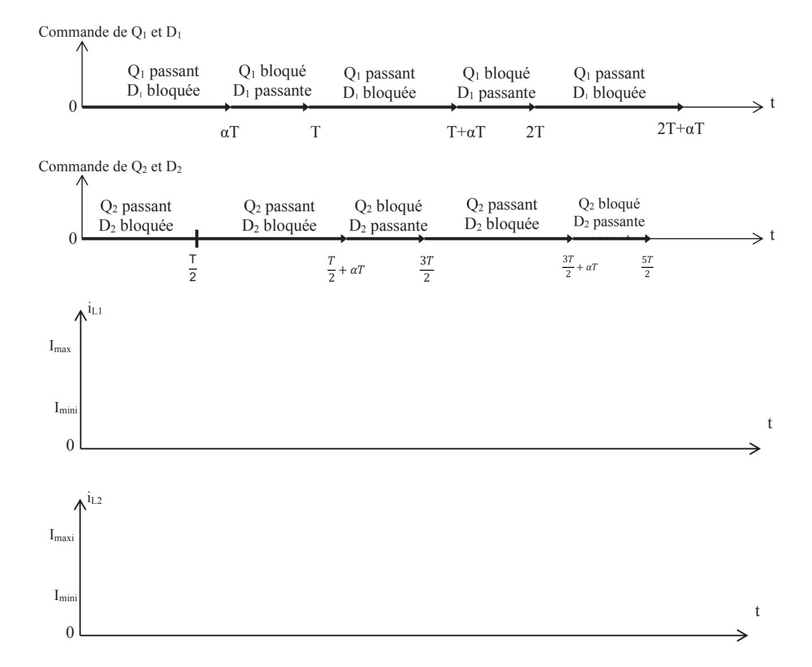