# **Concours de recrutement du second degré Rapport de jury**

**Concours : CAPET externe et CAFEP**

**Section : sciences industrielles de l'ingénieur**

**Options :** ingénierie des constructions, ingénierie électrique, ingénierie informatique, ingénierie mécanique.

**Session 2019**

Rapport de jury présenté par : Jean-Michel SCHMITT Président du jury

# **Sommaire**

| Avant-propos                                                                                                                    | 4        |
|---------------------------------------------------------------------------------------------------------------------------------|----------|
| Résultats statistiques                                                                                                          | 8        |
| Épreuve d'admissibilité :<br>« Analyse et exploitation pédagogique d'un système pluritechnique »                                |          |
| Éléments de correction<br>Rapport du jury                                                                                       | 12<br>25 |
| Épreuve d'admissibilité :<br>« Étude d'un système, d'un procédé ou d'une organisation »                                         |          |
| Éléments de correction pour l'option ingénierie des constructions<br>Rapport du jury pour l'option ingénierie des constructions | 29<br>45 |
| Éléments de correction pour l'option ingénierie électrique<br>Rapport du jury pour l'option ingénierie électrique               | 49<br>55 |
| Éléments de correction pour l'option ingénierie informatique<br>Rapport du jury pour option ingénierie informatique             | 57<br>70 |
| Éléments de correction pour l'option ingénierie mécanique<br>Rapport du jury pour l'option ingénierie mécanique                 | 73<br>81 |
| Épreuve d'admission : « Mise en situation professionnelle »                                                                     |          |
| Exemple de sujet<br>Rapport du jury                                                                                             | 84<br>94 |
| Épreuve d'admission : « Entretien à partir d'un dossier »                                                                       | 101      |
| Rapport sur la transmission des valeurs et principes de la République                                                           | 108      |

**Le rapport est rédigé sous la responsabilité du président de jury**

La réunion préparatoire à cette session 2019 du CAPET externe et CAFEP de sciences industrielles de l'ingénieur et la réunion d'admissibilité se sont déroulées au lycée Fénelon à Paris. Les épreuves d'admission se sont déroulées du 24 juin au 1 er juillet 2019 dans de très bonnes conditions au lycée Franklin Roosevelt à Reims.

Les membres du jury adressent de vifs remerciements aux proviseurs de ces établissements et à leurs directeurs délégués aux formations professionnelles et technologiques ainsi qu'à leurs collaborateurs pour l'accueil chaleureux qui leur a été réservé.

#### **Avant-propos**

Pour cette session 2019, les épreuves d'admissibilité étaient très classiques. Par conséquent, j'insisterai plus dans cet avant-propos sur les épreuves d'admission. Plus généralement, les remarques et conseils prodigués les années précédentes restent d'actualité afin de bien préparer la session 2020.

En effet, il est utile de rappeler que le CAPET a pour objectif de répondre à la demande de l'État employeur qui souhaite recruter des professeurs. Les compétences pédagogiques sont vérifiées lors de l'épreuve commune d'admissibilité et lors des épreuves d'admission. Ainsi, il est indispensable de s'y préparer dès l'inscription au concours, en assistant dans plusieurs lycées et collèges à des séances en présence d'élèves et en échangeant avec des professeurs chevronnés qui maîtrisent la didactique des sciences industrielles de l'ingénieur. Cette immersion en établissements scolaires permet aussi d'observer les évolutions de la pédagogie, le travail, l'implication et la réactivité des élèves et ainsi d'actualiser ses connaissances du système éducatif.

Les futurs candidats devront, au cours de leur préparation au concours, mener les réflexions nécessaires à la mise en place d'une progression pédagogique par cycle, progression devant être élaborée dans le cadre d'une évaluation par compétences. Ils doivent se concentrer sur les objectifs des différentes séquences de collège et de lycée, et imaginer les stratégies pédagogiques et didactiques à mettre en œuvre pour faire acquérir aux élèves les compétences visées par les différents programmes. Le jury attend la description précise de la séquence inscrite dans une progression pédagogique, de ses attendus, de l'organisation de la séance présentée par le candidat, ainsi que la justification des choix faits pour chacun de ces points. Bien évidemment, dans un souci d'efficacité, en plus des réflexions précédentes, les candidats doivent vraiment s'appuyer sur leur expérience professionnelle pour intégrer à leur exposé la différenciation pédagogique, l'évaluation des compétences et des connaissances associées, la remédiation et l'accompagnement personnalisé dans les contenus pédagogiques présentés.

Les principales compétences attendues sont :

- Compétences disciplinaires et didactiques
  - o Identifier des sources d'informations fiables et pertinentes
  - o Maintenir une veille sur les nouvelles ressources disciplinaires et pédagogiques
  - o Savoir préparer des séquences pédagogiques précisant les compétences et les objectifs attendus, et mettant en place une stratégie pédagogique pertinente
  - o Analyser les besoins, progrès et acquis des élèves
  - o Communiquer aux élèves et aux parents les objectifs, critères et résultats des évaluations
  - o Intégrer les évolutions du numérique dans ses pratiques pédagogiques
  - o Contextualiser les apprentissages pour leur donner un sens et faciliter leur appropriation par les élèves
  - o Adapter son enseignement et son action éducative à la diversité des élèves
  - o Savoir composer des groupes d'élèves pour organiser la classe
  - o Organiser et gérer des groupes d'élèves dans des activités de projet
  - o Déceler les signes du décrochage scolaire
- Compétences éthiques et déontologiques
  - o Etre conscient de la relativité de ses savoirs

- o Aider les élèves à développer leur esprit critique et à distinguer les savoirs, les opinions et les croyances
- o Aider les élèves à savoir argumenter et respecter le point de vue des autres
- o Se mobiliser et mobiliser les élèves contre les stéréotypes et les discriminations
- o Participer à l'éducation aux usages responsables du numérique

#### Compétences relationnelles

- o Adopter une démarche d'écoute active
- o Participer à la conception et à la mise en œuvre de projets collectifs disciplinaires et éducatifs
- o Gérer les conflits
- o Travailler en équipe
- o Installer avec les élèves une relation de confiance et de bienveillance
- o Savoir conduire un entretien, animer une réunion
- Compétences pédagogiques et éducatives
  - o Maintenir une veille sur les recherches des différentes formes et pratiques pédagogiques et éducatives
  - o Connaitre les processus d'apprentissage
  - o Proposer des processus d'apprentissage innovants
  - o Contribuer à la mise en place de projets interdisciplinaires
- Compétences de communication
  - o Intégrer dans son activité l'objectif de maîtrise de la langue orale et écrite
  - o Utiliser les technologies du numérique pour échanger et se former
  - o Maitriser au moins une langue vivante au niveau B2
  - o Mettre en place du travail collaboratif
- Compétences d'analyse et d'adaptation de son action
  - o Exercer son analyse critique, seul ou entre pairs, de ses propres pratiques professionnelles
  - o Identifier ses besoins de formation
  - o Etre capable de rechercher les supports de son enseignement dans le milieu économique et d'en extraire des exploitations pédagogiques pertinentes

J'invite les futurs candidats et leurs formateurs à apporter une attention particulière à la préparation des épreuves demandant une approche pédagogique.

Les épreuves d'admission ont pour objectif de valider les compétences scientifiques, technologiques, expérimentales, pédagogiques et didactiques des candidats.

Pour la première épreuve d'admission, la séquence pédagogique à présenter est liée aux activités pratiques réalisées lors de la première phase de l'épreuve ; elle est relative aux enseignements de technologie au collège ou aux enseignements technologiques du cycle terminal « sciences et technologies de l'industrie et du développement durable (STI2D) » ou bien aux sciences de l'ingénieur de la voie générale du lycée. Le niveau de cette séquence est imposé aux candidats. Par conséquent, ces derniers devront se préparer à être confrontés à l'une des trois situations d'enseignement précisées ci-dessus. Il est donc indispensable que les candidats se soient approprié les programmes du collège et du lycée, et surtout se soient imprégné de la philosophie des enseignements, en, je le rappelle, se déplaçant directement dans des établissements scolaires pour échanger avec des enseignants sur leurs pratiques pédagogiques et pour prendre connaissance de la réalité des plateaux techniques : organisation du laboratoire, quantités et types de supports didactiques et de postes informatiques mis à la disposition des élèves.

Le jury a été surpris de constater que certains candidats n'avaient pas lu les programmes correspondants aux exigences de l'épreuve, pourtant facilement accessibles par Internet. Cette désinvolture a souvent entraîné des notes qui ne permettent pas d'être reçu à ce concours.

Le jury a été également surpris de constater que de nombreux candidats ne maîtrisaient pas les différentes démarches : investigation, résolution de problème technique et démarche de projet.

Trop souvent, la démarche d'investigation se résume à une recherche sur documents. Ces démarches suivent des schémas qui leur sont propres et prédéfinis, elles sont illustrées dans les documents d'accompagnements disponibles sur Eduscol. Le jury encourage les candidats à se familiariser avec ces démarches et ainsi les ré exploiter avec efficience lors de la présentation de la séquence et des séances. Ces conseils concernent également la seconde épreuve d'admission.

La première épreuve d'admission est une épreuve longue qui nécessite également une bonne gestion du temps afin que l'exposé ne porte pas que sur la partie TP qui a déjà été évaluée, mais essentiellement sur la présentation de la séquence au niveau demandé.

Depuis la session 2017, que ce soit à l'agrégation ou au CAPET, à l'externe comme à l'interne, il existe une option ingénierie informatique et surtout un programme d'informatique pour toutes les options de ces concours. Les compétences liées à ce programme sont par conséquent également évaluées. Le jury conseille aux futurs candidats de ne surtout pas faire l'impasse sur l'informatique qui tient dorénavant une place non négligeable dans les programmes de technologie au collège, des enseignements technologiques du cycle terminal « sciences et technologies de l'industrie et du développement durable (STI2D) » et des sciences de l'ingénieur de la voie générale du lycée. La prochaine session prendra en compte la réforme du lycée mise en place à la rentrée 2019.

La réussite aux épreuves ne s'improvise pas. Il faut s'y préparer avec rigueur dès l'inscription au concours.

Pour les épreuves d'admission, l'accès à l'Internet est autorisé afin que les candidats soient dans les conditions du métier qu'ils envisagent d'exercer. Mais, cela ne doit pas masquer la réflexion, la cohérence, l'appréciation du niveau des élèves et la précision pédagogique dans les explications qui sont des qualités précieuses pour un futur enseignant.

La description des épreuves des concours précise que « *L'entretien qui succède à la présentation du candidat permet au jury d'approfondir les points qu'il juge utiles. Il permet en outre d'apprécier la capacité du candidat à prendre en compte les acquis et les besoins des élèves, à se représenter la diversité des conditions d'exercice de son métier futur, à en connaître de façon réfléchie le contexte dans ses différentes dimensions (classe, équipe éducative, établissement, institution scolaire, société) et les valeurs qui le portent, dont celles de la République* ». Le ministère de l'Éducation nationale a demandé à tous les présidents des concours de recrutement « *de veiller à ce que dans ce cadre, les thématiques de la laïcité et de la citoyenneté trouvent toute leur place* » afin « *que l'École soit en mesure, par la formation et le recrutement de nos futurs enseignants, de valider la mission première que lui fixe la Nation, à savoir de transmettre et de faire partager aux élèves les valeurs et principes de la République ainsi que l'ensemble des dispositions de la Charte de la laïcité, portant notamment égale dignité de tous les êtres humains et liberté de conscience de chacun ».*

Cette demande a été prise en compte pour les épreuves d'admission. Le comportement des candidats face aux questions du jury, sur ces sujets particulièrement sensibles, a donné globalement satisfaction. Des informations sur les questions posées et quelques conseils aux futurs candidats sont donnés dans ce rapport.

Dans toutes les épreuves, le jury attend des candidats une expression écrite et orale irréprochable. Le CAPET est un concours exigeant qui impose de la part des candidats un comportement et une présentation exemplaires. Le jury reste vigilant sur ce dernier aspect et invite les candidats à avoir une tenue adaptée aux circonstances particulières d'un concours de recrutement de cadres de catégorie A de la fonction publique.

Pour cette session, le jury est globalement satisfait des prestations des candidats. Il regrette cependant que des candidats admissibles ne se soient pas présentés à la session d'admission. Cela étant, il conseille aux futurs candidats de lire attentivement ce rapport, de s'imprégner de la didactique de la discipline et de la méthode pour élaborer une séquence pédagogique et d'avoir étudié les programmes du collège, de STI2D et de sciences de l'ingénieur de la voie générale du lycée.

J'espère sincèrement que ce rapport sera très utile aux futurs candidats du CAPET externe SII et du CAFEP SII.

> Jean-Michel SCHMITT Président du jury

# **Résultats statistiques**

# **Option ingénierie des constructions**

# **CAPET**

| Inscrits | Nombre<br>de<br>postes | Présents aux<br>deux<br>épreuves<br>d'admissibilité | Admissibles | Présents aux<br>deux épreuves<br>d'admission | Admis |
|----------|------------------------|-----------------------------------------------------|-------------|----------------------------------------------|-------|
| 188      | 48                     | 63                                                  | 52          | 39                                           | 26    |

| Moyenne obtenue par le premier candidat admissible | 17,08 |
|----------------------------------------------------|-------|
| Moyenne obtenue par le dernier candidat admissible | 5,74  |
| Moyenne obtenue par le premier candidat admis      | 15,9  |
| Moyenne obtenue par le dernier candidat admis      | 8     |

| Inscrits | Nombre<br>de<br>postes | Présents aux<br>deux<br>épreuves<br>d'admissibilité | Admissibles | Présents aux<br>deux<br>épreuves<br>d'admission | Admis |
|----------|------------------------|-----------------------------------------------------|-------------|-------------------------------------------------|-------|
| 41       | 3                      | 16                                                  | 7           | 6                                               | 3     |

| Moyenne obtenue par le premier candidat admissible | 15,38 |
|----------------------------------------------------|-------|
| Moyenne obtenue par le dernier candidat admissible | 10,15 |
| Moyenne obtenue par le premier candidat admis      | 16,15 |
| Moyenne obtenue par le dernier candidat admis      | 14,21 |

# **Option ingénierie électrique**

# **CAPET**

| Inscrits | Nombre<br>de<br>postes | Présents aux<br>deux<br>épreuves<br>d'admissibilité | Admissibles | Présents aux<br>deux épreuves<br>d'admission | Admis |
|----------|------------------------|-----------------------------------------------------|-------------|----------------------------------------------|-------|
| 332      | 45                     | 119                                                 | 88          | 65                                           | 45    |

| Moyenne obtenue par le premier candidat admissible | 19,04 |
|----------------------------------------------------|-------|
| Moyenne obtenue par le dernier candidat admissible | 5,82  |
| Moyenne obtenue par le premier candidat admis      | 17,66 |
| Moyenne obtenue par le dernier candidat admis      | 8,48  |

| Inscrits | Nombre<br>de<br>postes | Présents aux<br>deux<br>épreuves<br>d'admissibilité | Admissibles | Présents aux<br>deux<br>épreuves<br>d'admission | Admis |
|----------|------------------------|-----------------------------------------------------|-------------|-------------------------------------------------|-------|
| 72       | 3                      | 32                                                  | 7           | 6                                               | 3     |

| Moyenne obtenue par le premier candidat admissible | 17,13 |
|----------------------------------------------------|-------|
| Moyenne obtenue par le dernier candidat admissible | 11,54 |
| Moyenne obtenue par le premier candidat admis      | 15,78 |
| Moyenne obtenue par le dernier candidat admis      | 14,21 |

# **Option ingénierie informatique**

# **CAPET**

| Inscrits | Nombre<br>de<br>postes | Présents aux<br>deux<br>épreuves<br>d'admissibilité | Admissibles | Présents aux<br>deux épreuves<br>d'admission | Admis |
|----------|------------------------|-----------------------------------------------------|-------------|----------------------------------------------|-------|
| 270      | 61                     | 90                                                  | 70          | 56                                           | 39    |

| Moyenne obtenue par le premier candidat admissible | 15,13 |
|----------------------------------------------------|-------|
| Moyenne obtenue par le dernier candidat admissible | 5,87  |
| Moyenne obtenue par le premier candidat admis      | 17,3  |
| Moyenne obtenue par le dernier candidat admis      | 8     |

| Inscrits | Nombre<br>de<br>postes | Présents aux<br>deux<br>épreuves<br>d'admissibilité | Admissibles | Présents aux<br>deux<br>épreuves<br>d'admission | Admis |
|----------|------------------------|-----------------------------------------------------|-------------|-------------------------------------------------|-------|
| 68       | 3                      | 25                                                  | 8           | 7                                               | 3     |

| Moyenne obtenue par le premier candidat admissible | 14,86 |
|----------------------------------------------------|-------|
| Moyenne obtenue par le dernier candidat admissible | 10,46 |
| Moyenne obtenue par le premier candidat admis      | 15,26 |
| Moyenne obtenue par le dernier candidat admis      | 14,46 |

# **Option ingénierie mécanique**

# **CAPET**

| Inscrits | Nombre<br>de<br>postes | Présents aux<br>deux<br>épreuves<br>d'admissibilité | Admissibles | Présents aux<br>deux épreuves<br>d'admission | Admis |
|----------|------------------------|-----------------------------------------------------|-------------|----------------------------------------------|-------|
| 368      | 83                     | 154                                                 | 121         | 96                                           | 73    |

| Moyenne obtenue par le premier candidat admissible | 17,94 |
|----------------------------------------------------|-------|
| Moyenne obtenue par le dernier candidat admissible | 5,93  |
| Moyenne obtenue par le premier candidat admis      | 18,43 |
| Moyenne obtenue par le dernier candidat admis      | 8     |

| Inscrits | Nombre<br>de<br>postes | Présents aux<br>deux<br>épreuves<br>d'admissibilité | Admissibles | Présents aux<br>deux<br>épreuves<br>d'admission | Admis |
|----------|------------------------|-----------------------------------------------------|-------------|-------------------------------------------------|-------|
| 83       | 3                      | 37                                                  | 7           | 6                                               | 3     |

| Moyenne obtenue par le premier candidat admissible | 17,23 |
|----------------------------------------------------|-------|
| Moyenne obtenue par le dernier candidat admissible | 13,29 |
| Moyenne obtenue par le premier candidat admis      | 17,72 |
| Moyenne obtenue par le dernier candidat admis      | 15,13 |

# **Éléments de correction de l'épreuve d'admissibilité « analyse et exploitation pédagogique d'un système pluritechnique »**

#### **Question 1**

La masse supplémentaire à gérer avec ces modifications est de 201 kg.

#### **Question 2**

L'augmentation possible de la masse est de 10 % soit: 1800 ∙ 0,1 = 180 kg < 201 : il y a 21 kg de trop. Pour alléger l'ensemble suspendu, on peut envisager de remplacer des matériaux constitutifs par des matériaux à masse volumique plus faible (alliage d'aluminium au lieu d'acier…), la diminution de la taille de la cabine, la diminution du nombre de passagers dans la cabine, la réduction de la surface vitrée, etc.

#### **Question 3**

Les conditions s'écrivent

A : Eint\_calcule < 0,95 ∙ 2000 ou encore Eint\_calcule < (1 – flexibilite) ∙ seuil. B : Eint\_calcule > 1,05 ∙ 2000 ou encore Eint\_calcule > (1 + flexibilite) ∙ seuil.

## **Question 4**

indicateur\_0 = mesures [0][1] / mesures[0][2].

#### **Question 5**

Cet indicateur est le rapport de la tension sur l'intensité.

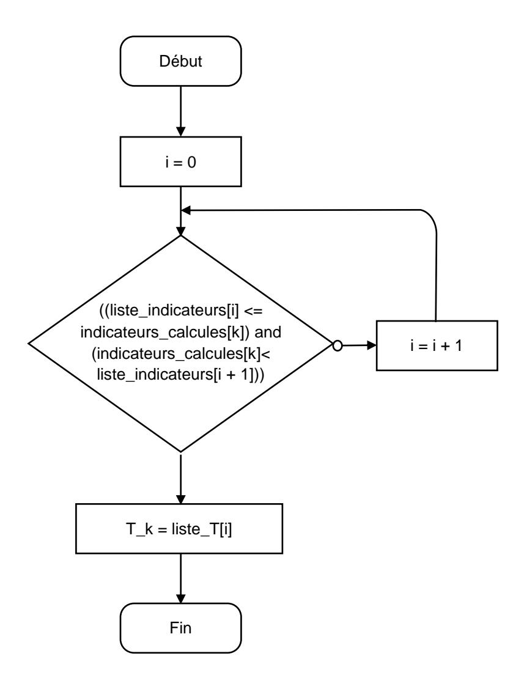

L'éclairement intérieur étant la somme des éclairements des vitrages, on a  $E_{\text{int}} = \sum_{k=0}^{3} E_{rk} \times TL_k$ .

Le code attendu s'écrit :

| En Python :      | Eint = 0                                                                   |
|------------------|----------------------------------------------------------------------------|
|                  | for k in range(4):                                                         |
|                  | Eint = Eint + mesures[k][0] * T_calcules[k]                                |
|                  | return Eint                                                                |
| En C++ :         | float Eint = 0;                                                            |
|                  | for (k = 0; k < 4; k = k + 1) Eint = Eint + mesures[k][0] * T_calcules[k]; |
|                  | return Eint ;                                                              |
| En pseudo-code : | Eint ← 0                                                                   |
|                  | Pour k de 0 à 3 faire                                                      |
|                  | Eint ← Eint + mesures[k][0] * T_calcules[k]                                |
|                  | Renvoyer Eint                                                              |

Le facteur solaire peut descendre jusqu'à 0,05 environ. Par conséquent, le rayonnement solaire est diminué de 95 % (> 90 %). Ainsi, avec une gestion automatisée de la teinte des vitrages, l'exigence id 1.4.1 est respectée.

#### **Question 8**

En travaillant avec le modèle électrique équivalent, on peut écrire directement :

$$R_{eq} = 2 \cdot R_v + R_a = 2 \cdot \frac{e_v}{\lambda_v} + \frac{e_v k}{\lambda_k}$$
.

#### **Question 9**

La relation précédente implique :  $\frac{e_{eq}}{\lambda_{eq}} = 2\frac{e_v}{\lambda_v} + \frac{e_k}{\lambda_k}$  d'où  $\lambda_{eq} = \frac{2e_v + e_k}{2\frac{e_v}{\lambda_v} + \frac{e_k}{\lambda_v}}$ .

A.N.: 
$$\lambda_{eq} = 0.0134 \text{ W} \cdot \text{m}^{-1} \cdot \text{K}^{-1}$$
.

#### **Question 10**

On considère le plafond, le plancher, les quatre faces, les montants ramenés à deux surfaces de matériaux traversées par deux flux de chaleur, ce qui donne :

$$\phi_{tot} = \sum_{i} \phi_{i} = \sum_{i} \frac{\lambda_{i} \cdot S_{i}}{e_{i}} \cdot (T_{ext} - T_{int}) = (\frac{\lambda_{eq} \cdot S_{v}}{e_{eq}} + \frac{\lambda_{p} \cdot S_{p}}{e_{p}}) \cdot (T_{ext} - T_{int}).$$

D'où 
$$A = \frac{\lambda_{eq} \cdot S_v}{e_{eq}} + \frac{\lambda_p \cdot S_p}{e_p}$$

Par analogie électrique, on retrouve :  $A = \frac{1}{R_{tot}} = \frac{1}{R_{eq}} + \frac{1}{R_p} = \frac{\lambda_{eq} \cdot S_v}{e_{eq}} + \frac{\lambda_p \cdot S_p}{e_p}$ .

A.N.: 
$$A = \frac{0.013 \cdot 10}{0.024} + \frac{0.025 \cdot 9}{0.045} = 5.416 + 5 = 10.42 \text{ W} \cdot \text{K}^{-1}$$
.

#### **Question 11**

La durée du trajet entre les gares T2 et T3A s'écrit :  $t_{23} = \frac{I_{23}}{V_0}$   $t_{23} = \frac{2160}{5} = 432 \text{ s} = 7.2 \text{ min}$ .

A.N.: 
$$t_{23} = \frac{2160}{5} = 432 \text{ s} = 7.2 \text{ min}$$
.

T2 et T3A sont les gares les plus éloignées l'une de l'autre, ce qui permet d'obtenir le temps de trajet le plus long et de simuler le cas le plus défavorable.

Malgré l'isolation, la température intérieure augmente rapidement à partir de la valeur initiale de 25 °C ; cela s'explique principalement par l'apport thermique des passagers.

En fin de trajet, la température atteint près de 55 °C, ce qui n'est pas acceptable et ne respecte pas l'exigence 1.4.4.1.

#### **Question 13**

Avec la climatisation, la température intérieure reste stable à une valeur très proche de la température initiale et de celle de la consigne de 25 °C.

Après une très courte phase de démarrage et en l'absence de perturbations, la puissance frigorifique nécessaire au maintien de la température à 25 °C se stabilise à une valeur de -1442,2 W.

#### **Question 14**

Le paramètre modifié entre les deux simulations est la puissance frigorifique de la climatisation Pmax. Elle passe de -2 000 W dans la première situation à -3 000 W dans la deuxième.

La climatisation 2 est choisie car elle permet d'abaisser la température intérieure de -6 °C en moins d'une minute conformément à ce qui est attendu.

Il faudra donc équiper la cabine avec une climatisation d'une puissance frigorifique de 3 000 W.

#### **Question 15**

Avec des batteries au lithium, la recharge s'effectue la nuit, ce qui permet d'avoir, sur 10 ans d'exploitation, un nombre de recharges qui s'élève à :  $365 \cdot 10 = 3650 > 2000$ .

Avec les super condensateurs, la recharge est faite à chaque passage en gare, ce qui donne sur une

journée de 20 heures : 
$$\frac{20 \cdot 60}{(5+1)}$$
 = 200 recharges et sur 10 ans :  $200 \cdot 365 \cdot 10$  = 730 000 < 1000 000 .

Le choix s'est porté sur les super condensateurs car les batteries au lithium ne permettront pas d'atteindre la durée de vie escomptée de dix ans.

#### **Question 16**

La puissance électrique moyenne de la climatisation s'écrit :  $P = \frac{3\ 000 \cdot 1 + 1\ 200 \cdot 6}{(6+1) \cdot 2} = 728,5 \text{ W}$ .

L'énergie à stocker est donc : 
$$E = \frac{728,5 \cdot 7}{60 \cdot 0,94} = 90,4 \text{ W} \cdot \text{h}$$
.

#### **Question 17**

La quantité d'énergie utilisable pour un module en fin de vie est :

$$E = \frac{1}{2} \cdot 89 \cdot (102^2 - 34^2) \cdot 0.8 = 329 \ 229 \ J = 91.4 \ W \cdot h.$$

La quantité d'énergie à stocker est de 90,4 W·h < 91,4 W·h : en fin de vie, le module de super condensateurs sera encore capable de stocker l'énergie nécessaire à la climatisation.

#### **Question 18**

La puissance du dispositif de recharge se calcule par la formule suivante :  $P = U \cdot I$ .

Le calcul doit être effectué au point de puissance maximale, c'est-à-dire quand l'intensité vaut encore 250 A et la tension atteint sa valeur finale de 102 V.

A. N. :  $P = 102 \cdot 250 = 25500 \text{ W}$  ou 25,5 kW.

#### **Question 19**

Le module de super condensateurs convient car il est capable de stocker suffisamment d'énergie pour assurer le fonctionnement de la climatisation même quand il sera proche de sa fin vie. Il pourra donc assurer un fonctionnement sur dix ans.

#### **Question 20**

Les fonctions de secours consomment 190 W durant un maximum de 3 heures, ce qui donne une quantité d'énergie de :  $190 \cdot 3 = 570 \text{ W} \cdot \text{h}$ .

La batterie possède une tension nominale de 12,8 V ce qui donne une capacité nominale de  $\frac{570}{12,8} = 44,5 \text{ A} \cdot \text{h} < 55 \text{ .}$  Par conséquent, la batterie d'une capacité de 55 A·h convient.

#### **Question 21**

On isole le solide (1), en équilibre dans le référentiel associé au solide (0), supposé galiléen. Il est soumis aux actions mécaniques extérieures modélisées ci-dessous :

$$\left\{T_{0\rightarrow1}\right\} = \left\{\begin{matrix} -N_c \cdot \vec{x} \\ \vec{0} \end{matrix}\right\}_F \text{ (principe des actions réciproques) };$$

$$\left\{T_{r\to 1}\right\} = \begin{cases} F_r \cdot cos(\beta) \cdot \vec{x} + F_r \cdot sin(\beta) \cdot \vec{y} \\ \vec{0} \end{cases}_{D};$$

$$\left\{\mathsf{T}_{2\rightarrow1}\right\} = \left\{\begin{matrix} X_{21} \cdot \vec{\mathsf{x}} + Y_{21} \cdot \vec{\mathsf{y}} + Z_{21} \cdot \vec{\mathsf{z}} \\ L_{21} \cdot \vec{\mathsf{x}} + M_{21} \cdot \vec{\mathsf{y}} \end{matrix}\right\}_{\mathsf{C}} \text{ soit } \left\{\begin{matrix} X_{21} \cdot \vec{\mathsf{x}} + Y_{21} \cdot \vec{\mathsf{y}} \\ \vec{\mathsf{0}} \end{matrix}\right\}_{\mathsf{C}} \text{ en faisant l'hypothèse d'un problème plan.}$$

#### **Question 22**

L'expression des moments au point C s'écrit :

$$\vec{M}_{C,0\to 1} \! = \! \vec{M}_{F,0\to 1} \! + \! \overrightarrow{\mathsf{CF}} \wedge \vec{R}_{0\to 1} \! = \! \vec{0} \! + \! \left( -a \! \cdot \! \vec{x} - b \! \cdot \! \vec{y} \right) \wedge - \! N_c \cdot \vec{x} \! = -b \cdot N_c \cdot \vec{z} \; .$$

De même :

 $\vec{M}_{C,r\rightarrow 1} = \vec{M}_{D,r\rightarrow} + \overrightarrow{\text{CD}} \wedge \vec{R}_{1\rightarrow 0} = \vec{0} + F_r \cdot \left[ \left( \cos(\beta) \cdot \vec{x} + \sin(\beta) \cdot \vec{y} \right) \wedge \left( c \cdot \vec{x} + d \cdot \vec{y} \right) \right] = F_r \cdot \left( -d \cdot \cos(\beta) + c \cdot \sin(\beta) \right) \cdot \vec{Z}.$ 

Le principe fondamental de la statique s'applique et le théorème du moment statique en C s'écrit :

$$-b \times N_c + F_r \times (-d \times \cos(\beta) + c \times \sin(\beta)) + 0 = 0$$
.

On en déduit : 
$$N_c = \frac{c \cdot \sin\beta - d \cdot \cos\beta}{b} \cdot F_r$$

#### **Question 23**

En considérant le triangle rectangle, on a :  $tan\varphi = \frac{T_c}{N_c}$  soit  $T_c = f \times N_c$  d'où :

$$N_c = \frac{\text{s-sin}(\alpha_{maxi})}{2 \times f} \times P_e$$
.

A.N. :  $N_c$  = 50,96 kN < 93 kN. La sécurité des passagers est assurée.

#### **Question 24**

Le longeron est soumis à une sollicitation de flexion simple.

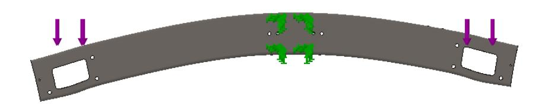

#### **Question 25**

L'équilibre de la partie située à gauche de la coupure G, pour z < L1, tronçon [OA[, s'écrit :

$$\left\{ T_{\text{cohésion}} \right\}_{G} \ + \left\{ T_{\text{Ext} \rightarrow \text{Partie Gauche}} \right\}_{G} \ = \left\{ 0 \right\} \, .$$

$$\text{avec}: \left\{\mathsf{T}_{\mathsf{Ext} \to \mathsf{PG}}\right\} = \left\{ \begin{array}{c} \overrightarrow{F_{\mathsf{O}}} \\ \overrightarrow{\mathsf{GO}} \land \overrightarrow{F_{\mathsf{O}}} \end{array} \right\}_{\mathsf{G}} \text{ et } \overrightarrow{\mathsf{GO}} \land \overrightarrow{F_{\mathsf{O}}} = \left(-z \cdot \vec{\mathsf{z}}\right) \land \left(-F_{\mathsf{O}} \cdot \vec{\mathsf{x}}\right) = \ z \cdot F_{\mathsf{O}} \cdot \vec{\mathsf{y}} \ .$$

ce qui donne : 
$$\{T_{Ext \to PG}\} = \begin{cases} -F_0 \cdot \vec{x} \\ z \cdot F_0 \cdot \vec{y} \end{cases}_G$$
.

On obtient alors le torseur des efforts de cohésion :  $\{T_{cohésion}\} = \{ F_{O} \cdot \vec{x} \}_{G}$ .

La valeur maximale en valeur absolue du moment fléchissant s'obtient pour  $z = L_1$ :

$$\left\{ \mathsf{T}_{\textit{cohésion}} \right\} = \left\{ \begin{array}{c} F_{\text{O}} \cdot \vec{x} \\ -L_{\text{I}} \cdot F_{\text{O}} \cdot \vec{y} \end{array} \right\}_{\text{G}} = \left\{ \begin{array}{c} 8522 \cdot \vec{x} \\ -0.804 \cdot 8522 \cdot \vec{y} \end{array} \right\}_{\text{G}} = \left\{ \begin{array}{c} 8522 \cdot \vec{x} \\ -6852 \cdot \vec{y} \end{array} \right\}_{\text{G}}, \quad F_{\text{O}} \quad \text{et} \quad L_{\text{I}} \cdot F_{\text{O}} \quad \text{étant} \quad \text{exprimés}$$
 respectivement en N et N·m.

La contrainte normale s'obtient par la relation :  $\sigma = -\frac{M_{fy} \cdot x}{I_{Gv}}$ .

Or 
$$M_{fy} = -6.852 \text{ N} \cdot \text{m}$$
,  $x = \frac{h}{2} = \frac{200}{2} = 100 \text{ mm}$  et

$$I_{\text{Gy}} = \frac{b \cdot h^3 - (b - 2 \cdot e) \cdot (h - 2 \cdot e)^3}{12} = \frac{150 \cdot 200^3 - (150 - 2 \cdot 7) \cdot (200 - 2 \cdot 7)^3}{12} = 27,07 \cdot 10^6 \text{ mm}^4.$$

A.N.: 
$$\sigma = -\frac{-6,852 \cdot 10^6 \cdot 100}{27.07 \cdot 10^6} = 25,31 \text{ MPa}.$$

En prenant en compte le coefficient de sécurité, on obtient :  $5 \cdot 25,31 = 126,5$  MPa < 200 MPa ; la condition de limite d'élasticité est vérifiée.

#### **Question 27**

Le volume d'un tube de section S et de longueur L est:  $V = S \cdot L$ .

Pour le longeron en aluminium, on obtient :

$$V = (150 \cdot 200 - (150 - 2 \cdot 7) \cdot (200 - 2 \cdot 7)) \cdot 1737 = 4704 \cdot 1737 = 8,17 \cdot 10^6 \text{ mm}^3.$$

Soit :  $V = 8,16 \cdot 10^{-3} \text{ m}^3$ .

On en déduit sa masse :  $m_{alu} = 8,16 \cdot 10^{-3} \cdot 2700 = 22 \text{ kg}$ .

Le « gain » de masse est donc de : 22 - 49 = - 27 kg.

#### **Question 28**

Le but des modifications engagées est de répondre à une exigence de confort thermique des passagers. Cela impose principalement de réduire les apports solaires de 90 % et de maintenir une température intérieure à 25°C.

Les choix se sont portés sur des vitres à teinte variable, un renforcement de l'isolation thermique et la mise en place d'une climatisation régulée. La particularité de ce moyen de transport – cabine suspendue – oblige à un minimum d'autonomie énergétique, qui est obtenue par des super condensateurs et une batterie au lithium. Tout cela occasionne une augmentation de la masse de la cabine qu'il faut réussir à limiter.

Les premières études menées ont permis de programmer les vitres pour automatiser l'occultation, de valider la performance de l'isolation, de dimensionner la climatisation, le stockage d'énergie et les stations de recharge.

Par la suite, une étude mécanique a confirmé une augmentation possible de la masse de 10 % mais cela se révèle insuffisant pour absorber la surcharge constatée de 21 kg.

Finalement, la dernière partie valide par une étude de résistance des matériaux la modification d'une pièce maîtresse de la structure porteuse. Le choix d'abandonner l'acier au profit de l'alliage d'aluminium permet de gagner 27 kg et donc de compenser la surcharge de 21 kg.

La cabine ainsi modifiée répond pleinement aux attentes de confort des passagers tout en restant utilisable sur les lignes existantes.

- Phase 1 problématisation qui se termine par une question. Situation déclenchante, formulation du problème.
- Phase 2 activité des élèves, recherche de solutions. Conjecture et hypothèses, activités d'investigation (expérimentation, observations, recherches documentaires).
- Phase 3 structuration des connaissances, échanges argumentés.

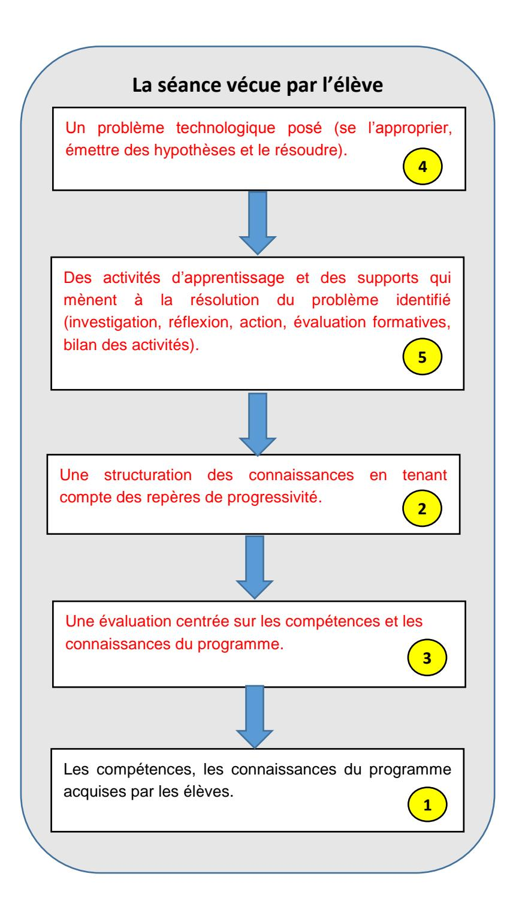

|                         | SÉANCE 1                                                                                                                                                                                                                                                                                                                                                                                                                                                          | SÉANCE 2                                                                                                                                                                                                                                                                                                                                                                                                                                                                          | SÉANCE 3                                                                                                                                                                                                                                                                                                                                                                                                                                                                                                                                                                                                            | SÉANCE 4                                                                                                                                                                                                                                                                                                                                                                                                                                                                                                                                  | SÉANCE 5                                                                                                                                                                                                                                                                                                                                                     |
|-------------------------|-------------------------------------------------------------------------------------------------------------------------------------------------------------------------------------------------------------------------------------------------------------------------------------------------------------------------------------------------------------------------------------------------------------------------------------------------------------------|-----------------------------------------------------------------------------------------------------------------------------------------------------------------------------------------------------------------------------------------------------------------------------------------------------------------------------------------------------------------------------------------------------------------------------------------------------------------------------------|---------------------------------------------------------------------------------------------------------------------------------------------------------------------------------------------------------------------------------------------------------------------------------------------------------------------------------------------------------------------------------------------------------------------------------------------------------------------------------------------------------------------------------------------------------------------------------------------------------------------|-------------------------------------------------------------------------------------------------------------------------------------------------------------------------------------------------------------------------------------------------------------------------------------------------------------------------------------------------------------------------------------------------------------------------------------------------------------------------------------------------------------------------------------------|--------------------------------------------------------------------------------------------------------------------------------------------------------------------------------------------------------------------------------------------------------------------------------------------------------------------------------------------------------------|
| Question<br>directrice  | Comment ont évolué les<br>transports urbains dans le<br>temps ?                                                                                                                                                                                                                                                                                                                                                                                                   | Comment choisir le tracé d'un<br>transport urbain par câble ?                                                                                                                                                                                                                                                                                                                                                                                                                     | Quels sont les éléments qui<br>constituent un transport par câble ?                                                                                                                                                                                                                                                                                                                                                                                                                                                                                                                                                 | Quelles solutions proposer lors de la<br>rétroconception thermique de<br>cabines d'une installation de<br>transport urbain par câble existante<br>pour répondre aux exigences de<br>confort en zone tropicale ?                                                                                                                                                                                                                                                                                                                           | Comment réinvestir mon travail dans<br>un nouveau contexte, l'habitat<br>?                                                                                                                                                                                                                                                                                   |
| Activités               | Dans un premier temps,<br>chaque îlot doit réaliser un<br>travail d'investigations sur<br>l'évolution des transports<br>urbains jusqu'à aujourd'hui.<br>Ils établissent les raisons de<br>ces évolutions.<br>Dans un second temps, ils<br>synthétisent sous forme libre<br>l'évolution et ainsi<br>définissent<br>un fil conducteur<br>à leur présentation.<br>Chaque équipe présente<br>son système grâce à un<br>support multimédia et la<br>synthèse réalisée. | L'installation existante se situe dans<br>une ville des caraïbes présentant peu<br>de dénivelé et traversée par deux<br>cours d'eau.<br>La ligne est constituée en deux<br>tronçons motorisés indépendamment<br>(voir figure 5) : l'une des motorisations<br>se situe au niveau du terminal T2,<br>l'autre au niveau du terminal T3B.<br>À partir de la cartographie d'une<br>métropole, choix d'un tracé, le but<br>étant de satisfaire une majorité<br>d'acteurs (pas de véto). | Dans un premier temps, les élèves<br>doivent choisir un modèle (télésiège,<br>télécabine, téléphérique,<br>funiculaire) de transport par câble<br>au regard du contexte d'utilisation<br>(milieu urbain) et des contraintes<br>géographiques de la métropole<br>choisie.<br>Dans un second temps, les élèves<br>proposent une organisation<br>structurelle de l'ouvrage et une<br>description de la fonction d'usage de<br>chaque élément. Ils réalisent<br>plusieurs croquis légendés de leurs<br>propositions.<br>Chaque équipe présente sa<br>proposition de croquis légendés<br>avec les textes de description. | Dans un premier temps, à l'aide du<br>diagramme partiel des exigences<br>relatif au confort thermique, les<br>élèves, sous l'égide du professeur,<br>expriment diverses solutions<br>techniques pour répondre à chaque<br>exigence.<br>Dans un second temps, les élèves<br>sont répartis<br>par groupes ayant<br>chacun<br>:<br><br>l'identification pour chaque<br>fonction technique d'une<br>solution technique<br>;<br><br>la caractérisation de la solution<br>technique (grandeurs<br>physiques, principe de<br>fonctionnement…). | Évaluation sommative de séquence.<br>Les élèves utilisent comme support<br>une maquette d'habitation (BBC).<br>Cet objet n'aura pas été étudié dans<br>cette séquence.<br>L'objectif est de vérifier si les élèves<br>sont en capacité<br>de<br>réinvestir les<br>compétences travaillées lors des<br>séances précédentes sur une<br>nouvelle problématique. |
| Démarche<br>pédagogique | Investigation.                                                                                                                                                                                                                                                                                                                                                                                                                                                    | Investigation.                                                                                                                                                                                                                                                                                                                                                                                                                                                                    | Investigation.                                                                                                                                                                                                                                                                                                                                                                                                                                                                                                                                                                                                      | Investigation                                                                                                                                                                                                                                                                                                                                                                                                                                                                                                                             |                                                                                                                                                                                                                                                                                                                                                              |
| Conclusion / bilan      | Les éléments schématiques<br>sont des outils<br>indispensables d'explication.<br>Chaque objet évolue pour<br>s'adapter aux besoins, aux<br>progrès techniques, enjeux<br>sociétaux (développement<br>durable)                                                                                                                                                                                                                                                     | Le choix d'un tracé est le compromis<br>entre les différentes contraintes<br>imposées par les acteurs.                                                                                                                                                                                                                                                                                                                                                                            | Le croquis d'un transport par câble<br>en vue de dessus, l'identification des<br>éléments constitutifs de l'ouvrage et<br>leur fonction (pylônes, câbles,<br>cabines, gares (départ, intermédiaire<br>et arrivée).                                                                                                                                                                                                                                                                                                                                                                                                  | Pour chaque exigence, une solution<br>technique est proposée.<br>Les caractéristiques techniques sont<br>identifiées et quantifiées.<br>Lors de la conception ou<br>rétroconception<br>d'un produit,<br>plusieurs solutions sont<br>certainement possibles pour réaliser<br>une fonction. La plus adaptée est<br>retenue. Selon l'époque, les<br>principes techniques sont différents,<br>ils évoluent avec l'avancée des                                                                                                                 | Les objets techniques sont inventés<br>pour résoudre certains problèmes,<br>tels que les problèmes de<br>communications, de transport, de<br>dureté du travail<br>Ils participent à l'amélioration des<br>conditions de vie (confort) tout en<br>tenant compte du contexte de<br>développement durable.                                                      |

|            |                                                                                                                                  |                                                             |                                                                                                                                                                                            | connaissances scientifiques et<br>technologiques.                                                                                                                                      |                                                |
|------------|----------------------------------------------------------------------------------------------------------------------------------|-------------------------------------------------------------|--------------------------------------------------------------------------------------------------------------------------------------------------------------------------------------------|----------------------------------------------------------------------------------------------------------------------------------------------------------------------------------------|------------------------------------------------|
| Évaluation | formative                                                                                                                        | formative                                                   | formative                                                                                                                                                                                  | formative                                                                                                                                                                              | sommative                                      |
| Ressources | Logiciel pour la création<br>rapide de présentation.<br>Système réel ou virtuel<br>Document ressources<br>papier<br>et numérique | Google Maps, modélisation<br>numérique, sites constructeurs | Photo numérique.<br>Logiciel pour la création rapide de<br>croquis légendés.<br>Animation vidéo de différents types<br>de transports par câble.<br>Document ressources<br>papier ou<br>PDF | Ressources numériques et papiers,<br>Internet,<br>Logiciels de simulation.<br>Photos et vidéos de diverses<br>solutions techniques (vitrage,<br>climatisation, isolation, régulation…) | Documents ressources papiers et<br>numériques. |

| Niveau                                                 | Enseignements                                       | Études possibles                                                                                                                                                                                                                                                                                                                                                                                                                                                                                  |
|--------------------------------------------------------|-----------------------------------------------------|---------------------------------------------------------------------------------------------------------------------------------------------------------------------------------------------------------------------------------------------------------------------------------------------------------------------------------------------------------------------------------------------------------------------------------------------------------------------------------------------------|
|                                                        | Sciences de<br>l'ingénieur (SI)                     | <br>Exploiter des modélisations et des simulations numériques pour prévoir les comportements du transport urbain<br>par câble.                                                                                                                                                                                                                                                                                                                                                                   |
| Classe de<br>Seconde<br>Enseignements<br>d'exploration | Création et<br>Innovation<br>Technologique<br>(CIT) | <br>Appréhender l'approche sociétale, économique et environnementale due à l'implantation d'un transport urbain<br>par câble.<br><br>Découvrir les processus permettant d'aboutir à une innovation dans le cadre d'une rétro conception.<br><br>Vivre une démarche de créativité pour aborder de nouvelles solutions technologiques visant répondre aux<br>exigences fixées lors d'une rétro conception<br>thermique de cabines de transport urbain par câble d'une<br>installation existante. |

| Baccalauréat<br>sciences et<br>technologie du<br>développement<br>durable (STI2D) | Enseignement<br>technologique<br>transversal              | <br>Étudier l'impact environnemental, sociétal et économique d'un transport urbain par câble en comparaison d'un<br>métro.<br><br>Concevoir ou optimiser une solution au regard d'un cahier des charges, dans le respect des contraintes de<br>développement durable.<br><br>S'appuyer sur plusieurs<br>spécialités au regard de l'organisation de l'étude proposée dans le cadre de la<br>rétroconception.                                               |
|-----------------------------------------------------------------------------------|-----------------------------------------------------------|--------------------------------------------------------------------------------------------------------------------------------------------------------------------------------------------------------------------------------------------------------------------------------------------------------------------------------------------------------------------------------------------------------------------------------------------------------------|
|                                                                                   | Baccalauréat scientifique Sciences de<br>l'ingénieur (SI) | <br>Analyser un système technique et vérifier ses performances attendues.<br><br>Proposer et valider des modèles.<br><br>Analyser des résultats expérimentaux et leurs éventuels écarts par rapport au cahier des charges ou aux<br>modèles au regard de l'organisation de l'étude proposée dans le cadre de la rétroconception.<br><br>Proposer des architectures de solutions, sous forme de schémas, de croquis, d'algorigrammes ou<br>d'algorithmes. |

# **Rapport du jury de l'épreuve d'admissibilité « analyse et exploitation pédagogique d'un système pluritechnique »**

#### **1. Présentation du sujet**

Le sujet est introduit par une problématique contemporaine liée à la mobilité des personnes. Dans un contexte de développement durable, les sociétés modernes doivent repenser les modes de déplacement en encourageant à se déplacer mieux et autrement tout en garantissant une qualité de service pour les usagers.

Le support du sujet est un système de transport urbain par câble réalisé par le groupe POMA. Dérivées d'un contexte de loisir, les cabines de ces installations sont passives, n'offrant qu'une ventilation naturelle, ou simplement équipées de batteries et de panneaux solaires pour assurer l'éclairage. De nos jours, les usagers attendent un minimum de confort, chauffage, climatisation et connectivité, écran d'informations et haut-parleurs. Le sujet propose d'étudier la rétro conception thermique des cabines d'une installation existante pour répondre aux exigences de confort en zone tropicale. Il permet d'évaluer les compétences d'analyse, de modélisation et de résolution des candidats.

#### **2. Analyse globale des résultats**

Le sujet propose un questionnement sur les différents champs des sciences industrielles de l'ingénieur. Les sept parties indépendantes sont abordées de manière linéaire par une majorité des candidats. Comme dans les sessions précédentes, les dernières parties sont moins bien traitées par beaucoup de candidats. Le jury invite donc les futurs candidats à gérer efficacement le temps de l'épreuve, afin d'avoir une couverture optimale du sujet.

Le jury déplore, par ailleurs, que certains candidats ne traitent que les parties du questionnement en lien avec leur option. Le jury insiste sur le caractère transversal de l'épreuve qui doit engager les futurs candidats à acquérir des connaissances dans les quatre spécialités.

La partie portant sur l'exploitation pédagogique permet au candidat de montrer ses compétences en ingénierie pédagogique en développant une réflexion en lien avec la mise en œuvre de l'enseignement spécifique des sciences industrielles de l'ingénieur. Le questionnement proposé aborde différents aspects de l'analyse que doit mener un enseignant pour construire une séquence d'enseignement de technologie au collège (cycle 4) et en dernier lieu de proposer, à partir de l'étude de rétro conception, des exploitations pédagogiques possibles en lycée (pré-Baccalauréat).

Globalement, le jury considère que les candidats se sont mieux préparés pour cette session que pour les précédentes.

#### **3. Commentaires sur les réponses apportées et conseils aux futurs candidats**

## **3.1. Première partie – Évolution de la masse de la cabine**

Cette partie, très courte, consiste à évaluer l'impact des modifications envisagées quant à la masse ajoutée. La plupart des candidats a bien répondu à ces premières questions. Le jury rappelle néanmoins que la proposition de retirer les améliorations envisagées ne peut être un élément de réponse à la seconde question.

#### **3.2. Deuxième partie – Mise en œuvre d'un système d'occultation**

Cette partie s'intéresse à la gestion automatique de la teinte des vitrages de la cabine et à l'évaluation de son gain sur son comportement thermique.

Le jury déplore que les questions en lien avec le programme d'informatique n'aient été traitées que par un faible nombre de candidats. Il rappelle que ce programme d'informatique, commun à toutes les options du CAPET SII, est disponible à l'adresse suivante :

[http://cache.media.education.gouv.fr/file/capet\\_externe/92/1/p2017\\_capet\\_ext\\_sii\\_590921.pdf.](http://cache.media.education.gouv.fr/file/capet_externe/92/1/p2017_capet_ext_sii_590921.pdf)

Une maîtrise globale des méthodes de programmation, d'ailleurs communes à la plupart des langages, est attendue : variables, fonctions et structures de contrôle.

En particulier dans le cadre de ce sujet, l'accès à un élément d'un tableau ou d'une liste de listes, l'incrémentation d'un compteur et la notion de boucle doivent faire partie des capacités des candidats. De même, lire et/ou compléter un algorigramme est une attente du jury.

Les réponses à la dernière question de cette partie, permettant de valider l'intérêt thermique de cette solution, sont souvent restées évasives et qualitatives. Le jury rappelle que toute conclusion doit être chiffrée en lien avec une grandeur physique, le facteur solaire ici, généralement pour conclure sur le respect d'une exigence.

#### **3.3. Troisième partie – Choix d'un climatiseur**

Cette partie est scindée en deux études : la première évalue la conductivité des vitrages pour en déduire le flux de chaleur transmis par conduction ; la seconde utilise cette valeur pour paramétrer une simulation du comportement thermique de la cabine dans le but de choisir un climatiseur à travers la détermination de la puissance frigorifique nécessaire au respect des exigences.

Le jury note ici des erreurs dans les manipulations d'équations. Il rappelle également que commenter des résultats de simulation ne peut se limiter à une réponse comme « la température augmente ». Encore une fois, toute conclusion doit être chiffrée en lien avec le respect d'une exigence et/ou interprétée physiquement.

#### **3.4. Quatrième partie – Gestion de l'autonomie énergétique**

L'objectif de cette partie réside dans le choix de solutions techniques pour le stockage de l'énergie et leur validation.

Le jury note ici essentiellement des erreurs dans les conversions d'unités et déplore que des problématiques simples comme le dimensionnement d'une batterie (question 20) ne soient pas maîtrisées.

#### **3.5. Cinquième partie – Vérification de la sécurité des passagers**

La cabine étant alourdie par l'ajout de nouvelles fonctionnalités, cette partie a pour but de vérifier la sécurité des passagers vis-à-vis du non-glissement de la pince sur le câble.

Le jury constate un inventaire des actions mécaniques extérieures très souvent incomplet et un manque de rigueur dans l'écriture des torseurs. Le jury a été surpris de constater que la notion de moment n'était pas maîtrisée par certains candidats.

#### **3.6. Sixième partie - Modification de la structure porteuse**

Afin d'augmenter la masse et pallier le problème mis en avant au début du sujet, la modification du matériau d'une pièce est envisagée. Cette partie propose de vérifier que cette modification (nouvelle limite minimale d'élasticité) permet toujours de garantir la sécurité des passagers.

Le jury attend que les types de sollicitations soient connus des candidats. Il regrette que l'écriture du torseur de cohésion ainsi que le simple calcul du volume d'un tube ne soient pas maîtrisés.

Par ailleurs, la conclusion, comme sur l'ensemble du sujet, est rarement réalisée.

#### **3.7. Septième partie – Exploitation pédagogique**

Les premières étapes du questionnement reviennent sur quelques éléments clés de la préparation de séquence tels que la démarche d'investigation. À partir d'éléments relatifs à la construction d'une séance par l'enseignant, les candidats doivent compléter les différentes phases du déroulement d'une séance vécue par l'élève.

La suite du déroulé du questionnement permet, au regard de l'analyse scientifique et technique menée préalablement, à partir d'une proposition du déroulé d'une séquence en technologie au cycle 4 et de la description des séances, de décrire une séance en tenant compte de la problématique donnée.

La dernière question vise, en référence à l'organisation de l'étude de rétro conception du transport urbain par câble, et plus globalement au regard du contexte d'installation et d'exploitation du système support de l'étude, à proposer une exploitation pédagogique possible pour les niveaux d'enseignement de sciences de l'ingénieur du baccalauréat scientifique et de l'enseignement technologique transversal du baccalauréat STI2D.

La partie pédagogique est traitée de manière très hétérogène. La description de la démarche d'investigation et le déroulé d'une séance vécue par l'élève proposée dans le sujet sont globalement satisfaisantes. Le jury déplore qu'un nombre important de candidats n'ait pas lu les documents annexes fournis qui permettaient de répondre à ces deux questions.

Les candidats peinent à exploiter les documents pour décrire les éléments de la séance et proposer des exploitations pédagogiques possibles et plausibles. Ils rencontrent également des difficultés à investir les éléments de l'étude scientifique et technique, au niveau considéré, en activités proposées aux élèves visant l'acquisition des compétences définies. Trop peu de candidats ont proposé, au sein du déroulement de la séance à développer, des activités élèves permettant l'acquisition de connaissances scientifiques disciplinaires et plus largement en lien avec les domaines des mathématiques et des sciences physiques. Trop de réponses sont généralistes et ne font pas le lien avec le contexte de l'étude demandé. Les propositions d'activités ou de supports pédagogiques sont trop souvent inappropriées, voire irréalistes et n'apportent rien à l'acquisition des compétences attendues de l'élève.

La définition des activités confiées ou compétences attendues des élèves démontre un manque de connaissance des attendus des programmes, tout particulièrement pour la technologie au collège.

L'approche scientifique de l'enseignement de la technologie au collège, par l'appropriation de grandeurs physiques à travers d'expérimentations, n'est que trop peu souvent proposée.

#### **4. Conclusions**

Le jury rappelle aux candidats l'importance de soigner la présentation de la copie, la qualité de la rédaction et la précision du vocabulaire. Le jury demande aux candidats de faire particulièrement attention aux fautes d'orthographe et de grammaire. Les candidats doivent correctement repérer les questions et en cas d'absence de réponse, l'indiquer clairement sur la copie. Le jury conseille également de mettre les résultats en évidence, en les encadrant par exemple. Le jury attire l'attention des candidats sur le fait que l'utilisation de stylos bille effaçables est déconseillée car certains résultats peuvent rapidement devenir illisibles sur la copie.

Les raisonnements doivent être menés de façon lisible et explicite de manière à faire ressortir la méthode utilisée. Les réponses qui se limitent à l'écriture du résultat sans explication ne sont pas admises. Tous ces points seront nécessaires aux candidats dans la pratique de leur futur métier d'enseignant pour exposer clairement les idées qu'ils souhaiteront faire passer.

Il est important de connaître les unités des différentes grandeurs physiques pour avoir un regard critique sur l'homogénéité des relations et des résultats proposés. Le jury invite donc les candidats à traiter ces aspects avec plus de rigueur. Les résultats doivent être présentés sous forme littérale, et les applications numériques doivent aussi être réalisées avec rigueur avec un nombre significatif de chiffres après la virgule cohérent. Les candidats doivent se présenter pour l'épreuve avec une calculatrice scientifique en état de marche.

La rigueur mathématique fait partie des attendus des candidats aux concours de recrutement de professeurs de sciences industrielles de l'ingénieur. Les grandeurs vectorielles ou scalaires doivent être clairement identifiées et leur signe ne doit pas être négligé.

Le jury recommande aux candidats d'apporter un soin particulier aux questions de conclusion de chacune des parties. Les écarts évalués doivent être clairement mis en évidence et commentés. La validation des performances se fait de façon justifiée vis-à-vis des critères du cahier des charges et des travaux réalisés dans la partie concernée.

Par ailleurs, une lecture attentive et complète du sujet est nécessaire pour éviter de mauvaises interprétations de certaines questions et pour permettre d'exploiter au mieux les documents ressources mis à disposition.

Enfin, le jury insiste sur le fait que pour traiter cette épreuve transversale, les candidats doivent avoir un minimum de connaissances et de culture scientifique et technique dans plusieurs domaines. Bien qu'une évolution soit constatée, ce point reste primordial pour des enseignants destinés à l'enseignement technologique dans sa globalité. Le jury conseille donc aux futurs candidats de travailler dans ce sens.

#### **5. Résultats**

547 copies ont été évaluées pour cette épreuve, la moyenne des notes obtenues est de 8,5 et l'écarttype de 3,5 avec :

20 comme meilleure note ;

1,5 comme note la plus basse.

# **Éléments de correction** *(parties 2 ; 3 ; 5 et 6)* **de l'épreuve « Étude d'un système, d'un procédé ou d'une organisation » – option ingénierie des constructions**

# **Étude 2 - CHOIX CONSTRUCTIFS - ÉLINGAGES -**

#### **Question 04 : Choix constructifs**

*Justifier l'avant-bec. Rappeler la principale contrainte excluant d'autres modes d'assemblage.* L'avant bec permet de réduire la longueur du porte à faux –donc la flèche- et d'apporter une aide au guidage du tablier lors de son lancement. Sa légère inclinaison permet d'annihiler l'effet « banane » afin de pouvoir prendre appui sur la pile suivante.

#### **Question 05 : Poids d'un élément à manutentionner**

*Calculer le poids total de l'élément Ci-A3.* 

| Pièces | Désignation        | Épais | Largeur1 | Largeur2 | Moy    | Longueur | Nb | Volume |
|--------|--------------------|-------|----------|----------|--------|----------|----|--------|
| 1 et 2 | Semelle supérieure | 60    | 1578     | 1856     | 1717   | 13500    | 2  | 2,782  |
| 3 et 4 | Âme Nord et Sud    | 30    | 3791     | 3190     | 3490,5 | 13500    | 2  | 2,827  |
| 5 et 6 | Semelle inférieure | 35    | 1339     | 1623     | 1481   | 13500    | 2  | 1,400  |
| Tôle 7 | Diaphragmes        | 40    | 350      | 350      | 350    | 12000    | 2  | 0,336  |
| Tôle 8 | Raidisseurs d'âme  | 30    | 150      | 150      | 150    | 13500    | 6  | 0,365  |

| PV acier en kN.m-3 | 78,50 | MV acier en t/m3   | 7,85 |
|--------------------|-------|--------------------|------|
| Poids total en kN. | 605,1 | Masse totale en t. | 60,5 |

|       |  | Volume en m3     | 7,709 |  |
|-------|--|------------------|-------|--|
| 78,50 |  | MV acier en t/m3 | 7,85  |  |
|       |  |                  |       |  |

#### **Question 06 : Centre de gravité du tronçon Ci-A3**

 *Rappeler la valeur de l'angle maximal "d'élingage"* 

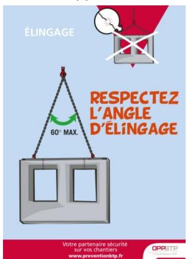

**OPPBTP** : organisme professionnel de prévention du bâtiment et des travaux publics.

**INRS** : institut national de recherche et de sécurité.

L'angle maximal autorisé est de 60 degrés et ce, en considérant un certain nombre de critères définissant très précisément les apparaux de levage.

#### **Voir brochure « Accessoires de levage – Mémento élingueur INRS »**

On observe cependant que, contrairement aux autorisations réglementaires, l'angle maximal le plus souvent retenu est 30°, ce que montre bien l'affiche ci-contre. On note également une confusion souvent faite entre angle d'élingage et angle d'ouverture des élingues, représenté sur cette affiche.

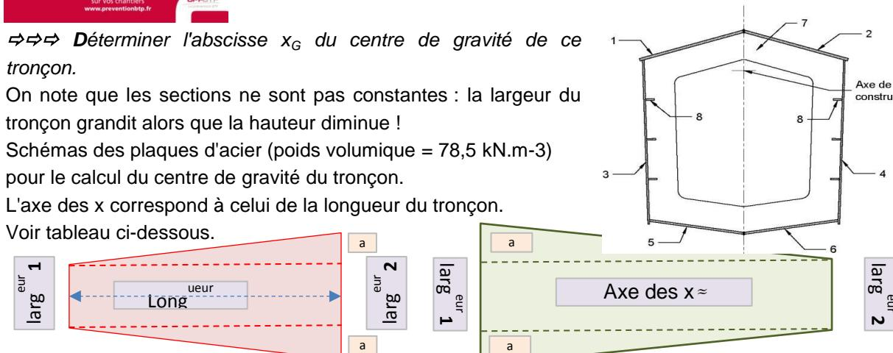

| Pièces | Désigtion      | Surfaces   | Ép. | arg1<br>L        | arg 2<br>L |                                   | Surf.éléments | arg 1<br>L | L    | arg 2 | ong<br>L             | N      | S (m²)        |
|--------|----------------|------------|-----|------------------|------------|-----------------------------------|---------------|------------|------|-------|----------------------|--------|---------------|
|        | Semelle        |            | 60  |                  |            |                                   |               | 0          | 278  |       | 13500                | 2      | 3,753         |
| 1 et 2 | Sup            |            | 60  | 1578             | 1856       |                                   |               | 1578       | 1578 |       | 13500                | 2      | 42,606        |
|        | Âme            |            | 30  |                  |            |                                   |               | 601        | 0    |       | 13500                | 2      | 8,1135        |
| 3 et 4 | N et S         |            | 30  | 3791             | 3190       |                                   |               | 3190       | 3190 |       | 13500                | 2      | 86,13         |
|        | Semelle        |            | 35  |                  | 1623       |                                   |               | 0          | 284  |       | 13500                | 2      | 3,834         |
| 5 et 6 | Inf            |            | 35  | 1339             |            |                                   |               | 1339       | 1339 |       | 13500                | 2      | 36,153        |
| Pièces | Désignation    | Surface m² |     | Poids (en<br>kN) |            | xG pondéré en<br>xG (mm)<br>kN.mm |               |            |      |       | Pds total (en kN)    |        |               |
|        |                | 3,753      |     | 17,68            |            | 9000                              | 159090        |            |      |       |                      | 550,16 |               |
| 1 et 2 | Semelle<br>Sup | 42,606     |     | 200,67           |            | 6750                              | 1354551       |            |     |       | xG<br>kN.mm)         |        | pondérés (en  |
|        |                | 8,1135     |     | 19,11            |            | 4500                              | 85983         |            |      |       | 3734053              |        |               |
| 3 et 4 | Âme N et<br>S  | 86,13      |     | 202,84           |            | 6750                              | 1369144       |            |      |       | Position xG<br>Ci-A3 |        | de<br>(en mm) |
|        |                |            |     | 10,53            |            | 9000                              |               |            |      |       |                      | 6787   |               |
| 5 et 6 | Semelle Inf    | 3,834      |     |                  |            |                                   | 94805         |            |      |       |                      |        |               |

Nota : Le calcul du CdG se fait à l'identique de l'utilisation des moments statiques mais en affectant aux CdG élémentaires les poids (d'où x<sup>G</sup> pondéré par des kN) et non les surfaces en m<sup>2</sup>

NB : Malgré le changement de sections, on remarque que le centre de gravité est presque centré par rapport au tronçon (37 mm sur une distance de 6750 mm ! soit à peine plus de 0,5 % d'écart.

#### **Question 07 : Efforts de tension dans les chaînes - Manutention Camion zone de stockage**

*Calculer les efforts dans les chaînes lors du déchargement. Longueur minimale dans cette configuration ?*

 **1 ère configuration :** La longueur du tronçon est de **13,5 m** et pèse **675 kN**. Les 4 chaines (seules 2 « travailleront ») s'accrochent aux oreilles espacées de 13 m et l'angle d'élingage est de 30° maximum. **A B C A pds** linéique **B Y<sup>F</sup> Y<sup>F</sup> F F**

Comme l'ensemble est symétrique, le triangle ABC est

équilatéral. La longueur des chaînes est donc de **13 m**. Quant à la tension dans les chaînes, on la calcule en isolant le tronçon.

En utilisant le PFS et son équation sur l'axe des Y :

Somme des actions sur Y = 0, soit 2.Y<sup>F</sup> = poids total = 675 kN

Or connaissant l'angle de 60°, cela donne une tension de … F = 675/2.sin60° = **389,7 kN**.

#### **Question 08 : Longueurs de chaînes - Manutention zone de stockage In situ**

*Longueur à donner à la 2ème chaîne (2ème configuration) avec la 1ère de longueur 20 m ?* 

#### **2ème configuration :**

# **1- Schéma géométrique du tronçon Ci-A3 en position de levage avec les chaines.**

L'équilibre n'est possible que si le crochet en C est à l'aplomb du centre de gravité H de la pièce transportée Sont connus :

- L'angle : 60° et l'inclinaison du tronçon : 30°
- Les longueurs AH et HB : 6500 mm (la verticale passe obligatoirement par le CdG) et la chaîne éL : 20 m

Est à calculer la longueur de la chaîne éL

# **2- Considérons le triangle AH'H :**

L'angle en A est de 30° ; L'hypoténuse = 6500 mm. On en déduit h<sup>0</sup> et b0 (relations trigonométriques):

h<sup>0</sup> = 6500 \* sin30° = **3250**mm ;

b<sup>0</sup> = 6500 \* cos30°= **5629**mm.

*Valeurs identiques à celles que l'on trouve dans le rectangle BHH''*

#### **3- Considérons le triangle CAH' :**

Connaissant èL soit 20000 mm et b<sup>0</sup> soit 5629 mm, on peut écrire grâce au théorème de Pythagore :

$$\dot{e}L^{^2} - b_0^2 = (h_1 + 2h_0)^2$$

On trouve (h<sup>1</sup> + 2h0) = 19191 mm soit h<sup>1</sup> = **12691** mm On peut calculer l'angle (CAH') en A :

$$\cos (\alpha + 30^{\circ}) = b_0 / \dot{e}L \oplus = 5629 / 20000 = 0,28145$$
;

soit 
$$(\alpha + 30^\circ) = 73,653^\circ$$
 d'où  $\Box = 43,653^\circ$ .

La somme des angles dans ABC = 180° avec

max = 60° et = 43,653°, d'où = 180 – 103,653 = **76,347°**

Pour avoir l'angle CBH'', on retranche 30°, soit **46,347°**

# **Mais, on note qu'avec cet angle, on ne peut retrouver les longueurs calculées précédemment !**

En effet, connaissant h<sup>1</sup> et b<sup>0</sup> : 12691 et 5629, la tangente de l'angle formant un tel triangle sera de 12691/5629 = 2,255 soit un angle de **66,081°**, différent de **46,347°.**

Il est donc impossible d'avoir l'angle d'ouverture de 60° dans cette configuration !

Fort heureusement, cet angle de **66,081°**, issu des calculs de longueurs des cotés d'un triangle permettra de valider que est bien inférieur à max soit 60°, allant dans le sens de la sécurité. (Voir question suivante)

### **Question 09 : Efforts de tension dans les chaînes dans cette phase**

*Avec* éL = *14 m, déduire l'angle d'élingage puis les efforts de traction.*

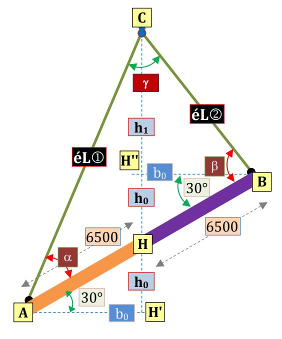

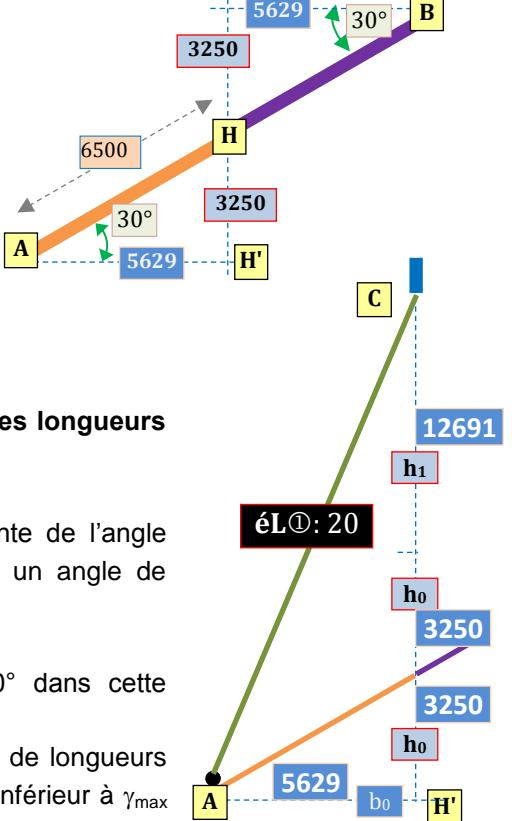

#### 4- Considérons le triangle BH"C:

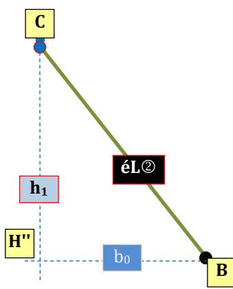

Validation de la longueur de la chaîne de 14 m avec les calculs précédents: La longueur CB correspond à l'hypoténuse du triangle

On connait h<sub>1</sub> et b<sub>0</sub> ce qui permet de calculer èL<sup>2</sup>

on peut écrire grâce au théorème de Pythagore  $\grave{e}L @^2 = b_0^2 + h_1^2$ . On trouve  $\grave{e}L @ = \textbf{13883 mm}$  Cette valeur est cohérente avec la longueur de chaine (ramenée à 14 mètres) considérée dans les hypothèses de calculs pour la tension dans les chaines.

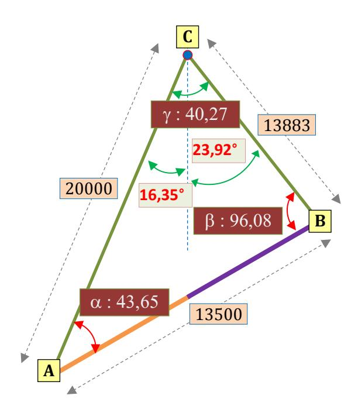

Le schéma renseigné pour les calculs de tension sera ainsi défini avec les angles suivants :

$$\gamma = 180 - ((66,081 + 30) + 43,653) = 40,27^{\circ}$$

En gardant  $\alpha$  = 43,65° et  $\beta$  = 96,08°

Inclinaison de la chaîne 1 : **73,65°** (angle d'él. **16,35°)**; Inclinaison de la 2 : **66,08°** (angle d'él. **23,92°)** (ou à défaut si on prend la longueur de chaine arrondie à 14 m proposée dans le questionnaire, soit un angle d'inclinaison chaine 2 de Arcsin(12691/14000) = **65,03°)** 

#### 5- Calcul des efforts dans les élingues.

On utilise le PFS en isolant les départs de câbles L'équation sur X donne :

Éq**1**:  $X_{F_1} = X_{F_2}$ , soit cos 73,65 \*  $F_1 = \cos 66,08 * F_2$ 

L'équation sur Y donne :

 $\dot{E}q\Theta$ :  $Y_{F1} + Y_{F2}$ , = P = 675 kN

soit sin 73,65  $\star$  F<sub>1</sub> + sin 66,08  $\star$  F<sub>2</sub> = 675 kN.

On note:  $\cos 73,65 = 0,2815 \cos 66,08 = 0,5196$ 

 $\sin 73,65 = 0,9596 \quad \sin 66,08 = 0,8544$ 

d'où : de l'éq**①**: 0,2815  $_{\star}$  F<sub>1</sub> = 0,5196  $_{\star}$  F<sub>2</sub>

et  $F_1 = 0.5196 / 0.2815 \cdot F_2 = 1.846 \cdot F_2$ 

En remplaçant dans Éq@:

 $0.9596 \cdot F_1 + 0.8544 \cdot F_2 =$ 

 $0.9596 \cdot 1.846 \cdot F_2 + 0.8544 \cdot F_2 = 675 \text{ kN}$ 

On trouve :  $F_2 = 675 / (1,846 \cdot 0,9596 + 0,8544) = 257$ 

**kN.** Il en découle  $F_1 = 1,846 \cdot F_2 = 475 \text{ kN}$ 

*⇒⇒⇒* Conclure quant au choix du type de chaînes.

Les calculs précédents ont démontré l'importance de

 $\begin{array}{c|c} \textbf{F1} & \textbf{F2} & \textbf{Y}_{\textbf{F2}} \\ \hline \textbf{X}_{\textbf{F1}} & \textbf{X}_{\textbf{F2}} \\ \hline \textbf{P} & \textbf{résultant} : \textbf{675 kN} \\ \hline \textbf{A} & \delta : 73,65 \\ \hline \end{array}$ 

pouvoir disposer de chaines ayant l'avantage (contrairement aux élingues) de s'adapter aux longueurs définies. On note que des règles strictes de sécurité doivent être suivies lors des manutentions de telles charges. Ces règles imposent une double contrainte en terme de dimensionnement : d'une part la connaissance de la charge maximale d'utilisation (CMU) mais également le respect des angles d'élingage (ou d'ouverture).

# Étude 3 – ÉTUDE DES BÉTONS ET DE SES COMPOSANTS

Question 10 : Masses volumiques du béton de propreté.

⇒⇒⇒ Masse volumique théorique des 3 bétons frais et valider –ou non- la formulation pondérale.

| Matériau      | 0/4 REC              | 4/8R  | 8/16R     | 16/22                                                               | 2R  | CEM II/E   | Fille                  | r                     | Plastif | Eau   |
|---------------|----------------------|-------|-----------|---------------------------------------------------------------------|-----|------------|------------------------|-----------------------|---------|-------|
| Quantité (kg) | 830                  | 200   | 300       | 300 620                                                             |     | 250        | 0                      |                       | 0,75    | 154   |
| Béton cent    | trale de <b>ENTZ</b> | ZHEIM | Masse Vo  | olumique                                                            | thé | orique (en | kg.m <sup>-3</sup> ) = | =                     | 235     | 4,75  |
| Matériau      | 0/4 REC              | 4/16R | 16/22R    |                                                                     |     | CEM II/E   | Fille                  | r                     | Plastif | Eau   |
| Quantité (kg) | 870                  | 460   | 620       | 620                                                                 |     |            | 0                      | 0 0,7                 |         | 160   |
| Béton centr   | ale de <b>STRAS</b>  | BOURG | Masse Vo  | Masse Volumique théorique (en kg.m <sup>-3</sup> ) = <b>2360,75</b> |     |            |                        |                       |         |       |
| Matériau      | 0/4 R                | 4/16R | 16/22R    |                                                                     |     | CEM II/E   | CEM II/B Filler        |                       | Plastif | Eau   |
| Quantité (kg) | 870                  | 460   | 620       |                                                                     |     | 250        | 0                      |                       | 0,75    | 160   |
| Béton cer     | ntrale de <b>HOI</b> | ERDT  | Masse Vo  | Masse Volumique théorique (en kg.m $^{-3}$ ) = 2360,7               |     |            |                        |                       |         |       |
| MV théo.      | Entzheim             | 2355  | Masse     | 2329                                                                | Éc  | arts MV    | 25,8                   | Éd                    | arts MV | 1,11% |
| des           | Strasbg              | 2361  | Volumique | 2329                                                                | /   | Réelle     | 31,8                   | <b>31,8</b> Réel-Théo |         | 1,36% |
| centrales     | Hoerdt               | 2361  | réelle    |                                                                     |     | 31,8       |                        | en %                  | 1,36%   |       |

Les formulations sont validées au vu des pourcentages inférieurs à 2,5%.

|                        |                                                                                                        |               |          |            |                             | •       | -          | illelleuis e |                   |                |  |  |  |
|------------------------|--------------------------------------------------------------------------------------------------------|---------------|----------|------------|-----------------------------|---------|------------|--------------|-------------------|----------------|--|--|--|
| Analys                 | Analyse granulométrique Tableau de mesures, calculs du Mf et des pourcentages de sable dans le mélange |               |          |            |                             |         |            |              |                   |                |  |  |  |
|                        |                                                                                                        |               | Sable 1  |            |                             | Sable 2 |            | Courbe       | th. du <b>mél</b> | ange S1+S2     |  |  |  |
|                        |                                                                                                        | Q. anal       | ysée (g) | 2550       | Q. analysée (g) <b>2875</b> |         |            | %S1          | %S2               | Mf mél.        |  |  |  |
| 1                      |                                                                                                        | Refus cumulés |          |            | Refus cumulés               |         |            | %tages       | 2,75              |                |  |  |  |
| Ouverture              | Tamaia                                                                                                 | en g          | en%      | Refus lu   | en g                        | en%     | Refus lu   | 19%          | 81%               | Refus lu sur   |  |  |  |
| des tamis              | Tamis                                                                                                  |               |          | Sur courbe |                             |         | Sur courbe | Ref en       | Tam en            | courbe AG      |  |  |  |
| en mm                  | retenus<br>pour Mf                                                                                     |               |          | AG en %    |                             |         | AG en %    | %            | %                 | théorique en % |  |  |  |
| 8,00                   | pour ivii                                                                                              | ]             |          |            | 0                           | 0%      |            | 0%           | 100%              |                |  |  |  |
| 5,60                   |                                                                                                        | -             |          |            | 0                           | 0%      |            | 0%           | 100%              |                |  |  |  |
| 5                      | 5                                                                                                      |               |          | 0%         |                             |         | 2%         |              |                   | 2%             |  |  |  |
| 4,00                   |                                                                                                        | 0             | 0%       |            | 148                         | 5%      |            | 4%           | 96%               |                |  |  |  |
| 3,15                   |                                                                                                        | 0             | 0%       |            |                             | ı       |            |              |                   |                |  |  |  |
| 2,50                   | 2,50                                                                                                   |               |          | 2%         |                             |         | 20%        |              |                   | 17%            |  |  |  |
| 2,00                   |                                                                                                        | 77            | 3%       |            | 802                         | 28%     |            | 23%          | 77%               |                |  |  |  |
| 1,60                   |                                                                                                        | -             |          |            |                             | ı       |            |              |                   |                |  |  |  |
| 1,25                   | 1,25                                                                                                   |               |          | 13%        |                             |         | 46%        |              |                   | 38%            |  |  |  |
| 1,00                   |                                                                                                        | 460           | 18%      |            | 1525                        | 53%     |            | 46%          | 54%               |                |  |  |  |
| 0,80                   |                                                                                                        | -             |          |            |                             | ı       |            |              |                   |                |  |  |  |
| 0,63                   | 0,63                                                                                                   |               |          | 25%        |                             |         | 61%        |              |                   | 55%            |  |  |  |
| 0,50                   |                                                                                                        | 715           | 28%      |            | 1877                        | 65%     |            | 58%          | 42%               |                |  |  |  |
| 0,40                   |                                                                                                        | -             |          |            |                             | ı       |            |              |                   |                |  |  |  |
| 0,315                  | 0,315                                                                                                  |               |          | 43%        |                             |         | 79%        |              |                   | 74%            |  |  |  |
| 0,25                   | ļ                                                                                                      | 1276          | 50%      |            | 2470                        | 86%     |            | 79%          | 21%               |                |  |  |  |
| 0,20                   |                                                                                                        | •             |          |            |                             | ı       |            |              |                   |                |  |  |  |
| 0,160                  | 0,160                                                                                                  |               |          | 77%        |                             |         | 94%        |              |                   | 89%            |  |  |  |
| 0,125                  |                                                                                                        | 2240          | 88%      |            | 2790                        | 97%     |            | 95%          | 5%                |                |  |  |  |
| 0,10                   |                                                                                                        |               |          |            |                             |         |            |              |                   |                |  |  |  |
| 0,08                   |                                                                                                        | 2425          | 95%      |            |                             |         |            |              |                   |                |  |  |  |
| 0,063                  |                                                                                                        | 2480          | 97%      |            | 2848                        | 99%     |            | 99%          | 1%                |                |  |  |  |
| Récep <sup>tacle</sup> |                                                                                                        | 2543          | 100%     |            | 2869                        | 100%    |            | 100%         | 0%                |                |  |  |  |
|                        |                                                                                                        |               |          |            |                             |         |            |              |                   |                |  |  |  |

Mf1 1.60

Mf2 3,02

2,75

⇒ Démontrer que 14.5 MJ/m³ correspond à la Q. d'énergie nécessaire pour fabriquer 1 m³ de Béton

| Im   | naat ( | Énanc | ria nan | Renouve | labla | ما ما | fahria  | ation d | ľ1 m3    | da hátar |      | control  | _ |
|------|--------|-------|---------|---------|-------|-------|---------|---------|----------|----------|------|----------|---|
| 1111 | patt   | CHEIL | gie non | renouve | abiej | ue ia | Idulica | auon u  | I T III. | ue betoi | ı en | centi ai | E |

| Données <b>↓</b>                           | Origine > | Hoerdt | Entzheim | Strasbourg |
|--------------------------------------------|-----------|--------|----------|------------|
| Puissance                                  | en kW     | 243    | 224      | 274        |
| Production                                 | en m3/h   | 60     | 56       | 68         |
| Temps                                      | h         | 1      | 1        | 1          |
| <b>Énergie</b> pour <b>1h</b>              | kW.h      | 243    | 224      | 274        |
| Émanaia naun 1 m²                          | kW.h/m3   | 4,05   | 4,00     | 4,03       |
| <b>Énergie</b> pour <b>1m</b> <sup>3</sup> | MJoule    | 14,58  | 14,40    | 14,51      |

La moyenne pour les 3 bétons est de 14,5 MJ. On peut évoquer l'ambigüité de la prise en compte des MV théoriques ou réelles du béton dans ces calculs. L'incidence est cependant très faible.

# DR1 Étude 3 : Étude des bétons & composants Question 14

⇒ Évaluer les impacts ÉnR et réchauffement pour le processus complet de fabrication du béton.

# Impact (Énergie non Ren.) du transport des Granulats et Ciments par camion

|          |                     | Gra    | nulats   |              | Ciment      |        |          |              |  |
|----------|---------------------|--------|----------|--------------|-------------|--------|----------|--------------|--|
|          | Impact Unit         | Quant. | Distance | Total Impact | Impact Unit | Quant. | Distance | Total Impact |  |
| Origine▼ | t.km/m <sup>3</sup> | En t.  | En km    | MJ           | t.km/m³     | En t.  | En km    | MJ           |  |
| Entzheim | 1,83                | 1,95   | 2        | 7,137        | 1,83        | 0,25   | 100      | 45,750       |  |
| Strasbg  | 1,83                | 1,95   | 12       | 42,822       | 1,83        | 0,25   | 110      | 50,325       |  |
| Hoerdt   | 1,83                | 1,95   | 1        | 3,569        | 1,83        | 0,25   | 90       | 41,175       |  |

# Impact (Réchauffement global en kg éq CO2.) du transport des G et C par camion

|          |                     | Gra   | nulats   |                         | Ciment      |        |          |                       |  |  |
|----------|---------------------|-------|----------|-------------------------|-------------|--------|----------|-----------------------|--|--|
|          | Impact Unit Quant.  |       | Distance | $T^{\text{otal}}Impact$ | Impact Unit | Quant. | Distance | Total Impact          |  |  |
| Origine▼ | t.km/m <sup>3</sup> | En t. | En km    | kg.éq CO <sup>2</sup>   | t.km/m³     | En t.  | En km    | kg.éq CO <sup>2</sup> |  |  |
| Entzheim | 0,105               | 1,95  | 2        | 0,410                   | 0,105       | 0,25   | 100      | 2,625                 |  |  |
| Strasbg  | 0,105               | 1,95  | 12       | 2,457                   | 0,105       | 0,25   | 110      | 2,888                 |  |  |
| Hoerdt   | 0,105               | 1,95  | 1        | 0,205                   | 0,105       | 0,25   | 90       | 2,363                 |  |  |

# Doc Réponse DR1 Étude 3 : bétons & composants Questions 14 [suite]

Impacts (Réchauffement) & (Énergie nR.) du transport d'1 m³ de béton par camion Réchauffement global en kg éq CO2 Énergie non Renouvelable en MJ

| Origine▼ | t.km/m <sup>3</sup> | <b>Q</b> . en t. | <b>D</b> en km | kg.éq CO <sup>2</sup> | t.km/m³ | <b>Q</b> . en t. | <b>D</b> en km | MJ      |
|----------|---------------------|------------------|----------------|-----------------------|---------|------------------|----------------|---------|
| Entzheim | 0,105               | 2,329            | 18             | 6,917                 | 2,76    | 2,329            | 18             | 115,705 |
| Strasbg  | 0,105               | 2,329            | 4              | 1,537                 | 2,76    | 2,329            | 4              | 25,712  |
| Hoerdt   | 0,105               | 2,329            | 15             | 5,764                 | 2,76    | 2,329            | 15             | 96,421  |

**Total** des impacts : transports, fabrication des bétons et ciment et extraction des granulats

|          |                                                                 | Énergie non Renouvelable en MégaJoules |                 |            |             |          |       |  |  |  |  |  |
|----------|-----------------------------------------------------------------|----------------------------------------|-----------------|------------|-------------|----------|-------|--|--|--|--|--|
|          | Fabrication Extraction Transport Transport Fabricatio Transport |                                        |                 |            |             |          |       |  |  |  |  |  |
|          | ciment                                                          | Granulats Granulats Ciment             |                 | n béton    | béton       |          |       |  |  |  |  |  |
|          | 4050 MJ/t                                                       | 64,4 * MJ/t                            | Site Extraction | Cimenterie | on control  | Centrale | Total |  |  |  |  |  |
|          | * 0,25 t/m <sup>3</sup>                                         | * 1,95 t/m <sup>3</sup>                | Centrale        | ➤ Centrale | en centrale | Chantier | Total |  |  |  |  |  |
| Entzheim | 1012,5                                                          | 125,6                                  | 7,1             | 45,8       | 14,4        | 115,7    | 1321  |  |  |  |  |  |

| Strasbourg | 1012,5                                               | 125,6                                                | 42,8                        | 50,3                  | 14,5                  | 25,7                | 1271  |  |  |  |  |
|------------|------------------------------------------------------|------------------------------------------------------|-----------------------------|-----------------------|-----------------------|---------------------|-------|--|--|--|--|
| Hoerdt     | 1012,5                                               | 125,6                                                | 3,6                         | 41,2                  | 14,6                  | 96,4                | 1294  |  |  |  |  |
|            | Réchauffement global en kg éq CO2                    |                                                      |                             |                       |                       |                     |       |  |  |  |  |
|            | Fabrication ciment                                   | Extraction<br>Granulats                              | Transport<br>Granulats      | Transport<br>Ciment   | Fabricatio<br>n béton | Transport<br>béton  |       |  |  |  |  |
|            | 648 kg.CO <sup>2</sup> /t<br>* 0,25 t/m <sup>3</sup> | 2,3 kg.CO <sup>2</sup> /t<br>* 1,95 t/m <sup>3</sup> | Site Extraction  ➤ Centrale | Cimenterie > Centrale | en centrale           | Centrale > Chantier | Total |  |  |  |  |
| Entzheim   | 162,0                                                | 4,5                                                  | 0,4                         | 2,6                   | 5,7                   | 6,9                 | 182   |  |  |  |  |
| Strasbourg | 162,0                                                | 4,5                                                  | 2,5                         | 2,9                   | 5,7                   | 1,5                 | 179   |  |  |  |  |
| Hoerdt     | 162,0                                                | 4,5                                                  | 0,2                         | 2,4                   | 5,7                   | 5,8                 | 180   |  |  |  |  |

⇒⇒⇒ Conclure.

On note que l'étude proposée permet de valider la qualité des matériaux composant le béton. Elle reste néanmoins très superficielle quant à l'aspect « développement durable ».

En effet, seules 2 catégories sont retenues pour ce questionnaire (réchauffement et EnR), incluses plus précisément dans le volet environnemental, alors que doivent être également considérées efficacité économique et équité sociale, non suggérées ici.

L'analyse des résultats démontre une « consommation environnementale » très importante (entre 80% et 90% environ des totaux) due à la fabrication des ciments\* et dans une moindre mesure due à celle des transports. S'il est difficile de s'affranchir de ce que génère la fabrication des ciments, on observe cependant qu'il reste possible de réduire les impacts en limitant les distances. Privilégier les circuits courts est un phénomène sociétal que l'on retrouve d'ailleurs dans tous les domaines.

La centrale d'Entzheim est la moins vertueuse, par rapport aux 2 autres. Il faudrait donc, autant que faire se peut, se positionner vers la centrale la moins gourmande, à savoir celle de Strasbourg, ce qui est logique puisque le transport est réduit par rapport aux autres origines.

\*Certains travaux de recherche sur les ciments sont orientés vers une diminution des empreintes environnementales. On pourra consulter utilement le site de la cimenterie « Hoffmann Green Cement Technologies »

# Étude 5 – ÉTUDE DE L'ARC DU PONT.

Question 16 : Étude de la géométrie de l'arc.

⇒⇒⇒ Longueur arc et angle.

La longueur totale de l'arc au niveau de son **axe de construction** est de 31 tronçons de longueur 6 mètres et 2 \* tronçons de longueur 6,517 m soit 199,034 m.

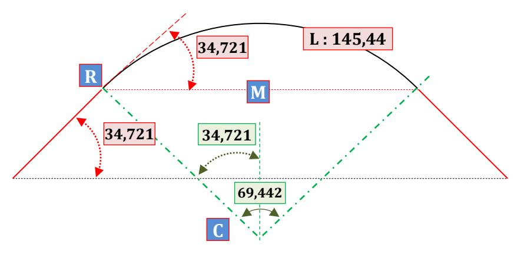

Aux appuis, il y a 2 pieds droits de longueur 26,797 m.

La partie cercle mesure donc 145,440 m.

Connaissant la longueur de l'arc L et son rayon R, on en déduit l'angle  $\alpha$  d'ouverture (en degré) avec  $\alpha$  = L \* 360 / (2 $\pi$  \* R) = 69,442 °.

Avec le triangle **RMC** formé par les 3 points suivants : **C** *Centre du cercle ;* **M** *milieu de la corde* **R** *raccordement pied droit/arc,* on obtient un angle qui coïncide parfaitement avec l'angle du pied droit. Ainsi, l'architecture de continuité entre le pied droit et l'arc de cercle est respectée.

**Question 17 : Étude simplifiée du cas de charge lié au seul poids propre de l'arc.**

*Schéma du modèle mécanique de l'arc. Repère et degré d'hyperstaticité du système.*

Rappel de l'hypothèse pour le repère global : orthonormé direct avec l'axe des X confondu avec l'horizontale. Son origine peut être placée n'importe où.

Dans un plan, une liaison encastrée génère 3 inconnues d'appui (1 sur X et 1 sur Y pour empêcher toute translation et 1 sur Z pour empêcher toute rotation).

Les 2 encastrements d'appui en A et C ayant 3

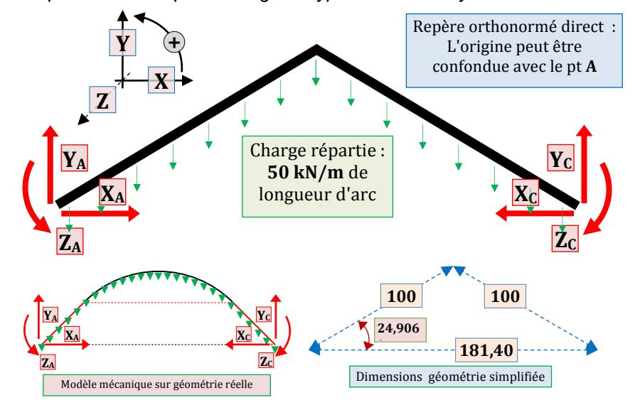

inconnues chacun, nous avons donc 6 inconnues Le PFS nous autorise 3 équations algébriques dans le plan : Le degré d'hyperstaticité est donc de 6 – 3 = **3** 

La charge pondérale totale est de 1000 tonnes 10 m/s<sup>2</sup> = 10000 kN.

Elle est à répartir sur les 200 m de la structure, soit une charge de 50 kN/m. Attention, cette action n'est pas à comptabiliser en projection horizontale (cas des charges de neige par exemple) !

#### **Question 18 : Calculer des actions à l'appui C.**

*Déduire les actions à l'appui C.*

Dans les études de stabilité, les actions réparties peuvent être assimilées à des charges résultantes ;

**Ce qui dans notre cas n'est pas nécessaire** puisque nous pouvons

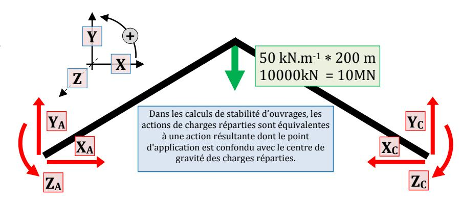

utilisant le **principe de symétrie :** Dans un système symétrique symétriquement chargé, les actions extérieures exercées aux appuis sont égales (en **intensité** et **direction**) de part et d'autre de l'axe de symétrie. Elles sont égales en **sens** lorsque ces actions ont même direction que l'axe de symétrie (dans notre cas l'axe Y vertical) et de sens opposé pour les autres axes du repère.

Avec les valeurs: X<sup>A</sup> = 5385 kN ; Y<sup>A</sup> = 5000 kN ; Z<sup>A</sup> = 37800 kN.m et sans utiliser le PFS, on peut donc écrire que : **X<sup>C</sup> = X<sup>A</sup> = 5385 kN** ; (le sens des flèches est ici opposé) ; **Z<sup>A</sup> = Z<sup>C</sup> =** 

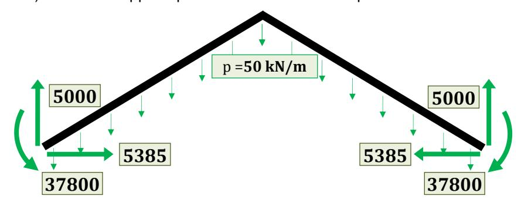

**37800 kN.m** (idem) ; et

**Y<sup>A</sup> = Y<sup>C</sup> = 5000 kN** (même sens des flèches).

**NB**: XA, X<sup>C</sup> etc. représentent l'intensité du vecteur action et non le vecteur lui-même ! Son point d'application correspond au point sur lequel est appliquée l'origine de la flèche représentant le vecteur (cependant, on pourra pour des raisons de "confort de lecture" trouver le point non à l'origine mais à son extrémité). Enfin, son sens est défini par la pointe de la flèche. Nous avons maintenant une structure parfaitement définie à partir de laquelle il va être possible de déterminer les éléments de cohésion.

## **Question 19 : Graphe de N(x), V(x), Mf(x) dans la partie BC.**

*Établir les équations des éléments de cohésion dans la « barre » BC.*

Rappel : écritures et convention adoptées : Repère général pour les calculs de statique : repère orthonormé direct avec l'axe X confondu avec l'horizontale et noté X, Y, Z (lettres en majuscules). Les actions extérieures au système sont

repérées par rapport à leur axe support et indicées par le point d'application.

Exemple : X<sup>A</sup> et non A<sup>X</sup>

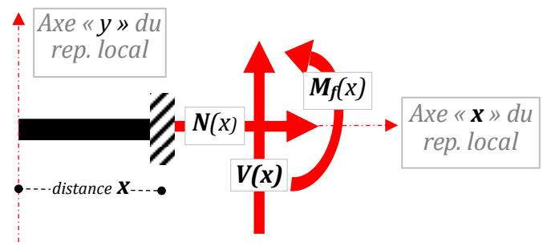

Pour l'étude des éléments de cohésion, la convention résumée ci-contre sous forme schématique est adoptée. Le repère local, nécessaire aux calculs de résistance des matériaux, est noté x, y, z (en lettres minuscules) et son origine est confondue avec l'extrémité "gauche" de la poutre. Son axe x suit la ligne moyenne formée par les centres de gravité des sections transversales.

Pour définir les équations des éléments de cohésion dans BC, il est nécessaire de connaitre les valeurs de ces éléments **au point B**, origine de la barre.

Ceci oblige à établir des calculs complémentaires en commençant par l'étude partielle de la barre AB.

Or, la symétrie de l'ensemble nous permet, « par miroir »,

de se limiter justement à cette barre AB et de reproduire symétriquement les valeurs sur BC.

On pourrait également utiliser la barre BC en « partant » de C et en conservant la partie droite ; mais dans cette approche, il faut être très vigilant quant aux conventions d'écriture (en particulier, dans la longueur de poutre qui est « chargée » : L-x et non x.)

Nous appliquerons dans cette correction l'étude de la barre AB, puis nous utiliserons le principe de

symétrie pour l'appliquer à la barre BC.

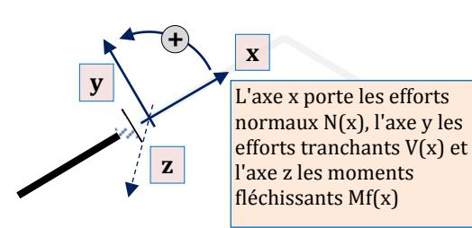

**Convention** à adopter selon ce schéma : Partie **gauche** conservée.

**B**

**z**

**y**

**x**

**+**

Vers pt **C** 

Pour déterminer les équations N(x), V(x) et Mf(x), il est impératif d'opérer un changement de repère pour les valeurs connues aux appuis.

Nous connaissons l'angle d'inclinaison,

soit = 24,906° ce qui donne :

$$\sin \alpha = 0,4211$$
 et  $\cos \alpha = 0,9070$ 

En fonction des valeurs sur les axes **X** et sur **Y**, on peut trouver celles correspondant au changement de repère sur **x** et **y**. Celles sur **Z** ne varient pas par rapport à celle sur **z.**

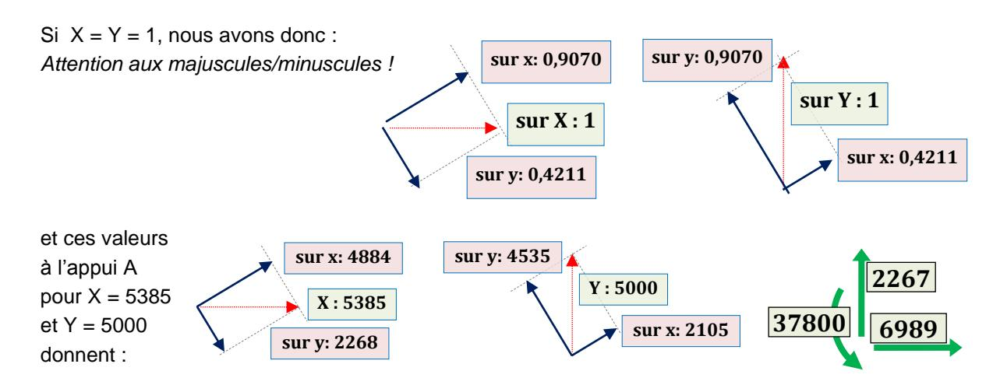

Soit un total de … *NB : x et y en kN ; z en kN.m (z est identique à Z).*

Sur la barre AB pour la charge répartie verticale, le calcul se fait sur le même principe (avec p<sup>X</sup> = 0 et p<sup>Y</sup> = 50 en kN.m-1 )

Le schéma de calcul pour établir les équations dans la barre AB est maintenant le suivant :

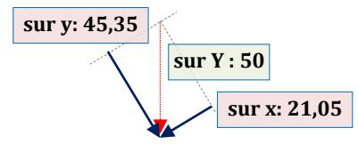

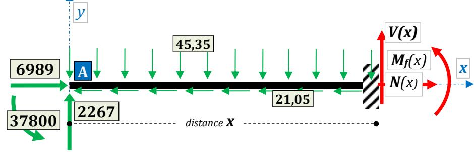

On note qu'il n'y a qu'une seule zone, donc les 3 équations seront définies sur l'ensemble de la barre. (N,V en kN et Mf en kN.m)

N(x) = 21,05 x – 6989 …. V(x) = 45,35 x – 2267 … Mf(x) = - 22,67 x 2 + 2267 x – 37800 ;

**Pour x = 0** : N(0) = - 6989 …. ; V(0) = - 2267 et ……… Mf(0) = - 37800

**Pour x = 100** : N(0) = - 4884 ……… V(100) = 2267 et …………Mf(100) = - 37800

**Mf est maxi** en x = 50, soit Mf (50) = 18875

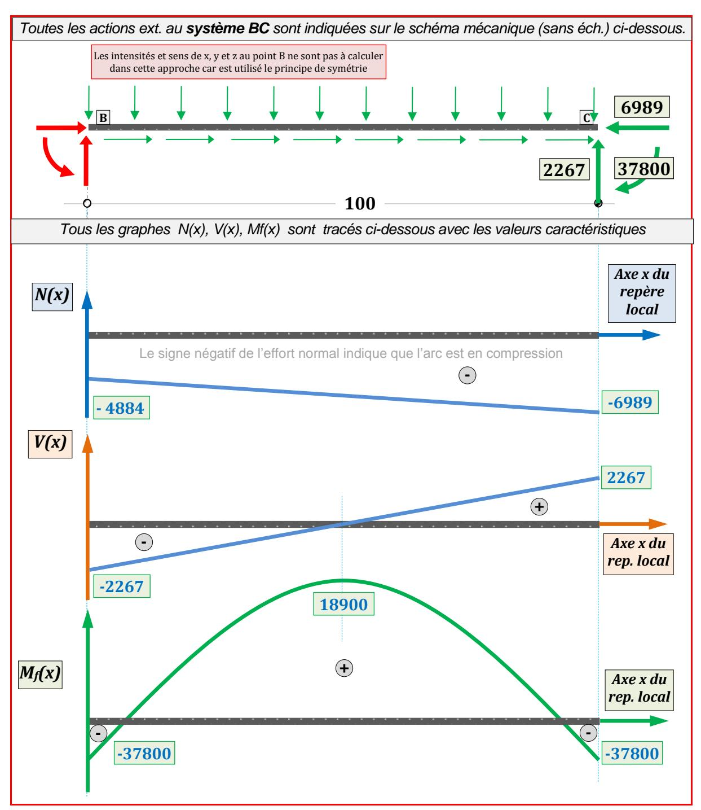

*En déduire l'endroit où les contraintes normales et de cisaillement sont les plus sévères.*

Zones de contraintes maximales : En considérant la loi de Navier-Bernouilli, tous les paramètres influant sur les contraintes normales sont à prendre dans leurs valeurs maximales (ou minimales selon leur sens multiplicateur ou diviseur)

$$\sigma_{xy} = N(x)/S - Mf(x) * y/I_{Gz}$$

Comme ici, l'effort normal est toujours négatif, il conviendra de prendre une valeur du 2ème terme toujours négatif également. IGz étant toujours positif, il faut que Mf(x) et y soient maxi ET de sens contraire. y est maximal aux arases supérieure (maxi +) et inférieure (maxi -) de l'arc

La zone de contrainte maxi est donc située sur la partie supérieure du pied de l'arc (en x = 0), les contraintes développées sont des compressions.

Quant aux contraintes maximales de cisaillement, elles sont situées dans les zones de tranchant maximal, à savoir aux extrémités des barres.

#### Étude 6 – ORGANISATION ET COUT DES ESSAIS DE CONVENANCE

⇒⇒⇒ Nombre de décimales des différentes valeurs des mesures..

La précision est donnée par les appareils de mesure : au millimètre près pour les points visés par laser sur l'arc (donc pas de décimales si les valeurs sont exprimées en mm) et au tiers de mm (0,3 mm) pour les cibles visées sur tablier et culées, donc avec 1 décimale.

⇒⇒⇒ Conformité de l'ouvrage vis-à-vis de la flèche (tablier et arc) et du tassement (culées).

Toutes les valeurs sont validées au regard du tableau de calculs ci-dessous. Dans tous les cas, on remarque que les mesures valident le projet dans la mesure où chaque visée confirme a posteriori le modèle de stabilité.

|    | Mes                                                      | ures     | sur      |       |      |              |              |       |                   |                     |                                                        |            |       |     | ont < 10         | •      | condition           | on 1]               |
|----|----------------------------------------------------------|----------|----------|-------|------|--------------|--------------|-------|-------------------|---------------------|--------------------------------------------------------|------------|-------|-----|------------------|--------|---------------------|---------------------|
|    |                                                          |          |          | C     |      |              | èche         | est c | ompri             | se en               | ntre 0,8C et 1,1C [condition 2]                        |            |       |     |                  |        |                     |                     |
|    |                                                          |          |          |       |      | int 1        |              |       |                   | et au               |                                                        |            |       |     | Point 2          |        | et a u              |                     |
| _  | M                                                        | (        |          | é     |      | 8C           | 1,1C         | Ctic  |                   | C <sup>tion</sup> 2 |                                                        | VI         | С     | é   | 0,8C             | 1,1C   | C <sup>tion</sup> 1 | C <sup>tion</sup> 2 |
| F  | -2,6                                                     | -1       |          | 1,2   |      | ,12          | -1,54        | ١     |                   | nV                  |                                                        | 2,4        | -1,2  | 1,2 | -0,96            | -1,32  | V                   | nV                  |
| Т  | -9,9                                                     | -12      | 2,1      | 2,2   |      | ,68<br>int 3 | -13,31       | n     | V                 | V                   | -9,3   -10,8   1,5   -8,64   -11,88   nV   V   Point 4 |            |       |     |                  |        |                     | V                   |
|    | М                                                        | (        | <b>.</b> | é     |      | BC           | 1,1C         | Ctic  | on 4              | ction 2             | ,                                                      | И          | С     | é   | 0,8C             | 1,1C   | C <sup>tion</sup> 1 | C <sup>tion</sup> 2 |
| F  | -2                                                       | -0       |          | 1,4   |      | ,48          | -0,66        | ,     |                   | nV                  |                                                        | ,3         | -0,2  | 1,1 | -0,16            | -0,22  | V                   | nV                  |
| Т  | -8,1                                                     | -1       | _        | 1,9   |      | 8            | -0,00<br>-11 | n     |                   | ٧                   |                                                        | 1,9        | 0,6   | 5,5 | 0,48             | 0,66   | V                   | nV                  |
|    | Mesures sur                                              |          |          |       |      |              |              |       |                   |                     | , ., .,                                                | 2,22       |       |     |                  |        |                     |                     |
|    | Point 1                                                  |          |          |       |      |              | Out          | tu.   | /1101             | 1 110 2             |                                                        | Point 2    |       |     |                  |        |                     |                     |
|    | М                                                        | C        | ;        | é     |      | 8C           | 1,1C         | Ctic  | on 1 (            | c <sup>tion</sup> 2 | ı                                                      | И          | С     | é   | 0,8C             | 1,1C   | C <sup>tion</sup> 1 | C <sup>tion</sup> 2 |
| F  | -28,1                                                    | -29      | 9,9      | 1,8   |      | ,92          | -32,89       | n     | v                 | ٧                   | -2                                                     | 9,8        | -29,7 | 0,1 | -23,76           | -32,67 | nV                  | ٧                   |
| T  | -3,6                                                     | -4       | 4        | 0,4   | -3   | 3,2          | -4,4         | \     | /                 | nV                  | -4                                                     | <b>1,5</b> | -3,4  | 1,1 | -2,72            | -3,74  | ٧                   | nV                  |
|    |                                                          |          |          |       | Poi  | nt 3         |              |       |                   |                     |                                                        |            |       |     | Point 4          | !      |                     |                     |
|    | M                                                        | C        | ;        | é     | 0,8  | 8C           | 1,1C         | Ctic  | <sup>on</sup> 1 C | C <sup>tion</sup> 2 |                                                        | VI         | С     | é   | 0,8C             | 1,1C   | C <sup>tion</sup> 1 | C <sup>tion</sup> 2 |
| F  | -29,4                                                    | -28      |          | 0,5   | -23  | ,12          | -31,79       | n     | V                 | ٧                   |                                                        | 26         | -28,4 | 2,4 | -22,72           | -31,24 | nV                  | V                   |
| Т  | -1,6                                                     | -1       | ,2       | 0,4   | -0,  | ,96          | -1,32        | \     |                   | nV                  |                                                        | ),7        | 0,3   | 1   | 0,24             | 0,33   | V                   | nV                  |
|    |                                                          |          |          |       |      |              |              | ures  | s sur             | la fa               | face SUD de l'arc.                                     |            |       |     |                  |        |                     |                     |
|    |                                                          |          | .        |       | Join | t 4/5        |              |       |                   |                     |                                                        |            | _     |     | Joint 8/         | 9      |                     |                     |
| _  | M                                                        | <u> </u> |          | é     |      | 8C           | 1,1C         | Ctic  |                   | c <sup>tion</sup> 2 |                                                        | VI         | С     | é   | 0,8C             | 1,1C   | C <sup>tion</sup> 1 | C <sup>tion</sup> 2 |
| F  | 5                                                        | 5,       |          | 0,2   |      | 16           | 5,72         | \     |                   | V                   |                                                        | 18         | -17   | 1   | -13,6            | -18,7  | nV                  | V                   |
| Т  | 1                                                        | 1,       | 1        | 0,1   | 0,   | 88           | 1,21         | \     | /                 | V                   | •                                                      | 4          | -3,5  | 0,5 | -2,8<br>oint 11/ | -3,85  | V                   | nV                  |
|    | Mesi                                                     | ires     | de       | s tas | sen  | nen          | ıts sı       | r les | s culo            | ées                 |                                                        | М          | С     | é   | 0,8C             | 1,1C   | C <sup>tion</sup> 1 | C <sup>tion</sup> 2 |
|    | Mesures des tassements sur les culées  Culée C0 Culée C1 |          |          |       |      |              |              | 6     | 5,6               | 0,4                 | 4,48                                                   | 6,16       | nV    | V   |                  |        |                     |                     |
| Pt |                                                          | t 2      | Pt ·     |       | Pt 4 | Pt           |              | Pt 2  |                   |                     | 4                                                      | -1         | -0,7  | 0,3 | -0,56            | -0,77  | V                   | nV                  |
| 0  |                                                          | )        | 0        | _     | 0,1  | 0,           | _            | ),1   | 0,1               | 0,                  |                                                        |            |       | ,5  | ,                | -,     | -                   |                     |
| -0 | ,3 -0                                                    | ,1       | 0        |       | 0    | -0,          |              | 0,1   | -0,2              | -0                  |                                                        |            |       |     |                  |        |                     |                     |
| ٧  | ,                                                        | /        | ٧        |       | V    | ٧            | ,            | V     | ٧                 | V                   | ,                                                      |            |       |     |                  |        |                     |                     |

⇒⇒⇒ Répondre aux exigences calendaires si une seule équipe est sur site. Expliquer

Pour la seule étape 1 - voir ci-dessous-, le temps nécessaire est de 9,09 heures. Les autres étapes étant plus ou moins de même durée, on ne peut envisager couvrir l'ensemble en 1 journée.

Il ne peut y avoir proportionnalité entre nombre de personnels et délai à cause des **temps improductifs d'attente**. Il convient de les distinguer dans le planning : Les opérations N° 11, 15 19 et 20 imposent des contraintes calendaires identiques quel que soit le nombre d'équipes présentes. On peut tenter de les masquer en imposant la pause repas par exemple. On peut faire ici le parallèle avec le durcissement des bétons où les temps d'attente sont généralement planifiés la nuit.

|    | Enclenchement des opérations de l'étape 1 avec 2 appareils (2 équipes)                          |       |                    |     |         |           |  |  |  |  |  |
|----|-------------------------------------------------------------------------------------------------|-------|--------------------|-----|---------|-----------|--|--|--|--|--|
| N° | Description succincte des tâches élémentaires                                                   | TU    | Unité              | Qté | T 1 ap. | TT. 2 ap. |  |  |  |  |  |
|    | Etape 1 : phase de contrôle de tassement des culées. Étalonnage des mesures (2 mesures par pt). |       |                    |     |         |           |  |  |  |  |  |
| 1a | Préparation des plateformes de Mise en Station ;                                                | 0,1   | H/station          | 8   | 0,8     | 0,4       |  |  |  |  |  |
| 1b | Marquage points de mesures et installation des cibles réflecteurs                               | 0,12  | H/cible<br>instal. | 28  | 3,36    | 1,68      |  |  |  |  |  |
| 2  | Transfert & Mise en Station des appareils.                                                      | 0,2   | H/station          | 2   | 0,4     | 0,2       |  |  |  |  |  |
| 3  | Mesures d'étalonnage du tablier 0Tablier files 37, 29, 22                                      | 0,001 | H/point visé       | 24  | 0,024   | 0,012     |  |  |  |  |  |
| 4  | Transfert & Mise en Station des appareils.                                                      | 0,2   | H/station          | 2   | 0,4     | 0,2       |  |  |  |  |  |
| 5  | Mesures d'étalonnage arc 0Arc Sud et Nord                                                      | 0,005 | H/point visé       | 12  | 0,06    | 0,03      |  |  |  |  |  |
| 6  | Mesures d'étalonnage des culées 0Culées file C0                                                | 0,001 | H/point visé       | 8   | 0,008   | 0,004     |  |  |  |  |  |
| 7  | Transfert & Mise en Station des appareils.                                                      | 0,2   | H/station          | 2   | 0,4     | 0,2       |  |  |  |  |  |
| 8  | Mesures de nivellement du tablier 0Tablier files 22, 15, 7                                     | 0,001 | H/point visé       | 24  | 0,024   | 0,012     |  |  |  |  |  |
| 9  | Transfert & Mise en Station des appareils.                                                      | 0,2   | H/station          | 2   | 0,4     | 0,2       |  |  |  |  |  |
| 10 | Mesures d'étalonnage des culées 0Culées file C1                                                | 0,001 | H/point visé       | 8   | 0,008   | 0,004     |  |  |  |  |  |
| 11 | Mise en place des trams chargement cas N°1: Flexion                                             | 0,3   | H/Chargement       | 1   | 0,3     | 0,3       |  |  |  |  |  |
| 12 | Mesures de nivellement des culées 1FCulées file C1                                             | 0,001 | H/point visé       | 8   | 0,008   | 0,004     |  |  |  |  |  |
| 13 | Transfert & Mise en Station des appareils.                                                      | 0,2   | H/station          | 2   | 0,4     | 0,2       |  |  |  |  |  |
| 14 | Mesures de nivellement des culées 1FCulées file C0                                             | 0,001 | H/point visé       | 8   | 0,008   | 0,004     |  |  |  |  |  |
| 15 | Transfert convoi F T chargement cas N°2 Torsion.                                               | 0,4   | H/transfert        | 1   | 0,4     | 0,4       |  |  |  |  |  |
| 16 | Mesures de nivellement des culées 1TCulées file C0                                             | 0,001 | H/point visé       | 8   | 0,008   | 0,004     |  |  |  |  |  |
| 17 | Transfert & Mise en Station des appareils.                                                      | 0,2   | H/station          | 2   | 0,4     | 0,2       |  |  |  |  |  |
| 18 | Mesures de nivellement des culées 1TCulées file C1                                             | 0,001 | H/point visé       | 8   | 0,008   | 0,004     |  |  |  |  |  |
| 19 | Enlèvement du convoi. Déchargement des voies                                                    | 0,1   | H/déchargt         | 1   | 0,1     | 0,1       |  |  |  |  |  |
| 20 | Temps de relaxation de la structure avant reprise des essais                                    | 0,25  | H<br>calendaire    | 1   | 0,25    | 0,25      |  |  |  |  |  |
| 21 | Mesures de nivellement des culées 0'Culées file C1                                             | 0,001 | H/point visé       | 8   | 0,008   | 0,004     |  |  |  |  |  |
| 22 | Mesures de nivellement de l'arc 0'Arc Sud et Nord                                              | 0,005 | H/point visé       | 12  | 0,06    | 0,03      |  |  |  |  |  |
| 23 | Transfert & Mise en Station des appareils.                                                      | 0,2   | H/station          | 2   | 0,4     | 0,2       |  |  |  |  |  |
| 24 | Mesures de nivellement du tablier 0'Tablier files 22, 15, 7                                    | 0,001 | H/point visé       | 24  | 0,024   | 0,012     |  |  |  |  |  |
| 25 | Transfert & Mise en Station des appareils.                                                      | 0,2   | H/station          | 2   | 0,4     | 0,2       |  |  |  |  |  |
| 26 | Mesures de nivellement du tablier 0'Tablier files 37, 29, 22                                   | 0,001 | H/point visé       | 24  | 0,024   | 0,012     |  |  |  |  |  |
| 27 | Transfert & Mise en Station des appareils.                                                      | 0,2   | H/station          | 2   | 0,4     | 0,2       |  |  |  |  |  |
| 28 | Mesures de nivellement des culées 0'Culées file C0                                             | 0,001 | H/point visé       | 8   | 0,008   | 0,004     |  |  |  |  |  |

| Budget total heures pour 1 brigade et 1 station | 9,09 |      |
|-------------------------------------------------|------|------|
| Budget heures pour 2 brigades et 2 stations     |      | 5,07 |

*Coût de revient HT de la mission (pour 2 brigades et 2 stations totales LEICA TS50)*

*2 ème offre (coût de revient HT) avec nouveautés technologiques et option location.*

| Main d'œuvre                                                        |               |               | Format 1 :<br>1 ing. ; 2 OG ; 1 aide |         |         | Format 2 :<br>1 ingénieur |         |                   |         |         |
|---------------------------------------------------------------------|---------------|---------------|--------------------------------------|---------|---------|---------------------------|---------|-------------------|---------|---------|
| Taux h. des personnels                                              | Taux          | Nb h          | h.s                                  | Q       | Coût    | Nb h                      |         | h.s               | Q       | Coût    |
| Technicien opérateur géo.                                           | 28,42         | 6             | 13,75                                | 2       | 781,55  |                           |         |                   |         | 0       |
| Compagnon aide-opérateur                                            | 21,16         | 12            | 13,75                                | 1       | 290,95  |                           |         |                   |         | 0       |
| Taux journée cadre                                                  |               | J/site        | J/ BE                                |         |         | site                      |         | BE                |         |         |
| Chef de projet ; Ingénieur                                          | 526,4         | 1             | 2                                    | 1       | 1579,2  | 0,5                       |         | 3,5               | 1       | 2105,6  |
|                                                                     |               | Sous-total HT |                                      |         | 2651,70 |                           |         | Personnel         |         | 2105,60 |
| Matériels locations                                                 | Px/j          | Nb j          | Q                                    |         |         | Px/ j                     | Nb j    | Q                 |         |         |
| Station totale + prismes                                            | 400 € / j     | 400           | 1                                    | 2       | 800     |                           | 400     |                   |         | 0       |
| Appareil de capture 3D LEICA<br>RTC360 en location                  | 1500 € /<br>j | 1500          | 1                                    |         |         |                           | 1500    | 1                 | 1       | 1500    |
| Véhicules 4 places (location<br>mois -base d'utilisation 15 j-)     | 300 € /<br>m  | 20            | 1                                    | 1       | 20      |                           | 20      |                   |         | 0       |
| Véhicule de service pour cadre : comptabilisé dans les FG           |               |               |                                      |         |         |                           |         |                   |         |         |
|                                                                     |               | Sous-total HT |                                      |         | 820     |                           |         | Matériels         |         | 1500    |
| Matériaux et consommables                                           |               | P U           |                                      | Q       |         |                           | P U     |                   | Q       |         |
| Petits consommables cibles                                          | 78 €          |               |                                      |         | 78      |                           |         |                   |         |         |
| Petits conso pour app.                                              | 2,2€/st.      | 2,2           |                                      | 2       | 4,4     |                           | 2,2     |                   | 1       | 2,2     |
| Matériaux pour plateforme                                           | 150 €         | 150           |                                      | 1       | 150     |                           | 150     |                   |         |         |
|                                                                     |               | Sous-total HT |                                      |         | 232,4   |                           |         | Conso             |         | 2,2     |
| Divers                                                              |               |               |                                      |         |         |                           |         |                   |         |         |
| Frais de dép.OG + aide                                              | 35 €/ j       | 35            |                                      | 3       | 105     |                           |         |                   |         | 0       |
| Frais de repas pour Cadre                                           | 18,3 €/j      | 18,3          |                                      | 1       | 18,3    |                           |         |                   | 1       | 18,3    |
| Formation spécifique études                                         | 1200€/j       |               |                                      |         |         |                           |         |                   |         | 1200    |
|                                                                     |               | Sous-total HT |                                      |         | 123,3   |                           |         | Divers            |         | 1218,3  |
|                                                                     | Total HT      |               |                                      | 3827,40 |         |                           | Total   |                   | 4826,10 |         |
| Données complémentaires                                             |               |               |                                      |         |         |                           |         |                   |         |         |
| Coefficient FG appliqué sur tous les<br>déboursés et frais d'études |               | 18,20%        | Frais<br>Généraux                    |         | 696,59  |                           |         | Frais<br>Généraux |         | 878,35  |
| Cout revient HT                                                     |               | 4523,99       |                                      | CR HT   |         |                           | 5704,45 |                   |         |         |

#### *Conclure.*

Quand bien même le coût de l'offre N°2 est supérieur, il semble pertinent de proposer cette prestation puisqu'elle apporte une plus-value indéniable (plan IFC). Une négociation en ce sens avec le maître d'ouvrage peut être envisagée pour lui démontrer le bien-fondé du surcoût … Cela étant, la capture 3D par scanner est une technologie qui se développe à grands pas et les bureaux de contrôles seront amenés de plus en plus à l'utiliser afin de pouvoir répondre aux exigences BIM des constructeurs. Ce

constat est à verser au crédit de l'achat d'un appareil complet. Un calcul approché rapide montre qu'il serait amorti au bout de : 100 000 € / 1500€/j = 67 jours, soit sur 3 ans : à peine 2 jours par mois ! Une étude d'investissement approfondie est donc à mener (on compte généralement un rapport de 3 à 5 entre la location de ce type de matériel et son amortissement en utilisation normale). Il est évident que si le carnet de commandes de la société est chargé, l'achat est très largement conseillé. La société pourrait alors facturer une prestation identique pour un montant amputé du coût de la journée de formation et du différentiel location/amortissement soit une offre aux alentours de 3000 €. Le seul obstacle restera peut-être la méfiance des marchés économiques vis-à-vis des perspectives du secteur BTP et concomitamment la retenue des banques dans l'accompagnement de certaines sociétés.

# **Rapport du jury de l'épreuve "Étude d'un système, d'un procédé ou d'une organisation"**

# **Option : Ingénierie des constructions.**

#### **1. Présentation du sujet.**

Le sujet de cette épreuve d'admissibilité du CAPET SSI option Ingénierie des Constructions s'appuie sur un projet réel, réalisé à Strasbourg **:** Le **pont de la citadelle,** baptisé depuis peu Pont André BORD.

Cet ouvrage participe à la (re)création d'une ligne continue de tramway (ligne D) entre la métropole alsacienne et Kehl, la ville-frontière allemande. Sa construction a nécessité la réalisation de plusieurs ouvrages de franchissement dont ce pont sur l'un des bassins du port du Rhin.

L'objet technique « pont » permet un questionnement très vaste. Six thèmes d'études très différents et éloignés les uns des autres ont été retenus, afin que tous les candidats ayant suivi des formations très diverses telles :

- Ingénierie des structures (CM ou Béton),
- Architecture et urbanisme,
- Ingénierie des méthodes, des matériaux, de la géotechnique, de l'hydraulique, de la topographie,
- Ingénierie du second-œuvre (acoustique, thermique)
- Etc.,

soient susceptibles de trouver matière à appréhender correctement, au moins pour partie, le sujet. Au besoin, une lecture attentive des annexes et documents techniques complète les connaissances nécessaires au traitement des questions.

Cette approche dans la conception des épreuves permet au jury de considérer que **tous les candidats**, et ce, quels que soient leur profil de formation, sont dans une posture de réussite, sans pour autant être spécialiste de l'un ou l'autre thème de l'épreuve qui porte, pour cette session 2019, sur les points suivants:

- Conception architecturale d'un lieu d'accueil,
- Choix constructifs : approche calculatoire de la sécurité lors des manutentions par élingage,
- Études des bétons et de ses composants,
- Environnement numérique collaboratif,
- Étude structurelle du pont,
- Organisation et coût d'essais de convenance.

Les 6 études proposées constituant le sujet ont été très largement simplifiées eu égard à la complexité du projet et sa réalisation réelles, ce qui pouvait laisser paraître quelques approximations et/ou omissions, voulues par le jury, par rapport aux règlements et autres normes calculatoires.

Dans le même esprit, la présentation des documents professionnels est réduite au minimum afin de ne pas surcharger le temps de lecture. Aussi, s'il pouvait apparaitre aux candidats un manque dans les données nécessaires à la résolution d'un problème, un apport personnel motivé et justifié pour y pallier n'était en aucun cas préjudiciable.

Totalement **indépendantes** entre elles, chacune des études renvoie à un secteur particulier du domaine de la construction. Dans la mesure du possible, les questions au sein d'un même thème sont de difficulté croissante et le plus souvent possible indépendantes également les unes des autres ; ce qui permet de pouvoir traiter -ne serait-ce que partiellement- n'importe quelle partie et ce, dans un ordre librement choisi. Là également, les candidats ne sont pas pénalisés par rapport à cela.

Enfin, le thème N°4, par le biais de concours nationaux auxquels se prêtent volontiers des équipes d'élèves et étudiants, traite d'un problème transversal : "**l'évolution des pratiques numériques collaboratives", pratiques de plus en plus visible chez les acteurs de la construction.**

#### **2. Analyse globale des résultats.**

Une majorité de candidats a bien compris la structure du sujet dans son approche par thème et comment traiter chaque partie grâce à ses connaissances acquises en cours de formation ou disponibles dans les documents annexes. Cela étant et malgré toutes les recommandations données dans les rapports de concours des années précédentes, le jury constate le traitement encore trop linéaire du questionnement proposé et en corollaire, un manque d'éléments de réponse aux derniers thèmes et/ou dernières questions dont le niveau de difficulté est pourtant loin d'être inaccessible. Ainsi, les candidats ayant opté pour une stratégie de rédaction mieux ciblée en fonction de leurs

capacités de réponse au questionnaire ont obtenu des résultats encourageants, voire satisfaisants.

#### **3. Commentaires sur les réponses apportées et conseils aux candidats.**

Étude N°1 : Conception architecturale d'un lieu d'accueil,

Ce thème vise à prendre en compte la capacité des candidats à proposer une transformation de l'environnement urbain en respectant un cahier des charges imposé par une maitrise d'ouvrage.

Les réponses attendues, essentiellement liées à la créativité architecturale dans un espace contraint ont été assez bien traitées. Le jury a noté cependant un manque de soin dans la rédaction et l'établissement des esquisses, montrant par là-même la nécessité pour certains de prendre un minimum d'assurance dans l'expression du trait architectural.

Seulement 2 tiers environ des candidats –ce qui reste très surprenant eu égard au peu de difficultés que présentait le questionnaire - ont traité l'ensemble du thème pour un résultat global positif.

Étude N°2 : Choix constructifs : approche calculatoire de la sécurité.

Cette partie fait appel à quelques connaissances du secteur « sécurité » de la technologie de construction, mais également, au-delà de l'aspect normatif de la manutention par apparaux de levage, des connaissances scientifiques incontournables : savoir appliquer le PFS, savoir utiliser les fonctions trigonométriques simples pour résoudre un problème géométrique dans un triangle quelconque ou bien encore rechercher le centre de gravité d'une pièce de matière homogène après en avoir déterminé le poids.

Là également, le jury constate de sérieuses difficultés pour certains candidats à traiter correctement des questions faisant appel à des apprentissages et connaissances vus en principe … au collège ! Environ 85% des candidats ont traité les 4 premières questions et seulement la moitié se sont confrontés aux 2 dernières. Le panel des résultats est très étiré, allant du très bon (pour les questions 4 et 5) au très décevant (en particulier pour la 6 et la 9).

Étude N°3 : Études des bétons et de ses composants,

Le matériau béton est ici traité dans sa « dimension granulaire » et dans son « impact environnemental ». Sauf pour celles liées à la résolution de la question 10 concernant les masses volumiques, (faisant partie des bases scientifiques acquises lors d'un parcours lycée), les autres connaissances nécessaires pour traiter le questionnement complet était accessible dans les apports documentaires (annexes ; documents techniques).

Les candidats ayant appliqué les différents textes normatifs en suivant les consignes données dans les documents ont obtenu d'excellents résultats. D'autres copies ont montré le survol du problème en traitant de façon trop superficielle le questionnaire. Cela étant, pour ces derniers, la stratégie est malgré tout restée "payante" puisque des points sont accordés à des réponses quand bien même incomplètes.

Environ 55 % des questions ont été traitées pour un résultat correct.

## Étude N°4 : Environnement numérique collaboratif

Le thème de cette dernière partie montre l'intérêt de plus en plus marqué que porte le jury aux nouvelles pratiques professionnelles qui se dessinent aujourd'hui dans le monde de la construction, tout en l'associant à un encouragement à une participation active aux différentes actions proposées par des institutions scolaires ou non. Dans notre cas, le concours « les génies de la construction » est initié grâce à un partenariat entre l'Éducation Nationale, des associations de professeurs et des représentants de la profession. *(Pour plus d'informations, voir le site Internet dédié).* Le questionnement propose une réflexion à mener dans le cadre de ce concours et a pour ambition de préparer les futurs candidats à maitriser les domaines innovants. Le jury a apprécié la curiosité des candidats à s'engager dans cette nouvelle voie et encourage les futurs professeurs à appréhender ces pratiques professionnelles qui seront le commun de demain.

Les réponses apportées ont permis à la plupart des candidats ayant traité cette partie (seulement 52%) d'obtenir de bons résultats.

#### Étude N°5 : Étude structurelle du pont,

Ce thème aborde les études structurelles. Il reprend plus ou moins une démarche similaire à celle utilisée dans les bureaux d'études : pré dimensionnement de la structure, définition des cas de charges, vérification de stabilité et des déformations en fonction du modèle mécanique retenu et éventuellement, ajustement de la géométrie de l'ouvrage.

Cependant, la grande différence entre cette épreuve et la réalité du bureau d'études réside dans le calculatoire, effectué grâce à des logiciels de calculs en BET, inexistants en situation de concours. Aussi est-il important d'axer les réponses au questionnaire non sur le calcul (répétitif le plus souvent) mais sur l'analyse du système étudié et surtout son modèle à partir duquel les calculs numériques sont menés.

Il est à noter que 40% seulement des candidats ont abordé tout le questionnaire de cette partie, d'ailleurs très bien traitée pour les seules questions 16, 17, et 18. Le jury estime par contre très insuffisants les résultats aux questions suivantes. Il déplore également le peu de candidats ayant répondu à cette étude.

Ceci paraît très surprenant au regard de l'option choisie par les candidats : en effet, ce type de problèmes et de résolutions qui les accompagnent, rentrent -a priori- dans la formation de base des candidats.

Outre les recommandations habituelles liées à la relecture des réponses apportées (ce qui permettrait vraisemblablement pour certains d'éviter de grossières erreurs scientifiques telles les confusions dans les unités, dans l'hétérogénéité des formules, dans les multiples ou sous-multiples, dans les opérateurs etc.), le jury conseille aux candidats un travail rigoureux de révision des bases de la mécanique. Les quelques connaissances minimales nécessaires pour renseigner le questionnaire sont largement accessibles à un étudiant de niveau licence, voire de niveau BTS/DUT.

Étude N°6 : Organisation et coût des essais de convenance.

Enfin, le dernier thème porte sur l'aspect « réglementation ; vérifications », de plus en plus prégnant dans la construction. Grâce au biais d'une recherche organisationnelle calendaire des contrôles de déformations et déplacements, ainsi que l'étude de prix associée, le jury a pu apprécier la pertinence des réponses pour les candidats (40%) ayant traité le thème.

#### **4. Conclusions.**

Comme pour toutes les épreuves de concours ou d'examen, la lecture attentive de l'ensemble du sujet permet de s'affranchir de l'erreur de "gestion du temps" trop souvent constatée dans les copies. Conscient de la "longueur" volontaire du questionnaire afin de balayer plusieurs thèmes, le jury recommande expressément aux candidats de ne pas trop s'attarder sur le traitement des points non ou mal maitrisés, quand bien même de nombreux éléments de solution sont donnés dans les annexes et documents techniques. Pour rappel, tous les thèmes sont accessibles, ne serait-ce que dans les premières questions de chaque partie !

Cela étant, Le jury a quand même été surpris par un nombre beaucoup trop important de mauvaises ou non-réponses à des questions très basiques (comme le calcul de la masse volumique du béton par exemple). L'institution qu'est l'École ne peut en aucun cas faire appel à des personnels dont le niveau scolaire n'atteint pas celui des élèves auxquels ils sont sensés s'adresser. Pour certains candidats, il est donc nécessaire de pallier à un manque certain de préparation -quand bien même a minima- dans certains champs disciplinaires.

Il faut noter que l'**évaluation** ne tient pas compte exclusivement -loin s'en faut- du "résultat", mais également d'autres critères tels le nombre de parties et de questions abordées, la capacité de concision des réponses, d'analyse des situations (même si les calculs sont faux), la capacité à chercher et trouver les bons éléments dans la documentation annexe et bien sûr la qualité de rédaction (soin, orthographe, expression écrite, qualité des schémas) etc. Pour illustrer ce propos, il faut considérer qu'une copie présentant 3 bonnes réponses à des questions "simples" sera certainement mieux considérée que la seule bonne réponse à une question "complexe". En effet, le jury estime que les candidats à l'option "Ingénierie de la construction" ne doivent pas se limiter à leur seule spécialité mais doivent maitriser, au moins en partie, d'autres domaines d'études du secteur du BTP.

Pour conclure ce paragraphe, les documents réponse proposés peuvent donner une indication sur le niveau de détails attendu par les correcteurs ; ceci amènera le candidat à **rechercher au maximum la brièveté** dans les éléments de réponses et à éviter toutes explications complémentaires "inutiles" et surtout "chronophages".

Le plus important étant au final que le futur professeur fasse comprendre au jury qu'il est en capacité de maitriser la bonne gestion d'une problématique et d'en d'assurer la résolution.

#### **5. Résultats.**

79 copies ont été évaluées pour cette épreuve, la moyenne des notes obtenues est de 8,5 et l'écarttype de 3,5 avec :

- 18,12 comme meilleure note ;
- 2,14 comme note la plus basse.

# Éléments de correction de l'épreuve « Étude d'un système, d'un procédé ou d'une organisation » – option ingénierie électrique

## 2 Étude énergétique

## 2.1 Mise en équations

Question 1:

$$V(t) = \gamma \cdot t \text{ et } x(t) = \gamma \cdot \frac{t^2}{2}$$

Question 2:

$$E_{dep1} = F_{in} \cdot \int_{0}^{\Delta t_{1}} \gamma \cdot t \cdot dt = F_{in} \cdot \gamma \cdot \frac{\Delta t_{1}^{2}}{2}$$

Question 3:

$$E_{dep2} = F_{in} \cdot \int_0^{\Delta t_2} V_0 \cdot dt = F_{in} \cdot V_0 \cdot \Delta t_2$$

## 2.2 Énergie utilisée pour parcourir le trajet

#### Question 4:

|          | 1      | 1      |                    | 1                                             |       |              | 1                         |  |  |
|----------|--------|--------|--------------------|-----------------------------------------------|-------|--------------|---------------------------|--|--|
| Portion  | Pente  | Rayon  | Distance parcourue | Paramètre<br>constant                         | Durée | $F_{in}$ (N) | E <sub>dep</sub><br>(W⋅h) |  |  |
| 1        | + 40 ‰ | 100 m  | 176 m              | $\gamma = 0.2 \text{ m} \cdot \text{s}^{-2}$  | 42 s  | 119 289      | 5 845                     |  |  |
| 2        | + 40 ‰ | 1000 m | 424 m              | $V_0 = 30 \text{ km} \cdot \text{h}^{-1}$     | 51 s  | 73 659       | 8 694                     |  |  |
| 3        | - 40 ‰ | 1000 m | 400 m              | $V_0 = 30  \mathrm{km} \cdot \mathrm{h}^{-1}$ | 48 s  | -60 855      | 0                         |  |  |
| 4        | - 40 ‰ | 1000 m | 27 m               | $\gamma = -1.5 \text{ m} \cdot \text{s}^{-2}$ | 6 s   | -317 955     | 0                         |  |  |
| 5        | + 30 ‰ | 500 m  | 176 m              | $\gamma = 0.2 \text{ m} \cdot \text{s}^{-2}$  | 42 s  | 92 386       | 4 526                     |  |  |
| 6        | + 10 ‰ | 100 m  | 648 m              | $V_0 = 30 \text{ km} \cdot \text{h}^{-1}$     | 78 s  | 34 566       | 6241                      |  |  |
| 7        | 0 ‰    | 7500 m | 176 m              | $V_0 = 30 \text{ km} \cdot \text{h}^{-1}$     | 21 s  | 5 309        | 258                       |  |  |
| 8        | 0 ‰    | 7500 m | 27 m               | $\gamma = -1.5 \text{ m} \cdot \text{s}^{-2}$ | 6 s   | -251 790     | 0                         |  |  |
|          |        |        |                    |                                               |       | Total:       | 25 567                    |  |  |
| Chantier |        |        |                    |                                               |       |              | 12 000                    |  |  |
| Retour   |        |        |                    |                                               |       |              | 12 550                    |  |  |
|          | Total: |        |                    |                                               |       |              |                           |  |  |

$$E_{\Delta RR} = 50 \, 117 \, \text{W} \cdot \text{h}$$

## 2.3 Énergie utilisée par le système de freinage pneumatique

#### Question 5:

 $E_{cycle} = Surface1 + Surface2 + Surface3$  $E_{cycle} = 25 \times 15\ 000 + (125-25) \times (10\ 500 + 4\ 200) / 2 + (360-125) \times 4\ 200 = 2\ 097\ 000\ W \cdot s = 582,5\ W \cdot h$ 

#### Question 6:

 $E_{freins} = E_{cycle} \times 2 \times 17 = 19 \ 805W \cdot h$ 

#### 2.4 Énergie consommée par le système de démarrage rhéostatique

#### Question 7:

$$V_{alim} = (R_{th1} + R_{th2}) \cdot i + 4 \cdot k_2 \cdot V \text{ donc } i = \frac{V_{alim} - 4 \cdot k_2 \cdot V}{R_{th1} + R_{th2}}$$

On en déduit 
$$R_{th} = \frac{V_{alim} - 4 \cdot k_2 \cdot V}{2 \cdot i}$$

#### Question 8:

$$p(t) = 2 \cdot R_{th} \cdot i^2 = (V_{alim} - 4 \cdot k_2 \cdot V) \cdot i$$

#### Question 9:

$$E_{RH} = V_{alim} \cdot i \cdot \Delta t_1 - 4 \cdot k_2 \cdot i \cdot \int_{0}^{\Delta t_1} \gamma \cdot t \cdot dt = V_{alim} \cdot i \cdot \Delta t_1 - 2 \cdot k_2 \cdot i \cdot \gamma \cdot \Delta t_1^2$$

## Question 10:

$$E_{RHs}$$
 = 4\*  $E_{Rh-42s}$  + 5\*  $E_{Rh-7s}$  avec:  
 $E_{Rh-42s}$  = (750\*380\*42-2\*0,1\*380\*0,2\*42²) = 1,19·10<sup>7</sup> J  
 $E_{Rh-7s}$  = 1,99·10<sup>6</sup> J.  
Soit  $E_{RHs}$  = 16 040 W·h.

#### 2.5 Énergie nécessaire totale

#### Question 11:

L'énergie totale utilisée pendant une nuit de travaux est de 85,96 kW·h.

#### 3 Dimensionnement du système de stockage d'énergie

#### 3.1 Choix des batteries

#### **Question 12**

L'énergie à fournir ne doit représenter que 80% de l'énergie stockée d'où Estockée = 100\*100/80 =125 kW·h

Batterie au plomb : masse bat\_pb =  $125\ 000/40 = 3\ 125\ kg = 3,125\ tonnes$ Batterie Lithium NCA : masse bat\_NCA =  $125\ 000/250 = 500\ kg = 0,5\ tonne$ 

Dans le contexte du transport avec les masses déjà considérées pour les wagons, la masse des batteries au plomb ne serait pas problématique.

#### **Question 13**

Pour des questions de sécurité, on peut considérer que le choix peut se porter sur une technologie au plomb (technologie éprouvée et à bas coût) mais les récents progrès sur les batteries Li-ion autorisent maintenant son utilisation dans les transports, la solution étant fiable mais plus chère.

La capacité de la batterie en A·h est telle que 100 000/515 = 0,8 \* C d'où C = 242 A·h Un module batterie Li-ion ayant une capacité de l'ordre de 56 A·h, il faudra 242/56=4,3 soit 5 modules en pratique.

#### **3.2 Dispositif de recharge de la batterie**

#### **Question 15**

Batterie numéro 2 (182 = 180 +2)

#### **Question 16**

La tension vaut C2BAh = 49850 dizaines de mV soit 498,5 V

#### **Question 17**

Le courant vaut FFF1h = (1111 1111 1111 0001) nombre négatif = -32768+32753 = -15 A (négatif car courant de charge).

#### **Question 18**

La température vaut 017Eh = 382 dixièmes de degrés soit T = 38,2°

#### **Question 19**

Algorithme de charge :

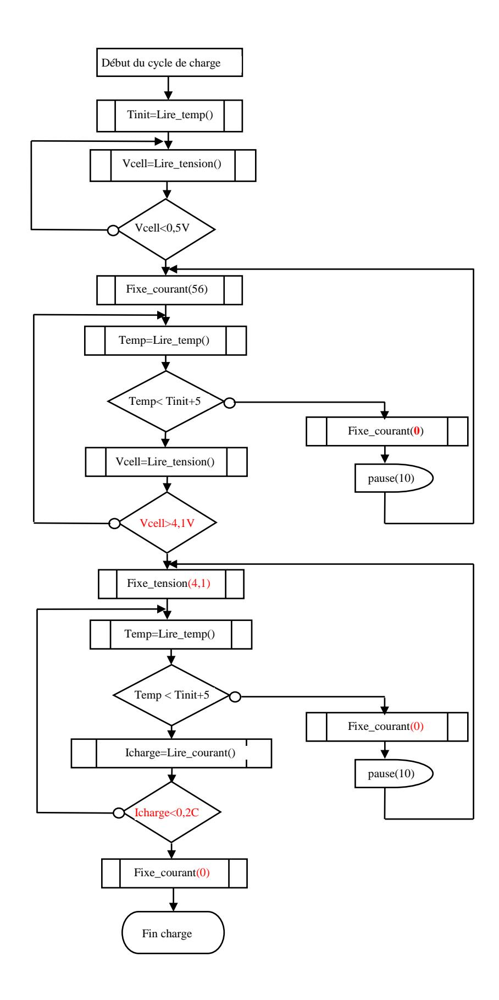

Pour la recharge en parallèle, le chargeur devra fournir 5\*56 = 280A (avec un niveau de courant de 1C pour chacune, la durée de la charge est de 1,5h).

Le problème en pratique est lié aux différences de caractéristiques qui apparaissent entre les batteries : ceci entraine un déséquilibre des courants de charge à travers chacune et même un danger potentiel.

(Les batteries choisies comportent un système de gestion pour assurer le rééquilibrage des états de charge).

#### **Question 21**

Dans le cadre de la recharge batterie par batterie, avec un courant de 150A (environ 3C), la durée de charge est réduite approximativement d'un facteur 3 pour 1 batterie.

La durée pour recharger 1 batterie est d'environ 1,5/3 = 0,5h.

Le nombre de batteries pouvant être rechargées en 4 heures est de 4/0.5 = 8.

Le nombre de batteries requis pour stocker l'énergie nécessaire est de 5 donc c'est cohérent.

#### 3.1 Restitution de l'énergie

#### **Question 22**

La batterie fournit Pf telle que  $Pf^*0,97^*0,95 = 96 \text{ kW}$  soit Pf = 104 178 W  $Pf = E_b^* I_{dech} = 104178/515 = 202,28 \text{ A}$ 

Courant à fournir par chaque batterie : 202,28/5=40,46 A, inférieur au nominal prévu donc cela convient.

#### 4 Dimensionnement du moteur de traction

#### 4.1 Aptitude à la traction du véhicule

#### **Question 23**

La rame est composée de 2 motrices, chacune possédant 4 essieux. Il y a donc 8 essieux moteurs. L'effort de traction s'exprime par  $F_e = \frac{F_{in}}{8} = \frac{128\,500}{8} = 16\,062,5\,\mathrm{N}$ .

#### **Question 24**

La charge liée au poids P de la motrice est uniformément répartie sur les quatre essieux moteurs. On a donc  $P_e = \frac{m_1 \cdot g}{4} = \frac{38\,120 \cdot 9,81}{4} = 93\,489,3\,\mathrm{N}$ .

L'effort normal au niveau d'un essieu s'exprime par  $N_e = P_e \cos(\alpha)$  avec  $\tan \alpha = \frac{i}{1000} = 0.04$ . La pente étant très faible ( $\alpha = 2.3^\circ$ ), on a  $N_e \approx P_e = 93489$  N.

Ainsi,  $\mu_r \cdot N_e = 0.12 \cdot 93489 = 11219 \, \text{N} < F_e$ . La condition de roulement sans glissement n'est pas vérifiée.

#### 4.2 Vérification du dimensionnement du moteur

#### **Question 25**

Les roues d'un essieu ont un rayon de  $r_{\rm e}=\frac{d_{\rm e}}{2}=0,43\,{\rm m}$ . Le couple au niveau des roues s'exprime donc par  $C_{\rm e}=F_{\rm e}r_{\rm e}$ . On trouve donc  $C_{\rm e1}=6,41\,{\rm kN\cdot m}$  et  $C_{\rm e2}=3,96\,{\rm kN\cdot m}$ .

Le réducteur a un rendement  $\eta = \frac{P_{\rm e}}{P_m} = \frac{C_{\rm e}\Omega_{\rm e}}{C_m\Omega_m} = \frac{C_{\rm e}\rho}{C_m}$ . On a donc  $C_m = \frac{C_{\rm e}\rho}{\eta}$ .

On trouve alors  $C_{m1} = 1,12 \text{ kN} \cdot \text{m}$  et  $C_{m2} = 0,69 \text{ kN} \cdot \text{m}$ .

#### **Question 27**

Le couple thermique est égal à 
$$C_{th} = \sqrt{\frac{1}{2048} \left(1120^2 \cdot 42 + 690^2 \cdot 51 + 558 \cdot 10^6\right)}$$
; 557 N·m

#### **Question 28**

D'après les caractéristiques des moteurs à courant continu, on a  $C_{nom} = \frac{P_{nom}}{\Omega_{nom}} = \frac{96\ 000}{1035 \cdot \frac{2\pi}{60}} = 885,7\ \text{N} \cdot \text{m} \ .$ 

Le couple nominal est supérieur au couple thermique équivalent ( $C_{nom} > C_{th}$ ). Ces moteurs sont bien adaptés pour la traction de la rame de métro.

#### 5 Synthèse

#### **Question 29**

Nous avons vu dans cette étude que le réseau Métro devra investir dans des batteries d'accumulateurs pour rendre autonome le véhicule lors du trajet vers la zone de chantier. Les moteurs peuvent par contre être conservés. Cependant, il faudra bien vérifier l'aptitude à la traction du véhicule pour éviter le patinage des roues.

#### **Question 30**

Pour respecter cette condition, trois solutions sont possibles :

- ajouter du lest dans la motrice (avec notamment les batteries d'accumulateurs) pour augmenter le poids P et donc l'effort normal  $N_{\rm e}$  ;
- sabler abondement la voie, pour améliorer le contact rail/roue, et donc augmenter l'adhérence  $\mu_r$ ;
- Diminuer l'accélération au démarrage et donc l'effort de traction  $F_e$ .

# **Rapport du jury de l'épreuve « Étude d'un système, d'un procédé ou d'une organisation » – option ingénierie électrique**

#### **1. Présentation du sujet**

Le support du sujet est une ancienne rame de métro appelée « MF 67 ». Les rames MF 67 ont été développées à la fin des années 60, le sujet propose d'étudier la faisabilité d'utiliser cette rame en tant que véhicule de maintenance industrielle en transformant les motrices avec le minimum de modifications possible.

Ce sujet comporte trois parties :

- la détermination de la consommation d'énergie du véhicule lors d'une nuit de travaux ;
- le dimensionnement du système de stockage et l'étude de sa recharge ;
- la vérification de l'aptitude à la traction et du dimensionnement des moteurs.

#### **2. Étude énergétique**

Le jury rappelle aux candidats que bien que les calculs mécaniques et énergétiques menés dans cette partie ne relèvent pas directement de l'ingénierie électrique, ils constituent un préalable obligatoire pour pouvoir dimensionner un système de stockage d'énergie.

Le jury regrette qu'un certain nombre de candidats de l'option ingénierie électrique ne sache pas écrire correctement l'équation d'une simple maille.

Peu de candidats ont réussi à répondre à l'ensemble des questions, ce qui ne leur a pas permis de calculer la consommation d'énergie totale de la rame.

#### **3. Dimensionnement du système de stockage d'énergie**

La prise en compte d'une profondeur de décharge maximale de 80% de la capacité totale a souvent été mal abordée.

Pour le choix de la technologie, le contexte (réutilisation d'une ancienne rame de métro) apporte une réponse différente de celle issue de la conception d'un nouveau dispositif. La masse totale des batteries n'était pas un obstacle en regard de celle de la rame et les critères de coûts et sécurité étaient à souligner.

Dans la partie communication CANopen trop peu de candidats ont bien assimilé les informations fournies sur la constitution de la trame c'est-à-dire l'ordre des informations sur 16 bits et le codage en complément à 2 pour coder les nombres signés. Ce dernier point constitue une lacune évidente pour une majorité de candidats.

L'algorithme de charge a révélé des lacunes dans l'association de la lecture graphique du fonctionnement avec les fonctions logicielles et les variables fournies.

Deux tiers des candidats ont traité les calculs de durée de charge séquentielle ou en parallèle. La prise en compte de la profondeur de décharge de 80% a souvent été mal traitée. Le jury regrette également que certains candidats ne sachent pas mener un calcul de pourcentage ou ne comprennent pas ce que représente la décharge d'un accumulateur.

Pour la restitution de l'énergie, le rendement des modules a été plutôt bien intégré dans les réponses.

#### **4. Dimensionnement des moteurs de traction**

La démarche guidée a permis de distinguer les candidats sachant bien traiter les problèmes mettant en jeu les notions de poids, d'effort, de couple et enfin de puissance mécanique. Le jury rappelle que ces notions sont incontournables pour répondre à un problème de dimensionnement de moteurs.

#### **5. Résultats**

La majorité des candidats aborde le sujet de manière linéaire en suivant le questionnement proposé mais en couvrant de façon inégale les différentes parties. La présentation de certaines copies laisse à désirer, une présentation claire et propre fait partie des compétences attendues d'un futur enseignant.

Beaucoup trop de candidats font des erreurs sur les ordres de grandeurs, les unités ou l'homogénéité des équations. Les méthodologies et les raisonnements sont parfois incohérents. Le jury invite les candidats à bien se préparer par rapport au niveau scientifique attendu lors de cette épreuve.

151 copies ont été évaluées, la moyenne des notes obtenues est de 8,5 et un écart type de 3,5 avec :

- 17,13 comme meilleure note ;
- 3,13 comme note la plus basse.

# **Éléments de correction de l'épreuve « Étude d'un système, d'un procédé ou d'une organisation » – option ingénierie informatique**

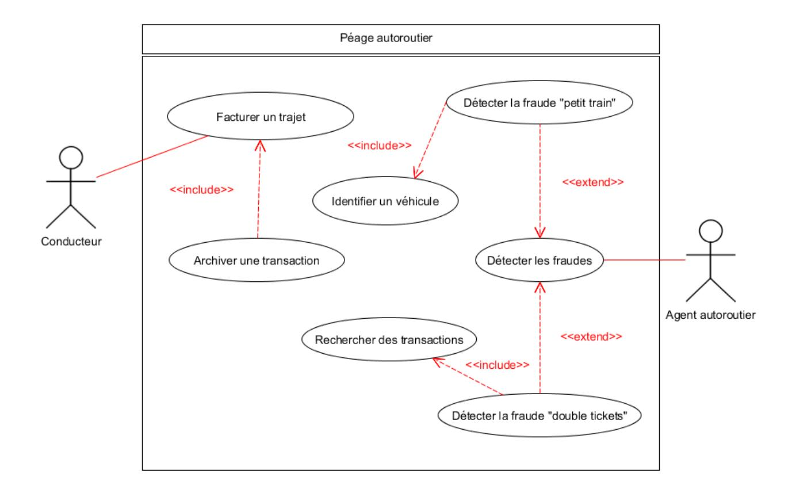

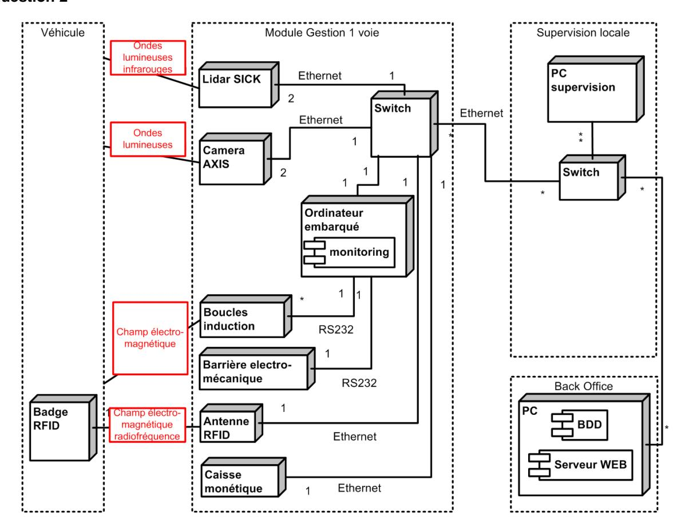

#### **Question 3**

L'utilisation de la lumière laser (cohérente) est dangereuse car une faible intensité peut bruler les yeux ou la peau. L'utilisation d'un laser est donc réglementée.

Ce laser est de type « classe 1 », sans danger pour les yeux ou la peau.

## **Question 4**

L'erreur de mesure systématique du lidar est de ±30 mm. Il faut que les zones aient une marge de 30mm par rapport à un objet ou une autre zone.

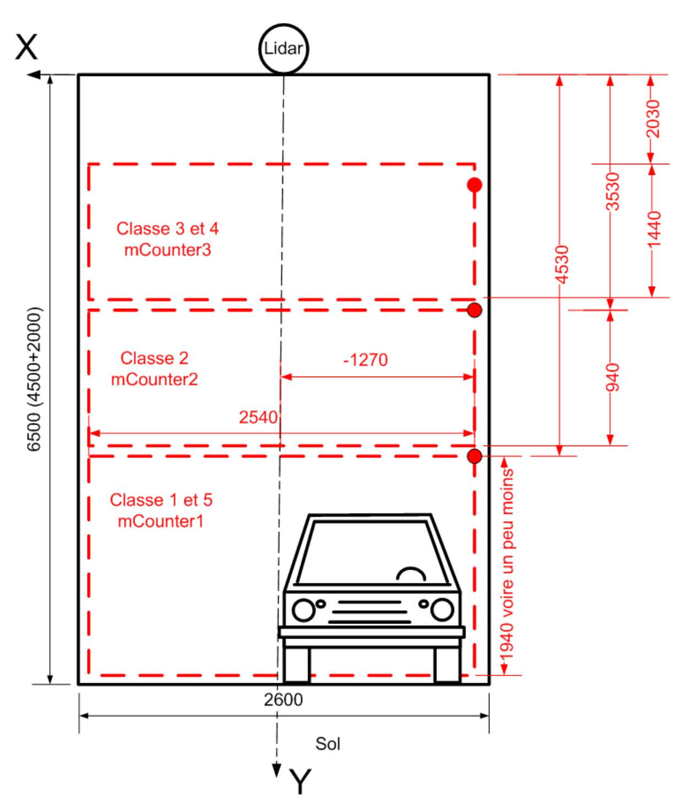

L'interaction entre deux périphériques réseaux par la scrutation cyclique ou polling nécessite que le PC embarqué envoie périodiquement une requête au lidar et que celui-ci lui réponde afin de connaitre l'état des compteurs.

En informatique, il existe un autre mode d'interaction possible entre deux périphériques réseaux. C'est l'interaction par interruption ou trap. Le PC embarqué intègre un serveur qui écoute sur un port réseau et quand un changement se produit sur un compteur du lidar, une trame est envoyée du lidar vers le PC embarqué.

Des protocoles comme SNMP disposent de ces deux modes.

#### **Question 7**

Le temps de réaction est de 20 ms, imperceptible pour l'usager.

#### **Question 8**

DSP signifie Digital Signal Processing. L'architecture d'un DSP comprend deux registres de données (ou plus) contrairement à un processeur classique.

Les images fournies sont au format JPG. La compression JPG utilise la transformée de Fourier Discrète dont l'algorithme (notamment les opérations assembleurs « multiplier et accumuler » utilisant les deux registres de données) est accéléré par un DSP.

#### **Question 9**

Les applets java sont du code java exécutable à l'intérieur de pages web. Le code java doit être exécuté par un logiciel : Java Runtime Environnement. L'exécution de ce code occupe du temps processeur.

Jazelle DBX (Direct Bytecode eXecution) est une extension qui permet à certains processeurs ARM d'exécuter du matériel du bytecode Java dans le hardware. C'est la cas du processeur de la caméra. Cela évite l'utilisation de l'Unité Arithmétique et Logique (ALU) du processeur pour l'exécution de code java et donc « soulage » le processeur.

#### **Question 10**

Le mot « PREEMPT » n'est pas normal pour un système Linux classique car Linux est nativement un système d'exploitation à temps partagé.

Dans le cas de la caméra, l'acquisition et le transfert d'images (ou flux vidéo) sont prioritaires par rapport au serveur WEB embarqué qui est moins prioritaire.

Le mot « PREEMPT » signifie que le noyau linux a été modifié (notamment la partie qui concerne l'ordonnanceur) et est devenu préemptif. Le système d'exploitation gère alors les processus en prenant en compte de manière immédiate leurs priorités lors de l'exécution des processus. Le système d'exploitation est alors dit : « temps réel ».

# **Question 11**

La solution informatique à mettre en œuvre pour que les caméras soient toujours à l'heure est le protocole NTP : Network Time Protocol.

Ce protocole permet la synchronisation d'une caméra (ou d'un ordinateur, ou un actif réseau) sur un serveur de temps dont on paramètre le nom ou l'adresse IP dans la caméra. La caméra demande régulièrement (une fois par jour typiquement) l'heure au serveur et la caméra utilise la réponse du serveur pour régler son heure.

#### **Question 12**

Le protocole ICMP permet de tester à distance (sans déplacement d'un technicien) la présence sur le réseau des caméras.

Ce protocole appartient à la couche 3 du modèle OSI.

Son intérêt est qu'il ne nécessite pas l'ajout de logiciel applicatif (utilisant les couches 3 à 7 du modèle OSI) pour fonctionner.

CGI (Common Gateway Interface) est un standard industriel qui indique comment transmettre la requête du serveur HTTP au programme, et comment récupérer la réponse générée. Au lieu d'envoyer le contenu d'un fichier (fichier HTML, image), le serveur HTTP exécute un programme (ici « lightcontrol.cgi »), puis retourne le contenu généré.

CGI est une technologie « server-side ».

Les paramètres sont passés par la méthode GET (paramètres visibles dans l'URL).

#### **Question 14**

M-JPEG signifie Motion JPEG et est un flux vidéo constitué d'une suite d'images compressées au format JPEG. MPEG4 est un flux vidéo constitué de quelques images de références et d'informations qui permettent de reconstituer les images intermédiaires.

MPEG4 permet de minimiser le volume de données transmis par rapport à M-JPEG.

#### **Question 15**

C'est un réseau privé de classe B. Il contient 65536-2 = 65534 adresses utilisables.

En effet, 29 voies x 9 équipements = 261 adresses. On dépasse donc 254 adresses IP et un réseau de classe C ne suffit plus.

Une critique possible est que 65534 adresses disponibles rendent la supervision du réseau lente. Il aurait été intelligent de choisir un masque réseau en 18 ou 19, 20.

#### **Question 16**

Dans le cas où le réseau du document technique DT4 serait réalisé à l'aide de commutateurs Ethernet non manageables, ce câblage n'est pas possible.

En raison des liaisons redondantes, les paquets Ethernet de broadcast se mettent à tourner en boucle et saturent le réseau.

#### **Question 17**

Dans le cas où le réseau du document technique DT4 serait réalisé à l'aide de commutateurs Ethernet manageables, ce câblage est possible si les commutateurs implémentent le protocole STP : Spanning Tree Protocol.

En effet, le protocole STP désactive les liens qui provoque des boucles.

#### **Question 18**

Les deux liens Ethernet entre « Supervision locale » et « Fleury barrière Principale » permettent d'assurer la sécurité des communications en cas de coupure d'une liaison mais oblige d'utiliser un protocole comme Spanning Tree. En effet, le protocole STP (Spanning Tree Protocol) permet en plus de désactiver les liens qui provoquent des boucles, d'assurer la continuité de service en réactivant les liens redondants désactivés en cas de coupure d'un lien.

Le protocole RSTP (Rapid Spanning Tree Protocol) permet également d'assurer la continuité de service en réactivant les liens redondants désactivés plus rapidement que le protocole STP.

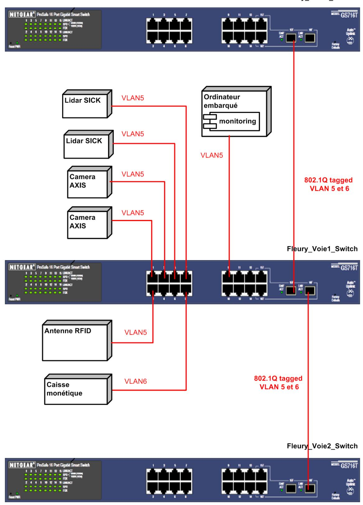

Les liaisons avec les autres commutateurs sont assurées par fibre optique connectée sur les GBIC insérés dans les ports SFP.

Les débits possibles du port Ethernet du lidar sont 10 ou 100Mb/s car il n'y a que deux paires de broche sur son connecteur Ethernet.

Cette vitesse de 10 ou 100Mb/s est compatible avec le switch NETGEAR GS716T car le switch prend en charge les vitesses suivantes : 10Mb/s, 100Mb/s et 1000Mb/s sur tous les ports.

#### **Question 21**

La mise à l'arrêt (mise hors tension) de tous les éléments d'une voie de passage (pour maintenance par exemple) n'entraine pas de conséquence sur les autres voies en raison de la conception résiliente du réseau.

#### **Question 22**

Un service peut être démarré automatiquement au démarrage du système d'exploitation, sans nécessiter de connexion d'un utilisateur contrairement à une application.

#### **Question 23**

Le schéma présenté dans le document technique DT6 s'appelle un diagramme de classes et le schéma présenté dans le document technique DR4 s'appelle un diagramme de séquence.

#### **Question 24**

Le lien entre les rectangles « QSurveillance » et « QLidar » sur le schéma dans le document technique DT6 s'appelle une composition.

#### **Question 25**

Celle implique comme ligne de code dans le constructeur de « QSurveillance » : **mSurvlidar1 = new QLidar() ;**

#### **Question 26**

Afin de générer la détection continue de l'apparition d'un véhicule et les traitements associés une fois que l'état du lidar est vérifié LidarStatusOk(), il faut effectuer les traitements qui suivent en boucle. Il faut donc ajouter l'item « Loop » à partir de SurvAskValCounter().

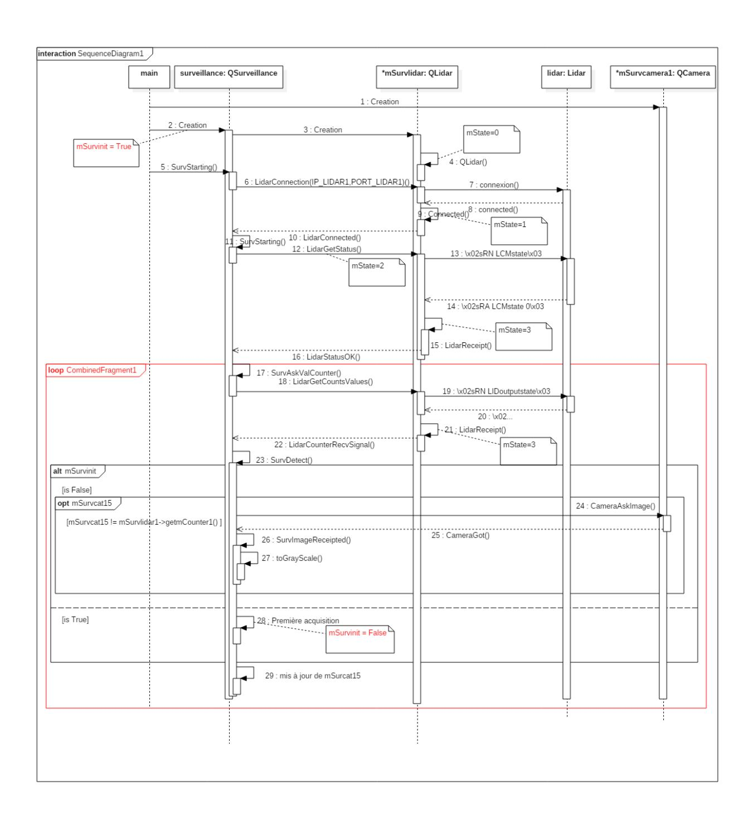

```
QTimer * mSurvtimer;
mSurvtimer = new QTimer(this);
connect(mSurvtimer, SIGNAL(timeout()), this, SLOT(SurvUpdate ()));
mSurvtimer->start(100);
```

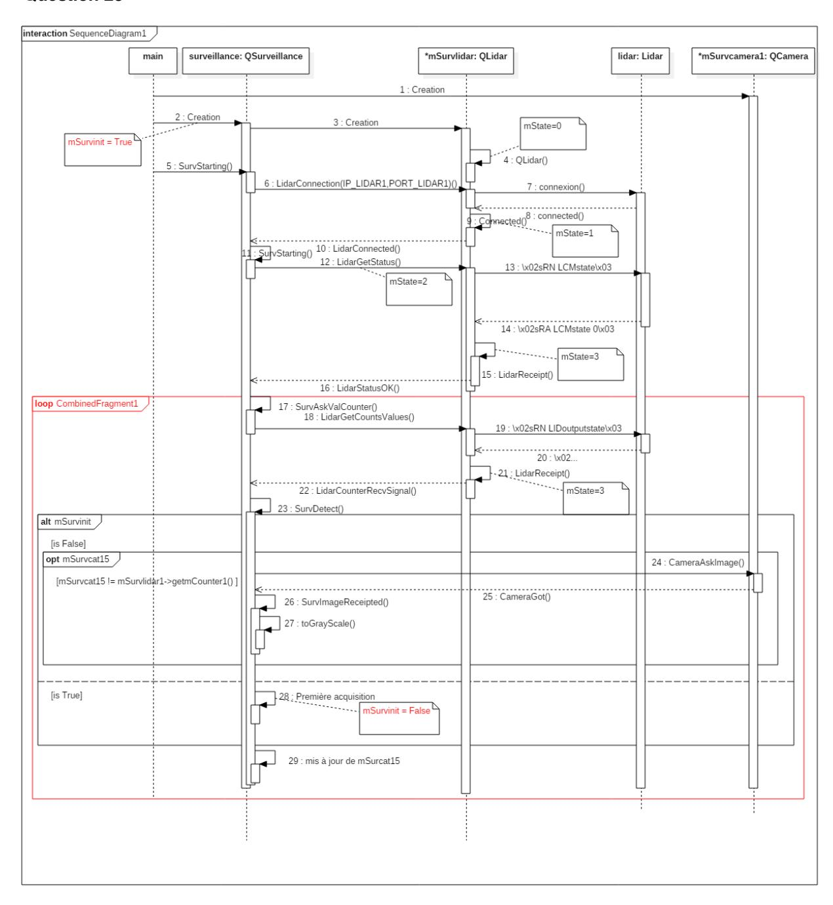

```
Question 29
void QLidar::LidarReceipt()
{
 qDebug() << "LidarReceipt" ;
 if (tcpSocket->bytesAvailable() >0 )
 {
 QByteArray bufferRecep;
 bufferRecep=tcpSocket->readAll();
 qDebug() << "Received " << bufferRecep;
 QString r=(QString)bufferRecep;
 qDebug() << "mState" << getmState();
```

```
 if (r.contains("\x02sFA"))
 {
 qDebug() << "Lidar return error" << r ;
 return;
 }
 switch(mState)
 {
 case 2:
 if (r == "\x02sRA LCMstate 0\x03")
 {
 qDebug() << "Status du lidar OK";
 setmState(3);
 qDebug() << "mState" << getmState();
 emit LidarStatusOK();
 }
 break;
 case 3:
 QStringList Tab=r.split(' ');
 bool ok;
 mCounter1 =Tab[5].toInt(&ok,16);
 mCounter2 =Tab[7].toInt(&ok,16);
 mCounter3 =Tab[9].toInt(&ok,16);
 emit LidarCounterRecvSignal();
 break;
 }
 }
}
```

Le passage d'une image déjà en niveau de gris dans un traitement qui convertit une image en niveau de gris ne génère aucun effet sur l'image.

## **Question 31**

Le fait « **QImage QImagePlus::toGrayScale(QImage imagesource)**» soit souligné dans le document technique DT6 indique que la méthode « **toGrayScale** » est statique et donc utilisable dès l'on a ajouté **#include <qimageplus.h>**

```
class QImagePlus : public QImage
{
public:
 QImagePlus();
 ~QImagePlus();
public slots : 
static QImage toGrayScale(QImage imagesource);
};
Question 33
QImage QImagePlus::toGrayScale(QImage imagesource)
{
 QImage imagedest=imagesource;
 QRgb col;
 int gray;
 int width = imagesource.width();
 int height = imagesource.height();
```

```
 for (int i = 0; i < width; ++i)
 {
 for (int j = 0; j < height; ++j)
 {
 col = imagesource.pixel(i, j);
 int r=(col >> 16) & 255 ;
 int g=(col >> 8) & 255 ;
 int b=(col) & 255 ;
 gray=(r * 11 + g * 16 + b * 5)/32;
 imagedest.setPixel(i, j, qRgb(gray, gray, gray));
 }
 }
 return imagedest;
}
```

|                       | RAID0 | RAID1 | RAID5 |
|-----------------------|-------|-------|-------|
| Assure la sécurité    |       |       |       |
| contre une panne d'un | non   | oui   | oui   |
| disque dur            |       |       |       |

|                                       | RAID0 | RAID1 | RAID5 |
|---------------------------------------|-------|-------|-------|
| Capacité maximale<br>disponible en To | 8To   | 4To   | 7To   |

#### **Question 35**

```
INSERT INTO `aprr`.`transaction` (
`numero` ,
`barriere_entree` ,
`voie_entree` ,
`date_heure_entree` ,
`image_entree` ,
`barriere_sortie` ,
`voie_sortie` ,
`date_heure_sortie` ,
`plaque_avant_sortie` ,
`plaque_arriere_sortie` ,
`image_avant_sortie` ,
`image_arriere_sortie` ,
`classe_vehicule`
)
VALUES (
NULL , 'VAL DE LOING-BARRIERE', '2', '2017-12-02 6:00:00', '', 'FLEURY-EN-BIERE', '15', '2017-12-
02 8:00:00', '', 'ADFEN84', '', '', '5'
);
```

#### **Question 36**

SELECT `tarif\_classe3` FROM `tarifs`WHERE `barriere\_entree` = "VAL DE LOING-BARRIERE" AND `barriere\_sortie` = "FLEURY-EN-BIERE"

```
SELECT * FROM `transaction` WHERE `transaction`.`plaque_avant_sortie` != 
`transaction`.`plaque_arriere_sortie`
```

#### **Question 38**

Les véhicules de classe 5 (motos) n'ont pas de plaque avant. On peut les exclure de la détection des fraudes dite « petit train ».

```
SELECT * FROM `transaction` WHERE `transaction`.`plaque_avant_sortie` != 
`transaction`.`plaque_arriere_sortie` AND `transaction`.`classe_vehicule` !=5
```

#### **Question 39**

```
SELECT DISTINCT transaction.*
FROM `transaction`,`tarifs`
WHERE `transaction`.`barriere_entree`="MACON-NORD"
AND `transaction`.`barriere_sortie`="FLEURY-EN-BIERE"
AND
(
SELECT `tarifs`.`distance`
FROM `tarifs`
WHERE `tarifs`.`barriere_entree` = "MACON-NORD"
AND `tarifs`.`barriere_sortie` = "FLEURY-EN-BIERE"
) / ( 
TIMESTAMPDIFF(
SECOND , `transaction`.`date_heure_entree` , `transaction`.`date_heure_sortie` ) /3600 ) <=10
```

donne tous les trajets entre MACON-NORD et FLEURY-EN-BIERE inférieur à 10 km/h.

#### **Question 40**

Toutes les 20 secondes, ce Shell-script surveille la connexion et déconnexion des périphériques sur le réseau en affichant un message horodaté.

La connexion d'un nouveau périphérique défectueux ou mal configuré peut entrainer des dysfonctionnements sur le réseau. De même, la déconnexion d'un périphérique peut entrainer des dysfonctionnements sur le réseau. Il est important pour l'administrateur réseau de savoir quel périphérique se connecte ou se déconnecte et quand, et ce, afin de résoudre le problème rapidement.

#### **Question 41**

Le symbole & permet l'exécution des commandes entre accolades en mode multitâches et donc tous les pings de 172.22.17.1 à 172.22.17.254 sont exécutés en même temps au lieu de l'un après l'autre. La durée d'attente de chaque ping étant limitée à 1 seconde via les options, le test de toute la plage d'adresses IP ne prend pas plus d'une seconde au lieu de 254 secondes en mode mono-tâche.

#### **Question 42**

Le protocole utilisé par le fabricant pour effectuer cette mise à jour est TFTP.

|             | IP           | MAC               | Port  |
|-------------|--------------|-------------------|-------|
| Commutateur | 172.22.49.59 | 04:A1:51:B0:B5:FA | 69    |
| PC          | 172.22.3.1   | 74:E6:E2:36:F9:29 | 61427 |

Le protocole TFTP : Trivial File Transfert Protocol permet le transfert de fichier sans authentification et est utilisé notamment pour sauvegarder et restaurer les configurations et les firmwares lors de la maintenance des actifs réseaux. Le serveur TFTP écoute par défaut sur le port 69 en mode non connecté (UDP).

#### **Question 44**

Le protocole TFTP fonctionnant en mode non connecté, il doit y avoir un acquittement logiciel fait par le serveur TFTP (ici le commutateur) après réception de chaque trame, afin de s'assurer de l'intégrité du transfert avant l'envoi des données suivantes.

Ici, la trame représente l'acquittement du bloc 8153.

#### **Question 45**

Le contrôle de flux matériel sur le port série n'est pas possible car il n'y pas les broches prévues pour les signaux électriques RTS/CTS dans le connecteur.

#### **Question 46**

Envoi : **02 73 52 4E 20 4C 43 4D 73 74 61 74 65 03**

Réception : **02 73 52 41 20 4C 43 4D 73 74 61 74 65 20 32 03**

#### **Question 47**

|                     | Supervision | Mise à jour des<br>firmwares | Dépannage |
|---------------------|-------------|------------------------------|-----------|
| Type de maintenance | Préventive  | Préventive                   | Curative  |

#### **Question 48**

Un nom de base de données utilisée dans le BigData est par exemple MongoDB, langage NoSQL, utilisant les API REST.

#### **Question 49**

La virtualisation permet de partager des ressources matérielles uniques (comme le processeur, la mémoire, …) entre plusieurs systèmes d'exploitation permettant des économies.

Ici, l'hyperviseur « bare-metal » ou type 1 (type ESX Server de VMWare, HyperV de Microsoft ou Xen) est directement installé sur le matériel puis les systèmes d'exploitation invités sont installés dans l'hyperviseur « bare-metal ».

Dans un hyperviseur de type 2 (type VirtualBox de Oracle), on installe d'abord un système d'exploitation dit « hôte »puis on installe l'hyperviseur de type 2 dans ce système d'exploitation. Les autres systèmes d'exploitation dits « invités » sont alors installés dans l'hyperviseur de type 2. L'inconvénient d'un hyperviseur de type 2 est que si le système d'exploitation « hôte » est compromis, tous les systèmes d'exploitation « invités » le sont possiblement, raison pour laquelle ce type d'hyperviseur n'est pas utilisé ici.

# **Rapport du jury de l'épreuve « Étude d'un système, d'un procédé ou d'une organisation » – option ingénierie informatique**

#### **1. Présentation du sujet**

Le support du sujet est un système de barrière de péage autoroutier.

Le contexte de l'étude est le problème des fraudes. En effet, les sociétés gestionnaires d'autoroutes constatent quotidiennement des fraudes au péage sur le réseau hexagonal. Il existe deux fraudes classiques :

- Scénario fraude « petit train »
- Scénario fraude au « double ticket »

L'objectif de cette étude consiste à étudier les solutions anti-fraude mises en œuvre à la barrière de péage autoroute de Fleury en Bière sur l'A6.

#### **2. Analyse globale des résultats**

Le sujet couvre la majorité des compétences et connaissances du programme informatique de l'option ingénierie informatique y compris celles liées au domaine des traitements d'images.

L'ensemble du sujet a été abordé de manière linéaire par une majorité des candidats et la fin du sujet a été peu traitée.

Le jury constate cependant des lacunes sur le plan disciplinaire dans les fondamentaux de l'ingénierie informatique (modélisation, programmation orientée objet, architecture des ordinateurs, système d'exploitation, mise en réseau des équipements).

Les connaissances les moins maîtrisées par les candidats se concentrent autour de la programmation orientée objet et de la partie réseau qui sont pourtant des notions fondamentales à l'heure actuelle.

Le jury regrette que beaucoup de candidats présentant cette épreuve n'aient pas approfondi les connaissances déjà abordées dans les sujets des années précédentes.

Au total, 116 candidats ont composé. Le jury rappelle aux candidats l'importance de soigner la présentation de la copie et la qualité de la rédaction. En effet, certaines copies sont difficilement lisibles. Les candidats doivent correctement repérer les questions et en cas d'absence de réponse, l'indiquer.

#### **3. Commentaires sur les réponses apportées et conseils aux candidats**

*Partie 1 – Analyse du système.* 

Cette partie a pour but d'étudier le fonctionnement du système et les interactions avec les usagers et leurs véhicules (en utilisant un formalisme UML/SYSML).

Cette partie a été correctement traitée par la moitié des candidats.

*Partie 2 – Étude des capteurs.* 

Cette partie a pour but de valider le choix des capteurs installés.

Les éléments matériels étudiés étaient

un lidar (radar utilisant des ondes infrarouges type laser),

une caméra avec illuminateur infrarouge pour la reconnaissance de plaques d'immatriculation.

Cette partie a été correctement traitée par la moitié des candidats notamment la partie physique.

La notion de noyau préemptif et de machine virtuelle java est connue par un dixième des candidats.

De même, le protocole http est mal connu par les candidats, entre autres les méthodes GET/POST.

#### *Partie 3 – Conception du réseau*

Cette partie a pour but d'élaborer et valider les choix réseau.

Les éléments matériels étudiés étaient :

- les éléments constitutifs d'une voie de passage
- les switches
- le câblage inter switches

Cette partie a été correctement traitée par un cinquième des candidats.

L'adressage IPv4 , bien que connaissance de base, n'est pas maitrisé par l'ensemble des candidats. Le problème des boucles sur un réseau Ethernet est identifié par un tiers des candidats. La notion de VLAN et de backbone (dorsale) est connue par un dixième des candidats.

Le jury invite les candidats à travailler leurs connaissances dans le domaine des réseaux et ne pas se contenter de connaissances superficielles.

#### *Partie 4 – Étude du fonctionnement du logiciel GateService*

Cette partie a pour but de valider le fonctionnement logiciel des éléments principaux.

Cette partie concernait la programmation orienté objet du logiciel de gestion d'une voie de passage notamment le traitement d'une image (passage en niveau de gris).

Cette partie a été correctement traitée par un cinquième des candidats.

Les appellations « diagramme de classes » et diagramme de séquences », ainsi que la relation de « composition » entre deux classes sont connues par un tiers des candidats.

Concernant la conception détaillée, le jury insiste sur l'importance de maîtriser les concepts de base en technologie objet, en particulier le diagramme de classes (relations de composition et d'héritage, nom de rôle et cardinalité) et le diagramme de séquences.

#### *Partie 5 – Consolidation des données*

Cette partie a pour but d'assurer la pérennité des données et la détection des fraudes.

Cette partie consistait principalement en la recherche des fraudes par insertion, puis recherche dans la base de données en utilisant le langage SQL.

Cette partie a été correctement traitée par la moitié des candidats.

Une question concernait l'architecture des ordinateurs : le RAID disque. Elle a été traitée par la moitié des candidats.

#### *Partie 6 – Supervision et maintenance*

Cette partie a pour but d'organiser la supervision et la maintenance.

Cette partie traitait des techniques utilisées en maintenance préventive et curative : Shell-script UNIX, analyse de trame TFTP , liaison série, analyse de trame en hexadécimal du lidar.

Cette partie a été correctement traitée par un cinquième des candidats.

Ces notions font partie des bases à connaître, le jury invite les candidats à réviser la norme RS232.

#### *Partie 7 – Synthèse générale*

Cette partie a pour but d'étudier de potentielles évolutions possibles dans l'hébergement des données dans le Big Data et la virtualisation.

Cette partie a été correctement traitée par peu des candidats, vraisemblablement par manque de temps. Le jury invite donc les candidats à mieux gérer leur temps.

Le jury invite également les candidats à faire de la veille technologique afin de maintenir à jour leurs connaissances informatiques, qualité attendue d'un futur enseignant.

#### **4. Conclusion**

Les connaissances les moins maîtrisées par les candidats se concentrent autour de la programmation orientée objet et du réseau qui sont pourtant des notions fondamentales à l'heure actuelle.

Les connaissances les mieux maîtrisées par les candidats sont l'analyse d'un système, l'analyse des documentations, l'accès aux bases de données en utilisant le langage SQL.

Beaucoup de candidats ont donc des connaissances trop parcellaires. Le jury rappelle aux candidats l'importance d'avoir un niveau de connaissances et de culture technique suffisamment large dans l'ensemble des domaines de la spécialité Ingénierie Informatique et invite les futurs candidats à travailler dans ce sens.

## **5. Résultats**

116 copies ont été évaluées, la moyenne des notes obtenues est de 8,5 et un écart type de 3,5 avec :

- 20 comme meilleure note ;
- 2,8 comme note la plus basse.

# Éléments de correction de l'épreuve « Étude d'un système, d'un procédé ou d'une organisation » – option ingénierie mécanique

#### **Question 1**

L'écart maximal est de 1,2 °C pour le 360 pour avec une amplitude de 12 °C soit un maximal de 10 d'écart. La modélisation par une sinusoïde est justifiée avec les caractéristiques suivantes :

- $T_0 = 8.2$ °C
- $-\Delta T = 5.9$ °C
- $\varphi = -2,62 \text{ rad ou } 0,54 \text{ rad}$

$$\omega = 0.017 \text{ rad} \cdot \text{s}^{-1}$$

D'où 
$$T(^{\circ}C) = 8,2-5,9\sin(0,017 \cdot t + 0,54)$$
  
 $T(^{\circ}C) = 8,2+5,9\sin(0,017 \cdot t - 2,62)$ 

#### Question 2

$$\lambda_{\text{moyen}} = 2 \text{ W} \cdot \text{m}^{-1} \cdot \text{K}^{1} \text{ et } D_{\text{moyen}} = 7.5 \cdot 10^{-7} \text{m}^{2} \cdot \text{s}^{-1}$$

#### **Question 3**

La température reste constante à environ 9,2°C à partir d'une profondeur de 2,5 m.

#### **Question 4**

A partir d'une profondeur de 2 m, la température saisonnière n'influence plus la température des sédiments.

#### **Question 5**

En dessous d'une profondeur de 0,5 m, le modèle semble correct. Les variations proviennent de la valeur constante de  $\lambda$  et D dans le modèle ce qui n'est pas le cas en réalité.

#### **Question 6**

A partir de l'analyse des deux scénarios la profondeur d'ensouillage de 1,5 m est suffisante.

#### **Question 7**

(Voir DR 1a)

Les ensembles non modélisés sont la poulie de grue, le câble ombilical, le snubber et le ROV. (Leur poids sera appliqué au portique pour tenir compte de leur effet)

#### **Question 8**

(Voir DR 1b)

#### **Question 9**

Par le théorème d'Al-Kashi ou Pythagore généralisé dans le triangle ABC on obtient la relation suivante  $x(\theta) = \sqrt{(AC)^2 - 2 \cdot AC \cdot CB \cdot \cos(\theta - 74^\circ) + (CB)^2}$  OU

Par une fermeture géométrique  $\overrightarrow{AB} + \overrightarrow{BC} + \overrightarrow{CA} = 0$  soit  $\vec{x} \cdot \vec{u} + \vec{CB} \cdot \vec{v} - \vec{AC} \cdot \vec{x_0} = 0$ .

En projection on obtient :

$$/\overrightarrow{x_0} \to x \cos \alpha + CB \cdot \sin(\theta + 16^\circ) - AC = 0$$

$$/\overrightarrow{x_0} \to x \sin \alpha - CB \cdot \cos(\theta + 16^\circ) = 0$$

$$/\overrightarrow{x_0} \to x \sin \alpha - CB \cdot \cos(\theta + 16^\circ) = 0$$

$$/\overrightarrow{y_0} \to x \sin \alpha = CB \cdot \cos(\theta + 16^\circ)$$

Soit 
$$/\overrightarrow{x_0} \rightarrow x(\theta) = \sqrt{(AC)^2 - 2 \cdot AC \cdot CB \cdot \sin(\theta + 16^\circ) + (CB)^2}$$

La course théorique du vérin vaut  $c = x_{\text{max}} - x_{\text{min}} = x(-53^{\circ}) - x(12^{\circ})$  soit c = 3 091 mm.

#### Question 10

La course du vérin à partir de la simulation est  $c = 3\,100$  mm. Les deux valeurs sont semblables. La simulation est conforme au modèle géométrique (écart <1%)

#### **Question 11**

(Voir DR 1b)

L'ensemble {tige + corps} est soumis à deux glisseurs donc l'effort est dirigé selon (AB) (respectivement (AB')).

Pour  $\theta_{\min}$ , le poids crée un moment positif selon  $\overrightarrow{z_0}$  en C, il faut le contrer avec un effort de la tige sur le portique selon  $\overrightarrow{AB}$ . Pour  $\theta_{\max}$ , on a l'inverse. (Voir DR 1b pour les sens des efforts)

#### Question 12

L'effort dans le vérin est d'intensité nulle lorsque le portique est en position verticale car le moment créé par le poids est nul dans cette position.

#### **Question 13**

La position la plus défavorable correspond à la position  $\theta_{max}$  = 53° pour deux raisons :

- la surface de contact utile avec l'huile dans le vérin est la plus faible (phase de rentrée de tige) :
- le moment dû au poids est le plus grand alors que l'angle ABC est le plus faible soit le moment dû à l'effort de la tige est le plus faible.

L'effort maximal théorique est de  $F_{max}$  = 42 500 daN pour  $\theta_{max}$  = 53° or  $F = p \cdot S = p \cdot \pi \frac{D^2 - d^2}{\Lambda}$  soit

$$p = \frac{4 \cdot F}{\pi \left(D^2 - d^2\right)}$$

D'où la pression maximale est  $p_{max} = 180$  bars, ce qui est compatible avec le circuit hydraulique de pression maximale de 200 bars.

D'autre part, la course utile de 3 100 mm est bien inférieure à la course maximale du vérin (3 800 mm). Donc le choix du vérin est validé suivant deux critères géométrique et statique.

#### **Question 14**

(Voir DR 2)

#### **Question 15**

La pression de tarage doit valoir  $P_t = K \cdot P_B$  soit  $P_t = 270$  bars.

#### **Question 16**

L'équation de la résultante de la statique en projection sur l'axe de la tige du vérin en isolant le piston est la suivante :  $F_A - F_B + F_{portique \rightarrow tige} = 0$  soit  $P_A \cdot S_A = P_t \cdot S_B - F_{portique \rightarrow tige}$  soit

$$P_{A} = \frac{P_{t} \cdot \pi \left(D^{2} - d^{2}\right) - 4 \cdot F_{portique \to tige}}{\pi D^{2}}$$

Par lecture de la courbe en annexe la valeur minimale de  $F_{portique \to tige}$  est de - 5 000 daN, on en duit la pression minimale  $P_A = 140$  bars.

Étude du tronçon BE : CB<x<CE

On isole S+ N(x) = -9900N

T(x) = -8300N

Mfz(x) = -(CE-x).8300

Étude du tronçon BE : 0<x<CB

On isole S+

N(x) = -9 900-37 000 = -46 900 N

T(x) = -8300+19700 = 11400 N

Mfz(x) = -(CE-x).8300+(CB-x).19700

On a CE=7 435mm et CB=3 132mm

Tracé de Mfz:

Mfzmax=8 300(CB-CE) =8 300(3132-7435)

Mfzmax=-360·106 N.mm pour les deux tronçons

Mfzmin =0 N.mm pour les deux tronçons.

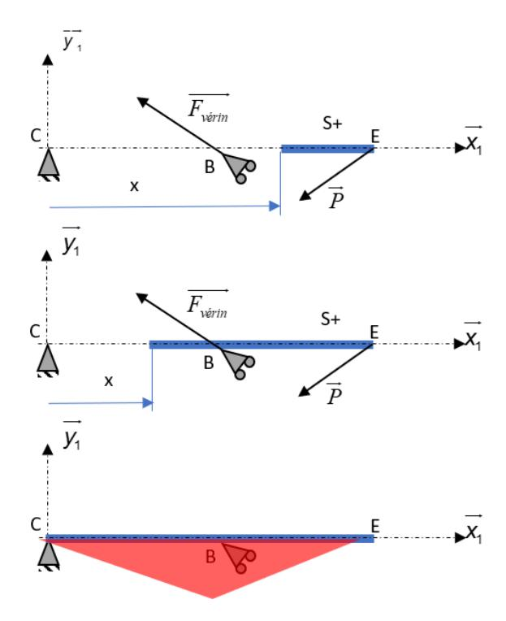

#### **Question 18**

 $\sigma(y) = -\frac{M_{fz}(x)}{I_{Gz}}y$  Pour que  $\sigma(y)$  soit constant le long de la poutre il faut que IGz varie suivant la

variation de Mfz.

La poutre est rectangulaire donc  $IGZ = \frac{b \cdot h^3}{12}$ . Le dimensionnement se fait pour  $y_{max} = \frac{h}{2}$  (cas le plus défavorable)

$$\sigma_{max} = -\frac{M_{fz}(x)}{b \cdot h^3} \cdot 12 \cdot \frac{h}{2} = -\frac{M_{fz}(x)}{b \cdot h^2} \cdot 6 \cdot \text{D'où } h(x) = \sqrt{\frac{M_{fz}(x)}{Constante}}$$

#### **Question 19**

On observe que la poutre suit une évolution linéaire croissante de C à B puis décroissante de B à E

#### **Question 20**

Conditions aux limites :

en C appui de type pivot ;

en B et E deux charges ponctuelles ou surfacique (en fonction du logiciel) suivant des normales orienté suivant la direction des deux efforts.

#### **Question 21**

On constate que les contraintes dans le bras de grue sont inférieures à la limite élastique du matériau. La contrainte est trop élevée au niveau de l'articulation en B. La solution est d'augmenter l'épaisseur de la tôle dans cette zone par un doublage des parois.

La largeur d'enroulement est de 1 600mm, le diamètre du câble est de d = 48,1mm donc par couche on a 33 tours de câble.

Le nombre de couche est  $N = \left| \frac{R_{\text{max}i} - R_{\text{min}i}}{d} \right| = 5$ .

A la nième couche on a :

Le rayon d'enroulement  $R(n) = R_{\min i} + \frac{d}{2} + n \cdot d$ 

la longueur enroulée pour la couche n vaut  $L(n) = 66 \cdot \pi \cdot R(n) = 66 \cdot \pi \cdot (R_{\min i} + \frac{d}{2} + n \cdot d)$ 

La longueur totale d'enroulement vaut

$$L = \sum_{n=1}^{n=N} L(n) = \sum_{n=1}^{n=N} 66 \cdot \pi \cdot (R_{\min i} + \frac{d}{2} + (n-1) \cdot d) = 66 \cdot \pi \cdot \left(N \cdot \left(R_{\min i} + \frac{d}{2}\right) + d \cdot \sum_{n=1}^{n=N} (n-1)\right)$$

$$L = 66 \cdot \pi \cdot \left( N \cdot \left( R_{\min i} + \frac{d}{2} \right) + d \cdot \frac{N(N-1)}{2} \right)$$
 soit L = 798,5 m ce qui est conforme au cahier des

charges en sachant qu'il y toujours une partie du câble non enroulé entre le tambour et le ROV.

#### **Question 23**

Méthode énergétique :

On applique le théorème de l'énergie cinétique à l'ensemble E en mouvement composé du chariot de trancannage et de la vis de trancannage

Energie cinétique :

$$\begin{split} T_{E/R_0} &= T_{1/R_0} + T_{2/R_0} = \frac{1}{2} I_{vis} \cdot \dot{\theta}_{20}^2 + \frac{1}{2} m_{ch} \dot{x}^2 \text{ avec } \dot{x} = \frac{pas}{2\pi} \dot{\theta}_{20} \\ \text{D'où } T_{E/R_0} &= \frac{1}{2} I_{vis} \cdot \dot{\theta}_{20}^2 + \frac{1}{2} m_{ch} \cdot \left(\frac{pas}{2\pi} \dot{\theta}_{20}\right)^2 = \frac{1}{2} \cdot \dot{\theta}_{20}^2 \left(I_{vis} + m_{ch} \cdot \left(\frac{pas}{2\pi}\right)^2\right) \end{split}$$

Bilan des puissances :

Liaisons parfaites→Pintérieures=0

Pesanteur → Ppesanteur = 0 car le poids ne travaille pas dans la position considérée.

Puissances extérieures : Pmoteur= $C_m \dot{\theta}_{20}$ 

Le Théorème de l'énergie cinétique appliqué à l'ensemble E donne :

$$\frac{dT_{E/R0}}{dt} = P_{moteur} \text{ soit } C_m = \ddot{\theta}_{20} \left( I_{vis} + m_{ch} \cdot \left( \frac{pas}{2\pi} \right)^2 \right) = \frac{2\pi}{pas} \ddot{x} \left( I_{vis} + m_{ch} \cdot \left( \frac{pas}{2\pi} \right)^2 \right)$$

D'où 
$$C_m = \ddot{x} \left( \frac{2\pi}{pas} I_{vis} + m_{ch} \cdot \frac{pas}{2\pi} \right)$$

Calcul du couple moteur minimal;

Cm est minimal lorsque  $\left(\frac{2\pi}{pas}I_{vis} + m_{ch} \cdot \frac{pas}{2\pi}\right)$  est minimal pour une accélération imposée

En dérivant cette expression par rapport au pas :

$$\frac{dC_m}{d_{pas}} = \frac{m_{ch}}{2\pi} - \frac{2\pi I_{vis}}{pas^2}$$
 Cette dérivée s'annule pour 
$$\frac{dC_m}{d_{pas}} = 0 \Rightarrow \frac{m_{ch}}{2\pi} = \frac{2\pi I_{vis}}{pas^2}$$

On trouve On trouve le pas= $2\pi \sqrt{\frac{I_{vis}}{m_{ch}}}$  cela correspond bien à un minimum car :

Si pas<2
$$\pi$$
  $\sqrt{\frac{I_{vis}}{m_{ch}}}$  on a  $\frac{dC_m}{d_{pas}}$  < 0 donc la courbe est décroissante   
Si pas>2 $\pi$   $\sqrt{\frac{I_{vis}}{m_{ch}}}$  on a  $\frac{dC_m}{d_{pas}}$  > 0 donc la courbe est croissante

On calcule l'accélération du chariot

$$x = \frac{1}{2}at^2 \Rightarrow a = \frac{2X}{t^2} \Rightarrow a = \frac{2 \cdot 50 \cdot 10^{-3}}{(0.5)^2} = 0.4 \, \text{m} \cdot \text{s}^{-2}$$

On a trouvé à la question précédente ; pas=
$$2\pi\sqrt{\frac{I_{vis}}{m_{ch}}}$$
  $\rightarrow$  pas= $2\pi\sqrt{\frac{3\cdot 10^{-3}}{40}}$  =0,054 m

Le pas optimal est donc égal à 54 mm.

On peut calculer le couple moteur :

$$C_{m} = \ddot{x} \left( \frac{2\pi}{pas} I_{vis} + m_{ch} \cdot \frac{pas}{2\pi} \right) = a \left( \frac{2\pi}{pas} I_{vis} + m_{ch} \cdot \frac{pas}{2\pi} \right) C_{m} = 0, 4 \left( \frac{2\pi}{0,054} 3 \cdot 10^{-3} + 40 \cdot \frac{0,054}{2\pi} \right)$$

Cm=0,28 N·m ce qui est largement inférieur au 10 N·m disponibles.

#### **Question 25**

$$\overrightarrow{OC} = \frac{\sum_{i} m_{i}(\text{eau sal\'ee}) \cdot \overrightarrow{OG}_{i}}{\sum_{i} m_{i}(\text{eau sal\'ee})}$$

#### **Question 26**

$$m_i$$
(eau salée) =  $V_i \cdot \rho_{\text{eau salée}} = \frac{m_i}{\rho_i} \cdot \rho_{\text{eau salée}} = m_i \cdot \frac{d_{\text{eau salée}}}{d_i}$ 

#### **Question 27**

La verticale naturelle est selon (CG) car le ROV n'étant soumis qu'à deux glisseurs (poids et la poussée d'Archimède) il a ses efforts colinéaires aux deux points d'applications.

D'où 
$$\overrightarrow{CG} = \overrightarrow{OG} - \overrightarrow{OC} = 42,04 \overrightarrow{x_{ROV}} + 57,63 \overrightarrow{y_{ROV}} + 1131,29 \overrightarrow{z_{ROV}}$$
 on en déduit :

$$\tan \alpha = \frac{42,04}{1131,29}$$
 soit  $\alpha = 2,1^{\circ}$ 

et 
$$\tan \beta = \frac{57,63}{1131.29}$$
 soit  $\beta = 2,9^\circ$ 

Ces deux angles sont conformes au cahier des charges.

#### **Question 28**

En appliquant le théorème de la résultante statique au câble soumis à trois efforts on obtient :

$$/\vec{y} \rightarrow T_1 = T_2$$

$$/\vec{x} \rightarrow F_p = 2 \cdot T_1 \cdot \sin(30^\circ) = T_1$$

D'où  $T_1 = T_2 = F_p = 10$  kN bien inférieur à la charge de travail du câble de 160 kN.

$$\overrightarrow{dF_p} = pRd\theta \overrightarrow{e_\theta} = pRd\theta \left(\cos\theta \overrightarrow{x} + \sin\theta \overrightarrow{y}\right)$$

$$\overrightarrow{F_p} = \int_{-30^\circ}^{30^\circ} \overrightarrow{dF_p} = p \cdot R \left(\int_{-30^\circ}^{30^\circ} \cos\theta d\theta \overrightarrow{x} + \int_{-30^\circ}^{30^\circ} \sin\theta d\theta \overrightarrow{y}\right) = 2 \cdot p \cdot R \cdot \sin(30^\circ) \overrightarrow{x} = p \cdot R \overrightarrow{x}$$

#### **Question 30**

 $p = \frac{F_p}{R}$  d'où p = 5,46 N·mm<sup>-1</sup> inférieure à la pression limite de matage de 200 N·mm<sup>-1</sup> donc le câble peut résister.

#### **Question 31**

Le câble sortant à l'horizontal,  $\overrightarrow{F_p}$  participe pour  $F_p$ .cos(30°) à la portance soir 8 660 N.

Les hydrojets ont également une part importante dans la portance du ROV.

Une étude spécifique a permis de montrer que les « thrusters » de plaquage doivent fournir une force de poussée vers le fond marin de 10 000 N.

La description de la chaîne de transmission est détaillée dans l'Annexe 8 – Transmission de puissance : plaquage du ROV par les « thrusters »

#### **Question 32**

Les 4 thrusters de plaquage exercent un effort vertical de 2 500 N chacun. Ainsi par lecture des courbes on en déduit un débit de 38 l·min<sup>-1</sup> et une pression d'alimentation de 143 bars.

#### Question 33

Le débit de la pompe est de 4 fois le débit d'un thruster soit, débit pompe = 4·38 = 152 l·min<sup>-1</sup> La pompe peut fournir un débit de 350 l·min<sup>-1</sup> ce qui est largement suffisant.

Les pressions sont identiques dans chaque thruster et dans la pompe (équilibre des pressions en négligeant les pertes de charges). La pompe peut fournir 185 bars à 1750 tr·min<sup>-1</sup> ce qui est suffisant car la pression nécessaire est de 143 bars

#### **Question 34**

L'ensouillage nécessite la mise en place d'un écosystème composé d'un navire câblier, d'un bateau porteur et d'un ROV.

#### Étapes :

- déposer le câble au fond de l'océan ;
- transférer le ROV du bateau à la surface de l'océan ;
- descendre le ROV en pleine eau ;
- rechercher le câble et positionner le ROV dans l'axe ;
- creuser la tranchée et plaquer le câble tout en assurant une la flottabilité négative grâce aux trusters.

DR1a: modèle mécanique du portique

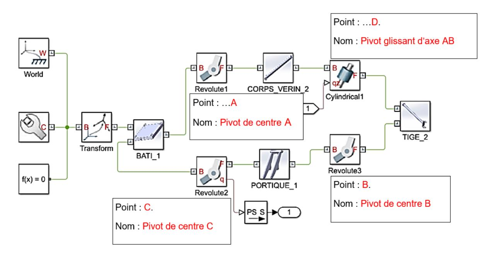

DR1b: schéma cinématique

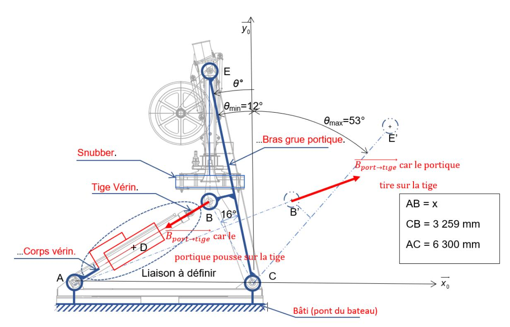

#### DR 2 : modèle multiphysique de simulation

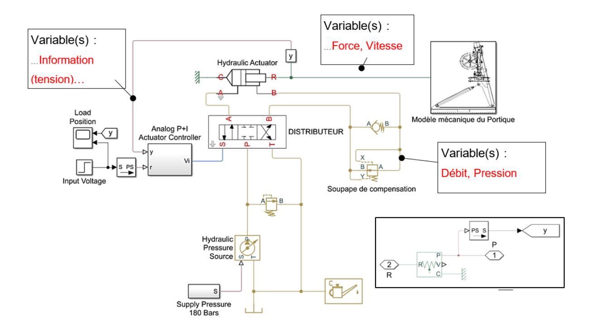

# **Rapport du jury de l'épreuve « Étude d'un système, d'un procédé ou d'une organisation » – option ingénierie informatique**

#### **1. Présentation du sujet**

Le sujet portait sur l'étude d'un système composé d'un bateau équipé d'une grue de mise à l'eau, d'un treuil et d'un ROV permettant l'enfouissement de câbles sous-marins.

Les opérations de mise en œuvre du robot ROV utilisées pour l'ensouillage de câbles sous-marins se font en trois étapes distinctes définies par trois cas d'utilisation. Ils étaient étudiés dans les différentes parties du sujet dans l'ordre des opérations nécessaires à l'ensouillage.

#### **2. Analyse globale des résultats**

Un tiers des candidats a traité au moins 80% des questions posées et obtient des résultats satisfaisants, les réponses étant souvent argumentées et bien rédigées, signe d'une préparation sérieuse à cette épreuve du concours. Certains candidats montrent une certaine maîtrise des attendus du programme. Le jury relève aussi parmi les autres candidats des lacunes inquiétantes sur le plan disciplinaire dans les fondamentaux de l'ingénierie mécanique (isolement d'un système, théorème de l'énergie cinétique) mais aussi sur les outils mathématiques simples (calcul de surface d'un disque, barycentre de points pondérés, calcul intégral simple). Le jury constate pour un tiers des candidats des erreurs graves de méthode et de rigueur, notamment en ce qui concerne la mise en œuvre d'une démarche de résolution analytique avec des erreurs de modélisation ou de bilans incomplets. Les raisonnements doivent être menés de façon lisible et explicite de manière à faire ressortir la méthode utilisée. Les réponses qui se limitent à l'écriture du résultat sans explication ne sont pas admises. La majorité des candidats a abordé le sujet de manière linéaire par partie ce qui est attendu, car chaque ensemble de questions est un tout permettant la réponse, argumentée et quantitative, à une validation de performances du système. Certains candidats ont eu une approche partielle du questionnement, mais globale du sujet en abordant toutes les parties. Ces candidats obtiennent un taux de réponses tout à fait correct. Beaucoup de candidats n'ont pas traité les dernières questions, vraisemblablement par manque de temps. Pour un quart des copies le manque de qualité de l'écriture (allant jusqu'à l'impossibilité pour le jury de lire la réponse donc de la valider), de l'orthographe, de la syntaxe ou encore de la présentation générale de la copie est parfois à déplorer. Par ailleurs, le jury relève et apprécie la très bonne tenue et la clarté de certaines copies, révélant les qualités attendues d'un enseignant devant ses élèves.

#### **3. Commentaires sur les réponses apportées et conseils aux candidats**

Partie 1 –Choix de la profondeur d'ensouillage. Cette partie permet de justifier l'intérêt d'ensouiller un câble sous-marin par une étude de l'impact environnemental des effet thermiques du câble sur l'écosystème marin. La majorité des candidats a su tirer profit des informations mises à leur disposition pour analyser les données mesurées et les modèles de simulations. Cependant, le jury invite les candidats à se relire car les justifications sont parfois incompréhensibles (oubli d'un verbe ou de mots dans la phrase, phrase très longue incohérente…) ou alors ils ne répondent pas du tout à la question posée. La capacité à aller droit à l'essentiel en faisant ressortir les points importants fait

partie des qualités recherchées pour un enseignant. Le jury regrette les notions d'amplitude et de déphasage ne soient pas maitrisées par de nombreux candidats.

Partie 2 – Mise à l'eau du ROV. Cette partie a pour but le dimensionnement de la grue portique et de son actionneur. Elle a été traitée par la majorité des candidats. Il est regrettable que certains candidats aient le bon raisonnement et se trompent dans l'application numérique. Le jury déplore que la détermination d'une loi entrée sortie cinématique ne soit pas maîtrisée par de nombreux candidats. Le bilan des actions mécaniques extérieures appliquées à la tige d'un vérin n'est pas effectué avec rigueur. La partie concernant la détermination de l'état de sollicitation de la grue a été bien traitée. Néanmoins, le jury regrette que les candidats n'aient pas répondu complètement à la question sur la conception à iso-contrainte. L'étude par élément fini est mal justifiée. Le jury attend des explications argumentées sur les conditions aux limites de déplacement.

Partie 3 – Descente en pleine eau du ROV. Cette partie a pour but de déterminer les caractéristiques géométrique et dynamique du treuil de mise à l'eau du ROV. Le jury déplore que de nombreux candidats ne proposent pas une méthode « mathématique » pour déterminer la longueur du câble. Les sciences de l'ingénieur nécessitent de développer des modèles scientifiques menant à des choix technologiques. La détermination du pas optimal nécessitait l'utilisation du théorème de l'énergie cinétique pour un axe fixe en rotation. Le jury déplore que la grande majorité des candidats ne maitrise pas cette notion, indispensable à toute étude de chaîne de puissance.

L'étude de la flottabilité du ROV faisait appel à la notion de barycentre de points pondérés. Le jury regrette que de nombreux candidats ne maitrise pas cette notion et très souvent donnent des résultats non homogènes.

Partie 4 –Étude de l'ensouillage du câble. L'objectif de cette partie est de vérifier la résistance au matage du câble lors de son plaquage dans la tranchée. Le jury regrette un manque de connaissances des candidats sur les problématiques de statique, en particulier dans le cas de charges réparties linéiquement. Le choix des pompes est bien réussi par les candidats ayant abordés ces questions.

Partie 5 – Synthèse. Cette partie a pour but de préciser comment la démarche de l'ingénieur a été appliquée lors de l'étude de ce sujet et conclure sur système ROV à répondre aux exigences techniques et environnementales dans une démarche de développement durable. Le jury regrette que certains candidats n'aient pas répondu complètement à la question qui comportait deux parties. Une partie demandait une synthèse de la démarche d'ensouillage des câbles. Une autre partie demandait de rappeler les apports du système du point de vue environnemental.

#### **4. Conclusions**

Le jury rappelle aux candidats l'importance de répondre aux problématiques en se plaçant aussi en qualité d'enseignant donc de soigner la présentation de la copie l'orthographe, la précision des réponses et la qualité de la rédaction. Le jury demande aux candidats de faire particulièrement attention aux fautes d'orthographe et de grammaire. Les candidats doivent correctement repérer les questions et en cas d'absence de réponse, l'indiquer. Le jury conseille également de mettre les résultats en évidence en les encadrant par exemple. Le jury invite les candidats à traiter avec plus de rigueur les unités des différentes grandeurs physiques pour avoir un regard critique sur l'homogénéité des relations et des résultats proposés. Le jury invite les candidats à porter une attention particulière à la gestion du temps de composition. Les raisonnements doivent être menés de façon lisible et explicite de manière à faire ressortir la méthode utilisée. Les réponses qui se limitent à l'écriture du résultat sans explication ne sont pas admises. Tous ces points seront nécessaires dans la pratique de leur futur métier d'enseignant pour exposer clairement les idées qu'ils souhaiteront faire passer.

#### **5. Résultats**

194 copies ont été évaluées, la moyenne des notes obtenues est de 8,5 et l'écart type est de 3,5 avec 18,19 comme meilleure note et 0,2 comme note la plus basse.

# **Exemple de sujet pour l'épreuve de mise en situation professionnelle**

#### **1. Présentation de l'épreuve**

La définition détaillée de l'épreuve est fournie dans un dossier annexe disponible sur le poste de travail.

Le réinvestissement de l'activité pratique en vue d'une exploitation pédagogique décrite dans le règlement d'examen comme « l'exposé » est demandé pour la série et le niveau défini ci-dessous.

#### **Déroulement de l'épreuve**

Activité pratique (4 heures) :

- 45 minutes portant sur l'ingénierie pédagogique sur la séquence imposée ;
- 30 minutes pour l'étude de la mise en contexte et prise en main ;
- 2 h 15 pour l'étude de la ou des problématiques au plus haut niveau en tenant compte de la transversalité de l'épreuve ;
- 30 minutes pour le réinvestissement de l'activité et pour la définition de la séance.

Préparation de l'exposé en loge (1 heure)

Exposé et entretien avec le jury (1 heure)

**La séquence développée s'adresse à une classe de première S-SI de 36 élèves. La compétence visée est « analyser et modéliser les transferts d'énergie ».**

Horaires hebdomadaires pour la classe de première S SI :

- 2 h d'enseignement en classe entière (CE) le mardi matin ;
- 2 fois 2h d'enseignement en groupe à effectif réduit (GR) le jeudi matin (travaux pratiques et/ou projet) ;
- 2h d'enseignement en classe entière (CE) le vendredi après-midi.

Les locaux et les matériels disponibles :

- un laboratoire, pouvant accueillir 30 à 36 élèves en classe entière, est aménagé en 6 îlots et permet aussi le déroulement d'une synthèse ou celui d'un lancement d'activités;
- chaque îlot est équipé de deux postes informatiques connectés au réseau pédagogique de l'établissement et à Internet ;
- le laboratoire est équipé également d'un vidéo projecteur et d'un tableau numérique interactif ;
- le laboratoire est équipé de matériels de mesure et de systèmes pluri-techniques et/ou de maquettes virtuelles ;
- si nécessaire des tablettes connectées sont disponibles.
- tous les supports logiciels jugés nécessaires sont disponibles dans le laboratoire.

Systèmes pluri-technologiques présents dans le laboratoire :

- robot haptique ;
- ventilation mécanique centralisée ;
- banc sismique ;

- système de suivi ;
- robot d'assistance ;
- système SLIDER ;
- robot Darwin ;
- bras BETA ;
- stabilisateur de prise de vue.

#### **2. Ingénierie pédagogique sur la séquence imposée**

Pour cette première partie, le candidat doit réfléchir et proposer une séquence de formation dont le contexte pédagogique est imposé. Le système support de l'activité pratique permet de viser la compétence donnée, comme la plupart des systèmes proposés.

Les attendus pour la séquence à proposer sont :

- recenser les compétences à développer ;
- recenser les savoir-faire et savoirs dans le référentiel du niveau imposé en lien avec le titre de la séquence ;
- proposer une trame détaillée de celle-ci (activités, durée, coordination) ;
- identifier et présenter les prérequis vis-à-vis de la progression pédagogique proposée ;
- justifier les choix de modalités pédagogiques et didactiques (TP, TD, cours, projet ...) ;
- définir, sans les rédiger avec précision, les évaluations formatives et sommatives.

Le candidat est invité à mettre en forme, à l'aide de l'outil de communication de son choix et dès le début de sa réflexion, les éléments qu'il souhaite présenter aux examinateurs lors de l'entretien.

#### **3. Mise en contexte et prise en main du système**

#### **3.1. Mise en contexte**

L'énergie est indispensable à notre vie, aussi bien dans notre habitat que sur notre lieu de travail, pour nous chauffer l'hiver, nous déplacer, avoir de la lumière à toute heure ou encore préparer à manger. En France, la plus grande partie de cette énergie est produite à partir du pétrole, de l'uranium, du gaz et du charbon. Ces ressources ne sont pas renouvelables, leur quantité disponible est limitée et s'amenuise. Leur utilisation massive a des conséquences sur notre environnement et notre santé : les émissions de gaz à effet de serre modifient notre climat, d'autres polluants affectent directement notre santé et des milliers de tonnes de déchets radioactifs sont stockés et devront pour certains d'entre eux, être surveillés pendant des milliers d'années.

Dans le souci de diminuer la consommation énergétique de chauffage, la dernière réglementation thermique RT2012 impose un certain niveau de perméabilité à l'air. La perméabilité à l'air d'un bâtiment est caractérisée par la quantité d'air qui entre ou sort de manière non contrôlée.

Pour des raisons sanitaires, l'air intérieur doit néanmoins être renouvelé (obligation règlementaire). Pour ce faire, en France, les bâtiments résidentiels neufs sont désormais tous équipés d'une Ventilation Mécanique Contrôlée (VMC). L'intérêt de ce système réside dans le contrôle des flux d'air entrants et sortants en fonction de l'utilisation effective des pièces du bâtiment. Les bâtiments tertiaires sont équipés d'une Centrale de Traitement de l'Air (CTA) qui intègre plusieurs systèmes ; le renouvellement de l'air avec une climatisation et un réchauffement de celui-ci.

L'étude proposée vise à étudier 2 solutions technologiques qui s'appuient sur :

- un système réel en situation d'usage ; il s'agit d'une Centrale de Traitement de l'Air double flux (CTA) équipant la « Tour Elithis » située à Dijon. Il s'agit du premier Bâtiment Basse Consommation (BBC) de bureaux au monde dit « à énergie positive » construit en s'imposant un coût de construction « standard ». Cette tour dispose de 1 600 capteurs et servira de laboratoire « vivant » à cette étude. La CTA assure les fonctions de renouvellement de l'air, de chauffage, de refroidissement et de récupérateur d'énergie.
- le système didactisé situé dans le laboratoire qui est une Ventilation Mécanique Contrôlée (VMC) double flux (DuolixMax) et plus spécifiquement sa version didactisée (VM20) par la société ERM. Cette VMC équipe principalement des logements type T2 à T5.

#### Le but de l'étude est de :

- découvrir, comprendre le fonctionnement d'une CTA ;
- découvrir, comprendre le fonctionnement d'une ventilation mécanique contrôlée ;
- comparer les deux systèmes ;
- déterminer l'efficacité énergétique de la VM20 à partir de mesures effectuées et la comparer avec les performances annoncées par le constructeur ;
- déterminer la consommation énergétique du ventilateur d'extraction lors d'un usage optimal ;
- déterminer l'impact de la fermeture des iris et l'encrassement des bouches d'extraction d'air de la VM20 sur la consommation d'énergie du ventilateur d'extraction ;
- comparer ce modèle avec les performances réelles annoncées par le constructeur.

#### **3.2. Prise en main**

Le matériel à disposition est constitué :

- d'un espace numérique personnel accessible pendant les 6 heures de l'épreuve ;
- d'un ordinateur équipé des logiciels de bureautique et dédié aux activités pratiques (avec accès à internet) ;
- d'un ordinateur (sans accès à internet) permettant de se connecter au serveur local de la tour Elithis pour relever des données comportementales de la ventilation (onglet « Données et comportement réels / Ventilation ») ;
- d'un dossier comportant des ressources techniques et images ;
- du système didactisé de VMC double flux (VM20) ;
- d'un climatiseur réversible pour recréer des conditions de températures extérieures ;
- d'instruments de mesure et d'une centrale d'acquisition de données.

À partir du site de la tour Elithis (données comportementales de la ventilation) accessible sur le serveur local dont l'adresse est 172.16.140.1 port 3000.

**Activité n° 1** Relever les mesures de température de l'air neuf entrant, de l'air neuf soufflé, de l'air vicié extrait, de l'air vicié rejeté pour la journée du 16 février à 14h00 et celle du 6 juillet à 16h00 *(remarque : cette manipulation nécessite de configurer le navigateur. Firefox est fortement conseillé)*.

**Activité n° 2** Compléter le document réponse (DR1) en indiquant le(s) flux d'air entrant(s) et sortant(s) de la CTA de la tour Elithis.

L'étude se limitera à la fonction « l'échangeur de chaleur » matérialisée par le système didactisé VM20.

**Activité n° 3** Localiser sur le système les bouches d'entrée de l'air (extraction), les bouches de soufflage de l'air et l'échangeur thermique. Identifier le circuit emprunté par l'air sur le système didactisé et compléter le document réponse (DR2) en indiquant le(s) flux d'air entrant(s) et sortant(s).

**Activité n° 4** À l'aide du document « Présentation du système et capteurs », repérer sur le système didactisé les différents points de mesures.

**Activité n° 5** Observer le raccordement de la climatisation externe au système VM20. Expliquer l'intérêt de son utilisation dans le cadre de ce TP. Mettre en évidence les différences entre le système didactisé VM20 et la tour Elithis (CTA dans un bâtiment). Il est possible d'utiliser les relevés de l'activité 1.

*Dès que votre intervention orale est prête, appeler l'examinateur pour présenter ces activités de prise en main.*

#### **3.3. Problématique**

Comment assurer le confort intérieur d'une habitation en renouvelant l'air, tout en visant les performances optimales de l'installation ?

#### **4. Résolution de la ou des problématiques**

*Il est recommandé au candidat d'appeler l'examinateur en cas de blocage sur une activité. Il est également fortement conseillé de faire appel à un examinateur en cas de doute sur la mise en œuvre du matériel.*


**Avant de réaliser les activités suivantes, mettre la VMC en route, et plus précisément** 

**régler le système didactisé VM20 en mode MAN favorisant le chauffage et en mode « absence » (simulation d'une journée d'hiver).**

#### **4.1. Étude de l'échangeur thermique**

**Activité n° 6** Le système de VMC est équipé d'un échangeur thermique. À l'aide des vidéos Recair Sensitive.flv, expliquer au jury le phénomène d'échange thermique.

#### **4.2. Étude du by-pass**

**Activité n° 7** La VMC dispose d'un by-pass, représenté par un conduit sur les schémas cidessous. Donner sa fonction.

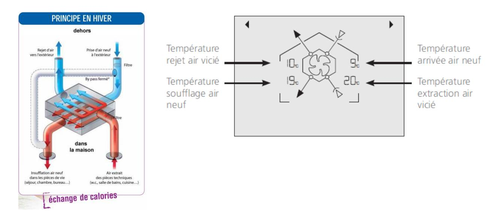

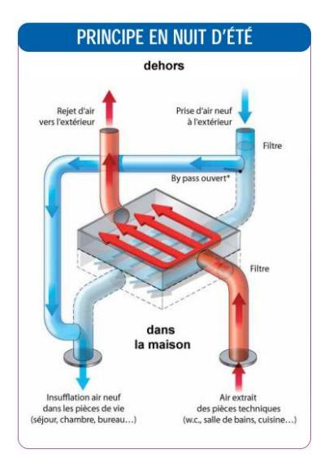

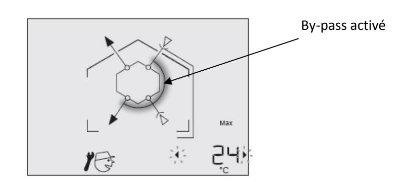

**Activité n° 8** Dans le cas du mode « été », on dispose des paramètres seuil haut et seuil bas ainsi que des variables Tint et Text. À partir du diagramme constructeur ci-après, donner l'algorithme ou le programme « orienté objet » de la commande du by-pass.

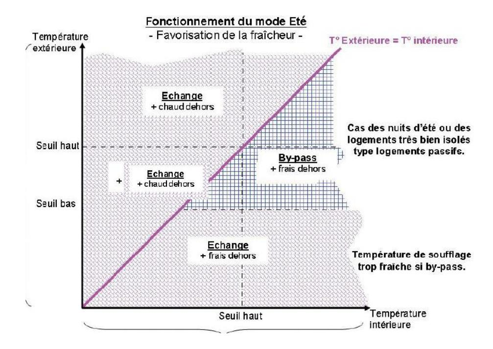

#### 4.3. Étude de l'efficacité

Cette activité propose d'étudier l'échangeur thermique et plus particulièrement son efficacité. Pour cela, utiliser l'application « Échange thermique » disponible dans votre espace de travail.

#### **Définitions**

Puissance utile, récupérée sur l'air neuf :  $P_{utile} = 0.34 \cdot Q_v \cdot (T_{air \ neuf \ soutfilé} - T_{air \ neuf \ extérieur})$ 

Puissance maximale disponible :  $P_{max} = 0.34 \cdot Q_{v} \cdot (T_{air\ vici\'e\ extrait} - T_{air\ neuf\ ext\'erieur})$ 

Efficacité énergétique :  $E = \frac{P_{utile}}{P_{mon}}$ 

En partant du principe que le système DF VM20 est équilibré (débit d'air entrant = débit d'air extrait),

on pourra écrire :  $E = \frac{T_{\text{air neuf soufflé}} - T_{\text{air neuf extérieur}}}{T_{\text{air vicié extrait}} - T_{\text{air neuf extérieur}}}$ 

Exécuter l'application « Échange thermique ». Effectuer les raccordements entre la carte d'acquisition et le tableau principal de la VM20 en respectant les numéros de voie indiqués sur l'interface logicielle, puis raccorder la centrale d'acquisition à l'ordinateur. Mettre en route le système. Régler le système

didactisé VM20 en mode MAN favorisant le chauffage et en mode « absence » (simulation d'une journée d'hiver).

**Activité n° 9** Grâce à l'application « Échange thermique », relever les mesures de température instantanées. Calculer l'efficacité moyenne. L'échange thermique s'est-il réellement mis en place lors de vos mesures ? Pourquoi ?


Dès le relevé effectué, lancer la climatisation dans les conditions décrites ci-après, puis poursuivre l'activité 9. Faites valider le branchement par l'examinateur.

Pour reproduire en laboratoire, les conditions proches de la journée du 16 février observées dans la partie « prise en main du système », raccorder le climatiseur sur l'entrée d'air neuf de la VMC. Le

programmer en mode été pour qu'il souffle de l'air froid (demande de froid ) avec une température de 16°C. Le régler à la vitesse maximale.


**Pendant la mise en température de l'installation et la phase d'enregistrement, préparer l'activité 12 et 13.**

**Attention :** durée des mesures 5 minutes environ !

**Activité n° 10** Grâce à l'application « Échange thermique », relever et enregistrer les mesures de température dans les conditions proches du 16 février.

Utiliser maintenant le fichier de relevés de températures qui est stocké dans le dossier « Échange thermique ». Sélectionner l'onglet sans titre. Tracer avec Excel l'évolution de l'efficacité en fonction du temps. Calculer l'efficacité moyenne.

L'échange s'est-il réellement mis en place lors de vos mesures ? Pourquoi ? Toute l'énergie (ou la puissance) a-t-elle été récupérée ? Pourquoi ?

**Activité n° 11** Le fabricant indique une efficacité comprise entre 90 % et 98 %.

Comparer les performances réelles avec les performances annoncées par le constructeur. Conclure.

**Activité n° 12** À partir des mesures relevées à l'activité 1, calculer l'efficacité de la CTA aux deux dates. Comparer les résultats à ceux obtenus par la VMC. Conclure.

#### 5. **Conclusion quant à la problématique**

Cette activité propose d'étudier la consommation énergétique instantanée d'un tel système et en particulier le comportement énergétique du ventilateur d'extraction.

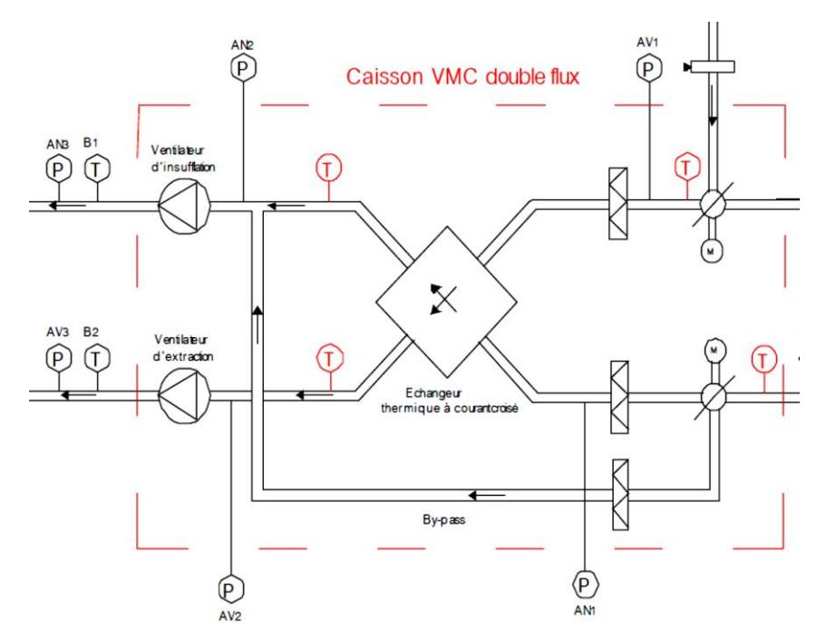

*Schéma aéraulique partiel*

Les formules suivantes permettent d'estimer la puissance utile du ventilateur d'extraction et la puissance électrique absorbée par le moteur :

- puissance utile reçue par l'air  $P_u = Q_v \cdot (p_{AV3} p_{AV2})$  avec  $Q_v$  débit en m³/s et p pression en Pa ou J/m³ (d'air déplacé) ;
- puissance électrique en monophasé  $P_{\text{elec}} = U \cdot I \cdot \cos \varphi$ .

Diamètre des gaines : 125 mm

Activité n° 13 Proposer un protocole expérimental à l'examinateur qui permette de calculer ces puissances.

#### Comportement réel en situation de laboratoire

Cette phase de relevé se fera avec les registres à IRIS en position 0 et le système en mode « absence ».

**Attention :** afin d'obtenir la vitesse réelle de l'air dans le conduit, plusieurs mesures de vitesse de l'air doivent être réalisées, puis la moyenne de ces mesures doit être faite.

**Activité n° 14** Mesurer et relever le courant, la tension, le facteur de puissance, la vitesse de l'air et la pression différentielle entre les points de mesure  $AV_3$  et  $AV_2$ . En déduire le débit, la puissance utile du ventilateur (ou puissance utile reçue par l'air), la puissance électrique consommée et le rendement du ventilateur.

#### Comportement réel en situation d'usage simulée

La VMC utilisée ici peut être adaptée à tout type de pavillon (à partir du T3 : trois pièces principales). Tous les pavillons ne se ressemblent pas : les bouches de soufflage et d'extraction peuvent être très éloignées du caisson de récupération d'énergie impliquant des longueurs de raccordements longues et variables.

Dans de tels cas de figure, le constructeur n'a pas prévu des ventilateurs de différentes puissances, mais bien le même système adaptatif pour les cas les plus courants de structures de pavillons.

Pour reproduire les pertes de charges liées à l'installation d'une VMC en situation réelle, la résistance de l'air dans le réseau d'extraction peut être augmentée en fermant les registres à IRIS « WC » et « cuisine » (position 7), en déposant les bouches d'extraction « WC », « salle de bain » et « cuisine » et en les remplaçant par une feuille de papier. On reproduit ainsi un encrassement à l'usage, de l'installation.


Attendre systématiquement 5 minutes après toute nouvelle modification des IRIS que le système se stabilise !

**Activité n° 15** Mesurer et relever le courant, la tension, le facteur de puissance, la vitesse de l'air et la pression différentielle entre les points de mesure AV<sub>3</sub> et AV<sub>2</sub>. En déduire la puissance utile reçue par l'air, la puissance électrique consommée, et le rendement du ventilateur.

**Activité n° 16** Évaluer l'impact énergétique de l'augmentation de la résistance créée par la situation d'usage simulée. Conclure quant à l'adaptabilité du système et son rendement.

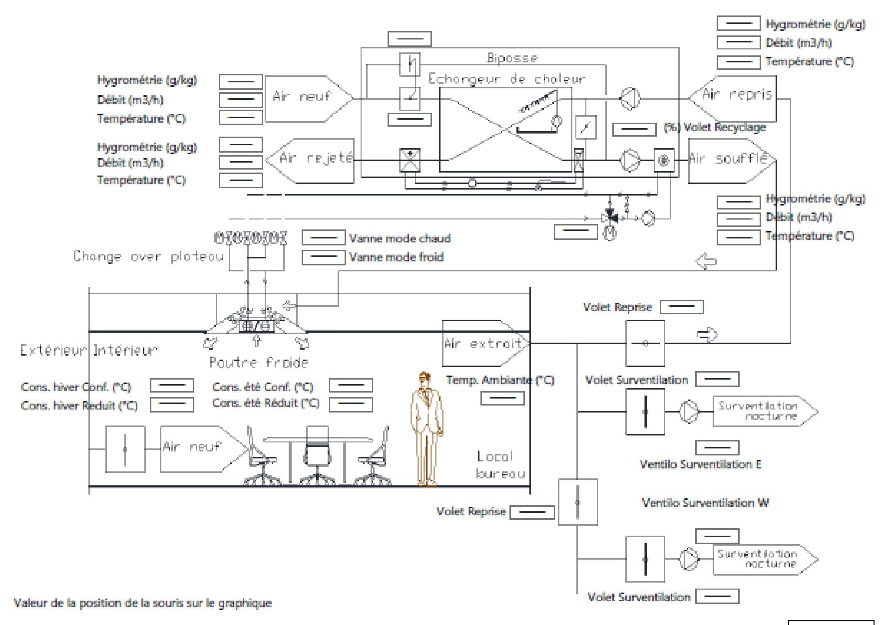

92/109 DR1

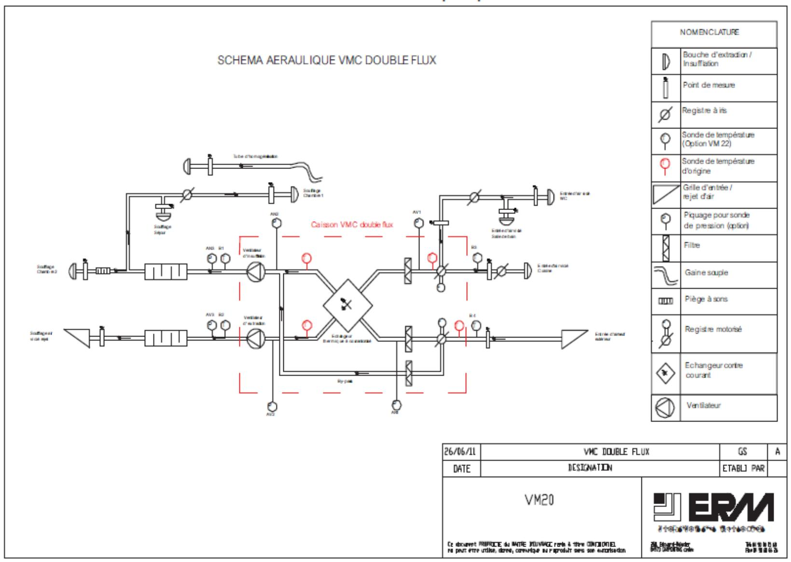

# **Rapport du jury de l'épreuve de mise en situation professionnelle**

#### **1. Présentation de l'épreuve**

La durée de cette épreuve est de six heures. Elle est scindée en trois temps :

- quatre heures dans un laboratoire de sciences industrielles de l'ingénieur débutant par 45 minutes d'ingénierie pédagogique ;
- une heure en loge pour élaborer une exploitation pédagogique et sa présentation ;
- une heure organisée en 30 minutes maximum de présentation et 30 minutes maximum d'échanges avec le jury.

Les deux parties, travaux pratiques et exploitation pédagogique, sont indépendantes et sont notées chacune sur dix points.

La distinction de l'évaluation des deux parties de l'épreuve permet de dissocier la réussite à l'épreuve de « travaux pratiques » de celle à l'épreuve d'« exploitation pédagogique ».

Les supports utilisés, pour cette session, sont des systèmes pluri technologiques actuels :

- robot collaboratif ;
- bras deux axes de contrôle par caméra ;
- banc de simulation de séisme ;
- système de ventilation double flux ;
- système de caméra auto-suiveuse ;
- stabilisateur de prise de vue ;
- robot humanoïde ;
- système de travelling ;
- banc d'étude sur la cohésion des sols ;
- robot haptique.

Un tirage au sort du support est réalisé indépendamment de la spécialité des candidats pour l'épreuve de mise en situation professionnelle.

Le travail pratique proposé est construit pour être accessible à tous les candidats, quelle que soit leur option d'inscription au concours. Les documents, accompagnant le support, fournissent une guidance qui permet à tous les candidats, quelle que soit leur connaissance du système et leur spécialité, d'exprimer leurs compétences scientifiques et pédagogiques.

Chaque support conduit à une exploitation pédagogique de niveau imposé en technologie au collège, en série sciences et technologies de l'industrie et du développement durable (STI2D) en enseignement transversal ou en série scientifique pour les enseignements de sciences de l'ingénieur (S-SI).

Les objectifs de formation pour l'exploitation pédagogique de la séance d'activité pratique sont donnés aux candidats ainsi que le contexte de mise en œuvre de la séquence (effectifs, répartition horaire, progression didactique…)

Les compétences évaluées sont les suivantes :

- analyser, mettre en œuvre un protocole expérimental, simuler et vérifier des performances ;
- exploiter des résultats, justifier des choix et des solutions ;

- présenter de manière détaillée une partie significative d'une séance de formation constitutive de la séquence ;
- élaborer des documents de qualité pour présenter la séquence et la partie significative de la séance ;
- s'exprimer correctement à l'oral pour présenter la séquence et la partie significative d'une séance de formation.

Ces compétences sont évaluées, quels que soient les supports d'activité pratiques mis en œuvre.

#### Les candidats disposent :

- d'un espace numérique personnel qu'ils conservent pendant les six heures de l'épreuve ;
- d'un poste informatique équipé des logiciels de bureautique et dédié aux activités pratiques ;
- de toutes les ressources numériques en lien avec le travail demandé (dont les programmes d'enseignement, les repères pour la formation et les guides d'accompagnement lorsqu'ils existent).

Le jury dispose d'une traçabilité des connexions sur le réseau permettant de suivre les sites consultés.

Pour la partie travaux pratiques, les postes de travail sont équipés des matériels usuels de mesure des grandeurs physiques (oscilloscopes numériques, multimètres, dynamomètres, tachymètres, cartes d'acquisition connectées à un ordinateur…), et ce, selon la nécessité des activités proposées. Cette épreuve est commune aux candidats au CAPET externe et au CAPET 3<sup>e</sup> voie. Les attendus, le déroulement et les supports didactiques ainsi que les exploitations pédagogiques sont identiques. Dans ce cadre, les conseils aux candidats sont communs aux deux concours.

#### **2. Analyse globale des résultats**

Le jury tient à souligner la qualité de préparation de la majorité des candidats. Néanmoins, les attendus de l'épreuve et les modalités de mise en œuvre décrits au JORF et repris dans les rapports des jurys des années précédentes ne sont toujours pas connus de tous. Il s'avère extrêmement difficile de réussir les activités pratiques et l'exploitation pédagogique si les objectifs spécifiques de ces deux parties de l'épreuve ne sont pas connus.

Les notions théoriques portant sur la didactique de la discipline et sur les différentes démarches pédagogiques associées sont régulièrement citées par les candidats. Elles sont rarement justifiées et parfois énoncées de façon inappropriée. Elles ne font que trop rarement l'objet d'une contextualisation ou d'une proposition concrète dans le cadre de la séquence présentée lors de la leçon.

Une proportion significative de candidats ne connaît pas les programmes de technologie au collège et des séries S-SI et STI2D du lycée ainsi que les documents ressources pour faire la classe. Bien que donnés, ces différents textes et documents nécessitent un temps important pour se les approprier. La méconnaissance de ceux-ci se révèle pénalisante pour construire une séquence et une séance pédagogique réaliste dans le temps imparti. Le jury a été également extrêmement surpris que des candidats ne soient pas acculturés au socle commun de connaissances, de compétences et de culture ainsi qu'à l'évaluation par compétences.

Le nombre des exploitations pédagogiques portant sur le collège, la série STI2D et S-SI a été équilibré sur l'ensemble de la session. Les candidats doivent être en mesure de produire des séquences et séances sur tous les niveaux d'enseignement afin de pouvoir répondre aux attentes du jury.

Le jury rappelle que les exploitations pédagogiques sont appuyées sur les programmes en vigueur lors de la session du concours. À ce titre, le jury conseille aux futurs candidats de s'imprégner des programmes publiés au bulletin officiel spécial n°1 du 22 janvier 2019.

#### **3. Commentaires sur les réponses apportées par les candidats et conseils aux candidats**

Le jury a noté une prise en compte des remarques des années précédentes portant sur la concision de la présentation de l'activité pratique et sur l'intérêt de mettre en regard l'étude réalisée sur le système et la séquence pédagogique demandée. Le jury invite les candidats à faire preuve d'une rigueur scientifique exemplaire lors de la présentation des travaux réalisés et ne pas s'attacher à restituer l'intégralité (dans tous ses détails) de l'activité pratique. Lors de l'exploitation pédagogique, le jury a constaté que les activités pratiques et leurs résultats ne sont pas encore suffisamment réinvestis, au niveau de la séquence demandée.

Le jury conseille d'organiser la présentation de la façon suivante :

- présentation du système (durée maximale cinq minutes) ;
- synthèse des activités menées en travaux pratiques (durée maximale cinq minutes) ;
- exploitation pédagogique (durée maximale vingt minutes).

Le manque de culture scientifique et technologique usuelle pénalise de nombreux candidats dans l'appropriation des supports pluri technologiques. Il est impératif, pour espérer réussir l'épreuve de mise en situation professionnelle, de disposer de compétences et de connaissances scientifiques et technologiques avérées. Cette culture technologique ne se limite en aucun cas à un domaine disciplinaire unique. Les futurs professeurs de sciences industrielles de l'ingénieur se doivent d'avoir une vision transversale et globale de leur discipline et de conduire une veille technologique régulière.

Quelques candidats proposent des présentations (orales et écrites) très formatées, quelquefois hors du contexte de l'activité pratique réalisée en amont, qui ne résistent pas aux questionnements du jury et mettent en évidence des lacunes. Le jury invite les candidats à, certes, maîtriser les attendus pédagogiques et didactiques de la discipline, mais surtout à être en capacité de les réinvestir de façon adaptée et pertinente. À titre d'exemples, les termes « formatif », « sommatif », « inductif »… doivent être utilisés à bon escient et dans un contexte adapté.

Les candidats les plus efficients font preuve d'autonomie et d'écoute lors des travaux pratiques. Ils prennent des initiatives dans la conception de leur séquence pédagogique pour élaborer la leçon. Ils mettent à profit l'ensemble des ressources numériques mis à leur disposition.

Enfin, le jury rappelle que le concours constitue la première étape de l'entrée dans le métier du professorat. Le candidat se doit donc d'adopter une posture et un positionnement exemplaires constitutifs de la mission d'enseignant. Le jury invite vivement les candidats à s'approprier le référentiel des compétences professionnelles des métiers du professorat et de l'éducation (arrêté du 1-7-2013 - JORF du 18-7-2013).

#### **Maîtrise de la finalité de l'épreuve**

Le jury renouvelle les conseils qui ont été donnés lors des précédentes sessions :

- **connaître la description de l'épreuve (arrêté du 19 mars 2013 publié au JORF du 27 avril 2013 - arrêté du 24 avril 2013 publié au JORF du 22 août 2013 - arrêté du 19 avril 2016 du JORF n°0126 du 1 juin 2016) ;**
- lire les rapports de jury des sessions précédentes.

#### **Préparation – Formation aux épreuves**

Le jury conseille aux candidats de :

- s'approprier les programmes de tous les niveaux énoncés dans la définition de l'épreuve ainsi que les documents ressources associés ;
- prendre connaissance du socle commun de connaissances, de compétences et de culture ;
- s'informer des évolutions des programmes de S-SI et de STI2D et des enseignements en collège ;
- s'informer des pratiques pédagogiques, des modalités de fonctionnement et de l'organisation des horaires en collège, en S-SI et en STI2D ;
- se préparer à exploiter les résultats d'investigations et d'expérimentations en regard des contenus disciplinaires ;
- s'informer sur les modalités des épreuves d'examen auxquelles ils préparent leurs futurs élèves.

#### **Qualité des documents de présentation et expression orale**

Il est attendu des candidats une maîtrise des outils numériques pour l'enseignement afin de construire un document clair, lisible et adapté à la présentation de l'exposé.

Le jury est extrêmement attentif à la qualité de la syntaxe et de l'orthographe.

Les candidats s'expriment généralement correctement. La qualité de l'élocution et la clarté des propos sont indispensables aux métiers de l'enseignement.

#### **Pour la partie travaux pratiques**

#### **Organisation à suivre lors de l'épreuve**

Dans un premier temps, les candidats doivent prendre connaissance des compétences imposées visées par la séquence de formation à élaborer. Durant les quarante-cinq premières minutes, le travail d'ingénierie pédagogique demandé consiste à établir une première trame de la séquence pédagogique au regard des éléments imposés au sein du sujet (niveau, organisation temporelle et structurelle…). Ce premier temps est décontextualisé du support de l'épreuve travaux pratiques.

À l'issue de ce premier temps, les candidats doivent rapidement mettre en œuvre et s'approprier le support. Des documents d'aide sous forme numérique et multimédia leur sont fournis.

Les candidats réalisent des activités expérimentales et analysent les résultats afin de conclure sur les problématiques proposées. Ces manipulations, mesures et interprétations, sont réalisées au niveau de compétences d'un master 1 re année.

Les candidats doivent penser à garder des traces numériques de leurs résultats et de leurs travaux afin de les réinvestir, pour la l'exploitation pédagogique, dans une séquence adaptée au collège ou au lycée.

Lors de cette session, durant les quatre heures de l'activité pratique, une heure et quinze minutes ont été consacrées à la conception de l'exploitation pédagogique. Organisés en deux temps distincts, l'un en début des travaux pratiques pour 45 minutes et l'autre en fin de travaux pratiques pour 30 minutes, ils ont pour objectif d'engager une réflexion portant sur l'ingénierie pédagogique demandée et de commencer l'élaboration des documents pédagogiques attendus lors de l'exposé. Le temps d'ingénierie pédagogique ne nécessite pas de manipulation du système. Le postulat de départ est précisé que tout ou partie des supports du laboratoire permet d'atteindre l'objectif de formation assigné pour la leçon.

La connaissance préalable du système et des logiciels n'étant pas demandée, les membres de jury peuvent être sollicités par les candidats en cas de problème ou de difficultés persistantes liées à

l'exploitation d'un logiciel ou d'un appareil de mesurage spécifique. Plus généralement, le jury est présent pour accompagner les candidats dans leur démarche.

#### **Aptitude à mener un protocole expérimental**

La mise en œuvre des matériels de mesurage et d'acquisition ne suscite pas de difficulté particulière. Les membres du jury assurent l'accompagnement nécessaire afin que la spécificité d'un équipement ne constitue pas un obstacle à la réussite des candidats. Le jury attend des candidats qu'ils soient capables de proposer et de justifier des choix de protocoles expérimentaux.

#### **Utilisation des modèles numériques**

Globalement, les candidats utilisent correctement les modèles numériques fournis. Le jury note cependant que de nombreux candidats manquent de recul et d'esprit critique dans l'interprétation des résultats de la simulation numérique et dans l'analyse des hypothèses utilisées lors de l'élaboration du modèle. Il est attendu des candidats une analyse pertinente des écarts entre les résultats fournis par la modélisation et la simulation, les mesures issues du système réel à partir d'expérimentations et/ou les performances attendues indiquées dans le cahier des charges.

## **Pour l'exposé devant le jury**

#### **Présentation du travail pratique**

Une présentation succincte du support, des travaux réalisés et des résultats obtenus permet de contextualiser la séance qui sera présentée. Elle doit être réalisée avec toute la rigueur scientifique que le jury peut attendre d'un candidat qui se destine au métier d'enseignant. Le jury apprécie les présentations synthétiques mettant en évidence les points qui feront l'objet d'un réinvestissement dans la description de la séquence et de la séance. Afin de faciliter l'exposé, il est suggéré d'utiliser les outils adaptés à la production d'une présentation de qualité.

#### **Description de la séquence**

Les candidats inscrivent leur développement pédagogique dans un contexte pédagogique donné dans le sujet. L'objectif de formation, la progression didactique dans laquelle s'inclut la séquence à développer, les programmes et les documents ressources pour faire la classe sont mis à disposition sur le répertoire numérique personnel des candidats.

Les candidats doivent structurer une séquence pédagogique et la positionner dans une progression didactique annuelle. Les documents ressources pour faire la classe constituent des points d'appui que les candidats ne peuvent ignorer.

Les hypothèses d'organisation de la pédagogie dans l'établissement doivent être précisées (exemple 7 h d'enseignement transversal dont 3 h en co-animation). Le positionnement de la séquence dans le plan de formation du cycle ou de l'année doit être précisé.

Une séquence se compose de plusieurs séances. Il est demandé de décrire la structure de chaque séance et de préciser les prérequis et les objectifs (compétences à faire acquérir, capacités et connaissances attendues), l'organisation de la classe, les systèmes utilisés, la durée des séances, le nombre d'élèves, les modalités pédagogiques (cours, activités dirigées, activités pratiques, projet), les stratégies pédagogiques (déductif, inductif, différenciation pédagogique, démarche d'investigation, démarche de résolution de problème technique, pédagogie par projet, approche spiralaire…), les activités des élèves et les productions attendues. Les descriptions de la séquence et des séances doivent faire explicitement apparaître la prise en compte de la diversité des publics accueillis dans la classe.

Les phases de structuration des connaissances permettant la construction des connaissances des élèves et les différentes formes d'évaluations des élèves sont des parties intégrantes de la séquence et doivent reprendre les objectifs annoncés. Les différentes modalités d'enseignement (EPI, interdisciplinarité, concours scientifique et technique…) et les dispositifs d'accompagnement et de remédiation doivent être précisés.

#### **Utilisation du numérique**

Le jury note qu'une majorité de candidats fait appel aux ressources et usages du numérique dans les activités proposées aux élèves. Néanmoins, le jury leur conseille de bien identifier les points de leur séquence pédagogique pour lesquels l'usage du numérique apportera une réelle plus-value aux apprentissages des élèves. Si l'exploitation du numérique disciplinaire est souvent mise en œuvre par de nombreux candidats, peu d'entre eux proposent une séquence exploitant le numérique éducatif.

#### **Réinvestissement des résultats de travaux pratiques**

L'objectif attendu de la leçon est une exploitation pédagogique en lien avec tout ou partie des activités pratiques réalisées. Celles-ci étant d'un niveau supérieur à la séquence demandée, il ne s'agit pas de faire, au travers de la séquence pédagogique, un compte-rendu de l'activité pratique réalisée, mais de s'appuyer sur les expérimentations pour en extraire des données et des activités à proposer aux élèves. Les candidats doivent, en dix minutes au maximum :

- présenter brièvement le support, la problématique et la démarche méthodologique proposée ;
- justifier le(s) lien(s) avec la séquence pédagogique, expliciter les résultats et les investigations qui seront réutilisés dans la séquence.

De plus, il est important que les candidats explicitent comment les adapter au niveau d'enseignement visé. Le jury ne se satisfait en aucun cas d'une exploitation brute des activités proposées dans la première partie de l'épreuve.

Les candidats peuvent aussi envisager l'utilisation d'autres systèmes présents dans les laboratoires, en complément du système étudié pendant la première partie de l'épreuve.

#### **Réalisme de l'organisation de la classe**

Le jury attend des candidats qu'ils émettent des hypothèses réalistes sur les conditions d'enseignement. Leurs propositions doivent être pragmatiques afin que le jury puisse appréhender le scénario pédagogique envisagé.

## **Évaluation**

Le processus retenu par les candidats pour l'évaluation des compétences doit être clairement décrit (évaluation diagnostique, formative, sommative, certificative…) et justifié. Les modalités et les outils doivent être précisés. Si des remédiations ou des différenciations pédagogiques sont envisagées, elles doivent être explicitées.

Trop souvent, les candidats se contentent d'évoquer les processus d'évaluation sans pouvoir en expliquer réellement le déroulement, les modalités et surtout l'objectif en termes d'acquisition des compétences par les élèves.

#### **Réactivité au questionnement**

Le jury attend de la concision et de la précision ainsi qu'une honnêteté intellectuelle dans les réponses formulées. Les réponses au questionnement doivent laisser transparaître un positionnement adapté aux attentes de l'Institution et une réelle appropriation des valeurs de la République ne se limitant pas à l'exposé des grands principes sans en démontrer le bienfondé pour les élèves.

Les candidats se doivent d'être réactifs sans chercher à éluder les questions ou à noyer le propos dans un discours pédagogique non maîtrisé. Plus qu'une réponse exacte instantanée, le jury apprécie la capacité à argumenter, à expliquer et justifier une démarche ou un point de vue.

#### **4. Conclusions**

L'épreuve de mise en situation professionnelle nécessite une préparation rigoureuse, sérieuse et approfondie en amont de l'admissibilité. Cette préparation doit porter tout autant sur la partie « travaux pratiques » que sur la partie « exploitation pédagogique », car ces deux parties de l'épreuve sont complémentaires et indissociables. Les compétences nécessaires à la réussite de cette épreuve sont à acquérir et à développer notamment lors de stages en situation et de périodes d'observation ou d'enseignement. Elles sont complétées par une connaissance fine des référentiels et des documents ressources pour faire la classe. L'épreuve s'appuie sur la maîtrise disciplinaire des sciences industrielles de l'ingénieur.

Le métier d'enseignant exige une exemplarité dans la tenue, dans la posture ainsi que dans le discours. L'épreuve de mise en situation professionnelle permet la valorisation de ces qualités.

#### **5. Résultats**

281 candidats ont été évalués pour cette épreuve, la moyenne des notes obtenues est de 11 / 20 et l'écart-type de 4,5 avec :

- 20 comme meilleure note ;
- 1,4 comme note la plus basse.

# **Rapport du jury de l'épreuve d'entretien à partir d'un dossier**

#### **Recommandations générales**

Il est demandé aux candidats de lire attentivement le règlement du concours afin de respecter les modalités de l'épreuve.

Il est impératif de prendre connaissance des programmes d'enseignement du collège et du lycée, en vigueur à la date de l'inscription au concours et des ressources associées. Sur le plan de l'organisation pédagogique, les activités des élèves doivent être au centre des préoccupations du candidat.

Le jury demande aux candidats de ne pas limiter leur approche à une identification des objectifs de formation tels que définis dans les programmes mais de développer des activités en explicitant les démarches pédagogiques retenues.

Le jury invite les candidats à s'approprier le référentiel de compétences des professeurs disponible à l'adresse suivante : [http://www.education.gouv.fr/cid73215/le-referentiel-de-competences-des](http://www.education.gouv.fr/cid73215/le-referentiel-de-competences-des-enseignants-au-bo-du-25-juillet-2013.html)[enseignants-au-bo-du-25-juillet-2013.html](http://www.education.gouv.fr/cid73215/le-referentiel-de-competences-des-enseignants-au-bo-du-25-juillet-2013.html)

Notamment, le jury attend des candidats une parfaite maîtrise, orale et écrite, de la langue française.

#### Présentation de l'épreuve

- Durée de l'épreuve : 1 heure (présentation : 30 minutes maximum, entretien avec le jury : 30 minutes) ;
- Coefficient 2.

L'épreuve est basée sur un entretien avec le jury à partir d'un dossier technique, scientifique et pédagogique réalisé par le candidat, suivi d'un entretien. Elle a pour but de vérifier que le candidat est capable de rechercher des supports de son enseignement dans le milieu économique et d'en extraire des exploitations pertinentes pour son enseignement au collège ou en lycée.

L'entretien qui succède à la présentation du candidat permet au jury d'approfondir les points qu'il juge utiles. Il permet en outre d'apprécier la capacité du candidat à prendre en compte les acquis et les besoins des élèves, à se représenter la diversité des conditions d'exercice de son métier futur, à en connaître de façon réfléchie le contexte dans ses différentes dimensions (classe, équipe éducative, établissement, institution scolaire, société) et les valeurs qui le portent, dont celles de la République.

*Les dossiers doivent être déposés ou envoyés en recommandé en double exemplaires, au secrétariat du jury cinq jours francs avant le début des épreuves d'admission pour le support papier et en un exemplaire pour le support numérique. A l'issue des épreuves aucun dossier ou support numérique n'est restitué.* 

#### **Analyse globale des prestations**

#### **Le support**

Le jury note la grande diversité des supports techniques retenus par les candidats, celle-ci démontrant que les domaines d'investigations sont nombreux et qu'ils sont potentiellement capables d'être appréhendés et adaptés à l'enseignement technologique du cycle secondaire.

Le jury constate la grande disparité de la qualité du contenu des dossiers sur le fond et la forme. En effet, si la plupart des candidats ont respecté les consignes définissant l'épreuve, certains se sont contentés d'une approche très générale, voire superficielle, des présentations *scientifiques, technologiques et pédagogiques*. Les développements scientifiques et technologiques doivent impérativement démontrer au jury l'expertise du candidat *dans la spécialité choisie* lors de leur inscription au concours.

Le jury attend donc des développements personnels approfondis à caractère *scientifique et technologique* conformes aux exigences du concours et faisant référence aux exploitations *pédagogiques* possibles.

Seule l'identification de problématique(s) industrielle(s) authentique(s) permet de satisfaire à cette exigence.

Le choix du support est donc essentiel pour garantir une exploitation scientifique, technologique et pédagogique suffisamment riche. Il doit être fait au plus tôt dans la préparation au concours. Le jury regrette que certaines prestations s'appuient uniquement sur des données obtenues par de simples échanges téléphoniques ou récupérées sur Internet sous la forme de présentations commerciales. En outre, les travaux universitaires, réalisés par les candidats, ou les projets conduits dans le cadre d'une activité professionnelle, souvent très complexes et marginaux par rapport aux programmes d'enseignement, sont généralement inappropriés pour devenir des supports de dossiers dans le cadre de cette épreuve.

Un simple constituant d'un système ou une solution technologique non contextualisée ne peut constituer un support de dossier satisfaisant, de même qu'une présentation de matériaux ou famille de matériaux ou encore une démarche d'organisation du travail. Un futur enseignant en sciences et techniques industrielles doit être en constante veille technologique, établir et maintenir un contact permanent avec les divers acteurs du secteur industriel garantissant ainsi l'intégration des innovations technologiques dans le cursus de formation des collégien(ne)s et lycéen(ne)s. En outre, l'enseignement de l'informatique et de la programmation prend corps via la programmation des produits pluri technologiques en réponse à un besoin dûment formulé faisant état des fonctions à satisfaire, des comportements attendus et des fonctionnalités requises des interfaces Hommemachine.

#### **Commentaires et recommandations à l'attention des candidats**

#### **Élaboration de la partie scientifique et technologique du dossier**

Le caractère pluri technologique et la richesse scientifique du support retenu sont valorisés par le jury. Le choix de systèmes assimilés à des jouets ou déjà didactisés et l'exploitation des dossiers pédagogiques fournis avec ces équipements ne sont pas recommandés. De même, le principe du développement ex nihilo par le candidat d'une maquette ayant vocation à constituer un support de cours n'est pas envisageable.

L'approche systémique s'avère essentielle, car elle s'appuie sur une perception globale du système dans son environnement. Elle démontre aussi la capacité du candidat à contextualiser le support en utilisant une démarche d'analyse fonctionnelle et les outils de description de l'ingénierie système. Ce travail constitue un attendu fort du jury. Elle intègre en conséquence la complexité du réel. Il s'agit d'une étape incontournable de la présentation du support choisi.

Le jury déplore que pour un nombre conséquent de dossiers, l'étude scientifique et technologique se limite à une description du produit ou une explication du fonctionnement de celui-ci. Certains dossiers se limitent à une compilation de ressources copiées-collées depuis Internet sans citer les sources. Le plagiat est sévèrement sanctionné par le jury. Le candidat doit veiller à mener des études personnelles à caractère scientifique et technologique dépassant la simple description du support choisi et privilégiant l'élaboration de modèles comportementaux et leur utilisation dans la partie pédagogique. Les phases de validation, au cœur des développements pédagogiques, imposent la vérification de grandeurs caractéristiques quantifiées.

En lien avec la vérification et la quantification des caractéristiques étudiées, la démarche expérimentale prend ici tout son sens. Les protocoles d'acquisition des données doivent être décrits, voire accompagnés, du traitement des résultats obtenus. Le jury recommande aux candidats de consulter les travaux de recherche universitaires, au moins en langue française, utiles à l'explicitation dans le dossier de solutions technologiques innovantes. Sans en exiger la maîtrise des contenus, ce travail peut permettre de rendre plus robustes certaines présentations. Dans cette perspective, il doit être fait mention des auteurs et travaux consultés dans la bibliographie des dossiers. Le volet pédagogique doit permettre au candidat d'exploiter une des problématiques identifiées dans la partie scientifique et technologique. Le candidat doit veiller à conserver une logique entre les dominantes du support et l'exploitation pédagogique. L'adaptation pertinente des documents techniques utiles à l'exploitation pédagogique est un attendu du jury. La qualité des documents techniques insérés dans cette partie du dossier est une preuve de la capacité du candidat à produire des ressources d'activités exploitables par les élèves.

*Le jury conseille aux candidats de constituer un dossier de 40 pages au maximum annexes comprises.* 

#### **Élaboration de la partie pédagogique du dossier**

Pour la séquence choisie, il est indispensable que le candidat précise clairement :

- le niveau de la classe choisie et l'enseignement concerné,
- la pertinence du positionnement de la séquence au sein de la progression du cycle de formation qui ne saurait se résumer à un simple positionnement calendaire
- ses intentions pédagogiques en lien avec le programme ou le référentiel choisi et la problématique retenue, ce qui implique que les compétences travaillées et les connaissances visées soient explicitement exprimées ainsi que les prérequis nécessaires à cette nouvelle étape de formation ;
- l'adaptation des documents techniques exploitables pour des élèves;
- l'organisation pédagogique et les situations d'apprentissage prenant la forme d'une fiche séquence, détaillant au moins une des activités élèves ;
- une activité rédigée et détaillée à destination des élèves ;
- les contenus d'une fiche de synthèse qui participent de la structuration des connaissances
- l'évaluation des acquis des élèves indiquant les critères et les indicateurs de réussite ainsi que les modalités d'une remédiation.

Le jury apprécie les séquences développées qui prennent en compte la diversité des performances attendues des élèves ainsi que les séquences construites autour d'une approche pluri technologique et pluridisciplinaire.

La connaissance des programmes de formation est prise en compte dans l'évaluation du candidat. Pour autant, un développement exhaustif à tous les niveaux de formation n'est pas nécessaire. Le jury apprécie les propositions d'exploitations pédagogiques, en technologie au collège, dans les options SI et CIT en classe de seconde, en STI2D, dans la spécialité SI, de la voie générale qui exploitent pleinement le potentiel du support retenu.

Enfin, si l'approche pluri technologique est parfois bien traitée, le jury constate que l'approche pluridisciplinaire ne l'est quasiment jamais. Pourtant, les thèmes d'études exposés par les candidats rendraient cette approche pluridisciplinaire souvent possible ; par ailleurs, la démarche STEM et la prise en compte de la dimension sociétale sont prégnantes dans le cadre de la réforme des enseignements de spécialité du baccalauréat.

La séquence pédagogique s'avère trop rarement positionnée au sein d'une progression. Ce positionnement est certes difficile pour des candidats qui n'ont jamais, ou que très peu, exercé. Cependant, lorsque ce positionnement est réalisé, il témoigne d'une réflexion et d'une appropriation, même très partielle, des programmes et une prospective quant à la progressivité des apprentissages. Le jury constate et regrette que la différentiation pédagogique, même s'il s'agit d'une notion complexe, ne soit que très peu abordée par les candidats.

À l'instar de l'élaboration de la partie scientifique et technologique du dossier, le jury invite les candidats à documenter leurs réflexions par la consultation des travaux universitaires sur les aspects didactiques et pédagogiques.

Un futur enseignant doit être en constante veille pédagogique et réglementaire ; les candidats s'assureront que l'exploitation pédagogique proposée est strictement conforme aux programmes en vigueur.

Le jury invite les candidats à consulter le site RNR STI : [https://eduscol.education.fr/sti/.](https://eduscol.education.fr/sti/)

#### **Soutenance du dossier**

Cette partie de l'épreuve doit permettre au candidat de démontrer :

- sa connaissance des contenus d'enseignement et des programmes de la discipline au collège et au lycée ;
- sa réflexion sur la didactique de la discipline et le développement de l'interdisciplinarité ;
- ses aptitudes à communiquer, à analyser et à synthétiser;
- sa connaissance des dispositifs d'évaluation ;
- l'apport du numérique au bénéfice de l'évaluation des élèves, de la remédiation et de l'exploitation des temps d'apprentissage en dehors de la salle de classe.

Le candidat expose, dans un premier temps, sans être interrompu par le jury, le résultat de ses travaux. Il doit mettre en évidence :

- les raisons qui ont présidé au choix du support ;
- la pertinence du support choisi pour une exploitation pédagogique ;
- la documentation technique rassemblée et la nature des échanges établis ;
- dans le cas d'un travail de groupe, son travail personnel clairement repéré dans le dossier et mis en évidence lors de l'exposé, tant dans les développements scientifiques et technologiques que dans l'exploitation pédagogique ;
- les objectifs pédagogiques choisis ;
- la structure de la (ou des) séquence(s) choisie(s) ;

- le travail demandé aux élèves ;
- les compétences mobilisées et les connaissances associées;
- les stratégies d'évaluation et de remédiation.

De nombreux candidats exploitent judicieusement le temps alloué à l'exposé en respectant un équilibre entre les développements scientifiques et technologiques et l'exploitation pédagogique.

Le diaporama est le support de présentation le plus utilisé par les candidats. Certains diaporamas se révèlent mal calibrés temporellement. Les candidats disposant d'un temps de parole de trente minutes maximum, cela les conduit à un débit verbal très élevé et, de facto, le contenu devient fort délicat à appréhender par le jury. Ce dernier conseille donc aux candidats de limiter le nombre de diapositives à une trentaine. Le jury apprécie les diaporamas présentant quelques animations ou l'inclusion de courtes capsules vidéos, qui peuvent utilement remplacer de longs développements. Par ailleurs, le jury attire l'attention des candidats sur les autres possibilités de communication qui leur sont accessibles, alternatives au classique diaporama.

Sur la forme, le jury constate encore fréquemment de trop nombreuses fautes d'orthographe et des diapositives trop chargées, voire illisibles.

Il est conseillé de faire appel aux applications numériques d'animation et de simulation actuelles pour la présentation des dossiers. La numérotation des diapositives est indispensable afin de faciliter les échanges avec le jury. Le jury apprécie la qualité de l'expression orale des candidats et sanctionne le manque de rigueur dans ce registre (niveau de langage, terminologie technique, expressions inadaptées, approximations syntaxiques, etc.).

Le support numérique est un moyen sur lequel le candidat s'appuie au cours de son exposé. Trop de candidats se contentent de lire le contenu des diapositifs au lieu d'apporter des commentaires, des justifications, des arguments sur leurs choix. Le jury apprécie les prestations dynamiques où le candidat n'est pas dépendant de son support de présentation. Il démontre ainsi ses aptitudes à communiquer et capter l'attention de son auditoire.

#### **2.4. Entretien avec le jury**

Au cours de l'entretien, le jury pose des questions destinées à :

- expliciter les raisons qui ont conduit le candidat au choix du support et les liens établis avec l'entreprise ;
- expliciter le contexte de développement du dossier ;
- expliciter un développement scientifique dans la perspective de l'élaboration d'un modèle de comportement ;
- justifier les solutions technologiques adoptées ;
- préciser les exploitations pédagogiques possibles.

Le jury cherche à valoriser le candidat dans sa maîtrise des démarches pédagogiques mobilisées dans son enseignement. Il apprécie la réactivité du candidat, la pertinence de ses réponses, la qualité de son argumentation et son appropriation des valeurs de la République dans le contexte d'exercice du métier d'enseignant.

Pour autant, le jury attend des candidats, futurs professeurs stagiaires en cas de réussite au concours, sincérité et engagement. Ainsi, les réponses évasives doivent laisser place à des arguments reflétant les convictions des candidats. Le questionnement du jury a pour seul objectif de valoriser les compétences scientifiques, technologiques et pédagogiques des candidats et de percevoir leur potentiel.

## **Conclusion**

La préparation de cette épreuve doit être engagée dès l'inscription au concours. Le choix d'un support pertinent vis-à-vis des attentes de l'épreuve est essentiel, son appropriation et la réalisation du dossier constituent une solide préparation aux épreuves d'admissibilité.

Le dossier doit être élaboré à partir d'un produit porteur d'innovation. La richesse et la pertinence de son contenu sont à construire au travers de relations réelles avec les professionnels ; les candidats doivent donc prévoir de consacrer du temps pour le constituer et se l'approprier dans le détail, cette épreuve compte pour 2/9 dans l'ensemble des épreuves du CAPET, elle participe notablement à la réussite lorsqu'elle est bien préparée. Le dossier ne s'élabore pas uniquement à partir de ressources recueillies sur Internet. Les candidats se limitant à une analyse superficielle du support sont pénalisés.

L'entretien avec le jury permet également d'apprécier la capacité du candidat à prendre en compte les acquis et les besoins des élèves, à se représenter la diversité des conditions d'exercice de son métier futur et à en connaître de façon réfléchie le contexte dans ses différentes dimensions et les valeurs qui le portent, dont celles de la République.

Cette épreuve, comme celle de travaux pratiques, participe significativement à la réussite au concours quand elle est bien préparée. Des candidats admis avaient un rang à l'issue de l'admissibilité inférieur au dernier admis. L'intérêt porté, le travail fourni, à la constitution du dossier débouchent sur une bonne prestation et donc à la réussite des épreuves du concours. De même, dans une proportion sensiblement identique, des candidats ont régressés dans le classement pour certains jusqu'à l'élimination.

#### **Résultats**

281 candidats ont été évalués pour cette épreuve, la moyenne des notes obtenues est de 11,11 et un écart type de 5 avec :

- 20 comme meilleure note ;
- 0,7 comme note la plus basse.

#### **Sitographie**

[http://www.education.gouv.fr/cid73215/le-referentiel-de-competences-des-enseignants-au-bo-du-25](http://www.education.gouv.fr/cid73215/le-referentiel-de-competences-des-enseignants-au-bo-du-25-juillet-2013.html) [juillet-2013.html](http://www.education.gouv.fr/cid73215/le-referentiel-de-competences-des-enseignants-au-bo-du-25-juillet-2013.html)

<https://eduscol.education.fr/sti/>

<https://www.reseau-canope.fr/notice/technologie.html>

# **Rapport sur la transmission des valeurs et principes de la République**

Lors des épreuves d'admission, le jury évalue la capacité des candidats à agir en agent du service public d'éducation, en vérifiant qu'il intègre dans l'organisation de son enseignement :

- la conception des apprentissages des élèves en fonction de leurs besoins personnels ;
- la prise en compte de la diversité des conditions d'exercice du métier et la connaissance réfléchie des contextes associés ;
- le fonctionnement des différentes entités éducatives existant au sein de la société et d'un EPLE (institution scolaire, établissement, classe, équipe éducative…) ;
- les valeurs portées par l'Éducation nationale, dont celles de la République.

Les candidats doivent prendre en compte ces exigences dans la conception des séquences pédagogiques présentées au jury. Il s'agit de faire acquérir, à l'élève, des compétences alliant des connaissances scientifiques et technologiques et des savoir-faire associés, mais également d'installer des comportements responsables et respectueux des valeurs républicaines.

Cet objectif exigeant induit une posture réflexive des candidats lors de la préparation et de la présentation d'une séquence pédagogique. En particulier, les stratégies pédagogiques proposées devront permettre d'atteindre l'objectif de formation visé dans le cadre de « l'école inclusive ». Il est indispensable de donner du sens aux enseignements en ne les déconnectant pas d'un contexte sociétal identifiable. Cela doit contribuer à convaincre les élèves du bien-fondé des valeurs républicaines et à se les approprier.

L'éducation aux valeurs républicaines doit conduire à adopter des démarches pédagogiques spécifiques, variées et adaptées. Il s'agit en particulier de doter chaque futur citoyen d'une culture faisant de lui un acteur éclairé et responsable de l'usage des technologies et des enjeux éthiques associés. À dessein, il est nécessaire de lui faire acquérir des comportements fondateurs de sa réussite personnelle et le conduire à penser et construire son rapport au monde. Les modalités pédagogiques, déployées en sciences industrielles de l'ingénieur, sont nombreuses et sont autant d'opportunités offertes à l'enseignant pour apprendre aux élèves à :

- travailler en équipe et coopérer à la réussite d'un projet ;
- assumer une responsabilité individuelle et collective ;
- travailler en groupe à l'émergence et à la sélection d'idées issues d'un débat et donc favoriser le respect de l'altérité ;
- développer des compétences relationnelles en lui permettant de savoir communiquer une idée personnelle ou porter la parole d'un groupe ;
- comprendre les références et besoins divers qui ont conduit à la création d'objets ou de systèmes à partir de l'analyse des « modes », des normes, des lois, etc. ;
- différencier, par le déploiement de démarches rigoureuses, ce qui relève des sciences et de la connaissance de ce qui relève des opinions et des croyances. L'observation de systèmes réels, l'analyse de leur comportement, de la construction ou de l'utilisation de modèles multi physiques participent à cet objectif ;
- observer les faits et situations divers suivant une approche systémique et rationnelle ;
- adopter un positionnement citoyen assumé au sein de la société en ayant une connaissance approfondie de ses enjeux au sens du développement durable. L'impact environnemental, les

coûts énergétiques de transformation et de transport, la durée de vie des produits et leur recyclage sont des marqueurs associés à privilégier ;

- réfléchir collectivement à son environnement, aux usages sociaux des objets et aux conséquences induites ;
- comprendre les enjeux sociétaux liés au respect de l'égalité républicaine entre hommes et femmes ;
- appréhender des situations qui lui paraissent inhabituelles car elles ne sont pas en adéquation avec les stéréotypes ;
- etc.

Ces différentes approches permettent d'évaluer la posture des candidats par rapport au besoin de transmettre les valeurs et les principes de la République à l'école. La dimension civique de l'enseignement doit être explicite.

Pour prendre en compte cette dimension du métier d'enseignant dans la conception de séquences pédagogiques, les candidats peuvent s'appuyer sur différents textes réglementaires et ressources pédagogiques disponibles :

- le référentiel de compétences des métiers de l'éducation et du professorat (BOEN n°30 du 25 juillet 2013) ;
- les programmes d'enseignement moral et civique ;
- le socle commun de connaissances, de compétences et de culture ;
- l'instruction relative au déploiement de l'éducation au développement durable dans l'ensemble des écoles et établissements scolaires pour la période 2015-2018 (NOR : MENE1501684C, circulaire n° 2015-018 du 4-2-2015, MENESR – DGESCO) ;
- le parcours Avenir ;
- la banque de ressources « Pour une pédagogie de la laïcité à l'école » Abdennour BIDAR la documentation française 2012 ;
- les ressources numériques en ligne du réseau de création et d'accompagnement pédagogiques CANOPÉ – éducation et société ;
- les ressources du portail national des professionnels de l'éducation Eduscol établissements et vie scolaire.

## **Lors de la session 2019…**

Certains candidats ont su échanger naturellement avec les membres du jury sur la transmission des valeurs et des principes républicains sans s'attacher à donner des réponses convenues autour du sujet, mais en faisant preuve d'une réflexion pertinente, adaptée au contexte de la situation proposée. Il paraît clair que ces candidats sont soucieux de cet aspect important du métier.

Cependant, le jury déplore que certains candidats ne se soient pas suffisamment informés sur ces questions. Aussi ces candidats cherchent-ils à donner les « bonnes réponses » aux membres du jury sans faire preuve d'une analyse et d'une réflexion adaptée aux échanges.

Le jury conseille vivement aux futurs candidats de s'appuyer sur les textes réglementaires, et notamment la charte de la laïcité à l'école, et les ressources pédagogiques cités ci-dessus, pour développer une culture professionnelle de qualité sur cet aspect essentiel du métier.