# **Rapport du jury**

**Concours : Capet externe et CAFEP**

**Section : Sciences industrielles de l'ingénieur**

**Option : Ingénierie des constructions, ingénierie électrique, ingénierie** 

 **informatique, ingénierie mécanique.** 

**Session 2020**

Rapport de jury présenté par : Jean-Michel SCHMITT - Président du jury

Le rapport est établi sous la responsabilité du président de jury.

# **Sommaire**

| Avant-propos                                                                                                                    | 4        |
|---------------------------------------------------------------------------------------------------------------------------------|----------|
| Résultats statistiques                                                                                                          | 8        |
| Épreuve d'admissibilité :<br>« Analyse et exploitation pédagogique d'un système pluritechnique »                                |          |
| Éléments de correction<br>Rapport du jury                                                                                       | 12<br>25 |
| Épreuve d'admissibilité :<br>« Étude d'un système, d'un procédé ou d'une organisation »                                         |          |
| Éléments de correction pour l'option ingénierie des constructions<br>Rapport du jury pour l'option ingénierie des constructions | 29<br>44 |
| Éléments de correction pour l'option ingénierie électrique<br>Rapport du jury pour l'option ingénierie électrique               | 49<br>60 |
| Éléments de correction pour l'option ingénierie informatique<br>Rapport du jury pour option ingénierie informatique             | 63<br>74 |
| Éléments de correction pour l'option ingénierie mécanique<br>Rapport du jury pour l'option ingénierie mécanique                 | 78<br>85 |
| Épreuve d'admission : « Entretien à partir d'un dossier »                                                                       | 89       |
| Rapport sur la transmission des valeurs et principes de la République                                                           | 96       |

La réunion préparatoire à cette session 2020 du CAPET externe et CAFEP de sciences industrielles de l'ingénieur s'est tenue au lycée Fénelon à Paris. L'épreuve d'admission s'est déroulée du 24 au 28 juin dans de très bonnes conditions au lycée Franklin Roosevelt à Reims.

Les membres du jury adressent de vifs remerciements aux proviseurs de ces établissements et à leurs directeurs délégués aux formations professionnelles et technologiques ainsi qu'à leurs collaborateurs pour l'accueil chaleureux qui leur a été réservé.

# **Avant-propos**

Cette session 2020 a connu des aménagements rendus indispensables par le respect des consignes liées à la crise sanitaire.

La suppression de l'épreuve d'admission « Mise en situation professionnelle » est justifiée par la proximité physique qui existe durant plusieurs heures entre les membres du jury et le candidat dans le cadre d'activités de travaux pratiques (cf. arrêté du 27 mai 2020 portant adaptation des épreuves de certaines sections du concours externe et du troisième concours du certificat d'aptitude au professorat de l'enseignement technique 5CAPET° ouverts au titre de l'année 2020 en raison de la crise sanitaire née de l'épidémie de covid-19.)

L'épreuve d'admission « Entretien à partir d'un dossier » s'est déroulée dans des conditions normales car le protocole de sécurité sanitaire mis en place au sein du lycée Roosevelt a bien fonctionné et n'a pas perturbé le bon déroulement de l'épreuve. Il n'y a pas eu ce cas constaté de contamination des candidats et des membres du jury.

Le déplacement des candidats ultramarins en métropole a pu être évité grâce à la mise en place, par le rectorat, d'un protocole robuste d'épreuve par visio-conférence.

Au nom du jury, je remercie chaleureusement le proviseur, le directeur délégué aux formations professionnelles et technologiques et les personnels du lycée Roosevelt, ainsi que les intervenants du rectorat de Reims, pour avoir assuré, au jury et aux candidats, des conditions sanitaires optimales.

Pour cette session 2020, les épreuves d'admissibilité étaient très classiques. De même, les résultats et prestations des candidats sont semblables à ceux des années précédentes. Par conséquent, les remarques et conseils prodigués les années précédentes restent d'actualité afin de bien préparer la session 2021.

En effet, il est utile de rappeler que le CAPET a pour objectif de répondre à la demande de l'État employeur qui souhaite recruter des professeurs. Les compétences pédagogiques sont vérifiées lors de l'épreuve commune d'admissibilité et lors des épreuves d'admission. Ainsi, il est indispensable de s'y préparer dès l'inscription au concours, en assistant dans plusieurs lycées et collèges à des séances en présence d'élèves et en échangeant avec des professeurs chevronnés qui maîtrisent la didactique des sciences industrielles de l'ingénieur. Cette immersion en établissements scolaires permet aussi d'observer les évolutions de la pédagogie, le travail, l'implication et la réactivité des élèves et ainsi d'actualiser ses connaissances du système éducatif.

Les futurs candidats devront, au cours de leur préparation au concours, mener les réflexions nécessaires à la mise en place d'une progression pédagogique par cycle, progression devant être élaborée dans le cadre d'une évaluation par compétences. Ils doivent se concentrer sur les objectifs des différentes séquences de collège et de lycée, et imaginer les stratégies pédagogiques et didactiques à mettre en œuvre pour faire acquérir aux élèves les compétences visées par les différents programmes. Le jury attend la description précise de la séquence inscrite dans une progression pédagogique, de ses attendus, de l'organisation de la séance présentée par le candidat, ainsi que la justification des choix faits pour chacun de ces points. Bien évidemment, dans un souci d'efficacité, en plus des réflexions précédentes, les candidats doivent vraiment s'appuyer sur leur expérience professionnelle pour intégrer à leur exposé la différenciation pédagogique, l'évaluation des compétences et des connaissances associées, la remédiation et l'accompagnement personnalisé dans les contenus pédagogiques présentés.

Les principales compétences attendues sont :

Compétences disciplinaires et didactiques

- o Identifier des sources d'informations fiables et pertinentes
- o Maintenir une veille sur les nouvelles ressources disciplinaires et pédagogiques
- o Savoir préparer des séquences pédagogiques précisant les compétences et les objectifs attendus, et mettant en place une stratégie pédagogique pertinente
- o Analyser les besoins, progrès et acquis des élèves
- o Communiquer aux élèves et aux parents les objectifs, critères et résultats des évaluations
- o Intégrer les évolutions du numérique dans ses pratiques pédagogiques
- o Contextualiser les apprentissages pour leur donner un sens et faciliter leur appropriation par les élèves
- o Adapter son enseignement et son action éducative à la diversité des élèves
- o Savoir composer des groupes d'élèves pour organiser la classe
- o Organiser et gérer des groupes d'élèves dans des activités de projet
- o Déceler les signes du décrochage scolaire
- Compétences éthiques et déontologiques
  - o Etre conscient de la relativité de ses savoirs
  - o Aider les élèves à développer leur esprit critique et à distinguer les savoirs, les opinions et les croyances
  - o Aider les élèves à savoir argumenter et respecter le point de vue des autres
  - o Se mobiliser et mobiliser les élèves contre les stéréotypes et les discriminations
  - o Participer à l'éducation aux usages responsables du numérique
- Compétences relationnelles
  - o Adopter une démarche d'écoute active
  - o Participer à la conception et à la mise en œuvre de projets collectifs disciplinaires et éducatifs
  - o Gérer les conflits
  - o Travailler en équipe
  - o Installer avec les élèves une relation de confiance et de bienveillance
  - o Savoir conduire un entretien, animer une réunion
- Compétences pédagogiques et éducatives
  - o Maintenir une veille sur les recherches des différentes formes et pratiques pédagogiques et éducatives
  - o Connaitre les processus d'apprentissage
  - o Proposer des processus d'apprentissage innovants
  - o Contribuer à la mise en place de projets interdisciplinaires
- Compétences de communication
  - o Intégrer dans son activité l'objectif de maîtrise de la langue orale et écrite
  - o Utiliser les technologies du numérique pour échanger et se former
  - o Maitriser au moins une langue vivante au niveau B2
  - o Mettre en place du travail collaboratif
- Compétences d'analyse et d'adaptation de son action
  - o Exercer son analyse critique, seul ou entre pairs, de ses propres pratiques professionnelles
  - o Identifier ses besoins de formation
  - o Etre capable de rechercher les supports de son enseignement dans le milieu économique et d'en extraire des exploitations pédagogiques pertinentes

J'invite les futurs candidats et leurs formateurs à apporter une attention particulière à la préparation des épreuves demandant une approche pédagogique.

Les épreuves d'admission ont pour objectif de valider les compétences scientifiques, technologiques, expérimentales, pédagogiques et didactiques des candidats.

Pour la première épreuve d'admission, la séquence pédagogique à présenter est liée aux activités pratiques réalisées lors de la première phase de l'épreuve ; elle est relative aux enseignements de technologie au collège ou aux enseignements technologiques du cycle terminal « sciences et technologies de l'industrie et du développement durable (STI2D) » ou bien aux sciences de l'ingénieur de la voie générale du lycée. Le niveau de cette séquence est imposé aux candidats. Par conséquent, ces derniers devront se préparer à être confrontés à l'une des trois situations d'enseignement précisées ci-dessus. Il est donc indispensable que les candidats se soient approprié les programmes du collège et du lycée, et surtout se soient imprégné de la philosophie des enseignements, en, je le rappelle, se déplaçant directement dans des établissements scolaires pour échanger avec des enseignants sur leurs pratiques pédagogiques et pour prendre connaissance de la réalité des plateaux techniques : organisation du laboratoire, quantités et types de supports didactiques et de postes informatiques mis à la disposition des élèves.

Le jury a été surpris de constater que certains candidats n'avaient pas lu les programmes correspondants aux exigences de l'épreuve, pourtant facilement accessibles par Internet. Cette désinvolture a souvent entraîné des notes qui ne permettent pas d'être reçu à ce concours.

Le jury a été également surpris de constater que de nombreux candidats ne maîtrisaient pas les différentes démarches : investigation, résolution de problème technique et démarche de projet.

Trop souvent, la démarche d'investigation se résume à une recherche sur documents. Ces démarches suivent des schémas qui leur sont propres et prédéfinis, elles sont illustrées dans les documents d'accompagnements disponibles sur Eduscol. Le jury encourage les candidats à se familiariser avec ces démarches et ainsi les ré exploiter avec efficience lors de la présentation de la séquence et des séances. Ces conseils concernent également la seconde épreuve d'admission.

La première épreuve d'admission est une épreuve longue qui nécessite également une bonne gestion du temps afin que l'exposé ne porte pas que sur la partie TP qui a déjà été évaluée, mais essentiellement sur la présentation de la séquence au niveau demandé.

Depuis la session 2017, que ce soit à l'agrégation ou au CAPET, à l'externe comme à l'interne, il existe une option ingénierie informatique et surtout un programme d'informatique pour toutes les options de ces concours. Les compétences liées à ce programme sont par conséquent également évaluées. Le jury conseille aux futurs candidats de ne surtout pas faire l'impasse sur l'informatique qui tient dorénavant une place significative dans les programmes de technologie au collège, des enseignements technologiques du cycle terminal « sciences et technologies de l'industrie et du développement durable (STI2D) » et des sciences de l'ingénieur de la voie générale du lycée.

La prochaine session prendra en compte, exclusivement, la réforme du lycée mise en place à la rentrée 2019.

La réussite aux épreuves ne s'improvise pas. Il faut s'y préparer avec rigueur dès l'inscription au concours.

Pour les épreuves d'admission, l'accès à l'Internet est autorisé afin que les candidats soient dans les conditions du métier qu'ils envisagent d'exercer. Mais, cela ne doit pas masquer la réflexion, la cohérence, l'appréciation du niveau des élèves et la précision pédagogique dans les explications qui sont des qualités précieuses pour un futur enseignant.

La description des épreuves des concours précise que « *L'entretien qui succède à la présentation du candidat permet au jury d'approfondir les points qu'il juge utiles. Il permet en outre d'apprécier la*  *capacité du candidat à prendre en compte les acquis et les besoins des élèves, à se représenter la diversité des conditions d'exercice de son métier futur, à en connaître de façon réfléchie le contexte dans ses différentes dimensions (classe, équipe éducative, établissement, institution scolaire, société) et les valeurs qui le portent, dont celles de la République* ». Le ministère de l'Éducation nationale a demandé à tous les présidents des concours de recrutement « *de veiller à ce que dans ce cadre, les thématiques de la laïcité et de la citoyenneté trouvent toute leur place* » afin « *que l'École soit en mesure, par la formation et le recrutement de nos futurs enseignants, de valider la mission première que lui fixe la Nation, à savoir de transmettre et de faire partager aux élèves les valeurs et principes de la République ainsi que l'ensemble des dispositions de la Charte de la laïcité, portant notamment égale dignité de tous les êtres humains et liberté de conscience de chacun ».*

Cette demande a été prise en compte pour les épreuves d'admission. Le comportement des candidats face aux questions du jury, sur ces sujets particulièrement sensibles, a donné globalement satisfaction. Des informations sur les questions posées et quelques conseils aux futurs candidats sont donnés dans ce rapport.

Dans toutes les épreuves, le jury attend des candidats une expression écrite et orale irréprochable. Le CAPET est un concours exigeant qui impose de la part des candidats un comportement et une présentation exemplaires. Le jury reste vigilant sur ce dernier aspect et invite les candidats à avoir une tenue adaptée aux circonstances particulières d'un concours de recrutement de cadres de catégorie A de la fonction publique.

Pour cette session, le jury est globalement satisfait des prestations des candidats. Il regrette cependant que des candidats admissibles ne se soient pas présentés à la session d'admission. Cela étant, il conseille aux futurs candidats de lire attentivement ce rapport, de s'imprégner de la didactique de la discipline et de la méthode pour élaborer une séquence pédagogique et d'avoir étudié les programmes du collège, de STI2D et de sciences de l'ingénieur de la voie générale du lycée.

J'espère sincèrement que ce rapport sera très utile aux futurs candidats du CAPET externe SII et du CAFEP SII.

> Jean-Michel SCHMITT Président du jury

# **Résultats statistiques**

# **Option ingénierie des constructions**

# **CAPET**

| Inscrits | Nombre<br>de<br>postes | Présents aux<br>deux<br>épreuves<br>d'admissibilité | Admissibles | Présents à<br>l'épreuve<br>d'admission | Admis |
|----------|------------------------|-----------------------------------------------------|-------------|----------------------------------------|-------|
| 153      | 40                     | 53                                                  | 44          | 35                                     | 26    |

| Moyenne obtenue par le premier candidat admissible | 17,8 |
|----------------------------------------------------|------|
| Moyenne obtenue par le dernier candidat admissible | 5,1  |
| Moyenne obtenue par le premier candidat admis      | 16,4 |
| Moyenne obtenue par le dernier candidat admis      | 8    |

| Inscrits | Nombre<br>de<br>postes | Présents aux<br>deux<br>épreuves<br>d'admissibilité | Admissibles | Présents à<br>l'épreuve<br>d'admission | Admis |
|----------|------------------------|-----------------------------------------------------|-------------|----------------------------------------|-------|
| 34       | 4                      | 12                                                  | 10          | 8                                      | 4     |

| Moyenne obtenue par le premier candidat admissible | 12,6 |
|----------------------------------------------------|------|
| Moyenne obtenue par le dernier candidat admissible | 5,3  |
| Moyenne obtenue par le premier candidat admis      | 12,9 |
| Moyenne obtenue par le dernier candidat admis      | 9    |

# **Option ingénierie électrique**

# **CAPET**

| Inscrits | Nombre<br>de<br>postes | Présents aux<br>deux<br>épreuves<br>d'admissibilité | Admissibles | Présents à<br>l'épreuve<br>d'admission | Admis |
|----------|------------------------|-----------------------------------------------------|-------------|----------------------------------------|-------|
| 228      | 51                     | 81                                                  | 66          | 60                                     | 29    |

| Moyenne obtenue par le premier candidat admissible | 15  |
|----------------------------------------------------|-----|
| Moyenne obtenue par le dernier candidat admissible | 5,2 |
| Moyenne obtenue par le premier candidat admis      | 17  |
| Moyenne obtenue par le dernier candidat admis      | 8,3 |

| Inscrits | Nombre<br>de<br>postes | Présents aux<br>deux<br>épreuves<br>d'admissibilité | Admissibles | Présents à<br>l'épreuve<br>d'admission | Admis |
|----------|------------------------|-----------------------------------------------------|-------------|----------------------------------------|-------|
| 63       | 4                      | 27                                                  | 10          | 9                                      | 4     |

| Moyenne obtenue par le premier candidat admissible | 14,2 |
|----------------------------------------------------|------|
| Moyenne obtenue par le dernier candidat admissible | 11,3 |
| Moyenne obtenue par le premier candidat admis      | 16,1 |
| Moyenne obtenue par le dernier candidat admis      | 12   |

# **Option ingénierie informatique**

# **CAPET**

| Inscrits | Nombre<br>de<br>postes | Présents aux<br>deux<br>épreuves<br>d'admissibilité | Admissibles | Présents à<br>l'épreuve<br>d'admission | Admis |
|----------|------------------------|-----------------------------------------------------|-------------|----------------------------------------|-------|
| 222      | 62                     | 81                                                  | 64          | 50                                     | 32    |

| Moyenne obtenue par le premier candidat admissible | 16,7 |
|----------------------------------------------------|------|
| Moyenne obtenue par le dernier candidat admissible | 5,4  |
| Moyenne obtenue par le premier candidat admis      | 18   |
| Moyenne obtenue par le dernier candidat admis      | 8,1  |

| Inscrits | Nombre<br>de<br>postes | Présents aux<br>deux<br>épreuves<br>d'admissibilité | Admissibles | Présents à<br>l'épreuve<br>d'admission | Admis |
|----------|------------------------|-----------------------------------------------------|-------------|----------------------------------------|-------|
| 58       | 10                     | 24                                                  | 10          | 6                                      | 4     |

| Moyenne obtenue par le premier candidat admissible | 15   |
|----------------------------------------------------|------|
| Moyenne obtenue par le dernier candidat admissible | 11,2 |
| Moyenne obtenue par le premier candidat admis      | 14,4 |
| Moyenne obtenue par le dernier candidat admis      | 13,8 |

# **Option ingénierie mécanique**

# **CAPET**

| Inscrits | Nombre<br>de<br>postes | Présents aux<br>deux<br>épreuves<br>d'admissibilité | Admissibles | Présents à<br>l'épreuve<br>d'admission | Admis     |
|----------|------------------------|-----------------------------------------------------|-------------|----------------------------------------|-----------|
| 253      | 85                     | 121                                                 | 105         | 85                                     | 64 (dont  |
|          |                        |                                                     |             |                                        | 1 admis   |
|          |                        |                                                     |             |                                        | à titre   |
|          |                        |                                                     |             |                                        | étranger) |

| Moyenne obtenue par le premier candidat admissible | 15,7 |
|----------------------------------------------------|------|
| Moyenne obtenue par le dernier candidat admissible | 5,2  |
| Moyenne obtenue par le premier candidat admis      | 16,6 |
| Moyenne obtenue par le dernier candidat admis      | 7,8  |

| Inscrits | Nombre<br>de<br>postes | Présents aux<br>deux<br>épreuves<br>d'admissibilité | Admissibles | Présents à<br>l'épreuve<br>d'admission | Admis |
|----------|------------------------|-----------------------------------------------------|-------------|----------------------------------------|-------|
| 61       | 4                      | 26                                                  | 9           | 9                                      | 4     |

| Moyenne obtenue par le premier candidat admissible | 15,1 |
|----------------------------------------------------|------|
| Moyenne obtenue par le dernier candidat admissible | 11,5 |
| Moyenne obtenue par le premier candidat admis      | 17   |
| Moyenne obtenue par le dernier candidat admis      | 13,8 |

# Éléments de correction de l'épreuve d'admissibilité « analyse et exploitation pédagogique d'un système pluritechnique »

# MISE EN SITUATION IMPLANTATION DU RACK

#### Question 1.

| Désignation                 | Calcul                      | Masse totale (kg) | Poids (N) |  |
|-----------------------------|-----------------------------|-------------------|-----------|--|
| Poteau                      |                             |                   |           |  |
| Montant (rail de guidage)   | 10 × 2,97                   | 29,7              |           |  |
| Crémaillère                 | 10 × 5,9                    | 59                |           |  |
| Platine                     |                             |                   |           |  |
| Pied ancrage au sol (acier) |                             | 0                 |           |  |
| Plaque de calage            |                             | 0                 | 0         |  |
| Traverses                   |                             |                   |           |  |
| Equerre                     | $0.6 \times 24 \times 1.28$ | 18,43             |           |  |
| Lisse                       | 4 × 0,48 × 0,53             | 1,02              |           |  |
| Accessoires                 |                             |                   |           |  |
| Visserie, entretoise,       |                             | 1                 |           |  |
| Charge permanente G         |                             |                   |           |  |
|                             |                             | 109,15            | 1070,76   |  |

#### Question 2.

| Désignation                   | Calcul        | Masse totale (kg) | Poids (N) |
|-------------------------------|---------------|-------------------|-----------|
| Charge d'exploitation         |               |                   |           |
| Bac                           | 24 × 0,5 × 3  | 36                |           |
| Charge maxi embarquée par bac | 24 × 0,5 × 30 | 360               |           |
| Charge d'exploitation Q       |               |                   |           |
|                               |               | 396               | 3884,76   |

#### Question 3.

Charge totale F = 1,35 G + 1,5 Q = 1,35  $\times$  1070,76 + 1,5  $\times$  3884,76 = 7274,16 N Surface de la platine sur laquelle s'exerce la charge totale, S = 100  $\times$  60 = 6000 mm<sup>2</sup>

$$P = \frac{F}{S} = \frac{7274,16}{6000} = 1,21 \text{ MPa}$$

La pression exercée P est < 25 MPa donc le dallage résistera au poinçonnement.

#### Question 4.

Poids du robot =  $45 \times 9,81 = 441,45 \text{ N}$ 

Étant donné que le robot s'agrippe à 4 rails pour monter sur le rack, on considère que chaque poteau supporte un quart du poids du robot.

$$F'=1,5 \times \frac{441,45}{4} = 165,54 \text{ N}$$

 $P' = \frac{165,54}{6000} = 0,027 \text{ MPa } \text{ à ajouter au résultat précédent.}$ 

Si le robot transporte un bac chargé au maximum et s'il subit l'accélération à la descente, on ajoutera une force supplémentaire mais qui restera négligeable par rapport à la contrainte de poinçonnement du dallage. Donc le dallage résistera au poinçonnement quel que soit la situation.

# I. ASCENSION DU ROBOT

#### Question 5.

La masse totale est  $M_{total} = M_r + M_b + M_c = 45+3+30 = 78 \text{ kg}$ 

Le torseur de l'action mécanique du poids en G est :

$$\{T_{poids \to 1}\} = \left\{ \begin{array}{ccc} (Mr + Mb + Mc) \cdot g & \vec{z} \\ \vec{0} & \end{array} \right\}_G = \left\{ \begin{array}{ccc} (45 + 3 + 30) \cdot g & \vec{z} \\ \vec{0} & \end{array} \right\}_G = \left\{ \begin{array}{ccc} 78 \cdot g & \vec{z} \\ \vec{0} & \end{array} \right\}_G$$

#### Question 6.

Le principe fondamental de la dynamique s'écrit R  $\vec{z} = M_{total} \cdot a_m \vec{z}$  (avec R résultante sur z).

Dans ce cas, on peut écrire,  $(R = F_m - M_{total} \cdot g)$  donc

 $F_m - M_{total} \cdot g = M_{total} \cdot a_m$ 

 $F_m = M_{total} \cdot (g + a_m) = 78 \times (1+9,81) = 843,18 \text{ N}$ 

Question 7. La puissance maximale nécessaire à l'ascension du robot est

$$Pm = \frac{F_m \cdot V_m}{n} = \frac{843,18 \times 1}{0.8} = 1054 \text{ W}$$

Question 8 . On cherche le couple permettant d'atteindre la puissance souhaitée.

 $P_m = C_m \times \omega_m \text{ avec } \omega m = \frac{\pi \cdot Nm}{30}$ 

Donc Cm =  $\frac{30 \cdot Pm}{\pi \cdot Nm} = \frac{30 \times 1054}{\pi \times 3000} = 3,35 \text{ N} \cdot \text{m}$ 

Donc seul le moteur LT098-2-B peut convenir.

# POSITIONNEMENT DU ROBOT SUR L'AXE VERTICAL

## Question 9.

Pas du pignon, p =  $\pi \cdot$  m = 3,14 × 3,18 = 10 mm

#### Question 10.

Hauteur de la traverse,  $Hi = D1 + Dist \times (i-1)$ 

Hauteur à atteindre par le pignon,  $Hf = Hi - Dec - 10 = D1 + Dist \times (i-1) - Dec - 10$ 

#### Question 11.

Pour le dernier emplacement, Hf=  $300 + 400 \times (24-1) - 100 - 10 = 9390$  mm

La dernière équerre se trouve à 9400 mm, sur laquelle se trouve le dernier bac. La hauteur nécessaire est donc 9400 + 400 = 9800 mm. La lisse supérieure est ensuite positionnée. Le résultat est cohérent avec les 10 m de hauteur de l'étagère.

#### Question 12.

Nombre de dents à compter Nf = Hf/p ou Nf = Hf/10

Question 13. Voir document réponse DR1.

Question 14. Voir document réponse DR2.

Question 15.

$$f = \frac{N \cdot Z}{60} = \frac{240 \times 24}{60} = 96 \text{ Hz}$$

Référence du capteur inductif retenu : IMT 12-4B-PS-K3

# **C**ARACTERISTIQUES DE LA BATTERIE POUR UNE AUTONOMIE OPTIMALE

#### Question 16.

Énergie potentielle récupérée Ep en J puis en Wh lors de la descente du robot.

$$E_p = m_5 \cdot g \cdot d_5 \cdot 0.8 = 55 \times 9.81 \times 5 \times 0.8 = 2158.2 \text{ J} = 2158.2 /3600 = 0.6 \text{ W} \cdot \text{h}$$

#### Question 17.

Temps t<sub>5</sub> de la descente du robot (étape 5)

Avec la formule (assimilée à une chute libre) 
$$d_5 = \frac{1}{2} g t_5^2$$
, on obtient  $t_5 = \sqrt{\frac{2 \times d_5}{g}} = \sqrt{\frac{2 \times 5}{9,81}} = 1 s$ 

#### Question 18.

Temps total t<sub>trajet</sub> d'un trajet type.

$$t_{\text{trajet}} = 2 \cdot t_1 + 2 \cdot t_2 + t_3 + t_4 + t_5 + t_8 = 2 \frac{d_1}{v_1} + 2 \cdot t_2 + \frac{d_3}{v_3} + t_4 + t_5 + t_8$$
$$= 2 \times \frac{20}{1.5} + 2 \times 5 + \frac{5}{1} + 5 + 1 + 40 = 87,67 \text{ s}$$

#### Question 19.

Énergie consommée Econsommée par le robot durant un trajet type en J puis en W·h.

$$\begin{split} \mathsf{E}_{\text{consommée}} &= 2\mathsf{P}_{\text{m1}} \times \frac{\mathsf{d}_1}{\mathsf{v}_1} + 2\mathsf{U}_{\text{bat}} \cdot \mathsf{I}_2 \cdot \mathsf{t}_2 + \mathsf{P}_{\text{m3}} \times \frac{\mathsf{d}_3}{\mathsf{v}_3} + \mathsf{U}_{\text{bat}} \cdot \mathsf{I}_4 \cdot \mathsf{t}_4 + \mathsf{U}_{\text{bat}} \cdot \mathsf{I}_9 \cdot \mathsf{t}_{\text{trajet}} - \mathsf{E}_{\text{p}} \\ \mathsf{E}_{\text{consommée}} &= 2 \times 200 \times \frac{20}{1.5} + 2 \times 48 \times 3 \times 5 + 1100 \times \frac{5}{1} + 48 \times 10 \times 5 + 48 \times 1 \times 87,67 - 2158,2 \\ &= 16732,9 \; \mathsf{J} = 4,64 \; \mathsf{W} \cdot \mathsf{h} \end{split}$$

#### Question 20.

Énergie nécessaire Enécessaire en Wh pour réaliser 160 trajets types (en tenant compte du taux de décharge).

$$E_{\text{nécessaire}} = \frac{4,64 \times 160}{0.8} = 928 \text{ W} \cdot \text{h}$$

# Question 21.

Capacité nécessaire C<sub>b</sub> en A·h de la batterie.

$$C_b = \frac{E_{\text{nécessaire}}}{48} = \frac{928}{48} = 19,33 \text{ A} \cdot \text{h}$$

#### Question 22.

La structure de la batterie est

 $\frac{48}{37}$  = 12,97 donc 13 cellules montées en série (pour obtenir la tension)

 $\frac{19,33}{52}$  = 3,7 donc 4 cellules montées en parallèle (pour obtenir l'intensité)

Il faut donc 52 cellules pour une masse totale de  $52 \times 0,092 = 4,784$  kg L'exigence « masse de la batterie < 5 kg » est respectée.

# STABILITE DU ROBOT LORS DES DEPLACEMENTS AU SOL

# A - On isole 1

$$\{T_{2\to 1}\} = \begin{cases} 0 & 0 \\ Y_i & 0 \\ Z_i & 0 \end{cases}, \quad \{T_{3\to 1}\} = \begin{cases} 0 & 0 \\ Y_j & 0 \\ Z_j & 0 \end{bmatrix}, \quad \{T_{poids\to 1}\} = \begin{cases} 0 & 0 \\ 0 & 0 \\ -m & g & 0 \end{cases}_G \text{ avec m} = \text{masse totale} = 78 \text{ kg.}$$

On déplace les torseurs au point O.

Avec OI = 
$$\begin{cases} 0 \\ -\frac{L}{2} \\ h \end{cases} \qquad \text{OJ} = \begin{cases} 0 \\ \frac{L}{2} \\ h \end{cases} \qquad \text{OG} = \begin{cases} 0 \\ d \\ k \end{cases}$$

$$\{T_{2 \rightarrow 1}\} = \begin{cases} 0 & -\frac{L}{2} \cdot Z_i - h \cdot Y_i \\ Y_i & 0 \\ Z_i & 0 \end{cases} \\ O \qquad \{T_{3 \rightarrow 1}\} = \begin{cases} 0 & \frac{L}{2} \cdot Z_j - h \cdot Y_j \\ Y_j & 0 \\ Z_j & 0 \end{cases} \\ O \qquad \{T_{poids \rightarrow 1}\} = \begin{cases} 0 & -d \cdot m \cdot g \\ 0 & 0 \\ -mg & 0 \end{cases} \\ O \qquad O \qquad O \qquad O$$

$$\text{Le principe fondamental de la statique donne} \begin{cases} Y_i + Y_j = 0 \\ Z_i + Z_j - mg = 0 \\ -\frac{L}{2} \ Z_i - h \ Y_i + \frac{L}{2} \ Z_j - h \ Y_j - dmg = 0 \end{cases} = \begin{cases} Y_i + Y_j = 0 \\ Z_j + Z_i = mg \\ Z_j - Z_i = \frac{2}{i} \ dmg \end{cases}$$

On a 3 équations à plusieurs inconnues. La résolution donne :

$$\begin{cases} Y_i + Y_j = 0 \\ Z_i = mg\left(\frac{1}{2} + \frac{d}{L}\right) \\ Z_j = mg\left(\frac{1}{2} - \frac{d}{L}\right) \end{cases}$$

$$\{T_{1\to 3}\} = \begin{cases} 0 & -\frac{L}{2} \cdot Z_j + h \cdot Y_j \\ -Y_j & 0 \\ -Z_j & 0 \end{cases}$$
 
$$\{T_{2\to 3}\} = \begin{cases} 0 & 0 \\ 0 & 0 \\ Z_b & 0 \end{cases}_B$$
 
$$\{T_{sol \to 3}\} = \begin{cases} 0 & 0 \\ 0 & 0 \\ Z_d & 0 \end{cases}_D$$

On déplace les torseurs au point O.

$$\text{Avec OB} = \begin{cases} 0 \\ 0 \\ h \end{cases} \quad \text{OD} = \begin{cases} 0 \\ L \\ 0 \end{cases}$$
 
$$\{T_{1 \to 3}\} = \begin{cases} 0 & -\frac{L}{2} \cdot Z_j + h \cdot Y_j \\ -Y_j & 0 \\ -Z_j & 0 \end{cases}$$

Le principe fondamental de la statique donne  $\begin{cases} -Y_j = 0 \\ -Z_j + Z_b + Z_d = 0 \\ -\frac{L}{2} \ Z_j + h \ Y_j + L \ Z_d = 0 \end{cases} = \begin{cases} Y_i = Y_j = 0 \\ Z_b + Z_d = Z_j \\ Z_d = \frac{1}{2} \ Z_j \end{cases}$ 

On trouve 
$$\begin{cases} Y_{i} = Y_{j} = 0 \\ Z_{b} = Z_{d} = \frac{1}{2} \text{ mg } \left(\frac{1}{2} - \frac{d}{L}\right) \\ Z_{d} = \frac{1}{2} \text{ mg } \left(\frac{1}{2} - \frac{d}{L}\right) \end{cases}$$

# C - On isole 2

**Question 23** . Les torseurs  $\{T_{1\to 2}\}$  en I,  $\{T_{3\to 2}\}$  en B,  $\{T_{solA\to 2}\}$  en A et  $\{T_{solCE\to 2}\}$  en O.

15

$$\{T_{1\to 2}\} = \begin{cases} 0 & 0 \\ 0 & 0 \\ -\text{mg}\left(\frac{1}{2} + \frac{d}{L}\right) & 0 \end{cases}, \quad \{T_{3\to 2}\} = \begin{cases} 0 & 0 \\ 0 & 0 \\ -\frac{1}{2} \text{ mg}\left(\frac{1}{2} - \frac{d}{L}\right) & 0 \end{cases}_{R}$$

$$\{T_{solA\to 2}\} = \begin{cases} 0 & 0 \\ 0 & 0 \\ Z_a & 0 \end{cases}_A \ \{T_{solCE\to 2}\} = \begin{cases} 0 & 0 \\ 0 & 0 \\ 2F & 0 \end{cases}_O \text{ avec } F = Z_c = Z_e$$

#### Question 24.

Le principe fondamental de la statique au point O.

Le principe fondamental de la statique au point O. 
Avec 
$$OA = \begin{cases} 0 \\ -L \\ 0 \end{cases}$$
, le déplacement du torseur en O donne  $\{T_{solA\rightarrow 2}\} = \begin{cases} 0 & -L \ Z_a \\ 0 & 0 \\ Z_a & 0 \end{cases}_O$  
Avec  $OI = \begin{cases} 0 \\ -\frac{L}{2} \\ h \end{cases}$ , le déplacement du torseur en O donne  $\{T_{1\rightarrow 2}\} = \begin{cases} 0 & \frac{L}{2} & mg\left(\frac{1}{2} + \frac{d}{L}\right) \\ 0 & 0 \\ -mg\left(\frac{1}{2} + \frac{d}{L}\right) & 0 \end{cases}_C$ 

$$\{T_{3\rightarrow 2}\} = \begin{cases} 0 & 0 \\ 0 & 0 \\ -\frac{1}{2} & mg\left(\frac{1}{2} - \frac{d}{L}\right) & 0 \end{cases}_C$$

Le principe fondamental de la statique donne  $\begin{cases} -mg\left(\frac{1}{2} + \frac{d}{L}\right) - \frac{1}{2} \ mg\left(\frac{1}{2} - \frac{d}{L}\right) + Z_a + 2F = 0 \\ \frac{L}{2} \ mg\left(\frac{1}{2} + \frac{d}{L}\right) - L \ Z_a = 0 \end{cases}$ 

On trouve 
$$\begin{cases} Z_a = \frac{1}{2} \mod \left(\frac{1}{2} + \frac{d}{L}\right) \\ F = \frac{1}{4} \mod 2 \end{cases}$$

Question 25. Les forces appliquées sur chacune des roues pour d = 100,

$$Z_{d} = \frac{1}{2} \times 78 \times 9,81 \left(\frac{1}{2} - \frac{100}{300}\right) = 63,765 \text{ N soit } 6,5 \text{ Kg}$$

$$Z_{a} = \frac{1}{2} \times 78 \times 9,81 \left(\frac{1}{2} + \frac{100}{300}\right) = 318,825 \text{ N soit } 32,5 \text{ Kg}$$

$$F = \frac{1}{4} \times 78 \times 9,81 = 191,295 \text{ N soit } 19,5 \text{ Kg}$$

Dans tous les cas, chaque roue motrice supporte un quart de la charge totale soit 19,5 kg. Les deux roues suiveuses se partagent la moitié de la charge totale restante (39 kg) avec 32,5 kg et 6,5 kg. Le contact des 4 roues avec le sol est assuré.

#### **DÉFORMATION DE LA FOURCHE**

Question 26. Schéma explicatif (attention défaut amplifié)

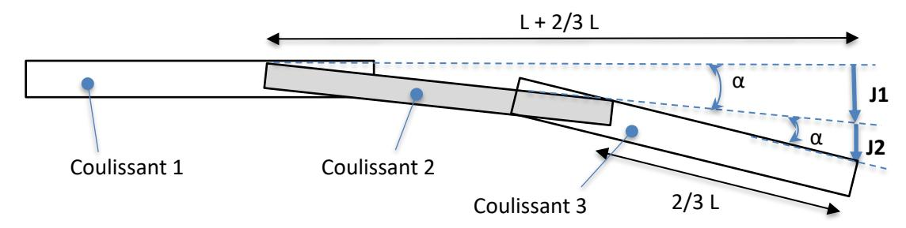

Dans le cas de petits déplacements, on a tan  $\alpha = \sin \alpha = 0.1/200$ . On peut utiliser le théorème de Thalès aussi.

Soit J1. le ieu en bout de fourche, entre le coulissant 2 et le coulissant 1 :

J1 = 
$$(L + 2/3L) \times \tan \alpha$$
 ou J1 =  $(L + 2/3L) \times \sin \alpha$ 

$$J1 = (600 + 400) \times 0,1/200 = 0,5$$
mm

Soit J2, le jeu en bout de fourche, entre le coulissant 3 et le coulissant 2 :

$$J2 = 2/3 L \times \tan \alpha$$
 ou  $J1 = 2/3 L \times \sin \alpha$ 

$$J2 = 400 \times 0,1/200 = 0,2 \text{ mm}$$

Donc Jtotal = J1+J2 = 0,5+0,2 = 0,7 mm

**Question 27 .** L'effort Pb-f ⃗⃗⃗⃗⃗⃗ appliqué sur la glissière de gauche dans le cas le plus défavorable.

Pb-f=((65%×33)+1)×9,81=220,2345 Ndonc Pb-f ⃗⃗⃗⃗⃗⃗ = -220,23 ⃗z

**Question 28 .**

La flèche totale ftotale en bout de fourche ftotale = 8,565+2,051 = 10,616 mm

# **Question 29 .**

Le déplacement total Dtotal en bout de fourche Dtotal = Jtotal + ftotale = 0,7 +10,616 = 11,316 mm Dtotal < 20 mm donc aucune collision lors de l'extraction du bac !

# **CONCLUSION ET SYNTHESE**

# **Question 30 .**

L'entrepôt existant pourra implanter un rack sans risque de poinçonnement du dallage.

Le robot Skypod pourra se déplacer au sol en maintenant le contact de ses roues avec celui-ci (stabilité assurée). Il se hissera ensuite, grâce à ses deux moteurs adaptés, dans le rack. L'arrêt devant le bac à extraire est assuré. A l'aide de sa fourche télescopique, le robot extraira un bac sans rentrer en collision avec les équerres. Puis il se dirigera vers la station de préparation de commandes où les articles seront collectés par l'opérateur. Sa batterie lui permettra d'effectuer 160 trajets puis il se dirigera vers sa borne de rechargement. On conclut donc ce système pourra être implanté dans tous les cas.

# **PARTIE PEDAGOGIQUE**

Toutes les réponses sont formulées sur les documents réponse fournis dans le sujet.

**Document réponse DR1 –** algorigramme de positionnement du robot lors de la prise d'un bac à un emplacement i.

# Déplacement jusqu'à la position d'arrêt Hf en vue de la prise d'un bac CORRIGE début $C0 \leftarrow 0$ « Initialisation du compteur C0 » Réception nouvel emplacement i non oui Lecture de i « demande de déplacement à i <> 0l'emplacement i » non oui « Calcul de Hf » Hf ← D1+Dist \*(i-1) – Dec - 10 « Calcul de Nf » Nf ← Hf/p C0 < Nf « position Hf non atteinte » non oui Lecture de A Arrêt du Mise en route moteur du moteur « apparition d'une non ÎΑ $C0 \leftarrow 0$ nouvelle dent» oui « Incrémentation du C0 ← C0 +1 i ← 0 compteur C0 »

Remarque : C0 = compteur de nombre de dents

# **Document réponse DR2 –** programme ARDUINO

```
// déclaration des constante et variables
const byte captind = 3;
const byte EnMotPin = 11;
const byte SensMotPin = 13;
int compteur = 0;
int etage = 0;
int hauteur = 0;
// Initialisation
void setup() 
{
 pinMode(captind, INPUT);
 pinMode(EnMotPin, OUTPUT); 
 pinMode(SensMotPin, OUTPUT);
 Serial.begin(9600);
 interrupts(); // valide, autorise les interruptions
 }
// définition de la fonction inter appelée lors de l'interruption, comptage des impulsions du capteur inductif
void inter()
{
 compteur++;
 Serial.println(compteur);
}
// fonction loop - boucle sans fin – corps du programme
void loop() 
{
 // lecture de l'étage à atteindre saisi au clavier à l'aide de l'interface écran
 while (Serial.available() > 0)
 {
 etage = Serial.parseInt();
 delay(20); //pour rester dans la boucle entre chaque caractère
 } 
 // déplacement jusqu'à l'étage souhaité
 if (etage!=0)
 {
 hauteur = 400*(etage-1)+190;
 if (compteur < hauteur/10)
 {
 digitalWrite(EnMotPin, HIGH);
 digitalWrite(SensMotPin, HIGH);
 attachInterrupt(digitalPinToInterrupt(captind), inter, RISING);
 }
 else 
 {
 detachInterrupt(digitalPinToInterrupt(captind));
 digitalWrite(EnMotPin, LOW);
 etage = 0;
 compteur = 0;
 } 
 }
 } // fin du programme
```

# **DR3 - Préparation d'une séquence pédagogique**

# **Question 31**

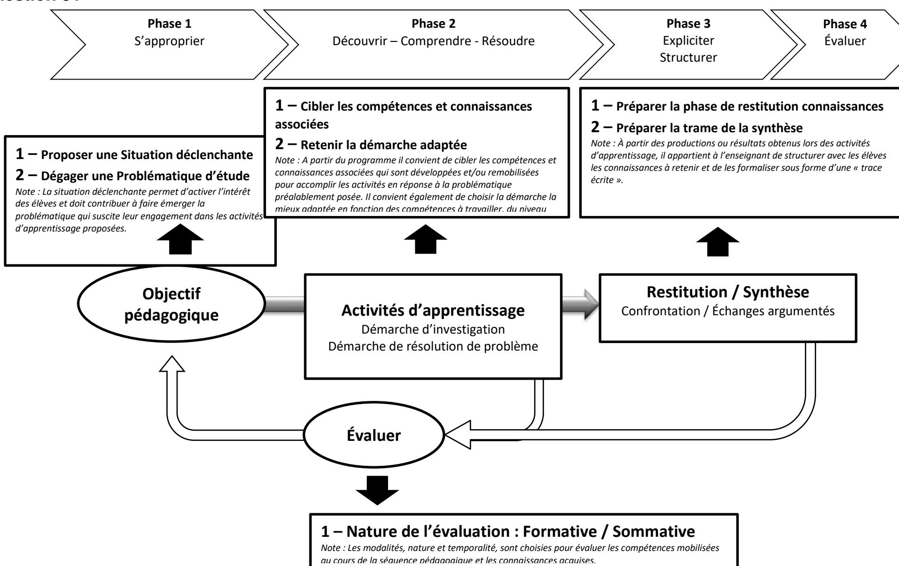

# **DR4 – Mise en œuvre d'une séquence pédagogique Question 32**

| Situation déclenchante  | Vidéo illustrant le travail de palettisation pour la préparation des commandes d'une société de vente par internet.     |
|-------------------------|-------------------------------------------------------------------------------------------------------------------------|
| Déroulement de la phase | Le professeur projette la vidéo d'illustration au<br>vidéo projecteur à l'ensemble de la classe.                        |
| d'appropriation         | Il pose quelques questions pour guider les élèves dans leur analyse de la situation illustrée dans la vidéo.            |
| (Durée 5 à 10 minutes)  | Par ilot pédagogique, Les élèves disposent d'un temps de réflexion de 5 min pour formuler les réponses.                 |
|                         | Le professeur collecte les réponses à travers un échange avec la classe et les porte au tableau pour ne retenir que les |
|                         | plus pertinentes au regard de son intention pédagogique préalablement définie.                                          |
|                         | A partir des réponses retenues, il fait émerger un problème à résoudre sous forme d'une question que les élèves doivent |
|                         | collectivement formuler.                                                                                                |
| Questionnement          | Quelles solutions techniques peut-on mettre en œuvre pour éviter un obstacle<br>?                                       |
| Compétence Travaillée   | CT2.4 Associer des solutions techniques à des fonctions.                                                                |

*Pour compléter ce tableau se reporter au document annexe DA6*

# **Question 33**

|                    | Action                                                      | Garantir des objectifs ambitieux communs à tous                                                                                                                  |
|--------------------|-------------------------------------------------------------|------------------------------------------------------------------------------------------------------------------------------------------------------------------|
| n 1                | Description                                                 | Traitement préventif de la difficulté scolaire en proposant des activités de difficultés graduelles qui toutes permettent de                                     |
| o                  | Description succincte                                       | répondre au besoin initialement formulé. Il s'agira par exemple de retenir différentes solutions mettant en œuvre des capteurs                                   |
| cti                | de l'action retenue                                         | plus ou moins simple à intégrer, ou bien pour un type de capteur retenu, d'imposer des contraintes d'intégration plus ou moins                                   |
| A                  |                                                             | complexes à mettre en œuvre.                                                                                                                                     |
|                    |                                                             |                                                                                                                                                                  |
| 2                  | Action                                                      | Organiser le tutorat entre élèves                                                                                                                                |
| n<br>o<br>cti<br>A | Description<br>Description succincte<br>de l'action retenue | Traitement curatif de la difficulté scolaire en répartissant les élèves dans les différents ilots pédagogiques et en mettant en<br>œuvre le tutorat par un pair. |

*Pour compléter ce tableau, se reporter aux documents DA6 et DA7*

# DR5 - Mise en œuvre d'une séquence pédagogique

# **Question 34**

|                                                                                                                                                                      | Déroulement de la séquence                                                     |                           |                                                                                                                                                                                                                                                                                                                                                                                                                                                                                                                                     |                                                                                                        |                                                                                    |  |  |  |  |  |  |
|----------------------------------------------------------------------------------------------------------------------------------------------------------------------|--------------------------------------------------------------------------------|---------------------------|-------------------------------------------------------------------------------------------------------------------------------------------------------------------------------------------------------------------------------------------------------------------------------------------------------------------------------------------------------------------------------------------------------------------------------------------------------------------------------------------------------------------------------------|--------------------------------------------------------------------------------------------------------|------------------------------------------------------------------------------------|--|--|--|--|--|--|
|                                                                                                                                                                      | Questionnement                                                                 | Démarche<br>Pédagogique   | Activités                                                                                                                                                                                                                                                                                                                                                                                                                                                                                                                           | Ressources –<br>Matériels                                                                              | Conclusion - Bilan                                                                 |  |  |  |  |  |  |
| Séance 1                                                                                                                                                             | Quelles solutions techniques peut-on mettre en œuvre pour éviter un obstacle ? | Investigation             | Rechercher de solutions techniques existantes.  Analyser une partie du fonctionnement d'un véhicule autonome.                                                                                                                                                                                                                                                                                                                                                                                                                       | Pré-requis : classe inversée avec parcours numérique sur ENT Postes informatiques Documents ressources | Proposition de solutions techniques en réponse à un besoin                         |  |  |  |  |  |  |
| Séance 2                                                                                                                                                             | Comment concevoir la solution technique ?                                      | Résolution<br>de problème | Compléter un cahier des charges à partir des mesures effectuées.<br>Réaliser un croquis.                                                                                                                                                                                                                                                                                                                                                                                                                                            | Postes informatiques Documents ressources Outils de mesure (pieds à coulisse, réglet)                  | Croquis                                                                            |  |  |  |  |  |  |
| Séance 3                                                                                                                                                             | Comment modéliser et réaliser le prototype de la solution retenue ?            | Démarche<br>de projet     | Modéliser et imprimer en 3D le prototype.  Valider le prototype.  Note: Par ilot pédagogique, les élèves doivent prototyper une solution technique qui permet de répondre au besoin formulé lors de la séance 1 en respectant le cahier des charges complété lors de la séance 2. Plusieurs solutions plus ou moins complexes peuvent être envisagées afin de prendre en compte les différents profils d'élèves. Il convient de veiller à ce que chaque groupe parvienne à prototyper et valider sa solution dans le temps imparti. | (prise en compte du CdC retenu) Postes informatiques Documents ressources Imprimante 3D                | Différentes solutions de prototypage Protocole de validation de solution technique |  |  |  |  |  |  |
| Commentaires : Cette séquence peut se poursuivre par une séquence consacrée à la modification du programme du véhicule autoriprendre en compte les capteurs ajoutés. |                                                                                |                           |                                                                                                                                                                                                                                                                                                                                                                                                                                                                                                                                     |                                                                                                        |                                                                                    |  |  |  |  |  |  |

# **DR6 – Démarches pédagogiques**

# **Question 35**

|                            | Démarche d'investigation                                       | Démarche de résolution de problème                                   |  |  |  |  |
|----------------------------|----------------------------------------------------------------|----------------------------------------------------------------------|--|--|--|--|
| Objectif de la démarche    | Comprendre                                                     | Comprendre et agir                                                   |  |  |  |  |
| Activités induites         | Analyser et formaliser                                         | Analyser des causes, choisir une solution, remédier et évaluer       |  |  |  |  |
| Support d'activité         | La démarche d'investigation repose sur l'étude d'un produit    | La démarche de résolution de problème technique est un               |  |  |  |  |
| Préciser<br>en<br>quelques | abouti et vise à<br>:                                          | ensemble structuré de réflexions et d'actions visant, à partir de    |  |  |  |  |
| mots ce qui caractérise le | -<br>observer le comportement, le fonctionnement,              | l'expression du problème :                                           |  |  |  |  |
| support d'activité.        | -<br>observer la constitution d'un produit,                    | -<br>à l'expliciter,                                                 |  |  |  |  |
|                            | -<br>rechercher des informations                               | -<br>à identifier les contraintes qui<br>y sont associées, le niveau |  |  |  |  |
|                            | -<br>identifier les solutions retenues ainsi que les principes | de réponse attendue et les types de résolutions possibles (lois,     |  |  |  |  |
|                            | qui le régissent.                                              | règles, outils, méthodes, organisation),                             |  |  |  |  |
|                            |                                                                | -<br>à appliquer les méthodes de résolution,                         |  |  |  |  |
|                            |                                                                | -<br>à comparer les résultats afin de faire un choix justifiable.    |  |  |  |  |

Note :

La démarche d'investigation ou démarche de résolution de problème, elles sont initiées par une situation problème qui doit donner lieu à une question ouverte et impliquer une tâche complexe à résoudre.

# **Question 36**

| Questionnement                                 | Démarche                       | Description de l'activité                                      | Ressources                                       |
|------------------------------------------------|--------------------------------|----------------------------------------------------------------|--------------------------------------------------|
| La déformation totale                          | Investigation<br>: Observer le | Définir ou prendre connaissance du protocole d'essai           | Banc d'essai, éléments à tester, environnement   |
| en bout de fourche                             | comportement de l'élément      | -<br>Réaliser les essais dans le strict respect du             | informatique permettant le traitement des        |
| télescopique est-elle<br>conforme à l'exigence | pour le comparer avec le       | protocole                                                      | valeurs relevées.                                |
| du<br>cahier<br>des                            | comportement attendu dans      | -<br>Collecter l'information «<br>utile<br>», ici la flèche en | Note<br>: Pour enrichir l'étude plusieurs cas de |
| charges<br>?                                   | la CdC<br>?                    | fonction des grandeurs paramétriques de l'étude                | figures peuvent être envisagés pour construire   |
|                                                | Identifier les paramètres qui  | (Matériau et section droite) -<br>Mettre en forme les          | par exemple une loi comportementale -<br>Flèche  |
|                                                | ont une incidence sur la       | résultats dans un tableau les représenter sous                 | = f(Section) ou Flèche) = f(Matériau)).          |
|                                                | flèche<br>: Matériau, section  | forme de courbes interprétables –<br>Conclure quant            |                                                  |
|                                                | droite                         | à la question posée.                                           |                                                  |
|                                                |                                | Note<br>:<br>Une<br>activité<br>pratique<br>d'expérimentation  |                                                  |
|                                                |                                | implique la mise en œuvre d'un protocole d'essai qui           |                                                  |
|                                                |                                | permet de garantir la justesse de l'observation au             |                                                  |
|                                                |                                | regard<br>du<br>comportement<br>que<br>l'on<br>souhaite        |                                                  |
|                                                |                                | caractériser.                                                  |                                                  |

# **Connaissances travaillées**

On aborde les connaissances en lien avec le comportement d'une structure sollicitée en flexion en fonction du matériau (loi de Hooke – Module de Young) ou bien de la section droite.

<sup>\*</sup> CdC : Cahier des Charges

# **Rapport du jury de l'épreuve d'admissibilité « analyse et exploitation pédagogique d'un système pluritechnique »**

# **1. Présentation du sujet**

Le support du sujet est un système de préparation de commandes destiné au e-commerce et composé d'une brigade de robots capables d'aller chercher des produits contenus dans des bacs et entreposés sur plusieurs étages de racks de stockage, puis, d'amener ces produits aux préparateurs des commandes. Cette solution permet d'importants gains de productivité, une optimisation de la capacité de stockage et une réduction de la pénibilité du travail en diminuant de 15 kilomètres par jour la distance parcourue par un opérateur.

Le sujet est composé de plusieurs parties qui abordent six problématiques techniques indépendantes et d'une partie pédagogique. L'ensemble de cette étude permet de valider les solutions envisagées lors de l'étude d'avant-projet afin de lancer la conception détaillée du système.

# **2. Analyse globale des résultats**

Le sujet propose un questionnement sur les différents champs des sciences industrielles de l'ingénieur. Les six parties indépendantes sont abordées de manière linéaire par une majorité des candidats. Mais les candidats se concentrent davantage sur les parties du questionnement en lien avec leur option. Le jury insiste sur le caractère transversal de l'épreuve qui doit engager les futurs candidats à acquérir des connaissances dans les quatre spécialités.

Globalement, le jury considère que beaucoup de candidats se sont préparés pour cette session, les formules et principes de base étant connus. Néanmoins l'application de ces principes au système proposé n'est souvent pas aboutie.

#### **3. Commentaires sur les réponses apportées et conseils aux futurs candidats**

## **3.1. Première partie : Implantation du rack**

Cette partie consiste à vérifier la résistance au poinçonnement du dallage en béton sous l'effet de la charge des poteaux intérieurs du rack. La plupart des candidats a bien répondu à cette première partie. Le jury regrette, néanmoins que de trop nombreux candidats donnent la masse en kg alors que l'on demande le poids en N et que très peu d'entre eux aient évoqué l'accélération comme facteur possible de modification de la pression.

#### **3.2. Deuxième partie : Ascension du robot**

Cette partie permet de choisir la motorisation permettant le déplacement vertical du robot sur le rack. Le jury remarque que la plupart des candidats perçoivent les principes à utiliser pour répondre à la problématique mais confondent le PFS et le PFD. Le jury regrette, également, que certains candidats rencontrent des difficultés à appliquer ces principes au sujet considéré.

# **3.3. Troisième partie : Positionnement du robot sur l'axe vertical.**

Cette partie doit permettre aux candidats de vérifier que le robot est capable de s'arrêter verticalement dans une position voulue pour saisir les bacs.

Dans cette partie, si, les caractéristiques d'une roue dentée sont souvent méconnues, l'analyse géométrique du positionnement du robot est, elle, assez bien traitée par de nombreux candidats.

La partie algorigramme est souvent traitée. Le jury constate que les candidats se sont mieux préparés à lire et/ou compléter un algorigramme pour cette session que pour les précédentes. Cela reste une notion à ne pas négliger pour la préparation du concours.

Par contre, le jury déplore que la question en lien avec l'écriture du programme n'ait été traitée que par un faible nombre de candidats.

Le choix du capteur, dans cette partie, est également très rarement justifié. Le jury rappelle que toute conclusion doit être chiffrée en lien avec une grandeur physique.

#### **3.4. Quatrième partie : Caractéristiques de la batterie pour une autonomie optimale.**

L'objectif de cette partie est de calculer la capacité de la batterie nécessaire pour que le robot puisse effectuer 160 trajets types.

Le jury note ici les progrès des candidats quant aux conversions d'unités mais déplore que des problématiques simples, comme le dimensionnement d'une batterie, ne soient pas maîtrisées. Là encore, le jury insiste sur le caractère transversal de l'épreuve.

# **3.5. Cinquième partie : Stabilité du robot lors des déplacements au sol.**

Cette partie permet au candidat de vérifier la répartition de la charge sur les quatre roues du robot et donc de s'assurer du contact des quatre roues avec le sol dans tous les cas.

Cette partie est une des parties la moins traitées par les candidats. Le jury constate un inventaire des actions mécaniques extérieures très souvent incorrect et un manque de rigueur dans l'écriture des torseurs. Le jury constate également la non maîtrise de la notion de moment de certains candidats. Le jury déplore également les difficultés de certains candidats pour résoudre un système d'équations. Ils n'explicitent donc pas précisément les nouvelles inconnues.

Par ailleurs, la conclusion, comme sur l'ensemble du sujet, est rarement réalisée ou justifiée.

## **3.6. Sixième partie : Déformation de la fourche.**

Cette partie consiste à vérifier la déformation totale en bout de fourche télescopique afin de s'assurer de la non-collision avec les étagères des racks.

Cette partie commence par un tracé de schéma explicatif afin de représenter le jeu. Le jury déplore la qualité graphique des schémas proposés par les candidats. Ce manque de soin, justesse et précision du tracé de ce schéma a induit de nombreuses erreurs dans le calcul du jeu demandé. Le jury insiste sur l'importance de la réalisation de schémas technologiques/explicatifs soignés en situation d'enseignement.

Le jury constate une mauvaise lecture de l'énoncé dans cette sixième partie. De nombreux candidats lisent 1mm au lieu de 0.1mm.

Cette partie révèle également que nombre de candidats rencontrent des difficultés dans la lecture de courbes simples de flexion.

#### **3.7. Septième partie – Exploitation pédagogique**

La première question porte sur la structuration d'une séquence pédagogique. Elle permet au candidat d'expliciter les différentes phases et objectifs des différentes parties d'une séquence pédagogique en s'appuyant sur un exemple de fiche pédagogique.

Dans un deuxième temps, le questionnement vise à détailler le début de la séquence. Sur la base de l'exemple proposé, le candidat doit proposer un énoncé pour la situation déclenchante qui constitue un élément primordial pour activer l'intérêt et la curiosité des élèves et proposer le déroulement de la phase d'appropriation propice à l'engagement des élèves dans le but de répondre à la question posée et cohérent avec la compétence travaillée.

Dans cette partie le candidat est également amené à se questionner sur les modalités mises en œuvre pour proposer un enseignement en réponse à l'hétérogénéité du groupe classe pris en charge.

Enfin sur la base de l'exemple proposé, le candidat est invité à décrire le contexte d'une séance en précisant la démarche retenue, la démarche la plus pertinente étant ici une démarche de projet.

Dans un troisième temps le candidat doit définir les démarches d'investigation et de résolution de problème. Il est ensuite invité à proposer un exemple d'activité expérimentale en réponse à une thématique de travail en lien avec la partie VI du sujet « Déformation de la fourche ».

La partie pédagogique a été traitée de manière hétérogène. Les candidats ont su expliciter les principales étapes d'une séquence pédagogique. La question relative à la description du début de la séquence pédagogique est globalement correctement traitée. Le jury note néanmoins quelques incohérences entre les activités et la compétence travaillée. La question consacrée à l'identification des différentes approches mobilisables pour la prise en compte d'un groupe hétérogène est, pour la majorité des candidats, traitée que partiellement, sans doute faute d'une lecture approfondie de la ressource proposée. La dernière partie n'est que très partiellement traitée. Les candidats peinent à décrire une démarche expérimentale et ne mentionnent que très rarement le protocole expérimental qui doit être à la base de toute démarche d'ingénierie lors de la phase de caractérisation du comportement d'un composant.

# **4. Conclusion**

Le jury rappelle aux candidats l'importance de soigner la présentation de la copie, la qualité de la rédaction et la précision du vocabulaire. Le jury demande aux candidats de faire particulièrement attention aux fautes d'orthographe et de grammaire. Les candidats doivent correctement repérer les questions et en cas d'absence de réponse, l'indiquer clairement sur la copie. Le jury conseille également de mettre les résultats en évidence, en les encadrant par exemple. Le jury attire l'attention des candidats sur le fait que l'utilisation de stylos bille effaçables et du surligneur est déconseillée car certains résultats peuvent rapidement devenir illisibles sur la copie.

Il est important de connaître les unités des différentes grandeurs physiques pour avoir un regard critique sur l'homogénéité des relations et des résultats proposés. Le jury invite donc les candidats à traiter ces aspects avec plus de rigueur. Les résultats doivent être présentés sous forme littérale, et les applications numériques doivent aussi être réalisées avec rigueur avec un nombre significatif de chiffres après la virgule cohérent. Les candidats doivent se présenter pour l'épreuve avec une calculatrice scientifique en état de marche.

La rigueur mathématique fait partie des attendus des candidats aux concours de recrutement de professeurs de sciences industrielles de l'ingénieur. Les grandeurs vectorielles ou scalaires doivent être clairement identifiées et la résolution d'équations mathématiques maitrisée.

Le jury recommande aux candidats d'apporter un soin particulier aux questions de conclusion de chacune des parties. Les écarts évalués doivent être clairement mis en évidence et commentés. La validation des performances se fait de façon justifiée vis-à-vis des critères du cahier des charges et des travaux réalisés dans la partie concernée.

Par ailleurs, une lecture attentive et complète du sujet est nécessaire pour permettre d'exploiter au mieux les documents ressources mis à disposition.

Enfin, le jury insiste sur le fait que pour traiter cette épreuve transversale, les candidats doivent avoir un minimum de connaissances et de culture scientifique dans plusieurs domaines. Bien qu'une évolution soit constatée, ce point reste primordial pour des enseignants destinés à l'enseignement technologique dans sa globalité. Le jury conseille donc aux futurs candidats de travailler dans ce sens.

# **5. Résultats**

430 copies ont été évaluées pour cette épreuve, la moyenne des notes obtenues est de 8,5 et l'écarttype de 3,5 avec :

- 17,9 comme meilleure note ;
- 1,8 comme note la plus basse.

# **Éléments de correction de l'épreuve d'admissibilité « Étude d'un système, d'un procédé ou d'une organisation » – option ingénierie des constructions**

# **Étude 1 - PROGRAMME DU PROJET DE CONSTRUCTION.**

**Q01 :**  *Commenter le rapprochement entre le questionnement du philosophe Jacques Derrida et le projet du Maillon.*

L'évocation de la dualité du mot «cap » pourrait, presque à elle seule, établir le lien entre les interrogations du philosophe quant à sa vision de l'Europe et le projet du Maillon.

Une autre **capitale**, --Strasbourg est l'une des capitales de l'Europe, siège du Parlement Européen et siège du Conseil de l'Europe-- et une autre **direction** --la culture autorise l'emprunt de tous les chemins-- permettent ainsi le rapprochement entre le questionnement de Jacques DERRIDA et ce projet. On retrouvera « L'autre cap » dans le nouveau label du lieu :

« MAILLON-Théâtre de Strasbourg-Scène Européenne » où apparaissent très explicitement les dimensions culturelle et européenne du projet, lesquelles dimensions étant très bien matérialisées par l'architecture du bâtiment dont les façades aux très vastes ouvertures, suggèrent les échanges en tous sens.

**Q02 :**  *Rappeler le style architectural de ce bâtiment. Établir une liste complémentaire de 4 styles architecturaux avec leur époque principale et lieux associés.*

L'architecture de la façade du bâtiment d'entrée du parc des expositions, construite en 1926, est liée au style « art déco ».

Dans la réponse à la 2 ème partie de question, très ouverte, pouvaient être cités les styles roman, gothique, renaissance, industriel, art nouveau, haussmannien etc.

D'autres éléments de réponse à cette question peuvent être consultés utilement sur différents sites de l'Internet.

**Q03 :**  *Décrire la mission principale du « programmiste » dans l'acte de construire. Quels sont ses interlocuteurs privilégiés ?*

Le rôle du programmiste est dans un premier temps d'aider la maitrise d'ouvrage et les futurs utilisateurs à définir quels sont leurs besoins et à les mettre en adéquation avec les contraintes du projet, qu'elles soient fonctionnelles, budgétaires, spatiales. Dès que tous les enjeux sont identifiés et étudiés, il rédige un programme de l'opération qui précise l'ensemble des exigences du projet. Dès que les équipes de maitrise d'œuvre (cabinets d'architecture et bureaux d'études) ont rendu leurs propositions, sous la forme d'un projet -qu'il s'agisse d'une esquisse ou d'un avant-projet sommaire-, le rôle du programmiste est alors d'analyser ces réponses pour vérifier leur pertinence et leur conformité par rapport au programme de l'opération.

Ses interlocuteurs sont principalement les personnels de la maitrise d'ouvrage et ceux de la maitrise d'œuvre.

*Source : Internet : Flores-amo*

**Q04 à Q06 :** 

Voir documentation en annexe et sur l'Internet.

# **Étude 2 - ÉTUDE DES MODES CONSTRUCTIFS DES VERTICAUX**

**Q07 :**  *Rappeler les obligations administratives* 

Il faut généralement l'obtention d'un avis de conformité délivré par un organisme de certification pour s'assurer de la qualité d'un produit de construction. Pour des raisons d'assurances et de lutte contre les malfaçons potentielles, la plupart des maitres d'ouvrage exigent ce sésame indispensable.

Les différents organismes de certification des produits de construction sont regroupés dans l'association AFOCERT (Association Française des organismes de certification des produits de construction). Parmi les 22 membres, se trouvent le CSTB, le CERIB, l'AFNOR, ACERBOIS etc.

**Q08 :**  *Lister les différents modes opératoires pour réaliser les verticaux.* 

De manière non exhaustive : On trouve pour les structures porteuses les 3 matériaux principaux de construction que sont le bois, l'acier et le béton (armé, précontraint). On peut également y ajouter la brique pour la maçonnerie porteuse ou de remplissage.

Toutes ces matières sont soit

- transformées et préparées en usine, transportées puis assemblées in situ : ce cheminement concerne tous types de matières décrites ci-dessus et en particulier, pour le béton, pratiquement toutes les pièces préfabriquées (poutre, MCI en béton).
- transportées, préparées et assemblées in situ : concerne presque exclusivement le matériau « béton », à l'exception des éléments en béton précontraint nécessitant des bancs de préfabrication spécifiques et enfin, les maçonneries de brique ou de blocs de béton (parpaing ou BBM).

Selon les matériels utilisés, les modes opératoires sont différents. Dans tous les cas, un engin de levage adapté est nécessaire :

- Une grue fixe, pour la plupart des réalisations, surtout lorsque les porteurs sont réalisés avec des matériels lourds et encombrants (train de banches par exemple)
- Une grue mobile, en appui d'une éventuelle grue fixe ou qui peut se substituer complètement à elle, utilisée le plus souvent pour la pose des structures en acier, en bois et pour les éléments en béton armé ou précontraint.

C'est dans la réalisation des éléments en béton que se trouvent principalement les différents modes constructifs avec leurs matériels ad hoc :

- Pour les ouvrages courants :
- Les voiles en béton banché, requérant trains de banches et éventuellement consoles pignon et lests avec leurs sécurités intégrées,
- Les murs à coffrage intégré (voir question suivante), ainsi que murs et poteaux préfabriqués nécessitant des matériels de stabilité et de sécurité,
- Les poteaux, parfois circulaires dont le coulage se fait dans des coffrages cartonnés, ou rectangulaires (coffrés selon le même principe que les voiles)
- Pour les ouvrages exceptionnels de génie civil :

- Les voussoirs en béton précontraint (pour les ponts) où équipage mobile et système forain de précontrainte sont indispensables,
- Les ouvrages de grande hauteur où la technique du coffrage glissant / semi-glissant peut être utilisée.
- Enfin, mais encore au stade de la recherche : les imprimantes 3D !

**Q09 :** *Donner une valeur d'impact selon les critères proposés dans le choix du Mode opératoire.*

Le tableau multi-critère proposé en Q9 permet une recherche intégrant le maximum de paramètres amenant au choix définitif du mode opératoire. En effet, pour finaliser une analyse comparative, il n'est absolument pas envisageable de s'arrêter à la seule notion de coût ! S'applique donc ici le principe aujourd'hui largement partagé, qui admet que le « mieux disant » n'est pas forcément le « moins disant ».

Cependant, remplir un tableau de ce type reste éminemment subjectif et étroitement lié à la politique entrepreneuriale. De fait, les réponses apportées influencent-elles une « tendance » à adopter l'une ou l'autre des solutions retenues.

Sans proposer un remplissage ni commenter plus avant le tableau, est joint à cette correction un argumentaire « orienté » mettant en avant les avantages des MCI, à opposer, bien évidemment, aux tenants des murs banchés coulés en place. Les commentaires suivants n'étaient pas demandés, et surtout pas de façon aussi détaillée, dans le sujet d'épreuve.

**Cet argumentaire est décomposé en différentes catégories. On les trouve souvent dans la plupart des «informations produits», pour une analyse la plus pertinente possible.**

## **Arguments « financiers » :**

- La réduction du temps d'immobilisation des grues à tour, associée aux couts de location de banches dans le cas des murs de grande hauteur avec des processus de coulage complexe. Cependant, il ne faut pas en faire une généralité : Une entreprise performante saura faire moins cher dans les cas courants, ce qui lui permettra d'éviter les couts inhérents aux frais généraux du préfabricant et ceux liés au transport.
- L'utilisation des MCI, dans certains cas, peut conduire à des économies financières « cachées » telles :
  - Le préfabricant finance en fait le besoin en fond de roulement (BFR). Dans une solution traditionnelle, l'entreprise paye ses collaborateurs en fin de mois et les matières premières à 45 jours en fin de mois (ou 60 jours en date de facturation). Elle doit traiter et contrôler un nombre important de factures. Celles concernant les livraisons de béton, par exemple, ne peuvent prêter à discussion et rares sont les motifs à retarder le paiement.
  - Pour les MCI, les recours sont nombreux et ne manquent pas d'être utilisés par les clients pour retarder les paiements qui, malgré la loi de finance, dépassent largement les 80 jours.
  - Lorsque l'entreprise a une cote d'assurance-crédit faible, l'utilisation des MCI peut lui permettre de répartir la pression des engagements. Si la tension en ce domaine est palpable, il y a toujours possibilité de faire agréer le préfabricant comme sous-traitant et le payer ainsi directement ; ce qui reste impossible avec un fournisseur de béton par exemple ou un loueur de banche. Avec cet artifice, la société peut augmenter sa surface de solvabilité.

# **Arguments « techniques » :**

C'est dans les applications décrites ci-dessous que l'utilisation des MCI est la plus pertinente :

- Murs de grande hauteur lorsque l'élément d'ouvrage est compatible avec les dimensions des tables (3,8 m x 13,0 m ou 13,30 m utiles dans les nouvelles usines) et du transport. On note que c'est le plus souvent le transport qui reste le plus contraignant. Par ailleurs, l'utilisation des MCI permet de s'affranchir de la location de banches spéciales et plus encore, de leur entreprosage sur site, surtout dans le cas des chantiers exigus.
- Murs contre les existants,
- Murs avec isolant intégré et parasismique nécessitant du monolithisme (contrainte difficilement atteignable avec des panneaux sandwich massifs,
- Murs à parements non dégradables intérieur et extérieur avec isolant et sollicitations structurelles importante (MC2I),
- Murs pour parking enterré, permettant une bonne étanchéité : la solution MCI permet le coulage du radier et le pied du murs sans reprise, contrairement à la solution banchée qui nécessite plusieurs opérations,
- Murs en infrastructure de façon générale,
- Murs dont la réalisation impose d'éviter les consoles-pignon.

# Quant au levage des éléments :

- Chantiers en « longueur » réalisé à la grue automotrice,
- Chantiers où la mise en œuvre d'une grue à tour est particulièrement délicate, dans le cas des espaces de construction très réduites par exemple.

Par ailleurs, dans tous ces cas, l'utilisation des MCI permet de limiter le temps de réalisation et par conséquent le cout de locations de la grue.

# **Aspect « dimensions de murs »** *(complémentaire au § précédent)* **:**

En limitant l'analyse des modes opératoires aux seules dimensions des murs, la réflexion est à mener sur trois entrées :

# 1. Les tables des usines

Les dimensions de tables 3,8 x 13,20 permettent de répondre à la plupart des besoins. Il faut noter cependant un surplus pour le transport.

- 2. Les moyens de transport :
- Les semi-remorques plateaux : hauteur & longueur du plateau = 1,2 m & 13 m. On peut donc transporter des murs de cette taille sur chevalet. Dans ce cas, le déchargement de fait à l'unité.
- Les porte-panneaux *faymonville* ou *Langendorf* : permettent un transport simple pour les murs jusqu'à 3,8 m x 9,0 m
- Les porte-panneaux *faymonville* extensibles (moins courants), permettant de transporter des murs jusqu'à 12 m.
- 3. La capacité des moyens de levage sur chantier

# **Arguments « Qualité – Sécurité – Social** *(Compétences des personnels)* **» :**

- Si le niveau de compétence de la maitrise d'œuvre est notoirement insuffisant, le MCI permet de compenser ce déficit, étant entendu que les préfabricants sont censés être en mesure de contrôler l'ensemble des opérations, de la conception structurelle jusqu'à la pose définitive. On trouve effectivement les personnels des services techniques du préfabricant qui reprennent à leur compte une grande partie des méthodes.
- L'utilisation des MCI permet d'externaliser une partie de la production sur site. Les surcharges conjoncturelles du carnet de commande peuvent ainsi être beaucoup plus facilement lissées. Le

préfabricant évite également au conducteur de travaux toutes les commandes des composants et matières premières utiles aux murs banchés en se limitant à un seul interlocuteur. De fait, il est souvent impliqué dans la synthèse du projet.

La qualité des parements est indéniable et ce, lorsque les joints sont acceptés par l'architecte.

# **Aspect « Sécurité » :**

Comme les fabricants de banches ont intégré des dispositifs très élaborés, l'argument de sécurité est très discutable. Malgré tous les efforts en ce sens de la part des industriels, la sécurité reste toujours un problème avec les MCI pour les raisons suivantes :

- Manipulation de panneaux de plusieurs tonnes en lieu et place des bennes à béton largement sécurisés,
- Boucles de levage qu'il faut atteindre à la hauteur maximale du panneau,
- Pose des armatures dans les joints de murs (idem hauteur),
- Pose d'un MCI sur dalles en étages avec le risque que l'enchainement des taches de recul des gardes corps ne soit pas respecté,

L'une des pistes de réflexion s'oriente vers des solutions où l'entreprise utilise des nacelles et autres équipement adaptés au travail en hauteur.

# **Étude 3 - ÉTUDE DU FERRAILLAGE DE LA LONGRINE LG14.2**

**Q10 :**  *Sur le plan de ferraillage (épuré), faire coïncider le nombre correspondant au N° de la barre du tableau des aciers. Indiquer le rôle de chacune des barres.par rapport aux sollicitations internes (Mf(x) ; N(x) ; V(x)) ou et aux dispositions constructives* 

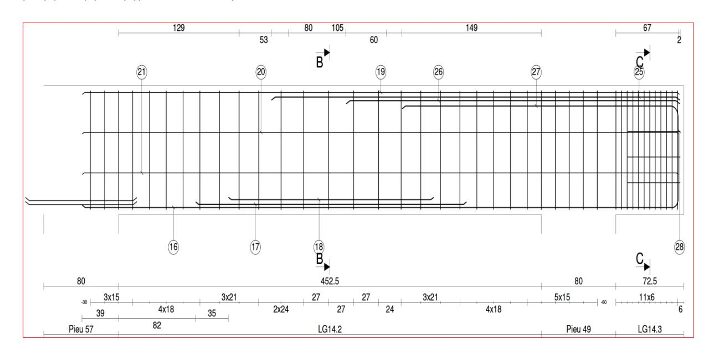

Nota : Ne pas prendre en compte les échelles

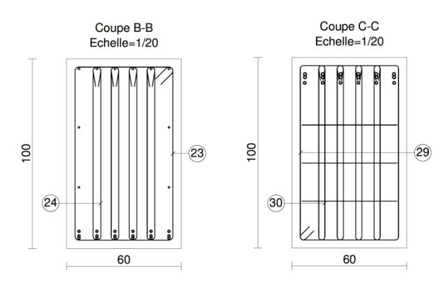

**Q12 :**  *Ratio d'armatures dans la longrine.* 

NB : Calculs développés page suivante.

Le ratio obtenu de 66 kg d'acier par élément de type « poutre » est tout à fait compatible avec les valeurs courantes ; Un conducteur de travaux, en passe de passer commandes de ses armatures ne sera pas surpris par cette valeur que l'on peut a priori valider.

| N° | Barre | Nb. |     | Lg barre Lg tot.(cm) | Nom et rôle(s) attribués aux barres d'acier                                                                                                |
|----|-------|-----|-----|----------------------|--------------------------------------------------------------------------------------------------------------------------------------------|
| 16 | HA 12 | 6   | 681 | 4086                 | Barre longitudinale inférieure; prend une «part» de Mf sur toute la longueur                                                               |
| 17 | HA 12 | 6   | 290 | 1740                 | Prend une part complémentaire de Mf sur une partie de la longueur                                                                          |
| 18 | HA 12 | 6   | 220 | 1320                 | Idem 17. En section, la quantité de barres dépend de la valeur de Mf(x)                                                                    |
| 19 | HA 10 | 6   | 640 | 3840                 | Barre longitudinale Supérieure. Peut participer au moment résistant («aciers<br>comprimés», et/ou aciers de construction pour les cadres). |
| 20 | HA 8  | 2   | 639 | 1278                 |                                                                                                                                            |
| 21 | HA 8  | 2   | 639 | 1278                 | Aciers de peau (dispositions constructives)                                                                                                |
|    |       |     |     |                      |                                                                                                                                            |
| 23 | HA 8  | 29  | 304 | 8816                 | Cadre (23), étriers (24) participent à V(x) résistant (Tout comme les épingles                                                             |
| 24 | HA 8  | 116 | 210 | 24360                | d'ailleurs). La distance entre cadres  lorsque V(x) sollicitant .                                                                        |
| 25 | HA 16 | 6   | 438 | 2628                 | Barres longitudinales Supérieures. Participent au moment résistant du porte à faux                                                         |
| 26 | HA 16 | 6   | 358 | 2148                 | (d'où leur position inverse par rapport à la travée). Leur longueur dépend également                                                       |
| 27 | HA 14 | 6   | 340 | 2040                 | de Mf sollicitant, visible sur le modèle de Q11.                                                                                           |
| 28 | HA 10 | 3   | 159 | 477                  | Épingle d'about (dispositions constructives)                                                                                               |
| 29 | HA 6  | 12  | 300 | 3600                 |                                                                                                                                            |
| 30 | HA 6  | 48  | 204 | 9792                 | Idem 23 et 24                                                                                                                              |

**Q11 :**  *Modéliser la longrine et établir le schéma de principe N,V,Mf.*

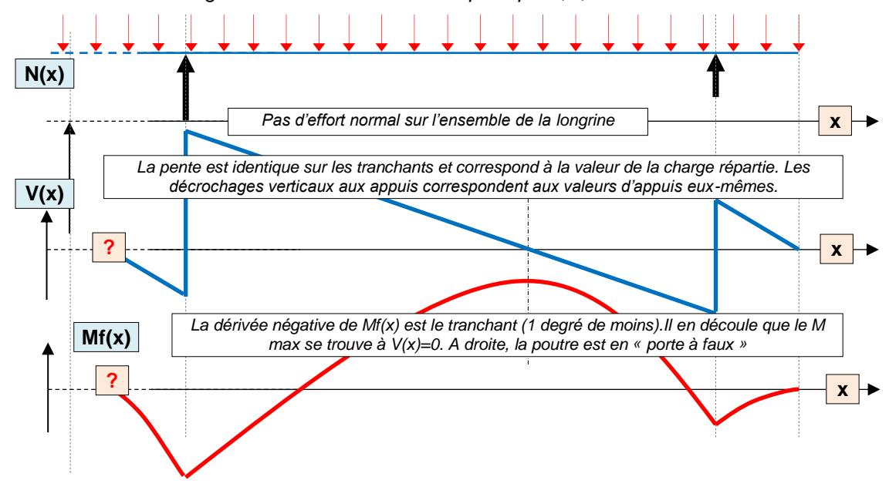

**Q12 :**  *Calculer le ratio des armatures dans la longrine. ).* 

| N° | Dama         | NIL | 1 - ()  | L Tot    | Diam    | 0         | Dala lin 4 | D-I- T | Valuura da la lamanina la 44a |
|----|--------------|-----|---------|----------|---------|-----------|------------|--------|-------------------------------|
|    | Barre        | Nb. | Lg (cm) |          | Diam.   |           | Pds liné   | Pds T  | Volume de la longrine béton : |
| 16 | HA <b>12</b> | 6   | 681     | 4086     | 12      | 113,1     | 0,88       | 36,0   |                               |
| 17 | HA <b>12</b> | 6   | 290     | 1740     | 12      | 113,1     | 0,88       | 15,3   | Longueur: 6,85                |
| 18 | HA <b>12</b> | 6   | 220     | 1320     | 12      | 113,1     | 0,88       | 11,6   | hauteur: 1                    |
| 19 | HA <b>10</b> | 6   | 640     | 3840     | 10      | 78,54     | 0,61       | 23,5   | largeur 0,6                   |
| 20 | HA 8         | 2   | 639     | 1278     | 8       | 50,27     | 0,39       | 5,0    |                               |
| 21 | HA 8         | 2   | 639     | 1278     | 8       | 50,27     | 0,39       | 5,0    | Volume m <sup>3</sup> 4,11    |
| 22 | -            | -   | -       |          |         |           |            |        |                               |
| 23 | HA 8         | 29  | 304     | 8816     | 8       | 50,27     | 0,39       | 34,6   | Ratio kg/m <sup>3</sup> 66    |
| 24 | HA 8         | 11  | 210     | 2310     | 8       | 50,27     | 0,39       | 9,1    |                               |
| 25 | HA <b>16</b> | 6   | 438     | 2628     | 16      | 201,1     | 1,57       | 41,2   |                               |
| 26 | HA <b>16</b> | 6   | 358     | 2148     | 16      | 201,1     | 1,57       | 33,7   |                               |
| 27 | HA <b>14</b> | 6   | 340     | 2040     | 14      | 153,9     | 1,20       | 24,5   |                               |
| 28 | HA <b>10</b> | 3   | 159     | 477      | 10      | 78,54     | 0,61       | 2,9    |                               |
| 29 | HA <b>6</b>  | 12  | 300     | 3600     | 6       | 28,27     | 0,22       | 7,9    |                               |
| 30 | HA <b>6</b>  | 48  | 204     | 9792     | 6       | 28,27     | 0,22       | 21,6   |                               |
|    |              |     |         |          |         |           |            |        |                               |
|    |              |     |         | Poids to | tal des | aciers (e | en kg)     | 272    |                               |

**Étude 4 - ÉTUDE DU BANCHAGE DE LA COQUE EXTÉRIEURE**

# **4A/ Stabilité des banches au vent.**

**Q13.**  *Calculer la pression réglementaire du vent à prendre en compte sur la banche.*

Est lue dans le tableau du DT2§B la valeur de vitesse du vent de la zone 1 soit 103 km/h.

On note : pVent = Cx V<sup>2</sup> /16,3, avec V vitesse du vent en m.s-1 et C<sup>x</sup> (sans unité) le coefficient de traînée aérodynamique le plus défavorable, soit = 1,75.

….. 103 km/h \* 1000/3600 = 28,6 m/s

pVent = Cx V<sup>2</sup> /16,3 = 1,75 \* 28,6² / 16,3 = **87,9** daN/m² **Q14.** ⇒⇒⇒ Relever l'ensemble des valeurs [H ;T ;L ;D ;B] à prendre en compte pour la vérification de stabilité. Établir le modèle mécanique qui permettra l'étude en configuration «Vent sur peau de coffrage du train de banches » et valider le type d'étai retenu.

Pour une hauteur de banches de 15 m, (attention, quand bien même la hauteur de bétonnage de façade est de 14 m, c'est la hauteur globale qui est soumise aux aléas du vent) on a les 3 possibilités suivantes : H7 T4 L3 D4,3 B3 /// H8 T5 L3 D4,3 B3 /// H9 T5 L3 D4,3 B3

Celle retenue correspond à une accroche de l'étai à 8 m.

**Modèle**: L'étai n'accepte que les sollicitations de Traction ou de Compression. Les efforts qui lui sont appliqués ont donc la même direction que l'étai lui-même. Et grâce au PAM (principe des actions mutuelles), les actions de l'étai sur la banche sont égales et opposées. **NB**: Le calcul mené (dans un 1er temps avec une hauteur de lest nulle) doit permettre de vérifier la non rotation autour du point A ...

Avec cette hauteur de 8 m. l'angle -minimals est tel que tox - D/H et

Avec cette hauteur de 8 m, l'angle –minimal- est tel que  $tg\alpha = D/H$  et donne :  $4,3/8 \rightarrow 28,26^{\circ} \rightarrow Sin\alpha$ : 0,473

Prenons le PFS et isolons la partie du train de banche équilibrée par le vent et un étai : Le calcul de surface sur laquelle s'applique le vent est : Hauteur = 15 m et Largeur = 1 m soit une surface de  $15 \text{ m}^2 \dots$ 

L'effort horizontal  $P_{VENT}$  résultant du vent est au CdG soit 7,5 m (15/2) ; soit  $P_{VENT} = p_{vent} \cdot Surface = 1 \ kN/m^2 \cdot 15 \ m^2 = 15 \ kN$  ; Le moment par rapport à A du au vent est  $15 \cdot 7,5 = 112,5 \ kN.m.$  Pour rester à l'équilibre, l'étai doit « opposer » un moment en A équivalent en valeur à celui du vent ; connaissant la hauteur d'accroche de 8 m, on en déduit facilement la valeur de l'effort minimal que requiert l'étai.

Avec une hauteur d'ancrage  $H=8\,m$ , la composante horizontale de l'effort dans l'étai est : 112,5 kN.m / 8 m = 14,06 kN Pour connaître l'effort à reprendre dans l'étai

 $F = F_H/\sin\alpha$  ... avec  $\sin\alpha = 0.473$  ; F = 14.06 / 0.473 = 29.70 kN

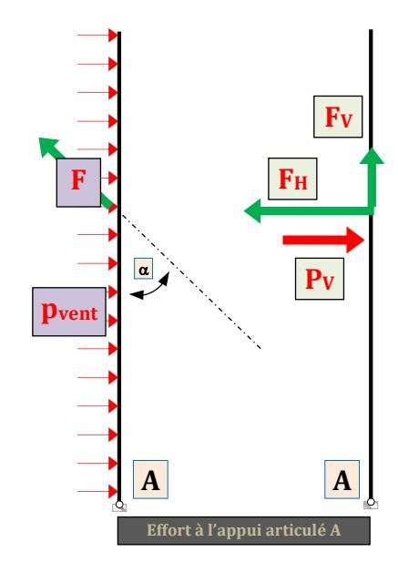

8m

H du pt d'accroche :

D = 4.3m

Étai en

position

sur sol Bracor Étai en

sur lest

Lest

Nota 1: Le calcul de la longueur des étais avec accroche hors lest (par exemple sur dalle) donne, avec le théorème de Pythagore  $L_{\text{étai}} = (8^2 + 4,3^2) = 9,08 \text{ m}$ . Or, les étais STABETAI T 5 sont certifiés à 33 kN quelle que soit leur longueur avec un max de 8,90 m ! A priori, les calculs invalideraient donc le résultat puisque la longueur est dépassée. Cependant, en considérant une valeur réaliste de hauteur de lest, les résultats valident l'étai retenu

En prenant en compte une hauteur de lest égale à 0,6 mètre (matériel retenu par l'entreprise), le calcul donne un angle de

 $tg\alpha$  = D/H et donne : 4,3/(8-0,6) → 30,16° → Sin: 0,5024, d'où un effort dans l'étai de F = 14,06 / 0,5024 = 28 kN et sa longueur de 8,56 m.

Nota 2: Le calcul de l'effort en A n'est pas nécessaire dans cette partie.

**Q15.**  *Valider le type de lest dans la configuration retenue par l'entreprise (H8 T5 L3 D4,3 B3). Conclure quant à la stabilité de l'ensemble dans la configuration « Vent sur face arrière du train » si est conservée l'hypothèse formulée sur le bracon.*

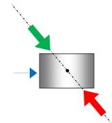

Les efforts s'appliquant au lest sont les efforts de compression de l'étai et du bracon, ainsi que les efforts du sol permettant l'équilibre du lest. L'effort de compression du stabétai se décompose en H et V. En utilisant le principe des actions mutuelles, les efforts de l'étai sur le lest sont connus :

**H :** sin \* 30 kN = 0,473 \* 30 = **14,20 kN et V :** cos \* 30 = 0,880 \* 30 = **26,42 kN**

**Stabilité** : Comme on considère que le bracon horizontal est sans effet sur le lest, l'effort horizontal de frottement lest/sol doit être inférieur à 14,20 kN, soit un effort vertical mini de V = H/f (f = H/V) L'effort vertical **V** à reprendre par l'assise est donc de = 14,20 / 0,275 = **51,64 kN**.

Ces 51,64 kN sont « apportés » par la composante verticale du stabétai, (soit 26,42 kN) et par le poids minimal que doit avoir le lest soit 51,64 - 26,42 = **25,22 kN**.

Si est prise en compte la hauteur du lest … l'effort de compression du stabétai donne

**H :** sin \* 30 kN = 0,5024 \* 30 = **15,07** et **V :** cos \* 30 = 0,865 \* 30 = **25,94 kN**

Dans ce cas, l'effort horizontal de frottement lest/sol doit être inférieur à 15,07 kN, soit un effort vertical mini de V = H/f 15,07/0,275 = 54,8 kN.

Ces 54,8 kN sont apportés par la composante verticale du stabétai, (soit 25,94 kN) et par le poids mini du lest soit 54,8 -25,94 = 28,9 kN.

Les lests de type L3 répondent bien au critère de poids : 30 kN > 25,2 et > 28,9 kN, ce qui valide leur choix :

Nota : Dans le cas du Vent sur face arrière, les calculs sont identiques : l'effort de traction dans l'étai est de 30 kN, soit H : 13,15 kN et V : 27 kN

# **4B/ Stabilité des banches à la poussée des bétons.**

**Q16.** *Calculer la vitesse de levée du béton frais et la poussée constante (en kN/m/m) du béton en zone basse. En déduire la poussée totale du béton sur l'ensemble du train.*

Rappel : La poussée du béton (pression p à une hauteur (profondeur) H) est exprimée en N/m² (kN/m²) et suit pour une part la loi physique de poussée hydrostatique. On considère le béton comme un fluide parfait de densité 2,5 sur une certaine hauteur allant de H=0 (point haut du coffrage) jusqu'à H1, niveau défini en fonction du béton et de sa mise en place. La pression se stabilise alors à la valeur (à lire sur diagramme joint) correspondant au point H1 et ce, jusqu'au pied de banche.

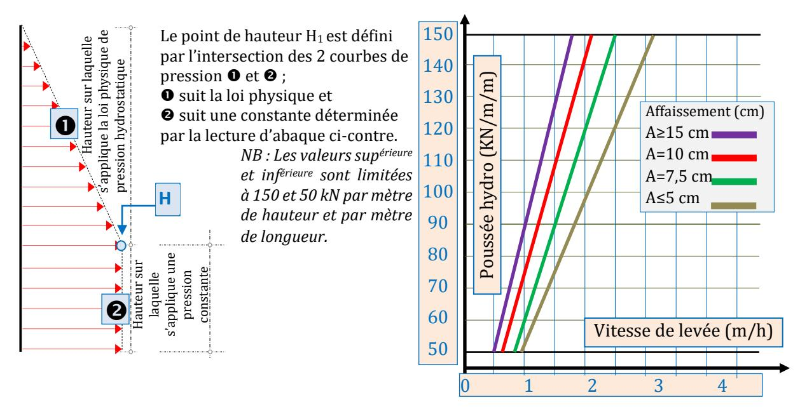

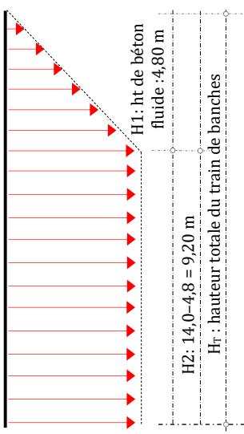

Les 35 panneaux assemblés pour constituer un train de banches (L : 14 m \* H : 15 m) permettent le coulage en continu de 62,5 m<sup>3</sup> de béton d'affaissement 7,5 cm et ce, pendant 7 heures.

Sur la hauteur totale de coulage, soit 14 m, (attention à ne pas confondre avec la hauteur des banches), la vitesse de levée est de 14/7 = 2 m/h.

Sur l'abaque, on lit que la poussée par mètre de hauteur et par mètre de largeur est de 120 kN.

Détermination de H<sup>1</sup> :

Pour atteindre une poussée de 120 kN/m<sup>2</sup> , en utilisant la formule de la poussée hydrostatique p = .h, on obtient hauteur H<sup>1</sup> = 120/25 = **4,80 m**.

Le modèle est maintenant accessible (schéma à gauche)

La poussée totale pour 1 mètre de largeur : (soit une demie banche) est donc (½ (4,8) + 9,2) m \* 120 kN/m = **1392 kN**

On note que cette poussée totale sera à reprendre par l'ensemble des tiges filetées.

# **4C/ Validité des matériels (tiges filetées et chaînes de levage).**

**Q17.** *Calculer la surface de banche reprise par une tige de serrage. En déduire l'effort de traction sollicitant la tige dans les zones de pression maximale et constante. Proposer un type de tige répondant aux critères de sécurité.*

Chaque élément du train de banche de h : 3 m et l : 2 m est maintenue par 4 tiges filetées, espacées de 1,5 m en hauteur et de 1 m en largeur. 2 sont situées à 0,5 m de la base.

Chaque tige doit reprendre un effort de poussée qui s'appliquera sur une surface de ht 3 \* L 2 = 6 m<sup>2</sup> / 4 tiges = 1,5 m<sup>2</sup> de poussée par tige.

A partie du tableau nous donnant 120 kN/m/m, on obtient une effort de 180 kN.

Les valeurs indiquées par le fabricant imposent pour un effort de 180 kN d'utiliser une tige de diamètre 30 mm (charge d'utilisation de 290 KN). Cependant, cet effort étant très proche de la CU d'une tige de diamètre 23 mm (CU de 172 kN), on pourra solliciter le SPS pour envisager cette solution (ce qui a été adopté in situ, sachant que la charge de rupture garantie est de 345 kN).

**Q18.** *Calculer la déformation en % et l'allongement (en mm) entrainés par la dilatation de l'acier. Comparer les valeurs obtenues avec celles dues à l'effort de traction calculé dans la question précédente. Commenter.*

Les tiges de serrage en **acier FeE500** ont une contrainte de traction de <sup>t</sup> = F/S =180 000 / 23<sup>2</sup> \*/4 = **433 MPa** *(ou 180 000 / 30<sup>2</sup> \*/4 = 255 MPa si le 30 est retenu)*

Calcul des déformations dues à la traction et à la dilatation.

Allongement dans la partie bétonnée, soit pour une largeur de mur de L<sup>0</sup> = 40 cm, due à la **traction** <sup>t</sup> = E ; d'où = <sup>t</sup> / E = 433 / 205000 = 2,11 10-3 = (L - L0) / L0 = L / L<sup>0</sup>

Soit L = 0,4 m 2,11 10-3 = **0,85 mm**

Allongement dans la partie bétonnée soit L<sup>0</sup> = 40 cm due à la **dilatation**

L = L<sup>0</sup> T = 12 10-6 0,40 10 = **0,048 mm.**

On peut donc considérer comme négligeable l'influence de la dilatation sur la tige filetée. Dans l'étude de ce cas extrême (augmentation de 10°C en une heure !), l'allongement correspond au vingtième environ (0,048 / 0,85) de celui engendré par l'effort de traction, qui lui, est bien réel.

**Q19.** *Calculer l'effort dans les élingues et proposer le type de chaîne le mieux adapté au contexte. Valider l'angle d'élingage au regard des règles de sécurité communément admises. Conclure quant au choix des matériels chaînes et tiges.*

Les 2 brins de l'élingue de longueur 12 m, s'accrochent aux boucles de levage espacées de 9,40 m. Le triangle ABC est isocèle. Les angles CAB et CBA sont donc égaux. Leur valeur permettra de valider les règles de sécurité, à savoir un angle d'élingage (en A et en B) inférieur à 30° ou un angle d'ouverture des brins (en C) inférieur à 60°

Calcul des angles en A (et B) : cos = (9,4/2) / 12 = 0,392, soit = 67°. L'angle d'élingage, (soit le compélemntaire de par rapport à 90°) est donc de 23°. Ce qui valide la géométrie.

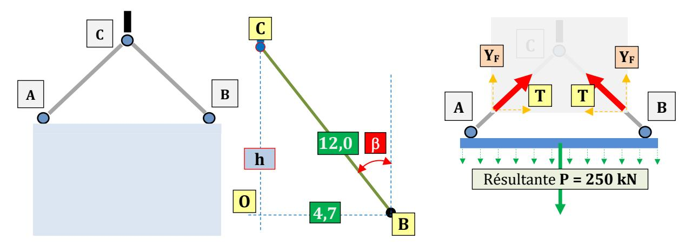

Quant à la tension dans les chaînes, on la calcule en isolant le tronçon.

En utilisant le PFS et son équation sur l'axe des Y :

Somme des actions sur Y = 0, soit 2.Y<sup>F</sup> = poids total = 250 kN

Or connaissant l'angle en A (67°), cela donne une tension de … F = 250 / 2.sin 67° = **136 kN**.

Les chaînes de 26 mm sont adaptées (CU de 212 kN).

Les validations de matériels sont à faire avec le coordonnateur SPS. Lui seul peut autoriser des dépassements de charge (comme pour les tiges filetées), voire éventuellement pour des chaines de diamètre 20 mm (136 kN au lieu de 125 kN). Tout est susceptible à « négociation », étant entendu que le risque pris est à supporter (assurances : justice…) par celui qui l'a autorisé.

**Q20.** *Établir la liste des principales informations susceptibles d'être données dans le « PIC ». Quelle décision est à prendre quant aux différentes opérations de levage après analyse de ce document ?*

Voir les sites de l'Internet dédiés aux contenus d'un Plan d'Installation de Chantier.

Les puissances de grue n'étant pas données dans les DT, il convient d'en disposer pour une analyse plus fine. Cependant, on note que les trains de banche (25 tonnes annoncées) sont à disposer non loin des extrémités de flèches (particulièrement en façade OUEST avec la grue N°2). Un rapide calcul, très approximatif, de puissance nécessaire donne un résultat de 25 tonnes \* 50 mètres = 1250 tonnes.mètres. Cette puissance est incompatible avec les grues à tour couramment utilisées *(Voir site Internet POTAIN par exemple)*. Cette taille exceptionnelle entrainerait d'énormes surcoûts par rapport à la solution qui a été retenue : utilisation d'une grue automotrice sur pneus, pouvant se placer au plus près des façades.

*On peut noter que la réponse se trouvait dans la question précédente : « La manutention du train de banches complet de 25 tonnes s'effectue grâce à une grue mobile sur pneus Liebherr LTM 1250-5.1.* 

# **Étude 5 - ÉTUDE DE LA TOITURE**

# **5A/ Choix architectural ; Choix technologique**

**Q21 :**  *Expliquer sommairement la pertinence du choix de la maitrise d'œuvre quant à l'utilisation de ces 2 modes de couverture.*

Les salles de spectacle n'autorisent pas la présence de porteurs type poteaux, afin de conserver en tous points de l'espace un visuel de scène satisfaisant. A la lecture des grands volumes des salles, l'architecte a privilégié une structure « légère » en acier au détriment du béton dont l'utilisation aurait nécessité des poutres de très grandes dimensions. Le poids d'une structure béton ne permettrait pas une portée aussi grande que celle possible avec des bacs acier.

A contrario, les dalles béton au niveau des terrasses sont bien adaptées pour couvrir les petites portées tout en maintenant un niveau très satisfaisant de confort aux personnes empruntant les lieux, évitant de fait l'élasticité trop marquée des bacs acier.

Pourraient également rentrer dans les critères de choix : l'impact des coûts, directs et indirects ; l'empreinte carbone, ou bien encore les délais d'exécution.

**Q22 :**  *Renseigner et compléter sur le DR 3 le schéma de détail 01 matérialisant la zone courante de la terrasse. Justifier la présence d'un pare-vapeur en cet endroit.*

Un pare-vapeur est une membrane assez fine dont le rôle est de limiter au mieux le passage et la stagnation de la vapeur d'eau dans les parois extérieures d'un bâtiment. Ainsi, les matériaux isolants n'ont plus le risque d'être soumis au phénomène de condensation, susceptible de dégrader le complexe de la paroi.

Le pare-vapeur est le plus souvent placé sur les faces intérieures (où les volumes sont chauffés) et avant l'isolant. (Temp° Intérieur … Pare Vapeur … Isolant … Temp° Extérieure ) La « perméance » du matériau constituant l'écran va de pair avec l'étanchéité à la vapeur d'eau.

**Doc réponses DR 3 Étude 5 : Étude de l'étanchéité de la toiture Q22**

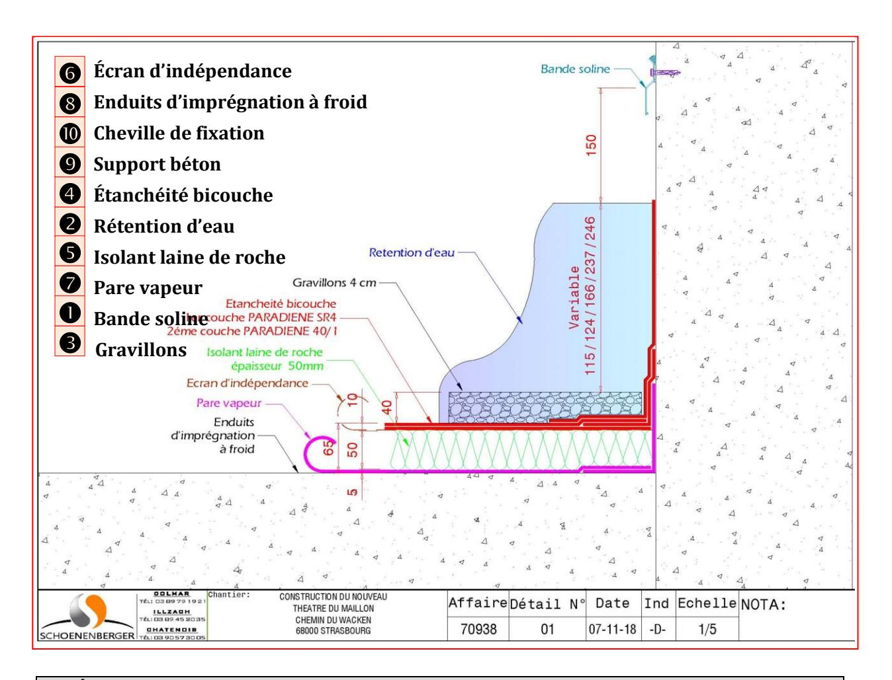

# **5B/ Étude acoustique**

**Q23 :**  *Expliquer en quoi le seul produit IN 229A+ Alpha ne répond pas au CCTP.*

La notice technique nous donne w ≥ 0,95.

La 1ère condition « coefficient d'absorption acoustique w ≥ 0,90. » est respectée.

La 2ème exigence RA,tr strictement supérieur à 53dB n'est pas satisfaite car en prenant les valeurs issues du tableau des caractéristiques du produit :

RA, tr = RW + Ctr = 64 - 11 = 53 dB (égale mais n'est pas supérieure !!)

# **5C/ Étude thermique**

**Q24 :**  *Rechercher et valider la valeur du coefficient de transmission thermique surfacique du complexe retenu, puis calculer l'épaisseur d'une couche d'isolant (de = 0,035 W/m.K) qui aurait la même performance thermique que le complexe «IN 229 A + Alpha».*

On lit dans le document la valeur du coefficient de transmission thermique surfacique

Up = 0,15 W/m².K pour le système «IN 229 A + Alpha».

On note R**IN229** = 1/Up = 1/0,15 soit **6,67 m<sup>2</sup> .K/W.**

Le seul produit IN 229 A + Alpha» valide les exigences du BET.

On en déduit la résistance globale du complexe : R = Rsi + Rse + R**IN229**

= 6,67 + 0,10 + 0,04 = 6,81 m<sup>2</sup> .K/W, puis le coefficient de transmission thermique surfacique du complexe de toiture soit Up complexe = 1/6,81 = **0,147 W/m².K**

Sur le plan strictement thermique, le complexe aurait pu être remplacé par un isolant (de = 0,035 W/m.K) dont l'épaisseur est obtenue par le calcul suivant :

R = e/ , soit e = R \* = 6,67 (en m<sup>2</sup> .K/W) \* 0,035 (en W/m.K) = **0,233 m** 

# **5D/ Étude de sécurité incendie**

**Q25 :**  *Sur le DR 4, calculer la surface utile totale des évacuations de fumée (surface utile d'ouverture du dispositif d'évacuation –SUE- et surface utile d'une installation de DEFNC –SUI-) dans les espaces concernés. Vérifier la conformité des relations : 1 : SUE totale < SLA et 2 : besoin total SUE < SUE obtenue avec les dispositifs proposés par l'entreprise SCHOENENBERGER.*

Le plan de la toiture nous permet de comptabiliser le nombre de lanterneaux selon les espaces et d'en déduire les SUE et SGO par espace.

Pour les espaces convivialité et déambulatoire : 8 type B de 1,97 m<sup>2</sup> , 2 type 3-9-10 de 0,98 m<sup>2</sup> et 1 type 2 de 0,78 m<sup>2</sup>soit un total de **18,5** m<sup>2</sup>

Pour la grande salle : 6 type C de 2,23 m<sup>2</sup> soit **13,38** m<sup>2</sup>

Pour la petite salle : 2 type A de 1,37 m<sup>2</sup> soit **2,74** m<sup>2</sup>

Pour les surfaces globales d'ouverture (SGO) –correspondant aux surfaces des lanterneaux-, on a :

Pour les espaces convivialité et déambulatoire : 8 type B de 3,24 m<sup>2</sup> , 2 type 3-9-10 de 1,69 m<sup>2</sup> et 1 type 2 de 1,50 m<sup>2</sup>soit un total de **30,80** m<sup>2</sup>

Pour la grande salle : 6 type C de 5,02 m<sup>2</sup> soit **30,12** m<sup>2</sup> Pour la petite salle : 2 type A de 3,00 m<sup>2</sup> soit **6,00** m<sup>2</sup>

Conformité des relations : **1** : SUE totale = 34,62 m<sup>2</sup> < SLA = 38,40 m<sup>2</sup> … Validé

**2** : besoin total SUE = 32,66 m<sup>2</sup> < SUE obtenue avec les dispositifs proposés par l'entreprise SCHOENENBERGER = 34,62 m2… Validé

# **Doc réponses DR 4 Étude 5 : Étude Sécurité Incendie Q25**

|  | 17,92 m2 | 8 |  | 2 |  | 1 |                                 |   |   |  |  | 18,50 | +0,58 |
|--|----------|---|--|---|--|---|---------------------------------|---|---|--|--|-------|-------|
|  | 12,32 m2 |   |  |   |  |   |                                 | 6 |   |  |  | 13,38 | +1,06 |
|  | 2,42 m2  |   |  |   |  |   |                                 |   | 2 |  |  | 2,74  | +0,32 |
|  |          |   |  |   |  |   | Surface globale d'ouverture SGO |   |   |  |  |       |       |
|  |          |   |  |   |  |   |                                 |   |   |  |  |       | 30,80 |
|  |          |   |  |   |  |   |                                 |   |   |  |  | 30,12 |       |
|  |          |   |  |   |  |   |                                 |   |   |  |  |       | 6,00  |
|  |          |   |  |   |  |   |                                 |   |   |  |  |       |       |
|  |          |   |  |   |  |   |                                 |   |   |  |  |       |       |

# **Rapport du jury de l'épreuve "Étude d'un système, d'un procédé ou d'une organisation" Option : Ingénierie des constructions.**

# **1. Présentation du sujet.**

Le sujet de cette épreuve d'admissibilité du CAPET SII option Ingénierie des Constructions s'appuie sur la réalisation du projet de construction d'un bâtiment réalisé à Strasbourg ; il s'agit du « MAILLON », lieu culturel se substituant à l'ancienne salle de théâtre, dont le nom fait référence au 1er site (quartier de Hautepierre, avec un urbanisme évoquant des « mailles » de forme hexagonale) que cette scène a occupé avant de déménager dans une partie des espaces existants des locaux de la foire exposition.

L'Eurométropole de Strasbourg, très soucieuse de pérenniser son rôle de capitale européenne, a décidé d'adosser aux activités du Parlement Européen et du Conseil de l'Europe une zone internationale d'affaires. C'est dans ce cadre que la foire exposition a été « déplacée » et qu'un nouveau bâtiment dédié à la scène culturelle a été réalisé dans ce quartier entièrement requalifié.

Ce bâtiment, support du sujet de l'épreuve d'ingénierie des constructions, permet un questionnement très vaste. Cinq thèmes d'études très différents et éloignés les uns des autres ont été retenus, afin que tous les candidats ayant suivi des formations très diverses telles :

- Ingénierie des structures,
- Architecture et urbanisme,
- Ingénierie des méthodes,
- Ingénierie du second-œuvre (acoustique, thermique)
- Etc.,

soient susceptibles de trouver matière à appréhender correctement, au moins pour partie, le sujet. Au besoin, une lecture attentive des annexes et documents techniques complète les connaissances nécessaires au traitement des questions.

Cette approche dans la conception des épreuves permet au jury de considérer que **tous les candidats**, et ce, quels que soient leurs profils de formation, sont dans une posture de réussite, sans pour autant être spécialiste de l'un ou l'autre thème de l'épreuve qui porte, pour cette session 2020, sur les points suivants:

- Réflexion architecturale et rôle des différents acteurs de la construction,
- Étude comparative de divers modes constructifs des éléments structurels verticaux,
- Étude –non calculatoire- du ferraillage d'une longrine,
- Étude de stabilité des banches et validation des matériels retenus,
- Études de second-œuvre pour la toiture du bâtiment

Eu égard à la complexité du projet et à sa réalisation concrète, les cinq études proposées constituant le sujet ont été appréhendées et adaptées à la pédagogie de l'épreuve ; ce qui pouvait laisser paraître quelques approximations et/ou omissions, voulues par le jury, par rapport aux règlements et autres normes calculatoires en vigueur.

Dans le même esprit, la présentation des documents professionnels est réduite au minimum afin de ne pas surcharger le temps de lecture. Aussi, s'il pouvait apparaitre aux candidats un manque dans les données nécessaires à la résolution d'un problème, un apport personnel motivé et justifié pour y pallier n'est en aucun cas préjudiciable.

Totalement **indépendantes** entre elles, chacune des études renvoie à un secteur particulier du domaine de la construction. Dans la mesure du possible, les questions au sein d'un même thème sont de difficulté croissante et le plus souvent possible indépendantes également les unes des autres ; ce qui permet de pouvoir traiter -ne serait-ce que partiellement- n'importe quelle partie et ce, dans un ordre librement choisi. Là également, les candidats ne sont pas pénalisés par rapport à cela.

## **2. Analyse globale des résultats.**

Une majorité de candidats a bien compris la structure du sujet dans son approche par thème et comment traiter chaque partie grâce aux connaissances acquises en cours de formation, ou disponibles dans les documents annexes.

Il semble également que les candidats ont pris bonne note des conseils donnés dans les rapports de jury précédents, en cherchant à cibler le questionnaire dans son intégralité : en effet et contrairement aux années précédentes, un très grand nombre de thèmes du sujet ont été abordés. En moyenne, 19 questions sur les 25 proposées, ont été abordées ; 5 candidats ayant réussi à les aborder toutes.

D'autre part, les travaux évalués ont montré que la plupart des candidats ont fait un effort méritoire dans la rédaction et la présentation des copies : assez peu de fautes d'orthographe, expression écrite globalement satisfaisante, clarté des explications demandées et rendus soignés.

Bien évidemment, les 2 remarques précédentes ne peuvent qu'encourager le jury à la bienveillance dans les critères de notation.

# **3. Commentaires sur les réponses apportées et conseils aux candidats.**

# **Étude N°1 : Programme du projet de construction,**

La vision populaire du monde professionnel du bâtiment et des travaux publics, trop souvent limitée aux seuls métiers d'architecte et de maçon, a amené le jury à proposer un chapitre consacré au secteur de la construction, son histoire, ses acteurs et leurs différentes missions.

La connaissance de l'environnement professionnel dans lequel évoluent les divers partenaires est d'importance, tout autant que la capacité à concevoir et à réaliser un projet.

C'est à partir d'un extrait d'un texte philosophique que le questionnaire est lancé. Il est proposé aux candidats de réfléchir à l'acte de construire. En s'inspirant, par exemple, de Rabelais dans sa célèbre citation *"Science sans conscience n'est que ruine de l'âme"*, était attendue l'idée qu'une intention doit concilier capacités scientifiques et acceptabilité morale et ce, au sens très large du terme.

Les questions suivantes en appelaient à des connaissances indispensables à de futurs professeurs dont l'option est fléchée *"Architecture et construction"* : styles architecturaux, -pour le coté architecture- , rôle et interventions du programmiste dans la frise calendaire, organisation du BIM –pour le coté construction-.

Il va sans dire que l'enseignant de spécialité, à même de proposer aux élèves une sortie scolaire de type « visite de chantier » ou « découverte de l'architecture vernaculaire » par exemples, devra être en mesure de guider sa classe avec les connaissances minimales attendues pour ce genre d'approche pédagogique.

Les résultats de l'évaluation ont été globalement encourageants. Le jury regrette cependant que seuls, 25% des candidats ont donné entière satisfaction pour les 2 premières questions. Il est à noter que plusieurs candidats ont obtenu la note maximale donnée pour cette étude N°1.

# **Étude N°2 : Étude des modes constructifs des verticaux**

Cette partie fait appel aux réflexions indispensables que doit mener l'équipe en charge de réaliser les travaux. Si la maitrise d'œuvre impose **LE** projet dans sa phase études, il s'ensuit alors pour l'entreprise de concrétiser ce projet, en faisant le choix d'**UN** mode opératoire particulier pour satisfaire aux exigences de l'architecte et des bureaux d'études techniques.

Les questions, dont la 1ère assurant une certaine transition avec le thème N°1 -dans le sens où est rappelé le respect obligatoire des règles de conformité- ont été traitées de manière très inégale.

Pour la 2ème question, le jury a noté que nombre de candidats se sont lancés dans la description d'un mode opératoire particulier au lieu de lister, comme attendu, les différents modes de réalisation. Quant à la 3ème question, le « tableau multi-critères » permettant d'avoir une vue globale de tous les paramètres amenant à la solution retenue a été plutôt bien renseigné.

Les résultats pour ce thème sont donc conformes aux commentaires précédents : insuffisants pour les 2 premières questions et satisfaisants pour la dernière. Comme pour le thème N°1, le jury regrette l'absence de réponses pour certains candidats tandis que d'autres obtiennent la note maximale.

# **Étude N°3 : Étude du ferraillage d'une longrine.**

Cette étude permet d'évaluer les connaissances de base du béton armé. Mais contrairement aux questions classiques de calculs de stabilité d'ouvrages, -qui auraient nécessité la mise à disposition en nombre des Eurocodes et autres documents normatifs-, le jury a privilégié l'analyse du résultat numérique issu d'un logiciel dédié.

Ainsi, la bonne perception des liens existants entre contraintes et éléments de cohésion d'une part et, position et section des barres d'acier dans la cage d'armatures d'autre part, pouvait-elle être évaluée.

La 1ère question a été traitée dans presque toutes les copies, pour un résultat somme toute très moyen. Pourtant, la partie « lecture de plan » qui y était associée aurait du permettre au plus grand nombre d'assurer des points faciles. Les 2 dernières questions de ce thème ont été abordées par 55% des candidats seulement et ont révélé beaucoup trop de faiblesses dans la capacité à maitriser ce à quoi correspond le ferraillage d'une poutre. Le jury a donc noté en conséquence.

Cela étant, certains candidats, là aussi, ont obtenu la note maximale.

# **Étude N°4 : Étude du banchage de la coque extérieure.**

Ce thème reflète le caractère calculatoire de la mécanique des structures appliqué à l'ingénierie des méthodes. En effet, le questionnement permet de valider l'outil coffrant en combinant connaissances scientifiques minimales que tout candidat au concours doit avoir et les ressources proposées dans les documents techniques et les annexes. Le jury pouvait ainsi évaluer que l'association de la rigueur mécanique des modèles avec les contraintes réelles et plus encore réglementaires et sécuritaires de la réalité de la mise en œuvre sur site, était bien maitrisée.

Il est à noter que 50% seulement des candidats ont abordé tout le questionnaire de cette partie, d'ailleurs très bien traitée pour les seules questions 13 et 14 pour les 90% les ayant abordées. Le jury estime par contre très insuffisants les résultats aux questions 15 à 20.

Ceci paraît très surprenant au regard de l'option choisie par les candidats : en effet, ce type de problèmes et de résolutions qui les accompagnent, rentrent -a priori- dans la formation de base des candidats. L'utilisation du PFS, par exemple, nécessite de bien comprendre l'environnement dans lequel il doit être utilisé ; de même que l'outil vectoriel, les conversions d'unité, l'homogénéité des formules utilisées etc. En aucun cas, tous ces points ne devraient plus être source d'erreurs grossières dans la rédaction des attendus d'un problème.

Le jury conseille donc aux candidats un travail rigoureux de révision des bases de la mécanique. Les quelques connaissances minimales nécessaires pour renseigner le questionnaire sont largement accessibles à un étudiant de niveau licence, voire de niveau BTS/DUT.

Un seul candidat a obtenu la note maximale pour cette partie.

# **Étude N°5 : Étude de la toiture**

Cette dernière partie aborde le second-œuvre du vaste domaine de la construction. Dans le même esprit que l'étude précédente, le jury souhaitait évaluer les capacités des candidats à bien effectuer recherches et analyses documentaires, tout en y associant la rigueur scientifique ayant conduit les chercheurs à proposer les formulations empiriques que l'on retrouve dans la réglementation.

Le jury a apprécié la curiosité des candidats dans leurs recherches dans des domaines rarement étudiés dans les cursus universitaires. Acoustique et thermique appliquées, sécurité incendie, technologie des toitures, autant de particularités pour lesquelles une lecture attentive était requise pour y puiser les bonnes informations à relayer.

La bonne tenue des copies pour cette dernière partie a permis à la plupart des candidats (80%) d'obtenir d'assez bons résultats, sauf –étonnamment-, pour la 1ère question où ne semblait pas aussi évidente la réponse que le jury attendait.

Comme dans toutes les autres études, quelques candidats ont obtenu la note maximale.

# **4. Conclusions.**

Le jury a été satisfait de constater que les candidats ont su gérer leur temps. Ainsi, presque tout le questionnaire a pu être balayé dans son intégralité. Les conseils en ce sens des rapports précédents ont, semble-t-il, été bien suivis.

Il rappelle également que tous les thèmes sont accessibles, ne serait-ce que dans les premières questions de chaque partie et que, sans trop user « d'ultracrepidarianisme », un élément de réponse, même dénué de fondement et non motivé est préférable aux non-réponses !

En effet, l'évaluation ne tient pas compte exclusivement -loin s'en faut- du "résultat", mais également d'autres critères telles la capacité de concision des réponses, d'analyse des situations, la capacité de recherches documentaires et, bien sûr, la qualité de rédaction (soin, orthographe, expression écrite, qualité des schémas) etc.

Cela étant, Le jury a quand même été surpris par un nombre beaucoup trop important de mauvaises réponses à des questions très basiques (comme les styles architecturaux ou encore les efforts dans les élingues de transport, l'utilisation du PFS etc.). L'institution qu'est l'École Républicaine ne peut en aucun cas faire appel à des personnels dont le niveau scolaire n'atteint pas celui des élèves auxquels ils sont sensés s'adresser. Pour certains candidats, il est donc nécessaire de pallier à un manque certain de préparation -quand bien même a minima- dans certains champs disciplinaires.

Pour conclure ce paragraphe, les documents réponse proposés peuvent donner une indication sur le niveau de détails attendu par les correcteurs ; ceci amènera le candidat à rechercher au maximum la brièveté dans les éléments de réponses et à éviter toutes explications complémentaires "inutiles" et surtout "chronophages".

Le plus important étant au final que le futur professeur fasse comprendre au jury qu'il est en capacité de maitriser la bonne gestion d'une problématique et d'en d'assurer la résolution.

## **5. Résultats.**

65 copies ont été évaluées pour cette épreuve, la moyenne des notes obtenues est de 8,5 et l'écarttype de 3,5 avec :

- 18,8 comme meilleure note ;
- 1,7 comme note la plus basse.

# **Éléments de correction de l'épreuve d'admissibilité « Étude d'un système, d'un procédé ou d'une organisation » – option ingénierie électrique**

# **PARTIE A**

# **Question 1.**

$$POI = 2 \times n \times C \times R \times T = 2 \times 2 \times 659 \times 8,314 \times (23 + 273) = 6487048 \text{ Pascals} = 64,85 \text{ bars}$$

Le domaine de pression d'utilisation est bien compris entre 60 et 65 bars.

# **Question 2.**

La constante de la cellule correspond au rapport de la distance entre les électrodes et la surface des électrodes. La formule à utiliser est donc :

$$K = \frac{d}{s} = 40.10^{-6} m^{-1} = 0.40 cm^{-1}$$
 dans le cas de la sonde utilisée.

# **Question 3.**

$$i = G \times V = \frac{\sigma}{K} \times V = \frac{\sigma}{0.4} \times V$$
 donc  $\sigma = i \times \frac{0.4}{V}$ 

La conductivité augmente en fonction du courant i.

# **Question 4.**

Le système doit dessaler de l'eau de mer de Méditerranée, soit une salinité de 28,5 g∙l-1 . Donc d'après le document technique 3, on peut lire que la conductivité à 23°C est approximativement de σ = 42 mS∙cm-1 .

A l'aide du DT3, on argumente ensuite le choix de la cellule sur deux points :

 cellule platinée : recommandée dans des échantillons non visqueux et sans particules en suspension, c'est le cas de l'eau de mer après filtrage par notre système ;

 4 pôles pour permettre la mesure de la conductivité de l'eau de mer (42 mS∙cm-1 ) comme on peut le voir sur le document technique 3.

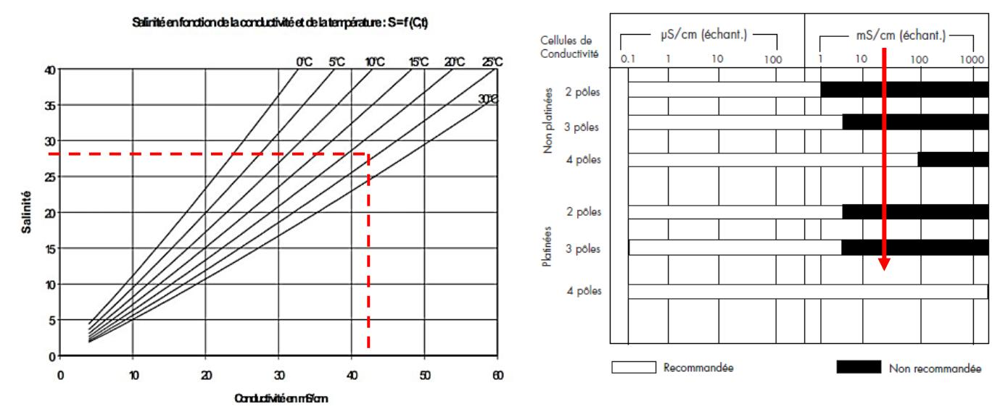

# **Question 5.**

La conductivité augmente en fonction de l'augmentation de la température et de la salinité.

# **Question 6.**

Comme la conductivité augmente en fonction de la température et afin de pouvoir comparer des résultats obtenus à différentes températures, il faut une température de référence. La température de référence généralement utilisée est 25°C. Le conductimètre mesure la conductivité et la température réelles puis, en utilisant un facteur de correction de température, il va convertir la valeur de la conductivité pour la ramener à la température de référence désirée et afficher le résultat obtenu.

# **Question 7.**

Le code de la santé publique réglemente la concentration en ions sodium et chlorure de l'eau destinée à la consommation humaine. Il en résulte qu'une eau dont la concentration en sel est supérieure à 410 mg∙l -1 est impropre à la consommation quotidienne.

```
1,4 μS∙cm-1 = 1 ppm, où 1 ppm = 1 mg∙l-1
Soit la concentration à la limite σ = 410 × 1,4 = 574 μS∙cm-1
Pour une concentration maximale σ = 574 μS∙cm-1 on calcule un 
TDSmax = Ke × σ = 0,5 × 574 = 287 mg∙l-1
Pour cette valeur de TDS la résolution de la sonde est de 1 mg∙l-1
```

# **Question 8.**

La précision de la mesure doit être de ± 0,5%, donc TDSmax dans l'intervalle 285,57 < TDS < 288,44. Le dessalinisateur est tout à fait en mesure de produire de l'eau potable **en respectant le code de santé publique.**

# **PARTIE B**

# **Question 9.**

| Poste       | Puissance (W) | Durée de fonctionnement | Energie consommée par |
|-------------|---------------|-------------------------|-----------------------|
|             |               | (h∙j-1<br>)             | jour (W∙h∙j-1<br>)    |
| Speedomètre | 40            | 24                      | 960                   |

| Radio VHF             | 30 | 1     | 30    |
|-----------------------|----|-------|-------|
| Feux de signalisation | 70 | 10    | 700   |
|                       |    | TOTAL | 1 690 |

# **Question 10.**

| Vmpp               | 18,5 V |
|--------------------|--------|
| Impp               | 4,2 A  |
| Voc                | 22,1 V |
| Isc                | 4,5 A  |
| Puissance maximale | 75,2 W |

Tableau complété en s'appuyant sur la figure 10, arrondi à un taux global de 800 W∙m-2

# **Question 11.**

Rendement du panneau, en conditions normalisées STC, soit 1 000 W∙m-2 :

> Surface totale du panneau : 1,205 m × 0,545 m = 0,656 m² Rayonnement capté : 1 000 W∙m-2 × 0,656 m² = 656,7 W **Rendement du panneau : 95 W / 656,7 W = 14,46 %**

Rendement des cellules :

Surface des cellules : 36 cellules × (125 × 125) mm² = 36 × 0,015625m² = 0,5625 m²

Puissance du rayonnement : 798 W∙m-2 × 0,5625 m² = 448,875 W Dans notre cas, la puissance maximale du panneau est de 75,2 W. **Rendement des cellules : 75,2 W / 448,875 W × 100 = 16,75 %**

# **Question 12.**

E = tension × capacité = 12 V × 130 A∙h = 1 560 W∙h

# **Question 13.**

Les besoins journaliers sont de 1 690 W∙h, ce qui fait avec les pertes rajoutées :

1 690 / 0,92 = 1 837 W∙h∙j-1

Mais en restant dans les 70%, on se base sur une énergie disponible de 2 × 1 560 × 30 % = 936 W∙h

1 837 / 936 = 1,96

Donc il faudrait 2 fois plus de batteries pour qu'aucune ne descende sous les 70% de décharge si on désire rester dans la zone de cycles de charge/décharge optimale d'après la documentation du constructeur, soit 1 800 cycles.

Attention à ne pas confondre % de décharge et profondeur de décharge…

Avec des batteries différentes (en 24 V ou en 220 A∙h ou supérieures), une seule paire pourrait suffire mais il faut prendre en compte le poids et l'encombrement pour l'installation.

Par ailleurs le panneau ne peut fournir que 75,2 W, *à condition que la météo soit très favorable et constante*, soit par jour un

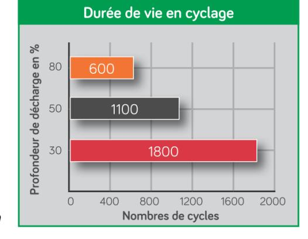

apport maximal de : 75,2 W × 6 h = 451,2 W∙h∙j-1 , ce qui est très insuffisant pour compenser pendant la journée*.* Il faudrait donc analyser plus précisément la consommation en temps réel des équipements en regard de la recharge, pendant une journée.

Une autre solution serait d'augmenter le nombre de panneaux pour en disposer de 4, mais peut être que l'encombrement sur le bateau ne le permet pas, de même si on le changeait pour un panneau plus grand.

Globalement l'installation n'est pas faite pour des traversées en autonomie, mais le bateau n'étant utilisé que pour des trajets à vue le long des côtes, les batteries peuvent être rechargées régulièrement au port.

# Question 14.

| Poste                 | Puissance (W) | Durée de               | Energie consommée par |
|-----------------------|---------------|------------------------|-----------------------|
|                       |               | fonctionnement (h·j-1) | jour (W·h·j⁻¹)        |
| GPS                   | 80            | 18                     | 1 440                 |
| Pilote automatique    | 40            | 18                     | 720                   |
| Dessalinisateur       | 432           | 1                      | 432                   |
| Speedomètre           | 40            | 24                     | 960                   |
| Radio VHF             | 30            | 1                      | 30                    |
| Feux de signalisation | 70            | 10                     | 700                   |
|                       |               | TOTAL                  | 4 282                 |

#### Question 15.

Le panneau PV est maintenant très clairement insuffisant car les besoins journaliers sont maintenant de 3 802 W·h, ce qui fait avec les pertes rajoutées :

$$E_c = 4282 / 0.92 = 4654 \text{ W} \cdot \text{h} \cdot \text{j}^{-1}$$

La capacité du parc de batteries doit donc être de :

$$\frac{2 \times 4654}{12 \times 80\%} = \frac{9308}{9,6} = 969,6 \,\text{A} \cdot \text{h}$$

Avec nos batteries à 130 A·h, il en faut :

$$\frac{969,6}{130} = 7,5$$

Il faudrait donc 8 batteries, ce qui alourdirait le bateau (8 x 38 kg = 304 kg) et ne serait peut-être pas raisonnable en termes d'installation/utilisation.

Sinon il faut aussi envisager d'accepter des décharges complètes si la batterie est rechargée rapidement à un port. Il s'agit d'un cas extrême mais **la sécurité** le nécessite.

La capacité du parc de batteries nécessaire serait alors de :

$$\frac{2 \times 4654}{12 \times 100\%} = \frac{9308}{12} = 775,6 \,\mathrm{A} \cdot \mathrm{h}$$

Avec nos batteries à 130 A·h, il en faudrait alors :

$$\frac{775,6}{130} = 5,96$$

Le gain de 2 ou 3 batteries est faible. Mais avec des batteries en 220 A·h nous en aurions alors besoin, plus raisonnablement, de :

$$\frac{969,6}{220} = 4,4$$

Avec des batteries en 220 A·h et dans le cas extrême, nous en aurions alors besoin de :

$$\frac{775,6}{220} = 3,52$$

Quelle que soit la décision prise, la possibilité d'installer d'autres batteries et le budget viendront aussi déterminer le choix de l'utilisateur.

#### PARTIE C

Cette solution permet d'optimiser l'utilisation des sources d'énergie et de produire de l'eau douce aussi bien en navigation qu'au port, mais surtout en cas de défaillance de l'une des sources d'énergie.

# Question 16.

L'indice de protection des appareillages seuls est IP20 mais IP40 en coffret modulaire ; ce qui répond à l'extrait de la Division 240 qui impose que « Dans les locaux de machines ainsi que les emplacements fermés soumis à l'humidité, les appareillages atteignent au moins l'indice de protection IP55. Dans les autres emplacements, l'indice de protection atteint au minimum IP21. ». De plus le fabricant stipule que

« les disjoncteurs iC60 sont aptes à fonctionner dans des ambiances humides et/ou polluées par des agents agressifs (piscines, ports… ».

# **Question 17.**

$$I = \frac{P}{\eta \times U} = \frac{370}{0.86 \times 12} = 35.85 A$$

Choix de l'appareillage : calibre 40 A, courbe D car pour une intensité de démarrage de 3 fois l'intensité nominale, le disjoncteur ne se déclenchera pas.

Référence : A9F75140 (1 pôle) ou A9F75240 (2 pôles).

# **Question 18.**

Le disjoncteur du bloc moteur pompe alternatif préconisé est un disjoncteur D6A.

$$I = \frac{P}{\eta \times U \times \cos \varphi} = \frac{750}{0.8 \times 230 \times 0.86} = 4.74 A$$

Le calibre 6 A convient. Courbe D car pour une intensité de démarrage de 3 fois l'intensité nominale, le disjoncteur ne se déclenchera pas.

# **Question 19.**

Chute de tension dans le câble d'alimentation AC :

$$\Delta U = 2 \times 4,74 \times \left(\frac{22,5}{1,5} \times 0,8\right) \times 0,006$$
  
 $\Delta U = 0,68 V$ 

Soit ∆ % = 100 × 0,68 230 = 0,29 %

Chute de tension dans le câble d'alimentation DC :

$$\Delta U = \rho \times \frac{L}{s} \times I$$

$$\Delta U = 0.0225 \times \frac{15}{16} \times 35.85$$

$$\Delta U = 0.75 V$$

Soit 
$$\Delta U$$
 en % =  $100 \times \frac{0.75}{12} = 6.25$  %

# **Question 20.**

En conclusion, le **choix des câbles** est cohérent vis à vis du pourcentage de chute de tension imposé par la réglementation « Divison 240 » (*Les canalisations sont prévues pour que la chute de tension maximale ne dépasse pas 5 %)* en circuit alternatif (0,29 % < 5 %) **mais pas en circuit continu** (6,25 % > 5 %).

# **PARTIE D**

# **Question 21.**

**Question 22.** Pour une telle navigation **en autonomie**, il faudrait embarquer 13 × 3 ×15 = 585 l d'eau douce.

Soit une masse de 0,585 × 1 025 = 600 kg d'eau, au lieu des 50 kg du dessalinisateur.

Il n'y a pas forcément la place nécessaire à un tel stockage, surtout sur de si petits voiliers. De toute façon, cela alourdirait grandement le voilier et donc diminuerait les performances. D'après le document, le dessalinisateur a un débit de 60 l∙h-1 . En 1 heure de fonctionnement, il produit 60 litres d'eau, donc au-dessus avec confort du maximum nécessaire de 15 × 3 = 45 l∙j-1 .

Cela couvre largement les besoins en eau douce de cette famille pour la journée.

Par ailleurs, stocker de l'eau peut engendrer la création de micro-organismes et il faudrait alors la traiter, désavantage qu'il n'y a pas lorsqu'on consomme l'eau au fur et à mesure, bien que cela n'enlève pas la nécessité de nettoyer les cuves à intervalles réguliers.

# **Question 23.**

L'inductif ne fonctionne bien qu'avec des pièces métalliques, donc inutile pour l'eau.

- L'optique doit être dans le réservoir et est trop sensible à l'état de surface. En cas de remous, s'il est mouillé il n'est plus fiable.
- Le magnétique ne détecte que les matériaux polarisés, donc inutile pour l'eau.
- Le capacitif est utilisable car il détecte tout type de matériau et peut être en dehors du réservoir**.** *Et la mesure étant analogique nous aurons bien une image du volume d'eau*.
- L'ultrason doit être **dans le réservoir,** *or ce n'est pas voulu par l'utilisateur*.

Le capacitif est donc celui qui convient le mieux, même s'il peut être sensible à l'humidité. Mais la condition d'hygiène de ne rien insérer dans le réservoir semble primordiale face à l'entretien nécessaire d'un capteur sensible à l'humidité.

# **Question 24.**

*1 FONCTIONS\_UTILISEES 2 FONCTION volToPercent() 4 DEBUT\_FONCTION 5 RENVOYER % 6 FIN\_FONCTION 7 FONCTION level\_sense() 9 DEBUT\_FONCTION 10 varHorlogeOld2 PREND\_LA\_VALEUR heure actuelle 11 varHorloge2 PREND\_LA\_VALEUR Heure actuelle 12 POUR varCompteur ALLANT\_DE 1 A 5 13 DEBUT\_POUR 14 TANT\_QUE (varHorloge2 - varHorlogeOld2 < 0,24) FAIRE 15 DEBUT\_TANT\_QUE 16 varHorloge2 PREND\_LA\_VALEUR heure actuelle 17 FIN\_TANT\_QUE 18 table[varCompteur] PREND\_LA\_VALEUR volToPercent() 19 varHorlogeOld2 PREND\_LA\_VALEUR varHorloge2 20 FIN\_POUR 21 varLevel PREND\_LA\_VALEUR MOYENNE(table[]) 22 FIN\_FONCTION 23 VARIABLES 24 varHorlogeOld1 EST\_DU\_TYPE NOMBRE 25 varHorloge1 EST\_DU\_TYPE NOMBRE 26 varHorlogeOld2 EST\_DU\_TYPE NOMBRE 27 varHorloge2 EST\_DU\_TYPE NOMBRE 28 varCompteur EST\_DU\_TYPE NOMBRE 29 table EST\_DU\_TYPE LISTE 30 varLevel EST\_DU\_TYPE NOMBRE 31 DEBUT\_ALGORITHME 32 varHorlogeOld1 PREND\_LA\_VALEUR heure actuelle 33 varHorloge1 PREND\_LA\_VALEUR heure actuelle 34 TANT\_QUE (1) FAIRE 35 DEBUT\_TANT\_QUE 36 TANT\_QUE (varHorloge1 - varHorlogeOld1 < 60) FAIRE*

```
37 DEBUT_TANT_QUE
38 varHorloge1 PREND_LA_VALEUR heure actuelle
39 FIN_TANT_QUE
40 varHorlogeOld1 PREND_LA_VALEUR varHorloge1
41 APPELER_FONCTION level_sense
42 SI (varLevel > 65) ALORS
43 DEBUT_SI
44 AFFICHER "voyant vert"
45 FIN_SI
46 SINON
47 DEBUT_SINON
48 SI (varLvel >35) ALORS
49 DEBUT_SI
50 AFFICHER "voyant orange"
51 FIN_SI
52 SINON
53 DEBUT_SINON
54 SI (varLevel > 20) ALORS
55 DEBUT_SI
56 AFFICHER "voyant rouge"
57 FIN_SI
58 SINON
59 DEBUT_SINON
60 APPELER_FONCTION activer relais
61 TANT_QUE (varLevel < 65) FAIRE
62 DEBUT_TANT_QUE
63 APPELER_FONCTION level_sense
64 FIN_TANT_QUE
65 FIN_SINON
66 FIN_SINON
67 FIN_SINON
68 FIN_TANT_QUE
69 FIN_ALGORITHME
```

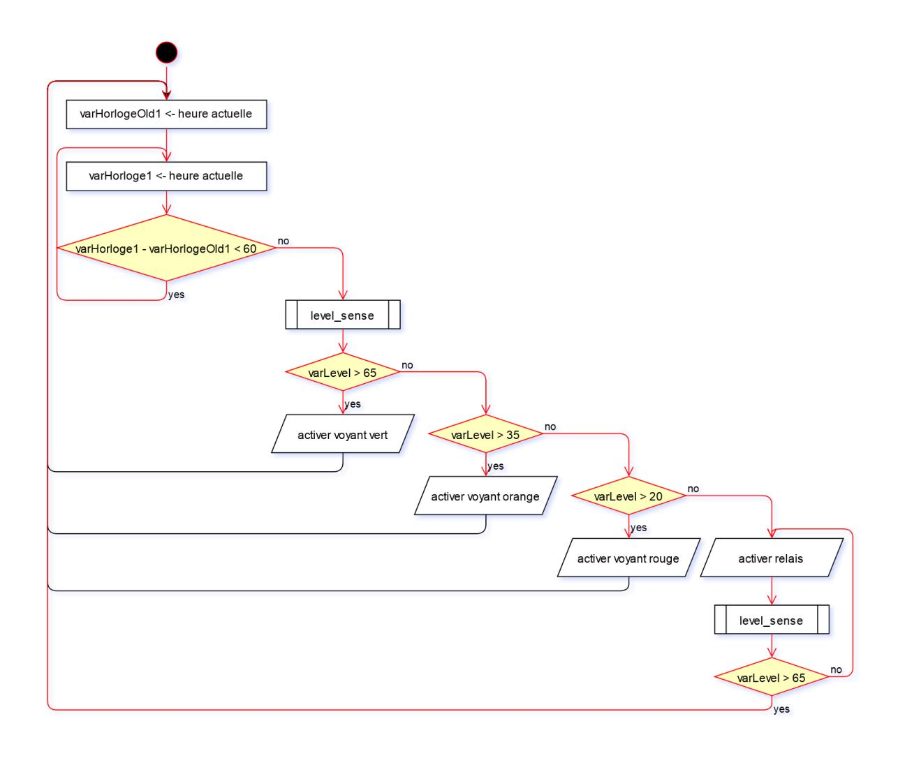

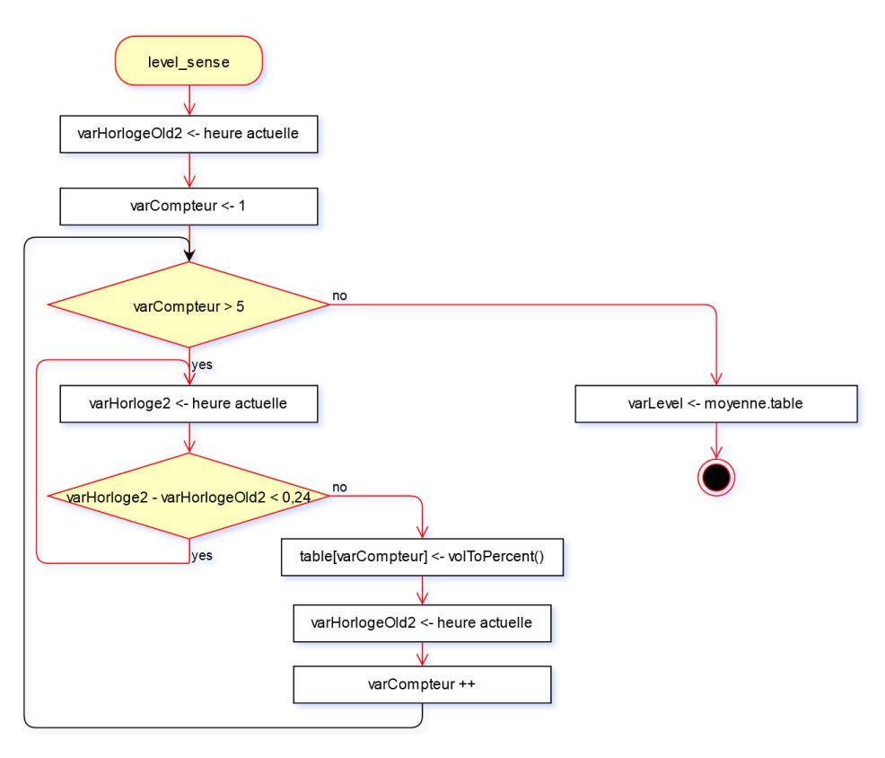

# **Question 25.**

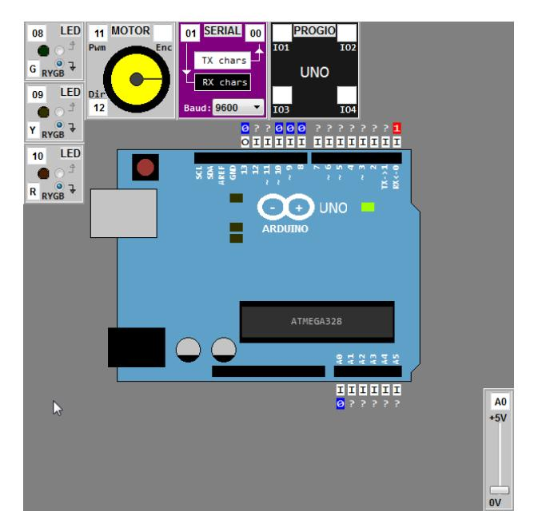

```
1. /* Réponse à la question Q28
2. * CAPET SII, option IE, session 2019
3. * utilisable dans le simulateur UnoArduSim en respectant le brochage en définition
4. */
5.
6. //brochage des diodes rajoutées au tableau de bord
7. #define pinDELrouge 10
8. #define pinDELorange 9
9. #define pinDELverte 8
10. // relais activant le Dessalator
11. #define pinRelais 11
12. // capteur capacitif
13. #define pinCapacitif A0
14.
15. // définition des variables utilisées pour le chronométrage, le typage est important pour ne pas 
    dépasser la pile
16. unsigned long varHorlogeOld1 = 0;
17. unsigned long varHorlogeOld2 = 0;
18. unsigned long varHorloge1 = 0;
19. unsigned long varHorloge2 = 0;
20.
21. // variable stockant le % de liquide
22. int varLevel = 0;
23.
24. // fonction renvoyant la donnée mesurée par le capteur inductif
25. int volToPercent()
26. {
27. return (map(analogRead(pinCapacitif), 0, 1023, 0, 100));
28. }
29.
30. // procédure (bloquante) demandant 5 mesures en 2mn (120s -> 120 000 ms à diviser par 5 = 
    24 000)
31. void level_sens()
32. {
33. for (int i=0 ; i<5 ; i++) {
34. varHorlogeOld2 = millis();
35. varHorloge2 = millis();
```

```
36. while (varHorloge2 - varHorlogeOld2 < 24000)
37. varHorloge2 = millis();
38. varLevel += volToPercent();
39. }
40. // faire directement la moyenne sur la variable globale,
41. // typer la fonction pour renvoyer un résultat à affecter dans la variable serait possible
42. varLevel = varLevel/5;
43. }
44.
45. // initialisation des entrées/sorties du microcrontrôleur
46. void setup()
47. {
48. pinMode(pinRelais, OUTPUT);
49. pinMode(pinDELrouge, OUTPUT);
50. pinMode(pinDELorange, OUTPUT);
51. pinMode(pinDELverte, OUTPUT);
52. }
53.
54. // boucle infinie spécifique au microcontrôleur ATmel de l'Arduino
55. void loop()
56. {
57. varHorlogeOld1 = millis();
58. varHorloge1 = millis();
59. // compare s'il s'est bien écoulé une heure depuis les mesures précédentes
60. while (varHorloge1 - varHorlogeOld1 < 360000000) {
61. varHorloge1 = millis();
62. }
63. // lance la série de mesures
64. level_sens();
65. // 2mn plus tard le résultat est comparé
66. if (varLevel > 65) {
67. // choix d'agir sur toutes les diodes pour obtenir un effet 'vuemètre'
68. digitalWrite(pinDELverte, HIGH);
69. digitalWrite(pinDELorange, HIGH);
70. digitalWrite(pinDELrouge, HIGH);
71. } else {
72. if (varLevel > 35) {
73. digitalWrite(pinDELverte, LOW);
74. digitalWrite(pinDELorange, HIGH);
75. digitalWrite(pinDELrouge, HIGH);
76. } else {
77. if (varLevel > 20) {
78. digitalWrite(pinDELverte, LOW);
79. digitalWrite(pinDELorange, LOW);
80. digitalWrite(pinDELrouge, HIGH);
81. } else {
82. // dernier 'alors' qui déclenche la mise en route du 
  Dessalator
83. digitalWrite(pinDELrouge, LOW);
84. digitalWrite(pinDELorange, LOW);
85. digitalWrite(pinDELverte, LOW);
86. while (!(varLevel > 65)) {
87. // actionne le relais
88. digitalWrite(pinRelais, HIGH);
89. // vérification du niveau
90. // /!\ action bloquante, le timing serait à être vérifié 
  par l'utilisateur
91. level_sens();
92. }
```

```
93. // le niveau est au dessus de 65%, on coupe le relais et 
  active les diodes
94. digitalWrite(pinRelais, LOW);
95. digitalWrite(pinDELverte, HIGH);
96. digitalWrite(pinDELorange, HIGH);
97. digitalWrite(pinDELrouge, HIGH);
98. }
99. }
100. }
101. // Delay a little bit to improve simulation performance
102. //delay(10);
103. }
104.
```

# **Rapport du jury de l'épreuve « Étude d'un système, d'un procédé ou d'une organisation » – option ingénierie électrique**

# **1. Présentation du sujet**

Le sujet est introduit par une problématique liée à la mobilité des personnes et à l'optimisation de systèmes existants. Dans un contexte de développement durable, une approche de type DIY 'Do It Yourself' est de plus en plus répandue dans la société et, par l'appui des fablabs, permet de réaliser des améliorations ou (re)créations de systèmes par des particuliers à partir de systèmes grand public.

Le sujet se base sur l'étude d'un voilier, bateau de plaisance grand public peu équipé de base, utilisé par une famille de 3 personnes. Leur objectif est de préparer leur première navigation en autonomie, sur un simple trajet de Marseille à Gibraltar fait en 13 jours pendant les vacances d'été.

Le sujet propose de suivre la démarche de modification du système existant par les propriétaires afin d'améliorer celui-ci dans le but d'utiliser ce bateau de plaisance pour des traversées en autonomie, et tenter des voyages de plus en plus long. Le candidat se retrouve dans la position d'expert face aux solutions possibles afin de les critiquer d'un point de vue scientifique, qualitatif et quantitatif. Le sujet permet ainsi d'évaluer les compétences d'analyse, de modélisation et de résolution des candidats.

Le support du sujet est un dessalinisateur d'eau de mer commercialisé par la société Dessalator. Le sujet se compose de quatre parties indépendantes abordant les problématiques suivantes :

- Comment dessaliniser l'eau de mer afin d'obtenir de l'eau douce ?
- Comment vérifier que l'installation d'un dessalinisateur est compatible avec l'énergie embarquée existante ?
- Comment installer le dessalinisateur dans les conditions de sécurité électrique conformes à la réglementation maritime ?
- Comment vérifier la quantité d'eau douce disponible ?

# **2. Analyse globale des résultats**

Le sujet propose un questionnement sur les différents champs des sciences industrielles de l'ingénieur. Les quatre parties indépendantes sont abordées de manière linéaire par une majorité des candidats. Comme dans les sessions précédentes, les dernières parties sont moins bien traitées, voire pas du tout, par beaucoup de candidats. Le jury invite donc les futurs candidats à gérer efficacement le temps de l'épreuve, afin d'avoir une couverture optimale du sujet. Le jury insiste sur la présence du numérique dans l'épreuve qui doit engager les futurs candidats à acquérir des connaissances dans la maîtrise de l'algorithmie et de la programmation.

## **3. Commentaires sur les réponses apportées et conseils aux futurs candidats**

# **3.1. Première partie – Processus de dessalinisation**

Cette partie consiste à analyser le processus de dessalinisation et valider la mesure de salinité vis-àvis des réglementations en vigueur.

La plupart des candidats a bien répondu à ces premières questions mais il est à souligner que la conclusion finale est parfois trop succincte. Les éléments traités lors des premières questions ne sont pas repris par les candidats pour élaborer une synthèse. Trop peu de candidats s'appuient sur les ressources fournies.

Le jury rappelle que tout résultat doit être chiffré en lien avec une grandeur physique et le choix de l'unité doit être réfléchi. Plus généralement, la conclusion doit amener à une analyse sur le respect d'une exigence.

# **3.2. Deuxième partie – Consommation énergétique**

Cette partie consiste à analyser la consommation énergétique du dessalinisateur nouvellement intégré aux équipements et valider la chaîne de puissance.

L'analyse de la documentation du panneau solaire et le calcul de l'énergie stockée dans la batterie ont été bien traité par l'ensemble des candidats. Par contre les calculs de rendement ont été posés très souvent de manière erronée.

Une critique à la fois qualitative et quantitative était attendue afin de vérifier que l'installation permette de ne pas excéder 70 % de décharge de la batterie. Le jury déplore des réponses trop évasives sans aucun lien avec les documents techniques et/ou un manque de valeurs numériques pour assoir les justifications. Les termes n'étaient pas maîtrisés par l'ensemble des candidats.

Le jury conseille de prendre le temps d'analyser les documents techniques mis à disposition afin de poser des raisonnements cohérents et des interprétations physiques en lien avec le respect des exigences.

#### **3.3. Troisième partie – Installation électrique**

Cette partie consiste à étudier la réalisation du circuit électrique respectant la réglementation maritime. Les premières questions portant sur le dimensionnement d'éléments de protection à installer ont été bien appréhendées. Cependant le jury regrette qu'un certain nombre de candidats de l'option ingénierie électrique confonde les notions de puissance en régime continu et alternatif. Une fois de plus, le jury constate des conclusions sans arguments scientifiques et techniques.

Les dernières questions portaient sur le calcul des chutes de tension dans les câbles afin de valider les sections de câbles à mettre en œuvre dans le but de répondre aux exigences de la réglementation maritime.

Le jury note ici essentiellement des erreurs dans les conversions d'unités et déplore la non maîtrise des calculs de pourcentage.

# **3.4. Quatrième partie – Gestion de l'autonomie énergétique**

Cette partie consiste à générer une alerte lorsque le niveau minimum d'eau douce est atteint, nécessitant une analyse de capteurs et la programmation de microcontrôleur.

Le jury déplore que les questions en lien avec les notions d'algorithme soient trop peu traitées malgré deux documents ressources fournis. Les bonnes pratiques de programmation, communes à la plupart des langages (utilisation de variables, fonction et structures itératives), de manière générale ne sont pas maîtrisées.

# **4. Conclusions**

Le questionnement proposé aborde différents champs de la spécialité du génie électrique, hors nombre de candidats ne maîtrisent pas les connaissances de base dans ces différents champs (notions d'énergie, de rendement, de perte, etc.). La même remarque peut être faite quant aux outils mathématiques de base, la rigueur mathématique fait partie des attendus des candidats aux concours de recrutement de professeurs de sciences industrielles de l'ingénieur.

Le jury insiste sur l'attente d'un raisonnement étayé amenant à une critique approfondie du système, notamment par la comparaison avec diverses solutions existantes. Les réponses qui se limitent à l'écriture du résultat sans explication ne sont pas admises. Il est nécessaire de pouvoir conduire et expliciter un raisonnement scientifique rigoureux, compréhensible par un lecteur, compétence indispensable à la pratique de leur futur métier. Le jury a apprécié que certaines conclusions aient été étayées par des schémas explicatifs.

Il est important de connaître les unités des différentes grandeurs physiques pour avoir un regard critique sur l'homogénéité des relations et des résultats proposés. Le jury invite donc les candidats à traiter ces aspects avec plus de rigueur. Les résultats doivent être présentés sous forme littérale, et les applications numériques doivent aussi être réalisées avec rigueur avec un nombre significatif de chiffres après la virgule cohérent.

Le jury recommande aux candidats d'apporter un soin particulier aux questions de conclusion de chacune des parties. La validation des résultats obtenus se fait de façon justifiée vis-à-vis des ressources fournies et du raisonnement conduit pendant la partie traitée.

Par ailleurs, une lecture attentive et complète du sujet est nécessaire pour éviter de mauvaises interprétations de certaines questions et pour permettre d'exploiter au mieux les documents ressources mis à disposition.

Le jury rappelle aux candidats l'importance de soigner la présentation de la copie, la qualité de la rédaction et la précision du vocabulaire. Le jury demande aux candidats de faire particulièrement attention aux fautes d'orthographe et de grammaire. Les candidats doivent correctement repérer les questions et en cas d'absence de réponse, l'indiquer clairement sur la copie. Le jury conseille également de mettre les résultats en évidence, en les encadrant par exemple.

# **5. Résultats**

106 copies ont été évaluées pour cette épreuve, la moyenne des notes obtenues est de 8,5 et l'écarttype de 3,5 avec :

- 15,6 comme meilleure note ;
- 2,3 comme note la plus basse.

# **Éléments de correction de l'épreuve d'admissibilité « Étude d'un système, d'un procédé ou d'une organisation » – option ingénierie informatique**

# **Partie 1**

Un bâtiment peut être qualifié de « smart building » s'il est communicant, confortable, convivial et respectueux de l'environnement.

Oui, cela implique l'installation d'une centrale de gestion technique.

# **Q2 :**

Trois services principaux : surveillance, supervision, suivi énergétique.

**«** pour piloter les installations techniques et optimiser la consommation énergétique, le système doit fournir des outils pour suivre, commander, réguler et optimiser en temps réel le comportement de l'installation »

#### **Q3 :**

Le contrôle d'accès,

La gestion d'énergie Eclairage, force

Les automatismes des volets roulants

Le système anti intrusion

La gestion du chauffage

La gestion de la ventilation naturelle

# **Q4 :**

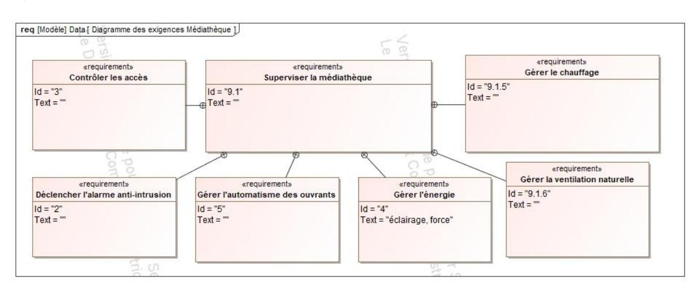

# **Q5 :**

Surveillance vol & contrôle d'accès

Gestion d'énergie

Multimédia

Communication et stockage

Automatismes

Surveillance technique et médicale

# **Q6 :**

Entrées TOR : 13

Entrées analogiques/TOR : 11

# **Q7 :**

Bus : KNX, Wiegand, RS485, B4R/B8R,

20 lecteurs de badges Wiegand.

# **Q8 :**

Reprendre les éléments + vérifier la possibilité de faire de la VOIP dans le futur comme demandé dans le CCTP.

## **Partie 2**

# **Q9 :**

La centrale Varuna permet de disposer de 15 claviers et 20 lecteurs de badges.

Cela est largement suffisant pour la médiathèque.

**Q10 :** La fonction anti-passback permet d'éviter l'entrée d'un porteur de badge copié.

# **Q11 :**

Algorithme de la fonction anti-passback lors d'une **demande d'entrée** dans la médiathèque pour un lecteur de badge identifié badge\_A :

Soit E\_A une variable de type flag permettant le suivi de l'activation ou non d'un accès en entrée pour un badge\_A donné.

E\_A=0

Lecture badge\_A en **entrée**

Si badge\_A == **valide** 

Si E\_A==0

Alors

**Autoriser** accès badge\_A en entrée

E\_A=1

Tant que délai passback != fin

**Interdire** entrée pour badge\_A

Sinon

Tant que délai passback != fin

**Interdire** entrée pour badge\_A

E\_A=0

# **Q12** :

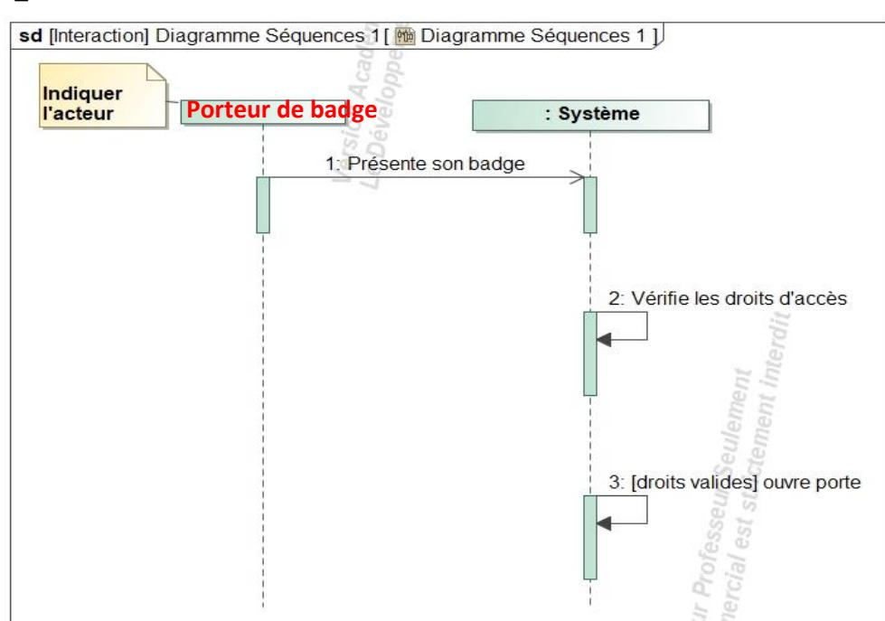

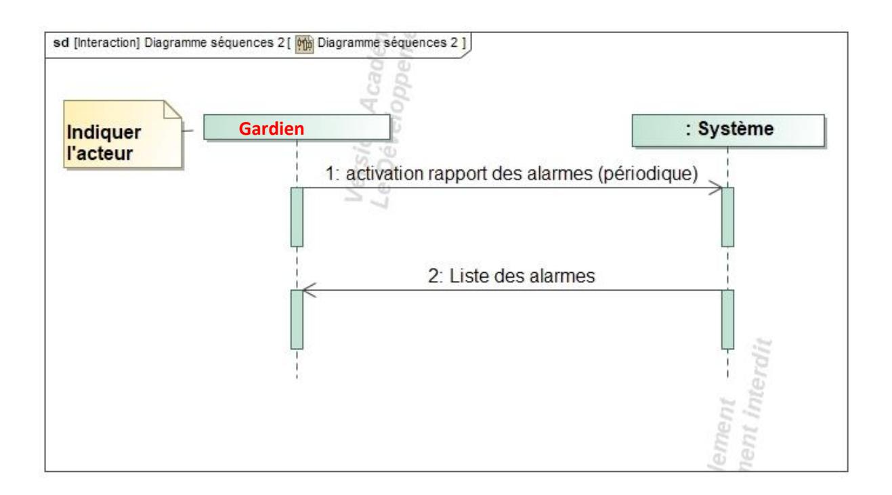

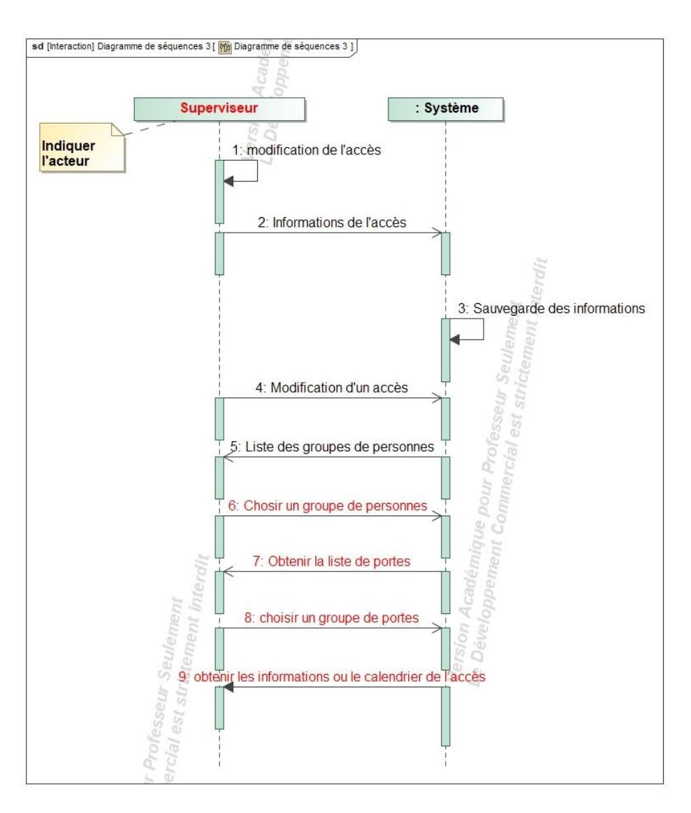

# **Q13** : Agrégation

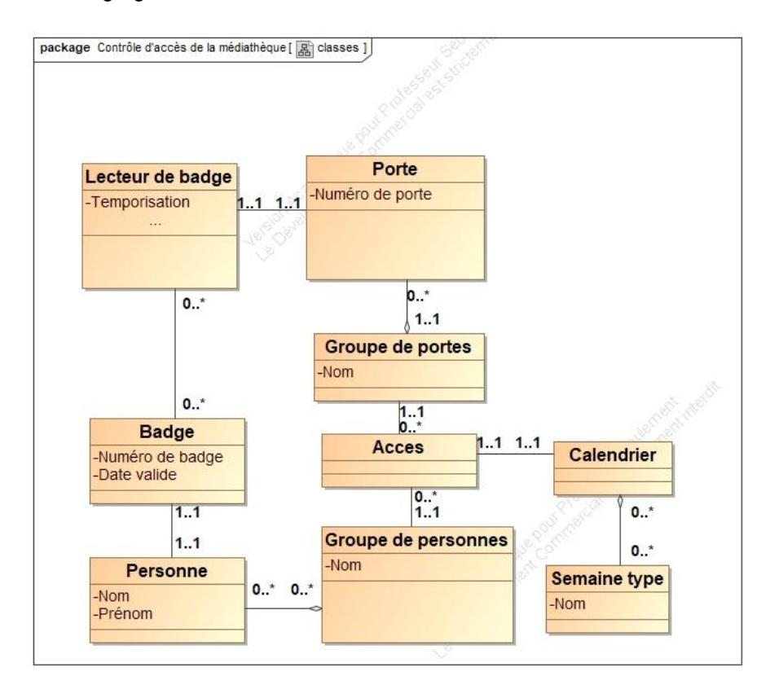

# **Q14** :

D'après l'annexe, le format utilisé, par défaut, est celui Wiegand 26 bits standard.

# **Q15** :

Tous les quatre interrupteurs des deux dipswitchs doivent être en position OFF.

# **Q16** :

Régler les deux dipswitch sur le code site 1 en binaire, soit SW1-1=ON, SW1-2=OFF, SW2-1=OFF, SW2-2=OFF.

# **Q17** :

La trame binaire reçue est composée de 26 bits : **10000000110101110 010011100**

# **Q18** :

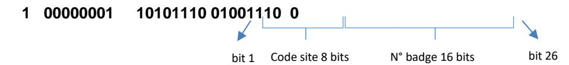

Le bit 1 est le bit de parité paire, s'applique aux 12 premiers bits (bits 2 à 13). Tandis que le bit 26 est le bit de parité impaire, s'applique aux 12 derniers bits (bits 14 à 25).

# **Q19** :

Les 8 bits du code site, repérés en noir, valent 1 en décimal. Tandis que les 16 bits du numéro de badge, repérés en vert, valent 44622 en décimal.

# **Q20** :

On peut conclure que l'envoi des trames par le lecteur de badge est conforme au protocole Wiegand 26 bits.

# **Partie 3**

# **Q21** :

|           | Alarme active | Alarme active | Alarme inactive | Alarme inactive |
|-----------|---------------|---------------|-----------------|-----------------|
|           | A-P active    | A-P inactive  | A-P active      | A-P inactive    |
| RAin1 (Ω) | infinie       | 3k            | infinie         | 1,5k            |

# Q22:

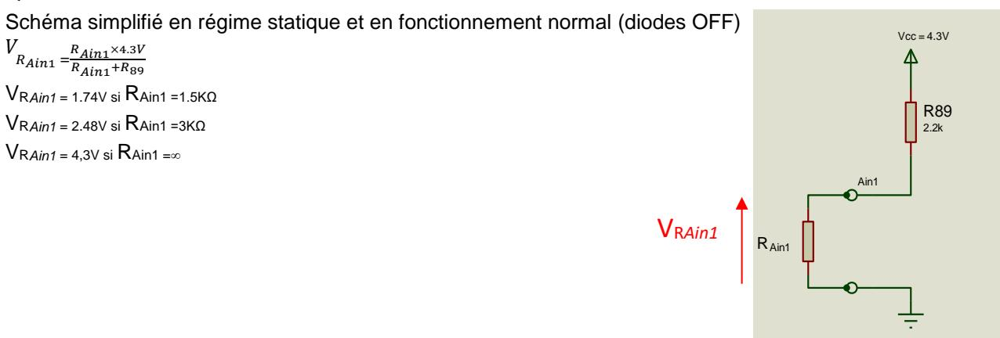

| Evénement             | Alarme active | Alarme active | Alarme inactive | Alarme inactive |
|-----------------------|---------------|---------------|-----------------|-----------------|
|                       | A-P active    | A-P inactive  | A-P active      | A-P inactive    |
| V <sub>Ain1</sub> (V) | 4,3V          | 2,48V         | 4,3V            | 1,74V           |

Q23 : Suivant la valeur de la ddp lue à l'entrée Ain1, elle peut en déduire le ou les évènements survenus.

# Partie 4

**Q24 :** En raison d'une grande souplesse de modification de fonction, par la programmation, au détriment d'un coût plus généreux.

Q25: 64 Sorties TOR donc 32 volets roulants.

Q26: Oui puisqu'elle peut en piloter 32.

Q27: Transmission longue distance et moins sensible aux perturbations

**Q28**: 9600bits/s

**Q29 :** (1 start + 8 donnée + 1 parité + 1 stop + 2 pause) x 104µs ≈ 1.35ms

Q30:

a)

| Lignes | En binaire             | Signification                                                                 |
|--------|------------------------|-------------------------------------------------------------------------------|
| 1      | 1011 1100              | octet de contrôle : émission normale avec une priorité basse                  |
| 2 et 3 | 0001 0001<br>1100 1001 | adresse source                                                                |
| 4 et 5 | 0110 1101<br>0110 1110 | adresse destinataire                                                          |
| 6      | 1110 0001              | adresse de groupe, compteur de routage = 6,<br>longueur de données = 2 octets |
| 7 et 8 | 0000 0000<br>1000 0000 | commande d'extinction de l'éclairage 1                                        |
| 9      | 1111 1001              | octet de sécurité                                                             |

b) Cet octet de sécurité est déterminé en parité impaire sur l'ensemble des différents champs du télégramme :

| Ligne | Hexadécimal | Binaire   |
|-------|-------------|-----------|
| 1     | BC          | 1011 1100 |
| 2     | 11          | 0001 0001 |
| 3     | C9          | 1100 1001 |
| 4     | 6D          | 0110 1101 |
| 5     | 6E          | 0110 1110 |
| 6     | E1          | 1110 0001 |
| 7     | 00          | 0000 0000 |
| 8     | 80          | 1000 0000 |
| 9     | F9          | 11111001  |

- c) Ces trois lignes correspondent à l'octet de contrôle (9C). Ce dernier annonce que le télégramme qui va s'en suivre, est un télégramme d'émission répétitive avec une priorité basse. On constate que le même télégramme est répété trois fois.
- **Q31** : On peut en déduire que le protocole de communication du contrôleur ZAS est conforme au protocole de communication KNX.

#### **Q32 :**

```
a) fichier d'en-tête (TrameKNX.h)
#pragma once
#include <iostream>
#include <string>
class CTrameKNX
{
public:
       CTrameKNX();
       CTrameKNX(char *trameBruteKNX);
       ~CTrameKNX();
       void getTrameEnTableau(unsigned char trameEnTableau[]); 
       unsigned char getOctetControle();
unsigned short int getAdresseSource();
       unsigned short int getAdresseDestinataire();
       unsigned char getOctet_SiAdresseGroupe_CompteurRoutage_LongueurData();
       void getData(unsigned char tableData[16]);
       unsigned char getOctetSecurite();
       unsigned char ckeckEmissionNormaleOuReception(); 
       unsigned char getPriorite();
       unsigned char getNombreOctetsData();
       unsigned char calculerChecksum();
private:
       unsigned char *m_TrameEnTableau;
       unsigned char m_nombreOctetsMax;
       unsigned char m_octetControle;
       unsigned short int m_adresseSource;
       unsigned short int m_adresseDestinataire;
       unsigned char m_octet_SiAdresseGroupe_CompteurRoutage_longueurData;
       unsigned char m_nombreOctetsData;
```

```
unsigned char m_octetSecurite;
       unsigned char m_emissionNormaleOuRepetition;
       unsigned char m_priorite;
};
b) En vertu du principe d'encapsulation
c) L'accesseur ou le sélecteur
d) Le mutateur ou le modificateur
e) Surcharge de constructeur 
Q33 :
CTrameKNX::CTrameKNX(char *trameBruteKNX) : m_nombreOctetsMax(23)
{ m_TrameEnTableau = new unsigned char[m_nombreOctetsMax];
       for (int i = 0; i < m_nombreOctetsMax; i++) m_TrameEnTableau[i] = trameBruteKNX[i];
       m_octetControle = m_TrameEnTableau[0];
       unsigned short int adresseSource;
       adresseSource = m_TrameEnTableau[1] << 8;
       adresseSource += m_TrameEnTableau[2];
       m_adresseSource = adresseSource;
       unsigned short int adresseDestinataire;
       adresseDestinataire = m_TrameEnTableau[3] << 8;
       adresseDestinataire += m_TrameEnTableau[4];
       m_adresseDestinataire = adresseDestinataire;
       m_octet_SiAdresseGroupe_CompteurRoutage_longueurData = m_TrameEnTableau[5];
       m_nombreOctetsData = (m_TrameEnTableau[5] & 0x0F) + 1;
       m_octetSecurite = m_TrameEnTableau[6 + m_nombreOctetsData];
       m_emissionNormaleOuRepetition = 0x20 & m_octetControle;
       m_priorite = 0x0C & m_octetControle; 
}
Q34 : Implémenter cette méthode "calculerChecksum"
unsigned char CTrameKNX::calculerChecksum() 
{
       unsigned short resulatXOR(0), resultatXNOR(0);
       for (int i = 0; i < 6 + m_nombreOctetsData; i++)
       {
              resulatXOR ^= m_TrameEnTableau[i]; 
       }
       resultatXNOR = ~resulatXOR; 
       resultatXNOR %= 256;
       return resultatXNOR;
 }
```

# **Partie 5**

# **Q35 :**

Si mi-saison chaude

Si TempInt Zone >25°C ET TempInt Zone > TempExt

Ouverture 100% ouvrants façade zone considérée

Fermeture ouvrants des fenêtres de préchauffage

Ouverture 100% ouvrants toiture

Sinon

Si Hiver OU mi-saison froide

Si TempExt <10°C ET TempInt Zone < 20°C

Ouverture 100% ouvrants des fenêtres de préchauffage

de la façade de la zone considérée

Ouverture 50% ouvrants toiture

**Q36 :** Technologie Enocean

**Q37 :** 

STPH-2-1-0x est un capteur de température et d'humidité, de technologie EnOcean.

Son profil EEP : A5-04-01, son ID : 050C5113 Plage de température : 0°C à +40°C (± 0,2°C)

Plage d'humidité : 0 à 100 %

# **Q38 :**

Caractéristiques du profil EEP A5-04-01 :

Ce profil EEP A5-04-01 contient 4 octets (DB3 à DB0) correspondants à 32 bits (de DB3.7 à DB3.0, de DB2.7 à DB2.0, de DB1.7 à DB1.0, de DB0.7 à DB0.0). L'octet 3 est inutilisé. L'octet 2 (DB2) correspond à l'humidité. L'octet 1 (DB1) correspond à la température.

L'octet DB0 représente le type de donnée (DB0.3 : apprentissage ou donnée) et sa disponibilité (DB0.1) :

DB0.3 (0 Teach in, 1 Data)

DB0.1 (0 not available, 1 available)

# **Q39 :**

Les 4 octets de donnée de la trame 20 sont 00 6F 3B 0A. L'octet 00 n'a pas de signification. L'octet 6F représente l'humidité. L'octet 3B représente la température. L'octet 0A indique qu'il s'agit d'une donnée et qu'elle est disponible.

# **Q40 :**

D'après la documentation, l'humidité de 0 à 100% correspond à la plage de valeurs de 0 à 250, ce qui correspond à une résolution de 100/250=0,4. L'octet 6F vaut 111 en décimal, ce qui équivaut à taux d'humidité de 111 x 0.4 = 44,4%. De même, pour la température, la résolution vaut 40/250=0,16. L'octet 3B vaut 59 en décimal, ce qui équivaut à une température de 59 x 0,16= 9,44°.

# **Q41 :**

La notice du constructeur NODON indique une résolution de ±0,2°C. Le calcul théorique donne une résolution de ± 0,16°C, conforme donc au cahier des charges indiqué par le constructeur.

#### **Partie 6**

## **Q42 :**

En technologie IP, Varuna gère un maximum de : 16 caméras

16 Haut-Parleurs

16 microphones

16 équipements IP universels

# **Q43 :**

Adresse logique du PC : 169.254.167.144 Adresse logique de la centrale : 169.254.6.115

Elles appartiennent à la couche 3 (Réseau) du modèle OSI.

**Q44 :** 

Port utilisé par le PC : 1665 Port utilisé par la centrale : 443

Ils appartiennent à la couche 4 (Transport) du modèle OSI.

# **Q45 :**

Protocole ARP (Processus de Résolution d'Adresse). Le PC met en œuvre ce processus afin de déterminer l'adresse physique de la centrale à partir de son adresse logique. L'adresse physique est nécessaire pour former la trame de la couche 2.

# **Q46 :**

|                                                  | Valeur                                            |
|--------------------------------------------------|---------------------------------------------------|
| Adresse physique source :                        | 68 F7 28 10 65 D7                                 |
| Adresse physique destination :                   | 00 1E AC 00 D7 20                                 |
| Type de protocole réseau et signification        | 08 00 (TCP/IP)                                    |
| Identification de la version                     | 4                                                 |
| Longueur de l'en-tête et signification           | 5 soit 5x4=20 octets, l'en-tête<br>IP sans option |
| Adresse logique source en hexadécimal<br>et en   | A9 FE A7 90                                       |
| décimal pointé                                   | 169.254.167.144                                   |
| Adresse logique destination en hexadécimal et en | A9 FE 06 73                                       |
| décimal pointé                                   | 169.254.6.115                                     |
| Protocole de transport et signification          | 06 (TCP)                                          |

**Q47 :** 9

**Q48 :** 40x2 + 20x2 + 10x2 + 2x3 = 146

**Q49 :** 2^8-2 = 254

**Q50 :** Oui car > 164 (= 146 + 9x2). Pour chaque sous réseau créé, on perd 2 adresses.

**Q51 :** 6 bits d'hôtes, 2^6 – 2 = 62 adresses IP disponibles. Donc le masque à utiliser est /26*.*

**Q52 :**

| Adresse réseau                          | 192.168.10.0    |
|-----------------------------------------|-----------------|
| Masque de sous-réseau en décimal pointé | 255.255.255.192 |
| Masque de sous-réseau en préfixe        | /26             |
| Première adresse IP utilisable          | 192.168.10.1    |
| Dernière adresse IP utilisable          | 192.168.10.62   |
| Adresse de diffusion                    | 192.168.10.63   |

#### **Q53 :**

| Adresse réseau                          | 192.168.10.64   |
|-----------------------------------------|-----------------|
| Masque de sous-réseau en décimal pointé | 255.255.255.192 |
| Masque de sous-réseau en préfixe        | /26             |
| Première adresse IP utilisable          | 192.168.10.65   |
| Dernière adresse IP utilisable          | 192.168.10.126  |
| Adresse de diffusion                    | 192.168.10.127  |

**Q54 :** 2 bits d'hôtes, 2^2 – 2 = 2 adresses IP disponibles. Donc le masque à utiliser est /30.

**Q55 :** 

| Adresse réseau                          | 192.168.10.224  |
|-----------------------------------------|-----------------|
| Masque de sous-réseau en décimal pointé | 255.255.255.252 |
| Masque de sous-réseau en préfixe        | /30             |
| Première adresse IP utilisable          | 192.168.10.225  |
| Dernière adresse IP utilisable          | 192.168.10.226  |
| Adresse de diffusion                    | 192.168.10.227  |

**Q56 :** 

| Adresse réseau                          | 192.168.10.228  |
|-----------------------------------------|-----------------|
| Masque de sous-réseau en décimal pointé | 255.255.255.252 |
| Masque de sous-réseau en préfixe        | /30             |
| Première adresse IP utilisable          | 192.168.10.229  |
| Dernière adresse IP utilisable          | 192.168.10.230  |
| Adresse de diffusion                    | 192.168.10.231  |

## **Partie 7**

# **Q57 :**

# Requêtes SQL :

Quel est le contenu de la relation Livre ?

**SELECT** \* **FROM** Livre

Quels sont les titres des romans édités par Dunod ?

**SELECT** Titre **FROM** Livre **WHERE** Editeur="Dunod"

Quelle est l'identité des auteurs qui ont fait des disques et écrit des livres ?

**SELECT** A1.Identité **FROM** Disque D, Livre L, Auteur A1,Auteur A2

**WHERE** D.Code = A1.Code **AND** L.Code=A2.Code **AND** A1.Identité=A2.Identité

Quels sont les différents genres de disques proposés ?

**SELECT DISTINCT** Style **FROM** Disque

Donnez le nombre de prêts en cours pour chaque famille en considérant qu'une famille regroupe des personnes de même nom et possédant le même numéro de téléphone ?

**SELECT** Nom, Téléphone, COUNT(\*)

**FROM** Abonne A, Prêt P

**WHERE** A.NumAbo=P.NumAbo

**GROUP BY** Nom, Téléphone

Quel est le code du disque dont la médiathèque possède le plus grand nombre d'exemplaire ?

**SELECT** Code **FROM** E\_Disque **GROUP BY** Code

**HAVING** COUNT(\*)=(**SELECT** MAX(COUNT(\*)) **FROM** E\_Disque **GROUP BY** Code

Quels sont les éditeurs pour lesquels l'attribut Collection n'a pas été renseigné ?

**SELECT** Editeur **FROM** Livre **WHERE** Collection **IS NULL**

Quel est le nombre de prêts en cours ?

## **SELECT** COUNT(\*) **FROM** Prêt

Quel est le nombre de genres de disques différents ?

**SELECT** COUNT(**DISTINCT** Genre) **FROM** Disque

Quel est le nombre de disques achetés en 2018 ?

**SELECT** COUNT(\*) **FROM** E\_Disque **WHERE** DateAchat

**BETWEEN** '01-Jan-2018' **AND** '31-Dec-2018'

# **Partie 8**

#### **Q58 :**

La première partie de l'étude a permis de valider le choix de mettre en place une Gestion Technique Centralisée de type Varuna.

En effet, les différentes technologies pouvant être mises en œuvre par cette centrale ainsi que le nombre d'entrées/sorties permettent bien de répondre aux besoins énoncés dans le CCTP :

- le contrôle d'accès,
- la gestion d'énergie Eclairage, force
- les automatismes des volets roulants
- le système anti intrusion
- la gestion du chauffage (celle-ci n'a pas été étudiée dans le sujet)
- la gestion de la ventilation naturelle

Dans la seconde partie de l'étude, il a pu être mis en évidence que les accès de la médiathèque pouvaient être gérés correctement grâce aux lecteurs de badges utilisant le protocole Wiegand compatible avec la centrale.

La troisième partie, qui concerne l'alarme intrusion, démontre qu'il est possible non seulement de déclencher l'alarme en cas d'intrusion mais aussi de déterminer le type d'évènement déclencheur.

La quatrième partie montre la gestion des volets roulants et des éclairages et la cinquième partie la gestion de la ventilation naturelle.

La partie 6 montre qu'il est possible de réaliser la vidéo surveillance des plateaux via le réseau IP. Enfin les services de gestions des livres et des disques de la médiathèque sont possibles grâce à une base de données.

**Pour conclure, ce bâtiment peut être qualifié de « smart building » puisqu'il est communicant, confortable, convivial et respectueux de l'environnement.**

# **Rapport du jury de l'épreuve « Étude d'un système, d'un procédé ou d'une organisation » – option ingénierie informatique**

#### **1. Présentation du sujet**

Le support d'étude est une médiathèque de type « Smart building » qui prévoit un espace culturel de 130 places, un accueil ados-jeunes et des salles d'atelier.

La problématique retenue porte sur la validation du choix technique d'un système domotique professionnel afin de rendre ce bâtiment intelligent et répondre au cahier des charges.

Afin de valider ce choix, le sujet propose d'étudier les points suivants :

- analyse du besoin et choix de la centrale de Gestion Technique Centralisée (G.T.C.) ;
- contrôle d'accès ;
- alarme intrusion ;
- gestion des commandes des volets roulants et des éclairages ;
- gestion de la ventilation naturelle Hybride ;
- réseau Ethernet et vidéo surveillance ;
- services pour les usagers.

Le candidat se retrouve dans la position d'expert face aux solutions logicielles et constructives proposées afin de les valider d'un point de vue scientifique et technologique. Le sujet permet ainsi d'évaluer les compétences d'analyse, de modélisation et de résolution de problème technique des candidats.

#### **2. Analyse globale des résultats**

Le sujet propose un questionnement sur les différents champs de compétence de la spécialité ingénierie informatique. Les sept parties indépendantes sont abordées de manière linéaire par une majorité des candidats. Comme dans les sessions précédentes, les dernières parties sont moins bien traitées, voire pas du tout, par beaucoup de candidats. Le jury invite donc les futurs candidats à gérer efficacement le temps de l'épreuve, afin d'avoir une couverture optimale du sujet.

Un grand nombre de candidats ne maîtrisent pas les connaissances de base dans les différents champs (bases de données, réseaux, programmation orientée objet). La même remarque peut être faite quant à la maîtrise des lois de l'électricité, des unités et des outils mathématiques de base. La rigueur scientifique fait partie des attendus des candidats aux concours de recrutement de professeurs de sciences industrielles de l'ingénieur.

## **3. Commentaires sur les réponses apportées et conseils aux futurs candidats**

# **3.1. Première partie – Analyse du besoin et choix de la centrale de Gestion Technique Centralisée (G.T.C.)**

L'objectif de cette première partie est de valider le choix de mettre en place une GTC et en particulier une centrale de type Varuna afin de qualifier la médiathèque de "smart building".

Le sujet propose d'analyser puis de valider les différents critères, auxquels doit répondre le système domotique professionnel Varuna, retenu pour la médiathèque.

La plupart des candidats a bien répondu à ces premières questions cependant la conclusion finale est parfois superficielle. Les éléments abordés lors des premières questions ne sont pas toujours repris par les candidats pour élaborer une synthèse.

## **3.2. Deuxième partie – Contrôle d'accès**

L'objectif de cette deuxième partie est de vérifier que la centrale de gestion choisie permet de gérer les accès de la médiathèque.

L'étude porte sur quelques points de contrôle d'accès, le système « anti-passback » et la conformité du protocole de communication (protocole Wiegand) du lecteur de badge.

Cette partie a été relativement bien traitée pour son aspect d'analyse fonctionnelle. Le jury regrette cependant que les notions de conversion du binaire vers le décimal et que l'analyse d'une trame simple ne soient pas traitées par l'ensemble des candidats.

# **3.3. Troisième partie – Alarme intrusion**

L'objectif de cette troisième partie est de valider la possibilité de différencier le type d'évènement déclencheur de l'alarme intrusion : intrusion, vol, arrachage du système domotique, …

Le sujet porte sur l'étude d'une boucle à double équilibrage et amène les candidats à mettre en œuvre les lois de l'électricité afin de modéliser le système étudié. Les candidats doivent connaître les unités des grandeurs électriques mises en œuvre.

Le jury déplore que cette partie n'ait été abordée que par la moitié des candidats et que les lois de l'électricité ne soient pas maîtrisées.

#### **3.4. Quatrième partie - Gestion des commandes des volets roulants et des éclairages**

Cette partie a pour objectif de déterminer la meilleure solution technologique à mettre en place pour permettre la gestion des commandes des volets roulants et des éclairages.

Le sujet amène le candidat à valider le protocole de communication (protocole KNX) entre le contrôleur d'ambiance et le système domotique pour la gestion des éclairages. Une étude partielle de la couche logicielle en C++ d'un sniffer de télégrammes KNX est demandée.

Le jury constate que les calculs de débit et de durée de transmission sont mal traités par plus de la moitié des candidats qui ne maîtrisent pas suffisamment les conversions d'unités et manquent souvent de rigueur scientifique.

L'étude partielle de la classe CTrameKNX en C++ est abordée par seulement 20% des candidats. Le jury rappelle l'importance de la maîtrise de la programmation objet.

#### **3.5. Cinquième partie - Gestion de la ventilation naturelle Hybride**

Cette partie concerne la validation du protocole de communication radio (protocole EnOcean) entre un "bi-capteur" de température-humidité et le système domotique, pour la gestion de fonctionnement des ouvrants.

Le jury déplore que la majeure partie des candidats ne sache pas déterminer la résolution d'un capteur.

#### **3.6. Sixième partie – Réseau Ethernet et vidéo surveillance**

Dans cette partie, le sujet amène le candidat à mener une étude succincte des différentes couches de communication du modèle OSI, des adresses physiques et logiques, du protocole ARP. L'étude se poursuit par l'exploitation des différents champs d'une trame Ethernet, capturée par un analyseur de trame et l'étude d'un réseau Ethernet avec la technique d'adressage VLSM (Variable Length Subnet Masks).

Le jury constate que la majeure partie des candidats n'abordent pas les questions de réseau.

## **3.7. Septième partie - Services aux usagers**

Cette partie propose d'étudier les différentes requêtes SQL vers le système SGBD de la médiathèque. Le jury regrette que très peu de candidats abordent cette partie sur les bases de données.

Validation des différents critères auxquels doit répondre la médiathèque pour être qualifiée de smart building.

# **3.8. Synthèse**

La synthèse de l'étude doit permettre de valider les choix de solutions logicielles et constructives permettant de qualifier la médiathèque de « Smart building ».

Le jury regrette que peu de candidats rédigent une synthèse. Par ailleurs, lorsque celle-ci est proposée, il est indispensable de s'appuyer sur l'ensemble de l'étude et de développer les arguments en s'appuyant sur les résultats obtenus.

# **4. Conclusions**

Le jury insiste sur l'attente d'un raisonnement étayé amenant à une critique approfondie des solutions logicielles et constructives choisies. Les réponses qui se limitent à l'écriture du résultat sans explication ne sont pas admises. Il est nécessaire de pouvoir conduire et expliciter un raisonnement scientifique rigoureux, compréhensible par un lecteur, compétence indispensable à la pratique de leur futur métier. Le jury a apprécié que certaines conclusions aient été étayées par des schémas explicatifs.

Il est important de connaître les unités des différentes grandeurs physiques pour avoir un regard critique sur l'homogénéité des relations et des résultats proposés. Le jury invite donc les candidats à traiter ces aspects avec plus de rigueur. Les résultats doivent être présentés sous forme littérale, et les applications numériques doivent aussi être réalisées avec rigueur avec un nombre significatif de chiffres après la virgule cohérent.

Le jury recommande aux candidats d'apporter un soin particulier aux questions de conclusion de chacune des parties. La validation des résultats obtenus se fait de façon justifiée vis-à-vis des ressources fournies et du raisonnement conduit pendant la partie traitée.

Par ailleurs, une lecture attentive et complète du sujet est nécessaire pour éviter de mauvaises interprétations de certaines questions et pour permettre d'exploiter au mieux les documents ressources mis à disposition.

Le jury rappelle aux candidats l'importance de soigner la présentation de la copie, la qualité de la rédaction et la précision du vocabulaire. Le jury demande aux candidats de faire particulièrement attention aux fautes d'orthographe et de grammaire. Les candidats doivent correctement repérer les questions et en cas d'absence de réponse, l'indiquer clairement sur la copie. Le jury conseille également de mettre les résultats en évidence, en les encadrant par exemple.

# **5. Résultats**

106 copies ont été évaluées pour cette épreuve, la moyenne des notes obtenues est de 8,5 et l'écarttype de 3,5 avec :

- 16,1 comme meilleure note ;
- 1,6 comme note la plus basse.

# Éléments de correction de l'épreuve « Étude d'un système, d'un procédé ou d'une organisation » – option ingénierie mécanique

**Question 1.** La hauteur d'eau totale correspond à l'aire sous la courbe d'intensité de pluie en fonction du temps, soit :

$$H = \frac{1,7\cdot20}{2} + \frac{(3,9-2,25)\cdot20}{2} + (2,25-1,7)\cdot20 + \frac{(2,25-1,7)\cdot(128-20)}{2} = 74,2 \text{ mm}$$

Le volume total d'eau correspond au produit de la hauteur d'eau totale et de la surface active, soit

$$V_{\text{pluie}} = 74,2 \cdot 10^{-3} \cdot 21\ 600 = 1\ 603\ \text{m}^3$$

Question 2. Le volume des collecteurs peut être calculé grâce à l'expression :

$$V_{\text{collecteurs}} = \sum_{i=1}^{8} \pi \cdot L_i \cdot \frac{D_i^2}{4} = 1 \ 171 \ \text{m}^3$$

**Question 3.** On constate que  $V_{collecteurs} < V_{pluie}$ , on peut donc en déduire que le volume des collecteurs n'est pas suffisant pour stocker toute l'eau de pluie. Cependant, pendant la pluie une certaine quantité d'eau continue de s'écouler en aval des canalisations (l'intégralité de l'eau de pluie n'est pas stockée), avec un débit de 54 L·s<sup>-1</sup>, ce qui représente une quantité d'eau de

$$V_{\text{ecoulement}} = 3.9.3 600.54 \cdot 10^{-3} = 758 \text{ m}^3$$

Ajoutés aux 1171 m³ stockés par les collecteurs, la pluie décennale peut donc être endiguée. Le système est pertinent.

2.2 Choix des seuils et débits des VHA

**Question 4.** Cette situation est la plus favorable car tous les volumes de stockage seront mis à contribution, ce qui ne serait pas le cas si l'apport d'eau était situé plus en aval. Le constructeur a peutêtre fait ce choix par rapport à la complexité de la détermination des bassins versants (quantité d'eau recueillie par chaque collecteur), alors même que le projet immobilier n'était pas terminé.

**Question 5.** Dans le scénario 1, le volume d'eau atteint dans le collecteur 1 dépasse le volume maximal autorisé  $(V_1>V_{1max})$ , il y a donc débordement et l'exigence 1.1.2 n'est pas satisfaite.

Dans le scénario 2, le débit aval dépasse 54 L·s<sup>-1</sup>, l'exigence 1.1.1 n'est pas satisfaite. Seul le scénario 3 permet de satisfaire toutes les exigences.

**Question 6.** 
$$L_{maxi} = 755 \text{ mm}$$
;  $L_{mini} = L_{maxi}$  - Course = 755 - 350 = 405 mm

Question 7. La fermeture géométrique s'écrit :

$$\overrightarrow{AB} + \overrightarrow{BC} = \overrightarrow{AC}, \ soit \ c \cdot \overrightarrow{x_1} + \lambda \cdot \overrightarrow{y_1} = -a \cdot \overrightarrow{x_0} + b \cdot \overrightarrow{y_0}$$
 En projetant sur  $\overrightarrow{x_0}$  et  $\overrightarrow{y_0}$  
$$\begin{cases} c \cdot cos\theta - \lambda \cdot sin\alpha = -a \\ c \cdot sin\theta + \lambda \cdot cos\alpha = b \\ \lambda \cdot sin\alpha = c \cdot cos\theta + a \\ \lambda \cdot cos\alpha = -c \cdot sin\theta + b \end{cases}$$

$$\lambda = \sqrt{(a+c\cdot\cos\theta)^2 + (b-c\cdot\sin\theta)^2}$$

**Question 8.** Pour  $\theta_{max} = 25$ °,  $\lambda = 492$  mm >  $L_{mini}$ 

La valeur peut être atteinte avec le vérin choisi.

**Question 9.** On isole l'ensemble vérin 2 et 3, soumis à l'action du bâti 0 en C (liaison pivot) et à l'action du battant mobile 1 en B (liaison pivot). En modèle plan, ces deux actions peuvent être modélisées par des glisseurs. Les deux forces sont donc colinéaires à la droite formée par les deux points d'application, soit (CB), elles sont donc portées par  $\overrightarrow{y_2}$ .

**Question 10.** On isole le battant mobile, soumis à l'action de l'eau  $\overrightarrow{F_e}$ , l'action des vérins  $\overrightarrow{F_V}$  et l'action du bâti en A (liaison pivot). Le principe fondamental de la statique, en moment en A, en projection sur  $\overrightarrow{z_0}$  s'écrit :

$$d \cdot F_e - c \cdot F_v \cdot \cos \alpha = 0$$

On en déduit 
$$F_v = \frac{d \cdot F_e}{c \cdot \cos \alpha} = 3 930 \text{ N}$$

Question 11.  $F_{V1} = F_1 + k \cdot (\lambda_1 - \lambda)$  et d'autre part  $F_{V1} = \frac{\|F_V\|}{2}$ 

Question 12. On remplace  $F_{V1} = F_1 + k \cdot (\lambda_1 - \lambda) = F_1 + \frac{0.5 \cdot F_1}{\Delta \lambda} \cdot (\lambda_1 - \lambda) = \frac{\|\vec{F_v}\|}{2}$ 

Ainsi 
$$F_1 = F_1 + \frac{0.5 \; F_1}{\Delta \lambda} \cdot (\lambda_1 - \lambda) = \frac{\left\| \overrightarrow{F_V} \right\|}{2 \left( 1 + \frac{0.5}{\Delta \lambda} \cdot (\lambda_1 - \lambda) \right)} = \frac{3 \; 930}{2 \left( 1 + \frac{0.5}{0.35} \cdot (0.755 - 0.588) \right)} = 1 \; 587 \; N$$

On constate que  $F_1 = 1587 \text{ N} < 2100 \text{ N}$ 

Cette précharge est bien compatible avec le vérin choisi.

**Question 13.** L'effort fourni par le ST350 est inférieur à l'effort idéal, ce qui veut dire que la VHA s'ouvrira plus facilement. Elle sera déjà ouverte lorsque la hauteur d'eau atteindra sa valeur maximale  $H_{max}$ , ce qui est compatible avec l'exigence 2.1.3.

Question 14. On peut observer 3 phases sur la courbe de tarage.

Pour une hauteur d'eau comprise entre 0 et 1,8 m : le débit augmente proportionnellement avec la hauteur d'eau, ce qui correspond également à une augmentation de la pression : la vanne étant fermée, seul l'ajutage permet le passage de l'eau. Pour une section de veine de fluide constante, l'augmentation de la pression se traduit bien par une augmentation de débit.

Pour H=1,8 m, il y a rupture de pente : la VHA commence à s'ouvrir, et son ouverture dépend de la hauteur d'eau. La pente est alors plus importante, car non seulement la pression augmente, mais aussi la section de la veine de fluide.

Pour H=2,5 m, il y a à nouveau une rupture de pente : la VHA a atteint son ouverture maximale, et seule l'augmentation de pression cause l'augmentation du débit.

**Question 15.** L'exigence de tarage est composée de 4 exigences, sur les débits maximal et minimal, et les hauteurs d'eau correspondantes. On relève une hauteur d'eau correspondant au début d'ouverture

de la VHA d'environ 1,8 m, pour un débit d'environ 55 L·s<sup>-1</sup> (fin de phase 1), et une hauteur d'eau correspondant à la fin d'ouverture de 2,5 m, pour un débit correspondant de 530 L·s<sup>-1</sup>

Aux imprécisions de lecture près, on peut considérer que le cahier des charges est validé.

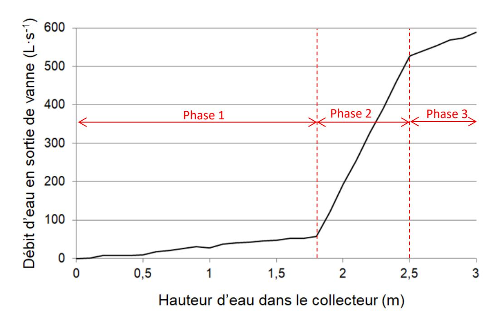

Figure 14 : courbe de tarage expérimentale de la vanne.

Question 16. Le torseur des actions mécaniques de cohésion le long de la poutre est :

$$\{T_{coh}\} = \begin{cases} N(x) & 0 \\ T_y(x) & 0 \\ 0 & M_{fz}(x) \end{cases} = \begin{cases} F \cdot cos(\alpha) & 0 \\ F \cdot sin(\alpha) & 0 \\ 0 & F \cdot sin(\alpha) \cdot (L-x) \end{cases}_{(\vec{x}, \vec{y}, \vec{z})}$$

Question 17. La poutre est soumise à de la flexion simple et de la traction.

**Question 18.** La contrainte normale maximale dans une section  $\sigma(x)$  est :

$$\sigma(x) = -\frac{M_{fz}(x)}{I_{fz}} \cdot \frac{h}{2}$$

Le moment fléchissant est maximal au niveau de l'encastrement au point A (pour x = 0) :

$$M_{fz \text{ max}i} = M_{fz}(0) = F \cdot L \cdot \sin(\alpha)$$

Par conséquent, la contrainte maximale dans la poutre est :

$$|\sigma_{\text{maxi}}| = \frac{\text{F} \cdot \text{L} \cdot \sin(\alpha)}{\frac{\text{bh}^3}{12}} \cdot \frac{\text{h}}{2} = \frac{6 \cdot \text{F} \cdot \text{L} \cdot \sin(\alpha)}{\text{bh}^2}$$

A.N. :  $|\sigma_{maxi}| = 6,2 \text{ Mpa}$ 

 $|\sigma_{\text{maxi}}| < \frac{\text{Re}}{\text{s}} = 91 \text{ Mpa}$ . La contrainte maximale dans la poutre est bien inférieure à la contrainte maximale admissible.

**Question 19.** Contrainte normale σ(x) uniquement due à la traction :

$$\sigma(x) = \frac{N(x)}{S} = \frac{F \cdot \cos(\alpha)}{b \cdot h}$$

A.N. : σ(x) = 0,58 Mpa. Cette valeur est négligeable devant celles relatives aux contraintes dues à la flexion. Les effets dus à la traction peuvent donc être négligés, l'hypothèse réalisée précédemment est cohérente.

**Question 20.** Équation de la déformée le long de la poutre :

$$E \cdot I_{Gz} \cdot y''(x) = M_{fz}(x) = F \cdot sin(\alpha) \cdot (L-x)$$

$$\Leftrightarrow$$
  $y''(x) = \frac{1}{E \cdot I_{Gz}} \cdot F \cdot \sin(\alpha) \cdot (L-x)$ 

On intègre deux fois :

$$y'(x) = \frac{1}{E \cdot I_{Gz}} \cdot F \cdot \sin(\alpha) \cdot \left(L \cdot x - \frac{x^2}{2}\right) + c_1$$

$$y(x) = \frac{1}{E \cdot I_{Gz}} \cdot F \cdot \sin(\alpha) \cdot \left(\frac{L \cdot x^2}{2} - \frac{x^3}{6}\right) + c_1 \cdot x + c_2$$

On détermine les constantes c<sup>1</sup> et c<sup>2</sup> à partir des conditions limites.

$$y'(0) = 0 \implies c_1 = 0$$

$$y(0) = 0 \implies c_2 = 0$$

L'expression de la déformée le long de la poutre est :

$$y(x) = \frac{1}{E \cdot I_{Gz}} \cdot F \cdot \sin(\alpha) \cdot \left(\frac{L \cdot x^2}{2} - \frac{x^3}{6}\right)$$

La flèche est maximale lorsque x = L :

$$f = y(L) = \frac{F \cdot \sin(\alpha) \cdot L^3}{3 \cdot E \cdot I_{Gz}} = 0,034 \text{ mm}$$

Le déplacement maximal en bout de support doit être inférieur à 0,5 mm. Le cahier des charges est donc respecté.

**Question 21.** Conditions aux limites nécessaires à la simulation par éléments finis :

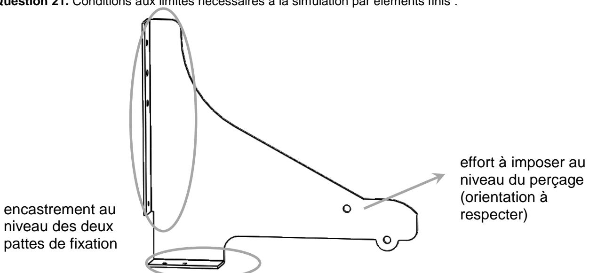

**Question 22.** D'après les résultats donnés en annexe 6, la contrainte de Von Misès maximale est 34,1 MPa. Cette valeur est inférieure à Re s = 91 Mpa.

Le déplacement maximal est 0,115 mm. Cette valeur est inférieure à 0,5 mm.

Par conséquent, le support du battant est correctement dimensionné.

**Question 23.** Le système admet un plan de symétrie matérielle (géométrie), et ce même plan est également plan de symétrie pour les efforts extérieurs. On peut donc se placer en modèle plan.

Question 24. Sans aucune action de l'opérateur sur la came (4), cette dernière est soumise à deux glisseurs : l'action du bâti en D (liaison pivot) et l'action de la pièce de mise en pression (5). Pour que la came puisse être à l'équilibre, il faut, d'une part, que ces deux forces soient opposées, et colinéaires aux deux points d'application, et d'autre part, que l'effort de (5) sur (4) soit à l'intérieur du cône de frottement défini par l'angle  $\varphi$ .

Ceci n'est possible que si le point de contact entre (4) et (5) est situé à droite de l'intersection entre la surface de contact et la droite passant par D et formant un angle  $\phi$  avec la verticale :

Cette position est matériellement possible. Elle ne correspond cependant pas exactement au point E tel que défini dans le sujet, car ce point a été défini à l'instant le plus défavorable (limite de rupture de contact).

**Question 25.** On isole la pièce (5), soumise à l'action des vérins  $\overrightarrow{F_{\nu}}$ , l'action de la came  $\overrightarrow{F_{4\to 5}}$  et l'action du support (0) en J (liaison pivot). Le principe fondamental de la statique, en moment au point J, projeté sur  $\overrightarrow{z_0}$  permet d'écrire que

$$JC \cdot F_v - EJ \cdot \cos \phi \cdot F_{5} = 0$$

On en déduit

$$\overrightarrow{F_{4\rightarrow5}} = -F_{5\rightarrow4} \cdot \cos\phi \cdot \overrightarrow{x_0} - F_{5\rightarrow4} \cdot \sin\phi \cdot \overrightarrow{y_0} \text{ avec } F_{5\rightarrow4} = \frac{JC \cdot F_V}{EJ \cdot \cos\phi} = 2\ 039\ N$$

**Question 26.** On isole la came (4), soumise à l'action de l'opérateur  $\overrightarrow{F_{op}}$ , l'action de la pièce de mise en pression  $\overrightarrow{F_{5\rightarrow 4}}$ , et l'action du support (0) en D (liaison pivot).

Le principe fondamental de la statique en moment en D, projeté sur  $\overrightarrow{z_0}$  permet d'écrire que

$$\left(\overrightarrow{\mathsf{DF}} \wedge \overrightarrow{\mathsf{F}_{\mathsf{op}}}\right) \cdot \overrightarrow{\mathsf{z}_{\mathsf{0}}} + \left(\overrightarrow{\mathsf{DE}} \wedge \overrightarrow{\mathsf{F}_{\mathsf{5} \to \mathsf{4}}}\right) \cdot \overrightarrow{\mathsf{z}_{\mathsf{0}}} = 0$$

Notons 
$$\overrightarrow{DF} = x_F \cdot \overrightarrow{x_0} + y_F \cdot \overrightarrow{y_0}$$
 et  $\overrightarrow{DE} = x_E \cdot \overrightarrow{x_0} + y_E \cdot \overrightarrow{y_0}$ 

On obtient 
$$y_F \cdot F_{op} + x_E \cdot \sin \phi \cdot F_{5\rightarrow 4} - y_E \cdot \cos \phi \cdot F_{5\rightarrow 4} = 0$$

On en déduit 
$$F_{op} = \frac{-x_E \cdot \sin\phi + y_E \cdot \cos\phi}{y_F} \cdot F_{5 \to 4} = 286 \text{ N}$$

Question 27. L'effort est inférieur à la valeur limite (300 N), l'exigence 2.2.1 est validée.

**Question 28.** D'après le système de coordonnées 3,  $I_A = I_{ZZ} = 4,14 \text{ g} \cdot \text{mm}^2 = 4,14 \text{ kg} \cdot \text{m}^2$ 

Question 29. La pression étant supposée constante sur toute la surface de contact, on peut écrire que

$$F_e = p \cdot S = p \cdot g \cdot H_{max} \cdot S = 6 612 \text{ N}$$

**Question 30.** L'effort des vérins sur le battant mobile est toujours dirigé selon  $\overrightarrow{y_2}$  à condition que le moment dynamique  $\overrightarrow{\delta}(C,2+3/0)$  soit nul (auquel cas l'écriture du principe fondamental de la dynamique

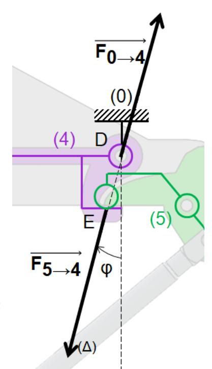

montre que l'effort en B doit être colinéaire à  $\overrightarrow{BC}$ ). Cela est possible parce qu'on néglige les masses et inerties du vérin. Dans le cas contraire, il y aurait un terme dû à la rotation d'angle  $\alpha$ .

**Question 31.** On isole le battant mobile 1, soumis à l'action de l'eau  $\overrightarrow{F_e}$  en G, l'action de la pesanteur  $\overrightarrow{F_p}$  en G, l'action du support 0 en A (liaison pivot), l'action des vérins  $\overrightarrow{F_v}$  en B. Le moment dynamique en A du battant mobile vaut :

 $\vec{\delta}(A, 1/0) = I_A \cdot \vec{\theta} \cdot \vec{z_0}$  (rotation autour d'un axe fixe)

Ainsi le principe fondamental de la dynamique en moment en A projeté sur  $\overrightarrow{z_0}$  permet d'écrire

$$\begin{split} I_{A} \cdot \ddot{\theta} &= \left(\overrightarrow{AG} \wedge \overrightarrow{F_{P}}\right) \cdot \overrightarrow{z_{0}} + \left(\overrightarrow{AG} \wedge \overrightarrow{F_{e}}\right) \cdot \overrightarrow{z_{0}} + \left(\overrightarrow{AB} \wedge \overrightarrow{F_{v}}\right) \cdot \overrightarrow{z_{0}} \\ \\ I_{A} \cdot \ddot{\theta} &= \left(\overrightarrow{d} \cdot \overrightarrow{x_{1}} \wedge \overrightarrow{m} \cdot \overrightarrow{g} \cdot \overrightarrow{x_{0}}\right) \cdot \overrightarrow{z_{0}} + \left(\overrightarrow{d} \cdot \overrightarrow{x_{1}} \wedge \overrightarrow{F_{e}} \cdot \overrightarrow{y_{1}}\right) \cdot \overrightarrow{z_{0}} + \left(\overrightarrow{c} \cdot \overrightarrow{x_{1}} \wedge \left(-\left\|\overrightarrow{F_{v}}\right\| \cdot \overrightarrow{y_{2}}\right)\right) \cdot \overrightarrow{z_{0}} \\ \\ I_{A} \cdot \ddot{\theta} &= -\overrightarrow{m} \cdot \overrightarrow{g} \cdot \overrightarrow{d} \cdot \overrightarrow{\sin} \theta + \overrightarrow{d} \cdot \overrightarrow{F_{e}} - \overrightarrow{c} \cdot \left\|\overrightarrow{F_{v}}\right\| \cdot \cos(\alpha - \theta) \end{split}$$

**Question 32.** Si  $\theta = 0$  alors  $I_A \cdot \ddot{\theta} = d \cdot F_e - c \cdot F_0 \cdot \cos \alpha$ 

Question 33.  $\ddot{\theta} > 0$ .

**Question 34.** Profil 1 : on a bien  $\ddot{\theta} > 0$ , mais l'angle 25 ° n'est pas atteint

Profil 2: on a bien  $\ddot{\theta} > 0$ 

Profil 3 : pour  $\theta$  < 50 °,  $\ddot{\theta}$  < 0, ce qui ne correspond pas à une ouverture.

On choisira donc le profil 2.

**Question 35.** En position  $\theta = 0$ °, avec  $H = H_{max}$ , le système est à l'équilibre statique car  $F_0$  a été calculé de manière à compenser exactement l'action de l'eau (on le retrouve sur la figure 22). Il n'y aurait donc pas de mouvement...

**Question 36.** On relève le temps pour lequel on atteint l'ouverture souhaitée, à savoir 25  $^{\circ}$  : on trouve  $t_{ouv}$  = 2,7 s

**Question 37.** On souhaitait un temps d'ouverture inférieur à 1 s, le cahier des charges n'est donc pas validé

On constate que la modification de profil seule ne permet pas une ouverture brutale, mais une ouverture au début très lente, qui s'accélère à mesure que la vanne s'ouvre.

On peut alors imaginer une solution avec un cliquet, libre pour la fermeture de la vanne et avec ressort pour l'ouverture. Les vérins servent alors à assurer la fermeture de la vanne lorsque l'eau s'est évacuée. Pour ouvrir la vanne, l'effort exercé par l'eau doit être suffisant pour comprimer le ressort du cliquet.

**Question 38.** L'intérêt de l'implantation des VHA est d'utiliser le réseau de canalisation existant afin de stoker les eaux pluviales en cas de fortes pluies et de freiner leur écoulement. Ces dispositifs sont entièrement autonomes.

Afin de réguler le débit des eaux pluviales, les vannes doivent être correctement dimensionnées. Le choix du vérin est primordial car il permet au battant mobile de s'effacer en cas de fortes pluies selon les spécifications du cahier des charges. Les composants de la vanne doivent être dimensionnés pour supporter les efforts importants dus à l'eau.

# **Rapport du jury de l'épreuve « Étude d'un système, d'un procédé ou d'une organisation » – option ingénierie mécanique**

# **1. Présentation du sujet**

Le réchauffement climatique ainsi que l'urbanisation croissante du territoire occasionnent des inondations de plus en plus fréquentes et dangereuses pour la population, générant également plusieurs centaines de millions d'euros de dégâts.

Le support de ce sujet d'admissibilité est une Vanne Hydrodynamique Autonome (VHA) implantée dans un réseau des eaux pluviales. L'ensemble des vannes de ce réseau permet de stocker temporairement les eaux de pluie afin de limiter le risque d'inondation urbaine.

Six thèmes d'étude sont abordés afin d'évaluer différentes connaissances et compétences liées au domaine de l'ingénierie mécanique :

- la pertinence de l'implantation des VHA dans l'écoquartier Smartseille ;
- la validation de la géométrie des VHA afin d'assurer le débit maximal des eaux pluviales ;
- la validation en statique du choix des vérins ;
- la validation de la tenue aux efforts hydrauliques des supports de battant ;
- l'étude du système de déverrouillage ;
- l'évolution de la VHA en vanne de chasse.

# **2. Analyse globale des résultats**

L'ensemble des questions a été traité. Un quart des candidats a traité au moins 80% des questions. Le sujet a été majoritairement traité de manière linéaire. La dernière partie concernant une proposition d'évolution de la vanne et basée sur un modèle dynamique n'a été abordée que par un tiers des candidats.

Le jury relève et apprécie la très bonne tenue et la clarté de certaines copies, démontrant les qualités attendues d'un enseignant devant ses élèves, ainsi qu'une maîtrise des connaissances scientifiques. Cependant, les savoirs disciplinaires ne sont pas acquis par de nombreux candidats. Le jury a noté des lacunes inquiétantes dans les fondamentaux de l'ingénierie mécanique telles que l'isolement d'un système et le principe fondamental de la statique. De nombreux candidats ont présenté des erreurs graves de méthode et de rigueur en présentant des bilans d'actions mécaniques très souvent incomplets, en appliquant des raisonnements faux pour résoudre des problèmes de statique. Le développement de calculs nécessitant des opérations sur des vecteurs a également posé problème à certains candidats.

Le jury déplore par ailleurs qu'un certain nombre de candidats ait adopté une stratégie consistant à survoler le sujet et répondre aux questions de validation d'exigences sans avoir développé les raisonnements structurés nécessaires à cette validation. Le jury rappelle que les réponses formulées ne doivent pas se réduire à une conclusion non justifiée.

## **3. Commentaires sur les réponses apportées et conseils aux candidats**

# **Implantation dans l'écoquartier Smartseille**

L'objectif de cette partie était d'estimer la pertinence de l'implantation du dispositif constitué des VHA sur l'ilôt Allar de l'écoquartier Smartseille. La démarche reposait sur une comparaison des volumes d'eaux pluviales d'une pluie décennale aux volumes de stockage potentiels du réseau d'eaux pluviales. Elle a été abordée par la quasi-totalité des candidats.

Seulement la moitié des candidats a su exploiter les informations données afin de déterminer le volume d'eau total généré par une pluie décennale. L'unité et l'expression du volume d'un cylindre ne sont pas maîtrisées par l'ensemble des candidats.

Lors de la conclusion sur la pertinence de l'installation de VHA à partir des résultats obtenus, les justifications ont souvent manqué de rigueur, voire démontré l'inverse. Il est conseillé aux candidats de bien lire les questions, l'objectif de cette partie n'était pas de valider ou non une exigence mais d'apprécier la pertinence d'utilisation du système.

De même, la question 4 portait sur le choix des paramètres de la simulation numérique, et non sur l'implantation réelle des VHA. La question a souvent été mal comprise.

# **Validation du débit maximal**

L'objectif de cette partie était de vérifier que le vérin choisi permet d'assurer une ouverture suffisante de la vanne pour évacuer le débit maximal souhaité.

La recherche d'informations à partir de la lecture d'un document technique a été généralement bien réussie.

L'écriture et le développement d'une fermeture géométrique d'une chaîne de solides n'est pas évidente pour un nombre important de candidats. Cette question, que pourtant seuls 32% des candidats ont réussi à traiter, ne présentait pas de difficulté. Le jury rappelle l'importance de la maîtrise de la détermination d'une loi entrée sortie géométrique.

Certains candidats n'ayant pas obtenu l'expression analytique à la question 7 ont réalisé une étude graphique afin de répondre à la question posée. Le jury apprécie cette initiative dans la mesure où la conclusion a ainsi pu être justifiée.

### **Validation de la courbe de tarage**

Cette partie abordait une étude de statique qui avait pour but de vérifier que le choix des vérins et de leur précharge permettait de valider les exigences relatives à la courbe de tarage (qui impose un seuil de début d'ouverture et un effort associé à l'ouverture maximale).

Il s'agissait pour commencer de déterminer une direction d'effort. L'isolement du vérin, soumis à deux forces, était attendu, sans avoir à développer de calculs. Seulement un tiers de candidats a réussi cette question. Les erreurs les plus courantes étaient un mauvais choix de solides à isoler et des bilans d'actions mécaniques extérieurs incomplets.

Pour déterminer l'effort à fournir par les vérins, le candidat devait expliciter la méthode. Le solide à isoler était généralement bien choisi, mais non explicitement mentionné. Le bilan des actions extérieures était souvent incomplet, les calculs non aboutis ou faux. De trop nombreux candidats ne maîtrisent pas l'application du principe fondamental de la statique, pourtant essentiel en ingénierie mécanique. Quelques candidats se sont tournés vers une étude graphique. Cependant, le tracé seul des vecteurs

obtenus ne saurait constituer l'explicitation d'une méthode et la réponse ne peut omettre le choix d'isolement ni le bilan d'actions mécaniques extérieures. Quelle que soit la méthode utilisée, le jury attend un minimum de rigueur et de justification.

# **Validation du dimensionnement des supports**

Cette partie visait à vérifier la tenue des supports par rapport aux sollicitations hydrauliques auxquelles est soumise la VHA. Deux modèles de complexité croissante étaient proposés. Le jury apprécie que cette partie ait été abordée et réussie par une grande majorité de candidats.

Toutefois le jury déplore que la détermination d'un torseur de cohésion dans un cas simple ne soit pas toujours maîtrisée et que les réponses manquent souvent de rigueur.

Il regrette également qu'une lecture trop rapide de l'énoncé mène à des réponses incomplètes.

Il rappelle qu'il est important de vérifier l'homogénéité des résultats obtenus.

Le choix des conditions aux limites du modèle à éléments finis, ainsi que la lecture et l'interprétation des résultats de la simulation ont été généralement bien réussis.

# **Etude du système de verrouillage**

L'objectif de cette partie était de vérifier que le système de verrouillage satisfait l'exigence de déverrouillage manuel de la VHA. Il s'agissait principalement d'une étude de statique avec frottement sec, dont les isolements nécessaires à la résolution étaient donnés.

Bien qu'abordée par 80% des candidats, le jury déplore que seulement 40% des candidats sont capables de justifier correctement une modélisation plane. Là encore, le jury constate que les bilans des actions mécaniques extérieures aux systèmes isolés sont trop souvent incomplets, mènent à des choix d'équations non pertinents, et conduisent à des résultats erronés. Ainsi une grande partie des candidats ne semble pas maîtriser l'application du principe fondamental de la statique, ce qui est fort regrettable.

# **Évolution de la VHA en vanne de chasse**

Cette partie avait pour but d'explorer la possibilité d'utilisation d'une VHA en vanne de chasse par modification de sa géométrie.

L'identification d'un moment d'inertie à choisir dans une documentation issue d'un modeleur volumique n'a pas donné lieu à des difficultés, sinon à des erreurs d'unité. L'expression de l'action mécanique due à la pression de l'eau est également bien maîtrisée. Le jury regrette que l'application du principe fondamental de la dynamique ou du théorème de l'énergie cinétique, également des essentiels de l'ingénierie mécanique, n'ait été traitée que par 20% des candidats.

Le jury rappelle également que la nullité d'une variable en un instant n'implique pas la nullité de ses dérivées temporelles.

Le cahier des charges n'étant pas vérifié à ce stade pour cette vanne de chasse, il était demandé aux candidats de proposer une piste d'amélioration de la vanne en quelques lignes. Si le jury constate que nombre de solutions proposées se résument à diminuer le moment d'inertie du battant ou ne sont pas suffisamment développées pour être compréhensibles, il se réjouit de très bonnes idées de conception de certains candidats.

# **Synthèse**

L'objectif de cette partie était de préciser l'intérêt de l'implantation des VHA vis-à-vis de la prévention des inondations et d'expliciter comment le dimensionnement des vannes devait être réalisé pour permettre de répondre aux exigences énoncées.

De nombreux candidats n'ont traité que la première partie de cette question en affirmant que le dispositif réduisait le risque d'inondations, sans rappeler les étapes nécessaires au dimensionnement. Il semble dommage qu'une mauvaise maîtrise du temps de composition imparti ait amené 60% des candidats à ne pas traiter cette partie, pourtant abordable de manière indépendante du reste du sujet.

#### **4. Conclusion**

L'épreuve d'admissibilité de l'option ingénierie mécanique vise à évaluer les savoirs disciplinaires. Il apparaît que les essentiels de l'ingénierie mécanique, à savoir les principes fondamentaux de la dynamique (en particulier de la statique), le théorème de d'énergie cinétique, l'établissement de loi entrée sortie à partir d'une fermeture cinématique ne sont pas acquis pour un grand nombre de candidats.

D'autre part, les éléments primordiaux de raisonnement (par exemple, le choix de l'ensemble de solides isolé, du théorème et de l'équation), ainsi que les étapes de la démarche de résolution, qu'elle soit analytique ou graphique, doivent figurer dans les réponses formulées. Cela participe à la rigueur attendue d'un enseignant.

Le jury rappelle l'importance de la clarté et de la lisibilité d'une copie, ainsi que la mise en évidence des résultats importants (notamment en les soulignant). Un soin particulier doit être apporté à la rédaction et la vérification de l'orthographe.

Globalement, le jury considère que les candidats semblent s'être moins bien préparés pour cette session que pour les précédentes. Le jury rappelle l'importance d'une bonne préparation par rapport aux exigences de cette épreuve de concours.

# **5. Résultats**

148 copies ont été évaluées pour cette épreuve, la moyenne des notes obtenues est de 8,5 et l'écarttype de 3,5 avec :

- 17,7 comme meilleure note ;
- 3,9 comme note la plus basse.

# **Rapport du jury de l'épreuve d'entretien à partir d'un dossier**

Compte-tenu des contraintes sanitaires imposées, cette épreuve a été organisée en visio-conférence pour les candidats ultramarins. Le protocole de déroulement de l'épreuve est resté inchangé par rapport aux années antérieures. L'organisation des visio-conférences s'est faite dans de très bonnes conditions.

# **Recommandations générales**

Il est demandé aux candidats de lire attentivement le règlement du concours afin de respecter les modalités de l'épreuve.

Il est impératif de prendre connaissance des programmes d'enseignement du collège et du lycée, en vigueur à la date de l'inscription au concours et des ressources associées. Sur le plan de l'organisation pédagogique, les activités des élèves doivent être au centre des préoccupations du candidat.

Le jury demande aux candidats de ne pas limiter leur approche à une identification des objectifs de formation tels que définis dans les programmes mais de développer des activités en explicitant les démarches pédagogiques retenues.

Le jury invite les candidats à s'approprier le référentiel de compétences des professeurs disponible à l'adresse suivante : [http://www.education.gouv.fr/cid73215/le-referentiel-de-competences-des](http://www.education.gouv.fr/cid73215/le-referentiel-de-competences-des-enseignants-au-bo-du-25-juillet-2013.html)[enseignants-au-bo-du-25-juillet-2013.html](http://www.education.gouv.fr/cid73215/le-referentiel-de-competences-des-enseignants-au-bo-du-25-juillet-2013.html)

Notamment, le jury attend des candidats une parfaite maîtrise, orale et écrite, de la langue française.

# Présentation de l'épreuve

- Durée de l'épreuve : 1 heure (présentation : 30 minutes maximum, entretien avec le jury : 30 minutes) ;
- Coefficient 2.

L'épreuve est basée sur un entretien avec le jury à partir d'un dossier technique, scientifique et pédagogique réalisé par le candidat, suivi d'un entretien. Elle a pour but de vérifier que le candidat est capable de rechercher des supports de son enseignement dans le milieu économique et d'en extraire des exploitations pertinentes pour son enseignement au collège ou en lycée.

L'entretien qui succède à la présentation du candidat permet au jury d'approfondir les points qu'il juge utiles. Il permet en outre d'apprécier la capacité du candidat à prendre en compte les acquis et les besoins des élèves, à se représenter la diversité des conditions d'exercice de son métier futur, à en connaître de façon réfléchie le contexte dans ses différentes dimensions (classe, équipe éducative, établissement, institution scolaire, société) et les valeurs qui le portent, dont celles de la République. *Les dossiers doivent être déposés ou envoyés en recommandé en double exemplaires, au secrétariat du jury cinq jours francs avant le début des épreuves d'admission pour le support papier et en un exemplaire pour le support numérique. A l'issue des épreuves aucun dossier ou support numérique n'est restitué.* 

# **Analyse globale des prestations**

# **Le support**

Le jury note la grande diversité des supports techniques retenus par les candidats, celle-ci démontrant que les domaines d'investigations sont nombreux et qu'ils sont potentiellement capables d'être appréhendés et adaptés à l'enseignement technologique du cycle secondaire.

Le jury constate la grande disparité de la qualité du contenu des dossiers sur le fond et la forme. En effet, si la plupart des candidats ont respecté les consignes définissant l'épreuve, certains se sont contentés d'une approche très générale, voire superficielle, des présentations *scientifiques, technologiques et pédagogiques*. Les développements scientifiques et technologiques doivent impérativement démontrer au jury l'expertise du candidat *dans la spécialité choisie* lors de leur inscription au concours.

Le jury attend donc des développements personnels approfondis à caractère *scientifique et technologique* conformes aux exigences du concours et faisant référence aux exploitations *pédagogiques* possibles.

Seule l'identification de problématique(s) industrielle(s) authentique(s) permet de satisfaire à cette exigence.

Le choix du support est donc essentiel pour garantir une exploitation scientifique, technologique et pédagogique suffisamment riche. Il doit être fait au plus tôt dans la préparation au concours. Le jury regrette que certaines prestations s'appuient uniquement sur des données obtenues par de simples échanges téléphoniques ou récupérées sur Internet sous la forme de présentations commerciales. En outre, les travaux universitaires, réalisés par les candidats, ou les projets conduits dans le cadre d'une activité professionnelle, souvent très complexes et marginaux par rapport aux programmes d'enseignement, sont généralement inappropriés pour devenir des supports de dossiers dans le cadre de cette épreuve.

Un simple constituant d'un système ou une solution technologique non contextualisée ne peut constituer un support de dossier satisfaisant, de même qu'une présentation de matériaux ou famille de matériaux ou encore une démarche d'organisation du travail. Un futur enseignant en sciences et techniques industrielles doit être en constante veille technologique, établir et maintenir un contact permanent avec les divers acteurs du secteur industriel garantissant ainsi l'intégration des innovations technologiques dans le cursus de formation des collégien(ne)s et lycéen(ne)s. En outre, l'enseignement de l'informatique et de la programmation prend corps via la programmation des produits pluritechnologiques en réponse à un besoin dûment formulé faisant état des fonctions à satisfaire, des comportements attendus et des fonctionnalités requises des interfaces Homme-machine.

# **Commentaires et recommandations à l'attention des candidats**

# **Élaboration de la partie scientifique et technologique du dossier**

Le caractère pluritechnologique et la richesse scientifique du support retenu sont valorisés par le jury. Le choix de systèmes assimilés à des jouets ou déjà didactisés et l'exploitation des dossiers pédagogiques fournis avec ces équipements ne sont pas recommandés. De même, le principe du développement ex nihilo par le candidat d'une maquette ayant vocation à constituer un support de cours n'est pas envisageable.

L'approche systémique s'avère essentielle, car elle s'appuie sur une perception globale du système dans son environnement. Elle démontre aussi la capacité du candidat à contextualiser le support en

utilisant une démarche d'analyse fonctionnelle et les outils de description de l'ingénierie système. Ce travail constitue un attendu fort du jury. Elle intègre en conséquence la complexité du réel. Il s'agit d'une étape incontournable de la présentation du support choisi.

Le jury déplore que pour un nombre conséquent de dossiers, l'étude scientifique et technologique se limite à une description du produit ou une explication du fonctionnement de celui-ci. Certains dossiers se limitent à une compilation de ressources copiées-collées depuis Internet sans citer les sources. Le plagiat est sévèrement sanctionné par le jury. Le candidat doit veiller à mener des études personnelles à caractère scientifique et technologique dépassant la simple description du support choisi et privilégiant l'élaboration de modèles comportementaux et leur utilisation dans la partie pédagogique. Les phases de validation, au cœur des développements pédagogiques, imposent la vérification de grandeurs caractéristiques quantifiées.

En lien avec la vérification et la quantification des caractéristiques étudiées, la démarche expérimentale prend ici tout son sens. Les protocoles d'acquisition des données doivent être décrits, voire accompagnés, du traitement des résultats obtenus. Le jury recommande aux candidats de consulter les travaux de recherche universitaires, au moins en langue française, utiles à l'explicitation dans le dossier de solutions technologiques innovantes. Sans en exiger la maîtrise des contenus, ce travail peut permettre de rendre plus robustes certaines présentations. Dans cette perspective, il doit être fait mention des auteurs et travaux consultés dans la bibliographie des dossiers. Le volet pédagogique doit permettre au candidat d'exploiter une des problématiques identifiées dans la partie scientifique et technologique. Le candidat doit veiller à conserver une logique entre les dominantes du support et l'exploitation pédagogique. L'adaptation pertinente des documents techniques utiles à l'exploitation pédagogique est un attendu du jury. La qualité des documents techniques insérés dans cette partie du dossier est une preuve de la capacité du candidat à produire des ressources d'activités exploitables par les élèves.

*Le jury conseille aux candidats de constituer un dossier de 40 pages au maximum annexes comprises.* 

# **Élaboration de la partie pédagogique du dossier**

Pour la séquence choisie, il est indispensable que le candidat précise clairement :

- le niveau de la classe choisie et l'enseignement concerné,
- la pertinence du positionnement de la séquence au sein de la progression du cycle de formation qui ne saurait se résumer à un simple positionnement calendaire
- ses intentions pédagogiques en lien avec le programme ou le référentiel choisi et la problématique retenue, ce qui implique que les compétences travaillées et les connaissances visées soient explicitement exprimées ainsi que les prérequis nécessaires à cette nouvelle étape de formation ;
- l'adaptation des documents techniques exploitables pour des élèves;
- l'organisation pédagogique et les situations d'apprentissage prenant la forme d'une fiche séquence, détaillant au moins une des activités élèves ;
- une activité rédigée et détaillée à destination des élèves ;
- les contenus d'une fiche de synthèse qui participent de la structuration des connaissances
- l'évaluation des acquis des élèves indiquant les critères et les indicateurs de réussite ainsi que les modalités d'une remédiation.

Le jury apprécie les séquences développées qui prennent en compte la diversité des performances attendues des élèves ainsi que les séquences construites autour d'une approche pluritechnologique et pluridisciplinaire.

La connaissance des programmes de formation est prise en compte dans l'évaluation du candidat. Pour autant, un développement exhaustif à tous les niveaux de formation n'est pas nécessaire. Le jury apprécie les propositions d'exploitations pédagogiques, en technologie au collège, dans les options SI et CIT en classe de seconde, en STI2D, dans la spécialité SI, de la voie générale qui exploitent pleinement le potentiel du support retenu.

Enfin, si l'approche pluritechnologique est parfois bien traitée, le jury constate que l'approche pluridisciplinaire ne l'est quasiment jamais. Pourtant, les thèmes d'études exposés par les candidats rendraient cette approche pluridisciplinaire souvent possible ; par ailleurs, la démarche STEM et la prise en compte de la dimension sociétale sont prégnantes dans le cadre de la réforme des enseignements de spécialité du baccalauréat.

La séquence pédagogique s'avère trop rarement positionnée au sein d'une progression. Ce positionnement est certes difficile pour des candidats qui n'ont jamais, ou que très peu, exercé. Cependant, lorsque ce positionnement est réalisé, il témoigne d'une réflexion et d'une appropriation, même très partielle, des programmes et une prospective quant à la progressivité des apprentissages. Le jury constate et regrette que la différentiation pédagogique, même s'il s'agit d'une notion complexe, ne soit que très peu abordée par les candidats.

À l'instar de l'élaboration de la partie scientifique et technologique du dossier, le jury invite les candidats à documenter leurs réflexions par la consultation des travaux universitaires sur les aspects didactiques et pédagogiques.

Un futur enseignant doit être en constante veille pédagogique et réglementaire ; les candidats s'assureront que l'exploitation pédagogique proposée est strictement conforme aux programmes en vigueur.

Le jury invite les candidats à consulter le site RNR STI : [https://eduscol.education.fr/sti/.](https://eduscol.education.fr/sti/)

# **Soutenance du dossier**

Cette partie de l'épreuve doit permettre au candidat de démontrer :

- sa connaissance des contenus d'enseignement et des programmes de la discipline au collège et au lycée ;
- sa réflexion sur la didactique de la discipline et le développement de l'interdisciplinarité ;
- ses aptitudes à communiquer, à analyser et à synthétiser;
- sa connaissance des dispositifs d'évaluation ;
- l'apport du numérique au bénéfice de l'évaluation des élèves, de la remédiation et de l'exploitation des temps d'apprentissage en dehors de la salle de classe.

Le candidat expose, dans un premier temps, sans être interrompu par le jury, le résultat de ses travaux. Il doit mettre en évidence :

- les raisons qui ont présidé au choix du support ;
- la pertinence du support choisi pour une exploitation pédagogique ;
- la documentation technique rassemblée et la nature des échanges établis ;
- dans le cas d'un travail de groupe, son travail personnel clairement repéré dans le dossier et mis en évidence lors de l'exposé, tant dans les développements scientifiques et technologiques que dans l'exploitation pédagogique ;
- les objectifs pédagogiques choisis ;
- la structure de la (ou des) séquence(s) choisie(s) ;
- le travail demandé aux élèves ;

- les compétences mobilisées et les connaissances associées;
- les stratégies d'évaluation et de remédiation.

De nombreux candidats exploitent judicieusement le temps alloué à l'exposé en respectant un équilibre entre les développements scientifiques et technologiques et l'exploitation pédagogique.

Le diaporama est le support de présentation le plus utilisé par les candidats. Certains diaporamas se révèlent mal calibrés temporellement. Les candidats disposant d'un temps de parole de trente minutes maximum, cela les conduit à un débit verbal très élevé et, de facto, le contenu devient fort délicat à appréhender par le jury. Ce dernier conseille donc aux candidats de limiter le nombre de diapositives à une trentaine. Le jury apprécie les diaporamas présentant quelques animations ou l'inclusion de courtes capsules vidéos, qui peuvent utilement remplacer de longs développements. Par ailleurs, le jury attire l'attention des candidats sur les autres possibilités de communication qui leur sont accessibles, alternatives au classique diaporama.

Sur la forme, le jury constate encore fréquemment de trop nombreuses fautes d'orthographe et des diapositives trop chargées, voire illisibles.

Il est conseillé de faire appel aux applications numériques d'animation et de simulation actuelles pour la présentation des dossiers. La numérotation des diapositives est indispensable afin de faciliter les échanges avec le jury. Le jury apprécie la qualité de l'expression orale des candidats et sanctionne le manque de rigueur dans ce registre (niveau de langage, terminologie technique, expressions inadaptées, approximations syntaxiques, etc.).

Le support numérique est un moyen sur lequel le candidat s'appuie au cours de son exposé. Trop de candidats se contentent de lire le contenu des diapositifs au lieu d'apporter des commentaires, des justifications, des arguments sur leurs choix. Le jury apprécie les prestations dynamiques où le candidat n'est pas dépendant de son support de présentation. Il démontre ainsi ses aptitudes à communiquer et capter l'attention de son auditoire.

#### **2.4. Entretien avec le jury**

Au cours de l'entretien, le jury pose des questions destinées à :

- expliciter les raisons qui ont conduit le candidat au choix du support et les liens établis avec l'entreprise ;
- expliciter le contexte de développement du dossier ;
- expliciter un développement scientifique dans la perspective de l'élaboration d'un modèle de comportement ;
- justifier les solutions technologiques adoptées ;
- préciser les exploitations pédagogiques possibles.

Le jury cherche à valoriser le candidat dans sa maîtrise des démarches pédagogiques mobilisées dans son enseignement. Il apprécie la réactivité du candidat, la pertinence de ses réponses, la qualité de son argumentation et son appropriation des valeurs de la République dans le contexte d'exercice du métier d'enseignant.

Pour autant, le jury attend des candidats, futurs professeurs stagiaires en cas de réussite au concours, sincérité et engagement. Ainsi, les réponses évasives doivent laisser place à des arguments reflétant les convictions des candidats. Le questionnement du jury a pour seul objectif de valoriser les compétences scientifiques, technologiques et pédagogiques des candidats et de percevoir leur potentiel.

# **Conclusion**

La préparation de cette épreuve doit être engagée dès l'inscription au concours. Le choix d'un support pertinent vis-à-vis des attentes de l'épreuve est essentiel, son appropriation et la réalisation du dossier constituent une solide préparation aux épreuves d'admissibilité.

Le dossier doit être élaboré à partir d'un produit porteur d'innovation. La richesse et la pertinence de son contenu sont à construire au travers de relations réelles avec les professionnels ; les candidats doivent donc prévoir de consacrer du temps pour le constituer et se l'approprier dans le détail, cette épreuve compte pour 2/9 dans l'ensemble des épreuves du CAPET lors d'une session sans suppression d'épreuve, elle participe notablement à la réussite lorsqu'elle est bien préparée. Le dossier ne s'élabore pas uniquement à partir de ressources recueillies sur Internet. Les candidats se limitant à une analyse superficielle du support sont pénalisés.

L'entretien avec le jury permet également d'apprécier la capacité du candidat à prendre en compte les acquis et les besoins des élèves, à se représenter la diversité des conditions d'exercice de son métier futur et à en connaître de façon réfléchie le contexte dans ses différentes dimensions et les valeurs qui le portent, dont celles de la République.

Cette épreuve, comme celle de travaux pratiques, participe significativement à la réussite au concours quand elle est bien préparée. Des candidats admis avaient un rang à l'issue de l'admissibilité inférieur au dernier admis. L'intérêt porté, le travail fourni, à la constitution du dossier débouchent sur une bonne prestation et donc à la réussite des épreuves du concours. De même, dans une proportion sensiblement identique, des candidats ont régressés dans le classement pour certains jusqu'à l'élimination.

# **Résultats**

262 candidats ont été évalués pour cette épreuve, la moyenne des notes obtenues est de 10,5 et un écart type de 5,3 avec :

- 20 comme meilleure note ;
- 1 comme note la plus basse.

## **Sitographie**

[http://www.education.gouv.fr/cid73215/le-referentiel-de-competences-des-enseignants-au-bo-du-25-](http://www.education.gouv.fr/cid73215/le-referentiel-de-competences-des-enseignants-au-bo-du-25-juillet-2013.html)

[juillet-2013.html](http://www.education.gouv.fr/cid73215/le-referentiel-de-competences-des-enseignants-au-bo-du-25-juillet-2013.html)

<https://eduscol.education.fr/sti/>

<https://www.reseau-canope.fr/notice/technologie.html>

# **Rapport sur la transmission des valeurs et principes de la République**

Lors des épreuves d'admission, le jury évalue la capacité des candidats à agir en agent du service public d'éducation, en vérifiant qu'il intègre dans l'organisation de son enseignement :

- la conception des apprentissages des élèves en fonction de leurs besoins personnels ;
- la prise en compte de la diversité des conditions d'exercice du métier et la connaissance réfléchie des contextes associés ;
- le fonctionnement des différentes entités éducatives existant au sein de la société et d'un EPLE (institution scolaire, établissement, classe, équipe éducative…) ;
- les valeurs portées par l'Éducation nationale, dont celles de la République.

Les candidats doivent prendre en compte ces exigences dans la conception des séquences pédagogiques présentées au jury. Il s'agit de faire acquérir, à l'élève, des compétences alliant des connaissances scientifiques et technologiques et des savoir-faire associés, mais également d'installer des comportements responsables et respectueux des valeurs républicaines.

Cet objectif exigeant induit une posture réflexive des candidats lors de la préparation et de la présentation d'une séquence pédagogique. En particulier, les stratégies pédagogiques proposées devront permettre d'atteindre l'objectif de formation visé dans le cadre de « l'école inclusive ». Il est indispensable de donner du sens aux enseignements en ne les déconnectant pas d'un contexte sociétal identifiable. Cela doit contribuer à convaincre les élèves du bien-fondé des valeurs républicaines et à se les approprier.

L'éducation aux valeurs républicaines doit conduire à adopter des démarches pédagogiques spécifiques, variées et adaptées. Il s'agit en particulier de doter chaque futur citoyen d'une culture faisant de lui un acteur éclairé et responsable de l'usage des technologies et des enjeux éthiques associés. À dessein, il est nécessaire de lui faire acquérir des comportements fondateurs de sa réussite personnelle et le conduire à penser et construire son rapport au monde. Les modalités pédagogiques, déployées en sciences industrielles de l'ingénieur, sont nombreuses et sont autant d'opportunités offertes à l'enseignant pour apprendre aux élèves à :

- travailler en équipe et coopérer à la réussite d'un projet ;
- assumer une responsabilité individuelle et collective ;
- travailler en groupe à l'émergence et à la sélection d'idées issues d'un débat et donc favoriser le respect de l'altérité ;
- développer des compétences relationnelles en lui permettant de savoir communiquer une idée personnelle ou porter la parole d'un groupe ;
- comprendre les références et besoins divers qui ont conduit à la création d'objets ou de systèmes à partir de l'analyse des « modes », des normes, des lois, etc. ;
- différencier, par le déploiement de démarches rigoureuses, ce qui relève des sciences et de la connaissance de ce qui relève des opinions et des croyances. L'observation de systèmes réels, l'analyse de leur comportement, de la construction ou de l'utilisation de modèles multi physiques participent à cet objectif ;
- observer les faits et situations divers suivant une approche systémique et rationnelle ;
- adopter un positionnement citoyen assumé au sein de la société en ayant une connaissance approfondie de ses enjeux au sens du développement durable. L'impact environnemental, les

- coûts énergétiques de transformation et de transport, la durée de vie des produits et leur recyclage sont des marqueurs associés à privilégier ;
- réfléchir collectivement à son environnement, aux usages sociaux des objets et aux conséquences induites ;
- comprendre les enjeux sociétaux liés au respect de l'égalité républicaine entre hommes et femmes ;
- appréhender des situations qui lui paraissent inhabituelles car elles ne sont pas en adéquation avec les stéréotypes ;
- etc.

Ces différentes approches permettent d'évaluer la posture des candidats par rapport au besoin de transmettre les valeurs et les principes de la République à l'école. La dimension civique de l'enseignement doit être explicite.

Pour prendre en compte cette dimension du métier d'enseignant dans la conception de séquences pédagogiques, les candidats peuvent s'appuyer sur différents textes réglementaires et ressources pédagogiques disponibles :

- le référentiel de compétences des métiers de l'éducation et du professorat (BOEN n°30 du 25 juillet 2013) ;
- les programmes d'enseignement moral et civique ;
- le socle commun de connaissances, de compétences et de culture ;
- l'instruction relative au déploiement de l'éducation au développement durable dans l'ensemble des écoles et établissements scolaires pour la période 2015-2018 (NOR : MENE1501684C, circulaire n° 2015-018 du 4-2-2015, MENESR – DGESCO) ;
- le parcours Avenir ;
- la banque de ressources « Pour une pédagogie de la laïcité à l'école » Abdennour BIDAR la documentation française 2012 ;
- les ressources numériques en ligne du réseau de création et d'accompagnement pédagogiques CANOPÉ – éducation et société ;
- les ressources du portail national des professionnels de l'éducation Eduscol établissements et vie scolaire.

# **Lors de la session 2020…**

Certains candidats ont su échanger naturellement avec les membres du jury sur la transmission des valeurs et des principes républicains sans s'attacher à donner des réponses convenues autour du sujet, mais en faisant preuve d'une réflexion pertinente, adaptée au contexte de la situation proposée. Il paraît clair que ces candidats sont soucieux de cet aspect important du métier.

Cependant, le jury déplore que certains candidats ne se soient pas suffisamment informés sur ces questions. Aussi ces candidats cherchent-ils à donner les « bonnes réponses » aux membres du jury sans faire preuve d'une analyse et d'une réflexion adaptée aux échanges.

Le jury conseille vivement aux futurs candidats de s'appuyer sur les textes réglementaires, et notamment la charte de la laïcité à l'école, et les ressources pédagogiques cités ci-dessus, pour développer une culture professionnelle de qualité sur cet aspect essentiel du métier.