# Rapport du Jury

**Concours : CAPET-CAFEP externe** 

**Section : Sciences industrielles de l'ingénieur**

**Option : ingénierie électrique**

**Session 2022**

Rapport de jury présenté par : Pascale COSTA, Inspectrice Générale de l'Education nationale, du Sports et de la recherche. Présidente du jury

# **Sommaire**

| Avant-       | t-propos                           | <u> 3</u> |
|--------------|------------------------------------|-----------|
| Reme         | erciements                         | 4         |
| Résult       | Itats statistiques                 | <u>5</u>  |
|              | ıve écrite disciplinaire           |           |
| A.           | Présentation de l'épreuve          |           |
| B.           | Sujet                              | 6         |
| C.           | Éléments de correction             | 7         |
| D.           | Commentaires du jury               | 15        |
| E.           | Résultats                          | 16        |
| <u>Épreu</u> | ıve écrite disciplinaire appliquée | 17        |
| A.           | Présentation de l'épreuve          | 17        |
| B.           | Sujet                              | 17        |
| C.           | Éléments de correction             | 18        |
| D.           | Commentaires du jury               | 26        |
| E.           | Résultats                          | 27        |
| <u>Épreu</u> | ıve de leçon                       | 28        |
| A.           | Présentation de l'épreuve          | 28        |
| B.           | Déroulement de l'épreuve           | 28        |
| C.           | Commentaires du jury               | 31        |
| D.           | Résultats                          | 35        |
| <u>Épreu</u> | ve d'entretien                     | 36        |
| A.           | Présentation de l'épreuve          |           |
| B.           | Déroulement de l'épreuve           | 36        |
| C.           | Commentaires du jury               | 37        |
| D.           | Ressources mobilisables            | 39        |
| E.           | Résultats                          | 39        |

# **Avant-propos**

À compter de la session 2022, les épreuves de ce concours sont modifiées : <https://www.devenirenseignant.gouv.fr/cid158866/epreuves-capet-externe-cafep-capet-sii.html>

Les attentes du concours du Capet et du Cafep de sciences industrielles de l'ingénieur (SII) sont définies par l'arrêté du 25 janvier 221 qui en fixe l'organisation. Les concours de recrutement d'enseignants n'ont pas pour seul objectif de valider les compétences scientifiques et technologiques des candidats ; ils doivent aussi valider les compétences professionnelles qui sont souhaitées par l'État employeur qui recrute des professeurs. L'excellence scientifique et la maîtrise disciplinaire sont indispensables pour présenter le concours, mais pour le réussir, les candidats doivent aussi faire preuve de qualités didactiques et pédagogiques et de bonnes aptitudes à communiquer.

Les deux épreuves d'admissibilité sont construites de manière à évaluer un spectre large de compétences scientifiques et technologiques : la première épreuve intitulée « épreuve disciplinaire » est spécifique à l'option choisie lors de l'inscription (option ingénierie des constructions, option ingénierie électrique, option ingénierie informatique et option ingénierie mécanique), la seconde intitulée « épreuve écrite disciplinaire appliquée » est commune aux quatre options.

Les deux épreuves d'admission sont complémentaires des épreuves d'admissibilité. La première épreuve, intitulée « leçon » est spécifique à l'option ; elle a pour objet la conception et l'animation d'une séance d'enseignement dans l'option choisie. Elle permet d'apprécier à la fois la maîtrise disciplinaire, la maîtrise de compétences pédagogiques et de compétences pratiques ainsi que la capacité du candidat à réfléchir aux enjeux scientifiques, technologiques, didactiques, épistémologiques, culturels et sociétaux que revêt l'enseignement du champ disciplinaire du concours. L'évaluation de cette épreuve s'appuie sur le référentiel des compétences professionnelles des métiers du professorat et de l'éducation (publié au BOEN du 25 juillet 2013). La seconde épreuve, intitulé « entretien » porte sur la motivation du candidat et son aptitude à se projeter dans le métier de professeur au sein du service public de l'éducation ; sa définition est commune à l'ensemble des concours externe de recrutement d'enseignants.

Ces épreuves d'admission, dont le coefficient total est le double de celui des épreuves d'admissibilité, ont eu une influence significative sur le classement final.

Les candidats et leurs formateurs sont invités à lire avec application les commentaires et conseils donnés dans ce rapport et dans ceux des sessions antérieures afin de bien appréhender les compétences ciblées. La préparation à ces épreuves commence dès l'inscription au concours.

Pour l'épreuve d'admission pratique, l'accès à Internet était autorisé afin de mettre les candidats dans les conditions du métier qu'ils envisagent d'exercer. Mais cela ne doit pas masquer le fait que la réflexion, la cohérence, l'appréciation du niveau des élèves et la précision pédagogique dans les explications sont des qualités précieuses pour un futur enseignant.

Dans toutes les épreuves, le jury attend des candidats une expression écrite et orale irréprochable. Le Capet/Cafep est un concours exigeant qui impose de la part des candidats un comportement et une présentation exemplaires. Le jury reste vigilant sur ce dernier aspect et invite les candidats à avoir une tenue adaptée aux circonstances particulières d'un concours de recrutement de cadres de catégorie A de la fonction publique.

45 postes étaient proposés pour la session 2022 de ce concours externe public et 3 postes pour le privé. Il a été impossible de pourvoir tous les postes pour le public : seuls 34 candidats ont été admis. Un candidat a été admis sur liste complémentaire pour le privé.

Si globalement, les candidats présents à cette session d'admission étaient bien préparés, l'admission n'a pu être prononcée pour ceux dont les prestations n'ont pas donné la garantie qu'ils étaient aptes à embrasser la carrière de professeur de sciences industrielles de l'ingénieur. Cela est regrettable dans la mesure où les besoins dans les établissements scolaires sont importants.

Pour conclure cet avant-propos, le jury souhaite que ce rapport soit une aide efficace aux futurs candidats. Tous sont invités à se l'approprier par une lecture attentive.

# **Remerciements**

Le lycée Roosevelt de Reims a accueilli les épreuves d'admission de cette session 2022 des quatre options du Capet/Cafep externe section sciences industrielles de l'ingénieur.

Les membres du jury tiennent à remercier le proviseur du lycée et son adjointe, son directeur délégué aux formations professionnelles et technologiques, ses collaborateurs et l'ensemble des personnels pour la qualité de leur accueil et l'aide efficace apportée tout au long de l'organisation et du déroulement de ce concours qui a eu lieu dans d'excellentes conditions.

# **Résultats statistiques**

### **CAPET externe public :**

| Session | Nombre de postes | Inscrits | Présents aux épreuves écrites | Admissibles | Présents aux épreuves orales | Admis |
|---------|---------------------|----------|-------------------------------------|-------------|------------------------------------|-------|
| 2019    | 45                  | 332      | 119                                 | 88          | 66                                 | 45    |
| 2020    | 51                  | 228      | 81                                  | 66          | 60                                 | 29    |
| 2021    | 49                  | 192      | 81                                  | 70          | 51                                 | 36    |
| 2022    | 45                  | 183      | 71                                  | 67          | 45                                 | 34    |

#### **CAFEP CAPET privé :**

| Session | Nombre de postes | Inscrits | Présents aux épreuves écrites | Admissibles | Présents aux épreuves orales | Admis |
|---------|---------------------|----------|-------------------------------------|-------------|------------------------------------|-------|
| 2019    | 3                   | 72       | 32                                  | 7           | 6                                  | 3     |
| 2020    | 4                   | 63       | 27                                  | 10          | 9                                  | 4     |
| 2021    | 3                   | 59       | 35                                  | 9           | 8                                  | 3     |
| 2022    | 3                   | 46       | 24                                  | 9           | 7                                  | 3*    |

\* 1 candidat admis sur liste complémentaire

### **Statistiques obtenues à l'admissibilité et à l'admission à la session 2022 :**

|               |                                                          | CAPET (public) | CAFEP (privé)                                    |
|---------------|----------------------------------------------------------|----------------|--------------------------------------------------|
|               | Moyenne obtenue par le premier candidat admissible | 17,55          | 15,4                                             |
| Admissibilité | Moyenne obtenue par le dernier candidat admissible | 5,11           | 9,90                                             |
|               | Moyenne des candidats non éliminés                       | 8,65           | 9,33                                             |
|               | Moyenne des candidats admissibles                        | 8,65           | 11,41                                            |
|               | Moyenne obtenue par le premier candidat admis      | 19,18          | 17,09                                            |
| Admission     | Moyenne obtenue par le dernier candidat admis      | 8,0            | 13,93 (13,29 pour la liste complémentaire) |
|               | Moyenne des candidats présents                           | 9,73           | 13,96                                            |
|               | Moyenne des candidats admis                              | 11,29          | 17,19 (13,44 pour la liste complémentaire) |

# **Épreuve écrite disciplinaire**

# **A. Présentation de l'épreuve**

 Durée : 5 heures Coefficient 2

L'épreuve, spécifique à l'option choisie, porte sur l'étude d'un système, d'un procédé ou d'une organisation.

Elle a pour but de vérifier que le candidat est capable, à partir de l'exploitation d'un dossier technique remis par le jury, de conduire une analyse critique de solutions technologiques et de mobiliser ses connaissances scientifiques et technologiques pour élaborer et exploiter les modèles de comportement permettant de quantifier les performances d'un système ou d'un processus lié à la spécialité et définir des solutions technologiques.

L'épreuve est notée sur 20. Une note globale égale ou inférieure à 5 est éliminatoire.

## **B. Sujet**

Le sujet est disponible en téléchargement sur le site du ministère à l'adresse :

[https://media.devenirenseignant.gouv.fr/file/capet\\_externe/87/2/s2022\\_capet\\_externe\\_sii\\_energie\\_1\\_](https://media.devenirenseignant.gouv.fr/file/capet_externe/87/2/s2022_capet_externe_sii_energie_1_1424872.pdf) [1424872.pdf](https://media.devenirenseignant.gouv.fr/file/capet_externe/87/2/s2022_capet_externe_sii_energie_1_1424872.pdf)

Le sujet se base sur l'étude du principe d'un réseau de chaleur urbain permettant le chauffage collectif à l'échelle d'une grande ville européenne ou d'un quartier.

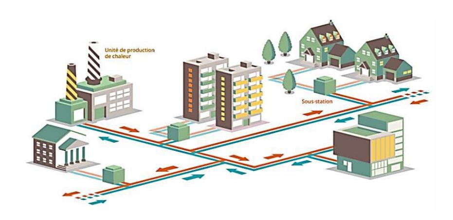

# **C. Éléments de correction**

## **Question 1 :**

| Sources d'énergie renouvelables                          | Disponibilité dans la durée                                                                                                                                                                                    | Emission à effet de serre                                                                                                                                                                                                | Stratégie d'approvisionnement national                                                                                                                                                                                                                                                                                                                       |
|----------------------------------------------------------------|-------------------------------------------------------------------------------------------------------------------------------------------------------------------------------------------------------------------|-----------------------------------------------------------------------------------------------------------------------------------------------------------------------------------------------------------------------------|--------------------------------------------------------------------------------------------------------------------------------------------------------------------------------------------------------------------------------------------------------------------------------------------------------------------------------------------------------------------|
| Biomasse Hydraulique Eolienne Solaire Géothermique | Presque infinie ou tout au moins disponible en quantité largement supérieure aux stocks fossiles. (150 ans charbon 60 ans gaz / uranium 50 ans pétrole). | Peu ou pas lors de l'utilisation. (Augmentation de la température moyenne dans le monde de 0.85°C en seulement 100 ans entraînant de forts dérèglements climatiques). | En croissance régulière depuis plusieurs années, les énergies renouvelables représentent 13,1 % de la consommation d'énergie primaire et 19,1 % de la consommation finale brute d'énergie en France en 2020. La France importe : 98,5% de son pétrole 98% de son gaz 100% de son charbon 100% de son uranium |

## **Question 2 :**

Pour assurer tous les besoins d'un pays (transports, habitat, industrie, agriculture), il faut un « bouquet » d'énergies primaires.

Le mix énergétique définit la répartition des différentes sources d['énergie](https://www.futura-sciences.com/planete/definitions/energie-renouvelable-energie-primaire-6933/)  [primaire](https://www.futura-sciences.com/planete/definitions/energie-renouvelable-energie-primaire-6933/) (nucléaire, [charbon,](https://www.futura-sciences.com/planete/definitions/developpement-durable-charbon-6636/) [pétrole,](https://www.futura-sciences.com/sciences/definitions/chimie-petrole-9749/) éolien, etc.) utilisées pour produire une énergie bien définie comme l'électricité. La part de chaque [source d'énergie primaire](https://www.futura-sciences.com/sciences/actualites/physique-biomasse-source-energie-disponible-afrique-6881/) est exprimée en pourcentage (%). Le mix énergétique, ou bouquet énergétique, peut être défini à différentes échelles : mondiale, nationale, régionale ou locale. Sa composition est liée à de nombreux facteurs, comme la croissance démographique de la zone ciblée, sa situation économique et sociale, son accès aux ressources primaires, etc.

#### **Quel mix énergétique en France pour l'avenir ? Le plan climat.**

Dans cette logique de miser sur des énergies d'avenir comme le solaire produit à partir de panneaux photovoltaïques plutôt que sur les énergies qui ont rythmé sa consommation passée, le gouvernement français a présenté une loi de transition énergétique en 2015. Celle-ci stipule que **la France se donne comme objectif de diviser par deux la consommation totale d'énergie du pays d'ici à 2050, de faire passer de 75 à 50 % la part d'électricité tirée du nucléaire d'ici à 2025 et d'augmenter dans le même temps la part des énergies renouvelables (éolien, biogaz, hydraulique, géothermie, etc.) à 32 %. Tout cela sans oublier de diminuer de 30 % le recours aux énergies fossiles en 2030.**

Grâce à cette transition énergétique, l'Hexagone pourrait bien aller jusqu'à s'affranchir de la fission nucléaire et des énergies fossiles, dans son mix énergétique dès le milieu du siècle. En effet, un scénario dévoilé en début d'année 2017 par l'association négaWatt, pilotée par une vingtaine d'experts indépendants, projette la mise en place d'un bouquet énergétique 100 % renouvelable à l'horizon 2050 pour la France. Tout reste à faire, mais cela montre en tout cas bien le fait que le territoire français se tourne de plus en plus vers les énergies vertes.

## **Question 3 :**

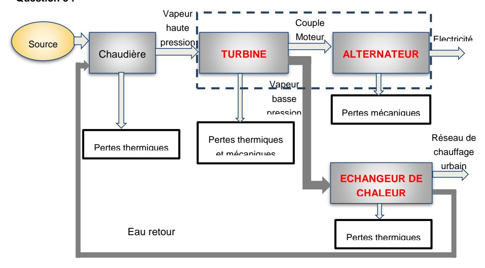

## **Question 4 :**

Rendement 1 en cogénération : 90/100 = 90 % Rendement 2 classique : 90/160 = 56 %

Une centrale en cogénération offre un rendement supérieur à une centrale classique.

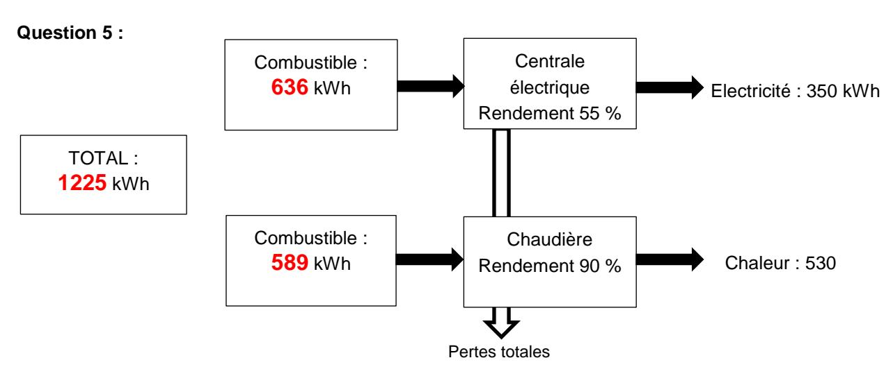

Economie d'énergie primaire : 1225-1000 = 225 kWhp

Exprimée par rapport à la consommation totale d'énergie primaire : 1225−1000 1225 = 18%

Exprimée par rapport à la consommation d'énergie primaire nécessaire pour la production d'électricité par une centrale TGV (turbine gaz vapeur) : 1225−1000 636 = 35%

(1225-1000) / 636 = 35%

## **Question 6 :**

880

Turbine à combustion : (1225 x 0,486) = 595,35 kg de CO2 Groupe de co-génération : (1000 x 0,352) = 352 kg de CO2

Pour 350 kWh d'électricité produite : Economie : 595,35-352 = 243,35 kg de CO2

Pour la production de 1MWh d'énergie produite par l'unité de cogénération l'économie en CO2 est de : 1000 × 243,35 = 276,53 kg de CO2/MWh

## **Question 7 :**

Cela correspond au meilleur choix car il y a :

- un meilleur rendement,
- moins de consommation d'énergie primaire,
- moins de pollution.

## **Question 8 :**

$$Ps = \left(\frac{T_S}{100}\right)^4 \mbox{ soit } Ts = 100 \ . \ \sqrt[4]{P_s} \ . \label{eq:ps}$$

Avec Ps = 12 bars, on a Ts = 186,12°C. Cela correspond à l'abaque qui indique une température de 187,96°C.

## **Question 9 :**

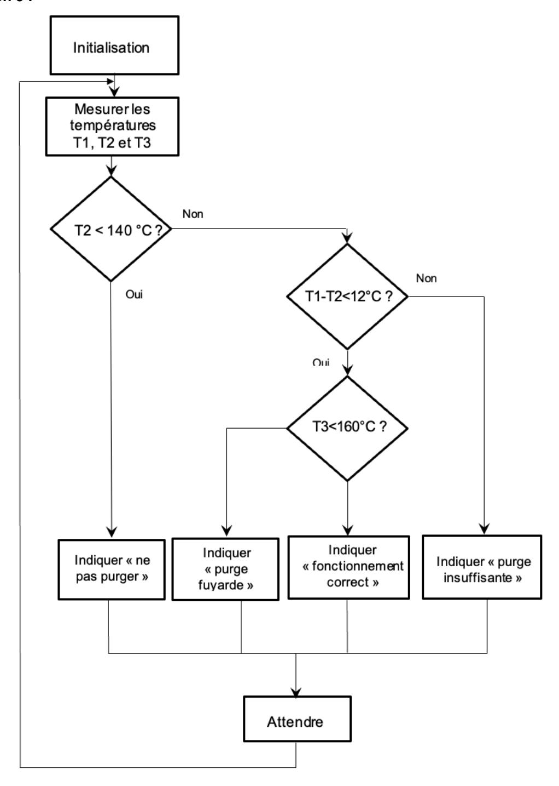

#### Question 10:

$$Q_P \times (T_{SAT} - T_M) + Q_R \times (T_R - T_M) = 0$$

$$\frac{Q_R}{Q_P} = \frac{(T_M - T_{SAT})}{(T_R - T_M)} = \frac{95 - 192}{65 - 95} = 3,23$$

#### Question 11:

 $Qm = 4 \cdot Ha \cdot S \cdot n$ 

- Ha = Qm / 4.S.n = 150 mm
- Rendement hydraulique= (11,2 x 36) / (367 x 2,8) = 39,2 %
- Rendement électrique = Pu / Pa = (2,2 / 2,8) = 78 %

#### Question 12:

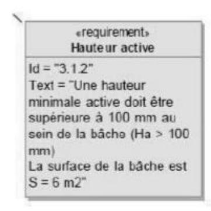

«requirement»

Evacuer les condensats par une ou des pompes

Id = "3.1.1"

Text = "Le rendement hydraulique de la pompe est au moins de 35 %. Le rendement électrique de la pompe est supérieur à 75 %"

Ha > 100 mm Rendement hydraulique > 35 % Rendement électrique > 75 %

D'après le diagramme sysml, les exigences sont respectées.

#### Question 13:

- Dans la solution conventionnelle, il est noté sur la documentation technique que la solution conventionnelle comporte un disjoncteur, un contacteur et un relais de protection. Avec le Tesys U, tout est en un (démarreur contrôleur), les fonctions présentes sont Protection magnétique, commande, surveillance d'état et protection thermique.
- Le module LUCA12BL car la tension de commande est 400 V, le courant circulant dans le moteur est bien inférieur à 12A et BL pour une alimentation continue de 24 V (voir schéma électrique).
- Le module TesysBL est U Lub 12 est configuré en mode Arrêt Standard car l'arrêt du moteur est géré à distance depuis un automate programmable en fonction des capteurs transmis.
- Le RM17 TG est un relais de contrôle de réseaux triphasés. Il surveille sur les réseaux triphasés l'ordre des phases L1, L2 et L3 ainsi que l'absence d'une ou plusieurs phases.

## **Question 14 :**

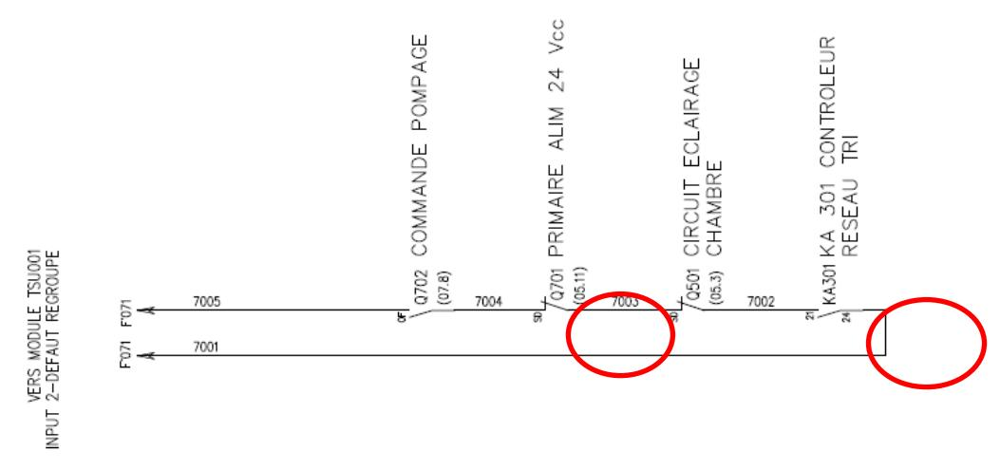

#### **Question 15 :**

Si un défaut est signalé par le contrôleur du réseau RM17 TG alors le contact KA301 se ferme et signale un défaut au TRT 200.Un prolongement trop long de ce défaut et les eaux sont évacuées vers les égouts avec la surveillance de la température de l'eau qui doit être inférieure à 30°C.

#### **Question 16 :**

D'après la documentation technique, le numéro de série est codé sur 48 bits (plus 2 familles : 18B20 et 18S20) donc 248 = 2,81 x 1014 par famille mais la température est la grandeur physique la plus mesurée au monde. Le CRC est utilisé pour vérifier l'intégrité lors de l'envoi de l'identifiant (numéro de série et famille). Le composant fait partie de la famille DS18B20 (code family 28 dans la documentation).

### **Question 17 :**

La variable Temp prend la valeur 0x0336 soit en binaire 0000 0011 0011 0110 ou 822 (en décimale). Il s'agit d'un décalage à gauche de l'octet 1 puis un OU logique avec l'octet 0. L'opération informatique est une concaténation. La température est codée sur 12 bits (byte 4 = 7F) et dans la documentation technique

| BIT 7 BIT 6 E | BIT 5 BIT 4 | BIT 3 | BIT 2 | BIT 1 | BIT 0 |
|---------------|-------------|-------|-------|-------|-------|
| 0 R1          | R0 1        | 1     | 1     | 1     | 1     |

| R1 | R0 | RESOLUTION (BITS) |         | VERSION ME          |
|----|----|----------------------|---------|------------------------|
| 0  | 0  | 9                    | 93.75ms | $(t_{CONV}/8)$         |
| 0  | 1  | 10                   | 187.5ms | (t conv /4) |
| 1  | 0  | 11                   | 375ms   | (t CONV /2) |
| 1  | 1  | 12                   | 750ms   | (t conv )   |

La valeur de la température est de 822/16 = 51,375°C ou 0000 0011 0011 0110 correspond à 0 pour le bit de signe (donc température positive) puis

2 5 x 1+ 24 x 1 +21 x 1 + 20 x 1 +2-2 x 1 + 2-3 x 1 = 32 + 16 + 2 + 1 +0,25 + 0,125 = 51,375 (nombre dyadique d'où la division par 16).

Le technicien peut intervenir en toute sécurité car la température est inférieure à 60°C. L'intervention devra par contre être très rapide (électronique modulaire).

### **Question 18 :**

SELECT PostePurge.NomPostePurge, CapteurTemperatureDS1820.NomCapteur, CapteurTemperatureDS1820.Date\_mesures, CapteurTemperatureDS1820.Localisation, CapteurTemperatureDS1820.ValeurTempérature FROM CapteurTemperatureDS1820 INNER JOIN PostePurge ON CapteurTemperatureDS1820.Identifiant = PostePurge.Id\_capteurs WHERE (((PostePurge.NomPostePurge) = " **PstPurge102**") **AND** ((CapteurTemperatureDS1820.Date\_mesures)='2021-03-23'));

### **Question 19 :**

|               | Module Peltier                                      | Turbine-Alternateur                                            | Panneaux photovoltaïques                                                                         |
|---------------|-----------------------------------------------------|----------------------------------------------------------------|-----------------------------------------------------------------------------------------------------|
| Avantages     | Pas de pièces tournantes. Energie disponible. | Puissance Supérieure aux autres solutions                   | Puissance importante. Renouvelable.                                                              |
| Inconvénients | Pas de grosses puissances.                       | Nécessité d'un alternateur et donc de pièces tournantes. | Ensoleillement minimal. Installation extérieure peu pratique. Encombrant. Risque de vol |

## **Question 20 :**

L'effet voulu dans l'application est l'effet SEEBECK car il est important de fournir une énergie électrique à partir de différence de température.

La tension sur la documentation technique du module Peltier est de 1,8 V pour une différence de température de 130 – 50 = 80°C. Le courant débité sera de 0,65 A. D'où une puissance utile de 1,17 W (0,65 x 1,8).

Le courant débité sera suffisant pour recharger les accumulateurs (150 mAh)

#### **Question 21 :**

D'un point de vue fonctionnel, c'est un convertisseur d'énergie électrique DC-DC. Il est qualifié de hacheur parallèle ou survolteur.

#### Question 22:

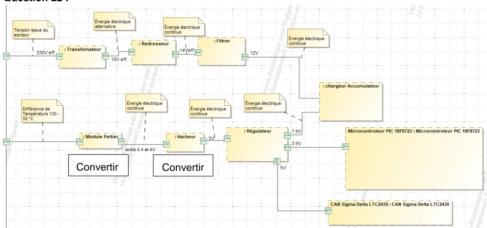

#### Question 23:

Sur la structure, 1 seul CAN (Convertisseur Analogique Numérique) est représenté et 16 entrées sont possibles (AN0 à AN15). Les entrées de sélection sont nommées CHS3 : CHS0. Cette structure est appelée multiplexage (4 entrées de sélection donc  $2^4 = 16$  entrées possibles). C'est un convertisseur 12 bits.

#### Question 24:

Les paramètres surveillés sont :

- ADC0 : Surveille la tension aux bornes des accumulateurs

- ADC1 : Surveille le courant de charge des accumulateurs

- ADC2 : Surveille la tension du module Peltier

Quantum = 
$$\frac{v_{REF+} - v_{REF-}}{2^{12} - 1} = \frac{3,5 - 0}{4095} = 0,85 \text{ mV / LSB}$$

Si  $U_{PELTIER}$  = 2V d'où la tension appliquée sur ADC2 = 2/2 = 1V (pont diviseur avec R4 et R5) d'où N =  $\frac{1}{q}$  =  $\frac{4095}{3.5}$  = 1170

ADC2 =  $175*\frac{3.5}{4095}$  = 0,15 V soit la tension aux bornes du Module Peltier 0,15\*2 = 0,3V donc inférieure au 0,4V minimum imposé sur le diagramme des exigences.

#### Question 25:

| U – 0 | U – 0 | R/W-0 | R/W-0 | R/W-0 | R/W-0 | R/W-0   | R/W-0 |
|-------|-------|-------|-------|-------|-------|---------|-------|
| -     | -     | CHS3  | CHS2  | CHS1  | CHS0  | GO-DONE | ADON  |
| 0     | _     | _     | _     |       |       | 4       |       |
| 0     | 0     | 0     | 0     | 1     | 0     | 1       | 1     |

L'entrée ADC2 est appliquée\_sur l'entrée AN2 donc CHS3 : CHS0 = 0010. ADON doit être à 1 pour que le CAN soit activé et GO/DONE pendant la conversion est à 1.

ADCON0 = 0000 1011 soit 0x0B

#### Question 26:

Lorsque les accumulateurs sont en charge, le courant de charge circule de la borne + vers la borne - des accumulateurs. R0 est une résistance de shunt. On récupère une tension image du courant de charge.

#### Question 27:

Lorsque les accumulateurs sont en charge, le courant de charge circule de la borne + vers la borne des accumulateurs. La diode est ainsi bloquée. Lorsque les accumulateurs débitent vers le système le courant change de sens induisant une tension négative qui peut être nuisible pour l'entrée du CAN. La diode devient ainsi passante ( $V_{AK} > 0,6V$ ). La tension ainsi appliquée sur l'entrée du CAN et ne pourra dépasser -0,6V.

#### Question 28:

La bande de fréquence utilisée pour le LoraWan en Europe est 868 MHz.

#### Question 29:

$$R_b = \frac{SF*BW*CR}{2^{SF}}$$
 $R_b = \frac{12*125.1000*4/5}{2^{12}} = 293 \text{ bits/s}$ 

C'est une valeur faible qui permet d'obtenir des dépenses d'énergie faible lors d'envoi de données. Il est parfait pour des applications pour des systèmes peu rapides (IOT)

#### Question 30:

Pour calculer la valeur à la sortie du CAN, on se sert de  $T_X = 12,176 \text{ ms} = \frac{4096 - N}{4096} * T_S \text{ avec } T_S = 2^{12}/125 \text{ kHz}$  (durée d'un symbole).

Donc N = 
$$(1 - \frac{Tx*BW}{2^{12}})*2^{12} = (1 - \frac{12,176.10^{-3}*125.10^{3}}{4096})*4 096 = 2574$$

Quantum = 
$$\frac{v_{REF+} - v_{REF-}}{2^{12} - 1} = \frac{3,5 - 0}{4095} = 0,85 \text{ mV / LSB}$$

Donc  $U_{ADC}$  (tension appliquée sur le CAN) =  $\frac{2574*3,5}{4095}$  = 2,2 V soit la tension aux bornes du module Peltier de 4,4 V (2,2\*2 en tenant compte du pont diviseur).

#### Question 31:

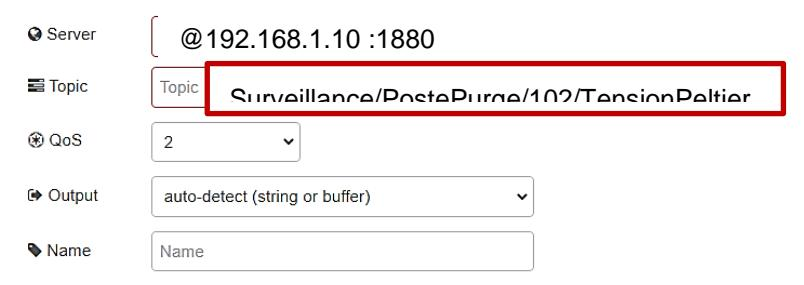

#### Question 32:

Oui elle est compatible car elle doit être comprise entre 4 V et 0,9 V (diagramme sysml)

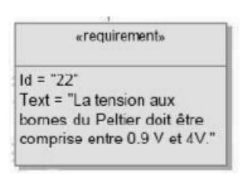

# **D. Commentaires du jury**

## **Présentation du sujet**

Le sujet se base sur l'étude du principe d'un réseau de chaleur urbain permettant le chauffage collectif à l'échelle d'une grande ville européenne ou d'un quartier. La problématique est de réaliser la production et le transport de la vapeur au sein d'un réseau de chaleur en toute sécurité tout en respectant les engagements du plan Climat. Les questions sont réparties en cinq parties indépendantes.

La première partie consiste à déterminer comment améliorer le rendement de production d'énergie en comparant les rendements avec une centrale en cogénération après avoir dressé un rapide bilan sur la nécessité de choix des énergies renouvelables. Les parties suivantes permettent de déterminer comment transporter la chaleur en toute sécurité en réduisant les pertes thermiques. Ce transport s'accompagne d'une surveillance et d'une maintenance des postes de purges qui nécessitent l'intervention en toute sécurité d'un technicien de maintenance. Il faudra alors alimenter en énergie électrique ces systèmes de surveillance dans les postes de purge afin de permettre une purge correcte et un envoi des données sur les paramètres du réseau en minimisant la consommation de l'énergie électrique.

#### **Analyse des résultats**

Grâce aux cinq parties qui composent le sujet, les différents champs des sciences industrielles de l'ingénieur sont abordés. Le jury constate que la plupart des candidats abordent les différentes parties de manière linéaire. La longueur du sujet permettait à tous les candidats de traiter toutes les parties dans l'ordre de leur choix. Le jury regrette qu'aucun candidat n'ait abordé toutes les parties. Les sujets sont construits pour permettre une entrée progressive dans les problématiques traitées. Le fait de ne pas savoir répondre à une question ne remet pas en cause la possibilité de répondre aux questions suivantes de cette même partie.

De nombreuses réponses n'ont pas été justifiées ou reprennent sans aucune explication des données issues de documentations techniques fournies. Le jury regrette qu'une part importante de candidat ne semble pas maitriser les bases fondamentales de l'ingénierie électrique et de la programmation. L'exploitation de documents techniques pour la réalisation de schémas électriques est attendu d'un candidat au CAPET.

Il est attendu d'un candidat au CAPET une rédaction claire et organisée. Ceci est particulièrement vrai lorsqu'on souhaite détailler un raisonnement scientifique. De trop nombreuses copies sont présentées de manière non satisfaisante. Les candidats doivent impérativement faire des efforts pour proposer une copie propre et lisible.

#### **Commentaires sur les réponses apportées et conseils aux futurs candidats**

La première partie a été correctement traitée par environ la moitié des candidats.

La seconde partie a été globalement bien traitée par une part importante de candidats. La lecture des diagrammes SYSML et l'utilisation de formules fournies sont globalement maitrisées. Une part importante de candidats ne parvient toutefois pas à calculer un rendement électrique, notion pourtant fondamentale pour cette spécialité du CAPET. Le jury regrette également le faible nombre de candidats qui apporter des justifications aux calculs effectués. La mise en concordance des différents documents constructeurs et des schémas électriques n'a pas été réussie pour une part importante des candidats. La lecture et la réalisation de schémas électriques est un attendu fondamental d'un candidat au CAPET.

.

La troisième partie a été globalement réussie par les candidats qui l'ont traitée. Le jury déplore néanmoins la méconnaissance de notions élémentaires de nombreux candidats. Peu de candidats sont capables de définir le rôle du CRC. Le micro-python tout comme les requêtes SQL ne sont pas maîtrisés. Le jury invite les candidats à acquérir ces notions incontournables dans la pratique de leur futur métier d'enseignant.

La quatrième partie n'a été traitée que par peu de candidats. Le jury constate que la lecture de courbes et le calcul de grandeurs électriques élémentaires sont bien maitrisées par les candidats ayant abordé cette partie. Le jury regrette toutefois qu'une part importante de candidats ne parviennent pas à caractériser des constituants électriques ou à identifier le rôle de ces constituants dans une chaîne de puissance. Le jury constate également qu'un nombre significatif de candidats ne parvient pas à appréhender ni le fonctionnement d'un convertisseur analogique numérique ni le rôle des composants électroniques qui y sont associés. Une maitrise de ces concepts fondamentaux de l'ingénierie électrique est attendue d'un candidat au CAPET.

La dernière partie portait sur l'étude d'un système de transmission des données de surveillance. Les premières questions abordaient de la lecture de documents ainsi que des applications numériques. Ces questions ont été globalement bien réussies par les candidats les ayant traitées. Le jury regrette que le décodage du symbole n'ait été traité que par un nombre restreint de candidats. Le jury recommande aux futurs candidats d'acquérir une connaissance des technologies liées à l'internet des objets, domaine qu'ils devront aborder dans la pratique de leur futur métier d'enseignant.

# **E. Résultats**

Les statistiques générales pour cette épreuve sont données ci-dessous.

|                  | CAPET (public) | CAFEP (privé) |
|------------------|----------------|---------------|
| Nombre de copies | 72             | 23            |
| Moyenne          | 8,27           | 9,39          |
| Note maximum     | 17,3           | 16,3          |
| Écart type       | 3              | 2,5           |

# **Épreuve écrite disciplinaire appliquée**

# **A. Présentation de l'épreuve**

 Durée : 5 heures Coefficient 2

L'épreuve, commune à toutes les options, porte sur l'analyse et l'exploitation pédagogique d'un système pluri-technologique. Elle invite le candidat à la conception d'une séquence d'enseignement, à partir d'une problématique et d'un cahier des charges.

L'épreuve permet de vérifier :

- que le candidat est capable de mobiliser ses connaissances scientifiques et technologiques pour conduire une analyse systémique, élaborer et exploiter les modèles de comportement permettant de quantifier les performances d'un système pluri-technologique des points de vue de la matière, de l'énergie et/ou de l'information, afin de valider tout ou partie de la réponse au besoin exprimé par un cahier des charges ;
- qu'il est capable d'élaborer tout ou partie de l'organisation d'une séquence pédagogique ainsi que les documents techniques et pédagogiques associés (documents professeurs, documents fournis aux élèves, éléments d'évaluation).

Les productions pédagogiques attendues sont relatives à une séquence d'enseignement portant sur les programmes de collège ou de lycée.

L'épreuve est notée sur 20. Une note globale égale ou inférieure à 5 est éliminatoire.

# **B. Sujet**

Le sujet est disponible en téléchargement sur le site du ministère à l'adresse : [https://media.devenirenseignant.gouv.fr/file/capet\\_externe/87/0/s2022\\_capet\\_externe\\_sii\\_2\\_1424870.](https://media.devenirenseignant.gouv.fr/file/capet_externe/87/0/s2022_capet_externe_sii_2_1424870.pdf) [pdf](https://media.devenirenseignant.gouv.fr/file/capet_externe/87/0/s2022_capet_externe_sii_2_1424870.pdf)

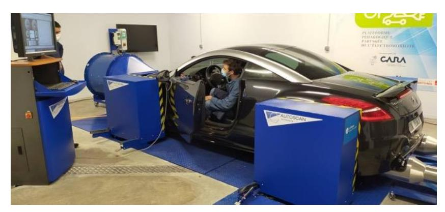

Ce sujet met en situation un professeur, ou une professeure, de sciences industrielles de I'ingénieur (SII) dans un lycée général et technologique. Une partie de son service est donnée dans une classe de première STI2D de 32 élèves en spécialités ingénierie et développement durable (I2D) et innovation technologique (IT).

La société Rotronics développe et commercialise des bancs d'essai à rouleaux : AutoScan Fi. Les concepteurs ont cherché à fournir à leurs clients un produit pouvant reproduire en atelier des conditions équivalentes à un contexte normal. L'intérêt est la reproductibilité du cycle. L'utilisateur va pouvoir modifier, comme il le souhaite, des paramètres ou des éléments de son véhicule et tester rapidement le gain de puissance ou l'évolution des émissions qu'il obtient.

Le banc est équipé de quatre rouleaux sur lesquels reposent les quatre roues du véhicule testé. Ces rouleaux sont raccordés deux à deux par un axe, à l'avant et à l'arrière. Ces axes qui tournent à la même vitesse sont mis en rotation par une courroie à tension réglable afin d'adapter l'écartement entre les rouleaux avant et arrière à la taille du véhicule étudié. Une machine électrique entraîne la courroie.

# **C. Éléments de correction**

## **Question 1.**

Objectifs de formation :

- O1 Caractériser des produits ou des constituants privilégiant un usage raisonné du point de vue développement durable
- O5 Imaginer une solution, répondre à un besoin
- O7 Expérimenter et réaliser des prototypes ou des maquettes

#### Compétences :

- CO7.2 : Mettre en œuvre un scénario de validation devant intégrer un protocole d'essais, de mesures et/ou d'observations sur le prototype ou la maquette, interpréter les résultats et qualifier le produit
- Identifier et justifier un problème technique à partir de l'analyse globale d'un produit (approche matière – énergie – information)
- CO1.1. Justifier les choix des structures matérielles et/ou logicielles d'un produit, identifier les flux mis en œuvre dans une approche de développement durable
- CO1.2. Justifier le choix d'une solution selon des contraintes d'ergonomie et de design
- Peuvent également être citées : CO3.1, CO3.2, C03.4, CO4.1, CO4.2, CO5.3 pour le thème « 2. Approche fonctionnelle et structurelle des produits ».

#### Connaissance :

1.1.2 communication technique

**Question 2.** IT, niveau taxonomique 2

#### **Question 3.**

L'exigence 1.3 comporte 4 sous-exigence :

- - 1 .3.1 : véhicule immobile pendant l'essai ;
- - 1.3.2 : vibrations et nuisances sonores limitées ;
- - 1.3.3 : arrêt du véhicule en moins d'une minute en cas de défaillance ;
- - 1.3.4 : extraction des gaz d'échappement.

#### Exemple de questionnement :

- 1- Lire le diagramme des exigences et citer les 4 exigences principales ;
- 2- Dire quels sont les points de vigilance pour la sécurité des utilisateurs ;
- 3- Sur la figure 2, relever les systèmes de sécurité mis en place.

**Question 4.** Une salle de classe ne devrait pas recevoir plus de 35dB < 60dB qui correspond à un bruit courant en ville.

**Question 5.** Ce sont les bruits d'une voiture ou d'un véhicule, donc bruit routier.

**Question 6.** Par lecture graphique : R = 35dB.

Intensité du son perçu : I = 92 - 35 = 57 dB.

57 dB est assez proche des 60 dB mesurés dans la salle. La différence peut venir d'une imperfection dans la cloison ou de la liaison avec le plafond ou d'un pont phonique (trou…)

**Question 7.** Il faut passer de 57 dB à 35 dB (ou de 60dB à 35 dB si les données expérimentales sont utilisées). Il faut donc réduire encore de 57 – 35 = 22 dB (ou 25dB). Sur la figure 21, avec carreaux de plâtre, seule la 3e colonne (la plus performante) avec une atténuation de 26 dB permet d'atteindre l'objectif.

**Question 8.** L'isolation de la paroi ne suffit pas à freiner les bruits aériens si on ne tient pas compte des ponts acoustiques : trous, fourreaux électriques dans le mur, liaisons basse ou haute ; des bruits d'impacts par le sol…

**Question 9.** Exemple de problématique : comment choisir la bonne épaisseur d'un matériau isolant acoustique ?

Attendus : les élèves font l'essai avec 3 matériaux de même épaisseur et constatent des affaiblissements différents. Puis ils étudient 3 épaisseurs différentes d'un même matériau. Ils doivent en déduire que c'est la masse surfacique qui compte.

**Question 10.** 
$$\omega_{pneu} = \omega_m \times \frac{\omega_e}{\omega_m} \times \frac{\omega_s}{\omega_e} \times \frac{\omega_{pneu}}{\omega_s} = \frac{N_m \times 2\pi}{60} \times 1 \times k_v \times k_p = 21,32 \text{ rad} \cdot \text{s}^{-1}$$

**Question 11.** 
$$\omega_r = \omega_{pneu} \times \frac{d_p}{d_r} = 23,76 \text{ rad} \cdot \text{s}^{-1}$$

Question 12. 
$$\|\vec{N}(\text{roul}\rightarrow\text{pneu})\| = \frac{\text{masse} \times g}{4} = 3,43 \text{ kN}$$

Question 13. 
$$\|\vec{T}(\text{roul}\rightarrow\text{pneu})\|_{\text{max}} = f_a \times N = 3,77 \text{ kN}$$

**Question 14.** 
$$P_{roue} = \eta \times P_{m}$$

$$\begin{split} F_{tmax} \times V &= \eta \times C_{max} \times \omega_m & \text{avec V la vitesse du point M}: \quad V &= \frac{d_p}{2} \times \omega_{pneu} \\ F_{tmax} &= \frac{2 \times \eta \times C_{max}}{d_p} \times \frac{\omega_m}{\omega_{pneu}} \\ \frac{\omega_m}{\omega_{pneu}} &= \frac{1}{1 \times k_v \times k_p} & \text{(résultat obtenu à la question 10)} \\ F_{tmax} &= \frac{2 \times \eta \times C_{max}}{d_p} \times \frac{1}{1 \times k_v \times k_p} \end{split}$$

**Question 15.** Cmax = 350 N⋅m

| Rapport engagé | 𝐹𝑡𝑚𝑎𝑥    |
|----------------|----------|
| er 1        | 12,34 kN |
| 2 e         | 6,44 kN  |
| 3 e         | 4,05 kN  |
| 4 e         | 2,87 kN  |
| 5 e         | 2,34 kN  |
| 6 e         | 1,93 kN  |

**Question 16.** Pour garantir l'absence de glissement il faut engager le rapport 4, 5 ou 6.

**Question 17.** Il y a beaucoup de similitudes entre ce système didactisé et le banc. C'est une maquette simplifiée du système réel. L'objectif de cette partie, vérifier le non glissement entre les rouleaux et les pneus, semble délicat à mettre œuvre sur le système didactisé, il n'y a pas autant de capteurs. En revanche, il est possible de faire un bilan de puissance sur la chaine de puissance.

**Question 18.** Exemple 1 : Mesure du rendement de la chaîne de puissance : On relève la puissance en sortie de batterie, mesure tension et courant. On relève la puissance dissipée par le frein, vitesse et couple. Pour le couple, on peut mesurer la force exercée par le patin de freinage et en déduire la force tangentielle et donc le couple. Enfin, on calcule le rendement de la chaîne pour la comparer avec le cahier des charges ou les données du constructeur du système.

Exemple 2 : Analyse de la chaîne de puissance : Identifier les constituants de la chaîne de puissance dans un modèle multiphysique (Matlab ou Scilab). Modifier les valeurs des blocs du modèle en utilisant la documentation du constructeur des constituants (valeur de résistance, inductance, rapport de réduction…)

**Question 19.** Exemple 1 : Séquence 8 pour la compétence CO7.2 Mettre en œuvre un scénario de validation devant intégrer un protocole d'essais, de mesures et/ou d'observations sur le prototype ou la maquette, interpréter les résultats et qualifier le produit.

Exemple 2 : Séquence 7 pour la compétence CO6.2 Identifier et régler des variables et des paramètres internes et externes utiles à une simulation mobilisant une modélisation multiphysique.

## **Question 20.**

d = 6379137\*acos(sin(latA)\*sin(latB)+cos(latA)\*cos(latB)\*cos(lonB-lonA))

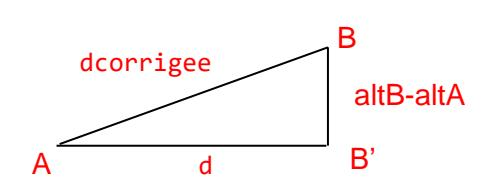

**Question 21.**

dcorrigee = 
$$\sqrt{AB^2 + BB^2}$$
  
dcorrigee =  $\sqrt{d^2 + (altB - altA)^2}$   
dcorrigee =  $sqrt(d^{**}2 + (altB - altA)^{**}2)$ 

**Question 22.**

$$\beta = \arctan\left(\frac{BB'}{AB'}\right) \qquad \text{ou} \qquad \beta = \arccos\left(\frac{AB'}{AB}\right)$$
 elevation = atan((altB-altA)/d) ou elevation = acos(d/dcorrigee)

**Question 23.** L'algorithmique et le python se limitent à un niveau taxonomique 2, soit la lecture.

- 1 : Identifier les lignes du code informatique correspondant au sous-programme « Calcul de distance et elevation entre 2 points » (ou un autre sous-programme)
- 2 : Donner le nom de la fonction associer au sous-programme « calcul de distance et elevation entre 2 points ».
- 3 : Donner le nom de la structure particulière présente dans le sous-programme « calcul des listes distance et elevation ».
- 4 : Identifier les lignes de code correspondant à la boucle dans le code python.
- 5 : Déterminer le nombre d'itérations de la boucle for.
- 6 : Donner le théorème mathématique utilisé pour calculer dcorrigee
- 7 : Identifier les variables calculées par le sous-programme « Calcul de distance et elevation entre 2 points » (ou un autre sous-programme)
- 8 : Identifier les lignes de code informatique correspondant à la phase d'initialisation du sousprogramme « Calcul des listes distance et elevation »
- 9 : Dans le programme principal de l'algorigramme, comment peut-on identifier un sous-programme ? Quel mot clé en python permet de décrire ces sous-programmes ?

**Question 24.** Évaluation formative. Sous la forme d'une activité élève sur papier ou ordinateur avec intervention de l'enseignant pour aider les élèves.

Évaluation sommative possible à l'écrit mais moins pertinente

**Question 25.** Tension nominale = 192 V

Courant nominal = 19 A

**Question 26.** La vitesse de rotation du frein et le temps influence le couple de freinage. Ces deux paramètres peuvent être considérés comme des perturbations pour le contrôle du couple appliqué au véhicule. Il faut donc asservir cette grandeur.

**Question 27.** La précision a été améliorée. Pour une consigne à 750 N⋅m, la valeur finale passe de 742 N⋅m à 749 N⋅m en augmentant le gain du correcteur.

**Question 28.** On attend une erreur statique nulle, ce correcteur avec ces réglages ne convient pas.

**Question 29.** La précision et la rapidité ont été améliorées. Les critères du cahier des charges sont respectés.

**Question 30.** Pour faire varier le couple, il faudra faire varier le courant, d'où la structure de hacheur. On a besoin d'inverser le courant pour démagnétiser, pour ce faire, il faudra inverser la tension d'alimentation. Il faut donc un hacheur réversible en tension et en courant, d'où le hacheur 4Q.

### **Question 31.**

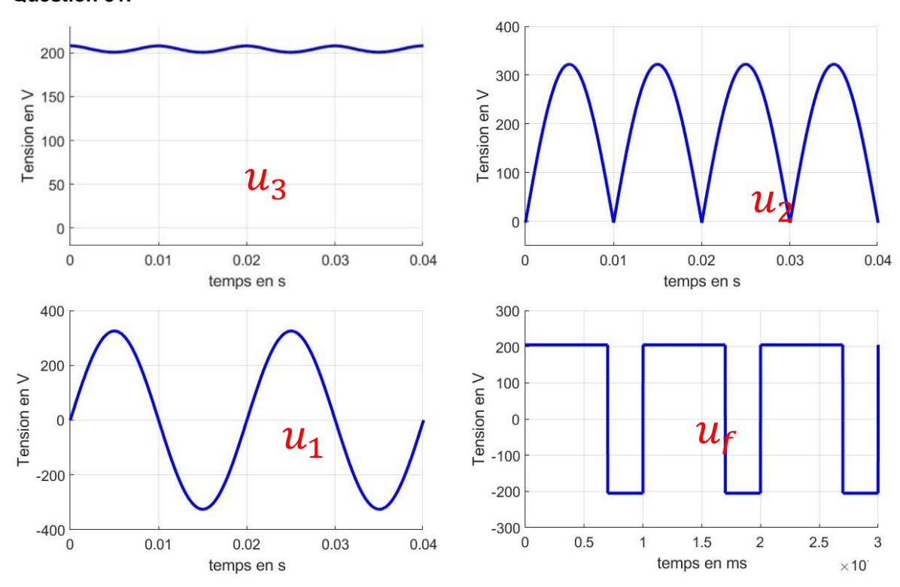

#### Question 32.

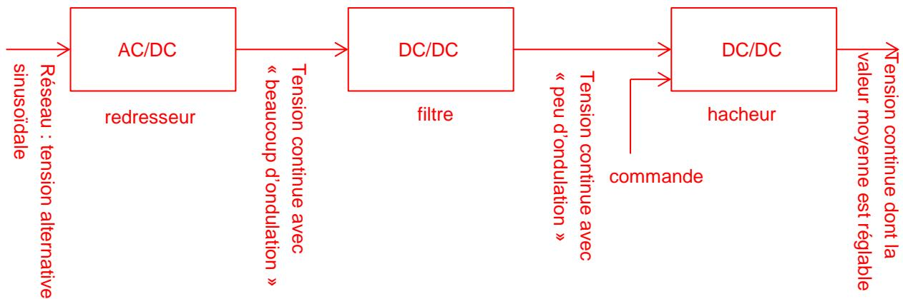

#### Question 33. Loi des mailles :

$$u_f(t) = L_f \times \frac{di_f(t)}{dt} + R_f \times i_f(t)$$

#### Question 34.

$$\begin{split} &<\!\!u_f(t)\!\!> = <\!\!L_f \times \frac{di_f(t)}{dt} + R_f \times i_f(t)\!\!> \\ &<\!\!u_f(t)\!\!> = L_f \times <\!\!\frac{di_f(t)}{dt}\!\!> + R_f \times <\!\!i_f(t)\!\!> \\ &<\!\!\frac{di_f(t)}{dt}\!\!> = \frac{1}{T} \times \int_0^T \!\!\frac{di_f(t)}{dt} \,dt = \frac{1}{T} \times \left[i_f(t)\right]_0^T = \frac{1}{T} \times \left(i_f(T) - i_f(0)\right) \\ &i_f(T) - i_f(0) = 0 \text{ car } i_f(t) \text{ est p\'eriodique, ainsi :} \\ &<\!\!u_f(t) > = R_f \times <\!\!i_f(t)> \end{split}$$

#### Question 35.

$$< u_f(t) > = \frac{1}{T} \times \int_0^T u_f(t) dt = \frac{1}{T} \times (E \times \alpha \times T - E \times (1 - \alpha \times T)) = E \times (2 \times \alpha - 1)$$

#### Question 36.

$$< u_f(t) > = E \times (2 \times \alpha - 1)$$
  
 $\alpha = \frac{1}{2} \times \left(\frac{< u_f(t) >}{E} + 1\right) = \frac{1}{2} \times \left(\frac{192}{207} + 1\right) = 0,96$ 

**Question 37.** Le hacheur permet de couvrir toute la plage de tension jusqu'à la valeur nominale du frein, on contrôle donc le courant dans le frein et par conséquent le couple aussi.

Ce contrôle se fait précisément et rapidement (réglage du correcteur), on peut donc imposer au véhicule une charge qui sera l'image d'un environnement réel ; une pente, une descente, du vent ...

#### Question 38. En phase d'accélération :

- L'action de la pesanteur sur le véhicule
- L'action des quatre rouleaux sur les roues
- L'action des sangles sur le véhicule

Les sangles souples ne peuvent travailler qu'en traction. Seules les sangles situées à l'arrière du véhicule sont donc sollicitées en phase d'accélération.

## **Question 39.**

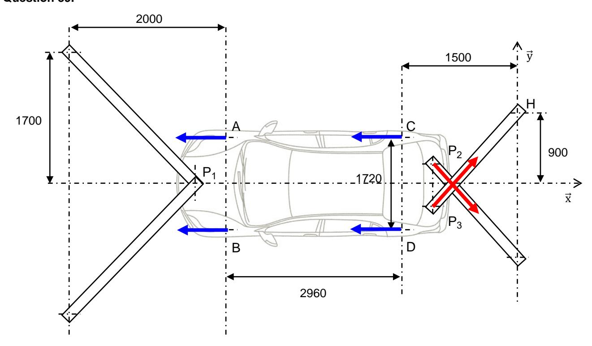

**Question 40.** Le problème est statiquement plan et symétrique.

Les sangles ne pouvant travailler en compression, seules les sangles arrière exercent une force ici. L'équation des résultantes sur x⃗ s'écrit alors :

$$4 \times T$$
(roue→rouleau) -  $2 \times F$ (sangle→véhicule) × cos α = 0

Où α est l'angle formé entre la sangle et l'axe x⃗ . Une étude de la géométrie donne :

$$\tan\alpha = \frac{1250}{920}$$

Finalement :

$$F(\text{sangle} \rightarrow \text{v\'ehicule}) = \frac{2 \times T(\text{roue} \rightarrow \text{rouleau})}{\cos\left(\arctan\left(\frac{1250}{920}\right)\right)} = 20,2 \text{ kN}$$

**Question 41.** La tension directe dans la sangle est de 2020 daN. Le système d'arrimage LC2500 présentant une tension maximale d'utilisation de 2500 daN est le plus adapté.

**Question 42.** O7 donne 6.2 « expérimentations et essais » niveau 3 sur « protocole d'essai et sécurité de mise en œuvre », mais lien nécessaire avec **3.2.3 Concept de résistance.**

## **Essais en I2D niveau 3**

**Question 43.** Problématique : comment vérifier la résistance d'un matériau à la traction ? On donne au groupe d'élèves une machine de traction et 3 éprouvettes de matériaux différents (exemple : alu, acier et plastique). Ils effectuent les essais normalisés en toute sécurité après en avoir défini le protocole. Ils tracent les courbes force/allongement et les comparent.

**Question 44.** Ce frein s'actionne (freine) lorsqu'il n'est pas alimenté. Il garantit la sécurité des utilisateurs lors d'une panne d'électricité.

**Question 45.** dS = r × dr × dθ

**Question 46.** dF⃗ se décompose en un effort normal dN sur x⃗ et un effort tangentiel dT s'opposant à la vitesse de glissement du disque par rapport garniture, c'est-à-dire porté par e⃗ θ .

*Remarque : selon la garniture considérée, l'effort sur x*⃗ *est positif ou négatif.*

À la limite du glissement, les lois de Coulomb donne la relation : dT = f3 dN.

Par ailleurs, px étant supposée constante, dN = - px × dS = - px × r × dr × dθ

Alors : dF⃗ = dN x⃗ - f3 × dN e⃗ θ

**Question 47.** En calculant l'intégrale donnée dans le sujet :

$$C_f = 2 \times f_3 \times p_x \times \int_{R_i}^{R_i + h} r^2 dr \times \int_{-\alpha}^{\alpha} d\theta = 2 \times f_3 \times p_x \times \frac{1}{3} \times \left[ (R_i + h)^3 - R_i^3 \right] \times 2 \times \alpha$$

$$C_f = \frac{4}{3} \times f_3 \times p_x \times \left[ (R_i + h)^3 - R_i^3 \right] \times \alpha$$

**Question 48.** En exploitant la formule donnée :

$$F_{x} = \frac{C_{f}}{\frac{4}{3} \times f_{3} \times \frac{(R_{i} + h)^{3} - R_{i}^{3}}{(R_{i} + h)^{2} - R_{i}^{2}}} = \frac{3 \times 530 \times 10^{3} \times \left( (180 + 45)^{2} - 180^{2} \right)}{4 \times 0.5 \times \left( (180 + 45)^{3} - 180^{3} \right)} = 2600 \text{ N}$$

### **Question 49.** Exemple parmi d'autres :

- 1- Expliquer le fonctionnement du frein lorsqu'il n'y a plus d'air sous pression.
- 2- Quelle est la liaison en O ?
- 3- Quelle est la liaison en A ?
- 4- Quelle est la liaison entre le piston et le cylindre ?
- 5- À combien de forces est soumise la pièce 2 ?
- 6- Que peut-on en déduire ?

Compétences : CO3.3 Identifier et caractériser le fonctionnement temporel d'un produit ou d'un processus, CO6.1. Expliquer des éléments d'une modélisation multiphysique proposée relative au comportement de tout ou partie d'un produit, CO5.7. Définir la structure matérielle, la constitution d'un produit en fonction des caractéristiques technico-économiques et environnementales attendues On peut aussi citer le PFS (3.2.3 concept de résistance)

**Question 50.** R⃗⃗ (ressort→1) = - k × λ ⃗y

**Question 51.** Bilan des actions mécaniques extérieures :

- Action du ressort, de résultante : R⃗⃗ (ressort→1) = k × λ ⃗y
- Action de 2 sur 1 transmise par la liaison sphère-plan, de résultante R⃗⃗ (2→1) = Y21 ⃗y 2
- Action de 0 sur 1 transmise par la liaison pivot-glissant, de résultante R⃗⃗ (0→1) = X01 x⃗ + Z01 ⃗z

L'équation des résultantes sur y⃗ donne :

$$-k \times \lambda + Y_{21} \times \cos \theta_{20} = 0$$

Finalement :

$$\vec{R}(2 \rightarrow 1) = \frac{k \times \lambda}{\cos \theta_{20}} \vec{y}_2$$

**Question 52.** Bilpan des actions mécaniques extérieures (problème plan) :

- Action de 1 sur 2 transmise par la liaison sphère-plan, de résultante R⃗⃗ (1→2) = R⃗⃗ (2→1)
- Action de 0 sur 1 transmise par la liaison pivot de résultante : R⃗⃗ (0→2) = X02 x⃗ + Z02 ⃗z
- Action de la garniture sur 2, de résultante : R⃗⃗ (garniture→2) = Fx x⃗

Au point O, la liaison pivot de 0 sur 1 ne transmet pas de moment. On peut alors exploiter l'équation des moments en ce point pour trouver la relation recherchée.

$$\overrightarrow{R}(1\rightarrow 2) \land \overrightarrow{AO} + \overrightarrow{R}(garniture \rightarrow 2) \land \overrightarrow{BO} = \overrightarrow{0}$$

$$\Rightarrow \frac{k \times \lambda}{\cos \theta_{20}} \vec{y}_{2} \wedge (-x_{A} \vec{x} - (y_{A} - \lambda) \vec{y}) + F_{x} \vec{x} \wedge (-x_{B} \vec{x}_{2} + y_{B} \vec{y}_{2}) = \vec{0}$$

$$\Rightarrow -\frac{k \times \lambda \times (x_{A} \times \cos \theta_{20} + (y_{A} - \lambda) \times \sin \theta_{20})}{\cos \theta_{20}} + F_{x} \times (-x_{B} \times \sin \theta_{20} + y_{B} \times \cos \theta_{20}) = 0$$

$$\Rightarrow F_{x} = \frac{k \times \lambda \times (x_{A} + (y_{A} - \lambda) \times \tan \theta_{20})}{-x_{B} \times \sin \theta_{20} + y_{B} \times \cos \theta_{20}}$$

## **Question 53.**

$$k = \frac{-x_{B} \times \sin \theta_{20} + y_{B} \times \cos \theta_{20}}{\lambda \times (x_{A} + (y_{A} - \lambda) \times \tan \theta_{20})} \times F_{x}$$

$$k = \frac{-87 \times \sin(13^{\circ}) + 54 \times \cos(13^{\circ})}{10 \times (40 + (15 - 10) \times \tan(13^{\circ}))} \times 2600 = 209 \text{ N} \cdot \text{mm}^{-1}$$

**Question 54.** Les principales exigences du diagramme sont respectées (frein à disque, frein à courant de Foucault, sangles, extraction des fumées, protection des parties tournantes…). Il faut veiller au bruit (bouchons d'oreille). Son prix en limite toutefois l'implantation.

**Question 55.** Utilisable aves des étudiants de BTS mais pas avec des lycéens : pilotage d'une voiture (permis), mise en place longue, certaines notions hors programme.

Mais en exploitation ponctuelles (TD, TP, devoirs, …) ou en mini-projet peut être utile si lié à une visite du site par les élèves. Lien avec concours de voiture type F2000.

# **D. Commentaires du jury**

Grâce aux six parties qui composent le sujet, les différents champs des sciences industrielles de l'ingénieur sont abordés. Le jury constate que les candidats ont trop tendance à traiter le sujet chronologiquement, à buter sur les questions qu'ils trouvent difficiles, et à ne pas avancer plus loin pour trouver des parties plus abordables.

Comme les élèves, ils doivent apprendre à lire tout le sujet pour repérer les parties « plus faciles » pour eux, d'autant plus qu'elles étaient toutes indépendantes les unes des autres.

Au niveau des résultats par parties, on constate que la valence des candidats est encore très visible, même si on peut déplorer que certains d'entre eux n'ont pas traité les parties pourtant en rapport direct avec elle.

Les questions pédagogiques sont bien abordées mais les réponses montrent une grande méconnaissance des programmes et des méthodes pédagogiques et didactiques usuelles. Ainsi, certains confondent IT et ITEC, ne connaissent pas la différence entre IT et I2D en première, confondent compétences et connaissances, ne connaissent pas la différence entre séquence et séance ou entre les différentes formes d'évaluation. Le fait que ces questions soient distillées au fil de l'eau n'a pas gêné les candidats mais au contraire leur a permis de contextualiser les notions abordées.

# Partie 1. Mise en situation

Cette partie est constituée par trois questions pédagogiques, majoritairement bien traitée par les candidats, qui maitrisent la lecture des diagrammes SYSML, mais pas forcément les programmes de STI2D.

## Partie 2. Isolation acoustique des parois

Six questions à caractère essentiellement IC dont une pédagogique. Certains candidats IC ne l'ont pas abordée alors que cette partie était faisable même sans aucune connaissance spécifique, simplement avec du bon sens.

## Partie 3. Vérification du bon déroulement d'un essai

Dix questions à caractère essentiellement « mécanique » dont trois pédagogiques. Les candidats IM s'en sortent mieux que les autres mais les résultats interpellent sur le niveau sur les fondamentaux des enseignements SII. De nombreux candidats ne sont pas capables d'établir une relation entre vitesses et rapport de réduction. Un manque de rigueur mathématiques est à déploré sur des calculs simples.

## Partie 4. Cycle d'essais standardisé

### 4.1. Simulation d'un parcours

Cinq questions à caractère essentiellement « numérique » dont une pédagogique. Les relations trigonométriques et Pythagore dans un triangle rectangle sont moyennement maîtrisées par de nombreux candidats. De même alors que la syntaxe python est rappelée, les candidats ne complètent pas le programme informatique avec la bonne.

#### 4.2. Création des conditions réelles de conduite

Treize questions à caractère essentiellement « énergie » dont une pédagogique. La tension aux bornes d'une inductance n'est pas connue, pire l'utilisation de la loi d'Ohm est complètement fausse avec des expressions non homogènes du type u=(R+L)\*i ou u = R\*L\*i. Sur les candidats IE, seuls 40% ont répondu correctement.

## Partie 5. Sécurité des utilisateurs

#### 5.1. Maintien à l'arrêt du véhicule pendant l'essai

Six questions à caractère essentiellement « mécanique de base » dont deux pédagogiques. Les questions de bon sens ne sont pas traitées. On demande d'effectuer un bilan des actions mécaniques

extérieures, de nombreux candidats ne citent pas le poids ou un effort qu'ils représentent sur le document réponse de la question suivante.

### 5.2. Arrêt du système en urgence

Dix questions « M.E. » dont une pédagogique. En fin de sujet, peu de candidats les ont traités, y compris pour des questions de niveaux Terminale STI2D ou des questions de bon sens pur.

## Partie 6. Conclusion

Les candidats qui sont arrivés au bout du sujet et ont traité la conclusion ont été plutôt bien récompensés et ont donné des réponses cohérentes à des questions de bon sens.

Le jury rappelle une nouvelle fois aux candidats l'importance de soigner la présentation de la copie, la qualité de la rédaction et la précision du vocabulaire. Le jury demande aux candidats de faire particulièrement attention au soin apporté et à la qualité de la rédaction. Les candidats doivent correctement repérer les questions et en cas d'absence de réponse, l'indiquer clairement sur la copie. Le jury conseille également de mettre les résultats en évidence, en les encadrant par exemple.

Il est important de connaître les unités des différentes grandeurs physiques pour avoir un regard critique sur l'homogénéité des relations et des résultats proposés. Le jury invite donc les candidats à traiter ces aspects avec plus de rigueur. Les résultats doivent être présentés sous forme littérale, et les applications numériques doivent aussi être réalisées avec rigueur avec un nombre significatif de chiffres après la virgule cohérent.

Les candidats doivent se présenter pour l'épreuve avec une calculatrice scientifique en état de marche. La rigueur mathématique fait partie des attendus des candidats aux concours de recrutement de professeurs de sciences industrielles de l'ingénieur. Les grandeurs vectorielles ou scalaires doivent être clairement identifiées et la résolution d'équations mathématiques maitrisée. Le jury recommande aux candidats d'apporter un soin particulier aux questions de conclusion de chacune des parties. Les écarts évalués doivent être clairement mis en évidence et commentés. La validation des performances se fait de façon justifiée vis-à-vis des critères du cahier des charges et des travaux réalisés dans la partie concernée. Par ailleurs, une lecture attentive et complète du sujet est nécessaire pour permettre d'exploiter au mieux les documents ressources mis à disposition.

Le jury insiste sur le fait que pour traiter cette épreuve transversale, les candidats doivent avoir un minimum de connaissances et de culture scientifique dans plusieurs domaines. Bien qu'une évolution soit constatée, ce point reste primordial pour des enseignants destinés à l'enseignement technologique dans sa globalité. Le jury conseille donc aux futurs candidats de travailler dans ce sens.

Enfin, le candidat qui se présente à un concours pour être enseignant en SII doit avoir un minimum de connaissances pédagogiques propres au métier auquel il postule. Il se doit de connaitre à minima la structure du baccalauréat technologique STI2D, la structure et le découpage de son programme, la différence entre les compétences, les connaissances et les objectifs… Il en va de même pour la technologie au collège ou la spécialité sciences de l'ingénieur pour le baccalauréat général.

## **E. Résultats**

Les statistiques générales pour cette épreuve sont données ci-dessous.

|                  | CAPET (public) | CAFEP (privé) |
|------------------|----------------|---------------|
| Nombre de copies | 71             | 23            |
| Moyenne          | 8,48           | 8,74          |
| Note maximum     | 17,80          | 14,50         |
| Écart type       | 2,95           | 2,82          |

# **Épreuve de leçon**

# **A. Présentation de l'épreuve**

Durée des travaux pratiques encadrés : cinq heures Durée de la présentation : trente minutes maximum Durée de l'entretien : trente minutes maximum

Coefficient : 5

L'épreuve a pour objet la conception et l'animation d'une séance d'enseignement dans l'option choisie. Elle permet d'apprécier à la fois la maîtrise disciplinaire, la maîtrise de compétences pédagogiques et de compétences pratiques.

L'épreuve prend appui sur les investigations et analyses effectuées par le candidat pendant les cinq heures de travaux pratiques relatifs à une approche spécialisée d'un système pluri-technologique et comporte la présentation d'une séance d'enseignement suivi d'un entretien avec les membres du jury. L'exploitation pédagogique attendue, directement liée aux activités pratiques réalisées, est relative aux enseignements en collège, en lycée et aux sections de STS de la spécialité.

L'épreuve est notée sur 20. 10 points sont attribués à la partie liée aux travaux pratiques et 10 points à la partie liée à la soutenance. La note 0 à l'ensemble de l'épreuve est éliminatoire.

# **B. Déroulement de l'épreuve**

#### **Organisation**

Les deux parties, travaux pratiques et exploitation pédagogique, sont indépendantes et sont notées chacune sur dix points.

La séparation de l'évaluation des deux parties de l'épreuve permet de dissocier la réussite à la partie « travaux pratiques » de celle à la partie « exploitation pédagogique ».

Les supports utilisés, pour cette session, sont des systèmes pluri-technologiques actuels :

- banc de simulation de séisme ;
- système de ventilation double flux ;
- pompe à chaleur
- robot collaboratif ;
- barrière de péage ;
- égreneur.

Les documents accompagnant le support fournissent une guidance qui permet aux candidats, qu'elle que soit leur connaissance du système de mobiliser leurs compétences scientifiques et pédagogiques. Chaque support conduit à une exploitation pédagogique, liée à l'option choisie, de niveau imposé en technologie au collège, en série STI2D (sciences et technologies de l'industrie et du développement durable), en spécialité sciences de l'ingénieur de la voie générale ou en STS de la spécialité.

Pour la partie travaux pratiques, les postes de travail sont équipés, selon la nécessité des activités proposées, des matériels usuels de mesure des grandeurs physiques (oscilloscopes numériques, multimètres, dynamomètres, tachymètres, cartes d'acquisition associées à un ordinateur…). Cette liste n'est pas exhaustive.

Le jury dispose d'une traçabilité des connexions sur le réseau permettant de suivre les sites consultés.

### **Travail demandé**

#### **Rappel des attendus**

L'épreuve a pour objet la conception et l'animation d'une séance d'enseignement. La séance proposée prendra appui sur les investigations effectuées pendant la phase de travaux pratiques. Cette épreuve permet d'apprécier à la fois la maîtrise disciplinaire, la maîtrise de compétences pédagogiques et de compétences pratiques du candidat.

L'épreuve se déroule selon la chronologie suivante :

Travaux en laboratoire (5 heures) :

- Phase 1 : appropriation du contexte pédagogique de la séance d'enseignement et prise en main du système (40 minutes) ;
- Phase 2 : réalisation d'activités expérimentales (3 heures) ;
- Phase 3 : réinvestissement des activités et élaboration du scénario de la séance (30 minutes) ;
- Phase 4 : préparation de l'exposé (50 minutes).

Exposé (1 heure) : 30 minutes maximum de présentation, 30 minutes maximum d'entretien.

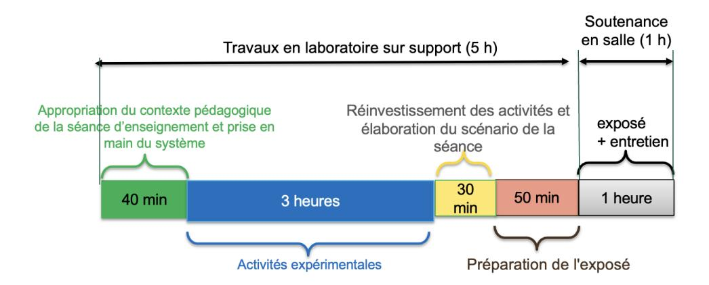

**Phase 1 : Appropriation du contexte pédagogique de la séance d'enseignement et prise en main du système (40 minutes)**

#### **Appropriation du contexte pédagogique**

La séance d'enseignement à présenter lors de l'exposé est une activité prévue pour une heure en classe entière. Elle doit être élaborée pour la série, le niveau et les objectifs de formation définis ci-dessous. Les éléments suivants sont indiqués au candidat :

- Série : Technologie, STI2D, SI ou BTS (spécialité précisée selon le sujet)
- Niveau : classe concernée
- Période : période de l'année (début, milieu ou fin d'année)
- Compétences visées (il s'agit des compétences que la séance présentée par le candidat doit permettre de développer chez les élèves ; une à deux compétences sont imposées)
- Connaissances/savoirs associés (il s'agit des connaissances/savoirs associées aux compétences ; elles devront être développé(e)s dans le cadre de la séance présentée par le candidat)

#### **Prise en main du système et de son environnement**

Il est mis à disposition du candidat :

- un espace numérique personnel accessible pendant les six heures de l'épreuve ;
- un ordinateur équipé des logiciels de bureautique et dédiés aux activités pratiques (avec accès à internet) ;
- un dossier « Documents candidats » comportant diverses ressources ;
- un système didactisé

Quelques manipulations sont proposées au candidat. Elles sont fortement guidées et doivent permettre une prise en main des matériels/logiciels mis à sa disposition pour réaliser les activités expérimentales suivantes.

#### **Phase 2 : activités expérimentales (3 heures)**

Dans cette phase 2, une succession d'activités expérimentales est proposée aux candidats. Ces activités permettent d'évaluer l'aptitude du candidat à :

- concevoir un protocole expérimental ;
- mettre en œuvre un protocole expérimental ;
- réaliser une partie d'un programme ;
- réaliser le relevé de grandeurs physiques ;
- extraire des informations de documentations fournies ;
- analyser les relevés et en conclure quant à l'objectif (ce retour à l'objectif de l'activité est essentiel).

### **Phase 3 : réinvestissement des activités et élaboration du scénario de la séance (30 minutes)**

La séance d'enseignement à présenter lors de l'exposé est une activité prévue en classe entière pour une durée d'une heure. Elle doit être élaborée pour la série, le niveau et les objectifs de formation définis en phase 1.

Le programme (ou le référentiel) de la classe concernée est mis à disposition du candidat.

À partir du contexte pédagogique imposée, il est demandé au candidat d'identifier parmi les activités expérimentales réalisées lors de la phase 2 celles qui pourraient être exploitées. Le candidat ayant toujours accès au matériel de travaux pratiques, des expérimentations complémentaires peuvent être réalisées.

#### **Phase 4 : préparation de l'exposé (50 minutes)**

Lors de cette phase, le candidat n'a plus accès au matériel de travaux pratiques.

Pour information, le candidat dispose lors de son exposé :

- de l'espace numérique personnel utilisé lors des phases précédentes ;
- d'un ordinateur équipé des logiciels de bureautique et d'un vidéoprojecteur ;
- d'un tableau blanc et de feutres.

La durée de la présentation devant la commission d'interrogation est de 30 minutes maximum. Elle doit inclure une courte introduction explicitant :

- la description du contexte pédagogique de la séance (imposé en phase 1), une description succincte de l'articulation de la séance présentée avec les séances antérieures et postérieures ;
- la(les) problématique(s) éventuelle(s) permettant de contextualiser les activités proposées aux élèves ;
- le plan de la séance.

Les activités proposées aux élèves dans le cadre de la séance sont ensuite présentées et argumentées. Il n'est pas attendu du candidat qu'il détaille lors de l'exposé la chronologie des activités expérimentales qu'il a conduites au laboratoire durant les trois heures qui y sont consacrées.

# **C. Commentaires du jury**

#### **1. Analyse globale des résultats**

Le jury tient à souligner la qualité de préparation de la majorité des candidats. Néanmoins, les attendus de l'épreuve et les modalités de mise en œuvre décrits au JORF ne sont toujours pas connus de tous. Il s'avère extrêmement difficile de réussir les activités pratiques et l'exploitation pédagogiques si les objectifs spécifiques de ces deux parties de l'épreuve ne sont pas connus.

Les notions théoriques portant sur la didactique de la discipline et sur les différentes démarches pédagogiques associées sont régulièrement citées par les candidats. Elles sont rarement justifiées et parfois énoncées d'une façon inappropriée. Elles ne font que trop rarement l'objet d'une contextualisation ou d'une proposition concrète dans le cadre de la séance présentée lors de la leçon.

Une proportion notable de candidats ne connaît pas les grands éléments de la réforme du lycée. Les programmes de technologie au collège et de la série STI2D et de la spécialité sciences de l'ingénieur du lycée général et technologique ainsi que les documents ressources pour faire la classe sont parfois inconnus des candidats. Le jury a été également surpris que des candidats ne soient pas acculturés au socle commun de connaissances, de compétences et de culture ainsi qu'à l'évaluation par compétences.

Le nombre des exploitations pédagogiques portant sur le collège, la série STI2D, la spécialité SI ou les STS de la spécialité a été équilibré sur l'ensemble de la session ; les candidats doivent être en mesure de produire des séances sur tous les niveaux d'enseignement. Le jury rappelle que les exploitations pédagogiques doivent s'appuyer sur les programmes et référentiels en vigueur lors de la session du concours.

#### **2. Commentaires et conseils aux candidats**

#### **Pour la partie travaux pratiques**

Le manque de culture scientifique et technologique pénalise de nombreux candidats dans l'appropriation des supports pluri-technologiques. Il est impératif, pour réussir cette épreuve, de disposer de compétences et de connaissances scientifiques et technologiques avérées dans les trois domaines « matière – énergie – information ». Cette culture technologique ne se limite en aucun cas à un domaine disciplinaire unique lié à l'option choisi par le candidat. Les futurs professeurs de sciences industrielles de l'ingénieur se doivent d'avoir une vision transversale et globale de leur discipline et de conduire une veille technologique régulière.

Les candidats les plus efficients font preuve d'autonomie, d'esprit critique et d'écoute lors des travaux pratiques. Ils prennent des initiatives dans la conception de leur séance pédagogique et mettent à profit l'ensemble des ressources numériques mises à leur disposition.

#### **Organisation à suivre lors de l'épreuve**

Il convient de prendre connaissance du sujet avant de commencer les activités expérimentales, de lire les consignes et de ne pas se précipiter pour commencer les manipulations

Les candidats réalisent des activités expérimentales et analysent des résultats afin de conclure sur les problématiques du sujet. Ces manipulations, mesures et interprétations, sont réalisées au niveau de compétences d'un master première année.

Les candidats doivent penser à garder des traces numériques de leurs résultats et de leurs travaux afin de les réinvestir dans une séance adaptée au collège ou au lycée.

La connaissance préalable du système et des logiciels n'étant pas demandée, les membres de jury peuvent être sollicités par les candidats en cas de problème ou de difficultés liées à l'exploitation d'un logiciel ou d'un appareil de mesurage spécifique. Plus généralement, le jury est présent pour accompagner les candidats dans leur démarche.

### **Aptitude à mener un protocole expérimental**

Le jury a apprécié l'autonomie dans la manipulation des systèmes de certains candidats. La mise en œuvre des matériels de mesurage et d'acquisition ne suscite pas de difficultés particulières. Cependant pour certains, les instruments de mesure de base ne sont pas suffisamment connus (nom, utilisation, symbole et unités des grandeurs physiques mesurées). Les membres du jury assurent l'accompagnement nécessaire afin que la spécificité d'un équipement ne constitue pas un obstacle à la réussite du candidat. On attend du candidat qu'il soit capable de proposer et de justifier des choix de protocoles expérimentaux.

#### **Utilisation des modèles numériques**

Globalement, les candidats utilisent correctement les modèles numériques fournis. Le jury note cependant que de nombreux candidats manquent de recul et d'esprit critique dans l'interprétation des résultats de la simulation numérique et dans l'analyse des hypothèses utilisées lors de l'élaboration du modèle. Il est attendu des candidats une analyse pertinente des écarts entre les résultats fournis par la modélisation, les mesures issues du système réel à partir d'expérimentations et/ou les performances attendues indiquées dans le cahier des charges.

#### **Préparation de la séance**

Le candidat doit bien identifier les activités réalisées qui pourraient être sollicitées lors de l'exposé, au niveau collège, en pré-bac ou en BTS. Cet inventaire doit l'amener à envisager les activités possibles à proposer dans la classe pour la séance et le niveau demandé. Les conclusions et les résultats de ces expérimentations pourront certainement être réutilisées lors de l'élaboration de la séance.

Il convient de transposer les activités demandées aux candidats lors des activités expérimentales dans un contexte de formation pour des élèves (ou étudiants) au regard de la commande pédagogique imposée dans le sujet. Le jury regrette que pour la plupart des candidats il n'est fait aucun retour sur les résultats obtenus à l'issue de la séance et les objectifs indiqués en début de séance. Le hors-sujet est encore malheureusement trop fréquent.

#### **Pour l'exposé devant le jury**

Les candidats inscrivent leur développement pédagogique dans un contexte pédagogique donné dans le sujet. La séance d'enseignement à présenter est une activité prévue en classe entière pour une durée d'une heure. Afin de bien préciser au jury les enjeux et les attendues de la séance, celle-ci doit être intégrée dans une séquence. Le candidat doit situer la séance dans une organisation temporelle, en précisant ce qui est fait avant et après. Il doit également expliciter la construction de la séance en s'appuyant sur tout ou partie des activités expérimentales réalisées auparavant et de leurs résultats. Le candidat est amené à préciser pour la séance décrite les prérequis, les objectifs (compétences à faire acquérir, capacités et connaissances attendues), l'organisation de la classe, les modalités pédagogiques (cours, activités dirigées, activités pratiques, projet), les stratégies pédagogiques (déductif, inductif, différenciation pédagogique, démarche d'investigation, démarche de résolution de problème technique, pédagogie par projet, approche spiralaire…), les activités des élèves et les productions attendues. La description de la séance doit faire explicitement apparaître la prise en compte de la diversité des publics accueillis dans la classe. Il est attendu que le candidat précise la façon dont il compte animer la classe et mettre en synergie les élèves / étudiants en vue de la structuration des acquis.

Les phases de structuration des connaissances permettant la construction des connaissances des élèves et les différentes formes d'évaluations des élèves peuvent être des parties intégrantes de la séance.

Les différentes modalités d'enseignement (enseignement pratique interdisciplinaire, interdisciplinarité, concours scientifique et technique…) et les dispositifs d'accompagnement et de remédiation doivent être précisés.

## **Utilisation du numérique**

Le jury conseille aux candidats de bien identifier les points de leur séance pédagogique pour lesquels l'usage du numérique apportera une réelle plus-value aux apprentissages des élèves. Le jury constate que peu de candidat propose une exploitation du numérique éducatif, à des fins d'animation de séance, de présentation, de travail collaboratif, d'outil relationnel entre le professeur et les élèves (type ENT par exemple d'entre eux proposent une séquence exploitant le numérique éducatif.

### **Réinvestissement des résultats de travaux pratiques**

L'objectif attendu de la leçon est une exploitation pédagogique s'appuyant sur tout ou partie des activités pratiques réalisées et de leurs résultats et permettant aux apprenants de comprendre les concepts fondamentaux utilisés dans les compétences visées. Les activités expérimentales demandées dans la partie « travaux pratiques » sont d'un niveau supérieur à la séance demandée, il ne s'agit donc pas de faire, au travers de la séance pédagogique, un compte-rendu de l'activité pratique réalisée, mais de s'appuyer sur les expérimentations pour en extraire des données et des activités à proposer aux élèves. Cependant, une rapide présentation des objectifs et conclusions des expérimentations réalisées en TP en 1ère partie de l'épreuve, permettra au jury de mieux comprendre l'intégration de ceux-ci dans la séance. Il est apprécié de réaliser une présentation dynamique qui inclut des copies d'écran, des résultats de mesures, des éléments de cahier des charges ou d'analyse SysML, etc.

Le jury ne se satisfait en aucun cas d'une exploitation brute des activités proposées dans la première partie de l'épreuve.

#### **Réalisme de l'organisation de la classe**

Le jury attend des candidats qu'ils émettent des hypothèses réalistes sur les conditions d'enseignement. Leurs propositions doivent être pragmatiques afin que le jury puisse appréhender le scénario pédagogique envisagé (travail en "autobus", en ilot, en équipes, en binôme ou individuellement). Le candidat doit notamment préciser son rôle dans la conduite et l'animation de la séance.

## **Évaluation**

Le processus retenu par le candidat pour l'évaluation des compétences doit être clairement décrit (évaluation diagnostique, formative, sommative, certificative, …) et justifié. Les critères d'évaluation doivent être explicités. Les modalités et les outils doivent être précisés. Si des remédiations ou des différenciations pédagogiques sont envisagées, elles doivent être explicitées.

Trop souvent, les candidats se contentent d'évoquer les processus d'évaluation sans pouvoir en expliquer réellement le déroulement, les modalités et surtout l'objectif en termes d'acquisition des compétences par les élèves.

#### **Présentation orale**

Quelques candidats proposent des présentations (orales et écrites) très formatées, quelques fois hors du contexte des activités pratiques réalisées en amont, qui ne résistent pas aux questionnements du jury et mettent en évidence des lacunes.

Le jury note également que quelques candidats limitent leur présentation à un descriptif sommaire des activités sans expliciter et justifier clairement la démarche.

Le jury invite les candidats à, certes, maîtriser les attendus pédagogiques et didactiques de la discipline, mais surtout à être en capacité de les réinvestir de façon adaptée et pertinente. À titre d'exemples, les termes « formatif », « sommatif », « inductif », … doivent être utilisés à bon escient et dans un contexte adapté.

Enfin, le jury rappelle que le concours constitue la première étape de l'entrée dans le métier du professorat. Le candidat se doit donc d'adopter une posture et un positionnement exemplaires constitutifs de la mission d'enseignant. Le jury invite vivement les candidats à s'approprier le référentiel des compétences professionnelles des métiers du professorat et de l'éducation (arrêté du 1-7-2013 - J.O. du 18-7-2013).

### **Réactivité au questionnement**

Le jury attend de la concision et de la précision ainsi qu'une honnêteté intellectuelle dans les réponses formulées. Les réponses au questionnement doivent laisser transparaître un positionnement adapté aux attentes de l'Institution et une réelle appropriation des valeurs de la République.

Le candidat se doit d'être réactif sans chercher à éluder les questions ou à noyer le propos dans un discours pédagogique non maitrisé. Plus qu'une réponse exacte instantanée, le jury apprécie la capacité à argumenter, à expliquer et justifier une démarche ou un point de vue.

### **Qualité des documents de présentation et expression orale**

Il est attendu des candidats une maîtrise des outils numériques pour l'enseignement afin de construire un document clair, lisible et adapté à la présentation de l'exposé.

Le jury est extrêmement attentif à la qualité de la syntaxe et de l'orthographe.

Les candidats s'expriment généralement correctement. La qualité de l'élocution et la clarté des propos sont indispensables aux métiers de l'enseignement.

### **Conseils aux candidats**

Le jury conseille aux candidats de :

- s'approprier les programmes et référentiels des niveaux énoncés dans la définition de l'épreuve ainsi que les documents ressources associés ;
- prendre connaissance du socle commun de connaissances, de compétences et de culture ;
- maîtriser les concepts fondamentaux de la spécialité choisie ;
- s'informer des pratiques pédagogiques et didactiques, des modalités de fonctionnement et de l'organisation des horaires de tous les niveaux d'enseignement que peuvent assurer les professeurs de sciences industrielles de l'ingénieur ;
- se préparer à exploiter les résultats d'investigations et d'expérimentations en regard des contenus disciplinaires ;
- s'informer sur les modalités des épreuves d'examen auxquelles ils préparent leurs futurs élèves ;
- travailler sa posture et ses intonations et de rentrer en interaction avec le jury afin ne pas lire les documents projetés sans regarder le jury.

## **3. Conclusion**

L'épreuve de leçon nécessite une préparation sérieuse et approfondie en amont de l'admissibilité. Cette préparation doit porter tout autant sur la partie « travaux pratiques » que sur la partie « exploitation pédagogique », car ces deux parties de l'épreuve sont complémentaires et indissociables. Les compétences nécessaires à la réussite de cette épreuve sont à acquérir et à développer notamment lors de stages en situation et de périodes d'observation ou d'enseignement. Elles sont complétées par une connaissance fine des programmes/référentiels et des documents ressources pour faire la classe. Le métier d'enseignant exige une exemplarité dans la tenue, dans la posture ainsi que dans le discours. L'épreuve de leçon permet la valorisation de ces qualités.

# **D. Résultats**

Les statistiques générales pour cette épreuve sont données ci-après.

|               | CAPET (public) | CAFEP (privé) |
|---------------|----------------|---------------|
| Moyenne       | 9,75           | 13,81         |
| Note maximum  | 20             | 18,7          |
| Note minimale | 1,2            | 11            |
| Écart type    | 4,8            | 3             |

# **Épreuve d'entretien**

# **A. Présentation de l'épreuve**

 Durée : 35 minutes Coefficient 3

L'épreuve d'entretien avec le jury porte sur la motivation du candidat et son aptitude à se projeter dans le métier de professeur au sein du service public de l'éducation.

L'entretien comporte une première partie d'une durée de quinze minutes débutant par une présentation, d'une durée de cinq minutes maximum, par le candidat des éléments de son parcours et des expériences qui l'ont conduit à se présenter au concours en valorisant ses travaux de recherche, les enseignements suivis, les stages, l'engagement associatif ou les périodes de formation à l'étranger. Cette présentation donne lieu à un échange avec le jury.

La deuxième partie de l'épreuve, d'une durée de vingt minutes, doit permettre au jury, au travers de deux mises en situation professionnelle, l'une d'enseignement, la seconde en lien avec la vie scolaire, d'apprécier l'aptitude du candidat à :

- s'approprier les valeurs de la République, dont la laïcité, et les exigences du service public (droits et obligations du fonctionnaire dont la neutralité, lutte contre les discriminations et stéréotypes, promotion de l'égalité, notamment entre les filles et les garçons, etc.) ;
- faire connaître et faire partager ces valeurs et exigences.

Le candidat admissible transmet préalablement une fiche individuelle de renseignement établie sur le modèle figurant à l'annexe VI de l'arrêté du 25 janvier 2021 fixant les modalités d'organisation des concours du certificat d'aptitude au professorat de l'enseignement technique, selon les modalités définies dans l'arrêté d'ouverture.

L'épreuve est notée sur 20. La note 0 est éliminatoire.

## **B. Déroulement de l'épreuve**

Pour des raisons d'équité, la durée des entretiens est fixe. Le jury veille à ce que les temps impartis soient respectés. Il convient aux candidats d'être vigilant quant à la durée de leurs réponses.

Le candidat ne dispose d'aucun document. Le jury n'intervient pas pendant les cinq minutes de présentation du candidat.

Le déroulé est rappelé ci-dessous :

| 15 minutes         | 5 minutes maximum  | Présentation par le candidat des éléments de son parcours et des expériences qui l'ont conduit à se présenter au concours en valorisant notamment ses travaux de recherche, les enseignements suivis, les stages, l'engagement associatif ou les périodes de formation à l'étranger. |
|-----------------------|-----------------------|--------------------------------------------------------------------------------------------------------------------------------------------------------------------------------------------------------------------------------------------------------------------------------------|
|                       | 10 minutes minimum | Échanges suite à la présentation                                                                                                                                                                                                                                                     |
| 20 minute (10 + 10 | _                     | Deux mises en situation professionnelle - d'enseignement - en lien avec la vie scolaire                                                                                                                                                                                              |

Les mises en situation professionnelle sont définies par le jury en amont du passage des candidats. Une lecture de ces mises en situation professionnelle est réalisée par un des membres du jury.

# **C. Commentaires du jury**

Cette épreuve est révélatrice de la posture professionnelle du candidat mais aussi de son éthique, sa déontologie et ses futurs réflexes professionnels. Elle sollicite, au-delà des aptitudes disciplinaires, les compétences professionnelles transversales essentielles à l'exercice du métier d'enseignant. De manière générale, les candidats ont bien appréhendé le format de cette nouvelle épreuve mais elle semble insuffisamment préparée pour un nombre significatif d'entre eux.

### **Présentation (1ère partie)**

La présentation de cinq minutes par le candidat des éléments de son parcours et des expériences qui l'ont conduit à se présenter au concours en valorisant ses travaux de recherche, les enseignements suivis, les stages, l'engagement associatif ou les périodes de formation à l'étranger, a permis au jury de rapidement cerner sa personnalité, et de comprendre les motivations qui l'ont poussé à présenter le CAPET.

Cette première est primordiale pour la suite de l'entretien : le lien entre « devenir enseignant » et le parcours en amont doit être explicité. Il est intéressant de comprendre comment le projet de devenir enseignant s'est construit au fil du temps et pas uniquement sur une envie de transmettre. Même s'il est plus rassurant d'apprendre cette première phase par cœur, le jury apprécie la spontanéité des candidats. Or de nombreux candidats n'ont pas utilisé la totalité de ce temps, faute d'arguments.

La seconde phase de cette présentation a permis pendant dix minutes au jury de se faire préciser des points importants, notamment sur la connaissance du système éducatif français en général et sur les filières ou disciplines dans lesquelles le candidat est susceptible d'enseigner.

#### Le jury a apprécié :

- l'enthousiasme du candidat et le dynamisme du discours pour présenter son envie de devenir enseignant ;
- la capacité du candidat à se projeter dans la fonction en juxtaposant sa vision du métier d'enseignant (tenants et aboutissants des missions d'un enseignant) avec ses compétences acquises et transférables, l'idée étant « voici ce qui me laisse penser que je dispose des premiers outils nécessaires à une bonne prise de fonction » ;
- la mise en valeur des expériences multiples (animation, enseignement, différents métiers, ..) ;
- ses connaissances du milieu dans lequel il va évoluer, les principaux acteurs, le rôle et mission de chacun, les instances, leurs participants et les typologies des décisions ;
- les fiches individuelles de renseignements complétées avec les expériences d'enseignement et les expériences professionnelles dans le secteur industriel ;
- les candidats qui ne paraphrasent pas leur fiche individuelle de renseignements ;
- les candidats qui s'expriment clairement.

Afin de préparer au mieux cette introduction, le jury conseille aux candidats de connaitre à minima :

- les différentes disciplines dans lesquelles il peut être appelé à enseigner, de la technologie au collège aux différents BTS associés à sa valence ;
- le fonctionnement de la technologie au collège, son programme, le socle commun, le travail en ilots, le diplôme national du brevet (DNB)…
- le fonctionnement actuel du lycée général et technologique, les enseignements de spécialité, le tronc commun, les programmes de sciences de l'ingénieur et de STI2D, les enseignements spécifiques de STI2D, la structure du baccalauréat et ses différentes épreuves…
- la structure d'un référentiel de BTS en général, les blocs de compétences, les activités professionnelles, les différentes épreuves d'examen…
- le fonctionnement d'un EPLE, son équipe de direction, la vie scolaire, les services sociaux et d'infirmerie, les différentes instances (conseil d'administration, conseil pédagogique, conseil d'enseignement, conseil de discipline…), le règlement intérieur…

- le référentiel de compétences des enseignants, le suivi de carrière…
- les valeurs de la République.

#### **Mises en situation professionnelle (2ème partie)**

Le second temps, consacré à parts égales entre une question portant sur une situation en classe et une situation hors de la classe, a été riche de discussions souvent constructives. Le jury a constaté avec satisfaction que les situations professionnelles sont, dans l'ensemble, bien comprises par les candidats. Le traitement instantané du problème rencontré dans les différentes situations qu'elles soient de l'ordre de l'enseignement ou de la vie scolaire est bien appréhendé. Il est noté qu'il a été souvent plus aisé pour les candidats d'analyser la situation en classe que de se projeter dans une situation relevant de la vie scolaire. Les réponses apportées démontrent, pour la plupart, du bon sens et du pragmatisme des candidats.

Même lorsque le candidat ne connaissait pas le système éducatif, il a souvent pu apporter des pistes de solutions cohérentes. Les valeurs de la République sont largement respectées et citées par les candidats. Les personnes ressources au sein de l'établissement sont souvent bien identifiées (le chef d'établissement et son adjoint, le CPE, le DDFPT, le gestionnaire…) et les différentes instances sont plutôt connues. Cependant, les débats atteignent rapidement leur limite lorsque le candidat n'est pas à l'aise sur les points précédents. La méconnaissance du fonctionnement d'un collège ou d'un lycée devient rapidement rédhibitoire, malgré les relances bienveillantes du jury.

#### Le jury a apprécié les candidats qui :

- commencent par analyser les situations au lieu de proposer directement des solutions au problème posé à court terme ;
- envisagent, lors de leur analyse, plusieurs interprétations de la situation proposée ;
- prennent de la hauteur par rapport à la situation décrite, qui l'analysent selon les trois temporalités demandées (à court, moyen et long termes) ;
- identifient les valeurs et principes de la République, les droits et devoirs des fonctionnaires, sous-tendus aux situations étudiées ;
- s'appuient sur tous les leviers existants dans l'établissement pour prévenir les situations étudiées notamment en mettant en place des actions éducatives ;
- assument leurs missions d'éducation et place son action personnelle au sein de celle d'une communauté éducative élargie.

#### Le jury conseille aux candidats de :

- de s'approprier les attentes de l'épreuve lors de leur préparation au concours ;
- de s'approprier le fonctionnement d'un EPLE ainsi que le rôle des différentes instances ;
- de se référer aux personnes ressources de l'établissement susceptibles d'être sollicitées en fonction de la situation (psy-en, infirmier, assistant social, …). Trop de candidats ne font appel qu'au CPE ou au chef d'établissement ;
- de penser également à solliciter des acteurs extérieurs à l'établissement (associations, experts, conseillers, partenaires économiques…), notamment pour les actions à moyen ou long terme ;
- de ne pas rester sur des réponses autocentrées mais de se placer dans le contexte d'un établissement scolaire ;
- même si le candidat peut faire référence à son expérience (de contractuel notamment), de prendre le recul nécessaire pour traiter la situation proposée dans le contexte décrit.

# **D. Ressources mobilisables**

Le jury conseille aux candidats de s'approprier les informations données sur la nouvelle épreuve d'entretien (attendus, conseils et exemples de situations professionnelles) :

<https://www.devenirenseignant.gouv.fr/cid159421/epreuve-entretien-avec-jury.html>

Pour construire ses réponses, le candidat fait appel à l'ensemble des expériences et des connaissances dont il dispose et qu'il mobilise avec pertinence, expériences et connaissances proprement disciplinaires ou participant d'une déontologie professionnelle.

Cette déontologie professionnelle suppose au moins l'appropriation par le candidat des ressources et textes suivants :

- Les droits et obligations du fonctionnaire présentés sur le portail de la fonction publique : <https://www.fonction-publique.gouv.fr/droits-et-obligations>
- Les articles L 111-1 à L 111-4 et l'article L 442-1 du [code de l'Education.](https://www.legifrance.gouv.fr/codes/id/LEGITEXT000006071191/)
- Le vade-mecum "la laïcité à l'École" : <https://eduscol.education.fr/1618/la-laicite-l-ecole>
- Le vade-mecum "agir contre le racisme et l'antisémitisme" : <https://eduscol.education.fr/1720/agir-contre-le-racisme-et-l-antisemitisme>
- "Qu'est-ce que la laïcité ?" Une introduction par le Conseil des Sages de la laïcité Janvier 2021. Téléchargeable sur [https://www.education.gouv.fr/le-conseil-des-sages-de-la-laicite-](https://www.education.gouv.fr/le-conseil-des-sages-de-la-laicite-41537)[41537](https://www.education.gouv.fr/le-conseil-des-sages-de-la-laicite-41537)
- Le parcours magistère "faire vivre les valeurs de la République" : <https://magistere.education.fr/f959>
- "Que sont les principes républicains ?" Une contribution du Conseil des sages de la laïcité Juin 2021. Téléchargeable sur [https://www.education.gouv.fr/le-conseil-des-sages-de-la-laicite-](https://www.education.gouv.fr/le-conseil-des-sages-de-la-laicite-41537)[41537](https://www.education.gouv.fr/le-conseil-des-sages-de-la-laicite-41537)
- "La République à l'École", Inspection générale de l'éducation, du sport et de la recherche »
- Le site IH2EF :<https://www.ih2ef.gouv.fr/laicite-et-services-publics>

# **E. Résultats**

Les statistiques générales pour cette épreuve sont données ci-après.

|               | CAPET (public) | CAFEP (privé) |
|---------------|----------------|---------------|
| Moyenne       | 11             | 17,07         |
| Note maximum  | 20             | 19,5          |
| Note minimale | 1              | 14            |
| Écart type    | 5,3            | 1,9           |