# **Rapport du jury**

**Concours : CAPET externe et CAFEP-CAPET**

**Section : sciences industrielles de l'ingénieur**

**Option : ingénierie électrique**

**Session 2023**

Rapport du jury présenté par : Pascale COSTA, inspectrice générale de l'éducation, du sport et de la recherche, Présidente du jury.

## Sommaire

| Avant- | -propos                           | 3  |
|--------|-----------------------------------|----|
|        | rciements                         |    |
| Résult | tats statistiques                 | 5  |
| Épreu  | ve écrite disciplinaire           | 6  |
| A.     | Présentation de l'épreuve         |    |
| B.     | Sujet                             | 6  |
| C.     | Éléments de correction            | 7  |
| D.     | Commentaires du jury              | 13 |
| E.     | Résultats                         | 14 |
| Épreu  | ve écrite disciplinaire appliquée | 15 |
| A.     | Présentation de l'épreuve         | 15 |
| B.     | Sujet                             | 15 |
| C.     | Éléments de correction            | 16 |
| D.     | Commentaires du jury              | 27 |
| E.     | Résultats                         | 29 |
| Épreu  | ıve de leçon                      | 30 |
| A.     | Présentation de l'épreuve         | 30 |
| B.     | Déroulement de l'épreuve          | 30 |
| C.     | Commentaires du jury              | 32 |
| D.     | Résultats                         | 37 |
| Épreu  | ve d'entretien                    | 38 |
| A.     | Présentation de l'épreuve         | 38 |
| B.     | Déroulement de l'épreuve          | 38 |
| C.     | Commentaires du jury              | 39 |
| D.     | Ressources mobilisables           | 41 |
| E.     | Résultats                         | 41 |

# **Avant-propos**

Depuis la session 2022, les épreuves de ce concours ont été modifiées ; leur définition est rappelée sur le site devenir enseignant :

<https://www.devenirenseignant.gouv.fr/cid158866/epreuves-capet-externe-cafep-capet-sii.html>

Les attentes du concours du Capet et du Cafep de sciences industrielles de l'ingénieur (SII) sont définies par l'arrêté du 25 janvier 2021 qui en fixe l'organisation. Les concours de recrutement d'enseignants n'ont pas pour seul objectif de valider les compétences scientifiques et technologiques des candidats ; ils doivent aussi valider les compétences professionnelles qui sont souhaitées par l'État employeur qui recrute des professeurs. L'excellence scientifique et la maîtrise disciplinaire sont indispensables pour présenter le concours, mais pour le réussir, les candidats doivent aussi faire preuve de qualités didactiques et pédagogiques et de bonnes aptitudes à communiquer.

Les deux épreuves d'admissibilité sont construites de manière à évaluer un spectre large de compétences scientifiques et technologiques : la première épreuve intitulée « épreuve disciplinaire » est spécifique à l'option choisie lors de l'inscription (option ingénierie des constructions, option ingénierie électrique, option ingénierie informatique et option ingénierie mécanique), la seconde intitulée « épreuve écrite disciplinaire appliquée » est commune aux quatre options.

Les deux épreuves d'admission sont complémentaires des épreuves d'admissibilité. La première épreuve, intitulée « leçon » est spécifique à l'option ; elle a pour objet la conception et l'animation d'une séance d'enseignement dans l'option choisie. Elle permet d'apprécier à la fois la maîtrise disciplinaire, la maîtrise de compétences pédagogiques et de compétences pratiques ainsi que la capacité du candidat à réfléchir aux enjeux scientifiques, technologiques, didactiques, épistémologiques, culturels et sociétaux que revêt l'enseignement du champ disciplinaire du concours. L'évaluation de cette épreuve s'appuie sur le référentiel des compétences professionnelles des métiers du professorat et de l'éducation (publié au BOEN du 25 juillet 2013). La seconde épreuve, intitulé « entretien » porte sur la motivation du candidat et son aptitude à se projeter dans le métier de professeur au sein du service public de l'éducation ; sa définition est commune à l'ensemble des concours externe de recrutement d'enseignants.

Ces épreuves d'admission, dont le coefficient total est le double de celui des épreuves d'admissibilité, ont eu une influence significative sur le classement final.

Les candidats et leurs formateurs sont invités à lire avec application les commentaires et conseils donnés dans ce rapport et dans ceux des sessions antérieures afin de bien appréhender les compétences ciblées. La préparation à ces épreuves commence dès l'inscription au concours.

Pour l'épreuve d'admission pratique, l'accès à Internet était autorisé afin de mettre les candidats dans les conditions du métier qu'ils envisagent d'exercer. Mais cela ne doit pas masquer le fait que la réflexion, la cohérence, l'appréciation du niveau des élèves et la précision pédagogique dans les explications sont des qualités précieuses pour un futur enseignant.

Dans toutes les épreuves, le jury attend des candidats une expression écrite et orale irréprochable. Le Capet/Cafep est un concours exigeant qui impose de la part des candidats un comportement et une présentation exemplaires. Le jury reste vigilant sur ce dernier aspect et invite les candidats à avoir une tenue adaptée aux circonstances particulières d'un concours de recrutement de cadres de catégorie A de la fonction publique.

48 postes étaient proposés pour la session 2023 de ce concours externe public et 3 postes pour le privé. Il a été impossible de pourvoir tous les postes pour le public : seuls 36 candidats ont été admis.

Si globalement, les candidats présents à cette session d'admission étaient bien préparés, l'admission n'a pu être prononcée pour ceux dont les prestations n'ont pas donné la garantie qu'ils étaient aptes à embrasser la carrière de professeur de sciences industrielles de l'ingénieur. Cela est regrettable dans la mesure où les besoins dans les établissements scolaires sont importants.

Pour conclure cet avant-propos, le jury souhaite que ce rapport soit une aide efficace aux futurs candidats. Tous sont invités à se l'approprier par une lecture attentive.

# **Remerciements**

Le lycée Roosevelt de Reims a accueilli les épreuves d'admission de cette session 2023 des quatre options du Capet/Cafep externe section sciences industrielles de l'ingénieur.

Les membres du jury tiennent à remercier le proviseur du lycée et son adjointe, son directeur délégué aux formations professionnelles et technologiques, ses collaborateurs et l'ensemble des personnels pour la qualité de leur accueil et l'aide efficace apportée tout au long de l'organisation et du déroulement de ce concours qui a eu lieu dans d'excellentes conditions.

Les membres de jury ayant contribué à la rédaction de ce rapport ainsi que les concepteurs des sujets, tant pour les épreuves d'admissibilité que pour les épreuves d'admission, sont également tout particulièrement remerciés.

# **Résultats statistiques**

## **CAPET externe public :**

| Session | Nombre de postes | Inscrits | Présents aux épreuves écrites | Admissibles | Présents aux épreuves orales | Admis |
|---------|---------------------|----------|-------------------------------------|-------------|------------------------------------|-------|
| 2019    | 45                  | 332      | 119                                 | 88          | 66                                 | 45    |
| 2020    | 51                  | 228      | 81                                  | 66          | 60                                 | 29    |
| 2021    | 49                  | 192      | 81                                  | 70          | 51                                 | 36    |
| 2022    | 45                  | 183      | 71                                  | 67          | 45                                 | 34    |
| 2023    | 48                  | 205      | 81                                  | 68          | 54                                 | 36    |

## **CAFEP externe privé :**

| Session | Nombre de postes | Inscrits | Présents aux épreuves écrites | Admissibles | Présents aux épreuves orales | Admis |
|---------|---------------------|----------|-------------------------------------|-------------|------------------------------------|-------|
| 2019    | 3                   | 72       | 32                                  | 7           | 6                                  | 3     |
| 2020    | 4                   | 63       | 27                                  | 10          | 9                                  | 4     |
| 2021    | 3                   | 59       | 35                                  | 9           | 8                                  | 3     |
| 2022    | 3                   | 46       | 24                                  | 9           | 7                                  | 3*    |
| 2023    | 3                   | 47       | 20                                  | 9           | 6                                  | 3     |

\* 1 candidat admis sur liste complémentaire

## **Statistiques obtenues à l'admissibilité et à l'admission à la session 2023 :**

|               |                                                          | CAPET (public) | CAFEP (privé) |
|---------------|----------------------------------------------------------|----------------|---------------|
|               | Moyenne obtenue par le premier candidat admissible | 14,8           | 12,9          |
| Admissibilité | Moyenne obtenue par le dernier candidat admissible | 5,75           | 8,95          |
|               | Moyenne des candidats admissibles                        | 8,88           | 10,34         |
|               | Moyenne obtenue par le premier candidat admis      | 14,98          | 14,84         |
| Admission     | Moyenne obtenue par le dernier candidat admis      | 8,03           | 12,4          |
|               | Moyenne des candidats présents                           | 7,63           | 8,08          |
|               | Écart-type des candidats présents                        | 4,66           | 6,34          |

# **Épreuve écrite disciplinaire**

## **A. Présentation de l'épreuve**

 Durée : 5 heures Coefficient 2

L'épreuve, spécifique à l'option choisie, porte sur l'étude d'un système, d'un procédé ou d'une organisation.

Elle a pour but de vérifier que le candidat est capable, à partir de l'exploitation d'un dossier technique remis par le jury, de conduire une analyse critique de solutions technologiques et de mobiliser ses connaissances scientifiques et technologiques pour élaborer et exploiter les modèles de comportement permettant de quantifier les performances d'un système ou d'un processus lié à la spécialité et définir des solutions technologiques.

L'épreuve est notée sur 20. Une note globale égale ou inférieure à 5 est éliminatoire.

# **B. Sujet**

Le sujet est disponible en téléchargement sur le site du ministère à l'adresse : <https://www.devenirenseignant.gouv.fr/media/5987/download>

Le support de cette épreuve est un enjambeur viticole électrique autonome conçu par l'entreprise Vitibot basée à Reims. Ce robot Bakus est capable d'exécuter la plupart des travaux viticoles, aujourd'hui assurés par des tracteurs conventionnels, dans des conditions de sécurité et de qualité optimales. Il présente de multiples avantages. En effet, compte tenu de son poids (≈ 2 500 kg) inférieur à un enjambeur traditionnel (3 000 à 5 000 kg), il contribue à limiter le tassement des sols. De plus, sa conduite autonome permet de libérer le viticulteur qui peut, pendant ce temps, se consacrer à d'autres tâches au sein de la parcelle de vigne tout en assurant la supervision du robot.

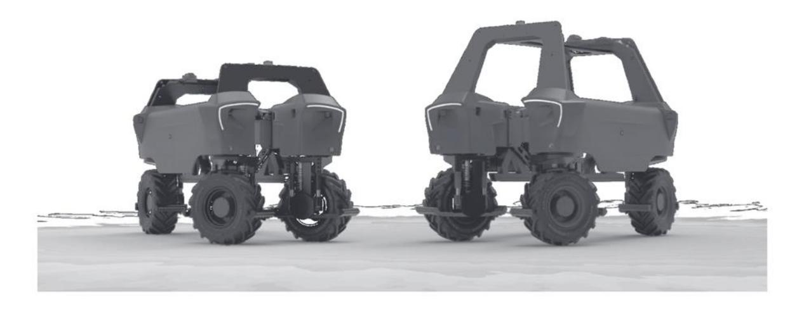

# **C. Éléments de correction**

# **Partie A**

$$\underline{\mathbf{A1:}} \qquad \overrightarrow{P_{x}} = -Mg\sin(\theta)\,\vec{x}$$

**A2 :** Principe fondamental de la dynamique ∑ = projeté sur l'axe x.

$$a_X = \frac{2 \cdot \|\overrightarrow{T_{AV}}\| + 2 \cdot \|\overrightarrow{T_{AR}}\| - \|\overrightarrow{F_{outils}}\| - Mg\sin(\theta)}{M}$$

$$\underline{\mathbf{A3:}} \qquad \left\| \overrightarrow{T_{AR}} \right\| = \frac{5}{12} \cdot \left( M \cdot (a_X + g \sin(\theta)) + \left\| \overrightarrow{F_{outuls}} \right\| \right)$$

$$A.N.: \|\overrightarrow{T_{AR}}\| = 4325 N$$

**A4 :** Chaque moteur devra fournir un couple de = ‖ ⃗⃗⃗⃗⃗⃗ ‖ ∙ = 1 591

A5: 
$$N = 0 tr \cdot min^{-1}$$
 (démarrage)  $C_{roue} = 1591 Nm$ 

Après positionnement sur le graphique, le moteur référence 1 est retenu.

A6 et A7 : 
$$P_{moy} = (Crr \cdot Mg + F_{outils}) \cdot V$$
  $P_{abs} = \frac{P_{moy}}{\eta_{cs} \cdot \eta_{ms} \cdot \eta_{réd}}$ 

| Batterie | Masse    | 𝑃𝑚𝑜𝑦    | 𝑃𝑎𝑏𝑠    |
|----------|----------|---------|---------|
| 80 kWh   | 2 500 kg | 3 584 W | 5 715 W |
| 60 kWh   | 2 450 kg | 3 557 W | 5 672 W |
| 40 kWh   | 2 400 kg | 3 530 W | 5 628 W |

**A8 :** L'énergie est égale au produit de la puissance par le temps, il vient donc :

| 𝑃𝑎𝑏𝑠    | Temps   |
|---------|---------|
| 5 715 W | 14 h    |
| 5 672 W | 10,57 h |
| 5 628 W | 7,1 h   |

**A9 :** Toutes les batteries conviennent. On retiendra toutefois la batterie de 60 kWh car plus confortable d'utilisation que la batterie de 40 kWh trop juste au niveau de l'autonomie et qui laisserait très peu de marge.

7

#### **Partie B**

**B1:** distance parcourue : 
$$100 \times 30 = 3000 m = 3 km$$

Vitesse : 
$$4 km \cdot h^{-1}$$

$$t = \frac{distance}{vitesse} = \frac{3}{4} = 0,75 \ h = 45 \ min$$

**B2**: 
$$5600 \cdot 0.75 = 4200 Wh$$

**B3 :** - Stocker l'énergie produite en journée pour recharger le robot la nuit

- Pouvoir revendre le surplus par injection sur le réseau,
- Possibilité d'autoconsommation pour des besoins courants,
- Il faut un hacheur (convertisseur DC/DC).

B4: 
$$\frac{1 \text{ kWh batterie Bakus}}{0.88 \cdot 0.98} = 1,16 \text{ kWh solaire}$$

**B5:** 
$$\frac{4\,200\,Wh\,motorisation\,Bakus}{0.88\cdot0.98\cdot0.63} = 7\,730\,Wh\,solaire$$

**B6 :** Au regard de la période d'utilisation de Bakus, c'est en octobre que nous avons le minimum d'énergie produite à savoir 80,3 kWh pour 30 jours

Soit 80.3 ℎ 30 = 2,67 ℎ/ de produit pour 1 installé.

Nous avons donc besoin de 40 2,67 ≈ 15 installés

#### **B7 :**

| Mois      | Données DT1 pour 1 kWp (en kWh) | Pour 15 kWp (en kWh) | Consommation mensuelle du robot Bakus (40 kwh*30 jours) (en kWh) | Surplus mensuel d'énergie produite par l'ensemble de l'installation des panneaux photovoltaïque (en kWh) |
|-----------|---------------------------------------|-------------------------|---------------------------------------------------------------------------------|----------------------------------------------------------------------------------------------------------------------------------------|
| Janvier   | 44                                    | 660                     | 0                                                                               | 660                                                                                                                                    |
| Février   | 55,8                                  | 837                     | 0                                                                               | 837                                                                                                                                    |
| Mars      | 102,2                                 | 1 533                   | 1 200                                                                           | 333                                                                                                                                    |
| Avril     | 125,6                                 | 1 884                   | 1 200                                                                           | 684                                                                                                                                    |
| Mai       | 124,1                                 | 1 861,5                 | 1 200                                                                           | 661,5                                                                                                                                  |
| Juin      | 127,8                                 | 1 917                   | 1 200                                                                           | 717                                                                                                                                    |
| Juillet   | 130,5                                 | 1 957,5                 | 1 200                                                                           | 755                                                                                                                                    |
| Août      | 124,3                                 | 1 864,5                 | 1 200                                                                           | 664,5                                                                                                                                  |
| Septembre | 108,9                                 | 1 633,5                 | 1 200                                                                           | 433,5                                                                                                                                  |
| Octobre   | 80,3                                  | 1 204,5                 | 1 200                                                                           | 4,5                                                                                                                                    |
| Novembre  | 47,1                                  | 706,5                   | 0                                                                               | 706,5                                                                                                                                  |
| Décembre  | 41,9                                  | 628,5                   | 0                                                                               | 628,5                                                                                                                                  |

**B8 :** Somme du différentiel sur les mois de mars à octobre inclus = 4 255 kWh

**B9 :** Somme du différentiel sur les mois restants = 2 832 kWh

#### **B10 :**

| Solution 1                        | Solution 2                                   |
|-----------------------------------|----------------------------------------------|
| Plus de panneaux solaire          | Moins de panneaux solaire                    |
| Plus cher à l'installation        | Moins cher à l'installation                  |
| Plus d'indépendance énergétique   | Achat d'énergie obligatoire (prix fluctuant) |
| Du surplus énergétique à revendre | Moins de surplus énergétique à revendre      |
| Indépendance énergétique          | Dépendance du réseau pour l'achat d'énergie. |

Le retour sur investissement dépendra du prix de l'installation initiale, du prix de revente de l'énergie en surplus et du prix d'achat de l'énergie sur les périodes nécessaires.

### **Partie C**

**C1 :** Une batterie élémentaire est modélisée par un générateur de tension de 3,6V en série avec une résistance de 15 mΩ

On veut 25 V 25/3,6 7 batteries en série.

Ce qui donnera un générateur de tension de 25,2 V en série avec une résistance de :

7 ∙ 15 = 105 Ω

**C2 :** On veut 400 Ah or une branche série délivre 3,3 Ah

400/3,3 = 122 branches en parallèle

Soit un générateur de tension de 25,2V en série avec une résistance de 7×15/122=0,86 mΩ

Remarques : à la résistance totale de Thévenin il faudra ajouter toutes les résistances de connexions résultantes de l'assemblage série/parallèle retenu que l'on a négligées ici.

# **C3 :** Schéma équivalent

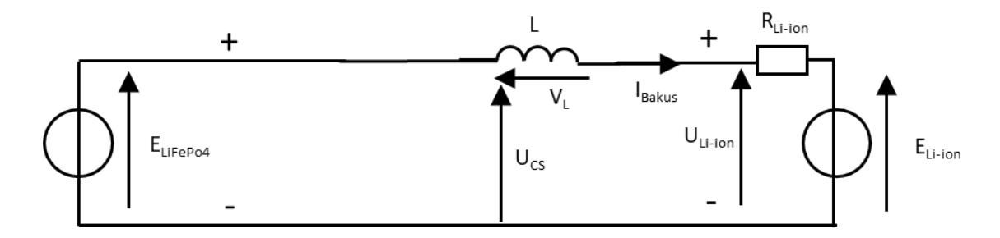

 + − ∙ = 4 − − On négligera − ensuite.

$$i_{Bakus}(t) = \frac{E_{LiFePo4} - E_{Li-ion}}{L} \cdot t + I_{min}$$

## **C4 :** Schéma équivalent

 ′ + − ∙ = −− On négligera − ensuite.

$$i_{Bakus}(t') = \frac{-E_{Li-ion}}{L} \cdot t' + I_{Max}$$

avec 
$$t' = t - \alpha T$$

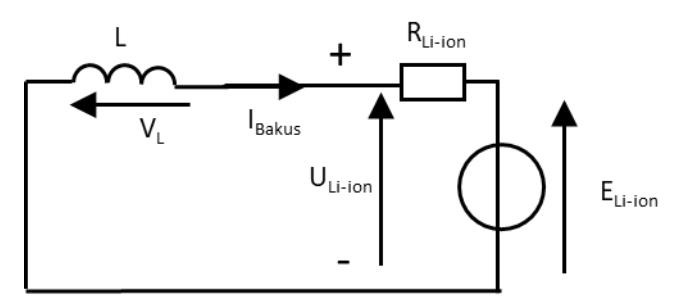

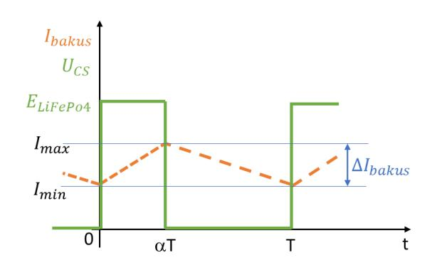

$$\underline{\mathbf{C5}:} \qquad \langle U_{CS} \rangle = \alpha \cdot E_{LiFePo4}$$

$$\langle U_{Li-ion} \rangle = \langle U_{CS} \rangle \operatorname{car} \langle L \frac{di}{dt} \rangle = 0$$

$$\langle U_{Li-ion} \rangle = E_{Li-ion} = \alpha \cdot E_{LiFePo4}$$

**C6:** 
$$70 V \le \langle U_{Li-ion} \rangle = \alpha \cdot E_{LiFePo4} \le 117,5 V$$

$$0.14 \le \alpha \le 0.235$$

L'ondulation ∆ sera donc maximale pour = 0,235

$$L = \frac{(1 - \alpha) \cdot \alpha \cdot T \cdot E_{LiFePo4}}{\Delta i_{Bakus}}$$

$$L = \frac{500 (1 - 0.235) \cdot 0.235}{2 \cdot 50 \cdot 10^3} = 0.9 \text{ mH}$$

<u>C7:</u>

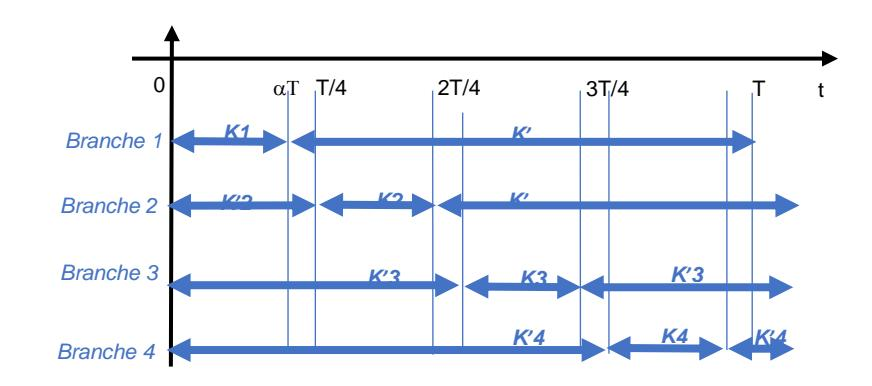

**C8**: 
$$70 V \le \langle U_{Li-ion} \rangle = \alpha \cdot E_{LiFePo4} \le 117.5 V$$

 $0.14 \le \alpha \le 0.235$ 

$$\Delta i'_{Bakus} = \frac{E_{LiFePO4} \cdot T \cdot (1 - 4\alpha) \cdot 4\alpha}{4 \cdot I'} = C^{ste} \cdot (1 - 4\alpha) \cdot \alpha$$

On a donc :  $\Delta i'_{Bakus}(\alpha=0.14) > \Delta i'_{Bakus}(\alpha=0.235)$ 

L'ondulation  $\Delta i'_{Bakus}$  sera donc maximale pour  $\alpha = 0.14$ 

$$\Delta I' = \frac{500 (1 - 4 \cdot 0.14) \cdot 4 \cdot 0.14}{4 \cdot 0.9 \cdot 10^{-3} \cdot 50 \cdot 10^{3}} = 0.68 A$$

La structure à entrelacement nous permet de réduire l'ondulation de courant.

## Partie D

**D1**: 400 kg / 2 = 200 kg par vérin

Soit une force de  $200 \times 9,81 = 1962 N$ 

Vitesse = 40 m⋅ s-1

⇒ Référence 2 convient : HDxxB026

**D2**: 680/0,15=4 533 impulsions. Il faut donc 13 bits car  $2^{13} = 8192 \ge 4533$ 

D3:

| $2^{12}$ | 211  | 2 10 | 29  | 28  | 27  | 2 6 | 2 5 | $2^{4}$ | $2^3$ | 2 2 | 2 1 | 2 0 |                    |
|----------|------|-----------------|-----|-----|-----|----------------|----------------|---------|-------|----------------|----------------|----------------|--------------------|
| 4096     | 2048 | 1024            | 512 | 256 | 128 | 64             | 32             | 16      | 8     | 4              | 2              | 1              |                    |
|          |      |                 |     |     |     |                | 4.8            | 2.4     | 1.2   | 0.6            | 0.3            | 0.15           | ←Précision (en mm) |
| 1        | 0    | 0               | 0   | 1   | 1   | 0              | 1              | 1       | 0     | 1              | 0              | 1              | $=4533_{(10)}$     |
|          | 8    |                 |     |     | D   |                |                |         |       |                |                |                |                    |

Si on ne prendra en compte que les 8 bits de poids fort alors le bit de poids faible de ce groupe correspond à une précision de 4,8 mm ce qui permet de respecter le cahier des charges.

$$10001101_{(2)} = 8D_{(16)}$$

**<u>D4</u>**:  $\omega_A = 10 \ rad \cdot s^{-1}$  pulsation pour laquelle la phase vaut -45°.

 $\omega_{\rm B} = 7\,000\,rad\cdot s^{-1}$  pulsation pour laquelle la phase vaut -135°.

$$K_M = 10^{\frac{26.4}{20}} = 20.9$$

**D5**: 
$$K_{GT}(p) = \frac{5}{1000 \cdot \frac{\pi}{30}} = 0.048 \ V/rad \cdot s^{-1}$$

$$\underline{\mathbf{D6}:} \qquad FTBO(p) = \frac{K_{PV} \cdot K_M \cdot K_{GT}}{\left(1 + \frac{p}{\omega_A}\right) \cdot \left(1 + \frac{p}{\omega_B}\right)}$$

**D7 :** ∙ = 1 Même diagramme de Bode en gain mais décalé verticalement pour avoir le gain quand → 0 à la valeur de 20 ∙ () = 0 . La phase reste identique.

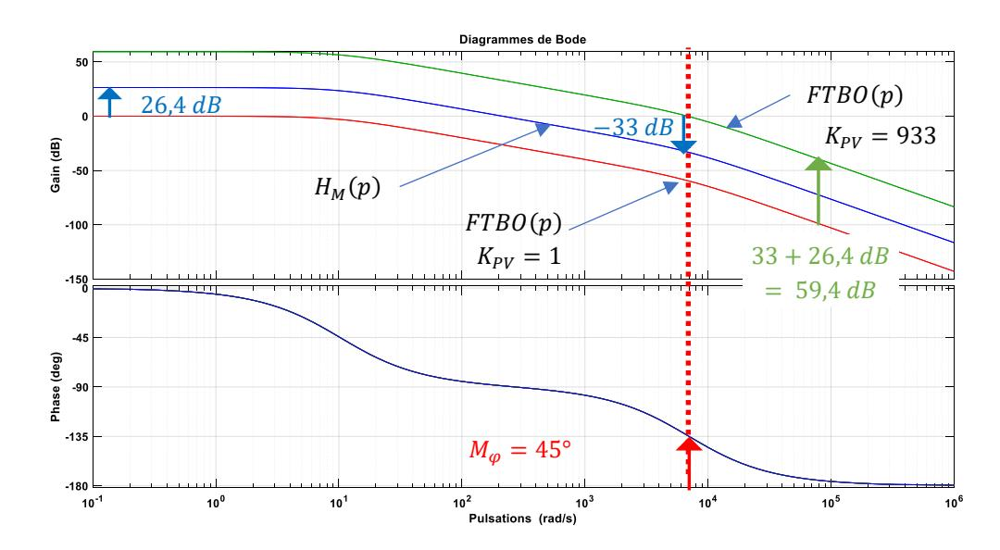

**D8 :** Il faut que pour la pulsation = 7 000 ⋅ −1 pour laquelle la marge de phase serait de 45°, il faut avoir un gain à 0 dB. Pour ce faire il faut donc remonter la courbe de gain de 33+26,4 59,4 dB soit un gain = 10 33+26,4 20 = 933

**D9 :** (∞) = 0 On mesure l'écart en régime permanent.

Le cahier des charges est respecté.

#### **Partie E**

**E1 :** La technologie utilisée est le GPS RTK, il nécessite l'utilisation de deux équipements.

**E2 :** Le choix de la technologie DGPS offre une meilleure précision.

**E3 :** GPIO14TXD borne 8

GPIO15RXD borne 10

Il s'agit d'une liaison série.

**E4 :** 10 bits : 1 bit de start

8 bits de données

1 bit de stop

**E5 :** 0100 0101(2) = 45(16) ce qui correspond au caractère « E » de la table ASCII.

**E6 :** « W » = 57(16) = 0101 0111(2)

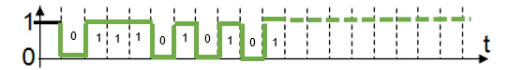

**E7 :** La trame comporte 71 caractères soit 710 bits (10 bits par caractère) soit 89 octets.

La durée de transmission de la trame est 710 115 200 = 6,16

**E8 :** La distance parcourue pendant la durée de transmission de la trame est :

6 3,6 ∙ 710 115 200 = 1,03 . On n'est donc pas à la précision requise par le cahier des charges. Il faudra choisir une liaison plus rapide.

## **Partie F**

**F1 :** 80 % de décharge 22,4V

**F2:** 
$$\frac{V_{S1}}{V_{e1}} = \frac{R_A}{R_A + R_B} = \frac{1}{10}$$
  $R_B = 9 \cdot R_A$ 

Pour un taux de décharge de 80% 1 = 2,24 .

Pour un taux de décharge de 90% 1 = 2,19 .

**F3**: 
$$q = \frac{4}{2^{10}} = 0,0039 V$$

Pour 80% 2,24V correspondent à une sortie du CAN de 2,24 4 2 10 = 573(10) = 10 0011 1101(2)

Pour 90% 2,19V correspondent à une sortie du CAN de 2,19 4 2 10 = 561(10) = 10 0011 0001(2)

**F4 :** La précision de mesure est de 90−80 573−561 = 0,83 % < 1 % Donc le cahier des charges est respecté.

**F5 :** La pente maximale est de 45 %.

Il y aura en fonction de la pente un ralentissement ou un arrêt du robot.

F6: 
$$V_{S2} - V_{Ref2} = (R_1 + R_2) \cdot I$$

$$I = \frac{V_{S2} - V_{Ref2}}{(R_1 + R_2)}$$

(1+2 )

**F7 :** + = 2 + 1 ∙ = 2 + 1 ∙ 2−2 (1+2 ) = 2 1+2 ∙ 2 + 1 1+2 ∙ 2

**F8:** 
$$V_{B+} = 2,42 \times \frac{150}{151} + 15 \times \frac{1}{151} = \frac{378}{151} = 2,5 \text{ V}$$

$$V_{B-} = 2.42 \times \frac{150}{151} - 15 \times \frac{1}{151} = \frac{348}{151} = 2.3 \text{ V}$$

**F9 :** La caractéristique du cycle hystérésis descendant est illustrée ci-contre.

**F10 :** Le seuil haut de pente pour 25 % correspond à une tension de 2,5 V ce qui correspond au seuil haut de basculement du comparateur.

Le seuil bas de pente pour 23 % correspond à une tension de 2,3 V ce qui correspond au seuil bas de basculement du comparateur.

Le fonctionnement obtenu est conforme au cahier des charges.

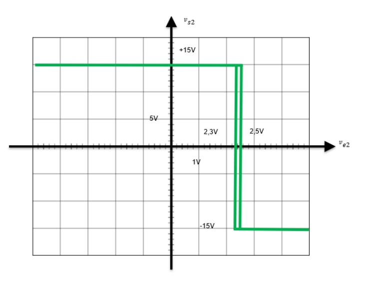

# **D. Commentaires du jury**

## **Présentation du sujet**

Le sujet porte sur l'étude d'un enjambeur électrique autonome de la société Vitibot. À l'instar de l'électrification du monde de l'automobile, ces évolutions touchent aussi l'industrie agricole et viticole. Le sujet se décompose en six parties indépendantes. La première partie conduit au dimensionnement et au choix des moteurs de traction puis se poursuit par la détermination de la capacité énergétique des batteries nécessaire à l'utilisation quotidienne du robot. La seconde partie permet d'étudier la structure de l'installation permettant l'autonomie énergétique du robot grâce à une installation solaire. La troisième partie porte sur l'étude du convertisseur statique permettant la recharge énergétique du robot à partir de l'énergie emmagasinée dans des batteries de stockage. La quatrième partie aborde la problématique de l'asservissement de la hauteur de la perche porte-outils afin de permettre le réglage de la hauteur de travail des outils qui équipent le robot. La cinquième partie traite de l'acquisition du positionnement du robot grâce à la technologie GPS et de la communication des données obtenues. Enfin la dernière partie nous amène à l'étude d'instruments de mesures des données du robot (niveau de charge de la batterie et détection de pente afin d'éviter le basculement du robot).

#### **Analyse des résultats**

Le sujet est composé de six parties indépendantes abordant différents champs de la spécialité ingénierie électrique des sciences industrielles de l'ingénieur. Le questionnement de chaque partie permet une difficulté croissante tout en donnant des résultats intermédiaires afin de favoriser la poursuite de l'étude par le maximum de candidats. Le jury regrette que certains candidats ne traitent que très partiellement (voire pas du tout) une ou plusieurs parties. Le jury recommande aux candidats de bien lire l'ensemble des questions qui composent le sujet.

Il est à noter que toutes les questions ont fait l'objet de bonnes réponses de la part de candidats différents. L'éventail des problématiques et domaines des sciences industrielles abordés dans le sujet permettait à chaque candidat d'exprimer son potentiel.

Le jury a relevé trop d'expressions littérales inhomogènes, d'unités en désaccord avec les grandeurs physiques, de valeurs numériques aberrantes. Il rappelle la nécessité d'une rédaction claire et lisible avec des résultats encadrés, la capacité à restituer clairement son raisonnement étant une compétence inhérente au métier d'enseignant.

#### **Commentaires sur les réponses apportées et conseils aux futurs candidats**

La première partie a été abordée par beaucoup de candidats mais le jury remarque que trop d'entre eux ne maitrisent pas la projection d'un vecteur sur un axe donné. L'application du principe fondamental de la dynamique présente des difficultés pour un nombre significatif de candidats. Le jury recommande aux futurs candidats de parfaire leur maitrise de ces lois fondamentales qui sont nécessaires dans le dimensionnement des constituants d'une chaîne de puissance.

La seconde partie a également été abordée par beaucoup de candidats. Le jury apprécie que les arguments utilisés dans la conclusion aient été étayés dans la majorité des copies. Toutefois le jury regrette que des résultats incohérents liés à une mauvaise utilisation des rendements n'éveillent pas l'attention de certains candidats. De même, certains candidats ne maitrisent pas la nature des conversions que recouvrent les noms tels que « onduleur » ou « redresseur ». Le jury attend des candidats la maitrise des connaissances de base des convertisseurs statiques.

La troisième partie concerne l'étude du convertisseur statique DC/DC. Les premières questions permettaient d'établir le modèle de Thévenin d'un pack de batteries. Trop de candidats ne répondent que partiellement aux questions. Le jury invite les candidats à revoir ce modèle ainsi que les règles d'associations de résistances en série et en parallèle. Dans l'étude du hacheur, peu de candidats établissent l'équation du courant dans les deux phases de conduction à partir du schéma de la maille concernée. Trop de candidats dessinent l'allure du courant sans avoir établi l'équation de ce dernier. La capacité à étudier l'évolution temporelle des grandeurs électriques dans les convertisseurs statiques est attendue d'un candidat.

La quatrième partie portait sur l'asservissement, trop peu de candidats l'ont traitée de manière satisfaisante. C'est un champ disciplinaire important des sciences industrielles auquel les candidats au CAPET de SII ne peuvent se soustraire. Le jury invite les candidats à revoir les concepts de base de ce domaine comme les notions de boucle ouverte, de correcteur ou encore de marge de phase.

La cinquième partie permettait d'aborder l'électronique numérique et la communication par liaison série. Le jury constate beaucoup d'amalgames entre bit et octet et invite les candidats à revoir le principe d'une liaison série.

La dernière partie permettait aux travers l'étude d'instruments de mesures d'explorer le champ disciplinaire de l'électronique analogique et numérique. Cette partie a été traitée partiellement par les candidats. Le jury regrette l'absence, pour certains candidats, de démonstrations demandées à certaines questions en se contentant juste de recopier la formule à démontrer. Le jury remarque aussi la non-prise en compte d'informations issues de l'énoncé.

## **E. Résultats**

Les statistiques générales pour cette épreuve sont données ci-dessous.

|                  | CAPET (public) | CAFEP (privé) |
|------------------|----------------|---------------|
| Nombre de copies | 83             | 21            |
| Moyenne          | 7,96 / 20      | 8,15 / 20     |
| Note maximum     | 15,00 / 20     | 13,60 / 20    |
| Écart type       | 3,01           | 3,04          |

# **Épreuve écrite disciplinaire appliquée**

# **A. Présentation de l'épreuve**

 Durée : 5 heures Coefficient 2

L'épreuve, commune à toutes les options, porte sur l'analyse et l'exploitation pédagogique d'un système pluri-technologique. Elle invite le candidat à la conception d'une séquence d'enseignement, à partir d'une problématique et d'un cahier des charges.

L'épreuve permet de vérifier :

- que le candidat est capable de mobiliser ses connaissances scientifiques et technologiques pour conduire une analyse systémique, élaborer et exploiter les modèles de comportement permettant de quantifier les performances d'un système pluri-technologique des points de vue de la matière, de l'énergie et/ou de l'information, afin de valider tout ou partie de la réponse au besoin exprimé par un cahier des charges ;
- qu'il est capable d'élaborer tout ou partie de l'organisation d'une séquence pédagogique ainsi que les documents techniques et pédagogiques associés (documents professeurs, documents fournis aux élèves, éléments d'évaluation).

Les productions pédagogiques attendues sont relatives à une séquence d'enseignement portant sur les programmes de collège ou de lycée.

L'épreuve est notée sur 20. Une note globale égale ou inférieure à 5 est éliminatoire.

# **B. Sujet**

Le sujet est disponible en téléchargement sur le site du ministère à l'adresse : <https://www.devenirenseignant.gouv.fr/media/5981/download>

Depuis quinze ans, un nouveau concept de serre s'est développé en France : la serre semi-fermée. Plusieurs modèles de serres ont été développés par les différents constructeurs mais actuellement une version standard est proposée. Elle est caractérisée par un système de traitement d'air piloté dont le rôle est d'homogénéiser le climat de la serre en évitant de forts écarts de température et d'hygrométrie.

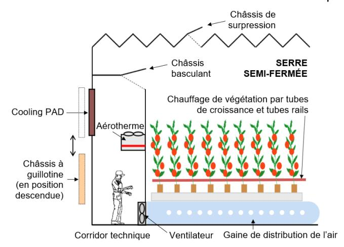

Ce système comprend un corridor technique, couloir occupant toute la longueur de la serre et permettant les opérations suivantes :

- réchauffer l'air via des aérothermes (échangeurs thermiques air / eau) installés en hauteur dans le corridor ;
- distribuer et brasser l'air dans la serre au moyen de ventilateurs et de gaines de distribution perforées et placées sous les tubes de chauffage d'eau situés dans la végétation ;
- refroidir et humidifier l'air extérieur en le faisant circuler au travers de panneaux de refroidissement par évaporation, appelés Cooling PAD, positionnés en façade du corridor et humidifiés en continu ;
- injecter du CO2 dans la serre pour améliorer le rendement photosynthétique (la distribution du CO2 n'est pas représentée sur le schéma de principe).

## **Problématique du sujet**

L'étude porte sur le système de traitement d'air piloté qui équipe les deux serres semi-fermées du Mas Blanc à Alenya dans les Pyrénées-Orientales. Il répond à la problématique générale :

## **« Créer dans la serre un climat de croissance optimal pour la tomate avec une utilisation rationnelle de l'énergie et de l'eau. »**

Le système étudié doit remplir plusieurs exigences décrites dans le diagramme partiel des exigences notamment :

- de résister aux chargements climatiques et d'exploitation ;
- de diffuser dans la serre l'air extérieur refroidi ou l'air intérieur réchauffé ;
- de gérer la surpression et d'évacuer l'air chaud en toiture ;
- de rafraîchir et humidifier l'air de la serre.

#### Les objectifs de l'étude sont de :

- valider les solutions techniques envisagées pour satisfaire ces exigences et de vérifier que le système répond à la problématique générale ;
- conduire un projet pluridisciplinaire à partir de la visite de la serre au sein du collège Paul Langevin (66200 Elne).

# **C. Éléments de correction**

## **Question 1**

- Organisation générale du projet, temporalité, moyens…
- Connaissances disciplinaires travaillées
- Modalités de travail en équipe

## **Question 2**

Niveaux de collaboration :

- 1- le projet est support au cours du professeur d'anglais
- 2- des collaborations sont construites entre les contenus disciplinaires (sciences et anglais) tout au long du projet. Exemple, notice d'usage en anglais d'un système présent dans la serre, étudiée lors de la visite
- 3- suite à cette visite, des interactions entre les professeurs ponctuées de co-enseignement et des séquences ou l'anglais est intégré à la démarche scientifique d'investigation.

#### **Question 3**

- Poutre au vent de la toiture : elle permet de contreventer la toiture et de transmettre les efforts vers les poteaux puis les fondations.
- Palée de stabilité / croix de Saint-André : elles permettent de contreventer la structure vis-à-vis du vent, de la rigidifier et de limiter les déplacements horizontaux. Elles stabilisent longitudinalement la structure. Elles font transiter les efforts horizontaux jusqu'aux fondations.

## **Question 4**

Barre AD en compression, barre BC en traction

#### **Question 5**

Surface de toiture reprise par un poteau courant : 9 x 4,5 = 40,5 m²

Poutre courante de longueur 9 m

Charges permanentes :

- Poutre courante : 111 N∙m-1 sur la longueur de la poutre
- Cultures et gouttières : (400 + 150) N∙m-2 sur la surface reprise par un poteau courant

• G = [111 x 9 + (400 + 150) x 4,5 x 9] x 10-3 = 23.28 kN

## Charge climatique :

• Neige S = 638 x 4,5 x 9 x 10-3 = **25,84 kN**

Combinaison d'actions à prendre en compte : 1,35 x G + 1,5 x S

• 1,35 x 23,28 + 1,5 x 25,84 = **70.2 kN** en tête de poteau.

## **Question 6**

- Section du poteau : 1696 mm²
- Acier S235 donc limite élastique fy= 235 MPa
- Effort maxi de compression : Fmax = 398,6 kN
- Effort ponctuel question précédente : F= 70.2 kN
- Donc répond au cahier des charges

#### **Question 7**

- La prise en compte du flambement se traduit par une augmentation de l'inertie de la section
- Risque de chocs potentiels
- Charges exceptionnelles (robot de nettoyage…)
- Les contraintes liées aux assemblages

#### **Question 8**

Le candidat s'appuie sur la démarche d'investigation et/ou de résolution de problème respectant la contextualisation d'une situation problème, l'investigation ou la résolution du problème et la structuration des connaissances auprès des élèves.

Une activité expérimentale est proposée (mesure de flèche sur une poutre encastrée à ses deux extrémités et chargée en son milieu, calcul de masse à partir d'un logiciel de simulation, …).

#### **Question 9**

Compétences travaillées (annexe 8 (1/4))

Pratiquer des démarches scientifiques et technologiques :

- Imaginer, synthétiser, formaliser et respecter une procédure, un protocole.
- Mesurer des grandeurs de manière directe ou indirecte.
- Rechercher des solutions techniques à un problème posé, expliciter ses choix et les communiquer en argumentant.
- Participer à l'organisation et au déroulement de projets.

#### Mobiliser des outils numériques

 Simuler numériquement la structure et/ou le comportement d'un objet. (s'il est fait référence à une simulation numérique dans l'activité proposée)

#### Compétences associées (annexe 8)

- Imaginer, synthétiser et formaliser une procédure, un protocole.
- Utiliser une modélisation pour comprendre, formaliser, partager, construire, investiguer, prouver.

## Connaissances :

- Besoin, contraintes, normalisation.
- Notions d'écarts entre les attentes fixées par le cahier des charges et les résultats de l'expérimentation.
- Outils de description d'un fonctionnement, d'une structure et d'un comportement
- Procédure protocoles

Autres propositions acceptées si elles sont justifiées et appartiennent aux trois attendus de fin de cycle suivants :

- Imaginer des solutions en réponse aux besoins, matérialiser des idées en intégrant une dimension design.
- Analyser le fonctionnement et la structure d'un objet.
- Utiliser une modélisation et simuler le comportement d'un objet.

#### **Question 10**

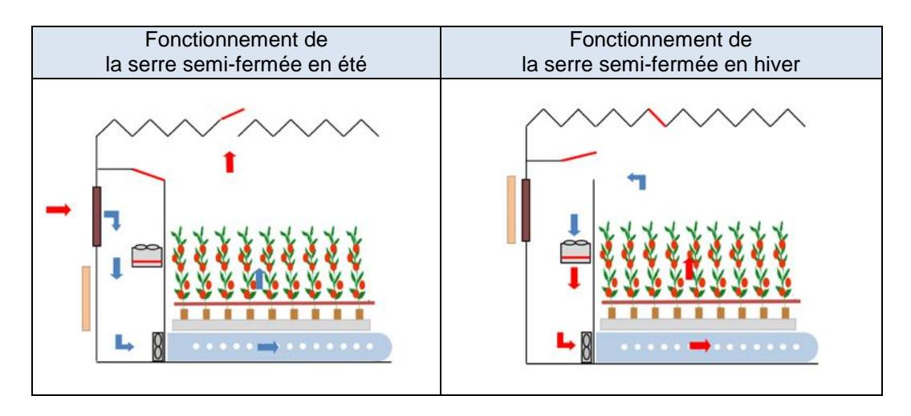

La plage de variation du taux de renouvellement d'air est réglable de 2 volumes de serre·h-1 en hiver jusqu'à 10,5 volumes de serre·h-1 en été.

Le volume de la serre étant de 137 447 m3 , on en déduit que la plage de variation s'étend de 274 894 m3 ·h-1 à 1 443 193 (ou 1 443 194 m3 ·h-1 )

## **Question 12**

D'après l'indice de multiplicité, le nombre total de ventilateurs est 102.

#### **Question 13**

En été, pour atteindre le taux maximal de renouvellement d'air exigé, les 102 ventilateurs fonctionnent et délivrent chacun le même débit d'air :

qv-maxi = 1 443 193 ou 1443 194 / 102 = 14149 m3 ·h-1

En hiver, pour atteindre le taux maximal de renouvellement d'air exigé tout en réduisant la consommation énergétique électrique, seuls 102 / 3 = 34 ventilateurs fonctionnent et délivrent chacun le même débit d'air :

qv-mini = 274 893 / 34 = 8085 m3 ·h-1

### **Question 14**

Ces valeurs restent inférieures au débit maximal d'air dans les gaines : 16 286 m3 ·h-1 .

#### **Question 15**

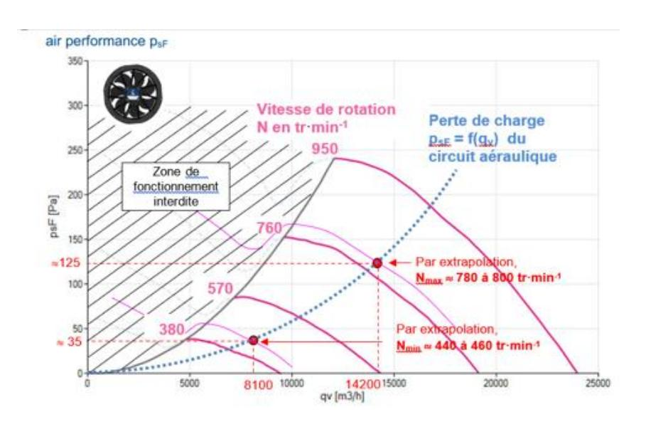

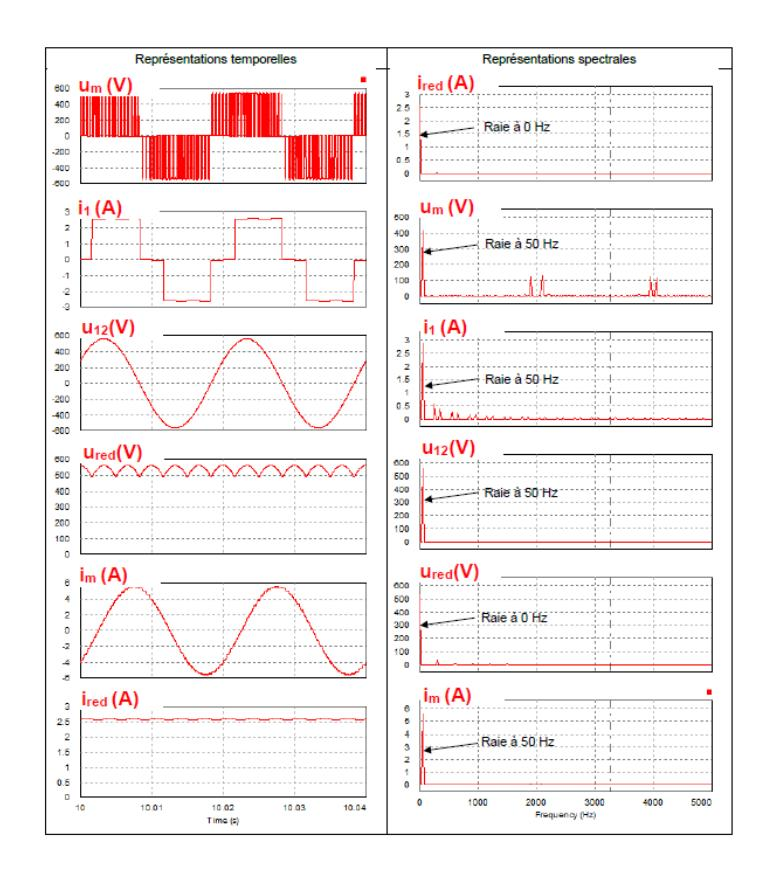

## **Question 17**

Cette technique permet d'éliminer les premiers harmoniques des tensions statoriques. Les enroulements du moteur se comportant comme des filtres passe-bas, les **courants statoriques appelés sont quasiment sinusoïdaux** (ce qui assure une rotation régulière et sans à-coups et limite les échauffements).

#### **Question 18**

En considérant que le glissement est négligeable au point nominal, il vient :

Nombre de paires de pôles p : Ns~ Nn = 60.f p ⇒ p ~ 60.f Nn = 60.50 950 = 3,16 et entier donc = Vitesse de synchronisme : Ns = 60.f p = 60.50 3 = . −

19

#### **Question 19**

Si on raisonne pour f = 50 Hz, le coefficient directeur du segment de droite est :

$$a = \frac{0 - 16}{\text{Ns } (50 \text{ Hz}) - 950} = \frac{-16}{1000 - 950} = \boxed{-0.32 \frac{\text{Nm}}{\text{tr. min}^{-1}}}$$

d'où l'équation : C = a ∙ N + b avec C = 0 si N = Ns d'où b = - a∙Ns

Par conséquent : C = 0,32 ∙ (N − N)

Comme Ns = 60.f p , il vient : = , ∙ ( . − )

#### **Question 20**

En régime établi, C = 0,32 ∙ ( 60.f p − ) = 1,77 ∙ 10−5 · N 2 soit = ( ,.− , +) ∙ 

Valeur minimale hiver : N = 450 tr∙min-1 **f = 23,1 Hz** Valeur maximale été : N = 800 tr∙min-1 **f = 41,8 Hz**

|                                                                                             | Valeur minimale (hiver) | Valeur maximale (été) |
|---------------------------------------------------------------------------------------------|----------------------------|--------------------------|
| Taux de renouvellement d'air en volumes de serre h-1 (question 11)                       | 2                          | 10,5                     |
| Taux de renouvellement d'air en m³-h⁻¹ (question 11)                                     | 274 894                    | 1 443 193(4)             |
| Nombre de ventilateurs en fonctionnement (question 13)                                   | 34                         | 102                      |
| Débit d'air des ventilateurs <u>en</u> fonctionnement en m 3 ·h -1 | 8100                       | 14200                    |
| Vitesse de rotation des ventilateurs en fonctionnement en tr·min -1           | 450                        | 800                      |
| Fréquences d'alimentation f des MAS (en Hz) (question 20)                                   | 23,1 Hz                    | 41,8 Hz                  |

## **Question 22**

Si la communication s'effectue via le RS232, il ne peut y avoir dans ce cas qu'un seul maitre et qu'un seul esclave et la distance est insuffisante. Par contre, si la communication s'effectue via le bus RS485 ou le bus RS422, on peut avoir plusieurs esclaves (32 pour RS 485 contre 10 pour RS 422).

On privilégie le bus RS 485 pour le nombre de récepteurs et le nombre de fils réduit (coût plus faible et diminution de la complexité de câblage). Il nécessitera des répéteurs pour étendre à 51 le nombre d'esclaves par corridor.

#### **Question 23**

Trame émise par la passerelle (maître) : 00 06 0F A0 01 A2 22 C0 Adresse de l'esclave : 00 (diffusion ou « broadcast » en anglo-saxon)

Fonction : 06 (écriture d'un mot)

Donnée : 0F A0 01 A2 ou 01 A2 (valeur du mot)

0F A0 (adresse du registre d'écriture) et 01 A2 (valeur du mot)

CRC : 22 C0 (CRC en ligne : [http://www.sunshine2k.de/coding/javascript/crc/crc\\_js.html\)](http://www.sunshine2k.de/coding/javascript/crc/crc_js.html)

## **Question 24**

La consigne de fréquence envoyée à tous les modulateurs d'énergie est :

01 A2 = 1 x 162 + 10 x 161 + 2 = 418 / 10 = **41,8 Hz**

Tous les ventilateurs vont donc tourner à 800 tr∙min-1 d'après les résultats précédents.

## **Question 25**

On peut lire ce message lors d'un fonctionnement en été avec un taux maximal de renouvellement d'air (voir nombre de ventilateurs en fonctionnement et vitesse de rotation dans le tableau de synthèse).

#### **Question 26**

Liste : poste serveur, postes client, routeur, switch (commutateur), passerelle, câbles réseau RJ45, routeur WIFI.

Activités proposées :

- agencer les composants de la structure matérielle du réseau à l'aide de symbole dans un schéma
- tracer la topographie du réseau de la serre semi-fermée
- identifier la circulation du flux d'information entre deux éléments du réseau

#### **Question 27**

Questions de structure (réponses détaillées)

Q1/ Qu'est-ce qu'un réseau ?

a/ La liaison entre des ordinateurs par câbles uniquement

b/ Pouvoir aller sur Internet

**c/ La liaison entre des ordinateurs filaire ou non filaire (bonne réponse)**

d/ Avoir un serveur pour s'y connecter

Q2/ Le boitier auquel sont reliés les câbles réseau des ordinateurs s'appelle :

a/ Modem routeur b/ table de mixage c/ boîte de dérivation

d/ passerelle **e/ switch (bonne réponse)**

On donne la structure d'un réseau :

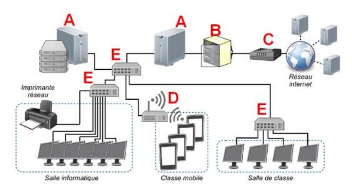

Q3/ Questions multiples : Les éléments A à E sont :

Serveur, baie de brassage, modem, routeur principal, data center, ….

Q4/ Sur le schéma, le chemin d'une image prise par une tablette de la classe mobile envoyée vers la salle de classe, circule dans le réseau LAN en suivant le chemin suivant :

a/ D E E

**b/ D E A E E**

## **Question 28**

Imaginer des solutions en réponse aux besoins (annexe 8 (2/4))

Analyser le fonctionnement et la structure d'un objet (annexe (8) (3/4))

Comprendre le fonctionnement d'un réseau informatique (annexe 8 (4/4))

Écrire, mettre au point et exécuter un programme (annexe 8 (4/4))

Notions d'algorithmes et de programmes, variable informatique..., boucles, systèmes embarqués sont des connaissances

(À ne pas confondre avec compétences : analyser, écrire…)

## **Question 29**

Réducteur de type « roue et vis sans fin autobloquant » à denture hélicoïdale (voir Annexe 7). Caractéristique : Système irréversible, fonction sécurité anti-retour.

## **Question 30**

Dans la direction ⃗⃗⃗⃗⃗⃗ ou +⃗ **.** Effort de tirage.

#### **Question 31**

$$\sin\alpha = \frac{\frac{H_{ouv}}{2}}{L_3} \quad \Rightarrow \quad \boxed{H_{ouv} = 2 \cdot L_3 \cdot \sin\alpha} \ \Rightarrow \ \boxed{H_{ouv} = 0,938 \ m}$$

#### **Question 32**

$$\Delta x = 1750 - 880 = 870 \text{ mm}$$
 (861,8 mm précisément)  
 $V = |\dot{x}(t)|_{moy} = \frac{0.87}{180} = 4.83 \cdot 10^{-3} \text{ m} \cdot \text{s}^{-1}$ 

 $V = 4,83 \cdot 10^{-3} \ m \cdot s^{-1}$ , vitesse de déplacement de la crémaillère.

Le pignon d'entraînement de la crémaillère a un diamètre  $D_3$  de 44 mm soit 0,044 m (voir figure 17).

$$\begin{split} & \omega_{r} = \frac{2 \cdot V}{D_{3}} = \frac{2 \cdot 4,83 \cdot 10^{-3}}{0,044} \ = 0,2195 \approx \textbf{0},\textbf{22} \ \textbf{rad} \cdot \textbf{s}^{-1} \\ & N_{r} = \frac{\omega_{r} \cdot 60}{2\pi} = \frac{0,22 \cdot 60}{2\pi} = \textbf{2},\textbf{1} \ \textbf{tr} \cdot \textbf{min}^{-1} \\ & N_{m} = N_{r} \cdot 2,76 = \textbf{5},\textbf{79} \ \textbf{tr} \cdot \textbf{min}^{-1} \\ & \omega_{m} = \frac{2 \cdot \pi \cdot N_{m}}{60} = \textbf{0},\textbf{6} \ \textbf{rad} \cdot \textbf{s}^{-1} \end{split}$$

Question 33  $V = 4.83 \cdot 10^{-3} \text{ m} \cdot \text{s}^{-1}$   $\omega_r = 0.22 \text{ rad} \cdot \text{s}^{-1}$   $N_r = 2.1 \text{ tr} \cdot \text{min}^{-1}$   $\omega_m = 0.6 \text{ rad} \cdot \text{s}^{-1}$  $N_m = 5.79 \text{ tr} \cdot \text{min}^{-1}$ 

#### **Question 34**

Action de la pesanteur sur (3) en G:  $\left\{T_{pes\rightarrow3}\right\} = \begin{cases} -m_3 g \, \overline{y_0} \\ \overline{0} \end{cases}_{(\overline{x_0}, \overline{y_0}, \overline{z_0})}$  Action de (0) sur (3) en C:  $\left\{T_{0\rightarrow3}\right\} = \begin{cases} \overrightarrow{C}_{0\rightarrow3} = X_{03} \overline{x_0} + Y_{03} \overline{y_0} \\ \overline{0} \end{cases}_{(\overline{x_0}, \overline{y_0}, \overline{z_0})}$  Action de (2) sur (3) en R:  $\left\{T_{0\rightarrow3}\right\} = \begin{cases} \overrightarrow{B}_{2\rightarrow3} = X_{23} \overline{x_2} \\ \overline{0} \end{cases}$ 

Action de (2) sur (3) en B :  $\{T_{2\to 3}\} = \begin{cases} \vec{B}_{2\to 3} = X_{23} \vec{x_2} \\ \vec{0} \end{cases}_{(\vec{x_2}, \vec{y_2}, \vec{z_2})}$ 

#### **Question 35**

Application du théorème du moment statique au point C.

$$\begin{split} \sum \overline{M_{C,\overline{3}\to 3}} &= \overline{CG} \wedge (-m_3 g \ \overline{y_0}) + \overline{CB} \wedge X_{23} \overline{x_2} = \overrightarrow{0} \\ &\Rightarrow \frac{L_3}{2} \ \overrightarrow{x}_3 \wedge (-m_3 g \ \overline{y_0}) + L_3 \ \overrightarrow{x_3} \wedge X_{23} \overline{x_2} = \overrightarrow{0} \\ &\frac{L_3}{2} (-m_3 g \cos \alpha) \overrightarrow{z_0} + L_3 X_{23} \sin (\beta - \alpha) \overrightarrow{z_0} = \overrightarrow{0} \Rightarrow \boxed{X_{23} = \frac{m_3 g \cos \alpha}{2.\sin (\beta - \alpha)}} \end{split}$$

#### **Question 36**

D'après le théorème de la résultante statique appliqué au solide (2) isolé :  $\sum \overrightarrow{F_{3\to 3}} = \overrightarrow{0}$  $\overrightarrow{A}_{1\to 2} + \overrightarrow{B}_{3\to 2} = \overrightarrow{A}_{1\to 2} - \overrightarrow{B}_{2\to 3} = \overrightarrow{0} \Rightarrow \overrightarrow{A}_{1\to 2} = \overrightarrow{B}_{2\to 3} = X_{23}\overrightarrow{x_2}$ 

#### **Question 37**

 $F_T = 240 \ N \ \text{pour } \alpha = -8^{\circ}.$ 

#### **Question 38**

Tube « push-pull » 1 entraîne 11 châssis et le 2 en entraîne 10.

$$F_{1max} = 240 \cdot 11 =$$
**2640**  $N$   
 $F_{2max} = 240 \cdot 10 =$ **2400**  $N$ 

Question 38

Ftmax = 2640... N

F2max = 2400... N

#### **Question 39**

Le pignon d'entraînement de la crémaillère a un diamètre D3 de 44 mm soit 0,044 m (voir figure 17).

$$\begin{split} &C_{\text{r1max}} = \frac{D_3}{2} \cdot F_{\text{1max}} = \frac{0,044}{2} \cdot 2640 = 58,08 \approx 58 \text{ N} \cdot \text{m} \\ &C_{\text{r2max}} = \frac{D_3}{2} \cdot F_{\text{2max}} = \frac{0,044}{2} \cdot 2400 = 52,8 \text{ N} \cdot \text{m} \\ &C_{\text{1max}} = \frac{C_{31}}{2,76} = \frac{58}{2,76} = 21,01 \approx 21 \text{N} \cdot \text{m} \\ &C_{\text{2max}} = \frac{C_{32}}{2,76} = \frac{52,8}{2,76} = 19,13 \text{ N} \cdot \text{m} \\ &C_{\text{Mmax}} = C_{\text{1max}} + C_{\text{2max}} = 21 + 19,13 = 40,13 \text{ N} \cdot \text{m} \end{split}$$

Question 39  $C_{rtmax} = 58,08 \text{ N} \cdot \text{m}$   $C_{r2max} = 52,8 \text{ N} \cdot \text{m}$   $C_{tmax} = 21 \text{ N} \cdot \text{m}$   $C_{2max} = 19,1 \text{ N} \cdot \text{m}$   $C_{2max} = 40,13 \text{ N} \cdot \text{m}$ 

Q33 : Vitesse de rotation du moteur : 5,79 tr∙min-1 < 6 tr∙min-1 , validé

Q39 : Couple max moteur : 40,1 N∙m < 120 N∙m, validé.

## **Question 41**

Analyser : analyser les mouvements, les trajectoires de l'ouvrant Modéliser : modéliser des solutions techniques de l'ouvrant

Simuler : simuler le fonctionnement de tout ou partie de l'ouvrant

Concevoir : concevoir une solution technique d'un bloc fonctionnel de l'ouvrant

Prototyper : prototyper une solution technique répondant à une exigence technique de l'ouvrant

Communiquer : décrire à l'aide de SysML et/ou schémas croquis une solution technique.

## **Question 42**

• Identifier le problème

- Identifier les contraintes
- Proposer des solutions à l'aide d'un croquis
- Analyse des propositions : donner les avantages et inconvénients de chaque solution
- Choisir une solution
- Tester
- Communiquer

## **Question 43**

## Exemples :

Modalité temporelle : temps de travail individuel et en groupe

- les élèves dans une première phase répondent individuellement à une série de question autour de l'ouvrant puis sont amenés par un travail de groupe à concevoir une solution technique
- un moment collectif autour de la serre expérimentale du collège permet d'installer la solution retenue par la classe

Modalité spatiale : regroupement en ilots, travail en zone de fabrication, travail en zone de TP sur maquette didactisée

- dans un premier temps, les élèves travaillent par ilot puis sont amenés à prototyper leurs solutions techniques et les adapter aux serres didactisées disponibles

#### **Question 44**

Le candidat présente des moyens présents dans le laboratoire de technologie tels que :

- machine à commande numérique (centres d'usinage, imprimante 3D, scanner 3D),
- logiciels de numérisation 3D (modeleur 3D, logiciel de simulation multiphysique) et/ou de programmation (graphique ou textuel)
- moyens de prototypage d'un système programmable (capteurs, actionneurs, cartes programmables, connectique)
- outils de communication : textuel, graphique ou visuel

## **Question 45**

La grandeur physique asservie est la position angulaire des châssis de surpression.

## **Question 46**

Une rupture de ligne ou une panne de courant donnent I voisin de zéro qui devient alors un indice de surveillance.

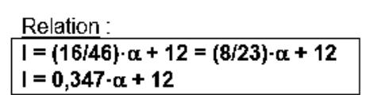

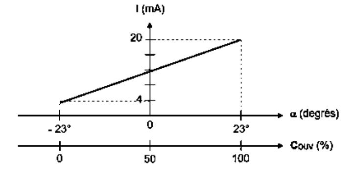

## **Question 48**

| Couv | 25%   | 50% | 75%   | 100% |
|------|-------|-----|-------|------|
|    | -1,8° | -3° | -2,6° | 0°   |

#### **Question 49**

L'erreur maximale est atteinte pour COUV = 50 % (cons = 0°) et est estimée en valeur absolue à 3°. L'exigence de positionnement angulaire des châssis de surpression n'est pas satisfaite car 3° > 0,5°. Ceci reste vrai également pour une large plage de variation de COUV.

#### **Question 50**

Pour compris entre – 23° (COUV = 0%) et 0° (CCOUV = 100%), les courbes Icons = f(cons) et Icons = g() sont pratiquement confondues. L'erreur maximale de positionnement angulaire des châssis de surpression ne semble pas dépasser 0,5° (0,3° maximum en simulation). L'exigence Id = '60' est donc pleinement satisfaite.

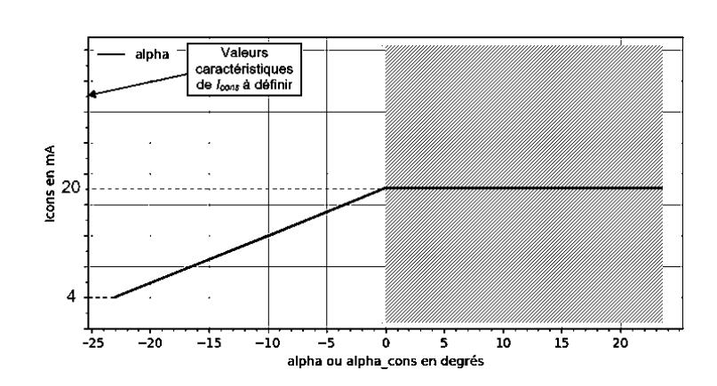

## **Question 51**

6 boites de base de prototypage électronique (type Arduino, microbit…)

Flux d'information (chaine d'information = acquérir, traiter, communiquer)

- Différents types de capteurs analogiques, logiques, tout ou rien…
- Cd'acquisition

#### **Question 52**

Le candidat propose une étude de capteurs autour de la notion de signaux logiques et analogiques montrant un écart de performance et impliquant un choix de solution de capteurs.

#### Exemples :

- Étude du capteur fin de course position haute et basse de la position de l'ouvrant, signal logique
- Étude du capteur de température de l'intérieur de la serre, signal d'acquisition analogique
- Proposition d'étude de deux technologies de capteur permettant de montrer aux élèves l'acquisition d'informations logiques et analogiques

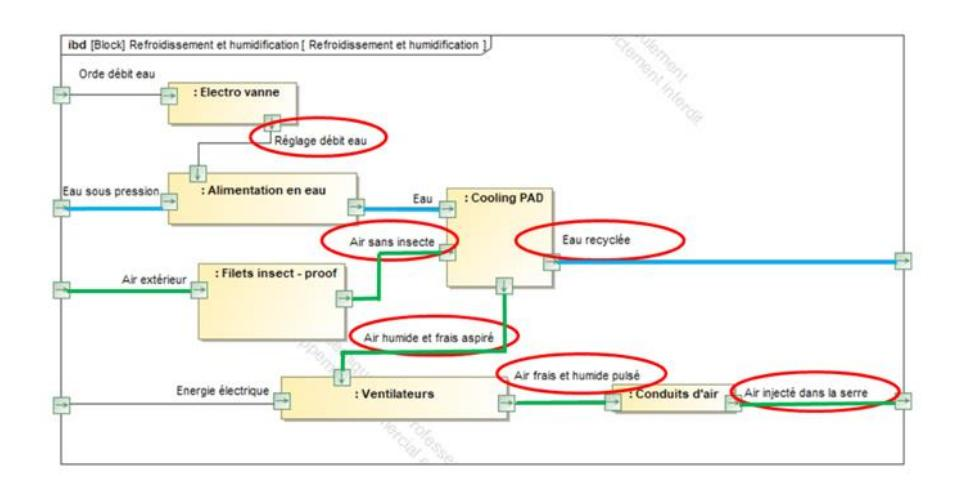

#### **Question 54**

$$\begin{aligned} Q_{air} &= 3600 \cdot 1 \cdot 180 \cdot 1,8 = \boxed{\textbf{1 166 400 m}^3 \cdot \textbf{h}^{-1}} \\ E &= \frac{1,2 \cdot 1 \ 166 \ 400 \cdot (15 - 9)}{1000 \cdot 60} = \boxed{\textbf{140 L} \cdot \textbf{min}^{-1}} \\ C &= (1 + 0,2) \cdot 140 = \boxed{\textbf{168 L} \cdot \textbf{min}^{-1}} \\ \frac{168}{200} &= 0,84 > 0,66 \Rightarrow \boxed{\textbf{N}_{ouv} = 3} \\ t_{ouv} &= \frac{60 \cdot 137447}{1 \ 166 \ 400} = \boxed{\textbf{7 min}} \end{aligned}$$

#### **Question 55**

$$C_{\text{tot}} = 168 \cdot 7 = 1176 \, \text{litres}$$

#### **Question 56**

Hae = lire\_Ha\_DAH(Te,Hre) Has = lire\_Ha\_DAH(Ts,Hrs)

#### **Question 57**

If C/200 < 0.33:

Nouv = 1

elif C/200 < 0.66:

Nouv = 2

else:

Nouv = 3

#### **Question 58**

- l'efficience hydrique en litres d'eau apportée par kg de tomates produites,
- les efficiences énergétiques en kW·h apporté par kg de tomates produites pour les trois cas étudiés,

 les coûts totaux énergétiques en euros par kg de tomates produites pour les trois cas étudiés.

| Conditions                        | s de culture         | Rendement des cultures par m³ d'eau apportée χ̃(kg·m⁻³) | Efficience hydrique (L·kg -1 ) |
|-----------------------------------|----------------------|---------------------------------------------------------------|-------------------------------------------------|
| Champ                             | Culture en terre     | 14                                                            | 71                                              |
| Serres en plastique non chauffées | Culture en terre     | 24                                                            | 41,7                                            |
| Serres chauffées traditionnelles  | Culture sur substrat | 39                                                            | 25,6                                            |
| Serres semi - fermées          | Culture sur substrat | 66                                                            | 15,1                                            |

|                                                        | Cas type A                                                                                               | Cas type B                                                                                | Cas type C            |
|--------------------------------------------------------|----------------------------------------------------------------------------------------------------------|-------------------------------------------------------------------------------------------|-----------------------|
| Date de construction                                   | 2009 (2001 – 2015)                                                                                    | 1997 (1974 – 2015)                                                                     | 1979 (1960 – 1988) |
| Superficies de serres semi- fermées              | 30 %                                                                                                     | <b>5%</b>                                                                                 | 0%                    |
| Calendrier de production                               | Deux productions p Semi en novembre en production débu Semi en août pour production début or | Plantation plus tardive (décembre à février) pour limiter les couts de chauffage |                       |
|                                                        | Consommation                                                                                             | énergétique totale                                                                        |                       |
| Consommation énergétique (kW·h·m -2 ) | 282                                                                                                      | 306                                                                                       | 165                   |
| Rendement des cultures (kg·m -2 )     | 53                                                                                                       | 42,5                                                                                      | 31                    |
| Efficience énergétique (kW-h-kg -1 )  | 5,3                                                                                                      | 7,2                                                                                       | 5,3                   |
|                                                        | Coùt lié                                                                                                 | à l'énergie                                                                               |                       |
| Chauffage (€·m⁻²)                                   | 6,30                                                                                                     | 8,10                                                                                      | 4,85                  |
| Electricité (€·m -2 )                    | 1,44                                                                                                     | 0,68                                                                                      | 0,67                  |
| CO2 liquide (€·m -2 )                    | 0,78                                                                                                     | 0,25                                                                                      | 0,40                  |
| Cout total énergétique (€·kg -1 )     | 0,16                                                                                                     | 0,21                                                                                      | 0,19                  |

#### **Question 59**

La culture sur substrat a permis de réduire considérablement la consommation en eau (passage de 71 L·kg-1 à 25,6 L·kg-1 : gain d'environ 45 L·kg-1 ). Les serres semi-fermées ont apporté un gain supplémentaire d'environ 10 L· kg-1 abaissant la consommation à 15 L· kg-1 . C'est tout de même pratiquement 5 fois moins que la culture en terre.

L'efficience énergétique moyenne du cas-type A est bien meilleure que celle du cas-type B, où le chauffage est utilisé en partie dans des serres anciennes, en comparaison moins bien isolées et moins productives. Avec une consommation moyenne de 165 kWh·m- ², le cas-type C a réduit son coût de chauffage, principalement en décalant les périodes de productions. Les rendements sont ainsi réduits à environ 31 kg·m- ², et la mise en marché est plus tardive et donc moins rémunératrice. Par extrapolation, on peut imaginer que l'efficience énergétique serait encore bien meilleure avec un castype ne comprenant que des serres semi-fermées (superficie 100 %).

En offrant une meilleure gestion climatique toute l'année par rapport à une serre classique « ouverte », les serres semi-fermées améliorent le rendement, permettent de réaliser une économie d'eau et d'énergie, tout en augmentant la protection des cultures. Le système de traitement d'air piloté les caractérisant et étudié dans ce sujet répond donc bien à la problématique générale :

> **« Créer dans la serre un climat de croissance optimal pour la tomate avec une utilisation rationnelle de l'énergie et de l'eau. »**

# **D. Commentaires du jury**

Le sujet présente des questions portant sur les différents champs des sciences industrielles de l'ingénieur, des questions portant sur l'ingénierie système et des questions de pédagogie. Chaque partie présente un niveau de difficulté graduel, le jury conseille aux candidats de parcourir l'intégralité des questions. Toutes les parties sont indépendantes.

Généralement les candidats répondent mieux aux questions appartenant à leur domaine de compétences, certains candidats sont en difficulté sur les questions les plus abordables quel que soit le champ disciplinaire.

Les questions pédagogiques sont insérées dans les différentes parties et font référence au questionnement scientifique et technologue. Elles font appel à l'exploitation des programmes officiels. Le jury relève que peu de candidats sont en capacité de le faire correctement. Souvent, les candidats proposent des déroulés de séquence type qui ne répondent pas à la question posée par exemple en commençant par « définir une problématique ». La confusion entre compétence et connaissance est fréquente. Les activités proposées ne sont pas en adéquation avec le contexte (élèves de collège) et les moyens disponibles dans les établissements.

La lecture de certaines copies est difficile tant l'écriture est illisible ou parsemée de fautes d'orthographe.

## Partie 1. Mise en situation

Elle est composée de deux questions de pédagogie portant sur un projet interdisciplinaire.

Les réponses sont souvent partielles et ne font pas référence au développement de connaissances disciplinaires et/ou compétences du socle. Beaucoup de candidats n'arrivent pas à se mettre à la place de l'initiateur de projet avec une équipe pédagogique variée et n'abordent pas tous les points de l'ordre du jour.

Les exemples de collaboration avec le professeur d'anglais sont souvent simplistes et se limitent à la traduction de termes relatifs au fonctionnement de la serre (cooling pad par exemple) ou de documentations techniques. Très peu de collaborations sont proposées entre les contenus disciplinaires (sciences et anglais) sur un temps long.

#### Partie 2. Résistance de la structure

Sept questions portant sur l'ingénierie des constructions.

Le jury relève la méconnaissance des candidats sur la stabilité des bâtiments, les sollicitations, les chargements… Les unités sont souvent incohérentes. Peu de candidats identifient correctement les contreventements et les palées de stabilité / croix de Saint André dans la structure. Le flambement est rarement évoqué pour justifier une augmentation de la section des poteaux. Beaucoup d'erreurs sont relevées sur le calcul d'une section de poteau ou d'une surface.

En pédagogie la démarche d'investigation n'est jamais évoquée et une certaine confusion existe dans la lecture du programme. Beaucoup de candidats confondent connaissances et compétences et proposent des compétences n'ayant aucun lien avec l'activité expérimentale proposée. La description d'une activité expérimentale à partir de la poutre treillis est mieux traitée, les candidats proposent des schémas explicatifs.

#### Partie 3. Distribution de l'air dans le corridor et la serre

Dix-neuf questions portant sur l'ingénierie système, l'ingénierie électrique et l'ingénierie informatique.

Beaucoup de candidats ont des difficultés pour interpréter le cheminement de l'air dans la serre en fonctionnement été / hiver. Les calculs de débit d'air ont été dans l'ensemble bien menés. Certains candidats n'ont pas profité des points faciles accordés pour reporter des valeurs dans un tableau.

D'une manière générale, les choix doivent être justifiés et présenter des comparaisons de valeurs numériques de mêmes unités, ils doivent être accompagnés d'un petit texte explicatif avec les grandeurs physiques usitées.

L'analyse des formes d'ondes dans un modulateur d'énergie classique est souvent menée aléatoirement sans réflexion poussée. La justification du nombre de paires de pôles d'une MAS à partir des caractéristiques du constructeur est méconnue de nombreux candidats.

Le décodage d'une trame MODBUS n'a pas posé de souci majeur. Néanmoins, l'interprétation a été plus délicate.

Le QCM portant sur le réseau informatique se limite souvent à de simples questions sans aucune proposition de réponses.

La distinction entre attendus de fin de cycle et connaissances / compétences associées n'est pas évidente pour de nombreux candidats.

#### Partie 4. Gestion de la surpression dans la serre

Vingt-quatre questions portant sur l'ingénierie mécanique et l'ingénierie électrique.

Les formules simples de mécanique ne sont pas connues ainsi que les relations trigonométriques de base. Un manque de rigueur est souvent relevé dans la présentation des équations. Les résultats chiffrés doivent être vérifiés et cohérents.

Le déplacement du tube « push-pull » est souvent donné à l'inverse du sens réel ce qui laisse penser que les candidats ont des problèmes de lecture d'un schéma cinématique.

Le positionnement angulaire fait apparaitre des erreurs de signe et un manque de précision.

Les questions de pédagogie souvent traitées superficiellement et ne font pas référence à des solutions (demandées) pour mettre en mouvement l'ouvrant. Les conditions matérielles d'un laboratoire de technologie ne sont pas connues.

#### Partie 5. Rafraichir et humidifier l'air dans la serre

Cinq questions portant sur l'ingénierie système et l'ingénierie informatique.

Les candidats manquent de cohérence dans les valeurs numériques des débits, quantité d'eau et durée d'ouverture du châssis. Ils doivent prendre du recul par rapport aux valeurs trouvées (1 000 000 m3 ·s -1 par exemple).

Peu de candidats ont donné les bonnes réponses aux deux questions de programmation en Python. Seuls les flux sont correctement identifiés sur le diagramme partiel des blocs internes.

#### Partie 6. Conclusion

Les candidats ont bénéficié de deux questions simples portant que la rédaction d'une synthèse et l'analyse du sujet.

Très peu de candidats ont abordé la conclusion et commenté les tableaux. Quelques réflexions poussées et pertinentes ont toutefois été notées pour les candidats qui s'y sont penchés.

Le jury rappelle une nouvelle fois aux candidats l'importance de soigner la présentation de la copie, la qualité de la rédaction et la précision du vocabulaire. Le jury demande aux candidats de faire particulièrement attention au soin apporté et à la qualité de la rédaction. Les candidats doivent correctement repérer les questions et en cas d'absence de réponse, l'indiquer clairement sur la copie. Le jury conseille également de mettre les résultats en évidence, en les encadrant par exemple.

Il est important de connaître les unités des différentes grandeurs physiques pour avoir un regard critique sur l'homogénéité des relations et des résultats proposés. Le jury invite donc les candidats à traiter ces aspects avec plus de rigueur. Les résultats doivent être présentés sous forme littérale, et les applications numériques doivent aussi être réalisées avec rigueur avec un nombre significatif de chiffres après la virgule cohérent.

Les candidats doivent se présenter pour l'épreuve avec une calculatrice scientifique en état de marche. La rigueur mathématique fait partie des attendus des candidats aux concours de recrutement de professeurs de sciences industrielles de l'ingénieur. Les grandeurs vectorielles ou scalaires doivent être clairement identifiées et la résolution d'équations mathématiques maitrisée. Le jury recommande aux candidats d'apporter un soin particulier aux questions de conclusion de chacune des parties. Les écarts évalués doivent être clairement mis en évidence et commentés. La validation des performances se fait de façon justifiée vis-à-vis des critères du cahier des charges et des travaux réalisés dans la partie concernée. Par ailleurs, une lecture attentive et complète du sujet est nécessaire pour permettre d'exploiter au mieux les documents ressources mis à disposition.

Le jury insiste sur le fait que pour traiter cette épreuve transversale, les candidats doivent avoir un minimum de connaissances et de culture scientifique dans plusieurs domaines. Ce point reste primordial pour des enseignants destinés à l'enseignement technologique dans sa globalité. Le jury conseille donc aux futurs candidats de travailler dans ce sens.

Enfin, le candidat qui se présente à un concours pour être enseignant en SII doit avoir un minimum de connaissances pédagogiques propres au métier auquel il postule. Il se doit de connaitre à minima pour la spécialité sciences de l'ingénieur du baccalauréat général, le baccalauréat technologique STI2D et la technologie au collège :

- la structure et le découpage des programmes ;
- les compétences disciplinaires (et les compétences du socle en collège) ;
- les connaissances et les objectifs.
- Les liens entre les sciences de l'ingénieur et les autres disciplines.

## **E. Résultats**

Les statistiques générales pour cette épreuve sont données ci-dessous.

|                  | CAPET (public) | CAFEP (privé) |
|------------------|----------------|---------------|
| Nombre de copies | 81             | 20            |
| Moyenne          | 7,94 / 20      | 8,21 / 20     |
| Note maximum     | 15,40 / 20     | 12,20 / 20    |
| Écart type       | 3,03           | 2,94          |

# **Épreuve de leçon**

# **A. Présentation de l'épreuve**

Durée des travaux pratiques encadrés : cinq heures Durée de la présentation : trente minutes maximum Durée de l'entretien : trente minutes maximum

Coefficient : 5

L'épreuve a pour objet la conception et l'animation d'une séance d'enseignement dans l'option choisie. Elle permet d'apprécier à la fois la maîtrise disciplinaire, la maîtrise de compétences pédagogiques et de compétences pratiques.

L'épreuve prend appui sur les investigations et analyses effectuées par le candidat pendant les cinq heures de travaux pratiques relatifs à une approche spécialisée d'un système pluri-technologique et comporte la présentation d'une séance d'enseignement suivi d'un entretien avec les membres du jury. L'exploitation pédagogique attendue, directement liée aux activités pratiques réalisées, est relative aux enseignements en collège, en lycée et aux sections de STS de la spécialité.

L'épreuve est notée sur 20. 10 points sont attribués à la partie liée aux travaux pratiques et 10 points à la partie liée à la soutenance. La note 0 à l'ensemble de l'épreuve est éliminatoire.

# **B. Déroulement de l'épreuve**

## **Organisation**

Les deux parties, travaux pratiques et exploitation pédagogique, sont indépendantes et sont notées chacune sur dix points.

La séparation de l'évaluation des deux parties de l'épreuve permet de dissocier la réussite à la partie « travaux pratiques » de celle à la partie « exploitation pédagogique ».

Les supports utilisés, pour cette session, sont des systèmes pluri-technologiques actuels :

- banc de simulation de séisme ;
- système de ventilation double flux ;
- pompe à chaleur
- robot collaboratif ;
- barrière de péage ;
- égreneur.

Les documents accompagnant le support fournissent une guidance qui permet aux candidats, quelle que soit leur connaissance du système de mobiliser leurs compétences scientifiques et pédagogiques. Chaque support conduit à une exploitation pédagogique, liée à l'option choisie, de niveau imposé en technologie au collège, en série STI2D (sciences et technologies de l'industrie et du développement durable), en enseignement de spécialité sciences de l'ingénieur de la voie générale ou en STS de la spécialité.

Pour la partie travaux pratiques, les postes de travail sont équipés, selon la nécessité des activités proposées, des matériels usuels de mesure des grandeurs physiques (oscilloscopes numériques, multimètres, dynamomètres, tachymètres, cartes d'acquisition associées à un ordinateur…). Cette liste n'est pas exhaustive.

Le jury dispose d'une traçabilité des connexions sur le réseau permettant de suivre les sites consultés.

## **Travail demandé**

#### **Rappel des attendus**

L'épreuve a pour objet la conception et l'animation d'une séance d'enseignement. La séance proposée prendra appui sur les investigations effectuées pendant la phase de travaux pratiques. Cette épreuve permet d'apprécier à la fois la maîtrise disciplinaire, la maîtrise de compétences pédagogiques et de compétences pratiques du candidat.

L'épreuve se déroule selon la chronologie suivante :

Travaux en laboratoire (5 heures) :

- Phase 1 : appropriation du contexte pédagogique de la séance d'enseignement et prise en main du système (40 minutes) ;
- Phase 2 : réalisation d'activités expérimentales (3 heures) ;
- Phase 3 : réinvestissement des activités et élaboration du scénario de la séance (30 minutes) ;
- Phase 4 : préparation de l'exposé (50 minutes).

Exposé (1 heure) : 30 minutes maximum de présentation, 30 minutes maximum d'entretien.

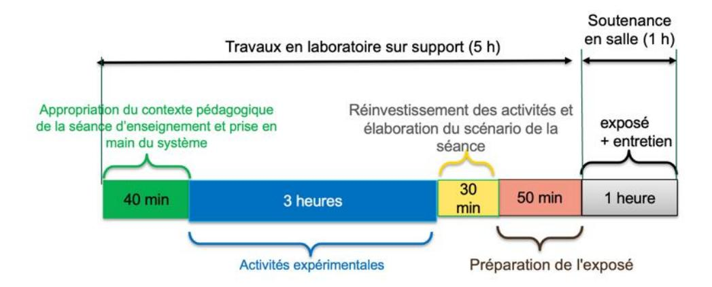

**Phase 1 : Appropriation du contexte pédagogique de la séance d'enseignement et prise en main du système (40 minutes)**

#### **Appropriation du contexte pédagogique**

La séance d'enseignement à présenter lors de l'exposé est une activité prévue pour une heure en classe entière. Elle doit être élaborée pour la série, le niveau et les objectifs de formation définis ci-dessous. Les éléments suivants sont indiqués au candidat :

- Série : Technologie, STI2D, SI ou BTS (spécialité précisée selon le sujet)
- Niveau : classe concernée
- Période : période de l'année (début, milieu ou fin d'année)
- Compétences visées (il s'agit des compétences que la séance présentée par le candidat doit permettre de développer chez les élèves ; une à deux compétences sont imposées)
- Connaissances/savoirs associés (il s'agit des connaissances/savoirs associées aux compétences qui devront être développé(e)s dans le cadre de la séance présentée par le candidat)

#### **Prise en main du système et de son environnement**

Il est mis à disposition du candidat :

- un espace numérique personnel accessible pendant les six heures de l'épreuve ;
- un ordinateur équipé des logiciels de bureautique usuels, de logiciels dédiés aux activités pratiques et d'un accès à internet ;
- un dossier « Documents candidats » comportant diverses ressources ;
- un système didactisé

Quelques manipulations sont proposées au candidat. Elles sont fortement guidées et doivent permettre une prise en main des matériels/logiciels mis à sa disposition pour réaliser les activités expérimentales suivantes.

### **Phase 2 : activités expérimentales (3 heures)**

Dans cette phase 2, une succession d'activités expérimentales est proposée aux candidats. Ces activités permettent d'évaluer l'aptitude du candidat à :

- concevoir un protocole expérimental ;
- mettre en œuvre un protocole expérimental ;
- réaliser une partie d'un programme ;
- réaliser le relevé de grandeurs physiques ;
- extraire des informations de documentations fournies ;
- analyser les relevés et déduire les conclusions quant à l'objectif visé (ce retour à l'objectif de l'activité est essentiel).

## **Phase 3 : réinvestissement des activités et élaboration du scénario de la séance (30 minutes)**

La séance d'enseignement à présenter lors de l'exposé est une activité prévue en classe entière pour une durée d'une heure. Elle doit être élaborée pour la série, le niveau et les objectifs de formation définis en phase 1.

Le programme (ou le référentiel) de la classe concernée est mis à disposition du candidat.

À partir du contexte pédagogique imposé, il est demandé au candidat d'identifier parmi les activités expérimentales réalisées lors de la phase 2 celles qui pourraient être exploitées et transposées au niveau d'élèves concerné. Le candidat ayant toujours accès au matériel de travaux pratiques, des expérimentations complémentaires peuvent être réalisées.

#### **Phase 4 : préparation de l'exposé (50 minutes)**

Lors de cette phase, le candidat n'a plus accès au matériel de travaux pratiques.

Pour information, le candidat dispose lors de son exposé :

- de l'espace numérique personnel utilisé lors des phases précédentes ;
- d'un ordinateur équipé des logiciels de bureautique et d'un vidéoprojecteur ;
- d'un tableau blanc et de feutres.

La durée de la présentation devant la commission d'interrogation est de 30 minutes maximum. Elle doit inclure une courte introduction explicitant :

- la description du contexte pédagogique de la séance (imposé en phase 1), une description succincte de l'articulation de la séance présentée avec les séances antérieures et postérieures ;
- la(les) problématique(s) éventuelle(s) permettant de contextualiser les activités proposées aux élèves ;
- le plan de la séance.

Les activités proposées aux élèves dans le cadre de la séance sont ensuite présentées et argumentées. Il n'est pas attendu du candidat qu'il détaille lors de l'exposé la chronologie des activités expérimentales qu'il a conduites au laboratoire durant les trois heures qui y sont consacrées.

## **C. Commentaires du jury**

#### **1. Analyse globale des résultats**

Le jury tient à souligner la qualité de préparation de nombreux candidats. Néanmoins, les attendus de l'épreuve et les modalités de mise en œuvre décrits au JORF ne sont pas connus de tous. Il s'avère

extrêmement difficile de réussir les activités pratiques et l'exploitation pédagogique si les objectifs spécifiques de ces deux parties de l'épreuve ne sont pas connus.

Les notions théoriques portant sur la didactique de la discipline et sur les différentes démarches pédagogiques associées sont régulièrement citées par les candidats. Elles ne font que trop rarement l'objet d'une contextualisation ou d'une proposition concrète dans le cadre de la séance présentée lors de la leçon.

Une proportion notable de candidats ne connaît pas les grands principes de la dernière réforme du lycée. Les programmes de technologie au collège, de la série STI2D et de l'enseignement de spécialité sciences de l'ingénieur du lycée général et technologique ainsi que les documents ressources pour faire la classe sont parfois inconnus des candidats. Le jury a été également surpris que des candidats ne soient pas acculturés au socle commun de connaissances, de compétences et de culture ainsi qu'à l'évaluation par compétences.

Le nombre des exploitations pédagogiques portant sur le collège, la série STI2D, l'enseignement de spécialité SI ou les STS de la spécialité a été équilibré sur l'ensemble de la session ; les candidats doivent être en mesure de produire des séances sur tous les niveaux d'enseignement. Le jury rappelle que les exploitations pédagogiques doivent s'appuyer sur les programmes et référentiels en vigueur lors de la session du concours.

#### **2. Commentaires et conseils aux candidats**

#### **Pour la partie travaux pratiques**

Le manque de culture scientifique et technologique pénalise de nombreux candidats dans l'appropriation des supports pluri-technologiques. Il est impératif, pour réussir cette épreuve, de disposer de compétences et de connaissances scientifiques et technologiques avérées dans les trois domaines « matière – énergie – information ». Cette culture technologique ne se limite en aucun cas à un domaine disciplinaire unique lié à l'option choisie par le candidat. Les futurs professeurs de sciences industrielles de l'ingénieur se doivent d'avoir une vision transversale et globale de leur discipline et de conduire une veille technologique régulière. Tout au long de l'épreuve, le jury est amené à interagir avec les candidats de façon à ce qu'ils puissent exposer leurs démarches, leurs raisonnements et leurs conclusions ; il attend un discours scientifiquement rigoureux, clair et argumenté.

Les candidats les plus efficients font preuve d'autonomie, d'esprit critique et d'écoute envers le jury lors des travaux pratiques. Ils prennent des initiatives dans la conception de leur séance pédagogique et mettent à profit l'ensemble des ressources numériques mises à leur disposition.

Le jury tient à souligner que nombre de candidats sont bien préparés à cette partie de l'épreuve et s'appuient sur des compétences à la fois transversales et spécifiques à leur option.

#### **Organisation à suivre lors de l'épreuve**

Il est conseillé de prendre connaissance de l'intégralité du sujet avec ses annexes avant de commencer les activités expérimentales, de lire les consignes.

Les candidats réalisent des activités expérimentales et analysent des résultats afin de conclure sur les problématiques du sujet. Ces manipulations, mesures et interprétations, sont réalisées au niveau de compétences d'un master première année.

Les candidats doivent penser à garder des traces numériques de leurs résultats et de leurs travaux afin de les réinvestir dans une séance adaptée au collège ou au lycée.

La connaissance préalable du système et des logiciels n'étant pas demandée, les membres de jury peuvent être sollicités par les candidats en cas de problème ou de difficultés liées à l'utilisation d'un logiciel ou d'un appareil de mesure spécifique. Plus généralement, le jury est présent pour accompagner les candidats dans leur démarche.

## **Aptitude à mener un protocole expérimental**

Le jury a apprécié l'autonomie dans la manipulation des systèmes de certains candidats. La mise en œuvre des matériels de mesure et d'acquisition ne présente pas de difficultés particulières. Cependant pour certains candidats, les instruments de mesure les plus courants ne sont pas suffisamment connus (nom, utilisation, symbole et unités des grandeurs physiques mesurées). Les membres du jury assurent l'accompagnement nécessaire afin que la spécificité d'un équipement ne constitue pas un obstacle à la réussite du candidat. Il est attendu du candidat qu'il soit capable de proposer et de justifier des choix de protocoles expérimentaux.

Les travaux pratiques font apparaître que de nombreux candidats ne maitrisent pas suffisamment les notions fondamentales de leur spécialité, ni les systèmes d'unités associés. De même, plusieurs d'entre eux ne sont pas en mesure de réaliser des manipulations mathématiques de base indissociable de la culture scientifique commune (résolution d'une équation du premier degré ou calcul d'un coefficient directeur).

## **Utilisation des modèles numériques**

Globalement, les candidats utilisent correctement les modèles numériques fournis. Le jury note cependant que de nombreux candidats manquent de recul et d'esprit critique dans l'interprétation des résultats de la simulation numérique et dans l'analyse des hypothèses utilisées lors de l'élaboration du modèle. Il est attendu des candidats une analyse pertinente des écarts entre les résultats issus de la simulation d'un modèle numérique, les mesures issues du système réel à partir d'expérimentations et/ou les performances attendues indiquées dans le cahier des charges.

#### **Préparation de la séance**

Le candidat doit bien identifier les activités réalisées qui pourraient être réinvesties lors de l'exposé, au niveau collège, en pré-bac ou en STS. Cet inventaire doit l'amener à envisager les activités possibles à proposer dans la classe pour la séance et le niveau demandé. Les conclusions et les résultats de ces expérimentations pourront être réutilisées lors de l'élaboration de la séance.

Il convient de transposer les activités réalisées par les candidats lors des activités expérimentales dans un contexte de formation pour des élèves (ou étudiants) au regard de la commande pédagogique imposée dans le sujet.

Certains candidats, déjà contractuels, mettent à profit leurs expériences pour proposer des séances pertinentes. Cependant, bon nombre de candidats se lancent dans la production d'une séance sans réellement analyser les compétences et les connaissances ciblées pour la leçon. Certains perdent encore du temps à formaliser une séquence pédagogique sans aborder la séance cible ; d'autres s'approprient des formats types non adaptés à la commande.

Le jury regrette que trop peu de candidats présentent une synthèse de leurs activités pratiques afin d'en sélectionner les éléments pertinents pour leur séance. Le hors-sujet est encore malheureusement trop fréquent.

Le jury conseille aux candidats de commencer par la construction du document de synthèse de la séance demandée. Ce document formalisera les savoirs et/ou la méthodologie à retenir par les élèves. Cela faciliterait la transposition didactique demandée et permettrait de proposer des activités d'apprentissage opérationnelles.

Le jury conseille encore aux candidats de justifier clairement les choix pédagogiques opérés sans se cantonner à des généralités.

## **Pour l'exposé devant le jury**

Les candidats inscrivent leur développement pédagogique dans un contexte pédagogique donné dans le sujet. La séance d'enseignement à présenter est une activité prévue en classe entière pour une durée d'une heure. Afin de bien préciser au jury les enjeux et les attendus de la séance, celle-ci doit être intégrée dans une séquence. Le candidat doit situer la séance dans une organisation temporelle, en précisant ce qui est fait avant et après. Il doit également expliciter la construction de la séance en s'appuyant sur des activités expérimentales réalisées auparavant et de leurs résultats. Le candidat est amené à préciser pour la séance décrite les prérequis, les objectifs (compétences à faire acquérir, capacités et connaissances attendues), l'organisation de la classe, les modalités pédagogiques (cours, activités dirigées, activités pratiques, projet), les stratégies pédagogiques (déductif, inductif, différenciation pédagogique, démarche d'investigation, démarche de résolution de problème technique, pédagogie par projet, approche spiralaire…), les activités des élèves et les productions attendues. La description de la séance doit faire explicitement apparaître la prise en compte de la diversité des publics accueillis dans la classe. Il est attendu que le candidat précise la façon dont il compte animer la classe et mettre en synergie les élèves / étudiants en vue de la structuration des acquis.

Les phases de structuration des connaissances permettant la construction des connaissances des élèves et les différentes formes d'évaluation des élèves peuvent être des parties intégrantes de la séance.

Les différentes modalités d'enseignement (enseignement pratique interdisciplinaire, interdisciplinarité, concours scientifique et technique…) et les dispositifs d'accompagnement et de remédiation doivent être précisés.

Le jury met en garde les candidats qui éludent tout ou partie des objectifs visés en termes de compétences et connaissances associées voire s'écartent du contexte pédagogique imposé. Dans ce cas, le jury considère la leçon présentée hors sujet.

Enfin, un discours purement pédagogique qui ne répondrait pas concrètement aux objectifs d'apprentissage visés ne saurait être cautionné par le jury.

Il s'agit du cœur même de l'épreuve que de traiter la commande en termes de niveau, et de compétences/connaissances attendues. L'expertise pédagogique ne saurait palier ce manquement à l'exigence de contenu didactique.

De trop nombreux candidats confondent les activités de travaux pratiques réalisées lors de la phase 2 de l'épreuve et les activités de la séance pédagogique à exposer ; leur exposé est, de fait, hors sujet.

#### **Utilisation du numérique**

Le jury conseille aux candidats de bien identifier les points de leur séance pédagogique pour lesquels l'usage du numérique apportera une réelle plus-value aux apprentissages des élèves. Le jury constate que peu de candidats proposent une exploitation d'outils numériques éducatifs, à des fins d'animation de séance, de présentation, de travail collaboratif, d'échanges entre le professeur et les élèves (type ENT par exemple).

#### **Réinvestissement des résultats de travaux pratiques**

L'objectif attendu de la leçon est une exploitation pédagogique s'appuyant sur tout ou partie des activités pratiques réalisées et de leurs résultats et permettant aux apprenants de comprendre les concepts fondamentaux associées aux compétences visées. Les activités expérimentales menées dans la partie « travaux pratiques » peuvent être d'un niveau supérieur celui demandé dans la séance, il ne s'agit donc pas de faire, au travers de la séance pédagogique, un compte-rendu de l'activité pratique réalisée, mais de s'appuyer sur les expérimentations pour en extraire des données et des activités à proposer aux élèves. Cependant, une rapide présentation des objectifs et conclusions des expérimentations réalisées en TP en première partie de l'épreuve, permettra au jury de mieux comprendre l'intégration

de ceux-ci dans la séance. Il est apprécié de réaliser une présentation dynamique qui inclut des copies d'écran, des résultats de mesures, des éléments de cahier des charges ou d'analyse SysML, etc. Le jury ne se satisfait en aucun cas d'une exploitation brute des activités proposées dans la première partie de l'épreuve.

## **Réalisme de l'organisation de la classe**

Le jury attend des candidats qu'ils émettent des hypothèses réalistes sur les conditions d'enseignement. Leurs propositions doivent être pragmatiques afin que le jury puisse appréhender le scénario pédagogique envisagé (travail en "autobus", en ilots, en équipes, en binômes ou individuellement). Le candidat doit notamment préciser son rôle dans la conduite et l'animation de la séance.

## **Évaluation**

Le processus retenu par le candidat pour l'évaluation des compétences doit être clairement décrit (évaluation diagnostique, formative, sommative, certificative, …) et justifié. Les critères d'évaluation doivent être explicités. Les modalités et les outils doivent être précisés. Si des remédiations ou des différenciations pédagogiques sont envisagées, elles doivent être explicitées.

Trop souvent, les candidats se contentent d'évoquer les processus d'évaluation sans pouvoir en expliquer réellement le déroulement, les modalités et surtout l'objectif en termes d'acquisition des compétences par les élèves.

## **Présentation orale**

Quelques candidats proposent des présentations (orales et écrites) très formatées, quelques fois hors du contexte des activités pratiques réalisées en amont, qui ne résistent pas aux questionnements du jury et mettent en évidence des lacunes.

Le jury note également que quelques candidats limitent leur présentation à un descriptif sommaire des activités sans expliciter et justifier clairement la démarche.

Le jury invite les candidats à, certes, maîtriser les attendus pédagogiques et didactiques de la discipline, mais surtout à être en capacité de les réinvestir de façon adaptée et pertinente. À titre d'exemples, les termes « formatif », « sommatif », « inductif », … doivent être utilisés à bon escient et dans un contexte adapté.

Enfin, le jury rappelle que le concours constitue la première étape de l'entrée dans le métier du professorat. Le candidat se doit donc d'adopter une posture et un positionnement exemplaires constitutifs de la mission d'enseignant. Le jury invite vivement les candidats à s'approprier le référentiel des compétences professionnelles des métiers du professorat et de l'éducation (arrêté du 1-7-2013 - J.O. du 18-7-2013).

## **Réactivité au questionnement**

Le jury attend de la concision et de la précision ainsi qu'une honnêteté intellectuelle dans les réponses formulées. Les réponses au questionnement doivent laisser transparaître un positionnement adapté aux attentes de l'Institution et une réelle appropriation des valeurs de la République.

Le candidat se doit d'être réactif sans chercher à éluder les questions ou à noyer le propos dans un discours pédagogique non maitrisé. Plus qu'une réponse exacte instantanée, le jury apprécie la capacité à argumenter, à expliquer et justifier une démarche ou un point de vue.

#### **Qualité des documents de présentation et expression orale**

Il est attendu des candidats une maîtrise des outils numériques pour l'enseignement afin de construire un document clair, structuré, lisible et adapté à la présentation de l'exposé.

Le jury est extrêmement attentif à la qualité de la syntaxe et de l'orthographe.

Les candidats s'expriment généralement correctement. La qualité de l'élocution et la clarté des propos sont indispensables aux métiers de l'enseignement.

## **Conseils aux candidats**

Le jury conseille aux candidats de :

- s'approprier les programmes et référentiels des niveaux énoncés dans la définition de l'épreuve ainsi que les documents ressources associés ;
- prendre connaissance du socle commun de connaissances, de compétences et de culture ;
- maîtriser les concepts fondamentaux de la spécialité choisie ;
- s'informer sur les pratiques pédagogiques et didactiques, les modalités de fonctionnement et d'organisation des horaires de tous les niveaux d'enseignement que peuvent assurer les professeurs de sciences industrielles de l'ingénieur ;
- se préparer à exploiter les résultats d'investigations et d'expérimentations en regard des contenus disciplinaires ;
- s'informer sur les modalités des épreuves d'examen auxquelles ils préparent leurs futurs élèves ;
- travailler sa posture et ses intonations afin de rentrer en interaction avec le jury et ne pas lire les documents projetés sans tenir compte de l'auditoire.

#### **3. Conclusion**

L'épreuve de leçon nécessite une préparation sérieuse et approfondie en amont de l'admissibilité. Cette préparation doit porter tout autant sur la partie « travaux pratiques » que sur la partie « exploitation pédagogique », car ces deux parties de l'épreuve sont complémentaires et indissociables. Les compétences nécessaires à la réussite de cette épreuve peuvent âtre acquises et développées lors de stages en situation et de périodes d'observation ou d'enseignement. Une connaissance fine des programmes/référentiels et des documents ressources pour faire la classe est également nécessaire. Le métier d'enseignant exige une exemplarité dans la tenue, dans la posture ainsi que dans le discours. L'épreuve de leçon permet la valorisation de ces qualités.

## **D. Résultats**

Les statistiques générales pour cette épreuve sont données ci-après.

|               | CAPET (public) | CAFEP (privé) |
|---------------|----------------|---------------|
|               | Note sur 20    | Note sur 20   |
| Moyenne       | 9,78           | 11,92         |
| Note maximum  | 17,8           | 15,7          |
| Note minimale | 3              | 7,8           |
| Écart-type    | 3,85           | 2,96          |

# **Épreuve d'entretien**

# **A. Présentation de l'épreuve**

 Durée : 35 minutes Coefficient 3

L'épreuve d'entretien avec le jury porte sur la motivation du candidat et son aptitude à se projeter dans le métier de professeur au sein du service public de l'éducation.

L'entretien comporte une première partie d'une durée de quinze minutes débutant par une présentation, d'une durée de cinq minutes maximum, par le candidat des éléments de son parcours et des expériences qui l'ont conduit à se présenter au concours en valorisant ses travaux de recherche, les enseignements suivis, les stages, l'engagement associatif ou les périodes de formation à l'étranger. Cette présentation donne lieu à un échange avec le jury.

La deuxième partie de l'épreuve, d'une durée de vingt minutes, doit permettre au jury, au travers de deux mises en situation professionnelle, l'une d'enseignement, la seconde en lien avec la vie scolaire, d'apprécier l'aptitude du candidat à :

- s'approprier les valeurs de la République, dont la laïcité, et les exigences du service public (droits et obligations du fonctionnaire dont la neutralité, lutte contre les discriminations et stéréotypes, promotion de l'égalité, notamment entre les filles et les garçons, etc.) ;
- faire connaître et faire partager ces valeurs et exigences.

Le candidat admissible transmet préalablement une fiche individuelle de renseignement établie sur le modèle figurant à l'annexe VI de l'arrêté du 25 janvier 2021 fixant les modalités d'organisation des concours du certificat d'aptitude au professorat de l'enseignement technique, selon les modalités définies dans l'arrêté d'ouverture.

L'épreuve est notée sur 20. La note 0 est éliminatoire.

## **B. Déroulement de l'épreuve**

Pour des raisons d'équité, la durée des entretiens est fixe. Le jury veille à ce que les temps impartis soient respectés. Il convient aux candidats d'être vigilant quant à la durée de leurs réponses.

Le candidat ne dispose d'aucun document. Le jury n'intervient pas pendant les cinq minutes de présentation du candidat.

Le déroulé est rappelé ci-dessous :

| 15 minutes               | 5 minutes maximum  | Présentation par le candidat des éléments de son parcours et des expériences qui l'ont conduit à se présenter au concours en valorisant notamment ses travaux de recherche, les enseignements suivis, les stages, l'engagement associatif ou les périodes de formation à l'étranger. |  |
|-----------------------------|-----------------------|--------------------------------------------------------------------------------------------------------------------------------------------------------------------------------------------------------------------------------------------------------------------------------------|--|
|                             | 10 minutes minimum | Échanges suite à la présentation                                                                                                                                                                                                                                                     |  |
| 20 minutes (10 + 10 min) |                       | ux mises en situation professionnelle d'enseignement en lien avec la vie scolaire                                                                                                                                                                                              |  |

Les mises en situation professionnelle sont définies par le jury en amont du passage des candidats. Une lecture de ces mises en situation professionnelle est réalisée par un des membres du jury.

# **C. Commentaires du jury**

Cette épreuve est révélatrice de la posture professionnelle du candidat mais aussi de son éthique, sa déontologie et ses futurs réflexes professionnels. Elle sollicite, au-delà des aptitudes disciplinaires, les compétences professionnelles transversales essentielles à l'exercice du métier d'enseignant. De manière générale, les candidats ont bien appréhendé le format de cette épreuve mais elle semble insuffisamment préparée pour un nombre significatif d'entre eux.

#### **Présentation (1ère partie)**

La présentation de cinq minutes par le candidat des éléments de son parcours et des expériences qui l'ont conduit à se présenter au concours en valorisant ses travaux de recherche, les enseignements suivis, les stages, l'engagement associatif ou les périodes de formation à l'étranger, a permis au jury de rapidement cerner certains traits de sa personnalité, et de comprendre les motivations qui l'ont poussé à présenter le CAPET-CAFEP SII ainsi que le choix de l'option. Il est attendu qu'il montre les liens entre les compétences acquises durant son parcours et celles nécessaires pour enseigner dans le secondaire. Les motivations doivent être clairement explicitées. Il est intéressant de comprendre comment le projet de devenir enseignant s'est construit au fil du temps et pas uniquement sur une envie de transmettre. Même s'il est plus rassurant d'apprendre cette première phase par cœur, le jury apprécie la spontanéité des candidats. Quelques candidats n'ont pas utilisé la totalité des cinq minutes, faute d'arguments.

L'échange de dix minutes avec le jury permet ensuite au candidat d'apporter des précisions et de compléter les éléments énoncés durant sa présentation.

#### Le jury a apprécié :

- l'enthousiasme du candidat et le dynamisme du discours pour présenter son envie de devenir enseignant ;
- la capacité du candidat à se projeter dans la fonction en juxtaposant sa vision du métier d'enseignant (tenants et aboutissants des missions d'un enseignant) avec ses compétences acquises et transférables, l'idée étant « voici ce qui me laisse penser que je dispose des premiers outils nécessaires à une bonne prise de fonction » ;
- la mise en valeur des expériences multiples (animation, enseignement, différents métiers, ..) ;
- ses connaissances du milieu dans lequel il va évoluer, les principaux acteurs, le rôle et mission de chacun, les instances, leurs participants et les typologies des décisions ;
- les fiches individuelles de renseignements complétées avec précision et indiquant les expériences d'enseignement et les expériences professionnelles dans le secteur industriel ;
- les candidats qui ne paraphrasent pas leur fiche de renseignements ;
- les candidats qui s'expriment clairement.

Afin de préparer au mieux cette introduction, le jury conseille aux candidats de connaitre à minima :

- les différentes disciplines dans lesquelles ils peuvent être appelé à enseigner, de la technologie au collège, aux lycées général et technologique et aux différents STS associés à son option de concours ;
- les particularités de ces enseignements technologiques au collège, lycée et STS ;
- la structure des baccalauréats généraux et technologiques et ses différentes épreuves ;
- le fonctionnement d'un EPLE, de son équipe de direction, de la vie scolaire, des services sociaux et d'infirmerie, les différentes instances (conseil d'administration, conseil pédagogique, conseil d'enseignement, conseil de discipline, comité d'éducation à la santé et à la citoyenneté et à l'environnement, conseil de vie collégien/lycéen, …), le règlement intérieur…
- le référentiel de compétences des enseignants, le suivi de carrière…
- les valeurs de la République ;
- les droits et devoirs des fonctionnaires.

### **Mises en situation professionnelle (2ème partie)**

Le second temps, consacré à parts égales entre une question portant sur une situation en classe et une situation hors de la classe, a été riche en discussions souvent constructives. Le jury a constaté avec satisfaction que les situations professionnelles sont, dans l'ensemble, bien comprises par les candidats. Le traitement instantané du problème rencontré dans les différentes situations qu'elles soient de l'ordre de l'enseignement ou de la vie scolaire est en général plutôt bien appréhendé. Il est noté qu'il a été souvent plus aisé pour les candidats d'analyser la situation en classe que de se projeter dans une situation relevant de la vie scolaire. Les réponses apportées démontrent, pour la plupart, du bon sens et du pragmatisme des candidats.

Même lorsque le candidat ne connaissait pas en détail le système éducatif, il a souvent pu apporter des pistes de solutions cohérentes. Les valeurs de la République sont respectées et citées par les candidats. Les personnes ressources au sein de l'établissement sont souvent bien identifiées (le chef d'établissement et son adjoint, le CPE, le DDFPT, le gestionnaire, l'infirmier, l'assistant social…) et les différentes instances sont plutôt connues. Cependant, les débats atteignent rapidement leur limite lorsque le candidat n'est pas à l'aise sur les points précédents. La méconnaissance du fonctionnement d'un collège ou d'un lycée devient rapidement rédhibitoire, malgré les relances bienveillantes du jury.

## Le jury a apprécié les candidats qui :

- commencent par analyser les situations au lieu de proposer directement des solutions au problème posé à court terme ;
- envisagent, lors de leur analyse, plusieurs interprétations de la situation proposée ;
- prennent de la hauteur par rapport à la situation décrite et l'analysent selon les trois temporalités demandées (à court, moyen et long termes) ;
- identifient les valeurs et principes de la République, les droits et devoirs des fonctionnaires, sous-tendus aux situations étudiées ;
- s'appuient sur tous les leviers existants dans l'établissement et hors de l'établissement pour prévenir les situations étudiées notamment en mettant en place des actions éducatives ;
- prennent pleinement la mesure de leur mission d'éducation et placent leur action personnelle au sein de celle d'une communauté éducative élargie.

#### Le jury conseille aux candidats de :

- s'approprier les attentes de l'épreuve lors de leur préparation au concours ;
- s'approprier le fonctionnement d'un EPLE ainsi que le rôle des différentes instances ;
- se référer aux personnes ressources de l'établissement susceptibles d'être sollicitées en fonction de la situation (psy-en, infirmier, assistant social, …). Trop de candidats ne font appel qu'au CPE ou au chef d'établissement ;
- penser également à solliciter des acteurs extérieurs à l'établissement (associations, experts, conseillers, partenaires économiques…), notamment pour les actions à moyen ou long terme ;
- ne pas rester sur des réponses autocentrées mais de se placer dans le contexte d'un établissement scolaire ;
- prendre le recul nécessaire pour traiter la situation proposée dans le contexte décrit et de ne pas se limiter à faire référence à leur expérience (de contractuel notamment).

# **D. Ressources mobilisables**

Le jury conseille aux candidats de s'approprier les informations données sur la nouvelle épreuve d'entretien (attendus, conseils et exemples de situations professionnelles) :

<https://www.devenirenseignant.gouv.fr/cid159421/epreuve-entretien-avec-jury.html>

Pour construire ses réponses, le candidat fait appel à l'ensemble des expériences et des connaissances dont il dispose et qu'il mobilise avec pertinence, expériences et connaissances proprement disciplinaires ou participant d'une déontologie professionnelle.

Cette déontologie professionnelle suppose au moins l'appropriation par le candidat des ressources et textes suivants :

- Les droits et obligations du fonctionnaire présentés sur le portail de la fonction publique : <https://www.fonction-publique.gouv.fr/etre-agent-public/mes-droits-et-obligations>
- Les articles L 111-1 à L 111-4 et l'article L 442-1 du [code de l'Education.](https://www.legifrance.gouv.fr/codes/id/LEGITEXT000006071191/)
- Le vade-mecum "la laïcité à l'École" : <https://eduscol.education.fr/1618/la-laicite-l-ecole>
- Le vade-mecum "agir contre le racisme et l'antisémitisme" : <https://eduscol.education.fr/1720/agir-contre-le-racisme-et-l-antisemitisme>
- "Qu'est-ce que la laïcité ?" Une introduction par le Conseil des Sages de la laïcité Janvier 2021. Téléchargeable sur [https://www.education.gouv.fr/le-conseil-des-sages-de-la-laicite-](https://www.education.gouv.fr/le-conseil-des-sages-de-la-laicite-41537)[41537](https://www.education.gouv.fr/le-conseil-des-sages-de-la-laicite-41537)
- Le parcours magistère "faire vivre les valeurs de la République" : <https://magistere.education.fr/f959>
- "Que sont les principes républicains ?" Une contribution du Conseil des sages de la laïcité Juin 2021. Téléchargeable sur [https://www.education.gouv.fr/le-conseil-des-sages-de-la-laicite-](https://www.education.gouv.fr/le-conseil-des-sages-de-la-laicite-41537)[41537](https://www.education.gouv.fr/le-conseil-des-sages-de-la-laicite-41537)
- "La République à l'École", Inspection générale de l'éducation, du sport et de la recherche »
- Le site IH2EF :<https://www.ih2ef.gouv.fr/laicite-et-services-publics>

# **E. Résultats**

Les statistiques générales pour cette épreuve sont données ci-après.

|               | CAPET (public) | CAFEP (privé) |
|---------------|----------------|---------------|
|               | Note sur 20    | Note sur 20   |
| Moyenne       | 10,11          | 14,53         |
| Note maximum  | 20             | 18            |
| Note minimale | 1              | 7,5           |
| Écart type    | 5,34           | 3,65          |