### **CAPET-CAFEP**

## **Section sciences industrielles de l'ingénieur Option ingénierie électrique**

**Concours externe**

**Session 2024**

Rapport de jury présenté par Pascale COSTA Présidente du jury

### **Sommaire**

| <u>Avant</u> | t-propos                           | 3  |
|--------------|------------------------------------|----|
| Reme         | erciements                         | 4  |
| Résul        | Itats statistiques                 | 5  |
| _            | uve écrite disciplinaire           |    |
| A.           | Présentation de l'épreuve          |    |
| В.           | Sujet                              | 6  |
| C.           | Éléments de correction             | 7  |
| D.           | Commentaires du jury               | 21 |
| E.           | Résultats                          | 22 |
| Épreu        | uve écrite disciplinaire appliquée | 23 |
| A.           | Présentation de l'épreuve          | 23 |
| В.           | Sujet                              | 23 |
| C.           | Éléments de correction             | 24 |
| D.           | Commentaires du jury               | 41 |
| E.           | Résultats                          | 43 |
| Épreu        | ıve de leçon                       | 44 |
| Α.           | Présentation de l'épreuve          |    |
| В.           | Déroulement de l'épreuve           | 44 |
| C.           | Commentaires du jury               | 47 |
| D.           | Résultats                          | 52 |
| Épreu        | uve d'entretien                    | 53 |
| Α.           | Présentation de l'épreuve          |    |
| B.           | Déroulement de l'épreuve           | 53 |
| C.           | Commentaires du jury               |    |
| D.           | Ressources mobilisables            |    |
| E.           | Résultats                          | 56 |

### **Avant-propos**

Depuis la session 2022, les épreuves de ce concours ont été modifiées ; leur définition est rappelée sur le site devenir enseignant :

<https://www.devenirenseignant.gouv.fr/cid158866/epreuves-capet-externe-cafep-capet-sii.html>

Les attentes du concours du Capet et du Cafep de sciences industrielles de l'ingénieur (SII) sont définies par l'arrêté du 25 janvier 2021 qui en fixe l'organisation. Les concours de recrutement d'enseignants n'ont pas pour seul objectif de valider les compétences scientifiques et technologiques des candidats ; ils doivent aussi valider les compétences professionnelles qui sont souhaitées par l'État employeur qui recrute des professeurs. L'excellence scientifique et la maîtrise disciplinaire sont indispensables pour présenter le concours, mais pour le réussir, les candidats doivent aussi faire preuve de qualités didactiques et pédagogiques et de bonnes aptitudes à communiquer.

Les deux épreuves d'admissibilité sont construites de manière à évaluer un spectre large de compétences scientifiques et technologiques : la première épreuve intitulée « épreuve disciplinaire » est spécifique à l'option choisie lors de l'inscription (option ingénierie des constructions, option ingénierie électrique, option ingénierie informatique et option ingénierie mécanique), la seconde intitulée « épreuve écrite disciplinaire appliquée » est commune aux quatre options.

Les deux épreuves d'admission sont complémentaires des épreuves d'admissibilité. La première épreuve, intitulée « leçon » est spécifique à l'option ; elle a pour objet la conception et l'animation d'une séance d'enseignement dans l'option choisie. Elle permet d'apprécier à la fois la maîtrise disciplinaire, la maîtrise de compétences pédagogiques et de compétences pratiques ainsi que la capacité du candidat à réfléchir aux enjeux scientifiques, technologiques, didactiques, épistémologiques, culturels et sociétaux que revêt l'enseignement du champ disciplinaire du concours. L'évaluation de cette épreuve s'appuie sur le référentiel des compétences professionnelles des métiers du professorat et de l'éducation (publié au BOEN du 25 juillet 2013). La seconde épreuve, intitulé « entretien » porte sur la motivation du candidat et son aptitude à se projeter dans le métier de professeur au sein du service public de l'éducation ; sa définition est commune à l'ensemble des concours externe de recrutement d'enseignants.

Ces épreuves d'admission, dont le coefficient total est le double de celui des épreuves d'admissibilité, ont eu une influence significative sur le classement final.

Les candidats et leurs formateurs sont invités à lire avec application les commentaires et conseils donnés dans ce rapport et dans ceux des sessions antérieures afin de bien appréhender les compétences ciblées. La préparation à ces épreuves commence dès l'inscription au concours.

Pour l'épreuve d'admission pratique, l'accès à Internet était autorisé afin de mettre les candidats dans les conditions du métier qu'ils envisagent d'exercer. Mais cela ne doit pas masquer le fait que la réflexion, la cohérence, l'appréciation du niveau des élèves et la précision pédagogique dans les explications sont des qualités précieuses pour un futur enseignant.

Dans toutes les épreuves, le jury attend des candidats une expression écrite et orale irréprochable. Le Capet/Cafep est un concours exigeant qui impose de la part des candidats un comportement et une présentation exemplaires. Le jury reste vigilant sur ce dernier aspect et invite les candidats à avoir une tenue adaptée aux circonstances particulières d'un concours de recrutement de cadres de catégorie A de la fonction publique.

37 postes étaient proposés pour la session 2024 de ce concours externe public et 3 postes pour le privé. Il a été impossible de pourvoir tous les postes pour le public : seuls 22 candidats ont été admis.

Si globalement, les candidats présents à cette session d'admission étaient bien préparés, l'admission n'a pu être prononcée pour ceux dont les prestations n'ont pas donné la garantie qu'ils étaient aptes à embrasser la carrière de professeur de sciences industrielles de l'ingénieur. Cela est regrettable dans la mesure où les besoins dans les établissements scolaires sont importants.

Pour conclure cet avant-propos, le jury souhaite que ce rapport soit une aide efficace aux futurs candidats. Tous sont invités à se l'approprier par une lecture attentive.

### **Remerciements**

Le lycée Roosevelt de Reims a accueilli les épreuves d'admission de cette session 2024 des quatre options du Capet/Cafep externe et troisième concours section sciences industrielles de l'ingénieur. Les membres du jury tiennent à remercier le proviseur du lycée et son adjointe, son directeur délégué aux formations professionnelles et technologiques, ses collaborateurs et l'ensemble des personnels pour la qualité de leur accueil et l'aide efficace apportée tout au long de l'organisation et du déroulement de ce concours qui a eu lieu dans d'excellentes conditions.

Les membres de jury ayant contribué à la rédaction de ce rapport ainsi que les concepteurs des sujets, tant pour les épreuves d'admissibilité que pour les épreuves d'admission, sont également tout particulièrement remerciés.

### **Résultats statistiques**

### **Ingénierie électrique**

### **CAPET externe public :**

| Session | Nombre de postes | Inscrits | Présents aux épreuves écrites | Admissibles | Présents aux épreuves orales | Admis |
|---------|---------------------|----------|-------------------------------------|-------------|------------------------------------|-------|
| 2020    | 51                  | 228      | 81                                  | 66          | 60                                 | 29    |
| 2021    | 49                  | 192      | 81                                  | 70          | 51                                 | 36    |
| 2022    | 45                  | 183      | 71                                  | 67          | 45                                 | 34    |
| 2023    | 48                  | 205      | 81                                  | 68          | 54                                 | 36    |
| 2024    | 37                  | 189      | 76                                  | 64          | 46                                 | 22    |

### **CAFEP externe privé :**

| Session | Nombre de postes | Inscrits | Présents aux épreuves écrites | Admissibles | Présents aux épreuves orales | Admis |
|---------|---------------------|----------|-------------------------------------|-------------|------------------------------------|-------|
| 2020    | 4                   | 63       | 27                                  | 10          | 9                                  | 4     |
| 2021    | 3                   | 59       | 35                                  | 9           | 8                                  | 3     |
| 2022    | 3                   | 46       | 24                                  | 9           | 7                                  | 3*    |
| 2023    | 3                   | 47       | 20                                  | 9           | 6                                  | 3     |
| 2024    | 3                   | 41       | 21                                  | 9           | 7                                  | 3     |

\* 1 candidat admis sur liste complémentaire

### **Statistiques obtenues à l'admissibilité et à l'admission à la session 2024 :**

|               |                                                          | CAPET (public) | CAFEP (privé) |
|---------------|----------------------------------------------------------|----------------|---------------|
|               | Moyenne obtenue par le premier candidat admissible | 17,7 / 20      | 15 / 20       |
| Admissibilité | Moyenne obtenue par le dernier candidat admissible | 5,1 / 20       | 7,95 / 20     |
|               | Moyenne des candidats admissibles                        | 8,74 / 20      | 11,18 /20     |
|               | Moyenne obtenue par le premier candidat admis      | 17,31 / 20     | 18,12 / 20    |
| Admission     | Moyenne obtenue par le dernier candidat admis      | 9,03 / 20      | 12,98 /20     |
|               | Moyenne des candidats présents                           | 9,36 / 20      | 14,11 / 20    |
|               | Écart-type des candidats présents                        | 3,14           | 2,39          |

# **Épreuve écrite disciplinaire**

Ingénierie électrique

### **A. Présentation de l'épreuve**

 Durée : 5 heures Coefficient 2

L'épreuve, spécifique à l'option choisie, porte sur l'étude d'un système, d'un procédé ou d'une organisation.

Elle a pour but de vérifier que le candidat est capable, à partir de l'exploitation d'un dossier technique remis par le jury, de conduire une analyse critique de solutions technologiques et de mobiliser ses connaissances scientifiques et technologiques pour élaborer et exploiter les modèles de comportement permettant de quantifier les performances d'un système ou d'un processus lié à la spécialité et définir des solutions technologiques.

L'épreuve est notée sur 20. Une note globale égale ou inférieure à 5 est éliminatoire.

### **B. Sujet**

Le sujet est disponible en téléchargement sur le site du ministère à l'adresse : <https://www.devenirenseignant.gouv.fr/media/12840/download>

L'étude porte sur un extracteur d'air équipant les locaux des salles de travaux pratiques du pôle bois et menuiserie du lycée les Lombards de Troyes. La problématique générale se focalise sur les solutions technologiques permettant d'optimiser la consommation énergétique de l'extracteur d'air tout en assurant un fonctionnement conforme aux exigences du client et aux normes en vigueur.

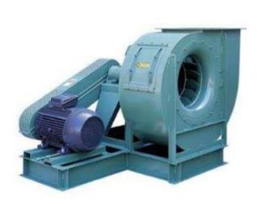

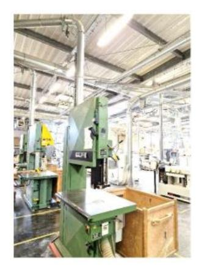

### C. Éléments de correction

Partie A

**A1** 
$$D_1 = \frac{2500}{3600} = 0.694 \text{ m}^3.\text{ s}^{-1}$$
;  $D_2 = \frac{2750}{3600} = 0.764 \text{ m}^3.\text{ s}^{-1}$   
 $D_T = 10 \times (D_1 + D_2) = 14.58 \text{m}^3.\text{ s}^{-1}$ 

**A2** 
$$P_{extra} = 77.2 \text{ kW et } P_u = \frac{P_{extra}}{\eta} = 99 \text{ kW}$$

**A3** 
$$N_s = \frac{60 \times f}{p} = 1500 \text{ tr. min} = et g = \frac{1500 - 1400}{1500} = 0.06667$$

**A4** 
$$I_r' = \frac{V_s}{\sqrt{(L_f \omega_s)^2 + \left(\frac{R_r'}{g}\right)^2}} = 122 \text{ A}$$

**A5** 
$$P_a = 3 \times V_s \times I_s \times \cos \phi_{mot}$$

$$P_a = 3 \times 230 \times 229 \times 0.85 = 134,3 \text{ kW}$$

$$\begin{split} P_{jr} &= 3 \times R_r' \times {I_r'}^2 \\ P_{jr} &= 3 \times 0.1 \times 122^2 = 4465 \ W \end{split}$$

$$\begin{split} P_{pm} &= C_p \times \Omega \\ P_{pm} &= 200 \times 146.5 = 29.3 \text{ kW} \end{split}$$

**A6** 
$$P_u = P_a - P_{ir} - P_{pm}$$

$$P_{\rm u} = 100,5 \; {\rm kW}$$

A7 La puissance Pu obtenue est légèrement supérieure à celle obtenue en A2. La motorisation choisie est alors adéquate pour entrainer l'extracteur.

A8

$$C_{\rm u} = \frac{P_{\rm u}}{\Omega} = \frac{100,5 \times 10^3}{146,5} = 686 \text{ Nm}$$

On place sur le graphique  $C_{\rm u}=686~{\rm Nm}$  et  $\Omega=146.5~{\rm rad.\,s^{-1}}$ 

Le diamètre des pales adapté au fonctionnement en régime établi est  $C_v = 1 \text{ m}$ .

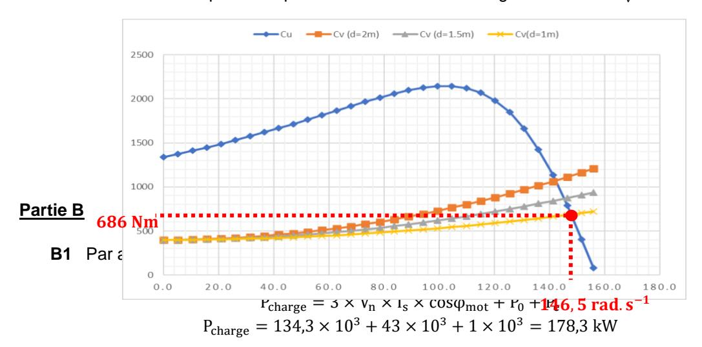

$$\begin{aligned} Q_{charge} &= Q_{mot} + Q_0 + Q_e \\ Q_{charge} &= P_{mot} \times tan\phi_{mot} + P_0 \times tan\phi_0 + Q_e \\ Q_{charge} &= 83~237 + 25500 = 108,7~kVAR \end{aligned}$$

$$S_{charge} = \sqrt{P_{charge}^2 + Q_{charge}^2}$$
 
$$S_{charge} = \sqrt{(178.3 \times 10^3)^2 + (108.7 \times 10^3)^2} = 208.8 \text{ kVA}$$

B2 L'installation est triphasée :

$$S_{charge} = 3 \times V_s \times I_{abs}$$

soit 
$$I_{abs} = \frac{S_{charge}}{3 \times V_n}$$

$$I_{abs} = \frac{208,8 \times 10^3}{3 \times 230} = 302,6 A$$

Le facteur de puissance  $F_p$  a pour expression :  $F_p = \frac{P_{charge}}{S_{charge}}$ 

$$F_p = \frac{178,3}{208.8} = 0.85$$

**B3** Pour obtenir un facteur de puissance unitaire  $(F'_p = 1)$  alors la puissance réactive totale (avec la présence des condensateurs) doit être nulle :

$$Q_{totale} = Q_c + Q_{abs} = 0$$

 $Q_c = -Q_{abs} = -3 \times C \times \omega \times V_n^2$  (Expression de la puissance réactive dans une batterie de condensateurs triphasés)
Soit :  $C = \frac{Q_{abs}}{3 \times \omega \times V_n^2}$ 

Soit : 
$$C = \frac{Q_{abs}}{3 \times \omega \times V_p^2}$$

**B4** C = 
$$\frac{108,7 \times 10^3}{3 \times 2\pi \times 50 \times 230^2}$$
 = 0,016 F

**B5** 
$$R_L = R_U \times X = 20 \times 10^{-3} \times 850 = 17 \text{ m}\Omega$$

$$L_L = L_u \times X = 1.2 \times 10^{-3} \times 850 = 1.02 \text{ mH}$$

**B6** 
$$I_{tot} = \frac{P_{charge}}{3 \times V_p}$$
: en effet comme  $F_p = 1$  alors  $S_{tot} = P_{charge}$ 

$$I_{\text{tot}} = \frac{178.3 \times 10^3}{3 \times 230} = 258 \text{ A}$$

**B7** 
$$P_T = P_{charge} + 3 \times R_L \times I_{tot}^2$$

$$P_T = 178.3 \times 10^3 + 3 \times 17 \times 10^{-3} \times 258^2 = 181.7 \text{ kW}$$

$$Q_T = 3 \times L_L \times \omega \times I_{tot}^2$$
 
$$Q_T = 3 \times 1.02 \times 10^{-3} \times 2\pi \times 50 \times 258^2 = 64 \text{ kVAR}$$

$$S_T = \sqrt{P_T^2 + Q_T^2}$$
 
$$S_T = \sqrt{(181.7 \times 10^3)^2 + (64 \times 10^3)^2} = 192.6 \text{ kVA}$$

**B8** 
$$S_T = \sqrt{3} \times U_D \times I_{tot}$$

Soit 
$$U_D = \frac{S_T}{\sqrt{3} \times I_{tot}}$$

$$U_D = \frac{192,6 \times 10^3}{\sqrt{3} \times 258} = 431 V$$
$$\Delta U = \frac{U_D - U_r}{U_D} \times 100 = 7,2\%$$

**B9** La chute de tension n'est pas respectée. En effet, dans le domaine public pour un « autre usage », la norme NFC 15-100 impose une chute de tension inférieure à 5%. Pour diminuer la chute de tension il est possible de modifier les valeurs de Ru et Lu en augmentant la section du câble.

### Cas 1 : Variateur de vitesse commandé en pleine onde.

$$THD = \frac{\sqrt{95^2 + 27^2 + 27^2 + 20^2}}{170} = 0.59$$

# Cas 2 : Variateur de vitesse commandée par Modulation de largeur d'impulsion (MLI) avec une fréquence de la porteuse $f_p = 6 \mathrm{kHz}$

$$THD = \frac{\sqrt{37^2 + 22^2}}{170} = 0.25$$

- **B11** La norme IEC/EN 61000-2-2 fixe un THD de courant inférieur à 25 % pour assurer une compatibilité électromagnétique conforme. Ainsi le cas 2 répond à cette exigence mais pas le cas 1.
- **B12** On remarque que la mise en place de la MLI génère des harmoniques dans les hautes fréquences. La solution pour les éliminer est d'introduire un filtre passe bas (circuit R,L par exemple).
- **B13** La MLI permet de limiter le THD du courant et donc d'en limiter les ondulations. La limite de ces ondulations permet de limiter les ondulations du couple sur la machine asynchrone. De plus la suppression des harmoniques en haute fréquence est faisable par l'effet inductif des enroulements de la machine.

#### Partie C

C1 L'équation 1 du DT1 devient pour les faibles glissements ( $g \approx 0$ ):

$$C_{em} = \frac{2C_{emax} \times g}{g_{max}} = \frac{3p}{L_f} \times \left(\frac{V_s}{\omega_s}\right)^2 \times \frac{L_f \times \omega_s}{R_r'} \times g$$

On obtient finalement:

$$C_{em} = \frac{3p}{R_r'} \times \left(\frac{V_s}{\omega_s}\right)^2 \times \omega_s \times g$$

**C2** On pose 
$$g = \frac{\omega_s - \omega}{\omega_s}$$

Alors: 
$$C_{em} = \frac{3p}{R'_r} \times \left(\frac{V_s}{\omega_s}\right)^2 \times \omega_s \times \left(\frac{\omega_s - \omega}{\omega_s}\right) = \frac{3p}{R'_r} \times \left(\frac{V_s}{\omega_s}\right)^2 \times (\omega_s - \omega)$$

On pose :  $\omega_r = \omega_s - \omega$ 

Soit finalement:

$$C_{em} = \frac{3p}{R_{Ir}} \times \left(\frac{V_S}{\omega_S}\right)^2 \times \omega_r$$
 On pose  $A = \frac{3p}{R_{Ir}} \times \left(\frac{V_S}{\omega_S}\right)^2$ 

C3 On exprime l'équation 3 du DT1 dans le domaine de Laplace (Conditions initiales nulles). Soit :

$$C_{em}(p) - C_r(p) = Jp \times \Omega(p) + f \times \Omega(p)$$

$$\Omega(p) = \frac{1}{f + Jp} \times [C_{em}(p) - C_r(p)]$$

Soit:

$$\Omega(p) = \frac{\frac{1}{f}}{1 + \frac{J}{f}p} \times [C_{em}(p) - C_r(p)] \text{ avec} : \tau_{m\acute{e}ca} = \frac{J}{f} \text{ et } K_{m\acute{e}ca} = \frac{1}{f}$$

$$A.N : \tau_{m\acute{e}ca} = \frac{J}{f} = \frac{0.035}{4 \times 10^{-3}} = 8.75 \text{ s et } K_{m\acute{e}ca} = \frac{1}{f} = \frac{1}{4 \times 10^{-3}} = 250$$

C4

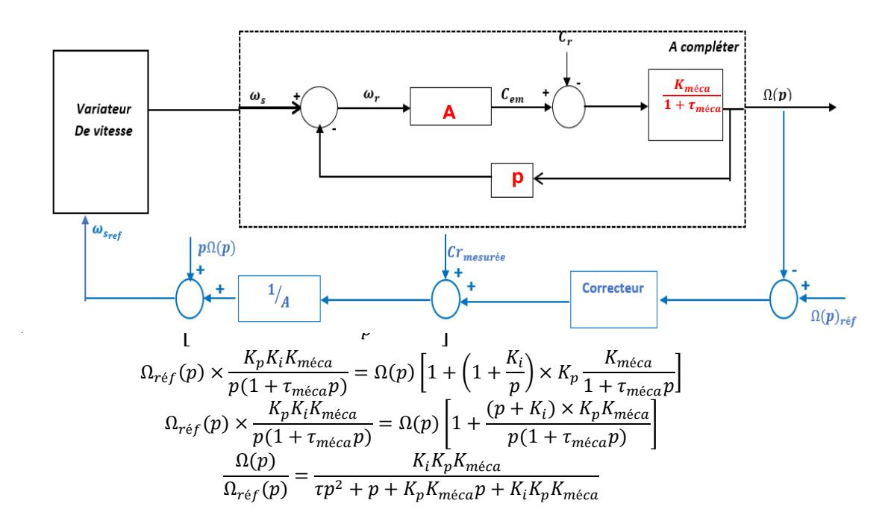

$$\operatorname{Soit}: \frac{\Omega(p)}{\Omega_{r\acute{e}f}(p)} = \frac{1}{1 + \frac{1 + K_p K_{m\acute{e}ca}}{K_p K_{m\acute{e}ca} K_i} p + \frac{\tau_{m\acute{e}ca}}{K_p K_{m\acute{e}ca} K_i} p^2}$$

**C6** On pose : 
$$\omega_0 = \sqrt{\frac{\tau}{K_p K_i K_{m\acute{e}ca}}}$$
 et  $m = \frac{1 + K_p K_{m\acute{e}ca}}{2 K_p K_i K_{m\acute{e}ca}} \times \sqrt{\frac{\tau}{K_p K_i K_{m\acute{e}ca}}}$ 

**C7** On rappelle le théorème de la valeur finale pour exprimer l'erreur statique ():

$$\varepsilon_s(p) = \lim_{p \to 0} p \times [\Omega_{r \neq f}(p) - \Omega(p)] = \lim_{p \to 0} p \Omega_{r \neq f}(p) \left(1 - \frac{\Omega(p)}{\Omega_{r \neq f}(p)}\right)$$

On pose : Ωé () = Ω0 : consigne en échelon de vitesse

$$\varepsilon_s(p) = \lim_{p \to 0} p \times \frac{\Omega_0}{p} \left(1 - \frac{1}{1 + \frac{1 + K_p K_{m\acute{e}ca}}{K_p K_{m\acute{e}ca} K_i}} p + \frac{\tau_{m\acute{e}ca}}{K_p K_{m\acute{e}ca} K_i} p^2\right) = 0$$

C8 Soit: 
$$\frac{\Omega(p)}{\Omega_{r\acute{e}f}(p)} = \frac{1}{1 + \frac{1 + K_p K_{m\acute{e}ca}}{K_p K_{m\acute{e}ca} K_i} p + \frac{\tau_{m\acute{e}ca}}{K_p K_{m\acute{e}ca} K_i} p^2}$$

Avec: 
$$K_p = \frac{2 \times m \times \tau_{m\acute{e}ca} \times \omega_0 - 1}{K_{m\acute{e}ca}} = 0.35$$

$$K_i = \frac{\tau_{m\acute{e}ca} \times \omega_0^2}{K_p \times K_{m\acute{e}ca}} = 2.5$$

**C9** Par lecture graphique du DT4 :

- Pas de dépassement : 1 = 0

- Pas d'erreur statique : 1 = 0

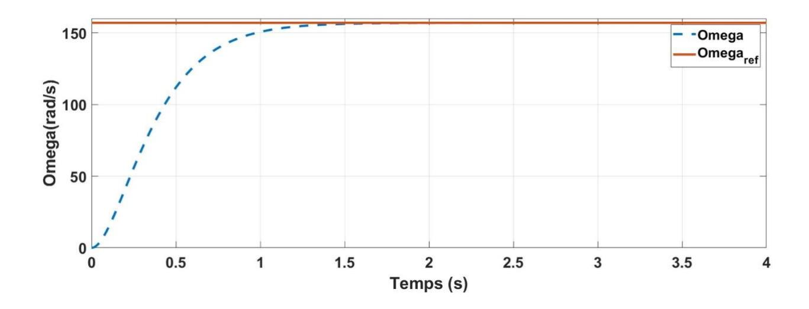

### **C10** Par lecture graphique du DT4 :

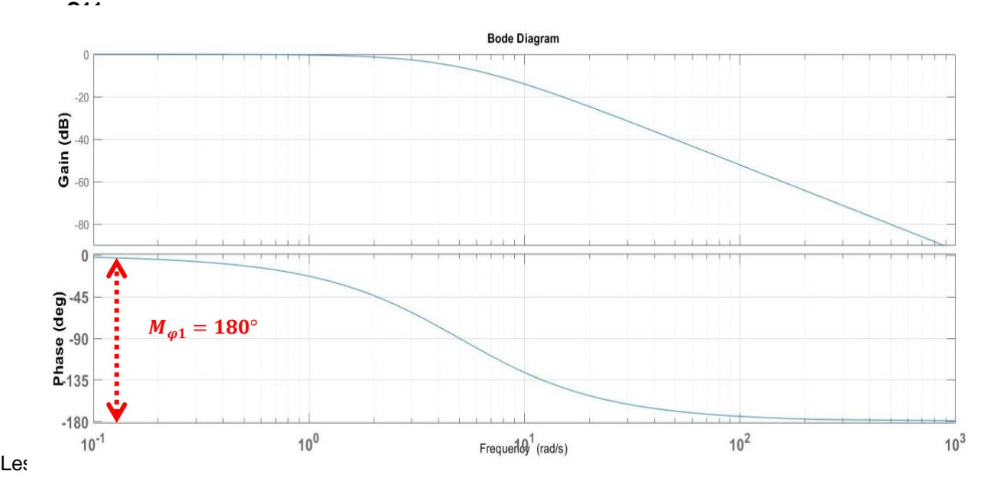

**C12** Par lecture graphique on relève :

- l'erreur statique 2 = 0 ;
- le dépassement relatif 2 ≈ 180−150 150 × 100 ≈ 20% ;
- Une marge de phase de 180°.

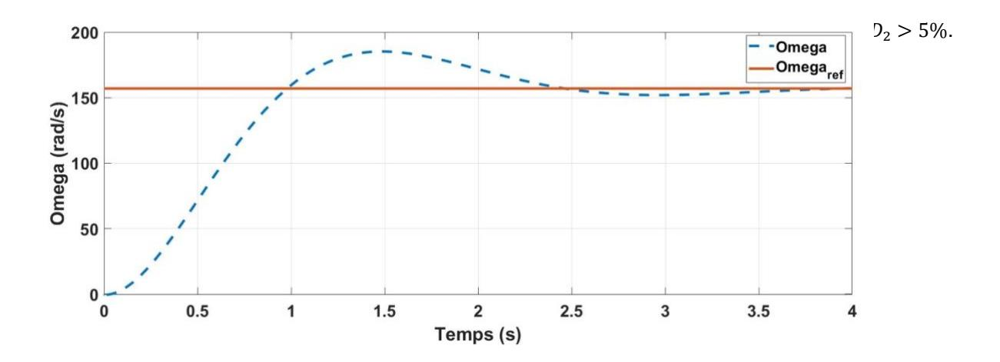

### **Partie D**

**D1** Pour des températures négatives, le capteur doit pouvoir mesurer jusqu'à -20°C : les type J et T conviennent. Le type T est le capteur avec une meilleure tolérance et une répétitivité remarquable mais c'est aussi le plus cher. Utilisé dans un milieu non humide, comme notre cas, le capteur J convient car moins cher avec une tolérance pour des températures autour de 40°C de 40x2,5/100 = 1°C suffisante pour une application de ventilation.

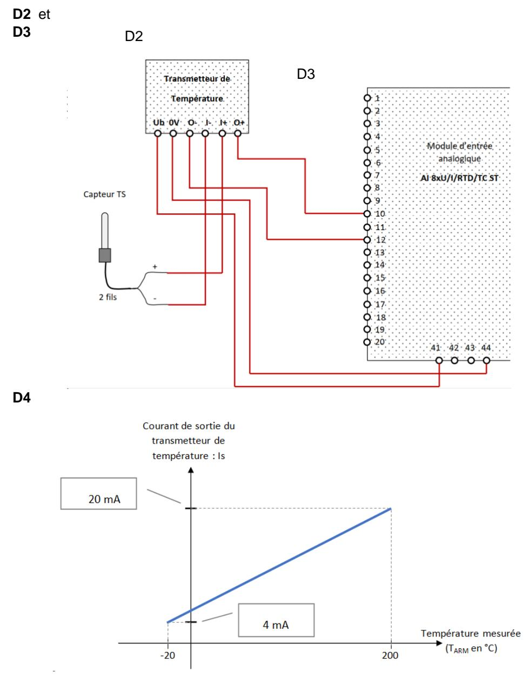

| <b>S1</b> | 1 | 2 | 3 | 4 | 5 | 6 |
|-----------|---|---|---|---|---|---|
| ON        |   |   |   |   | • | • |
| OFF       | • | • | • | • |   |   |

**D6** Une entrée analogique est codée sur 16 bits signé ou 2 octets donc une résolution de 15 bits. Le signe est sur le bit de poids fort de l'octet de poids fort.

| Courant mesuré en mA       | 1,185 | 4 | 20    | 22,81 |
|----------------------------|-------|---|-------|-------|
| Valeur décimal du mot PIW8 | -4864 | 0 | 27648 | 32511 |

**D7**

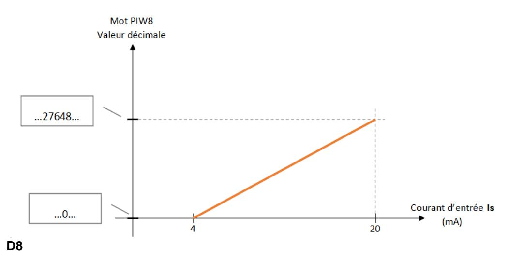

MW8max

### **D9** Équation d'une droite : MW8 = a.PIW8 + b

On voit que b =MW8min = -20 et on déduit : a =  $\frac{MW8-MW8min}{PIW8}$ 

On choisit un point connu sur la droite, par exemple le point (PIW8max, MW8max)

$$=>a=\frac{MW8max-MW8min}{PIW8max}=\frac{200-(-20)}{27648}=0,0080$$
On obtient l'équation MW8 = 
$$\frac{MW8max-MW8min}{PIW8max}.PIW8 + MW8min$$

On obtient l'équation MW8 =  $\frac{\text{PIW8max}}{\text{PIW8}}$ A.N.:  $\text{MW8} = \frac{220}{27648}.\text{PIW8} - 20$ 

**D10** Selon le DR5, l'étendue représente la différence entre la valeur maxi et la valeur mini des températures, soit E = 200 - (-20) = 220.

On introduit E dans l'équation MW8 =  $\frac{E}{27648}$ .PIW8 -20

**D11** On isole PW8 dans l'équation fournie :

CB A A<B PV

Mesure B A<B GV

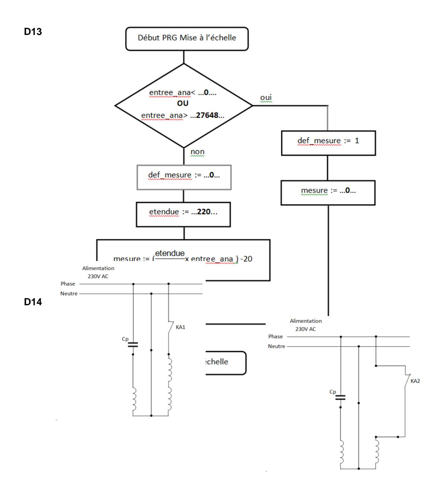

### **D16**

**D17** -Dans le cas où KA1 est fermé (KA2 ouvert), 2 enroulements sont alimentés en série : on double le nombre de paires de pôles et la vitesse du moteur est divisée par 2. On est donc en petite vitesse.

-Dans le cas où KA2 est fermé (KA1 ouvert), 1 enroulement est alimenté : on obtient une paire de pôles et la vitesse du moteur est maxi. On est donc en grande vitesse.

### **D18 D19**

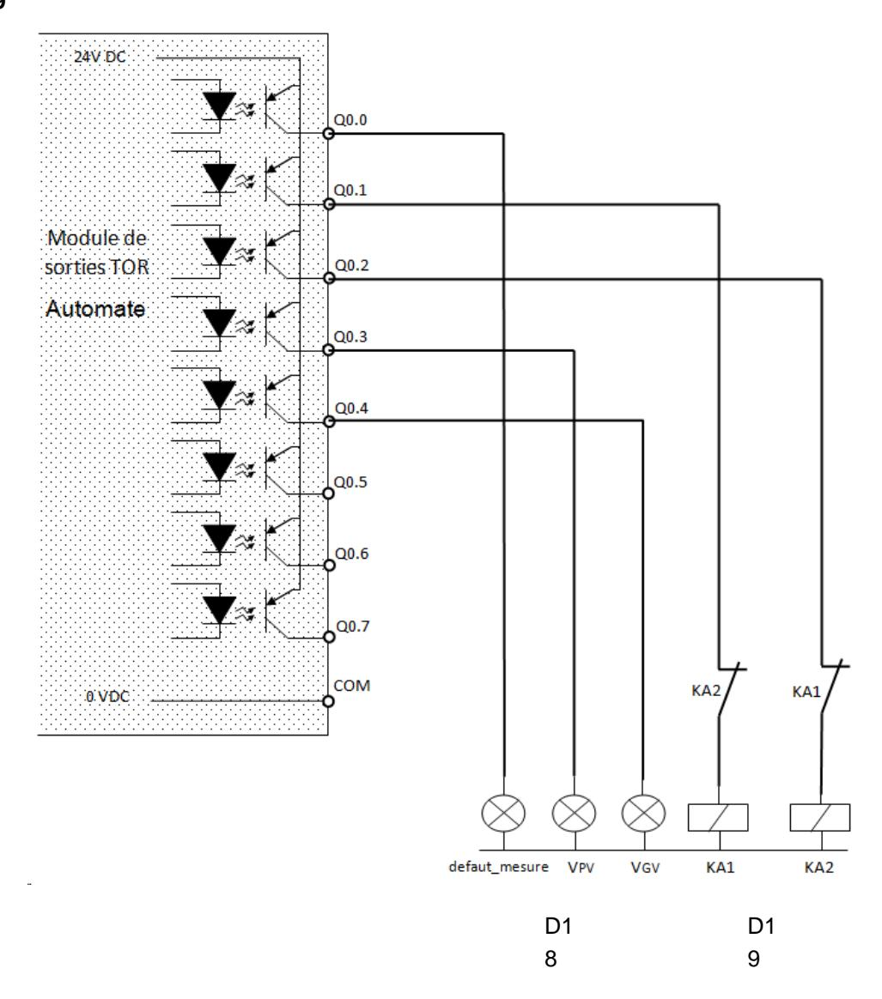

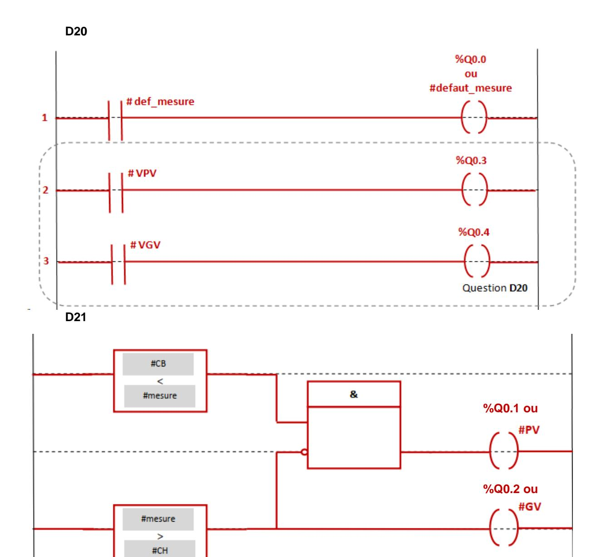

### Partie E

**E1** Chaque sortie d'AOP est rebouclé sur la borne (-) donc on est en fonctionnement linéaire.

Loi des mailles : 
$$\mathbf{e}_{AB} = \mathcal{E}1 + VR2 - \mathcal{E}2$$
 or  $\mathcal{E}1 = \mathcal{E}2 = 0$  =>  $\mathbf{e}_{AB} = VR2$   
 $\mathbf{E}2$ 

$$V1 = \frac{VR2 \cdot (2 \cdot R1 + R2)}{R2} = \frac{VR2 \cdot (2 \cdot 1000 + 834,4)}{834,4} = 3,397. \ VR2 = 3,397. \ e_{AB}$$

$$\mathbf{E}3 \ V3 = G1.G2.G3.\mathbf{e}_{AB} = 3,4.(-100).(-1).\mathbf{e}_{AB} = 340.\mathbf{e}_{AB}$$

**E4** En régime linéaire, V+ = V- et on obtient :

$$V^{+} = \frac{\frac{V3}{R} + \frac{Ve}{R}}{\frac{2}{R}} = V^{-} = \frac{\frac{V4}{R}}{\frac{2}{R}}$$
 les dénominateurs se simplifient

$$=>\frac{V3}{R} + \frac{Ve}{R} = \frac{V4}{R}$$

on peut simplifier par R => V3 + Ve = V4

On en déduit : V4 = 340. eAB + Ve

**E5**

On a : V4 = 337,7⋅eAB + 1,34

Pour eAB = -1 mV on a V4 = 337,7⋅(-0,001)+ 1,34 = 1 V

Pour eAB = 10,8 mV on a V4 = 337,7⋅(0,0108)+ 1,34 = 5 V

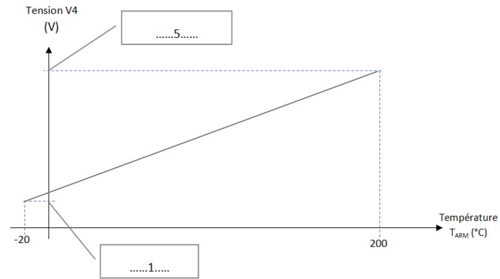

**E6** On a : I2 = I2' + I+ et I1 = I1' + I-

En régime linéaire, I+= I- = 0 donc I2 = I2' et I1 = I1'

**E7** On a : V4 – R5.I2 – Rana.Is = 0

On obtient : I2 = V4-Rana.Is R5

**E8** On a : -R5.I1 + R5.I3 - Ꜫ = 0 or régime linéaire donc Ꜫ = 0

On obtient : R5.I3 = R5.I1 donc I3 = I1

**E9** On a: Is = I2' – I3 or 
$$I3 = I1 = -\frac{Rana \cdot Is}{R5}$$
 et  $I2' = I2 = \frac{V4 - Rana \cdot Is}{R5}$ 

On obtient : Is = 
$$\frac{\text{V4-Rana.Is}}{\text{R5}} + \frac{\text{Rana}\cdot\text{Is}}{\text{R5}}$$
 <=> Is.R5 = V4 - Rana.Is + Rana.Is<=> Is.R5 = V4

Pour finir : Is= V4 / R5 On constate que Is ne dépend pas de Rana mais uniquement de V4 et R5. **E10** Pour V4 = 1V on a Is = 1/250 = 0.004 A soit 4 mA et pour V4 = 5V, Is = 5/250 = 0,02 A soit 20 mA

On obtient bien le profil de courant que doit délivrer le transmetteur soit 4 mA pour -20°C et 20 mA pour 200°C.

### **D. Commentaires du jury**

### **Le sujet comporte cinq parties indépendantes.**

### *Partie A*

L'objectif de cette partie est de dimensionner le variateur et du moto-extracteur électrique pour optimiser la consommation énergétique de l'extracteur d'air. En premier lieu, il s'agit d'établir le cahier des charges du client, de sélectionner une machine asynchrone avec un variateur de vitesse puis de calculer ses pertes. À partir de ces données, un dimensionnement des pâles du ventilateur est proposé.

### *Partie B*

L'objectif de cette partie est, dans un premier temps, de rendre l'installation électrique conforme aux normes pour garantir le bon transfert d'énergie en minimisant les chutes de tensions causées par les longueurs des câbles. Dans un deuxième temps, il s'agit d'éviter de polluer le réseau électrique d'harmoniques en contrôlant le taux de distorsion harmonique des deux commandes proposées. Le respect des normes permet d'assurer le bon fonctionnement des différents équipements.

### *Partie C*

Le contrôle de la vitesse d'extraction de l'air peut être réalisé efficacement via une commande scalaire de la machine asynchrone et une boucle d'asservissement. L'objectif de cette partie est d'étudier les paramètres à respecter comme l'erreur statique, le dépassement et la marge de phase.

### *Partie D*

L'objectif de cette partie est d'étudier la chaine d'acquisition et de traitement permettant de surveiller la température des équipements de la chaine de puissance. L'étude porte sur l'acquisition de la température, le traitement algorithmique de la commande et le pilotage des actionneurs extérieurs via les sorties de l'automate programmable industriel.

### *Partie E*

L'objectif de cette partie est de faire d'étudier la structure du transmetteur de température. L'étude porte sur la mise en forme du signal issu du capteur de température, son amplification, sa conversion de tension en courant afin de la rendre compatible avec la carte d'entrée de l'automate programmable industriel.

### **Analyse globale des résultats et constats**

L'analyse globale des résultats amène aux données suivantes :

- la partie A a été traitée par l'ensemble des candidats mais seulement 55 % d'entre eux l'ont traitée correctement ;
- la partie B a été abordée par 88 % des candidats. Elle n'a été traitée correctement que par 42 % des candidats ;
- la partie C a été abordée par 79 % des candidats. Elle a été traitée correctement par seulement 31 % des candidats ;
- la partie D a été abordée par 90 % des candidats. Elle a été traitée correctement par 53 % des candidats mais aucun candidat ne l'a très bien traitée ;
- la cinquième et dernière partie a été abordée par 70 % des candidats et 47 % d'entre eux l'ont traitée correctement.

L'évaluation des copies montre une hétérogénéité dans le traitement du sujet. Quelques candidats très bien préparés ont pu aborder la quasi-totalité des parties du sujet, en étant efficaces dans la conduite des études pour l'aborder dans son ensemble. Pour les candidats les plus faibles, le jury regrette le manque de maîtrise des formules de base sur les réseaux triphasés, le régime sinusoïdal et les relations d'électrocinétique telles que la loi des mailles, la loi des nœuds ou encore la loi d'Ohm. La qualité de rédaction et de présentation des copies se révèle diverse. La présentation claire des méthodes et raisonnements, ainsi qu'un soin tout particulier porté sur l'orthographe sont des compétences pourtant fondamentales. Le jury attend des réponses détaillées et argumentées. Des résultats donnés directement, sans calcul et sans justification ne répondent pas aux attendus de l'épreuve.

### **Conclusion**

Le jury apprécie les copies des candidats qui justifient ou expliquent les démarches adoptées pour répondre aux questions posées. De plus, la rigueur scientifique et la maîtrise des outils mathématiques usuels nécessaires aux sciences industrielles de l'ingénieur sont des prérequis indispensables. De nombreuses questions sont indépendantes et ne relèvent quelque fois que d'une lecture de documents techniques, il est donc souvent possible de conclure malgré des résultats intermédiaires manquants. Le jury conseille aux futurs candidats de s'investir sérieusement dans toutes les parties du programme du concours et d'acquérir l'ensemble des corpus des compétences et connaissances associées aux disciplines qui constituent les sciences industrielles de l'ingénieur. Enfin, le jury invite vivement les candidats à se préparer avec sérieux et rigueur, à lire attentivement les rapports de jury, à s'entraîner sur les épreuves des sessions passées.

### **E. Résultats**

Les statistiques générales pour cette épreuve sont données ci-dessous.

|                  | CAPET (public) | CAFEP (privé) |
|------------------|----------------|---------------|
| Nombre de copies | 76             | 21            |
| Moyenne          | 8,53 / 20      | 8,75 / 20     |
| Note maximum     | 19,3 / 20      | 16 / 20       |
| Écart type       | 4,05           | 3,87          |

# **Épreuve écrite disciplinaire appliquée**

### **A. Présentation de l'épreuve**

 Durée : 5 heures Coefficient 2

L'épreuve, commune à toutes les options, porte sur l'analyse et l'exploitation pédagogique d'un système pluri-technologique. Elle invite le candidat à la conception d'une séquence d'enseignement, à partir d'une problématique et d'un cahier des charges.

L'épreuve permet de vérifier :

- − que le candidat est capable de mobiliser ses connaissances scientifiques et technologiques pour conduire une analyse systémique, élaborer et exploiter les modèles de comportement permettant de quantifier les performances d'un système pluri-technologique des points de vue de la matière, de l'énergie et/ou de l'information, afin de valider tout ou partie de la réponse au besoin exprimé par un cahier des charges ;
- − qu'il est capable d'élaborer tout ou partie de l'organisation d'une séquence pédagogique ainsi que les documents techniques et pédagogiques associés (documents professeurs, documents fournis aux élèves, éléments d'évaluation).

Les productions pédagogiques attendues sont relatives à une séquence d'enseignement portant sur les programmes de collège ou de lycée.

L'épreuve est notée sur 20. Une note globale égale ou inférieure à 5 est éliminatoire.

### **B. Sujet**

Le sujet est disponible en téléchargement sur le site du ministère à l'adresse : <https://www.devenirenseignant.gouv.fr/media/12858/download>

L'Urbanloop est un système innovant de transport public autonome sur rails. Il permet d'obtenir un réseau de transport sans attente, sans arrêt intermédiaire et sans correspondance.

Le système est principalement constitué de rails et de capsules (voir figure). Une capsule peut accueillir une ou deux personnes, une personne et deux enfants, une personne à mobilité réduite et son accompagnateur ou une personne et un vélo. La conception ne comprend aucune batterie pour diminuer l'impact environnemental. Le système Urbanloop a battu le record du monde de la plus faible consommation énergétique pour un véhicule autonome sur rails en 2021 (0,05 kWh par km) et a été sélectionné pour présenter cette technologie lors des Jeux Olympiques et Paralympiques de 2024.

Un démonstrateur de ce système sera mis en service à Saint-Quentin-en-Yvelines pour relier le vélodrome national et la base nautique. C'est cette application qui est particulièrement étudiée dans ce sujet.

L'Urbanloop répond à la problématique générale :

**« Transporter rapidement des personnes en environnement urbain et péri-urbain en ayant le moins d'impact possible sur l'environnement. »**

Le système étudié doit pour ce faire remplir plusieurs exigences dont :

- rejeter moins de CO2 que les transports urbains actuels ;
- avoir un coût du titre de transport au plus équivalent aux transports urbains actuels ;
- s'intégrer harmonieusement dans l'environnement urbain ;

- transporter les personnes en toute sécurité ;
- être alimenté par le réseau EDF ;
- permettre d'acheminer les personnes au bon endroit en toute autonomie.

Les objectifs de cette étude sont :

- de valider les solutions techniques envisagées pour satisfaire ces exigences et de vérifier que le système répond bien à la problématique générale ;
- de proposer des applications pédagogiques en utilisant l'Urbanloop comme support transversal pour une classe de première générale ayant choisi la spécialité SI.

### **C. Éléments de correction**

**Q1.** Le temps de trajet moyen est donné par l'addition du temps nécessaire pour parcourir les 2 km séparant les deux stations, du temps nécessaire pour le départ du bus et du temps nécessaire pour la descente.

Pour le calcul des temps de trajet, la formule V=D/T sera utilisée où V est la vitesse moyenne. Soit temps moyen = 2x60/20 + 2 + 1= 9 min*.*

Comme le bus transporte les 50 passagers ensemble, le temps de trajet est identique pour toutes les personnes et est égal au temps de trajet moyen.

**Q2.** Temps de trajet (distance sur la vitesse) = 1,1x60/40 = 1,65 min, soit 1 min et 39 s.

Temps du premier arrivé = Temps de départ + temps de trajet + temps de descente.

Temps du premier arrivé = 0,5 + 1,65 + 0,25 = 2,40 min (2 min et 24 s).

Temps du dernier arrivé = temps de départ des 24 capsules + temps de départ + temps de trajet + temps montée/descente.

Temps du dernier arrivé = 24x0,5 + 0,5 + 1,65 + 0,25 = 14,40 min (14 min et 24 s).

Temps moyen = (Temps du premier arrivé + Temps du dernier arrivé)/2 = 8,40 min (8 min et 24 s).

| Moyens de transport utilisé         | Urbanloop | Bus GNV (gaz) | Bus diesel |
|-------------------------------------|-----------|---------------|------------|
| Temps de trajet du 1er passager     | 2,40 min  | 9 min         | 9 min      |
| Temps de trajet du dernier passager | 14,40 min | 9 min         | 9 min      |
| Temps de trajet moyen               | 8,40 min  | 9 min         | 9 min      |

**Q3.** Le temps minimal pour faire partir 4 capsules est de 4x0,5 = 2 min. Le temps pour faire venir une capsule de la station 1 à la station 2 est compris entre 1,65 min (à vide) et 2,40 min (en charge). Si on fait partir une capsule vide de la station 1 dès qu'une capsule a quitté la station 2 alors il y aura bien toujours une capsule de disponible pour faire partir des voyageurs sinon il y aura un temps d'attente.

#### **Q4.** Coût au kilomètre :

- pour le bus gazole, 2x0,349 = 69,8 centimes ;
- pour le bus gaz naturel, 7,5x0,273 = 2 centimes ;
- pour les capsules, 13x0,05 = 0,65 centimes.

### Coût pour 50 personnes pour 1 km :

- pour le bus gazole, 69,8 centimes ;
- pour le bus gaz naturel, 2 centimes ;
- pour les capsules (2 personnes par capsule), 25x0,65 = 16,25 centimes.

| Moyens de transport utilisé      | Urbanloop  | Bus GNV (gaz) | Bus diesel |  |  |
|----------------------------------|------------|---------------|------------|--|--|
| Coût pour 1 km pour un véhicule  | 0,65 cent  | 2 cent        | 69,8 cent  |  |  |
| Coût pour 50 personnes pour 1 km | 16,25 cent | 2 cent        | 69,8 cent  |  |  |

**Q5.** Le temps moyen est légèrement inférieur pour les capsules avec des hypothèses favorables au bus (temps d'attente quasi nul et taux de remplissage maximal). Le coût d'utilisation est plus faible pour des capsules que pour un bus diesel mais plus important que pour un bus au gaz naturel (toujours avec des hypothèses très favorables aux bus).

S'il s'agit de transporter toujours des blocs de 50 personnes, le choix des capsules pour cette utilisation pourrait être discutable. Cependant, les capsules offrent plus de modularité et s'adaptent aux différents flux, cette solution est donc plus économique tant sur le plan financier qu'en terme de temps à l'utilisation.

De façon générale, pour une application urbaine et périurbaine, plus le trajet sera long plus le gain de temps en capsules sera important (capsules bien plus rapides et très peu d'attente). De plus, l'utilisation de capsules permettra de désengorger le trafic routier. Le seul point négatif est la nécessité de mettre en place les infrastructures.

On peut donc en déduire que l'utilisation des capsules est pertinente pour l'application de Saint Quentin en Yvelines mais encore plus pour des zones plus étendues en ville.

**Q6.** Les grandes thématiques sont : - fonctionnel ; - structurel ;

environnemental;
scientifique;
historique;
technique;
social;
économique.

Q7. Une proposition possible est un document à trous à compléter comprenant :

- une recherche internet (par exemple prix électricité, du gaz...);
- une simulation à l'aide d'un tableau (à l'aide d'une feuille de calcul d'un tableur préremplie avec un certain nombre de formules, ils doivent rentrer le nombre de capsules, le prix de l'électricité...);
- une comparaison pour conclure sur les avantages et inconvénients en fonction de différents scénarios d'usage (questions guidées sur le prix, l'impact environnemental, le temps de trajet... la comparaison doit être cohérente avec la simulation précédente).
- **Q8.** Le seul rail qui respecte une flèche maximale inférieure à 0,1 mm est le rail de dimensions 150x90x11 mm avec un espacement entre traverses de 660 mm.
- **Q9.** Masse d'une capsule  $M_C = 1000$  kg.

Masse d'un tronçon (2 rails + 9 traverses + 18 pieds) = 2x123.5 + 9x1 + 18x1 = 274 kg.

Soit une masse totale sur le sol de 1274 kg et un poids de 1274x9,81 = 12498 N.

En supposant que la masse est équitablement répartie sur les 18 pieds, le sol exerce, sur chaque pied, une force  $F_{Sol \rightarrow Pied} = 694,3 \text{ N}$ .

**Q10.** La surface minimale  $S_{PiedMin}$  d'un pied pour respecter la pression maximale de 1 bar est donnée par  $S_{PiedMin} = \frac{F_{Sol \to Pied}}{P_{Max}} = \frac{694.3}{10^5} = 69.4 \text{ cm}^2.$ 

**Q11.** Ce choix est pertinent car 190 cm2 >  $S_{PiedMin} = 69.4$  cm2.

**Q12.** Entre les instants  $t_1$  et  $t_2$ , la décélération est constante :  $a_C = \frac{0 - V_0}{t_2 - t_1} \iff t_2 - t_1 = -\frac{V_0}{a_C}$ .

**Q13.** La distance minimale  $D_{min}$  correspond à la distance parcourue entre les instants  $t_0$  et  $t_2$ .

Soit  $D_1$  la distance parcourue entre les instants  $t_0$  et  $t_1$ .

Soit  $D_2$  la distance parcourue entre les instants  $t_1$  et  $t_2$ .

Les distances  $D_1$  et  $D_2$  représentent l'aire sous la courbe de la vitesse v(t).

Soit 
$$D_{min} = D_1 + D_2 = V_0 (t_1 - t_0) + \frac{1}{2} V_0 (t_2 - t_1)$$
 avec  $t_2 - t_1 = -\frac{V_0}{a_0}$ .

D'où 
$$D_{min} = V_0 (t_1 - t_0) - \frac{1}{2} \frac{V_0^2}{a_0}$$

A.N. 
$$D_{min} = 60/3,6 \times 0,01 - \frac{1}{2} \frac{(60/3,6)^2}{-1.4} = 99,4 \text{ m}$$

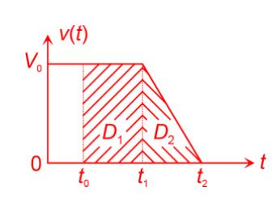

**Q14.** Si la longueur de la capsule est négligée, le nombre maximum de capsules  $N_{Cmax}$  est donné par

$$N_{Cmax} = \left\lfloor \frac{D_{parcours}}{D_{min}} \right\rfloor$$
 (partie entière). A.N.  $N_{Cmax} = \left\lfloor \frac{2200}{99,4} \right\rfloor = 22$ 

**Q15.** Le choix d'utiliser 10 capsules est judicieux pour cette application ( $10 < N_{Cmax}$ ).

**Q16.** La résultante tangentielle vaut  $T_{FAR} = -\frac{C_{FAR}}{R_{roue}}$  pour la roue arrière et vaut  $T_{FAV} = -\frac{C_{FAV}}{R_{roue}}$  pour la

roue avant.

A.N. 
$$T_{FAR} = -\frac{60}{0.2} = -300 \text{ N}$$
  $T_{FAV} = -\frac{150}{0.2} = -750 \text{ N}.$ 

Pour la résultante tangentielle (2 roues avant et arrière)  $T_F = 2T_{FAR} + 2T_{FAV} = -2100 \, \text{N}$ .

**Q17.** On applique le *PFD* pour un mouvement de translation rectiligne, ce qui donne  $a_C = \frac{T_F}{M_C}$ .

A.N. 
$$a_C = -\frac{2100}{1000} = -2.1 \,\mathrm{m \ s^{-2}}$$
.

Ce dispositif permet bien d'atteindre la décélération demandée  $\left|a_{\rm c}\right| >$  1,4 m  $\cdot$  s  $^{-2}$  .

**Q18.** Dans le cas le plus défavorable, c'est-à-dire avec un frein avant en moins, la résultante tangentielle due à l'ensemble du freinage sur la capsule est désormais :  $T_F = 2T_{FAR} + T_{FAV} = -1350 \text{ N}$ .

La décélération, dans ce cas, vaut 
$$a_{\rm C} = -\frac{1350}{1000} = -1,35~{\rm m\cdot s^{-2}}$$
.

Le cahier des charges n'est pas respecté :  $|a_c| < 1,4 \text{ m} \cdot \text{s}^{-2}$ .

Pour que le cahier des charges soit respecté, le choix proposé pour le couple de freinage est de 150 N·m pour les freins avant et de 100 N·m pour les freins arrières.

26

Dans ce cas, 
$$a_C = -\frac{1750}{1000} = -1.75 \cdot \text{m s}^{-2} \text{ et } |a_C| > 1.4 \text{ m} \cdot \text{s}^{-2}.$$

Q19. La durée proposée pour l'évaluation est 1h.

|                                                                                                | Modéliser les a | actions mécaniques |              |     |      |        |         |     |      |   |  |  |  |
|------------------------------------------------------------------------------------------------|-----------------|--------------------|--------------|-----|------|--------|---------|-----|------|---|--|--|--|
|                                                                                                |                 |                    | Niveau élève |     |      |        |         |     |      |   |  |  |  |
| Compétences                                                                                    | Question(s)     | Niveau question    |              | Cop | ie 1 |        |         | Cop | ie 2 |   |  |  |  |
|                                                                                                |                 |                    | Α            | ВС  |      | D      | Α       | ВС  |      | D |  |  |  |
| Savoir tracer une force donnée                                                                 | Q1              | 4                  |              | Х   |      |        |         |     | X    |   |  |  |  |
| Déterminer les actions mécaniques (statique) : expression d'une force                          | Q2              | 1 ou 2             | Х            |     |      |        | Х       |     |      |   |  |  |  |
| Déterminer les actions mécaniques (statique) : utiliser le PFS pour déterminer une force       | Q6              | 2                  | Х            |     |      |        |         |     | X    |   |  |  |  |
| Déterminer les actions mécaniques (statique) : déplacer un moment                              | Q3, Q4          | 3                  |              | X   |      |        |         |     | X    |   |  |  |  |
| Déterminer les actions mécaniques (statique) : utiliser le PFS pour déterminer un moment | Q5              | 2                  |              | X   |      |        |         |     |      | Х |  |  |  |
|                                                                                                |                 |                    |              |     |      |        |         |     |      |   |  |  |  |
|                                                                                                | Présenter et f  | ormaliser une idée |              |     |      |        |         |     |      |   |  |  |  |
|                                                                                                |                 |                    |              |     | ١    | liveau | ı élèv  | е   |      |   |  |  |  |
| Compétences                                                                                    | Question(s)     | Niveau question    |              | Cop | ie 1 |        | Copie 2 |     |      |   |  |  |  |
|                                                                                                |                 |                    | Α            | В   | С    | D      | Α       | В   | С    | D |  |  |  |
| Schéma/croquis                                                                                 | Q1              | 1                  | Х            |     |      |        |         | Х   |      |   |  |  |  |

### Pour la première compétence :

- D Absence de réponse ou inférieur au niveau C ;
- C Toutes les flèches tracées ont le bon point d'application et la bonne direction ;
- B toutes les flèches tracées ont le bon point d'application, la bonne direction, le bon sens ;
- A Niveau B + proportions respectées.

#### Pour la copie 1 :

| Interrogation 1 ère SI              |             | Durée :1h                 | Date : 03/06/24 |  |  |  |  |  |  |  |  |  |  |
|------------------------------------------------|-------------|---------------------------|-----------------|--|--|--|--|--|--|--|--|--|--|
| Modéliser et déterminer les actions mécaniques |             |                           |                 |  |  |  |  |  |  |  |  |  |  |
| Nom : Martin                                   | Commentaire | es: . la méthode des l | ras de levier.  |  |  |  |  |  |  |  |  |  |  |
| Note :                                         | Bon en      | rsemble                   |                 |  |  |  |  |  |  |  |  |  |  |

On s'intéresse à une capsule du système Urbanloop qui accélère selon  $+\vec{x}$ .

Cette capsule est soumise à son poids, aux actions normales du sol sur les roues équivalentes, aux actions tangentielles du sol sur les roues équivalentes dues aux frottements entre les roues et le sol et aux actions tangentielles du sol sur les roues équivalentes dues aux moteurs (un moteur par roue).

Q1. Représenter à l'aide de vecteurs les actions mécaniques qui s'exerce sur la capsule sur la figure ci-contre (pesanteur en bleu, actions normales en noir, actions tangentielles résistives en vert et actions tangentielles motrices en rouge).

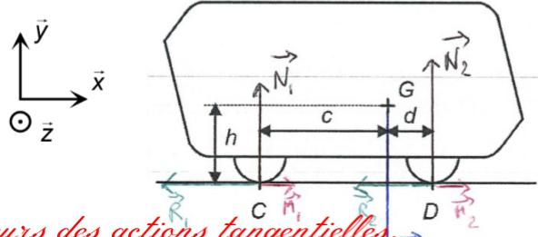

Áttention à la taille des vecteurs des actions tangen la capsule doit avancer et non reculer.

La capsule est maintenant à l'arrêt. On cherche à déterminer les actions mécaniques du sol sur les roues équivalentes. On suppose que ces actions se limitent aux actions normales. On note M la masse de la capsule et g l'accélération de la pesanteur.

**Q2.** Exprimer, en fonction de M et g, l'expression littérale de la composante sur  $\vec{y}$  de l'action de la pesanteur sur la capsule  $F(pes \rightarrow capsule)$ .

**Q3.** A l'aide de la méthode des bras de leviers, donner l'expression littérale de la composante sur  $\vec{z}$  du moment en C de l'action de la pesanteur sur la capsule ( $M(C, pes \rightarrow capsule)$ ). On vérifiera bien la cohérence du signe du moment trouvé.

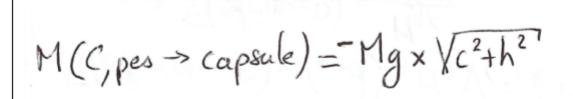

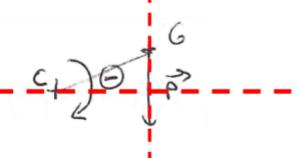

Revoir la méthode des bras de levier

Q4. A l'aide de la méthode des bras de leviers, donner l'expression littérale de la composante sur  $\vec{z}$  du moment en C de l'action du sol sur la roue équivalente avant ( $M(C,sol \rightarrow roueD)$ ). On vérifiera bien la cohérence du signe du moment trouvé.

$$M(C, sol \rightarrow roue D) = N_2 \times (c+d)$$

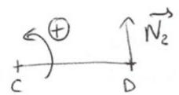

- **Q5.** Sachant que  $M(C, pes \rightarrow capsule) + M(C, sol \rightarrow roueC) + M(C, sol \rightarrow roueD) = 0$ , montrer que la composante sur  $\vec{y}$  de la force du sol sur la roue avant (roue D) s'exprime de la façon suivante :  $F(sol \rightarrow roueD) = \frac{Mgc}{c+d}$

Ce n'est pas le cas mais la méthode est acquise

**Q6.** Sachant que  $F(pes \rightarrow capsule) + F(sol \rightarrow roueC) + F(sol \rightarrow roueD) = 0$ , déterminer la composante sur  $\vec{y}$  de la force du sol sur la roue arrière (roue C).

### Pour la copie 2 :

| Interrogation 1 ère SI              |             | Durée :1h          | Date : 03/06/24  |  |  |  |  |  |  |  |  |  |
|------------------------------------------------|-------------|--------------------|------------------|--|--|--|--|--|--|--|--|--|
| Modéliser et déterminer les actions mécaniques |             |                    |                  |  |  |  |  |  |  |  |  |  |
|                                                | Commentaire | S:                 |                  |  |  |  |  |  |  |  |  |  |
| Nom : Simon                                    |             |                    |                  |  |  |  |  |  |  |  |  |  |
|                                                | Les co      | mpétences de bas   | e sont acquises. |  |  |  |  |  |  |  |  |  |
| Note :                                         |             | x à utiliser votre |                  |  |  |  |  |  |  |  |  |  |

On s'intéresse à une capsule du système Urbanloop qui accélère selon  $+\vec{x}$ .

Cette capsule est soumise à son poids, aux actions normales du sol sur les roues équivalentes, aux actions tangentielles du sol sur les roues équivalentes dues aux frottements entre les roues et le sol et aux actions tangentielles du sol sur les roues équivalentes dues aux moteurs (un moteur par roue).

Q1. Représenter à l'aide de vecteurs les actions mécaniques qui s'exerce sur la capsule sur la figure ci-contre (pesanteur en bleu, actions normales en noir, actions tangentielles résistives en vert et actions tangentielles motrices en rouge).

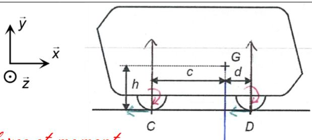

Áttention ne pas confondre force et moment. Le point d'application de l'action de la pesanteur n'est pas le bon.

La capsule est maintenant à l'arrêt. On cherche à déterminer les actions mécaniques du sol sur les roues équivalentes. On suppose que ces actions se limitent aux actions normales. On note M la masse de la capsule et g l'accélération de la pesanteur.

**Q2.** Exprimer, en fonction de M et g, l'expression littérale de la composante sur  $\vec{y}$  de l'action de la pesanteur sur la capsule  $F(pes \rightarrow capsule)$ .

**Q3.** A l'aide de la méthode des bras de leviers, donner l'expression littérale de la composante sur  $\vec{z}$  du moment en C de l'action de la pesanteur sur la capsule ( $M(C, pes \rightarrow capsule)$ ). On vérifiera bien la cohérence du signe du moment trouvé.

Le signe du moment doit être déterminé en utilisant une figure.

$$M(C, sol \rightarrow roue D) + \underbrace{\frac{Mg}{2}}_{2}(c + Nn'y a aucune raison que l'action normale vaille  $Mg/2$$$

$$Mgc + \frac{Mg(c+d)}{2} = \frac{3Mgc+d}{2} = 0$$

$$-Mg+ + \frac{Mgc}{c+d} = 0$$

**Q20.** Court terme : - corriger de façon détaillée en classe l'évaluation ;

- faire des rappels au début de la prochaine séquence en lien avec ces

compétences.

Moyen terme : - donner un Devoir Maison, lien vers des animations, des QCM en ligne.

**Q21.** Court terme : - s'entretenir individuellement avec les élèves ;

- s'entretenir avec le prof principal ou les collègues pour déceler des difficultés

personnelles ou autres (dyslexie, …).

Court ou moyen terme : - faire une remédiation immédiate ou différée suivant la situation (quizz) ;

Moyen terme : - faire un stage de réussite (utilisation des heures du pacte) pour renforcer

les connaissances et compétences travaillées au sein de la classe ;

- mettre en place un tutorat.

**Q22.** En utilisant les fronts montants et descendants et les deux voies en quadrature du codeur, cela permet d'avoir 4x100 fronts par tour. Le rayon de la roue étant de 20 cm, la distance parcourue lors d'un tour, sans glissement, est de  $2\pi x20$  cm. La précision sur le positionnement de la capsule obtenu théoriquement est de  $40\pi/400$  cm, soit 0.314 cm.

**Q23.** La fréquence des signaux issus du codeur est maximale quand la capsule de déplace à sa vitesse maximale.

La vitesse maximale de la capsule est  $V_0 = 60 \text{ km h}^{-1}$  avec un rayon  $R_{roue} = 20 \text{ cm}$ , soit une vitesse angulaire des moteurs  $\omega_{mmax} = \frac{V_0}{R_{roue}} = \frac{60/3,6}{0,2} = 83,3 \text{ rad} \cdot \text{s}^{-1}$ .

D'où  $f_{cmax}$  =  $100 \frac{\omega_{mmax}}{2\pi}$  =  $100 \times \frac{83.3}{2\pi}$  = 1326 Hz ( $\frac{\omega_{mmax}}{2\pi}$  temps pour faire un tour et 100 impulsions par tour).

La fréquence du DSP choisi convient bien (1326 Hz < 40 MHz).

**Q24.** En présence de glissement, la vitesse de la capsule n'est plus proportionnelle à la vitesse de rotation des roues motrices. L'information obtenue à l'aide du codeur incrémental n'est plus fiable.

**Q25.** Le protocole UDP est bien adapté car il permet d'envoyer des données plus rapidement que le protocole TCP/IP.

**Q26.** 
$$13 = 8 + 4 + 1 = 2^3 + 2^2 + 2^0 = (00001101)_2$$
  
 $45 = 32 + 8 + 4 + 1 = 2^5 + 2^3 + 2^2 + 2^0 = (00101101)_2$   
 $33 = 32 + 1 = 2^5 + 2^0 = (00100001)_2$ 

| Codage de l'heure sur 8 bits : 13   | 0 | 0 | 0 | 0 | 1 | 1 | 0 | 1 |
|-------------------------------------|---|---|---|---|---|---|---|---|
| Codage des minutes sur 8 bits : 45  | 0 | 0 | 1 | 0 | 1 | 1 | 0 | 1 |
| Codage des secondes sur 8 bits : 33 | 0 | 0 | 1 | 0 | 0 | 0 | 0 | 1 |

Q27. Avec ce codage, l'erreur maximale est de 1 s.

Ce qui donne pour une vitesse de  $V_0 = 60 \text{ km h}^{-1} = 16.7 \text{ m}$ . une distance parcourue de 16.7 m.

**Q28.** L'erreur due à ce codage est supérieure à 1 cm. On propose de coder les ms ou les centaines de  $\mu$ s.

#### Q29.

| Determo(e)                                          |                          |   |   | 1 | 1 |   |   |   |     |   |   |   |     |   |   |   |
|-----------------------------------------------------|--------------------------|---|---|---|---|---|---|---|-----|---|---|---|-----|---|---|---|
| Retenue(s)                                          | 1                        | 1 | 1 | 1 | 1 | 1 | 1 |   | 1   |   | 1 | 1 |     |   | 1 |   |
| Somme des octets de la pseudo-entête                | 0                        | 1 | 1 | 0 | 0 | 1 | 1 | 0 | 0   | 0 | 0 | 1 | 1   | 1 | 0 | 0 |
| Somme des octets de l'entête UDP sans le checksum   | 1                        | 1 | 0 | 0 | 1 | 1 | 0 | 1 | 0   | 1 | 0 | 0 | 1   | 0 | 0 | 1 |
| Somme des octets de données                         | 1                        | 0 | 1 | 1 | 1 | 1 | 0 | 1 | 0   | 1 | 0 | 1 | 1   | 0 | 0 | 1 |
| Somme totale                                        | 1                        | 1 | 1 | 1 | 0 | 0 | 0 | 0 | 1   | 0 | 1 | 1 | 1   | 1 | 1 | 0 |
| Code d'erreur (complément à 1 de la somme totale)   | 0                        | 0 | 0 | 0 | 1 | 1 | 1 | 1 | 0   | 1 | 0 | 0 | 0   | 0 | 0 | 1 |
|                                                     |                          |   |   |   |   |   |   |   |     |   |   |   | ,   |   |   |   |
| Valeur du checksum (3905) 16 sur 16 bits | 0                        | 0 | 1 | 1 | 1 | 0 | 0 | 1 | 0   | 0 | 0 | 0 | 0   | 1 | 0 | 1 |
|                                                     |                          |   |   |   |   |   |   |   |     |   |   |   |     |   |   |   |
| Comparaison du checksum et du code d'erreur         | Détection d'une erreur : |   |   |   |   |   |   |   | oui |   |   |   | non |   |   |   |

**Q30.** La trame contient 40 octets, soit  $N_b = 40x8 = 320$  bits.

Le temps de transmission  $T_{trans}$  est donné par  $T_{trans} = \frac{N_b}{d_s}$ .

A.N. 
$$T_{trans} = \frac{320}{300.10^6} = 1,07 \,\mu\text{s}.$$

**Q31.** La durée  $T_{ret}$  est donnée par  $T_{ret} = T_{et} + T_{trans} + T_{d}$ . A.N.  $T_{ret} = 20 + 1,07 + 5 = 26,07 \,\mu s$ .

**Q32.** Pour une vitesse de 60 km·h-1, l'erreur de position est de 0,435 mm (60/3,6x26,07x10-6). Cette erreur de position due aux étapes de codage, transmission, décodage est négligeable devant les autres erreurs.

Q33. Manipulation 1 : Créer un réseau avec deux ou trois machines et un switch. Proposer plusieurs jeux d'adresses de classe C et utiliser la commande ping pour voir si les machines communiquent ou pas. Conclure sur la partie « réseau » et la partie « machine » de l'adresse IP. Connaissances : Protocoles, support filaire et sans fil.

Manipulation 2 : Observer les trames échangées lors du ping et identifier les différentes parties du message. Connaissances : Trame.

Manipulation 3 : Proposer un fichier avec un réseau complexe composé de liaisons filaires et non filaires et les faire légèrement modifier par les élèves pour obtenir différents chemins de routage pour aller d'un ordinateur à un autre. Mettre ces résultats en corrélation avec le débit maximal des différentes liaisons. Connaissances : support filaire et sans fil, débit maximal.

**Q34.** Le but d'une évaluation formative est de renseigner l'enseignant sur les progrès et les acquis des élèves afin d'identifier les besoins et d'ajuster l'enseignement en conséquence.

| Quels sont les supports physiques ut ☐ câble ethernet ☐ fibre optique ☐ câble électrique ☐ l'air                          | tilisables pour transmettre o                 | des données ?                                 |
|---------------------------------------------------------------------------------------------------------------------------|-----------------------------------------------|-----------------------------------------------|
| Quel est le rôle du serveur DHCP ? ☐ configurer automatiquemen ☐ sécuriser le réseau ☐ stocker les données                | t l'adresse IP                                |                                               |
| Quel élément du réseau permet de fa □ un routeur                                                                       | aire le lien entre l'IP privée □ un switch | et publique pour utiliser internet ? ☐ un hub |
| Combien d'appareils peut-on connec                                                                                        | ter sur le réseau 192.169.1                   | 1.0 ?                                         |
| □ 255                                                                                                                     | □ 254                                         | □ 128                                         |
| Pour un réseau dont l'adresse est 19 tous les périphériques réseau) ?                                                     | 92.168.1.0, quelle est l'adre                 | esse de broadcast (envoi de données à         |
| □ 192.168.1.1                                                                                                             | □ 192.168.1.254                               | □ 192.168.1.255                               |
| <b>Q35.</b> Pour une vitesse de 60 km·h -1 , $F_V = 0.5x1.2x \left(\frac{60}{3.6}\right)^2 x0.85x1.6x1x0.3$ |                                               | aut:                                          |
| $\frac{7}{3,6}$                                                                                                           | , – 00 IV.                                    |                                               |

**Q36.** Le théorème de l'énergie cinétique pour un mouvement de translation rectiligne donne :  $\frac{d}{dt} \left( \frac{1}{2} M_{\text{C}} \cdot V^2(t) \right) = P_m - F_{\text{V}} \cdot V(t) \text{ avec } P_m \text{ la puissance absorbée par la capsule.}$ 

Soit  $P_m = M_{C.ac.}v(t) + F_{v.}v(t)$ .

D'après le profil de vitesse de la figure 8, la puissance  $P_m$  est maximale à l'instant  $t_b$ .

D'où  $P_{max} = M_{C.}a_{C.}V_0 + F_{v.}V_0$ 

A.N. 
$$P_{max} = (1000x1, 4 + 68)x \frac{60}{3.6} = 24,47 \text{ kW}.$$

**Q37.** Par définition la puissance est donnée par  $P_{moy} = U_0.I_{moy}$ , d'où  $I_{moy} = \frac{P_{moy}}{U_0}$ .

A.N. 
$$I_{moy} = \frac{7200}{72} = 100 \text{ A}$$

**Q38.** La résistance électrique linéaire du rail est donnée par  $R_t = \frac{\rho}{S}$ .

A.N. 
$$R_{\ell} = \frac{0.13}{\left[\left(150 - 11\right)x 11 + 90x 11\right]} = 51.6 \ \mu\Omega \cdot m^{-1}.$$

**Q39.** La résistance électrique  $R_1$  correspond aux deux morceaux de rails de longueur x associés en série. D'où  $R_1 = 2R_\ell x$ .

La résistance électrique  $R_2$  correspond aux deux morceaux de rails de longueur L - x associés en série. D'où  $R_2 = 2R_c(L - x)$ .

**Q40.** Les deux résistances  $R_1$  et  $R_2$  sont associées en parallèle :  $R_{eq} = \frac{R_1 \cdot R_2}{R_1 + R_2}$ 

D'où 
$$R_{eq} = 2 R_{\ell}.L.\left(1 - \frac{x}{L}\right).\frac{x}{L}$$
.

**Q41.** La chute de tension  $\Delta u_R$  due à la résistance  $R_{eq}$  est donnée par :

$$\Delta u_R = R_{eq}.I_{moy} = 2R_{\ell}.L.\left(1 - \frac{x}{L}\right).\frac{x}{L}.I_{moy}.$$

**Q42.** L'équation de la chute de tension  $\Delta u_R$  en fonction de la distance x est l'équation d'une parabole dont le sommet est en haut (coefficient négatif du terme  $x^2$ ).

De plus  $\Delta u_R(x=0) = \Delta u_R(x=L) = 0$ , l'axe de symétrie de la parabole est la droite d'équation  $x=\frac{L}{2}$ , le

maximum se produit pour  $x = \frac{L}{2}$ . D'où  $\Delta u_{Rmax} = \frac{1}{2} R_{\ell}.L.I_{moy}$ .

**Q43.** Le critère sur la chute de tension se traduit par  $\Delta u_{Rmax} \le 0.05 U_0$ .

Soit 
$$\frac{1}{2} R_{\ell}.L.I_{moy} \le 0.05 U_0 \Leftrightarrow L_{max} = \frac{0.1 U_0}{R_{\ell}.I_{moy}}$$
.

A.N. 
$$L_{max} = \frac{0.1x72}{51.6x10^{-6}x100} = 1395.3 \text{ m}.$$

Le parcours ayant une longueur de 2,2 km, deux boitiers d'alimentation suffisent.

Q44.

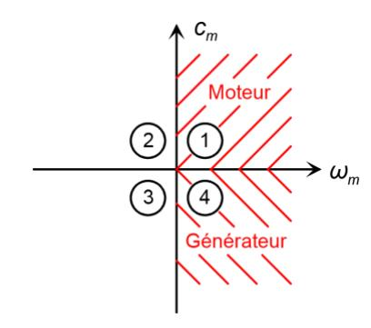

**Q45.** D'après la réponse à la question 23, pour une vitesse de la capsule de  $V_0 = 60 \text{ km h}^{-1}$  la vitesse de rotation des moteurs est  $\omega_{m0} = 83,3 \text{ Hz}$ .

Ce qui correspond à une fréquence  $f_0 = \frac{p\omega_{m0}}{2\pi} = \frac{14x83,3}{2\pi} = 185,6$  Hz.

**Q46.** Pour un couplage triangle, chaque enroulement de la machine synchrone sera soumis à la tension composée du réseau qui correspond à la tension nominale d'un enroulement.

Q47.

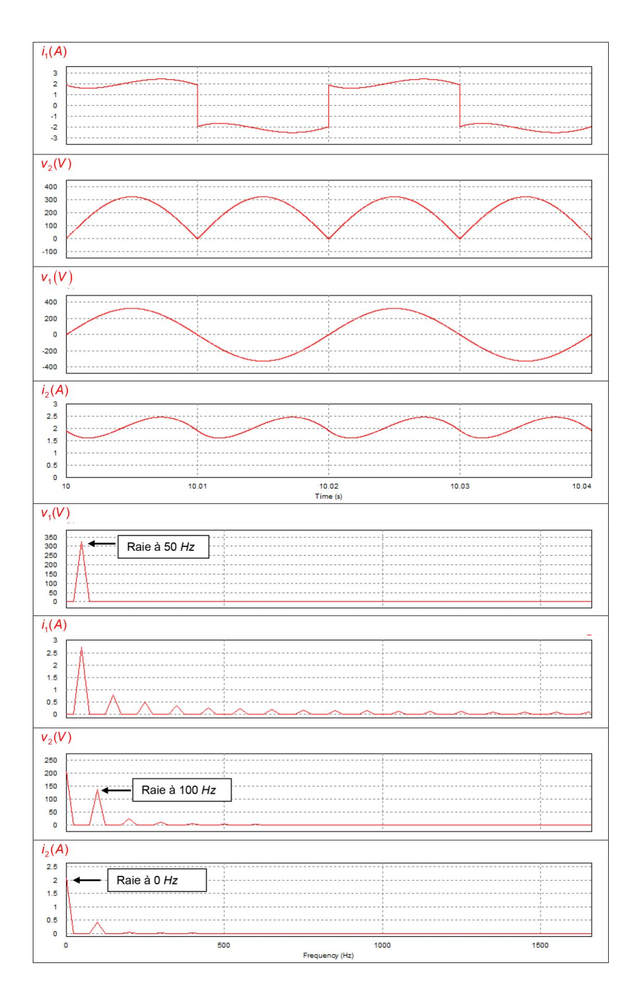

**Q48.** Comme le pont PD2 est unidirectionnel en courant et en tension, les boitiers sont unidirectionnels en courant et en tension.

- **Q49.** Pendant les phases de freinage, de l'énergie est renvoyée aux boitiers d'alimentation. Si cette énergie est trop importante, elle risque d'endommager les boitiers d'alimentation voire d'entraîner leurs destructions si rien n'est prévu pour absorber cette énergie.
- **Q50.** Compte tenu des hypothèses, la variation d'énergie cinétique lors de la phase de freinage d'une vitesse  $V_0$  à une vitesse nulle est  $\Delta E_C = 0 \frac{1}{2} M_C V_0^2$ .

A.N. 
$$\Delta E_C = -\frac{1}{2} \times 1000 \times \left(\frac{60}{3,6}\right)^2 = -138,9 \text{ kJ}.$$

**Q51.** Pour qu'un ensemble de supercondensateurs supportent une tension supérieure à leur tension nominale, il faut les associer en série. Soit  $N_{sc}$  le nombre de supercondensateurs associés en série, pour que les 72 V se répartissent équitablement aux bornes de tous les supercondensateurs, il faut  $16.2xN_{sc} \ge 72$  V  $\Leftrightarrow N_{sc} \ge 4.4$ .

Il faut au minimum cinq supercondensateurs associés en série pour qu'ils puissent supporter une tension de 72 V.

Dans ce cas le condensateur équivalent possède une capacité de  $\frac{65}{5}$  =13 F et il supporte une tension maximale  $U_{Ceamax} = 5x16.2 = 81 \text{ V}$ .

**Q52.** Soit  $\Delta E_{Cond}$ , la variation d'énergie stockée par le condensateur équivalent entre les instants  $t_c$  et  $t_d$ :  $\Delta E_{Cond} = \frac{1}{2} C_{eq}$ .  $U_{Ceq}^2(t_d) - \frac{1}{2} C_{eq}$ .  $U_{Ceq}^2(t_c)$  avec  $U_{Ceq}(t_d) = U_{Ceq}$  et  $U_{Ceq}(t_c) = U_0$ .

Cette variation d'énergie  $\Delta E_{Cond}$  est égale à l'énergie récupérée, soit  $\Delta E_{Cond} = -0.8.\Delta E_{Cond}$ .

D'où 
$$\frac{1}{2} C_{eq} U_{Ceqf}^2 - \frac{1}{2} C_{eq} U_0^2 = -0.8 \Delta E_C \Leftrightarrow U_{Ceqf} = \sqrt{U_0^2 + 1.6 \frac{\Delta E_C}{C_{eq}}}$$

A.N. 
$$U_{Ceqf} = \sqrt{72^2 + 1.6 \frac{138.9 \times 10^3}{13}} = 149.3 \text{ V}.$$

**Q53.** L'agencement proposé à la question 51 ne convient pas car  $U_{Ceqf} < U_{Ceqmax}$ . Les solutions possibles sont :

- associer 10 supercondensateurs 65 F, 16,2 V en série ;
- prendre des supercondensateurs de caractéristiques différentes ;
- mettre en place un système de dissipation d'énergie à base de résistances.
- Q54. Préreguis : instruments de mesure usuels (collège), CA2.1, CA2.2

Compétences abordées dans ce TP: E&S 1, E&S 2, E&S 3, A2, A12, M&R 11

Proposition d'organisation : par groupes de 3 sur différents supports. 1h45 sur un support avec TP très guidé, 15 min restitution/fiches, 1h45 TP moins guidé sur nouveau support, 15 min quizz pour valider ce qui a été vu en restitution

Matériel nécessaire : supports type Solex,... , voltmètre/ampèremètre, dynamomètre, tachymètre, logiciels de mesures associés aux équipements en nombre suffisant (nb d'élèves / 3)

Mesures réalisées par les élèves : tension, courant, vitesse, effort

Restitution : restitution des élèves sur compétences expérimentales

**Q55.** Soit  $S_U$  la section d'un élément en « U » :  $S_U$  = 2x2,15x0,2 + 3,4X0,2 =1,54 m². Soit  $V_U$  le volume d'un élément en « U » :  $V_U$  = 4 $S_U$  = 4x1,54 = 6,16 m³. Le poids d'un élément en « U » est de 25x6,16 = 154 kN.

Q56. L'utilisation d'un palonnier présente 2 avantages majeurs :

- l'action exercée à chaque point de levage est verticale ce qui évite toute action oblique qui génèrerait d'importants efforts de flexion dans les parois verticales du « U » qui risqueraient de nuire à l'intégrité structurelle de l'élément (fissuration, voire rupture) ;
- chaque point de levage supporte le quart de la masse soulevée ; dans le cas d'élingues 4 brins, seules 2 brins (dits "efficaces") supportent effectivement l'élément, les 2 autres servent à équilibrer l'élément soulevée. Cela conduirait à un surdimensionnement des dispositifs de levage.

**Q57.** L'effort dynamique est donné par 
$$F_d = \frac{(G + q_{adh}.S_f).\psi_{dyn}.\psi_e}{N_{eff}}$$

avec 
$$G = 154$$
 kN,  $q_{adh} = 100$  daN·m-2,  $S_f = 3.4x4 = 13.6$  m2,  $\psi_{dyn} = 1.15$ ,  $\psi_e = 1$  et  $N_{eff} = 4$ .

avec 
$$G = 154$$
 kN,  $q_{adh} = 100$  daN·m-2,  $S_f = 3,4x4 = 13,6$  m2,  $\psi_{dyn} = 1,15$ ,  $\psi_e = 1$  et  $N_{eff} = 4$ . A.N.  $F_d = \frac{\left(154x10^3 + 1000x13,6\right)x1,15x1}{4} = 48,2$  kN.

Selon le tableau fourni, la douille Rd36 peut supporter 6300 daN, elle convient donc dans notre cas.

**Q58.** Pour N2, H = 0,85 m => 
$$\sigma_h$$
 (H = 0,85) = 0,5x20x103x0,85 = 8,5 kN·m-2. Pour N1, H = 3 m =>  $\sigma_h$  (H = 3) = 0,5x20x103x3 = 30 kN·m-2.

Q59. Méthode 1 par un calcul d'intégrale

Soit  $d\overline{F(z)}$  la force élémentaire s'exerçant sur le voile au point M situé à l'altitude z.

$$d\overrightarrow{F(z)} = K_s L \gamma_{sol} z dz \overrightarrow{x}$$

$$\overrightarrow{P_{\text{terre}}} = \int_{h_1}^{h_2} d\overrightarrow{F(z)} dz = K_s L \gamma_{sol} \left( \int_{h_1}^{h_2} z dz \right) \overrightarrow{X} = K_s L \gamma_{sol} \left[ \frac{z^2}{2} \right]_{h_2}^{h_2} = \left( h_2^2 - h_1^2 \right)$$

$$\overrightarrow{P_{terre}} = \frac{1}{2} K_s L \gamma_{sol} \left( h_2^2 - h_1^2 \right) \vec{x}$$

A.N. 
$$P_{terre} = 0.5 \times 0.5 \times 1 \times 20 \times (3^2 - 0.85^2) = 41.39 \text{ kN}$$

Méthode 2 en utilisant le théorème de superposition

La contrainte trapézoïdale peut se décomposer en la somme d'une contrainte triangulaire et d'une contrainte uniforme.

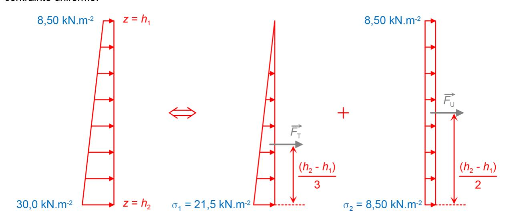

avec 
$$F_{\text{T}} = \frac{1}{2}\sigma_{1}L(h_{2} - h_{1})$$
 et  $F_{\text{U}} = \sigma_{2}L(h_{2} - h_{1})$ , d'où  $P_{\text{terre}} = \frac{1}{2}\sigma_{1}L(h_{2} - h_{1}) + \sigma_{2}L(h_{2} - h_{1})$   
A.N.  $P_{\text{terre}} = 0.5x21.5x1x(3-0.85) + 8.5x1x(3-0.85) = 41.39 \text{ kN}$ 

Pour calculer *MN*1, on applique le PFS (Principe Fondamental de la Statique) en moment au point *N*1 suivant *y* .

D'où 
$$M_{N1} + F_{N2}.(h_2-h_1) - P_{terre}h_3 = 0$$
  
 $M_{N1} = -F_{N2}.(h_2-h_1) + P_{terre}h_3$ 

A.N. 
$$M_{N1} = -11,5x2,15+41,39x0,875 = 11,49 \text{ kN} \cdot \text{m}$$

**Q60.** En considérant la liaison du voile avec la dalle comme rigide et indéformable (conservation de l'angle droit entre le voile et la dalle), une rotation du nœud entraînerait une déformation par flexion de la dalle. Or, la rotation du nœud N1 est extrêmement faible (en raison de la grande rigidité structurelle au regard des charges appliquées), ce qui permet de considérer que la dalle inférieure n'est fléchie que par les charges qui lui sont directement appliquées (poids propre, rails, capsules…).

**Q61.** Pour un mètre de longueur d'ouvrage.

Le poids propre total de l'ouvrage se calcule comme suit :

- dalle supérieure : 3,40x0,25x25 = 21,25 kN ;
- voiles latéraux : 2x2,15x0,20x25 = 21,5 kN ;
- dalle inférieure : 3,40x0,20x25 = 17 kN ;

soit 59,75 kN au total.

Le poids du remblai situé sur l'ouvrage : 0,60x3,4x20 = 40,8 kN

La force totale exercée par l'ouvrage, le remblai, les capsules et les équipements, avec pondération, s'élève donc à :

$$F_t = 1,35x(59,75+40,80+5,00)+1,5x(2x10) = 172,51 \text{ kN}$$

**Q62.** Appliquée sur la surface de référence de 3,40m², cela représente une contrainte de :

$$q = \frac{0,1725}{3,40} = 0,051 \text{ MPa}$$

Le sol pouvant résister à une contrainte de 0,5 MPa, sa capacité portante est vérifiée.

**Q63.** Il faut demander l'autorisation du chef d'établissement, s'interroger sur la sécurité des élèves (vérifier que tout est prévu pour assurer la sécurité des élèves comme des casques de chantier…), vérifier l'accessibilité PMR si un élève est concerné, prévoir le trajet (bus…), prévoir le financement, prévoir l'information aux parents, prévoir l'encadrement…

C'est une sortie scolaire, pas un voyage scolaire. Si aucune participation financière n'est demandée, on peut rendre la sortie obligatoire.

**Q64.** Les axes communs d'études peuvent être :

- énergies renouvelables ;
- transport ;
- pollution.

Cela s'inscrit dans l'un des huit thèmes à étudier au cours du programme d'anglais du lycée « Innovations Scientifiques et Responsabilité » (Scientific Innovations and Responsability).

Les productions possibles peuvent être :

- une vidéo en anglais ;
- document technique ;
- un poster ;
- un podcast ;
- un exposé.

**Q65.** Le point *B* décrit un arc de cercle de centre *A* et de rayon AB.

Le mouvement du solide 2 par rapport au solide 1 est une rotation d'axe (*Bx*, ) . La liaison entre les solides 3 et 0 est une liaison pivot d'axe (*Dx*, ) .

**Q66.** Dans ce mécanisme l'entrée est le mouvement de rotation de 1 par rapport à 0 et la sortie est le mouvement de rotation de 3 par rapport à 0. Pour passer de la position haute du galet à la position basse, la pièce 1 tourne dans le sens horaire par rapport à 0. Lorsque le galet est en position basse, toute action visant à remonter le galet va tendre à faire tourner 1 par rapport à 0 dans le sens horaire également. Le mécanisme est donc bloqué et toute action sur le galet 3 ne permettra donc pas de revenir en position initiale. Le mécanisme est irréversible.

**Q67.** En utilisant un système irréversible pour le mouvement du galet, les concepteurs s'assurent qu'en cas de choc le galet ne remonte pas alors que ce n'est pas prévu, rendant caduque le guidage de la capsule ce qui engendrerait un gros risque d'accident. Pour remonter le galet, il suffit de commander le moteur actionnant le mouvement de 1 par rapport à 0 afin que 1 tourne par rapport à 0 dans le sens trigonométrique.

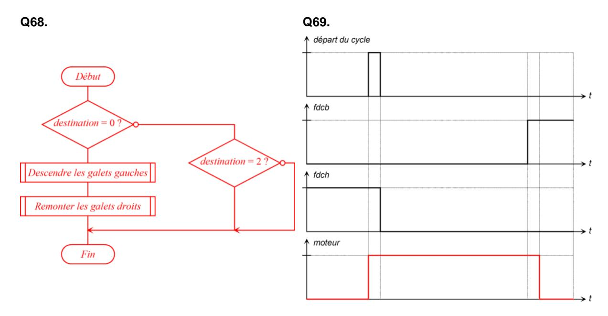

**Q70.** Case 1 : Proposition d'une activité simple d'introduction et de découverte

Case 2 : Proposition d'une activité **simple** de CAO

Case 3 : Proposition d'une activité **simple** de programmation de carte

Case 4 : Activité utilisant ce qui a été imprimé avec l'imprimante 3D (assemblage…)

Case 5 : Activité utilisant le travail de programmation fait auparavant et correspondant à une réalisation d'une partie du produit fini

Case 6 : test sur arrêt en cas d'obstacle + 1 caractérisation de performance a minima

### **D. Commentaires du jury**

Le sujet présente des questions portant sur les différents champs des sciences industrielles de l'ingénieur, des questions portant sur l'ingénierie système et des questions d'ingénierie pédagogique. Chaque partie comporte des questions très abordables qui n'ont parfois pas été traitées. Le jury conseille au candidat de bien lire l'intégralité des questions. Les parties sont indépendantes et à l'intérieur des parties, des résultats intermédiaires sont donnés permettant au candidat de repartir sur de bonnes bases. Le jury constate que beaucoup de candidats traitent le sujet « dans l'ordre » et conseille aux candidats de s'organiser pour pouvoir traiter les parties dans lesquelles ils sont les plus à même de réussir.

Généralement les candidats répondent mieux aux questions appartenant à leur domaine de spécialisation mais certains candidats sont en difficulté quelque soit le domaine abordé.

Les questions d'ingénierie pédagogique ont globalement été traitées. Le jury invite les candidats à lire les questions avec attention pour ne pas perdre de temps à répondre à des questions non posées.

La lecture de certaines copies est difficile tant l'écriture est illisible et/ou parsemée de fautes d'orthographe et d'expression. En termes de rédaction, le jury invite les candidats à faire des réponses claires et précises, en particulier sur les questions d'analyse de documents.

### Partie 1 :

Dans une première sous-partie, l'étude est composée de cinq questions portant sur des calculs de temps, de coût et d'une analyse comparative des résultats obtenus puis de deux questions d'ingénierie pédagogique.

Cette partie ne nécessitait que peu de connaissances spécifiques aux sciences industrielles mais faisait plutôt appel au bon sens du candidat.

Cette partie a été globalement traitée par l'ensemble des candidats qui obtiennent en moyenne la moitié des points. On note quelques bonnes réflexions sur la pertinence de l'utilisation du système Urbanloop. Le jury invite les candidats à s'interroger sur l'utilisation possible des questions disciplinaires de la partie pour les applications pédagogiques demandées (avec évidemment des adaptations en fonction du niveau des élèves).

Dans une seconde sous-partie, l'étude est composée de quatre questions portant sur l'ingénierie mécanique.

Le jury regrette que la formule F=PS ne soit pas maîtrisée et invite les candidats à vérifier l'homogénéité de leurs résultats.

### Partie 2 :

La première sous-partie est composée de sept questions d'ingénierie mécanique et de trois questions d'ingénierie pédagogique. Elle a été traitée par la majorité des candidats qui obtiennent en moyenne un quart des points disponibles.

Le jury regrette la confusion trop fréquente entre couple et force et rappelle aux candidats que la formule v=d/t n'est applicable que si la vitesse est constante. Il invite les candidats à vérifier l'homogénéité et la cohérence de leurs résultats.

Une des questions d'ingénierie pédagogique invitait les candidats à corriger des copies. Le jury constate que beaucoup de candidats ne relèvent pas les erreurs dans les copies et comptent justes des réponses fausses. Trop peu de candidats proposent de communiquer avec leurs collègues ou la vie scolaire en cas de difficultés avec un ou deux élèves en particulier.

La deuxième sous-partie est composée de 11 questions d'ingénierie électrique et informatique et de deux questions d'ingénierie pédagogique.

Le jury regrette que trop peu de candidats ne proposent pas de réponses quand seul le bon sens est mobilisé (erreur maximale d'une seconde pour le codage par exemple) et invite les candidats à essayer de traiter même partiellement les parties qui ne sont pas dans leur domaine de spécialisation. Les problèmes de conversion, trop nombreux, pourraient être évités en analysant l'homogénéité des résultats.

Le jury rappelle aux candidats que les questions type QCM doivent comporter les propositions de réponses et regrette qu'en général les candidats n'associent pas les connaissances aux manipulations de TP comme demandé dans la question.

#### Partie 3 :

Cette partie comporte 19 questions d'ingénierie mécanique et électrique et une question d'ingénierie pédagogique.

Cette partie est globalement la moins traitée par l'ensemble des candidats. Le jury constate de très et trop nombreux problèmes de conversion. La loi d'Ohm est bien maîtrisée mais le TEC semble inconnu de la majorité des candidats.

#### Partie 4 :

Cette partie comporte 8 questions d'ingénierie des constructions et 2 questions pédagogiques.

Elle a été traitée de façon inégale selon les spécialités des candidats. Le jury déplore les problèmes de conversion rencontrés même chez les candidats de la spécialité.

#### Partie 5 :

Cette partie comporte trois questions d'ingénierie mécanique et deux questions d'ingénierie informatique.

Cette partie était certainement une des plus abordables du sujet mais n'a été traitée que par la moitié des candidats. Le jury regrette que la grande majorité des candidats ne décrive pas correctement une trajectoire, un mouvement et une liaison et invite les futurs candidats à plus de rigueur dans leurs descriptions.

### Partie 6 :

Cette partie ne contient qu'une question d'ingénierie pédagogique.

Cette partie n'a été traitée que par trop peu de candidats. Le jury invite les candidats à au moins commencer ce type de questions. En ne proposant qu'un tiers d'activités pertinentes, ils peuvent déjà récolter de nombreux points.

Pour conclure, le jury demande aux futurs candidats de :

- travailler sur la transdisciplinarité : il convient pour un futur enseignant de technologie ou de SI d'avoir un minimum de connaissances et de culture dans les différents domaines de cette épreuve ;
- connaître les unités des différentes grandeurs physiques pour analyser l'homogénéité de leurs résultats ;
- travailler sur la rigueur de leurs raisonnements et de leur rédaction ;
- soigner la qualité de leur expression et de leur copie ;
- bien lire le sujet et les questions pour traiter toutes les parties possibles ;
- connaître les termes et les pratiques de base de la pédagogie.

### **E. Résultats**

Les statistiques générales pour cette épreuve sont données ci-dessous.

|                  | CAPET (public) | CAFEP (privé) |
|------------------|----------------|---------------|
| Nombre de copies | 76             | 21            |
| Moyenne          | 7,33 / 20      | 7,65 / 20     |
| Note maximum     | 16,1 / 20      | 15,2 / 20     |
| Écart type       | 2,42           | 2,89          |

# **Épreuve de leçon**

### **A. Présentation de l'épreuve**

Durée des travaux pratiques encadrés : cinq heures Durée de la présentation : trente minutes maximum Durée de l'entretien : trente minutes maximum

Coefficient : 5

L'épreuve a pour objet la conception et l'animation d'une séance d'enseignement dans l'option choisie. Elle permet d'apprécier à la fois la maîtrise disciplinaire, la maîtrise de compétences pédagogiques et de compétences pratiques.

L'épreuve prend appui sur les investigations et analyses effectuées par le candidat pendant les cinq heures de travaux pratiques relatifs à une approche spécialisée d'un système pluri-technologique et comporte la présentation d'une séance d'enseignement suivie d'un entretien avec les membres du jury. L'exploitation pédagogique attendue, directement liée aux activités pratiques réalisées, est relative aux enseignements en collège, en lycée et aux sections de STS de la spécialité.

L'épreuve est notée sur 20. 10 points sont attribués à la partie liée aux travaux pratiques et 10 points à la partie liée à la soutenance. La note 0 à l'ensemble de l'épreuve est éliminatoire.

### **B. Déroulement de l'épreuve**

### • **Organisation**

Les deux parties, travaux pratiques et exploitation pédagogique, sont indépendantes et sont notées chacune sur dix points. La séparation de l'évaluation des deux parties de l'épreuve permet de dissocier la réussite à la partie « travaux pratiques » de celle à la partie « exploitation pédagogique ».

Les supports utilisés, pour cette session, sont des systèmes pluri-technologiques actuels :

- − banc d'essai de flexion ;
- − système de ventilation double flux ;
- − pompe à chaleur
- − robot collaboratif ;
- − barrière de péage ;
- − égreneur.

Les documents accompagnant le support fournissent une guidance qui permet aux candidats, quelle que soit leur connaissance du système de mobiliser leurs compétences scientifiques et pédagogiques. Chaque support conduit à une exploitation pédagogique, liée à l'option choisie, de niveau imposé en technologie au collège, en série STI2D (sciences et technologies de l'industrie et du développement durable) de la voie technologique, en enseignement de spécialité sciences de l'ingénieur de la voie générale ou en STS de la spécialité.

Pour la partie travaux pratiques, les postes de travail sont équipés, selon la nécessité des activités proposées, des matériels usuels de mesure des grandeurs physiques : oscilloscopes numériques, multimètres, dynamomètres, tachymètres, cartes d'acquisition associées à un ordinateur, etc.

Le jury dispose d'une traçabilité des connexions sur le réseau permettant de suivre les sites consultés.

### • **Travail demandé**

#### **Rappel des attendus**

L'épreuve a pour objet la conception et l'animation d'une séance d'enseignement. La séance proposée prendra appui sur les investigations effectuées pendant la phase de travaux pratiques. Cette épreuve permet d'apprécier à la fois la maîtrise disciplinaire, la maîtrise de compétences pédagogiques et de compétences pratiques du candidat.

L'épreuve se déroule selon la chronologie suivante :

Travaux en laboratoire (5 heures) :

- Phase 1 : appropriation du contexte pédagogique de la séance d'enseignement et prise en main du système (40 minutes) ;
- Phase 2 : réalisation d'activités expérimentales (3 heures) ;
- Phase 3 : réinvestissement des activités et élaboration du scénario de la séance (30 minutes) ;
- Phase 4 : préparation de l'exposé (50 minutes).

Soutenance (1 heure) : 30 minutes maximum d'exposé, 30 minutes maximum d'entretien.

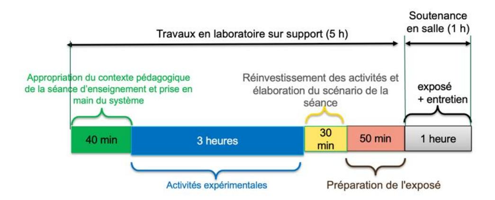

**Phase 1 : appropriation du contexte pédagogique de la séance d'enseignement et prise en main du système (40 minutes)**

### **Appropriation du contexte pédagogique**

La séance d'enseignement à présenter lors de l'exposé est une activité prévue pour une heure en classe entière. Elle doit être élaborée pour la série, le niveau et les objectifs de formation définis ci-dessous. Les éléments suivants sont indiqués au candidat :

- série : Technologie, STI2D, SI ou BTS (spécialité précisée selon le sujet) ;
- niveau : classe concernée ;
- période : période de l'année (début, milieu ou fin d'année) ;
- compétences visées (il s'agit des compétences que la séance présentée par le candidat doit permettre de développer chez les élèves ; une à deux compétences sont imposées) ;
- connaissances/savoirs associé(e)dus (il s'agit des connaissances/savoirs associées aux compétences qui devront être développé(e)s dans le cadre de la séance présentée par le candidat).

#### **Prise en main du système et de son environnement**

Il est mis à disposition du candidat :

- un espace numérique personnel accessible pendant les six heures de l'épreuve ;
- un ordinateur équipé des logiciels de bureautique usuels, de logiciels dédiés aux activités pratiques et d'un accès à internet ;
- un dossier « Documents candidats » comportant diverses ressources ;
- un système didactisé

Quelques manipulations sont proposées au candidat. Elles sont fortement guidées et doivent permettre une prise en main du système et des matériels/logiciels mis à sa disposition pour réaliser les activités expérimentales suivantes.

#### **Phase 2 : activités expérimentales (3 heures)**

Dans cette phase 2, une succession d'activités expérimentales est proposée aux candidats. Ces activités permettent d'évaluer l'aptitude du candidat à :

- concevoir un protocole expérimental ;
- mettre en œuvre un protocole expérimental ;
- réaliser une partie d'un programme ;
- réaliser le relevé de grandeurs physiques ;
- extraire des informations de documentations fournies ;
- analyser les relevés et déduire les conclusions quant à l'objectif visé (ce retour à l'objectif de l'activité est essentiel).

### **Phase 3 : réinvestissement des activités et élaboration du scénario de la séance (30 minutes)**

La séance d'enseignement à présenter lors de l'exposé est une activité prévue en classe entière pour une durée d'une heure. Elle doit être élaborée pour la série, le niveau et les objectifs de formation définis en phase 1.

Le programme (ou le référentiel) de la classe concernée est mis à disposition du candidat.

À partir du contexte pédagogique imposé, il est demandé au candidat d'identifier parmi les activités expérimentales réalisées lors de la phase 2 celles qui pourraient être exploitées et transposées au niveau d'élèves concerné. Le candidat ayant toujours accès au matériel de travaux pratiques, des expérimentations complémentaires peuvent être réalisées.

### **Phase 4 : préparation de l'exposé (50 minutes)**

Lors de cette phase, le candidat n'a plus accès au matériel de travaux pratiques.

Pour information, le candidat dispose lors de son exposé :

- de l'espace numérique personnel utilisé lors des phases précédentes ;
- d'un ordinateur équipé des logiciels de bureautique et d'un vidéoprojecteur ;
- d'un tableau blanc et de feutres.

La durée de la présentation devant la commission d'interrogation est de 30 minutes maximum.

Elle doit inclure une courte introduction explicitant :

- la description du contexte pédagogique de la séance (imposé en phase 1), une description succincte de l'articulation de la séance présentée avec les séances antérieures et postérieures ;
- la(les) problématique(s) éventuelle(s) permettant de contextualiser les activités proposées aux élèves ;
- le plan de la séance.

Les activités proposées aux élèves dans le cadre de la séance sont ensuite présentées et argumentées. Il n'est pas attendu du candidat qu'il détaille lors de l'exposé la chronologie des activités expérimentales qu'il a conduites au laboratoire durant les trois heures qui y sont consacrées.

### **C. Commentaires du jury**

### **1. Analyse globale des résultats**

Le jury tient à souligner la qualité de préparation de nombreux candidats. Néanmoins, les attendus de l'épreuve et les modalités de mise en œuvre décrits au JORF ne sont pas connus de tous. Il s'avère extrêmement difficile de réussir les activités pratiques et l'exploitation pédagogique si les objectifs spécifiques de ces deux parties de l'épreuve ne sont pas connus.

Les notions théoriques portant sur la pédagogie et la didactique de la discipline et sur les différentes démarches pédagogiques associées (travail en ilots, classe inversée, évaluation par compétences…) sont régulièrement citées par les candidats. Elles ne sont pas toujours bien maîtrisées et ne font que trop rarement l'objet d'une contextualisation ou d'une proposition concrète dans le cadre de la séance présentée lors de la leçon.

Une proportion notable de candidats ne connaît pas les grands principes de la réforme du lycée mise en œuvre à la rentrée 2019. Les programmes de technologie au collège, de la série STI2D et de l'enseignement de spécialité sciences de l'ingénieur du lycée général et technologique ainsi que les documents ressources pour faire la classe sont parfois inconnus des candidats. Le jury a été également surpris que des candidats ne soient pas acculturés au socle commun de connaissances, de compétences et de culture, au cadre de référence des compétences numériques (CRCN), ainsi qu'à l'évaluation par compétences.

Le nombre des exploitations pédagogiques portant sur le collège, la série STI2D, l'enseignement de spécialité SI ou les STS de la spécialité a été équilibré sur l'ensemble de la session ; les candidats doivent être en mesure de produire des séances sur tous les niveaux d'enseignement. Le jury rappelle que les exploitations pédagogiques doivent s'appuyer sur les programmes et référentiels en vigueur lors de la session du concours.

### **2. Commentaires et conseils aux candidats**

#### **Pour la partie travaux pratiques**

Le manque de culture scientifique et technologique pénalise de nombreux candidats dans l'appropriation des supports pluri-technologiques. Il est impératif, pour réussir cette épreuve, de disposer de compétences et de connaissances scientifiques et technologiques avérées dans les trois domaines « matière – énergie – information ». Cette culture technologique ne se limite en aucun cas à un domaine disciplinaire unique lié à l'option choisie par le candidat. Les futurs professeurs de sciences industrielles de l'ingénieur se doivent d'avoir une vision transversale et globale de leur discipline et de conduire une veille technologique régulière. Tout au long de l'épreuve, le jury est amené à interagir avec les candidats de façon à ce qu'ils puissent exposer leurs démarches, leurs raisonnements et leurs conclusions ; il attend un discours scientifiquement rigoureux, clair et argumenté.

Les candidats les plus efficients font preuve d'autonomie, d'esprit critique et d'écoute envers le jury lors des travaux pratiques. Ils prennent des initiatives dans la conception de leur séance pédagogique et mettent à profit l'ensemble des ressources numériques mises à leur disposition.

Le jury tient à souligner que nombre de candidats sont bien préparés à cette partie de l'épreuve et s'appuient sur des compétences à la fois transversales et spécifiques à leur option.

### **Organisation à suivre lors de l'épreuve**

Il est conseillé de prendre connaissance de l'intégralité du sujet avec ses annexes avant de commencer les activités expérimentales et de lire les consignes.

Les candidats réalisent des activités expérimentales et analysent des résultats afin de conclure sur les problématiques du sujet. Ces manipulations, mesures et interprétations, sont réalisées au niveau de compétences d'un master première année.

Les candidats doivent penser à garder des traces numériques de leurs résultats et de leurs travaux afin de les réinvestir dans une séance adaptée au collège ou au lycée.

La connaissance préalable du système et des logiciels n'étant pas demandée, les membres de jury peuvent être sollicités par les candidats en cas de problèmes ou de difficultés liées à l'utilisation d'un logiciel ou d'un appareil de mesure spécifique. Plus généralement, le jury est présent pour accompagner les candidats dans leur démarche.

#### **Aptitude à mener un protocole expérimental**

Le jury a apprécié l'autonomie dans la manipulation des systèmes de certains candidats. La mise en œuvre des matériels de mesure et d'acquisition ne présente pas de difficultés particulières. Cependant pour certains candidats, les instruments de mesure les plus courants ne sont pas suffisamment connus (nom, utilisation, symbole et unités des grandeurs physiques mesurées). Les membres du jury assurent l'accompagnement nécessaire afin que la spécificité d'un équipement ne constitue pas un obstacle à la réussite du candidat. Il est attendu du candidat qu'il soit capable de proposer et de justifier des choix de protocoles expérimentaux.

Les travaux pratiques font apparaître que de nombreux candidats ne maîtrisent pas suffisamment les notions fondamentales de leur spécialité, ni les systèmes d'unités associés alors qu'une vision large de la discipline est nécessaire. De même, plusieurs d'entre eux ne sont pas en mesure de réaliser des manipulations mathématiques de base indissociable de la culture scientifique commune (résolution d'une équation du premier degré, calcul d'un coefficient directeur), trigonométrie…).

### **Utilisation des modèles numériques**

Globalement, les candidats utilisent correctement les modèles numériques fournis. Le jury note cependant que de nombreux candidats manquent de recul et d'esprit critique dans l'interprétation des résultats de la simulation numérique et dans l'analyse des hypothèses utilisées lors de l'élaboration du modèle. Il est attendu des candidats une analyse pertinente des écarts entre les résultats issus de la simulation d'un modèle numérique, les mesures issues du système réel à partir d'expérimentations et/ou les performances attendues indiquées dans le cahier des charges. Au-delà des modèles numériques utilisés, le jury rappelle que les candidats se doivent de maîtriser les bases du champ disciplinaire concerné, dans le domaine du numérique (langages, codage, ...).

### **Préparation de la séance**

Le candidat doit bien identifier les activités réalisées qui pourraient être réinvesties lors de l'exposé, au niveau collège, en pré-bac ou en STS. Cet inventaire doit l'amener à envisager les activités possibles à proposer dans la classe pour la séance et le niveau demandé. Les conclusions et les résultats de ces expérimentations pourront être réutilisées lors de l'élaboration de la séance.

Il convient de transposer les activités réalisées par les candidats lors des activités expérimentales dans un contexte de formation pour des élèves au regard de la commande pédagogique imposée dans le sujet.

Il est demandé aux candidats d'illustrer leur leçon à partir du système étudié. Le jury a déploré que certains candidats proposaient des activités s'appuyant sur des systèmes non étudiés lors de l'activité de travaux pratiques.

Certains candidats, déjà contractuels, mettent à profit leurs expériences pour proposer des séances pertinentes. Cependant, bon nombre de candidats se lancent dans la production d'une séance sans réellement analyser les compétences et les connaissances ciblées pour la leçon. Certains perdent encore du temps à formaliser une séquence pédagogique sans aborder la séance cible ; d'autres s'approprient des formats types non adaptés à la commande.

Le jury regrette que trop peu de candidats présentent une synthèse de leurs activités pratiques afin d'en sélectionner les éléments pertinents pour leur séance. Le hors-sujet est encore malheureusement trop fréquent.

Le jury conseille aux candidats de commencer par la construction du document de synthèse de la séance demandée. Ce document formalisera les savoirs et/ou la méthodologie à retenir par les élèves. Cela faciliterait la transposition didactique demandée et permettrait de proposer des activités d'apprentissage opérationnelles.

Le jury conseille encore aux candidats de justifier clairement les choix pédagogiques opérés sans se cantonner à des généralités.

#### **Pour l'exposé devant le jury**

Les candidats inscrivent leur développement pédagogique dans un contexte donné dans le sujet. La séance d'enseignement à présenter est une activité prévue en classe entière pour une durée d'une heure. Ce contexte, selon le niveau et les objectifs visés, est compatible avec la réalisation ou l'exploitation d'activités expérimentales. Les candidats ne doivent donc pas se sentir contraints de présenter une séance de cours. Afin de bien préciser au jury les enjeux et les attendus de la séance, celle-ci doit être intégrée dans une séquence. Le candidat doit situer la séance dans une organisation temporelle, en précisant ce qui est fait avant et après. Il doit également expliciter la construction de la séance en s'appuyant sur des activités expérimentales réalisées auparavant et de leurs résultats. Le candidat est amené à préciser pour la séance décrite les prérequis, les objectifs (compétences à faire acquérir, capacités et connaissances attendues), l'organisation de la classe, les modalités pédagogiques (cours, activités dirigées, activités pratiques, projet), les stratégies pédagogiques (déductif, inductif, différenciation pédagogique, démarche d'investigation, démarche de résolution de problème technique, pédagogie par projet, approche spiralaire…), les activités des élèves et les productions attendues. La description de la séance doit faire explicitement apparaître la prise en compte de la diversité des publics accueillis dans la classe. Il est attendu que le candidat précise la façon dont il compte animer la classe et mettre en synergie les élèves en vue de la structuration des acquis.

Les phases de structuration des connaissances permettant la construction des connaissances des élèves et les différentes formes d'évaluation des apprenants peuvent être des parties intégrantes de la séance.

Les différentes modalités d'enseignement (enseignement pratique interdisciplinaire, interdisciplinarité, concours scientifique et technique…) et les dispositifs d'accompagnement et de remédiation doivent être précisés.

Le jury met en garde les candidats qui éludent tout ou partie des objectifs visés en termes de compétences et connaissances associées voire s'écartent du contexte pédagogique imposé. Dans ce cas, le jury considère la leçon présentée hors sujet.

Enfin, un discours purement pédagogique qui ne répondrait pas concrètement aux objectifs d'apprentissage visés ne saurait être cautionné par le jury.

Il s'agit du cœur même de l'épreuve que de traiter la commande en termes de niveau, et de compétences/connaissances attendues. L'expertise pédagogique ne saurait palier ce manquement à l'exigence de contenu didactique.

De trop nombreux candidats confondent les activités de travaux pratiques réalisées lors de la phase 2 de l'épreuve et les activités de la séance pédagogique à exposer ; leur exposé est, de fait, hors sujet.

### **Utilisation du numérique**

Le jury conseille aux candidats de bien identifier les points de leur séance pédagogique pour lesquels l'usage du numérique apportera une réelle plus-value aux apprentissages des élèves. Le jury constate que peu de candidats proposent une exploitation d'outils numériques éducatifs, à des fins d'animation de séance, de présentation, de travail collaboratif, d'échanges entre le professeur et les élèves (type ENT par exemple). Les outils numériques proposés doivent être respectueux du réglementation général de la protection des données (RGPD).

### **Réinvestissement des résultats de travaux pratiques**

L'objectif attendu de la leçon est une exploitation pédagogique s'appuyant sur tout ou partie des activités pratiques réalisées et de leurs résultats et permettant aux apprenants de comprendre les concepts fondamentaux associées aux compétences visées. Les activités expérimentales menées dans la partie « travaux pratiques » peuvent être d'un niveau supérieur à celui demandé dans la séance, il ne s'agit donc pas de faire, au travers de la séance pédagogique, un compte-rendu de l'activité pratique réalisée, mais de s'appuyer sur les expérimentations pour en extraire des données et des activités à proposer aux élèves. Cependant, une rapide présentation des objectifs et conclusions des expérimentations réalisées en TP en première partie de l'épreuve, permettra au jury de mieux comprendre l'intégration de ceux-ci dans la séance. Il est apprécié de réaliser une présentation dynamique qui inclut des copies d'écran, des résultats de mesures, des éléments de cahier des charges ou d'analyse SysML, etc. Le jury ne se satisfait en aucun cas d'une exploitation brute des activités proposées dans la première partie de l'épreuve.

### **Réalisme de l'organisation de la classe**

Le jury attend des candidats qu'ils émettent des hypothèses réalistes sur les conditions d'enseignement. Leurs propositions doivent être pragmatiques afin que le jury puisse appréhender le scénario pédagogique envisagé (travail en "autobus", en ilots, en équipes, en binômes ou individuellement). Le candidat doit notamment préciser son rôle dans la conduite et l'animation de la séance. Le choix des supports techniques utilisés lors de la séance proposée doit être réaliste au regard des équipements présents dans les laboratoires des établissements scolaires. Les candidats doivent être, en effet, conscients que les laboratoires mis en place pour cette épreuve de concours ne sont pas représentatifs de l'équipement standard d'un laboratoire de lycée ou de collège : un enseignant ne dispose jamais simultanément de plusieurs exemplaires d'un des systèmes exploités au concours.

### **Évaluation**

Le processus retenu par le candidat pour l'évaluation des compétences doit être non seulement clairement décrit (évaluation diagnostique, formative, sommative, certificative, …) mais aussi justifié. Les critères d'évaluation doivent être explicités. Les modalités et les outils doivent être précisés. Si des remédiations ou des différenciations pédagogiques sont envisagées, elles doivent être explicitées. Trop souvent, les candidats se contentent d'évoquer les processus d'évaluation sans pouvoir en expliquer réellement le déroulement, les modalités et surtout l'objectif en termes d'acquisition des compétences par les élèves.

### **Présentation orale**

Quelques candidats proposent des présentations (orales et écrites) très formatées, quelques fois hors du contexte des activités pratiques réalisées en amont, qui ne résistent pas aux questionnements du jury et mettent en évidence des lacunes.

Le jury note également que quelques candidats limitent leur présentation à un descriptif sommaire des activités sans expliciter et justifier clairement la démarche.

Le jury invite les candidats à, certes, maîtriser les attendus pédagogiques et didactiques de la discipline, mais surtout à être en capacité de les réinvestir de façon adaptée et pertinente. À titre d'exemples, les termes « formatif », « sommatif », « inductif », … doivent être utilisés à bon escient et dans un contexte adapté.

Enfin, le jury rappelle que le concours constitue la première étape de l'entrée dans le métier du professorat. Le candidat se doit donc d'adopter une posture et un positionnement exemplaires constitutifs de la mission d'enseignant. Le jury invite vivement les candidats à s'approprier le référentiel des compétences professionnelles des métiers du professorat et de l'éducation (arrêté du 1-7-2013 - J.O. du 18-7-2013).

### **Réactivité au questionnement**

Le jury attend de la concision et de la précision ainsi qu'une honnêteté intellectuelle dans les réponses formulées. Les réponses au questionnement doivent laisser transparaître un positionnement adapté aux attentes de l'Institution et une réelle appropriation des valeurs de la République.

Le candidat se doit d'être réactif sans chercher à éluder les questions ou à noyer le propos dans un discours pédagogique non maîtrisé. Plus qu'une réponse exacte instantanée, le jury apprécie la capacité à argumenter, à expliquer et justifier une démarche ou un point de vue.

#### **Qualité des documents de présentation et expression orale**

Il est attendu des candidats une maîtrise des outils numériques pour l'enseignement afin de construire un document clair, structuré, lisible et adapté à la présentation de l'exposé.

Le jury est extrêmement attentif à la qualité de la syntaxe et de l'orthographe.

Les candidats s'expriment généralement correctement. La qualité de l'élocution et la clarté des propos sont indispensables aux métiers de l'enseignement.

### **Conseils aux candidats**

Le jury conseille aux candidats de :

- − s'approprier les programmes et référentiels des niveaux énoncés dans la définition de l'épreuve ainsi que les documents ressources associés ;
- − prendre connaissance du socle commun de connaissances, de compétences et de culture ;
- − maîtriser les concepts fondamentaux de la spécialité choisie ;
- − s'informer sur les pratiques pédagogiques et didactiques, les modalités de fonctionnement et d'organisation des horaires de tous les niveaux d'enseignement que peuvent assurer les professeurs de sciences industrielles de l'ingénieur ;
- − se préparer à exploiter les résultats d'investigations et d'expérimentations en regard des contenus disciplinaires ;
- − s'informer sur les modalités des épreuves d'examen auxquelles ils préparent leurs futurs élèves ;
- − travailler sa posture et ses intonations afin de rentrer en interaction avec le jury et ne pas lire les documents projetés sans tenir compte de l'auditoire.

### **3. Conclusion**

L'épreuve de leçon nécessite une préparation sérieuse et approfondie en amont de l'admissibilité. Cette préparation doit porter tout autant sur la partie « travaux pratiques » que sur la partie « exploitation pédagogique », car ces deux parties de l'épreuve sont complémentaires et indissociables. Les compétences nécessaires à la réussite de cette épreuve peuvent âtre acquises et développées lors de stages en situation et de périodes d'observation ou d'enseignement. Une connaissance fine des programmes/référentiels et des documents ressources pour faire la classe est également nécessaire. Le métier d'enseignant exige une exemplarité dans la tenue, dans la posture ainsi que dans le discours. L'épreuve de leçon permet la valorisation de ces qualités.

### **D. Résultats**

Les statistiques générales pour cette épreuve sont données ci-après.

|               | CAPET (public) | CAFEP (privé) |
|---------------|----------------|---------------|
|               | Note sur 20    | Note sur 20   |
| Moyenne       | 8,73           | 15,86         |
| Note maximum  | 19,5           | 20            |
| Note minimale | 0,5            | 13            |
| Écart-type    | 4,29           | 2,78          |

# **Épreuve d'entretien**

### **A. Présentation de l'épreuve**

 Durée : 35 minutes Coefficient 3

L'épreuve d'entretien avec le jury porte sur la motivation du candidat et son aptitude à se projeter dans le métier de professeur au sein du service public de l'éducation.

L'entretien comporte une première partie d'une durée de quinze minutes débutant par une présentation, d'une durée de cinq minutes maximum, par le candidat des éléments de son parcours et des expériences qui l'ont conduit à se présenter au concours en valorisant ses travaux de recherche, les enseignements suivis, les stages, l'engagement associatif ou les périodes de formation à l'étranger. Cette présentation donne lieu à un échange avec le jury.

La deuxième partie de l'épreuve, d'une durée de vingt minutes, doit permettre au jury, au travers de deux mises en situation professionnelle, l'une d'enseignement, la seconde en lien avec la vie scolaire, d'apprécier l'aptitude du candidat à :

- − s'approprier les valeurs de la République, dont la laïcité, et les exigences du service public (droits et obligations du fonctionnaire dont la neutralité, lutte contre les discriminations et stéréotypes, promotion de l'égalité, notamment entre les filles et les garçons, lutte contre le harcèlement, etc.) ;
- − faire connaître et faire partager ces valeurs et exigences.

Le candidat admissible transmet préalablement une fiche individuelle de renseignement établie sur le modèle figurant à l'annexe VI de l'arrêté du 25 janvier 2021 fixant les modalités d'organisation des concours du certificat d'aptitude au professorat de l'enseignement technique, selon les modalités définies dans l'arrêté d'ouverture.

L'épreuve est notée sur 20. La note 0 est éliminatoire.

### **B. Déroulement de l'épreuve**

Pour des raisons d'équité, la durée des entretiens est fixe. Le jury veille à ce que les temps impartis soient respectés. Il convient aux candidats d'être vigilant quant à la durée de leurs réponses.

Le candidat ne dispose d'aucun document. Le jury n'intervient pas pendant les cinq minutes de présentation du candidat.

Le déroulé est rappelé ci-dessous :

| 15 minutes               | 5 minutes maximum  | Présentation par le candidat des éléments de son parcours et des expériences qui l'ont conduit à se présenter au concours en valorisant notamment ses travaux de recherche, les enseignements suivis, les stages, l'engagement associatif ou les périodes de formation à l'étranger. |  |
|-----------------------------|-----------------------|--------------------------------------------------------------------------------------------------------------------------------------------------------------------------------------------------------------------------------------------------------------------------------------|--|
|                             | 10 minutes minimum | Échanges suite à la présentation                                                                                                                                                                                                                                                     |  |
| 20 minutes (10 + 10 min) |                       | Deux mises en situation professionnelle - d'enseignement - en lien avec la vie scolaire                                                                                                                                                                                              |  |

Les mises en situation professionnelle sont définies par le jury en amont du passage des candidats. Une lecture de ces mises en situation professionnelle est réalisée par un des membres du jury.

### **C. Commentaires du jury**

Cette épreuve est révélatrice de la posture professionnelle du candidat mais aussi de son éthique, sa déontologie et ses futurs réflexes professionnels. Elle sollicite, au-delà des aptitudes disciplinaires, les compétences professionnelles transversales essentielles à l'exercice du métier d'enseignant. De manière générale, les candidats ont bien appréhendé le format de cette épreuve mais elle semble insuffisamment préparée pour un nombre significatif d'entre eux.

### • **Présentation (1ère partie)**

La présentation de cinq minutes par le candidat des éléments de son parcours et des expériences qui l'ont conduit à se présenter au concours en valorisant ses travaux de recherche, les enseignements suivis, les stages, l'engagement associatif ou les périodes de formation à l'étranger, a permis au jury de rapidement cerner certains traits de sa personnalité, et de comprendre les motivations qui l'ont poussé à présenter le CAPET-CAFEP SII ainsi que le choix de l'option. Il est attendu qu'il montre les liens entre les compétences acquises durant son parcours et celles nécessaires pour enseigner dans le secondaire. Les motivations doivent être clairement explicitées. Il est intéressant de comprendre comment le projet de devenir enseignant s'est construit au fil du temps et pas uniquement sur une envie de transmettre. Même s'il est plus rassurant d'apprendre cette première phase par cœur, le jury apprécie la spontanéité des candidats. Quelques candidats n'ont pas utilisé la totalité des cinq minutes, faute d'arguments et de préparation.

L'échange qui suit avec le jury permet ensuite au candidat d'apporter des précisions et de compléter les éléments énoncés durant sa présentation.

### Le jury a apprécié :

- − l'enthousiasme du candidat et le dynamisme du discours pour présenter son envie de devenir enseignant ;
- − la capacité du candidat à se projeter dans la fonction en juxtaposant sa vision du métier d'enseignant (tenants et aboutissants des missions d'un enseignant) avec ses compétences acquises et transférables, l'idée étant « voici ce qui me laisse penser que je dispose des premiers outils nécessaires à une bonne prise de fonction » ;
- − la mise en valeur des expériences multiples (animation, enseignement, différents métiers, ..) ;
- − ses connaissances du milieu dans lequel il va évoluer, les principaux acteurs, le rôle et mission de chacun, les instances, leurs participants et les typologies des décisions ;
- − les fiches individuelles de renseignements complétées avec précision et indiquant les expériences d'enseignement et les expériences professionnelles dans le secteur industriel ;
- − les candidats qui ne paraphrasent pas leur fiche de renseignements ;
- − les candidats qui analysent avec clairvoyance et pertinence leurs échecs au concours lors des sessions précédentes ;
- − les candidats qui s'expriment clairement avec un niveau de langage approprié au métier d'enseignant.

Afin de préparer au mieux cette introduction, le jury conseille aux candidats de connaitre a minima :

- − les différentes disciplines dans lesquelles ils peuvent être appelés à enseigner, de la technologie au collège, aux lycées général et technologique et aux différents STS associés à leur option de concours ;
- − les particularités de ces enseignements technologiques au collège, lycée et STS ;
- − la structure des baccalauréats généraux et technologiques et ses différentes épreuves ;
- − le fonctionnement d'un EPLE, de son équipe de direction, de la vie scolaire, des services sociaux et d'infirmerie, les différentes instances (conseil d'administration, conseil pédagogique, conseil d'enseignement, conseil de discipline, comité d'éducation à la santé et à la citoyenneté et à l'environnement, conseil de vie collégien/lycéen, …), le règlement intérieur,…

- − le référentiel de compétences des enseignants, le suivi de carrière,…
- − les valeurs de la République ;
- − les droits et devoirs des fonctionnaires.

### • **Mises en situation professionnelle (2ème partie)**

Le second temps, consacré à parts égales entre une question portant sur une situation en classe et une situation hors de la classe, a été riche en discussions souvent constructives. Le jury a constaté avec satisfaction que les situations professionnelles sont, dans l'ensemble, bien comprises par les candidats. Le traitement instantané du problème rencontré dans les différentes situations qu'elles soient de l'ordre de l'enseignement ou de la vie scolaire est en général plutôt bien appréhendé. Il est noté qu'il a été souvent plus aisé pour les candidats d'analyser la situation en classe que de se projeter dans une situation relevant de la vie scolaire. Les réponses apportées démontrent, pour la plupart, du bon sens et du pragmatisme des candidats.

Même lorsque le candidat ne connaissait pas en détail le système éducatif, il a souvent pu apporter des pistes de solutions cohérentes. Les valeurs de la République sont respectées et citées par les candidats. Les personnes ressources au sein de l'établissement sont souvent bien identifiées (le chef d'établissement et son adjoint, le CPE, le DDFPT, le gestionnaire, l'infirmier, l'assistant social…) et les différentes instances sont plutôt connues. Cependant, les débats atteignent rapidement leur limite lorsque le candidat n'est pas à l'aise sur les points précédents. La méconnaissance du fonctionnement d'un collège ou d'un lycée devient rapidement rédhibitoire, malgré les relances bienveillantes du jury.

### Le jury a apprécié les candidats qui :

- − commencent par analyser les situations au lieu de proposer directement des solutions au problème posé à court terme ;
- − posent des hypothèses sur les situations proposées pour orienter ensuite leurs actions ;
- − envisagent, lors de leur analyse, plusieurs interprétations de la situation proposée ;
- − prennent de la hauteur par rapport à la situation décrite et l'analysent selon les trois temporalités demandées (à court, moyen et long termes) ;
- − identifient les valeurs et principes de la République, les droits et devoirs des fonctionnaires, sous-tendus aux situations étudiées ;
- − s'appuient sur tous les leviers existants dans l'établissement et hors de l'établissement pour prévenir les situations étudiées notamment en mettant en place des actions éducatives ;
- − prennent pleinement la mesure de leur mission d'éducation et place leur action personnelle au sein de celle d'une communauté éducative élargie.

### Le jury conseille aux candidats de :

- − s'approprier les attentes de l'épreuve lors de leur préparation au concours ;
- − s'approprier le fonctionnement d'un EPLE ainsi que le rôle des différentes instances ;
- − se référer aux personnes ressources de l'établissement susceptibles d'être sollicitées en fonction de la situation (psy-en, infirmier, assistant social, …). Trop de candidats ne font appel qu'au CPE ou au chef d'établissement ;
- − penser également à solliciter des acteurs extérieurs à l'établissement (associations, experts, conseillers, partenaires économiques…), notamment pour les actions à moyen ou long terme ;
- − ne pas rester sur des réponses autocentrées mais de se placer dans le contexte d'un établissement scolaire ;
- − prendre le recul nécessaire pour traiter la situation proposée dans le contexte décrit et de ne pas se limiter à faire référence à leur expérience (de contractuel notamment) , etc.

En comparaison à la session précédente, le jury remarque que la proposition d'actions à court, moyen et long terme est maîtrisée par un plus grand nombre de candidats. En revanche, une analyse fondée sur différentes scenarii et hypothèses n'est pas encore suffisamment développée par les candidats.

### **D. Ressources mobilisables**

Le jury conseille aux candidats de s'approprier les informations données sur la nouvelle épreuve d'entretien (attendus, conseils et exemples de situations professionnelles) :

<https://www.devenirenseignant.gouv.fr/cid159421/epreuve-entretien-avec-jury.html>

Pour construire ses réponses, le candidat fait appel à l'ensemble des expériences et des connaissances dont il dispose et qu'il mobilise avec pertinence, expériences et connaissances proprement disciplinaires ou participant d'une déontologie professionnelle.

Cette déontologie professionnelle suppose au moins l'appropriation par le candidat des ressources et textes suivants :

- Les droits et obligations du fonctionnaire présentés sur le portail de la fonction publique : <https://www.fonction-publique.gouv.fr/droits-et-obligations>
- Les articles L 111-1 à L 111-4 et l'article L 442-1 du [code de l'Education.](https://www.legifrance.gouv.fr/codes/id/LEGITEXT000006071191/)
- Le vade-mecum "la laïcité à l'École" : <https://eduscol.education.fr/1618/la-laicite-l-ecole>
- Le vade-mecum "agir contre le racisme et l'antisémitisme" : <https://eduscol.education.fr/1720/agir-contre-le-racisme-et-l-antisemitisme>
- "Qu'est-ce que la laïcité ?" Une introduction par le Conseil des Sages de la laïcité Janvier 2021. Téléchargeable sur [https://www.education.gouv.fr/le-conseil-des-sages-de-la-laicite-](https://www.education.gouv.fr/le-conseil-des-sages-de-la-laicite-41537)[41537](https://www.education.gouv.fr/le-conseil-des-sages-de-la-laicite-41537)
- Le parcours magistère "faire vivre les valeurs de la République" : <https://magistere.education.fr/f959>
- "Que sont les principes républicains ?" Une contribution du Conseil des sages de la laïcité Juin 2021. Téléchargeable sur [https://www.education.gouv.fr/le-conseil-des-sages-de-la-laicite-](https://www.education.gouv.fr/le-conseil-des-sages-de-la-laicite-41537)[41537](https://www.education.gouv.fr/le-conseil-des-sages-de-la-laicite-41537)
- "La République à l'École", Inspection générale de l'éducation, du sport et de la recherche »
- Le site IH2EF :<https://www.ih2ef.gouv.fr/laicite-et-services-publics>

### **E. Résultats**

Les statistiques générales pour cette épreuve sont données ci-après.

|               | CAPET (public) | CAFEP (privé) |
|---------------|----------------|---------------|
|               | Note sur 20    | Note sur 20   |
| Moyenne       | 11,26          | 14,93         |
| Note maximum  | 20             | 20            |
| Note minimale | 0,5            | 10            |
| Écart type    | 5,02           | 3,09          |