# **Direction générale des ressources humaines**

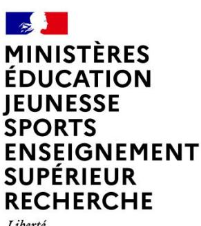

# **RAPPORT DU JURY**

# **SESSION 2025**

**CONCOURS : CAPET-CAFEP**

**Section : Sciences industrielles de l'ingénieur**

**Option : Ingénierie éléctrique**

Rapport de jury présenté par :

Vincent MONTREUIL, Inspecteur général de l'éducation, du sport et de la recherche Président du jury

# Sommaire

| <u>Avant</u> | t-propos                           | <u> 3</u> |
|--------------|------------------------------------|-----------|
| Reme         | rciements                          | 4         |
| Résult       | tats statistiques                  | 5         |
| Épreu        | ıve écrite disciplinaire           | 6         |
| A.           | Présentation de l'épreuve          |           |
| B.           | Sujet                              | 6         |
| C.           | Éléments de correction             | 7         |
| D.           | Commentaires du jury               | 16        |
| E.           | Résultats                          | 17        |
| Épreu        | ıve écrite disciplinaire appliquée | 18        |
| A.           | Présentation de l'épreuve          | 18        |
| B.           | Sujet                              | 18        |
| C.           | Éléments de correction             | 19        |
| D.           | Commentaires du jury               | 28        |
| E.           | Résultats                          | 30        |
| Épreu        | ıve de leçon                       | 31        |
| A.           | Présentation de l'épreuve          | 31        |
| B.           | Déroulement de l'épreuve           | 31        |
| C.           | Commentaires du jury               | 33        |
| D.           | Résultats                          | 38        |
| Épreu        | ıve d'entretien                    | 39        |
| A.           | Présentation de l'épreuve          |           |
| B.           | Déroulement de l'épreuve           | 39        |
| C.           | Commentaires du jury               | 40        |
| D.           | Ressources mobilisables            | 42        |
| E.           | Résultats                          | 42        |

# **Avant-propos**

<span id="page-2-0"></span>Depuis la session 2022, les épreuves de ce concours ont été modifiées ; leur définition est rappelée sur le site devenir enseignant :

<https://www.devenirenseignant.gouv.fr/cid158866/epreuves-capet-externe-cafep-capet-sii.html>

Les attentes du concours du Capet et du Cafep de sciences industrielles de l'ingénieur (SII) sont définies par l'arrêté du 25 janvier 2021 qui en fixe l'organisation. Les concours de recrutement d'enseignants n'ont pas pour seul objectif de valider les compétences scientifiques et technologiques des candidats ; ils doivent aussi valider les compétences professionnelles qui sont souhaitées par l'État employeur qui recrute des professeurs. L'excellence scientifique et la maîtrise disciplinaire sont indispensables pour présenter le concours, mais pour le réussir, les candidats doivent aussi faire preuve de qualités didactiques et pédagogiques et de bonnes aptitudes à communiquer.

Les deux épreuves d'admissibilité sont construites de manière à évaluer un spectre large de compétences scientifiques et technologiques : la première épreuve intitulée « épreuve disciplinaire » est spécifique à l'option choisie lors de l'inscription (option ingénierie des constructions, option ingénierie électrique, option ingénierie informatique et option ingénierie mécanique), la seconde intitulée « épreuve écrite disciplinaire appliquée » est commune aux quatre options.

Les deux épreuves d'admission sont complémentaires des épreuves d'admissibilité. La première épreuve, intitulée « leçon » est spécifique à l'option ; elle a pour objet la conception et l'animation d'une séance d'enseignement dans l'option choisie. Elle permet d'apprécier à la fois la maîtrise disciplinaire, la maîtrise de compétences pédagogiques et de compétences pratiques ainsi que la capacité du candidat à réfléchir aux enjeux scientifiques, technologiques, didactiques, épistémologiques, culturels et sociétaux que revêt l'enseignement du champ disciplinaire du concours. L'évaluation de cette épreuve s'appuie sur le référentiel des compétences professionnelles des métiers du professorat et de l'éducation (publié au BOEN du 25 juillet 2013). La seconde épreuve, intitulé « entretien » porte sur la motivation du candidat et son aptitude à se projeter dans le métier de professeur au sein du service public de l'éducation ; sa définition est commune à l'ensemble des concours externe de recrutement d'enseignants.

Ces épreuves d'admission, dont le coefficient total est le double de celui des épreuves d'admissibilité, ont eu une influence significative sur le classement final.

Les candidats et leurs formateurs sont invités à lire avec application les commentaires et conseils donnés dans ce rapport et dans ceux des sessions antérieures afin de bien appréhender les compétences ciblées. La préparation à ces épreuves commence dès l'inscription au concours.

Pour l'épreuve d'admission pratique, l'accès à Internet était autorisé afin de mettre les candidats dans les conditions du métier qu'ils envisagent d'exercer. Mais cela ne doit pas masquer le fait que la réflexion, la cohérence, l'appréciation du niveau des élèves et la précision pédagogique dans les explications sont des qualités précieuses pour un futur enseignant.

Dans toutes les épreuves, le jury attend des candidats une expression écrite et orale irréprochable. Le Capet/Cafep est un concours exigeant qui impose de la part des candidats un comportement et une présentation exemplaires. Le jury reste vigilant sur ce dernier aspect et invite les candidats à avoir une tenue adaptée aux circonstances particulières d'un concours de recrutement de cadres de catégorie A de la fonction publique.

Si globalement, les candidats présents à cette session d'admission étaient bien préparés, l'admission n'a pu être prononcée pour ceux dont les prestations n'ont pas donné la garantie qu'ils étaient aptes à embrasser la carrière de professeur de sciences industrielles de l'ingénieur. Cela est regrettable dans la mesure où les besoins dans les établissements scolaires sont importants.

Pour conclure cet avant-propos, le jury souhaite que ce rapport soit une aide efficace aux futurs candidats. Tous sont invités à se l'approprier par une lecture attentive.

# **Remerciements**

<span id="page-3-0"></span>Le lycée Roosevelt de Reims a accueilli les épreuves d'admission de cette session 2025 des quatre options du Capet/Cafep externe et troisième concours section sciences industrielles de l'ingénieur. Les membres du jury tiennent à remercier le proviseur du lycée et son adjointe, son directeur délégué aux formations professionnelles et technologiques, ses collaborateurs et l'ensemble des personnels pour la qualité de leur accueil et l'aide efficace apportée tout au long de l'organisation et du déroulement de ce concours qui a eu lieu dans d'excellentes conditions.

Les membres de jury ayant contribué à la rédaction de ce rapport ainsi que les concepteurs des sujets, tant pour les épreuves d'admissibilité que pour les épreuves d'admission, sont également tout particulièrement remerciés.

# **Résultats statistiques**

<span id="page-4-0"></span>**Pour le concours du CAPET (public)**

| Inscrits                                                                                 | Nombre de<br>postes | Présents à<br>l'ensemble des<br>épreuves<br>d'admissibilité | Admissibles | Présents à<br>l'ensemble<br>des<br>épreuves | Admis |
|------------------------------------------------------------------------------------------|---------------------|-------------------------------------------------------------|-------------|---------------------------------------------|-------|
| 181                                                                                      | 30                  | 69                                                          | 55          | 41                                          | 28    |
| Moyenne obtenue aux épreuves écrites par le premier candidat admissible                  |                     |                                                             |             |                                             | 15,4  |
| Moyenne obtenue aux épreuves écrites par le dernier candidat admissible<br>5,2           |                     |                                                             |             |                                             |       |
| Moyenne obtenue aux épreuves écrites et orales par le premier candidat<br>15,12<br>admis |                     |                                                             |             |                                             |       |
| Moyenne obtenue aux épreuves écrites et orales par le dernier candidat<br>admis          |                     |                                                             |             | 9,43                                        |       |

**Pour le concours du CAFEP (privé)**

| Inscrits                                                                                 | Nombre de<br>postes                                                                      | Présents à<br>l'ensemble des<br>épreuves<br>d'admissibilité | Admissibles | Présents à<br>l'ensemble<br>des<br>épreuves | Admis |
|------------------------------------------------------------------------------------------|------------------------------------------------------------------------------------------|-------------------------------------------------------------|-------------|---------------------------------------------|-------|
| 47                                                                                       | 3                                                                                        | 18                                                          | 9           | 7                                           | 3     |
|                                                                                          |                                                                                          |                                                             |             |                                             |       |
|                                                                                          | Moyenne obtenue aux épreuves écrites par le premier candidat<br>16,8<br>admissible       |                                                             |             |                                             |       |
| Moyenne obtenue aux épreuves écrites par le dernier candidat<br>7,5<br>admissible        |                                                                                          |                                                             |             |                                             |       |
|                                                                                          | Moyenne obtenue aux épreuves écrites et orales par le premier candidat<br>18,95<br>admis |                                                             |             |                                             |       |
| Moyenne obtenue aux épreuves écrites et orales par le dernier candidat<br>14,21<br>admis |                                                                                          |                                                             |             |                                             |       |

# **Épreuve écrite disciplinaire**

# <span id="page-5-1"></span><span id="page-5-0"></span>**A. Présentation de l'épreuve**

Durée : 5 heures Coefficient : 2

L'épreuve, spécifique à l'option choisie, porte sur l'étude d'un système, d'un procédé ou d'une organisation.

Elle a pour but de vérifier que le candidat est capable, à partir de l'exploitation d'un dossier technique remis par le jury, de conduire une analyse critique de solutions technologiques et de mobiliser ses connaissances scientifiques et technologiques pour élaborer et exploiter les modèles de comportement permettant de quantifier les performances d'un système ou d'un processus lié à la spécialité et définir des solutions technologiques.

L'épreuve est notée sur 20. Une note globale égale ou inférieure à 5 est éliminatoire.

# <span id="page-5-2"></span>**B. Sujet**

Le sujet est disponible en téléchargement sur le site du ministère à l'adresse : <https://www.devenirenseignant.gouv.fr/ressources>

Le dossier support du sujet porte sur le hameau isolé de La Nouvelle dans le cirque de Mafate, à La Réunion. Ce site, classé au patrimoine mondial de l'UNESCO, n'est ni raccordé au réseau routier ni au réseau électrique. Il dépend historiquement de panneaux photovoltaïques vieillissants et de groupes électrogènes ravitaillés par hélicoptère. Une solution innovante y est expérimentée par EDF, en partenariat avec la start-up Powidian, sous la forme d'un microréseau hybride combinant photovoltaïque, stockage lithium-ion, et stockage hydrogène via le système SAGES.

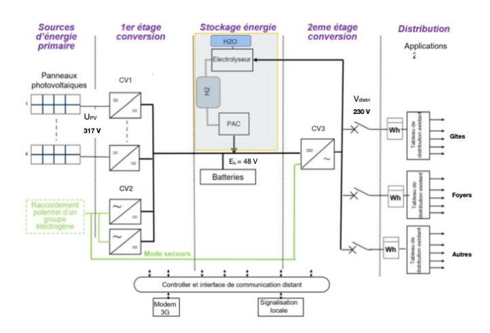

Le sujet est organisé en 3 parties indépendantes comportant au total 42 questions.

# **Étude 1 : Étude et analyse des besoins énergétiques du site**

Cette partie vise à comparer plusieurs solutions possibles pour faire face aux besoins énergétiques du site isolé.

# **Étude 2 : Étude de l'architecture fonctionnelle et structurelle d'un sous-réseau d'électrification**

Cette partie vise à identifier les fonctions et les éléments structurels qui concourent aux transferts de puissance et à valider leurs performances.

# **Étude 3 : Étude de l'asservissement de la tension du bus continu**

Dans cette partie, il s'agit de justifier la nécessité de contrôler la tension du bus continu, d'établir un modèle du convertisseur dans l'optique d'identifier le type de correcteur à mettre en œuvre pour obtenir un asservissement et une régulation de la tension délivrée à l'onduleur.

# <span id="page-6-0"></span>**C. Éléments de correction**

# **Question 1**

|                                                 | Question 1                                     |                                    |  |  |
|-------------------------------------------------|------------------------------------------------|------------------------------------|--|--|
| Synthèse de la consommation annuelle d'un foyer |                                                |                                    |  |  |
| Appareils                                       | Nombre                                         | Consommation totale annuelle (kWh) |  |  |
| Réfrigérateur                                   | 1                                              | 350                                |  |  |
| Congélateur                                     | 1                                              | 1402                               |  |  |
| Four micro-onde                                 | 1                                              | 40                                 |  |  |
| Chargeur de smartphone                          | 4                                              | 8                                  |  |  |
| Ordinateur de bureau                            | 1                                              | 790                                |  |  |
| Téléviseur LCD                                  | 1                                              | 110                                |  |  |
| Lave linge                                      | 1                                              | 422                                |  |  |
| Fer à repasser                                  | 1                                              | 180                                |  |  |
| Ampoule basse consommation                      | 10                                             | 220                                |  |  |
| Autocuiseur                                     | 1                                              | 255                                |  |  |
| Consommation totale                             |                                                | 3777                               |  |  |
|                                                 | Synthèse de la consommation annuelle d'un gîte |                                    |  |  |
| Appareils                                       | Nombre                                         | Consommation totale annuelle (kWh) |  |  |
|                                                 |                                                |                                    |  |  |
| Réfrigérateur                                   | 2                                              | 700                                |  |  |
| Congélateur                                     | 2                                              | 2804                               |  |  |
| Four micro-onde                                 | 1                                              | 40                                 |  |  |
| Chargeur de smartphone                          | 10                                             | 20                                 |  |  |
| Ordinateur de bureau                            | 1                                              | 790                                |  |  |
| Téléviseur LCD                                  | 1                                              | 110                                |  |  |
| Lave-linge                                      | 1                                              | 422                                |  |  |
| Fer à repasser                                  | 1                                              | 180                                |  |  |
| Ampoule basse consommation                      | 20                                             | 440                                |  |  |
| Autocuiseur                                     | 2                                              | 510                                |  |  |
| Four                                            | 1                                              | 365                                |  |  |
| Lave-vaisselle                                  | 1                                              | 288                                |  |  |
| Sèche-linge                                     | 1                                              | 160                                |  |  |

**La consommation annuelle du cirque est :** ETOT= 3103‧777 + 13‧6829= 1,26 GWh ETOT= 3103‧777 + 13‧6829= 1,26 GWh

# **Question 2**

La quantité annuelle de fuel est :

$$Q_{F} = \frac{E_{TOT}}{\eta_{ligne} \Box \eta_{GE} \Box \eta_{GT} \Box PCI} = \frac{1,3.10^{9}}{0,97 \Box 0,92 \Box 0,35 \Box 9,8.10^{3}} = 424707 \text{ L}$$

Calcul du coût du kWh : 
$$\frac{\text{PrixFuel+PrixTransport}}{\text{E}_{TOT}} = \frac{Q_F \cdot \frac{T_{fuel}}{1000} + \text{arrondisup}(\frac{Q_F}{700}) \cdot T_{vol}}{\frac{E_{TOT}}{1000}} = \frac{469907 + 242800}{1,3.10^6} = 0,54$$

Le tarif de l'énergie est : 0,54 €/kWh.

Cela représente le double de celui proposé par EDF. La solution groupe électrogène uniquement serait trop onéreuse.

#### Question 3

Il n'y a aucune irradiance la nuit. Elle commence à apparaître vers 6H au lever du jour pour culminer vers 1000 W.m<sup>-2</sup> au zénith du soleil (vers midi). Cette énergie n'est pas stable, elle fluctue au rythme des conditions météorologiques.

#### **Question 4**

L'allure et le tableau qui précisent les valeurs montrent qu'il y a 3 points toutes les minutes. Il y a donc un pas de 20 secondes ; Pas = 20s.

$$E_s = \sum_{i=1}^{\text{nbpoints}} \phi_i.Pas$$

Sur ces 3 minutes  $E_s = 26540 \text{ J} = 7,37 \text{ Wh.m}^{-2}$ 

#### **Question 5**

Début

Lire le fichier .csv en excluant la ligne 1 et le stocker dans Data Initialiser valeur\_irradiance

Pour indice allant de 0 à la longueur du tableau Faire

Fin Pour

Afficher la valeur de irrad

irrad = irrad / 1000

Afficher la valeur de irrad en kWh.m-2

Fin

#### **Question 6**

$$S_{TPanneau} = \frac{E_{TOT}}{\eta_{Ligne}.\eta_{Mod}.\eta_{Panneau}.E_{San}} = \frac{1,3.10^9}{0.97 \cdot 0.9 \cdot 0.189 \cdot 1447.10^3} = 5445 \text{ m}^2$$

#### **Question 7**

La solution "tout groupe électrogène" est trop onéreuse et son impact écologique serait considérable. La solution "tout photovoltaïque" demande une surface au sol de 5445 m2. Le foncier restreint dans le hameau, le relief et le stockage font que cette solution n'est pas envisageable

$$E_U = \frac{4.(H-O)-1.(O=O)-2.(H-H)}{2} = \frac{4.461-1.498-2.436}{2} = 237 \text{ kJ.mol}^{-1}$$

$$E_{UH} = \frac{E_u.Masseaproduire}{m_{H_2}} = \frac{237.1000}{2} = 118,5MJ = 32,9 \text{ kWh}$$

$$E_{EH} = \frac{E_{UH}}{\eta_E} = \frac{32,9}{0,57} = 57,75 \text{ kWh}$$

# **Question 10**

$$E_{ER} = E_{EU} \cdot \eta_P = 32, 9.0, 5 = 16,45 \text{ kWh}$$

# **Question 11**

$$\eta_{global} = \frac{E_{ER}}{E_{EH}} = \frac{16,45}{57,75} = 28,5\%$$

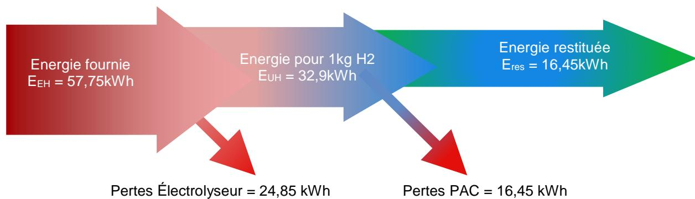

#### **Question 12**

$$V = \frac{n \cdot R \cdot (T + 273)}{P} = \frac{1000 \cdot 8,314 \cdot (25 + 273)}{101300} = 24,45 \text{ m}^3$$

# **Question 13**

La consommation moyenne quotidienne du village de La Nouvelle est :

$$E_{jour} = \frac{E_{TOT}}{365} = \frac{1,3.10^9}{365} = 3561 \text{ kWh}$$

À la pression atmosphérique il faudrait un volume :

$$V = \frac{24,45 \cdot 3561}{16,45} = 5293,75 \text{ m}^3$$

Si on comprime à 500 bars ce volume passerait à :

$$V_{500bars} = \frac{V}{500} = 10,58 \text{ m}^3$$

Cependant pour comprimer le gaz à 500 bars il faudrait aussi apporter de l'énergie ce qui diminuerait encore le rendement global de cette solution.

| Convertisseurs | Noms    | Fonctions                                                     |
|----------------|---------|---------------------------------------------------------------|
| CV1            | Hacheur | Convertir une tension continue en une autre tension continue. |

| Convertisseurs | Noms       | Fonctions                                                  |
|----------------|------------|------------------------------------------------------------|
| CV2            | Redresseur | Convertir une tension alternative en une tension continue. |
| CV3            | Onduleur   | Convertir une tension continue en une tension alternative. |

MPPT : Maximum Power Point Tracking (à la recherche du point maximum de puissance). Cette commande permet d'extraire le maximum de puissance sur une installation photovoltaïque.

#### **Question 16**

Les panneaux sont connectés en série il y  $\frac{317}{39.6}$  = 8 panneaux.

La surface totale du champ est 1,98.1,002.8 = 16 m<sup>2</sup>

La puissance nominale pour une irradiance de 1000 W.m<sup>2</sup> est 317.9,47= 3 kW

#### **Question 17**

Cas n°1: dP>0 Cas n°2: dP<0

#### **Question 18**

La stratégie de commande est basée sur la mesure de U et I et du calcul de P. Une boucle permet d'augmenter ou de diminuer le rapport cyclique du hacheur (en fonction de l'évolution de dP jusqu'à obtenir le point de la puissance maximum (dP = 0).

#### **Question 19**

Pour le point P<sub>1</sub>:  $f_m = \frac{195}{48} = 4,06 \text{ V}$ Pour le point P<sub>max</sub>:  $f_m = \frac{317}{48} = 6,6 \text{ V}$ Pour le point P<sub>2</sub>:  $f_m = \frac{340}{48} = 7,08 \text{ V}$ 

De ce point de vue, le convertisseur CV<sub>1</sub> est un hacheur élévateur.

#### **Question 20**

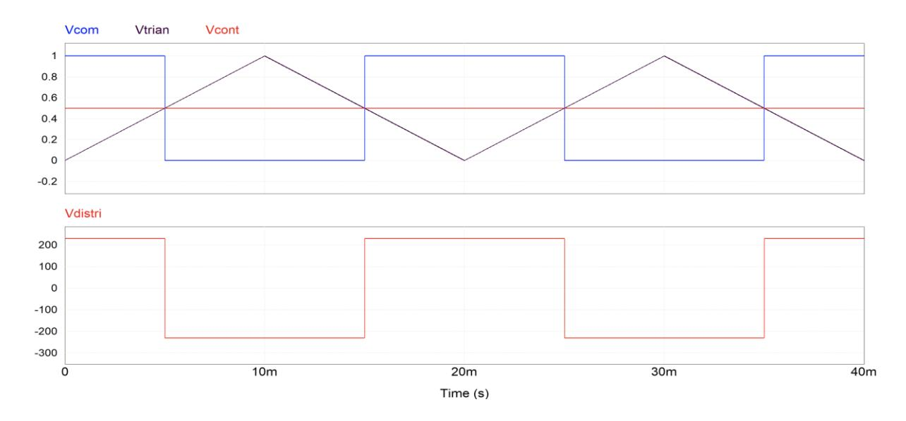

#### **Question 21**

 $V_{distri_{eff}} = V_{DC} = 230 \text{ V}$ 

$$P_{distri} = R_0 \cdot (\frac{S_{distri}}{V_{distri_{eff}}})^2 = 17,7 \cdot (\frac{3000}{230})^2 = 3011 \text{ W}$$

Remarque: La valeur de la resistance R<sup>0</sup> est arrondie ce qui explique ce résulat

$$Q_{distri} = L \cdot \omega \cdot (\frac{S_{distri}}{V_{distri_{eff}}})^2 = 0.01.2 \cdot \pi \cdot 50 \cdot (\frac{3000}{230})^2 = 534.5 \text{ VAR}$$

#### **Question 23**

L'allure de Vdistri n'est pas sinusoïdale, il y a alors une décomposition en série de Fourrier. Ce signal comporte donc des harmoniques. THDfond = 0,48 signifie que la valeur efficace des harmoniques de cette tension représente 48% de la valeur efficace du fondamental de la tension qui est à une fréquence de 50Hz.

#### **Question 24**

A l'entrée du convertisseur se trouve la batterie en série avec une inductance. Cet ensemble peut être assimilé à un générateur de courant.

La charge est inductive, mais un condensateur fixe sa tension. La sortie est donc assimilée à un générateur de tension.

| Q1      | D1       | Viable/pas viable | Explication                                                                      |
|---------|----------|-------------------|----------------------------------------------------------------------------------|
| Bloqué  | Bloquée  | Pas viable        | On ne doit pas ouvrir un générateur de courant.                                  |
| Bloqué  | Passante | Viable            | Un générateur de courant en série avec deux générateurs de<br>tension.           |
| Passant | Bloquée  | Viable            | Un générateur de courant peut être en parallèle avec un<br>générateur de tension |
| Passant | Passante | Pas viable        | On ne peut pas court-circuiter un générateur de tension.                         |

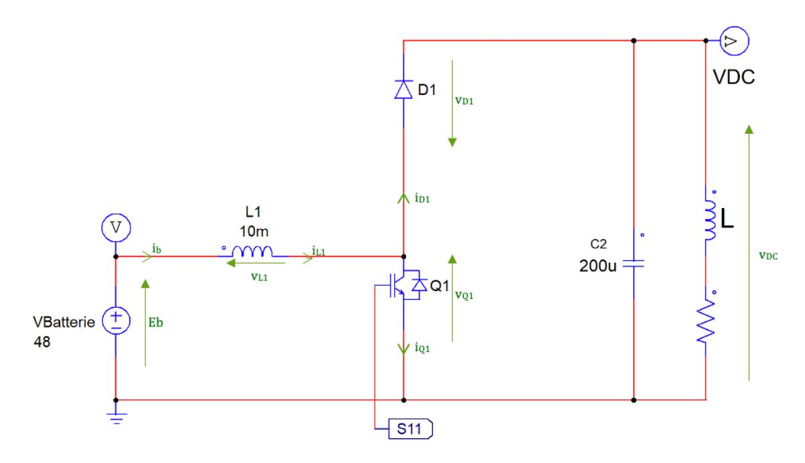

$$E_b = v_{L1} + v_{Q1}$$

$$v_{O1} = v_{D1} + v_{DC}$$

$$i_b = i_{L1} = i_{Q1} + i_{D1}$$

#### **Question 27**

Pour  $t \in ]0; \alpha T]$  on a  $Q_1$  qui est passant et  $D_1$  qui est bloquée. Comme l'interrupteur  $Q_1$  est parfait on a alors  $v_{Q1} = 0$ .

$$E_b = v_{L_1} = L_1 \cdot \frac{di_{L_1}}{dt}$$

Soit 
$$i_{L_1} = \frac{v_b}{L_1} \cdot t + I_{mini}$$

Pour tε]αT;T] on a Q<sub>1</sub> qui est bloqué et D<sub>1</sub> qui est passante. Comme la diode D<sub>1</sub> est parfaite on a alors  $v_{D1} = 0$ .

$$v_{L_1} = E_b - V_{DC} = L_1 \cdot \frac{di_{L_1}}{dt}$$

Soit 
$$i_{L_1} = \frac{E_b - V_{DC}}{L_1} \cdot (t - \alpha \cdot T) + I_{maxi}$$

#### **Question 28**

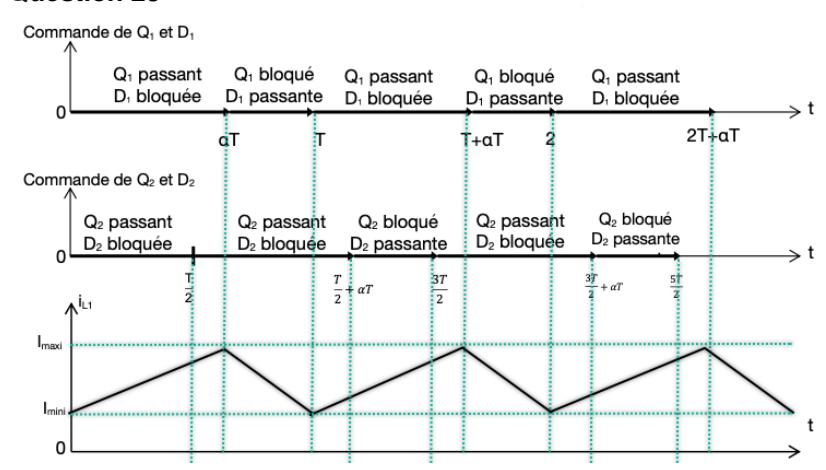

#### **Question 29**

Pour  $t \in ]\frac{T}{2}; \frac{T}{2} + \alpha T]$  on a  $Q_3$  qui est passant et  $D_4$  qui est bloquée.

$$E_b = V_{L_2} = L_2 \cdot \frac{di_{L_2}}{dt}$$

Soit 
$$I_{L_2} = \frac{E_b}{L_1} \cdot (t - \frac{T}{2}) + I_{mini}$$

Pour  $t \in J_2^T + \alpha T; \frac{3.T}{2}$ ] on a  $Q_3$  qui est bloqué et  $D_4$  qui est passante. $v_{L_2} = E_b - V_{DC} = L_2 \cdot \frac{di_{L_2}}{dt}$ Soit  $i_{L_2} = \frac{E_b - V_{DC}}{L_2} \cdot (t - \alpha.T - \frac{T}{2}) + I_{maxi}$ Question 30

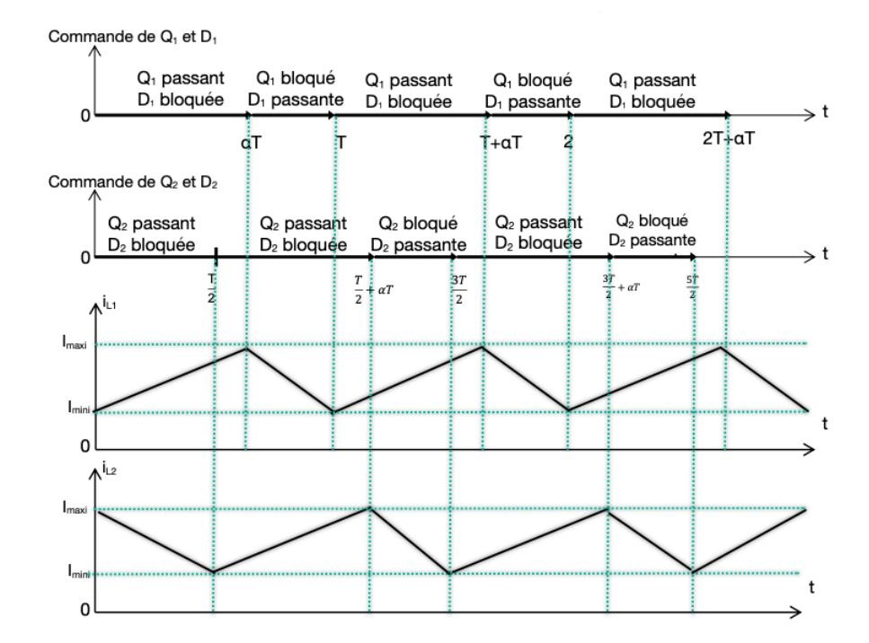

$$I_{Smoy} = 2 \cdot \frac{1}{T} \cdot (T - \alpha T) \cdot \frac{I_b}{2} = I_b \cdot (1 - \alpha)$$

# **Question 32**

Les interrupteurs sont parfaits on a :

$$P_E = V_b \cdot I_b = P_S = V_{DC} \cdot I_S$$

$$V_{DC} = \frac{E \cdot I_b}{I_b \cdot (1-\alpha)} = \frac{E_b}{(1-\alpha)}$$

# **Question 33**

Les cellules sont montées en série pour pouvoir augmenter la tension globale. Il y a <sup>48</sup> 3,69 =13 cellules.

# **Question 34**

Pour DOD = 0 on a Eb DOD=0 = 13.4,1 = 53,3 V.

Pour DOD = 85% on a Eb DOD=85 = 13.3,3 = 42,9 V.

$$\Delta E_b = Eb_{DOD=0} - Eb_{DOD=85} = 53,3 - 42,9 = 10,4 \text{ V}$$

# **Question 35**

Lorsque la batterie est complètement chargée on a :

$$V_{distri_{eff_{max}}} = \frac{Eb_{DOD=0}}{(1 - \alpha_{nom})} = \frac{53.3}{(1 - 0.79)} = 253.8 \text{ V}$$

Lorsque la batterie est déchargée (DOD=85 %) on a :

$$V_{distri_{eff_{max}}} = \frac{Eb_{DOD=0}}{(1 - \alpha_{nom})} = \frac{42.9}{(1 - 0.79)} = 204.3 \text{ V}$$

La norme impose 207 V ≤ Vdistrieff ≤ 253 V ; elle n'est donc pas respectée.

# **Question 36**

$$R_0 = \frac{V_{DC}^2}{P_{S0}} = \frac{230^2}{3000} = 17,63 \Omega$$

#### **Question 37**

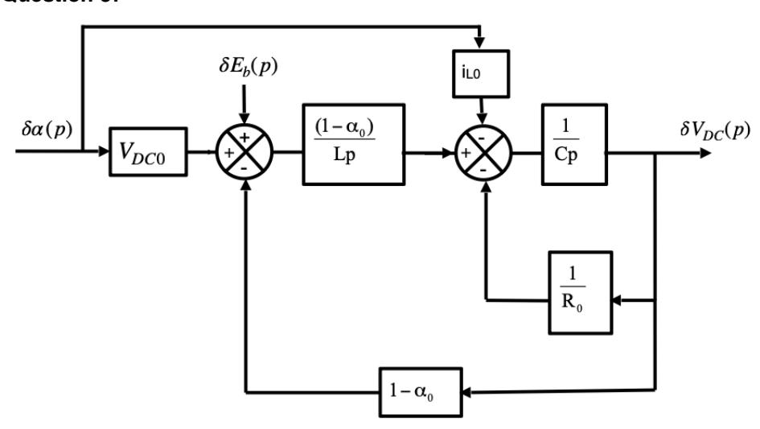

$$\delta V_{DC}(p) = \{ [\delta \alpha(p) \cdot V_{DC0} - (1 - \alpha_0) \cdot \delta V_{DC}(p)] \cdot \frac{1 - \alpha_0}{L \cdot p} - [\delta \alpha(p) \cdot i_{LO} + \frac{\delta V_{DC}(p)}{R_0}] \} \cdot \frac{1}{C \cdot p}$$

$$\delta V_{DC}(p) \cdot C \cdot p = \frac{\delta \alpha(p) \cdot V_{DC0} \cdot (1 - \alpha_0)}{L \cdot p} - \frac{(1 - \alpha_0)^2 \cdot \delta V_{DC}(p)}{L \cdot p} - \delta \alpha(p) \cdot i_{LO} - \frac{\delta V_{DC}(p)}{R_0}$$

$$\delta V_{DC}(p) \cdot [C \cdot p + \frac{(1 - \alpha_0)^2}{L \cdot p} + \frac{1}{R_0}] = \delta \alpha(p) \cdot [\frac{V_{DC0} \cdot (1 - \alpha_0)}{L \cdot p} - i_{LO}] = \delta \alpha(p) \cdot [\frac{V_{DC0} \cdot (1 - \alpha_0)}{L \cdot p} - i_{LO}] = \delta \alpha(p) \cdot [\frac{V_{DC0} \cdot (1 - \alpha_0)}{L \cdot p} - i_{LO}] = \delta \alpha(p) \cdot [\frac{V_{DC0} \cdot (1 - \alpha_0)}{L \cdot p} - i_{LO}] = \delta \alpha(p) \cdot [\frac{V_{DC0} \cdot (1 - \alpha_0)}{L \cdot p} - i_{LO}] = \delta \alpha(p) \cdot [\frac{V_{DC0} \cdot (1 - \alpha_0)}{L \cdot p} - i_{LO}] = \delta \alpha(p) \cdot [\frac{V_{DC0} \cdot (1 - \alpha_0)}{L \cdot p} - i_{LO}] = \delta \alpha(p) \cdot [\frac{V_{DC0} \cdot (1 - \alpha_0)}{L \cdot p} - i_{LO}] = \delta \alpha(p) \cdot [\frac{V_{DC0} \cdot (1 - \alpha_0)}{L \cdot p} - i_{LO}] = \delta \alpha(p) \cdot [\frac{V_{DC0} \cdot (1 - \alpha_0)}{L \cdot p} - i_{LO}] = \delta \alpha(p) \cdot [\frac{V_{DC0} \cdot (1 - \alpha_0)}{L \cdot p} - i_{LO}] = \delta \alpha(p) \cdot [\frac{V_{DC0} \cdot (1 - \alpha_0)}{L \cdot p} - i_{LO}] = \delta \alpha(p) \cdot [\frac{V_{DC0} \cdot (1 - \alpha_0)}{L \cdot p} - i_{LO}] = \delta \alpha(p) \cdot [\frac{V_{DC0} \cdot (1 - \alpha_0)}{L \cdot p} - i_{LO}] = \delta \alpha(p) \cdot [\frac{V_{DC0} \cdot (1 - \alpha_0)}{L \cdot p} - i_{LO}] = \delta \alpha(p) \cdot [\frac{V_{DC0} \cdot (1 - \alpha_0)}{L \cdot p} - i_{LO}] = \delta \alpha(p) \cdot [\frac{V_{DC0} \cdot (1 - \alpha_0)}{L \cdot p} - i_{LO}] = \delta \alpha(p) \cdot [\frac{V_{DC0} \cdot (1 - \alpha_0)}{L \cdot p} - i_{LO}] = \delta \alpha(p) \cdot [\frac{V_{DC0} \cdot (1 - \alpha_0)}{L \cdot p} - i_{LO}] = \delta \alpha(p) \cdot [\frac{V_{DC0} \cdot (1 - \alpha_0)}{L \cdot p} - i_{LO}] = \delta \alpha(p) \cdot [\frac{V_{DC0} \cdot (1 - \alpha_0)}{L \cdot p} - i_{LO}] = \delta \alpha(p) \cdot [\frac{V_{DC0} \cdot (1 - \alpha_0)}{L \cdot p} - i_{LO}] = \delta \alpha(p) \cdot [\frac{V_{DC0} \cdot (1 - \alpha_0)}{L \cdot p} - i_{LO}] = \delta \alpha(p) \cdot [\frac{V_{DC0} \cdot (1 - \alpha_0)}{L \cdot p} - i_{LO}] = \delta \alpha(p) \cdot [\frac{V_{DC0} \cdot (1 - \alpha_0)}{L \cdot p} - i_{LO}] = \delta \alpha(p) \cdot [\frac{V_{DC0} \cdot (1 - \alpha_0)}{L \cdot p} - i_{LO}] = \delta \alpha(p) \cdot [\frac{V_{DC0} \cdot (1 - \alpha_0)}{L \cdot p} - i_{LO}] = \delta \alpha(p) \cdot [\frac{V_{DC0} \cdot (1 - \alpha_0)}{L \cdot p} - i_{LO}] = \delta \alpha(p) \cdot [\frac{V_{DC0} \cdot (1 - \alpha_0)}{L \cdot p} - i_{LO}] = \delta \alpha(p) \cdot [\frac{V_{DC0} \cdot (1 - \alpha_0)}{L \cdot p} - i_{LO}] = \delta \alpha(p) \cdot [\frac{V_{DC0} \cdot (1 - \alpha_0)}{L \cdot p} - i_{LO}] = \delta \alpha(p) \cdot [\frac{V_{DC0} \cdot (1 - \alpha_0)}{L \cdot p} - i_{LO}] = \delta \alpha(p) \cdot [\frac{V_{DC0} \cdot (1 - \alpha_0)}{L \cdot p} - i_{LO}] = \delta \alpha(p) \cdot [\frac{V_{DC0} \cdot (1 - \alpha_0)}{L \cdot p} - i_{LO}] = \delta \alpha(p) \cdot [\frac{V_{DC0} \cdot (1 - \alpha_0)}{L \cdot p} - i_{LO}] = \delta \alpha(p) \cdot [\frac{V_{DC0} \cdot (1 - \alpha_0)}{L \cdot p} - i_{LO}] = \delta \alpha(p) \cdot [\frac{V_{DC0} \cdot (1 - \alpha_0)}{L \cdot p} - i_{LO}] = \delta \alpha(p) \cdot [\frac{V_{DC0} \cdot (1 - \alpha_0)}{L \cdot p} - i_{LO}] = \delta \alpha(p) \cdot$$

$$\frac{\delta V_{DC}(p)}{\delta \alpha(p)} = \frac{(1 - \alpha_0) \cdot V_{DC0} - L \cdot p \cdot i_{L0}}{(1 - \alpha_0)^2 + \frac{L}{R_0} \cdot p + L \cdot C \cdot p^2}$$

$$H_2(p) = \frac{1 - \alpha_0}{(1 - \alpha_0)^2 + \frac{L}{R_0} \cdot p + L \cdot C \cdot p^2} \text{ et } H_3(p) = \frac{-Lp}{(1 - \alpha_0)^2 + \frac{L}{R_0} \cdot p + L \cdot C \cdot p^2}$$

$$\frac{\delta V_{DC}(p)}{\delta \alpha(p)} = \frac{(1 - \alpha_0) \cdot \frac{1}{1 - \alpha_0} \cdot E_{b0} - L \cdot p \cdot \frac{1}{R_0 \cdot (1 - \alpha_0)^2} \cdot E_{b0}}{(1 - \alpha_0)^2 + \frac{L}{R_0} \cdot p + L \cdot C \cdot p^2}$$

On obtient alors : 
$$\frac{\delta V_{DC}(p)}{\delta \alpha(p)} = \frac{E_{b0}}{(1-\alpha_0)^2} \cdot \frac{1 - \frac{L}{R_0 \cdot (1-\alpha_0)^2} \cdot p}{1 + \frac{L}{R_0 (1-\alpha_0)^2} \cdot p + \frac{LC}{(1-\alpha_0)^2} \cdot p^2}$$

$$\delta V_{DC} = \lim_{p \to 0} p \cdot \delta V_{DC}(p) = \lim_{p \to 0} p \cdot \left( \frac{E_{b0}}{(1 - \alpha_0)^2} \cdot \frac{1 - \frac{L}{R_0 \cdot (1 - \alpha_0)^2} \cdot p}{1 + \frac{L}{R_0 (1 - \alpha_0)^2} \cdot p + \frac{LC}{(1 - \alpha_0)^2} \cdot p^2} \right) \cdot \frac{0.01}{p}$$

$$\delta V_{DC} = (\frac{E_{b0}}{(1 - \alpha_0)^2}).0,01 = (\frac{48}{(1 - 0.79)^2}).0,01 = 10,88 \text{ V}$$

Une variation de 1% de la valeur du rapport cyclique entraine une variation de 10,88 V sur la tension de sortie.

# **Question 40**

Si () = 0 nous avons le schéma bloc suivant :

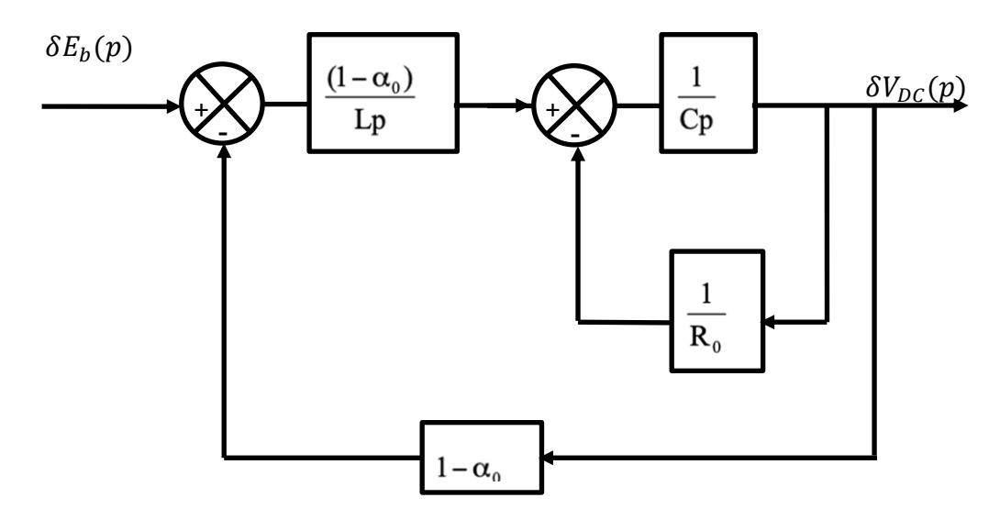

$$\frac{\delta V_{DC}(p)}{\delta E_b(p)} = \frac{\frac{\frac{1-\alpha_0}{L \cdot p} \cdot \frac{\frac{1}{C \cdot p}}{1+\frac{1}{R_0 \cdot C \cdot p}}}{1+\frac{1-\alpha_0}{L \cdot p} \cdot \frac{\frac{1}{C \cdot p}}{1+\frac{1}{R_0 \cdot C \cdot p}} \cdot (1-\alpha_0)} = \frac{1}{1-\alpha_0} \cdot \frac{1}{1+\frac{L}{R_0 \cdot (1-\alpha_0)^2} \cdot p + \frac{LC}{(1-\alpha_0)^2} \cdot p^2}$$

$$\delta V_{DC} = \lim_{p \to 0} p \cdot \delta V_{DC}(p) = \lim_{p \to 0} p \cdot \frac{1}{1 - \alpha_0} \cdot \frac{1}{1 + \frac{L}{R_0 \cdot (1 - \alpha_0)^2} \cdot p + \frac{LC}{(1 - \alpha_0)^2} \cdot p^2} \cdot \frac{1}{p} = 4,76 \text{ V}$$

Lorsque la tension de la batterie varie de 1V, la tension du bus continu varie de 4,76 V.

$$\delta V_{DC}(p) = \frac{1}{1 - \alpha_0} \cdot \frac{1}{1 + \frac{L}{R_0 \cdot (1 - \alpha_0)^2} \cdot p + \frac{LC}{(1 - \alpha_0)^2} \cdot p^2} \cdot \delta_{Eb}(p)$$

$$V_{DC} = \frac{E_b}{(1-\alpha)}$$
 nous avons alors :  $\alpha = 1 - \frac{E_b}{V_{DC}} = 1 - \frac{53.3}{254} = 0.79$ 

La tension de la batterie chute de 10,4 V la tension VDC chutera donc de 49,5 V ; VDC = 204,5 V. Le relevé confirme cette valeur.

# **Question 42**

Lorsque la tension de la batterie chute, il faudra compenser cette chute en augmentant la valeur du rapport cyclique. Il faudra envisager une boucle de régulation associée à un correcteur pour avoir une bonne précision. Nous avons vu que la tension du bus continu était très sensible à la variation du rapport cyclique. Le système pourrait facilement être instable.

# <span id="page-15-0"></span>**D. Commentaires du jury**

# **Analyse globale des résultats et constats**

L'analyse globale des résultats amène aux données suivantes :

- la partie 1 a été traitée par l'ensemble des candidats, seulement 40 % d'entre eux ont obtenu la moyenne.
- la partie 2 a été abordée par 97 % des candidats. Seulement 8,5 % d'entre eux ont obtenu la moyenne.
- la partie 3 a été abordée par 74 % des candidats. Seulement 7 % d'entre eux ont obtenu la moyenne.

L'évaluation des copies montre une hétérogénéité dans le traitement du sujet. Quelques candidats très bien préparés ont pu aborder la quasi-totalité des parties du sujet, en étant efficaces dans la conduite des études pour l'aborder dans son ensemble. Pour les candidats les moins performants, le jury regrette le manque de maîtrise des formules de base en règle générale. Certains candidats n'ont pas su répondre aux questions relatives à la chimie alors que toute la démarche était expliquée, aucune connaissance spécifique à la chimie n'était vraiment nécessaire. Le jury regrette aussi le manque de maitrise des candidats en informatique et algorithme. De nombreux candidats ne maitrisent pas les lois basiques de l'électricité (la loi des nœuds, la loi des mailles, les calculs de puissance ou encore la loi d'Ohm).

Le jury conseille aussi aux candidats de porter une grande attention à la rédaction des copies. Une mise en évidence des résultats est fortement conseillée (soulignement ou encadrement). La présentation claire des méthodes et raisonnements, ainsi qu'un soin tout particulier porté sur l'orthographe sont des compétences pourtant fondamentales. Le jury attend des réponses détaillées et argumentées. Des résultats donnés directement, sans calcul et sans justification ne répondent pas aux attendus de l'épreuve.

#### **Conclusion**

Le jury apprécie les copies des candidats qui justifient ou expliquent les démarches adoptées pour répondre aux questions posées. De plus, la rigueur scientifique et la maîtrise des outils mathématiques usuels nécessaires aux sciences industrielles de l'ingénieur sont des prérequis indispensables. De nombreuses questions sont indépendantes et ne relèvent quelque fois que d'une lecture de documents techniques, il est donc souvent possible de conclure malgré des résultats intermédiaires manquants. Le jury conseille aux futurs candidats de s'investir sérieusement dans toutes les parties du programme du concours et d'acquérir l'ensemble des corpus des compétences et connaissances associées aux disciplines qui constituent les sciences industrielles de l'ingénieur. Enfin, le jury invite vivement les

candidats à se préparer avec sérieux et rigueur, à lire attentivement les rapports de jury, à s'entraîner sur les épreuves des sessions passées.

# <span id="page-16-0"></span>**E. Résultats**

# **CAPET (public)**

Nombre de copies : 72 Moyenne : 7,13 / 20 Note maximum : 14,8 / 20

Écart type : 3,04

# **CAFEP (privé)**

Nombre de copies : 18 Moyenne : 8,47 / 20 Note maximum : 18,2 / 20 Écart type : 3,93

# **Épreuve écrite disciplinaire appliquée**

# <span id="page-17-1"></span><span id="page-17-0"></span>**A. Présentation de l'épreuve**

 Durée : 5 heures Coefficient 2

L'épreuve, commune à toutes les options, porte sur l'analyse et l'exploitation pédagogique d'un système pluri-technologique. Elle invite le candidat à la conception d'une séquence d'enseignement, à partir d'une problématique et d'un cahier des charges.

L'épreuve permet de vérifier :

- que le candidat est capable de mobiliser ses connaissances scientifiques et technologiques pour conduire une analyse systémique, élaborer et exploiter les modèles de comportement permettant de quantifier les performances d'un système pluri-technologique des points de vue de la matière, de l'énergie et/ou de l'information, afin de valider tout ou partie de la réponse au besoin exprimé par un cahier des charges ;
- qu'il est capable d'élaborer tout ou partie de l'organisation d'une séquence pédagogique ainsi que les documents techniques et pédagogiques associés (documents professeurs, documents fournis aux élèves, éléments d'évaluation).

Les productions pédagogiques attendues sont relatives à une séquence d'enseignement portant sur les programmes de collège ou de lycée.

L'épreuve est notée sur 20. Une note globale égale ou inférieure à 5 est éliminatoire.

# <span id="page-17-2"></span>**B. Sujet**

Le sujet est disponible en téléchargement sur le site du ministère à l'adresse : <https://www.devenirenseignant.gouv.fr/ressources>

Les concerts sont des événements culturels populaires dans le monde entier. Des milliers d'artistes de tous les genres musicaux se produisent sur scène chaque année dans de nombreuses villes du monde. Avec la révolution de la musique dématérialisée, le spectacle vivant se retrouve tout naturellement au centre des préoccupations de l'industrie musicale.

En conséquence, les revenus liés aux concerts ont connu une évolution importante ces dernières années générant par exemple plus de 5 milliards de dollars uniquement pour les 100 plus grandes tournées, une première. Mais cela interroge également sur l'empreinte environnementale générée par la logistique déployée, notamment parce que les spectateurs eux-mêmes sont sensibles à ces questionnements.

De ce fait, les enjeux actuels pour les sociétés de production liés à ces évènements s'articulent principalement autour de deux champs :

- L'attractivité par la nouveauté ;
- L'adaptation des équipements aux multiples lieux dans une logique de développement durable.

La scène proposée par l'entreprise de production se caractérise principalement par l'utilisation d'écrans pilotés par des robots industriels. Les robots de scène sont des machines qui sont conçues pour se déplacer sur scène et interagir avec les artistes. Ils peuvent être utilisés pour créer des effets spéciaux, des chorégraphies et des performances originales. Afin de limiter le poids et donc l'impact carbone lors de la manutention et des transports, seule la structure spécifique aux robots est déplacée et vient s'intégrer dans des structures de scène classique sur les lieux des concerts.

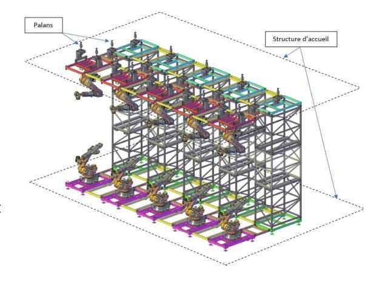

La problématique générale de l'étude de cette scène est :

# **« Offrir une expérience de concert toujours plus immersive et innovante dans une démarche de développement durable »**

L'étude porte sur 3 parties de cette installation :

- Le système garantissant la mobilité d'une dizaine d'écrans géants, permettant de faire évoluer la surface vidéo au gré des demandes artistiques à différents moments de la prestation. Ce système est constitué de dix robots KUKA KR QUANTEC ainsi que de la structure démontable associée nécessaire à leur mise en place et leur adaptation dans chacun des lieux de spectacle ;
- Les palans, liés au lieu d'accueil du concert qui supportent la partie haute de cette structure ;
- La gestion des flux de données permettant à l'ensemble des éléments scéniques de fonctionner en parfaite synchronisation.

Le sujet est organisé en 7 parties indépendantes comportant au total 72 questions.

# <span id="page-18-0"></span>**C. Éléments de correction**

# **Question 1**

Attractivité : présence d'un jeu scénique novateur : (robot + écran)

Adaptation des équipements /mobilité/EDD : scène adaptable et structure légère (montage)

# **Question 2**

Voiture avec évolution des motorisations/pollution

Technologie des Ampoules /consommation

Régulation chauffage avec les systèmes connectés par exemple/consommation/éco-gestes

#### **Question 3**

Découverte d'entreprises développant de nouvelles solutions technologiques / enjeux sociétaux Développer un projet avec le collège/mairie/département sur une problématique de gestion de l'énergie ou des fluides (arrosage auto du collège par exple).

# **Question 4**

Poids de 10 écrans : 10 \* 13,85 =138,5 kg

3 longerons : 5,5 \* 3 = 16,5 kg

2 traverses : 4,5 \* 2 = 9 kg

8 petites traverses : 2,12 \* 8 = 16,96 kg

Masse totale de la {structure + écrans} = 180,96 kg

# **Question 5**

Epaisseur selon z = épaisseur de la structure + épaisseur écran = 30 mm + 30 mm = 60 mm = 0.06 m Longueur selon x = longueur longeron + 2\* largeur traverse = 2900 mm +2 \* 50mm= 3m Largeur selon y = longueur traverse = 2.4m

# **Question 6**

```
J(G,x)= (181/12)*(2,4²+0.06²) = 86,9343 kg.m²
J(G,y)= (181/12)*(0,06²+3²) = 135,8043 kg.m²
J(G,z)= (181/12)*(2,4²+3²) =222,63 kg.m²
```

#### **Question 7**

```
XG = 0,3 m ; YG = 0 ; ZG = 0,06 m ;
```

```
J(O,x)= 86,9343 + 181*(0²+0.06²) = 87,586 kg.m² 
J(O,y)= 135,8043 + 181*(0,3²+0.06²) = 152,75 kg.m²
```

J(O,z)= 222,63 + 181\*(0,3²+0²) = 238,92 kg.m²

# **Question 9**

Jeq = Jmot6 +[J(O,z).r²]

AN : Jeq = 0,003+(238,92x0,00607²) donc Jeq = 0,0118 kg.m²

# **Question 10**

a=v/t AN: a=517,31/1,2 donc a = 431,1 rad.s-²

# **Question 11**

Cm= J.a

Cm= 0,0118\*431.1

Cm = 5,086 N.m

# **Question 12**

Le couple nécessaire pour mouvoir la masse de 181 kg est de 5,086 N.m. Le robot Kuka KR 210 R3100 avec un couple moteur d'axe 6 de 3,83 N.m est sous-dimensionné. Le KR300 2700 avec un couple de 8,21 N.m est suffisant. Le choix se porte donc sur le robot Kuka KR300 2700.

# **Question 13**

Jeq=Jmot6 +[J(O,z).r²] et J(O,z)= (mmax/12)\*(2,4²+3²)+ mmax \*0,3²

Jeq= Jmot6+1,32\* mmax\*r²

Cmmax= Jeq\*a

Jmot6+1,32\* mmax\*r²= Cmmax/a avec Cmmax=8,21 N.m et a=411,1 rad/s²

0,003+1,32\* mmax\*0.00607²=8,21/431,1

mmax=329,9 kg

# **Question 14**

Les données ayant un impact sur la charge sont : la position du centre de gravité par rapport à l'axe de rotation et la masse embarquée sur le robot.

# **Question 15**

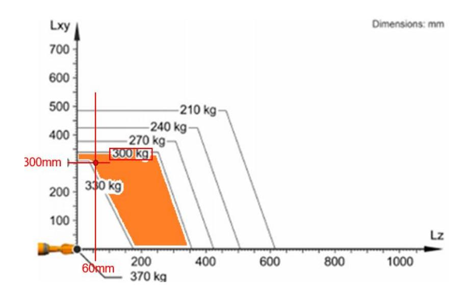

# **Question 16**

Le robot Kuka KR300 2700 avec son moteur d'axe 6 de couple maximum 8,21 N.m peut embarquer une masse maximale de 329.9 kg en comptant les effets dynamiques. Cependant, on ne valide que l'axe 6, supposé le plus préjudiciable. Le diagramme des charges constructeur permet de définir une étendue de la masse maximale à embarquer en fonction de la position du centre de gravité de la charge

sur l'ensemble des axes du robot. On peut remarquer que le positionnement du centre de gravité de l'ensemble structure+écrans donne une masse maximale comprise entre 300 et 330 kg pour une masse de 181 kg de l'ensemble. Ces deux études valident donc le robot Kuka KR300 2700.

# **Question 17**

Exple du vélo avec une fonction et différentes solutions comme les freins :

Les élèves étudient un type de vélo par ilot et complètent ensuite un tableau projeté.

Une synthèse est organisée par l'enseignant afin d'identifier les différentes solutions / 1 fonction permettant d'assoir la notion.

#### **Question 18**

Un moteur standard convertit simplement l'énergie électrique en mouvement mécanique, souvent lorsque la tension d'alimentation est constante. En revanche, un servo-moteur est un système bouclé, utilisant un dispositif de rétroaction pour contrôler précisément la position, la vitesse et le couple de sortie. Cela lui permet d'ajuster son mouvement en temps réel pour atteindre une position spécifique, en répondant aux signaux de commande.

# **Question 19**

N=2(24) ; k = [0, 2(24) -1]

#### **Question 20**

Les bits de parité permettent de vérifier la bonne réception des données. Si les données ne correspondent pas au test de parité, le récepteur ne les prend pas en compte et attend la prochaine trame. En cas de non-transmission de ces bits, le système ne pourrait pas détecter d'erreur de transmission des données et risque de brutalement changer de position si les données portent une erreur (notamment sur les bits de poids fort).

#### **Question 21**

Le signal vaut Vcc pendant 1500+(500)\*60/90 =1833µs puis 0V pendant les 20ms- 1833µs restante. Au bout de 20ms, le signal se reproduit à l'identique.

On dispose de 1ms pour transmettre la consigne de position entre –90° et +90°. Si on souhaite transmettre N valeurs avec N-1= (θ\_max-θ\_min)/δθ = 1800, Il faut couper l'intervalle 1ms en 1801 intervalles. Ceux-ci étant tous de longueur 1ms/1800 = 0,555 µs. L'échantillonnage nécessaire est donc de 1,8 MHz (ce qui est déjà très élevé, la fréquence de cadencement de l'horloge interne d'une carte Arduino valant 84MHz).

#### **Question 22**

Le premier format (UART) permet d'optimiser le débit en n'introduisant pas la période de rafraichissement de 20ms du PWM et maintient une sécurité sur les données transférées en utilisant des bits de parité. Le second (PWM) ne transmet pas de bits de parité mais la structure de créneau attendue limite les risques d'erreur de transmission (celles-ci portant alors sur la longueur lue du créneau ce qui n'a qu'un impact mineur sur la position de consigne reçue par le servomoteur). Il s'agit d'un format plus lent mais souvent utilisé sur les servomoteurs de modélisme notamment pour des raisons de simplicité de génération des trames.

# **Question 23**

$$\delta_{\theta} = \frac{288}{2^{24}} = 1.72 \cdot 10^{-5}$$

#### **Question 24**

La longueur de l'arc lorsque l'axe 3 tourne d'un angle vaut ⋅ avec R la longueur des bras 2+3 donc cet arc vaut 1460 ∗ 1.72 ⋅ 10−5 ∗ 180 = 4,38 ⋅ 10−4 mm. Ce qui est bien inférieur au dixième de millimètre donc le cahier des charges est vérifié.

Un résolveur convertit la position angulaire d'un rotor en deux tensions, ce qui permet une représentation claire et absolue de la position.

Le champ magnétique détecté par les bobines est incliné par rapport au rotor en rotation et on les projette selon 2 axes perpendiculaires d'où cos et sin.

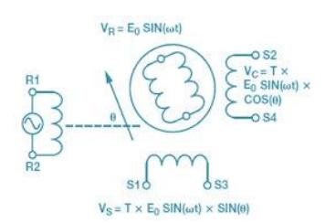

# **Question 26**

$$\delta_v = \frac{10}{288} \times 1.72.10^{-5} \simeq 6 \cdot 10^{-7} V$$

# **Question 27**

 = 10 ≃ 6  ⋅ 10−8 . On peut découper l'intervalle -5V,5V en N segments de largeur q où N vérifie = 10 ≃ 1.6 ⋅ 10<sup>8</sup> ce que l'on peut coder sur = [<sup>2</sup> (1.6 ⋅ 10<sup>8</sup> )] arrondi à l'entier supérieur soit 28 bits.

# **Question 28**

Il faudrait vérifier d'une part que les erreurs de positionnement liées aux autres axes une fois ajoutées, ne génèrent pas une erreur trop élevée (on n'a considéré que l'erreur d'un axe sur les 6 mais tous sont susceptibles d'apporter une erreur de positionnement). Par ailleurs, on a considéré ici que la seule source d'erreur est liée à la quantification des angles de consignes mais il faudrait également vérifier que la commande des différents axes conduit à une erreur statique nulle.

# **Question 29**

#### **Question 30**

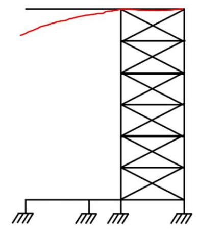

# **Question 31**

Les efforts ont lieux aux fixations des robots. Celui du haut est en porte-à-faux donc la structure va subir aux points 89 une très grande déformation. La partie de droite de la structure se déforme très peu dû à la présence de treillis.

### **Question 32**

D'après le déplacement maximal sur z de 91,28 mm relevé sur la figure 18 et l'exigence d'un écart maximum de 15 mm entre les écrans dans la configuration "écran unique", on peut conclure que la structure ne peut pas être validée.

# **Question 33**

On peut voir d'après la figure 19 que la charge Rz compensée par le palan du nœud 150 est de 6764,6 N. La structure « guide » simplement car le palan reprend la charge (absence de transfert de charge par la structure).

Première phase : problématique : faire un choix de poutre pour un plancher d'une habitation.

Deuxième phase : expérimentation : Au sein de l'ilot un binôme simule la flexion de la poutre et l'autre teste la poutre réelle. Ils complètent un même document (le 5° élève peut-être le « secrétaire »).

Troisième phase : Temps collégial :

1er temps : étude des résultats et validation d'un choix de poutre 2eme temps : étude des écarts entre simulés et mesurés : synthèse

# **Question 35**

À partir du tableau partagé projeté, faire constater aux élèves le peu d'écart de mesure sur le simulé / écarts sur le mesuré

### **Question 36**

Mettre en œuvre une démarche expérimentale Faire un choix de solution en le justifiant Découvrir la notion d'écart de performance

# **Question 37**

∑ =11750 daN. 30 panneaux de 1,219 x 2,438 m donnent une surface de 89,158 m². La charge surfacique est donc de <sup>11750</sup> 89,158 soit 131,78 daN.m-2 donc 1,318 kN.m-2

# **Question 38**

La surface d'influence est représentée en orange sur la figure ci-dessous :

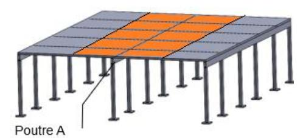

Le résultat numérique donnera :

Sp = 2,438 \* 1,219 \* 5

Sp = 14,86 m²

### **Question 39**

Le calcul concerne les charges permanentes linéiques G et G'.

G = 2,438 \* 1,00 \* 0,050 \* 700 \* 9,81

G = 837 N.m-1 soit 0,837 kN.m-1

G' = [(0,06 \* 0,15) – (0,04 \* 0,13)] \* 1,00 \* 7800 \* 9,81

G' = 290,77 N.m-1 soit 0,291 kN.m-1

# **Question 40**

A partir du résultat de la question 37, il fallait calculer la charge d'exploitation linéique Q.

Q = 2,438 \* 1,00 \* 1,318

Q = 3,213 kN.m-1

#### **Question 41**

Calcul de p à l'état limite ultime.

p = 1,35 \* 1,128 + 1,5 \* 3,213

p = 6,34 kN.m-1

# **Question 42**

Avec 6 réactions d'appui et 5 travées, on pouvait écrire 2 équations de la statique. Cela permet de déterminer un degré d'hyperstatisme égal à 4.

#### **Question 43**

En appliquant le théorème des 3 moments le long de la poutre étudiée :

En 
$$R_b => M_A \cdot L_1 + 2 \cdot M_B \cdot (L_1 + L_2) + M_C \cdot L_2 = 6 \cdot ((-p \cdot L_2^3 - p \cdot L_1^3) / 24$$
  
Soit 4,876  $\cdot M_B + 1,319 \cdot M_C = -5,838$ 

À partir des expressions littérales données :

En R<sup>B</sup> -> 4,876MB+1,319MC=-5,838

En R<sup>C</sup> -> 1,319 MB+ 4,876 MC+1,119 MD=-5,838

En R<sup>D</sup> -> 1,119 MC+ 4,876 MD+1,319 ME=-5,838

En R<sup>E</sup> -> 1,319 MD+ 4,876 ME=-5,838

MB= M<sup>E</sup> et MC= M<sup>D</sup> on peut donc ramener le système de quatre équations à 2 équations.

# Après résolution :

M<sup>A</sup> = 0 ; M<sup>B</sup> = -0.996kN.m ; MC=-0,758kN.m ; MD=-0,758kN.m ; ME=-0,996kN.m ; MF=0

# **Question 45**

A partir de la figure 25 et du DT3 :

$$RA_{i} = R_{Ai,g} + R_{Ai,d} + \frac{M_{i-1} - M_{i}}{L_{i}} + \frac{M_{i+1} - M_{i}}{L_{i+1}}$$

L1=L3=L5=1,119m et L2=L4=1,319m

$$\begin{split} RA_0 &= \frac{R}{A0.8} + R_{A0,d} + \frac{M_{0=1}-M_0}{L_0} + \frac{M_{0+1}-M_0}{L_{0+1}} \text{ avec M}_0 = 0 \\ RA_0 &= \frac{pL_1}{2} + \frac{M_1}{L_1} = \frac{6.34*1,119}{2} + \frac{-0.996}{1,119} \text{ d'où } RA_0 = 2,657 \text{ kN ou } 2657 \text{N}_0 = 2,657 \text{ kN ou } 2657 \text{ kN}_0 = 2,657 \text{ kN ou } 2657 \text{ kN}_0 = 2,657 \text{ kN ou } 2657 \text{ kN}_0 = 2,657 \text{ kN ou } 2657 \text{ kN}_0 = 2,657 \text{ kN}_0 = 2,657 \text{ kN}_0 = 2,657 \text{ kN}_0 = 2,657 \text{ kN}_0 = 2,657 \text{ kN}_0 = 2,657 \text{ kN}_0 = 2,657 \text{ kN}_0 = 2,657 \text{ kN}_0 = 2,657 \text{ kN}_0 = 2,657 \text{ kN}_0 = 2,657 \text{ kN}_0 = 2,657 \text{ kN}_0 = 2,657 \text{ kN}_0 = 2,657 \text{ kN}_0 = 2,657 \text{ kN}_0 = 2,657 \text{ kN}_0 = 2,657 \text{ kN}_0 = 2,657 \text{ kN}_0 = 2,657 \text{ kN}_0 = 2,657 \text{ kN}_0 = 2,657 \text{ kN}_0 = 2,657 \text{ kN}_0 = 2,657 \text{ kN}_0 = 2,657 \text{ kN}_0 = 2,657 \text{ kN}_0 = 2,657 \text{ kN}_0 = 2,657 \text{ kN}_0 = 2,657 \text{ kN}_0 = 2,657 \text{ kN}_0 = 2,657 \text{ kN}_0 = 2,657 \text{ kN}_0 = 2,657 \text{ kN}_0 = 2,657 \text{ kN}_0 = 2,657 \text{ kN}_0 = 2,657 \text{ kN}_0 = 2,657 \text{ kN}_0 = 2,657 \text{ kN}_0 = 2,657 \text{ kN}_0 = 2,657 \text{ kN}_0 = 2,657 \text{ kN}_0 = 2,657 \text{ kN}_0 = 2,657 \text{ kN}_0 = 2,657 \text{ kN}_0 = 2,657 \text{ kN}_0 = 2,657 \text{ kN}_0 = 2,657 \text{ kN}_0 = 2,657 \text{ kN}_0 = 2,657 \text{ kN}_0 = 2,657 \text{ kN}_0 = 2,657 \text{ kN}_0 = 2,657 \text{ kN}_0 = 2,657 \text{ kN}_0 = 2,657 \text{ kN}_0 = 2,657 \text{ kN}_0 = 2,657 \text{ kN}_0 = 2,657 \text{ kN}_0 = 2,657 \text{ kN}_0 = 2,657 \text{ kN}_0 = 2,657 \text{ kN}_0 = 2,657 \text{ kN}_0 = 2,657 \text{ kN}_0 = 2,657 \text{ kN}_0 = 2,657 \text{ kN}_0 = 2,657 \text{ kN}_0 = 2,657 \text{ kN}_0 = 2,657 \text{ kN}_0 = 2,657 \text{ kN}_0 = 2,657 \text{ kN}_0 = 2,657 \text{ kN}_0 = 2,657 \text{ kN}_0 = 2,657 \text{ kN}_0 = 2,657 \text{ kN}_0 = 2,657 \text{ kN}_0 = 2,657 \text{ kN}_0 = 2,657 \text{ kN}_0 = 2,657 \text{ kN}_0 = 2,657 \text{ kN}_0 = 2,657 \text{ kN}_0 = 2,657 \text{ kN}_0 = 2,657 \text{ kN}_0 = 2,657 \text{ kN}_0 = 2,657 \text{ kN}_0 = 2,657 \text{ kN}_0 = 2,657 \text{ kN}_0 = 2,657 \text{ kN}_0 = 2,657 \text{ kN}_0 = 2,657 \text{ kN}_0 = 2,657 \text{ kN}_0 = 2,657 \text{ kN}_0 = 2,657 \text{ kN}_0 = 2,657 \text{ kN}_0 = 2,657 \text{ kN}_0 = 2,657 \text{ kN}_0 = 2,657 \text{ kN}_0 = 2,657 \text{ kN}_0 = 2,657 \text{ kN}_0 = 2,657 \text{ kN}_0 = 2,657 \text{ kN}_0 = 2,657 \text{ kN}_0 = 2,657 \text{ kN$$

Suivant la même démarche : RA
$$_1=R_{A1,g}+R_{A1,d}+\frac{M_0-M_1}{L_1}+\frac{M_2-M_1}{L_2}$$
 
$$RA_1=\frac{6,34*1,119}{2}+\frac{6,34*1,319}{2}+\frac{0+0.996}{1,119}+\frac{-0,758+0.996}{1,319} \text{ et RA}_1=8,799 \text{ kN ou 8799 N}$$

Suivant la même démarche : RA2= 7,548 kN ou 7548 N

#### **Question 46**

Le modèle étant symétrique, on a : RA = RF, RB = RE, et RC = RD. D'après les résultats de la question précédente, l'appui le plus sollicité est RB. Par conséquent, en tenant compte de la symétrie, les appuis RB et RE sont les plus sollicités.

### **Question 47**

Les chaises renforcées sont préférées à la structure poteaux-poutres car elles permettent de réduire les déformations des éléments porteurs sous de lourdes charges, d'assurer une meilleure répartition des efforts dans la structure, et de garantir de meilleures performances en présence de sollicitations dynamiques.

#### **Question 48**

Pour le pied A :

$$P_{\text{piedA}} = \frac{F}{S_{\text{piedA}}} = \frac{10000}{3 * (\frac{\pi * 0.05^2}{4})} \text{ d'où } P_{\text{piedA}} = 1.7 \text{ MPa}$$

Pour le pied B :

$$P_{piedB} = \frac{F}{S_{piedB}} = \frac{10000}{0,1^2} \; d'où \; P_{piedB} = \; 1 \; MPa \label{eq:piedB}$$

Le pied permettant de minimiser au mieux la contrainte au niveau du sol est le pied de type B.

On peut augmenter la surface d'appui des pieds : en augmentant la surface de contact avec le sol, la pression exercée diminue. Cela peut être obtenu en choisissant des pieds de plus grande surface ou en ajoutant une plaque d'appui sous les pieds.

# **Question 50**

Pp = F \* V = m \* g \* V = 1380 \* 9,81 \* 0,11 Donc Pp = 1 489 W

### **Question 51**

Calcul du rendement global :

η = 0,9 \* 0,94 = 0,846

Pméca du moteur = 1 489 / 0,846 = 1 760 W

# **Question 52**

V = R \* ω

Pour l'enrouleur, on peut donc écrire :

$$\omega_{enrouleur} = \frac{0.11}{(\frac{0,06545}{2})} = 3,36 \text{ rad. s}^{-1} \text{ soit } 32,1 \text{ tr. min}^{-1}$$

# **Question 53**

Calcul du rapport de réduction :

r = Nenrouleur / Nmoteur = (Z6 \* Z9b \* Z11b) / (Z9a \* Z11a \* Z16)

A.N. :

r = 1536 / 110250 = 0,01393

On en déduit :

Nmoteur = 32 / 0,01393 = 2304 tr.min-1

# **Question 54**

Pour rappel :

Nmoteur = 2304 tr.min-1 et Pméca du moteur = 1760W Le moteur le plus approprié sera donc le MT10CA106

#### **Question 55**

Le but des jauges extensométriques à fils résistants est de traduire la déformation d'une pièce en une variation de résistance électrique. La jauge se présente comme un petit élément résistif, constitué d'un fil enroulé selon une direction préférentielle et collé à la surface de la pièce à l'aide d'un support isolant. Lorsque la pièce est soumise à un chargement, la déformation est transmise à la jauge par l'intermédiaire de la colle et du support. Il en résulte une variation proportionnelle de la résistance du fil.

# **Question 56**

Une jauge d'extensométrie est une résistance électrique dont la valeur varie en réponse à une déformation mécanique induite par une force. Cette force provoque un allongement ou un raccourcissement du matériau de la jauge, ce qui modifie sa résistance.

La variation de résistance, notée ΔR, est proportionnelle à la force appliquée F. Cette relation peut s'exprimer par l'équation : ΔR = K<sup>R</sup> \* F où K<sup>R</sup> est une constante de proportionnalité propre à la jauge.

La résistance totale de la jauge sous l'effet de la force F est alors donnée par : R(F)=R<sup>0</sup> + ΔR soit, en remplaçant  $\Delta R$  :  $R(F)=R_0+K_R*F$ 

avec:

- $R_0=120 \Omega R0=120 \Omega$  (résistance initiale de la jauge),
- $K_R=1,13\times10^{-6} \Omega.N^{-1}$

#### **Question 57**

$$\begin{array}{l} V_{A} - V_{B} = Vcc * [(R_{0} + \Delta R)/(2R_{0} + \Delta R) - R_{0}/(2R_{0})] \\ = Vcc * [2R_{0}^{2} + 2R_{0} * \Delta R - 2{R_{0}}^{2} - R_{0} * \Delta R] / (2R_{0} * (2R_{0} + \Delta R)) \\ = Vcc/2 * (1/(2R_{0} + \Delta R)) * \Delta R \sim [Vcc/4R_{0}] * \Delta R \end{array}$$

#### **Question 58**

Les variations de résistance  $\Delta R$  étant très faibles, une mesure directe ne permet pas de distinguer les variations dues à la charge de celles dues à la température. En revanche, l'utilisation d'un pont de Wheatstone permet de mesurer le rapport  $\Delta R/R$ . Ce rapport s'écrit :

```
\Delta R / R = \Delta R_0 (1+\alpha T) / R0 (1+\alpha T) = \Delta R_0 / R_0
```

Ainsi, les effets de la température, modélisés par le facteur  $(1+\alpha T)$ , s'annulent dans le rapport, ce qui rend la mesure insensible aux variations de température.

#### **Question 59**

On note K<sub>a</sub> le gain d'amplification.

```
V_{\text{entrée}} CAN = 5V = K_a * (V_{CC} / 4R_0) * \Delta R
```

Avec  $\Delta R = 0.0153 \Omega$  pour une charge de 1380 \* 9.81 = 13500 N :

 $K_a = (Ventrée CAN * 4 * R_0) / (V_{CC} * \Delta R) = (5 * 4 * 120) / (1 * ,0,153) = 15,6 * 10^4$ 

#### **Question 60**

On constate que la charge n'est pas constante, ce qui invalide l'hypothèse selon laquelle « la partie de la structure est entraînée par une masse constante ». Toutefois, le moteur sélectionné à la question 54 a été dimensionné pour une charge supérieure à la charge réelle. Le choix effectué reste donc pertinent.

#### **Question 61**

D'après la documentation DT5, on ne peut piloter que 32 éléments sur une même ligne DMX.

#### **Question 62**

D'après la documentation DT6, le pilotage de la lyre LED BEAM 350 nécessite 24 canaux. Il y a 24 lyres dans l'univers N°7, 576 canaux sont donc nécessaires pour le pilotage complet de l'univers N°7. Un univers DMX comporte au maximum 512 canaux, il n'est donc pas possible, par défaut, d'utiliser pleinement toutes les fonctionnalités des lyres LED BEAM 350.

#### **Question 63**

Pour l'univers 7, on a 20 canaux x 24 appareils = 480 canaux.

A partir de la documentation DT5, on peut calculer la durée de transmission d'un bit =  $1/250000 = 4 \mu s$  Les temps à identifier dans la trame sont :

- Break = 88 μs
- Mark after break = 8 μs
- Start code = 11 bits x 4 μs = 44 μs
- Données = 480 canaux x 11bits x 4 μs = 21260 μs

Le temps de rafraîchissement est donc de  $88 + 8 + 44 + 21260 = 21260 \,\mu s$  soit 21,26 ms. Par conséquent, la fréquence de rafraîchissement de la trame est de 1/0,02126 soit 47Hz.

#### **Question 64**

Comme indiqué dans l'énoncé, un taux de rafraîchissement de 30 Hz est considéré comme le seuil minimal pour éviter une perception visible de saccades ou de décalage, or les univers des pods propose un rafraîchissement calculé à 47 Hz, ce qui est suffisant pour ne pas provoquer de gêne.

Les univers proposés dans le tableau possèdent moins d'appareils et moins de canaux maximums. On peut donc en conclure que les univers proposés dans l'étude satisfont la contrainte de rafraichissement minimale.

Dans la documentation DT6, on peut relever la plage de mouvement Pan et Tilt de la lyre. Les informations sont envoyées sur 8 bits donc 256 valeurs d'où le calcul de la précision :

Pan = 540° → pas = 540/256 = 2,11° ;

Tilt : 228° → pas = 228/256 = 0,89°

Le pas de déplacement des moteurs est inférieur à 3°, on peut donc valider la lyre LED BEAM 350.

### **Question 66**

On relève dans l'énoncé que le musicien N° 1 est situé suivant les coordonnées 30° Pan et 60° Tilt et que l'éclairage doit être de couleur « Sky blue ».

Dans la documentation DT6, on peut constater le numéro des canaux associés : canal 1 pour Pan, canal 2 pour Tilt et canal 9 pour la couleur. Les valeurs à transmettre sont :

Pour le mouvement Pan de 30°, on effectue 30/2,11 = 14,22 soit 14(10) ou 00001110(2)

Pour le mouvement Tilt de 60°, on effectue 60/0,89 = 67,42 soit 67(10) ou 01000011(2)

Pour la couleur, la valeur est 11(10) ou 12(10) soit en binaire 00001011(2) ou 00001100(2)

#### **Question 67**

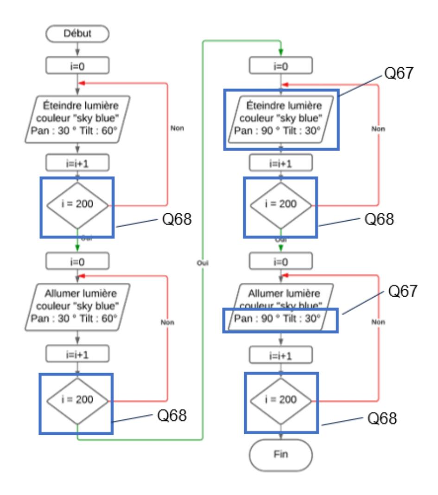

#### **Question 68**

Dans l'énoncé, on peut identifier qu'une trame a une durée de 25ms, pour 5 secondes d'attente, il faut envoyer la trame 200 fois donc i=200 (DR réponse Question 67)

# **Question 69**

On peut relever 3 réseaux différents : le réseau MédiaNet pour augmenter le flux de données et la bande passante, le réseau fibre pour augmenter la vitesse de transmission des données et bien sur le réseau DMX pour assurer le pilotage des différents appareils constituants l'ensemble lumière.

D'après les informations fournies dans la documentation DT7, avec l'adresse du masque et l'adresse d'un hôte, on en déduit que l'adresse de réseau est 192.168.2.64, l'adresse de diffusion est donc 192.168.2.127. La dernière adresse du réseau est 192.168.2.126 mais elle n'est pas disponible car elle est occupée par la console principale. La console lumière « backup » prendra donc l'adresse 192.168.2.125.

### **Question 71**

Pour un spectacle de concert de grande envergure avec un éclairage complexe nécessitant une fiabilité optimale, la préférence pour un réseau DMX over IP est judicieuse. Les avantages de flexibilité, la possibilité de gestion à distance, et l'intégration avec d'autres systèmes de contrôle offerts par les réseaux DMX over IP répondent de manière optimale aux besoins spécifiques de performances scéniques.

# **Question 72**

Le choix des robots est novateur et répond au besoin de proposer des spectacles différents, plus immersifs. Le choix de la structure qui n'a pour fonction que de guider les robots et qui s'intègre dans une structure existante limite considérablement la manutention, le poids et donc l'impact sur l'environnement.

Cette étude est intéressante au regard des attendus de l'enseignement de la technologie sur plusieurs points. On peut prendre comme exemples : l'étude de solutions qui limitent l'impact environnemental, l'utilisation de solutions industrielles dans un autre contexte (« usage détourné »), ou encore le choix des panneaux LED par rapport à une batterie de projecteurs énergivores.

# <span id="page-27-0"></span>**D. Commentaires du jury**

Le sujet présente des questions portant sur les différents champs des sciences industrielles de l'ingénieur, des questions portant sur l'ingénierie système et des questions d'ingénierie pédagogique. Chaque partie comporte des questions très abordables qui n'ont parfois pas été traitées. Le jury conseille au candidat de bien lire l'intégralité des questions. Les parties sont indépendantes et à l'intérieur des parties, des résultats intermédiaires sont donnés permettant au candidat de repartir sur de bonnes bases. Le jury constate que beaucoup de candidats traitent le sujet « dans l'ordre » et conseille aux candidats de s'organiser pour pouvoir traiter les parties dans lesquelles ils sont les plus à même de réussir.

Généralement les candidats répondent mieux aux questions appartenant à leur domaine de spécialisation mais certains candidats sont en difficulté quel que soit le domaine abordé.

Les questions d'ingénierie pédagogique ont globalement été traitées. Néanmoins, le jury invite les candidats à lire les questions avec attention et particulièrement le contexte proposé car de nombreuses propositions sortent du cadre défini.

La lecture de certaines copies est difficile tant l'écriture est illisible et/ou parsemée de fautes d'orthographe et d'expression. En termes de rédaction, le jury invite les candidats à faire des réponses claires et précises, en particulier sur les questions d'analyse de documents.

#### Partie 1

La première partie interrogeait la compréhension du contexte de l'étude puis projetait le candidat dans de l'ingénierie pédagogique à travers trois questions.

Cette partie nécessitait peu de connaissances spécifiques aux sciences industrielles mais interrogeait sur la maitrise de l'éducation au développement durable et ce, dans le contexte de l'enseignement de la technologie en collège.

Cette partie a été appréhendée par l'ensemble des candidats qui obtiennent en moyenne les deux tiers des points. Il est cependant remarqué qu'une partie des candidats ne peuvent décontextualiser leurs propositions pédagogiques et que d'autres se limitent à la notion de réduction des déchets.

Le jury invite les candidats à appréhender l'éducation au développement durable sur l'ensemble de ses composantes.

#### Partie 2

Cette partie est composée de treize questions d'ingénierie mécanique et d'une question d'ingénierie pédagogique. La majorité des candidats obtiennent la moitié des points avec des résultats naturellement plus élevés pour l'option ingénierie mécanique qui obtient une moyenne de deux tiers des points.

Néanmoins les questions nécessitant la mobilisation de théorèmes ou de lois non donnés n'ont été traitées que par quelques candidats.

Le jury apprécie dans l'ensemble la qualité du décodage des informations mais regrette observer des confusions dans les unités ou dans la définition d'une accélération angulaire.

Concernant la question d'ingénierie pédagogique, le choix du support d'étude n'a pas toujours été judicieux au regard de l'enseignement en collège et ce malgré des exemples donnés dans l'énoncé. Il est conseillé de bien décoder les attendus de la question car certaines propositions ne correspondaient pas à la commande. En effet, des candidats ont exposé des séances portant sur les performances de solutions et non sur la notion de fonction technique-solution technique.

#### Partie 3

Cette partie comporte douze questions d'ingénierie électrique dont deux en informatique et une question d'ingénierie pédagogique.

Seul un tier des points a été attribué en moyenne. Il est observé que même les questions mobilisant le décodage d'informations n'ont que trop peu été traitées.

Il est observé également sur cette partie que les questions mobilisant des savoirs non décrits dans les ressources ne sont que trop partiellement traitées (exemple de la définition d'un servo moteur, d'un résolveur…).

Le jury déplore que certains candidats proposent volontairement des données erronées ou de faux raisonnements pour un résultat attendu juste.

Sur la question d'ingénierie pédagogique, une majeure partie des candidats n'a pas pris le temps d'appréhender le contexte précis proposé. Il est relevé une syntaxe des phrases parfois peu compréhensible.

# Partie 4

Cette partie comporte dix-sept questions d'ingénierie des constructions et 3 questions pédagogiques. Elle se décompose en deux sous-parties avec un premier questionnement sur la structure porteuse puis un deuxième sur la structure d'accueil.

Elle a été traitée de façon inégale selon les spécialités des candidats avec au mieux un tier de réussite pour les candidats de la spécialité. La première problématique a davantage été appréhendée par les candidats.

Le décodage des données a posé plus de difficulté aux candidats comme également la finalité de la présence de palans, en reprise de charge.

La deuxième partie était particulièrement calculatoire et mobilisait de nombreuses données. Peu de candidats sont allés au bout de la démarche. Le problème d'unités a, là encore été observé.

La première question de pédagogie, axée sur l'organisation d'une séance a été assez bien appréhendée quand elle a été traitée à la différence des deux autres questions qui interrogeaient les objectifs et les notions travaillées.

Il est regrettable que les notions d'écart de mesure entre le réel et le simulé ne soient que trop peu maitrisées (erreurs de manipulation, de précision de la mesure, des limites du modèle numérique…)

#### Partie 5

Cette partie comporte cinq questions d'ingénierie mécanique et six questions d'ingénierie électrique. Une petite moitié des candidats a traité les six premières questions et seul un quart les questions suivantes.

Le passage d'une vitesse linéaire à angulaire n'est pas maitrisé et ce pour un tier des répondants de même que pour le calcul d'un rapport de réduction simple.

L'intérêt d'un pont de Wheatstone et l'expression simplifiée de la tension de sortie ont été traités par moins de vingt pour cent des candidats.

### Partie 6

Cette partie contient onze questions d'ingénierie informatique.

Cette partie n'a été traitée que par trop peu de candidats et particulièrement les dernières questions avec un taux de non réponse d'environ quatre-vingt pour cent.

Il est à noter que certaines questions mobilisaient peu de décodage et des concepts simples.

### Partie 7

Cette partie contient une question conclusive. Elle n'a été traitée que par vingt pour cent des candidats en moyenne.

Pour conclure, le jury demande aux futurs candidats de :

- bien lire le sujet et les questions pour traiter toutes les parties possibles ;
- identifier les données et les organiser en fonction des questions ;
- maitriser à minima les principes de base des quatre ingénieries ;
- connaître les unités des différentes grandeurs physiques pour analyser l'homogénéité de leurs résultats ;
- travailler sur la rigueur de leurs raisonnements et de leur rédaction ;
- soigner la qualité de l'orthographe et de l'expression ;
- avoir une lisibilité des pratiques pédagogiques possibles en collège et en lycée.

# <span id="page-29-0"></span>**E. Résultats**

**CAPET (public)**

Nombre de copies : 69

Moyenne : 6,57 / 20 Note maximum : 15,9 / 20

Écart type : 2,81

**CAFEP (privé)**

Nombre de copies : 18

Moyenne : 7,06 / 20 Note maximum : 15,5 / 20

Écart type : 3,13

# **Épreuve de leçon**

# <span id="page-30-1"></span><span id="page-30-0"></span>**A. Présentation de l'épreuve**

Durée des travaux pratiques encadrés : 5 heures Durée de la présentation : 30 minutes maximum Durée de l'entretien : 30 minutes maximum

Coefficient : 5

L'épreuve a pour objet la conception et l'animation d'une séance d'enseignement dans l'option choisie. Elle permet d'apprécier à la fois la maîtrise disciplinaire, la maîtrise de compétences pédagogiques et de compétences pratiques.

L'épreuve prend appui sur les investigations et analyses effectuées par le candidat pendant les cinq heures de travaux pratiques relatifs à une approche spécialisée d'un système pluri-technologique et comporte la présentation d'une séance d'enseignement suivie d'un entretien avec les membres du jury.

L'exploitation pédagogique attendue, directement liée aux activités pratiques réalisées, est relative aux enseignements en collège, en lycée et aux sections de STS de la spécialité.

L'épreuve est notée sur 20. 10 points sont attribués à la partie liée aux travaux pratiques et 10 points à la partie liée à la soutenance. La note 0 à l'ensemble de l'épreuve est éliminatoire.

# <span id="page-30-2"></span>**B. Déroulement de l'épreuve**

# **Organisation**

Les deux parties, travaux pratiques et exploitation pédagogique, sont indépendantes et sont notées chacune sur dix points. La séparation de l'évaluation des deux parties de l'épreuve permet de dissocier la réussite à la partie « travaux pratiques » de celle à la partie « exploitation pédagogique ».

Les supports utilisés, pour cette session, sont des systèmes pluri-technologiques actuels :

- banc d'essai de flexion ;
- système de ventilation double flux ;
- robot collaboratif ;
- barrière de péage ;
- égreneur.

Les documents accompagnant le support fournissent une guidance qui permet aux candidats, quelle que soit leur connaissance du système de mobiliser leurs compétences scientifiques et pédagogiques.

Chaque support conduit à une exploitation pédagogique, liée à l'option choisie, de niveau imposé en technologie au collège, en série STI2D (sciences et technologies de l'industrie et du développement durable) de la voie technologique, en enseignement de spécialité sciences de l'ingénieur de la voie générale ou en STS de la spécialité.

Pour la partie travaux pratiques, les postes de travail sont équipés, selon la nécessité des activités proposées, des matériels usuels de mesure des grandeurs physiques : oscilloscopes numériques, multimètres, dynamomètres, tachymètres, cartes d'acquisition associées à un ordinateur, etc.

Le jury dispose d'une traçabilité des connexions sur le réseau permettant de suivre les sites consultés.

## **Travail demandé**

#### **Rappel des attendus**

L'épreuve a pour objet la conception et l'animation d'une séance d'enseignement. La séance proposée prendra appui sur les investigations effectuées pendant la phase de travaux pratiques. Cette épreuve permet d'apprécier à la fois la maîtrise disciplinaire, la maîtrise de compétences pédagogiques et de compétences pratiques du candidat.

L'épreuve se déroule selon la chronologie suivante :

Travaux en laboratoire (5 heures) :

- Phase 1 : appropriation du contexte pédagogique de la séance d'enseignement et prise en main du système (40 minutes) ;
- Phase 2 : réalisation d'activités expérimentales (3 heures) ;
- Phase 3 : réinvestissement des activités et élaboration du scénario de la séance (30 minutes) ;
- Phase 4 : préparation de l'exposé (50 minutes).

Soutenance (1 heure) : 30 minutes maximum d'exposé, 30 minutes maximum d'entretien.

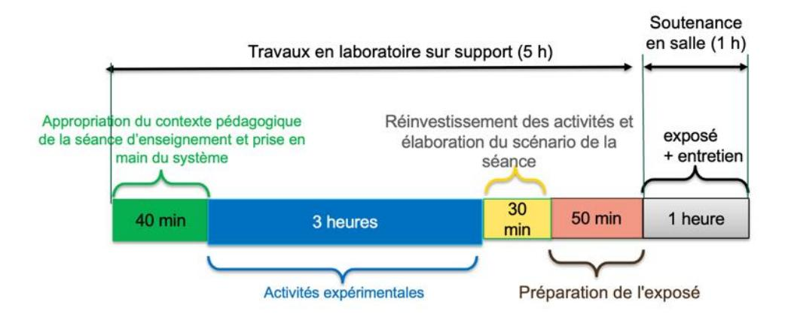

**Phase 1 : appropriation du contexte pédagogique de la séance d'enseignement et prise en main du système (40 minutes)**

# **Appropriation du contexte pédagogique**

La séance d'enseignement à présenter lors de l'exposé est une activité prévue pour une heure en classe entière. Elle doit être élaborée pour la série, le niveau et les objectifs de formation définis ci-dessous.

Les éléments suivants sont indiqués au candidat :

- série : Technologie, STI2D, SI ou BTS (spécialité précisée selon le sujet) ;
- niveau : classe concernée ;
- période : période de l'année (début, milieu ou fin d'année) ;
- compétences visées (il s'agit des compétences que la séance présentée par le candidat doit permettre de développer chez les élèves ; une à deux compétences sont imposées) ;
- connaissances/savoirs associé(e)dus (il s'agit des connaissances/savoirs associées aux compétences qui devront être développé(e)s dans le cadre de la séance présentée par le candidat).

# **Prise en main du système et de son environnement**

Il est mis à disposition du candidat :

- un espace numérique personnel accessible pendant les six heures de l'épreuve ;
- un ordinateur équipé des logiciels de bureautique usuels, de logiciels dédiés aux activités pratiques et d'un accès à internet ;
- un dossier « Documents candidats » comportant diverses ressources ;
- un système didactisé

Quelques manipulations sont proposées au candidat. Elles sont fortement guidées et doivent permettre une prise en main du système et des matériels/logiciels mis à sa disposition pour réaliser les activités expérimentales suivantes.

#### **Phase 2 : activités expérimentales (3 heures)**

Dans cette phase 2, une succession d'activités expérimentales est proposée aux candidats. Ces activités permettent d'évaluer l'aptitude du candidat à :

- concevoir un protocole expérimental ;

- mettre en œuvre un protocole expérimental ;
- réaliser une partie d'un programme ;
- réaliser le relevé de grandeurs physiques ;
- extraire des informations de documentations fournies ;
- analyser les relevés et déduire les conclusions quant à l'objectif visé (ce retour à l'objectif de l'activité est essentiel).

# **Phase 3 : réinvestissement des activités et élaboration du scénario de la séance (30 minutes)**

La séance d'enseignement à présenter lors de l'exposé est une activité prévue en classe entière pour une durée d'une heure. Elle doit être élaborée pour la série, le niveau et les objectifs de formation définis en phase 1.

Le programme (ou le référentiel) de la classe concernée est mis à disposition du candidat.

À partir du contexte pédagogique imposé, il est demandé au candidat d'identifier parmi les activités expérimentales réalisées lors de la phase 2 celles qui pourraient être exploitées et transposées au niveau d'élèves concerné. Le candidat ayant toujours accès au matériel de travaux pratiques, des expérimentations complémentaires peuvent être réalisées.

# **Phase 4 : préparation de l'exposé (50 minutes)**

Lors de cette phase, le candidat n'a plus accès au matériel de travaux pratiques.

Pour information, le candidat dispose lors de son exposé :

- de l'espace numérique personnel utilisé lors des phases précédentes ;
- d'un ordinateur équipé des logiciels de bureautique et d'un vidéoprojecteur ;
- d'un tableau blanc et de feutres.

La durée de la présentation devant la commission d'interrogation est de 30 minutes maximum.

Elle doit inclure une courte introduction explicitant :

- la description du contexte pédagogique de la séance (imposé en phase 1), une description succincte de l'articulation de la séance présentée avec les séances antérieures et postérieures ;
- la(les) problématique(s) éventuelle(s) permettant de contextualiser les activités proposées aux élèves ;
- le plan de la séance.

Les activités proposées aux élèves dans le cadre de la séance sont ensuite présentées et argumentées. Il n'est pas attendu du candidat qu'il détaille lors de l'exposé la chronologie des activités expérimentales qu'il a conduites au laboratoire durant les trois heures qui y sont consacrées.

# <span id="page-32-0"></span>**C. Commentaires du jury**

#### **1. Analyse globale des résultats**

Le jury tient à souligner la qualité de préparation de nombreux candidats. Néanmoins, les attendus de l'épreuve et les modalités de mise en œuvre décrits au JORF ne sont pas connus de tous. Il s'avère extrêmement difficile de réussir les activités pratiques et l'exploitation pédagogique si les objectifs spécifiques de ces deux parties de l'épreuve ne sont pas connus.

Les notions théoriques portant sur la pédagogie et la didactique de la discipline et sur les différentes démarches pédagogiques associées (travail en ilots, classe inversée, évaluation par compétences…) sont régulièrement citées par les candidats. Elles ne sont pas toujours bien maîtrisées et ne font que trop rarement l'objet d'une contextualisation ou d'une proposition concrète dans le cadre de la séance présentée lors de la leçon.

Une proportion notable de candidats ne connaît pas les grands principes de la réforme du lycée mise en œuvre à la rentrée 2019. Les programmes de technologie au collège, de la série STI2D et de l'enseignement de spécialité sciences de l'ingénieur du lycée général et technologique ainsi que les documents ressources pour faire la classe sont parfois inconnus des candidats. Le jury a été également surpris que des candidats ne soient pas acculturés au socle commun de connaissances, de compétences et de culture, au cadre de référence des compétences numériques (CRCN), ainsi qu'à l'évaluation par compétences.

Le nombre des exploitations pédagogiques portant sur le collège, la série STI2D, l'enseignement de spécialité SI ou les STS de la spécialité a été équilibré sur l'ensemble de la session ; les candidats doivent être en mesure de produire des séances sur tous les niveaux d'enseignement. Le jury rappelle que les exploitations pédagogiques doivent s'appuyer sur les programmes et référentiels en vigueur lors de la session du concours.

# **2. Commentaires et conseils aux candidats**

#### **Pour la partie travaux pratiques**

Le manque de culture scientifique et technologique pénalise de nombreux candidats dans l'appropriation des supports pluri-technologiques. Il est impératif, pour réussir cette épreuve, de disposer de compétences et de connaissances scientifiques et technologiques avérées dans les trois domaines « matière – énergie – information ». Cette culture technologique ne se limite en aucun cas à un domaine disciplinaire unique lié à l'option choisie par le candidat. Les futurs professeurs de sciences industrielles de l'ingénieur se doivent d'avoir une vision transversale et globale de leur discipline et de conduire une veille technologique régulière. Tout au long de l'épreuve, le jury est amené à interagir avec les candidats de façon à ce qu'ils puissent exposer leurs démarches, leurs raisonnements et leurs conclusions ; il attend un discours scientifiquement rigoureux, clair et argumenté.

Les candidats les plus efficients font preuve d'autonomie, d'esprit critique et d'écoute envers le jury lors des travaux pratiques. Ils prennent des initiatives dans la conception de leur séance pédagogique et mettent à profit l'ensemble des ressources numériques mises à leur disposition.

Le jury tient à souligner que nombre de candidats sont bien préparés à cette partie de l'épreuve et s'appuient sur des compétences à la fois transversales et spécifiques à leur option.

#### **Organisation à suivre lors de l'épreuve**

Il est conseillé de prendre connaissance de l'intégralité du sujet avec ses annexes avant de commencer les activités expérimentales et de lire les consignes.

Les candidats réalisent des activités expérimentales et analysent des résultats afin de conclure sur les problématiques du sujet. Ces manipulations, mesures et interprétations, sont réalisées au niveau de compétences d'un master première année.

Les candidats doivent penser à garder des traces numériques de leurs résultats et de leurs travaux afin de les réinvestir dans une séance adaptée au collège ou au lycée.

La connaissance préalable du système et des logiciels n'étant pas demandée, les membres de jury peuvent être sollicités par les candidats en cas de problèmes ou de difficultés liées à l'utilisation d'un logiciel ou d'un appareil de mesure spécifique. Plus généralement, le jury est présent pour accompagner les candidats dans leur démarche.

#### **Aptitude à mener un protocole expérimental**

Le jury a apprécié l'autonomie dans la manipulation des systèmes de certains candidats. La mise en œuvre des matériels de mesure et d'acquisition ne présente pas de difficultés particulières. Cependant pour certains candidats, les instruments de mesure les plus courants ne sont pas suffisamment connus (nom, utilisation, symbole et unités des grandeurs physiques mesurées). Les membres du jury assurent l'accompagnement nécessaire afin que la spécificité d'un équipement ne constitue pas un obstacle à la réussite du candidat. Il est attendu du candidat qu'il soit capable de proposer et de justifier des choix de protocoles expérimentaux.

Les travaux pratiques font apparaître que de nombreux candidats ne maîtrisent pas suffisamment les notions fondamentales de leur spécialité, ont une méconnaissance des protocoles expérimentaux élémentaires, ont des difficultés à utiliser les systèmes d'unités associés alors qu'une vision large de la discipline est nécessaire. De même, plusieurs d'entre eux ne sont pas en mesure de réaliser des

manipulations mathématiques de base indissociable de la culture scientifique commune (résolution d'une équation du premier degré, calcul d'un coefficient directeur, trigonométrie…).

# **Utilisation des modèles numériques**

Globalement, les candidats utilisent correctement les modèles numériques fournis. Le jury note cependant que de nombreux candidats manquent de recul et d'esprit critique dans l'interprétation des résultats de la simulation numérique et dans l'analyse des hypothèses utilisées lors de l'élaboration du modèle. Il est attendu des candidats une analyse pertinente des écarts entre les résultats issus de la simulation d'un modèle numérique, les mesures issues du système réel à partir d'expérimentations et/ou les performances attendues indiquées dans le cahier des charges. Au-delà des modèles numériques utilisés, le jury rappelle que les candidats se doivent de maîtriser les bases du champ disciplinaire concerné, dans le domaine du numérique (langages, codage, ...).

#### **Préparation de la séance**

Le candidat doit bien identifier les activités réalisées qui pourraient être réinvesties lors de l'exposé, au niveau collège, en pré-bac ou en STS. Cet inventaire doit l'amener à envisager les activités possibles à proposer dans la classe pour la séance et le niveau demandé. Les conclusions et les résultats de ces expérimentations pourront être réutilisées lors de l'élaboration de la séance.

Il convient de transposer les activités réalisées par les candidats lors des activités expérimentales dans un contexte de formation pour des élèves au regard de la commande pédagogique imposée dans le sujet.

Il est demandé aux candidats d'illustrer leur leçon à partir du système étudié. Le jury a déploré que certains candidats proposaient des activités s'appuyant sur des systèmes non étudiés lors de l'activité de travaux pratiques.

Certains candidats, déjà contractuels, mettent à profit leurs expériences pour proposer des séances pertinentes. Cependant, bon nombre de candidats se lancent dans la production d'une séance sans réellement analyser les compétences et les connaissances ciblées pour la leçon. Certains perdent encore du temps à formaliser une séquence pédagogique sans aborder la séance cible ; d'autres s'approprient des formats types non adaptés à la commande.

Le jury regrette que trop peu de candidats présentent une synthèse de leurs activités pratiques afin d'en sélectionner les éléments pertinents pour leur séance. Le hors-sujet est encore malheureusement trop fréquent.

Le jury conseille aux candidats de commencer par la construction du document de synthèse de la séance demandée. Ce document formalisera les savoirs et/ou la méthodologie à retenir par les élèves. Cela faciliterait la transposition didactique demandée et permettrait de proposer des activités d'apprentissage opérationnelles.

Le jury conseille encore aux candidats de justifier clairement les choix pédagogiques opérés sans se cantonner à des généralités.

#### **Pour l'exposé devant le jury**

Les candidats inscrivent leur développement pédagogique dans un contexte donné dans le sujet. La séance d'enseignement à présenter est une activité prévue en classe entière pour une durée d'une heure. Ce contexte, selon le niveau et les objectifs visés, est compatible avec la réalisation ou l'exploitation d'activités expérimentales. Les candidats ne doivent donc pas se sentir contraints de présenter une séance de cours. Afin de bien préciser au jury les enjeux et les attendus de la séance, celle-ci doit être intégrée dans une séquence. Le candidat doit situer la séance dans une organisation temporelle, en précisant ce qui est fait avant et après. Il doit également expliciter la construction de la séance en s'appuyant sur des activités expérimentales réalisées auparavant et de leurs résultats. Le candidat est amené à préciser pour la séance décrite les prérequis, les objectifs (compétences à faire acquérir, capacités et connaissances attendues), l'organisation de la classe, les modalités pédagogiques (cours, activités dirigées, activités pratiques, projet), les stratégies pédagogiques (déductif, inductif, différenciation pédagogique, démarche d'investigation, démarche de résolution de

problème technique, pédagogie par projet, approche spiralaire…), les activités des élèves et les productions attendues. La description de la séance doit faire explicitement apparaître la prise en compte de la diversité des publics accueillis dans la classe. Il est attendu que le candidat précise la façon dont il compte animer la classe et mettre en synergie les élèves en vue de la structuration des acquis.

Les phases de structuration des connaissances permettant la construction des connaissances des élèves et les différentes formes d'évaluation des apprenants peuvent être des parties intégrantes de la séance.

Les différentes modalités d'enseignement (enseignement pratique interdisciplinaire, interdisciplinarité, concours scientifique et technique…) et les dispositifs d'accompagnement et de remédiation doivent être précisés.

Le jury met en garde les candidats qui éludent tout ou partie des objectifs visés en termes de compétences et connaissances associées voire s'écartent du contexte pédagogique imposé. Dans ce cas, le jury considère la leçon présentée hors sujet.

Enfin, un discours purement pédagogique qui ne répondrait pas concrètement aux objectifs d'apprentissage visés ne saurait être cautionné par le jury.

Il s'agit du cœur même de l'épreuve que de traiter la commande en termes de niveau, et de compétences/connaissances attendues. L'expertise pédagogique ne saurait palier ce manquement à l'exigence de contenu didactique.

De trop nombreux candidats confondent les activités de travaux pratiques réalisées lors de la phase 2 de l'épreuve et les activités de la séance pédagogique à exposer ; leur exposé est, de fait, hors sujet.

# **Utilisation du numérique**

Le jury conseille aux candidats de bien identifier les points de leur séance pédagogique pour lesquels l'usage du numérique apportera une réelle plus-value aux apprentissages des élèves. Le jury constate que peu de candidats proposent une exploitation d'outils numériques éducatifs, à des fins d'animation de séance, de présentation, de travail collaboratif, d'échanges entre le professeur et les élèves (type ENT par exemple). Les outils numériques proposés doivent être respectueux du règlement général de la protection des données (RGPD).

#### **Réinvestissement des résultats de travaux pratiques**

L'objectif attendu de la leçon est une exploitation pédagogique s'appuyant sur tout ou partie des activités pratiques réalisées et de leurs résultats et permettant aux apprenants de comprendre les concepts fondamentaux associées aux compétences visées. Les activités expérimentales menées dans la partie « travaux pratiques » peuvent être d'un niveau supérieur à celui demandé dans la séance, il ne s'agit donc pas de faire, au travers de la séance pédagogique, un compte-rendu de l'activité pratique réalisée, mais de s'appuyer sur les expérimentations pour en extraire des données et des activités à proposer aux élèves. Cependant, une rapide présentation des objectifs et conclusions des expérimentations réalisées en TP en première partie de l'épreuve, permettra au jury de mieux comprendre l'intégration de ceux-ci dans la séance. Il est apprécié de réaliser une présentation dynamique qui inclut des copies d'écran, des résultats de mesures, des éléments de cahier des charges ou d'analyse SysML, etc.

Le jury ne se satisfait en aucun cas d'une exploitation brute des activités proposées dans la première partie de l'épreuve.

#### **Réalisme de l'organisation de la classe**

Le jury attend des candidats qu'ils émettent des hypothèses réalistes sur les conditions d'enseignement. Leurs propositions doivent être pragmatiques afin que le jury puisse appréhender le scénario pédagogique envisagé (travail en "autobus", en ilots, en équipes, en binômes ou individuellement). Le candidat doit notamment préciser son rôle dans la conduite et l'animation de la séance. Le choix des supports techniques utilisés lors de la séance proposée doit être réaliste au regard des équipements présents dans les laboratoires des établissements scolaires. Les candidats doivent être, en effet, conscients que les laboratoires mis en place pour cette épreuve de concours ne sont pas représentatifs de l'équipement standard d'un laboratoire de lycée ou de collège : un enseignant ne dispose jamais simultanément de plusieurs exemplaires d'un des systèmes exploités au concours.

# **Évaluation**

Le processus retenu par le candidat pour l'évaluation des compétences doit être non seulement clairement décrit (évaluation diagnostique, formative, sommative, certificative, …) mais aussi justifié. Les critères d'évaluation doivent être explicités. Les modalités et les outils doivent être précisés. Si des remédiations ou des différenciations pédagogiques sont envisagées, elles doivent être explicitées.

Trop souvent, les candidats se contentent d'évoquer les processus d'évaluation sans pouvoir en expliquer réellement le déroulement, les modalités et surtout l'objectif en termes d'acquisition des compétences par les élèves.

# **Présentation orale**

Quelques candidats proposent des présentations (orales et écrites) très formatées, quelques fois hors du contexte des activités pratiques réalisées en amont, qui ne résistent pas aux questionnements du jury et mettent en évidence des lacunes.

Le jury note également que quelques candidats limitent leur présentation à un descriptif sommaire des activités sans expliciter et justifier clairement la démarche.

Le jury invite les candidats à, certes, maîtriser les attendus pédagogiques et didactiques de la discipline, mais surtout à être en capacité de les réinvestir de façon adaptée et pertinente. À titre d'exemples, les termes « formatif », « sommatif », « inductif », … doivent être utilisés à bon escient et dans un contexte adapté.

Enfin, le jury rappelle que le concours constitue la première étape de l'entrée dans le métier du professorat. Le candidat se doit donc d'adopter une posture et un positionnement exemplaires constitutifs de la mission d'enseignant. Le jury invite vivement les candidats à s'approprier le référentiel des compétences professionnelles des métiers du professorat et de l'éducation (arrêté du 1-7-2013 - J.O. du 18-7-2013).

#### **Réactivité au questionnement**

Le jury attend de la concision et de la précision ainsi qu'une honnêteté intellectuelle dans les réponses formulées. Les réponses au questionnement doivent laisser transparaître un positionnement adapté aux attentes de l'Institution et une réelle appropriation des principes et valeurs de la République.

Le candidat se doit d'être réactif sans chercher à éluder les questions ou à noyer le propos dans un discours pédagogique non maîtrisé. Plus qu'une réponse exacte instantanée, le jury apprécie la capacité à argumenter, à expliquer et justifier une démarche ou un point de vue.

#### **Qualité des documents de présentation et expression orale**

Il est attendu des candidats une maîtrise des outils numériques pour l'enseignement afin de construire un document clair, structuré, lisible et adapté à la présentation de l'exposé.

Le jury est extrêmement attentif à la qualité de la syntaxe et de l'orthographe.

Les candidats s'expriment généralement correctement. La qualité de l'élocution et la clarté des propos sont indispensables aux métiers de l'enseignement.

# **Conseils aux candidats**

Le jury conseille aux candidats de :

- s'approprier les programmes et référentiels des niveaux énoncés dans la définition de l'épreuve ainsi que les documents ressources associés ;
- prendre connaissance du socle commun de connaissances, de compétences et de culture ;
- maîtriser les concepts fondamentaux de la spécialité choisie ;
- s'informer sur les pratiques pédagogiques et didactiques, les modalités de fonctionnement et d'organisation des horaires de tous les niveaux d'enseignement que peuvent assurer les professeurs de sciences industrielles de l'ingénieur. Ces éléments permettent d'appréhender le contexte de conception d'une séquence pédagogique contextualisée, problématisée, objectivée et structurée dans une démarche pédagogique ;

- se préparer à exploiter les résultats d'investigations et d'expérimentations en regard des contenus disciplinaires ;
- s'informer sur les modalités des épreuves d'examen auxquelles ils préparent leurs futurs élèves ;
- travailler sa posture et ses intonations afin de rentrer en interaction avec le jury et ne pas lire les documents projetés sans tenir compte de l'auditoire.

# **3. Conclusion**

L'épreuve de leçon nécessite une préparation sérieuse et approfondie en amont de l'admissibilité. Cette préparation doit porter tout autant sur la partie « travaux pratiques » que sur la partie « exploitation pédagogique », car ces deux parties de l'épreuve sont complémentaires et indissociables. Les compétences nécessaires à la réussite de cette épreuve peuvent âtre acquises et développées lors de stages en situation et de périodes d'observation ou d'enseignement. Une connaissance fine des programmes/référentiels et des documents ressources pour faire la classe est également nécessaire.

Le métier d'enseignant exige une exemplarité dans la tenue, dans la posture ainsi que dans le discours. L'épreuve de leçon permet la valorisation de ces qualités.

# <span id="page-37-0"></span>**D. Résultats**

### **CAPET (public)**

Moyenne : 11,02 / 20 Note maximum : 17,5 / 20 Note minimale : 3,5 / 20

Écart type : 4,02

### **CAFEP (privé)**

Moyenne : 13,93 / 20 Note maximum : 20,0 / 20 Note minimale : 6,5 / 20 Écart type : 3,9

# **Épreuve d'entretien**

# <span id="page-38-1"></span><span id="page-38-0"></span>**A. Présentation de l'épreuve**

Durée : 35 minutes Coefficient 3

L'épreuve d'entretien avec le jury porte sur la motivation du candidat et son aptitude à se projeter dans le métier de professeur au sein du service public de l'éducation.

L'entretien comporte une première partie d'une durée de quinze minutes débutant par une présentation, d'une durée de cinq minutes maximum, par le candidat des éléments de son parcours et des expériences qui l'ont conduit à se présenter au concours en valorisant ses travaux de recherche, les enseignements suivis, les stages, l'engagement associatif ou les périodes de formation à l'étranger. Cette présentation donne lieu à un échange avec le jury.

La deuxième partie de l'épreuve, d'une durée de vingt minutes, doit permettre au jury, au travers de deux mises en situation professionnelle, l'une d'enseignement, la seconde en lien avec la vie scolaire, d'apprécier l'aptitude du candidat à :

- s'approprier les valeurs de la République, dont la laïcité, et les exigences du service public (droits et obligations du fonctionnaire dont la neutralité, lutte contre les discriminations et stéréotypes, promotion de l'égalité, notamment entre les filles et les garçons, lutte contre le harcèlement, etc.) ;
- faire connaître et faire partager ces valeurs et exigences.

Le candidat admissible transmet préalablement une fiche individuelle de renseignement établie sur le modèle figurant à l'annexe VI de l'arrêté du 25 janvier 2021 fixant les modalités d'organisation des concours du certificat d'aptitude au professorat de l'enseignement technique, selon les modalités définies dans l'arrêté d'ouverture.

L'épreuve est notée sur 20. La note 0 est éliminatoire.

# <span id="page-38-2"></span>**B. Déroulement de l'épreuve**

Pour des raisons d'équité, la durée des entretiens est fixe. Le jury veille à ce que les temps impartis soient respectés. Il convient aux candidats d'être vigilants quant à la durée de leurs réponses.

Le candidat ne dispose d'aucun document. Le jury n'intervient pas pendant les cinq minutes de présentation du candidat.

Le déroulé est rappelé ci-dessous :

| 15<br>minutes               | 5 minutes<br>maximum  | Présentation par le candidat des éléments de son parcours et des expériences qui l'ont conduit à se présenter au concours en valorisant notamment ses travaux de recherche, les enseignements suivis, les stages, l'engagement associatif ou les périodes de formation à l'étranger. |
|-----------------------------|-----------------------|--------------------------------------------------------------------------------------------------------------------------------------------------------------------------------------------------------------------------------------------------------------------------------------|
|                             | 10 minutes<br>minimum | Échanges suite à la présentation                                                                                                                                                                                                                                                     |
| 20 minutes<br>(10 + 10 min) |                       | Deux mises en situation professionnelle - d'enseignement - en lien avec la vie scolaire                                                                                                                                                                                              |

Les mises en situation professionnelle sont définies par le jury en amont du passage des candidats. Une lecture de ces mises en situation professionnelle est réalisée par un des membres du jury.

# <span id="page-39-0"></span>**C. Commentaires du jury**

Cette épreuve est révélatrice de la posture professionnelle du candidat mais aussi de son éthique, sa déontologie et ses futurs réflexes professionnels. Elle sollicite, au-delà des aptitudes disciplinaires, les compétences professionnelles transversales essentielles à l'exercice du métier d'enseignant. De manière générale, les candidats ont bien appréhendé le format de cette épreuve mais elle semble insuffisamment préparée pour un nombre significatif d'entre eux.

#### **Présentation (1ère partie)**

La présentation de cinq minutes par le candidat des éléments de son parcours et des expériences qui l'ont conduit à se présenter au concours en valorisant ses travaux de recherche, les enseignements suivis, les stages, l'engagement associatif ou les périodes de formation à l'étranger, a permis au jury de rapidement cerner certains traits de sa personnalité, et de comprendre les motivations qui l'ont poussé à présenter sa candidature au CAPET-CAFEP SII dans l'option de son choix. Il est attendu qu'il montre les liens entre les compétences acquises durant son parcours et celles nécessaires pour enseigner dans le secondaire. Les motivations doivent être clairement explicitées. Il est intéressant de comprendre comment le projet de devenir enseignant s'est construit au fil du temps et pas uniquement sur une envie de transmettre. Même s'il est plus rassurant d'apprendre cette première phase par cœur, le jury apprécie la spontanéité des candidats. Quelques candidats n'ont pas utilisé la totalité des cinq minutes, faute d'arguments et de préparation. D'autres plus rares ont dépassé le temps imparti et ont été interrompus par le jury. La structuration de la présentation demeure très souvent perfectible.

L'échange qui suit avec le jury permet ensuite au candidat d'apporter des précisions et de compléter les éléments énoncés durant sa présentation ou inscrits sur la fiche individuelle de renseignements.

#### Le jury a apprécié :

- l'enthousiasme du candidat et le dynamisme du discours pour présenter son envie de devenir enseignant ;
- la capacité du candidat à se projeter dans la fonction en juxtaposant sa vision du métier d'enseignant (tenants et aboutissants des missions d'un enseignant) avec ses compétences acquises et transférables, l'idée étant « voici ce qui me laisse penser que je dispose des premiers outils nécessaires à une bonne prise de fonction » ;
- la mise en valeur des expériences multiples (animation, enseignement, différents métiers, ..) ;
- ses connaissances du milieu dans lequel il va évoluer, les principaux acteurs, le rôle et mission de chacun, les instances, leurs participants et les typologies des décisions ;
- les fiches individuelles de renseignements complétées avec précision et indiquant les expériences d'enseignement et les expériences professionnelles dans le secteur industriel ;
- les candidats qui ne paraphrasent pas leur fiche de renseignements ;
- les candidats qui analysent avec clairvoyance et pertinence leurs échecs au concours lors des sessions précédentes ;
- les candidats qui s'expriment clairement avec un niveau de langage approprié au métier d'enseignant.

Afin de préparer au mieux cette introduction, le jury conseille aux candidats de connaitre a minima :

- les différentes disciplines dans lesquelles ils peuvent être appelés à enseigner, de la technologie au collège, aux lycées général et technologique et aux différents STS associées à leur option de concours ;
- les particularités de ces enseignements technologiques au collège, lycée et STS ;
- la structure des baccalauréats généraux et technologiques et leurs différentes épreuves ;
- le fonctionnement d'un EPLE, de son équipe de direction, de la vie scolaire, des services sociaux et d'infirmerie, les différentes instances (conseil d'administration, conseil pédagogique,

conseil d'enseignement, conseil de discipline, comité d'éducation à la santé et à la citoyenneté et à l'environnement, conseil de vie collégien/lycéen, …), le règlement intérieur,…

- le référentiel de compétences des métiers du professorat et de l'éducation, le suivi de carrière,…
- les valeurs de la République ;
- les droits et devoirs des fonctionnaires.

# **Mises en situation professionnelle (2ème partie)**

Le second temps, consacré à parts égales entre une question portant sur une situation en classe et une situation hors de la classe, a été riche en discussions souvent constructives. Le jury constate avec satisfaction que les situations professionnelles sont, dans l'ensemble, bien comprises par les candidats. Le traitement instantané du problème rencontré dans les différentes situations qu'elles soient de l'ordre de l'enseignement ou de la vie scolaire est en général plutôt bien appréhendé. Il est noté qu'il a été souvent plus aisé pour les candidats d'analyser la situation en classe que de se projeter dans une situation relevant de la vie scolaire. Les réponses apportées démontrent, pour la plupart, du bon sens et du pragmatisme des candidats. Elles concernent très souvent le court terme, le moyen et long terme sont rarement abordés dans les premiers éléments de réponse des candidats.

Même lorsque le candidat ne connaissait pas en détail le système éducatif, il a souvent pu apporter des pistes de solutions cohérentes. Les valeurs de la République sont respectées et citées par les candidats. Les personnes ressources au sein de l'établissement sont souvent bien identifiées (le chef d'établissement et son adjoint, le CPE, le DDFPT, le gestionnaire, l'infirmier, l'assistant social…) et les différentes instances sont plutôt connues. Cependant, les débats atteignent rapidement leur limite lorsque le candidat n'est pas à l'aise sur les points précédents. La méconnaissance du fonctionnement d'un collège ou d'un lycée devient rapidement rédhibitoire, malgré les relances bienveillantes du jury.

#### Le jury a apprécié les candidats qui :

- commencent par analyser les situations au lieu de proposer directement des solutions au problème posé à court terme ;
- posent des hypothèses sur les situations proposées pour orienter ensuite leurs actions ;
- envisagent, lors de leur analyse, plusieurs interprétations de la situation proposée ;
- prennent de la hauteur par rapport à la situation décrite et l'analysent selon les trois temporalités demandées (le court, moyen et long terme) ;
- identifient les valeurs et principes de la République, les droits et devoirs des fonctionnaires, sous-tendus aux situations étudiées ;
- s'appuient sur tous les leviers existants dans l'établissement et hors de l'établissement pour prévenir les situations étudiées notamment en mettant en place des actions éducatives ;
- prennent pleinement la mesure de leur mission d'éducation et place leur action personnelle au sein de celle d'une communauté éducative élargie.

#### Le jury conseille aux candidats de :

- s'approprier les attentes de l'épreuve lors de leur préparation au concours ;
- s'approprier le fonctionnement d'un EPLE ainsi que le rôle des différentes instances ;
- se référer aux personnes ressources de l'établissement susceptibles d'être sollicitées en fonction de la situation (psychologue de l'Éducation nationale, infirmier, assistant social, …). Trop de candidats ne font appel qu'au CPE ou au chef d'établissement ;
- penser également à solliciter des acteurs extérieurs à l'établissement (associations, experts, conseillers, partenaires économiques…), notamment pour les actions à moyen ou long terme ;
- ne pas rester sur des réponses autocentrées mais de se placer dans le contexte d'un établissement scolaire ;

 prendre le recul nécessaire pour traiter la situation proposée dans le contexte décrit et de ne pas se limiter à faire référence à leur expérience (de contractuel notamment) , etc.

Une analyse fondée sur différents scenarii et hypothèses n'est pas encore suffisamment développée par les candidats.

# <span id="page-41-0"></span>**D. Ressources mobilisables**

Le jury conseille aux candidats de s'approprier les informations données sur l'épreuve d'entretien (attendus, conseils et exemples de situations professionnelles) :

<https://www.devenirenseignant.gouv.fr/cid159421/epreuve-entretien-avec-jury.html>

Pour construire ses réponses, le candidat fait appel à l'ensemble des expériences et des connaissances dont il dispose et qu'il mobilise avec pertinence, expériences et connaissances proprement disciplinaires ou participant d'une déontologie professionnelle.

Cette déontologie professionnelle suppose au moins l'appropriation par le candidat des ressources et textes suivants :

- Les droits et obligations du fonctionnaire présentés sur le portail de la fonction publique : <https://www.fonction-publique.gouv.fr/droits-et-obligations>
- Les articles L 111-1 à L 111-4 et l'article L 442-1 du [code de l'Education.](https://www.legifrance.gouv.fr/codes/id/LEGITEXT000006071191/)
- Le vade-mecum "la laïcité à l'École" : <https://eduscol.education.fr/1618/la-laicite-l-ecole>
- Le vade-mecum "agir contre le racisme et l'antisémitisme" : <https://eduscol.education.fr/1720/agir-contre-le-racisme-et-l-antisemitisme>
- "Qu'est-ce que la laïcité ?" Une introduction par le Conseil des Sages de la laïcité Janvier 2021. Téléchargeable sur [https://www.education.gouv.fr/le-conseil-des-sages-de-la-laicite-](https://www.education.gouv.fr/le-conseil-des-sages-de-la-laicite-41537)[41537](https://www.education.gouv.fr/le-conseil-des-sages-de-la-laicite-41537)
- Le parcours magistère "faire vivre les valeurs de la République" : <https://magistere.education.fr/f959>
- "Que sont les principes républicains ?" Une contribution du Conseil des sages de la laïcité Juin 2021. Téléchargeable sur [https://www.education.gouv.fr/le-conseil-des-sages-de-la-laicite-](https://www.education.gouv.fr/le-conseil-des-sages-de-la-laicite-41537)[41537](https://www.education.gouv.fr/le-conseil-des-sages-de-la-laicite-41537)
- "La République à l'École", Inspection générale de l'éducation, du sport et de la recherche »
- Le site IH2EF :<https://www.ih2ef.gouv.fr/laicite-et-services-publics>

# <span id="page-41-1"></span>**E. Résultats**

**CAPET (public)**

Moyenne : 10,98 / 20 Note maximale : 19,5 / 20 Note minimale : 2,0 / 20

Écart type : 4,75

**CAFEP (privé)**

Moyenne : 14,64 / 20 Note maximale : 20,0 / 20 Note minimale : 3,5 / 20

Écart type : 5,86