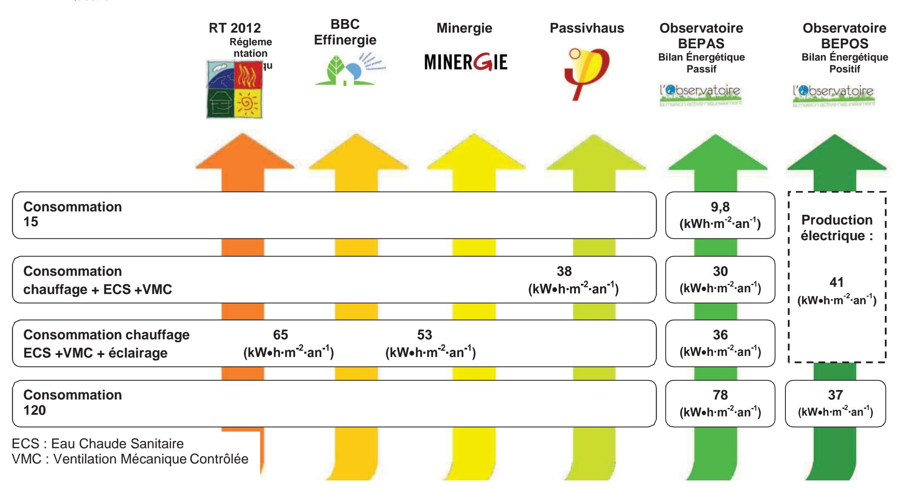
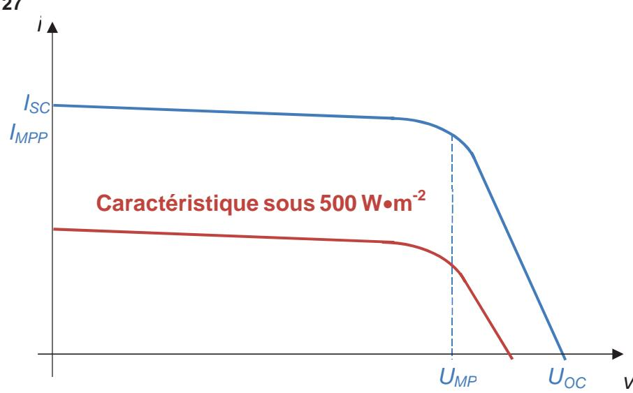
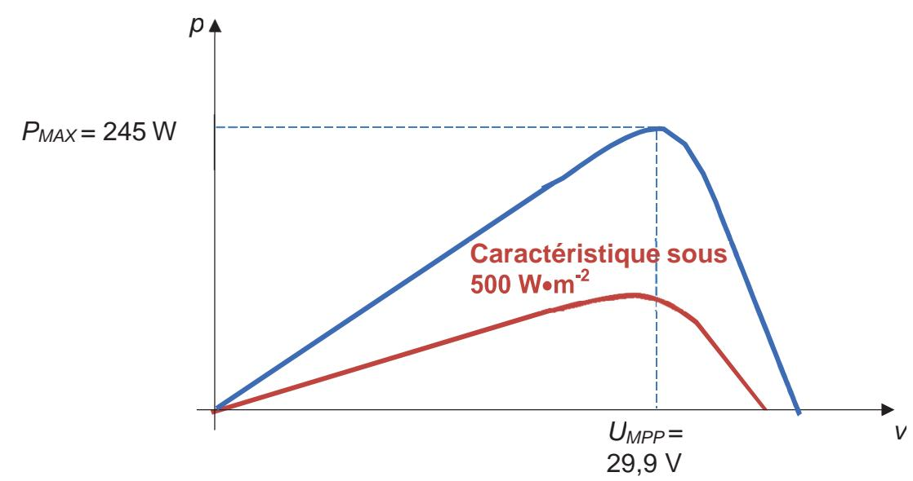
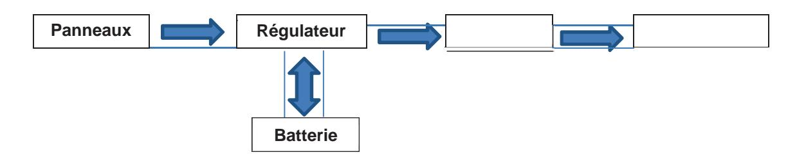
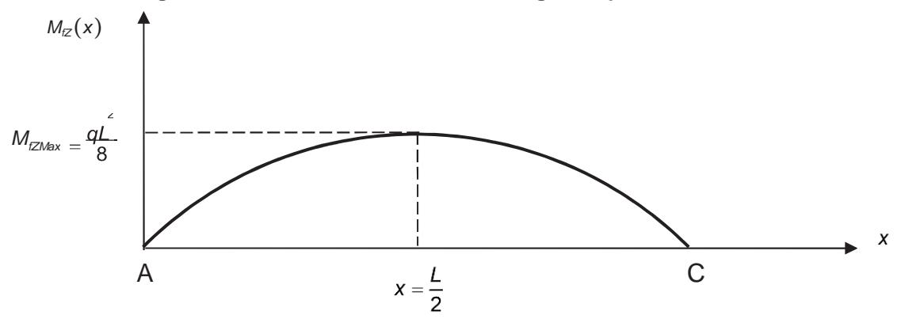
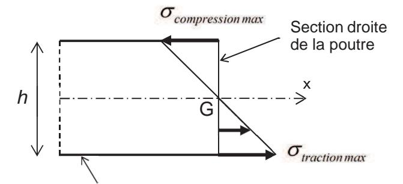
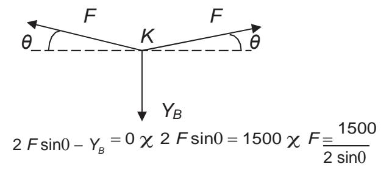

# **Éléments de correction de l'épreuve d'admissibilité « analyse d'un système pluritechnique »**

# **Contraintes environnementales et habitat**

## **Question 1**

Nécessité de réduire les émissions de gaz à effet de serre afin de :

- − limiter le réchauffement climatique de la planète ;
- − économiser les ressources énergétiques non renouvelables.

Lien entre l'habitat individuel et cette problématique : l'habitat individuel contribue au rejet de gaz à effet de serre par la consommation d'énergie pour le chauffage, l'eau chaude sanitaire, l'électricité domestique.

Au sein d'une habitation, les actions qui peuvent contribuer à un meilleur respect de l'environnement sont :

- − limiter la consommation d'électricité (ampoules à économie d'énergie, régulation du chauffage...) ;
- − limiter la consommation d'eau ;
- − installer un dispositif géothermique ;
- − ajouter des producteurs d'électricité utilisant l'énergie solaire ;
- − consommer des produits locaux ;
- − ...

# **Question 2**

Ce projet s'inscrit dans une démarche de construction de Haute Qualité Environnementale (HQE), car il utilise :

- − des matériaux de construction à hautes qualités environnementales (briques, ossature bois) ;
- − des matériaux isolants à hautes performances énergétiques et non toxiques (ouate de cellulose sans sel de Bore, polystyrène, laine minérale) ;
- − une pompe à chaleur ;
- − des panneaux solaires et photovoltaïques ;
- − des DEL ;
- − une toiture végétalisée ;
- − du triple vitrage en bois ;
- − des peintures à faible teneur en COV.

Choix réalisés lors de la construction pour limiter le coût carbone du chantier :

- − intervention d'entrepreneurs locaux ;
- − utilisation de produits locaux pour limiter le transport ;
- − utilisation de matériaux pris sur place (terre du jardin pour construire un mur intérieur, utilisation du sous-sol de l'Observatoire pour la pompe à chaleur géothermique).

# **Question 3**

La réglementation thermique RT 2012 ainsi que les trois labels environnementaux sont respectés, car les consommations de l'Observatoire dans le cadre du BEPAS sont inférieures à celles exigées.

# **Question 4**

La production électrique annoncée (voir présentation de l'Observatoire en début de sujet) est de 41 kW•h•m -2 •an-1. La maison possède un bilan de consommation en énergie primaire positif, car le besoin de l'Observatoire est de 36 kW•h .m -2.an-1 .

La valeur de l'excédent énergétique est donc de 41-36 = 5 kW•h .m -2.an-1 .

La consommation globale (électroménager inclus) de l'Observatoire est de 78-41 = 37 kW•h .m -2.an-1 .

# **DOCUMENT RÉPONSE DR1 CORRIGÉ**

#### Question 4

#### Étude de l'isolation de l'Observatoire

## **Question 5**

On utilise la loi de Fourier pour calculer le flux d'énergie thermique. La résistance thermique est obtenue en additionnant la résistance thermique de chaque matériau.

$$\exists = -\frac{6T}{R_{th}} = -\frac{(19+5)}{8,47} = -2,83 \text{ W} \cdot \text{m}^{-2}$$

#### **Question 6**

On utilise le résultat de la question précédente pour calculer la différence de température entre chaque couche de matériau.

Calcul de la température à l'interface intérieure / BA13 : 19 - 0.13 2.83 = 18.6 °C.

Calcul de la température à l'interface BA13 / lame d'air : 18,6-0,04 2,83=18,5 °C.

On procède de la même façon pour le calcul des autres températures.

Voir corrigé DR2.

# **Question 7**

En utilisant la formule donnée dans l'énoncé  $P = \exp \left\{ \frac{5204,9}{T+273} \right\}$  non calcule les pressions

de vapeur saturante. Voir corrigé DR2.

#### Question 8

En utilisant la formule donnée dans l'énoncé  $P_V = HR$   $P_S$ , on calcule les pressions partielles à l'intérieur et l'extérieur. Voir corrigé DR2.

## **Question 9**

La loi de Fick permet de calculer la quantité de vapeur d'eau  $g: g = -\frac{6P}{R_{Vap}}$ 

La variation de pression partielle à travers la paroi vaut : 6P = 1300 - 395 = 905 Pa.

 $R_{vap}$  s'obtient en additionnant les résistances de chaque matériau :  $R_{vap}$  = 26,82 m  $\Re$  Pa  $\mu$ g . -1

Donc  $q = -33.74 \,\mu\text{g}\cdot\text{m}^{-2}\cdot\text{s}^{-1}$ .

#### **Question 10**

On utilise le résultat de la question précédente pour calculer la différence de pressions entre chaque couche de matériau.

Calcul de la pression partielle à l'interface BA13 / lame d'air : 1300 – 0,48 33,74 = 1 284 Pa.

Calcul de la pression partielle à l'interface lame d'air / OSB : 1284 – 0,08 33,74 = 1 281Pa .

On procède de la même façon pour le calcul des autres pressions partielles.

Voir corrigé DR2.

# **DOCUMENT RÉPONSE DR2 CORRIGÉ**

|                                       | Température interface (°C) | Pression de vapeur saturante (Pa) | Pression partielle (Pa) |
|---------------------------------------|----------------------------------|-----------------------------------------|-------------------------------|
| Intérieur                             | 19                               | 2 166                                   | P vint = 1 300     |
| Interface intérieur / BA13         | 18,6                             | 2 114                                   | P vint = 1 300     |
| Interface BA13 / lame d'air        | 18,5                             | 2 101                                   | 1 284                         |
| Interface lame d'air / OSB         | 18                               | 2 038                                   | 1 281                         |
| Interface OSB / ouate de cellulose | 17,7                             | 2 000                                   | 818                           |
| Interface ouate de cellulose / OSB    | 7,8                              | 1 064                                   | 793                           |
| Interface OSB / polystyrène        | 7,6                              | 1 050                                   | 583                           |
| Interface polystyrène / enduit        | - 4,6                            | 452                                     | 413                           |
| Interface enduit / extérieur          | - 4,6                            | 452                                     | $P_{vext} = 395$              |
| Extérieur                             | - 5                              | 439                                     | P vext = 395       |

## **Question 11**

On constate que les pressions partielles aux différentes interfaces sont toutes inférieures aux pressions de vapeur saturante : il n'y a donc pas de risque de condensation dans la paroi.

# Étude de l'installation de géothermie

# **Question 12**

La quantité de chaleur extraite par unité de temps dans le sous-sol de l'Observatoire à l'aide des sondes vaut  $Q_{extraite} = 7 - 25 + 5 - (30 - 40) = 6 175 \text{ W}$ .

La puissance thermique de la PAC étant de 7 700 W, les sondes permettent de fournir 80 % de cette capacité, ce qui est satisfaisant.

#### Question 13

La conservation de l'énergie sur un cycle se traduit par l'équation suivante :  $W + Q_1 + Q_2 = 0$ .

## **Question 14**

L'énergie utile est celle fournie à la source chaude  $Q_1$ . L'énergie consommée est le travail du compresseur W. Donc l'expression du coefficient de performance de la pompe à chaleur est

$$COP = \frac{|Q_1|}{W}$$
. En utilisant le bilan entropique et le bilan énergétique, on obtient  $COP = \frac{T_o}{T_c - T_f}$ .

# **Question 15**

L'expression du coefficient de performance théorique de la pompe à chaleur montre que l'écart entre la température de la source chaude et celle de la source froide influe sur le rendement de la pompe à chaleur. Plus la température  $T_c$  demandée pour chauffer le circuit de chauffage de la maison est

grande plus le *COP* diminue. D'où l'intérêt d'utiliser un chauffage basse température avec la pompe à chaleur.

## **Question 16**

Sur *n* cycles, le flux s'écrit  $\exists = n \ |Q_1| = n \ W \ COP$ .

### **Question 17**

La puissance électrique  $P_e$  à fournir au moteur est  $P_e = \frac{n}{r_g} = \frac{\exists}{COP} = \frac{\exists}{r_g}$ .

## **Question 18**

Les besoins en chauffage sont évalués à 2,2 kW. On calcule la valeur de la puissance électrique à fournir avec la relation trouvée à la question précédente  $P_{\rm e} = \frac{1}{4,38} = 558 \, \rm W$ . Si on utilisait

uniquement l'énergie électrique pour assurer les besoins en chauffage, il faudrait fournir une puissance de 2,2 kW donc 4 fois plus. L'installation de géothermie permet de limiter les besoins en électricité.

#### **Question 19**

On en déduit le nombre de kW•h sur un an : 558 24  $365 = 4888 \text{ kW} \bullet \text{ h}$  soit un coût annuel de  $4888 \ 0.13 = 635 \in$ .

À l'aide des données économiques fournies dans le sujet, on conclut sur l'économie réalisée par l'utilisation d'une pompe à chaleur par rapport aux autres sources d'énergie.

# **Question 20**

On constate que l'avantage d'une pompe à chaleur par rapport au fioul ou au gaz est sa faible émission de CO2. L'inconvénient est l'utilisation d'un fluide frigorigène qui a un fort impact sur l'effet de serre (R-410a).

## Étude du système de production électrique

#### **Question 21**

Production annuelle d'énergie électrique en kW•h : 56 panneaux 245 Wc = 13,72 kWc soit : 733 13.72 = 10 057 kW•h.

## **Question 22**

La production électrique annoncée pour l'Observatoire est de 41 kWh·m-2·an-1 (valeur donnée en début de sujet), ce que l'on retrouve avec la production annuelle estimée des panneaux de :

$$10.056 / 223 = 45 \text{ kWh} \cdot \text{m}^{-2} \cdot \text{an}^{-1}$$
.

Les ordres de grandeur sont bien similaires.

## **Question 23**

En choisissant de positionner les panneaux solaires pratiquement à l'horizontale, le rayonnement solaire n'est pas optimisé et cela représente une perte en production d'énergie électrique. Cependant, ce choix esthétique n'empêche pas l'Observatoire d'avoir des performances qui le classent dans la catégorie des maisons à énergie positive.

### Question 24

 $U_{MPP}$ : tension présente aux bornes du panneau lorsque ce dernier fournit la puissance maximale.

UOC : tension présente aux bornes du panneau lorsque ce dernier est à vide, c'est la valeur maximale de tension qu'il peut délivrer.

IMPP : courant débité par le panneau lorsque ce dernier fournit la puissance maximale.

ISC : courant débité par le panneau lorsque ce dernier est en court-circuit, c'est la valeur maximale qu'il peut débiter.

# **Questions 25 à 28**

Voir DR3 corrigé

# **Questions 25 et 27**

# **Questions 26 et 28**

# **Question 29**

La puissance crête produite sera de l'ordre de 56 245 = 13 720 W. La puissance maximale d'un onduleur Sunny Boy 3800 est de 4 040 W. Il faut prévoir 4 onduleurs (4 4 040 W > 13 720 W).

## **Question 30**

Synoptique de l'installation et sens des transferts d'énergie :

Dimensionnement de la poutre utilisée pour la ventilation et le contrôle de la qualité de l'air

# Première modélisation

## **Question 31**

Par application du Principe Fondamental de la Statique à la poutre, on obtient :  $\frac{Y}{A} = \frac{Y}{C} = \frac{qL}{2}$ .

Application numérique :  $Y_A = Y_C = 1 200 \text{ N}$  .

# **Question 32**

Expression du moment fléchissant :  $M_{IZ}(x) = \frac{qL}{2}x - \frac{q}{2}x^2$ .

La section la plus sollicitée se situe au milieu de la poutre :  $M_{IZMax} = \frac{1}{8}$ 

Diagramme du moment fléchissant le long de la poutre

# **Question 33**

La contrainte normale en traction est maximale en  $y = -\frac{h}{2}$ :  $O_{Max} = -\frac{M}{I_{GZ}} \frac{y}{Max} = \frac{3qL^2}{8bh^2}$ .

# **Question 34**

Fibres inférieures les plus sollicitées entraction

Pour une poutre de longueur 12 m : OMax= 16 N●mm > 10 MPa . La condition de résistance mécanique n'est donc pas vérifiée.

#### **Question 35**

Pour une poutre de longueur 6 m : OMax= 4 N•mm -2< 10 MPa . La condition de résistance mécanique est donc vérifiée.

#### **Question 36**

Expression de la flèche pour une poutre de longueur 
$$L$$
:  $M(x) = El y''(x) \chi El y''(x) = qL x - q x^2$ .

Par intégration : 
$$EI y (x) = qL x^2 - q x^3 + C$$
. Avec  $y \begin{cases} L \\ = 0 \end{cases}$ , on en déduit  $C = -qL^3$ . D'où :  $EI y (x) = qL x^2 - q x^3 - qL^3$ .

D'où : 
$$EI_{GZ}^{y'}(x) = \frac{qL}{4}x^2 - \frac{q}{6}x^3 - \frac{qL^3}{24}$$

Par intégration : 
$$EI_{GZ} y(x) = \frac{qL}{12} x^3 - \frac{q}{24} x^4 - \frac{qL}{24} x + C_2$$
. Avec  $y(0) = 0$ , on en déduit  $C_2 = 0$ .

D'où: 
$$EI_{GZ} y(x) = \frac{qL}{12} x^3 - \frac{q}{24} x^4 - \frac{qL^3}{24} x$$
.

Pour une poutre de longueur 
$$L = 6$$
 m, la flèche est maximale en  $X = \frac{L}{2}$  et vaut  $y_{maxi} = -\frac{5qL^4}{384El_{GZ}}$ 

## **Question 37**

On utilise le résultat précédent avec L = 6 m.

ymaxi = - 16,6 mm donc cette solution permet d'avoir une flèche maximale acceptable.

## Deuxième modélisation

## Question 38

Par application du Principe Fondamental de la Statique à la poutre, on obtient :  $Y_A = Y_C$  et  $2Y_A + Y_B - qL = 0$ .

## **Question 39**

Expression de la flèche à partir du moment fléchissant :  $M(x) = El y''(x) \chi El y''(x) = Yx - q x^2$ .

Par intégration : 
$$EI_{CZ} y(x) = Y - \frac{x}{2} - \frac{q}{2}x^3 + C$$
 avec  $C$  constante.

Par intégration : 
$$EI_{GZ} y(x) = Y - \frac{x}{2} - \frac{q}{2} x^3 + C$$
 avec  $C$  constante.  
Par intégration :  $EI_{GZ} y(x) = Y - \frac{x^2}{4} - \frac{q}{6} x^4 + Cx + C$  avec  $C$  constante.

## **Question 40**

La déformation de la poutre est symétrique par rapport à (B, y).  $\vec{A}u$  point  $\vec{B}$ , la tangente de la déformée est donc horizontale :  $y \left[ \frac{L}{2} \right] = 0$ .

On utilise la première condition limite  $y_1(0) = 0$  d'où  $C_2 = 0$ .

On utilise la première condition limite 
$$y_1(0) = 0$$
 d'où  $C_2 = 0$ .

On utilise la deuxième condition limite  $y_1 = 0$  d'où l'équation notée (1):  $Y_A = \frac{L^3}{48} = \frac{L^4}{384} + \frac{L}{2} = 0$ .

On utilise la troisième condition limite  $y = \begin{bmatrix} L \\ 1 \end{bmatrix} = 0$  d'où l'équation notée (2) :  $Y_A \frac{L^2}{8} - q \frac{L^3}{48} + C_1 = 0$ .

D'après (1), 
$$C_1 = q \frac{L^3}{192} - \frac{Y_A L^2}{24}$$
. En reportant dans (2) :  $\frac{Y}{A} = \frac{3qL}{16}$ .

En utilisant les équations obtenues à la question 38, on obtient :  $Y_A = \frac{3qL}{16} = Y_C$  et  $Y_B = \frac{5qL}{8}$ .

L'application numérique donne :  $Y_A = Y_C = 450 \text{ N}$  et  $Y_B = 1500 \text{ N}$  .

Ajouter un appui central sous la poutre permet de diminuer la réaction aux extrémités de la poutre. Néanmoins, la réaction à l'appui central est supérieure à la réaction aux extrémités de la poutre sur deux appuis.

#### **Question 41**

L'action  $Y_B$  calculée précédemment se retrouve au niveau du nœud K. L'équilibre du nœud K est décrit par la figure ci-dessous :

## **Question 42**

La hauteur H du poteau doit être la plus petite possible. Si on diminue la hauteur H du poteau, l'angle  $\theta$  diminue ( $\theta$  = arctan(H/6)). D'après l'équilibre du nœud K, on constate que la diminution de l'angle  $\theta$  entraînera l'augmentation de l'effort F dans les câbles.

Conclusion : cette solution risque de solliciter beaucoup les câbles. On pourrait imaginer de créer une vraie structure de treillis pour essayer de minimiser la hauteur du poteau au milieu. Mais pour des raisons esthétiques, cette solution n'a pas été envisagée par l'architecte.

## **Synthèse**

#### Question 43

L'élément principal est la présence de panneaux photovoltaïques qui permettent à l'Observatoire de produire plus d'électricité qu'il n'en consomme. L'utilisation d'une pompe à chaleur ainsi qu'une bonne isolation permettent de limiter la consommation d'énergie électrique. L'utilisation de matériaux naturels comme le bois ainsi que la toiture végétalisée assurent une meilleure intégration dans le paysage. Autres solutions qui auraient pu être utilisées : éolienne, système de récupération et utilisation des

eaux pluviales, dispositif pour le tri des déchets, motorisation des panneaux photovoltaïques...