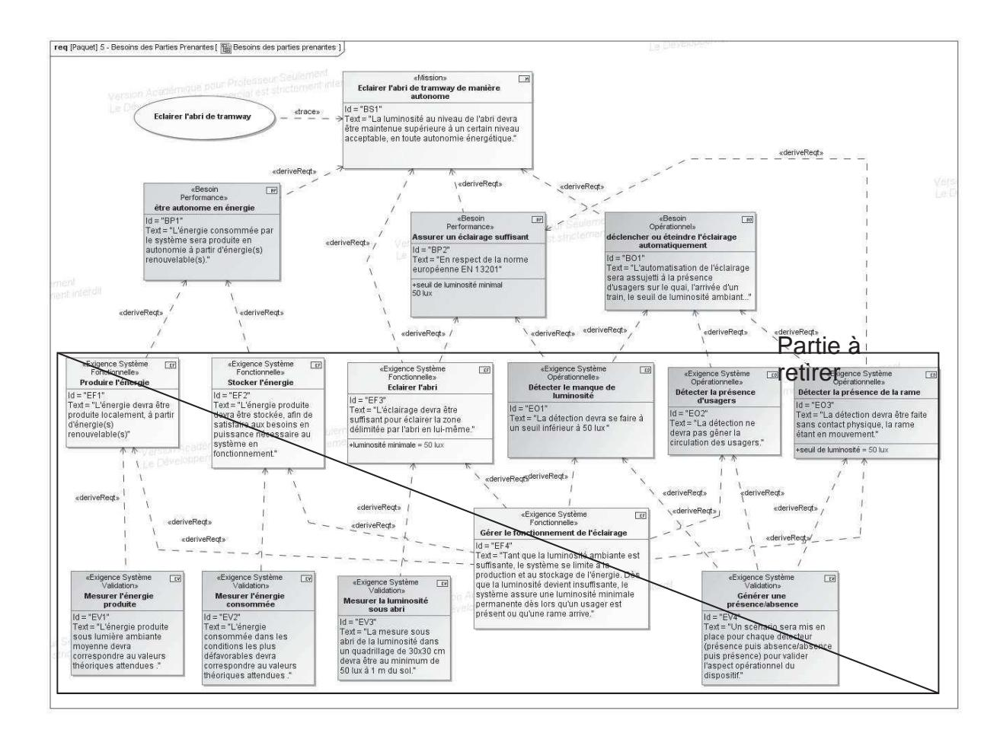
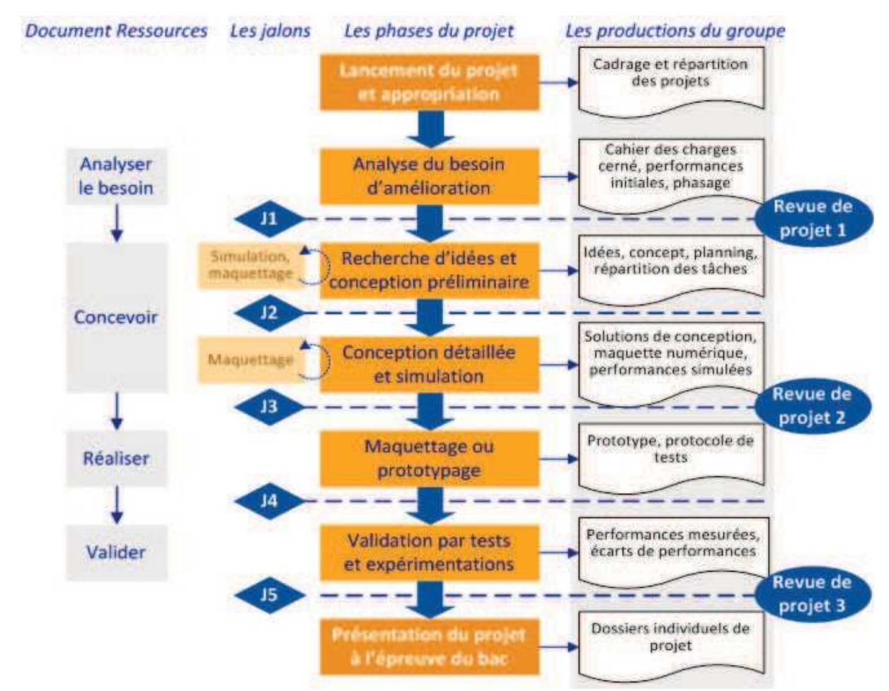
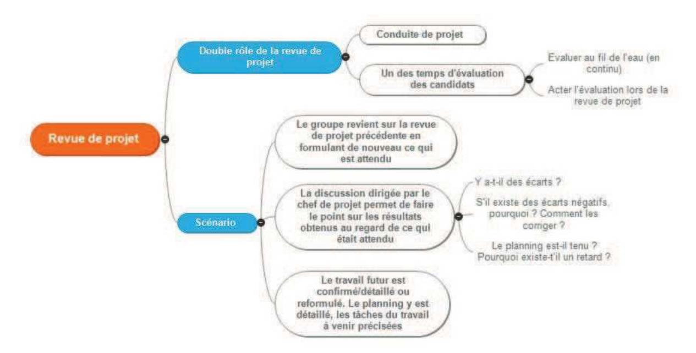
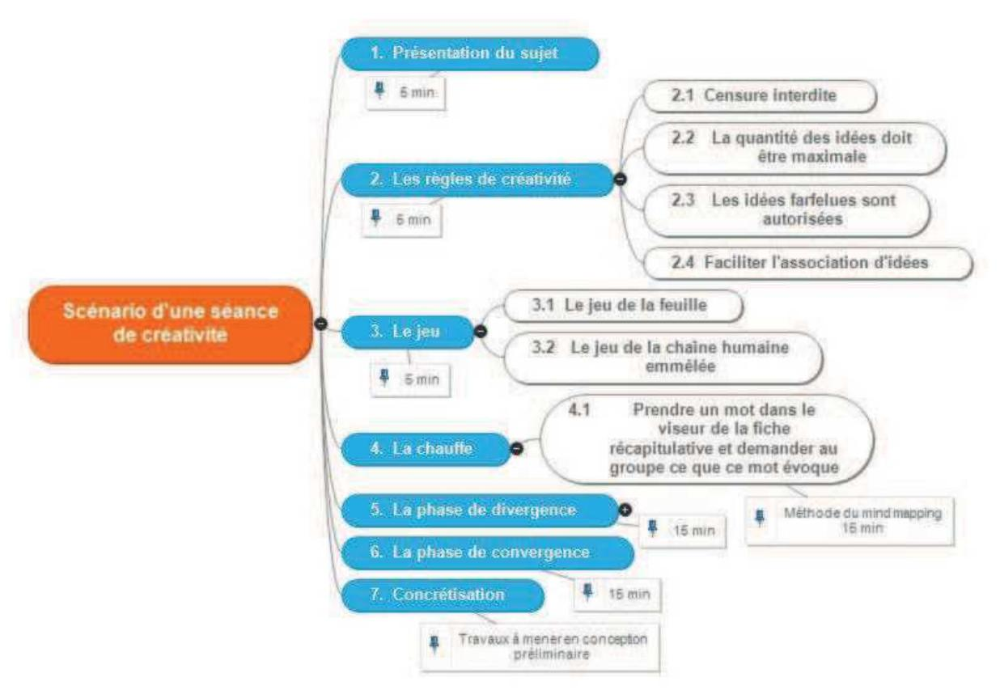

# **Éléments de correction de l'épreuve d'admissibilité « exploitation pédagogique d'un dossier technique » - option énergie**

## **Question 1**

### **La problématique du projet**

Le choix de la problématique est complexe. S'agit-il d'exprimer la problématique initiale qui permet d'énoncer le problème qui génère le projet ou au contraire d'exprimer une problématique technique définissant les solutions technologiques répondant aux exigences fonctionnelles définies dans le cahier des charges ? De quel point de vue doit-elle être exprimée ? Celui du client permet d'identifier des fonctionnalités à ajouter, une ergonomie à améliorer… tandis que le point de vue constructeur permet d'énoncer des objectifs de réduction des coûts, d'amélioration de compétitivité du produit.

Le choix d'une problématique technique présente l'inconvénient de décrire dans son énoncé les solutions techniques à mettre en œuvre. Dans le cadre d'un projet d'évaluation en cycle terminal et pour permettre aux élèves de dérouler l'ensemble des étapes du projet, y compris la phase de recherche de solutions et de créativité, il est indispensable d'exprimer la problématique initiale du projet, celle qui a déclenché le besoin en l'exprimant du point de vue de l'utilisateur ou du client.

Ici, la problématique initiale peut être exprimée de la façon suivante : l'abri de tramway n'est pas éclairé quand la luminosité est faible ce qui génère des problèmes d'insécurité et de risque d'accident pour les usagers qui attendent ou qui descendent du tramway.

### **L'enjeu du projet**

L'enjeu vise à préciser ce qui est recherché à travers la réalisation du projet. Il doit clairement faire apparaître ce qui est en jeu dans le projet.

L'enjeu peut revêtir un caractère sociétal pour améliorer la sécurité, le confort, l'assistance aux personnes…, et un caractère environnemental en exprimant la volonté de réduire l'impact environnemental (pollution, ressource énergétique renouvelable) du système par exemple, ou économique en recherchant à améliorer la compétitivité, innover ou réduire les coûts.

À la lecture des informations disponibles dans le sujet et des éléments du cahier des charges, l'enjeu du projet peut être exprimé en soulignant le caractère sociétal du projet : améliorer le confort visuel et la sécurité des usagers sous l'abri.

## **L'intitulé du projet**

L'intitulé du projet peut être trouvé à partir du nom du système objet du projet ou être composé d'un nom dérivé d'un verbe auquel s'ajoutent une ou des spécificités et un ou plusieurs compléments précisant à quoi il s'applique. L'intitulé à proposer peut être : l'éclairage autonome d'un abri de tramway.

## **Les livrables du projet**

La production finale correspond aux livrables du projet. Le prototype constitue le livrable minimal. On peut lui ajouter des éléments parmi ceux qui ont été nécessaires à sa réalisation.

| Livrables attendus                                 | Phase du projet                |  |  |  |  |
|----------------------------------------------------|--------------------------------|--|--|--|--|
| Comparatif des solutions envisagées et | Conception préliminaire        |  |  |  |  |
| justification de la solution retenue               |                                |  |  |  |  |
| Dossier de réalisation du projet                   | Conception détaillée           |  |  |  |  |
| Maquette                                           | Prototypage, réalisation       |  |  |  |  |
| Protocole de tests et résultats des tests, bilan   | Intégration, tests, validation |  |  |  |  |

Les livrables exigés doivent illustrer les différentes phases du projet de manière à guider les élèves dans l'élaboration de leur présentation du projet.

Il peut donc être attendu :

- − les comparatifs de choix de solutions et d'implantation des composants envisagés, puis les justifications des solutions retenues ;
- − un prototype fonctionnel du système d'éclairage de l'abri ;
- − les protocoles et résultats des essais comparatifs de performances.

**Tâches collectives ou individuelles confiées aux élèves au cours du projet associées aux indicateurs de performance évalués en projet**

|                                                                                                                        |                      |                       | 1 m No | 2 m No | 3 m No |
|------------------------------------------------------------------------------------------------------------------------|----------------------|-----------------------|--------------|--------------|--------------|
| ÉTAPES / TÂCHES                                                                                                        | Compétences          | me horaire Volu | 72,5         | 69,5         | 68           |
| SPÉCIFICATION / PLANIFICATION                                                                                          |                      |                       |              |              |              |
| Prendre connaissance de la globalité du projet                                                                         | CO7.1                | 3                     | x            | x            | x            |
| Définir les exigences système liées au CDC                                                                             | CO7.1                | 3                     | x            | x            | x            |
| Définir et planifier les tâches du projet                                                                              | CO6.1                | 3                     | x            | x            | x            |
| CONCEPTION PRÉLIMINAIRE                                                                                                |                      |                       |              |              |              |
| Rechercher les différentes solutions permettant de réaliser le service attendu « éclairer l'abri de tramway »       | CO6.1 CO7.1          | 4                     | x            |              |              |
| Lister et préciser les avantages et limites des différentes solutions                                                  | CO1.1                | 2                     | x            |              |              |
| Choisir et justifier le choix d'une solution                                                                           | CO1.1 CO6.3 CO7.2 | 1                     | x            |              |              |
| Rechercher les différentes solutions permettant de réaliser l'exigence système « produire l'énergie »               | CO7.1                | 4                     |              | x            |              |
| Lister et préciser les avantages et limites des différentes solutions                                                  | CO2.2 CO6.1          | 3                     |              | x            |              |
| Choisir et justifier le choix d'une solution                                                                           | CO6.3 CO7.2          | 3                     |              | x            |              |
| Rechercher les différentes solutions permettant de réaliser l'exigence système « stocker l'énergie »                | CO6.1 CO7.1          | 4                     |              |              | x            |
| Lister et préciser les avantages et limites des différentes solutions                                                  | CO1.1 CO2.2          | 3                     |              |              | x            |
| Choisir et justifier le choix d'une solution                                                                           | CO1.1 CO6.3 CO7.2 | 3                     |              |              | x            |
| Rechercher les différentes solutions permettant de réaliser l'exigence système « détecter le manque de luminosité » | CO6.1 CO7.1          | 1                     | x            |              |              |
| Lister et préciser les avantages et limites des différentes solutions                                                  | CO1.1 CO2.2          | 1                     | x            |              |              |

| Choisir et justifier le choix d'une solution                                                                                                                                               | CO1.1 CO6.3 CO7.2        | 0,5 | x |   |   |
|--------------------------------------------------------------------------------------------------------------------------------------------------------------------------------------------|-----------------------------|-----|---|---|---|
| Rechercher les différentes solutions permettant de réaliser l'exigence système « détecter la présence de la rame »                                                                      | CO6.1 CO7.1                 | 3   |   | x |   |
| Lister et préciser les avantages et limites des différentes solutions                                                                                                                      | CO1.1 CO2.2                 | 2   |   | x |   |
| Choisir et justifier le choix d'une solution                                                                                                                                               | CO1.1 CO6.3 CO7.2        | 0,5 |   | x |   |
| CONCEPTION DÉTAILLÉE                                                                                                                                                                       |                             |     |   |   |   |
| Définir la structure et les composants permettant de réaliser le service attendu « éclairer l'abri de tramway »                                                                         | CO2.1 CO2.2 CO6.2 CO7.3  | 5   | x |   |   |
| Vérifier, à l'aide d'un logiciel de simulation, si les composants choisis permettent de respecter les données d'éclairement fixées par le besoin de performance « BP2 »              | CO8.1                       | 6   | x |   |   |
| En cas de non-conformité, définir les caractéristiques des composants qui permettraient de respecter les données d'éclairement fixées par le besoin de performance « BP2 »           | CO8.2                       | 5   | x |   |   |
| Définir la structure et les composants de l'exigence système « produire l'énergie »                                                                                                     | CO2.1 CO2.2 CO7.3        | 5   |   | x |   |
| Vérifier, à l'aide d'un logiciel de simulation, si les composants choisis permettent de répondre à l'exigence système « produire l'énergie »                                            | CO8.1                       | 5   |   | x |   |
| En cas de non-conformité, définir les caractéristiques des composants qui permettraient de répondre à l'exigence système « produire l'énergie »                             | CO8.2                       | 5   |   | x |   |
| Définir la structure et les composants de l'exigence système « stocker l'énergie »                                                                                                      | CO2.1 CO2.2 CO 6.2 CO7.3 | 5   |   |   | x |
| Vérifier, à l'aide d'un logiciel de simulation, si les composants choisis permettent de respecter les données fixées par le besoin de performance « BP1 » | CO8.1                       | 6   |   |   | x |
| En cas de non-conformité, définir les caractéristiques des composants qui permettraient de respecter les données fixées par le besoin de performance « BP1 »                         | CO8.2                       | 5   |   |   | x |
| Définir la structure et les composants de l'exigence système « détecter le manque de luminosité »                                                                                       | CO7.4                       | 3   | x |   |   |
| Définir la structure et les composants de l'exigence système « détecter la présence de la rame »                                                                                        | CO7.4                       | 3   |   | x |   |
| Définir la structure et les composants de l'exigence système « détecter la présence de personnes sous l'abri »                                                                          | CO7.4                       | 3   |   |   | x |
| Définir la structure et les composants de l'exigence système « gérer le fonctionnement de l'éclairage »                                                                                 | CO7.4                       | 3   | x |   |   |
| PROTOTYPAGE / RÉALISATION                                                                                                                                                                  |                             |     |   |   |   |
| Réaliser le prototype de l'exigence système fonctionnelle « éclairer l'abri »                                                                                                           | CO9.1                       | 7   | x |   |   |
| Définir le protocole de test, le mettre en œuvre et interpréter les résultats                                                                                                           | CO6.3 CO8.4                 | 6   | x |   |   |
| Comparer les résultats de la simulation avec le comportement réel                                                                                                                          | CO8.0 CO8.3                 | 3   | x |   |   |
| Réaliser le prototype de l'exigence système fonctionnelle « produire l'énergie »                                                                                                        | CO9.1                       | 7   |   | x |   |
| Définir le protocole de test, le mettre en œuvre et interpréter les                                                                                                                     | CO6.3 CO8.4                 | 5   |   | x |   |

| résultats.                                                                                                     |             |   |   |   |   |
|----------------------------------------------------------------------------------------------------------------|-------------|---|---|---|---|
| Comparer les résultats de la simulation avec le comportement réel                                              | CO8.0 CO8.3 | 3 |   | x |   |
| Réaliser le prototype de l'exigence système fonctionnelle « stocker l'énergie »                             | CO9.1       | 7 |   |   | x |
| Définir le protocole de test, le mettre en œuvre et interpréter les résultats                               | CO6.3 CO8.4 | 5 |   |   | x |
| Comparer les résultats de la simulation avec le comportement réel                                              | CO8.0 CO8.3 | 3 |   |   | x |
| Réaliser le prototype de l'exigence système fonctionnelle « détecter le manque de luminosité »              | CO9.1       | 2 | x |   |   |
| Réaliser le prototype de l'exigence système fonctionnelle « détecter la présence de la rame »               | CO9.1       | 3 |   | x |   |
| Réaliser le prototype de l'exigence système fonctionnelle « détecter la présence de personnes sous l'abri » | CO9.1       | 4 |   |   | x |
| Réaliser le prototype de l'exigence système fonctionnelle « gérer le fonctionnement de l'éclairage »        | CO9.1       | 2 | x |   |   |
| QUALIFICATION - INTÉGRATION - VALIDATION                                                                       |             |   |   |   |   |
| Intégrer l'ensemble des prototypes de fonctions, afin de réaliser le prototype global                       | CO9.3 CO8.4 | 4 | x | x | x |
| Définir le protocole de test du prototype global, le mettre en œuvre et interpréter les résultats           | CO6.3 CO8.4 | 4 |   | x | x |
| Valider les solutions mises en œuvre                                                                           | CO6.3       | 2 | x | x | x |

## **Éléments du cahier des charges à confier aux élèves**

La spécification des besoins permet de répondre à plusieurs questions :

- − pourquoi voulons-nous faire cela ? → finalité ;
- − que devons-nous faire ? → mission ;
- − qui est concerné / impacté ? → parties prenantes ;
- − quelles sont les frontières du système ? → contexte ;
- − quels services sont attendus ? → utilisations ;
- − comment cela s'envisage-t-il ? → scénarios ;
- − quels sont les besoins pour répondre à tout cela ? → besoins des parties prenantes.

L'ensemble de tous les diagrammes obtenus durant ce processus constitue le cahier des charges.

Ici, le diagramme de mission principale du système et le diagramme de contexte en phase d'exploitation peuvent être donnés en l'état.

Le diagramme des besoins des parties prenantes sera amputé des exigences système (fonctionnelle, opérationnelle et validation) liées aux trois besoins de performance « être autonome en énergie», « assurer un éclairage suffisant » et « déclencher ou éteindre l'éclairage automatiquement ».

Ce filtre sur les informations données au début du projet doit permettre d'enrichir la phase de recherche de solutions et de créativité.

#### **Nombre d'élèves à mobiliser sur le projet**

Il faut que chaque élève ait au moins une exigence système à traiter avec de la simulation. Une ou plusieurs exigences système, de difficulté moindre, pourront être associées.

Le projet alterne des tâches collectives et individuelles. Un projet de groupe va pouvoir se scinder en travaux individuels, chaque participant se voyant attribuer un lot ; ceci permettra d'assurer une évaluation individuelle dans le cadre d'une démarche collaborative.

Le diagramme des besoins des parties prenantes comporte trois exigences système fonctionnelles et trois exigences système opérationnelles. Les trois premières exigences permettent des activités de simulation. Trois élèves peuvent être mobilisés sur ce projet.

# **Question 2**

Le projet propose une autre façon d'enseigner, plus motivante, plus variée, plus contextualisée et plus concrète. Il conjugue action (élève actif et créatif), travail en équipe et apprentissage en créant des situations de développement de compétences dans le cadre d'une tâche complexe. Il développe une culture de l'engagement pour réaliser concrètement ce qui parait impossible au départ.

La réalisation par l'élève du projet mobilise l'ensemble des compétences des programmes de l'enseignement technologique transversal et l'enseignement spécifique de spécialité.

L'évaluation faite par l'équipe pédagogique lors du déroulement du projet, c'est-à-dire tout au long du projet, porte sur la totalité des compétences de l'enseignement spécifique de spécialité et vise à mesurer la capacité de l'élève à concevoir et valider des solutions techniques.

L'évaluation faite par le jury externe porte sur la capacité du candidat à communiquer sur les choix techniques effectués, leurs justifications d'un point de vue du développement durable et/ou de l'innovation technologique et l'analyse des résultats obtenus. La présentation de l'élève porte sur son travail personnel issu de la répartition des tâches et peut s'appuyer sur les choix collectifs effectués et les résultats globaux obtenus par l'équipe.

La planification permet un pilotage dans le temps dès le lancement du projet. Le synoptique ci- dessous présente les différentes étapes du projet en STI2D et positionne les principales revues de projet mobilisables pour parfaire l'évaluation des performances des élèves. Il est entendu que l'observation de celles-ci au cours du déroulement du projet des performances des élèves reste le cœur de l'évaluation menée par le professeur.

Les revues de projet consistent à réunir le groupe (l'équipe) de projet autour d'une table de réunion. Il n'y a pas de « confrontation » de type jury interrogateur face à des élèves interrogés. Les élèves ne sont pas extraits de la classe ni même du laboratoire. Le temps de projet n'est pas interrompu, les autres élèves travaillent en autonomie.

Le professeur, qui est surtout le chef de projet, fait partie de l'équipe et ne doit pas se positionner en « supérieur » hiérarchique. Le professeur profite des interventions des élèves lors de la revue de projet pour ajuster son évaluation. Les élèves peuvent prendre des notes, il s'agit d'une réunion d'animation du projet.

Les élèves présentent leurs productions numériques sur un ordinateur mis à leur disposition. Pour plus de confort et d'interactivité lors de la réunion, il est peu souhaitable que les élèves s'appuient sur un diaporama, trop statique pour être efficace. Il peut être nécessaire de déplacer la réunion si les échanges s'intéressent par exemple à des essais sur un système difficilement déplaçable.

Les revues de projet sont des temps indispensables au pilotage du projet. Elles s'assurent de l'aboutissement de celui-ci et participent à la construction du dossier de projet avec la contribution de chaque élève.

Tout au long du projet, l'élève constitue un dossier personnel. La deuxième partie de l'épreuve (présentation du projet) est, dans un premier temps, une présentation orale du dossier. Ce n'est pas nécessairement un diaporama. Le candidat peut s'appuyer sur toute une panoplie de supports : carte

heuristique, site internet et éventuellement un diaporama. Les revues de projet doivent permettre aux élèves, futurs candidats, de dégager les éléments clés qui figureront dans leur dossier et donc dans leur support de présentation.

Il est possible de proposer un scénario type de la revue de projet en ayant en tête qu'elle joue un double rôle :

- − de pilotage du projet qui est son rôle initial dans la démarche ;
- − d'évaluation des candidats.
- 1. L'équipe revient sur la revue de projet précédente en reformulant ce qui était attendu.
- 2. La discussion dirigée par le chef de projet fait le point du travail effectué. Les objectifs qui étaient fixés sont-ils atteints ? Les résultats sont-ils positifs, satisfaisants ? Le planning est-il tenu ?
- 3. On précise les objectifs futurs qui seront évalués lors de la revue de projet suivante, le planning est détaillé.

À l'issue de la revue de projet, chacun sait ce qu'il a à faire et connaît ses objectifs. La date de la prochaine revue de projet est confirmée.

Au cours de la revue de projet, le professeur/chef de projet continue d'assurer sa fonction d'enseignement.

# **Question 3**

La séance de créativité irrationnelle proposée peut s'attacher à imaginer une solution au besoin de déclencher ou éteindre l'éclairage automatiquement.

Le lieu de la séance de créativité doit être choisi de manière à créer une rupture avec l'environnement habituel des élèves. Il ne faut pas hésiter à changer complètement d'univers pour mener cette séance. Une zone de créativité implantée dans la salle de documentation peut être le lieu idéal. À défaut, le CDI peut être mobilisé. Le professeur prendra soin de créer une ambiance dans la salle en adéquation avec le thème de la séance. Le professeur, animateur de la séance, prévoit les matériels nécessaires à la prise de note : tableau blanc, feutres, Post-it®, logiciel de carte heuristique. Les participants sont bien-sûr les acteurs du projet, mais le groupe peut être élargi à d'autres élèves de la classe, voire à des élèves d'autres filières de formation (seconde, filières générales, baccalauréat professionnel…). Le groupe peut également intégrer des adultes du lycée, voire des parents d'élèves.

Le scénario de la séance s'établit de la manière suivante :

La phase de divergence : il s'agit d'inciter les participants à produire le plus grand nombre d'idées sur la base des mots-clés repérés dans le viseur. L'animateur est à l'affût de la moindre idée et fait en sorte de réagir à chacune d'elles.

La phase de convergence : il s'agit de faire converger les idées émises, pendant la phase de divergence, vers des solutions crédibles et réalisables.

Cette méthode de recherche de solutions permet d'identifier et d'approfondir toutes les possibilités de réponse à une question, sans préjuger d'une solution. Les jugements préalables, l'éviction d'une piste a priori attachée à une méconnaissance ou à une peur de l'inconnu, sont autant de limites à l'imagination et la créativité dont on a fondamentalement besoin pour nourrir un projet. Être créatif c'est produire beaucoup d'idées, puis sélectionner et extraire les idées pertinentes. Il s'agit ici de développer l'esprit critique et de travailler en groupe à l'émergence et la sélection d'idées.

L'innovation technique est une entreprise collective, où l'on travaille en équipes, où l'on échange, où l'on s'inspire des idées et des productions existantes. La conception est à la fois contrainte par le besoin à satisfaire et créative au sens où le résultat n'est pas prédictible. Elle met en jeu de nombreuses relations dont la plus intéressante en formation entre les co-concepteurs est celle de :

- − coopération pour synchroniser ses objectifs ;
- − co-activité autour de l'objet ;
- − collaboration (on parle de conception collaborative) pour produire les objets ;
- − entraide ;
- − etc.

Il s'agit donc d'une occasion privilégiée de réfléchir collectivement à son environnement, aux usages sociaux des objets et à leurs conséquences.

|             | Nom de la séance de créativité Déclencher et éteindre l'éclairage automatiquement.                                                                                                                                                                 |                                                      |                       |                                                    |                                                                                         |                                                       |  |  |  |
|-------------|-------------------------------------------------------------------------------------------------------------------------------------------------------------------------------------------------------------------------------------------------------|------------------------------------------------------|-----------------------|----------------------------------------------------|-----------------------------------------------------------------------------------------|-------------------------------------------------------|--|--|--|
|             | Caractéristiques                                                                                                                                                                                                                                      | Acteurs                                              |                       | Domaine                                            | Rôle                                                                                    | Endroit                                               |  |  |  |
| CADRE       | Le sujet de la séance est le maintien d'une luminosité suffisante en toutes circonstances                                                                                                                                           | Le système s'adresse aux usagers du tramway | domaine des commun | Le système est utilisé dans le transports en | Le produit est utilisé pour améliorer le confort et la sécurité des usagers | Le système est utilisé sur des abris de tramway |  |  |  |
| RÉSULTATS   | Décrire les types de résultats attendus : solutions au problème de manque de luminosité sous l'abri ; − description de nouvelles solutions en rupture avec l'existant. − Format des résultats souhaités : maquette, dessin, prototype. |                                                      |                       |                                                    |                                                                                         |                                                       |  |  |  |
| CONTRAINTES | consommations d'énergie actuelles.                                                                                                                                                                                                                    | La solution trouvée ne doit pas augmenter les        |                       | luminosité, éclairage…                             | Viseur Automatique, autonomie, énergie, renouvelable,                                |                                                       |  |  |  |

# **Question 4**

Il s'agit pour cette séquence, dans le cadre d'un mini projet, d'illustrer deux étapes essentielles de la démarche de projet : la conception préliminaire et la conception détaillée.

Cette séquence vise le développement des compétences :

- − CO7ee1 Participer à une démarche de conception dans le but de proposer plusieurs solutions possibles à un problème technique identifié en lien avec un enjeu énergétique ;
- − CO7ee2 Justifier une solution retenue en intégrant les conséquences des choix sur le triptyque Matériau – Énergie – Information ;
- − CO7ee3-4 Définir la structure, la constitution d'un système en fonction des caractéristiques technico-économiques et environnementales attendues. Définir les modifications de la structure, les choix de constituants et du type de système de gestion d'une chaîne d'énergie afin de répondre à une évolution d'un cahier des charges ;
- − CO8ee1 Renseigner un logiciel de simulation du comportement énergétique avec les caractéristiques du système et les paramètres externes pour un point de fonctionnement donné ;
- − CO8ee2 Interpréter les résultats d'une simulation afin de valider une solution ou l'optimiser ;
- − CO9ee1 Expérimenter des procédés de stockage et de transformation d'énergie pour aider à la conception d'une chaîne d'énergie.

Les élèves travaillent sur un support unique, un drone, avec l'objectif d'augmenter de 10 % son autonomie tout en maintenant le même niveau de performance. Quatre groupes de quatre élèves sont constitués pour mener à bien ce travail. Les résultats des travaux de recherche de solutions et de conception pourront être confrontés au cours de revues de projet.

Au préalable, les méthodes de simulation multiphysique d'autonomie d'une batterie auront été travaillées en enseignement technologique transversal au cours du thème de séquence « solutions constructives et comportement de l'énergie dans les systèmes mécatroniques ». L'évaluation de la performance des élèves prendra appui sur les indicateurs de la grille d'évaluation associée à l'épreuve de revue de projet pour les six compétences identifiées précédemment.

|                  |                                                                                                                                                                                                                                                                                      | Mini projet                                                                                                                  | Illustration des étape                                                                                         | es de co                                    | nception prél                                         | iminaire et conception                                                                                                                                                                                                                                              | détaillée d'un projet  |                    |   |  |
|------------------|--------------------------------------------------------------------------------------------------------------------------------------------------------------------------------------------------------------------------------------------------------------------------------------|------------------------------------------------------------------------------------------------------------------------------|----------------------------------------------------------------------------------------------------------------|---------------------------------------------|-------------------------------------------------------|---------------------------------------------------------------------------------------------------------------------------------------------------------------------------------------------------------------------------------------------------------------------|------------------------|--------------------|---|--|
|                  | Centres d'intérêt abordés dans la séquence (pas plus de                                                                                                                                                                                                                              |                                                                                                                              |                                                                                                                |                                             | Classe de 32 élèves EE / effectif du groupe 16 élèves |                                                                                                                                                                                                                                                                     |                        |                    |   |  |
|                  | 1                                                                                                                                                                                                                                                                                    | 0.0                                                                                                                          |                                                                                                                | ockage et distribution de l'énergie et rése |                                                       |                                                                                                                                                                                                                                                                     | 3                      |                    |   |  |
|                  | 2                                                                                                                                                                                                                                                                                    |                                                                                                                              | Efficacité énergétique                                                                                         | passive                                     |                                                       |                                                                                                                                                                                                                                                                     |                        |                    |   |  |
|                  | 3                                                                                                                                                                                                                                                                                    | i l                                                                                                                          |                                                                                                                |                                             |                                                       |                                                                                                                                                                                                                                                                     |                        |                    |   |  |
|                  | Nombre de semaines 2 semaines                                                                                                                                                                                                                                                        |                                                                                                                              |                                                                                                                |                                             | tilisation de la DHG dans 3 heures en classe entière  |                                                                                                                                                                                                                                                                     |                        |                    |   |  |
|                  | Horaire total de l'élève 16                                                                                                                                                                                                                                                          |                                                                                                                              | heures                                                                                                         | l'é                                         | etablissement 6 he                                    |                                                                                                                                                                                                                                                                     | heures en groupes      |                    |   |  |
|                  | Horaire élève CE * 4                                                                                                                                                                                                                                                                 |                                                                                                                              | h                                                                                                              | Activités en groupes allégés                |                                                       |                                                                                                                                                                                                                                                                     |                        |                    |   |  |
|                  | Horaire élè                                                                                                                                                                                                                                                                          | Horaire élève groupe * 12                                                                                                    |                                                                                                                | h                                           | drone                                                 |                                                                                                                                                                                                                                                                     |                        |                    |   |  |
|                  |                                                                                                                                                                                                                                                                                      | С                                                                                                                            | ours                                                                                                           |                                             | CI                                                    | CI 3 / CI 4                                                                                                                                                                                                                                                         |                        |                    |   |  |
|                  | Sem 1 Présentation du mini projet et énoncé des objectifs                                                                                                                                                                                                                            |                                                                                                                              |                                                                                                                |                                             | Heures élèves                                      | 6 h                                                                                                                                                                                                                                                                 |                        |                    |   |  |
| ORGANISATIO N |                                                                                                                                                                                                                                                                                      | technologiqu travail collab ENT, base of d'échange, o opérationnel 1.1.5 Anima ou managen 2.1.1 Structu | ion d'une revue de projet nent d'une équipe projet ure fonctionnelle d'une ergie, graphe de structure | 2 h                                         | Objectifs                                             | L'objectif général de cette séquence est la recherche de solutions technologiques permettant une efficacité énergétique du système optimale. Les outils de planification d'ur projet seront mis en œuvre dans le but de familiariser les élèves à leur utilisation. |                        |                    |   |  |
|                  |                                                                                                                                                                                                                                                                                      |                                                                                                                              | ures d'alimentation en i-transformateur                                                                     |                                             | Nb élèves                                             | 4                                                                                                                                                                                                                                                                   | 4                      | 4                  | 4 |  |
|                  |                                                                                                                                                                                                                                                                                      |                                                                                                                              |                                                                                                                |                                             | Nb d'îlots                                            | 1                                                                                                                                                                                                                                                                   | 1                      | 1                  | 1 |  |
|                  | Sem 2  2.3.1 Efficacité énergétique passive d'un système  2.4.3 Validation du comportement énergétique d'une structure par simulation  2.5.1 Constituants matériels et logic associés aux fonctions techniques assurées par la chaîne d'énergie et répondant aux performances attend |                                                                                                                              |                                                                                                                | Heures élèves                            | 6 h                                                   |                                                                                                                                                                                                                                                                     |                        |                    |   |  |
|                  |                                                                                                                                                                                                                                                                                      | énergétique simulation                                                                                                    | d'une structure par                                                                                            | 2 h                                         | Objectif                                              | Le paramétrage et l'analyse des résultats donnés par un logiciel de simulation multi physique doivent aider au choix des constituants de la chaîne d'énergie.                                                                                                       |                        |                    |   |  |
|                  |                                                                                                                                                                                                                                                                                      | associés au                                                                                                                  | c fonctions techniques                                                                                         |                                             | Nb élèves                                             | 4                                                                                                                                                                                                                                                                   | 4                      | 4                  | 4 |  |
|                  |                                                                                                                                                                                                                                                                                      | assurées pa répondant a                                                                                                   | surées par la chaîne d'énergie et pondant aux performances attendues                                           |                                             | Nb d'îlots                                            | 1                                                                                                                                                                                                                                                                   | 1                      | 1                  | 1 |  |
|                  |                                                                                                                                                                                                                                                                                      | Évaluation                                                                                                                   |                                                                                                                |                                             |                                                       | À partir de la grille d'évaluation de l'épreuve de revue de projet                                                                                                                                                                                                  |                        |                    |   |  |
| no               |                                                                                                                                                                                                                                                                                      | Répartitio                                                                                                                   | n des élèves                                                                                                   |                                             | Semaines                                              |                                                                                                                                                                                                                                                                     | Rotation des activités | en groupes allégés |   |  |
| Rotation s    | Classe de 32 élèv                                                                                                                                                                                                                                                                    |                                                                                                                              | n 2 groupes allégés de 16 e 4 élèves.                                                                       | élèves,                                     | S1 S2                                              | Pas de rotation des groupes                                                                                                                                                                                                                                         |                        |                    |   |  |