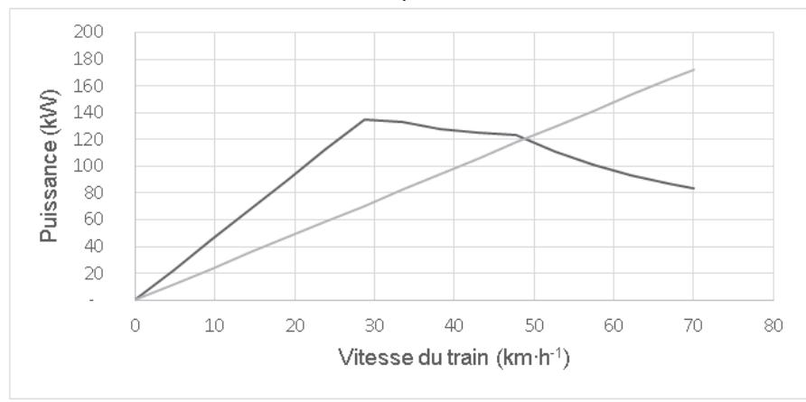
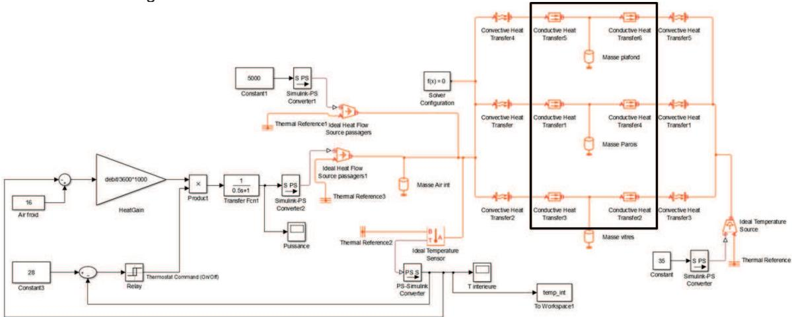
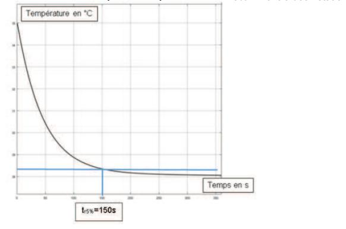
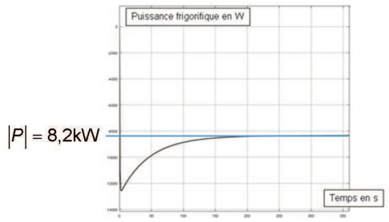
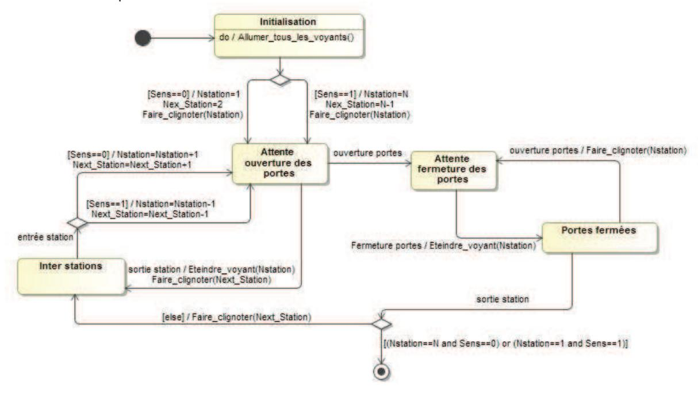
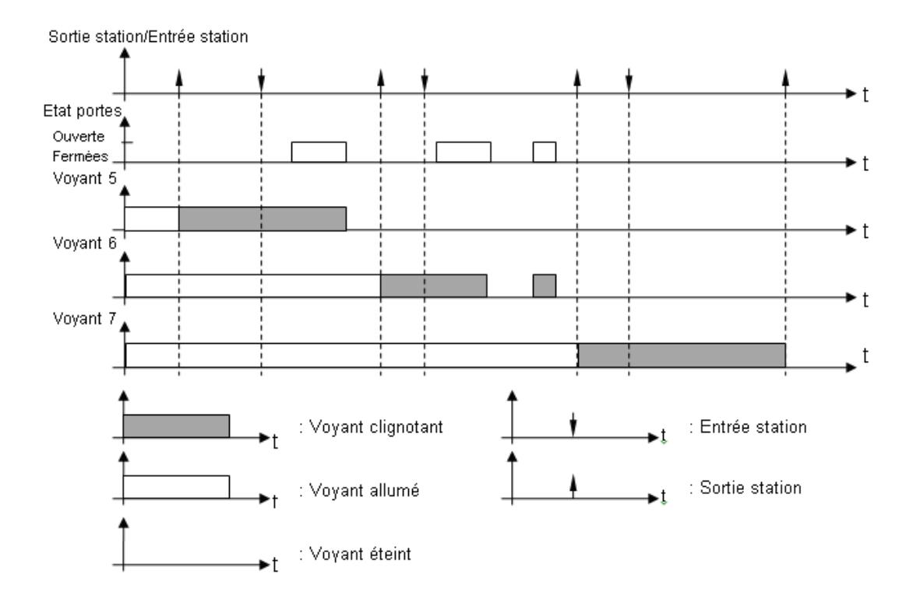
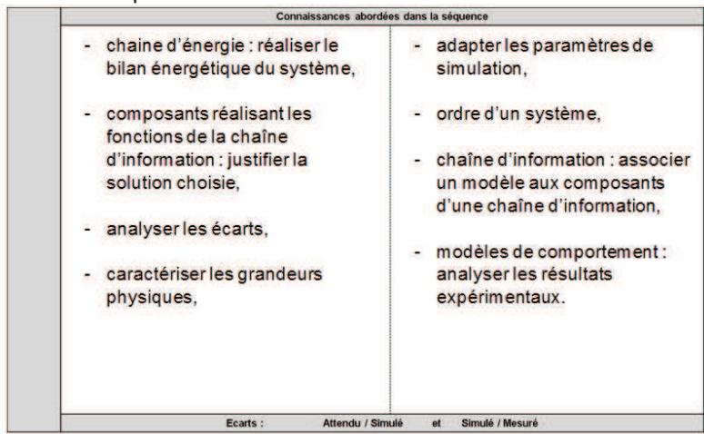
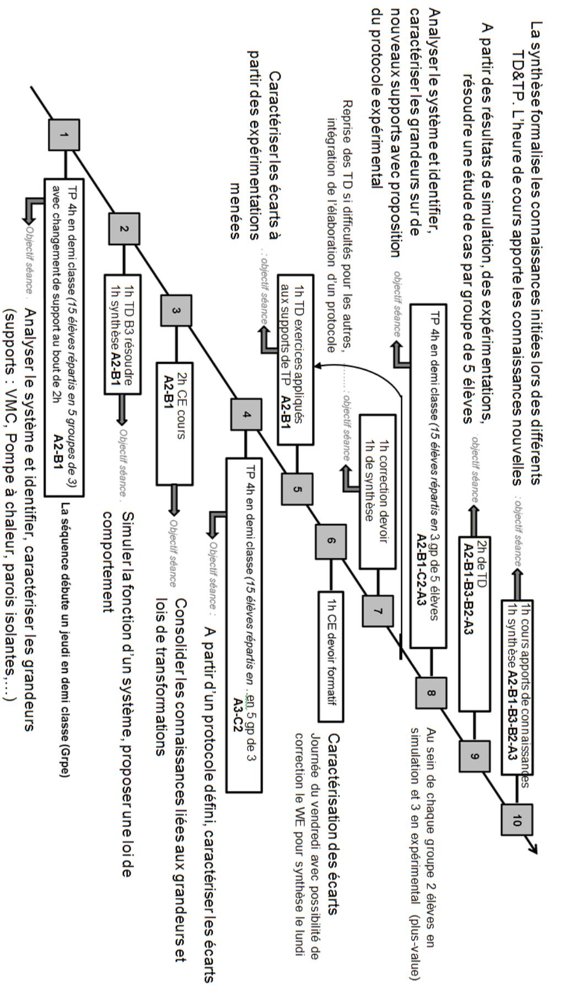
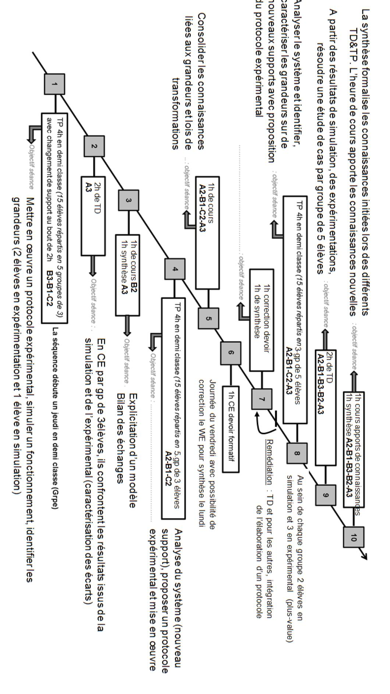

# Éléments de correction de l'épreuve « Analyse et exploitation pédagogique d'un système pluritechnique »

Métro - Rame MF 2000.

# RESPECT DES EXIGENCES LIÉES À LA CIRCULATION DES TRAINS et À la consommation en Énergie (exigences 1.1 et 1.2)

**Objectif :** vérifier le dimensionnement du couple maximal du moteur et valider le franchissement des portions en pente maximale

### **Question 1**

En supposant le roulement sans glissement des roues sur le rail, donner l'expression de la vitesse du train  $V_t$  en fonction de  $\omega_r$  et R, puis en fonction de  $\omega_m$ , R et N.

$$V_t = R.\omega_r = R\frac{\omega_m}{N}$$

### Question 2

En déduire l'expression et la valeur numérique de la masse équivalente  $M_d$  correspondant aux inerties des éléments en rotation en fonction de  $J_{re}$ ,  $J_m$ , N et R.

$$Ec = \frac{1}{2}M_{6} \cdot V_{t}(t)^{2} + \frac{20}{2}J_{re} \cdot \omega_{r}(t)^{2} + \frac{12}{2}J_{m} \cdot N^{2} \cdot \omega_{r}(t)^{2}$$

$$M_d = (20J_{re} + 12J_m \cdot N^2) \cdot \frac{1}{R^2} = 12940$$
kg

### **Question 3**

Montrer que l'expression de la puissance  $P_g$ , due à l'action de la pesanteur sur le train en montée lorsque la pente forme un angle  $\alpha$  avec l'horizontale est :

$$P_q = P (pesanteur \rightarrow train / R_q) = -M_6.g.V_t \sin \alpha$$

$$P_a = M_6 \cdot \overrightarrow{g} \cdot V_t(t) \cdot \overrightarrow{x} = -M_6 \cdot g \cdot V_t \sin \alpha$$

### **Question 4**

Montrer que l'expression de la puissance  $P_{av}$ , due à l'effort de résistance à l'avancement est :

$$P_{av} = P(frottements \rightarrow train/R_g) = -(A \cdot V_t(t) + B \cdot V_t(t)^2 + C \cdot V_t(t)^3)$$

Lorsque le train se déplace sur un tronçon de ligne horizontal en tunnel, il existe une force de résistance à l'avancement, tenant compte à la fois des frottements internes au système *train* et des frottements externes s'appliquant sur ce système. La norme de cet effort tangent à la roue est modélisée par la relation :  $R_{av} = A + B \cdot V_t(t) + C \cdot V_t(t)^2$ , avec :

| Charge du train                           | Α       | В                      | С                                      |
|-------------------------------------------|---------|------------------------|----------------------------------------|
| Train avec 6 voyageurs par m 2 | 3 750 N | 90 N·s·m -1 | 11,7 N·s 2 ·m -2 |

L'effort tangent à la roue est orienté dans le sens opposé au déplacement du train :

$$P_{\mathsf{av}} = \overrightarrow{R_{\mathsf{av}}} \cdot V_t(t) \cdot \overrightarrow{X} = - \Big( A \cdot V_t(t) + B \cdot V_t(t)^2 + C \cdot V_t(t)^3 \Big)$$

### Question 5

En déduire l'expression littérale de la puissance  $P_m$  d'un moteur sachant qu'il y a 12 moteurs dans un train

$$P_{m} = \frac{1}{12} \cdot \left[ \left( M_{6} + M_{d} \right) \cdot V_{t}(t) \cdot \Gamma_{t} + M_{6} \cdot g \cdot V_{t}(t) \cdot \sin \alpha + A \cdot V_{t}(t) + B \cdot V_{t}(t)^{2} + C \cdot V_{t}(t)^{3} \right]$$

### **Question 6**

Déterminer l'expression du couple moteur en fonction de  $P_m$  et  $V_t$ . En déduire la valeur du couple maximal développé par le moteur lors de cette phase d'accélération.

$$C_m = \frac{P_m}{\omega_m} = \frac{P_m \cdot R}{N \cdot V_t}$$

$$P_m = 125 \text{ kW, donc } C_m = 824 \text{ N·m}$$

### Question 7

En déduire à l'aide d'un tracé sur le document réponse DR1, la vitesse maximale du train en régime permanent sur une pente à 6 %.

Le point de fonctionnement du train correspond à l'intersection de la droite d'équation

$$P_{\rm m} = \beta . M_{\rm 6} . V_{\rm t}(t)$$
 avec la caractéristique du document DR1 :

Dans ces conditions, la vitesse du train est de 49 km·h-1.

### **Question 8**

Vérifier le dimensionnement du couple maximal du moteur choisi ainsi que le respect des deux exigences liées à la circulation des trains.

Le couple maximal 824 N·m est bien inférieur au couple maximal de 885 N·m et permet donc de répondre à l'exigence 1.1. En ce qui concerne l'exigence 1.2, un train peut monter une pente à 6% avec une vitesse réduite de  $49 \text{ km} \cdot \text{h}^{-1}$ .

Les exigences liées à la circulation des trains sont donc respectées.

### RESPECT DES EXIGENCES LIÉES À LA SECURITE DES USAGERS

**Objectifs**: choisir un matériau pour les semelles des blocs de freinage, déterminer la décélération subie par les passagers lors d'un freinage d'urgence et valider la distance de freinage du train.

### **Question 9**

Définir la frontière de l'isolement réalisé et préciser le théorème utilisé pour obtenir cette relation. Les hypothèses à mettre en place et le choix de l'axe de projection sont à justifier. À partir de cette

relation, expliciter  $\|\vec{F}(2 \to 1)\|$  en fonction de la pression de l'air dans les cylindres de freinage  $p_{air}$ , du diamètre des cylindres  $p_{air}$  et de l'angle  $p_{air}$ .

Isolement du solide 1 – Bilan des Actions Mécaniques Extérieures :

- action de l'air sur le piston  $\vec{F}(air \rightarrow 1)$ , selon  $-\vec{z}$
- action de la tige de régleur de timonerie sur la came  $\vec{F}(2 \rightarrow 1)$ , selon  $\vec{x}_1$
- action du corps du cylindre sur la came  $\vec{F}(0 \rightarrow 1)$

En l'absence de frottement, l'action mécanique du cylindre sur le piston n'a pas de composante selon l'axe  $\vec{z}$ . De plus, les masses et inerties des solides étant négligées, le théorème à utiliser est le théorème de la résultante statique en projection sur l'axe  $\vec{z}$ .

### **Question 10**

Isoler le solide (2), réaliser le bilan des actions mécaniques extérieures appliquées à ce système et écrire le théorème de la résultante statique en projection sur l'axe  $\vec{X}$ . En déduire une relation donnant l'effort presseur de freinage  $N_{pi}$  en fonction de la pression de l'air dans les cylindres de freinage  $p_{air}$ , du diamètre des cylindres  $p_{air}$  et de l'angle  $p_{air}$ .

Isolement du solide 2 - Bilan des Actions Mécaniques Extérieures :

- action de la came sur la tige de régleur de timonerie  $\vec{F}(1 \to 2)$ , appliquée au point B et portée par le vecteur  $\vec{x}_1$  (selon  $-\vec{x}_1$ ).
- action du corps du cylindre sur la tige de régleur de timonerie  $\vec{F}(0 \to 2)$  pas de composante selon l'axe  $\vec{x}$  car la liaison est parfaite,
- action de la semelle de frein sur la tige de régleur de timonerie  $\vec{F}(\text{semelle} \rightarrow 2)$ .

TRS selon 
$$\vec{x}$$
:  $\vec{F}(semelle \rightarrow 2) \cdot \vec{x} + \vec{F}(1 \rightarrow 2) \cdot \vec{x} = 0$ 

$$\vec{F}(\text{semelle} \to 2) \cdot \vec{x} = -\vec{F}(1 \to 2) \cdot \vec{x} = \|\vec{F}(1 \to 2)\| \cdot \cos \alpha = \|\vec{F}(2 \to 1)\| \cdot \cos \alpha$$
D'où:

$$N_{pi} = \vec{F}(2 \rightarrow semelle) \cdot \vec{x} = -\vec{F}(semelle \rightarrow 2) \cdot \vec{x} = \vec{F}(1 \rightarrow 2) \cdot \vec{x} = -\|\vec{F}(2 \rightarrow 1)\| \cdot \cos \alpha$$
 Et:

Ce qui conduit à la relation demandée :

$$N_{pi} = \frac{N_{air}}{\sin \alpha} \cdot \cos \alpha = \frac{N_{air}}{\tan \alpha} = \frac{p_{air} \cdot \pi \cdot d_{cylindre}^2}{4 \cdot \tan \alpha}$$

### **Question 11**

En étudiant le tableau **4**, choisir un matériau pour les semelles des blocs de freinage. Ce choix devra être justifié en quelques mots. Les critères liés à la sécurité seront considérés comme prédominant par rapport aux critères liés au confort.

Le matériau fritté est choisi pour son coefficient de frottement élevé, son insensibilité à l'humidité et à la température et sa durée de vie longue. Un seul inconvénient : le coût.

### **Question 12**

Pour cette valeur de coefficient de frottement, calculer numériquement l'effort de freinage  $T_n$  appliqué sur chacune des roues du train et en déduire l'effort retardateur  $T_r$  total appliqué au train lors du déclenchement d'une phase de freinage d'urgence.

Pour les motrices :  $T_r$  = -9 713 N Pour les remorques :  $T_r$  = -11 750 N

Or, il y a 6 BFC par remorque et 8 BFC par motrice, d'où :  $T_c = -6x2x11750 - 8x3x9713 = 398571 \text{ N}$ 

### **Question 13**

Déterminer la décélération  $\Gamma_t$  du train en fonction de l'effort retardateur total  $T_r$ . Faire l'application numérique.

Les efforts autres que l'effort de freinage étant négligés :

$$\Gamma_t = \frac{T_r}{M_{totale\_train}} = -2m \cdot s^{-2}$$

### **Question 14**

Déterminer la distance parcourue par le train entre le déclenchement du freinage d'urgence par le conducteur et l'arrêt total du train. Effectuer l'application numérique.

$$V_t(t) = \Gamma_t \cdot t + V_0 \text{ (car } V_t(0) = V_0 \text{) et } x(t) = \Gamma_t \cdot \frac{t^2}{2} + V_0 \cdot t \text{ (car } x(0) = 0 \text{)}$$

Le train est à l'arrêt à l'instant  $t_a$  avec  $V_t(t_a) = 0$ , soit  $t_a = -\frac{V_0}{\Gamma_t}$ 

$$x(t_a) = \Gamma_t \cdot \frac{t_a^2}{2} + V_0 \cdot t_a = \frac{V_0^2}{2 \cdot \Gamma_t} - V_0 \cdot \frac{V_0}{\Gamma_t} = -\frac{V_0^2}{2 \cdot \Gamma_t} = 92 \text{ m}$$
D'où:

### **Question 15**

En déduire la nouvelle valeur de la distance parcourue par le train entre le déclenchement du freinage d'urgence par le conducteur et l'arrêt total du train.

La rame se déplace à vitesse maximale pendant une seconde avant le début du freinage, soit une distance parcourue de 19,4 m et donc une distance de freinage totale de 111,5 m.

### **Question 16**

Evaluer et commenter les écarts entre les performances attendues et les performances calculées du système de freinage d'urgence du train MF 2000.

- Décélération égale à 2 m⋅s-2 : exigence 2.2 validée,
- Distance de freinage inférieure à 180 m : exigence 2.1 validée.

### RESPECT DES EXIGENCES LIÉES au confort du passager

**Objectif** : valider le dimensionnement du groupe de ventilation réalisé par le constructeur en termes de puissance frigorifique et de température de soufflage.

### **Question 17**

Exprimer le flux de puissance thermique résultant des sources de chaleurs constantes  $\phi_{solaire\_p \otimes sager} = \phi_{solaire} + \phi_{passager} = S_v \cdot \phi_{solaire} \cdot 10\% + 80 \cdot P_{pass}$ =  $13 \times 800 \times 0.1 + 80 \times 90 = 8240 W$ 

### **Question 18**

À partir des données, exprimer le coefficient de transmission thermique du matériau qui compose les parois verticales noté  $K_{pv}$ . Faire l'application numérique.

$$K_{pv} = \frac{1}{0,04 + 0,113 + \frac{0,002}{230} + \frac{0,06}{0.05} + \frac{0,002}{0.044}} = \frac{1}{1,40} = 0,71W \cdot {}^{\circ}C^{-1} \cdot m^{-2}$$

### **Question 19**

Exprimer le flux thermique  $\phi_{paroi\_opaque\_verticale}$  qui traverse les parois opaques verticales. Donner ensuite l'expression de  $\phi_{paroi\_opaque}$ , flux de chaleur traversant l'ensemble des parois non vitrées de la voiture. Faire l'application numérique.

$$Φ_{paroi\_opaque\_verticde} = K_{pv} \cdot S_{pv} \cdot \Delta T = 0.71 \times 29 \times (35 - 28) = 144.13 W$$

$$Φ_{παροι\_οπαθυε} = Φ_{paroi\_opaque\_verticde} + Φ_{plafond} + Φ_{plancher}$$

$$= 144.13 + 0.68 \times 37.5 \times (35 - 28) + 0.65 \times 37.5 \times (35 - 28) = 494 W$$

### **Question 20**

Déterminer la valeur de  $P_{clim}$  permettant de garantir le respect de l'exigence 3.1 pour la température intérieure de la voiture. Faire l'application numérique.

$$P_{clim} = 8240 + 481 + 2.5 \cdot 13 \cdot (35 - 28) + 0.004 \cdot 80 \cdot 1220 \cdot (37 - 28) = 12.4 \text{ kW}$$

### **Question 21**

Déterminer la valeur de température de soufflage  $T_c$ . Conclure sur la possibilité de refroidir la voiture avec la ventilation choisie.

$$T_c = 28 - \frac{12400}{1220 \cdot \frac{2900}{3600}} = 16 \, ^{\circ}\text{C}$$

Cette température correspond à celle fournie par le groupe de refroidissement (16°C), la simulation conduit donc à penser que le refroidissement sera assuré.

### **Question 22**

Entourer sur le DR**3** la partie du modèle dans laquelle les caractéristiques thermiques des matériaux doivent être renseignées. Préciser la fonction du bloc « Convective Heat Transfer ».

Le bloc « Convective Heat Transfer » correspond à la modélisation du phénomène de convection, échange thermique entre la surface et le fluide en mouvement.

### **Question 23**

À partir de la courbe tracée sur le DR**2**, représentant l'évolution de la température intérieure de la voiture lors de la mise en route de la climatisation, déterminer graphiquement le temps de réponse à 5% du modèle. Effectuer sur la copie les éventuels calculs nécessaires.

( ) 35- 28 × *,*950 = *,*656 °*C* . Sur la courbe on lit pour une température de 28.35°C un temps de réponse à 5% de 150 s.

Le critère n'est pas respecté car t5%> tentre deux stations

### **Question 24**

À partir de la courbe tracée sur le DR**4**, représentant la puissance frigorifique instantanée, déterminer graphiquement la puissance moyenne en régime établi délivrée par la climatisation. Comparer ce résultat aux caractéristiques de la climatisation choisie et conclure.

La puissance moyenne est autour des 8,2 kW, cette valeur est inférieure à la valeur de la climatisation choisie.

## **Question 25**

À partir des résultats obtenus dans cette partie, conclure sur le respect de l'exigence 3.1 par la ventilation choisie par le constructeur.

La ventilation constructeur souffle un air de 16 °C correspondant aux conditions de simulation. Le résultat obtenu montre qu'en régime établi la puissance frigorifique nécessaire serait de 8,2 kW. En considérant alors un fonctionnement de la ventilation à plein régime (12 kW), on peut espérer un maintien de la température souhaitée malgré les perturbations liées aux arrêts en station. Le critère associé au temps de réponse n'est pas respecté 150 s > 120 s, soit un écart de 25 %. Cependant ce critère, en régime transitoire, a un poids de faible importance dans la phase d'utilisation de la rame.

*Objectif : valider une nouvelle architecture de maintien des sièges permettant aux passagers de stocker plus facilement leurs valises sous la banquette et choisir un matériau adapté en termes de déformation et de résistance.*

### **Question 26**

Démontrer la relation permettant d'exprimer le moment fléchissant suivant l'axe  $\vec{z}$  en tout point de la poutre en fonction de q, L, x.

Calculer la valeur maximale atteinte par le moment fléchissant suivant l'axe  $\bar{z}$ . Vérifier si le matériau choisi pour la réalisation de la poutre est adapté.

$$Mf_z = -\frac{q(x-L)^2}{2}, |Mf_{zmax}| = 1000 \,\text{N} \cdot m,$$
$$|\sigma| = \frac{1000000^* \,60}{350000} = 171 \,\text{N} \cdot \text{mm}^{-2} \le 235 \,\text{N} \cdot \text{mm}^{-2}$$

### **Question 27**

En déduire la flèche maximale de la poutre. Conclure vis-à-vis du critère de flèche maximale admissible annoncé ci-dessus.

CL : pour x=0 on a y'=y=0 donc 
$$|f_{max}| = \frac{qL^4}{8EI}$$
 soit  $f_{max} = 3.5 mm$ 

### **Question 28**

À partir des résultats regroupés dans le tableau 6, choisir un matériau adapté à l'exigence 3.3

Les matériaux ABS renforcé et Polypropylène renforcé permettent d'obtenir une flèche maximale convenable. Cependant la limite élastique de l'ABS est nettement supérieure à celle du Polypropylène, ce qui permettrait de respecter le critère de résistance également.

Objectif: valider l'algorithme de gestion de l'affichage du plan de ligne

### **Question 29**

Calculer la durée d'un bit. À partir de la figure **21** et du tableau **7**, déterminer la valeur de l'octet D1 (en exploitant la voie A), en déduire l'adresse du PLD concerné par cette trame.

$$T_{bit} = \frac{1}{9600} = 104,16$$
 µs

D1=0100 1011b=4Bh, l'adresse du PLD est donc 100101 qui correspond au PLD 5

### **Question 30**

À partir de la figure **22** donner le nom des états du diagramme d'états-transitions correspondants aux cinq valeurs que peut prendre la variable *Etat* et compléter le pseudo code sur le document réponse DR**5**.

| Valeur de la variable Etat | Nom                          |  |
|----------------------------|------------------------------|--|
| 1                          | Attente ouverture des portes |  |
| 2                          | Attente fermeture des portes |  |
| 3                          | Portes fermées               |  |
| 4                          | Inter stations               |  |
| 5                          | Etat final                   |  |

### **Question 31**

Compléter le diagramme d'états – transitions du document réponse DR**6** en remplissant les cadres afin de tenir compte des deux sens de circulation.

### **Question 32**

Á partir de la figure **22** ou du pseudocode, compléter le chronogramme du document réponse DR**7** et vérifier si le comportement des PLD est conforme au cahier des charges.

### **synthèse**

## **Question 33**

Dans ce contexte, proposer quelques axes de recherche qui permettraient d'aboutir au développement du métro MF 2018, « le métro vert ».

Les axes d'amélioration possibles sont (entre autre) :

- la récupération d'énergie au freinage ;
- le choix de matériaux à faible impact écologique pour les semelles de frein ;
- le choix d'un aménagement intérieur permettant d'augmenter la capacité des rames (plus de passagers dans une rame pour diminuer la consommation énergétique par passager).

Cependant, il faudra vérifier que les performances de freinage ne soient pas dégradées par l'utilisation d'un matériau différent et il faudra aussi s'assurer que le fait d'augmenter le nombre de passager par mètre carré ne rend pas le voyage trop inconfortable et que tous les passagers debout ont avoir la possibilité de se retenir à quelque chose lors d'un freinage.

### **Partie Pédagogique**

### **Question 34**

Expliciter l'organisation de chacune des deux démarches et préciser leurs avantages et leurs inconvénients.

**Méthode déductive :** Elle part de la leçon (abstrait ou des principes) pour s'appliquer à résoudre une problématique (s'appliquer au concret), du général pour aller au particulier. On part de quelques hypothèses ou lois générales et on construit par un raisonnement rigoureux un système scientifique. Elle vise à faire assimiler, apprendre le concept, le principe ou la loi à l'élève. Ainsi, il lui suffira ensuite de les appliquer devant toute situation concrète, tout cas particulier pour le résoudre. Elle utilise des techniques de l'ordre de l'exposition de faits. Cette méthode fait appel à de grandes facultés d'abstraction, elle ne peut être utilisée pour l'assimilation de connaissances critiques ou complexes. **Méthode inductive :** Elle part du concret (ce qui est connu) pour arriver à l'inconnu (l'abstrait), du particulier pour aller au général. L'expérience est prise comme point de départ de toute recherche. Elle est une méthode d'investigation, d'expérimentation qui vise à conduire l'élève à identifier le concept, la loi physique ou mathématique l'ayant amené à résoudre la problématique posée. Il s'agit de l'habituer à dégager les idées générales, à réfléchir, à juger la vérité et l'erreur. Elle utilise des techniques pédagogiques de l'ordre de la découverte.

Cette méthode facilite l'assimilation de concept abstrait, elle est chronophage en temps, car fait appel à l'expérimentation, la démarche essai-erreur. Elle est à favoriser pour l'acquisition des connaissances critiques et complexes.

# **Question 35**

Préciser quelle est la séance de travaux pratiques associée à de l'expérimentation et celle liée à de l'investigation. Expliciter les activités élèves pouvant être associées à la séance d'expérimentation. Expérimentation : séance 3 (mesures)

Investigation : séance 6 (modélisation)

Séance d'expérimentation : Les objectifs lors des activités expérimentales sont :

- l'analyse des performances attendues par le cahier des charges du constructeur ;
- la mise en œuvre des systèmes dans leurs conditions réelles d'exploitation en vue d'obtenir des données de mesures permettant de quantifier des performances mesurées ;
- la modélisation des phénomènes observés sur le système et l'évaluation de performances simulées ;
- la mesure de l'écart entre les performances simulées et les performances mesurées ;
- la mesure de l'écart entre les performances simulées et les performances attendues.

### **Question 36**

Formuler les prérequis nécessaire pour débuter la séquence 18.

Notions de thermique :

- calculs de déperdition ;
- flux de chaleur.

- caractéristiques des grandeurs physiques,
- exploiter un modèle de comportement,
- notion d'écarts,
- grandeurs influentes d'un modèle,
- exploiter un protocole expérimental
- identifier les constituants d'une chaine d'énergie..

D'autres prérequis peuvent être proposés, notamment du domaine des mathématiques et/ou de la physique.

### **Question 37**

À partir de la liste donnée en annexe **A4**, compléter sur le DR**8** les centres d'intérêts autour desquels s'articule la séquence n°18. Justifier ce choix

CI2 et CI5 voire et CI3

### **Question 38**

À partir de l'extrait du Bulletin Officiel de l'éducation nationale, donné dans l'annexe **A3**, déterminer les connaissances associées à chaque sous compétence abordée dans la séquence 18 et compléter le document réponse DR**8**.

### **Question 39**

À partir de l'exemple de la séance n°5 (annexe **A6**), compléter l'organisation de la séquence n°18 proposée sur le document réponse DR**9**.

Il n'y a pas de corrigé type. Il s'agit ici de vérifier l'adéquation des connaissances aux compétences visées ainsi que la cohérence :

- de l'enchainement des séances proposées,
- de l'objectif de chaque séance au regard des différentes modalités pédagogiques (cours, TD, TP) ;
- du repérage des évaluations entre chaque séance ;
- des éventuelles remédiations…

