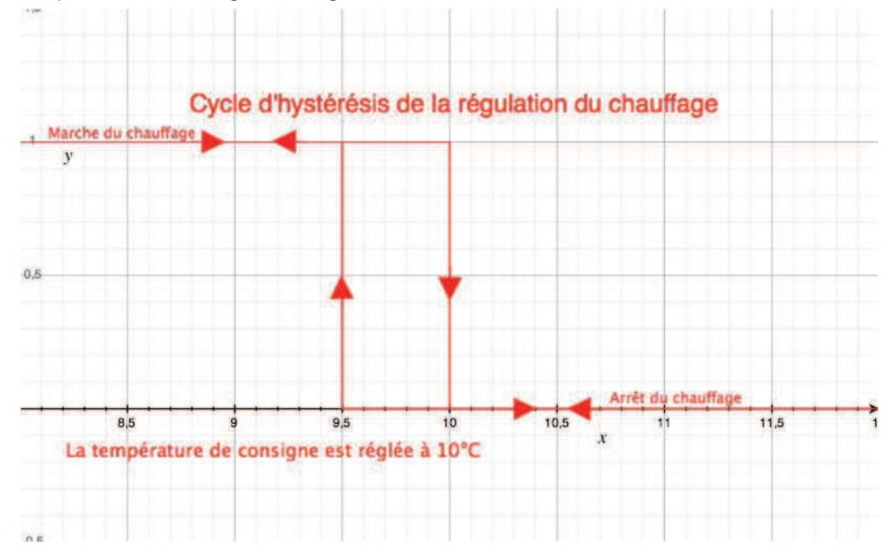
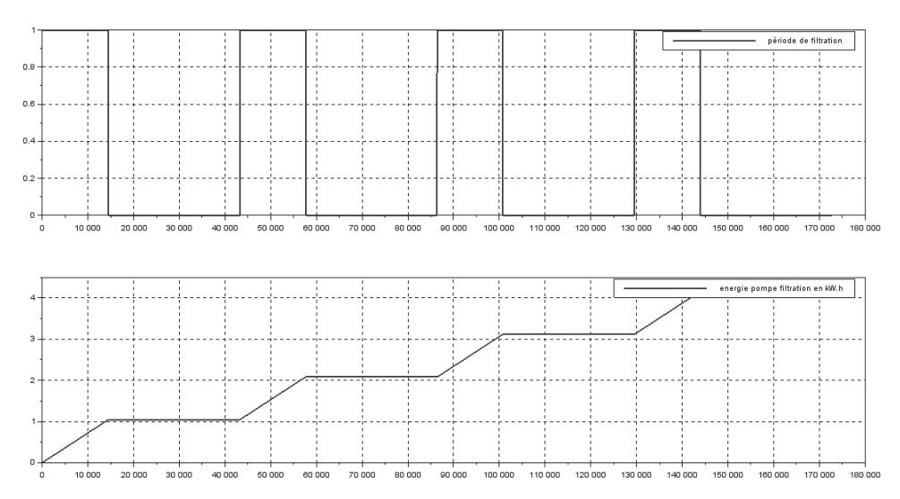
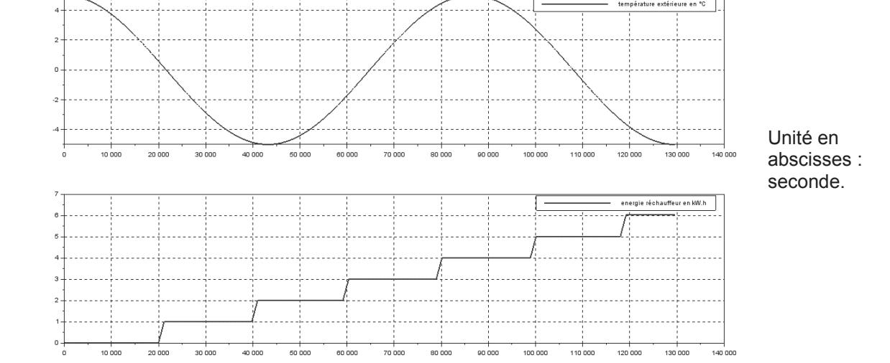

# **Éléments de correction de l'épreuve « Étude d'un système, d'un procédé ou d'une organisation » – option ingénierie électrique**

# **PARTIE A**

# **Question A1**

C'est la température de consigne *Tcons*.

# **Question A2**

Variable « mode » qui correspondra à : « *hors gel* », « *mode standard* » et « *mode éco* ». Variable « température de l'eau » : *Teau* indique la température de l'eau dans le spa. Variable « chauffage » qui est utilisée pour la mise en marche ou l'arrêt du chauffage.

# **Question A3**

La température de consigne est réglée à 10°C.

## **Question A4** :

Si *filtration* est vraie

Alors

 Si *Teau* est supérieure à la *Tcons* Alors mise à l'arrêt du chauffage Si *Teau* est inférieure à la Tcons-0,5 Alors mise en marche de chauffage Sinon mise à l'arrêt du chauffage

Autre présentation Si filtration = vraie

Alors

Si Teau > Tcons

Alors chauffage← arrêt

Si Teau < (Tcons-0,5)

Alors chauffage←marche

Sinon chauffage← arrêt

#### Question A5.

Tant que mode correspond au « mode eco » Faire

Si filtration est vraie

Alors

Si Teau > Tcons

Alors mise à l'arrêt du chauffage

Si Teau < Tcons-0.5

Alors mise en marche du chauffage

Sinon mise à l'arrêt du chauffage

Mise à jour de la valeur de mode

Fin tant que

# Autre présentation

Tant que mode = « mode eco » faire

Si filtration = vraie

Alors

Si Teau > Tcons

Alors chauffage← arrêt

Si *Teau* < (Tcons-0,5)

Alors chauffage←marche

Sinon chauffage←arrêt

Mise à jour de la valeur de mode

Fin tant que

#### **PARTIE B**

## **Question B1.1**

Réchauffeur : 3 kW

Pompes d'hydro massage : 2 x 2,25 kW

Pompes de circulation : 260 W

#### **Question B1.2**

Voir document réponse n°2.

## **Question B1.3**

#### Réchauffeur

En monophasé pour 3 kW (4HP, il faut une base LUB32

Module de contrôle LUCC pour du monophasé

 $I_{rechauffeur}$  = 13,05 A  $\Rightarrow$  calibre de 4,5 A à 18 A soit LUCC18\*\*

Commande 24 V alternatif ⇒ LUCC18B

## Pompes d'hydro massage

En monophasé pour 2,25 kW (3 HP), il faut une base LUB32

Module de contrôle standard LUCC

*IPompe H* = 11,37 A Þ calibre de 3 A à 12 A soit LUCC12\*\*

Commande 24 V alternatif Þ LUCC12B

## **Pompe de circulation**

En monophasé pour 0,26 kW (1/3 HP) Il faut une base LUB12

Module de contrôle standard LUCC

*IPompe C* = 1,41 A Þ calibre de 1,25 à 5 A soit LUCC05\*\*

Commande 24 V alternatif Þ LUCC05B

# **Question B1.4**

Voir document réponse n°1 : le réchauffeur et les pompes doivent être raccordés sur les phases 1 et 3 du LUB et non rebouclés avec la phase 2.

Le propriétaire du SPA a un abonnement de 18 kVA en triphasé avec heures creuses. Ces dernières factures font apparaître des consommations régulières de 16 kW au maximum sans déséquilibre notable.

# **Question B2.1**

Lors de l'utilisation des pompes d'hydro massage, la pompe de circulation n'est pas utilisée puisque le réchauffeur est arrêté.

Cas 1 : pompe de filtration et réchauffeur.

Cas 2 : pompes d'hydro massage.

Cas 3 : pompe de filtration seule.

## **En mode « éco »**

Lors de l'utilisation des pompes d'hydro massage, la pompe de circulation n'est pas utilisée puisque le réchauffeur est arrêté.

Cas 1 : pompe de filtration et réchauffeur.

Cas 2 : pompes d'hydro massage.

Cas 3 : pompe de filtration seule.

Le mode « éco » est ainsi nommé, car pendant les phases de non filtration le réchauffeur n'est pas mis en marche quelle que soit la température.

# **Question B2.2**

Bilan de puissance et cas de fonctionnement : voir document réponse °2.

Le SPA consomme plus de courant et de puissance quand le réchauffeur et la pompe de circulation fonctionnent.

# **Question B2.3**

C'est lors du fonctionnement du réchauffeur que la puissance est la plus élevée. La puissance supplémentaire sur la phase 1 est :

*P P P phase réchauffeur circulation* 1 = + = + = 3000 260 3260 W soit 3,26 kW .

Puissance nécessaire en plus sur l'abonnement triphasé : 3 3 26,3 kW 78,9 *P* = ´*Pphase*1 = ´ = .

Nouvel abonnement = consommation maximale actuelle + puissance nécessaire en plus sur le triphasé :

*P* = 16+ 78,9 = kW 78,25 .

Soit un nouvel abonnement de 30 kVA.

|                   | Puissance souscrite (kVA) | Abonnement annuel (€ TTC/an) | Prix du kWh (cts € TTC/kWh) |       |
|-------------------|------------------------------|------------------------------------|--------------------------------|-------|
|                   |                              | (CTTO/all)                         | HP                             | HC    |
| Ancien abonnement | 18                           | 266,84                             | 16,36                          | 11,50 |
| Nouvel abonnement | 30                           | 761,47                             | 16,36                          | 11,50 |

Le tarif de l'abonnement augmente de :  $76147 - 266,86 = 494,61 \in$  .

Le tarif du kWh est le même.

## **PARTIE C**

## **Question C1.1**

La puissance dissipée par une résistance soumise à une tension continue de 230 V est la même que celle d'une résistance soumise à une tension dont la valeur efficace vaut 230 V.

Il est nécessaire de réaliser le modèle avec une tension continue, car il n'est pas possible de simuler correctement en même temps une fréquence de 50 Hz (tension du réseau) et une fréquence de 1,15\*10-5 Hz (fréquence de la température extérieure de la simulation).

#### **Question C1.2**

La puissance du réchauffeur est de 3 000 W et la tension d'alimentation est de 230 V

$$R = \frac{U^2}{P} = \frac{230^2}{3000} = 17.6 \,\Omega$$

#### **Question C2.1**

D'après le DT1, la masse de l'eau dans le SPA est de 1 620 kg, d'où :

$$C_{sna} = 4.186 \times 1.620 = 677.9700 \text{ J} \cdot \text{K}^{-1}$$

#### **Question C2.2**

Les dimensions du SPA sont les suivantes :  $2,18 \times 2,18 \times 0,90$  soit une surface d'environ  $S_e = 2,18 \times 2,18 = 4,75 \, \text{m}^2$  entre la couverture et l'eau du SPA.

Unités en abscisses : seconde.

#### **Question C2.3**

$$\lambda = \lambda_p \times \frac{S_e}{e} = 0.4 \times \frac{4.75}{0.11} = 17.3 \ W \cdot K^{-1}$$

#### **Question C3.1**

Un cycle de filtration a lieu durant les heures pleines soit une énergie de  $E_{fhp} = 0.26 \times 4 = 1.04 \, \text{kWh}$ .

Un cycle de filtration a lieu durant les heures creuses soit une énergie de  $E_{fhc} = 0,26 \times 4 = 1,04 \, \text{kWh}$ .

#### **Question C3.2**

$$C_{\mathit{fh}} = E_{\mathit{fhp}} \times 0.1636 + E_{\mathit{fhc}} \times 0.115 = 1.04 \times 0.1636 + 1.04 \times 0.115 = 0.170144 + 0.1196 = 0.289744 \approx 0.29 \in 0.289744 = 0.29 \in 0.289744 = 0.29 \in 0.289744 = 0.29 \in 0.289744 = 0.29 \in 0.289744 = 0.29 \in 0.289744 = 0.29 \in 0.289744 = 0.29 \in 0.289744 = 0.29 \in 0.289744 = 0.29 \in 0.289744 = 0.29 \in 0.289744 = 0.29 \in 0.289744 = 0.29 \in 0.289744 = 0.29 \in 0.289744 = 0.29 \in 0.289744 = 0.29 \in 0.289744 = 0.29 \in 0.289744 = 0.29 \in 0.289744 = 0.29 \in 0.289744 = 0.29 \in 0.289744 = 0.29 \in 0.289744 = 0.29 \in 0.289744 = 0.29 \in 0.289744 = 0.29 \in 0.289744 = 0.29 \in 0.289744 = 0.29 \in 0.289744 = 0.29 \in 0.289744 = 0.29 \in 0.289744 = 0.29 \in 0.289744 = 0.29 \in 0.289744 = 0.29 \in 0.289744 = 0.29 \in 0.289744 = 0.29 \in 0.289744 = 0.29 \in 0.289744 = 0.29 \in 0.289744 = 0.29 \in 0.289744 = 0.29 \in 0.289744 = 0.29 \in 0.289744 = 0.29 \in 0.289744 = 0.29 \in 0.289744 = 0.29 \in 0.289744 = 0.29 \in 0.289744 = 0.29 \in 0.289744 = 0.29 \in 0.289744 = 0.29 \in 0.289744 = 0.29 \in 0.289744 = 0.29 \in 0.289744 = 0.29 \in 0.289744 = 0.29 \in 0.289744 = 0.29 \in 0.289744 = 0.29 \in 0.289744 = 0.29 \in 0.289744 = 0.29 \in 0.289744 = 0.29 \in 0.289744 = 0.29 \in 0.289744 = 0.29 \in 0.289744 = 0.29 \in 0.289744 = 0.29 \in 0.289744 = 0.29 \in 0.289744 = 0.29 \in 0.289744 = 0.29 \in 0.289744 = 0.29 \in 0.289744 = 0.29 \in 0.289744 = 0.29 \in 0.289744 = 0.29 \in 0.289744 = 0.29 \in 0.289744 = 0.29 \in 0.289744 = 0.29 \in 0.289744 = 0.29 \in 0.289744 = 0.29 \in 0.289744 = 0.29 \in 0.289744 = 0.29 \in 0.289744 = 0.29 \in 0.289744 = 0.29 \in 0.289744 = 0.29 \in 0.289744 = 0.29 \in 0.289744 = 0.29 \in 0.289744 = 0.29 \in 0.289744 = 0.29 \in 0.289744 = 0.29 \in 0.289744 = 0.29 \in 0.289744 = 0.29 \in 0.289744 = 0.29 \in 0.289744 = 0.29 \in 0.289744 = 0.29 \in 0.289744 = 0.29 \in 0.289744 = 0.29 \in 0.289744 = 0.29 \in 0.289744 = 0.29 \in 0.289744 = 0.29 \in 0.289744 = 0.29 \in 0.289744 = 0.29 \in 0.289744 = 0.29 \in 0.289744 = 0.29 \in 0.289744 = 0.29 \in 0.289744 = 0.29 \in 0.289744 = 0.29 \in 0.289744 = 0.29 \in 0.289744 = 0.29 \in 0.289744 = 0.29 \in 0.289744 = 0.29 \in 0.289744 = 0.29 \in 0.289744 = 0.29 \in 0.29 \in 0.299744 = 0.29 \in 0.299744 = 0.29 \in 0.299744 = 0.29 \in 0.299744 = 0.29 \in 0.299$$

#### **Question C3.3**

Si l'on considère que la simulation commence à minuit : la période d'heures pleines commence à 7 h 30 soit 7,5 h plus tard soit 27 000 s plus tard.

La période d'heures pleines commence à l'instant  $t = 27\,000\,s$ . L'énergie à cet instant vaut 1,95 kWh. La période d'heures pleines se termine à 22 h 30 soit 15 h plus tard soit 54 000 s plus tard. La période d'heures pleines se termine à l'instant  $t = 27\,000 + 54\,000 = 81\,000\,s$ .

L'énergie à cet instant vaut 5,85 kW·h.

L'énergie consommée pendant la période d'heures pleines est donc de :

$$E_{fep} = 5.85 - 1.95 = 3.9 \text{ kWh}$$
.

La période d'heures creuses dure 9 h. La pompe fonctionnant en continu :

$$E_{\text{fec}} = 0.26 \times 9 = 2.34 \, \text{kWh}$$
.

#### **Question C3.4**

$$C_{fe} = E_{fep} \cdot 0,1636 + E_{fec} \cdot 0,115 = 3,9 \cdot 0,1636 + 2,34 \cdot 0,115 = 0,63804 + 0,2691 = 0,90714 \approx 0,91 \in .$$

#### **Question C3.5**

La simulation débute en heures pleines. La période d'heures creuses commence à 22 h 30 soit 8,5 heures plus tard. Soit 30 600 secondes plus tard. Durant cette première période, 1 kWh a été consommé.

La période d'heures creuses se termine à 7 h 30 soit 9 h plus tard soit 32 400 s plus tard. La nouvelle période d'heures pleines commence à l'instant t = 30 600 + 32 400 = 63 000 s

La consommation repart alors de 3 kW·h jusqu'au maximum de température suivant qui correspond à 14 h 00 ; 1 kW·h a été consommé.  $E_{thp} = 2$  kW·h.

La période d'heures creuses a lieu entre les instants 30 600 s et 63 000 s.  $E_{rhc} = 2 \,\text{kWh}$ .

#### **Question C3.6**

$$C_{th} = E_{thp} \times 0.1636 + E_{thc} \times 0.115 = 2 \times 0.1636 + 2 \times 0.115 = 0.3272 + 0.23 = 0.5572 \approx 0.56 \in 0.015 = 0.015 = 0.015 = 0.015 = 0.015 = 0.015 = 0.015 = 0.015 = 0.015 = 0.015 = 0.015 = 0.015 = 0.015 = 0.015 = 0.015 = 0.015 = 0.015 = 0.015 = 0.015 = 0.015 = 0.015 = 0.015 = 0.015 = 0.015 = 0.015 = 0.015 = 0.015 = 0.015 = 0.015 = 0.015 = 0.015 = 0.015 = 0.015 = 0.015 = 0.015 = 0.015 = 0.015 = 0.015 = 0.015 = 0.015 = 0.015 = 0.015 = 0.015 = 0.015 = 0.015 = 0.015 = 0.015 = 0.015 = 0.015 = 0.015 = 0.015 = 0.015 = 0.015 = 0.015 = 0.015 = 0.015 = 0.015 = 0.015 = 0.015 = 0.015 = 0.015 = 0.015 = 0.015 = 0.015 = 0.015 = 0.015 = 0.015 = 0.015 = 0.015 = 0.015 = 0.015 = 0.015 = 0.015 = 0.015 = 0.015 = 0.015 = 0.015 = 0.015 = 0.015 = 0.015 = 0.015 = 0.015 = 0.015 = 0.015 = 0.015 = 0.015 = 0.015 = 0.015 = 0.015 = 0.015 = 0.015 = 0.015 = 0.015 = 0.015 = 0.015 = 0.015 = 0.015 = 0.015 = 0.015 = 0.015 = 0.015 = 0.015 = 0.015 = 0.015 = 0.015 = 0.015 = 0.015 = 0.015 = 0.015 = 0.015 = 0.015 = 0.015 = 0.015 = 0.015 = 0.015 = 0.015 = 0.015 = 0.015 = 0.015 = 0.015 = 0.015 = 0.015 = 0.015 = 0.015 = 0.015 = 0.015 = 0.015 = 0.015 = 0.015 = 0.015 = 0.015 = 0.015 = 0.015 = 0.015 = 0.015 = 0.015 = 0.015 = 0.015 = 0.015 = 0.015 = 0.015 = 0.015 = 0.015 = 0.015 = 0.015 = 0.015 = 0.015 = 0.015 = 0.015 = 0.015 = 0.015 = 0.015 = 0.015 = 0.015 = 0.015 = 0.015 = 0.015 = 0.015 = 0.015 = 0.015 = 0.015 = 0.015 = 0.015 = 0.015 = 0.015 = 0.015 = 0.015 = 0.015 = 0.015 = 0.015 = 0.015 = 0.015 = 0.015 = 0.015 = 0.015 = 0.015 = 0.015 = 0.015 = 0.015 = 0.015 = 0.015 = 0.015 = 0.015 = 0.015 = 0.015 = 0.015 = 0.015 = 0.015 = 0.015 = 0.015 = 0.015 = 0.015 = 0.015 = 0.015 = 0.015 = 0.015 = 0.015 = 0.015 = 0.015 = 0.015 = 0.015 = 0.015 = 0.015 = 0.015 = 0.015 = 0.015 = 0.015 = 0.015 = 0.015 = 0.015 = 0.015 = 0.015 = 0.015 = 0.015 = 0.015 = 0.015 = 0.015 = 0.015 = 0.015 = 0.015 = 0.015 = 0.015 = 0.015 = 0.015 = 0.015 = 0.015 = 0.015 = 0.015 = 0.015 = 0.015 = 0.015 = 0.015 = 0.015 = 0.015 = 0.015 = 0.015 = 0.015 = 0.015 = 0.015 = 0.015 = 0.015 = 0.015 = 0.015$$

#### **Question C3.7**

La simulation débute en heures pleines. La période d'heures creuses commence à 22 h 30 soit 8,5 heures plus tard. Soit 30 600 secondes plus tard. Durant cette première période, il n'y a eu aucune consommation.

La période d'heures creuses se termine à 7 h 30 soit 9 h plus tard soit 32 400 s plus tard. La nouvelle période d'heures pleines commence à l'instant t = 30 600 + 32 400 = 63 000 s

La consommation repart alors de 2 kW·h.

Jusqu'au maximum de température suivant qui correspond à 14 h 00, il n'y a eu aucune consommation.

$$E_{rep} = 0 \text{ kWh}$$

La période d'heures creuses a lieu entre les instants 30 600 s et 63 000 s

$$E_{rec} = 2 \text{ kWh}$$
.

## **Question C3.8**

$$C_{re} = E_{rep} \times 0.1636 + E_{rec} \times 0.115 = 0 \times 0.1636 + 2 \times 0.115 = 0.23 \in$$

## **Question C3.9**

Les pompes de massage fonctionnent de 17 h à 17 h 30 soit 0,5 h pendant les heures pleines.

Leur puissance électrique consommée vaut 2×2,25 kW soit 4,5 kW.

$$E_m = 4.5 \times 0.5 = 2.25 \text{ kWh}$$

On en déduit que :  $C_m = E_m \times 0.1636 = 2.25 \times 0.1636 = 0.3681 \approx 0.37 \in$  .

#### **Question C3.10**

$$C_{Th} = C_{fh} + C_{rh} + C_m = 0.289744 + 0.5572 + 0.3681 \approx 1.215 \in$$
.

$$C_{Te} = C_{fe} + C_{re} + C_{m} = 0.90714 + 0.23 + 0.3681 \approx 1.515 \in$$
.

$$C_{TA} = C_{Th} \times \frac{8}{12} \times 365 + C_{Te} \times \frac{4}{12} \times 365 = 1,215 \times \frac{8}{12} \times 365 + 1,515 \times \frac{4}{12} \times 365 = 295,65 + 180,13 = 475,78 \in .$$

#### **PARTIE D**

## **Question D1.1**

Voir document réponse n°3.

#### **Question D1.2**

Il est possible de régler les programmes et l'horodateur pour profiter au maximum des heures creuses.

#### **Question D2.1**

Il est possible de mettre en œuvre des panneaux solaires PV pour alimenter le spa la journée en heures pleines, d'utiliser des panneaux solaires thermiques ou une PAC pour maintenir la température de l'eau dans le SPA.

#### **Question D2.2**

$$T_{ch} = 20 \times \frac{3000}{5500} = 10,9 \, \text{min}.$$

$$W_{jPAC\acute{e}t\acute{e}} = 1500 \times \frac{60}{12} = 0,55 \,\text{kWh} \ .$$
 
$$W_{jPAC\acute{e}t\acute{e}r} = 1500 \times \frac{60}{6} = 1,09 \,\text{kWh} \ .$$

# **Question D2.3**

Voir document réponse n°3.

# **Question D2.4**

Calcul de l'économie sur la consommation :  $Eco._{conso.} = 480,20-357,01=123,19 €$  . Calcul de l'économie sur l'abonnement :  $Eco._{abo.} = 661,91-560,18=101,73 €$  .

Le retour sur investissement est de :

$$RI = \frac{1800}{123,19+101,73} = \frac{1800}{224,92} = 8 \text{ ans}$$

L'investissement n'est pas très rentable financièrement par rapport à la durée de vie d'une PAC, mais il est intéressant du point de vue du développement durable.