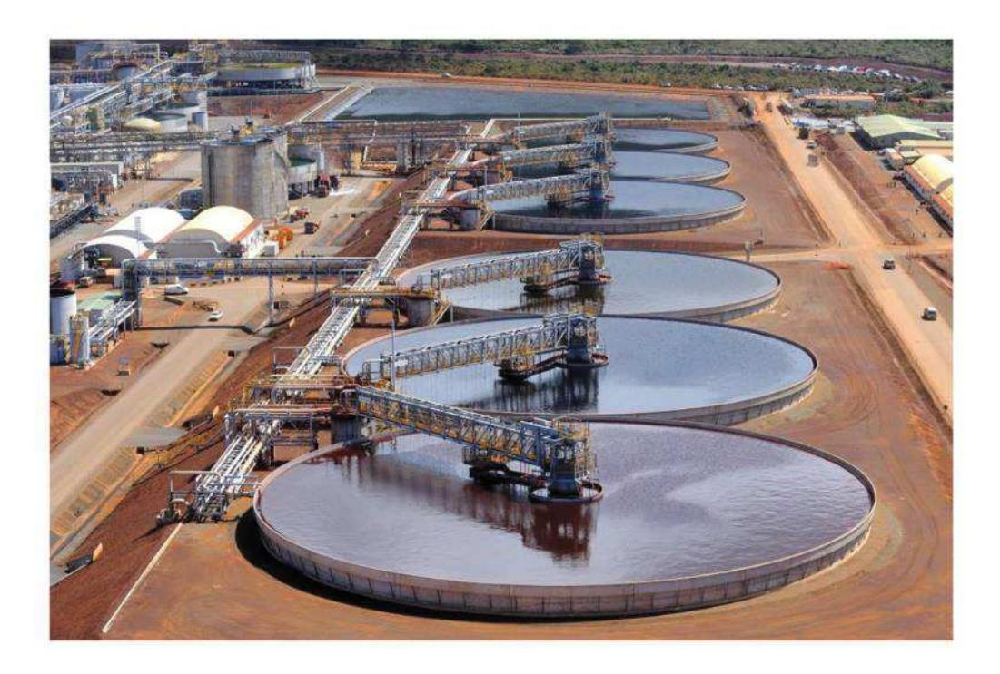
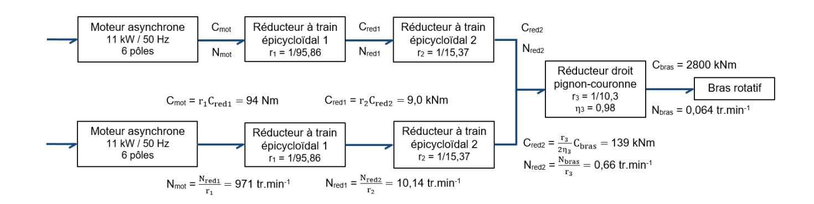
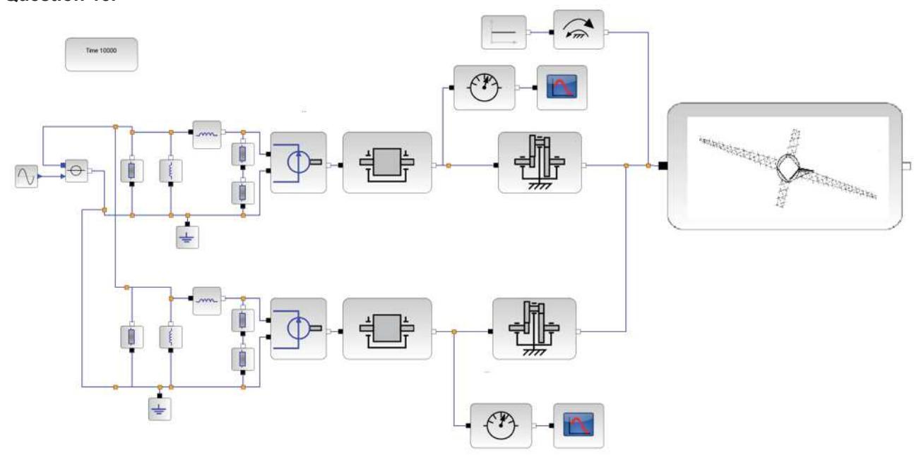
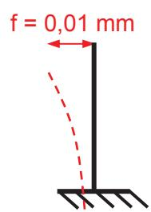
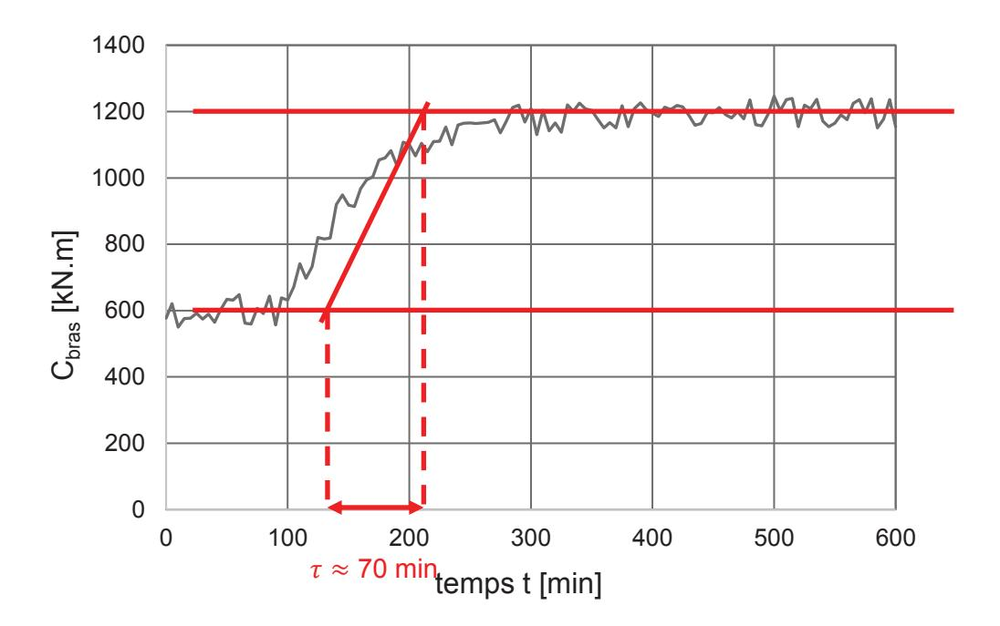
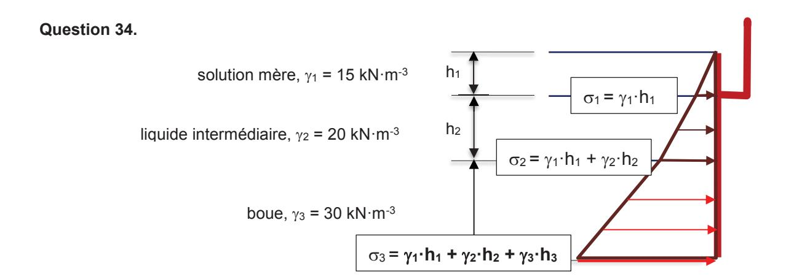
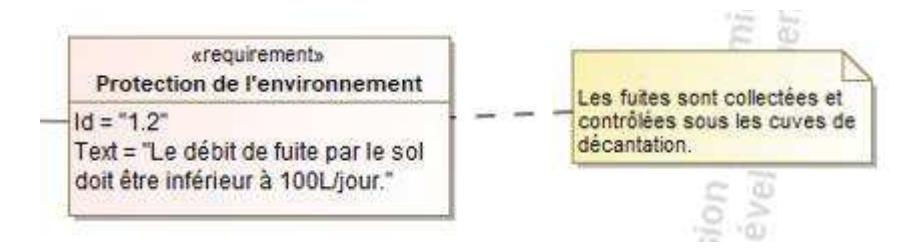
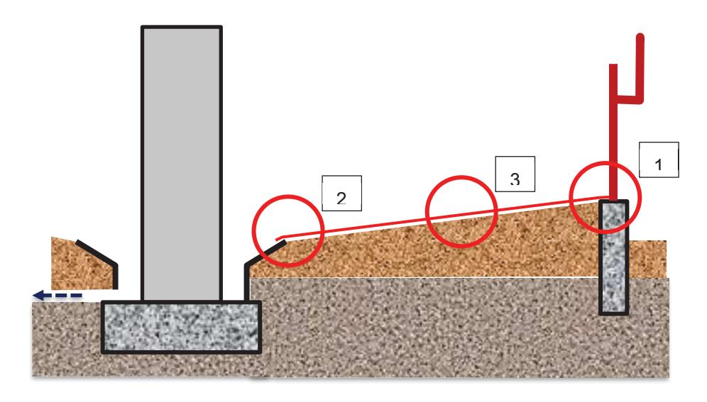
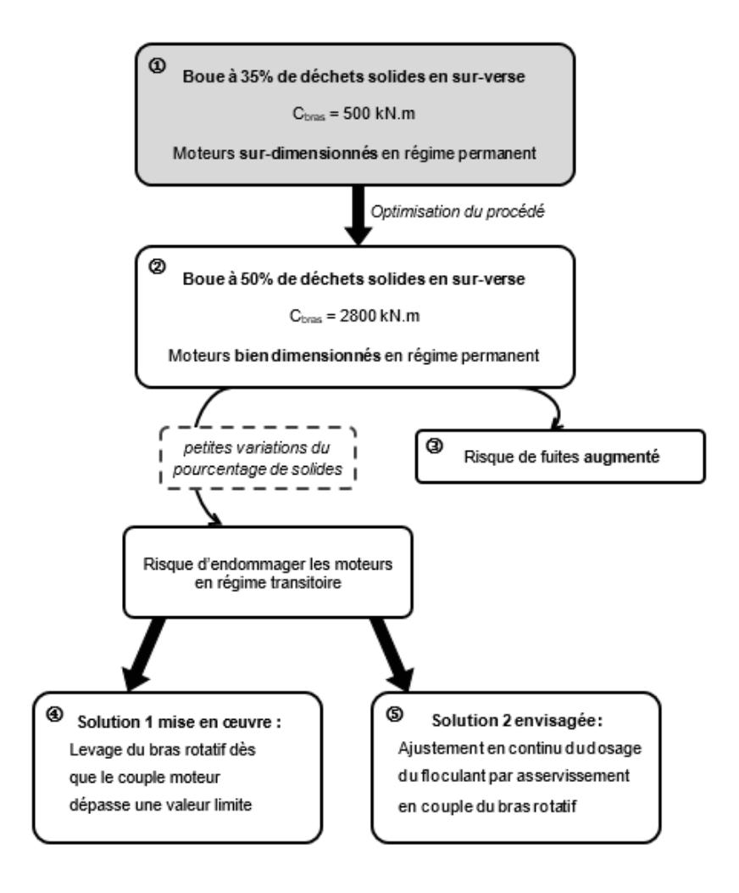

# **Analyse et exploitation pédagogique d'un système pluritechnologique**

# **A. Présentation de l'épreuve**

Durée : 5 heures Coefficient 2

L'épreuve est commune à toutes les options.

Elle a pour but de vérifier que le candidat est capable de mobiliser ses connaissances scientifiques et technologiques pour conduire une analyse systémique, élaborer et exploiter les modèles de comportement permettant de quantifier les performances d'un système pluritechnique des points de vue matière, énergie et information afin de valider tout ou partie de la réponse, au besoin exprimée par un cahier des charges.

Elle permet également de vérifier que le candidat est capable d'élaborer tout ou partie de l'organisation d'une séquence pédagogique, relative à l'enseignement de technologie du collège ou aux enseignements technologiques non spécifiques du cycle terminal "sciences et technologies de l'industrie et du développement durable (STI2D)" ou à l'enseignement de sciences de l'ingénieur du lycée général, ainsi que les documents techniques et pédagogiques associés (documents professeurs, documents fournis aux élèves, éléments d'évaluation).

# **B. Sujet**

Le sujet est disponible en téléchargement sur le site du ministère à l'adresse : https://media.devenirenseignant.gouv.fr/file/capet\_externe/06/5/s2021\_capet\_externe\_sii\_1\_1390065. pdf

L'étude porte sur l'optimisation d'une étape d'un procédé industriel d'extraction du nickel de l'usine Vale en Nouvelle-Calédonie.

# C. Éléments de correction

Question 1. Il s'agit de l'exigence 1.4.2.1 : « Objectif de fonctionnement nominal ».

Question 2. On obtient une masse volumique  $\rho_{\text{boue}} = 1740 \text{ kg.m}^{-3}$ .

 $\omega_{bras} = \frac{2\pi}{60} \times N = \frac{2\pi}{60} \times 0.064 = 6.7 \cdot 10^{-3} \text{ rad.s}^{-1}$ Question 3.

Question 4.  $V = r \times \omega_{\text{brac}}$ 

Question 5.  $dS = h \times dr$ 

Question 6.  $:F = k \times \rho \times S \times V$ donc  $dF = k \times \rho \times dS \times V = k \times \rho_{\text{boue}} \times r \times \omega_{\text{bras}} \times h \times dr$  d'après les résultats des questions 4 et 5.

Par intégration, on a : C =  $k \times \rho_{boue} \times \omega_{bras} \times h \times \frac{1}{3} (R_{ext}^3 - R_{int}^3)$ . Question 7.

Par application numérique :

 $C_{\text{court}} = 120 \times 1740 \times 6.7 \cdot 10^{-3} \times 0.1 \times \frac{1}{2} (10^3 - 3^3) = 45\,400 \text{ N.m}$ 

 $C_{long} = 120 \times 1740 \times 6.7 \cdot 10^{-3} \times 0.1 \times \frac{1}{3} (30^3 - 3^3) = 1260000 \text{ N.m}$ 

 $C_{bras} = 2C_{court} + 2C_{long} = 2610 \text{ kN.m}$ Question 8.

D'après la courbe de tendance de la Figure 7,  $C_{bras} = 11,19e^{0,11\times50} = 2738$  kN.m. Question 9.

Il y a donc un écart relatif faible entre les valeurs théorique et expérimentale : 
$$\frac{c_{bras\,expe}-c_{bras\,theo}}{c_{bras\,expe}}\times 100 = \frac{^{2738-2610}}{^{2738}}\times 100 = 4,7\%$$

La valeur théorique, et l'approche associée, sont donc validées.

**Question 10.**  $r_3 = \frac{12}{124} = \frac{1}{103} = 0.097$ 

Question 11.  $N_{mot} = \frac{N_{bras}}{r_1 \times r_2 \times r_2} = 971 \text{ tr.min}^{-1}$ 

Question 12.  $C_{mot} = \frac{r_1 \times r_2 \times r_3}{2 \times n_2} C_{bras} = 94 \text{ N.m}$ 

# **Question 13.**

- Le couple de charge maximum des moteurs sélectionnés est de 108 Nm, ce qui est légèrement supérieur au couple nécessaire pour mettre en rotation le bras lorsque la boue contient 50% de solides.
- De plus, on relève que le rendement des moteurs est optimal lorsqu'ils travaillent entre 75 et 100% de leur capacité de charge, ce qui correspond bien au cas à 50% de solides dans la boue.
- La vitesse de rotation nominale de ces moteurs est de 970 tr.min-1, ce qui est très légèrement en-dessous de la vitesse imposée de 971 tr.min-1 .
- Et la puissance consommée avec un couple de 94 Nm et une vitesse de 971 tr°min-1 = 102 rad°s -1 est de P = Cmot.Omot = 9,6 kW, ce qui est inférieur à la puissance de 11 kW des moteurs installés.

Ainsi, les moteurs utilisés sont bien dimensionnés pour le cas souhaité.

Avec le pourcentage actuel de 35% de solides dans la boue, les moteurs sont largement surdimensionnés et fonctionnent notamment avec un rendement non optimal.

#### **Question 14.**

3 : MAS

1 : Réseau électrique 4 : Trains d'engrenage

2 : MAS 5 : Lames racleuses

#### **Question 15.**

**Question 16.** La machine alimentée sous tension et fréquence nominales possède une vitesse de 970 tr/min. On en déduit que la vitesse de synchronisme est de 1000 tr/min. Le nombre de paires de pôle du moteur est 3, la machine possède 6 pôles.

Question 17. Le glissement nominal est donné par

$$g_n = \frac{N_s - N_n}{N_s} = 3\%$$

Question 18. La puissance réactive absorbée par la machine est consommée par les trois réactances

$$Q_0 = \frac{3V^2}{L_p \omega}$$

$$\text{donc } L_p = 79 \text{ mH}$$

de magnétisation

**Question 19.** Le modèle n'est pas validé car le courant calculé à rotor bloqué (270 Nm) ne correspond à celui du modèle. En revanche, le courant à vitesse nominale (108 Nm) correspond à celui de la documentation. La validation envisagée pour le modèle peut être critiquée car uniquement faite sur 2 points caractéristiques. Elle serait plus adaptée à partir d'une courbe de courant en fonction du couple composée d'un plus grand nombre de point.

**Question 20.** Avec un pourcentage de boue qui varie légèrement autour de 50%, le couple moteur reste toujours inférieur à 100% du couple nominal, donc les moteurs sont correctement dimensionnés et peuvent fournir le couple nécessaire.

**Question 21.**  $F = C_{mot}/L = 90/0,3 = 300 \text{ N}$ 

**Question 22.** La charge vaut F/g = 300/10 = 30 kg, on peut donc choisir, pour cette application, le capteur dont la charge nominale est 30 kg.

Si calcul avec  $g=9.81 \text{ m/s}^2$ , on obtient : F/g = 300/9.81 = 30.6 kg -> on peut accepter 40 kg de charge nominale.

Question 23.  $I = \frac{\pi \times D^4}{64} = \frac{\pi \times (27.5 \times 10^{-3})^4}{64} = 2.8 \times 10^{-8} \text{ m}^4$  donc  $f = \frac{F \times I^3}{3 \times E \times I} = \frac{300 \times (82 \times 10^{-3})^3}{3 \times 200 \times 10^9 \times 2.8 \times 10^{-8}} \approx 1 \times 10^{-5} \text{ m soit } 10^{-2} \text{ mm, ce qui est très inférieur à la limite de 1}$  mm spécifiée par la documentation technique du capteur. Il est donc validé pour cette utilisation.

#### Question 24.

**Question 25.** Clim = 1600 kNOm or à 50% de solides dans la boue, Cbras = 2800 kN.m donc, avec ce réglage du dispositif de sécurité, on va tout le temps relever les lames, voire arrêter le moteur.

11

**Question 26.** Il y a 500 incréments par tour, donc  $K_{cod} = \frac{2\pi \, R_{poulie}}{500} = 2,26 * 10^{-3}$  m/incrément.

# **Question 27.**

**Question 28.** Un tour complet de bras dure 1/0,064 = 15,6 minutes, soit 15,6/2 = **7,8 minutes** entre deux passages de bras long.

### **Question 29.**

- Attente 10 s après détection du bras
- Descente de 2,5 m à 0,1 m/s : 2,5/0,1 = 25 s
- Attente 10 s (mesure de référence)
- Descente de 4 m à 0,1 m/s : 4/0,1 = 40 s
- Montée de 6,5 m à 0,2 m/s : 6,5/0,2 = 32,5 s

TOTAL : 10 + 25 + 10 + 40 + 32,5 = **117,5 s** soit quasiment **2 min** (1,96 min)

**Question 30.** 2 min < 7,8 min : il n'y a normalement aucun risque que le câble de sonde s'enroule dans un bras long.

**Question 31.** La réponse du système a un échelon correspond à une exponentielle amortie (tangente non nulle au départ de l'échelon, pas de dépassement de la valeur finale) : on peut bien modéliser le système par un ordre 1.

**Question 32.** En régime permanent,

 Cbras = K x U0 donc K = Cbras/ U0 = 600/10 = 60 kN.mV-1 .

Le système met environ 70 min pour passer de Cbras = 600 kN.m à Cbras = 600 + 0,63.600 = 978 kN.m, donc ! " 70 min.

#### **Question 33.**

- · Le réglage 1 permet d'avoir de faibles dépassements de la valeur finale mais n'est pas précis (erreur statique non nulle en régime permanent).
- · Le réglage 2 est précis mais présente des dépassements très importants.
- · Le réglage 3 est précis, suffisamment rapide car, à chaque échelon de variation de #pulpe, la réponse met un peu moins de 500 min à se stabiliser, et les dépassements sont bien inférieurs à 15% du couple consigne. C'est le meilleur réglage vis-à-vis des exigences de l'asservissement.

**Question 35.** Le poids volumique de la boue est g3. Plus la boue est dense, plus elle va pousser en pied de paroi.

**Question 36.** Le poids volumique de la boue est g3. Plus la boue est dense, plus elle va pousser sur le sol.

# **Question 37.**

# **Question 38.**

- 1- Fuites en pied de paroi métallique où la poussée horizontale des fluides est la plus importante (liaison métal/bâche). Mais aussi entre les plaques si elles ne sont pas bien assemblées.
- 2- Fuites entre la bâche et le système de collecte. La poussée verticale y est la plus importante.
- 3- Fuites entre les pans de bâches. Mais aussi par abrasion des bâches due au raclage des éléments solides dans la boue.

## **Question 39.**

#### En phase de construction :

- · assurer l'assemblage étanche des plaques de paroi : soudure, joints… ;
- · assurer la jonction bâche/parois par pincement entre la paroi et le muret de béton ;
- · souder les bâches entre elles (colle…) ;
- · assurer la jonction bâche/système de collecte ;
- · mettre en place un drainage pour collecter les eaux de fuite sous les cuves ;

# En service :

- · s'assurer visuellement qu'il n'y a pas de fuites dans les zones extérieures accessibles ;
- · contrôler le débit des eaux de drainage et agir en cas d'augmentation continue ;
- · contrôler l'état des bâches posées au fond de la cuve.

# **Question 40.**

# **Question 41.**

|                           | Évaluation diagnostic                                                                                                                         | Évaluation formative                                                                                            | Évaluation sommative                                                                                                                                    | Évaluation certificative                                                  |
|---------------------------|-----------------------------------------------------------------------------------------------------------------------------------------------|-----------------------------------------------------------------------------------------------------------------|---------------------------------------------------------------------------------------------------------------------------------------------------------|---------------------------------------------------------------------------|
| Moment de l'évaluation | Début de séquence Début de séance Avant l'introduction de nouvelles notions                                                                   | Pendant une activité d'apprentissage                                                                         | A la fin de la séquence, lorsque les élèves sont prêts                                                                                               | A la fin d'un cycle, date définie par l'organisme certificatif         |
| But de l'évaluation    | Faire un état des lieux des connaissances des élèves pour adapter l'enseignement, cibler les points à approfondir avec les élèves | Permettre à l'élève de se situer dans l'apprentissage Valoriser les productions, encourager les élèves | Donner une photographie des acquis des élèves Ajuster son enseignement                                                                            | Déterminer si le candidat a le niveau requis pour un diplôme           |
| Forme de l'évaluation  | QCM individuels écrits ou assistés par logiciels (Plickers), questions réponses collectives                                          | Autoévaluation Grille d'apprentissage définie au préalable                                                | Etude individuelle ou non mobilisant les compétences visées sur un nouveau contexte, donnant lieu à un bilan (sous forme de note ou non) | Sujet individuel ou non, noté, ayant un impact sur la certification |

#### **Questions 42 et 43.**

- 1. Trouver la vitesse de rotation des bras dans le SYSML fourni, déterminer le temps disponible pour le passage de la sonde (compétences 1 et 4)
- 2. À partir du SYSML, déterminer la distance à parcourir par la sonde lors d'un cycle de mesurage (compétence 1)
- 3. En déduire la vitesse nécessaire de la sonde lors de ce cycle en supposant la vitesse constante (compétence 4)
- 4. Déterminer la vitesse de rotation du moteur correspondante (compétence 4)
- 5. Déterminer l'intensité aux bornes du moteur correspondante (compétence 4)
- 6. Trouver les valeurs possibles de commande dans le SYSML, en déduire s'il est possible d'éviter les collisions (compétence 1)

**Question 44.** Plusieurs organisations possibles : mettre les élèves sur les supports utilisés en TP en s'assurant qu'ils passent sur l'un qu'ils n'ont pas encore fait, trouver un autre support qui se prête aux activités demandées… L'évaluation doit être en effectif réduit donc 3h maxi, validation des compétences notée ou non.

**Question 45.** Une partie mesurage sur le système, une autre modélisation multiphysique avec simulation de la loi entrée/sortie. Mener une campagne de mesurage avec des outils déjà utilisés, effectuer des simulations sur un modèle multiphysique complet, les élèves devant intégrer les valeurs mesurées pour déterminer le comportement du système. Calculs d'écarts à compléter.