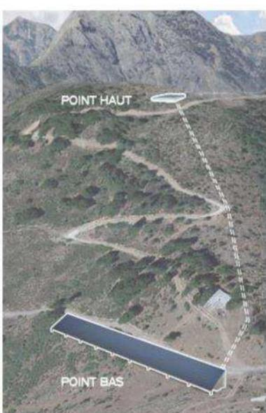
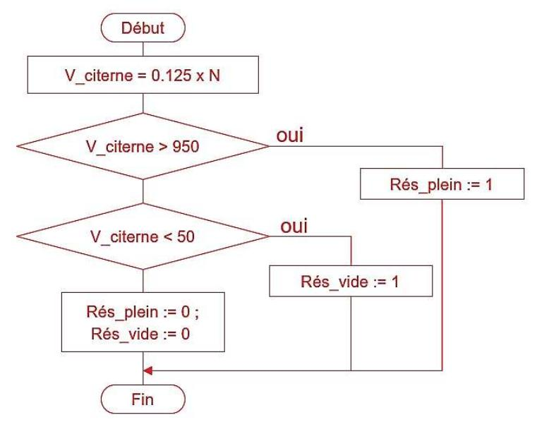
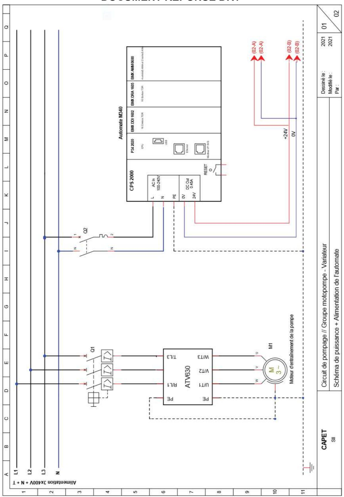
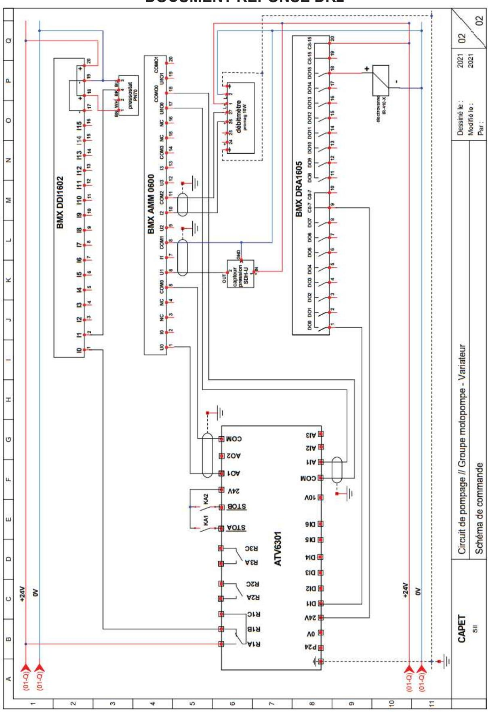

## **Étude d'un système, d'un procédé ou d'une organisation**

Ingénierie électrique

### **A. Présentation de l'épreuve**

Durée : 4 heures Coefficient 1

L'épreuve est spécifique à l'option choisie.

L'épreuve a pour but de vérifier que le candidat est capable de conduire une analyse critique de solutions technologiques et de mobiliser ses connaissances scientifiques et technologiques pour élaborer et exploiter les modèles de comportement permettant de quantifier les performances d'un système ou d'un processus lié à la spécialité et définir des solutions technologiques.

### **B. Sujet**

Le sujet est disponible en téléchargement sur le site du ministère à l'adresse : https://media.devenirenseignant.gouv.fr/file/capet\_externe/45/5/s2021\_capet\_externe\_sii\_electrique\_2 \_1390455.pdf

Une des solutions actuellement utilisée pour stocker l'énergie à grande échelle est la station de transfert d'énergie par pompage-turbinage (STEP) qui permet de stocker l'énergie électrique sous forme d'énergie potentielle. Le support de l'épreuve est une microcentrale qui associe une production d'énergie par panneaux solaires photovoltaïques et un système de pompage-turbinage d'eau.

Cinq thèmes d'études indépendantes ont été proposés abordant les sujets suivants :

- *-* Partie A : pertinence du choix du procédé de stockage de l'énergie
- *-* Partie B : validation du dimensionnement du système de production de l'énergie
- *-* Partie C : choix et mise en œuvre du modulateur d'énergie associé au groupe motopompe
- *-* Partie D : validation du procédé de mesure de la quantité d'énergie stockée
- *-* Partie E : validation du procédé en termes de coût énergétique

### C. Éléments de correction

#### PARTIE A : pertinence du choix du procédé de stockage de l'énergie.

Question 1 : citer au moins deux avantages et deux inconvénients d'une la micro-STEP solaire et préciser dans quelle mesure elle peut répondre aux enjeux de la transition énergétique.

Avantages: utilisation d'énergie renouvelable, stockage « propre ».

Inconvénients : lieu d'installation doit être approprié (dénivelé important), surface importante pour les panneaux photovoltaïques, investissement important.

Question 2: à partir du premier processus de l'ingénierie système présenté dans les documents techniques DT1 à DT3 et du diagramme de définition des blocs du document technique DT4, indiquer, pour chaque cas d'utilisation, la ou les solution(s) technologique(s) retenue(s).

- 1°) Transformer l'énergie solaire en énergie électrique : panneaux solaires photovoltaïques.
- 2°) Stocker une partie de l'énergie ... : réservoir haut ; motopompes.
- 3°) Transformer l'énergie stockée en énergie électrique : turbine + alternateur + conduite.
- 4°) Gérer efficacement l'utilisation de l'énergie produite : automate programmable + centrale de mesures.
- 5°) Adapter l'énergie pour la distribuer : onduleur

#### Phase de turbinage

Question 3 : indiquer, à partir de l'organigramme de pilotage du document technique DT5, les conditions de mise en service du turbinage.

Il y a turbinage si la puissance produite par les PV est inférieure à la puissance consommée par la charge et si le volume du réservoir haut est supérieur à 5% du volume total.

Question 4 : indiquer, à partir du diagramme de blocs internes partiel de la micro-STEP (figure 3), la forme de l'énergie (potentielle, électrique, cinétique, ...) sur les liens repérés (1),(2) et (3).

(1) : énergie cinétique ; (2) : énergie mécanique de rotation ; (3) : énergie électrique

Question 5 : déterminer l'énergie potentielle, en  $kW\cdot h$ , disponible lorsque le niveau d'eau dans le réservoir supérieur est maximal (90% du volume total).

Ep = 
$$0.9 \times 1000 \times 1000 \times 9.81 \times 130 = 1147770000$$
 joules, soient 318,825 kW·h

Question 6 : déterminer, en kW·h, la quantité d'énergie électrique disponible. Comparer et commenter l'écart entre cette valeur et la consommation journalière moyenne du village.

 $E_{\text{élec dipo}} = 318,825 \times 0.78 = 248,68 \text{ kW.h}$  soient 43% des besoins journalier du village.

#### Phase de pompage

Question 7 : Indiquer, à partir de l'organigramme de pilotage du document technique DT5, les conditions de mise en service du pompage.

Il y a pompage si:

La puissance produite par les PV est > Puissance consommée par la charge et si le volume du réservoir haut est < à 95% de son volume total

Question 8 : Indiquer la valeur du débit de la pompe et en déduire la durée totale nécessaire pour remplir totalement le réservoir supérieur.

D'après les courbes du DT6, Qpompe = 160 m3/h

$$T = \frac{v}{\rho}$$
  $t = \frac{900}{160} = 5,625 \text{ h soit 5h et 37 min}$ 

Question 9 : À partir des caractéristiques de la pompe données dans le document technique DT6, déterminer l'énergie électrique nécessaire au remplissage complet du réservoir supérieur si celle-ci fonctionne à son régime nominal. En déduire le rendement global du système de stockage  $\eta_{st}$  avec :

Sur la courbe du document DT7 : Pabs = 76 kW (ou 77 kW) d'où :

 $E_{remplissage} = 76 \times 5,625 = 427,5 \text{ kW} \cdot \text{h}$ 

$$\eta_{\text{st}} = \frac{248,68}{427.5} = 58,17\%$$

Question 10 : Conclure quant aux performances et à l'intérêt de ce procédé de stockage par pompage. Le procédé de stockage par pompage n'est pas très performant (rendement de 58%). La pompe n'est alimentée que grâce au surplus d'énergie produite par les panneaux photovoltaïques. La durée de remplissage de 5h 37 min ne permet pas un remplissage complet les journées peu ensoleillées. Le système de stockage ne sera efficace que durant les journées ensoleillées d'été.

Mais ce procédé est plus respectueux de l'environnement que le stockage par batterie.

#### PARTIE B : validation du dimensionnement du système de production de l'énergie.

Question 11 : déterminer, à partir des caractéristiques techniques du panneau photovoltaïque du document technique DT7, la superficie nécessaire pour atteindre la valeur de la puissance crête souhaitée. Comparer cette valeur à celle annoncée par le constructeur.

Nombre de panneaux nécessaires :  $\frac{250\ 000\ W}{320}$  = 782 panneaux

Dimensions du panneau : 1675 mm x 992 mm soit 1,66 m²

Superficie nécessaire :  $782 \times 1,66 = 1298.12 \text{ m}^2$  correspond bien à la superficie indiquée par le constructeur ( $1300 \text{ m}^2$ ).

Question 12 : à partir des caractéristiques techniques du panneau fournies dans le document technique DT7, indiquer les valeurs Isc et Voc (tension à vide entre les bornes 1 et 2) à renseigner dans le modèle d'une cellule (voir figure 5).

Les cellules sont en série :

le courant dans une cellule est identique au courant fourni par le panneau : ISC cell = 9,76 A

Les tensions s'ajoutent :  $V_{OC\_cell} = \frac{VOC\_panneau}{60} = \frac{40,96}{60} = 0,683 \text{ V}$ 

Question 13 : définir le nombre de panneaux Ns à connecter en série sur chaque entrée. En déduire la puissance MPPT, la tension MPPT et le courant MPPT au niveau de chaque entrée pour une irradiance de 1000 W/m². Commenter le choix de l'onduleur.

Nombre total de panneaux : 782 (question 11) soient :  $\frac{782}{30}$  = 26 panneaux/entrée

 $P_{MPPT}$ = 26 x 320 W = 8320 W par entrée soit 5 x 8320W = 41.6 kW par onduleur

 $V_{MPPT}$ = 26 x 34,32 V = 892,32 V

IMPPT = 9.34 A

Ces valeurs sont inférieures aux valeurs maximales acceptables par l'onduleur donc celui-ci convient.

Question 14 : à partir des valeurs relevées sur la figure 7 et des indications du DT7, déterminer la valeur de la puissance maximale (MPPT) pour une irradiance de 600 W·m-2 et une température du panneau de 50°C. En déduire, dans ces conditions, la capacité du système à produire suffisamment d'énergie pour alimenter la charge et stocker l'eau.

Pour une irradiance de 600 W/m² et une température de 25°C PMPPT= 140 kW (courbe de la figure 7). Pour une température de 50°C, la puissance chute de 10 % (voir DT7)

soit  $P_{MPPT}$ = 140 x 0,9 = 126 kW.

Une chute de puissance de 50 %

#### PARTIE C: choix et mise en œuvre du modulateur d'énergie associé au groupe motopompe

Question 15 : Citer deux avantages dans l'utilisation d'un variateur de vitesse et indiquer les paramètres physiques que l'on peut contrôler grâce à ce modulateur d'énergie dans cette application. L'entraînement électrique à vitesse variable permet :

- de contrôler un ou plusieurs paramètres comme la vitesse, le couple, la position etc,
- d'optimiser la consommation électrique (en réduisant la vitesse, la puissance absorbée par la pompe diminue),
- d'augmenter la fiabilité de l'installation (démarrages et arrêts de la pompe plus souples, réduction des contraintes mécaniques sur la pompe et les tuyauteries).

Dans notre application, nous pouvons contrôler le débit et la pression.

Question 16 : À l'aide du document technique DT9, choisir le modèle et la puissance du variateur de vitesse de type ATV630 en admettant une surcharge de l'ordre de 150 % du courant nominal du moteur. Justifier les réponses.

Pour une surcharge de 150 % (HD Heavy Duty) et une puissance utile du moteur de 90 kW alimenté sous 400 V, la référence est la suivante : ATV630C11N4 90 kW

Question 17 : À l'aide du document technique DT10, déterminer la référence complète du disjoncteur à associer au variateur. Indiquer, en développant, les types de protection assurés par ce type d'appareil. Pour le variateur de type ATV630CN11N4, le constructeur préconise l'utilisation d'un disjoncteur de type NSX250**N**MA220.

N: correspond au pouvoir de coupure ultime du disjoncteur Icu (Icc max variateur = 50 kA)

Ce disjoncteur possède uniquement un déclencheur magnétique MA (aucun réglage du courant thermique) pour une protection contre les courants de court-circuit avec un seuil de réglage à Irm = 2860A. Le variateur réalisera la protection thermique.

Question 18 : À l'aide du document technique DT12, déterminer la valeur de réglage du paramètre Ith du variateur. Justifier votre réponse.

→ Réglage du courant thermique : Ith = 0,2 à 1,1 In

→ 
$$In_{moteur} = \frac{Pu}{(\eta \times \sqrt{3} \times U \times \cos \varphi)} = \frac{90000}{(0.942 \times \sqrt{3} \times 400 \times 0.86)} = 160.4 \text{ A}$$

→ In variateur = 170A (document technique DT9)

$$\rightarrow$$
 Ith =  $\frac{160,4}{170} \times In = 0,94 \times In$ 

Question 19 : à l'aide des documents techniques DT11 à DT15, réaliser les schémas de puissance et de commande du variateur en complétant les documents réponses DR1 et DR2. Voir DR1 et DR2

Question 20 : à l'aide des documents techniques DT16 à DT19, réaliser le schéma de commande reliant le débitmètre, le capteur de pression, l'électrovanne et le pressostat aux modules d'entrées-sorties de l'automate en complétant le document réponse DR2. Voir DR2

#### PARTIE D : validation du procédé de mesure de la quantité d'énergie stockée.

Question 21 : indiquer les raisons de la non-linéarité de la courbe réelle et déterminer, en valeur relative, le plus grand écart entre le réel et le modèle.

La non-linéarité est due à la forme de la cuve (bords arrondis).

Pour H=90 cm, l'écart est de 40 m3 soit une erreur de  $\frac{40}{600}$  = 6,67%

Question 22 : à partir de la caractéristique modélisée, déterminer la relation entre le volume en m³ et la hauteur en cm.

$$V = \frac{100}{16} \cdot H$$

D'après les caractéristiques de la figure 12 :

$$I_{\text{mes}} = \frac{16}{200} \cdot H + 4 \qquad \text{et N} = \frac{10000}{16} \cdot I_{\text{mes}} - 2500$$
À la question 19 : V =  $\frac{100}{16}$  · H

D'où : V\_citerne = 0,125 x N

Question 24 : proposer un organigramme du programme à écrire dans le bloc fonction « Contrôler le volume ». Cet organigramme ferra apparaître les calculs nécessaires ainsi que les relations permettant de définir les valeurs des sorties en fonction de l'entrée.

#### PARTIE E : validation du procédé en termes de coût énergétique

Question 26 : déterminer le coût énergétique annuel du village avant l'installation de la micro-STEP solaire.

320 MW.h x 170 € = 54 400 €

Question 27 : déterminer, en  $MW \cdot h$ , la quantité d'énergie électrique annuelle  $E_{Stock}$  produite à partir du stockage de l'eau.

 $E_{Stock}$ = 390 MW·h x 0,25 x 0.5 = 48,75 MW·h

Question 28 : après sa mise en service, déterminer la quantité d'énergie  $E_{STEP \to Charge}$  produite annuellement par la micro-STEP solaire et utilisée pour alimenter le village. En déduire celle achetée au fournisseur  $E_{réseau}$  ainsi que le coût énergétique annuel total du village.

ESTEP + Charge = 390 MW·h x 0,40 + 48,75 MW·h = 204,75 MW·h

Eréseau = 320 -204,75 = 115,25 MW·h

Coût énergétique : 115,25 x 170 = 19592,20 €

Question 29 : en tenant compte de l'investissement et de la maintenance de l'installation, faire un bilan financier sur 25 ans, estimer le coût de revient du MW·h et conclure quant à l'intérêt d'une micro-STEP solaire.

Énergie revendue EPV‡Réseau = 0,35 x 390 = 136,5 MW.h

soit un gain : 136,5 x 100€ = 13650 €

Coût final en tenant compte de la revente : 19592,2 – 13650 = 5942,20 €/an

Sur 25 ans :

Dépenses investissement + entretien : 850000 + 10000 x 25 = 1100 000 €

Coût en énergie : 5942,20 x 25 = 148 555 € Pertes : 1100 000 + 148 555 = 1 248 555 €

Soit par kW.h : !"#\$\$\$ %!&&&&'!\$ = 0,16 €/kWh

Le coût ramené au kW.h est pratiquement égal au prix du marché.

L'intérêt est donc :

- développement durable
- régulation de l'énergie (palier le problème de l'intermittence des énergies renouvelables)

On peut prévoir que le développement de ce type d'installation entrainera une réduction du coût d'investissement. Ceci combiné à l'augmentation du coût de l'énergie ne peut que favoriser l'intérêt d'une micro-step solaire.

# **DOCUMENT RÉPONSE DR1**

# **DOCUMENT RÉPONSE DR2**

